03.10-D-Apul-sRNAseq-expression-DESeq2
================
Kathleen Durkin
2024-12-19

- <a href="#001-install-and-load-packages"
  id="toc-001-install-and-load-packages">0.0.1 Install and load
  packages</a>
- <a href="#1-srna" id="toc-1-srna">1 sRNA</a>
  - <a href="#11-load-count-data-and-coldata"
    id="toc-11-load-count-data-and-coldata">1.1 Load count data and
    coldata</a>
  - <a href="#12-count-data-munging" id="toc-12-count-data-munging">1.2
    Count data munging</a>
  - <a href="#13-expression-levels" id="toc-13-expression-levels">1.3
    Expression levels</a>
  - <a href="#14-transcript-counts" id="toc-14-transcript-counts">1.4
    Transcript counts</a>
- <a href="#2-mirna" id="toc-2-mirna">2 miRNA</a>
  - <a href="#21-load-mirna-metadata" id="toc-21-load-mirna-metadata">2.1
    Load miRNA metadata</a>
  - <a href="#22-expression-levels" id="toc-22-expression-levels">2.2
    Expression levels</a>
  - <a href="#23-mirna-counts" id="toc-23-mirna-counts">2.3 miRNA counts</a>
  - <a href="#24-heatmap" id="toc-24-heatmap">2.4 Heatmap</a>
- <a href="#3-sirna" id="toc-3-sirna">3 siRNA</a>
  - <a href="#31-expression-levels" id="toc-31-expression-levels">3.1
    Expression levels</a>
  - <a href="#32-sirna-counts" id="toc-32-sirna-counts">3.2 siRNA counts</a>
  - <a href="#33-heatmap" id="toc-33-heatmap">3.3 Heatmap</a>
- <a href="#4-" id="toc-4-">4 ………..</a>
- <a href="#5-normalized-srna-counts" id="toc-5-normalized-srna-counts">5
  Normalized sRNA counts</a>
  - <a href="#51-normalize-counts-with-deseq2"
    id="toc-51-normalize-counts-with-deseq2">5.1 Normalize counts with
    DESeq2</a>
    - <a href="#511-metadata" id="toc-511-metadata">5.1.1 Metadata</a>
    - <a href="#512-deseq-object" id="toc-512-deseq-object">5.1.2 DESeq
      object</a>
  - <a href="#52-verify-rownames-match"
    id="toc-52-verify-rownames-match">5.2 Verify rownames match</a>
- <a href="#6-create-deseq2-data-set" id="toc-6-create-deseq2-data-set">6
  Create DESeq2 data set</a>
  - <a href="#61-pairwise-results-tables"
    id="toc-61-pairwise-results-tables">6.1 Pairwise results tables</a>
  - <a href="#62-normalizations" id="toc-62-normalizations">6.2
    Normalizations</a>
  - <a href="#63-plot-normalized-data" id="toc-63-plot-normalized-data">6.3
    Plot normalized data</a>
  - <a href="#64-plot-variance-stabilized-data"
    id="toc-64-plot-variance-stabilized-data">6.4 Plot variance stabilized
    data</a>
  - <a href="#65-normalized-expression-levels"
    id="toc-65-normalized-expression-levels">6.5 Normalized expression
    levels</a>
  - <a href="#66-normalized-transcript-counts"
    id="toc-66-normalized-transcript-counts">6.6 Normalized transcript
    counts</a>
  - <a href="#67-pca-of-variance-stabilized-data"
    id="toc-67-pca-of-variance-stabilized-data">6.7 PCA of variance
    stabilized data</a>
  - <a href="#68-sample-clustering" id="toc-68-sample-clustering">6.8 Sample
    clustering</a>
  - <a href="#69-heatmaps" id="toc-69-heatmaps">6.9 Heatmaps</a>
- <a href="#7-normalized-mirna-counts"
  id="toc-7-normalized-mirna-counts">7 Normalized miRNA counts</a>
  - <a href="#71-normalize-counts-with-deseq2"
    id="toc-71-normalize-counts-with-deseq2">7.1 Normalize counts with
    DESeq2</a>
    - <a href="#711-metadata" id="toc-711-metadata">7.1.1 Metadata</a>
    - <a href="#712-deseq-object" id="toc-712-deseq-object">7.1.2 DESeq
      object</a>
  - <a href="#72-verify-rownames-match"
    id="toc-72-verify-rownames-match">7.2 Verify rownames match</a>
- <a href="#8-create-deseq2-data-set" id="toc-8-create-deseq2-data-set">8
  Create DESeq2 data set</a>
  - <a href="#81-pairwise-results-tables"
    id="toc-81-pairwise-results-tables">8.1 Pairwise results tables</a>
  - <a href="#82-normalizations" id="toc-82-normalizations">8.2
    Normalizations</a>
  - <a href="#83-normalized-expression-levels"
    id="toc-83-normalized-expression-levels">8.3 Normalized expression
    levels</a>
  - <a href="#84-normalized-transcript-counts"
    id="toc-84-normalized-transcript-counts">8.4 Normalized transcript
    counts</a>
  - <a href="#85-sample-clustering" id="toc-85-sample-clustering">8.5 Sample
    clustering</a>
  - <a href="#86-heatmap" id="toc-86-heatmap">8.6 Heatmap</a>
- <a href="#9-normalized-sirna-counts"
  id="toc-9-normalized-sirna-counts">9 Normalized siRNA counts</a>
  - <a href="#91-normalize-counts-with-deseq2"
    id="toc-91-normalize-counts-with-deseq2">9.1 Normalize counts with
    DESeq2</a>
    - <a href="#911-metadata" id="toc-911-metadata">9.1.1 Metadata</a>
    - <a href="#912-deseq-object" id="toc-912-deseq-object">9.1.2 DESeq
      object</a>
  - <a href="#92-verify-rownames-match"
    id="toc-92-verify-rownames-match">9.2 Verify rownames match</a>
- <a href="#10-create-deseq2-data-set"
  id="toc-10-create-deseq2-data-set">10 Create DESeq2 data set</a>
  - <a href="#101-pairwise-results-tables"
    id="toc-101-pairwise-results-tables">10.1 Pairwise results tables</a>
  - <a href="#102-normalizations" id="toc-102-normalizations">10.2
    Normalizations</a>
  - <a href="#103-normalized-expression-levels"
    id="toc-103-normalized-expression-levels">10.3 Normalized expression
    levels</a>
  - <a href="#104-normalized-transcript-counts"
    id="toc-104-normalized-transcript-counts">10.4 Normalized transcript
    counts</a>
  - <a href="#105-pca-of-variance-stabilized-sirnas"
    id="toc-105-pca-of-variance-stabilized-sirnas">10.5 PCA of variance
    stabilized siRNAs</a>
  - <a href="#106-sample-clustering" id="toc-106-sample-clustering">10.6
    Sample clustering</a>
  - <a href="#107-heatmap" id="toc-107-heatmap">10.7 Heatmap</a>

Gene expression summary for *Acropora pulchra* sRNA-seq data.

- trimmed reads generated in `deep-dive` project

- Reads aligned to *Acropora pulchra* genome

### 0.0.1 Install and load packages

``` r
library(tidyverse)
```

    ## ── Attaching core tidyverse packages ──────────────────────── tidyverse 2.0.0 ──
    ## ✔ dplyr     1.1.4     ✔ readr     2.1.5
    ## ✔ forcats   1.0.0     ✔ stringr   1.5.1
    ## ✔ ggplot2   3.5.1     ✔ tibble    3.2.1
    ## ✔ lubridate 1.9.4     ✔ tidyr     1.3.1
    ## ✔ purrr     1.0.2     
    ## ── Conflicts ────────────────────────────────────────── tidyverse_conflicts() ──
    ## ✖ dplyr::filter() masks stats::filter()
    ## ✖ dplyr::lag()    masks stats::lag()
    ## ℹ Use the conflicted package (<http://conflicted.r-lib.org/>) to force all conflicts to become errors

``` r
library(ggplot2)
library(reshape2)
```

    ## 
    ## Attaching package: 'reshape2'
    ## 
    ## The following object is masked from 'package:tidyr':
    ## 
    ##     smiths

``` r
library(pheatmap)
library(RColorBrewer)
library(DESeq2)
```

    ## Loading required package: S4Vectors
    ## Loading required package: stats4
    ## Loading required package: BiocGenerics
    ## 
    ## Attaching package: 'BiocGenerics'
    ## 
    ## The following objects are masked from 'package:lubridate':
    ## 
    ##     intersect, setdiff, union
    ## 
    ## The following objects are masked from 'package:dplyr':
    ## 
    ##     combine, intersect, setdiff, union
    ## 
    ## The following objects are masked from 'package:stats':
    ## 
    ##     IQR, mad, sd, var, xtabs
    ## 
    ## The following objects are masked from 'package:base':
    ## 
    ##     anyDuplicated, aperm, append, as.data.frame, basename, cbind,
    ##     colnames, dirname, do.call, duplicated, eval, evalq, Filter, Find,
    ##     get, grep, grepl, intersect, is.unsorted, lapply, Map, mapply,
    ##     match, mget, order, paste, pmax, pmax.int, pmin, pmin.int,
    ##     Position, rank, rbind, Reduce, rownames, sapply, setdiff, sort,
    ##     table, tapply, union, unique, unsplit, which.max, which.min
    ## 
    ## 
    ## Attaching package: 'S4Vectors'
    ## 
    ## The following objects are masked from 'package:lubridate':
    ## 
    ##     second, second<-
    ## 
    ## The following objects are masked from 'package:dplyr':
    ## 
    ##     first, rename
    ## 
    ## The following object is masked from 'package:tidyr':
    ## 
    ##     expand
    ## 
    ## The following objects are masked from 'package:base':
    ## 
    ##     expand.grid, I, unname
    ## 
    ## Loading required package: IRanges
    ## 
    ## Attaching package: 'IRanges'
    ## 
    ## The following object is masked from 'package:lubridate':
    ## 
    ##     %within%
    ## 
    ## The following objects are masked from 'package:dplyr':
    ## 
    ##     collapse, desc, slice
    ## 
    ## The following object is masked from 'package:purrr':
    ## 
    ##     reduce
    ## 
    ## Loading required package: GenomicRanges
    ## Loading required package: GenomeInfoDb
    ## Loading required package: SummarizedExperiment
    ## Loading required package: MatrixGenerics
    ## Loading required package: matrixStats
    ## 
    ## Attaching package: 'matrixStats'
    ## 
    ## The following object is masked from 'package:dplyr':
    ## 
    ##     count
    ## 
    ## 
    ## Attaching package: 'MatrixGenerics'
    ## 
    ## The following objects are masked from 'package:matrixStats':
    ## 
    ##     colAlls, colAnyNAs, colAnys, colAvgsPerRowSet, colCollapse,
    ##     colCounts, colCummaxs, colCummins, colCumprods, colCumsums,
    ##     colDiffs, colIQRDiffs, colIQRs, colLogSumExps, colMadDiffs,
    ##     colMads, colMaxs, colMeans2, colMedians, colMins, colOrderStats,
    ##     colProds, colQuantiles, colRanges, colRanks, colSdDiffs, colSds,
    ##     colSums2, colTabulates, colVarDiffs, colVars, colWeightedMads,
    ##     colWeightedMeans, colWeightedMedians, colWeightedSds,
    ##     colWeightedVars, rowAlls, rowAnyNAs, rowAnys, rowAvgsPerColSet,
    ##     rowCollapse, rowCounts, rowCummaxs, rowCummins, rowCumprods,
    ##     rowCumsums, rowDiffs, rowIQRDiffs, rowIQRs, rowLogSumExps,
    ##     rowMadDiffs, rowMads, rowMaxs, rowMeans2, rowMedians, rowMins,
    ##     rowOrderStats, rowProds, rowQuantiles, rowRanges, rowRanks,
    ##     rowSdDiffs, rowSds, rowSums2, rowTabulates, rowVarDiffs, rowVars,
    ##     rowWeightedMads, rowWeightedMeans, rowWeightedMedians,
    ##     rowWeightedSds, rowWeightedVars
    ## 
    ## Loading required package: Biobase
    ## Welcome to Bioconductor
    ## 
    ##     Vignettes contain introductory material; view with
    ##     'browseVignettes()'. To cite Bioconductor, see
    ##     'citation("Biobase")', and for packages 'citation("pkgname")'.
    ## 
    ## 
    ## Attaching package: 'Biobase'
    ## 
    ## The following object is masked from 'package:MatrixGenerics':
    ## 
    ##     rowMedians
    ## 
    ## The following objects are masked from 'package:matrixStats':
    ## 
    ##     anyMissing, rowMedians

``` r
library(ComplexHeatmap)
```

    ## Loading required package: grid
    ## ========================================
    ## ComplexHeatmap version 2.14.0
    ## Bioconductor page: http://bioconductor.org/packages/ComplexHeatmap/
    ## Github page: https://github.com/jokergoo/ComplexHeatmap
    ## Documentation: http://jokergoo.github.io/ComplexHeatmap-reference
    ## 
    ## If you use it in published research, please cite either one:
    ## - Gu, Z. Complex Heatmap Visualization. iMeta 2022.
    ## - Gu, Z. Complex heatmaps reveal patterns and correlations in multidimensional 
    ##     genomic data. Bioinformatics 2016.
    ## 
    ## 
    ## The new InteractiveComplexHeatmap package can directly export static 
    ## complex heatmaps into an interactive Shiny app with zero effort. Have a try!
    ## 
    ## This message can be suppressed by:
    ##   suppressPackageStartupMessages(library(ComplexHeatmap))
    ## ========================================
    ## ! pheatmap() has been masked by ComplexHeatmap::pheatmap(). Most of the arguments
    ##    in the original pheatmap() are identically supported in the new function. You 
    ##    can still use the original function by explicitly calling pheatmap::pheatmap().
    ## 
    ## 
    ## Attaching package: 'ComplexHeatmap'
    ## 
    ## The following object is masked from 'package:pheatmap':
    ## 
    ##     pheatmap

# 1 sRNA

## 1.1 Load count data and coldata

Load in the sRNA count matrix generated using ShortStack 4.1.0. Keep in
mind this data includes counts of all sRNAs, not just miRNAs Counts
generated in `04-Apul-sRNA-discovery-ShortStack`. Coldata generated in
`03.00-D-Apul-RNAseq-gene-expression-DESeq2`

``` r
# Read in sRNA counts data
Apul_counts_sRNA_data_OG <- read_delim("../output/04-Apul-sRNA-discovery-ShortStack/ShortStack_out/Counts.txt", delim="\t") 
```

    ## Rows: 18885 Columns: 43
    ## ── Column specification ────────────────────────────────────────────────────────
    ## Delimiter: "\t"
    ## chr  (3): Coords, Name, MIRNA
    ## dbl (40): 1A10-fastp-adapters-polyG-31bp-merged_condensed, 1A12-fastp-adapte...
    ## 
    ## ℹ Use `spec()` to retrieve the full column specification for this data.
    ## ℹ Specify the column types or set `show_col_types = FALSE` to quiet this message.

``` r
head(Apul_counts_sRNA_data_OG)
```

    ## # A tibble: 6 × 43
    ##   Coords               Name  MIRNA 1A10-fastp-adapters-…¹ 1A12-fastp-adapters-…²
    ##   <chr>                <chr> <chr>                  <dbl>                  <dbl>
    ## 1 ntLink_7:3054-3472   Clus… N                          6                     19
    ## 2 ntLink_7:9758-10311  Clus… N                         12                     47
    ## 3 ntLink_7:22562-22980 Clus… N                         16                     19
    ## 4 ntLink_7:29267-29820 Clus… N                         10                     32
    ## 5 ntLink_7:42050-42468 Clus… N                         18                     19
    ## 6 ntLink_7:43122-43556 Clus… N                          0                     46
    ## # ℹ abbreviated names: ¹​`1A10-fastp-adapters-polyG-31bp-merged_condensed`,
    ## #   ²​`1A12-fastp-adapters-polyG-31bp-merged_condensed`
    ## # ℹ 38 more variables: `1A1-fastp-adapters-polyG-31bp-merged_condensed` <dbl>,
    ## #   `1A2-fastp-adapters-polyG-31bp-merged_condensed` <dbl>,
    ## #   `1A8-fastp-adapters-polyG-31bp-merged_condensed` <dbl>,
    ## #   `1A9-fastp-adapters-polyG-31bp-merged_condensed` <dbl>,
    ## #   `1B10-fastp-adapters-polyG-31bp-merged_condensed` <dbl>, …

``` r
# Read in coldata 
coldata_OG <- read.csv(file = "../output/03.00-D-Apul-RNAseq-gene-expression-DESeq2/DESeq2-coldata.tab", row.names=1, sep = "\t")
coldata_OG$time.point <- factor(coldata_OG$time.point)
```

## 1.2 Count data munging

``` r
Apul_counts_sRNA <- Apul_counts_sRNA_data_OG
coldata <- coldata_OG

# Remove excess portions of sample column names to just "sample###"
colnames(Apul_counts_sRNA) <- sub("-fastp-adapters-polyG-31bp-merged_condensed", "", colnames(Apul_counts_sRNA))

# Keep just the counts and cluster names
Apul_counts_sRNA <- Apul_counts_sRNA %>% select(-Coords, -MIRNA)

# I'm not going to be doing any removal of low-count sRNAs for now

# Make the cluster names our new row names
Apul_counts_sRNA <- Apul_counts_sRNA %>% column_to_rownames(var = "Name")

# Append colony and timepoint info to sample names
colnames(Apul_counts_sRNA) <- paste(colnames(Apul_counts_sRNA), coldata[colnames(Apul_counts_sRNA), "colony.id"], coldata[colnames(Apul_counts_sRNA), "time.point"], sep = "_")
# Make sure coldata metadata has matching rownames (for DEseq2 formatting)
rownames(coldata) <- paste(rownames(coldata), coldata$colony.id, coldata$time.point, sep = "_")

# Remove sample 1E1_ACR-265_TP3 (outlier based on PCAs of unfiltered vsd data)
# Apul_counts_sRNA <- Apul_counts_sRNA %>% select(-'1E1_ACR-265_TP3')

write.table(Apul_counts_sRNA, file = "../output/03.10-D-Apul-sRNAseq-expression-DESeq2/Apul_sRNA_ShortStack_counts_formatted.txt", sep = "\t", row.names = TRUE, col.names = TRUE, quote = FALSE)

head(Apul_counts_sRNA)
```

    ##           1A10_ACR-145_TP4 1A12_ACR-237_TP3 1A1_ACR-173_TP1 1A2_ACR-244_TP4
    ## Cluster_1                6               19              39               6
    ## Cluster_2               12               47             150              21
    ## Cluster_3               16               19              48               5
    ## Cluster_4               10               32             157              28
    ## Cluster_5               18               19              20               6
    ## Cluster_6                0               46              53              12
    ##           1A8_ACR-186_TP2 1A9_ACR-244_TP2 1B10_ACR-150_TP4 1B1_ACR-225_TP3
    ## Cluster_1               6               9               16              15
    ## Cluster_2              13              93               58              36
    ## Cluster_3               6               5                9              14
    ## Cluster_4              10             105               68              34
    ## Cluster_5               5               6               14               8
    ## Cluster_6              40               1               31              44
    ##           1B2_ACR-173_TP3 1B5_ACR-229_TP1 1B9_ACR-265_TP4 1C10_ACR-173_TP4
    ## Cluster_1              31              10               3                1
    ## Cluster_2             109              13               9               27
    ## Cluster_3              30               6               6                3
    ## Cluster_4              83              11               9               38
    ## Cluster_5              31              11               0                5
    ## Cluster_6              99               9               2               68
    ##           1C4_ACR-139_TP4 1D10_ACR-265_TP2 1D3_ACR-225_TP4 1D4_ACR-237_TP4
    ## Cluster_1               2               30              36              51
    ## Cluster_2               9               63             290             141
    ## Cluster_3               8               26              44              46
    ## Cluster_4              12               54             392             131
    ## Cluster_5               0               33             121              35
    ## Cluster_6              47                4             273              98
    ##           1D6_ACR-229_TP2 1D8_ACR-237_TP2 1D9_ACR-229_TP4 1E1_ACR-265_TP3
    ## Cluster_1               8              26               3               1
    ## Cluster_2              13             315               6               7
    ## Cluster_3               9              27               4               3
    ## Cluster_4              23             202               6              10
    ## Cluster_5               7              12               7               0
    ## Cluster_6               2              46              11               6
    ##           1E3_ACR-150_TP2 1E5_ACR-139_TP3 1E9_ACR-237_TP1 1F11_ACR-173_TP2
    ## Cluster_1              33               3              12               17
    ## Cluster_2             107               6              62               36
    ## Cluster_3              45               1              11                5
    ## Cluster_4             112               2              72               69
    ## Cluster_5              44               0               8               13
    ## Cluster_6               1               0              51                2
    ##           1F4_ACR-150_TP3 1F8_ACR-145_TP3 1G5_ACR-244_TP3 1H11_ACR-225_TP1
    ## Cluster_1              30               2               4                9
    ## Cluster_2             105               8              63               34
    ## Cluster_3              30               1               3               12
    ## Cluster_4             117              18              64               31
    ## Cluster_5              42               1               0                7
    ## Cluster_6              59               1              30               51
    ##           1H12_ACR-186_TP3 1H6_ACR-225_TP2 1H7_ACR-229_TP3 1H8_ACR-186_TP4
    ## Cluster_1                7              48               4               6
    ## Cluster_2               11             235               7               2
    ## Cluster_3                8              34              10               8
    ## Cluster_4               11             299               8               8
    ## Cluster_5                6              33               3               4
    ## Cluster_6                4              26              16              53
    ##           2B2_ACR-145_TP1 2B3_ACR-139_TP2 2C1_ACR-244_TP1 2C2_ACR-139_TP1
    ## Cluster_1               7              30               1              36
    ## Cluster_2              13              32              24             156
    ## Cluster_3              13              27               3              25
    ## Cluster_4              11              37              26              77
    ## Cluster_5              24               6               0              61
    ## Cluster_6               1             293               2             262
    ##           2D2_ACR-150_TP1 2E2_ACR-186_TP1 2F1_ACR-265_TP1 2G1_ACR-145_TP2
    ## Cluster_1               7               0               5              46
    ## Cluster_2              55               4               5             400
    ## Cluster_3              22               3               3              36
    ## Cluster_4              85               4               7             408
    ## Cluster_5              21               5               5              48
    ## Cluster_6              24               2               0               4

``` r
head(coldata)
```

    ##                  time.point colony.id
    ## 1A1_ACR-173_TP1         TP1   ACR-173
    ## 1A10_ACR-145_TP4        TP4   ACR-145
    ## 1A12_ACR-237_TP3        TP3   ACR-237
    ## 1A2_ACR-244_TP4         TP4   ACR-244
    ## 1A8_ACR-186_TP2         TP2   ACR-186
    ## 1A9_ACR-244_TP2         TP2   ACR-244

## 1.3 Expression levels

Plot histograms of the expression levels in each sample

``` r
# Melt the count matrix into long format
Apul_counts_sRNA_melted <- melt(Apul_counts_sRNA, variable.name = "sample", value.name = "counts")
```

    ## No id variables; using all as measure variables

``` r
# Plot the expression level histograms for each sample
ggplot(Apul_counts_sRNA_melted, aes(x = counts)) +
  geom_histogram(binwidth = 1, fill = "#408EC6", color = "black") +
  scale_x_log10() +  # Optional: Log-transform the x-axis for better visualization
  facet_wrap(~sample, scales = "free_y") +
  labs(title = "Gene Expression Level Histogram for Each Sample",
       x = "Expression Level (Counts)",
       y = "Frequency") +
  theme_minimal()
```

    ## Warning in scale_x_log10(): log-10 transformation introduced infinite values.

    ## Warning: Removed 99729 rows containing non-finite outside the scale range
    ## (`stat_bin()`).

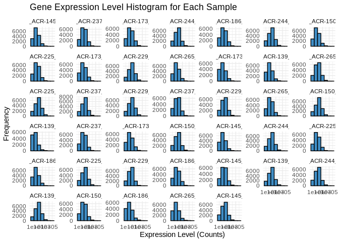<!-- -->

## 1.4 Transcript counts

First let’s check the total number of transcripts in each sample – keep
in mind this expression data has *not* been normalized yet, so there may
be different totals for each sample

``` r
# Calculate the total number of transcripts for each sample
total_transcripts <- colSums(Apul_counts_sRNA)

# Create a data frame for plotting
total_transcripts_df <- data.frame(sample = names(total_transcripts),
                                   totals = total_transcripts)

# Plot the total number of transcripts for each sample
ggplot(total_transcripts_df, aes(x = reorder(sample, totals), y = totals)) +
  geom_bar(stat = "identity", fill = "#408EC6", color = "black") +
  geom_text(aes(label = totals), vjust = -0.3, size = 3.5) + 
  labs(title = "Total Number of Transcripts per Sample",
       x = "Sample",
       y = "Total Transcripts") +
  theme_minimal() +
  theme(axis.text.x = element_text(angle = 45, hjust = 1))  # Rotate x-axis labels for readability
```

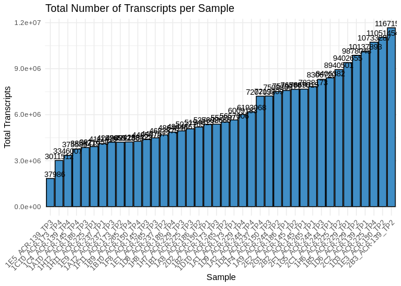<!-- -->
No glaring discrepancies/patterns

Now let’s check the number of unique transcripts in each sample – that
is, how many unique sRNAs are expressed in each sample? This should be
pretty much the same across samples, even without normalization.

``` r
# Calculate the number of unique transcripts (non-zero counts) for each sample
unique_transcripts <- colSums(Apul_counts_sRNA > 0)

# Create a data frame for plotting
unique_transcripts_df <- data.frame(sample = names(unique_transcripts),
                                    uniques = unique_transcripts)

# Plot the total number of unique transcripts for each sample
ggplot(unique_transcripts_df, aes(x = reorder(sample, uniques), y = uniques)) +
  geom_bar(stat = "identity", fill = "#408EC6", color = "black") +
  geom_text(aes(label = uniques), vjust = -0.3, size = 3.5) + 
  labs(title = "Total Number of Unique Expressed Transcripts per Sample",
       x = "Sample",
       y = "Unique Transcripts") +
  theme_minimal() +
  theme(axis.text.x = element_text(angle = 45, hjust = 1))  # Rotate x-axis labels for readability
```

<!-- -->

# 2 miRNA

## 2.1 Load miRNA metadata

The ShortStack output Results.txt includes all clusters of sRNA reads,
including those not annotated as valid miRNAs. Now that we’ve looked at
all the sRNAs a bit, let’s focus in on those classified as miRNAs.

``` r
Apul_counts_miRNA <- Apul_counts_sRNA_data_OG
coldata <- coldata_OG

# Remove excess portions of sample column names to just "sample###"
colnames(Apul_counts_miRNA) <- sub("-fastp-adapters-polyG-31bp-merged_condensed", "", colnames(Apul_counts_miRNA))

# Keep only the sRNAs ID'd as valid miRNAs
Apul_counts_miRNA <- Apul_counts_miRNA %>% filter(MIRNA == "Y")

# Keep just the counts and cluster names
Apul_counts_miRNA <- Apul_counts_miRNA %>% select(-Coords, -MIRNA)

# Make the cluster names our new row names
Apul_counts_miRNA <- Apul_counts_miRNA %>% column_to_rownames(var = "Name")

# Append colony and timepoint info to sample names
colnames(Apul_counts_miRNA) <- paste(colnames(Apul_counts_miRNA), coldata[colnames(Apul_counts_miRNA), "colony.id"], coldata[colnames(Apul_counts_miRNA), "time.point"], sep = "_")
# Make sure coldata metadata has matching rownames (for DEseq2 formatting)
rownames(coldata) <- paste(rownames(coldata), coldata$colony.id, coldata$time.point, sep = "_")

# Remove sample 1E1_ACR-265_TP3 (outlier based on PCAs of unfiltered vsd data)
# Apul_counts_miRNA <- Apul_counts_miRNA %>% select(-'1E1_ACR-265_TP3')

write.table(Apul_counts_miRNA, file = "../output/03.10-D-Apul-sRNAseq-expression-DESeq2/Apul_miRNA_ShortStack_counts_formatted.txt", sep = "\t", row.names = TRUE, col.names = TRUE, quote = FALSE)

head(Apul_counts_miRNA)
```

    ##              1A10_ACR-145_TP4 1A12_ACR-237_TP3 1A1_ACR-173_TP1 1A2_ACR-244_TP4
    ## Cluster_1819               37               35             102              77
    ## Cluster_1832              325              435            1826             947
    ## Cluster_1833               16               52              40              30
    ## Cluster_1836             1071             2048            2334            6240
    ## Cluster_1865              103              299             203             491
    ## Cluster_1950              121              179             413             421
    ##              1A8_ACR-186_TP2 1A9_ACR-244_TP2 1B10_ACR-150_TP4 1B1_ACR-225_TP3
    ## Cluster_1819              84             340               14              19
    ## Cluster_1832            1238            2174              219             580
    ## Cluster_1833               6               0                6              27
    ## Cluster_1836            8001           11364             1614            2024
    ## Cluster_1865             108            1203               86             119
    ## Cluster_1950             224             689              201             297
    ##              1B2_ACR-173_TP3 1B5_ACR-229_TP1 1B9_ACR-265_TP4 1C10_ACR-173_TP4
    ## Cluster_1819              36             204              25               18
    ## Cluster_1832             547            3544             223              235
    ## Cluster_1833              30             145               6                3
    ## Cluster_1836            1577            5523            1993              885
    ## Cluster_1865             137             753             114               56
    ## Cluster_1950             249            1345             130               79
    ##              1C4_ACR-139_TP4 1D10_ACR-265_TP2 1D3_ACR-225_TP4 1D4_ACR-237_TP4
    ## Cluster_1819              10               96              66              41
    ## Cluster_1832             211              618            2897             978
    ## Cluster_1833              13                0              82              94
    ## Cluster_1836            1073             2737           14727           10196
    ## Cluster_1865              74              503             652             337
    ## Cluster_1950              51              400            1100             269
    ##              1D6_ACR-229_TP2 1D8_ACR-237_TP2 1D9_ACR-229_TP4 1E1_ACR-265_TP3
    ## Cluster_1819             195              81              66              19
    ## Cluster_1832            2836             645            1098             265
    ## Cluster_1833              30              57              12              21
    ## Cluster_1836            8094            4832            4571            1210
    ## Cluster_1865             536             345             253             178
    ## Cluster_1950            1043             206             460             102
    ##              1E3_ACR-150_TP2 1E5_ACR-139_TP3 1E9_ACR-237_TP1 1F11_ACR-173_TP2
    ## Cluster_1819             177               2              19               88
    ## Cluster_1832            1326              45             288             1527
    ## Cluster_1833               0               0              19               24
    ## Cluster_1836            5111             747            1425             4717
    ## Cluster_1865             669              16             130              174
    ## Cluster_1950             646              18             223              247
    ##              1F4_ACR-150_TP3 1F8_ACR-145_TP3 1G5_ACR-244_TP3 1H11_ACR-225_TP1
    ## Cluster_1819              56              23              95               18
    ## Cluster_1832             757             214            2749              610
    ## Cluster_1833              12               7               0               20
    ## Cluster_1836            3174            1026            4302             1059
    ## Cluster_1865             454              53            1140              157
    ## Cluster_1950             280             101             707              384
    ##              1H12_ACR-186_TP3 1H6_ACR-225_TP2 1H7_ACR-229_TP3 1H8_ACR-186_TP4
    ## Cluster_1819               33              47              50              28
    ## Cluster_1832              439            1714             805             873
    ## Cluster_1833               11              38              11              42
    ## Cluster_1836             1636            6727            2155            1625
    ## Cluster_1865               38             602             217              87
    ## Cluster_1950              147             666             360             421
    ##              2B2_ACR-145_TP1 2B3_ACR-139_TP2 2C1_ACR-244_TP1 2C2_ACR-139_TP1
    ## Cluster_1819              44              68              57              50
    ## Cluster_1832             232            1769             788            1115
    ## Cluster_1833               0              18              53              24
    ## Cluster_1836            1266            5844            2033            2926
    ## Cluster_1865             139             204             344             380
    ## Cluster_1950             290             657             370             450
    ##              2D2_ACR-150_TP1 2E2_ACR-186_TP1 2F1_ACR-265_TP1 2G1_ACR-145_TP2
    ## Cluster_1819              22              24              16              62
    ## Cluster_1832             144             211             171            1032
    ## Cluster_1833               4               0               0              27
    ## Cluster_1836            1267            1729             656            8817
    ## Cluster_1865              94               7              34             324
    ## Cluster_1950             127              63              67             255

## 2.2 Expression levels

Plot histograms of the expression levels in each sample

``` r
# Melt the count matrix into long format
Apul_counts_miRNA_melted <- melt(Apul_counts_miRNA, variable.name = "sample", value.name = "counts")
```

    ## No id variables; using all as measure variables

``` r
# Plot the expression level histograms for each sample
ggplot(Apul_counts_miRNA_melted, aes(x = counts)) +
  geom_histogram(binwidth = 1, fill = "#408EC6", color = "black") +
  scale_x_log10() +  # Optional: Log-transform the x-axis for better visualization
  facet_wrap(~sample, scales = "free_y") +
  labs(title = "miRNA Expression Level Histogram for Each Sample",
       x = "Expression Level (Counts)",
       y = "Frequency") +
  theme_minimal()
```

    ## Warning in scale_x_log10(): log-10 transformation introduced infinite values.

    ## Warning: Removed 159 rows containing non-finite outside the scale range
    ## (`stat_bin()`).

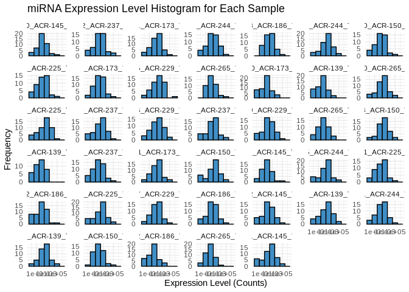<!-- -->

## 2.3 miRNA counts

First let’s check the total number of miRNAs in each sample – keep in
mind this expression data has *not* been normalized yet, so there may be
different totals for each sample

``` r
# Calculate the total number of transcripts for each sample
total_miRNA <- colSums(Apul_counts_miRNA)

# Create a data frame for plotting
total_miRNA_df <- data.frame(sample = names(total_miRNA),
                                   totals = total_miRNA)

# Plot the total number of transcripts for each sample
ggplot(total_miRNA_df, aes(x = reorder(sample, totals), y = totals)) +
  geom_bar(stat = "identity", fill = "#408EC6", color = "black") +
  geom_text(aes(label = totals), vjust = -0.3, size = 3.5) + 
  labs(title = "Total Number of miRNAs per Sample",
       x = "Sample",
       y = "Total miRNAs") +
  theme_minimal() +
  theme(axis.text.x = element_text(angle = 45, hjust = 1))  # Rotate x-axis labels for readability
```

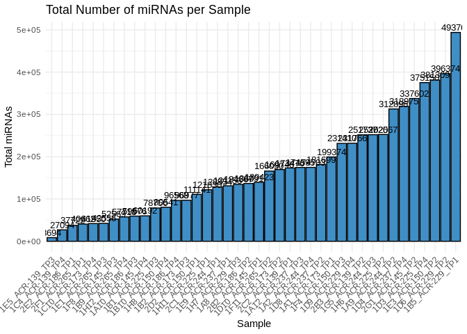<!-- -->

Now let’s check the number of unique miRNAs in each sample – This should
be pretty much the same across samples, even without normalization.

``` r
# Calculate the number of unique transcripts (non-zero counts) for each sample
unique_miRNA <- colSums(Apul_counts_miRNA > 0)

# Create a data frame for plotting
unique_miRNA_df <- data.frame(sample = names(unique_miRNA),
                                    uniques = unique_miRNA)

# Plot the total number of unique transcripts for each sample
ggplot(unique_miRNA_df, aes(x = reorder(sample, uniques), y = uniques)) +
  geom_bar(stat = "identity", fill = "#408EC6", color = "black") +
  geom_text(aes(label = uniques), vjust = -0.3, size = 3.5) + 
  labs(title = "Total Number of Unique Expressed miRNAs per Sample",
       x = "Sample",
       y = "Unique miRNA") +
  theme_minimal() +
  theme(axis.text.x = element_text(angle = 45, hjust = 1))  # Rotate x-axis labels for readability
```

<!-- -->

## 2.4 Heatmap

``` r
pheatmap(Apul_counts_miRNA,
         cluster_rows = TRUE,
         cluster_cols = TRUE,
         show_rownames = TRUE,
         show_colnames = TRUE,
         color = colorRampPalette(c("blue", "white", "red"))(50),
         fontsize_row = 8,
         fontsize_col = 8)
```

    ## Warning: The input is a data frame, convert it to the matrix.

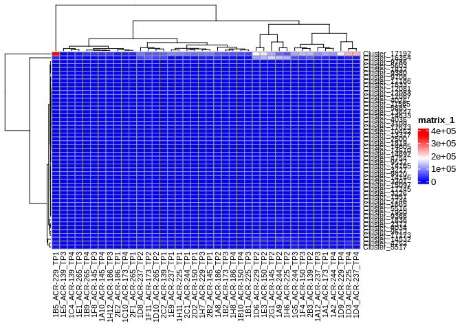<!-- -->
Well… there’s like 2 miRNAs with much higher expression than the others,
which is making visualizing relative differences difficult. Let’s redo
the heatmap, normalizing each row to view relative difference in
expression between samples (`scale='row'`)

``` r
pheatmap(Apul_counts_miRNA,
         cluster_rows = TRUE,
         cluster_cols = TRUE,
         show_rownames = TRUE,
         show_colnames = TRUE,
         scale = 'row',
         color = colorRampPalette(c("blue", "white", "red"))(50),
         fontsize_row = 8,
         fontsize_col = 8)
```

    ## Warning: The input is a data frame, convert it to the matrix.

<!-- -->

# 3 siRNA

ShortStack’s primary purpose is to identify miRNAs from sRNA-seq data,
but it also automatically annotates siRNA loci! Since siRNA potentially
play an important role in transposon silencing in invertebrates, we
should generate count matrices for siRNAs as well.

We can see clusters annotated as siRNAs in the `Results.gff3` output
file of ShortStack (sRNA ID shown in the 3rd column)

``` r
Apul_Resultsgff <- read.table("../output/04-Apul-sRNA-discovery-ShortStack/ShortStack_out/Results.gff3")
# Separate last column info into multiple columns for filtering
Apul_Resultsgff <- Apul_Resultsgff %>%
  separate(V9, into = c("Name", "DicerCall", "MIRNA"), sep = ";") %>%
  mutate(Name = sub("ID=", "", Name),
         DicerCall = sub("DicerCall=", "", DicerCall),
         MIRNA = sub("MIRNA=", "", MIRNA))
```

    ## Warning: Expected 3 pieces. Missing pieces filled with `NA` in 102 rows [1820, 1821,
    ## 1835, 1836, 1838, 1839, 1843, 1844, 1874, 1875, 1961, 1962, 1964, 1965, 2387,
    ## 2388, 2517, 2518, 2765, 2766, ...].

``` r
head(Apul_Resultsgff)
```

    ##         V1         V2                 V3    V4    V5   V6 V7 V8      Name
    ## 1 ntLink_7 ShortStack Unknown_sRNA_locus  3054  3472  625  -  . Cluster_1
    ## 2 ntLink_7 ShortStack Unknown_sRNA_locus  9758 10311 2797  +  . Cluster_2
    ## 3 ntLink_7 ShortStack Unknown_sRNA_locus 22562 22980  634  -  . Cluster_3
    ## 4 ntLink_7 ShortStack Unknown_sRNA_locus 29267 29820 2881  +  . Cluster_4
    ## 5 ntLink_7 ShortStack Unknown_sRNA_locus 42050 42468  689  -  . Cluster_5
    ## 6 ntLink_7 ShortStack Unknown_sRNA_locus 43122 43556 1774  -  . Cluster_6
    ##   DicerCall MIRNA
    ## 1         N     N
    ## 2         N     N
    ## 3         N     N
    ## 4         N     N
    ## 5         N     N
    ## 6         N     N

``` r
# keep just the sRNA category column (V3), and the cluster names (Name)
# filter to only keep clusters ID'd as siRNAs
Apul_siRNA_clusters <- Apul_Resultsgff %>%
  select(V3, Name) %>%
  filter(str_detect(V3, regex("siRNA")))
head(Apul_siRNA_clusters)
```

    ##              V3         Name
    ## 1 siRNA23_locus   Cluster_74
    ## 2 siRNA23_locus  Cluster_232
    ## 3 siRNA23_locus  Cluster_238
    ## 4 siRNA23_locus  Cluster_938
    ## 5 siRNA24_locus  Cluster_967
    ## 6 siRNA21_locus Cluster_1810

``` r
# Now use this list of clusters ID'd as siRNAs to filter our sRNA count matrix
# keep only the sample counts and cluster names
Apul_counts_sRNA <- rownames_to_column(Apul_counts_sRNA, var = "Name")
Apul_counts_siRNA <- left_join(Apul_siRNA_clusters, Apul_counts_sRNA, by = c("Name" = "Name")) %>%
  select(-V3)

# convert the column of cluster names into the df row names
Apul_counts_sRNA <- Apul_counts_sRNA %>% column_to_rownames(var="Name")
Apul_counts_siRNA <- Apul_counts_siRNA %>% column_to_rownames(var="Name")

head(Apul_counts_siRNA)
```

    ##              1A10_ACR-145_TP4 1A12_ACR-237_TP3 1A1_ACR-173_TP1 1A2_ACR-244_TP4
    ## Cluster_74                  8                3              29              10
    ## Cluster_232                 0                3              11              15
    ## Cluster_238                 0                5              11              16
    ## Cluster_938                 2                3               1               1
    ## Cluster_967                14               15              22              18
    ## Cluster_1810               10               20              37              14
    ##              1A8_ACR-186_TP2 1A9_ACR-244_TP2 1B10_ACR-150_TP4 1B1_ACR-225_TP3
    ## Cluster_74                 0              19                1              28
    ## Cluster_232                6              62                0               0
    ## Cluster_238                5              68                2               0
    ## Cluster_938               60              29                0               0
    ## Cluster_967               29              26               10               6
    ## Cluster_1810              56             131               25              10
    ##              1B2_ACR-173_TP3 1B5_ACR-229_TP1 1B9_ACR-265_TP4 1C10_ACR-173_TP4
    ## Cluster_74                 8              65               9                4
    ## Cluster_232               11               1               0                3
    ## Cluster_238               12               1               0                3
    ## Cluster_938                1              17               0                2
    ## Cluster_967                9              57              13               10
    ## Cluster_1810              11              91               8                4
    ##              1C4_ACR-139_TP4 1D10_ACR-265_TP2 1D3_ACR-225_TP4 1D4_ACR-237_TP4
    ## Cluster_74                 2                7             272              22
    ## Cluster_232               30                1               0               6
    ## Cluster_238               31                0               1               7
    ## Cluster_938                1               19              13               5
    ## Cluster_967                7               24              62              17
    ## Cluster_1810               8               72              43              30
    ##              1D6_ACR-229_TP2 1D8_ACR-237_TP2 1D9_ACR-229_TP4 1E1_ACR-265_TP3
    ## Cluster_74                33               7              27               2
    ## Cluster_232                1               8               1               0
    ## Cluster_238                1               9               1               0
    ## Cluster_938              116               8               2               2
    ## Cluster_967               40              17              13              14
    ## Cluster_1810              84              54              21               8
    ##              1E3_ACR-150_TP2 1E5_ACR-139_TP3 1E9_ACR-237_TP1 1F11_ACR-173_TP2
    ## Cluster_74                12               1               4               10
    ## Cluster_232                0              10               1               14
    ## Cluster_238                0               9               1               11
    ## Cluster_938              207               0               3                3
    ## Cluster_967               59               4               8               17
    ## Cluster_1810             111               3              27               53
    ##              1F4_ACR-150_TP3 1F8_ACR-145_TP3 1G5_ACR-244_TP3 1H11_ACR-225_TP1
    ## Cluster_74                 8               2              19               37
    ## Cluster_232                4               0              26                0
    ## Cluster_238                4               0              27                0
    ## Cluster_938               11               2               8                2
    ## Cluster_967               11               8              39               20
    ## Cluster_1810              42              15              30               22
    ##              1H12_ACR-186_TP3 1H6_ACR-225_TP2 1H7_ACR-229_TP3 1H8_ACR-186_TP4
    ## Cluster_74                  7              66              12              10
    ## Cluster_232                 1               0               3               2
    ## Cluster_238                 1               0               2               3
    ## Cluster_938                 1              21               5              13
    ## Cluster_967                 8              27               8              26
    ## Cluster_1810                5              66              32              18
    ##              2B2_ACR-145_TP1 2B3_ACR-139_TP2 2C1_ACR-244_TP1 2C2_ACR-139_TP1
    ## Cluster_74                10              23              29              21
    ## Cluster_232                1             126              15             205
    ## Cluster_238                0             124              16             203
    ## Cluster_938                2              13               4               5
    ## Cluster_967               38              45              24              41
    ## Cluster_1810              27              98              28              42
    ##              2D2_ACR-150_TP1 2E2_ACR-186_TP1 2F1_ACR-265_TP1 2G1_ACR-145_TP2
    ## Cluster_74                 4               8               3               5
    ## Cluster_232                6               1               0               4
    ## Cluster_238                6               1               0               5
    ## Cluster_938                1               2               1              22
    ## Cluster_967                5               9               5              21
    ## Cluster_1810               9               8               6              49

``` r
write.table(Apul_counts_siRNA, file = "../output/03.10-D-Apul-sRNAseq-expression-DESeq2/Apul_siRNA_ShortStack_counts_formatted.txt", sep = "\t", row.names = TRUE, col.names = TRUE, quote = FALSE)
```

## 3.1 Expression levels

Plot histograms of the expression levels in each sample

``` r
# Melt the count matrix into long format
Apul_counts_siRNA_melted <- melt(Apul_counts_siRNA, variable.name = "sample", value.name = "counts")
```

    ## No id variables; using all as measure variables

``` r
# Plot the expression level histograms for each sample
ggplot(Apul_counts_siRNA_melted, aes(x = counts)) +
  geom_histogram(binwidth = 1, fill = "#408EC6", color = "black") +
  scale_x_log10() +  # Optional: Log-transform the x-axis for better visualization
  facet_wrap(~sample, scales = "free_y") +
  labs(title = "siRNA Expression Level Histogram for Each Sample",
       x = "Expression Level (Counts)",
       y = "Frequency") +
  theme_minimal()
```

    ## Warning in scale_x_log10(): log-10 transformation introduced infinite values.

    ## Warning: Removed 372 rows containing non-finite outside the scale range
    ## (`stat_bin()`).

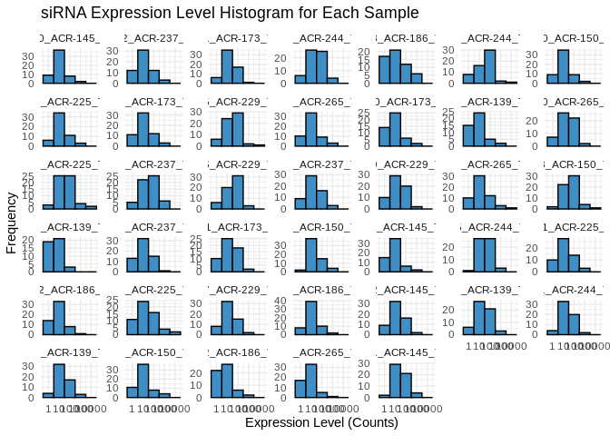<!-- -->

## 3.2 siRNA counts

First let’s check the total number of siRNAs in each sample – keep in
mind this expression data has *not* been normalized yet, so there may be
different totals for each sample

``` r
# Calculate the total number of transcripts for each sample
total_siRNA <- colSums(Apul_counts_siRNA)

# Create a data frame for plotting
total_siRNA_df <- data.frame(sample = names(total_siRNA),
                                   totals = total_siRNA)

# Plot the total number of transcripts for each sample
ggplot(total_siRNA_df, aes(x = reorder(sample, totals), y = totals)) +
  geom_bar(stat = "identity", fill = "#408EC6", color = "black") +
  geom_text(aes(label = totals), vjust = -0.3, size = 3.5) + 
  labs(title = "Total Number of siRNAs per Sample",
       x = "Sample",
       y = "Total siRNAs") +
  theme_minimal() +
  theme(axis.text.x = element_text(angle = 45, hjust = 1))  # Rotate x-axis labels for readability
```

<!-- -->
All of the TP2s seem to have higher \#s, but since this isn’t normalized
I don’t want to put too much stock in that

Now let’s check the number of unique siRNAs in each sample – This should
be pretty much the same across samples, even without normalization.

``` r
# Calculate the number of unique transcripts (non-zero counts) for each sample
unique_siRNA <- colSums(Apul_counts_siRNA > 0)

# Create a data frame for plotting
unique_siRNA_df <- data.frame(sample = names(unique_siRNA),
                                    uniques = unique_siRNA)

# Plot the total number of unique transcripts for each sample
ggplot(unique_siRNA_df, aes(x = reorder(sample, uniques), y = uniques)) +
  geom_bar(stat = "identity", fill = "#408EC6", color = "black") +
  geom_text(aes(label = uniques), vjust = -0.3, size = 3.5) + 
  labs(title = "Total Number of Unique Expressed siRNAs per Sample",
       x = "Sample",
       y = "Unique siRNA") +
  theme_minimal() +
  theme(axis.text.x = element_text(angle = 45, hjust = 1))  # Rotate x-axis labels for readability
```

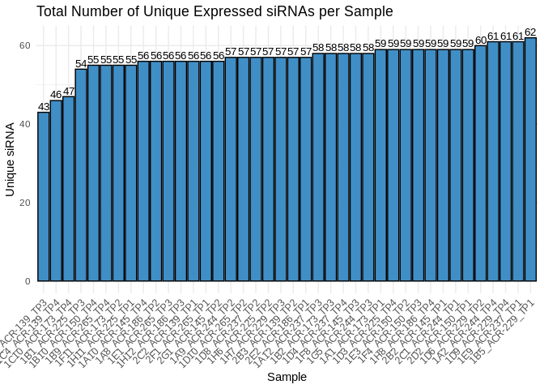<!-- -->

## 3.3 Heatmap

``` r
pheatmap(Apul_counts_siRNA,
         cluster_rows = TRUE,
         cluster_cols = TRUE,
         show_rownames = TRUE,
         show_colnames = TRUE,
         color = colorRampPalette(c("blue", "white", "red"))(50),
         fontsize_row = 8,
         fontsize_col = 8)
```

    ## Warning: The input is a data frame, convert it to the matrix.

<!-- -->

``` r
pheatmap(Apul_counts_siRNA,
         cluster_rows = TRUE,
         cluster_cols = TRUE,
         show_rownames = TRUE,
         show_colnames = TRUE,
         scale = 'row',
         color = colorRampPalette(c("blue", "white", "red"))(50),
         fontsize_row = 8,
         fontsize_col = 8)
```

    ## Warning: The input is a data frame, convert it to the matrix.

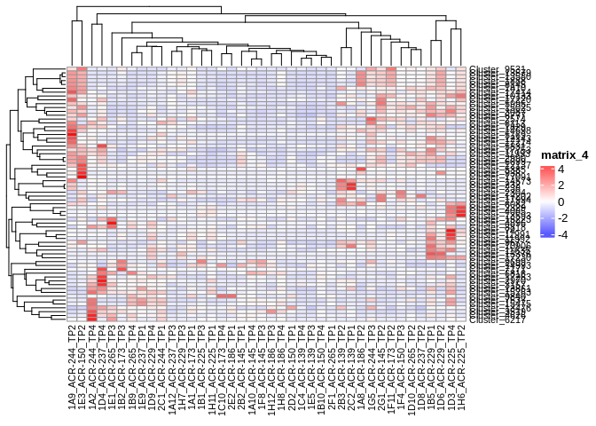<!-- -->

# 4 ………..

# 5 Normalized sRNA counts

## 5.1 Normalize counts with DESeq2

### 5.1.1 Metadata

DESeq2 requires a metadata data frame as input – we’ll use the coldata
we’ve already formatted

``` r
head(coldata)
```

    ##                  time.point colony.id
    ## 1A1_ACR-173_TP1         TP1   ACR-173
    ## 1A10_ACR-145_TP4        TP4   ACR-145
    ## 1A12_ACR-237_TP3        TP3   ACR-237
    ## 1A2_ACR-244_TP4         TP4   ACR-244
    ## 1A8_ACR-186_TP2         TP2   ACR-186
    ## 1A9_ACR-244_TP2         TP2   ACR-244

### 5.1.2 DESeq object

## 5.2 Verify rownames match

``` r
# Remove outlier sample from the coldata, so that metadata and counts data columns will match for DESeq
# coldata <- coldata[!(rownames(coldata) %in% "1E1_ACR-265_TP3"), ]

# Alphabetize rownames of coldata and colnames of Apul_counts_sRNA
coldata <- coldata[order(rownames(coldata)), ]
Apul_counts_sRNA <- Apul_counts_sRNA[, order(colnames(Apul_counts_sRNA))]

all(rownames(coldata) == colnames(Apul_counts_sRNA))
```

    ## [1] TRUE

# 6 Create DESeq2 data set

``` r
dds_Apul_sRNA <- DESeqDataSetFromMatrix(countData = Apul_counts_sRNA,
                              colData = coldata,
                              design = ~ time.point + colony.id)
```

    ## converting counts to integer mode

    ## Warning in DESeqDataSet(se, design = design, ignoreRank): some variables in
    ## design formula are characters, converting to factors

    ##   Note: levels of factors in the design contain characters other than
    ##   letters, numbers, '_' and '.'. It is recommended (but not required) to use
    ##   only letters, numbers, and delimiters '_' or '.', as these are safe characters
    ##   for column names in R. [This is a message, not a warning or an error]

``` r
dds_Apul_sRNA
```

    ## class: DESeqDataSet 
    ## dim: 18885 40 
    ## metadata(1): version
    ## assays(1): counts
    ## rownames(18885): Cluster_1 Cluster_2 ... Cluster_18884 Cluster_18885
    ## rowData names(0):
    ## colnames(40): 1A1_ACR-173_TP1 1A10_ACR-145_TP4 ... 2F1_ACR-265_TP1
    ##   2G1_ACR-145_TP2
    ## colData names(2): time.point colony.id

``` r
dds_Apul_sRNA$time.point <- factor(dds_Apul_sRNA$time.point, levels = c("TP1","TP2", "TP3", "TP4"))

dds_Apul_sRNA <- DESeq(dds_Apul_sRNA)
```

    ## estimating size factors

    ##   Note: levels of factors in the design contain characters other than
    ##   letters, numbers, '_' and '.'. It is recommended (but not required) to use
    ##   only letters, numbers, and delimiters '_' or '.', as these are safe characters
    ##   for column names in R. [This is a message, not a warning or an error]

    ## estimating dispersions

    ## gene-wise dispersion estimates

    ## mean-dispersion relationship

    ##   Note: levels of factors in the design contain characters other than
    ##   letters, numbers, '_' and '.'. It is recommended (but not required) to use
    ##   only letters, numbers, and delimiters '_' or '.', as these are safe characters
    ##   for column names in R. [This is a message, not a warning or an error]

    ## final dispersion estimates

    ##   Note: levels of factors in the design contain characters other than
    ##   letters, numbers, '_' and '.'. It is recommended (but not required) to use
    ##   only letters, numbers, and delimiters '_' or '.', as these are safe characters
    ##   for column names in R. [This is a message, not a warning or an error]

    ## fitting model and testing

## 6.1 Pairwise results tables

``` r
# Define the output directory path
output_dir <- "../output/03.10-D-Apul-sRNAseq-expression-DESeq2/"

# Set desired false discovery rate threshold (i.e. adjusted p-value, padj)
fdr <- 0.05

# Set log2 fold change threshold (a value of '1' is equal to a fold change of '2')
log2fc <- 1

sRNA_tp1.v.tp2.results <- results(dds_Apul_sRNA, contrast=c("time.point","TP1","TP2"), alpha = fdr, lfcThreshold = log2fc)
sRNA_tp1.v.tp3.results <- results(dds_Apul_sRNA, contrast=c("time.point","TP1","TP3"), alpha = fdr, lfcThreshold = log2fc)
sRNA_tp1.v.tp4.results <- results(dds_Apul_sRNA, contrast=c("time.point","TP1","TP4"), alpha = fdr, lfcThreshold = log2fc)
sRNA_tp2.v.tp3.results <- results(dds_Apul_sRNA, contrast=c("time.point","TP2","TP3"), alpha = fdr, lfcThreshold = log2fc)
sRNA_tp2.v.tp4.results <- results(dds_Apul_sRNA, contrast=c("time.point","TP2","TP4"), alpha = fdr, lfcThreshold = log2fc)
sRNA_tp3.v.tp4.results <- results(dds_Apul_sRNA, contrast=c("time.point","TP3","TP4"), alpha = fdr, lfcThreshold = log2fc)

sRNA_tp2.v.tp4.results
```

    ## log2 fold change (MLE): time.point TP2 vs TP4 
    ## Wald test p-value: time.point TP2 vs TP4 
    ## DataFrame with 18885 rows and 6 columns
    ##                baseMean log2FoldChange     lfcSE      stat    pvalue      padj
    ##               <numeric>      <numeric> <numeric> <numeric> <numeric> <numeric>
    ## Cluster_1       13.0128      0.7818140  0.432541  0.000000  1.000000         1
    ## Cluster_2       55.8529      1.3487948  0.466752  0.747280  0.454894         1
    ## Cluster_3       13.5530      0.1447121  0.381801  0.000000  1.000000         1
    ## Cluster_4       57.1718      1.0440902  0.416307  0.105908  0.915655         1
    ## Cluster_5       13.4828      0.0805211  0.634008  0.000000  1.000000         1
    ## ...                 ...            ...       ...       ...       ...       ...
    ## Cluster_18881   20.5241      0.0824002  0.302947 0.0000000  1.000000         1
    ## Cluster_18882   13.3871      0.6283925  0.673831 0.0000000  1.000000         1
    ## Cluster_18883  170.0788      1.0252319  0.567332 0.0444746  0.964526         1
    ## Cluster_18884  205.3327     -0.7523888  0.550953 0.0000000  1.000000         1
    ## Cluster_18885  195.5333     -0.8148397  0.540692 0.0000000  1.000000         1

``` r
summary(sRNA_tp2.v.tp4.results)
```

    ## 
    ## out of 18885 with nonzero total read count
    ## adjusted p-value < 0.05
    ## LFC > 1.00 (up)    : 16, 0.085%
    ## LFC < -1.00 (down) : 199, 1.1%
    ## outliers [1]       : 0, 0%
    ## low counts [2]     : 0, 0%
    ## (mean count < 0)
    ## [1] see 'cooksCutoff' argument of ?results
    ## [2] see 'independentFiltering' argument of ?results

``` r
table(sRNA_tp2.v.tp4.results$padj < 0.05)
```

    ## 
    ## FALSE  TRUE 
    ## 18670   215

Write DDS results tables to CSVs

``` r
# Create a named list of the data frames
results_list <- list(
  sRNA_tp1.v.tp2.results = sRNA_tp1.v.tp2.results,
  sRNA_tp1.v.tp3.results = sRNA_tp1.v.tp3.results,
  sRNA_tp1.v.tp4.results = sRNA_tp1.v.tp4.results,
  sRNA_tp2.v.tp3.results = sRNA_tp2.v.tp3.results,
  sRNA_tp2.v.tp4.results = sRNA_tp2.v.tp4.results,
  sRNA_tp3.v.tp4.results = sRNA_tp3.v.tp4.results
)

# Loop through the list and write each data frame to a CSV file in the specified directory
for (df_name in names(results_list)) {
  write.csv(results_list[[df_name]], file = paste0(output_dir, df_name, ".table.csv"), row.names = TRUE, quote = FALSE)
}
```

## 6.2 Normalizations

It’s worth noting here that I’m actually going to be doing two different
types of transformation on the counts data, which serve different
purposes.

- First is **normalizing** the transcript counts, which adjusts for
  differences in library size or sequencing depth, but retains
  count-like properties. Normalized counts are most useful for things
  like visualizing expression levels and differential expression
  analysis.

- Second is **variance stabilizing** the counts data, which aims to make
  the variance of the transformed data approximately independent of the
  mean, reducing heteroscedasticity (the relationship between variance
  and mean) and “smoothing” out the variance at low counts. Notably, the
  transformed data is *no longer on the original count scale*. The
  transformation makes the variance roughly constant across the range of
  counts, which makes it easier to interpret patterns in the data
  visually. Variance stabilized data is most useful for exploratory data
  analysis, like PCA, clustering, and heatmaps, and is also the
  transformation we’ll want to use before WGCNA.

``` r
# extract normalized counts
# (normalization is automatically performed by deseq2)
Apul_counts_sRNA_norm <- counts(dds_Apul_sRNA, normalized=TRUE) %>% data.frame()

write.table(Apul_counts_sRNA_norm, file = "../output/03.10-D-Apul-sRNAseq-expression-DESeq2/Apul_counts_sRNA_normalized.txt", sep = "\t", row.names = TRUE, col.names = TRUE, quote = FALSE)


# variance stabilized data
vsd_Apul_sRNA <- varianceStabilizingTransformation(dds_Apul_sRNA, blind=TRUE)
wpn_vsd_Apul_sRNA <- getVarianceStabilizedData(dds_Apul_sRNA)
rv_wpn_Apul_sRNA <- rowVars(wpn_vsd_Apul_sRNA, useNames=TRUE)

Apul_counts_sRNA_vsd <- data.frame(wpn_vsd_Apul_sRNA)
write.table(Apul_counts_sRNA_vsd, file = "../output/03.10-D-Apul-sRNAseq-expression-DESeq2/Apul_counts_sRNA_variancestabilized.txt", sep = "\t", row.names = TRUE, col.names = TRUE,quote = FALSE)

q75_wpn_Apul_sRNA <- quantile(rowVars(wpn_vsd_Apul_sRNA, useNames=TRUE), .75)  # 75th quantile variability
Apul_counts_sRNA_vsd_q75 <- wpn_vsd_Apul_sRNA[ rv_wpn_Apul_sRNA > q75_wpn_Apul_sRNA, ] %>% data.frame # filter to retain only the most variable genes
write.table(Apul_counts_sRNA_vsd_q75, file = "../output/03.10-D-Apul-sRNAseq-expression-DESeq2/Apul_counts_sRNA_variancestabilized_q75.txt", sep = "\t", row.names = TRUE, col.names = TRUE,quote = FALSE)

q95_wpn_Apul_sRNA <- quantile(rowVars(wpn_vsd_Apul_sRNA, useNames=TRUE), .95)  # 95th quantile variability
Apul_counts_sRNA_vsd_q95 <- wpn_vsd_Apul_sRNA[ rv_wpn_Apul_sRNA > q95_wpn_Apul_sRNA, ] %>% data.frame # filter to retain only the most variable genes
write.table(Apul_counts_sRNA_vsd_q95, file = "../output/03.10-D-Apul-sRNAseq-expression-DESeq2/Apul_counts_sRNA_variancestabilized_q95.txt", sep = "\t", row.names = TRUE, col.names = TRUE,quote = FALSE)
```

## 6.3 Plot normalized data

``` r
Apul_counts_sRNA_norm_long <- Apul_counts_sRNA_norm %>%
  mutate(
    Gene_id = row.names(Apul_counts_sRNA_norm)
  ) %>%
  pivot_longer(-Gene_id)

Apul_counts_sRNA_norm_long %>%
  ggplot(., aes(x = name, y = value)) +
  geom_violin() +
  geom_point() +
  theme_bw() +
  theme(
    axis.text.x = element_text( angle = 90)
  ) +
  ylim(0, NA) +
  labs(
    title = "Normalized Expression",
    x = "Sample",
    y = "Normalized counts"
  )
```

<!-- -->

## 6.4 Plot variance stabilized data

``` r
Apul_counts_sRNA_vsd_long <- Apul_counts_sRNA_vsd %>%
  mutate(
    Gene_id = row.names(Apul_counts_sRNA_vsd)
  ) %>%
  pivot_longer(-Gene_id)

Apul_counts_sRNA_vsd_long %>%
  ggplot(., aes(x = name, y = value)) +
  geom_violin() +
  geom_point() +
  theme_bw() +
  theme(
    axis.text.x = element_text( angle = 90)
  ) +
  ylim(0, NA) +
  labs(
    title = "Variance Stabilized Expression",
    x = "Sample",
    y = "Variance stabilized data"
  )
```

<!-- -->

## 6.5 Normalized expression levels

Plot histograms of the normalized expression levels in each sample

``` r
# Melt the count matrix into long format
Apul_counts_norm_melted <- melt(Apul_counts_sRNA_norm, variable.name = "sample", value.name = "counts")
```

    ## No id variables; using all as measure variables

``` r
# Plot the expression level histograms for each sample
ggplot(Apul_counts_norm_melted, aes(x = counts)) +
  geom_histogram(binwidth = 1, fill = "#408EC6", color = "black") +
  scale_x_log10() +  # Optional: Log-transform the x-axis for better visualization
  facet_wrap(~sample, scales = "free_y") +
  labs(title = "Gene Expression Level Histogram for Each Sample",
       x = "Expression Level (Counts)",
       y = "Frequency") +
  theme_minimal()
```

    ## Warning in scale_x_log10(): log-10 transformation introduced infinite values.

    ## Warning: Removed 99729 rows containing non-finite outside the scale range
    ## (`stat_bin()`).

<!-- -->

## 6.6 Normalized transcript counts

Check the total number of transcripts in each sample – now that we’ve
normalized the data these totals should be similar

``` r
# Calculate the total number of transcripts for each sample
total_transcripts_norm <- colSums(Apul_counts_sRNA_norm)

# Create a data frame for plotting
total_transcripts_norm_df <- data.frame(sample = names(total_transcripts_norm),
                                   totals = total_transcripts_norm)

# Plot the total number of transcripts for each sample
ggplot(total_transcripts_norm_df, aes(x = reorder(sample, totals), y = totals)) +
  geom_bar(stat = "identity", fill = "#408EC6", color = "black") +
  geom_text(aes(label = totals), vjust = -0.3, size = 3.5) +
  labs(title = "Total Number of Transcripts per Sample",
       x = "Sample",
       y = "Total Transcripts") +
  theme_minimal() +
  theme(axis.text.x = element_text(angle = 45, hjust = 1))  # Rotate x-axis labels for readability
```

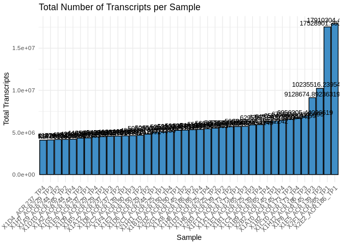<!-- -->

## 6.7 PCA of variance stabilized data

``` r
plotPCA(vsd_Apul_sRNA, intgroup="time.point")
```

<!-- -->

``` r
plotPCA(vsd_Apul_sRNA, intgroup="colony.id")
```

<!-- -->
Samples are strongly clustering by colony. Interestingly time point
doesn’t appear to influence clustering.

## 6.8 Sample clustering

``` r
sample_dists <- dist(t(assay(vsd_Apul_sRNA)))
pheatmap(as.matrix(sample_dists), 
         clustering_distance_rows = "euclidean", 
         clustering_distance_cols = "euclidean", 
         main="Sample Clustering")
```

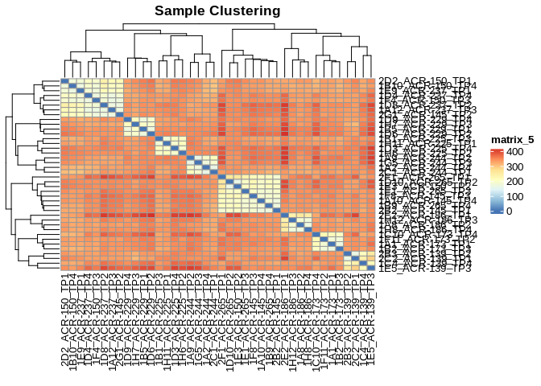<!-- -->
Samples are strongly clustering by colony.

## 6.9 Heatmaps

Of most variable variance stabilized sRNA transcripts

``` r
# 75th quantile
heat_colors <- rev(brewer.pal(12, "RdYlBu"))
```

    ## Warning in brewer.pal(12, "RdYlBu"): n too large, allowed maximum for palette RdYlBu is 11
    ## Returning the palette you asked for with that many colors

``` r
pheatmap(Apul_counts_sRNA_vsd_q75, 
         cluster_rows = TRUE,
         cluster_cols = TRUE,
         show_rownames = TRUE,
         show_colnames = TRUE,
         color = heat_colors,
         scale="row")
```

    ## Warning: The input is a data frame, convert it to the matrix.

    ## `use_raster` is automatically set to TRUE for a matrix with more than
    ## 2000 rows. You can control `use_raster` argument by explicitly setting
    ## TRUE/FALSE to it.
    ## 
    ## Set `ht_opt$message = FALSE` to turn off this message.

    ## 'magick' package is suggested to install to give better rasterization.
    ## 
    ## Set `ht_opt$message = FALSE` to turn off this message.

<!-- -->

``` r
# 95th quantile
pheatmap(Apul_counts_sRNA_vsd_q95, 
         cluster_rows = TRUE,
         cluster_cols = TRUE,
         show_rownames = TRUE,
         show_colnames = TRUE,
         color = heat_colors,
         scale="row")
```

    ## Warning: The input is a data frame, convert it to the matrix.

<!-- -->

# 7 Normalized miRNA counts

## 7.1 Normalize counts with DESeq2

### 7.1.1 Metadata

DESeq2 requires a metadata data frame as input – we’ll use the coldata
we’ve already formatted

``` r
head(coldata)
```

    ##                  time.point colony.id
    ## 1A1_ACR-173_TP1         TP1   ACR-173
    ## 1A10_ACR-145_TP4        TP4   ACR-145
    ## 1A12_ACR-237_TP3        TP3   ACR-237
    ## 1A2_ACR-244_TP4         TP4   ACR-244
    ## 1A8_ACR-186_TP2         TP2   ACR-186
    ## 1A9_ACR-244_TP2         TP2   ACR-244

### 7.1.2 DESeq object

## 7.2 Verify rownames match

``` r
# Alphabetize rownames of coldata and colnames of Apul_counts_miRNA
coldata <- coldata[order(rownames(coldata)), ]
Apul_counts_miRNA <- Apul_counts_miRNA[, order(colnames(Apul_counts_miRNA))]

all(rownames(coldata) == colnames(Apul_counts_miRNA))
```

    ## [1] TRUE

# 8 Create DESeq2 data set

``` r
dds_Apul_miRNA <- DESeqDataSetFromMatrix(countData = Apul_counts_miRNA,
                              colData = coldata,
                              design = ~ time.point + colony.id)
```

    ## converting counts to integer mode

    ## Warning in DESeqDataSet(se, design = design, ignoreRank): some variables in
    ## design formula are characters, converting to factors

    ##   Note: levels of factors in the design contain characters other than
    ##   letters, numbers, '_' and '.'. It is recommended (but not required) to use
    ##   only letters, numbers, and delimiters '_' or '.', as these are safe characters
    ##   for column names in R. [This is a message, not a warning or an error]

``` r
dds_Apul_miRNA
```

    ## class: DESeqDataSet 
    ## dim: 51 39 
    ## metadata(1): version
    ## assays(1): counts
    ## rownames(51): Cluster_1819 Cluster_1832 ... Cluster_17245 Cluster_17623
    ## rowData names(0):
    ## colnames(39): 1A1_ACR-173_TP1 1A10_ACR-145_TP4 ... 2F1_ACR-265_TP1
    ##   2G1_ACR-145_TP2
    ## colData names(2): time.point colony.id

``` r
dds_Apul_miRNA$time.point <- factor(dds_Apul_miRNA$time.point, levels = c("TP1","TP2", "TP3", "TP4"))

dds_Apul_miRNA <- DESeq(dds_Apul_miRNA)
```

    ## estimating size factors

    ##   Note: levels of factors in the design contain characters other than
    ##   letters, numbers, '_' and '.'. It is recommended (but not required) to use
    ##   only letters, numbers, and delimiters '_' or '.', as these are safe characters
    ##   for column names in R. [This is a message, not a warning or an error]

    ## estimating dispersions

    ## gene-wise dispersion estimates

    ## mean-dispersion relationship

    ##   Note: levels of factors in the design contain characters other than
    ##   letters, numbers, '_' and '.'. It is recommended (but not required) to use
    ##   only letters, numbers, and delimiters '_' or '.', as these are safe characters
    ##   for column names in R. [This is a message, not a warning or an error]

    ## final dispersion estimates

    ##   Note: levels of factors in the design contain characters other than
    ##   letters, numbers, '_' and '.'. It is recommended (but not required) to use
    ##   only letters, numbers, and delimiters '_' or '.', as these are safe characters
    ##   for column names in R. [This is a message, not a warning or an error]

    ## fitting model and testing

## 8.1 Pairwise results tables

``` r
# Define the output directory path
output_dir <- "../output/03.10-D-Apul-sRNAseq-expression-DESeq2/"

# Set desired false discovery rate threshold (i.e. adjusted p-value, padj)
fdr <- 0.05

# Set log2 fold change threshold (a value of '1' is equal to a fold change of '2')
log2fc <- 1

miRNA_tp1.v.tp2.results <- results(dds_Apul_miRNA, contrast=c("time.point","TP1","TP2"), alpha = fdr, lfcThreshold = log2fc)
miRNA_tp1.v.tp3.results <- results(dds_Apul_miRNA, contrast=c("time.point","TP1","TP3"), alpha = fdr, lfcThreshold = log2fc)
miRNA_tp1.v.tp4.results <- results(dds_Apul_miRNA, contrast=c("time.point","TP1","TP4"), alpha = fdr, lfcThreshold = log2fc)
miRNA_tp2.v.tp3.results <- results(dds_Apul_miRNA, contrast=c("time.point","TP2","TP3"), alpha = fdr, lfcThreshold = log2fc)
miRNA_tp2.v.tp4.results <- results(dds_Apul_miRNA, contrast=c("time.point","TP2","TP4"), alpha = fdr, lfcThreshold = log2fc)
miRNA_tp3.v.tp4.results <- results(dds_Apul_miRNA, contrast=c("time.point","TP3","TP4"), alpha = fdr, lfcThreshold = log2fc)

miRNA_tp2.v.tp4.results
```

    ## log2 fold change (MLE): time.point TP2 vs TP4 
    ## Wald test p-value: time.point TP2 vs TP4 
    ## DataFrame with 51 rows and 6 columns
    ##                 baseMean log2FoldChange     lfcSE      stat    pvalue      padj
    ##                <numeric>      <numeric> <numeric> <numeric> <numeric> <numeric>
    ## Cluster_1819     46.3944     0.47328290  0.204511   0.00000  1.000000         1
    ## Cluster_1832    687.6097     0.03098565  0.187371   0.00000  1.000000         1
    ## Cluster_1833     19.2361    -2.07978654  0.785378  -1.37486  0.169174         1
    ## Cluster_1836   2957.7031    -0.15596969  0.251581   0.00000  1.000000         1
    ## Cluster_1865    199.4130    -0.00805884  0.197636   0.00000  1.000000         1
    ## ...                  ...            ...       ...       ...       ...       ...
    ## Cluster_17173  3055.9455     -0.5527282  0.175173         0         1         1
    ## Cluster_17186   124.6231     -0.1456880  0.175585         0         1         1
    ## Cluster_17192 72899.8548     -0.6854725  0.193125         0         1         1
    ## Cluster_17245   341.4149      0.6629199  0.272727         0         1         1
    ## Cluster_17623    13.4391     -0.0962822  0.235591         0         1         1

``` r
summary(miRNA_tp2.v.tp4.results)
```

    ## 
    ## out of 51 with nonzero total read count
    ## adjusted p-value < 0.05
    ## LFC > 1.00 (up)    : 1, 2%
    ## LFC < -1.00 (down) : 0, 0%
    ## outliers [1]       : 0, 0%
    ## low counts [2]     : 0, 0%
    ## (mean count < 0)
    ## [1] see 'cooksCutoff' argument of ?results
    ## [2] see 'independentFiltering' argument of ?results

``` r
table(miRNA_tp2.v.tp4.results$padj < 0.05)
```

    ## 
    ## FALSE  TRUE 
    ##    50     1

Write DDS results tables to CSVs

``` r
# Create a named list of the data frames
results_list <- list(
  miRNA_tp1.v.tp2.results = miRNA_tp1.v.tp2.results,
  miRNA_tp1.v.tp3.results = miRNA_tp1.v.tp3.results,
  miRNA_tp1.v.tp4.results = miRNA_tp1.v.tp4.results,
  miRNA_tp2.v.tp3.results = miRNA_tp2.v.tp3.results,
  miRNA_tp2.v.tp4.results = miRNA_tp2.v.tp4.results,
  miRNA_tp3.v.tp4.results = miRNA_tp3.v.tp4.results
)

# Loop through the list and write each data frame to a CSV file in the specified directory
for (df_name in names(results_list)) {
  write.csv(results_list[[df_name]], file = paste0(output_dir, df_name, ".table.csv"), row.names = TRUE, quote = FALSE)
}
```

``` r
results12_df <- as.data.frame(miRNA_tp1.v.tp2.results)
results12_df$Name <- rownames(results12_df)

results23_df <- as.data.frame(miRNA_tp2.v.tp3.results)
results23_df$Name <- rownames(results23_df)

results24_df <- as.data.frame(miRNA_tp2.v.tp4.results)
results24_df$Name <- rownames(results24_df)

filter(results12_df, pvalue < 0.05)
```

    ##                baseMean log2FoldChange     lfcSE      stat     pvalue      padj
    ## Cluster_4752   6738.751       1.653469 0.2303731  2.836567 0.00456014 0.2325671
    ## Cluster_16354 20789.879      -1.656469 0.2915778 -2.251437 0.02435787 0.6211256
    ##                        Name
    ## Cluster_4752   Cluster_4752
    ## Cluster_16354 Cluster_16354

``` r
filter(results23_df, pvalue < 0.05)
```

    ##               baseMean log2FoldChange     lfcSE      stat     pvalue      padj
    ## Cluster_4754  104.4073      -1.657493 0.2972148 -2.212180 0.02695425 0.6873333
    ## Cluster_14165 492.6866      -1.701260 0.3150496 -2.225872 0.02602274 0.6873333
    ##                        Name
    ## Cluster_4754   Cluster_4754
    ## Cluster_14165 Cluster_14165

``` r
filter(results24_df, pvalue < 0.05)
```

    ##                baseMean log2FoldChange     lfcSE      stat       pvalue
    ## Cluster_4752   6738.751      -1.510607 0.2303801 -2.216370 0.0266661898
    ## Cluster_16354 20789.879       2.121904 0.2915903  3.847535 0.0001193123
    ##                      padj          Name
    ## Cluster_4752  0.679987840  Cluster_4752
    ## Cluster_16354 0.006084927 Cluster_16354

## 8.2 Normalizations

``` r
# extract normalized counts
# (normalization is automatically performed by deseq2)
Apul_counts_miRNA_norm <- counts(dds_Apul_miRNA, normalized=TRUE) %>% data.frame()

write.table(Apul_counts_miRNA_norm, file = "../output/03.10-D-Apul-sRNAseq-expression-DESeq2/Apul_counts_miRNA_normalized.txt", sep = "\t", row.names = TRUE, col.names = TRUE, quote = FALSE)


# variance stabilized data
vsd_Apul_miRNA <- varianceStabilizingTransformation(dds_Apul_miRNA, blind=TRUE)
wpn_vsd_Apul_miRNA <- getVarianceStabilizedData(dds_Apul_miRNA)
rv_wpn_Apul_miRNA <- rowVars(wpn_vsd_Apul_miRNA, useNames=TRUE)

Apul_counts_miRNA_vsd <- data.frame(wpn_vsd_Apul_miRNA)
write.table(Apul_counts_miRNA_vsd, file = "../output/03.10-D-Apul-sRNAseq-expression-DESeq2/Apul_counts_miRNA_variancestabilized.txt", sep = "\t", row.names = TRUE, col.names = TRUE,quote = FALSE)
```

## 8.3 Normalized expression levels

Plot histograms of the normalized expression levels in each sample

``` r
# Melt the count matrix into long format
Apul_counts_miRNA_norm_melted <- melt(Apul_counts_miRNA_norm, variable.name = "sample", value.name = "counts")
```

    ## No id variables; using all as measure variables

``` r
# Plot the expression level histograms for each sample
ggplot(Apul_counts_miRNA_norm_melted, aes(x = counts)) +
  geom_histogram(binwidth = 1, fill = "#408EC6", color = "black") +
  scale_x_log10() +  # Optional: Log-transform the x-axis for better visualization
  facet_wrap(~sample, scales = "free_y") +
  labs(title = "Gene Expression Level Histogram for Each Sample",
       x = "Expression Level (Counts)",
       y = "Frequency") +
  theme_minimal()
```

    ## Warning in scale_x_log10(): log-10 transformation introduced infinite values.

    ## Warning: Removed 152 rows containing non-finite outside the scale range
    ## (`stat_bin()`).

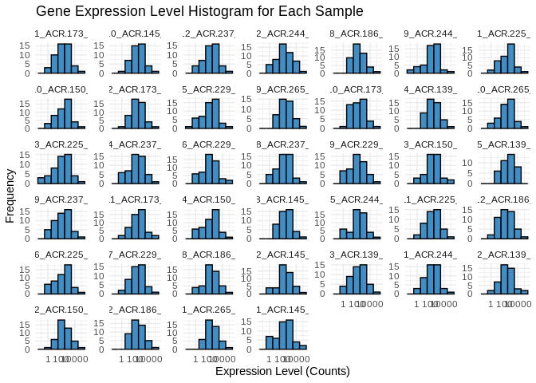<!-- -->

## 8.4 Normalized transcript counts

Check the total number of transcripts in each sample – now that we’ve
normalized the data these totals should be similar

``` r
# Calculate the total number of transcripts for each sample
total_transcripts_miRNA_norm <- colSums(Apul_counts_miRNA_norm)

# Create a data frame for plotting
total_transcripts_miRNA_norm_df <- data.frame(sample = names(total_transcripts_miRNA_norm),
                                   totals = total_transcripts_miRNA_norm)

# Plot the total number of transcripts for each sample
ggplot(total_transcripts_miRNA_norm_df, aes(x = reorder(sample, totals), totals)) +
  geom_bar(stat = "identity", fill = "#408EC6", color = "black") +
  geom_text(aes(label = totals), vjust = -0.3, size = 3.5) +
  labs(title = "Total Number of miRNA Transcripts per Sample",
       x = "Sample",
       y = "Total Transcripts") +
  theme_minimal() +
  theme(axis.text.x = element_text(angle = 45, hjust = 1))  # Rotate x-axis labels for readability
```

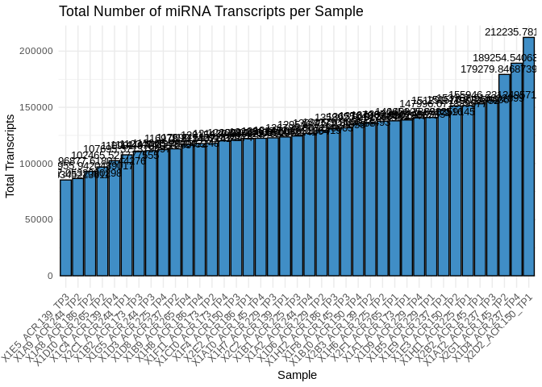<!-- -->
\## PCA of variance stabilized miRNAs

``` r
plotPCA(vsd_Apul_miRNA, intgroup="time.point")
```

<!-- -->

``` r
plotPCA(vsd_Apul_miRNA, intgroup="colony.id")
```

<!-- -->
Interesting! When considering all sRNAs, they strongly clustered by
colony and not time point. However, miRNAs alone show clear clustering
by time point (though some influence of colony is still apparent).

## 8.5 Sample clustering

``` r
# Calculate the Euclidean distance matrix
sample_dists <- dist(t(Apul_counts_miRNA_vsd))

# Create the heatmap
pheatmap(
  as.matrix(sample_dists), 
  clustering_distance_rows = "euclidean", 
  clustering_distance_cols = "euclidean", 
  main = "Sample Clustering"
)
```

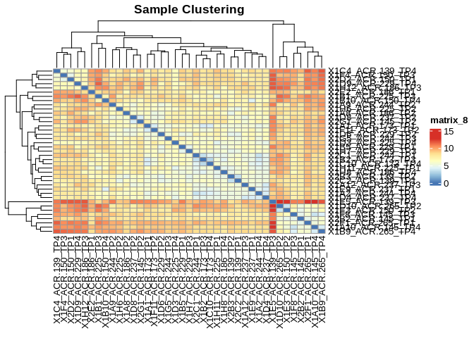<!-- -->

## 8.6 Heatmap

Of all miRNAs

``` r
heat_colors <- rev(brewer.pal(12, "RdYlBu"))
```

    ## Warning in brewer.pal(12, "RdYlBu"): n too large, allowed maximum for palette RdYlBu is 11
    ## Returning the palette you asked for with that many colors

``` r
pheatmap(as.matrix(Apul_counts_miRNA_vsd[apply(Apul_counts_miRNA_vsd, 1, var) > 0, ]), 
         cluster_rows = FALSE,
         cluster_cols = TRUE,
         show_rownames = TRUE,
         show_colnames = TRUE,
         color = heat_colors,
         scale="row")
```

<!-- -->

``` r
# 
# top_20_counts_all <- order(rowMeans(counts(dds,normalized=TRUE)),
#                 decreasing=TRUE)[1:200]
# 
# timepoint_annotation = colData(dds) %>% as.data.frame() %>% select(time.point)
# 
# 
# pheatmap(assay(vsd)[top_20_counts_all,], 
#          cluster_rows=FALSE, 
#          show_rownames=FALSE,
#          cluster_cols=TRUE, 
#          annotation_col = timepoint_annotation)
```

``` r
# Perform clustering based on normalized expression
row_clustering <- hclust(dist(as.matrix(Apul_counts_miRNA_norm)))
col_clustering <- hclust(dist(t(as.matrix(Apul_counts_miRNA_norm))))

# Convert normalized counts to binary (presence/absence)
binary_counts <- Apul_counts_miRNA_norm > 0
binary_counts <- as.matrix(binary_counts) * 1  # Convert logical to numeric (1/0)

# Generate heatmap using predefined dendrograms
Heatmap(
  binary_counts,
  cluster_rows = as.dendrogram(row_clustering),  # Row clustering
  cluster_columns = as.dendrogram(col_clustering),  # Column clustering
  col = c("white", "black"),  # White for 0 (absence), black for 1 (presence)
  name = "Presence/Absence",  # Legend title
  show_row_names = TRUE,
  show_column_names = TRUE
)
```

<!-- -->

``` r
# Perform clustering based on presence/absence (binary data)
row_clustering <- hclust(dist(binary_counts))  # Use binary_counts for row clustering
col_clustering <- hclust(dist(t(binary_counts)))  # Use binary_counts for column clustering

# Generate heatmap using predefined dendrograms
Heatmap(
  binary_counts,
  cluster_rows = as.dendrogram(row_clustering),  # Row clustering based on presence/absence
  cluster_columns = as.dendrogram(col_clustering),  # Column clustering based on presence/absence
  col = c("lightgray", "#408EC6"),  # White for 0 (absence), black for 1 (presence)
  name = "Presence/Absence",  # Legend title
  show_row_names = TRUE,
  show_column_names = TRUE,
  row_names_gp = gpar(fontsize = 6),  # Adjust row names font size
  column_names_gp = gpar(fontsize = 8)  # Adjust column names font size
)
```

<!-- -->

It looks like, of the 51 total miRNAs identified, most are consistently
present in all A.pulchra colonies and time points. For 10-15 of the
miRNAs, presence/absence is more variable accross colonies and
timepoints.

# 9 Normalized siRNA counts

## 9.1 Normalize counts with DESeq2

### 9.1.1 Metadata

DESeq2 requires a metadata data frame as input – we’ll use the coldata
we’ve already formatted

``` r
head(coldata)
```

    ##                  time.point colony.id
    ## 1A1_ACR-173_TP1         TP1   ACR-173
    ## 1A10_ACR-145_TP4        TP4   ACR-145
    ## 1A12_ACR-237_TP3        TP3   ACR-237
    ## 1A2_ACR-244_TP4         TP4   ACR-244
    ## 1A8_ACR-186_TP2         TP2   ACR-186
    ## 1A9_ACR-244_TP2         TP2   ACR-244

### 9.1.2 DESeq object

## 9.2 Verify rownames match

``` r
# Alphabetize rownames of coldata and colnames of Apul_counts_siRNA
coldata <- coldata[order(rownames(coldata)), ]
Apul_counts_siRNA <- Apul_counts_siRNA[, order(colnames(Apul_counts_siRNA))]

all(rownames(coldata) == colnames(Apul_counts_siRNA))
```

    ## [1] TRUE

# 10 Create DESeq2 data set

``` r
dds_Apul_siRNA <- DESeqDataSetFromMatrix(countData = Apul_counts_siRNA,
                              colData = coldata,
                              design = ~ time.point + colony.id)
```

    ## converting counts to integer mode

    ## Warning in DESeqDataSet(se, design = design, ignoreRank): some variables in
    ## design formula are characters, converting to factors

    ##   Note: levels of factors in the design contain characters other than
    ##   letters, numbers, '_' and '.'. It is recommended (but not required) to use
    ##   only letters, numbers, and delimiters '_' or '.', as these are safe characters
    ##   for column names in R. [This is a message, not a warning or an error]

``` r
dds_Apul_siRNA
```

    ## class: DESeqDataSet 
    ## dim: 66 39 
    ## metadata(1): version
    ## assays(1): counts
    ## rownames(66): Cluster_74 Cluster_232 ... Cluster_17753 Cluster_17994
    ## rowData names(0):
    ## colnames(39): 1A1_ACR-173_TP1 1A10_ACR-145_TP4 ... 2F1_ACR-265_TP1
    ##   2G1_ACR-145_TP2
    ## colData names(2): time.point colony.id

``` r
dds_Apul_siRNA$time.point <- factor(dds_Apul_siRNA$time.point, levels = c("TP1","TP2", "TP3", "TP4"))

dds_Apul_siRNA <- DESeq(dds_Apul_siRNA)
```

    ## estimating size factors

    ##   Note: levels of factors in the design contain characters other than
    ##   letters, numbers, '_' and '.'. It is recommended (but not required) to use
    ##   only letters, numbers, and delimiters '_' or '.', as these are safe characters
    ##   for column names in R. [This is a message, not a warning or an error]

    ## estimating dispersions

    ## gene-wise dispersion estimates

    ## mean-dispersion relationship

    ## -- note: fitType='parametric', but the dispersion trend was not well captured by the
    ##    function: y = a/x + b, and a local regression fit was automatically substituted.
    ##    specify fitType='local' or 'mean' to avoid this message next time.

    ##   Note: levels of factors in the design contain characters other than
    ##   letters, numbers, '_' and '.'. It is recommended (but not required) to use
    ##   only letters, numbers, and delimiters '_' or '.', as these are safe characters
    ##   for column names in R. [This is a message, not a warning or an error]

    ## final dispersion estimates

    ##   Note: levels of factors in the design contain characters other than
    ##   letters, numbers, '_' and '.'. It is recommended (but not required) to use
    ##   only letters, numbers, and delimiters '_' or '.', as these are safe characters
    ##   for column names in R. [This is a message, not a warning or an error]

    ## fitting model and testing

## 10.1 Pairwise results tables

``` r
# Define the output directory path
output_dir <- "../output/03.10-D-Apul-sRNAseq-expression-DESeq2/"

# Set desired false discovery rate threshold (i.e. adjusted p-value, padj)
fdr <- 0.05

# Set log2 fold change threshold (a value of '1' is equal to a fold change of '2')
log2fc <- 1

siRNA_tp1.v.tp2.results <- results(dds_Apul_siRNA, contrast=c("time.point","TP1","TP2"), alpha = fdr, lfcThreshold = log2fc)
siRNA_tp1.v.tp3.results <- results(dds_Apul_siRNA, contrast=c("time.point","TP1","TP3"), alpha = fdr, lfcThreshold = log2fc)
siRNA_tp1.v.tp4.results <- results(dds_Apul_siRNA, contrast=c("time.point","TP1","TP4"), alpha = fdr, lfcThreshold = log2fc)
siRNA_tp2.v.tp3.results <- results(dds_Apul_siRNA, contrast=c("time.point","TP2","TP3"), alpha = fdr, lfcThreshold = log2fc)
siRNA_tp2.v.tp4.results <- results(dds_Apul_siRNA, contrast=c("time.point","TP2","TP4"), alpha = fdr, lfcThreshold = log2fc)
siRNA_tp3.v.tp4.results <- results(dds_Apul_siRNA, contrast=c("time.point","TP3","TP4"), alpha = fdr, lfcThreshold = log2fc)

siRNA_tp2.v.tp4.results
```

    ## log2 fold change (MLE): time.point TP2 vs TP4 
    ## Wald test p-value: time.point TP2 vs TP4 
    ## DataFrame with 66 rows and 6 columns
    ##                baseMean log2FoldChange     lfcSE      stat    pvalue      padj
    ##               <numeric>      <numeric> <numeric> <numeric> <numeric> <numeric>
    ## Cluster_74     13.91584      -0.860460  0.328668   0.00000 1.0000000 1.0000000
    ## Cluster_232    12.78028       0.881168  0.509173   0.00000 1.0000000 1.0000000
    ## Cluster_238    12.80816       0.472592  0.512361   0.00000 1.0000000 1.0000000
    ## Cluster_938     8.92731       2.574014  0.547881   2.87291 0.0040671 0.0178952
    ## Cluster_967    17.49134       0.020384  0.281580   0.00000 1.0000000 1.0000000
    ## ...                 ...            ...       ...       ...       ...       ...
    ## Cluster_17230   6.94085     -0.6688598  1.688570  0.000000 1.0000000 1.0000000
    ## Cluster_17263  12.23428     -2.9582316  0.766892 -2.553464 0.0106657 0.0370493
    ## Cluster_17414  22.35630      1.2623831  0.338686  0.774708 0.4385122 0.9336065
    ## Cluster_17753   9.83451     -0.0503617  0.302026  0.000000 1.0000000 1.0000000
    ## Cluster_17994 501.34862      0.1218161  0.916387  0.000000 1.0000000 1.0000000

``` r
summary(siRNA_tp2.v.tp4.results)
```

    ## 
    ## out of 66 with nonzero total read count
    ## adjusted p-value < 0.05
    ## LFC > 1.00 (up)    : 6, 9.1%
    ## LFC < -1.00 (down) : 13, 20%
    ## outliers [1]       : 0, 0%
    ## low counts [2]     : 0, 0%
    ## (mean count < 5)
    ## [1] see 'cooksCutoff' argument of ?results
    ## [2] see 'independentFiltering' argument of ?results

``` r
table(siRNA_tp2.v.tp4.results$padj < 0.05)
```

    ## 
    ## FALSE  TRUE 
    ##    47    19

Write DDS results tables to CSVs

``` r
# Create a named list of the data frames
results_list <- list(
  siRNA_tp1.v.tp2.results = siRNA_tp1.v.tp2.results,
  siRNA_tp1.v.tp3.results = siRNA_tp1.v.tp3.results,
  siRNA_tp1.v.tp4.results = siRNA_tp1.v.tp4.results,
  siRNA_tp2.v.tp3.results = siRNA_tp2.v.tp3.results,
  siRNA_tp2.v.tp4.results = siRNA_tp2.v.tp4.results,
  siRNA_tp3.v.tp4.results = siRNA_tp3.v.tp4.results
)

# Loop through the list and write each data frame to a CSV file in the specified directory
for (df_name in names(results_list)) {
  write.csv(results_list[[df_name]], file = paste0(output_dir, df_name, ".table.csv"), row.names = TRUE, quote = FALSE)
}
```

``` r
results24_df <- as.data.frame(siRNA_tp2.v.tp4.results)
results24_df$Name <- rownames(results24_df)

filter(results24_df, pvalue < 0.05)
```

    ##                 baseMean log2FoldChange     lfcSE      stat       pvalue
    ## Cluster_938     8.927310       2.574014 0.5478815  2.872910 4.067101e-03
    ## Cluster_1888   13.279045       2.170510 0.3560739  3.287267 1.011649e-03
    ## Cluster_2970   22.889283      -4.343488 0.7112153 -4.701090 2.587759e-06
    ## Cluster_3157   13.578018      -2.345970 0.4007272 -3.358818 7.827650e-04
    ## Cluster_3519   14.705079      -3.316128 0.5889553 -3.932605 8.403034e-05
    ## Cluster_4626   72.874369      -4.185348 0.5977189 -5.329174 9.866037e-08
    ## Cluster_5385   20.498121       4.127545 0.8273187  3.780339 1.566148e-04
    ## Cluster_6816   16.931621      -3.591270 0.7117120 -3.640897 2.716893e-04
    ## Cluster_7171  120.002840      -3.123342 0.7760354 -2.736140 6.216449e-03
    ## Cluster_7537   13.342251      -3.203935 0.9175219 -2.402052 1.630339e-02
    ## Cluster_8145   13.345364       2.028106 0.3686516  2.788828 5.289916e-03
    ## Cluster_8818  117.093007      -3.389047 0.6647989 -3.593639 3.260918e-04
    ## Cluster_9840  167.047935      -4.581993 0.6932985 -5.166595 2.383966e-07
    ## Cluster_13476  26.607067      -2.001707 0.4579199 -2.187516 2.870489e-02
    ## Cluster_13579  12.165654       2.425435 0.3983730  3.578140 3.460478e-04
    ## Cluster_13580  12.032309       2.649002 0.4267075  3.864479 1.113264e-04
    ## Cluster_13861   9.640273      -3.271233 0.6477782 -3.506189 4.545725e-04
    ## Cluster_14698  11.802530       1.929051 0.3951854  2.350924 1.872684e-02
    ## Cluster_14993  19.729056      -2.791836 0.6804015 -2.633498 8.451022e-03
    ## Cluster_15263  15.420540      -4.914768 0.6582966 -5.946815 2.734108e-09
    ## Cluster_15475  11.768492      -4.720047 1.0410460 -3.573375 3.524101e-04
    ## Cluster_17091   5.160867       2.990207 0.8790895  2.263942 2.357770e-02
    ## Cluster_17263  12.234276      -2.958232 0.7668921 -2.553464 1.066572e-02
    ##                       padj          Name
    ## Cluster_938   1.789524e-02   Cluster_938
    ## Cluster_1888  4.769205e-03  Cluster_1888
    ## Cluster_2970  4.269802e-05  Cluster_2970
    ## Cluster_3157  3.974038e-03  Cluster_3157
    ## Cluster_3519  1.109200e-03  Cluster_3519
    ## Cluster_4626  3.255792e-06  Cluster_4626
    ## Cluster_5385  1.476654e-03  Cluster_5385
    ## Cluster_6816  2.114460e-03  Cluster_6816
    ## Cluster_7171  2.413445e-02  Cluster_7171
    ## Cluster_7537  5.380117e-02  Cluster_7537
    ## Cluster_8145  2.182090e-02  Cluster_8145
    ## Cluster_8818  2.114460e-03  Cluster_8818
    ## Cluster_9840  5.244726e-06  Cluster_9840
    ## Cluster_13476 8.237055e-02 Cluster_13476
    ## Cluster_13579 2.114460e-03 Cluster_13579
    ## Cluster_13580 1.224590e-03 Cluster_13580
    ## Cluster_13861 2.500149e-03 Cluster_13861
    ## Cluster_14698 5.885580e-02 Cluster_14698
    ## Cluster_14993 3.098708e-02 Cluster_14993
    ## Cluster_15263 1.804512e-07 Cluster_15263
    ## Cluster_15475 2.114460e-03 Cluster_15475
    ## Cluster_17091 7.073309e-02 Cluster_17091
    ## Cluster_17263 3.704934e-02 Cluster_17263

## 10.2 Normalizations

``` r
# extract normalized counts
# (normalization is automatically performed by deseq2)
Apul_counts_siRNA_norm <- counts(dds_Apul_siRNA, normalized=TRUE) %>% data.frame()

write.table(Apul_counts_siRNA_norm, file = "../output/03.10-D-Apul-sRNAseq-expression-DESeq2/Apul_counts_siRNA_normalized.txt", sep = "\t", row.names = TRUE, col.names = TRUE, quote = FALSE)


# variance stabilized data
vsd_Apul_siRNA <- varianceStabilizingTransformation(dds_Apul_siRNA, blind=TRUE)
wpn_vsd_Apul_siRNA <- getVarianceStabilizedData(dds_Apul_siRNA)
rv_wpn_Apul_siRNA <- rowVars(wpn_vsd_Apul_siRNA, useNames=TRUE)

Apul_counts_siRNA_vsd <- data.frame(wpn_vsd_Apul_siRNA)
write.table(Apul_counts_siRNA_vsd, file = "../output/03.10-D-Apul-sRNAseq-expression-DESeq2/Apul_counts_siRNA_variancestabilized.txt", sep = "\t", row.names = TRUE, col.names = TRUE,quote = FALSE)
```

## 10.3 Normalized expression levels

Plot histograms of the normalized expression levels in each sample

``` r
# Melt the count matrix into long format
Apul_counts_siRNA_norm_melted <- melt(Apul_counts_siRNA_norm, variable.name = "sample", value.name = "counts")
```

    ## No id variables; using all as measure variables

``` r
# Plot the expression level histograms for each sample
ggplot(Apul_counts_siRNA_norm_melted, aes(x = counts)) +
  geom_histogram(binwidth = 1, fill = "#408EC6", color = "black") +
  scale_x_log10() +  # Optional: Log-transform the x-axis for better visualization
  facet_wrap(~sample, scales = "free_y") +
  labs(title = "Gene Expression Level Histogram for Each Sample",
       x = "Expression Level (Counts)",
       y = "Frequency") +
  theme_minimal()
```

    ## Warning in scale_x_log10(): log-10 transformation introduced infinite values.

    ## Warning: Removed 362 rows containing non-finite outside the scale range
    ## (`stat_bin()`).

<!-- -->

## 10.4 Normalized transcript counts

Check the total number of transcripts in each sample – now that we’ve
normalized the data these totals should be similar

``` r
# Calculate the total number of transcripts for each sample
total_transcripts_siRNA_norm <- colSums(Apul_counts_siRNA_norm)

# Create a data frame for plotting
total_transcripts_siRNA_norm_df <- data.frame(sample = names(total_transcripts_siRNA_norm),
                                   totals = total_transcripts_siRNA_norm)

# Plot the total number of transcripts for each sample
ggplot(total_transcripts_siRNA_norm_df, aes(x = reorder(sample, totals), y = totals)) +
  geom_bar(stat = "identity", fill = "#408EC6", color = "black") +
  geom_text(aes(label = totals), vjust = -0.3, size = 3.5) +
  labs(title = "Total Number of siRNA Transcripts per Sample",
       x = "Sample",
       y = "Total Transcripts") +
  theme_minimal() +
  theme(axis.text.x = element_text(angle = 45, hjust = 1))  # Rotate x-axis labels for readability
```

<!-- -->

## 10.5 PCA of variance stabilized siRNAs

``` r
plotPCA(vsd_Apul_siRNA, intgroup="time.point")
```

<!-- -->

``` r
plotPCA(vsd_Apul_siRNA, intgroup="colony.id")
```

<!-- -->

Sample 1E1_ACR-265_TP3 is a marked outlier, should probably exclude

Again, siRNA clearly cluster by timepoint

## 10.6 Sample clustering

``` r
# Calculate the Euclidean distance matrix
sample_dists <- dist(t(Apul_counts_siRNA_vsd))

# Create the heatmap
pheatmap(
  as.matrix(sample_dists), 
  clustering_distance_rows = "euclidean", 
  clustering_distance_cols = "euclidean", 
  main = "Sample Clustering"
)
```

<!-- -->

## 10.7 Heatmap

Of all siRNAs

``` r
heat_colors <- rev(brewer.pal(12, "RdYlBu"))
```

    ## Warning in brewer.pal(12, "RdYlBu"): n too large, allowed maximum for palette RdYlBu is 11
    ## Returning the palette you asked for with that many colors

``` r
pheatmap(as.matrix(Apul_counts_siRNA_vsd[apply(Apul_counts_siRNA_vsd, 1, var) > 0, ]), 
         cluster_rows = TRUE,
         cluster_cols = TRUE,
         show_rownames = TRUE,
         show_colnames = TRUE,
         color = heat_colors,
         scale="row")
```

<!-- -->
