03.0-D-Apul-lncRNAseq-expression-DESeq2
================
Kathleen Durkin
2024-05-01

- <a href="#001-install-and-load-packages"
  id="toc-001-install-and-load-packages">0.0.1 Install and load
  packages</a>
- <a href="#01-load-count-data-and-coldata"
  id="toc-01-load-count-data-and-coldata">0.1 Load count data and
  coldata</a>
- <a href="#02-count-data-munging" id="toc-02-count-data-munging">0.2
  Count data munging</a>
- <a href="#03-expression-levels" id="toc-03-expression-levels">0.3
  Expression levels</a>
- <a href="#04-transcript-counts" id="toc-04-transcript-counts">0.4
  Transcript counts</a>
- <a href="#1-" id="toc-1-">1 ………..</a>
  - <a href="#11-normalize-counts-with-deseq2"
    id="toc-11-normalize-counts-with-deseq2">1.1 Normalize counts with
    DESeq2</a>
    - <a href="#111-metadata" id="toc-111-metadata">1.1.1 Metadata</a>
    - <a href="#112-deseq-object" id="toc-112-deseq-object">1.1.2 DESeq
      object</a>
  - <a href="#12-verify-rownames-match"
    id="toc-12-verify-rownames-match">1.2 Verify rownames match</a>
- <a href="#2-create-deseq2-data-set" id="toc-2-create-deseq2-data-set">2
  Create DESeq2 data set</a>
  - <a href="#21-pairwise-results-tables"
    id="toc-21-pairwise-results-tables">2.1 Pairwise results tables</a>
  - <a href="#22-normalizations" id="toc-22-normalizations">2.2
    Normalizations</a>
  - <a href="#23-plot-normalized-data" id="toc-23-plot-normalized-data">2.3
    Plot normalized data</a>
  - <a href="#24-plot-variance-stabilized-data"
    id="toc-24-plot-variance-stabilized-data">2.4 Plot variance stabilized
    data</a>
  - <a href="#25-normalized-expression-levels"
    id="toc-25-normalized-expression-levels">2.5 Normalized expression
    levels</a>
  - <a href="#26-normalized-transcript-counts"
    id="toc-26-normalized-transcript-counts">2.6 Normalized transcript
    counts</a>
  - <a href="#27-pca-of-variance-stabilized-data"
    id="toc-27-pca-of-variance-stabilized-data">2.7 PCA of variance
    stabilized data</a>
  - <a href="#28-sample-clustering" id="toc-28-sample-clustering">2.8 Sample
    clustering</a>
  - <a href="#29-heatmaps" id="toc-29-heatmaps">2.9 Heatmaps</a>

Expression summary for *Acropora pulchra* lncRNA data.

### 0.0.1 Install and load packages

``` r
library(tidyverse)
```

    ## ── Attaching core tidyverse packages ──────────────────────── tidyverse 2.0.0 ──
    ## ✔ dplyr     1.1.4     ✔ readr     2.1.5
    ## ✔ forcats   1.0.0     ✔ stringr   1.5.1
    ## ✔ ggplot2   3.5.1     ✔ tibble    3.2.1
    ## ✔ lubridate 1.9.4     ✔ tidyr     1.3.1
    ## ✔ purrr     1.0.2     
    ## ── Conflicts ────────────────────────────────────────── tidyverse_conflicts() ──
    ## ✖ dplyr::filter() masks stats::filter()
    ## ✖ dplyr::lag()    masks stats::lag()
    ## ℹ Use the conflicted package (<http://conflicted.r-lib.org/>) to force all conflicts to become errors

``` r
library(ggplot2)
library(reshape2)
```

    ## 
    ## Attaching package: 'reshape2'
    ## 
    ## The following object is masked from 'package:tidyr':
    ## 
    ##     smiths

``` r
library(pheatmap)
library(RColorBrewer)
library(DESeq2)
```

    ## Loading required package: S4Vectors
    ## Loading required package: stats4
    ## Loading required package: BiocGenerics
    ## 
    ## Attaching package: 'BiocGenerics'
    ## 
    ## The following objects are masked from 'package:lubridate':
    ## 
    ##     intersect, setdiff, union
    ## 
    ## The following objects are masked from 'package:dplyr':
    ## 
    ##     combine, intersect, setdiff, union
    ## 
    ## The following objects are masked from 'package:stats':
    ## 
    ##     IQR, mad, sd, var, xtabs
    ## 
    ## The following objects are masked from 'package:base':
    ## 
    ##     anyDuplicated, aperm, append, as.data.frame, basename, cbind,
    ##     colnames, dirname, do.call, duplicated, eval, evalq, Filter, Find,
    ##     get, grep, grepl, intersect, is.unsorted, lapply, Map, mapply,
    ##     match, mget, order, paste, pmax, pmax.int, pmin, pmin.int,
    ##     Position, rank, rbind, Reduce, rownames, sapply, setdiff, sort,
    ##     table, tapply, union, unique, unsplit, which.max, which.min
    ## 
    ## 
    ## Attaching package: 'S4Vectors'
    ## 
    ## The following objects are masked from 'package:lubridate':
    ## 
    ##     second, second<-
    ## 
    ## The following objects are masked from 'package:dplyr':
    ## 
    ##     first, rename
    ## 
    ## The following object is masked from 'package:tidyr':
    ## 
    ##     expand
    ## 
    ## The following objects are masked from 'package:base':
    ## 
    ##     expand.grid, I, unname
    ## 
    ## Loading required package: IRanges
    ## 
    ## Attaching package: 'IRanges'
    ## 
    ## The following object is masked from 'package:lubridate':
    ## 
    ##     %within%
    ## 
    ## The following objects are masked from 'package:dplyr':
    ## 
    ##     collapse, desc, slice
    ## 
    ## The following object is masked from 'package:purrr':
    ## 
    ##     reduce
    ## 
    ## Loading required package: GenomicRanges
    ## Loading required package: GenomeInfoDb
    ## Loading required package: SummarizedExperiment
    ## Loading required package: MatrixGenerics
    ## Loading required package: matrixStats
    ## 
    ## Attaching package: 'matrixStats'
    ## 
    ## The following object is masked from 'package:dplyr':
    ## 
    ##     count
    ## 
    ## 
    ## Attaching package: 'MatrixGenerics'
    ## 
    ## The following objects are masked from 'package:matrixStats':
    ## 
    ##     colAlls, colAnyNAs, colAnys, colAvgsPerRowSet, colCollapse,
    ##     colCounts, colCummaxs, colCummins, colCumprods, colCumsums,
    ##     colDiffs, colIQRDiffs, colIQRs, colLogSumExps, colMadDiffs,
    ##     colMads, colMaxs, colMeans2, colMedians, colMins, colOrderStats,
    ##     colProds, colQuantiles, colRanges, colRanks, colSdDiffs, colSds,
    ##     colSums2, colTabulates, colVarDiffs, colVars, colWeightedMads,
    ##     colWeightedMeans, colWeightedMedians, colWeightedSds,
    ##     colWeightedVars, rowAlls, rowAnyNAs, rowAnys, rowAvgsPerColSet,
    ##     rowCollapse, rowCounts, rowCummaxs, rowCummins, rowCumprods,
    ##     rowCumsums, rowDiffs, rowIQRDiffs, rowIQRs, rowLogSumExps,
    ##     rowMadDiffs, rowMads, rowMaxs, rowMeans2, rowMedians, rowMins,
    ##     rowOrderStats, rowProds, rowQuantiles, rowRanges, rowRanks,
    ##     rowSdDiffs, rowSds, rowSums2, rowTabulates, rowVarDiffs, rowVars,
    ##     rowWeightedMads, rowWeightedMeans, rowWeightedMedians,
    ##     rowWeightedSds, rowWeightedVars
    ## 
    ## Loading required package: Biobase
    ## Welcome to Bioconductor
    ## 
    ##     Vignettes contain introductory material; view with
    ##     'browseVignettes()'. To cite Bioconductor, see
    ##     'citation("Biobase")', and for packages 'citation("pkgname")'.
    ## 
    ## 
    ## Attaching package: 'Biobase'
    ## 
    ## The following object is masked from 'package:MatrixGenerics':
    ## 
    ##     rowMedians
    ## 
    ## The following objects are masked from 'package:matrixStats':
    ## 
    ##     anyMissing, rowMedians

``` r
library(ComplexHeatmap)
```

    ## Loading required package: grid
    ## ========================================
    ## ComplexHeatmap version 2.14.0
    ## Bioconductor page: http://bioconductor.org/packages/ComplexHeatmap/
    ## Github page: https://github.com/jokergoo/ComplexHeatmap
    ## Documentation: http://jokergoo.github.io/ComplexHeatmap-reference
    ## 
    ## If you use it in published research, please cite either one:
    ## - Gu, Z. Complex Heatmap Visualization. iMeta 2022.
    ## - Gu, Z. Complex heatmaps reveal patterns and correlations in multidimensional 
    ##     genomic data. Bioinformatics 2016.
    ## 
    ## 
    ## The new InteractiveComplexHeatmap package can directly export static 
    ## complex heatmaps into an interactive Shiny app with zero effort. Have a try!
    ## 
    ## This message can be suppressed by:
    ##   suppressPackageStartupMessages(library(ComplexHeatmap))
    ## ========================================
    ## ! pheatmap() has been masked by ComplexHeatmap::pheatmap(). Most of the arguments
    ##    in the original pheatmap() are identically supported in the new function. You 
    ##    can still use the original function by explicitly calling pheatmap::pheatmap().
    ## 
    ## 
    ## Attaching package: 'ComplexHeatmap'
    ## 
    ## The following object is masked from 'package:pheatmap':
    ## 
    ##     pheatmap

## 0.1 Load count data and coldata

Load in the lncRNA count matrix generated in `08-Apul-lncRNA`. Coldata
generated in `03.00-D-Apul-RNAseq-gene-expression-DESeq2`

``` r
# Read in lncRNA counts data
Apul_counts_lncRNA_data_OG <- read.table("../output/08-Apul-lncRNA/counts.txt", header = TRUE, sep = "\t", skip = 1) 
head(Apul_counts_lncRNA_data_OG)
```

    ##       Geneid      Chr  Start    End Strand Length ...data.1A10.sorted.bam
    ## 1 lncRNA_001 ntLink_0  84514  93551      +   9038                       1
    ## 2 lncRNA_002 ntLink_0  15627  19151      +   3525                       6
    ## 3 lncRNA_003 ntLink_0  23443  23874      +    432                       0
    ## 4 lncRNA_004 ntLink_1   7484   9525      +   2042                       0
    ## 5 lncRNA_005 ntLink_1  51265  51766      +    502                       0
    ## 6 lncRNA_006 ntLink_2 217051 217761      +    711                      19
    ##   ...data.1A12.sorted.bam ...data.1A1.sorted.bam ...data.1A2.sorted.bam
    ## 1                       1                      5                      0
    ## 2                       0                      5                      1
    ## 3                       0                      0                      0
    ## 4                       0                      0                      0
    ## 5                      11                     67                      0
    ## 6                       1                    157                     11
    ##   ...data.1A8.sorted.bam ...data.1A9.sorted.bam ...data.1B10.sorted.bam
    ## 1                      1                      0                       0
    ## 2                      0                      0                       2
    ## 3                      0                      0                       0
    ## 4                      0                      0                       0
    ## 5                      0                     20                       0
    ## 6                      0                      1                       7
    ##   ...data.1B1.sorted.bam ...data.1B2.sorted.bam ...data.1B5.sorted.bam
    ## 1                     14                      9                      2
    ## 2                      0                      0                      0
    ## 3                      0                      0                      0
    ## 4                      0                      0                      0
    ## 5                      8                      8                      0
    ## 6                     10                      4                      4
    ##   ...data.1B9.sorted.bam ...data.1C10.sorted.bam ...data.1C4.sorted.bam
    ## 1                     23                       5                      5
    ## 2                      1                       0                      2
    ## 3                      0                       0                      0
    ## 4                      0                       0                      0
    ## 5                      0                      29                     50
    ## 6                     21                      41                      3
    ##   ...data.1D10.sorted.bam ...data.1D3.sorted.bam ...data.1D4.sorted.bam
    ## 1                      17                      0                      0
    ## 2                       5                      0                      0
    ## 3                       0                      0                      0
    ## 4                       0                      0                      0
    ## 5                       2                      0                      0
    ## 6                       4                      6                     14
    ##   ...data.1D6.sorted.bam ...data.1D8.sorted.bam ...data.1D9.sorted.bam
    ## 1                      0                      0                      1
    ## 2                      0                      0                      2
    ## 3                      0                      0                      0
    ## 4                      0                      0                      0
    ## 5                     10                      6                      0
    ## 6                      6                     12                     99
    ##   ...data.1E1.sorted.bam ...data.1E3.sorted.bam ...data.1E5.sorted.bam
    ## 1                      8                      1                      0
    ## 2                      2                      2                      0
    ## 3                      0                      0                      0
    ## 4                      0                      0                      0
    ## 5                     79                      5                      0
    ## 6                     16                      2                      0
    ##   ...data.1E9.sorted.bam ...data.1F11.sorted.bam ...data.1F4.sorted.bam
    ## 1                      0                       1                      0
    ## 2                      1                       0                      0
    ## 3                      0                       0                      0
    ## 4                      0                       0                      0
    ## 5                      0                       8                     42
    ## 6                     56                       0                     10
    ##   ...data.1F8.sorted.bam ...data.1G5.sorted.bam ...data.1H11.sorted.bam
    ## 1                      5                      0                       1
    ## 2                      0                      2                       0
    ## 3                      0                      0                       0
    ## 4                      0                      1                       0
    ## 5                     12                    117                      11
    ## 6                      2                     19                       1
    ##   ...data.1H12.sorted.bam ...data.1H6.sorted.bam ...data.1H7.sorted.bam
    ## 1                       0                      5                      5
    ## 2                       0                      0                      0
    ## 3                       0                      0                      0
    ## 4                       0                      0                      0
    ## 5                      18                     12                      8
    ## 6                       3                      2                     16
    ##   ...data.1H8.sorted.bam ...data.2B2.sorted.bam ...data.2B3.sorted.bam
    ## 1                      0                      2                      0
    ## 2                      0                      2                      1
    ## 3                      0                      0                      0
    ## 4                      0                      0                      0
    ## 5                     24                     12                      6
    ## 6                      1                     16                      0
    ##   ...data.2C1.sorted.bam ...data.2C2.sorted.bam ...data.2D2.sorted.bam
    ## 1                      0                      3                      1
    ## 2                      0                      0                      0
    ## 3                      0                      0                      0
    ## 4                      0                      0                      0
    ## 5                      0                     50                     33
    ## 6                      1                      2                     81
    ##   ...data.2E2.sorted.bam ...data.2F1.sorted.bam ...data.2G1.sorted.bam
    ## 1                     14                     30                      0
    ## 2                      0                     16                      0
    ## 3                      0                      0                      0
    ## 4                      0                      0                      0
    ## 5                      0                      0                      0
    ## 6                     13                     27                      3

``` r
# Read in coldata 
coldata_OG <- read.csv(file = "../output/03.00-D-Apul-RNAseq-gene-expression-DESeq2/DESeq2-coldata.tab", row.names=1, sep = "\t")
coldata_OG$time.point <- factor(coldata_OG$time.point)
```

## 0.2 Count data munging

``` r
Apul_counts_lncRNA <- Apul_counts_lncRNA_data_OG
coldata <- coldata_OG

# Remove excess portions of sample column names to just "sample###"
colnames(Apul_counts_lncRNA) <- sub("...data.", "", colnames(Apul_counts_lncRNA))
colnames(Apul_counts_lncRNA) <- sub(".sorted.bam", "", colnames(Apul_counts_lncRNA))

# Keep just the counts and names
Apul_counts_lncRNA <- Apul_counts_lncRNA %>% select(-Chr, -Start, -End, -Strand, -Length)

# Make the cluster names our new row names
Apul_counts_lncRNA <- Apul_counts_lncRNA %>% column_to_rownames(var = "Geneid")

# Remove any with 0 counts in all samples
Apul_counts_lncRNA <- Apul_counts_lncRNA[rowSums(Apul_counts_lncRNA) != 0, ]

# Append colony and timepoint info to sample names
colnames(Apul_counts_lncRNA) <- paste(colnames(Apul_counts_lncRNA), coldata[colnames(Apul_counts_lncRNA), "colony.id"], coldata[colnames(Apul_counts_lncRNA), "time.point"], sep = "_")
# Make sure coldata metadata has matching rownames (for DEseq2 formatting)
rownames(coldata) <- paste(rownames(coldata), coldata$colony.id, coldata$time.point, sep = "_")

write.table(Apul_counts_lncRNA, file = "../output/03.20-D-Apul-lncRNA-expression-DESeq2/Apul_lncRNA_ShortStack_counts_formatted.txt", sep = "\t", row.names = TRUE, col.names = TRUE, quote = FALSE)

head(Apul_counts_lncRNA)
```

    ##            1A10_ACR-145_TP4 1A12_ACR-237_TP3 1A1_ACR-173_TP1 1A2_ACR-244_TP4
    ## lncRNA_001                1                1               5               0
    ## lncRNA_002                6                0               5               1
    ## lncRNA_004                0                0               0               0
    ## lncRNA_005                0               11              67               0
    ## lncRNA_006               19                1             157              11
    ## lncRNA_007               59                0               0               0
    ##            1A8_ACR-186_TP2 1A9_ACR-244_TP2 1B10_ACR-150_TP4 1B1_ACR-225_TP3
    ## lncRNA_001               1               0                0              14
    ## lncRNA_002               0               0                2               0
    ## lncRNA_004               0               0                0               0
    ## lncRNA_005               0              20                0               8
    ## lncRNA_006               0               1                7              10
    ## lncRNA_007               0               3                2               7
    ##            1B2_ACR-173_TP3 1B5_ACR-229_TP1 1B9_ACR-265_TP4 1C10_ACR-173_TP4
    ## lncRNA_001               9               2              23                5
    ## lncRNA_002               0               0               1                0
    ## lncRNA_004               0               0               0                0
    ## lncRNA_005               8               0               0               29
    ## lncRNA_006               4               4              21               41
    ## lncRNA_007               1               1               6                0
    ##            1C4_ACR-139_TP4 1D10_ACR-265_TP2 1D3_ACR-225_TP4 1D4_ACR-237_TP4
    ## lncRNA_001               5               17               0               0
    ## lncRNA_002               2                5               0               0
    ## lncRNA_004               0                0               0               0
    ## lncRNA_005              50                2               0               0
    ## lncRNA_006               3                4               6              14
    ## lncRNA_007               0               16              10               9
    ##            1D6_ACR-229_TP2 1D8_ACR-237_TP2 1D9_ACR-229_TP4 1E1_ACR-265_TP3
    ## lncRNA_001               0               0               1               8
    ## lncRNA_002               0               0               2               2
    ## lncRNA_004               0               0               0               0
    ## lncRNA_005              10               6               0              79
    ## lncRNA_006               6              12              99              16
    ## lncRNA_007               0               0               0              14
    ##            1E3_ACR-150_TP2 1E5_ACR-139_TP3 1E9_ACR-237_TP1 1F11_ACR-173_TP2
    ## lncRNA_001               1               0               0                1
    ## lncRNA_002               2               0               1                0
    ## lncRNA_004               0               0               0                0
    ## lncRNA_005               5               0               0                8
    ## lncRNA_006               2               0              56                0
    ## lncRNA_007              14               0               0                2
    ##            1F4_ACR-150_TP3 1F8_ACR-145_TP3 1G5_ACR-244_TP3 1H11_ACR-225_TP1
    ## lncRNA_001               0               5               0                1
    ## lncRNA_002               0               0               2                0
    ## lncRNA_004               0               0               1                0
    ## lncRNA_005              42              12             117               11
    ## lncRNA_006              10               2              19                1
    ## lncRNA_007               2              10               3                0
    ##            1H12_ACR-186_TP3 1H6_ACR-225_TP2 1H7_ACR-229_TP3 1H8_ACR-186_TP4
    ## lncRNA_001                0               5               5               0
    ## lncRNA_002                0               0               0               0
    ## lncRNA_004                0               0               0               0
    ## lncRNA_005               18              12               8              24
    ## lncRNA_006                3               2              16               1
    ## lncRNA_007                0              10               0               0
    ##            2B2_ACR-145_TP1 2B3_ACR-139_TP2 2C1_ACR-244_TP1 2C2_ACR-139_TP1
    ## lncRNA_001               2               0               0               3
    ## lncRNA_002               2               1               0               0
    ## lncRNA_004               0               0               0               0
    ## lncRNA_005              12               6               0              50
    ## lncRNA_006              16               0               1               2
    ## lncRNA_007              16               0               0               0
    ##            2D2_ACR-150_TP1 2E2_ACR-186_TP1 2F1_ACR-265_TP1 2G1_ACR-145_TP2
    ## lncRNA_001               1              14              30               0
    ## lncRNA_002               0               0              16               0
    ## lncRNA_004               0               0               0               0
    ## lncRNA_005              33               0               0               0
    ## lncRNA_006              81              13              27               3
    ## lncRNA_007              10               0              40               0

``` r
head(coldata)
```

    ##                  time.point colony.id
    ## 1A1_ACR-173_TP1         TP1   ACR-173
    ## 1A10_ACR-145_TP4        TP4   ACR-145
    ## 1A12_ACR-237_TP3        TP3   ACR-237
    ## 1A2_ACR-244_TP4         TP4   ACR-244
    ## 1A8_ACR-186_TP2         TP2   ACR-186
    ## 1A9_ACR-244_TP2         TP2   ACR-244

## 0.3 Expression levels

Plot histograms of the expression levels in each sample

``` r
# Melt the count matrix into long format
Apul_counts_lncRNA_melted <- melt(Apul_counts_lncRNA, variable.name = "sample", value.name = "counts")
```

    ## No id variables; using all as measure variables

``` r
# Plot the expression level histograms for each sample
ggplot(Apul_counts_lncRNA_melted, aes(x = counts)) +
  geom_histogram(binwidth = 1, fill = "#408EC6", color = "black") +
  scale_x_log10() +  # Optional: Log-transform the x-axis for better visualization
  facet_wrap(~sample, scales = "free_y") +
  labs(title = "Gene Expression Level Histogram for Each Sample",
       x = "Expression Level (Counts)",
       y = "Frequency") +
  theme_minimal()
```

    ## Warning in scale_x_log10(): log-10 transformation introduced infinite values.

    ## Warning: Removed 405208 rows containing non-finite outside the scale range
    ## (`stat_bin()`).

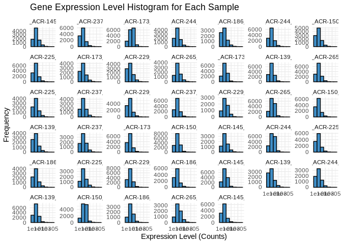<!-- -->

## 0.4 Transcript counts

First let’s check the total number of transcripts in each sample – keep
in mind this expression data has *not* been normalized yet, so there may
be different totals for each sample

``` r
# Calculate the total number of transcripts for each sample
total_transcripts <- colSums(Apul_counts_lncRNA)

# Create a data frame for plotting
total_transcripts_df <- data.frame(sample = names(total_transcripts),
                                   totals = total_transcripts)

# Plot the total number of transcripts for each sample
ggplot(total_transcripts_df, aes(x = reorder(sample, totals), y = totals)) +
  geom_bar(stat = "identity", fill = "#408EC6", color = "black") +
  geom_text(aes(label = totals), vjust = -0.3, size = 3.5) + 
  labs(title = "Total Number of Transcripts per Sample",
       x = "Sample",
       y = "Total Transcripts") +
  theme_minimal() +
  theme(axis.text.x = element_text(angle = 45, hjust = 1))  # Rotate x-axis labels for readability
```

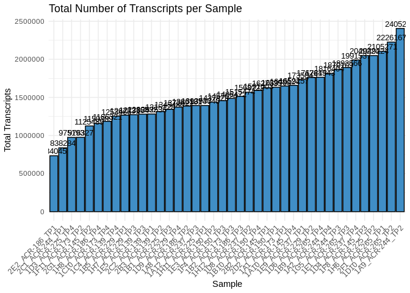<!-- -->
No glaring discrepancies/patterns

Now let’s check the number of unique transcripts in each sample – that
is, how many unique lncRNAs are expressed in each sample? This should be
pretty much the same across samples, even without normalization.

``` r
# Calculate the number of unique transcripts (non-zero counts) for each sample
unique_transcripts <- colSums(Apul_counts_lncRNA > 0)

# Create a data frame for plotting
unique_transcripts_df <- data.frame(sample = names(unique_transcripts),
                                    uniques = unique_transcripts)

# Plot the total number of unique transcripts for each sample
ggplot(unique_transcripts_df, aes(x = reorder(sample, uniques), y = uniques)) +
  geom_bar(stat = "identity", fill = "#408EC6", color = "black") +
  geom_text(aes(label = uniques), vjust = -0.3, size = 3.5) + 
  labs(title = "Total Number of Unique Expressed Transcripts per Sample",
       x = "Sample",
       y = "Unique Transcripts") +
  theme_minimal() +
  theme(axis.text.x = element_text(angle = 45, hjust = 1))  # Rotate x-axis labels for readability
```

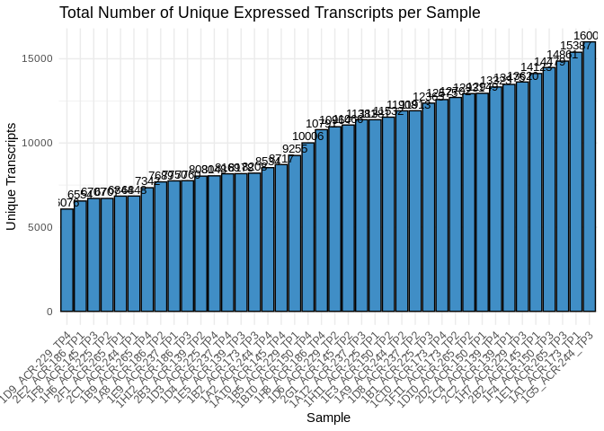<!-- -->

# 1 ………..

## 1.1 Normalize counts with DESeq2

### 1.1.1 Metadata

DESeq2 requires a metadata data frame as input – we’ll use the coldata
we’ve already formatted

``` r
head(coldata)
```

    ##                  time.point colony.id
    ## 1A1_ACR-173_TP1         TP1   ACR-173
    ## 1A10_ACR-145_TP4        TP4   ACR-145
    ## 1A12_ACR-237_TP3        TP3   ACR-237
    ## 1A2_ACR-244_TP4         TP4   ACR-244
    ## 1A8_ACR-186_TP2         TP2   ACR-186
    ## 1A9_ACR-244_TP2         TP2   ACR-244

### 1.1.2 DESeq object

## 1.2 Verify rownames match

``` r
# Alphabetize rownames of coldata and colnames of Apul_counts_lncRNA
coldata <- coldata[order(rownames(coldata)), ]
Apul_counts_lncRNA <- Apul_counts_lncRNA[, order(colnames(Apul_counts_lncRNA))]

all(rownames(coldata) == colnames(Apul_counts_lncRNA))
```

    ## [1] TRUE

# 2 Create DESeq2 data set

``` r
dds_Apul_lncRNA <- DESeqDataSetFromMatrix(countData = Apul_counts_lncRNA,
                              colData = coldata,
                              design = ~ time.point + colony.id)
```

    ## Warning in DESeqDataSet(se, design = design, ignoreRank): some variables in
    ## design formula are characters, converting to factors

    ##   Note: levels of factors in the design contain characters other than
    ##   letters, numbers, '_' and '.'. It is recommended (but not required) to use
    ##   only letters, numbers, and delimiters '_' or '.', as these are safe characters
    ##   for column names in R. [This is a message, not a warning or an error]

``` r
dds_Apul_lncRNA
```

    ## class: DESeqDataSet 
    ## dim: 20559 40 
    ## metadata(1): version
    ## assays(1): counts
    ## rownames(20559): lncRNA_001 lncRNA_002 ... lncRNA_24182 lncRNA_24183
    ## rowData names(0):
    ## colnames(40): 1A1_ACR-173_TP1 1A10_ACR-145_TP4 ... 2F1_ACR-265_TP1
    ##   2G1_ACR-145_TP2
    ## colData names(2): time.point colony.id

``` r
dds_Apul_lncRNA$time.point <- factor(dds_Apul_lncRNA$time.point, levels = c("TP1","TP2", "TP3", "TP4"))

dds_Apul_lncRNA <- DESeq(dds_Apul_lncRNA)
```

    ## estimating size factors

    ##   Note: levels of factors in the design contain characters other than
    ##   letters, numbers, '_' and '.'. It is recommended (but not required) to use
    ##   only letters, numbers, and delimiters '_' or '.', as these are safe characters
    ##   for column names in R. [This is a message, not a warning or an error]

    ## estimating dispersions

    ## gene-wise dispersion estimates

    ## mean-dispersion relationship

    ##   Note: levels of factors in the design contain characters other than
    ##   letters, numbers, '_' and '.'. It is recommended (but not required) to use
    ##   only letters, numbers, and delimiters '_' or '.', as these are safe characters
    ##   for column names in R. [This is a message, not a warning or an error]

    ## final dispersion estimates

    ##   Note: levels of factors in the design contain characters other than
    ##   letters, numbers, '_' and '.'. It is recommended (but not required) to use
    ##   only letters, numbers, and delimiters '_' or '.', as these are safe characters
    ##   for column names in R. [This is a message, not a warning or an error]

    ## fitting model and testing

## 2.1 Pairwise results tables

``` r
# Define the output directory path
output_dir <- "../output/03.20-D-Apul-lncRNA-expression-DESeq2/"

# Set desired false discovery rate threshold (i.e. adjusted p-value, padj)
fdr <- 0.05

# Set log2 fold change threshold (a value of '1' is equal to a fold change of '2')
log2fc <- 1

lncRNA_tp1.v.tp2.results <- results(dds_Apul_lncRNA, contrast=c("time.point","TP1","TP2"), alpha = fdr, lfcThreshold = log2fc)
lncRNA_tp1.v.tp3.results <- results(dds_Apul_lncRNA, contrast=c("time.point","TP1","TP3"), alpha = fdr, lfcThreshold = log2fc)
lncRNA_tp1.v.tp4.results <- results(dds_Apul_lncRNA, contrast=c("time.point","TP1","TP4"), alpha = fdr, lfcThreshold = log2fc)
lncRNA_tp2.v.tp3.results <- results(dds_Apul_lncRNA, contrast=c("time.point","TP2","TP3"), alpha = fdr, lfcThreshold = log2fc)
lncRNA_tp2.v.tp4.results <- results(dds_Apul_lncRNA, contrast=c("time.point","TP2","TP4"), alpha = fdr, lfcThreshold = log2fc)
lncRNA_tp3.v.tp4.results <- results(dds_Apul_lncRNA, contrast=c("time.point","TP3","TP4"), alpha = fdr, lfcThreshold = log2fc)

lncRNA_tp2.v.tp4.results
```

    ## log2 fold change (MLE): time.point TP2 vs TP4 
    ## Wald test p-value: time.point TP2 vs TP4 
    ## DataFrame with 20559 rows and 6 columns
    ##                baseMean log2FoldChange     lfcSE       stat    pvalue      padj
    ##               <numeric>      <numeric> <numeric>  <numeric> <numeric> <numeric>
    ## lncRNA_001    3.5943850      -0.471406  1.115918  0.0000000 1.0000000         1
    ## lncRNA_002    0.9916618      -1.045443  1.994692 -0.0227821 0.9818241         1
    ## lncRNA_004    0.0180499       0.000000  4.181291  0.0000000 1.0000000         1
    ## lncRNA_005   14.8524629       1.880119  1.292915  0.6807249 0.4960455         1
    ## lncRNA_006   15.6279387      -2.476383  0.781733 -1.8886041 0.0589449         1
    ## ...                 ...            ...       ...        ...       ...       ...
    ## lncRNA_24178    2.13003     -0.0746555  1.435724   0.000000  1.000000         1
    ## lncRNA_24180    6.24219     -1.2280604  1.637140  -0.139304  0.889210         1
    ## lncRNA_24181   61.38853      2.0892606  0.680487   1.600707  0.109442         1
    ## lncRNA_24182    0.68654      0.3081117  4.170883   0.000000  1.000000         1
    ## lncRNA_24183    2.72880      0.4148216  1.960159   0.000000  1.000000         1

``` r
summary(lncRNA_tp2.v.tp4.results)
```

    ## 
    ## out of 20559 with nonzero total read count
    ## adjusted p-value < 0.05
    ## LFC > 1.00 (up)    : 194, 0.94%
    ## LFC < -1.00 (down) : 153, 0.74%
    ## outliers [1]       : 0, 0%
    ## low counts [2]     : 0, 0%
    ## (mean count < 0)
    ## [1] see 'cooksCutoff' argument of ?results
    ## [2] see 'independentFiltering' argument of ?results

``` r
table(lncRNA_tp2.v.tp4.results$padj < 0.05)
```

    ## 
    ## FALSE  TRUE 
    ## 20212   347

Write DDS results tables to CSVs

``` r
# Create a named list of the data frames
results_list <- list(
  lncRNA_tp1.v.tp2.results = lncRNA_tp1.v.tp2.results,
  lncRNA_tp1.v.tp3.results = lncRNA_tp1.v.tp3.results,
  lncRNA_tp1.v.tp4.results = lncRNA_tp1.v.tp4.results,
  lncRNA_tp2.v.tp3.results = lncRNA_tp2.v.tp3.results,
  lncRNA_tp2.v.tp4.results = lncRNA_tp2.v.tp4.results,
  lncRNA_tp3.v.tp4.results = lncRNA_tp3.v.tp4.results
)

# Loop through the list and write each data frame to a CSV file in the specified directory
for (df_name in names(results_list)) {
  write.csv(results_list[[df_name]], file = paste0(output_dir, df_name, ".table.csv"), row.names = TRUE, quote = FALSE)
}
```

## 2.2 Normalizations

It’s worth noting here that I’m actually going to be doing two different
types of transformation on the counts data, which serve different
purposes.

- First is **normalizing** the transcript counts, which adjusts for
  differences in library size or sequencing depth, but retains
  count-like properties. Normalized counts are most useful for things
  like visualizing expression levels and differential expression
  analysis.

- Second is **variance stabilizing** the counts data, which aims to make
  the variance of the transformed data approximately independent of the
  mean, reducing heteroscedasticity (the relationship between variance
  and mean) and “smoothing” out the variance at low counts. Notably, the
  transformed data is *no longer on the original count scale*. The
  transformation makes the variance roughly constant across the range of
  counts, which makes it easier to interpret patterns in the data
  visually. Variance stabilized data is most useful for exploratory data
  analysis, like PCA, clustering, and heatmaps, and is also the
  transformation we’ll want to use before WGCNA.

``` r
# extract normalized counts
# (normalization is automatically performed by deseq2)
Apul_counts_lncRNA_norm <- counts(dds_Apul_lncRNA, normalized=TRUE) %>% data.frame()

write.table(Apul_counts_lncRNA_norm, file = "../output/03.20-D-Apul-lncRNA-expression-DESeq2/Apul_counts_lncRNA_normalized.txt", sep = "\t", row.names = TRUE, col.names = TRUE, quote = FALSE)


# variance stabilized data
vsd_Apul_lncRNA <- varianceStabilizingTransformation(dds_Apul_lncRNA, blind=TRUE)
wpn_vsd_Apul_lncRNA <- getVarianceStabilizedData(dds_Apul_lncRNA)
rv_wpn_Apul_lncRNA <- rowVars(wpn_vsd_Apul_lncRNA, useNames=TRUE)

Apul_counts_lncRNA_vsd <- data.frame(wpn_vsd_Apul_lncRNA)
write.table(Apul_counts_lncRNA_vsd, file = "../output/03.20-D-Apul-lncRNA-expression-DESeq2/Apul_counts_lncRNA_variancestabilized.txt", sep = "\t", row.names = TRUE, col.names = TRUE,quote = FALSE)

q75_wpn_Apul_lncRNA <- quantile(rowVars(wpn_vsd_Apul_lncRNA, useNames=TRUE), .75)  # 75th quantile variability
Apul_counts_lncRNA_vsd_q75 <- wpn_vsd_Apul_lncRNA[ rv_wpn_Apul_lncRNA > q75_wpn_Apul_lncRNA, ] %>% data.frame # filter to retain only the most variable genes
write.table(Apul_counts_lncRNA_vsd_q75, file = "../output/03.20-D-Apul-lncRNA-expression-DESeq2/Apul_counts_lncRNA_variancestabilized_q75.txt", sep = "\t", row.names = TRUE, col.names = TRUE,quote = FALSE)

q95_wpn_Apul_lncRNA <- quantile(rowVars(wpn_vsd_Apul_lncRNA, useNames=TRUE), .95)  # 95th quantile variability
Apul_counts_lncRNA_vsd_q95 <- wpn_vsd_Apul_lncRNA[ rv_wpn_Apul_lncRNA > q95_wpn_Apul_lncRNA, ] %>% data.frame # filter to retain only the most variable genes
write.table(Apul_counts_lncRNA_vsd_q95, file = "../output/03.20-D-Apul-lncRNA-expression-DESeq2/Apul_counts_lncRNA_variancestabilized_q95.txt", sep = "\t", row.names = TRUE, col.names = TRUE,quote = FALSE)
```

## 2.3 Plot normalized data

``` r
Apul_counts_lncRNA_norm_long <- Apul_counts_lncRNA_norm %>%
  mutate(
    Gene_id = row.names(Apul_counts_lncRNA_norm)
  ) %>%
  pivot_longer(-Gene_id)

Apul_counts_lncRNA_norm_long %>%
  ggplot(., aes(x = name, y = value)) +
  geom_violin() +
  geom_point() +
  theme_bw() +
  theme(
    axis.text.x = element_text( angle = 90)
  ) +
  ylim(0, NA) +
  labs(
    title = "Normalized Expression",
    x = "Sample",
    y = "Normalized counts"
  )
```

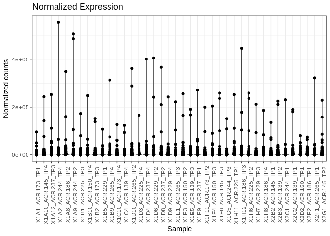<!-- -->

## 2.4 Plot variance stabilized data

``` r
Apul_counts_lncRNA_vsd_long <- Apul_counts_lncRNA_vsd %>%
  mutate(
    Gene_id = row.names(Apul_counts_lncRNA_vsd)
  ) %>%
  pivot_longer(-Gene_id)

Apul_counts_lncRNA_vsd_long %>%
  ggplot(., aes(x = name, y = value)) +
  geom_violin() +
  geom_point() +
  theme_bw() +
  theme(
    axis.text.x = element_text( angle = 90)
  ) +
  ylim(0, NA) +
  labs(
    title = "Variance Stabilized Expression",
    x = "Sample",
    y = "Variance stabilized data"
  )
```

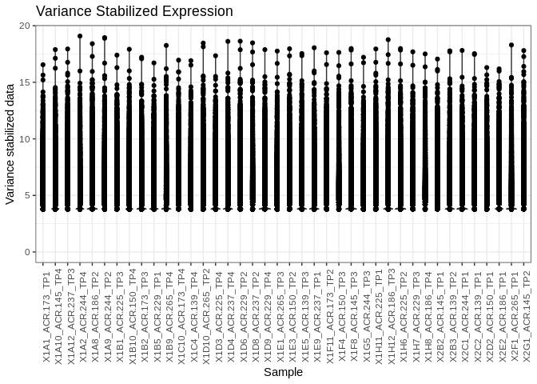<!-- -->

## 2.5 Normalized expression levels

Plot histograms of the normalized expression levels in each sample

``` r
# Melt the count matrix into long format
Apul_counts_norm_melted <- melt(Apul_counts_lncRNA_norm, variable.name = "sample", value.name = "counts")
```

    ## No id variables; using all as measure variables

``` r
# Plot the expression level histograms for each sample
ggplot(Apul_counts_norm_melted, aes(x = counts)) +
  geom_histogram(binwidth = 1, fill = "#408EC6", color = "black") +
  scale_x_log10() +  # Optional: Log-transform the x-axis for better visualization
  facet_wrap(~sample, scales = "free_y") +
  labs(title = "Gene Expression Level Histogram for Each Sample",
       x = "Expression Level (Counts)",
       y = "Frequency") +
  theme_minimal()
```

    ## Warning in scale_x_log10(): log-10 transformation introduced infinite values.

    ## Warning: Removed 405208 rows containing non-finite outside the scale range
    ## (`stat_bin()`).

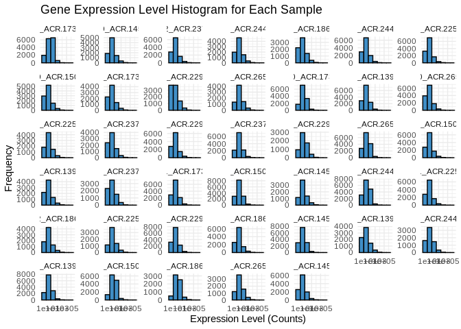<!-- -->

## 2.6 Normalized transcript counts

Check the total number of transcripts in each sample – now that we’ve
normalized the data these totals should be similar

``` r
# Calculate the total number of transcripts for each sample
total_transcripts_norm <- colSums(Apul_counts_lncRNA_norm)

# Create a data frame for plotting
total_transcripts_norm_df <- data.frame(sample = names(total_transcripts_norm),
                                   totals = total_transcripts_norm)

# Plot the total number of transcripts for each sample
ggplot(total_transcripts_norm_df, aes(x = reorder(sample, totals), y = totals)) +
  geom_bar(stat = "identity", fill = "#408EC6", color = "black") +
  geom_text(aes(label = totals), vjust = -0.3, size = 3.5) +
  labs(title = "Total Number of Transcripts per Sample",
       x = "Sample",
       y = "Total Transcripts") +
  theme_minimal() +
  theme(axis.text.x = element_text(angle = 45, hjust = 1))  # Rotate x-axis labels for readability
```

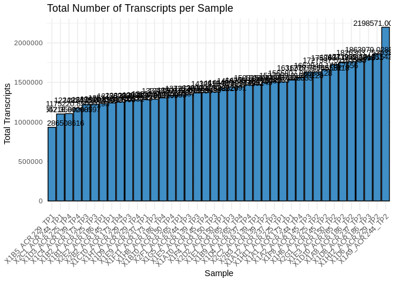<!-- -->

## 2.7 PCA of variance stabilized data

``` r
plotPCA(vsd_Apul_lncRNA, intgroup="time.point")
```

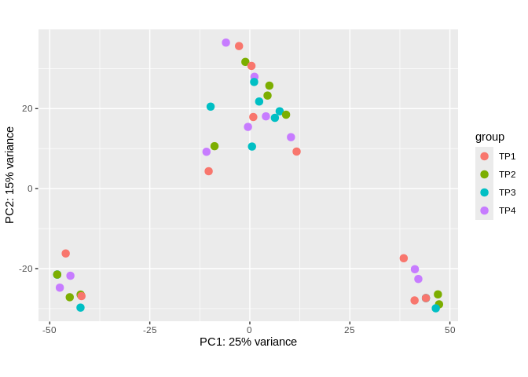<!-- -->

``` r
plotPCA(vsd_Apul_lncRNA, intgroup="colony.id")
```

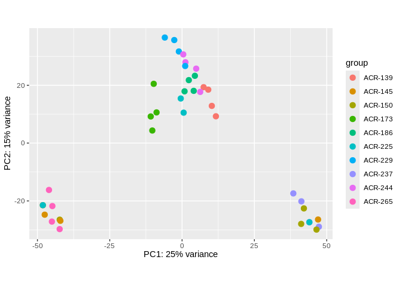<!-- -->
Samples are strongly clustering by colony. Interestingly time point
doesn’t appear to influence clustering.

## 2.8 Sample clustering

``` r
sample_dists <- dist(t(assay(vsd_Apul_lncRNA)))
pheatmap(as.matrix(sample_dists), 
         clustering_distance_rows = "euclidean", 
         clustering_distance_cols = "euclidean", 
         main="Sample Clustering")
```

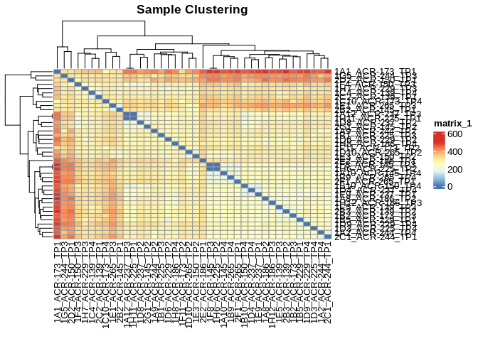<!-- -->
Samples are strongly clustering by colony.

## 2.9 Heatmaps

Of most variable variance stabilized lncRNA transcripts

``` r
# 75th quantile
heat_colors <- rev(brewer.pal(12, "RdYlBu"))
```

    ## Warning in brewer.pal(12, "RdYlBu"): n too large, allowed maximum for palette RdYlBu is 11
    ## Returning the palette you asked for with that many colors

``` r
pheatmap(Apul_counts_lncRNA_vsd_q75, 
         cluster_rows = TRUE,
         cluster_cols = TRUE,
         show_rownames = TRUE,
         show_colnames = TRUE,
         color = heat_colors,
         scale="row")
```

    ## Warning: The input is a data frame, convert it to the matrix.

    ## `use_raster` is automatically set to TRUE for a matrix with more than
    ## 2000 rows. You can control `use_raster` argument by explicitly setting
    ## TRUE/FALSE to it.
    ## 
    ## Set `ht_opt$message = FALSE` to turn off this message.

    ## 'magick' package is suggested to install to give better rasterization.
    ## 
    ## Set `ht_opt$message = FALSE` to turn off this message.

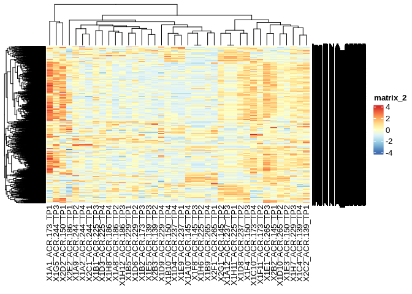<!-- -->

``` r
# 95th quantile
pheatmap(Apul_counts_lncRNA_vsd_q95, 
         cluster_rows = TRUE,
         cluster_cols = TRUE,
         show_rownames = TRUE,
         show_colnames = TRUE,
         color = heat_colors,
         scale="row")
```

    ## Warning: The input is a data frame, convert it to the matrix.

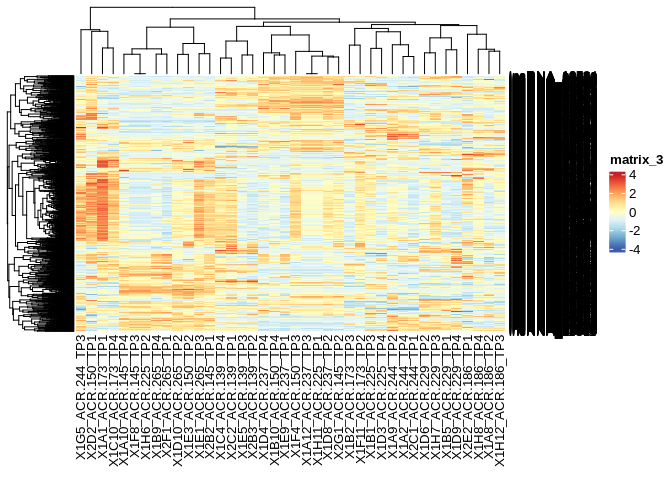<!-- -->
