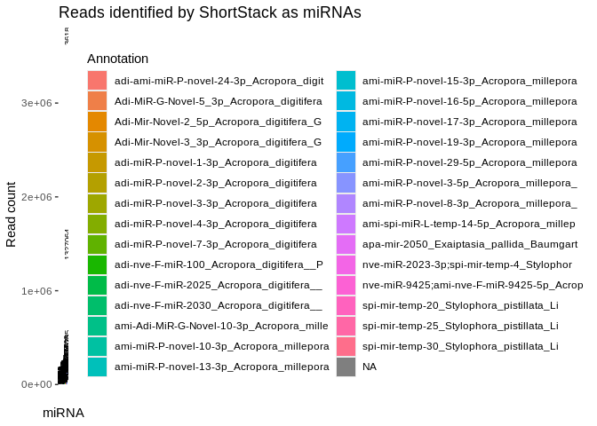
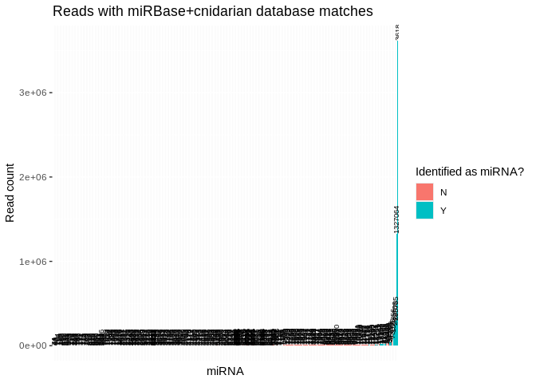
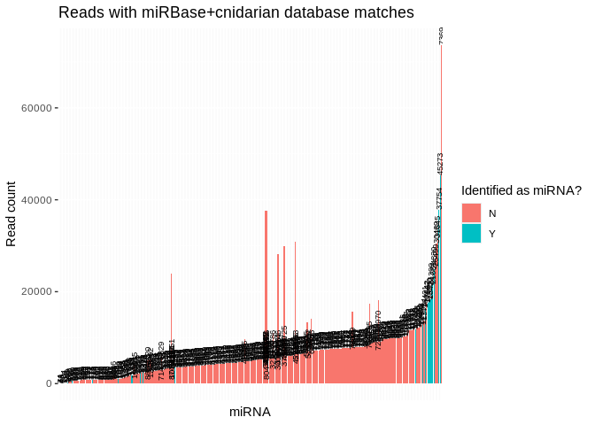

04-Apul-sRNA-discovery-ShortStack
================
Kathleen Durkin
2024-12-18

- [1 Set R variables](#1-set-r-variables)
- [2 Create a Bash variables file](#2-create-a-bash-variables-file)
- [3 Load ShortStack conda
  environment](#3-load-shortstack-conda-environment)
  - [3.1 A.pulchra genome](#31-apulchra-genome)
  - [3.2 Cnidarian+miRBase database](#32-cnidarianmirbase-database)
  - [3.3 Trimmed sRNA-seq reads](#33-trimmed-srna-seq-reads)
- [4 Run ShortStack](#4-run-shortstack)
  - [4.1 Modify genome filename for ShortStack
    compatability](#41-modify-genome-filename-for-shortstack-compatability)
  - [4.2 Excecute ShortStack command](#42-excecute-shortstack-command)
  - [4.3 Check runtime](#43-check-runtime)
- [5 Results](#5-results)
  - [5.1 ShortStack synopsis](#51-shortstack-synopsis)
  - [5.2 Inspect `Results.txt`](#52-inspect-resultstxt)
    - [5.2.1 Directory tree of all ShortStack
      outputs](#521-directory-tree-of-all-shortstack-outputs)
  - [5.3 Visualize](#53-visualize)
- [6 Citations](#6-citations)

Use [ShortStack](https://github.com/MikeAxtell/ShortStack) ([Axtell
2013](#ref-axtell2013a); [Shahid and Axtell 2014](#ref-shahid2014);
[Johnson et al. 2016](#ref-johnson2016a))to perform alignment of sRNAseq
data and annotation of sRNA-producing genes.

sRNA discovery, using *A. pulchra* genome for reference, using
[ShortStack
4.1.0](https://github.com/MikeAxtell/ShortStack?tab=readme-ov-file#shortstack-version-4-major-changes),
which provides much faster analysis times *and* additional functionality
for visualizing miRNA hairpin structures and generating
genome-browser-ready quantitative coverage tracks of aligned small RNAs.

As in `deep-dive` and `deep-dive-expression`, we will also use a
customized miRBase database, utilizing cnidarian miRNAs curated by Jill
Ashley, which includes published cnidarian miRNAs:

- [`cnidarian-mirbase-mature-v22.1.fasta`](../../data/cnidarian-mirbase-mature-v22.1.fasta)

------------------------------------------------------------------------

Inputs:

- Requires trimmed sRNAseq files generated in
  `01.10-D-Apul-sRNAseq-trimming-fastp-FastQC-MultiQC`

  - Filenames formatted: `*fastp-adapters-polyG-31bp-merged.fq.gz`

- *A.pulchra* genome FastA. Not currently publicly available (still
  being annotated by collaborators)

Outputs:

- See [ShortStack outputs
  documentation](https://github.com/MikeAxtell/ShortStack#outputs) for
  full list and detailed descriptions.

Software requirements:

- Utilizes a
  [ShortStack](https://github.com/MikeAxtell/ShortStack#installation)
  Conda/Mamba environment, per the installation instructions.

Replace with name of your ShortStack environment and the path to the
corresponding conda installation (find this *after* you’ve activated the
environment).

E.g.

``` bash
# Activate environment
conda activate ShortStack4_env

# Find conda path
which conda
```

------------------------------------------------------------------------

# 1 Set R variables

``` r
shortstack_conda_env_name <- c("ShortStack-4.1.0_env")
shortstack_cond_path <- c("/home/sam/programs/mambaforge/condabin/conda")
```

# 2 Create a Bash variables file

This allows usage of Bash variables across R Markdown chunks.

``` bash
{
echo "#### Assign Variables ####"
echo ""

echo "# Trimmed FastQ naming pattern"
echo "export trimmed_fastqs_pattern='*fastp-adapters-polyG-31bp-merged.fq.gz'"

echo "# Data directories"
echo 'export timeseries_dir=/home/shared/8TB_HDD_02/shedurkin/timeseries_molecular'
echo 'export timeseries_data_dir="${timeseries_dir}/M-multi-species/data"'
echo 'export output_dir_top=${timeseries_dir}/D-Apul/output/04-Apul-sRNA-discovery-ShortStack'
echo ""

echo "# Input/Output files"
echo 'export genome_fasta_dir=${timeseries_dir}/D-Apul/data'
echo 'export genome_fasta_name="Apulchra-genome.fa"'
echo 'export shortstack_genome_fasta_name="Apulchra-genome.fa"'
echo 'export trimmed_fastqs_dir="${timeseries_dir}/D-Apul/output/01.10-D-Apul-sRNAseq-trimming-fastp-FastQC-MultiQC/trimmed-fastqs-sRNA"'

echo 'export mirbase_mature_fasta_version=cnidarian-mirbase-mature-v22.1.fasta'
echo 'export genome_fasta="${genome_fasta_dir}/${shortstack_genome_fasta_name}"'
echo ""

echo "# Set number of CPUs to use"
echo 'export threads=40'
echo ""

echo "# Initialize arrays"
echo 'export trimmed_fastqs_array=()'


} > .bashvars

cat .bashvars
```

    #### Assign Variables ####

    # Trimmed FastQ naming pattern
    export trimmed_fastqs_pattern='*fastp-adapters-polyG-31bp-merged.fq.gz'
    # Data directories
    export timeseries_dir=/home/shared/8TB_HDD_02/shedurkin/timeseries_molecular
    export timeseries_data_dir="${timeseries_dir}/M-multi-species/data"
    export output_dir_top=${timeseries_dir}/D-Apul/output/04-Apul-sRNA-discovery-ShortStack

    # Input/Output files
    export genome_fasta_dir=${timeseries_dir}/D-Apul/data
    export genome_fasta_name="Apulchra-genome.fa"
    export shortstack_genome_fasta_name="Apulchra-genome.fa"
    export trimmed_fastqs_dir="${timeseries_dir}/D-Apul/output/01.10-D-Apul-sRNAseq-trimming-fastp-FastQC-MultiQC/trimmed-fastqs-sRNA"
    export mirbase_mature_fasta_version=cnidarian-mirbase-mature-v22.1.fasta
    export genome_fasta="${genome_fasta_dir}/${shortstack_genome_fasta_name}"

    # Set number of CPUs to use
    export threads=40

    # Initialize arrays
    export trimmed_fastqs_array=()

# 3 Load [ShortStack](https://github.com/MikeAxtell/ShortStack) conda environment

If this is successful, the first line of output should show that the
Python being used is the one in your
$$ShortStack$$(<https://github.com/MikeAxtell/ShortStack> conda
environment path.

E.g.

`python:         /home/sam/programs/mambaforge/envs/mirmachine_env/bin/python`

``` r
use_condaenv(condaenv = shortstack_conda_env_name, conda = shortstack_cond_path)
py_config()
```

    python:         /home/sam/programs/mambaforge/envs/ShortStack-4.1.0_env/bin/python
    libpython:      /home/sam/programs/mambaforge/envs/ShortStack-4.1.0_env/lib/libpython3.12.so
    pythonhome:     /home/sam/programs/mambaforge/envs/ShortStack-4.1.0_env:/home/sam/programs/mambaforge/envs/ShortStack-4.1.0_env
    version:        3.12.7 | packaged by conda-forge | (main, Oct  4 2024, 16:05:46) [GCC 13.3.0]
    numpy:          /home/sam/programs/mambaforge/envs/ShortStack-4.1.0_env/lib/python3.12/site-packages/numpy
    numpy_version:  2.1.1

    NOTE: Python version was forced by use_python() function

Note: I sometimes get an error “failed to initialize requested version
of Python,” which seems to stem from the `reticulate` package default
loading a python environment. I’ve been able to fix this by manually
uninstalling the `reticulate` package, then restarting R and
reinstalling `reticulate` before rerunning this code document. \#
Download reference files

## 3.1 A.pulchra genome

``` bash
# Load bash variables into memory
source .bashvars

wget -O ${genome_fasta_dir}/${shortstack_genome_fasta_name} "https://osf.io/download/kn96u/"
```

## 3.2 Cnidarian+miRBase database

Available in `deep-dive` repo,
[here](https://github.com/urol-e5/deep-dive/blob/main/data/cnidarian-mirbase-mature-v22.1.fasta)

``` bash
# Load bash variables into memory
source .bashvars

wget -O ${timeseries_data_dir}/"${mirbase_mature_fasta_version}" "https://raw.githubusercontent.com/urol-e5/deep-dive/refs/heads/main/data/cnidarian-mirbase-mature-v22.1.fasta"
```

``` bash
# Load bash variables into memory
source .bashvars

head -5 ${timeseries_data_dir}/"${mirbase_mature_fasta_version}"
```

    >cel-let-7-5p MIMAT0000001 Caenorhabditis elegans let-7-5p
    UGAGGUAGUAGGUUGUAUAGUU
    >cel-let-7-3p MIMAT0015091 Caenorhabditis elegans let-7-3p
    CUAUGCAAUUUUCUACCUUACC
    >cel-lin-4-5p MIMAT0000002 Caenorhabditis elegans lin-4-5p

## 3.3 Trimmed sRNA-seq reads

Trimmed in `01.10-D-Apul-sRNAseq-trimming-fastp-FastQC-MultiQC`

# 4 Run ShortStack

## 4.1 Modify genome filename for ShortStack compatability

``` bash
# Load bash variables into memory
source .bashvars

# Check for FastA file first
# Then create rename file if doesn't exist
if [ -f "${genome_fasta_dir}/${shortstack_genome_fasta_name}" ]; then
  echo "${genome_fasta_dir}/${shortstack_genome_fasta_name}"
  echo ""
  echo "Already exists. Nothing to do."
  echo ""
else

  # Copy genome FastA to ShortStack-compatible filename (ending with .fa)
  cp ${genome_fasta_dir}/${genome_fasta_name} ${genome_fasta_dir}/${shortstack_genome_fasta_name}
fi

# Confirm
ls -lh ${genome_fasta_dir}/${shortstack_genome_fasta_name}
```

    /home/shared/8TB_HDD_02/shedurkin/timeseries_molecular/D-Apul/data/Apulchra-genome.fa

    Already exists. Nothing to do.

    -rw-r--r-- 1 shedurkin labmembers 505M Oct  1 13:31 /home/shared/8TB_HDD_02/shedurkin/timeseries_molecular/D-Apul/data/Apulchra-genome.fa

## 4.2 Excecute ShortStack command

Uses the `--dn_mirna` option to identify miRNAs in the genome, without
relying on the `--known_miRNAs`.

This part of the code redirects the output of `time` to the end of
`shortstack.log` file.

- `; } \ 2>> ${output_dir_top}/shortstack.log`

``` bash
# Load bash variables into memory
source .bashvars

# Make output directory, if it doesn't exist
mkdir --parents "${output_dir_top}"

# Create array of trimmed FastQs
trimmed_fastqs_array=(${trimmed_fastqs_dir}/${trimmed_fastqs_pattern})


# Pass array contents to new variable as space-delimited list
trimmed_fastqs_list=$(echo "${trimmed_fastqs_array[*]}")


###### Run ShortStack ######
{ time \
ShortStack \
--genomefile "${genome_fasta}" \
--readfile ${trimmed_fastqs_list} \
--known_miRNAs ${timeseries_data_dir}/${mirbase_mature_fasta_version} \
--dn_mirna \
--threads ${threads} \
--outdir ${output_dir_top}/ShortStack_out \
&> ${output_dir_top}/shortstack.log ; } \
2>> ${output_dir_top}/shortstack.log
```

## 4.3 Check runtime

``` bash
# Load bash variables into memory
source .bashvars

tail -n 3 ${output_dir_top}/shortstack.log \
| grep "real" \
| awk '{print "ShortStack runtime:" "\t" $2}'
```

    ShortStack runtime: 70m35.956s

# 5 Results

## 5.1 ShortStack synopsis

``` bash
# Load bash variables into memory
source .bashvars

tail -n 25 ${output_dir_top}/shortstack.log
```

    Writing final files

    Found a total of 51 MIRNA loci


    Non-MIRNA loci by DicerCall:
    N 18768
    23 25
    22 21
    24 12
    21 8

    Creating visualizations of microRNA loci with strucVis
    <<< WARNING >>>
    Do not rely on these results alone to annotate new MIRNA loci!
    The false positive rate for de novo MIRNA identification is low, but NOT ZERO
    Insepct each mirna locus, especially the strucVis output, and see
    https://doi.org/10.1105/tpc.17.00851 , https://doi.org/10.1093/nar/gky1141

    Fri 20 Dec 2024 19:43:23 -0800 PST
    Run Completed!

    real    70m35.956s
    user    829m16.281s
    sys 269m7.808s

ShortStack identified 51 miRNAs among all of the A.pulchra samples. This
is a notably larger number than the 39 miRNAs identified in
`deep-dive-expression`, which examined only 5 colonies from a single
time point! I would guess the difference stems from either (a) our
capture of more intraspecific diversity, or (b) different miRNA profiles
associated with different environmental conditions (i.e. some A.pulchra
miRNAs are only expressed under certain conditions). The counts data
should give us more insight.

## 5.2 Inspect `Results.txt`

``` bash
# Load bash variables into memory
source .bashvars

head ${output_dir_top}/ShortStack_out/Results.txt

echo ""
echo "----------------------------------------------------------"
echo ""

echo "Nummber of potential loci:"
awk '(NR>1)' ${output_dir_top}/ShortStack_out/Results.txt | wc -l
```

    Locus   Name    Chrom   Start   End Length  Reads   DistinctSequences   FracTop Strand  MajorRNA    MajorRNAReads   Short   Long    21  22  23  24  DicerCall   MIRNA   known_miRNAs
    ntLink_7:3054-3472  Cluster_1   ntLink_7    3054    3472    419 625 186 0.032   -   UGAACGUAUUUUCUGAAGAAACUGCAAAG   45  6   600 2   4   7   6   N   N   NA
    ntLink_7:9758-10311 Cluster_2   ntLink_7    9758    10311   554 2797    336 0.857   +   GUCAAGUGCAUCGAUCAAGGAUGGAUCAGG  651 11  2685    6   32  20  43  N   N   NA
    ntLink_7:22562-22980    Cluster_3   ntLink_7    22562   22980   419 634 180 0.028   -   UCUUGAACGUAUUUUCUGAAGAAACUGC    37  7   608 2   1   5   11  N   N   NA
    ntLink_7:29267-29820    Cluster_4   ntLink_7    29267   29820   554 2881    361 0.859   +   GUCAAGUGCAUCGAUCAAGGAUGGAUCAGG  459 17  2764    9   34  26  31  N   N   NA
    ntLink_7:42050-42468    Cluster_5   ntLink_7    42050   42468   419 689 156 0.025   -   UCUGAAGAAACUGCAAAGUUCACUGUCCGC  105 2   675 0   1   6   5   N   N   NA
    ntLink_7:43122-43556    Cluster_6   ntLink_7    43122   43556   435 1774    435 0.045   -   UGCUAGACGAACCUCUGGAUCCGCU   152 41  1613    8   19  10  83  N   N   NA
    ntLink_7:48749-49302    Cluster_7   ntLink_7    48749   49302   554 2911    340 0.867   +   GUCAAGUGCAUCGAUCAAGGAUGGAUCAGG  680 13  2793    11  40  19  35  N   N   NA
    ntLink_7:61554-61972    Cluster_8   ntLink_7    61554   61972   419 678 169 0.021   -   UCUGAAGAAACUGCAAAGUUCACUGUCCGC  100 6   660 2   2   3   5   N   N   NA
    ntLink_7:68251-68804    Cluster_9   ntLink_7    68251   68804   554 3373    520 0.82    +   GUCAAGUGCAUCGAUCAAGGAUGGAUCAGG  728 49  3185    9   41  28  61  N   N   NA

    ----------------------------------------------------------

    Nummber of potential loci:
    18885

Column 20 of the `Results.txt` file identifies if a cluster is a miRNA
or not (`Y` or `N`).

``` bash
# Load bash variables into memory
source .bashvars

echo "Number of loci characterized as miRNA:"
awk '$20=="Y" {print $0}' ${output_dir_top}/ShortStack_out/Results.txt \
| wc -l
echo ""

echo "----------------------------------------------------------"

echo ""
echo "Number of loci _not_ characterized as miRNA:"
awk '$20=="N" {print $0}' ${output_dir_top}/ShortStack_out/Results.txt \
| wc -l
```

    Number of loci characterized as miRNA:
    51

    ----------------------------------------------------------

    Number of loci _not_ characterized as miRNA:
    18834

Column 21 of the `Results.txt` file identifies if a cluster aligned to a
known miRNA (miRBase) or not (`Y` or `NA`).

The `echo` command after the `awk` command is simply there to prove that
the chunk executed.

``` bash
# Load bash variables into memory
source .bashvars

echo "Number of loci matching miRBase miRNAs:"
awk '$21!="NA" {print $0}' ${output_dir_top}/ShortStack_out/Results.txt \
| wc -l
echo ""

echo "----------------------------------------------------------"

echo ""
echo "Number of loci _not_ matching miRBase miRNAs:"
awk '$21=="NA" {print $0}' ${output_dir_top}/ShortStack_out/Results.txt \
| wc -l
```

    Number of loci matching miRBase miRNAs:
    360

    ----------------------------------------------------------

    Number of loci _not_ matching miRBase miRNAs:
    18526

### 5.2.1 Directory tree of all ShortStack outputs

Many of these are large (by GitHub standards) BAM files, so will not be
added to the repo.

Additionally, it’s unlikely we’ll utilize most of the other files
(bigwig) generated by ShortStack.

``` bash
# Load bash variables into memory
source .bashvars

tree -h ${output_dir_top}/
```

    /home/shared/8TB_HDD_02/shedurkin/timeseries_molecular/D-Apul/output/04-Apul-sRNA-discovery-ShortStack/
    ├── [4.0K]  figures
    │   ├── [226K]  Apul_ShortStack_dbmatch_histogram.png
    │   ├── [340K]  Apul_ShortStack_dbmatch_histogram_reduced.png
    │   ├── [323K]  Apul_ShortStack_miRNA_histogram.png
    │   ├── [294K]  Apul_ShortStack_miRNA_histogram_reduced.png
    │   └── [202K]  Apul_ShortStack_venn.png
    ├── [ 53K]  shortstack.log
    └── [ 20K]  ShortStack_out
        ├── [ 28M]  1A10-fastp-adapters-polyG-31bp-merged_condensed.bam
        ├── [212K]  1A10-fastp-adapters-polyG-31bp-merged_condensed.bam.csi
        ├── [ 80M]  1A10-fastp-adapters-polyG-31bp-merged_condensed.fa
        ├── [ 32M]  1A12-fastp-adapters-polyG-31bp-merged_condensed.bam
        ├── [207K]  1A12-fastp-adapters-polyG-31bp-merged_condensed.bam.csi
        ├── [ 95M]  1A12-fastp-adapters-polyG-31bp-merged_condensed.fa
        ├── [ 37M]  1A1-fastp-adapters-polyG-31bp-merged_condensed.bam
        ├── [216K]  1A1-fastp-adapters-polyG-31bp-merged_condensed.bam.csi
        ├── [115M]  1A1-fastp-adapters-polyG-31bp-merged_condensed.fa
        ├── [ 48M]  1A2-fastp-adapters-polyG-31bp-merged_condensed.bam
        ├── [220K]  1A2-fastp-adapters-polyG-31bp-merged_condensed.bam.csi
        ├── [150M]  1A2-fastp-adapters-polyG-31bp-merged_condensed.fa
        ├── [ 37M]  1A8-fastp-adapters-polyG-31bp-merged_condensed.bam
        ├── [211K]  1A8-fastp-adapters-polyG-31bp-merged_condensed.bam.csi
        ├── [108M]  1A8-fastp-adapters-polyG-31bp-merged_condensed.fa
        ├── [ 59M]  1A9-fastp-adapters-polyG-31bp-merged_condensed.bam
        ├── [215K]  1A9-fastp-adapters-polyG-31bp-merged_condensed.bam.csi
        ├── [187M]  1A9-fastp-adapters-polyG-31bp-merged_condensed.fa
        ├── [ 33M]  1B10-fastp-adapters-polyG-31bp-merged_condensed.bam
        ├── [214K]  1B10-fastp-adapters-polyG-31bp-merged_condensed.bam.csi
        ├── [ 99M]  1B10-fastp-adapters-polyG-31bp-merged_condensed.fa
        ├── [ 39M]  1B1-fastp-adapters-polyG-31bp-merged_condensed.bam
        ├── [216K]  1B1-fastp-adapters-polyG-31bp-merged_condensed.bam.csi
        ├── [122M]  1B1-fastp-adapters-polyG-31bp-merged_condensed.fa
        ├── [ 35M]  1B2-fastp-adapters-polyG-31bp-merged_condensed.bam
        ├── [213K]  1B2-fastp-adapters-polyG-31bp-merged_condensed.bam.csi
        ├── [114M]  1B2-fastp-adapters-polyG-31bp-merged_condensed.fa
        ├── [ 66M]  1B5-fastp-adapters-polyG-31bp-merged_condensed.bam
        ├── [218K]  1B5-fastp-adapters-polyG-31bp-merged_condensed.bam.csi
        ├── [209M]  1B5-fastp-adapters-polyG-31bp-merged_condensed.fa
        ├── [ 31M]  1B9-fastp-adapters-polyG-31bp-merged_condensed.bam
        ├── [217K]  1B9-fastp-adapters-polyG-31bp-merged_condensed.bam.csi
        ├── [ 90M]  1B9-fastp-adapters-polyG-31bp-merged_condensed.fa
        ├── [ 30M]  1C10-fastp-adapters-polyG-31bp-merged_condensed.bam
        ├── [207K]  1C10-fastp-adapters-polyG-31bp-merged_condensed.bam.csi
        ├── [101M]  1C10-fastp-adapters-polyG-31bp-merged_condensed.fa
        ├── [ 42M]  1C4-fastp-adapters-polyG-31bp-merged_condensed.bam
        ├── [210K]  1C4-fastp-adapters-polyG-31bp-merged_condensed.bam.csi
        ├── [132M]  1C4-fastp-adapters-polyG-31bp-merged_condensed.fa
        ├── [ 47M]  1D10-fastp-adapters-polyG-31bp-merged_condensed.bam
        ├── [216K]  1D10-fastp-adapters-polyG-31bp-merged_condensed.bam.csi
        ├── [142M]  1D10-fastp-adapters-polyG-31bp-merged_condensed.fa
        ├── [ 61M]  1D3-fastp-adapters-polyG-31bp-merged_condensed.bam
        ├── [221K]  1D3-fastp-adapters-polyG-31bp-merged_condensed.bam.csi
        ├── [189M]  1D3-fastp-adapters-polyG-31bp-merged_condensed.fa
        ├── [ 53M]  1D4-fastp-adapters-polyG-31bp-merged_condensed.bam
        ├── [220K]  1D4-fastp-adapters-polyG-31bp-merged_condensed.bam.csi
        ├── [162M]  1D4-fastp-adapters-polyG-31bp-merged_condensed.fa
        ├── [ 58M]  1D6-fastp-adapters-polyG-31bp-merged_condensed.bam
        ├── [214K]  1D6-fastp-adapters-polyG-31bp-merged_condensed.bam.csi
        ├── [172M]  1D6-fastp-adapters-polyG-31bp-merged_condensed.fa
        ├── [ 35M]  1D8-fastp-adapters-polyG-31bp-merged_condensed.bam
        ├── [207K]  1D8-fastp-adapters-polyG-31bp-merged_condensed.bam.csi
        ├── [104M]  1D8-fastp-adapters-polyG-31bp-merged_condensed.fa
        ├── [ 49M]  1D9-fastp-adapters-polyG-31bp-merged_condensed.bam
        ├── [220K]  1D9-fastp-adapters-polyG-31bp-merged_condensed.bam.csi
        ├── [155M]  1D9-fastp-adapters-polyG-31bp-merged_condensed.fa
        ├── [ 41M]  1E1-fastp-adapters-polyG-31bp-merged_condensed.bam
        ├── [217K]  1E1-fastp-adapters-polyG-31bp-merged_condensed.bam.csi
        ├── [134M]  1E1-fastp-adapters-polyG-31bp-merged_condensed.fa
        ├── [ 67M]  1E3-fastp-adapters-polyG-31bp-merged_condensed.bam
        ├── [212K]  1E3-fastp-adapters-polyG-31bp-merged_condensed.bam.csi
        ├── [197M]  1E3-fastp-adapters-polyG-31bp-merged_condensed.fa
        ├── [ 26M]  1E5-fastp-adapters-polyG-31bp-merged_condensed.bam
        ├── [205K]  1E5-fastp-adapters-polyG-31bp-merged_condensed.bam.csi
        ├── [ 92M]  1E5-fastp-adapters-polyG-31bp-merged_condensed.fa
        ├── [ 42M]  1E9-fastp-adapters-polyG-31bp-merged_condensed.bam
        ├── [218K]  1E9-fastp-adapters-polyG-31bp-merged_condensed.bam.csi
        ├── [146M]  1E9-fastp-adapters-polyG-31bp-merged_condensed.fa
        ├── [ 33M]  1F11-fastp-adapters-polyG-31bp-merged_condensed.bam
        ├── [211K]  1F11-fastp-adapters-polyG-31bp-merged_condensed.bam.csi
        ├── [ 92M]  1F11-fastp-adapters-polyG-31bp-merged_condensed.fa
        ├── [ 47M]  1F4-fastp-adapters-polyG-31bp-merged_condensed.bam
        ├── [215K]  1F4-fastp-adapters-polyG-31bp-merged_condensed.bam.csi
        ├── [143M]  1F4-fastp-adapters-polyG-31bp-merged_condensed.fa
        ├── [ 27M]  1F8-fastp-adapters-polyG-31bp-merged_condensed.bam
        ├── [209K]  1F8-fastp-adapters-polyG-31bp-merged_condensed.bam.csi
        ├── [ 79M]  1F8-fastp-adapters-polyG-31bp-merged_condensed.fa
        ├── [ 58M]  1G5-fastp-adapters-polyG-31bp-merged_condensed.bam
        ├── [215K]  1G5-fastp-adapters-polyG-31bp-merged_condensed.bam.csi
        ├── [184M]  1G5-fastp-adapters-polyG-31bp-merged_condensed.fa
        ├── [ 32M]  1H11-fastp-adapters-polyG-31bp-merged_condensed.bam
        ├── [215K]  1H11-fastp-adapters-polyG-31bp-merged_condensed.bam.csi
        ├── [ 97M]  1H11-fastp-adapters-polyG-31bp-merged_condensed.fa
        ├── [ 28M]  1H12-fastp-adapters-polyG-31bp-merged_condensed.bam
        ├── [209K]  1H12-fastp-adapters-polyG-31bp-merged_condensed.bam.csi
        ├── [ 94M]  1H12-fastp-adapters-polyG-31bp-merged_condensed.fa
        ├── [ 52M]  1H6-fastp-adapters-polyG-31bp-merged_condensed.bam
        ├── [213K]  1H6-fastp-adapters-polyG-31bp-merged_condensed.bam.csi
        ├── [153M]  1H6-fastp-adapters-polyG-31bp-merged_condensed.fa
        ├── [ 53M]  1H7-fastp-adapters-polyG-31bp-merged_condensed.bam
        ├── [211K]  1H7-fastp-adapters-polyG-31bp-merged_condensed.bam.csi
        ├── [158M]  1H7-fastp-adapters-polyG-31bp-merged_condensed.fa
        ├── [ 34M]  1H8-fastp-adapters-polyG-31bp-merged_condensed.bam
        ├── [215K]  1H8-fastp-adapters-polyG-31bp-merged_condensed.bam.csi
        ├── [105M]  1H8-fastp-adapters-polyG-31bp-merged_condensed.fa
        ├── [ 53M]  2B2-fastp-adapters-polyG-31bp-merged_condensed.bam
        ├── [214K]  2B2-fastp-adapters-polyG-31bp-merged_condensed.bam.csi
        ├── [152M]  2B2-fastp-adapters-polyG-31bp-merged_condensed.fa
        ├── [ 59M]  2B3-fastp-adapters-polyG-31bp-merged_condensed.bam
        ├── [212K]  2B3-fastp-adapters-polyG-31bp-merged_condensed.bam.csi
        ├── [172M]  2B3-fastp-adapters-polyG-31bp-merged_condensed.fa
        ├── [ 55M]  2C1-fastp-adapters-polyG-31bp-merged_condensed.bam
        ├── [218K]  2C1-fastp-adapters-polyG-31bp-merged_condensed.bam.csi
        ├── [175M]  2C1-fastp-adapters-polyG-31bp-merged_condensed.fa
        ├── [ 61M]  2C2-fastp-adapters-polyG-31bp-merged_condensed.bam
        ├── [212K]  2C2-fastp-adapters-polyG-31bp-merged_condensed.bam.csi
        ├── [181M]  2C2-fastp-adapters-polyG-31bp-merged_condensed.fa
        ├── [ 45M]  2D2-fastp-adapters-polyG-31bp-merged_condensed.bam
        ├── [215K]  2D2-fastp-adapters-polyG-31bp-merged_condensed.bam.csi
        ├── [144M]  2D2-fastp-adapters-polyG-31bp-merged_condensed.fa
        ├── [ 40M]  2E2-fastp-adapters-polyG-31bp-merged_condensed.bam
        ├── [216K]  2E2-fastp-adapters-polyG-31bp-merged_condensed.bam.csi
        ├── [115M]  2E2-fastp-adapters-polyG-31bp-merged_condensed.fa
        ├── [ 51M]  2F1-fastp-adapters-polyG-31bp-merged_condensed.bam
        ├── [212K]  2F1-fastp-adapters-polyG-31bp-merged_condensed.bam.csi
        ├── [133M]  2F1-fastp-adapters-polyG-31bp-merged_condensed.fa
        ├── [ 46M]  2G1-fastp-adapters-polyG-31bp-merged_condensed.bam
        ├── [210K]  2G1-fastp-adapters-polyG-31bp-merged_condensed.bam.csi
        ├── [132M]  2G1-fastp-adapters-polyG-31bp-merged_condensed.fa
        ├── [219K]  alignment_details.tsv
        ├── [2.8M]  Counts.txt
        ├── [110K]  known_miRNAs.gff3
        ├── [1.8M]  known_miRNAs_unaligned.fasta
        ├── [1.6G]  merged_alignments.bam
        ├── [184K]  merged_alignments.bam.csi
        ├── [ 14K]  mir.fasta
        ├── [1.9M]  Results.gff3
        ├── [2.7M]  Results.txt
        └── [4.0K]  strucVis
            ├── [9.8K]  Cluster_10452.ps.pdf
            ├── [9.0K]  Cluster_10452.txt
            ├── [9.2K]  Cluster_11565.ps.pdf
            ├── [3.6K]  Cluster_11565.txt
            ├── [8.4K]  Cluster_12081.ps.pdf
            ├── [3.1K]  Cluster_12081.txt
            ├── [8.4K]  Cluster_12083.ps.pdf
            ├── [3.0K]  Cluster_12083.txt
            ├── [8.6K]  Cluster_12087.ps.pdf
            ├── [3.1K]  Cluster_12087.txt
            ├── [8.9K]  Cluster_13327.ps.pdf
            ├── [ 12K]  Cluster_13327.txt
            ├── [7.8K]  Cluster_13647.ps.pdf
            ├── [1.7K]  Cluster_13647.txt
            ├── [ 10K]  Cluster_14146.ps.pdf
            ├── [ 27K]  Cluster_14146.txt
            ├── [ 12K]  Cluster_14165.ps.pdf
            ├── [ 59K]  Cluster_14165.txt
            ├── [ 10K]  Cluster_14532.ps.pdf
            ├── [ 70K]  Cluster_14532.txt
            ├── [9.2K]  Cluster_14605.ps.pdf
            ├── [ 15K]  Cluster_14605.txt
            ├── [ 10K]  Cluster_14610.ps.pdf
            ├── [ 10K]  Cluster_14610.txt
            ├── [7.9K]  Cluster_14633.ps.pdf
            ├── [1.9K]  Cluster_14633.txt
            ├── [9.3K]  Cluster_14692.ps.pdf
            ├── [ 13K]  Cluster_14692.txt
            ├── [8.9K]  Cluster_15097.ps.pdf
            ├── [ 17K]  Cluster_15097.txt
            ├── [ 11K]  Cluster_16354.ps.pdf
            ├── [ 83K]  Cluster_16354.txt
            ├── [ 11K]  Cluster_17173.ps.pdf
            ├── [ 79K]  Cluster_17173.txt
            ├── [ 10K]  Cluster_17186.ps.pdf
            ├── [ 32K]  Cluster_17186.txt
            ├── [ 11K]  Cluster_17192.ps.pdf
            ├── [ 97K]  Cluster_17192.txt
            ├── [8.8K]  Cluster_17245.ps.pdf
            ├── [ 34K]  Cluster_17245.txt
            ├── [8.7K]  Cluster_17623.ps.pdf
            ├── [8.1K]  Cluster_17623.txt
            ├── [ 10K]  Cluster_1819.ps.pdf
            ├── [ 14K]  Cluster_1819.txt
            ├── [9.8K]  Cluster_1832.ps.pdf
            ├── [ 56K]  Cluster_1832.txt
            ├── [9.7K]  Cluster_1833.ps.pdf
            ├── [4.3K]  Cluster_1833.txt
            ├── [8.7K]  Cluster_1836.ps.pdf
            ├── [ 60K]  Cluster_1836.txt
            ├── [ 11K]  Cluster_1865.ps.pdf
            ├── [ 39K]  Cluster_1865.txt
            ├── [ 11K]  Cluster_1950.ps.pdf
            ├── [ 33K]  Cluster_1950.txt
            ├── [ 11K]  Cluster_1951.ps.pdf
            ├── [ 23K]  Cluster_1951.txt
            ├── [ 11K]  Cluster_2372.ps.pdf
            ├── [ 50K]  Cluster_2372.txt
            ├── [ 11K]  Cluster_2500.ps.pdf
            ├── [7.9K]  Cluster_2500.txt
            ├── [9.7K]  Cluster_2746.ps.pdf
            ├── [ 29K]  Cluster_2746.txt
            ├── [ 10K]  Cluster_3109.ps.pdf
            ├── [7.9K]  Cluster_3109.txt
            ├── [ 10K]  Cluster_3226.ps.pdf
            ├── [ 46K]  Cluster_3226.txt
            ├── [ 10K]  Cluster_3227.ps.pdf
            ├── [ 48K]  Cluster_3227.txt
            ├── [9.9K]  Cluster_3301.ps.pdf
            ├── [ 33K]  Cluster_3301.txt
            ├── [9.8K]  Cluster_4026.ps.pdf
            ├── [6.6K]  Cluster_4026.txt
            ├── [9.1K]  Cluster_4034.ps.pdf
            ├── [ 43K]  Cluster_4034.txt
            ├── [ 10K]  Cluster_4036.ps.pdf
            ├── [8.5K]  Cluster_4036.txt
            ├── [ 12K]  Cluster_4752.ps.pdf
            ├── [ 85K]  Cluster_4752.txt
            ├── [ 11K]  Cluster_4754.ps.pdf
            ├── [ 20K]  Cluster_4754.txt
            ├── [ 10K]  Cluster_5516.ps.pdf
            ├── [ 15K]  Cluster_5516.txt
            ├── [ 12K]  Cluster_5517.ps.pdf
            ├── [ 64K]  Cluster_5517.txt
            ├── [ 11K]  Cluster_5603.ps.pdf
            ├── [ 37K]  Cluster_5603.txt
            ├── [8.8K]  Cluster_5685.ps.pdf
            ├── [1.9K]  Cluster_5685.txt
            ├── [ 10K]  Cluster_9366.ps.pdf
            ├── [ 20K]  Cluster_9366.txt
            ├── [ 10K]  Cluster_9380.ps.pdf
            ├── [ 64K]  Cluster_9380.txt
            ├── [ 11K]  Cluster_9420.ps.pdf
            ├── [ 36K]  Cluster_9420.txt
            ├── [ 11K]  Cluster_9512.ps.pdf
            ├── [ 66K]  Cluster_9512.txt
            ├── [ 10K]  Cluster_9532.ps.pdf
            ├── [ 15K]  Cluster_9532.txt
            ├── [9.9K]  Cluster_9706.ps.pdf
            ├── [ 31K]  Cluster_9706.txt
            ├── [ 11K]  Cluster_9786.ps.pdf
            └── [ 87K]  Cluster_9786.txt

    3 directories, 237 files

## 5.3 Visualize

We noticed that a) not all of the identified miRNAs have database
matches, and b) some reads have a match in the database but are *not*
classified as miRNAs. Let’s look at this in more depth.

``` r
Apul_shortstack_results <- read.csv("../output/04-Apul-sRNA-discovery-ShortStack/ShortStack_out/Results.txt", sep="\t")
```

``` r
# Reads identified as miRNAs (but not necessarily known)
Apul_shortstack_results %>% 
  filter(MIRNA == "Y") %>%
  mutate(known_miRNAs = str_sub(known_miRNAs, 1, 40)) %>%
  mutate(Locus = str_sub(Locus, 20, 40)) %>%
  ggplot(aes(x = reorder(Locus, Reads), y = Reads, fill = known_miRNAs)) +
  geom_bar(stat = "identity") +
   geom_text(aes(label = Reads), vjust = 0.5, hjust = 0, color = "black", size = 2.5, angle = 90) +
  labs(x = "miRNA", y = "Read count", 
       title = "Reads identified by ShortStack as miRNAs",
       fill = "Annotation") +
  theme(axis.text.x = element_blank(),
        axis.ticks.x = element_blank())
```

<!-- -->

``` r
ggsave("../output/04-Apul-sRNA-discovery-ShortStack/figures/Apul_ShortStack_miRNA_histogram.png", width = 12, height = 7, units = "in")


# Reads matched in the reference db (but not necessarily identified as miRNA)
Apul_shortstack_results %>% 
  filter(!is.na(known_miRNAs)) %>%
  mutate(known_miRNAs = str_sub(known_miRNAs, 1, 40)) %>%
  mutate(Locus = str_sub(Locus, 20, 40)) %>%
  ggplot(aes(x = reorder(Locus, Reads), y = Reads, fill = MIRNA)) +
  geom_bar(stat = "identity") +
  geom_text(aes(label = Reads), vjust = 0.5, hjust = 0, color = "black", size = 2.5, angle = 90) +
  labs(x = "miRNA", y = "Read count", 
       title = "Reads with miRBase+cnidarian database matches",
       fill = "Identified as miRNA?") +
  theme(axis.text.x = element_blank(),
        axis.ticks.x = element_blank())
```

<!-- -->

``` r
ggsave("../output/04-Apul-sRNA-discovery-ShortStack/figures/Apul_ShortStack_dbmatch_histogram.png", width = 12, height = 7, units = "in")
```

There’s a few miRNAs with very high read counts, and it’s making
visualization of the rest difficult. Let’s remove them and retry
visualizing the rest.

``` r
# Reads identified as miRNAs (but not necessarily known)
Apul_shortstack_results %>% 
  filter(MIRNA == "Y") %>%
  filter(Reads < 100000) %>%
  mutate(known_miRNAs = str_sub(known_miRNAs, 1, 40)) %>%
  mutate(Locus = str_sub(Locus, 20, 40)) %>%
  ggplot(aes(x = reorder(Locus, Reads), y = Reads, fill = known_miRNAs)) +
  geom_bar(stat = "identity") +
   geom_text(aes(label = Reads), vjust = 0.5, hjust = 0, color = "black", size = 2.5, angle = 90) +
  labs(x = "miRNA", y = "Read count", 
       title = "Reads identified by ShortStack as miRNAs",
       fill = "Annotation") +
  theme(axis.text.x = element_blank(),
        axis.ticks.x = element_blank())
```

<!-- -->

``` r
ggsave("../output/04-Apul-sRNA-discovery-ShortStack/figures/Apul_ShortStack_miRNA_histogram_reduced.png", width = 12, height = 7, units = "in")


# Reads matched in the reference db (but not necessarily identified as miRNA)
Apul_shortstack_results %>% 
  filter(!is.na(known_miRNAs)) %>%
  filter(Reads < 100000) %>%
  mutate(known_miRNAs = str_sub(known_miRNAs, 1, 40)) %>%
  mutate(Locus = str_sub(Locus, 20, 40)) %>%
  ggplot(aes(x = reorder(Locus, Reads), y = Reads, fill = MIRNA)) +
  geom_bar(stat = "identity") +
  geom_text(aes(label = Reads), vjust = 0.5, hjust = 0, color = "black", size = 2.5, angle = 90) +
  labs(x = "miRNA", y = "Read count", 
       title = "Reads with miRBase+cnidarian database matches",
       fill = "Identified as miRNA?") +
  theme(axis.text.x = element_blank(),
        axis.ticks.x = element_blank())
```

<!-- -->

``` r
ggsave("../output/04-Apul-sRNA-discovery-ShortStack/figures/Apul_ShortStack_dbmatch_histogram_reduced.png", width = 12, height = 7, units = "in")
```

It seems like an sRNa is both more likely to be previously described and
to have been annoted by ShortStack as an miRNA if it is more highly
expressed.

``` r
# Make list
mirnas <- Apul_shortstack_results %>% filter(MIRNA == "Y") %>% pull(Locus)
matches <- Apul_shortstack_results %>% filter(!is.na(known_miRNAs)) %>% pull(Locus)

Apul_shortstack_vennlist <- list(
  "Identified as miRNA" = mirnas,
  "Database match" = matches
)

# Make venn diagrams
ggvenn(Apul_shortstack_vennlist)
```

<!-- -->

``` r
ggsave("../output/04-Apul-sRNA-discovery-ShortStack/figures/Apul_ShortStack_venn.png", width = 12, height = 7, units = "in")
```

------------------------------------------------------------------------

# 6 Citations

<div id="refs" class="references csl-bib-body hanging-indent">

<div id="ref-axtell2013a" class="csl-entry">

Axtell, Michael J. 2013. “ShortStack: Comprehensive Annotation and
Quantification of Small RNA Genes.” *RNA* 19 (6): 740–51.
<https://doi.org/10.1261/rna.035279.112>.

</div>

<div id="ref-johnson2016a" class="csl-entry">

Johnson, Nathan R, Jonathan M Yeoh, Ceyda Coruh, and Michael J Axtell.
2016. “Improved Placement of Multi-Mapping Small RNAs.” *G3
Genes\|Genomes\|Genetics* 6 (7): 2103–11.
<https://doi.org/10.1534/g3.116.030452>.

</div>

<div id="ref-shahid2014" class="csl-entry">

Shahid, Saima, and Michael J. Axtell. 2014. “Identification and
Annotation of Small RNA Genes Using ShortStack.” *Methods* 67 (1):
20–27. <https://doi.org/10.1016/j.ymeth.2013.10.004>.

</div>

</div>
