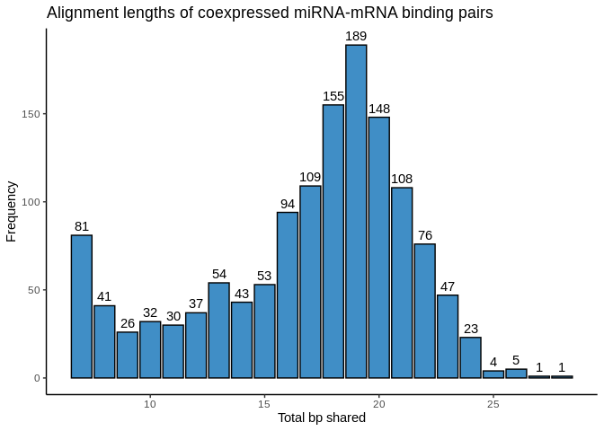
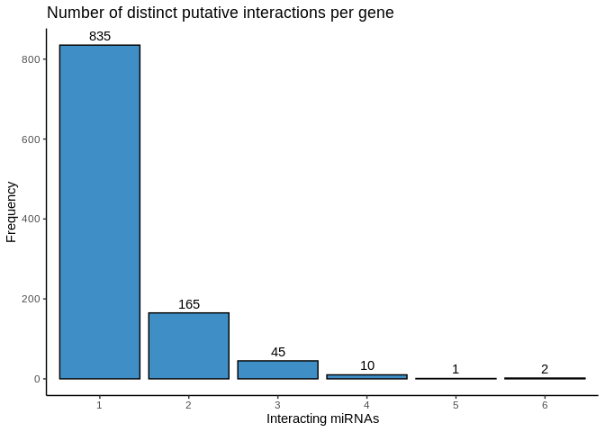
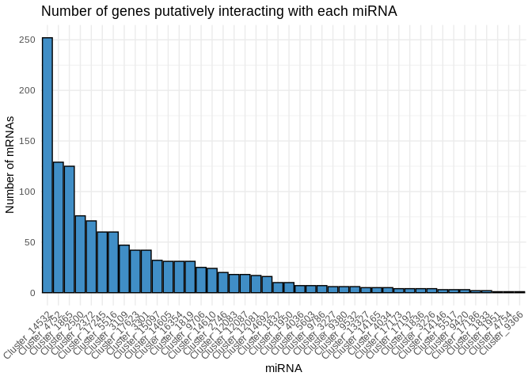

13-Apul-miRNA-mRNA-analysis-comparisons
================
Kathleen Durkin
2024-12-19

- <a href="#1-binding--coexpression-miranda--pearsons-correlation"
  id="toc-1-binding--coexpression-miranda--pearsons-correlation">1 Binding
  + Coexpression (miRanda + Pearson’s correlation)</a>
- <a href="#2-functional-annotation-of-bindingcoexpressed-genes"
  id="toc-2-functional-annotation-of-bindingcoexpressed-genes">2
  Functional Annotation of binding/coexpressed genes</a>

``` r
# load packages
library(dplyr)
```

    ## 
    ## Attaching package: 'dplyr'

    ## The following objects are masked from 'package:stats':
    ## 
    ##     filter, lag

    ## The following objects are masked from 'package:base':
    ## 
    ##     intersect, setdiff, setequal, union

``` r
library(tidyr)
library(ggplot2)
```

What DEGs are also expected to interact with miRNA?

``` r
tp1.v.tp2 <- read.csv("../output/03.00-D-Apul-RNAseq-gene-expression-DESeq2/tp1.v.tp2.results.table.csv")
tp1.v.tp2 <- rename(tp1.v.tp2, "geneID" = "X")

tp1.v.tp3 <- read.csv("../output/03.00-D-Apul-RNAseq-gene-expression-DESeq2/tp1.v.tp3.results.table.csv")
tp1.v.tp3 <- rename(tp1.v.tp3, "geneID" = "X")

tp1.v.tp4 <- read.csv("../output/03.00-D-Apul-RNAseq-gene-expression-DESeq2/tp1.v.tp4.results.table.csv")
tp1.v.tp4 <- rename(tp1.v.tp4, "geneID" = "X")

tp2.v.tp3 <- read.csv("../output/03.00-D-Apul-RNAseq-gene-expression-DESeq2/tp2.v.tp3.results.table.csv")
tp2.v.tp3 <- rename(tp2.v.tp3, "geneID" = "X")

tp2.v.tp4 <- read.csv("../output/03.00-D-Apul-RNAseq-gene-expression-DESeq2/tp2.v.tp4.results.table.csv")
tp2.v.tp4 <- rename(tp2.v.tp4, "geneID" = "X")

tp3.v.tp4 <- read.csv("../output/03.00-D-Apul-RNAseq-gene-expression-DESeq2/tp3.v.tp4.results.table.csv")
tp3.v.tp4 <- rename(tp3.v.tp4, "geneID" = "X")
```

Timepoints 2 vs 4 has the most DEGs

``` r
paste("Of ", nrow(tp1.v.tp2), " genes")
```

    ## [1] "Of  44371  genes"

``` r
paste("")
```

    ## [1] ""

``` r
paste("tp1 vs tp2: ", nrow(filter(tp1.v.tp2, padj < 0.05)))
```

    ## [1] "tp1 vs tp2:  623"

``` r
paste("tp1 vs tp3: ", nrow(filter(tp1.v.tp3, padj < 0.05)))
```

    ## [1] "tp1 vs tp3:  293"

``` r
paste("tp1 vs tp4: ", nrow(filter(tp1.v.tp4, padj < 0.05)))
```

    ## [1] "tp1 vs tp4:  341"

``` r
paste("tp2 vs tp3: ", nrow(filter(tp2.v.tp3, padj < 0.05)))
```

    ## [1] "tp2 vs tp3:  349"

``` r
paste("tp2 vs tp4: ", nrow(filter(tp2.v.tp4, padj < 0.05)))
```

    ## [1] "tp2 vs tp4:  684"

``` r
paste("tp3 vs tp4: ", nrow(filter(tp3.v.tp4, padj < 0.05)))
```

    ## [1] "tp3 vs tp4:  461"

These DEG counts make sense with our PCA, which shows timepoints 1 and 4
clustering more closely together, and timepoints 2 and 3 clustering more
closely together.

Read in miRanda results (miRNAs binding to 3UTRs)

``` r
miRanda <- read.table("../output/07-Apul-miRNA-mRNA-miRanda/Apul-miRanda-3UTR-strict-parsed-geneIDs.txt", header = FALSE, sep = "\t")
```

Annotate pairwise comparison results with putative miRNA interactions

``` r
# Some UTRs are associated with 2 gene IDs (due to the genes sitting very close to each other)
# Expand those geneIDs into multiple rows
miRanda_expand <- miRanda %>%
  separate_rows(V10, sep = ",")  # Split the FUN column by commas into multiple rows

tp1.v.tp2.miRanda <- left_join(tp1.v.tp2, miRanda, by = c("geneID" = "V10"))
tp1.v.tp2.miRanda$V1 <- gsub(">", "", tp1.v.tp2.miRanda$V1)
tp1.v.tp2.miRanda$V1 <- gsub("\\..*", "", tp1.v.tp2.miRanda$V1)

tp1.v.tp3.miRanda <- left_join(tp1.v.tp3, miRanda, by = c("geneID" = "V10"))
tp1.v.tp3.miRanda$V1 <- gsub(">", "", tp1.v.tp3.miRanda$V1)
tp1.v.tp3.miRanda$V1 <- gsub("\\..*", "", tp1.v.tp3.miRanda$V1)

tp1.v.tp4.miRanda <- left_join(tp1.v.tp4, miRanda, by = c("geneID" = "V10"))
tp1.v.tp4.miRanda$V1 <- gsub(">", "", tp1.v.tp4.miRanda$V1)
tp1.v.tp4.miRanda$V1 <- gsub("\\..*", "", tp1.v.tp4.miRanda$V1)

tp2.v.tp3.miRanda <- left_join(tp2.v.tp3, miRanda, by = c("geneID" = "V10"))
tp2.v.tp3.miRanda$V1 <- gsub(">", "", tp2.v.tp3.miRanda$V1)
tp2.v.tp3.miRanda$V1 <- gsub("\\..*", "", tp2.v.tp3.miRanda$V1)

tp2.v.tp4.miRanda <- left_join(tp2.v.tp4, miRanda, by = c("geneID" = "V10"))
tp2.v.tp4.miRanda$V1 <- gsub(">", "", tp2.v.tp4.miRanda$V1)
tp2.v.tp4.miRanda$V1 <- gsub("\\..*", "", tp2.v.tp4.miRanda$V1)

tp3.v.tp4.miRanda <- left_join(tp3.v.tp4, miRanda, by = c("geneID" = "V10"))
tp3.v.tp4.miRanda$V1 <- gsub(">", "", tp3.v.tp4.miRanda$V1)
tp3.v.tp4.miRanda$V1 <- gsub("\\..*", "", tp3.v.tp4.miRanda$V1)
```

Keep in mind that, since an miRNA may be predicted to bind at multiple
places in a single 3UTR, or multiple miRNAs may be predicted to bind to
the same 3UTR, this table no longer contains a single row for each gene
ID.

This table essentially shows every miRNA-3UTR predicted interaction and
the DESeq2 pairwise expression comparison for the gene associated with
that gene.

Let’s take a look. We’ll filter to significant DEGs (padj \< 0.05). In
cnidarians, miRNA-mRNA binding is believed to require near-complete
complementarity of the full mature miRNA, similarly to plants, so we may
want to look at how many putative interactions are predicted for a
binding length of at least 20 nucleotides (the length of our smallest
mature miRNA is 21) and 80% alignment rate (allows for 4 mismatches in a
20bp alignment). Finally, we should remove the duplicates caused by an
miRNA putatively binding to multiple places in the 3UTR – multiple
putative binding sites still indicate one miRNA-mRNA binding pair.

``` r
paste("Column descriptions:")
```

    ## [1] "Column descriptions:"

``` r
paste("Number of putative miRNA-DEG interactions")
```

    ## [1] "Number of putative miRNA-DEG interactions"

``` r
paste("Number of putative miRNA-DEG interactions (at least 20bp binding)")
```

    ## [1] "Number of putative miRNA-DEG interactions (at least 20bp binding)"

``` r
paste("Number of putative miRNA-DEG interactions(at least 20bp binding, max 4 mismatches)")
```

    ## [1] "Number of putative miRNA-DEG interactions(at least 20bp binding, max 4 mismatches)"

``` r
z <- data.frame(
  pairwise = c("tp1_tp2", "tp1_tp3", "tp1_tp4", "tp2_tp3", "tp2_tp4", "tp3_tp4"), 
  miRNA_DEG = c(tp1.v.tp2.miRanda %>% filter(padj < 0.05) %>% distinct(geneID, V1) %>% nrow(), 
                tp1.v.tp3.miRanda %>% filter(padj < 0.05) %>% distinct(geneID, V1) %>% nrow(), 
                tp1.v.tp4.miRanda %>% filter(padj < 0.05) %>% distinct(geneID, V1) %>% nrow(), 
                tp2.v.tp3.miRanda %>% filter(padj < 0.05) %>% distinct(geneID, V1) %>% nrow(), 
                tp2.v.tp4.miRanda %>% filter(padj < 0.05) %>% distinct(geneID, V1) %>% nrow(), 
                tp3.v.tp4.miRanda %>% filter(padj < 0.05) %>% distinct(geneID, V1) %>% nrow()), 
  miRNA_DEG_20bp = c(tp1.v.tp2.miRanda %>% filter(padj < 0.05) %>% filter(V7 > 19) %>% distinct(geneID, V1) %>% nrow(), 
                tp1.v.tp3.miRanda %>% filter(padj < 0.05) %>% filter(V7 > 19) %>% distinct(geneID, V1) %>% nrow(), 
                tp1.v.tp4.miRanda %>% filter(padj < 0.05) %>% filter(V7 > 19) %>% distinct(geneID, V1) %>% nrow(), 
                tp2.v.tp3.miRanda %>% filter(padj < 0.05) %>% filter(V7 > 19) %>% distinct(geneID, V1) %>% nrow(), 
                tp2.v.tp4.miRanda %>% filter(padj < 0.05) %>% filter(V7 > 19) %>% distinct(geneID, V1) %>% nrow(), 
                tp3.v.tp4.miRanda %>% filter(padj < 0.05) %>% filter(V7 > 19) %>% distinct(geneID, V1) %>% nrow()),
  miRNA_DEG_20bp_4mis = c(tp1.v.tp2.miRanda %>% filter(padj < 0.05) %>% filter(V7 > 19) %>% filter(V8 > 80) %>% distinct(geneID, V1) %>% nrow(), 
                tp1.v.tp3.miRanda %>% filter(padj < 0.05) %>% filter(V7 > 19) %>% filter(V8 > 80) %>% distinct(geneID, V1) %>% nrow(), 
                tp1.v.tp4.miRanda %>% filter(padj < 0.05) %>% filter(V7 > 19) %>% filter(V8 > 80) %>% distinct(geneID, V1) %>% nrow(), 
                tp2.v.tp3.miRanda %>% filter(padj < 0.05) %>% filter(V7 > 19) %>% filter(V8 > 80) %>% distinct(geneID, V1) %>% nrow(), 
                tp2.v.tp4.miRanda %>% filter(padj < 0.05) %>% filter(V7 > 19) %>% filter(V8 > 80) %>% distinct(geneID, V1) %>% nrow(), 
                tp3.v.tp4.miRanda %>% filter(padj < 0.05) %>% filter(V7 > 19) %>% filter(V8 > 80) %>% distinct(geneID, V1) %>% nrow())
)
z
```

    ##   pairwise miRNA_DEG miRNA_DEG_20bp miRNA_DEG_20bp_4mis
    ## 1  tp1_tp2      1950            498                  17
    ## 2  tp1_tp3       917            246                  13
    ## 3  tp1_tp4      1013            255                  13
    ## 4  tp2_tp3      1056            275                   7
    ## 5  tp2_tp4      2156            570                  29
    ## 6  tp3_tp4      1424            347                  17

# 1 Binding + Coexpression (miRanda + Pearson’s correlation)

Jill was able to run the miRNA-gene expression Pearson’s correlation
code (`14-Apul-miRNA-mRNA-coexpression`) for me, so let’s look at those
results.

``` r
# Load in results
pcc_miRanda_all <- read.csv("../output/14-Apul-miRNA-mRNA-coexpression/pcc_miranda_interactions.csv") %>% select(-X)
pcc_miRanda_sig <- read.csv("../output/14-Apul-miRNA-mRNA-coexpression/pcc_pairs_of_interest.csv") %>% select(-X)

pcc_miRanda_all %>% filter(p_value < 0.05) %>% nrow()
```

    ## [1] 10712

``` r
pcc_miRanda_all %>% filter(p_value < 0.01) %>% nrow()
```

    ## [1] 4312

``` r
pcc_miRanda_all %>% filter(p_value < 0.001) %>% nrow()
```

    ## [1] 1347

``` r
pcc_miRanda_sig %>% nrow()
```

    ## [1] 1357

``` r
pcc_miRanda_sig %>% filter(p_value < 0.001) %>% nrow()
```

    ## [1] 1347

So 10,712 putative miRNA-mRNA interactions predicted by miRanda are also
significantly correlated in expression with a significance level of
0.05. For p \< 0.01, expression of 4,312 putative interactions are
significantly correlated. For p \< 0.001, 1,347 are significant.

Note that the “pcc_pairs_of_interest” are interactions that are
coexpressed with a correlation magnitude of at least 0.5 and a p \<
0.05, but this ends up being essentially the same as a p \< 0.001
significance level.

It’s believed that cnidarian miRNAs act more like than plant miRNAs than
other animals, requiring more complete complementarity of the full
mature miRNA to bind (in comparison, most animal miRNAs require only
complementarity of the \~8bp “seed” region). For our putative miRNA-mRNA
interactions, what is the distribution of shared bp?

``` r
pcc_miRanda_sig %>%
  ggplot(aes(x = total_bp_shared)) +
  geom_bar(fill = "#408EC6", color = "black") +
  labs(title = "Alignment lengths of coexpressed miRNA-mRNA binding pairs", x = "Total bp shared", y = "Frequency") +
  theme_classic() +
  # Add text labels on top of the bars
  geom_text(stat = 'count', aes(label = after_stat(count)), vjust = -0.5, color = "black")  # vjust to adjust the position
```

<!-- -->

Interesting! I see two “spikes”. The 7-8bp spike could indicate seed
binding, and the 16-22bp hump could represent the full mature miRNA
complementarity expected for cnidarians. Not sure about the middle stuff
though (9-15bp). I’, also not sure why there are counts above 24bp,
since that’s the length of our longest miRNA…

How many of these highly significant interactions are unique (a gene
interacts with only one miRNA) vs shared (a gene interacts with multiple
miRNA)?

``` r
library(dplyr)
library(ggplot2)

# Add a column with the number of appearances of each mRNA
pcc_miRanda_sig <- pcc_miRanda_sig %>%
  mutate(mRNA_num_interaction = ave(mRNA, mRNA, FUN = length))

# Filter to unique mRNAs and plot histogram of their number of appearances
pcc_miRanda_sig %>%
  distinct(mRNA, mRNA_num_interaction) %>%  # Keep only unique mRNA rows
  ggplot(aes(x = mRNA_num_interaction)) +
  geom_bar(fill = "#408EC6", color = "black") +
  labs(
    title = "Number of distinct putative interactions per gene",
    x = "Interacting miRNAs",
    y = "Frequency"
  ) +
  theme_classic() +
  # Add text labels on top of the bars
  geom_text(stat = 'count', aes(label = after_stat(count)), vjust = -0.5, color = "black")
```

<!-- -->

So miRNA-mRNA interaction is largely discrete, with expression of a
given gene influenced by just one or two miRNA

How many genes does each miRNA interact with?

``` r
# Count the number of distinct mRNAs associated with each miRNA
miRNA_mRNA_count <- pcc_miRanda_sig %>%
  group_by(miRNA) %>%
  summarise(mRNA_count = n_distinct(mRNA)) %>%
  ungroup()

# Order miRNAs from largest to smallest by mRNA count
miRNA_mRNA_count$miRNA <- reorder(miRNA_mRNA_count$miRNA, -miRNA_mRNA_count$mRNA_count)

# Plot bar plot with all bars the same color
ggplot(miRNA_mRNA_count, aes(x = miRNA, y = mRNA_count)) +
  geom_bar(stat = "identity", fill = "#408EC6", color = "black") +  # Set all bars to the same color
  labs(title = "Number of genes putatively interacting with each miRNA",
       x = "miRNA",
       y = "Number of mRNAs") +
  theme_minimal() +
  theme(axis.text.x = element_text(angle = 45, hjust = 1))  # Rotate x-axis labels for readability
```

<!-- -->

# 2 Functional Annotation of binding/coexpressed genes

To get an idea of miRNA function, let’s functionally annotate all of the
significantly coexpressed genes.

Generation of Uniprot/Swissprot GO annotation table for the A.pulchra
genome can be found in
[`deep-dive-expression/D-Apul/code/02-Apul-reference-annotation`](https://github.com/urol-e5/deep-dive-expression/tree/main/D-Apul/code/02-Apul-reference-annotation.Rmd).
Also associated all A.pulchra mRNAs with their respective gene IDs
[here](https://github.com/urol-e5/deep-dive-expression/blob/main/D-Apul/code/15-Apul-annotate-UTRs.Rmd)

``` r
# Load FA table
Apul_FA_table <- read.delim("https://github.com/urol-e5/deep-dive-expression/raw/refs/heads/main/D-Apul/output/02-Apul-reference-annotation/Apulcra-genome-mRNA-IDmapping-2024_12_12.tab") %>% select(-X)

# Not sure why but some of these rows are duplicates
# Remove duplicate rows (must have same genomic location *and* functional annotation)
Apul_FA_table <- Apul_FA_table %>%
  distinct(V1, V3, .keep_all = TRUE)

# Load table associating each mRNA with a gene ID
Apul_geneIDs_table <- read.delim("https://github.com/urol-e5/deep-dive-expression/raw/refs/heads/main/D-Apul/output/15-Apul-annotate-UTRs/Apul-mRNA-FUNids.txt", header = FALSE)

head(Apul_FA_table)
```

    ##                     V1     V3      V13 Protein.names
    ## 1   ntLink_4:1155-1537 P35061 4.96e-86   Histone H2A
    ## 2   ntLink_4:2660-3441 P84239 5.03e-93    Histone H3
    ## 3   ntLink_4:4515-6830 P35061 6.65e-78   Histone H2A
    ## 4   ntLink_4:7096-7859 P84239 4.03e-93    Histone H3
    ## 5   ntLink_4:8474-9669 P35061 7.49e-82   Histone H2A
    ## 6 ntLink_4:11162-11925 P84239 4.03e-93    Histone H3
    ##                                     Organism Gene.Ontology..biological.process.
    ## 1          Acropora formosa (Staghorn coral)                                   
    ## 2 Urechis caupo (Innkeeper worm) (Spoonworm)                                   
    ## 3          Acropora formosa (Staghorn coral)                                   
    ## 4 Urechis caupo (Innkeeper worm) (Spoonworm)                                   
    ## 5          Acropora formosa (Staghorn coral)                                   
    ## 6 Urechis caupo (Innkeeper worm) (Spoonworm)                                   
    ##                                            Gene.Ontology.IDs
    ## 1 GO:0000786; GO:0003677; GO:0005634; GO:0030527; GO:0046982
    ## 2 GO:0000786; GO:0003677; GO:0005634; GO:0030527; GO:0046982
    ## 3 GO:0000786; GO:0003677; GO:0005634; GO:0030527; GO:0046982
    ## 4 GO:0000786; GO:0003677; GO:0005634; GO:0030527; GO:0046982
    ## 5 GO:0000786; GO:0003677; GO:0005634; GO:0030527; GO:0046982
    ## 6 GO:0000786; GO:0003677; GO:0005634; GO:0030527; GO:0046982

``` r
head(Apul_geneIDs_table)
```

    ##                     V1   V2               V3                V4
    ## 1   ntLink_0:1104-7056 mRNA ID=FUN_000001-T1 Parent=FUN_000001
    ## 2 ntLink_0:10214-15286 mRNA ID=FUN_000002-T1 Parent=FUN_000002
    ## 3 ntLink_0:32056-33275 mRNA ID=FUN_000003-T1 Parent=FUN_000003
    ## 4 ntLink_0:34823-42794 mRNA ID=FUN_000004-T1 Parent=FUN_000004
    ## 5 ntLink_0:45952-51024 mRNA ID=FUN_000005-T1 Parent=FUN_000005
    ## 6 ntLink_0:61628-78213 mRNA ID=FUN_000006-T1 Parent=FUN_000006
    ##                     V5
    ## 1 product=hypothetical
    ## 2 product=hypothetical
    ## 3 product=hypothetical
    ## 4 product=hypothetical
    ## 5 product=hypothetical
    ## 6 product=hypothetical

Annotate FA table with gene IDs

``` r
Apul_FA_table <- left_join(Apul_FA_table, select(Apul_geneIDs_table, V1, V4), by = c("V1" = "V1"))

# Ensure we're not missing gene IDs for any mRNAs
any(is.na(Apul_FA_table$V4))
```

    ## [1] FALSE

``` r
# Remove the "Parent=" before every gene ID
Apul_FA_table$V4 <- gsub("Parent=", "", Apul_FA_table$V4)
```

Ok, now that we can associate every gene ID with it’s GO terms and
biological processes, let’s see what terms show up in our miRNA-mRNA
significant interactions!

``` r
pcc_miRanda_sig_FA <- left_join(pcc_miRanda_sig, Apul_FA_table, by = c("mRNA" = "V4"))
```

To determine whether certain biological processes are signifcantly
associated with an miRNA, we can run functional *enrichment*. This
entails taking all of the functional annotations associated with a given
miRNA and comparing them to the “background” (functional annotations for
every gene present in our samples) to determine whether any functions
appear more than expected.

For each miRNA, extract the functional annotation for every gene it
significantly interacts with. Specifically we want the Uniprot Accession
number.

``` r
# Create the output directory (if it doesn't already exist)
output_dir <- "../output/13-Apul-miRNA-mRNA-analysis-comparisons"
if (!dir.exists(output_dir)) {
  dir.create(output_dir)
}

# Loop through each unique miRNA
unique_miRNAs <- unique(pcc_miRanda_sig_FA$miRNA)

for (miRNA in unique_miRNAs) {
  # Filter rows for the current miRNA
  miRNA_data <- pcc_miRanda_sig_FA %>%
    filter(miRNA == !!miRNA) %>%
    filter(!is.na(V3)) %>% # Remove rows with NA values
    select(V3)
  
  # Save the Accession Numbers to a CSV file
  write.table(
    miRNA_data,
    file = file.path(output_dir, paste0(miRNA, "_UniprotAccessions.txt")),
    row.names = FALSE,
    col.names = FALSE,
    quote = FALSE
  )
}

# Confirmation message
cat("Files saved in", output_dir)
```

    ## Files saved in ../output/13-Apul-miRNA-mRNA-analysis-comparisons

We also want to get a list of Uniprot Accession numbers for our
“background”. This is a reference of all expressed genes we would expect
to find in our samples. We could just use IDs from our full reference,
but this may include genes we may not actually expect to find in our
samples (e.g. genes related to larval development). We should filter to
keep only genes present in at least one of our samples.

``` r
# Load in Apul RNA raw counts matrix
Apul_raw_RNA_counts <- read.csv("../output/02.20-D-Apul-RNAseq-alignment-HiSat2/apul-gene_count_matrix.csv", row.names = "gene_id")

# Filter to keep only genes present in at least 1 sample
Apul_raw_RNA_counts_present <- Apul_raw_RNA_counts[rowSums(Apul_raw_RNA_counts) != 0, ]

Apul_raw_RNA_counts_present$gene_id <- rownames(Apul_raw_RNA_counts_present)

# Join with FA table to get Accession numbers of expressed genes
Apul_background <- left_join(Apul_raw_RNA_counts_present, Apul_FA_table, by = c("gene_id" = "V4")) 

# Select the column of Uniprot Accession Numbers and remove NA values
Apul_background <- Apul_background %>% select(V3) %>% na.omit

head(Apul_background)
```

    ##        V3
    ## 25 Q95SX7
    ## 36 Q96AY4
    ## 38 Q96AY4
    ## 39 Q96AY4
    ## 41 Q96AY4
    ## 43 Q80XJ3

``` r
# Looks good! Save
write.table(
    Apul_background,
    file = file.path(output_dir, "Apul_background_UniprotAccessions.txt"),
    row.names = FALSE,
    col.names = FALSE,
    quote = FALSE
  )
```

Now we can download these formatted lists of accession numbers and run
them through DAVID to obtain lists of associated Uniprot keywords.
Unfortunately I don’t think this can be done from command line, so I’ll
be using the online tool: <https://david.ncifcrf.gov/tools.jsp>

I upload my miRNA lists as “Gene Lists” and upload the background list
as the “Background”, selecting “UNIPROT_ACCESSION” as the identifier for
each. I analyzed each miRNA list using the “Functional Annotation” tool,
and downloaded the Functional Annotation Table and Functional Annotation
Chart for each (below)

Many of the miRNAs only have a couple of intereacting genes with
available annotations, so I’ll focus on the larger modules for now

``` r
miRNA_mRNA_count <- pcc_miRanda_sig_FA  %>%
  group_by(miRNA) %>%
  summarise(mRNA_count = n_distinct(mRNA)) %>%
  arrange(desc(mRNA_count))

# View the result
print(miRNA_mRNA_count)
```

    ## # A tibble: 44 × 2
    ##    miRNA         mRNA_count
    ##    <chr>              <int>
    ##  1 Cluster_14532        252
    ##  2 Cluster_4752         129
    ##  3 Cluster_1865         125
    ##  4 Cluster_2500          76
    ##  5 Cluster_2372          71
    ##  6 Cluster_17245         60
    ##  7 Cluster_5516          60
    ##  8 Cluster_3109          47
    ##  9 Cluster_17623         42
    ## 10 Cluster_3301          42
    ## # ℹ 34 more rows

``` bash
curl https://davidbioinformatics.nih.gov/data/download/tr_273760CB86B81736116104887.txt > ../output/13-Apul-miRNA-mRNA-analysis-comparisons/DAVID/Cluster_16354_FAtable.tab
curl https://davidbioinformatics.nih.gov/data/download/chart_273760CB86B81736116257803.txt > ../output/13-Apul-miRNA-mRNA-analysis-comparisons/DAVID/Cluster_16354_FAchart.tab

curl https://davidbioinformatics.nih.gov/data/download/tr_273760CB86B81736117285790.txt > ../output/13-Apul-miRNA-mRNA-analysis-comparisons/DAVID/Cluster_14532_FAtable.tab
curl https://davidbioinformatics.nih.gov/data/download/chart_273760CB86B81736118642554.txt > ../output/13-Apul-miRNA-mRNA-analysis-comparisons/DAVID/Cluster_14532_FAchart.tab

curl https://davidbioinformatics.nih.gov/data/download/tr_273760CB86B81736117399781.txt > ../output/13-Apul-miRNA-mRNA-analysis-comparisons/DAVID/Cluster_4752_FAtable.tab
curl https://davidbioinformatics.nih.gov/data/download/chart_273760CB86B81736118277223.txt > ../output/13-Apul-miRNA-mRNA-analysis-comparisons/DAVID/Cluster_4752_FAchart.tab

curl https://davidbioinformatics.nih.gov/data/download/tr_273760CB86B81736117748893.txt > ../output/13-Apul-miRNA-mRNA-analysis-comparisons/DAVID/Cluster_1865_FAtable.tab
curl https://davidbioinformatics.nih.gov/data/download/chart_273760CB86B81736118140717.txt > ../output/13-Apul-miRNA-mRNA-analysis-comparisons/DAVID/Cluster_1865_FAchart.tab

curl https://davidbioinformatics.nih.gov/data/download/tr_273760CB86B81736117835799.txt > ../output/13-Apul-miRNA-mRNA-analysis-comparisons/DAVID/Cluster_2500_FAtable.tab
curl https://davidbioinformatics.nih.gov/data/download/chart_273760CB86B81736118085470.txt > ../output/13-Apul-miRNA-mRNA-analysis-comparisons/DAVID/Cluster_2500_FAchart.tab

curl https://davidbioinformatics.nih.gov/data/download/tr_273760CB86B81736118036913.txt > ../output/13-Apul-miRNA-mRNA-analysis-comparisons/DAVID/Cluster_2372_FAtable.tab
curl https://davidbioinformatics.nih.gov/data/download/chart_273760CB86B81736118001598.txt > ../output/13-Apul-miRNA-mRNA-analysis-comparisons/DAVID/Cluster_2372_FAchart.tab

curl https://davidbioinformatics.nih.gov/data/download/tr_273760CB86B81736116422412.txt  > ../output/13-Apul-miRNA-mRNA-analysis-comparisons/DAVID/Cluster_17623_FAtable.tab
curl https://davidbioinformatics.nih.gov/data/download/chart_273760CB86B81736116608141.txt > ../output/13-Apul-miRNA-mRNA-analysis-comparisons/DAVID/Cluster_17623_FAchart.tab
```

I looked through each of the FA Charts as I generated them, but saw few
enriched processes. This is likely due (at least in part) to the small
number of genes in each miRNA module. Only 3 miRNAs have more than 100
highly significant interactions, and less than half of those genes of
interest are annotated. For example, Cluster 4752 has 129 genes of
interest, but only 40 are annotated. Cluster 1865 has 125 genes of
interest, with 45 annotated.

``` r
Cluster_14532 <- read.delim("../output/13-Apul-miRNA-mRNA-analysis-comparisons/DAVID/Cluster_14532_FAchart.tab")
Cluster_4752 <- read.delim("../output/13-Apul-miRNA-mRNA-analysis-comparisons/DAVID/Cluster_4752_FAchart.tab")
Cluster_1865 <- read.delim("../output/13-Apul-miRNA-mRNA-analysis-comparisons/DAVID/Cluster_1865_FAchart.tab")
Cluster_2500 <- read.delim("../output/13-Apul-miRNA-mRNA-analysis-comparisons/DAVID/Cluster_2500_FAchart.tab")
Cluster_2372 <- read.delim("../output/13-Apul-miRNA-mRNA-analysis-comparisons/DAVID/Cluster_2372_FAchart.tab")
Cluster_17623 <- read.delim("../output/13-Apul-miRNA-mRNA-analysis-comparisons/DAVID/Cluster_17623_FAchart.tab")
Cluster_16354 <- read.delim("../output/13-Apul-miRNA-mRNA-analysis-comparisons/DAVID/Cluster_16354_FAchart.tab")

# Look at enriched processes (I'm going to ignore the protein/structural databases for now)
Cluster_14532 %>% filter(Benjamini < 0.05) %>% filter(Category != "INTERPRO") %>% filter(Category != "UP_SEQ_FEATURE") %>% filter(Category != "SMART") %>% select(Category, Term) %>% print()
```

    ##                   Category                                            Term
    ## 1 UP_KW_MOLECULAR_FUNCTION             KW-0695~RNA-directed DNA polymerase
    ## 2         GOTERM_MF_DIRECT GO:0003964~RNA-directed DNA polymerase activity
    ## 3 UP_KW_MOLECULAR_FUNCTION                       KW-0064~Aspartyl protease
    ## 4         GOTERM_BP_DIRECT                      GO:0015074~DNA integration
    ## 5 UP_KW_MOLECULAR_FUNCTION                  KW-0548~Nucleotidyltransferase
    ## 6         GOTERM_MF_DIRECT GO:0004190~aspartic-type endopeptidase activity
    ## 7 UP_KW_BIOLOGICAL_PROCESS                         KW-0229~DNA integration
    ## 8 UP_KW_MOLECULAR_FUNCTION             KW-0239~DNA-directed DNA polymerase
    ## 9 UP_KW_MOLECULAR_FUNCTION                            KW-0255~Endonuclease

``` r
Cluster_4752 %>% filter(Benjamini < 0.05) %>% filter(Category != "INTERPRO") %>% filter(Category != "UP_SEQ_FEATURE") %>% filter(Category != "SMART") %>% select(Category, Term) %>% print()
```

    ## [1] Category Term    
    ## <0 rows> (or 0-length row.names)

``` r
Cluster_1865 %>% filter(Benjamini < 0.05) %>% filter(Category != "INTERPRO") %>% filter(Category != "UP_SEQ_FEATURE") %>% filter(Category != "SMART") %>% select(Category, Term) %>% print()
```

    ##                   Category
    ## 1             UP_KW_DOMAIN
    ## 2         GOTERM_BP_DIRECT
    ## 3             UP_KW_DOMAIN
    ## 4 UP_KW_CELLULAR_COMPONENT
    ##                                                              Term
    ## 1                                     KW-0433~Leucine-rich repeat
    ## 2 GO:0032731~positive regulation of interleukin-1 beta production
    ## 3                                                  KW-0677~Repeat
    ## 4                                               KW-0963~Cytoplasm

``` r
Cluster_2500 %>% filter(Benjamini < 0.05) %>% filter(Category != "INTERPRO") %>% filter(Category != "UP_SEQ_FEATURE") %>% filter(Category != "SMART") %>% select(Category, Term) %>% print()
```

    ## [1] Category Term    
    ## <0 rows> (or 0-length row.names)

``` r
Cluster_2372 %>% filter(Benjamini < 0.05) %>% filter(Category != "INTERPRO") %>% filter(Category != "UP_SEQ_FEATURE") %>% filter(Category != "SMART") %>% select(Category, Term) %>% print()
```

    ##       Category                        Term
    ## 1 UP_KW_DOMAIN     KW-0245~EGF-like domain
    ## 2 UP_KW_DOMAIN KW-0433~Leucine-rich repeat
    ## 3 UP_KW_DOMAIN              KW-0677~Repeat

``` r
Cluster_17623 %>% filter(Benjamini < 0.05) %>% filter(Category != "INTERPRO") %>% filter(Category != "UP_SEQ_FEATURE") %>% filter(Category != "SMART") %>% select(Category, Term) %>% print()
```

    ## [1] Category Term    
    ## <0 rows> (or 0-length row.names)

``` r
Cluster_16354 %>% filter(Benjamini < 0.05) %>% filter(Category != "INTERPRO") %>% filter(Category != "UP_SEQ_FEATURE") %>% filter(Category != "SMART") %>% select(Category, Term) %>% print()
```

    ##                   Category                      Term
    ## 1 UP_KW_BIOLOGICAL_PROCESS KW-0341~Growth regulation

Cluster 14532 putatively interacts with genes that are enriched for
DNA/RNA synthesis, integration, and proteolytic activity, suggesting the
miRNA may be primarily involved in maintenance/housekeeping. This is
supported by the sheer number of genes it putatively interacts with,
since housekeeping genes are plentiful and would be expected to be
strongly coexpressed.

Cluster 1865 interacts with genes that are enriched for immune
regulation terms, specifically the interleukin-1 beta (IL-1β), a
pro-inflammatory cytokine. This suggests Cluster 1865 may play a role in
immune response

Cluster 16354 is of particular interest because it’s the only miRNA I
identified as differentially expressed over time (note, this may change
as i learn how to adjust expression methods for the small number of
miRNAs). The set of genes that Cluster 16354 interacts with is enriched
for one biological process, Growth Regulation. This suggests Cluster
16354 may be involved in regulating growth in response to environmental
signals.
