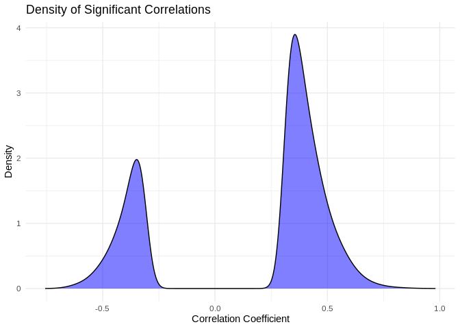
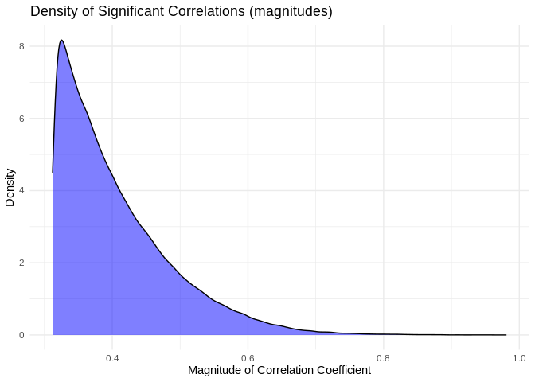
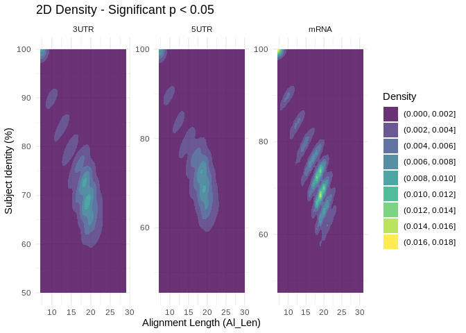

14.1-Apul-miRNA-mRNA-coexpression-additional_inputs
================
Kathleen Durkin
2025-02-26

- [0.1 Obtain Pearson’s coefficient correlation
  values](#01-obtain-pearsons-coefficient-correlation-values)
- [1 Incorporate miRanda target prediction
  results](#1-incorporate-miranda-target-prediction-results)
  - [1.1 full mRNA](#11-full-mrna)
  - [1.2 3’UTR](#12-3utr)
  - [1.3 5’UTR](#13-5utr)
- [2 Summary](#2-summary)

``` r
library(energy)
library(tidyr)
library(dplyr)
```

    ## 
    ## Attaching package: 'dplyr'

    ## The following objects are masked from 'package:stats':
    ## 
    ##     filter, lag

    ## The following objects are masked from 'package:base':
    ## 
    ##     intersect, setdiff, setequal, union

``` r
library(readr)
library(ggplot2)
```

Now that we’ve found putative interactions, including those with high
complementarity, in `07.1-Apul-miRNA-mRNA-miRanda-additional_inputs` we
need to validate miRNA function by examining patterns of coexpression.
We’d expect a putatively-interacting miRNA-mRNA pair to be highly
coexpressed, and we’d expect a negative relationship to indicate target
cleavage or translational repression.

## 0.1 Obtain Pearson’s coefficient correlation values

Read in, format, and normalize data

``` r
mRNA_counts <- read.csv("../../D-Apul/output/02.20-D-Apul-RNAseq-alignment-HiSat2/apul-gene_count_matrix.csv")
mRNA_counts <- as.data.frame(mRNA_counts)
rownames(mRNA_counts) <- mRNA_counts[,1] #set first column that contains gene names as rownames
mRNA_counts <- mRNA_counts[,-1] # remove column w/ gene names 

# Remove any genes with 0 counts across samples 
mRNA_counts<-mRNA_counts %>%
    mutate(Total = rowSums(.[, 1:5]))%>%
    filter(!Total==0)%>%
    dplyr::select(!Total)

miRNA_counts <- read.delim("../output/03.10-D-Apul-sRNAseq-expression-DESeq2/Apul_miRNA_ShortStack_counts_formatted.txt")
# Format miRNA column names to match the mRNA names
colnames(miRNA_counts) <- sub("_.*", "", colnames(miRNA_counts))
# Order miRNA column names to match the mRNA column order
miRNA_counts <- miRNA_counts[, colnames(mRNA_counts)]

# Check that the columns match name and order for both dataframes
colnames(miRNA_counts) == colnames(mRNA_counts)
```

    ##  [1] TRUE TRUE TRUE TRUE TRUE TRUE TRUE TRUE TRUE TRUE TRUE TRUE TRUE TRUE TRUE
    ## [16] TRUE TRUE TRUE TRUE TRUE TRUE TRUE TRUE TRUE TRUE TRUE TRUE TRUE TRUE TRUE
    ## [31] TRUE TRUE TRUE TRUE TRUE TRUE TRUE TRUE TRUE TRUE

``` r
# Remove any miRNAs with 0 for all samples 
miRNA_counts <- miRNA_counts %>%
    mutate(Total = rowSums(.[, 1:5]))%>%
    filter(!Total==0)%>%
    dplyr::select(!Total)

# Function to normalize counts (simple RPM normalization)
normalize_counts <- function(counts) {
  rpm <- t(t(counts) / colSums(counts)) * 1e6
  return(rpm)
}

miRNA_norm <- normalize_counts(miRNA_counts)
mRNA_norm <- normalize_counts(mRNA_counts)
```

``` r
# Function to calculate PCC and p-value for a pair of vectors
calc_pcc <- function(x, y) {
  result <- cor.test(x, y, method = "pearson")
  return(c(PCC = result$estimate, p_value = result$p.value))
}

# Create a data frame of all miRNA-mRNA pairs
pairs <- expand.grid(miRNA = rownames(miRNA_norm), mRNA = rownames(mRNA_norm))

# Calculate PCC and p-value for each pair
pcc_results <- pairs %>%
  rowwise() %>%
  mutate(
    pcc_stats = list(calc_pcc(miRNA_norm[miRNA,], mRNA_norm[mRNA,]))
  ) %>%
  unnest_wider(pcc_stats)

# Adjust p-values for FDR
pcc_results <- pcc_results %>%
  mutate(adjusted_p_value = p.adjust(p_value, method = "fdr"))

# Save as csv
write.csv(pcc_results, "../output/14.1-Apul-miRNA-mRNA-coexpression-additional_inputs/Apul-PCC_miRNA_mRNA-full.csv")
```

Check

``` r
# Read in results 
pcc_results <- read.csv("../output/14.1-Apul-miRNA-mRNA-coexpression-additional_inputs/Apul-PCC_miRNA_mRNA-full.csv")

# Use this code to download the PCC results if needed 
#pcc_results <- read.csv("https://gannet.fish.washington.edu/kdurkin1/ravenbackups/timeseries_molecular/D-Apul/output/14.1-Apul-miRNA-mRNA-coexpression-additional_inputs/Apul-PCC_miRNA_mRNA-full.csv")

nrow(pcc_results)
```

    ## [1] 1534794

``` r
nrow(pcc_results%>% filter(abs(PCC.cor) > 0.90))
```

    ## [1] 24

``` r
nrow(pcc_results %>% filter(p_value < 0.05))
```

    ## [1] 170507

``` r
nrow(pcc_results %>% filter(p_value < 0.05 & abs(PCC.cor) > 0.90))
```

    ## [1] 24

of the 1,534,794 possible miRNA-mRNA interactions, 24 have a Pearson’s
correlation coefficient with a magnitude above 0.9, and 170,507 have a
significant correlation (pval\<0.05). All of the coefficients with a
magnitude \>0.9 are significant.

I find it interesting that so many putative interactions have
significant pvalues, but so few have correlation coefficients above 0.9.
What does the distribution of significant correlation coefficients look
like?

``` r
ggplot(pcc_results[pcc_results$p_value < 0.05,], aes(x = PCC.cor)) +
  geom_density(fill = "blue", alpha = 0.5) +
  labs(title = "Density of Significant Correlations",
       x = "Correlation Coefficient",
       y = "Density") +
  theme_minimal()
```

<!-- -->

``` r
ggplot(pcc_results[pcc_results$p_value < 0.05,], aes(x = abs(PCC.cor))) +
  geom_density(fill = "blue", alpha = 0.5) +
  labs(title = "Density of Significant Correlations (magnitudes)",
       x = "Magnitude of Correlation Coefficient",
       y = "Density") +
  theme_minimal()
```

<!-- -->

# 1 Incorporate miRanda target prediction results

## 1.1 full mRNA

``` r
# miRNA-mRNA_full miRanda output
miRNA_mRNA_miRanda <- read_delim("../output/07.1-Apul-miRNA-mRNA-miRanda-additional_inputs/Apul-miRanda-mRNA_full-strict-parsed.txt", col_names=FALSE)
```

    ## Rows: 814426 Columns: 9
    ## ── Column specification ────────────────────────────────────────────────────────
    ## Delimiter: "\t"
    ## chr (6): X1, X2, X5, X6, X8, X9
    ## dbl (3): X3, X4, X7
    ## 
    ## ℹ Use `spec()` to retrieve the full column specification for this data.
    ## ℹ Specify the column types or set `show_col_types = FALSE` to quiet this message.

``` r
colnames(miRNA_mRNA_miRanda) <- c("mirna", "Target", "Score", "Energy_Kcal_Mol", "Query_Aln", "Subject_Aln", "Al_Len", "Subject_Identity", "Query_Identity")

# format miRNA and mRNA names
geneIDs <- read_delim("../output/05-Apul-annotate-UTRs/Apul-mRNA-FUNids.txt", col_names=FALSE)
```

    ## Rows: 36447 Columns: 5
    ## ── Column specification ────────────────────────────────────────────────────────
    ## Delimiter: "\t"
    ## chr (5): X1, X2, X3, X4, X5
    ## 
    ## ℹ Use `spec()` to retrieve the full column specification for this data.
    ## ℹ Specify the column types or set `show_col_types = FALSE` to quiet this message.

``` r
geneIDs$X4 <- gsub("Parent=", "", geneIDs$X4)

miRNA_mRNA_miRanda$mirna <- gsub(">", "", miRNA_mRNA_miRanda$mirna)
miRNA_mRNA_miRanda$mirna <- gsub("\\..*", "", miRNA_mRNA_miRanda$mirna)

miRNA_mRNA_miRanda <- left_join(miRNA_mRNA_miRanda, geneIDs, by=c("Target" = "X1"))
miRNA_mRNA_miRanda <- select(miRNA_mRNA_miRanda, -X2,-X3,-X5)

# Finally, create a column that conatins both the miRNA and interacting mRNA
pcc_results$interaction <- paste(pcc_results$miRNA, "_", pcc_results$mRNA)
miRNA_mRNA_miRanda$interaction <- paste(miRNA_mRNA_miRanda$mirna, "_", miRNA_mRNA_miRanda$X4)

# Annotate w PCC info 
miRNA_mRNA_miRanda <- left_join(miRNA_mRNA_miRanda, pcc_results, by="interaction")
```

``` r
# Filter to high complementarity putative targets
target_21bp <- miRNA_mRNA_miRanda[miRNA_mRNA_miRanda$Al_Len > 20,]
target_21bp_3mis <- target_21bp[target_21bp$Subject_Identity>85,]

# How many w significant correlation?
nrow(miRNA_mRNA_miRanda)
```

    ## [1] 814426

``` r
nrow(miRNA_mRNA_miRanda %>% filter(p_value < 0.05))
```

    ## [1] 99958

``` r
nrow(target_21bp %>% filter(p_value < 0.05))
```

    ## [1] 17425

``` r
nrow(target_21bp_3mis %>% filter(p_value < 0.05))
```

    ## [1] 26

For miRNA binding to the mRNA CDS, miRanda predicts 814,426 putative
interactions. Of these, 99,958 have significant PCCs; 17,425 are \>21bp
and have signficant PCCs; and 26 are \>21bp with \<=3 mismatches and
have significant PCCs.

## 1.2 3’UTR

``` r
# Read in data

# miRNA-mRNA_full miRanda output
miRNA_3UTR_miRanda <- read_delim("../output/07-Apul-miRNA-mRNA-miRanda/Apul-miRanda-3UTR-strict-parsed.txt", col_names=FALSE)
```

    ## Rows: 123123 Columns: 9
    ## ── Column specification ────────────────────────────────────────────────────────
    ## Delimiter: "\t"
    ## chr (6): X1, X2, X5, X6, X8, X9
    ## dbl (3): X3, X4, X7
    ## 
    ## ℹ Use `spec()` to retrieve the full column specification for this data.
    ## ℹ Specify the column types or set `show_col_types = FALSE` to quiet this message.

``` r
colnames(miRNA_3UTR_miRanda) <- c("mirna", "Target", "Score", "Energy_Kcal_Mol", "Query_Aln", "Subject_Aln", "Al_Len", "Subject_Identity", "Query_Identity")

# format miRNA and mRNA names
geneIDs <- read_delim("../output/05-Apul-annotate-UTRs/Apul-3UTR-FUNids.txt", col_names=FALSE)
```

    ## Rows: 37359 Columns: 5
    ## ── Column specification ────────────────────────────────────────────────────────
    ## Delimiter: "\t"
    ## chr (5): X1, X2, X3, X4, X5
    ## 
    ## ℹ Use `spec()` to retrieve the full column specification for this data.
    ## ℹ Specify the column types or set `show_col_types = FALSE` to quiet this message.

``` r
geneIDs$X4 <- gsub("Parent=", "", geneIDs$X4)

miRNA_3UTR_miRanda$mirna <- gsub(">", "", miRNA_3UTR_miRanda$mirna)
miRNA_3UTR_miRanda$mirna <- gsub("\\..*", "", miRNA_3UTR_miRanda$mirna)
#miRNA_3UTR_miRanda$Target <- gsub("::.*", "", miRNA_3UTR_miRanda$Target)

miRNA_3UTR_miRanda <- left_join(miRNA_3UTR_miRanda, geneIDs, by=c("Target" = "X1"))
```

    ## Warning in left_join(miRNA_3UTR_miRanda, geneIDs, by = c(Target = "X1")): Detected an unexpected many-to-many relationship between `x` and `y`.
    ## ℹ Row 103 of `x` matches multiple rows in `y`.
    ## ℹ Row 4166 of `y` matches multiple rows in `x`.
    ## ℹ If a many-to-many relationship is expected, set `relationship =
    ##   "many-to-many"` to silence this warning.

``` r
miRNA_3UTR_miRanda <- select(miRNA_3UTR_miRanda, -X2,-X3,-X5)

# Somehow ended up with a many-to-many relationship, so remove duplicate rows
miRNA_3UTR_miRanda <- miRNA_3UTR_miRanda[!duplicated(miRNA_3UTR_miRanda), ]

# Finally, create a column that conatins both the miRNA and interacting mRNA
miRNA_3UTR_miRanda$interaction <- paste(miRNA_3UTR_miRanda$mirna, "_", miRNA_3UTR_miRanda$X4)

# Annotate w PCC info 
miRNA_3UTR_miRanda <- left_join(miRNA_3UTR_miRanda, pcc_results, by="interaction")
```

``` r
# Filter to high complementarity putative targets
target_3UTR_21bp <- miRNA_3UTR_miRanda[miRNA_3UTR_miRanda$Al_Len > 20,]
target_3UTR_21bp_3mis <- target_3UTR_21bp[target_3UTR_21bp$Subject_Identity>85,]

# How many w significant correlation?
nrow(miRNA_3UTR_miRanda)
```

    ## [1] 123123

``` r
nrow(miRNA_3UTR_miRanda %>% filter(p_value < 0.05))
```

    ## [1] 11693

``` r
nrow(target_3UTR_21bp %>% filter(p_value < 0.05))
```

    ## [1] 2142

``` r
nrow(target_3UTR_21bp_3mis %>% filter(p_value < 0.05))
```

    ## [1] 3

For miRNA binding to the 3’UTR, miRanda predicts 123,123 putative
interactions. Of these, 11,693 have significant PCCs; 2,142 are \>21bp
and have signficant PCCs; and 3 are \>21bp with \<=3 mismatches and have
a significant PCC.

## 1.3 5’UTR

``` r
# miRNA-5'UTR miRanda output
miRNA_5UTR_miRanda <- read_delim("../output/07.1-Apul-miRNA-mRNA-miRanda-additional_inputs/Apul-miRanda-5UTR_1kb-strict-parsed.txt", col_names=FALSE)
```

    ## Rows: 115265 Columns: 9
    ## ── Column specification ────────────────────────────────────────────────────────
    ## Delimiter: "\t"
    ## chr (6): X1, X2, X5, X6, X8, X9
    ## dbl (3): X3, X4, X7
    ## 
    ## ℹ Use `spec()` to retrieve the full column specification for this data.
    ## ℹ Specify the column types or set `show_col_types = FALSE` to quiet this message.

``` r
colnames(miRNA_5UTR_miRanda) <- c("mirna", "Target", "Score", "Energy_Kcal_Mol", "Query_Aln", "Subject_Aln", "Al_Len", "Subject_Identity", "Query_Identity")

# format miRNA and mRNA names
geneIDs <- read_delim("../output/05-Apul-annotate-UTRs/Apul-5UTR-FUNids.txt", col_names=FALSE)
```

    ## Rows: 37158 Columns: 5
    ## ── Column specification ────────────────────────────────────────────────────────
    ## Delimiter: "\t"
    ## chr (5): X1, X2, X3, X4, X5
    ## 
    ## ℹ Use `spec()` to retrieve the full column specification for this data.
    ## ℹ Specify the column types or set `show_col_types = FALSE` to quiet this message.

``` r
geneIDs$X4 <- gsub("Parent=", "", geneIDs$X4)

miRNA_5UTR_miRanda$mirna <- gsub(">", "", miRNA_5UTR_miRanda$mirna)
miRNA_5UTR_miRanda$mirna <- gsub("\\..*", "", miRNA_5UTR_miRanda$mirna)

miRNA_5UTR_miRanda <- left_join(miRNA_5UTR_miRanda, geneIDs, by=c("Target" = "X1"))
```

    ## Warning in left_join(miRNA_5UTR_miRanda, geneIDs, by = c(Target = "X1")): Detected an unexpected many-to-many relationship between `x` and `y`.
    ## ℹ Row 5 of `x` matches multiple rows in `y`.
    ## ℹ Row 3781 of `y` matches multiple rows in `x`.
    ## ℹ If a many-to-many relationship is expected, set `relationship =
    ##   "many-to-many"` to silence this warning.

``` r
miRNA_5UTR_miRanda <- select(miRNA_5UTR_miRanda, -X2,-X3,-X5)

# Somehow ended up with a many-to-many relationship, so remove duplicate rows
miRNA_5UTR_miRanda <- miRNA_5UTR_miRanda[!duplicated(miRNA_5UTR_miRanda), ]

# Finally, create a column that contains both the miRNA and interacting mRNA
pcc_results$interaction <- paste(pcc_results$miRNA, "_", pcc_results$mRNA)
miRNA_5UTR_miRanda$interaction <- paste(miRNA_5UTR_miRanda$mirna, "_", miRNA_5UTR_miRanda$X4)

# Annotate w PCC info 
miRNA_5UTR_miRanda <- left_join(miRNA_5UTR_miRanda, pcc_results, by="interaction")
```

``` r
# Filter to high complementarity putative targets
target_5UTR_21bp <- miRNA_5UTR_miRanda[miRNA_5UTR_miRanda$Al_Len > 20,]
target_5UTR_21bp_3mis <- target_5UTR_21bp[target_5UTR_21bp$Subject_Identity>85,]

# How many w significant correlation?
nrow(miRNA_5UTR_miRanda)
```

    ## [1] 115265

``` r
nrow(miRNA_5UTR_miRanda %>% filter(p_value < 0.05))
```

    ## [1] 10623

``` r
nrow(target_5UTR_21bp %>% filter(p_value < 0.05))
```

    ## [1] 1775

``` r
nrow(target_5UTR_21bp_3mis %>% filter(p_value < 0.05))
```

    ## [1] 3

For miRNA binding to the 5’UTR, miRanda predicts 115,265 putative
interactions. Of these, 10,623 have significant PCCs; 1,775 are \>21bp
and have signficant PCCs; and 3 are \>21bp with \<=3 mismatches and have
significant PCCs.

# 2 Summary

How does different input and/or complementarity filtering affect \#
putative interactions:

Reminder summary of miRanda results:

| Input     | unfiltered | filtered for complementarity | % retained |
|:----------|:-----------|:-----------------------------|:-----------|
| full mRNA | 814426     | 181                          | 0.0222 %   |
| 5’UTR     | 115265     | 20                           | 0.0174 %   |
| 3’UTR     | 123123     | 33                           | 0.0268 %   |

For different filters, how many putative interactions ***also show
significant coexpression*** (PCC pval \< 0.05)?

| Input     | All   | 21bp  | 21bp, \>=3 mismatch |
|:----------|:------|:------|:--------------------|
| full mRNA | 99958 | 17425 | 26                  |
| 5’UTR     | 10623 | 1775  | 3                   |
| 3’UTR     | 11693 | 2142  | 3                   |

Note that some putative interactions indicated by miRanda are not
present in the counts data (i.e. the miRNA and/or mRNA had 0 counts
inour RNAseq data), and are thus excluded from the PCC-filtered data

Is there a clear “cutoff” for what complementarity parameters are
mostassociated with significant coexpression?

``` r
miRNA_mRNA_miRanda <- miRNA_mRNA_miRanda %>% mutate(Source = "mRNA")
miRNA_3UTR_miRanda <- miRNA_3UTR_miRanda %>% mutate(Source = "3UTR")
miRNA_5UTR_miRanda <- miRNA_5UTR_miRanda %>% mutate(Source = "5UTR")

# Combine
combined_df <- bind_rows(miRNA_mRNA_miRanda, miRNA_3UTR_miRanda, miRNA_5UTR_miRanda)

# Convert Source to a factor for discrete shapes
combined_df$Source <- factor(combined_df$Source)

# Convert p-value condition into a categorical variable for coloring
combined_df$Significance <- ifelse(combined_df$p_value < 0.05, "p < 0.05", "p ≥ 0.05")
significant_df <- combined_df %>% filter(p_value < 0.05)

# Plot with jitter (significant coexpression only)
ggplot(significant_df, aes(x = Al_Len, 
                           y = as.numeric(gsub("%", "", Subject_Identity)), 
                           color = Source)) +
  geom_jitter(size = 1.5, width = 1, height = 1, alpha = 0.1) +
  scale_color_manual(values = c("mRNA" = "red", "3UTR" = "blue", "5UTR" = "green")) +
  facet_wrap(~ Source) +
  labs(x = "Alignment Length (Al_Len)", 
       y = "Subject Identity (%)", 
       color = "Dataset", 
       title = "Significant (p < 0.05) Alignment Length vs. Subject Identity") +
  theme_minimal()
```

<!-- -->

Interesting… there are signifcant coexpressions happening across both
metrics of complementarity.

``` r
# Save putative interactions with significantly correlated coexpression for visualization
# (e.g. creating an interaction network plot in Cytoscape)
write.csv(combined_df[combined_df$p_value < 0.05,], "../output/14.1-Apul-miRNA-mRNA-coexpression-additional_inputs/miRanda-PCC-significant-mRNA_3UTR_5UTR.csv", row.names = FALSE)
```
