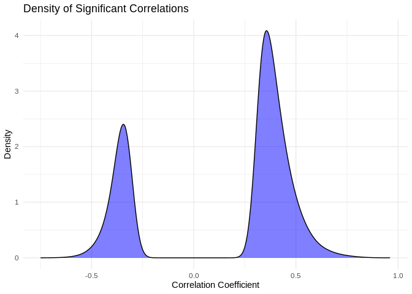
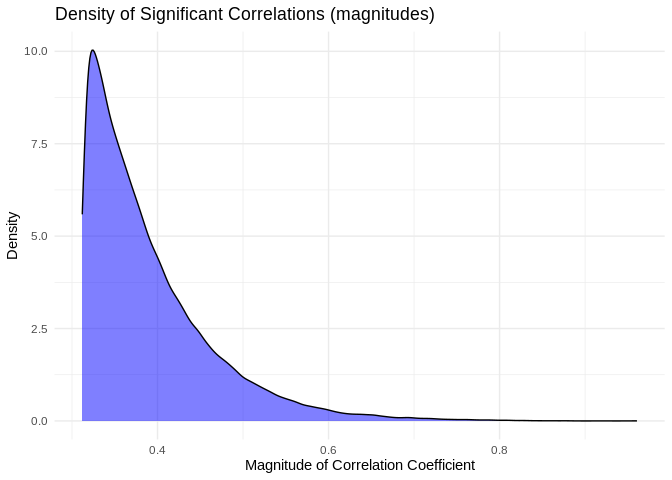
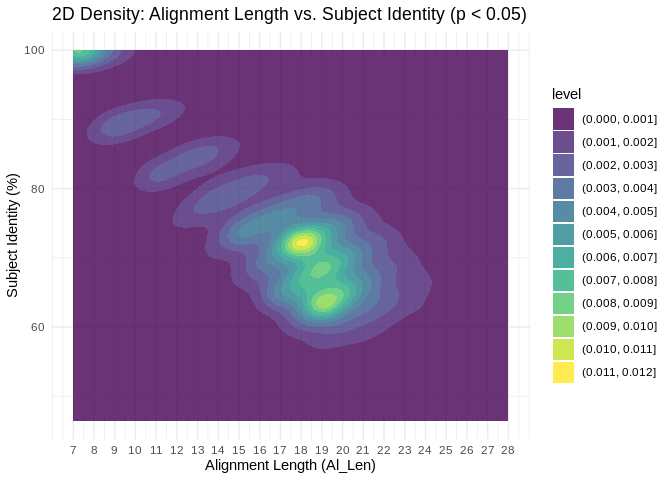

14.2-Apul-miRNA-lncRNA-coexpression
================
Kathleen Durkin
2025-04-15

- <a href="#01-obtain-pearsons-coefficient-correlation-values"
  id="toc-01-obtain-pearsons-coefficient-correlation-values">0.1 Obtain
  Pearson’s coefficient correlation values</a>
- <a href="#1-incorporate-miranda-target-prediction-results"
  id="toc-1-incorporate-miranda-target-prediction-results">1 Incorporate
  miRanda target prediction results</a>
  - <a href="#11-full-lncrna" id="toc-11-full-lncrna">1.1 full lncRNA</a>
- <a href="#2-summary" id="toc-2-summary">2 Summary</a>

``` r
#library(energy)
library(tidyr)
library(dplyr)
```

    ## 
    ## Attaching package: 'dplyr'

    ## The following objects are masked from 'package:stats':
    ## 
    ##     filter, lag

    ## The following objects are masked from 'package:base':
    ## 
    ##     intersect, setdiff, setequal, union

``` r
library(readr)
library(ggplot2)
```

Now that we’ve found putative interactions, including those with high
complementarity, in `10-Apul-lncRNA-miRNA-miRanda` we need to validate
by examining patterns of coexpression. We’d expect a
putatively-interacting miRNA-lncRNA pair to be highly coexpressed, and
we’d expect a strong negative relationship to indicate either a lncRNA
sponging miRNA OR an miRNA targeting lncRNA for degradation.

## 0.1 Obtain Pearson’s coefficient correlation values

Read in, format, and normalize data

``` r
miRNA_counts <- read.delim("../output/03.10-D-Apul-sRNAseq-expression-DESeq2/Apul_miRNA_ShortStack_counts_formatted.txt")
# Simplify column names
colnames(miRNA_counts) <- sub("_.*", "", colnames(miRNA_counts))
colnames(miRNA_counts) <- sub("X", "", colnames(miRNA_counts))

# Remove any miRNA with 0 counts across samples 
miRNA_counts<-miRNA_counts %>%
    mutate(Total = rowSums(.[, 1:5]))%>%
    filter(!Total==0)%>%
    dplyr::select(!Total)

lncRNA_counts_full <- read.delim("../output/08-Apul-lncRNA/counts.txt", skip=1) 
rownames(lncRNA_counts_full) <- lncRNA_counts_full$Geneid
lncRNA_counts <- lncRNA_counts_full %>% select(-Geneid, -Chr, -Start, -End, -Strand, -Length)

# Format lncRNA column names to match the miRNA names
colnames(lncRNA_counts) <- sub("...data.", "", colnames(lncRNA_counts))
colnames(lncRNA_counts) <- sub(".sorted.bam", "", colnames(lncRNA_counts))
# Order lncRNA column names to match the miRNA column order
lncRNA_counts <- lncRNA_counts[, colnames(miRNA_counts)]

# Check that the columns match name and order for both dataframes
colnames(lncRNA_counts) == colnames(miRNA_counts)
```

    ##  [1] TRUE TRUE TRUE TRUE TRUE TRUE TRUE TRUE TRUE TRUE TRUE TRUE TRUE TRUE TRUE
    ## [16] TRUE TRUE TRUE TRUE TRUE TRUE TRUE TRUE TRUE TRUE TRUE TRUE TRUE TRUE TRUE
    ## [31] TRUE TRUE TRUE TRUE TRUE TRUE TRUE TRUE TRUE TRUE

``` r
# Remove any lncRNAs with 0 for all samples 
lncRNA_counts <- lncRNA_counts %>%
    mutate(Total = rowSums(.[, 1:5]))%>%
    filter(!Total==0)%>%
    dplyr::select(!Total)

# Function to normalize counts (simple RPM normalization)
normalize_counts <- function(counts) {
  rpm <- t(t(counts) / colSums(counts)) * 1e6
  return(rpm)
}

miRNA_norm <- normalize_counts(miRNA_counts)
lncRNA_norm <- normalize_counts(lncRNA_counts)
```

``` r
# Function to calculate PCC and p-value for a pair of vectors
calc_pcc <- function(x, y) {
  result <- cor.test(x, y, method = "pearson")
  return(c(PCC = result$estimate, p_value = result$p.value))
}

# Create a data frame of all miRNA-lncRNA pairs
pairs <- expand.grid(miRNA = rownames(miRNA_norm), lncRNA = rownames(lncRNA_norm))

# Calculate PCC and p-value for each pair
pcc_results <- pairs %>%
  rowwise() %>%
  mutate(
    pcc_stats = list(calc_pcc(miRNA_norm[miRNA,], lncRNA_norm[lncRNA,]))
  ) %>%
  unnest_wider(pcc_stats)

# Adjust p-values for FDR
pcc_results <- pcc_results %>%
  mutate(adjusted_p_value = p.adjust(p_value, method = "fdr"))

# Save as csv
write.csv(pcc_results, "../output/14.2-Apul-miRNA-lncRNA-coexpression/Apul-PCC_miRNA_lncRNA-full.csv")
```

Check

``` r
# Read in results 
pcc_results <- read.csv("../output/14.2-Apul-miRNA-lncRNA-coexpression/Apul-PCC_miRNA_lncRNA-full.csv")

# Use this code to download the PCC results if needed 
#pcc_results <- read.csv("https://gannet.fish.washington.edu/kdurkin1/ravenbackups/timeseries_molecular/D-Apul/output/14.2-Apul-miRNA-lncRNA-coexpression/Apul-PCC_miRNA_lncRNA-full.csv")

nrow(pcc_results)
```

    ## [1] 950283

``` r
nrow(pcc_results%>% filter(abs(PCC.cor) > 0.90))
```

    ## [1] 3

``` r
nrow(pcc_results %>% filter(p_value < 0.05))
```

    ## [1] 81605

``` r
nrow(pcc_results %>% filter(p_value < 0.05 & abs(PCC.cor) > 0.90))
```

    ## [1] 3

of the 950,283 possible miRNA-lncRNA interactions, 3 have a Pearson’s
correlation coefficient with a magnitude above 0.9, and 81,605 have a
significant correlation (pval\<0.05). All of the coefficients with a
magnitude \>0.9 are significant.

I find it interesting that so many putative interactions have
significant pvalues, but so few have correlation coefficients above 0.9.
What does the distribution of significant correlation coefficients look
like?

``` r
ggplot(pcc_results[pcc_results$p_value < 0.05,], aes(x = PCC.cor)) +
  geom_density(fill = "blue", alpha = 0.5) +
  labs(title = "Density of Significant Correlations",
       x = "Correlation Coefficient",
       y = "Density") +
  theme_minimal()
```

<!-- -->

``` r
ggplot(pcc_results[pcc_results$p_value < 0.05,], aes(x = abs(PCC.cor))) +
  geom_density(fill = "blue", alpha = 0.5) +
  labs(title = "Density of Significant Correlations (magnitudes)",
       x = "Magnitude of Correlation Coefficient",
       y = "Density") +
  theme_minimal()
```

<!-- -->

Mean of the absolute value of correlation for significant correlation
coefficients is
`{r} round(mean(abs(pcc_results[pcc_results$p_value < 0.05,]$PCC.cor)),2)`

# 1 Incorporate miRanda target prediction results

## 1.1 full lncRNA

I realized that the lncRNA counts matrix includes some duplicate lncRNA,
where two or more distinct lncRNA IDs share the exact same genomic
coordinates. As far as I can tell all of the duplicate lncRNAs have
counts of 0 across all samples, so it was likely just a naming error.
This also means the duplicates didn’t affect the correlation
calculations above, since I filtered out lncRNAs that had all-0 counts
before PCC.

I’ll need to filter then out though to facilitate joining.

``` r
# Create mapping table that shows the full genomic location for each lncRNA
lncRNA_mapping <- data.frame(
  lncRNA = lncRNA_counts_full$Geneid,
  location = paste0(lncRNA_counts_full$Chr, ":", (lncRNA_counts_full$Start-1), "-", lncRNA_counts_full$End)
)

# Isolate lncRNA that have been repeated
repeats <- lncRNA_mapping[duplicated(lncRNA_mapping$location) | duplicated(lncRNA_mapping$location, fromLast = TRUE), ]

# Isolate the repeated lncRNA counts
repeats_counts <- lncRNA_counts_full %>% filter(Geneid %in% repeats$lncRNA)

nrow(lncRNA_mapping)
```

    ## [1] 24181

``` r
length(unique(lncRNA_mapping$location))
```

    ## [1] 23782

``` r
nrow(lncRNA_mapping) - length(unique(lncRNA_mapping$location))
```

    ## [1] 399

``` r
head(repeats_counts)
```

    ##                Geneid      Chr   Start     End Strand Length
    ## lncRNA_062 lncRNA_062 ntLink_6 7465722 7467150      +   1429
    ## lncRNA_063 lncRNA_063 ntLink_6 7465722 7467150      +   1429
    ## lncRNA_071 lncRNA_071 ntLink_6 7548691 7551215      +   2525
    ## lncRNA_072 lncRNA_072 ntLink_6 7548691 7551215      +   2525
    ## lncRNA_080 lncRNA_080 ntLink_6 9559991 9569239      +   9249
    ## lncRNA_081 lncRNA_081 ntLink_6 9559991 9569239      +   9249
    ##            ...data.1A10.sorted.bam ...data.1A12.sorted.bam
    ## lncRNA_062                       0                       0
    ## lncRNA_063                       0                       0
    ## lncRNA_071                       0                       0
    ## lncRNA_072                       0                       0
    ## lncRNA_080                       0                       0
    ## lncRNA_081                       0                       0
    ##            ...data.1A1.sorted.bam ...data.1A2.sorted.bam ...data.1A8.sorted.bam
    ## lncRNA_062                      0                      0                      0
    ## lncRNA_063                      0                      0                      0
    ## lncRNA_071                      0                      0                      0
    ## lncRNA_072                      0                      0                      0
    ## lncRNA_080                      0                      0                      0
    ## lncRNA_081                      0                      0                      0
    ##            ...data.1A9.sorted.bam ...data.1B10.sorted.bam
    ## lncRNA_062                      0                       0
    ## lncRNA_063                      0                       0
    ## lncRNA_071                      0                       0
    ## lncRNA_072                      0                       0
    ## lncRNA_080                      0                       0
    ## lncRNA_081                      0                       0
    ##            ...data.1B1.sorted.bam ...data.1B2.sorted.bam ...data.1B5.sorted.bam
    ## lncRNA_062                      0                      0                      0
    ## lncRNA_063                      0                      0                      0
    ## lncRNA_071                      0                      0                      0
    ## lncRNA_072                      0                      0                      0
    ## lncRNA_080                      0                      0                      0
    ## lncRNA_081                      0                      0                      0
    ##            ...data.1B9.sorted.bam ...data.1C10.sorted.bam
    ## lncRNA_062                      0                       0
    ## lncRNA_063                      0                       0
    ## lncRNA_071                      0                       0
    ## lncRNA_072                      0                       0
    ## lncRNA_080                      0                       0
    ## lncRNA_081                      0                       0
    ##            ...data.1C4.sorted.bam ...data.1D10.sorted.bam
    ## lncRNA_062                      0                       0
    ## lncRNA_063                      0                       0
    ## lncRNA_071                      0                       0
    ## lncRNA_072                      0                       0
    ## lncRNA_080                      0                       0
    ## lncRNA_081                      0                       0
    ##            ...data.1D3.sorted.bam ...data.1D4.sorted.bam ...data.1D6.sorted.bam
    ## lncRNA_062                      0                      0                      0
    ## lncRNA_063                      0                      0                      0
    ## lncRNA_071                      0                      0                      0
    ## lncRNA_072                      0                      0                      0
    ## lncRNA_080                      0                      0                      0
    ## lncRNA_081                      0                      0                      0
    ##            ...data.1D8.sorted.bam ...data.1D9.sorted.bam ...data.1E1.sorted.bam
    ## lncRNA_062                      0                      0                      0
    ## lncRNA_063                      0                      0                      0
    ## lncRNA_071                      0                      0                      0
    ## lncRNA_072                      0                      0                      0
    ## lncRNA_080                      0                      0                      0
    ## lncRNA_081                      0                      0                      0
    ##            ...data.1E3.sorted.bam ...data.1E5.sorted.bam ...data.1E9.sorted.bam
    ## lncRNA_062                      0                      0                      0
    ## lncRNA_063                      0                      0                      0
    ## lncRNA_071                      0                      0                      0
    ## lncRNA_072                      0                      0                      0
    ## lncRNA_080                      0                      0                      0
    ## lncRNA_081                      0                      0                      0
    ##            ...data.1F11.sorted.bam ...data.1F4.sorted.bam
    ## lncRNA_062                       0                      0
    ## lncRNA_063                       0                      0
    ## lncRNA_071                       0                      0
    ## lncRNA_072                       0                      0
    ## lncRNA_080                       0                      0
    ## lncRNA_081                       0                      0
    ##            ...data.1F8.sorted.bam ...data.1G5.sorted.bam
    ## lncRNA_062                      0                      0
    ## lncRNA_063                      0                      0
    ## lncRNA_071                      0                      0
    ## lncRNA_072                      0                      0
    ## lncRNA_080                      0                      0
    ## lncRNA_081                      0                      0
    ##            ...data.1H11.sorted.bam ...data.1H12.sorted.bam
    ## lncRNA_062                       0                       0
    ## lncRNA_063                       0                       0
    ## lncRNA_071                       0                       0
    ## lncRNA_072                       0                       0
    ## lncRNA_080                       0                       0
    ## lncRNA_081                       0                       0
    ##            ...data.1H6.sorted.bam ...data.1H7.sorted.bam ...data.1H8.sorted.bam
    ## lncRNA_062                      0                      0                      0
    ## lncRNA_063                      0                      0                      0
    ## lncRNA_071                      0                      0                      0
    ## lncRNA_072                      0                      0                      0
    ## lncRNA_080                      0                      0                      0
    ## lncRNA_081                      0                      0                      0
    ##            ...data.2B2.sorted.bam ...data.2B3.sorted.bam ...data.2C1.sorted.bam
    ## lncRNA_062                      0                      0                      0
    ## lncRNA_063                      0                      0                      0
    ## lncRNA_071                      0                      0                      0
    ## lncRNA_072                      0                      0                      0
    ## lncRNA_080                      0                      0                      0
    ## lncRNA_081                      0                      0                      0
    ##            ...data.2C2.sorted.bam ...data.2D2.sorted.bam ...data.2E2.sorted.bam
    ## lncRNA_062                      0                      0                      0
    ## lncRNA_063                      0                      0                      0
    ## lncRNA_071                      0                      0                      0
    ## lncRNA_072                      0                      0                      0
    ## lncRNA_080                      0                      0                      0
    ## lncRNA_081                      0                      0                      0
    ##            ...data.2F1.sorted.bam ...data.2G1.sorted.bam
    ## lncRNA_062                      0                      0
    ## lncRNA_063                      0                      0
    ## lncRNA_071                      0                      0
    ## lncRNA_072                      0                      0
    ## lncRNA_080                      0                      0
    ## lncRNA_081                      0                      0

There are 399 duplicate lncRNAs in the counts data

Since I’ll be using `lncRNA_mapping` for joining purposes, it must
contain only unique genomic locations.

Deduplicate `lncRNA_mapping`:

``` r
unique_mapping <- lncRNA_mapping[!duplicated(lncRNA_mapping$location), ]

nrow(lncRNA_mapping) - nrow(unique_mapping)
```

    ## [1] 399

Great! Now that we have a mapping file of only our unique lncRNAs, we
can proceed to incorporating the miRanda output.

``` r
# miRNA-lncRNA_full miRanda output
miRNA_lncRNA_miRanda <- read_delim("../output/10-Apul-lncRNA-miRNA-miRanda/Apul-miRanda-lncRNA-strict-parsed.txt", col_names=FALSE)
```

    ## Rows: 178148 Columns: 9
    ## ── Column specification ────────────────────────────────────────────────────────
    ## Delimiter: "\t"
    ## chr (6): X1, X2, X5, X6, X8, X9
    ## dbl (3): X3, X4, X7
    ## 
    ## ℹ Use `spec()` to retrieve the full column specification for this data.
    ## ℹ Specify the column types or set `show_col_types = FALSE` to quiet this message.

``` r
colnames(miRNA_lncRNA_miRanda) <- c("mirna", "Target", "Score", "Energy_Kcal_Mol", "Query_Aln", "Subject_Aln", "Al_Len", "Subject_Identity", "Query_Identity")


# format miRNA names
miRNA_lncRNA_miRanda$mirna <- gsub(">", "", miRNA_lncRNA_miRanda$mirna)
miRNA_lncRNA_miRanda$mirna <- gsub("\\..*", "", miRNA_lncRNA_miRanda$mirna)

# Join with mapping file to annote miRanda results with lncRNA IDs
miRNA_lncRNA_miRanda <- left_join(miRNA_lncRNA_miRanda, unique_mapping, by=c("Target" = "location"))

# Create a columns that contains both the miRNA and interacting lncRNA
pcc_results$interaction <- paste0(pcc_results$miRNA, ":", pcc_results$lncRNA)
miRNA_lncRNA_miRanda$interaction <- paste0(miRNA_lncRNA_miRanda$mirna, ":", miRNA_lncRNA_miRanda$lncRNA)

# Annotate miRanda results w PCC info 
miRNA_lncRNA_miRanda <- left_join(miRNA_lncRNA_miRanda, pcc_results, by="interaction")
```

``` r
# Filter to high complementarity putative targets
target_21bp <- miRNA_lncRNA_miRanda[miRNA_lncRNA_miRanda$Al_Len > 20,]
target_21bp_3mis <- target_21bp[target_21bp$Subject_Identity>85,]

# How many w significant correlation?
nrow(miRNA_lncRNA_miRanda)
```

    ## [1] 178148

``` r
nrow(miRNA_lncRNA_miRanda %>% filter(!is.na(PCC.cor)))
```

    ## [1] 115512

``` r
nrow(miRNA_lncRNA_miRanda %>% filter(p_value < 0.05))
```

    ## [1] 9677

``` r
nrow(target_21bp %>% filter(p_value < 0.05))
```

    ## [1] 1396

``` r
nrow(target_21bp_3mis %>% filter(p_value < 0.05))
```

    ## [1] 0

For miRNA binding to lncRNA, miRanda predicts 178,148 putative
interactions. Of these, 115,512 yield a correlation value (indicating
the lncRNA is actually present in our counts data); 9,677 have
significant PCCs; 1,396 are \>21bp and have signficant PCCs; and 0 are
\>21bp with \<=3 mismatches and have significant PCCs.

# 2 Summary

How does different input and/or complementarity filtering affect \#
putative interactions:

Reminder summary of miRanda results:

| Input  | All     | 21bp                     | 21bp, \>=3 mismatch  |
|:-------|:--------|:-------------------------|:---------------------|
| lncRNA | 178,148 | 24,018 (13.48% of total) | 22 (0.012% of total) |

For different filters, how many putative interactions ***also show
significant coexpression*** (PCC pval \< 0.05)?

| Input  | All     | 21bp                    | 21bp, \>=3 mismatch  |
|:-------|:--------|:------------------------|:---------------------|
| lncRNA | 105,835 | 14,503 (13.7% of total) | 13 (0.012% of total) |

Note that some putative interactions indicated by miRanda are not
present in the counts data (i.e. the miRNA and/or lncRNA had 0 counts
inour RNAseq data), and are thus excluded from the PCC-filtered data

Is there a clear “cutoff” for what complementarity parameters are
mostassociated with significant coexpression?

``` r
significant_df <- miRNA_lncRNA_miRanda %>% filter(p_value < 0.05)

# Plot with jitter (significant coexpression only)
ggplot(significant_df, aes(x = Al_Len, 
                           y = as.numeric(gsub("%", "", Subject_Identity)))) +
  geom_density_2d_filled(contour_var = "density", alpha = 0.8) +
  scale_x_continuous(breaks = seq(min(significant_df$Al_Len), max(significant_df$Al_Len), by = 1)) +
  labs(x = "Alignment Length (Al_Len)", 
       y = "Subject Identity (%)", 
       title = "2D Density: Alignment Length vs. Subject Identity (p < 0.05)") +
  theme_minimal()
```

<!-- -->

Interesting! There are significant coexpressions happening across both
metrics of complementarity, but we see clustering between 17 and 20nt
alignment length.

In other words, for all the miRNA-lncRNA binding interactions predicted
by miRanda, interactions with high alignment lengths (17-20nt) appear
most likely to also show significantly correlated expression.

There’s also a cluster at the top left corner, showing us that many
interactions significant correlations have low alignment lengths but
perfect complementarity. this likely represents perfect binding in the
seed region.

``` r
# Save putative interactions with significantly correlated coexpression for visualization
# (e.g. creating an interaction network plot in Cytoscape)
write.csv(significant_df, "../output/14.2-Apul-miRNA-lncRNA-coexpression/miRanda-PCC-significant-miRNA_lncRNA.csv", row.names = FALSE)
```
