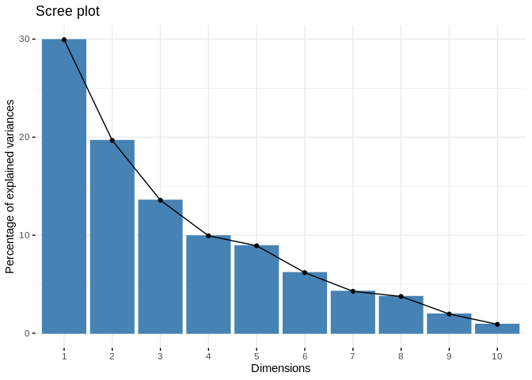

16-Apul-miRNA-mRNA-lncRNA-WGCNA
================
Kathleen Durkin
2025-01-05

- <a href="#1-install-and-load-packages"
  id="toc-1-install-and-load-packages">1 Install and load packages</a>
- <a href="#2-load-data" id="toc-2-load-data">2 Load data</a>
- <a href="#3-physiology-filtering" id="toc-3-physiology-filtering">3
  Physiology filtering</a>
- <a href="#4-povera-filtering" id="toc-4-povera-filtering">4 pOverA
  filtering</a>
- <a href="#5-assign-metadata-and-arrange-order-of-columns"
  id="toc-5-assign-metadata-and-arrange-order-of-columns">5 Assign
  metadata and arrange order of columns</a>
- <a href="#6-conduct-variance-stabilized-transformations"
  id="toc-6-conduct-variance-stabilized-transformations">6 Conduct
  variance stabilized transformations</a>
  - <a href="#61-genes" id="toc-61-genes">6.1 genes</a>
  - <a href="#62-mirna" id="toc-62-mirna">6.2 miRNA</a>
  - <a href="#63-lncrna" id="toc-63-lncrna">6.3 lncRNA</a>
- <a href="#7-pca" id="toc-7-pca">7 PCA</a>
- <a href="#8-sample-clustering" id="toc-8-sample-clustering">8 Sample
  clustering</a>
- <a href="#9-outlier-checks" id="toc-9-outlier-checks">9 Outlier
  checks</a>
- <a href="#10-wgcna" id="toc-10-wgcna">10 WGCNA</a>
- <a href="#11-characterize-genemirnalncrna-composition-of-modules"
  id="toc-11-characterize-genemirnalncrna-composition-of-modules">11
  Characterize gene/miRNA/lncRNA composition of modules</a>
- <a href="#12-correlate-modules-to-each-other"
  id="toc-12-correlate-modules-to-each-other">12 Correlate modules to each
  other</a>
- <a href="#13-correlate-to-traits" id="toc-13-correlate-to-traits">13
  Correlate to traits</a>
- <a href="#14-plot-eigengene-values" id="toc-14-plot-eigengene-values">14
  Plot eigengene values</a>
- <a href="#15-save-data-of-interest-for-future-use"
  id="toc-15-save-data-of-interest-for-future-use">15 Save data of
  interest for future use</a>
- <a href="#16-export-to-cytoscape" id="toc-16-export-to-cytoscape">16
  Export to Cytoscape</a>

Running Weighted Gene Correlation Network Analysis (WGCNA) to assess
patterns of miRNA-mRNA-lncRNA coexpression in A.pulchra.

Notes:

- May want to revist filtering to choose different pOverA parameters for
  miRNA, lncRNA

# 1 Install and load packages

``` r
library(tidyverse)
library(ggplot2)
library(WGCNA)
library(magrittr)
library(genefilter)
library(DESeq2)
library(ggfortify)
library(RColorBrewer)
library(pheatmap)
library(factoextra)
library(vegan)
library(dendsort)
library(ComplexHeatmap)
library(psych)
library(igraph)
library(ggraph)
```

# 2 Load data

Load in count matrices for RNAseq.

``` r
# raw gene counts data (will filter and variance stabilize)
Apul_genes <- read_csv("../output/02.20-D-Apul-RNAseq-alignment-HiSat2/apul-gene_count_matrix.csv")
Apul_genes <- as.data.frame(Apul_genes)

# format gene IDs as rownames (instead of a column)
rownames(Apul_genes) <- Apul_genes$gene_id
Apul_genes <- Apul_genes%>%select(!gene_id)


# load and format metadata
metadata <- read_csv("../../M-multi-species/data/rna_metadata.csv")%>%select(AzentaSampleName, ColonyID, Timepoint)%>%
  filter(grepl("ACR", ColonyID))
metadata$Sample <- paste(metadata$AzentaSampleName, metadata$ColonyID, metadata$Timepoint, sep = "_")

colonies <- unique(metadata$ColonyID)

# Load physiological data
phys<-read_csv("https://github.com/urol-e5/timeseries/raw/refs/heads/master/time_series_analysis/Output/master_timeseries.csv")%>%filter(colony_id_corr %in% colonies)%>%
  select(colony_id_corr, species, timepoint, site, Host_AFDW.mg.cm2, Sym_AFDW.mg.cm2, Am, AQY, Rd, Ik, Ic, calc.umol.cm2.hr, cells.mgAFDW, prot_mg.mgafdw, Ratio_AFDW.mg.cm2, Total_Chl, Total_Chl_cell, cre.umol.mgafdw)
# format timepoint
phys$timepoint <- gsub("timepoint", "TP", phys$timepoint)
#add column with full sample info
phys <- merge(phys, metadata, by.x = c("colony_id_corr", "timepoint"), by.y = c("ColonyID", "Timepoint")) %>%
  select(-AzentaSampleName)
  

#add site information into metadata 
metadata$Site<-phys$site[match(metadata$ColonyID, phys$colony_id_corr)]


# Rename gene column names to include full sample info (as in miRNA table)
colnames(Apul_genes) <- metadata$Sample[match(colnames(Apul_genes), metadata$AzentaSampleName)]

# raw miRNA counts (will filter and variance stabilize)
Apul_miRNA <- read.table(file = "../output/03.10-D-Apul-sRNAseq-expression-DESeq2/Apul_miRNA_ShortStack_counts_formatted.txt", header = TRUE, sep = "\t", check.names = FALSE)

# raw lncRNA counts
Apul_lncRNA <- read.table(file = "../output/08-Apul-lncRNA/counts.txt", header = TRUE, check.names = FALSE) 
rownames(Apul_lncRNA) <- Apul_lncRNA$Geneid
Apul_lncRNA <- Apul_lncRNA %>% select(-Geneid, -Chr, -Start, -End, -Strand, -Length)
colnames(Apul_lncRNA) <- gsub("../data/", "", colnames(Apul_lncRNA))
colnames(Apul_lncRNA) <- gsub(".sorted.bam", "", colnames(Apul_lncRNA))

# Rename columns in Apul_lncRNA to full sample name (with colony and timepoint info)
colnames(Apul_lncRNA) <- colnames(Apul_lncRNA) %>%
  plyr::mapvalues(
    from = metadata$AzentaSampleName,
    to = metadata$Sample,
    warn_missing = FALSE  # Optional: Suppress warnings if not all columns are in metadata
  )
```

Ensure there are no genes, miRNAs, or lncRNAs with 0 counts across all
samples.

``` r
nrow(Apul_genes)
```

    [1] 44371

``` r
Apul_genes<-Apul_genes %>%
     mutate(Total = rowSums(.[, 1:40]))%>%
    filter(!Total==0)%>%
    dplyr::select(!Total)

nrow(Apul_genes)
```

    [1] 35869

``` r
# miRNAs
nrow(Apul_miRNA)
```

    [1] 51

``` r
Apul_miRNA<-Apul_miRNA %>%
     mutate(Total = rowSums(.[, 1:40]))%>%
    filter(!Total==0)%>%
    dplyr::select(!Total)

nrow(Apul_miRNA)
```

    [1] 51

``` r
# lncRNAs
nrow(Apul_lncRNA)
```

    [1] 24181

``` r
Apul_lncRNA<-Apul_lncRNA %>%
     mutate(Total = rowSums(.[, 1:40]))%>%
    filter(!Total==0)%>%
    dplyr::select(!Total)

nrow(Apul_lncRNA)
```

    [1] 20559

Removing genes with only 0 counts reduced number from 44371 to 35869.
Retained all 51 miRNAs. LncRNAs reduced from 24181 to 20559.

# 3 Physiology filtering

Run PCA on physiology data to see if there are phys outliers

Export data for PERMANOVA test.

``` r
test<-as.data.frame(phys)
test<-test[complete.cases(test), ]
```

Build PERMANOVA model.

``` r
scaled_test <-prcomp(test%>%select(where(is.numeric)), scale=TRUE, center=TRUE)
fviz_eig(scaled_test)
```

<!-- -->

``` r
# scale data
vegan <- scale(test%>%select(where(is.numeric)))

# PerMANOVA 
permanova<-adonis2(vegan ~ timepoint*site, data = test, method='eu')
permanova
```

    Permutation test for adonis under reduced model
    Permutation: free
    Number of permutations: 999

    adonis2(formula = vegan ~ timepoint * site, data = test, method = "eu")
             Df SumOfSqs      R2      F Pr(>F)    
    Model     7   208.16 0.43731 2.9976  0.001 ***
    Residual 27   267.84 0.56269                  
    Total    34   476.00 1.00000                  
    ---
    Signif. codes:  0 '***' 0.001 '**' 0.01 '*' 0.05 '.' 0.1 ' ' 1

``` r
pca1<-ggplot2::autoplot(scaled_test, data=test, frame.colour="timepoint", loadings=FALSE,  colour="timepoint", shape="site", loadings.label.colour="black", loadings.colour="black", loadings.label=FALSE, frame=FALSE, loadings.label.size=5, loadings.label.vjust=-1, size=5) + 
  geom_text(aes(x = PC1, y = PC2, label = paste(colony_id_corr, timepoint)), vjust = -0.5)+
  theme_classic()+
   theme(legend.text = element_text(size=18), 
         legend.position="right",
        plot.background = element_blank(),
        legend.title = element_text(size=18, face="bold"), 
        axis.text = element_text(size=18), 
        axis.title = element_text(size=18,  face="bold"));pca1
```

<!-- -->

Remove ACR-173, timepoint 3 sample from analysis. This is Azenta sample
1B2.

``` r
Apul_genes <- Apul_genes%>%
  select(!`1B2_ACR-173_TP3`)

Apul_miRNA <- Apul_miRNA%>%
  select(!`1B2_ACR-173_TP3`)

Apul_lncRNA <- Apul_lncRNA%>%
  select(!`1B2_ACR-173_TP3`)

metadata <- metadata %>%
  filter(Sample != "1B2_ACR-173_TP3")
```

We also do not have phys data for colony 1B9 ACR-265 at TP4, so I’ll
remove that here as well.

``` r
Apul_genes <- Apul_genes%>%
  select(!`1B9_ACR-265_TP4`)

Apul_miRNA <- Apul_miRNA%>%
  select(!`1B9_ACR-265_TP4`)

Apul_lncRNA <- Apul_lncRNA%>%
  select(!`1B9_ACR-265_TP4`)

metadata <- metadata %>%
  filter(Sample != "1B9_ACR-265_TP4")
```

# 4 pOverA filtering

*pOverA*: Specifying the minimum count for a proportion of samples for
each gene. Here, we are using a pOverA of 0.1. This is because we have
40 samples with a minimum of n=4 samples per timepoint per site.
Therefore, we will accept genes that are present in 4/40 = 0.1 of the
samples because we expect different expression by life stage. We are
further setting the minimum count of genes and miRNA to 10, such that
12.5% of the samples must have a gene count of \>10 in order for the
gene to remain in the data set.

Filter in the package “genefilter”. Pre-filtering our dataset to reduce
the memory size dataframe, increase the speed of the transformation and
testing functions, and improve quality of statistical analysis by
removing low-coverage counts. Removed counts could represent outliers in
the data and removing these improves sensitivity of statistical tests.

genes:

``` r
filt <- filterfun(pOverA(0.1,10))

#create filter for the counts data
gfilt <- genefilter(Apul_genes, filt)

#identify genes to keep by count filter
gkeep <- Apul_genes[gfilt,]

#identify genes to keep by count filter
gkeep <- Apul_genes[gfilt,]

#identify gene lists
gn.keep <- rownames(gkeep)

#gene count data filtered in PoverA, P percent of the samples have counts over A
Apul_genes_filt <- as.data.frame(Apul_genes[which(rownames(Apul_genes) %in% gn.keep),])

#How many rows do we have before and after filtering?
nrow(Apul_genes) #Before
```

    [1] 35869

``` r
nrow(Apul_genes_filt) #After
```

    [1] 23459

We had 35869 genes before, and 23459 genes after filtering.

miRNA:

``` r
mifilt <- filterfun(pOverA(0.1,10))

#create filter for the counts data
mifilt <- genefilter(Apul_miRNA, mifilt)

#identify genes to keep by count filter
mikeep <- Apul_miRNA[mifilt,]

#identify genes to keep by count filter
mikeep <- Apul_miRNA[mifilt,]

#identify gene lists
mi.keep <- rownames(mikeep)

#gene count data filtered in PoverA, P percent of the samples have counts over A
Apul_miRNA_filt <- as.data.frame(Apul_miRNA[which(rownames(Apul_miRNA) %in% mi.keep),])

#How many rows do we have before and after filtering?
nrow(Apul_miRNA) #Before
```

    [1] 51

``` r
nrow(Apul_miRNA_filt) #After
```

    [1] 43

Of our original 51 miRNAs, 43 are retained.

lncRNA:

``` r
lncfilt <- filterfun(pOverA(0.1,10))

#create filter for the counts data
lncfilt <- genefilter(Apul_lncRNA, lncfilt)

#identify genes to keep by count filter
lnckeep <- Apul_lncRNA[lncfilt,]

#identify genes to keep by count filter
lnckeep <- Apul_lncRNA[lncfilt,]

#identify gene lists
lnc.keep <- rownames(lnckeep)

#gene count data filtered in PoverA, P percent of the samples have counts over A
Apul_lncRNA_filt <- as.data.frame(Apul_lncRNA[which(rownames(Apul_lncRNA) %in% lnc.keep),])

#How many rows do we have before and after filtering?
nrow(Apul_lncRNA) #Before
```

    [1] 20559

``` r
nrow(Apul_lncRNA_filt) #After
```

    [1] 12973

Of 20559 lncRNAs, 12973 are retained.

``` r
# make sure column names in both are in the same order
Apul_miRNA_filt <- Apul_miRNA_filt[, colnames(Apul_genes_filt)]
Apul_lncRNA_filt <- Apul_lncRNA_filt[, colnames(Apul_genes_filt)]
```

# 5 Assign metadata and arrange order of columns

Display current order of metadata and gene count matrix.

``` r
metadata$Sample
```

     [1] "1H11_ACR-225_TP1" "1H6_ACR-225_TP2"  "1B1_ACR-225_TP3"  "1D3_ACR-225_TP4" 
     [5] "1B5_ACR-229_TP1"  "1D6_ACR-229_TP2"  "1H7_ACR-229_TP3"  "1D9_ACR-229_TP4" 
     [9] "1E9_ACR-237_TP1"  "1D8_ACR-237_TP2"  "1A12_ACR-237_TP3" "1D4_ACR-237_TP4" 
    [13] "2C1_ACR-244_TP1"  "1A9_ACR-244_TP2"  "1G5_ACR-244_TP3"  "1A2_ACR-244_TP4" 
    [17] "2F1_ACR-265_TP1"  "1D10_ACR-265_TP2" "1E1_ACR-265_TP3"  "2C2_ACR-139_TP1" 
    [21] "2B3_ACR-139_TP2"  "1E5_ACR-139_TP3"  "1C4_ACR-139_TP4"  "2B2_ACR-145_TP1" 
    [25] "2G1_ACR-145_TP2"  "1F8_ACR-145_TP3"  "1A10_ACR-145_TP4" "2D2_ACR-150_TP1" 
    [29] "1E3_ACR-150_TP2"  "1F4_ACR-150_TP3"  "1B10_ACR-150_TP4" "1A1_ACR-173_TP1" 
    [33] "1F11_ACR-173_TP2" "1C10_ACR-173_TP4" "2E2_ACR-186_TP1"  "1A8_ACR-186_TP2" 
    [37] "1H12_ACR-186_TP3" "1H8_ACR-186_TP4" 

``` r
colnames(Apul_genes_filt)
```

     [1] "1A1_ACR-173_TP1"  "1A10_ACR-145_TP4" "1A12_ACR-237_TP3" "1A2_ACR-244_TP4" 
     [5] "1A8_ACR-186_TP2"  "1A9_ACR-244_TP2"  "1B1_ACR-225_TP3"  "1B10_ACR-150_TP4"
     [9] "1B5_ACR-229_TP1"  "1C10_ACR-173_TP4" "1C4_ACR-139_TP4"  "1D10_ACR-265_TP2"
    [13] "1D3_ACR-225_TP4"  "1D4_ACR-237_TP4"  "1D6_ACR-229_TP2"  "1D8_ACR-237_TP2" 
    [17] "1D9_ACR-229_TP4"  "1E1_ACR-265_TP3"  "1E3_ACR-150_TP2"  "1E5_ACR-139_TP3" 
    [21] "1E9_ACR-237_TP1"  "1F11_ACR-173_TP2" "1F4_ACR-150_TP3"  "1F8_ACR-145_TP3" 
    [25] "1G5_ACR-244_TP3"  "1H11_ACR-225_TP1" "1H12_ACR-186_TP3" "1H6_ACR-225_TP2" 
    [29] "1H7_ACR-229_TP3"  "1H8_ACR-186_TP4"  "2B2_ACR-145_TP1"  "2B3_ACR-139_TP2" 
    [33] "2C1_ACR-244_TP1"  "2C2_ACR-139_TP1"  "2D2_ACR-150_TP1"  "2E2_ACR-186_TP1" 
    [37] "2F1_ACR-265_TP1"  "2G1_ACR-145_TP2" 

Order metadata the same as the column order in the gene matrix.

``` r
list<-colnames(Apul_genes_filt)
list<-as.factor(list)

metadata$Sample<-as.factor(metadata$Sample)

# Re-order the levels
metadata$Sample <- factor(as.character(metadata$Sample), levels=list)
# Re-order the data.frame
metadata_ordered <- metadata[order(metadata$Sample),]
metadata_ordered$Sample
```

     [1] 1A1_ACR-173_TP1  1A10_ACR-145_TP4 1A12_ACR-237_TP3 1A2_ACR-244_TP4 
     [5] 1A8_ACR-186_TP2  1A9_ACR-244_TP2  1B1_ACR-225_TP3  1B10_ACR-150_TP4
     [9] 1B5_ACR-229_TP1  1C10_ACR-173_TP4 1C4_ACR-139_TP4  1D10_ACR-265_TP2
    [13] 1D3_ACR-225_TP4  1D4_ACR-237_TP4  1D6_ACR-229_TP2  1D8_ACR-237_TP2 
    [17] 1D9_ACR-229_TP4  1E1_ACR-265_TP3  1E3_ACR-150_TP2  1E5_ACR-139_TP3 
    [21] 1E9_ACR-237_TP1  1F11_ACR-173_TP2 1F4_ACR-150_TP3  1F8_ACR-145_TP3 
    [25] 1G5_ACR-244_TP3  1H11_ACR-225_TP1 1H12_ACR-186_TP3 1H6_ACR-225_TP2 
    [29] 1H7_ACR-229_TP3  1H8_ACR-186_TP4  2B2_ACR-145_TP1  2B3_ACR-139_TP2 
    [33] 2C1_ACR-244_TP1  2C2_ACR-139_TP1  2D2_ACR-150_TP1  2E2_ACR-186_TP1 
    [37] 2F1_ACR-265_TP1  2G1_ACR-145_TP2 
    38 Levels: 1A1_ACR-173_TP1 1A10_ACR-145_TP4 ... 2G1_ACR-145_TP2

Metadata and gene/miRNa/lncRNA count matrices are now ordered the same.

# 6 Conduct variance stabilized transformations

We expect genes, miRNA, and lncRNA will have different means and
variances, so VST should be conducted separately for each.

## 6.1 genes

``` r
#Set DESeq2 design
g.dds <- DESeqDataSetFromMatrix(countData = Apul_genes_filt,
                              colData = metadata_ordered,
                              design = ~Timepoint+ColonyID)
```

Check size factors.

``` r
SF.g.dds <- estimateSizeFactors(g.dds) #estimate size factors to determine if we can use vst  to transform our data. Size factors should be less than 4 for us to use vst
print(sizeFactors(SF.g.dds)) #View size factors
```

     1A1_ACR-173_TP1 1A10_ACR-145_TP4 1A12_ACR-237_TP3  1A2_ACR-244_TP4 
           0.7568024        0.7696399        1.4231584        0.6405377 
     1A8_ACR-186_TP2  1A9_ACR-244_TP2  1B1_ACR-225_TP3 1B10_ACR-150_TP4 
           1.1211635        1.2042163        1.4204528        1.4016702 
     1B5_ACR-229_TP1 1C10_ACR-173_TP4  1C4_ACR-139_TP4 1D10_ACR-265_TP2 
           1.6052144        0.7137948        1.1899017        1.1365146 
     1D3_ACR-225_TP4  1D4_ACR-237_TP4  1D6_ACR-229_TP2  1D8_ACR-237_TP2 
           0.6729713        1.0536139        1.0899755        0.8696891 
     1D9_ACR-229_TP4  1E1_ACR-265_TP3  1E3_ACR-150_TP2  1E5_ACR-139_TP3 
           0.6693270        1.0722064        1.1788615        1.2212146 
     1E9_ACR-237_TP1 1F11_ACR-173_TP2  1F4_ACR-150_TP3  1F8_ACR-145_TP3 
           1.0404211        1.0438667        1.4019603        0.7945692 
     1G5_ACR-244_TP3 1H11_ACR-225_TP1 1H12_ACR-186_TP3  1H6_ACR-225_TP2 
           1.6112366        1.4231584        0.6115323        0.7945692 
     1H7_ACR-229_TP3  1H8_ACR-186_TP4  2B2_ACR-145_TP1  2B3_ACR-139_TP2 
           1.3289756        1.2189223        1.1023879        1.4414683 
     2C1_ACR-244_TP1  2C2_ACR-139_TP1  2D2_ACR-150_TP1  2E2_ACR-186_TP1 
           0.6642454        1.1948320        0.7798443        0.6226576 
     2F1_ACR-265_TP1  2G1_ACR-145_TP2 
           0.9539809        0.8200694 

``` r
all(sizeFactors(SF.g.dds)) < 4
```

    [1] TRUE

All size factors are less than 4, so we can use VST transformation.

``` r
g.vsd <- vst(g.dds, blind=FALSE) #apply a variance stabilizing transformation to minimize effects of small counts and normalize with respect to library size
head(assay(g.vsd), 3) #view transformed gene count data for the first three genes in the dataset.  
```

               1A1_ACR-173_TP1 1A10_ACR-145_TP4 1A12_ACR-237_TP3 1A2_ACR-244_TP4
    FUN_002326        6.660702         6.601151         6.296062        6.022911
    FUN_002303        7.454351         7.019662         6.664320        6.169453
    FUN_002305        7.454351         7.036585         6.800146        6.102559
               1A8_ACR-186_TP2 1A9_ACR-244_TP2 1B1_ACR-225_TP3 1B10_ACR-150_TP4
    FUN_002326        5.936082        5.926631        6.318421         6.254378
    FUN_002303        5.996527        6.034064        6.665234         6.541184
    FUN_002305        6.092074        6.077224        6.801173         6.736355
               1B5_ACR-229_TP1 1C10_ACR-173_TP4 1C4_ACR-139_TP4 1D10_ACR-265_TP2
    FUN_002326        5.825783         6.607816        5.928189         6.232170
    FUN_002303        5.942425         7.032182        6.277071         6.617129
    FUN_002305        5.891826         6.976191        6.277071         6.834957
               1D3_ACR-225_TP4 1D4_ACR-237_TP4 1D6_ACR-229_TP2 1D8_ACR-237_TP2
    FUN_002326        6.474013        6.576064        5.859845        6.439541
    FUN_002303        6.718366        6.946757        5.939907        6.842014
    FUN_002305        6.818777        7.072513        6.001201        7.109262
               1D9_ACR-229_TP4 1E1_ACR-265_TP3 1E3_ACR-150_TP2 1E5_ACR-139_TP3
    FUN_002326        5.913234        6.142834        5.929410        5.982758
    FUN_002303        5.666063        6.527629        6.120940        6.212425
    FUN_002305        5.913234        6.696940        6.190595        6.321001
               1E9_ACR-237_TP1 1F11_ACR-173_TP2 1F4_ACR-150_TP3 1F8_ACR-145_TP3
    FUN_002326        6.473872         6.187513        6.254318        6.341284
    FUN_002303        6.855660         6.538906        6.772955        6.685573
    FUN_002305        6.870372         6.580167        6.927720        6.731014
               1G5_ACR-244_TP3 1H11_ACR-225_TP1 1H12_ACR-186_TP3 1H6_ACR-225_TP2
    FUN_002326        5.891405         6.296062         6.031232        6.341284
    FUN_002303        6.167920         6.664320         6.112711        6.685573
    FUN_002305        6.279189         6.800146         6.181130        6.731014
               1H7_ACR-229_TP3 1H8_ACR-186_TP4 2B2_ACR-145_TP1 2B3_ACR-139_TP2
    FUN_002326        5.841581        5.925058        6.300492        5.957649
    FUN_002303        5.841581        6.148991        6.648931        6.077732
    FUN_002305        5.914130        6.181995        6.666283        6.140886
               2C1_ACR-244_TP1 2C2_ACR-139_TP1 2D2_ACR-150_TP1 2E2_ACR-186_TP1
    FUN_002326        6.016517        5.986221        6.784206        6.027972
    FUN_002303        6.094757        6.247838        7.044774        6.027972
    FUN_002305        6.094757        6.275828        7.028204        6.108734
               2F1_ACR-265_TP1 2G1_ACR-145_TP2
    FUN_002326        6.555466        6.163523
    FUN_002303        6.889927        6.670217
    FUN_002305        6.889927        6.715029

## 6.2 miRNA

``` r
#Set DESeq2 design
mi.dds <- DESeqDataSetFromMatrix(countData = Apul_miRNA_filt,
                              colData = metadata_ordered,
                              design = ~Timepoint+ColonyID)
```

Check size factors.

``` r
SF.mi.dds <- estimateSizeFactors(mi.dds) #estimate size factors to determine if we can use vst  to transform our data. Size factors should be less than 4 for us to use vst
print(sizeFactors(SF.mi.dds)) #View size factors
```

     1A1_ACR-173_TP1 1A10_ACR-145_TP4 1A12_ACR-237_TP3  1A2_ACR-244_TP4 
           1.4375773        0.4873497        1.1278371        1.3906883 
     1A8_ACR-186_TP2  1A9_ACR-244_TP2  1B1_ACR-225_TP3 1B10_ACR-150_TP4 
           1.4576506        3.6175606        0.6314484        0.5933158 
     1B5_ACR-229_TP1 1C10_ACR-173_TP4  1C4_ACR-139_TP4 1D10_ACR-265_TP2 
           3.4568168        0.3494818        0.2635332        1.6883200 
     1D3_ACR-225_TP4  1D4_ACR-237_TP4  1D6_ACR-229_TP2  1D8_ACR-237_TP2 
           3.3510894        1.6862052        3.0187618        1.6095839 
     1D9_ACR-229_TP4  1E1_ACR-265_TP3  1E3_ACR-150_TP2  1E5_ACR-139_TP3 
           1.6452632        0.4710913        2.5273448        0.1018135 
     1E9_ACR-237_TP1 1F11_ACR-173_TP2  1F4_ACR-150_TP3  1F8_ACR-145_TP3 
           0.8833733        1.4438548        1.9140909        0.3982620 
     1G5_ACR-244_TP3 1H11_ACR-225_TP1 1H12_ACR-186_TP3  1H6_ACR-225_TP2 
           2.2537502        0.8044495        0.4593767        1.8545938 
     1H7_ACR-229_TP3  1H8_ACR-186_TP4  2B2_ACR-145_TP1  2B3_ACR-139_TP2 
           1.0932705        0.8296064        0.8877596        1.8683207 
     2C1_ACR-244_TP1  2C2_ACR-139_TP1  2D2_ACR-150_TP1  2E2_ACR-186_TP1 
           1.1967504        1.3986634        0.5117454        0.3091478 
     2F1_ACR-265_TP1  2G1_ACR-145_TP2 
           0.2926522        1.8710888 

``` r
all(sizeFactors(SF.mi.dds)) < 4
```

    [1] TRUE

All size factors are less than 4, so we can use VST transformation.

``` r
mi.vsd <- varianceStabilizingTransformation(mi.dds, blind=FALSE) #apply a variance stabilizing transformation to minimize effects of small counts and normalize with respect to library size
head(assay(mi.vsd), 3) #view transformed gene count data for the first three genes in the dataset.  
```

                 1A1_ACR-173_TP1 1A10_ACR-145_TP4 1A12_ACR-237_TP3 1A2_ACR-244_TP4
    Cluster_1819        6.478249         6.557331         5.595735        6.196669
    Cluster_1832       10.332441         9.422019         8.660731        9.451348
    Cluster_1833        5.492142         5.650442         5.997705        5.263138
                 1A8_ACR-186_TP2 1A9_ACR-244_TP2 1B1_ACR-225_TP3 1B10_ACR-150_TP4
    Cluster_1819        6.241157        6.812541        5.566107         5.341800
    Cluster_1832        9.762292        9.276238        9.872929         8.600338
    Cluster_1833        4.193715        3.266091        5.918124         4.687096
                 1B5_ACR-229_TP1 1C10_ACR-173_TP4 1C4_ACR-139_TP4 1D10_ACR-265_TP2
    Cluster_1819        6.267787         6.117117        5.794925         6.226234
    Cluster_1832       10.028421         9.433650        9.679103         8.588882
    Cluster_1833        5.898084         4.582708        6.070238         3.266091
                 1D3_ACR-225_TP4 1D4_ACR-237_TP4 1D6_ACR-229_TP2 1D8_ACR-237_TP2
    Cluster_1819        5.185576        5.368613        6.370127        6.091856
    Cluster_1832        9.787300        9.226621        9.904788        8.713369
    Cluster_1833        5.374313        6.204218        4.675660        5.725310
                 1D9_ACR-229_TP4 1E1_ACR-265_TP3 1E3_ACR-150_TP2 1E5_ACR-139_TP3
    Cluster_1819        5.851833        5.857390        6.463126        5.183387
    Cluster_1832        9.423066        9.183896        9.086751        8.848700
    Cluster_1833        4.485634        5.961931        3.266091        3.266091
                 1E9_ACR-237_TP1 1F11_ACR-173_TP2 1F4_ACR-150_TP3 1F8_ACR-145_TP3
    Cluster_1819        5.260586         6.304098        5.539388        6.243558
    Cluster_1832        8.430433        10.072455        8.695247        9.120002
    Cluster_1833        5.260586         5.047177        4.401214        5.091836
                 1G5_ACR-244_TP3 1H11_ACR-225_TP1 1H12_ACR-186_TP3 1H6_ACR-225_TP2
    Cluster_1819        5.903188         5.294944         6.492645        5.406006
    Cluster_1832       10.274857         9.602521         9.928946        9.881625
    Cluster_1833        3.266091         5.388645         5.354900        5.218993
                 1H7_ACR-229_TP3 1H8_ACR-186_TP4 2B2_ACR-145_TP1 2B3_ACR-139_TP2
    Cluster_1819        5.989093        5.677605        6.075343        5.752765
    Cluster_1832        9.561175       10.065363        8.130532        9.915856
    Cluster_1833        4.683765        6.098376        3.266091        4.655510
                 2C1_ACR-244_TP1 2C2_ACR-139_TP1 2D2_ACR-150_TP1 2E2_ACR-186_TP1
    Cluster_1819        6.032448        5.734740        5.923774        6.583587
    Cluster_1832        9.404192        9.672986        8.230369        9.454567
    Cluster_1833        5.955020        5.072513        4.526078        3.266091
                 2F1_ACR-265_TP1 2G1_ACR-145_TP2
    Cluster_1819        6.182672        5.659509
    Cluster_1832        9.236968        9.156409
    Cluster_1833        3.266091        4.937878

## 6.3 lncRNA

``` r
#Set DESeq2 design
lnc.dds <- DESeqDataSetFromMatrix(countData = Apul_lncRNA_filt,
                              colData = metadata_ordered,
                              design = ~Timepoint+ColonyID)
```

Check size factors.

``` r
SF.lnc.dds <- estimateSizeFactors(lnc.dds) #estimate size factors to determine if we can use vst  to transform our data. Size factors should be less than 4 for us to use vst
print(sizeFactors(SF.lnc.dds)) #View size factors
```

     1A1_ACR-173_TP1 1A10_ACR-145_TP4 1A12_ACR-237_TP3  1A2_ACR-244_TP4 
           1.0955252        1.2137045        0.9342538        1.1723543 
     1A8_ACR-186_TP2  1A9_ACR-244_TP2  1B1_ACR-225_TP3 1B10_ACR-150_TP4 
           0.7900695        1.1000632        1.1124671        1.2043104 
     1B5_ACR-229_TP1 1C10_ACR-173_TP4  1C4_ACR-139_TP4 1D10_ACR-265_TP2 
           1.3614614        0.9509325        1.0804899        1.2690015 
     1D3_ACR-225_TP4  1D4_ACR-237_TP4  1D6_ACR-229_TP2  1D8_ACR-237_TP2 
           0.8869354        1.3673102        0.9591473        0.8956379 
     1D9_ACR-229_TP4  1E1_ACR-265_TP3  1E3_ACR-150_TP2  1E5_ACR-139_TP3 
           1.0723197        1.3198391        0.8413144        0.9383747 
     1E9_ACR-237_TP1 1F11_ACR-173_TP2  1F4_ACR-150_TP3  1F8_ACR-145_TP3 
           1.3611911        0.7719051        1.0847456        1.2562853 
     1G5_ACR-244_TP3 1H11_ACR-225_TP1 1H12_ACR-186_TP3  1H6_ACR-225_TP2 
           1.4107822        0.9342538        0.8368787        1.2562853 
     1H7_ACR-229_TP3  1H8_ACR-186_TP4  2B2_ACR-145_TP1  2B3_ACR-139_TP2 
           1.0003401        0.8944399        1.3264154        0.8792449 
     2C1_ACR-244_TP1  2C2_ACR-139_TP1  2D2_ACR-150_TP1  2E2_ACR-186_TP1 
           0.7679328        0.8833620        1.1579208        0.6015853 
     2F1_ACR-265_TP1  2G1_ACR-145_TP2 
           1.5768174        0.6819169 

``` r
all(sizeFactors(SF.lnc.dds)) < 4
```

    [1] TRUE

All size factors are less than 4, so we can use VST transformation.

``` r
lnc.vsd <- vst(lnc.dds, blind=FALSE) #apply a variance stabilizing transformation to minimize effects of small counts and normalize with respect to library size
head(assay(lnc.vsd), 3) #view transformed gene count data for the first three genes in the dataset.  
```

               1A1_ACR-173_TP1 1A10_ACR-145_TP4 1A12_ACR-237_TP3 1A2_ACR-244_TP4
    lncRNA_001        5.611831         5.310362         5.341664        5.085881
    lncRNA_005        6.899959         5.085881         5.923515        5.085881
    lncRNA_006        7.683880         6.047458         5.341664        5.835711
               1A8_ACR-186_TP2 1A9_ACR-244_TP2 1B1_ACR-225_TP3 1B10_ACR-150_TP4
    lncRNA_001        5.363960        5.085881        5.951058         5.085881
    lncRNA_005        5.085881        6.119203        5.744016         5.085881
    lncRNA_006        5.085881        5.321647        5.820145         5.678538
               1B5_ACR-229_TP1 1C10_ACR-173_TP4 1C4_ACR-139_TP4 1D10_ACR-265_TP2
    lncRNA_001        5.385387         5.649935        5.615438         5.977694
    lncRNA_005        5.085881         6.406390        6.686533         5.396066
    lncRNA_006        5.508693         6.635778        5.496988         5.523712
               1D3_ACR-225_TP4 1D4_ACR-237_TP4 1D6_ACR-229_TP2 1D8_ACR-237_TP2
    lncRNA_001        5.085881        5.085881        5.085881        5.085881
    lncRNA_005        5.085881        5.085881        5.875333        5.721470
    lncRNA_006        5.724530        5.868397        5.700390        5.977756
               1D9_ACR-229_TP4 1E1_ACR-265_TP3 1E3_ACR-150_TP2 1E5_ACR-139_TP3
    lncRNA_001        5.324671        5.690915        5.355383        5.085881
    lncRNA_005        5.085881        6.882725        5.685068        5.085881
    lncRNA_006        7.254505        5.935482        5.466465        5.085881
               1E9_ACR-237_TP1 1F11_ACR-173_TP2 1F4_ACR-150_TP3 1F8_ACR-145_TP3
    lncRNA_001        5.085881         5.367203        5.085881        5.577372
    lncRNA_005        5.085881         5.873040        6.561159        5.842290
    lncRNA_006        6.602867         5.085881        5.829268        5.397626
               1G5_ACR-244_TP3 1H11_ACR-225_TP1 1H12_ACR-186_TP3 1H6_ACR-225_TP2
    lncRNA_001        5.085881         5.341664         5.085881        5.577372
    lncRNA_005        7.157645         5.923515         6.205656        5.842290
    lncRNA_006        5.979993         5.341664         5.552552        5.397626
               1H7_ACR-229_TP3 1H8_ACR-186_TP4 2B2_ACR-145_TP1 2B3_ACR-139_TP2
    lncRNA_001        5.636000        5.085881        5.389304        5.085881
    lncRNA_005        5.779263        6.329370        5.822457        5.727272
    lncRNA_006        6.057471        5.347280        5.933432        5.085881
               2C1_ACR-244_TP1 2C2_ACR-139_TP1 2D2_ACR-150_TP1 2E2_ACR-186_TP1
    lncRNA_001        5.085881        5.540211        5.315694        6.248405
    lncRNA_005        5.085881        6.838561        6.365130        5.085881
    lncRNA_006        5.367927        5.457348        7.010468        6.208160
               2F1_ACR-265_TP1 2G1_ACR-145_TP2
    lncRNA_001        6.141944        5.085881
    lncRNA_005        5.085881        5.085881
    lncRNA_006        6.089885        5.602359

# 7 PCA

genes:

``` r
plotPCA(g.vsd, intgroup = c("ColonyID"))
```

<!-- -->

``` r
plotPCA(g.vsd, intgroup = c("Timepoint"))
```

<!-- -->

miRNA

``` r
plotPCA(mi.vsd, intgroup = c("ColonyID"))
```

<!-- -->

``` r
plotPCA(mi.vsd, intgroup = c("Timepoint"))
```

<!-- -->

lncRNA:

``` r
plotPCA(lnc.vsd, intgroup = c("ColonyID"))
```

<!-- -->

``` r
plotPCA(lnc.vsd, intgroup = c("Timepoint"))
```

<!-- -->

# 8 Sample clustering

``` r
# Combine three datasets into single data frame
# Since we ensured columns are in same order, we can rowbind

# Combine by rows
datExpr_untransposed <- rbind(as.data.frame(assay(g.vsd)), 
                 as.data.frame(assay(mi.vsd)), 
                 as.data.frame(assay(lnc.vsd)))

# Transpose to fit WGCNA formatting
datExpr <- t(datExpr_untransposed)
```

``` r
sampleDists <- dist(datExpr) #calculate distance matrix
sampleDistMatrix <- as.matrix(sampleDists) #distance matrix
rownames(sampleDistMatrix) <- colnames(datExpr_untransposed) #assign row names
colnames(sampleDistMatrix) <- NULL #assign col names
colors <- colorRampPalette( rev(brewer.pal(9, "Blues")) )(255) #assign colors

pht <- pheatmap(sampleDistMatrix, #plot matrix
         clustering_distance_rows=sampleDists, #cluster rows
         clustering_distance_cols=sampleDists, #cluster columns
         col=colors) #set colors

print(pht)
```

<!-- -->

When you smush together gene expression, miRNA expression, and lncRNA
expression, seem to group pretty clearly by colony

# 9 Outlier checks

Look for outliers by examining tree of samples

``` r
sampleTree = hclust(dist(datExpr), method = "average");
plot(sampleTree, main = "Sample clustering to detect outliers: genes", sub="", xlab="", cex.lab = 1.5, cex.axis = 1.5, cex.main = 2)
```

<!-- -->

Soft threshold selection. The soft thresholding power (β) is the number
to which the co-expression similarity is raised to calculate adjacency.
The function pickSoftThreshold performs a network topology analysis. The
user chooses a set of candidate powers, however the default parameters
are suitable values.

``` r
allowWGCNAThreads()
```

    Allowing multi-threading with up to 48 threads.

``` r
# # Choose a set of soft-thresholding powers
powers <- c(seq(from = 1, to=19, by=2), c(21:30)) #Create a string of numbers from 1 through 10, and even numbers from 10 through 20
# 
# # Call the network topology analysis function
sft <- pickSoftThreshold(datExpr, powerVector = powers, verbose = 5)
```

    pickSoftThreshold: will use block size 1226.
     pickSoftThreshold: calculating connectivity for given powers...
       ..working on genes 1 through 1226 of 36475
       ..working on genes 1227 through 2452 of 36475
       ..working on genes 2453 through 3678 of 36475
       ..working on genes 3679 through 4904 of 36475
       ..working on genes 4905 through 6130 of 36475
       ..working on genes 6131 through 7356 of 36475
       ..working on genes 7357 through 8582 of 36475
       ..working on genes 8583 through 9808 of 36475
       ..working on genes 9809 through 11034 of 36475
       ..working on genes 11035 through 12260 of 36475
       ..working on genes 12261 through 13486 of 36475
       ..working on genes 13487 through 14712 of 36475
       ..working on genes 14713 through 15938 of 36475
       ..working on genes 15939 through 17164 of 36475
       ..working on genes 17165 through 18390 of 36475
       ..working on genes 18391 through 19616 of 36475
       ..working on genes 19617 through 20842 of 36475
       ..working on genes 20843 through 22068 of 36475
       ..working on genes 22069 through 23294 of 36475
       ..working on genes 23295 through 24520 of 36475
       ..working on genes 24521 through 25746 of 36475
       ..working on genes 25747 through 26972 of 36475
       ..working on genes 26973 through 28198 of 36475
       ..working on genes 28199 through 29424 of 36475
       ..working on genes 29425 through 30650 of 36475
       ..working on genes 30651 through 31876 of 36475
       ..working on genes 31877 through 33102 of 36475
       ..working on genes 33103 through 34328 of 36475
       ..working on genes 34329 through 35554 of 36475
       ..working on genes 35555 through 36475 of 36475
       Power SFT.R.sq slope truncated.R.sq mean.k. median.k. max.k.
    1      1   0.0871  1.19          0.959 7810.00  7.73e+03  12100
    2      3   0.6480 -1.44          0.974 1180.00  9.68e+02   3800
    3      5   0.8680 -1.69          0.978  348.00  2.06e+02   1930
    4      7   0.9020 -1.67          0.985  141.00  5.83e+01   1190
    5      9   0.9170 -1.64          0.993   68.50  2.00e+01    821
    6     11   0.9310 -1.63          0.995   37.40  7.83e+00    608
    7     13   0.9420 -1.62          0.993   22.10  3.38e+00    473
    8     15   0.9540 -1.60          0.988   14.00  1.57e+00    382
    9     17   0.9660 -1.58          0.988    9.25  7.70e-01    317
    10    19   0.9750 -1.56          0.987    6.40  3.94e-01    268
    11    21   0.9830 -1.53          0.989    4.59  2.10e-01    232
    12    22   0.9840 -1.52          0.987    3.93  1.56e-01    217
    13    23   0.9830 -1.50          0.985    3.39  1.16e-01    204
    14    24   0.9770 -1.50          0.978    2.95  8.68e-02    192
    15    25   0.9770 -1.49          0.977    2.58  6.54e-02    181
    16    26   0.9790 -1.48          0.979    2.27  4.97e-02    171
    17    27   0.9800 -1.46          0.980    2.00  3.79e-02    162
    18    28   0.9800 -1.45          0.980    1.78  2.90e-02    154
    19    29   0.9750 -1.44          0.975    1.59  2.23e-02    147
    20    30   0.9760 -1.43          0.976    1.43  1.71e-02    140

Plot the results.

``` r
sizeGrWindow(9, 5)
par(mfrow = c(1,2));
cex1 = 0.9;
# # # Scale-free topology fit index as a function of the soft-thresholding power
plot(sft$fitIndices[,1], -sign(sft$fitIndices[,3])*sft$fitIndices[,2],
      xlab="Soft Threshold (power)",ylab="Scale Free Topology Model Fit,signed R^2",type="n",
     main = paste("Scale independence"));
 text(sft$fitIndices[,1], -sign(sft$fitIndices[,3])*sft$fitIndices[,2],
     labels=powers,cex=cex1,col="red");
# # # this line corresponds to using an R^2 cut-off
 abline(h=0.9,col="red")
# # # Mean connectivity as a function of the soft-thresholding power
 plot(sft$fitIndices[,1], sft$fitIndices[,5],
     xlab="Soft Threshold (power)",ylab="Mean Connectivity", type="n",
     main = paste("Mean connectivity"))
 text(sft$fitIndices[,1], sft$fitIndices[,5], labels=powers, cex=cex1,col="red")
```

I used a scale-free topology fit index **R^2 of 0.9**. The lowest
recommended R^2 by Langfelder and Horvath is 0.8. I chose 0.9 because we
want to use the smallest soft thresholding power that maximizes with
model fit. It appears that our **soft thresholding power is 9** because
it is the lowest power above the R^2=0.9 threshold that maximizes with
model fit. I will use a **signed network**.

# 10 WGCNA

Now we’re ready to run WGCNA!

``` r
picked_power = 9
temp_cor <- cor       
cor <- WGCNA::cor         # Force it to use WGCNA cor function (fix a namespace conflict issue)
netwk_Apul <- blockwiseModules(datExpr,                # <= input here

                          # == Adjacency Function ==
                          power = picked_power,                # <= power here
                          networkType = "signed",

                          # == Tree and Block Options ==
                          deepSplit = 2,
                          pamRespectsDendro = F,
                          # detectCutHeight = 0.75,
                          minModuleSize = 30,
                          maxBlockSize = 5000,

                          # == Module Adjustments ==
                          reassignThreshold = 1e-6,
                          mergeCutHeight = 0.15,

                          # == TOM == Archive the run results in TOM file (saves time)
                          saveTOMs = F,
                          saveTOMFileBase = "ER",

                          # == Output Options
                          numericLabels = T,
                          verbose = 3)
```

     Calculating module eigengenes block-wise from all genes
       Flagging genes and samples with too many missing values...
        ..step 1
     ....pre-clustering genes to determine blocks..
       Projective K-means:
       ..k-means clustering..
       ..merging smaller clusters...
    Block sizes:
    gBlocks
       1    2    3    4    5    6    7    8    9 
    4996 4988 4984 4553 4489 3683 3437 2716 2629 
     ..Working on block 1 .
        TOM calculation: adjacency..
        ..will use 48 parallel threads.
         Fraction of slow calculations: 0.000000
        ..connectivity..
        ..matrix multiplication (system BLAS)..
        ..normalization..
        ..done.
     ....clustering..
     ....detecting modules..
     ....calculating module eigengenes..
     ....checking kME in modules..
         ..removing 21 genes from module 1 because their KME is too low.
     ..Working on block 2 .
        TOM calculation: adjacency..
        ..will use 48 parallel threads.
         Fraction of slow calculations: 0.000000
        ..connectivity..
        ..matrix multiplication (system BLAS)..
        ..normalization..
        ..done.
     ....clustering..
     ....detecting modules..
     ....calculating module eigengenes..
     ....checking kME in modules..
         ..removing 4 genes from module 1 because their KME is too low.
         ..removing 2 genes from module 2 because their KME is too low.
         ..removing 2 genes from module 4 because their KME is too low.
     ..Working on block 3 .
        TOM calculation: adjacency..
        ..will use 48 parallel threads.
         Fraction of slow calculations: 0.000000
        ..connectivity..
        ..matrix multiplication (system BLAS)..
        ..normalization..
        ..done.
     ....clustering..
     ....detecting modules..
     ....calculating module eigengenes..
     ....checking kME in modules..
         ..removing 45 genes from module 1 because their KME is too low.
         ..removing 19 genes from module 2 because their KME is too low.
         ..removing 7 genes from module 3 because their KME is too low.
         ..removing 7 genes from module 4 because their KME is too low.
         ..removing 16 genes from module 5 because their KME is too low.
         ..removing 4 genes from module 6 because their KME is too low.
         ..removing 28 genes from module 7 because their KME is too low.
         ..removing 14 genes from module 8 because their KME is too low.
         ..removing 3 genes from module 9 because their KME is too low.
         ..removing 1 genes from module 10 because their KME is too low.
         ..removing 5 genes from module 11 because their KME is too low.
         ..removing 2 genes from module 12 because their KME is too low.
         ..removing 1 genes from module 13 because their KME is too low.
         ..removing 5 genes from module 16 because their KME is too low.
         ..removing 1 genes from module 21 because their KME is too low.
         ..removing 1 genes from module 26 because their KME is too low.
     ..Working on block 4 .
        TOM calculation: adjacency..
        ..will use 48 parallel threads.
         Fraction of slow calculations: 0.000000
        ..connectivity..
        ..matrix multiplication (system BLAS)..
        ..normalization..
        ..done.
     ....clustering..
     ....detecting modules..
     ....calculating module eigengenes..
     ....checking kME in modules..
         ..removing 73 genes from module 1 because their KME is too low.
         ..removing 18 genes from module 2 because their KME is too low.
         ..removing 2 genes from module 3 because their KME is too low.
         ..removing 3 genes from module 4 because their KME is too low.
         ..removing 13 genes from module 5 because their KME is too low.
         ..removing 4 genes from module 7 because their KME is too low.
         ..removing 7 genes from module 8 because their KME is too low.
         ..removing 5 genes from module 9 because their KME is too low.
         ..removing 2 genes from module 10 because their KME is too low.
         ..removing 1 genes from module 11 because their KME is too low.
         ..removing 1 genes from module 12 because their KME is too low.
         ..removing 1 genes from module 15 because their KME is too low.
         ..removing 1 genes from module 19 because their KME is too low.
     ..Working on block 5 .
        TOM calculation: adjacency..
        ..will use 48 parallel threads.
         Fraction of slow calculations: 0.000000
        ..connectivity..
        ..matrix multiplication (system BLAS)..
        ..normalization..
        ..done.
     ....clustering..
     ....detecting modules..
     ....calculating module eigengenes..
     ....checking kME in modules..
         ..removing 71 genes from module 1 because their KME is too low.
         ..removing 54 genes from module 2 because their KME is too low.
         ..removing 37 genes from module 3 because their KME is too low.
         ..removing 18 genes from module 4 because their KME is too low.
         ..removing 2 genes from module 5 because their KME is too low.
         ..removing 5 genes from module 6 because their KME is too low.
         ..removing 3 genes from module 10 because their KME is too low.
         ..removing 1 genes from module 14 because their KME is too low.
         ..removing 2 genes from module 17 because their KME is too low.
     ..Working on block 6 .
        TOM calculation: adjacency..
        ..will use 48 parallel threads.
         Fraction of slow calculations: 0.000000
        ..connectivity..
        ..matrix multiplication (system BLAS)..
        ..normalization..
        ..done.
     ....clustering..
     ....detecting modules..
     ....calculating module eigengenes..
     ....checking kME in modules..
         ..removing 77 genes from module 1 because their KME is too low.
         ..removing 62 genes from module 2 because their KME is too low.
         ..removing 32 genes from module 3 because their KME is too low.
         ..removing 18 genes from module 5 because their KME is too low.
         ..removing 5 genes from module 6 because their KME is too low.
         ..removing 7 genes from module 7 because their KME is too low.
         ..removing 11 genes from module 8 because their KME is too low.
         ..removing 2 genes from module 9 because their KME is too low.
         ..removing 17 genes from module 10 because their KME is too low.
         ..removing 1 genes from module 11 because their KME is too low.
         ..removing 12 genes from module 13 because their KME is too low.
         ..removing 3 genes from module 16 because their KME is too low.
         ..removing 4 genes from module 17 because their KME is too low.
         ..removing 1 genes from module 19 because their KME is too low.
         ..removing 1 genes from module 21 because their KME is too low.
         ..removing 1 genes from module 25 because their KME is too low.
     ..Working on block 7 .
        TOM calculation: adjacency..
        ..will use 48 parallel threads.
         Fraction of slow calculations: 0.000000
        ..connectivity..
        ..matrix multiplication (system BLAS)..
        ..normalization..
        ..done.
     ....clustering..
     ....detecting modules..
     ....calculating module eigengenes..
     ....checking kME in modules..
         ..removing 123 genes from module 1 because their KME is too low.
         ..removing 14 genes from module 2 because their KME is too low.
         ..removing 23 genes from module 3 because their KME is too low.
         ..removing 1 genes from module 4 because their KME is too low.
         ..removing 5 genes from module 5 because their KME is too low.
         ..removing 3 genes from module 6 because their KME is too low.
         ..removing 4 genes from module 7 because their KME is too low.
         ..removing 12 genes from module 8 because their KME is too low.
         ..removing 5 genes from module 9 because their KME is too low.
         ..removing 1 genes from module 11 because their KME is too low.
         ..removing 1 genes from module 12 because their KME is too low.
         ..removing 2 genes from module 13 because their KME is too low.
         ..removing 1 genes from module 14 because their KME is too low.
     ..Working on block 8 .
        TOM calculation: adjacency..
        ..will use 48 parallel threads.
         Fraction of slow calculations: 0.000000
        ..connectivity..
        ..matrix multiplication (system BLAS)..
        ..normalization..
        ..done.
     ....clustering..
     ....detecting modules..
     ....calculating module eigengenes..
     ....checking kME in modules..
         ..removing 21 genes from module 1 because their KME is too low.
         ..removing 12 genes from module 2 because their KME is too low.
         ..removing 8 genes from module 3 because their KME is too low.
         ..removing 7 genes from module 4 because their KME is too low.
         ..removing 12 genes from module 5 because their KME is too low.
         ..removing 1 genes from module 6 because their KME is too low.
         ..removing 8 genes from module 7 because their KME is too low.
         ..removing 7 genes from module 8 because their KME is too low.
         ..removing 1 genes from module 9 because their KME is too low.
         ..removing 7 genes from module 10 because their KME is too low.
         ..removing 3 genes from module 11 because their KME is too low.
         ..removing 3 genes from module 19 because their KME is too low.
     ..Working on block 9 .
        TOM calculation: adjacency..
        ..will use 48 parallel threads.
         Fraction of slow calculations: 0.000000
        ..connectivity..
        ..matrix multiplication (system BLAS)..
        ..normalization..
        ..done.
     ....clustering..
     ....detecting modules..
     ....calculating module eigengenes..
     ....checking kME in modules..
         ..removing 33 genes from module 1 because their KME is too low.
         ..removing 30 genes from module 2 because their KME is too low.
         ..removing 11 genes from module 3 because their KME is too low.
         ..removing 1 genes from module 4 because their KME is too low.
         ..removing 9 genes from module 5 because their KME is too low.
         ..removing 8 genes from module 6 because their KME is too low.
         ..removing 9 genes from module 7 because their KME is too low.
         ..removing 1 genes from module 8 because their KME is too low.
         ..removing 1 genes from module 10 because their KME is too low.
      ..reassigning 35 genes from module 1 to modules with higher KME.
      ..reassigning 94 genes from module 2 to modules with higher KME.
      ..reassigning 24 genes from module 3 to modules with higher KME.
      ..reassigning 17 genes from module 4 to modules with higher KME.
      ..reassigning 14 genes from module 5 to modules with higher KME.
      ..reassigning 3 genes from module 7 to modules with higher KME.
      ..reassigning 2 genes from module 11 to modules with higher KME.
      ..reassigning 3 genes from module 12 to modules with higher KME.
      ..reassigning 1 genes from module 18 to modules with higher KME.
      ..reassigning 1 genes from module 20 to modules with higher KME.
      ..reassigning 2 genes from module 22 to modules with higher KME.
      ..reassigning 1 genes from module 25 to modules with higher KME.
      ..reassigning 3 genes from module 32 to modules with higher KME.
      ..reassigning 3 genes from module 33 to modules with higher KME.
      ..reassigning 1 genes from module 35 to modules with higher KME.
      ..reassigning 3 genes from module 36 to modules with higher KME.
      ..reassigning 1 genes from module 38 to modules with higher KME.
      ..reassigning 3 genes from module 39 to modules with higher KME.
      ..reassigning 1 genes from module 51 to modules with higher KME.
      ..reassigning 4 genes from module 56 to modules with higher KME.
      ..reassigning 10 genes from module 57 to modules with higher KME.
      ..reassigning 7 genes from module 58 to modules with higher KME.
      ..reassigning 1 genes from module 59 to modules with higher KME.
      ..reassigning 2 genes from module 60 to modules with higher KME.
      ..reassigning 4 genes from module 64 to modules with higher KME.
      ..reassigning 1 genes from module 65 to modules with higher KME.
      ..reassigning 1 genes from module 67 to modules with higher KME.
      ..reassigning 2 genes from module 76 to modules with higher KME.
      ..reassigning 2 genes from module 77 to modules with higher KME.
      ..reassigning 2 genes from module 78 to modules with higher KME.
      ..reassigning 1 genes from module 79 to modules with higher KME.
      ..reassigning 1 genes from module 81 to modules with higher KME.
      ..reassigning 1 genes from module 83 to modules with higher KME.
      ..reassigning 1 genes from module 84 to modules with higher KME.
      ..reassigning 3 genes from module 102 to modules with higher KME.
      ..reassigning 6 genes from module 103 to modules with higher KME.
      ..reassigning 1 genes from module 104 to modules with higher KME.
      ..reassigning 1 genes from module 105 to modules with higher KME.
      ..reassigning 1 genes from module 108 to modules with higher KME.
      ..reassigning 2 genes from module 115 to modules with higher KME.
      ..reassigning 1 genes from module 117 to modules with higher KME.
      ..reassigning 1 genes from module 118 to modules with higher KME.
      ..reassigning 1 genes from module 119 to modules with higher KME.
      ..reassigning 1 genes from module 121 to modules with higher KME.
      ..reassigning 2 genes from module 123 to modules with higher KME.
      ..reassigning 1 genes from module 124 to modules with higher KME.
      ..reassigning 1 genes from module 126 to modules with higher KME.
      ..reassigning 1 genes from module 127 to modules with higher KME.
      ..reassigning 1 genes from module 129 to modules with higher KME.
      ..reassigning 1 genes from module 133 to modules with higher KME.
      ..reassigning 2 genes from module 141 to modules with higher KME.
      ..reassigning 6 genes from module 143 to modules with higher KME.
      ..reassigning 1 genes from module 144 to modules with higher KME.
      ..reassigning 3 genes from module 146 to modules with higher KME.
      ..reassigning 1 genes from module 147 to modules with higher KME.
      ..reassigning 1 genes from module 152 to modules with higher KME.
     ..merging modules that are too close..
         mergeCloseModules: Merging modules whose distance is less than 0.15
           Calculating new MEs...

``` r
cor <- temp_cor     # Return cor function to original namespace
```

Take a look at dendrogram.

``` r
# Convert labels to colors for plotting
mergedColors = labels2colors(netwk_Apul$colors)
labels = table(netwk_Apul$colors)
labels
```

       0    1    2    3    4    5    6    7    8    9   10   11   12   13   14   15 
    1154 5979 2455 2141 1618 1188  831  688  677  634  614  486  438  436  415  396 
      16   17   18   19   20   21   22   23   24   25   26   27   28   29   30   31 
     394  384  352  337  327  306  306  283  271  269  261  254  246  240  234  234 
      32   33   34   35   36   37   38   39   40   41   42   43   44   45   46   47 
     233  224  217  214  210  208  205  205  197  197  188  187  183  182  180  179 
      48   49   50   51   52   53   54   55   56   57   58   59   60   61   62   63 
     174  174  170  170  168  163  155  153  147  146  144  143  135  133  130  128 
      64   65   66   67   68   69   70   71   72   73   74   75   76   77   78   79 
     127  124  124  122  120  119  116  116  115  111  109  109  108  107  105  102 
      80   81   82   83   84   85   86   87   88   89   90   91   92   93   94   95 
     102   99   99   93   93   89   88   88   86   85   85   84   83   81   80   78 
      96   97   98   99  100  101  102  103  104  105  106  107  108  109  110  111 
      78   77   77   76   76   73   72   71   71   71   69   68   68   68   67   67 
     112  113  114  115  116  117  118  119  120  121  122  123  124  125  126  127 
      67   67   65   62   62   62   59   57   56   56   55   54   54   53   53   52 
     128  129  130  131  132  133  134  135  136  137  138  139  140  141  142 
      52   51   50   50   49   47   47   44   43   43   40   38   34   34   33 

``` r
# Plot the dendrogram and the module colors underneath

plotDendroAndColors(
  netwk_Apul$dendrograms[[1]],
  mergedColors[netwk_Apul$blockGenes[[1]]],
  "Module colors",
  dendroLabels = FALSE,
  hang = 0.03,
  addGuide = TRUE,
  guideHang = 0.05 )
```

<!-- -->

Show module number before and after merging.

``` r
length(table(netwk_Apul$unmergedColors))
```

    [1] 155

``` r
length(table(netwk_Apul$colors))
```

    [1] 143

There are 155 modules before merging to 85% similarity and 143 after.

``` r
MEs<-netwk_Apul$MEs
moduleLabels<-netwk_Apul$colors
moduleColors <- labels2colors(netwk_Apul$colors)
```

``` r
# Get Module Eigengenes per cluster
# MEs0_Apul <- moduleEigengenes(datExpr, mergedColors)$eigengenes
mME_Apul <- moduleEigengenes(datExpr, mergedColors)$eigengenes

# Add treatment names
# MEs0_Apul$sample = row.names(MEs0_Apul)
mME_Apul$sample = row.names(mME_Apul)

# Join metadata to add timepoint to mME_Apul
mME_Apul <- mME_Apul %>%
  left_join(metadata, by = c("sample" = "Sample"))

# Order samples by timepoint
timepoint_order <- c("TP1", "TP2", "TP3", "TP4") # Specify the desired order of timepoints
mME_Apul <- mME_Apul %>%
  mutate(sample = factor(sample, levels = metadata$Sample[order(match(metadata$Timepoint, timepoint_order))]))

# Plot heatmap
mME_Apul %>% 
  pivot_longer(cols = -c(sample, AzentaSampleName, ColonyID, Timepoint, Site), # Ensure only eigengenes are reshaped
               names_to = "module",
               values_to = "value") %>%
  ggplot(., aes(x = sample, y = module, fill = value)) +
  geom_tile() +
  theme_bw() +
  scale_fill_gradient2(
    low = "blue",
    high = "red",
    mid = "white",
    midpoint = 0,
    limit = c(-1,1)
  ) +
  theme(axis.text.x = element_text(angle = 90)) +
  labs(title = "Module-trait Relationships", y = "Modules", fill = "corr")
```

# 11 Characterize gene/miRNA/lncRNA composition of modules

``` r
# Grab gene names and corresponding module colors
module_info <- data.frame(
  gene = colnames(datExpr),
  module = moduleLabels
)
#Add ME to all the names
module_info$module <- paste0("ME", module_info$module)

head(module_info)
```

                     gene module
    FUN_002326 FUN_002326   ME41
    FUN_002303 FUN_002303   ME41
    FUN_002305 FUN_002305   ME41
    FUN_002309 FUN_002309   ME41
    FUN_002311 FUN_002311   ME41
    FUN_002314 FUN_002314   ME41

``` r
# Function to calculate the proportion of mRNAs (genes with "FUN" in ID)
calculate_mRNA_proportion <- function(genes) {
  total_genes <- length(genes)
  mRNA_count <- sum(grepl("FUN", genes))
  miRNA_count <- sum(grepl("Cluster", genes))
  lncRNA_count <- sum(grepl("lncRNA", genes))
  
  # Proportion of mRNAs
  prop_mRNA <- mRNA_count / total_genes
  prop_miRNA <- miRNA_count / total_genes
  prop_lncRNA <- lncRNA_count / total_genes
  return(c(mRNA = prop_mRNA, miRNA = prop_miRNA, lncRNA = prop_lncRNA, size = total_genes))
}

# Since there are so few miRNA, it may be more appropriate to calculate # of miRNA contained in a given module
calculate_miRNA_num <- function(genes) {
  total_genes <- length(genes)
  miRNA_count <- sum(grepl("Cluster", genes))
  return(miRNA_count)
}

calculate_lncRNA_num <- function(genes) {
  total_genes <- length(genes)
  lncRNA_count <- sum(grepl("lncRNA", genes))
  return(lncRNA_count)
}

# Apply the functions to each module
module_mRNA_proportion <- tapply(module_info$gene, 
                                 module_info$module, 
                                 calculate_mRNA_proportion)

module_miRNA_count <- tapply(module_info$gene,
                             module_info$module,
                             calculate_miRNA_num)

module_lncRNA_count <- tapply(module_info$gene,
                             module_info$module,
                             calculate_lncRNA_num)

# View the proportions

length(module_miRNA_count[module_miRNA_count > 0])
```

    [1] 27

``` r
module_miRNA_count
```

      ME0   ME1  ME10 ME100 ME101 ME102 ME103 ME104 ME105 ME106 ME107 ME108 ME109 
       11     0     0     0     0     0     1     1     0     0     0     1     0 
     ME11 ME110 ME111 ME112 ME113 ME114 ME115 ME116 ME117 ME118 ME119  ME12 ME120 
        0     0     0     0     0     0     0     1     0     0     0     0     0 
    ME121 ME122 ME123 ME124 ME125 ME126 ME127 ME128 ME129  ME13 ME130 ME131 ME132 
        0     0     0     0     0     0     0     0     0     1     0     0     1 
    ME133 ME134 ME135 ME136 ME137 ME138 ME139  ME14 ME140 ME141 ME142  ME15  ME16 
        0     0     0     0     0     0     0     0     0     0     0     0     0 
     ME17  ME18  ME19   ME2  ME20  ME21  ME22  ME23  ME24  ME25  ME26  ME27  ME28 
        0     0     0     1     1     0     0     0     0     0     1     0     0 
     ME29   ME3  ME30  ME31  ME32  ME33  ME34  ME35  ME36  ME37  ME38  ME39   ME4 
        0     3     0     0     0     1     0     0     0     0     0     0     0 
     ME40  ME41  ME42  ME43  ME44  ME45  ME46  ME47  ME48  ME49   ME5  ME50  ME51 
        0     1     1     1     0     0     0     0     1     0     0     0     0 
     ME52  ME53  ME54  ME55  ME56  ME57  ME58  ME59   ME6  ME60  ME61  ME62  ME63 
        0     0     0     0     3     0     0     0     0     0     0     0     0 
     ME64  ME65  ME66  ME67  ME68  ME69   ME7  ME70  ME71  ME72  ME73  ME74  ME75 
        0     0     0     0     0     1     0     2     0     0     0     2     0 
     ME76  ME77  ME78  ME79   ME8  ME80  ME81  ME82  ME83  ME84  ME85  ME86  ME87 
        0     1     1     1     0     0     0     0     0     0     0     0     1 
     ME88  ME89   ME9  ME90  ME91  ME92  ME93  ME94  ME95  ME96  ME97  ME98  ME99 
        0     0     1     0     0     0     0     0     1     0     0     1     0 

27 of the 143 modules contain miRNA.

Module 0 contains about a quarter of the miRNA that were retained
post-filtering (11/43). Keep in mind that the smaller the module number,
the more genes it contains, so ME0 is one of the largest modules of
coexpressed genes, and likely represents housekeeping function. It’s
thus not surprising that many miRNAs also grouped there!

The remaining miRNA were quite spread out, most were the only miRNA in
their module, with a handful of modules containing 2-3 coexpressed
miRNA.

Plot

``` r
# Make df of module sizes
module_sizes_df<-as.data.frame(labels)
colnames(module_sizes_df) <- c("module", "size")
module_sizes_df$module<-paste0("ME", module_sizes_df$module)

# df of num. miRNA in each module
module_miRNA_count_df <- as.data.frame(module_miRNA_count)
module_miRNA_count_df$module <- rownames(module_miRNA_count_df)

# df of num. lncRNA in each module
module_lncRNA_count_df <- as.data.frame(module_lncRNA_count)
module_lncRNA_count_df$module <- rownames(module_lncRNA_count_df)

# Combine and add column for num of genes in each module
module_composition <- left_join(module_sizes_df, module_miRNA_count_df, by = "module")
module_composition <- left_join(module_composition, module_lncRNA_count_df, by = "module")

# Calculate gene count (everything else that is not miRNA or lncRNA)
module_composition$module_gene_count <- module_composition$size - module_composition$module_miRNA_count - module_composition$module_lncRNA_count

# order by module size
module_composition <- module_composition %>%
  arrange(desc(size)) %>%
  mutate(module = factor(module, levels = module))

# Convert to long format for stacking
module_composition_long <- module_composition %>%
  pivot_longer(cols = c(module_gene_count, module_miRNA_count, module_lncRNA_count), 
               names_to = "type", 
               values_to = "count") %>%
  mutate(type = factor(type, levels = c("module_gene_count", "module_lncRNA_count", "module_miRNA_count")))  # Order for stacking
module_composition$type <- ""

# Plot
ggplot(module_composition_long, aes(x = module, y = count, fill = type)) +
  geom_bar(stat = "identity") +
  geom_text(data = module_composition, aes(x = module, y = size + 60, 
                                           label = module_miRNA_count), size = 3) +  # Label miRNA count
  scale_fill_manual(values = c("module_gene_count" = "steelblue", 
                               "module_lncRNA_count" = "purple", 
                               "module_miRNA_count" = "orange"),
                    labels = c("Genes", "lncRNAs", "miRNAs")) +
  labs(x = "Module", y = "Total Module Size", title = "Stacked Barplot of Genes, lncRNAs, and miRNAs") +
  theme_minimal() +
  theme(axis.text.x = element_text(angle = 45, hjust = 1), legend.title = element_blank())
```

<!-- -->

ME1 is the largest module by far, and is also almost completely composed
of lncRNA. Most modules are a mix of both lncRNA and genes, though a
manuall inspection of `module_mRNA_proportion` reveals one module,
ME138, contains only genes (no miRNA or lncRNA). The low number of total
miRNA in comparison to the number of genes present means that miRNA
don’t make up an appreciable proportion of any module.

# 12 Correlate modules to each other

miRNAs are expected to either facilitate mRNA degradation or repress
mRNA translation, both of which would result in a negative miRNA-mRNA
relationship (more of an miRNA means less of its target mRNA(s)). WGCNA
modules only group genes with similar expression patterns, so these
inverse relationships would not be present within a single module.
Instead, we need to find modules that are inversely related (have a
strong, negative correlation).

Compute correlations between modules

- which correlation coefficient to use? I think WGCNA is based off of
  Pearson’s correlation coefficient…

``` r
btwn_module_cor <- corr.test(MEs, method = "pearson", adjust = "BH")

# Extract correlation values and p-values
btwn_module_cor_matrix <- btwn_module_cor$r  # Correlation coefficients
btwn_module_p_matrix <- btwn_module_cor$p  # Adjusted p-values
```

Construct network

``` r
# Set correlation and significance thresholds
cor_threshold <- 0.7  # Adjust based on desired stringency
p_threshold <- 0.05

# Convert correlation matrix into an edge list
significant_edges <- which(abs(btwn_module_cor_matrix) > cor_threshold & btwn_module_p_matrix < p_threshold, arr.ind = TRUE)

edge_list <- data.frame(
  module_A = rownames(btwn_module_cor_matrix)[significant_edges[,1]],
  module_B = colnames(btwn_module_cor_matrix)[significant_edges[,2]],
  correlation = btwn_module_cor_matrix[significant_edges]
)

# Construct network graph
network <- graph_from_data_frame(edge_list, directed = FALSE)

# module_mRNA_proportion<-as.data.frame(module_mRNA_proportion)
# 
# V(apul_network)$prop_mrna <- module_mRNA_proportion$module_mRNA_proportion[match(V(apul_network)$name, rownames(module_mRNA_proportion))]

# Add miRNA presence/absence to the network nodes
V(network)$has_miRNA <- ifelse(
  module_miRNA_count_df$module %in% V(network)$name & module_miRNA_count_df$module_miRNA_count > 0, 
  "Yes", "No"
)
```

Plot

``` r
plot1<-ggraph(network, layout = "fr") +  # Force-directed layout
  geom_edge_link(aes(edge_color = correlation), width = 2, show.legend = TRUE) +
  #geom_edge_link(aes(edge_alpha = correlation), show.legend = TRUE, width=2) +
  #geom_node_point(aes(colour=prop_mrna), size = 5) +
  #scale_colour_gradient(name="Prop. mRNA", low = "purple", high = "cyan3")+
  geom_node_point(aes(color = has_miRNA), size = 3) +  # Color nodes based on miRNA presence
  scale_edge_color_gradient2(low = "red", mid = "yellow", high = "blue", midpoint = 0, name = "Correlation") +  
  scale_color_manual(values = c("Yes" = "black", "No" = "grey"), name = "miRNA Present") +
  geom_node_text(aes(label = name), repel = TRUE, size = 4) +
  theme_void() +
  labs(title = "A. pulchra mRNA-CpG Network");plot1
```

<!-- -->

Cool! In the above interaction network plot, each module is shown as a
node. Modules that contain miRNA are black nodes, while modules that
contain only genes and lncRNA are in grey. A line between two modules
indicates the module eigengenes are significantly correlated, with a
correlation coefficient magnitude of at least 0.7. Blue shading
indicates positive correlation and red indicates negative correlation.

To look for potential miRNA-target mRNA interactions we’re looking for
negative correlations where at least one module contains miRNA. I count
roughly 20 of these!

Other interactions could represent lncRNA effects!

# 13 Correlate to traits

Ensure we’ve removed sample from expression data that is not present in
physiological data. 1B9

``` r
phys<-phys%>%
  filter(!Sample=="1B2_ACR-173_TP3")%>%
  filter(!Sample=="1B9_ACR-265_TP4")

setdiff(metadata_ordered$Sample, phys$Sample)
```

    character(0)

``` r
#all have 38 observations 
```

Create a physiological/factor dataset with sample in rows and phys data
in columns (row name = Azenta sample name)

``` r
# phys$AzentaSampleName<-metadata_ordered$AzentaSampleName[match(phys$Sample, metadata_ordered$Sample)]

traits<-phys%>%
  select(Sample, timepoint, site, Host_AFDW.mg.cm2, Sym_AFDW.mg.cm2, Am, Rd, Ik, Ic, AQY, cells.mgAFDW, Total_Chl, Ratio_AFDW.mg.cm2, Total_Chl_cell)

#time point
#site
traits<-traits%>%
  mutate(site=gsub("Mahana", "1", site)) %>%
  mutate(site=gsub("Manava", "2", site))%>%
  mutate(timepoint=gsub("TP", "", timepoint))

traits$timepoint<-as.numeric(traits$timepoint)
traits$site<-as.numeric(traits$site)

traits<-as.data.frame(traits)
rownames(traits)<-traits$Sample

datTraits<-traits%>%select(!Sample)

#datTraits<-datTraits%>%select(!Timepoint)
```

Add in temperature and light information for each time point from
physiology manuscript. Note these have already been standardized for use
in WGCNA.

``` r
env<-read_csv("https://github.com/urol-e5/timeseries/raw/refs/heads/master/time_series_analysis/Output/environment_characteristics_RDA.csv") %>%
  select(mean_Temp_mean, mean_solar_rad_kwpm2_mean, cumulative_rainfall_mm_mean, timepoint) %>%
  mutate(timepoint=if_else(timepoint=="timepoint1", "1",
                           if_else(timepoint=="timepoint2", "2",
                                   if_else(timepoint=="timepoint3", "3", "4")))) %>%
  mutate(timepoint=as.numeric(timepoint))

#merge into datTraits

datTraits<-left_join(datTraits, env)
rownames(datTraits)<-traits$Sample

str(datTraits)
```

    'data.frame':   38 obs. of  16 variables:
     $ timepoint                  : num  1 2 3 4 1 2 3 4 1 2 ...
     $ site                       : num  2 2 2 2 2 2 2 2 2 2 ...
     $ Host_AFDW.mg.cm2           : num  1.759 1.212 0.664 1.133 1.101 ...
     $ Sym_AFDW.mg.cm2            : num  0.795 0.545 0.493 0.538 0.312 ...
     $ Am                         : num  1.042 0.75 0.53 0.448 0.709 ...
     $ Rd                         : num  0.411 0.313 0.344 0.14 0.206 ...
     $ Ik                         : num  464 417 330 411 286 ...
     $ Ic                         : num  199.1 191.4 281 135 86.9 ...
     $ AQY                        : num  0.00225 0.0018 0.00161 0.00109 0.00248 ...
     $ cells.mgAFDW               : num  357005 432917 398214 190625 622222 ...
     $ Total_Chl                  : num  3.03 1.391 2.295 0.683 2.729 ...
     $ Ratio_AFDW.mg.cm2          : num  0.311 0.31 0.426 0.322 0.221 ...
     $ Total_Chl_cell             : num  8.49e-06 3.21e-06 5.76e-06 3.58e-06 4.39e-06 ...
     $ mean_Temp_mean             : num  -0.217 1.431 -0.898 -0.316 -0.217 ...
     $ mean_solar_rad_kwpm2_mean  : num  -0.14 0.36 1.08 -1.3 -0.14 ...
     $ cumulative_rainfall_mm_mean: num  0.665 -0.517 -1.142 0.993 0.665 ...

Finally, we want to identify modules that are significantly correlated
with timepoint. Since correlation analysis wouldn’t identify non-linear
relationships, we need to encode timepoint as 4 separate binomial
variables (timepoint1 – yes/no?, timepoint2 – yes/no?, etc.)

``` r
datTraits <- datTraits %>%
  mutate(
    timepoint1 = as.integer(timepoint == 1),
    timepoint2 = as.integer(timepoint == 2),
    timepoint3 = as.integer(timepoint == 3),
    timepoint4 = as.integer(timepoint == 4)
  ) %>% select(!timepoint)
```

``` r
nGenes = ncol(datExpr)
nSamples = nrow(datExpr)

nGenes
```

    [1] 36475

``` r
nSamples
```

    [1] 38

Generate labels for module eigengenes as numbers.

``` r
MEs0 = moduleEigengenes(datExpr, moduleLabels, softPower=5)$eigengenes
# Reorder the eigengenes so that similar ones are adjacent
MEs = orderMEs(MEs0)
names(MEs)
```

      [1] "ME27"  "ME59"  "ME15"  "ME36"  "ME138" "ME110" "ME10"  "ME113" "ME33" 
     [10] "ME43"  "ME72"  "ME3"   "ME114" "ME35"  "ME17"  "ME21"  "ME76"  "ME135"
     [19] "ME73"  "ME109" "ME142" "ME13"  "ME65"  "ME124" "ME97"  "ME117" "ME129"
     [28] "ME139" "ME116" "ME101" "ME51"  "ME105" "ME74"  "ME90"  "ME0"   "ME16" 
     [37] "ME40"  "ME41"  "ME77"  "ME98"  "ME96"  "ME38"  "ME95"  "ME118" "ME104"
     [46] "ME112" "ME80"  "ME103" "ME30"  "ME89"  "ME31"  "ME79"  "ME7"   "ME26" 
     [55] "ME28"  "ME68"  "ME48"  "ME52"  "ME91"  "ME130" "ME69"  "ME86"  "ME78" 
     [64] "ME106" "ME11"  "ME45"  "ME63"  "ME131" "ME82"  "ME42"  "ME56"  "ME8"  
     [73] "ME23"  "ME99"  "ME5"   "ME81"  "ME12"  "ME75"  "ME133" "ME4"   "ME9"  
     [82] "ME92"  "ME64"  "ME88"  "ME2"   "ME14"  "ME94"  "ME107" "ME70"  "ME123"
     [91] "ME66"  "ME57"  "ME83"  "ME53"  "ME85"  "ME6"   "ME29"  "ME32"  "ME125"
    [100] "ME132" "ME115" "ME136" "ME50"  "ME93"  "ME100" "ME122" "ME58"  "ME47" 
    [109] "ME108" "ME102" "ME111" "ME49"  "ME25"  "ME62"  "ME87"  "ME120" "ME84" 
    [118] "ME54"  "ME67"  "ME71"  "ME140" "ME137" "ME60"  "ME19"  "ME39"  "ME128"
    [127] "ME141" "ME34"  "ME121" "ME61"  "ME134" "ME55"  "ME126" "ME18"  "ME44" 
    [136] "ME46"  "ME20"  "ME119" "ME24"  "ME127" "ME22"  "ME1"   "ME37" 

Correlations of traits with eigengenes

``` r
moduleTraitCor = cor(MEs, datTraits, use = "p");
moduleTraitPvalue = corPvalueStudent(moduleTraitCor, nSamples);
Colors=sub("ME","", names(MEs))

moduleTraitTree = hclust(dist(t(moduleTraitCor)), method = "average")

# pdf(file="D-Apul/output/11.00-Apul-WGCNA/ModuleTraitClusterTree.pdf")
plot(moduleTraitTree)
```

<!-- -->

``` r
# dev.off()
```

Correlations of genes with eigengenes. Calculate correlations between
ME’s and physiology/environmental variables.

``` r
moduleGeneCor=cor(MEs,datExpr)
moduleGenePvalue = corPvalueStudent(moduleGeneCor, nSamples);
```

Calculate kME values (module membership).

``` r
datKME = signedKME(datExpr, MEs, outputColumnName = "kME")
head(datKME)
```

                     kME27      kME59     kME15     kME36    kME138      kME110
    FUN_002326  0.19986301 0.28247137 0.3593212 0.3374998 0.4811705 -0.01129863
    FUN_002303  0.00897710 0.15923308 0.2930827 0.2821236 0.4365457 -0.15396082
    FUN_002305 -0.02712145 0.09100426 0.1967829 0.1822488 0.3803646 -0.19006628
    FUN_002309 -0.02125224 0.09691720 0.2061491 0.1992850 0.3949393 -0.18456123
    FUN_002311 -0.05852972 0.05188931 0.1852461 0.1714223 0.3633945 -0.21768123
    FUN_002314  0.08491351 0.20827860 0.3160840 0.2923408 0.4623347 -0.10376678
                   kME10     kME113     kME33     kME43     kME72       kME3
    FUN_002326 0.3194748 0.29486342 0.6167450 0.4583908 0.4464294 0.38293205
    FUN_002303 0.2111327 0.13313422 0.5137753 0.3074922 0.3249912 0.17960386
    FUN_002305 0.1770141 0.09603991 0.4552354 0.3012963 0.2937881 0.12078049
    FUN_002309 0.1946052 0.11855646 0.4652664 0.3127576 0.2981261 0.13506416
    FUN_002311 0.1549040 0.06198252 0.4463585 0.2725471 0.2936002 0.09065572
    FUN_002314 0.2586504 0.21470961 0.5630656 0.4073836 0.3724472 0.26210122
                  kME114       kME35      kME17     kME21      kME76      kME135
    FUN_002326 0.5375133 -0.05659874 0.22907221 0.1533179 -0.2891103  0.06655957
    FUN_002303 0.4002373  0.07599837 0.15603963 0.1800460 -0.2513688 -0.04004938
    FUN_002305 0.3239229  0.08757594 0.10671555 0.1343072 -0.2168976  0.03875259
    FUN_002309 0.3310324  0.05319546 0.09151049 0.1047644 -0.2283251  0.02411562
    FUN_002311 0.3047968  0.09953626 0.09316015 0.1380793 -0.2315300  0.01373930
    FUN_002314 0.4433034  0.01145500 0.17742373 0.1524296 -0.2491576  0.05242923
                   kME73    kME109     kME142       kME13        kME65      kME124
    FUN_002326 0.1625043 0.4352515 0.19665830 -0.01208948  0.089131784 -0.04796679
    FUN_002303 0.1743208 0.3184459 0.10458968 -0.12163552 -0.008807448 -0.16546774
    FUN_002305 0.1141628 0.2438682 0.05544859 -0.13231696 -0.011849412 -0.14520835
    FUN_002309 0.1215388 0.2541250 0.06480184 -0.13309316  0.000831941 -0.14532865
    FUN_002311 0.1082118 0.2250380 0.05078709 -0.15608883 -0.032245460 -0.14409474
    FUN_002314 0.1443464 0.3547016 0.12652123 -0.07005601  0.047431429 -0.10671542
                    kME97    kME117    kME129    kME139    kME116     kME101
    FUN_002326 0.19306936 0.4019847 0.2312253 0.2581863 0.1155863 0.10610181
    FUN_002303 0.09740874 0.3209614 0.2432378 0.2807098 0.2663063 0.06495025
    FUN_002305 0.16182733 0.3343170 0.2197624 0.2335473 0.2393425 0.06553371
    FUN_002309 0.15775574 0.3349516 0.2473492 0.2424802 0.2518969 0.07521822
    FUN_002311 0.14931628 0.3189677 0.2158534 0.2446310 0.2679095 0.05242840
    FUN_002314 0.18545711 0.3899453 0.2505847 0.2876461 0.2013320 0.09876410
                   kME51      kME105     kME74      kME90         kME0        kME16
    FUN_002326 0.1744960 -0.03246210 0.1957463 -0.2954822 -0.170721292 -0.242408957
    FUN_002303 0.2322456 -0.05041773 0.2886533 -0.2226226 -0.068902331 -0.053622865
    FUN_002305 0.2268448 -0.02235290 0.3079746 -0.1396404 -0.033350488 -0.029867175
    FUN_002309 0.2298598 -0.01862891 0.3004581 -0.1528187 -0.035017792 -0.038092607
    FUN_002311 0.2377469 -0.01754643 0.3617115 -0.1290973  0.002833923  0.000168339
    FUN_002314 0.2153256 -0.03510447 0.2561015 -0.2319969 -0.090008149 -0.131645349
                   kME40     kME41     kME77     kME98      kME96     kME38
    FUN_002326 0.4683376 0.8984157 0.2896523 0.2733730 0.08651956 0.3656686
    FUN_002303 0.5210854 0.9605568 0.2366869 0.3661648 0.10147584 0.4344533
    FUN_002305 0.6048373 0.9759354 0.2583509 0.3992011 0.18049451 0.4716383
    FUN_002309 0.5905157 0.9743865 0.2515122 0.3866963 0.17117609 0.4588767
    FUN_002311 0.6010707 0.9769876 0.2618107 0.4171002 0.15775314 0.4852064
    FUN_002314 0.5333374 0.9540600 0.2609318 0.3286510 0.13386335 0.4244324
                   kME95     kME118    kME104     kME112      kME80     kME103
    FUN_002326 0.2497389 -0.3061503 0.3750765 0.09363405 -0.4792296 -0.1753898
    FUN_002303 0.2065465 -0.3586463 0.4554399 0.18047771 -0.4997324 -0.2067852
    FUN_002305 0.2734070 -0.2938404 0.4892491 0.18353646 -0.5222476 -0.2018602
    FUN_002309 0.2578030 -0.3051932 0.4752986 0.17270094 -0.5141760 -0.1913910
    FUN_002311 0.2664633 -0.3046423 0.5175294 0.19199118 -0.5218328 -0.2247264
    FUN_002314 0.2709267 -0.2941791 0.4524118 0.15329010 -0.5064906 -0.1777115
                    kME30       kME89        kME31       kME79      kME7
    FUN_002326 -0.5162407 -0.12096515 -0.135640933 -0.11983309 0.3166388
    FUN_002303 -0.3834909 -0.06990695 -0.061772384 -0.16638207 0.3900389
    FUN_002305 -0.3430609 -0.04101313  0.024597203 -0.09475119 0.4612842
    FUN_002309 -0.3575471 -0.04401896  0.004393998 -0.09912582 0.4461465
    FUN_002311 -0.3321690 -0.02307877  0.027478764 -0.13607613 0.4432778
    FUN_002314 -0.4358553 -0.06039143 -0.058807852 -0.10130556 0.4056906
                     kME26     kME28         kME68      kME48       kME52
    FUN_002326 -0.01444670 0.3332614 -0.1008114689 -0.2603298 -0.10317698
    FUN_002303  0.09342264 0.3629681 -0.0008866367 -0.2229308  0.02287591
    FUN_002305  0.14221261 0.3666685  0.0182733313 -0.1691360  0.07982964
    FUN_002309  0.12450005 0.3654429  0.0081691276 -0.1797658  0.05826681
    FUN_002311  0.15159532 0.3446809  0.0282394404 -0.1614151  0.08630790
    FUN_002314  0.09179012 0.3594101 -0.0301505950 -0.2256310 -0.02911733
                     kME91      kME130      kME69       kME86      kME78
    FUN_002326 -0.12794625 -0.15799678 -0.2730323 -0.06728057 -0.1911866
    FUN_002303 -0.03333997 -0.09052924 -0.2973006 -0.07907652 -0.1643796
    FUN_002305  0.03856706 -0.03233247 -0.2498230 -0.04847529 -0.1494494
    FUN_002309  0.02692388 -0.03301728 -0.2601562 -0.04706390 -0.1379436
    FUN_002311  0.02052712 -0.05267209 -0.2892160 -0.10040175 -0.1495448
    FUN_002314 -0.05541865 -0.08934285 -0.2467980 -0.06081709 -0.1870766
                    kME106         kME11      kME45        kME63    kME131
    FUN_002326 -0.09001672 -0.0410259695 -0.3694016 -0.102781296 0.2416874
    FUN_002303  0.04581475 -0.0392049907 -0.2695934 -0.008497767 0.3352306
    FUN_002305  0.03498990  0.0002280383 -0.2194841  0.066352245 0.3589108
    FUN_002309  0.02036832  0.0052105163 -0.2293564  0.055908646 0.3473714
    FUN_002311  0.02524033 -0.0072244532 -0.2117879  0.077371655 0.3586127
    FUN_002314 -0.03818327 -0.0203362341 -0.3179261 -0.010826774 0.3319476
                     kME82      kME42      kME56       kME8       kME23       kME99
    FUN_002326 -0.03233618 0.06732987 0.08002208 -0.3094138 -0.09159846 -0.13447133
    FUN_002303  0.12577930 0.22880192 0.26407753 -0.2417576  0.10988833  0.05158397
    FUN_002305  0.12113911 0.22234561 0.25114269 -0.2056038  0.13489672  0.08768065
    FUN_002309  0.09268740 0.22017830 0.25568893 -0.2220573  0.11706477  0.07454003
    FUN_002311  0.15369263 0.24229025 0.27871661 -0.1906304  0.15693780  0.13578781
    FUN_002314  0.04150706 0.15939847 0.17844589 -0.2746876  0.01361008 -0.04455276
                      kME5      kME81      kME12       kME75     kME133        kME4
    FUN_002326 -0.29410300 -0.3819151 -0.3936469 -0.27367795 -0.6854252 -0.32314724
    FUN_002303 -0.09141427 -0.2003160 -0.2877736 -0.16969480 -0.5761123 -0.14164130
    FUN_002305 -0.08731059 -0.1841138 -0.1893841 -0.08821757 -0.5123034 -0.07757814
    FUN_002309 -0.09595064 -0.1928003 -0.2086294 -0.08457736 -0.5257415 -0.09007611
    FUN_002311 -0.05699369 -0.1389035 -0.1754671 -0.07948654 -0.4758070 -0.05076995
    FUN_002314 -0.17823754 -0.2813827 -0.3258482 -0.20667378 -0.6298671 -0.20935610
                      kME9       kME92      kME64       kME88       kME2      kME14
    FUN_002326 -0.33578533 -0.03413876 0.01175559 -0.23035366 -0.4216293 -0.4410826
    FUN_002303 -0.14608307  0.08946497 0.19545686 -0.04108594 -0.2517048 -0.3467322
    FUN_002305 -0.09746421  0.21113998 0.27007125  0.03268695 -0.1786652 -0.2726611
    FUN_002309 -0.11977702  0.17949957 0.24780266  0.01339701 -0.1977747 -0.2876795
    FUN_002311 -0.04635637  0.22428932 0.30337012  0.08235298 -0.1523149 -0.2571263
    FUN_002314 -0.23823773  0.06483085 0.13141941 -0.10474728 -0.3171407 -0.3881111
                    kME94      kME107      kME70      kME123      kME66      kME57
    FUN_002326 -0.3536404 -0.31851793 -0.6245494 -0.30127455 -0.3042859 -0.3861201
    FUN_002303 -0.2662755 -0.16270290 -0.5263359 -0.15527325 -0.2175981 -0.2217733
    FUN_002305 -0.1793701 -0.11040222 -0.5304049 -0.15646197 -0.2376335 -0.1991572
    FUN_002309 -0.1971405 -0.11539915 -0.5411407 -0.16571205 -0.2300717 -0.2065427
    FUN_002311 -0.1833059 -0.08396065 -0.5074764 -0.09948513 -0.1977565 -0.1691362
    FUN_002314 -0.2800852 -0.22200507 -0.6017836 -0.23997336 -0.2533327 -0.3045978
                     kME83      kME53      kME85      kME6         kME29      kME32
    FUN_002326 -0.16651656 -0.3801980 -0.4004447 0.1089883 -0.0009020823 0.03113866
    FUN_002303 -0.10583756 -0.3233227 -0.4281173 0.1589605  0.0963868164 0.02483764
    FUN_002305 -0.10720246 -0.3299295 -0.4286495 0.1547124  0.0826952799 0.03408844
    FUN_002309 -0.11290956 -0.3353571 -0.4304568 0.1486858  0.0747679653 0.03421217
    FUN_002311 -0.08985438 -0.2784762 -0.4135300 0.1855823  0.1305321338 0.02350489
    FUN_002314 -0.15279858 -0.3629093 -0.4243587 0.1185371  0.0460194725 0.01770435
                     kME125     kME132     kME115     kME136        kME50
    FUN_002326 -0.057628741 -0.4632439 -0.2622623 -0.4150350 -0.019300261
    FUN_002303  0.021136131 -0.4163303 -0.3607885 -0.4155316  0.022459394
    FUN_002305  0.007815937 -0.4418775 -0.3917491 -0.4803448 -0.023848038
    FUN_002309  0.021519526 -0.4377698 -0.3772138 -0.4671480 -0.020726750
    FUN_002311  0.014721918 -0.4263041 -0.4033152 -0.4621547 -0.001738265
    FUN_002314 -0.017006437 -0.4867398 -0.3577868 -0.4713577 -0.045113786
                    kME93      kME100      kME122      kME58      kME47      kME108
    FUN_002326 -0.3542031 -0.01098198  0.04118010 -0.4314914 -0.3680661 -0.05766712
    FUN_002303 -0.3146851 -0.05956024 -0.03594795 -0.4148411 -0.3827737 -0.01119439
    FUN_002305 -0.3316649 -0.11190010 -0.02695158 -0.4386933 -0.3787503 -0.05143821
    FUN_002309 -0.3377340 -0.09693145 -0.02475602 -0.4282095 -0.3788297 -0.03048828
    FUN_002311 -0.2902003 -0.08682051 -0.00366581 -0.4747340 -0.4255354 -0.08007741
    FUN_002314 -0.3725530 -0.08241785 -0.02073143 -0.4466682 -0.3778861 -0.04908913
                   kME102     kME111      kME49      kME25       kME62      kME87
    FUN_002326 -0.4425615 -0.3995775 -0.2964438 -0.2496813 -0.04629011 -0.6617548
    FUN_002303 -0.3013261 -0.2832456 -0.2753097 -0.2200947  0.01890630 -0.7049590
    FUN_002305 -0.2987745 -0.2766880 -0.2932444 -0.2632159 -0.04476614 -0.7131291
    FUN_002309 -0.3145154 -0.2973232 -0.2829821 -0.2586048 -0.03220569 -0.7047345
    FUN_002311 -0.2618855 -0.2547446 -0.2765999 -0.2635146 -0.03388874 -0.7344357
    FUN_002314 -0.3952130 -0.3602844 -0.3272999 -0.2768180 -0.06689617 -0.7109634
                   kME120      kME84      kME54      kME67      kME71    kME140
    FUN_002326 -0.5206314 -0.4834776 -0.6110653 -0.2619055 -0.4363449 0.1930851
    FUN_002303 -0.6066470 -0.5293223 -0.5541112 -0.2588779 -0.5052217 0.1899741
    FUN_002305 -0.6028049 -0.5554380 -0.5616613 -0.2835325 -0.4831926 0.2109069
    FUN_002309 -0.6017820 -0.5529395 -0.5693525 -0.2764890 -0.4860762 0.2178709
    FUN_002311 -0.6399382 -0.5483972 -0.5273807 -0.2773221 -0.4760743 0.2194963
    FUN_002314 -0.5704202 -0.5401602 -0.5884209 -0.2830021 -0.4716974 0.1824031
                   kME137       kME60        kME19     kME39        kME128
    FUN_002326 -0.2636569 -0.06179152  0.007855321 0.1995260 -0.1079249339
    FUN_002303 -0.1429859  0.09305469  0.044909592 0.2358688  0.0006959714
    FUN_002305 -0.1493464  0.04505170 -0.015864833 0.1523804 -0.0398815160
    FUN_002309 -0.1649086  0.04808581 -0.010119461 0.1667394 -0.0512306133
    FUN_002311 -0.1392989  0.06361230 -0.009175348 0.1530062 -0.0156717397
    FUN_002314 -0.1694773  0.02415910  0.025909223 0.2147539 -0.0318471894
                   kME141      kME34     kME121        kME61     kME134       kME55
    FUN_002326 -0.3203308 -0.4249637 -0.4651613 -0.093288685 -0.2593185 -0.21525898
    FUN_002303 -0.2047904 -0.3181750 -0.3764209  0.057026870 -0.1963492 -0.08357693
    FUN_002305 -0.2201847 -0.3357943 -0.4211247  0.007479898 -0.2634092 -0.07950155
    FUN_002309 -0.2351025 -0.3369235 -0.4238363  0.012123629 -0.2499902 -0.10144637
    FUN_002311 -0.2217867 -0.2961267 -0.3900372  0.043645498 -0.2518101 -0.06867230
    FUN_002314 -0.2615713 -0.3691732 -0.4408954 -0.031645471 -0.2733854 -0.14143566
                     kME126       kME18     kME44      kME46     kME20    kME119
    FUN_002326 -0.138533031 -0.01618240 0.1379340 0.08734808 0.2936611 0.2329685
    FUN_002303 -0.025711597  0.05188140 0.1667972 0.16585064 0.4098170 0.3106527
    FUN_002305  0.002071283  0.06270082 0.2049381 0.18648195 0.3810982 0.2599273
    FUN_002309 -0.030533340  0.06293659 0.1961119 0.17247933 0.3682812 0.2737164
    FUN_002311 -0.002317653  0.03876623 0.1942340 0.16662323 0.3783717 0.2663274
    FUN_002314 -0.076644965  0.04645679 0.1871862 0.15429239 0.3325411 0.2415836
                   kME24    kME127     kME22      kME1     kME37
    FUN_002326 0.4664079 0.5956145 0.3771175 0.2445261 0.1652510
    FUN_002303 0.5411833 0.5777410 0.3248917 0.3811558 0.2200317
    FUN_002305 0.5282844 0.5580028 0.3014688 0.3625991 0.1992154
    FUN_002309 0.5386887 0.5516859 0.2953637 0.3532647 0.1789719
    FUN_002311 0.5070300 0.5170115 0.2730394 0.3427180 0.1656434
    FUN_002314 0.5120672 0.6176919 0.3511513 0.3178496 0.1835309

Generate a complex heatmap of module-trait relationships.

``` r
#bold sig p-values
#dendrogram with WGCNA MEtree cut-off
#colored y-axis

#Create list of pvalues for eigengene correlation with specific physiology traits or environmental conditions
heatmappval <- signif(moduleTraitPvalue, 1)

#Make list of heatmap row colors
htmap.colors <- names(MEs)
htmap.colors <- gsub("ME", "", htmap.colors)

row_dend = dendsort(hclust(dist(moduleTraitCor)))
col_dend = dendsort(hclust(dist(t(moduleTraitCor))))

#pdf(file = "../output/16-Apul-miRNA-mRNA-lncRNA-WGCNA/Module-trait-relationship-heatmap.pdf", height = 14, width = 8)
Heatmap(moduleTraitCor, name = "Eigengene", row_title = "Gene Module", column_title = "Module-Trait Eigengene Correlation", 
        col = blueWhiteRed(50), 
        row_names_side = "left", 
        #row_dend_side = "left",
        width = unit(5, "in"), 
        height = unit(8.5, "in"), 
        #column_dend_reorder = TRUE, 
        #cluster_columns = col_dend,
        row_dend_reorder = TRUE,
        #column_split = 6,
        row_split=3,
        #column_dend_height = unit(.5, "in"),
        #column_order = lifestage_order, 
        cluster_rows = row_dend, 
        row_gap = unit(2.5, "mm"), 
        border = TRUE,
        cell_fun = function(j, i, x, y, w, h, col) {
        if(heatmappval[i, j] < 0.05) {
            grid.text(sprintf("%s", heatmappval[i, j]), x, y, gp = gpar(fontsize = 10, fontface = "bold"))
        }
        else {
            grid.text(sprintf("%s", heatmappval[i, j]), x, y, gp = gpar(fontsize = 10, fontface = "plain"))
        }},
        column_names_gp =  gpar(fontsize = 12, border=FALSE),
        column_names_rot = 35,
        row_names_gp = gpar(fontsize = 12, alpha = 0.75, border = FALSE))
```

<!-- -->

``` r
#draw(ht)
#dev.off()
```

Interestingly, timepoints 2 and 3 have many significantly correlated
modules, but timepoints 1 and 4 don’t. This suggests the influence of
timepoint stems largely from the temperature conditions, since a)
timepoints 2 and 3 have the most “extreme” temperatures (in comparison
to annual mean), and b) many of their correlated modules are also
significantly correlated with temperature. Interestingly, timepoints 2
and 3 (March and September 2020) are actually extreme in opposite
directions. March 2020 was the warmest timepoint and September was the
coolest. If the two are correlated with very similar sets of gene
modules, that suggests very similar expression pathways are used in
response to both heat stress and cold stress in A.pulchra!

``` r
# Extract modules with significant correlations
heatmappval_df <- as.data.frame(heatmappval) 

# For mean temp
MEs_signif_temp <- rownames(heatmappval_df[heatmappval_df$mean_Temp_mean < 0.05,])
# For solar radiation
MEs_signif_solar <- rownames(heatmappval_df[heatmappval_df$mean_solar_rad_kwpm2_mean < 0.05,])
# For TP2
MEs_signif_tp2 <- rownames(heatmappval_df[heatmappval_df$timepoint2 < 0.05,])
# For TP3
MEs_signif_tp3 <- rownames(heatmappval_df[heatmappval_df$timepoint3 < 0.05,])
```

We can also compare to our module interaction plot to find modules that
are both correlated with temperature and potentially involved in
miRNA-mRNA interactions!

# 14 Plot eigengene values

View module eigengene data and make dataframe for Strader plots.

``` r
head(MEs)
```

                           ME27         ME59        ME15       ME36      ME138
    1A1_ACR-173_TP1   0.1938636  0.217217223  0.18763601  0.2099397  0.1230645
    1A10_ACR-145_TP4 -0.1490558 -0.054921275  0.10224926  0.2086766  0.1553048
    1A12_ACR-237_TP3 -0.1077416 -0.140863293 -0.18029517 -0.2256009 -0.2101557
    1A2_ACR-244_TP4   0.1538784 -0.003690249 -0.01123261  0.1456219 -0.1448081
    1A8_ACR-186_TP2  -0.1027119 -0.068978296 -0.12129098 -0.2487137 -0.1817887
    1A9_ACR-244_TP2  -0.1183710 -0.217054049 -0.16838468 -0.1241977 -0.2344433
                            ME110         ME10       ME113       ME33        ME43
    1A1_ACR-173_TP1   0.003482709  0.001175203 -0.02047024  0.1242994  0.03547234
    1A10_ACR-145_TP4 -0.100274902  0.180373157 -0.01292064  0.1705733 -0.03639325
    1A12_ACR-237_TP3 -0.151320996 -0.166925611 -0.14919778 -0.1302109 -0.01046812
    1A2_ACR-244_TP4   0.260454382  0.291968265  0.25024935  0.1330745  0.20637118
    1A8_ACR-186_TP2  -0.014387665 -0.100250803  0.04627737 -0.2219886 -0.11230632
    1A9_ACR-244_TP2  -0.176961836 -0.053182245 -0.05065264 -0.1445135 -0.14640476
                            ME72         ME3       ME114        ME35       ME17
    1A1_ACR-173_TP1   0.02888414  0.11959697  0.18516165  0.05738725  0.1322794
    1A10_ACR-145_TP4  0.22256391  0.02555031  0.16784943 -0.13645493 -0.1967905
    1A12_ACR-237_TP3 -0.14793495 -0.18072234 -0.21678646  0.10421506 -0.1229838
    1A2_ACR-244_TP4   0.08306822  0.26209730  0.06395938 -0.13606243  0.1328485
    1A8_ACR-186_TP2  -0.14294696 -0.16015944 -0.21354976  0.03772262 -0.1222411
    1A9_ACR-244_TP2  -0.14039378 -0.16418046 -0.13854063  0.06722581 -0.1135412
                            ME21        ME76        ME135         ME73       ME109
    1A1_ACR-173_TP1   0.03413386 -0.13248492 -0.138755668  0.271083957  0.25637767
    1A10_ACR-145_TP4 -0.09503750 -0.20318042 -0.031625590 -0.152161531 -0.14813908
    1A12_ACR-237_TP3 -0.09775586  0.10660218  0.008120926 -0.043223985 -0.09249516
    1A2_ACR-244_TP4  -0.13040910  0.24611037  0.086806210  0.115144120  0.12157176
    1A8_ACR-186_TP2  -0.08404477  0.14876283  0.091959257 -0.131541955 -0.15938804
    1A9_ACR-244_TP2  -0.11434467  0.00657187 -0.080302956 -0.007554976 -0.09096212
                           ME142        ME13        ME65        ME124        ME97
    1A1_ACR-173_TP1   0.20467694  0.07122264  0.05285011  0.245024620 -0.01911371
    1A10_ACR-145_TP4  0.02589712 -0.25295639 -0.22903410 -0.047670574 -0.15550271
    1A12_ACR-237_TP3 -0.17765127 -0.04704457  0.02874213 -0.108063843  0.13012790
    1A2_ACR-244_TP4   0.43289304  0.33900953  0.33394028  0.005179759 -0.08882812
    1A8_ACR-186_TP2  -0.25990158 -0.03354418 -0.13304496 -0.124171532 -0.13069495
    1A9_ACR-244_TP2   0.13289197 -0.07245785  0.01942590 -0.095630823 -0.09235592
                           ME117        ME129       ME139        ME116       ME101
    1A1_ACR-173_TP1   0.39143020  0.001161878  0.02116126  0.076589338 -0.02659741
    1A10_ACR-145_TP4 -0.15290842  0.117797484 -0.05312111  0.165071783 -0.06540922
    1A12_ACR-237_TP3  0.00976825 -0.020904417  0.03683388  0.003885931 -0.04044167
    1A2_ACR-244_TP4  -0.14481236 -0.181670055 -0.17618580  0.006425738  0.32139834
    1A8_ACR-186_TP2  -0.17398466  0.038977533 -0.17346194 -0.244194585 -0.06141305
    1A9_ACR-244_TP2  -0.15892228 -0.037141784 -0.11137960  0.080359119 -0.05791504
                            ME51        ME105        ME74        ME90          ME0
    1A1_ACR-173_TP1  -0.03277528 -0.164636390  0.01462907 -0.18303411 -0.052766939
    1A10_ACR-145_TP4  0.28102072  0.030479109  0.11358218 -0.15158328  0.061389931
    1A12_ACR-237_TP3 -0.08040501  0.006060315  0.07953632  0.17357315  0.016945988
    1A2_ACR-244_TP4   0.11442514  0.236908681 -0.02059625  0.08460324 -0.126358399
    1A8_ACR-186_TP2  -0.07670934 -0.007912839 -0.36449006  0.05199107 -0.006968224
    1A9_ACR-244_TP2   0.08026375  0.088030433  0.08191548  0.18348473  0.101550149
                            ME16        ME40       ME41        ME77       ME98
    1A1_ACR-173_TP1  -0.07944433 -0.10000904  0.2615267 -0.13957178 -0.1084170
    1A10_ACR-145_TP4  0.02260599  0.30599817  0.2053174  0.21222245  0.1819157
    1A12_ACR-237_TP3  0.10569104  0.09853326  0.1304162  0.01275618  0.1451966
    1A2_ACR-244_TP4  -0.01306300 -0.20506224 -0.1986352  0.17001730  0.1334420
    1A8_ACR-186_TP2   0.01154007  0.04616337 -0.1738108 -0.23302600 -0.1600649
    1A9_ACR-244_TP2   0.10905112 -0.06386729 -0.2047866  0.14769238  0.2261832
                            ME96        ME38        ME95       ME118       ME104
    1A1_ACR-173_TP1  -0.21895482 -0.13172040 -0.14981972 -0.53857549 -0.20290557
    1A10_ACR-145_TP4  0.06314573  0.23797361  0.17361201  0.06193969  0.22349236
    1A12_ACR-237_TP3  0.22687375  0.11698371  0.11804056  0.06319808  0.09824791
    1A2_ACR-244_TP4  -0.09471770 -0.19177165 -0.22113240  0.13188679 -0.13677547
    1A8_ACR-186_TP2   0.08886359 -0.07900038 -0.07650769  0.10904331 -0.16577727
    1A9_ACR-244_TP2   0.04725886 -0.11023779 -0.20387737  0.01963004 -0.13012398
                           ME112        ME80       ME103        ME30        ME89
    1A1_ACR-173_TP1  -0.23772857  0.14478842  0.12025349 -0.05387472  0.08988717
    1A10_ACR-145_TP4  0.10789702 -0.24828451 -0.31244811 -0.23960055 -0.22293897
    1A12_ACR-237_TP3  0.08857592 -0.09774945  0.05103169  0.15905210  0.12618939
    1A2_ACR-244_TP4   0.19950442  0.05915660  0.11539233 -0.11668217 -0.16169056
    1A8_ACR-186_TP2  -0.09163865  0.11025543  0.07026434  0.12240280 -0.12302260
    1A9_ACR-244_TP2   0.16925350  0.03573041  0.04641363  0.20086237 -0.06097652
                            ME31        ME79         ME7        ME26       ME28
    1A1_ACR-173_TP1  -0.10545794 -0.08924856 -0.02750988 -0.08748598  0.1006942
    1A10_ACR-145_TP4 -0.10419761 -0.19547236 -0.12141667 -0.14747143 -0.1347487
    1A12_ACR-237_TP3  0.29152279  0.19432258  0.35436830  0.24072450  0.1631240
    1A2_ACR-244_TP4  -0.20870397 -0.19250328 -0.15200168 -0.18183878  0.2703764
    1A8_ACR-186_TP2  -0.02780701  0.22896297 -0.01847959 -0.02636207 -0.1398105
    1A9_ACR-244_TP2  -0.06755415 -0.18279396 -0.07431001 -0.08235486  0.2268635
                            ME68         ME48        ME52        ME91       ME130
    1A1_ACR-173_TP1  -0.04671422 -0.009921496 -0.03466500 -0.11649694 -0.20565021
    1A10_ACR-145_TP4 -0.21813721 -0.198400619 -0.13591083 -0.12376011 -0.14264764
    1A12_ACR-237_TP3  0.16420003  0.183178116  0.32996377  0.31952586  0.18141294
    1A2_ACR-244_TP4   0.17253263  0.088718894  0.02022168 -0.04900567 -0.07731494
    1A8_ACR-186_TP2  -0.07672414 -0.074501890 -0.04401007  0.23283833  0.27766534
    1A9_ACR-244_TP2   0.27408270  0.286060953  0.42040461  0.21973802  0.02941351
                             ME69         ME86         ME78       ME106
    1A1_ACR-173_TP1  -0.174854210 -0.001912616  0.051460645 -0.08665645
    1A10_ACR-145_TP4 -0.257088381 -0.224298897 -0.111091659 -0.03486444
    1A12_ACR-237_TP3  0.167719061  0.180152041  0.006819986  0.09908353
    1A2_ACR-244_TP4  -0.009623559  0.111013547  0.034965166 -0.13478031
    1A8_ACR-186_TP2   0.188641135  0.250585607 -0.072705717  0.12598941
    1A9_ACR-244_TP2   0.063080900  0.153661087 -0.130257233  0.09691895
                             ME11        ME45        ME63       ME131        ME82
    1A1_ACR-173_TP1  -0.199555384 -0.19629902 -0.09428741 -0.06533876 -0.04661727
    1A10_ACR-145_TP4  0.006964919  0.12409338  0.04230841  0.15102916  0.11450747
    1A12_ACR-237_TP3  0.029320659  0.03530773  0.16120115  0.10141315  0.02956452
    1A2_ACR-244_TP4   0.094242952 -0.11801569 -0.44519133 -0.35991250 -0.23499600
    1A8_ACR-186_TP2   0.173371955  0.26994093  0.22565204  0.15951322 -0.02061623
    1A9_ACR-244_TP2   0.130251320  0.11420599 -0.32721465 -0.26591549  0.06556466
                             ME42        ME56         ME8        ME23        ME99
    1A1_ACR-173_TP1   0.036452125  0.10111160  0.03318674  0.27207118  0.09869379
    1A10_ACR-145_TP4  0.123761457  0.37405045 -0.17365248 -0.17337115 -0.02987587
    1A12_ACR-237_TP3 -0.042308645 -0.00994402  0.16548547  0.22457400  0.15019114
    1A2_ACR-244_TP4  -0.297566744 -0.18667085 -0.19135266 -0.20675655 -0.05790356
    1A8_ACR-186_TP2   0.005899794  0.07133620  0.03675301 -0.01154424 -0.13540845
    1A9_ACR-244_TP2  -0.030083724  0.10603871  0.09545632  0.15835606  0.37458014
                             ME5        ME81        ME12         ME75       ME133
    1A1_ACR-173_TP1   0.01110110  0.01318372 -0.22928750 -0.082877432 -0.15220047
    1A10_ACR-145_TP4  0.04474228 -0.11060447 -0.16318775 -0.169758547 -0.03722770
    1A12_ACR-237_TP3  0.07666387  0.11978894  0.24995272  0.219670301  0.03088977
    1A2_ACR-244_TP4  -0.26009270 -0.14854333 -0.06066905  0.015267022 -0.02209960
    1A8_ACR-186_TP2   0.08426884 -0.02280751  0.16924105  0.063633735  0.09828027
    1A9_ACR-244_TP2   0.08183421  0.14599806  0.12237052 -0.003313506  0.35350122
                            ME4         ME9       ME92        ME64         ME88
    1A1_ACR-173_TP1  -0.1778699 -0.09727781 -0.1267930 -0.11313792 -0.168810824
    1A10_ACR-145_TP4  0.0136349  0.18081731  0.2443687  0.06290335  0.073457131
    1A12_ACR-237_TP3  0.1731418  0.06157493  0.1834544  0.26342406  0.169828762
    1A2_ACR-244_TP4  -0.1584358 -0.20667829 -0.2898246 -0.12566954 -0.239785387
    1A8_ACR-186_TP2   0.1802576 -0.02256720  0.1513874 -0.02274922  0.008019334
    1A9_ACR-244_TP2   0.1946513  0.25584632  0.1049876  0.23778554 -0.019207494
                            ME2        ME14        ME94       ME107        ME70
    1A1_ACR-173_TP1  -0.1142708 -0.05805281 -0.20417961 -0.09230141 -0.13525339
    1A10_ACR-145_TP4 -0.1342382 -0.22403680 -0.08851763 -0.17048355  0.05328361
    1A12_ACR-237_TP3  0.2557674  0.21944840  0.20575133  0.20055724 -0.12213061
    1A2_ACR-244_TP4  -0.2183574 -0.21903688 -0.15593831 -0.16283101  0.04407280
    1A8_ACR-186_TP2   0.1651532  0.21327377  0.31606674  0.23549333  0.24906789
    1A9_ACR-244_TP2   0.1834046  0.08752949  0.21461150  0.12186602  0.35050351
                            ME123        ME66        ME57         ME83        ME53
    1A1_ACR-173_TP1   0.009460843 -0.09661545 -0.04346955  0.097613636 -0.01831610
    1A10_ACR-145_TP4  0.144317631 -0.01288351  0.09127329  0.006812886  0.13742078
    1A12_ACR-237_TP3 -0.082251302 -0.09284889  0.02018516 -0.002580057 -0.16514638
    1A2_ACR-244_TP4  -0.113759452 -0.16319638 -0.31843717 -0.331660477 -0.16371336
    1A8_ACR-186_TP2  -0.041989734  0.29728183  0.20398651  0.062330841 -0.07806918
    1A9_ACR-244_TP2   0.207584546  0.03924962  0.04644857  0.019685252 -0.07355559
                           ME85         ME6        ME29        ME32       ME125
    1A1_ACR-173_TP1  -0.1223871 -0.04308802 -0.05614167 -0.01346629 -0.05369661
    1A10_ACR-145_TP4  0.1488947  0.34029641  0.26636819  0.40200138  0.18058183
    1A12_ACR-237_TP3 -0.2051542 -0.12191809 -0.11701467 -0.15596041 -0.09571372
    1A2_ACR-244_TP4  -0.1794919 -0.10103001 -0.13384210 -0.14340141 -0.01230408
    1A8_ACR-186_TP2   0.1494945 -0.07666917 -0.08283716  0.19864387  0.04320417
    1A9_ACR-244_TP2  -0.1374265 -0.02374912 -0.09493580 -0.09660298 -0.09115367
                           ME132       ME115       ME136         ME50        ME93
    1A1_ACR-173_TP1   0.16191735 -0.04606531  0.14995903  0.006122078 -0.04134551
    1A10_ACR-145_TP4 -0.01179729  0.13324258  0.05833174  0.255592862  0.17329831
    1A12_ACR-237_TP3 -0.18224554 -0.22753969 -0.27698338 -0.146576074 -0.16339859
    1A2_ACR-244_TP4  -0.06197940  0.26710202  0.09733491  0.261065873  0.10205835
    1A8_ACR-186_TP2   0.13555097  0.10422474  0.10299040 -0.082506382 -0.13191885
    1A9_ACR-244_TP2   0.20144050  0.13453551  0.08195083  0.283599338  0.28001806
                           ME100       ME122         ME58        ME47       ME108
    1A1_ACR-173_TP1   0.18978298 -0.01389168 -0.003215026 -0.04413975  0.33504368
    1A10_ACR-145_TP4  0.16920521  0.19243906 -0.141268059 -0.07322856 -0.08093412
    1A12_ACR-237_TP3 -0.23321274 -0.15411740 -0.040792982 -0.05082177 -0.09922682
    1A2_ACR-244_TP4   0.22781120 -0.06264363  0.268354179 -0.06807187 -0.11783597
    1A8_ACR-186_TP2  -0.19286949 -0.12218860  0.357878937  0.49140618  0.37487052
    1A9_ACR-244_TP2   0.06334164 -0.08573176  0.395751697 -0.03280547 -0.06998917
                            ME102       ME111         ME49        ME25        ME62
    1A1_ACR-173_TP1   0.105923038 -0.01261412  0.005341892  0.02848310  0.38548026
    1A10_ACR-145_TP4  0.007028197 -0.07684902 -0.102467551 -0.05314671 -0.09902529
    1A12_ACR-237_TP3 -0.060022616  0.05049788 -0.077927251 -0.05354493 -0.08446646
    1A2_ACR-244_TP4  -0.036787178  0.13982214  0.308368664  0.49470489  0.30401733
    1A8_ACR-186_TP2  -0.034084155 -0.06786267 -0.044392471 -0.07042473 -0.09661881
    1A9_ACR-244_TP2   0.502178893  0.61897239  0.403457443  0.48043122  0.38839383
                            ME87       ME120        ME84        ME54         ME67
    1A1_ACR-173_TP1  -0.03935975  0.01918961  0.06960297 -0.01187430  0.321147537
    1A10_ACR-145_TP4 -0.13501413 -0.09571185 -0.09731282 -0.13179688 -0.095039729
    1A12_ACR-237_TP3 -0.09067816 -0.12077200 -0.12017232 -0.07075259 -0.099181815
    1A2_ACR-244_TP4   0.13275105 -0.12332081  0.32486972 -0.08540875 -0.141877226
    1A8_ACR-186_TP2   0.28031896  0.34590631 -0.14608271 -0.05742154  0.006212908
    1A9_ACR-244_TP2   0.27489060 -0.09455553  0.24948183  0.05577740 -0.072544708
                            ME71       ME140       ME137        ME60         ME19
    1A1_ACR-173_TP1  -0.03189525  0.09254094 -0.18005000  0.13197221  0.125758805
    1A10_ACR-145_TP4 -0.04266671 -0.03946827  0.19697723  0.28522822  0.042292677
    1A12_ACR-237_TP3 -0.05581274 -0.04007425 -0.02175535 -0.06939474 -0.076012788
    1A2_ACR-244_TP4  -0.04891598 -0.09954600 -0.15024256 -0.18701551 -0.159346122
    1A8_ACR-186_TP2  -0.05858165 -0.03268751  0.03179142 -0.12346671 -0.006715399
    1A9_ACR-244_TP2  -0.02444194 -0.08874391  0.06834670  0.02892849 -0.068039585
                           ME39        ME128       ME141        ME34        ME121
    1A1_ACR-173_TP1   0.1834965 -0.002101001  0.06573217 -0.03708076 -0.006690381
    1A10_ACR-145_TP4  0.2881872 -0.020779458 -0.10455296 -0.07460101 -0.101547350
    1A12_ACR-237_TP3 -0.1418998 -0.053459943 -0.07783439 -0.08473577 -0.091564930
    1A2_ACR-244_TP4  -0.1374445 -0.086262858 -0.05076843 -0.09180157  0.239480016
    1A8_ACR-186_TP2  -0.1376250 -0.015150836 -0.09342418  0.06128639 -0.099309020
    1A9_ACR-244_TP2  -0.1071314 -0.108426733  0.27980920  0.02418618  0.303760351
                             ME61       ME134        ME55       ME126        ME18
    1A1_ACR-173_TP1   0.406759684  0.27981204  0.11306280  0.10641159 -0.01411913
    1A10_ACR-145_TP4 -0.100101953 -0.11512241 -0.02860247 -0.04046656 -0.13677312
    1A12_ACR-237_TP3 -0.082944513 -0.16718905 -0.11181450 -0.08230495  0.03215414
    1A2_ACR-244_TP4  -0.101548007  0.16375888 -0.09946262 -0.04432225 -0.05844209
    1A8_ACR-186_TP2  -0.086619232  0.06618936 -0.11610170 -0.10944317 -0.11910363
    1A9_ACR-244_TP2  -0.002175398  0.10322420 -0.01709657  0.11743647  0.08620081
                            ME44        ME46        ME20       ME119        ME24
    1A1_ACR-173_TP1  -0.06961875  0.02992988  0.64027145  0.61821603  0.60179764
    1A10_ACR-145_TP4 -0.04426783 -0.07737484  0.01570183 -0.09033479 -0.12687099
    1A12_ACR-237_TP3  0.02406403 -0.03247912 -0.10498316 -0.07842243  0.06493115
    1A2_ACR-244_TP4  -0.13624899 -0.03512290 -0.09146176 -0.09799740 -0.13275498
    1A8_ACR-186_TP2  -0.11768932 -0.14641227 -0.09518405 -0.06344674 -0.11370114
    1A9_ACR-244_TP2  -0.13001947  0.05638194 -0.07717502 -0.05325790 -0.11739240
                           ME127        ME22         ME1        ME37
    1A1_ACR-173_TP1   0.37917113  0.45054971  0.55025481  0.37670595
    1A10_ACR-145_TP4 -0.12552962 -0.09901884 -0.10152275 -0.08836313
    1A12_ACR-237_TP3 -0.01053698 -0.14873252 -0.05749189 -0.07216053
    1A2_ACR-244_TP4  -0.10016550  0.04704756 -0.09676134 -0.07815989
    1A8_ACR-186_TP2  -0.13793228 -0.24129166 -0.14647044 -0.14840671
    1A9_ACR-244_TP2  -0.13828025 -0.11174042 -0.01779515 -0.02483710

``` r
names(MEs)
```

      [1] "ME27"  "ME59"  "ME15"  "ME36"  "ME138" "ME110" "ME10"  "ME113" "ME33" 
     [10] "ME43"  "ME72"  "ME3"   "ME114" "ME35"  "ME17"  "ME21"  "ME76"  "ME135"
     [19] "ME73"  "ME109" "ME142" "ME13"  "ME65"  "ME124" "ME97"  "ME117" "ME129"
     [28] "ME139" "ME116" "ME101" "ME51"  "ME105" "ME74"  "ME90"  "ME0"   "ME16" 
     [37] "ME40"  "ME41"  "ME77"  "ME98"  "ME96"  "ME38"  "ME95"  "ME118" "ME104"
     [46] "ME112" "ME80"  "ME103" "ME30"  "ME89"  "ME31"  "ME79"  "ME7"   "ME26" 
     [55] "ME28"  "ME68"  "ME48"  "ME52"  "ME91"  "ME130" "ME69"  "ME86"  "ME78" 
     [64] "ME106" "ME11"  "ME45"  "ME63"  "ME131" "ME82"  "ME42"  "ME56"  "ME8"  
     [73] "ME23"  "ME99"  "ME5"   "ME81"  "ME12"  "ME75"  "ME133" "ME4"   "ME9"  
     [82] "ME92"  "ME64"  "ME88"  "ME2"   "ME14"  "ME94"  "ME107" "ME70"  "ME123"
     [91] "ME66"  "ME57"  "ME83"  "ME53"  "ME85"  "ME6"   "ME29"  "ME32"  "ME125"
    [100] "ME132" "ME115" "ME136" "ME50"  "ME93"  "ME100" "ME122" "ME58"  "ME47" 
    [109] "ME108" "ME102" "ME111" "ME49"  "ME25"  "ME62"  "ME87"  "ME120" "ME84" 
    [118] "ME54"  "ME67"  "ME71"  "ME140" "ME137" "ME60"  "ME19"  "ME39"  "ME128"
    [127] "ME141" "ME34"  "ME121" "ME61"  "ME134" "ME55"  "ME126" "ME18"  "ME44" 
    [136] "ME46"  "ME20"  "ME119" "ME24"  "ME127" "ME22"  "ME1"   "ME37" 

``` r
Eigen_MEs <- MEs
Eigen_MEs$AzentaSampleName <- rownames(Eigen_MEs)
head(Eigen_MEs)
```

                           ME27         ME59        ME15       ME36      ME138
    1A1_ACR-173_TP1   0.1938636  0.217217223  0.18763601  0.2099397  0.1230645
    1A10_ACR-145_TP4 -0.1490558 -0.054921275  0.10224926  0.2086766  0.1553048
    1A12_ACR-237_TP3 -0.1077416 -0.140863293 -0.18029517 -0.2256009 -0.2101557
    1A2_ACR-244_TP4   0.1538784 -0.003690249 -0.01123261  0.1456219 -0.1448081
    1A8_ACR-186_TP2  -0.1027119 -0.068978296 -0.12129098 -0.2487137 -0.1817887
    1A9_ACR-244_TP2  -0.1183710 -0.217054049 -0.16838468 -0.1241977 -0.2344433
                            ME110         ME10       ME113       ME33        ME43
    1A1_ACR-173_TP1   0.003482709  0.001175203 -0.02047024  0.1242994  0.03547234
    1A10_ACR-145_TP4 -0.100274902  0.180373157 -0.01292064  0.1705733 -0.03639325
    1A12_ACR-237_TP3 -0.151320996 -0.166925611 -0.14919778 -0.1302109 -0.01046812
    1A2_ACR-244_TP4   0.260454382  0.291968265  0.25024935  0.1330745  0.20637118
    1A8_ACR-186_TP2  -0.014387665 -0.100250803  0.04627737 -0.2219886 -0.11230632
    1A9_ACR-244_TP2  -0.176961836 -0.053182245 -0.05065264 -0.1445135 -0.14640476
                            ME72         ME3       ME114        ME35       ME17
    1A1_ACR-173_TP1   0.02888414  0.11959697  0.18516165  0.05738725  0.1322794
    1A10_ACR-145_TP4  0.22256391  0.02555031  0.16784943 -0.13645493 -0.1967905
    1A12_ACR-237_TP3 -0.14793495 -0.18072234 -0.21678646  0.10421506 -0.1229838
    1A2_ACR-244_TP4   0.08306822  0.26209730  0.06395938 -0.13606243  0.1328485
    1A8_ACR-186_TP2  -0.14294696 -0.16015944 -0.21354976  0.03772262 -0.1222411
    1A9_ACR-244_TP2  -0.14039378 -0.16418046 -0.13854063  0.06722581 -0.1135412
                            ME21        ME76        ME135         ME73       ME109
    1A1_ACR-173_TP1   0.03413386 -0.13248492 -0.138755668  0.271083957  0.25637767
    1A10_ACR-145_TP4 -0.09503750 -0.20318042 -0.031625590 -0.152161531 -0.14813908
    1A12_ACR-237_TP3 -0.09775586  0.10660218  0.008120926 -0.043223985 -0.09249516
    1A2_ACR-244_TP4  -0.13040910  0.24611037  0.086806210  0.115144120  0.12157176
    1A8_ACR-186_TP2  -0.08404477  0.14876283  0.091959257 -0.131541955 -0.15938804
    1A9_ACR-244_TP2  -0.11434467  0.00657187 -0.080302956 -0.007554976 -0.09096212
                           ME142        ME13        ME65        ME124        ME97
    1A1_ACR-173_TP1   0.20467694  0.07122264  0.05285011  0.245024620 -0.01911371
    1A10_ACR-145_TP4  0.02589712 -0.25295639 -0.22903410 -0.047670574 -0.15550271
    1A12_ACR-237_TP3 -0.17765127 -0.04704457  0.02874213 -0.108063843  0.13012790
    1A2_ACR-244_TP4   0.43289304  0.33900953  0.33394028  0.005179759 -0.08882812
    1A8_ACR-186_TP2  -0.25990158 -0.03354418 -0.13304496 -0.124171532 -0.13069495
    1A9_ACR-244_TP2   0.13289197 -0.07245785  0.01942590 -0.095630823 -0.09235592
                           ME117        ME129       ME139        ME116       ME101
    1A1_ACR-173_TP1   0.39143020  0.001161878  0.02116126  0.076589338 -0.02659741
    1A10_ACR-145_TP4 -0.15290842  0.117797484 -0.05312111  0.165071783 -0.06540922
    1A12_ACR-237_TP3  0.00976825 -0.020904417  0.03683388  0.003885931 -0.04044167
    1A2_ACR-244_TP4  -0.14481236 -0.181670055 -0.17618580  0.006425738  0.32139834
    1A8_ACR-186_TP2  -0.17398466  0.038977533 -0.17346194 -0.244194585 -0.06141305
    1A9_ACR-244_TP2  -0.15892228 -0.037141784 -0.11137960  0.080359119 -0.05791504
                            ME51        ME105        ME74        ME90          ME0
    1A1_ACR-173_TP1  -0.03277528 -0.164636390  0.01462907 -0.18303411 -0.052766939
    1A10_ACR-145_TP4  0.28102072  0.030479109  0.11358218 -0.15158328  0.061389931
    1A12_ACR-237_TP3 -0.08040501  0.006060315  0.07953632  0.17357315  0.016945988
    1A2_ACR-244_TP4   0.11442514  0.236908681 -0.02059625  0.08460324 -0.126358399
    1A8_ACR-186_TP2  -0.07670934 -0.007912839 -0.36449006  0.05199107 -0.006968224
    1A9_ACR-244_TP2   0.08026375  0.088030433  0.08191548  0.18348473  0.101550149
                            ME16        ME40       ME41        ME77       ME98
    1A1_ACR-173_TP1  -0.07944433 -0.10000904  0.2615267 -0.13957178 -0.1084170
    1A10_ACR-145_TP4  0.02260599  0.30599817  0.2053174  0.21222245  0.1819157
    1A12_ACR-237_TP3  0.10569104  0.09853326  0.1304162  0.01275618  0.1451966
    1A2_ACR-244_TP4  -0.01306300 -0.20506224 -0.1986352  0.17001730  0.1334420
    1A8_ACR-186_TP2   0.01154007  0.04616337 -0.1738108 -0.23302600 -0.1600649
    1A9_ACR-244_TP2   0.10905112 -0.06386729 -0.2047866  0.14769238  0.2261832
                            ME96        ME38        ME95       ME118       ME104
    1A1_ACR-173_TP1  -0.21895482 -0.13172040 -0.14981972 -0.53857549 -0.20290557
    1A10_ACR-145_TP4  0.06314573  0.23797361  0.17361201  0.06193969  0.22349236
    1A12_ACR-237_TP3  0.22687375  0.11698371  0.11804056  0.06319808  0.09824791
    1A2_ACR-244_TP4  -0.09471770 -0.19177165 -0.22113240  0.13188679 -0.13677547
    1A8_ACR-186_TP2   0.08886359 -0.07900038 -0.07650769  0.10904331 -0.16577727
    1A9_ACR-244_TP2   0.04725886 -0.11023779 -0.20387737  0.01963004 -0.13012398
                           ME112        ME80       ME103        ME30        ME89
    1A1_ACR-173_TP1  -0.23772857  0.14478842  0.12025349 -0.05387472  0.08988717
    1A10_ACR-145_TP4  0.10789702 -0.24828451 -0.31244811 -0.23960055 -0.22293897
    1A12_ACR-237_TP3  0.08857592 -0.09774945  0.05103169  0.15905210  0.12618939
    1A2_ACR-244_TP4   0.19950442  0.05915660  0.11539233 -0.11668217 -0.16169056
    1A8_ACR-186_TP2  -0.09163865  0.11025543  0.07026434  0.12240280 -0.12302260
    1A9_ACR-244_TP2   0.16925350  0.03573041  0.04641363  0.20086237 -0.06097652
                            ME31        ME79         ME7        ME26       ME28
    1A1_ACR-173_TP1  -0.10545794 -0.08924856 -0.02750988 -0.08748598  0.1006942
    1A10_ACR-145_TP4 -0.10419761 -0.19547236 -0.12141667 -0.14747143 -0.1347487
    1A12_ACR-237_TP3  0.29152279  0.19432258  0.35436830  0.24072450  0.1631240
    1A2_ACR-244_TP4  -0.20870397 -0.19250328 -0.15200168 -0.18183878  0.2703764
    1A8_ACR-186_TP2  -0.02780701  0.22896297 -0.01847959 -0.02636207 -0.1398105
    1A9_ACR-244_TP2  -0.06755415 -0.18279396 -0.07431001 -0.08235486  0.2268635
                            ME68         ME48        ME52        ME91       ME130
    1A1_ACR-173_TP1  -0.04671422 -0.009921496 -0.03466500 -0.11649694 -0.20565021
    1A10_ACR-145_TP4 -0.21813721 -0.198400619 -0.13591083 -0.12376011 -0.14264764
    1A12_ACR-237_TP3  0.16420003  0.183178116  0.32996377  0.31952586  0.18141294
    1A2_ACR-244_TP4   0.17253263  0.088718894  0.02022168 -0.04900567 -0.07731494
    1A8_ACR-186_TP2  -0.07672414 -0.074501890 -0.04401007  0.23283833  0.27766534
    1A9_ACR-244_TP2   0.27408270  0.286060953  0.42040461  0.21973802  0.02941351
                             ME69         ME86         ME78       ME106
    1A1_ACR-173_TP1  -0.174854210 -0.001912616  0.051460645 -0.08665645
    1A10_ACR-145_TP4 -0.257088381 -0.224298897 -0.111091659 -0.03486444
    1A12_ACR-237_TP3  0.167719061  0.180152041  0.006819986  0.09908353
    1A2_ACR-244_TP4  -0.009623559  0.111013547  0.034965166 -0.13478031
    1A8_ACR-186_TP2   0.188641135  0.250585607 -0.072705717  0.12598941
    1A9_ACR-244_TP2   0.063080900  0.153661087 -0.130257233  0.09691895
                             ME11        ME45        ME63       ME131        ME82
    1A1_ACR-173_TP1  -0.199555384 -0.19629902 -0.09428741 -0.06533876 -0.04661727
    1A10_ACR-145_TP4  0.006964919  0.12409338  0.04230841  0.15102916  0.11450747
    1A12_ACR-237_TP3  0.029320659  0.03530773  0.16120115  0.10141315  0.02956452
    1A2_ACR-244_TP4   0.094242952 -0.11801569 -0.44519133 -0.35991250 -0.23499600
    1A8_ACR-186_TP2   0.173371955  0.26994093  0.22565204  0.15951322 -0.02061623
    1A9_ACR-244_TP2   0.130251320  0.11420599 -0.32721465 -0.26591549  0.06556466
                             ME42        ME56         ME8        ME23        ME99
    1A1_ACR-173_TP1   0.036452125  0.10111160  0.03318674  0.27207118  0.09869379
    1A10_ACR-145_TP4  0.123761457  0.37405045 -0.17365248 -0.17337115 -0.02987587
    1A12_ACR-237_TP3 -0.042308645 -0.00994402  0.16548547  0.22457400  0.15019114
    1A2_ACR-244_TP4  -0.297566744 -0.18667085 -0.19135266 -0.20675655 -0.05790356
    1A8_ACR-186_TP2   0.005899794  0.07133620  0.03675301 -0.01154424 -0.13540845
    1A9_ACR-244_TP2  -0.030083724  0.10603871  0.09545632  0.15835606  0.37458014
                             ME5        ME81        ME12         ME75       ME133
    1A1_ACR-173_TP1   0.01110110  0.01318372 -0.22928750 -0.082877432 -0.15220047
    1A10_ACR-145_TP4  0.04474228 -0.11060447 -0.16318775 -0.169758547 -0.03722770
    1A12_ACR-237_TP3  0.07666387  0.11978894  0.24995272  0.219670301  0.03088977
    1A2_ACR-244_TP4  -0.26009270 -0.14854333 -0.06066905  0.015267022 -0.02209960
    1A8_ACR-186_TP2   0.08426884 -0.02280751  0.16924105  0.063633735  0.09828027
    1A9_ACR-244_TP2   0.08183421  0.14599806  0.12237052 -0.003313506  0.35350122
                            ME4         ME9       ME92        ME64         ME88
    1A1_ACR-173_TP1  -0.1778699 -0.09727781 -0.1267930 -0.11313792 -0.168810824
    1A10_ACR-145_TP4  0.0136349  0.18081731  0.2443687  0.06290335  0.073457131
    1A12_ACR-237_TP3  0.1731418  0.06157493  0.1834544  0.26342406  0.169828762
    1A2_ACR-244_TP4  -0.1584358 -0.20667829 -0.2898246 -0.12566954 -0.239785387
    1A8_ACR-186_TP2   0.1802576 -0.02256720  0.1513874 -0.02274922  0.008019334
    1A9_ACR-244_TP2   0.1946513  0.25584632  0.1049876  0.23778554 -0.019207494
                            ME2        ME14        ME94       ME107        ME70
    1A1_ACR-173_TP1  -0.1142708 -0.05805281 -0.20417961 -0.09230141 -0.13525339
    1A10_ACR-145_TP4 -0.1342382 -0.22403680 -0.08851763 -0.17048355  0.05328361
    1A12_ACR-237_TP3  0.2557674  0.21944840  0.20575133  0.20055724 -0.12213061
    1A2_ACR-244_TP4  -0.2183574 -0.21903688 -0.15593831 -0.16283101  0.04407280
    1A8_ACR-186_TP2   0.1651532  0.21327377  0.31606674  0.23549333  0.24906789
    1A9_ACR-244_TP2   0.1834046  0.08752949  0.21461150  0.12186602  0.35050351
                            ME123        ME66        ME57         ME83        ME53
    1A1_ACR-173_TP1   0.009460843 -0.09661545 -0.04346955  0.097613636 -0.01831610
    1A10_ACR-145_TP4  0.144317631 -0.01288351  0.09127329  0.006812886  0.13742078
    1A12_ACR-237_TP3 -0.082251302 -0.09284889  0.02018516 -0.002580057 -0.16514638
    1A2_ACR-244_TP4  -0.113759452 -0.16319638 -0.31843717 -0.331660477 -0.16371336
    1A8_ACR-186_TP2  -0.041989734  0.29728183  0.20398651  0.062330841 -0.07806918
    1A9_ACR-244_TP2   0.207584546  0.03924962  0.04644857  0.019685252 -0.07355559
                           ME85         ME6        ME29        ME32       ME125
    1A1_ACR-173_TP1  -0.1223871 -0.04308802 -0.05614167 -0.01346629 -0.05369661
    1A10_ACR-145_TP4  0.1488947  0.34029641  0.26636819  0.40200138  0.18058183
    1A12_ACR-237_TP3 -0.2051542 -0.12191809 -0.11701467 -0.15596041 -0.09571372
    1A2_ACR-244_TP4  -0.1794919 -0.10103001 -0.13384210 -0.14340141 -0.01230408
    1A8_ACR-186_TP2   0.1494945 -0.07666917 -0.08283716  0.19864387  0.04320417
    1A9_ACR-244_TP2  -0.1374265 -0.02374912 -0.09493580 -0.09660298 -0.09115367
                           ME132       ME115       ME136         ME50        ME93
    1A1_ACR-173_TP1   0.16191735 -0.04606531  0.14995903  0.006122078 -0.04134551
    1A10_ACR-145_TP4 -0.01179729  0.13324258  0.05833174  0.255592862  0.17329831
    1A12_ACR-237_TP3 -0.18224554 -0.22753969 -0.27698338 -0.146576074 -0.16339859
    1A2_ACR-244_TP4  -0.06197940  0.26710202  0.09733491  0.261065873  0.10205835
    1A8_ACR-186_TP2   0.13555097  0.10422474  0.10299040 -0.082506382 -0.13191885
    1A9_ACR-244_TP2   0.20144050  0.13453551  0.08195083  0.283599338  0.28001806
                           ME100       ME122         ME58        ME47       ME108
    1A1_ACR-173_TP1   0.18978298 -0.01389168 -0.003215026 -0.04413975  0.33504368
    1A10_ACR-145_TP4  0.16920521  0.19243906 -0.141268059 -0.07322856 -0.08093412
    1A12_ACR-237_TP3 -0.23321274 -0.15411740 -0.040792982 -0.05082177 -0.09922682
    1A2_ACR-244_TP4   0.22781120 -0.06264363  0.268354179 -0.06807187 -0.11783597
    1A8_ACR-186_TP2  -0.19286949 -0.12218860  0.357878937  0.49140618  0.37487052
    1A9_ACR-244_TP2   0.06334164 -0.08573176  0.395751697 -0.03280547 -0.06998917
                            ME102       ME111         ME49        ME25        ME62
    1A1_ACR-173_TP1   0.105923038 -0.01261412  0.005341892  0.02848310  0.38548026
    1A10_ACR-145_TP4  0.007028197 -0.07684902 -0.102467551 -0.05314671 -0.09902529
    1A12_ACR-237_TP3 -0.060022616  0.05049788 -0.077927251 -0.05354493 -0.08446646
    1A2_ACR-244_TP4  -0.036787178  0.13982214  0.308368664  0.49470489  0.30401733
    1A8_ACR-186_TP2  -0.034084155 -0.06786267 -0.044392471 -0.07042473 -0.09661881
    1A9_ACR-244_TP2   0.502178893  0.61897239  0.403457443  0.48043122  0.38839383
                            ME87       ME120        ME84        ME54         ME67
    1A1_ACR-173_TP1  -0.03935975  0.01918961  0.06960297 -0.01187430  0.321147537
    1A10_ACR-145_TP4 -0.13501413 -0.09571185 -0.09731282 -0.13179688 -0.095039729
    1A12_ACR-237_TP3 -0.09067816 -0.12077200 -0.12017232 -0.07075259 -0.099181815
    1A2_ACR-244_TP4   0.13275105 -0.12332081  0.32486972 -0.08540875 -0.141877226
    1A8_ACR-186_TP2   0.28031896  0.34590631 -0.14608271 -0.05742154  0.006212908
    1A9_ACR-244_TP2   0.27489060 -0.09455553  0.24948183  0.05577740 -0.072544708
                            ME71       ME140       ME137        ME60         ME19
    1A1_ACR-173_TP1  -0.03189525  0.09254094 -0.18005000  0.13197221  0.125758805
    1A10_ACR-145_TP4 -0.04266671 -0.03946827  0.19697723  0.28522822  0.042292677
    1A12_ACR-237_TP3 -0.05581274 -0.04007425 -0.02175535 -0.06939474 -0.076012788
    1A2_ACR-244_TP4  -0.04891598 -0.09954600 -0.15024256 -0.18701551 -0.159346122
    1A8_ACR-186_TP2  -0.05858165 -0.03268751  0.03179142 -0.12346671 -0.006715399
    1A9_ACR-244_TP2  -0.02444194 -0.08874391  0.06834670  0.02892849 -0.068039585
                           ME39        ME128       ME141        ME34        ME121
    1A1_ACR-173_TP1   0.1834965 -0.002101001  0.06573217 -0.03708076 -0.006690381
    1A10_ACR-145_TP4  0.2881872 -0.020779458 -0.10455296 -0.07460101 -0.101547350
    1A12_ACR-237_TP3 -0.1418998 -0.053459943 -0.07783439 -0.08473577 -0.091564930
    1A2_ACR-244_TP4  -0.1374445 -0.086262858 -0.05076843 -0.09180157  0.239480016
    1A8_ACR-186_TP2  -0.1376250 -0.015150836 -0.09342418  0.06128639 -0.099309020
    1A9_ACR-244_TP2  -0.1071314 -0.108426733  0.27980920  0.02418618  0.303760351
                             ME61       ME134        ME55       ME126        ME18
    1A1_ACR-173_TP1   0.406759684  0.27981204  0.11306280  0.10641159 -0.01411913
    1A10_ACR-145_TP4 -0.100101953 -0.11512241 -0.02860247 -0.04046656 -0.13677312
    1A12_ACR-237_TP3 -0.082944513 -0.16718905 -0.11181450 -0.08230495  0.03215414
    1A2_ACR-244_TP4  -0.101548007  0.16375888 -0.09946262 -0.04432225 -0.05844209
    1A8_ACR-186_TP2  -0.086619232  0.06618936 -0.11610170 -0.10944317 -0.11910363
    1A9_ACR-244_TP2  -0.002175398  0.10322420 -0.01709657  0.11743647  0.08620081
                            ME44        ME46        ME20       ME119        ME24
    1A1_ACR-173_TP1  -0.06961875  0.02992988  0.64027145  0.61821603  0.60179764
    1A10_ACR-145_TP4 -0.04426783 -0.07737484  0.01570183 -0.09033479 -0.12687099
    1A12_ACR-237_TP3  0.02406403 -0.03247912 -0.10498316 -0.07842243  0.06493115
    1A2_ACR-244_TP4  -0.13624899 -0.03512290 -0.09146176 -0.09799740 -0.13275498
    1A8_ACR-186_TP2  -0.11768932 -0.14641227 -0.09518405 -0.06344674 -0.11370114
    1A9_ACR-244_TP2  -0.13001947  0.05638194 -0.07717502 -0.05325790 -0.11739240
                           ME127        ME22         ME1        ME37
    1A1_ACR-173_TP1   0.37917113  0.45054971  0.55025481  0.37670595
    1A10_ACR-145_TP4 -0.12552962 -0.09901884 -0.10152275 -0.08836313
    1A12_ACR-237_TP3 -0.01053698 -0.14873252 -0.05749189 -0.07216053
    1A2_ACR-244_TP4  -0.10016550  0.04704756 -0.09676134 -0.07815989
    1A8_ACR-186_TP2  -0.13793228 -0.24129166 -0.14647044 -0.14840671
    1A9_ACR-244_TP2  -0.13828025 -0.11174042 -0.01779515 -0.02483710
                     AzentaSampleName
    1A1_ACR-173_TP1   1A1_ACR-173_TP1
    1A10_ACR-145_TP4 1A10_ACR-145_TP4
    1A12_ACR-237_TP3 1A12_ACR-237_TP3
    1A2_ACR-244_TP4   1A2_ACR-244_TP4
    1A8_ACR-186_TP2   1A8_ACR-186_TP2
    1A9_ACR-244_TP2   1A9_ACR-244_TP2

``` r
plotTraits<-datTraits
plotTraits$AzentaSampleName <- rownames(plotTraits)

Eigen_MEs<-Eigen_MEs%>%
  droplevels() #drop unused level

dim(Eigen_MEs)
```

    [1]  38 144

``` r
head(Eigen_MEs)
```

                           ME27         ME59        ME15       ME36      ME138
    1A1_ACR-173_TP1   0.1938636  0.217217223  0.18763601  0.2099397  0.1230645
    1A10_ACR-145_TP4 -0.1490558 -0.054921275  0.10224926  0.2086766  0.1553048
    1A12_ACR-237_TP3 -0.1077416 -0.140863293 -0.18029517 -0.2256009 -0.2101557
    1A2_ACR-244_TP4   0.1538784 -0.003690249 -0.01123261  0.1456219 -0.1448081
    1A8_ACR-186_TP2  -0.1027119 -0.068978296 -0.12129098 -0.2487137 -0.1817887
    1A9_ACR-244_TP2  -0.1183710 -0.217054049 -0.16838468 -0.1241977 -0.2344433
                            ME110         ME10       ME113       ME33        ME43
    1A1_ACR-173_TP1   0.003482709  0.001175203 -0.02047024  0.1242994  0.03547234
    1A10_ACR-145_TP4 -0.100274902  0.180373157 -0.01292064  0.1705733 -0.03639325
    1A12_ACR-237_TP3 -0.151320996 -0.166925611 -0.14919778 -0.1302109 -0.01046812
    1A2_ACR-244_TP4   0.260454382  0.291968265  0.25024935  0.1330745  0.20637118
    1A8_ACR-186_TP2  -0.014387665 -0.100250803  0.04627737 -0.2219886 -0.11230632
    1A9_ACR-244_TP2  -0.176961836 -0.053182245 -0.05065264 -0.1445135 -0.14640476
                            ME72         ME3       ME114        ME35       ME17
    1A1_ACR-173_TP1   0.02888414  0.11959697  0.18516165  0.05738725  0.1322794
    1A10_ACR-145_TP4  0.22256391  0.02555031  0.16784943 -0.13645493 -0.1967905
    1A12_ACR-237_TP3 -0.14793495 -0.18072234 -0.21678646  0.10421506 -0.1229838
    1A2_ACR-244_TP4   0.08306822  0.26209730  0.06395938 -0.13606243  0.1328485
    1A8_ACR-186_TP2  -0.14294696 -0.16015944 -0.21354976  0.03772262 -0.1222411
    1A9_ACR-244_TP2  -0.14039378 -0.16418046 -0.13854063  0.06722581 -0.1135412
                            ME21        ME76        ME135         ME73       ME109
    1A1_ACR-173_TP1   0.03413386 -0.13248492 -0.138755668  0.271083957  0.25637767
    1A10_ACR-145_TP4 -0.09503750 -0.20318042 -0.031625590 -0.152161531 -0.14813908
    1A12_ACR-237_TP3 -0.09775586  0.10660218  0.008120926 -0.043223985 -0.09249516
    1A2_ACR-244_TP4  -0.13040910  0.24611037  0.086806210  0.115144120  0.12157176
    1A8_ACR-186_TP2  -0.08404477  0.14876283  0.091959257 -0.131541955 -0.15938804
    1A9_ACR-244_TP2  -0.11434467  0.00657187 -0.080302956 -0.007554976 -0.09096212
                           ME142        ME13        ME65        ME124        ME97
    1A1_ACR-173_TP1   0.20467694  0.07122264  0.05285011  0.245024620 -0.01911371
    1A10_ACR-145_TP4  0.02589712 -0.25295639 -0.22903410 -0.047670574 -0.15550271
    1A12_ACR-237_TP3 -0.17765127 -0.04704457  0.02874213 -0.108063843  0.13012790
    1A2_ACR-244_TP4   0.43289304  0.33900953  0.33394028  0.005179759 -0.08882812
    1A8_ACR-186_TP2  -0.25990158 -0.03354418 -0.13304496 -0.124171532 -0.13069495
    1A9_ACR-244_TP2   0.13289197 -0.07245785  0.01942590 -0.095630823 -0.09235592
                           ME117        ME129       ME139        ME116       ME101
    1A1_ACR-173_TP1   0.39143020  0.001161878  0.02116126  0.076589338 -0.02659741
    1A10_ACR-145_TP4 -0.15290842  0.117797484 -0.05312111  0.165071783 -0.06540922
    1A12_ACR-237_TP3  0.00976825 -0.020904417  0.03683388  0.003885931 -0.04044167
    1A2_ACR-244_TP4  -0.14481236 -0.181670055 -0.17618580  0.006425738  0.32139834
    1A8_ACR-186_TP2  -0.17398466  0.038977533 -0.17346194 -0.244194585 -0.06141305
    1A9_ACR-244_TP2  -0.15892228 -0.037141784 -0.11137960  0.080359119 -0.05791504
                            ME51        ME105        ME74        ME90          ME0
    1A1_ACR-173_TP1  -0.03277528 -0.164636390  0.01462907 -0.18303411 -0.052766939
    1A10_ACR-145_TP4  0.28102072  0.030479109  0.11358218 -0.15158328  0.061389931
    1A12_ACR-237_TP3 -0.08040501  0.006060315  0.07953632  0.17357315  0.016945988
    1A2_ACR-244_TP4   0.11442514  0.236908681 -0.02059625  0.08460324 -0.126358399
    1A8_ACR-186_TP2  -0.07670934 -0.007912839 -0.36449006  0.05199107 -0.006968224
    1A9_ACR-244_TP2   0.08026375  0.088030433  0.08191548  0.18348473  0.101550149
                            ME16        ME40       ME41        ME77       ME98
    1A1_ACR-173_TP1  -0.07944433 -0.10000904  0.2615267 -0.13957178 -0.1084170
    1A10_ACR-145_TP4  0.02260599  0.30599817  0.2053174  0.21222245  0.1819157
    1A12_ACR-237_TP3  0.10569104  0.09853326  0.1304162  0.01275618  0.1451966
    1A2_ACR-244_TP4  -0.01306300 -0.20506224 -0.1986352  0.17001730  0.1334420
    1A8_ACR-186_TP2   0.01154007  0.04616337 -0.1738108 -0.23302600 -0.1600649
    1A9_ACR-244_TP2   0.10905112 -0.06386729 -0.2047866  0.14769238  0.2261832
                            ME96        ME38        ME95       ME118       ME104
    1A1_ACR-173_TP1  -0.21895482 -0.13172040 -0.14981972 -0.53857549 -0.20290557
    1A10_ACR-145_TP4  0.06314573  0.23797361  0.17361201  0.06193969  0.22349236
    1A12_ACR-237_TP3  0.22687375  0.11698371  0.11804056  0.06319808  0.09824791
    1A2_ACR-244_TP4  -0.09471770 -0.19177165 -0.22113240  0.13188679 -0.13677547
    1A8_ACR-186_TP2   0.08886359 -0.07900038 -0.07650769  0.10904331 -0.16577727
    1A9_ACR-244_TP2   0.04725886 -0.11023779 -0.20387737  0.01963004 -0.13012398
                           ME112        ME80       ME103        ME30        ME89
    1A1_ACR-173_TP1  -0.23772857  0.14478842  0.12025349 -0.05387472  0.08988717
    1A10_ACR-145_TP4  0.10789702 -0.24828451 -0.31244811 -0.23960055 -0.22293897
    1A12_ACR-237_TP3  0.08857592 -0.09774945  0.05103169  0.15905210  0.12618939
    1A2_ACR-244_TP4   0.19950442  0.05915660  0.11539233 -0.11668217 -0.16169056
    1A8_ACR-186_TP2  -0.09163865  0.11025543  0.07026434  0.12240280 -0.12302260
    1A9_ACR-244_TP2   0.16925350  0.03573041  0.04641363  0.20086237 -0.06097652
                            ME31        ME79         ME7        ME26       ME28
    1A1_ACR-173_TP1  -0.10545794 -0.08924856 -0.02750988 -0.08748598  0.1006942
    1A10_ACR-145_TP4 -0.10419761 -0.19547236 -0.12141667 -0.14747143 -0.1347487
    1A12_ACR-237_TP3  0.29152279  0.19432258  0.35436830  0.24072450  0.1631240
    1A2_ACR-244_TP4  -0.20870397 -0.19250328 -0.15200168 -0.18183878  0.2703764
    1A8_ACR-186_TP2  -0.02780701  0.22896297 -0.01847959 -0.02636207 -0.1398105
    1A9_ACR-244_TP2  -0.06755415 -0.18279396 -0.07431001 -0.08235486  0.2268635
                            ME68         ME48        ME52        ME91       ME130
    1A1_ACR-173_TP1  -0.04671422 -0.009921496 -0.03466500 -0.11649694 -0.20565021
    1A10_ACR-145_TP4 -0.21813721 -0.198400619 -0.13591083 -0.12376011 -0.14264764
    1A12_ACR-237_TP3  0.16420003  0.183178116  0.32996377  0.31952586  0.18141294
    1A2_ACR-244_TP4   0.17253263  0.088718894  0.02022168 -0.04900567 -0.07731494
    1A8_ACR-186_TP2  -0.07672414 -0.074501890 -0.04401007  0.23283833  0.27766534
    1A9_ACR-244_TP2   0.27408270  0.286060953  0.42040461  0.21973802  0.02941351
                             ME69         ME86         ME78       ME106
    1A1_ACR-173_TP1  -0.174854210 -0.001912616  0.051460645 -0.08665645
    1A10_ACR-145_TP4 -0.257088381 -0.224298897 -0.111091659 -0.03486444
    1A12_ACR-237_TP3  0.167719061  0.180152041  0.006819986  0.09908353
    1A2_ACR-244_TP4  -0.009623559  0.111013547  0.034965166 -0.13478031
    1A8_ACR-186_TP2   0.188641135  0.250585607 -0.072705717  0.12598941
    1A9_ACR-244_TP2   0.063080900  0.153661087 -0.130257233  0.09691895
                             ME11        ME45        ME63       ME131        ME82
    1A1_ACR-173_TP1  -0.199555384 -0.19629902 -0.09428741 -0.06533876 -0.04661727
    1A10_ACR-145_TP4  0.006964919  0.12409338  0.04230841  0.15102916  0.11450747
    1A12_ACR-237_TP3  0.029320659  0.03530773  0.16120115  0.10141315  0.02956452
    1A2_ACR-244_TP4   0.094242952 -0.11801569 -0.44519133 -0.35991250 -0.23499600
    1A8_ACR-186_TP2   0.173371955  0.26994093  0.22565204  0.15951322 -0.02061623
    1A9_ACR-244_TP2   0.130251320  0.11420599 -0.32721465 -0.26591549  0.06556466
                             ME42        ME56         ME8        ME23        ME99
    1A1_ACR-173_TP1   0.036452125  0.10111160  0.03318674  0.27207118  0.09869379
    1A10_ACR-145_TP4  0.123761457  0.37405045 -0.17365248 -0.17337115 -0.02987587
    1A12_ACR-237_TP3 -0.042308645 -0.00994402  0.16548547  0.22457400  0.15019114
    1A2_ACR-244_TP4  -0.297566744 -0.18667085 -0.19135266 -0.20675655 -0.05790356
    1A8_ACR-186_TP2   0.005899794  0.07133620  0.03675301 -0.01154424 -0.13540845
    1A9_ACR-244_TP2  -0.030083724  0.10603871  0.09545632  0.15835606  0.37458014
                             ME5        ME81        ME12         ME75       ME133
    1A1_ACR-173_TP1   0.01110110  0.01318372 -0.22928750 -0.082877432 -0.15220047
    1A10_ACR-145_TP4  0.04474228 -0.11060447 -0.16318775 -0.169758547 -0.03722770
    1A12_ACR-237_TP3  0.07666387  0.11978894  0.24995272  0.219670301  0.03088977
    1A2_ACR-244_TP4  -0.26009270 -0.14854333 -0.06066905  0.015267022 -0.02209960
    1A8_ACR-186_TP2   0.08426884 -0.02280751  0.16924105  0.063633735  0.09828027
    1A9_ACR-244_TP2   0.08183421  0.14599806  0.12237052 -0.003313506  0.35350122
                            ME4         ME9       ME92        ME64         ME88
    1A1_ACR-173_TP1  -0.1778699 -0.09727781 -0.1267930 -0.11313792 -0.168810824
    1A10_ACR-145_TP4  0.0136349  0.18081731  0.2443687  0.06290335  0.073457131
    1A12_ACR-237_TP3  0.1731418  0.06157493  0.1834544  0.26342406  0.169828762
    1A2_ACR-244_TP4  -0.1584358 -0.20667829 -0.2898246 -0.12566954 -0.239785387
    1A8_ACR-186_TP2   0.1802576 -0.02256720  0.1513874 -0.02274922  0.008019334
    1A9_ACR-244_TP2   0.1946513  0.25584632  0.1049876  0.23778554 -0.019207494
                            ME2        ME14        ME94       ME107        ME70
    1A1_ACR-173_TP1  -0.1142708 -0.05805281 -0.20417961 -0.09230141 -0.13525339
    1A10_ACR-145_TP4 -0.1342382 -0.22403680 -0.08851763 -0.17048355  0.05328361
    1A12_ACR-237_TP3  0.2557674  0.21944840  0.20575133  0.20055724 -0.12213061
    1A2_ACR-244_TP4  -0.2183574 -0.21903688 -0.15593831 -0.16283101  0.04407280
    1A8_ACR-186_TP2   0.1651532  0.21327377  0.31606674  0.23549333  0.24906789
    1A9_ACR-244_TP2   0.1834046  0.08752949  0.21461150  0.12186602  0.35050351
                            ME123        ME66        ME57         ME83        ME53
    1A1_ACR-173_TP1   0.009460843 -0.09661545 -0.04346955  0.097613636 -0.01831610
    1A10_ACR-145_TP4  0.144317631 -0.01288351  0.09127329  0.006812886  0.13742078
    1A12_ACR-237_TP3 -0.082251302 -0.09284889  0.02018516 -0.002580057 -0.16514638
    1A2_ACR-244_TP4  -0.113759452 -0.16319638 -0.31843717 -0.331660477 -0.16371336
    1A8_ACR-186_TP2  -0.041989734  0.29728183  0.20398651  0.062330841 -0.07806918
    1A9_ACR-244_TP2   0.207584546  0.03924962  0.04644857  0.019685252 -0.07355559
                           ME85         ME6        ME29        ME32       ME125
    1A1_ACR-173_TP1  -0.1223871 -0.04308802 -0.05614167 -0.01346629 -0.05369661
    1A10_ACR-145_TP4  0.1488947  0.34029641  0.26636819  0.40200138  0.18058183
    1A12_ACR-237_TP3 -0.2051542 -0.12191809 -0.11701467 -0.15596041 -0.09571372
    1A2_ACR-244_TP4  -0.1794919 -0.10103001 -0.13384210 -0.14340141 -0.01230408
    1A8_ACR-186_TP2   0.1494945 -0.07666917 -0.08283716  0.19864387  0.04320417
    1A9_ACR-244_TP2  -0.1374265 -0.02374912 -0.09493580 -0.09660298 -0.09115367
                           ME132       ME115       ME136         ME50        ME93
    1A1_ACR-173_TP1   0.16191735 -0.04606531  0.14995903  0.006122078 -0.04134551
    1A10_ACR-145_TP4 -0.01179729  0.13324258  0.05833174  0.255592862  0.17329831
    1A12_ACR-237_TP3 -0.18224554 -0.22753969 -0.27698338 -0.146576074 -0.16339859
    1A2_ACR-244_TP4  -0.06197940  0.26710202  0.09733491  0.261065873  0.10205835
    1A8_ACR-186_TP2   0.13555097  0.10422474  0.10299040 -0.082506382 -0.13191885
    1A9_ACR-244_TP2   0.20144050  0.13453551  0.08195083  0.283599338  0.28001806
                           ME100       ME122         ME58        ME47       ME108
    1A1_ACR-173_TP1   0.18978298 -0.01389168 -0.003215026 -0.04413975  0.33504368
    1A10_ACR-145_TP4  0.16920521  0.19243906 -0.141268059 -0.07322856 -0.08093412
    1A12_ACR-237_TP3 -0.23321274 -0.15411740 -0.040792982 -0.05082177 -0.09922682
    1A2_ACR-244_TP4   0.22781120 -0.06264363  0.268354179 -0.06807187 -0.11783597
    1A8_ACR-186_TP2  -0.19286949 -0.12218860  0.357878937  0.49140618  0.37487052
    1A9_ACR-244_TP2   0.06334164 -0.08573176  0.395751697 -0.03280547 -0.06998917
                            ME102       ME111         ME49        ME25        ME62
    1A1_ACR-173_TP1   0.105923038 -0.01261412  0.005341892  0.02848310  0.38548026
    1A10_ACR-145_TP4  0.007028197 -0.07684902 -0.102467551 -0.05314671 -0.09902529
    1A12_ACR-237_TP3 -0.060022616  0.05049788 -0.077927251 -0.05354493 -0.08446646
    1A2_ACR-244_TP4  -0.036787178  0.13982214  0.308368664  0.49470489  0.30401733
    1A8_ACR-186_TP2  -0.034084155 -0.06786267 -0.044392471 -0.07042473 -0.09661881
    1A9_ACR-244_TP2   0.502178893  0.61897239  0.403457443  0.48043122  0.38839383
                            ME87       ME120        ME84        ME54         ME67
    1A1_ACR-173_TP1  -0.03935975  0.01918961  0.06960297 -0.01187430  0.321147537
    1A10_ACR-145_TP4 -0.13501413 -0.09571185 -0.09731282 -0.13179688 -0.095039729
    1A12_ACR-237_TP3 -0.09067816 -0.12077200 -0.12017232 -0.07075259 -0.099181815
    1A2_ACR-244_TP4   0.13275105 -0.12332081  0.32486972 -0.08540875 -0.141877226
    1A8_ACR-186_TP2   0.28031896  0.34590631 -0.14608271 -0.05742154  0.006212908
    1A9_ACR-244_TP2   0.27489060 -0.09455553  0.24948183  0.05577740 -0.072544708
                            ME71       ME140       ME137        ME60         ME19
    1A1_ACR-173_TP1  -0.03189525  0.09254094 -0.18005000  0.13197221  0.125758805
    1A10_ACR-145_TP4 -0.04266671 -0.03946827  0.19697723  0.28522822  0.042292677
    1A12_ACR-237_TP3 -0.05581274 -0.04007425 -0.02175535 -0.06939474 -0.076012788
    1A2_ACR-244_TP4  -0.04891598 -0.09954600 -0.15024256 -0.18701551 -0.159346122
    1A8_ACR-186_TP2  -0.05858165 -0.03268751  0.03179142 -0.12346671 -0.006715399
    1A9_ACR-244_TP2  -0.02444194 -0.08874391  0.06834670  0.02892849 -0.068039585
                           ME39        ME128       ME141        ME34        ME121
    1A1_ACR-173_TP1   0.1834965 -0.002101001  0.06573217 -0.03708076 -0.006690381
    1A10_ACR-145_TP4  0.2881872 -0.020779458 -0.10455296 -0.07460101 -0.101547350
    1A12_ACR-237_TP3 -0.1418998 -0.053459943 -0.07783439 -0.08473577 -0.091564930
    1A2_ACR-244_TP4  -0.1374445 -0.086262858 -0.05076843 -0.09180157  0.239480016
    1A8_ACR-186_TP2  -0.1376250 -0.015150836 -0.09342418  0.06128639 -0.099309020
    1A9_ACR-244_TP2  -0.1071314 -0.108426733  0.27980920  0.02418618  0.303760351
                             ME61       ME134        ME55       ME126        ME18
    1A1_ACR-173_TP1   0.406759684  0.27981204  0.11306280  0.10641159 -0.01411913
    1A10_ACR-145_TP4 -0.100101953 -0.11512241 -0.02860247 -0.04046656 -0.13677312
    1A12_ACR-237_TP3 -0.082944513 -0.16718905 -0.11181450 -0.08230495  0.03215414
    1A2_ACR-244_TP4  -0.101548007  0.16375888 -0.09946262 -0.04432225 -0.05844209
    1A8_ACR-186_TP2  -0.086619232  0.06618936 -0.11610170 -0.10944317 -0.11910363
    1A9_ACR-244_TP2  -0.002175398  0.10322420 -0.01709657  0.11743647  0.08620081
                            ME44        ME46        ME20       ME119        ME24
    1A1_ACR-173_TP1  -0.06961875  0.02992988  0.64027145  0.61821603  0.60179764
    1A10_ACR-145_TP4 -0.04426783 -0.07737484  0.01570183 -0.09033479 -0.12687099
    1A12_ACR-237_TP3  0.02406403 -0.03247912 -0.10498316 -0.07842243  0.06493115
    1A2_ACR-244_TP4  -0.13624899 -0.03512290 -0.09146176 -0.09799740 -0.13275498
    1A8_ACR-186_TP2  -0.11768932 -0.14641227 -0.09518405 -0.06344674 -0.11370114
    1A9_ACR-244_TP2  -0.13001947  0.05638194 -0.07717502 -0.05325790 -0.11739240
                           ME127        ME22         ME1        ME37
    1A1_ACR-173_TP1   0.37917113  0.45054971  0.55025481  0.37670595
    1A10_ACR-145_TP4 -0.12552962 -0.09901884 -0.10152275 -0.08836313
    1A12_ACR-237_TP3 -0.01053698 -0.14873252 -0.05749189 -0.07216053
    1A2_ACR-244_TP4  -0.10016550  0.04704756 -0.09676134 -0.07815989
    1A8_ACR-186_TP2  -0.13793228 -0.24129166 -0.14647044 -0.14840671
    1A9_ACR-244_TP2  -0.13828025 -0.11174042 -0.01779515 -0.02483710
                     AzentaSampleName
    1A1_ACR-173_TP1   1A1_ACR-173_TP1
    1A10_ACR-145_TP4 1A10_ACR-145_TP4
    1A12_ACR-237_TP3 1A12_ACR-237_TP3
    1A2_ACR-244_TP4   1A2_ACR-244_TP4
    1A8_ACR-186_TP2   1A8_ACR-186_TP2
    1A9_ACR-244_TP2   1A9_ACR-244_TP2

Plot mean module eigengene for each module.

``` r
#convert wide format to long format for plotting  
#str(Eigen_MEs)

plot_MEs <- Eigen_MEs %>%
  pivot_longer(
    cols = where(is.numeric),  # Select only numeric columns
    names_to = "Module",       # Name for the new column containing the column names
    values_to = "Mean"         # Name for the new column containing the values
  )

#str(plot_MEs)

#join with phys data 
plot_MEs<-left_join(plot_MEs, plotTraits)

plot_MEs %>%
  group_by(Module) %>%
  ggplot(aes(x=mean_Temp_mean, y=Mean)) +
  facet_wrap(~ Module)+
  geom_point()+
  # geom_smooth(method="lm")+
  # The loess method can capture nonlinear trends
  geom_smooth(method="loess")+
  #ylim(-0.5,1) +
  geom_hline(yintercept = 0, linetype="dashed", color = "grey")+
  theme_bw() + 
  theme(axis.text.x=element_text(angle = 45, hjust=1, size = 12), #set x-axis label size
        axis.title.x=element_text(size = 14), #set x-axis title size
        axis.ticks.x=element_blank(), #No x-label ticks
        #axis.title.y=element_blank(), #No y-axis title
        axis.text.y=element_text(size = 14), #set y-axis label size, 
        panel.border = element_rect(color = "black", fill = NA, size = 1), #set border
        panel.grid.major = element_blank(), #Set major gridlines
        panel.grid.minor = element_blank(), #Set minor gridlines
        axis.line = element_line(colour = "black"), #Set axes color
        plot.background=element_blank(),
        plot.title = element_text(size=22))
```

<!-- -->

Lol, not very helpful to view all modules because there are just sooo
many. Let’s look at some smaller groups of interest

``` r
# Now just plot the modules that are significantly correlated with temp
plot_MEs_signif <- function(var.name){
  
  # Isolate modules that are significantly correlated with input variable
  MEs_signif <- rownames(heatmappval_df[heatmappval_df[[var.name]] < 0.05,])
  
  if (length(MEs_signif) == 0) {
    output <- cat("There are no modules significantly correlated with", var.name)
    return(output)
  } else {
    # Choose appropriate smoothing method
    num_x_values <- plot_MEs %>%
      filter(Module %in% MEs_signif) %>%
      summarise(unique_x = n_distinct(!!sym(var.name))) %>%
      pull(unique_x)
    
    # loess can capture non-linear trends, but is only appropriate for more than 2 x-values
    smoothing_method <- ifelse(num_x_values > 2, "loess", "lm")
    
    plot_MEs %>%
      filter(Module %in% MEs_signif)%>%
      group_by(Module) %>%
      ggplot(aes_string(x=var.name, y="Mean")) +
      facet_wrap(~ Module)+
      geom_point()+
      geom_smooth(method=smoothing_method)+
      #ylim(-0.5,1) +
      geom_hline(yintercept = 0, linetype="dashed", color = "grey")+
      theme_bw() + 
      theme(axis.text.x=element_text(angle = 45, hjust=1, size = 12), #set x-axis label size
            axis.title.x=element_text(size = 14), #set x-axis title size
            axis.ticks.x=element_blank(), #No x-label ticks
            #axis.title.y=element_blank(), #No y-axis title
            axis.text.y=element_text(size = 14), #set y-axis label size, 
            panel.border = element_rect(color = "black", fill = NA, size = 1), #set border
            panel.grid.major = element_blank(), #Set major gridlines
            panel.grid.minor = element_blank(), #Set minor gridlines
            axis.line = element_line(colour = "black"), #Set axes color
            plot.background=element_blank(),
            plot.title = element_text(size=22))
  }
}

# Plot modules that are significantly correlated with temperature
plot_MEs_signif("mean_Temp_mean")
```

<!-- -->

``` r
# Plot the modules that are significantly correlated with solar
plot_MEs_signif("mean_solar_rad_kwpm2_mean")
```

<!-- -->

``` r
# Plot the modules that are significantly correlated with rainfall
plot_MEs_signif("cumulative_rainfall_mm_mean")
```

<!-- -->

``` r
# Plot the modules that are significantly correlated with TP1
plot_MEs_signif("timepoint1")
```

    There are no modules significantly correlated with timepoint1

    NULL

``` r
# Plot the modules that are significantly correlated with TP2
plot_MEs_signif("timepoint2")
```

<!-- -->

``` r
# Plot the modules that are significantly correlated with TP3
plot_MEs_signif("timepoint3")
```

<!-- -->

``` r
# Plot the modules that are significantly correlated with TP4
plot_MEs_signif("timepoint4")
```

<!-- -->

Interesting! Modules 113 and 60 are the only significantly correlated
modules for solar radiation and are 2/3 significantly correlated modules
for rainfall, but show inverse patterns of eigengene expression for the
two variables. Modules 113 and 60 are also two of the modules
significantly correlated with TP3 (but NOT TP1, TP2, or TP4). Notably,
both solar radiation and rainfall hit “extremes” at TP3 (TP3 represents
both the maximum recorded solar radiation and minimum recorded rainfall
of our 4 timepoints)

``` r
module_mRNA_proportion[["ME44"]]
```

            mRNA        miRNA       lncRNA         size 
      0.03825137   0.00000000   0.96174863 183.00000000 

It’s also interesting that TP4 has a signifcantly correlated module,
because our mRNA-miRNA WGCNA found no significant correlations with TP4.
Looking at the module composition, ME44 is almost completely lncRNA,
despite containing over 180 unique transcripts. This suggests these
lncRNA are differentially expressed in the TP4 season!

# 15 Save data of interest for future use

``` r
# df that shows which WGCNA module each gene/miRNA/lncRNA is grouped with
write.table(module_info, "../output/16-Apul-miRNA-mRNA-lncRNA-WGCNA/WGCNA-module-membership.tab", quote=FALSE, row.names=FALSE, col.names=TRUE, sep="\t")

# df that shows composition (mRNA/miRNA/lncRNA breakdown) of each module
module_mRNA_proportion_clean <- as.data.frame(lapply(module_mRNA_proportion, function(x) {
  if (is.list(x)) unlist(x) else x
}))
write.table(module_mRNA_proportion_clean, "../output/16-Apul-miRNA-mRNA-lncRNA-WGCNA/WGCNA-module-composition.tab", quote = FALSE, row.names = TRUE, col.names = TRUE, sep = "\t")

# df of physiological/environmental variables
write.table(plotTraits, "../output/16-Apul-miRNA-mRNA-lncRNA-WGCNA/phys-envir-traits.tab", quote=FALSE, row.names=FALSE, col.names=TRUE, sep="\t")

# df that shows p-values for correlations between each WGCNA module and physiological/environmental variable
write.table(heatmappval_df, "../output/16-Apul-miRNA-mRNA-lncRNA-WGCNA/pval-cor-WGCNA_module-phys_envir.tab", quote=FALSE, row.names=FALSE, col.names=TRUE, sep="\t")

# df of module eigengenes
write.table(MEs, "../output/16-Apul-miRNA-mRNA-lncRNA-WGCNA/WGCNA-module-eigengenes.tab", quote=FALSE, row.names=FALSE, col.names=TRUE, sep="\t")
```

# 16 Export to Cytoscape

Export modules of interest for network visualization

Note that, due to the size of many modules, it’s probably most practical
to export modules individually (unless interested in in connections
between modules)

``` r
# # Recalculate topological overlap if needed
# TOM = TOMsimilarityFromExpr(datExpr, power = 5);
#   # Read in the annotation file
# annot = datTraits;
# for(i in seq_along(MEs_signif_temp)) {

#   # Select modules
#   modules = MEs_signif_temp[i];
#   # Select module probes
#   probes = names(datExpr)
#   inModule = is.finite(match(moduleLabels, modules));
#   modProbes = probes[inModule];
#   # modGenes = annot$gene_symbol[match(modProbes, annot$substanceBXH)];
#   # Select the corresponding Topological Overlap
#   modTOM = TOM[inModule, inModule];
#   dimnames(modTOM) = list(modProbes, modProbes)
#   # Export the network into edge and node list files Cytoscape can read
#   cyt = exportNetworkToCytoscape(modTOM,
#     edgeFile = paste("CytoscapeInput-edges-", paste(modules, collapse="-"), ".txt", sep=""),
#     nodeFile = paste("CytoscapeInput-nodes-", paste(modules, collapse="-"), ".txt", sep=""),
#     weighted = TRUE,
#     threshold = 0.02,
#     nodeNames = modProbes,
#     # altNodeNames = modGenes,
#     nodeAttr = moduleLabels[inModule]);
# }

# Recalculate topological overlap if needed
  TOM = TOMsimilarityFromExpr(datExpr, power = 5);
  # Read in the annotation file
  annot = datTraits;
  # Select modules
  modules = "45";
  # Select module probes
  probes = names(datExpr)
  inModule = is.finite(match(moduleLabels, modules));
  modProbes = probes[inModule];
  # modGenes = annot$gene_symbol[match(modProbes, annot$substanceBXH)];
  # Select the corresponding Topological Overlap
  modTOM = TOM[inModule, inModule];
  dimnames(modTOM) = list(modProbes, modProbes)
  # Export the network into edge and node list files Cytoscape can read
  cyt = exportNetworkToCytoscape(modTOM,
    edgeFile = paste("CytoscapeInput-edges-", paste(modules, collapse="-"), ".txt", sep=""),
    nodeFile = paste("CytoscapeInput-nodes-", paste(modules, collapse="-"), ".txt", sep=""),
    weighted = TRUE,
    threshold = 0.02,
    nodeNames = modProbes,
    # altNodeNames = modGenes,
    nodeAttr = moduleLabels[inModule]);
```

``` bash
# Move cytoscape files to output directory
mv ./CytoscapeInput* ../output/16-Apul-miRNA-mRNA-lncRNA-WGCNA
```

To load network to Cytoscape:

1.  File -\> Import -\> Network from File…

2.  Select Edges file (created above)

3.  Assign fromNode to “Source Node,” toNode to “Target Node,” weight to
    “Edge Attribute,” and direction to “Interaction Type”

4.  Once netwrok is loaded, can manipulate/style as desired.

``` r
# Print session info
sessioninfo::session_info()
```

    ─ Session info ───────────────────────────────────────────────────────────────
     setting  value
     version  R version 4.2.3 (2023-03-15)
     os       Ubuntu 18.04.6 LTS
     system   x86_64, linux-gnu
     ui       X11
     language (EN)
     collate  en_US.UTF-8
     ctype    en_US.UTF-8
     tz       America/Los_Angeles
     date     2025-03-19
     pandoc   2.19.2 @ /usr/lib/rstudio-server/bin/quarto/bin/tools/ (via rmarkdown)

    ─ Packages ───────────────────────────────────────────────────────────────────
     package              * version   date (UTC) lib source
     abind                  1.4-5     2016-07-21 [1] CRAN (R 4.2.3)
     annotate               1.76.0    2022-11-01 [1] Bioconductor
     AnnotationDbi          1.60.2    2023-03-10 [1] Bioconductor
     backports              1.5.0     2024-05-23 [2] CRAN (R 4.2.3)
     base64enc              0.1-3     2015-07-28 [2] CRAN (R 4.2.3)
     Biobase              * 2.58.0    2022-11-01 [1] Bioconductor
     BiocGenerics         * 0.44.0    2022-11-01 [1] Bioconductor
     BiocParallel           1.32.6    2023-03-17 [1] Bioconductor
     Biostrings             2.66.0    2022-11-01 [1] Bioconductor
     bit                    4.5.0.1   2024-12-03 [2] CRAN (R 4.2.3)
     bit64                  4.5.2     2024-09-22 [2] CRAN (R 4.2.3)
     bitops                 1.0-8     2024-07-29 [1] CRAN (R 4.2.3)
     blob                   1.2.4     2023-03-17 [2] CRAN (R 4.2.3)
     broom                  1.0.6     2024-05-17 [2] CRAN (R 4.2.3)
     cachem                 1.1.0     2024-05-16 [2] CRAN (R 4.2.3)
     car                    3.1-2     2023-03-30 [1] CRAN (R 4.2.3)
     carData                3.0-5     2022-01-06 [1] CRAN (R 4.2.3)
     checkmate              2.3.2     2024-07-29 [1] CRAN (R 4.2.3)
     circlize               0.4.16    2024-02-20 [1] CRAN (R 4.2.3)
     cli                    3.6.3     2024-06-21 [2] CRAN (R 4.2.3)
     clue                   0.3-66    2024-11-13 [1] CRAN (R 4.2.3)
     cluster                2.1.8     2024-12-11 [2] CRAN (R 4.2.3)
     codetools              0.2-20    2024-03-31 [2] CRAN (R 4.2.3)
     colorspace             2.1-1     2024-07-26 [2] CRAN (R 4.2.3)
     ComplexHeatmap       * 2.14.0    2022-11-01 [1] Bioconductor
     crayon                 1.5.3     2024-06-20 [2] CRAN (R 4.2.3)
     curl                   5.2.1     2024-03-01 [2] CRAN (R 4.2.3)
     data.table             1.15.4    2024-03-30 [2] CRAN (R 4.2.3)
     DBI                    1.2.3     2024-06-02 [2] CRAN (R 4.2.3)
     DelayedArray           0.24.0    2022-11-01 [1] Bioconductor
     dendsort             * 0.3.4     2021-04-20 [1] CRAN (R 4.2.3)
     DESeq2               * 1.38.3    2023-01-19 [1] Bioconductor
     digest                 0.6.35    2024-03-11 [2] CRAN (R 4.2.3)
     doParallel             1.0.17    2022-02-07 [1] CRAN (R 4.2.3)
     dplyr                * 1.1.4     2023-11-17 [2] CRAN (R 4.2.3)
     dynamicTreeCut       * 1.63-1    2016-03-11 [1] CRAN (R 4.2.3)
     evaluate               0.23      2023-11-01 [2] CRAN (R 4.2.3)
     factoextra           * 1.0.7     2020-04-01 [1] CRAN (R 4.2.3)
     farver                 2.1.2     2024-05-13 [2] CRAN (R 4.2.3)
     fastcluster          * 1.2.6     2024-01-12 [1] CRAN (R 4.2.3)
     fastmap                1.2.0     2024-05-15 [2] CRAN (R 4.2.3)
     forcats              * 1.0.0     2023-01-29 [2] CRAN (R 4.2.3)
     foreach                1.5.2     2022-02-02 [1] CRAN (R 4.2.3)
     foreign                0.8-87    2024-06-26 [2] CRAN (R 4.2.3)
     Formula                1.2-5     2023-02-24 [1] CRAN (R 4.2.3)
     genefilter           * 1.80.3    2023-01-19 [1] Bioconductor
     geneplotter            1.76.0    2022-11-01 [1] Bioconductor
     generics               0.1.3     2022-07-05 [2] CRAN (R 4.2.3)
     GenomeInfoDb         * 1.34.9    2023-02-02 [1] Bioconductor
     GenomeInfoDbData       1.2.9     2023-10-25 [1] Bioconductor
     GenomicRanges        * 1.50.2    2022-12-16 [1] Bioconductor
     GetoptLong             1.0.5     2020-12-15 [1] CRAN (R 4.2.3)
     ggforce                0.4.2     2024-02-19 [1] CRAN (R 4.2.3)
     ggfortify            * 0.4.17    2024-04-17 [1] CRAN (R 4.2.3)
     ggplot2              * 3.5.1     2024-04-23 [1] CRAN (R 4.2.3)
     ggpubr                 0.6.0     2023-02-10 [1] CRAN (R 4.2.3)
     ggraph               * 2.2.1     2024-03-07 [1] CRAN (R 4.2.3)
     ggrepel                0.9.5     2024-01-10 [1] CRAN (R 4.2.3)
     ggsignif               0.6.4     2022-10-13 [1] CRAN (R 4.2.3)
     GlobalOptions          0.1.2     2020-06-10 [1] CRAN (R 4.2.3)
     glue                   1.8.0     2024-09-30 [2] CRAN (R 4.2.3)
     GO.db                  3.16.0    2024-03-22 [1] Bioconductor
     graphlayouts           1.2.2     2025-01-23 [1] CRAN (R 4.2.3)
     gridExtra              2.3       2017-09-09 [1] CRAN (R 4.2.3)
     gtable                 0.3.5     2024-04-22 [2] CRAN (R 4.2.3)
     highr                  0.11      2024-05-26 [2] CRAN (R 4.2.3)
     Hmisc                  5.1-3     2024-05-28 [1] CRAN (R 4.2.3)
     hms                    1.1.3     2023-03-21 [2] CRAN (R 4.2.3)
     htmlTable              2.4.3     2024-07-21 [1] CRAN (R 4.2.3)
     htmltools              0.5.8.1   2024-04-04 [1] CRAN (R 4.2.3)
     htmlwidgets            1.6.4     2023-12-06 [1] CRAN (R 4.2.3)
     httr                   1.4.7     2023-08-15 [2] CRAN (R 4.2.3)
     igraph               * 2.0.3     2024-03-13 [1] CRAN (R 4.2.3)
     impute                 1.72.3    2023-01-19 [1] Bioconductor
     IRanges              * 2.32.0    2022-11-01 [1] Bioconductor
     iterators              1.0.14    2022-02-05 [1] CRAN (R 4.2.3)
     KEGGREST               1.38.0    2022-11-01 [1] Bioconductor
     knitr                * 1.47      2024-05-29 [2] CRAN (R 4.2.3)
     labeling               0.4.3     2023-08-29 [2] CRAN (R 4.2.3)
     lattice              * 0.22-6    2024-03-20 [2] CRAN (R 4.2.3)
     lifecycle              1.0.4     2023-11-07 [2] CRAN (R 4.2.3)
     locfit                 1.5-9.10  2024-06-24 [1] CRAN (R 4.2.3)
     lubridate            * 1.9.4     2024-12-08 [2] CRAN (R 4.2.3)
     magrittr             * 2.0.3     2022-03-30 [2] CRAN (R 4.2.3)
     MASS                   7.3-60    2023-05-04 [2] CRAN (R 4.2.3)
     Matrix                 1.6-1     2023-08-14 [2] CRAN (R 4.2.3)
     MatrixGenerics       * 1.10.0    2022-11-01 [1] Bioconductor
     matrixStats          * 1.4.0     2024-09-04 [1] CRAN (R 4.2.3)
     memoise                2.0.1     2021-11-26 [2] CRAN (R 4.2.3)
     mgcv                   1.9-1     2023-12-21 [2] CRAN (R 4.2.3)
     mnormt                 2.1.1     2022-09-26 [1] CRAN (R 4.2.3)
     munsell                0.5.1     2024-04-01 [2] CRAN (R 4.2.3)
     nlme                   3.1-164   2023-11-27 [2] CRAN (R 4.2.3)
     nnet                   7.3-19    2023-05-03 [2] CRAN (R 4.2.3)
     permute              * 0.9-7     2022-01-27 [1] CRAN (R 4.2.3)
     pheatmap             * 1.0.12    2019-01-04 [1] CRAN (R 4.2.3)
     pillar                 1.10.0    2024-12-17 [2] CRAN (R 4.2.3)
     pkgconfig              2.0.3     2019-09-22 [2] CRAN (R 4.2.3)
     plyr                   1.8.9     2023-10-02 [1] CRAN (R 4.2.3)
     png                    0.1-8     2022-11-29 [1] CRAN (R 4.2.3)
     polyclip               1.10-7    2024-07-23 [1] CRAN (R 4.2.3)
     preprocessCore         1.60.2    2023-01-19 [1] Bioconductor
     psych                * 2.4.12    2024-12-23 [1] CRAN (R 4.2.3)
     purrr                * 1.0.2     2023-08-10 [2] CRAN (R 4.2.3)
     R6                     2.5.1     2021-08-19 [2] CRAN (R 4.2.3)
     RColorBrewer         * 1.1-3     2022-04-03 [2] CRAN (R 4.2.3)
     Rcpp                   1.0.13    2024-07-17 [1] CRAN (R 4.2.3)
     RCurl                  1.98-1.16 2024-07-11 [1] CRAN (R 4.2.3)
     readr                * 2.1.5     2024-01-10 [2] CRAN (R 4.2.3)
     rjson                  0.2.21    2022-01-09 [1] CRAN (R 4.2.3)
     rlang                  1.1.3     2024-01-10 [2] CRAN (R 4.2.3)
     rmarkdown              2.28      2024-08-17 [1] CRAN (R 4.2.3)
     rpart                  4.1.23    2023-12-05 [2] CRAN (R 4.2.3)
     RSQLite                2.3.7     2024-05-27 [1] CRAN (R 4.2.3)
     rstatix                0.7.2     2023-02-01 [1] CRAN (R 4.2.3)
     rstudioapi             0.16.0    2024-03-24 [2] CRAN (R 4.2.3)
     S4Vectors            * 0.36.2    2023-02-26 [1] Bioconductor
     scales                 1.3.0     2023-11-28 [2] CRAN (R 4.2.3)
     sessioninfo            1.2.2     2021-12-06 [1] CRAN (R 4.2.3)
     shape                  1.4.6.1   2024-02-23 [1] CRAN (R 4.2.3)
     stringi                1.8.4     2024-05-06 [2] CRAN (R 4.2.3)
     stringr              * 1.5.1     2023-11-14 [2] CRAN (R 4.2.3)
     SummarizedExperiment * 1.28.0    2022-11-01 [1] Bioconductor
     survival               3.6-4     2024-04-24 [2] CRAN (R 4.2.3)
     tibble               * 3.2.1     2023-03-20 [2] CRAN (R 4.2.3)
     tidygraph              1.3.1     2024-01-30 [1] CRAN (R 4.2.3)
     tidyr                * 1.3.1     2024-01-24 [2] CRAN (R 4.2.3)
     tidyselect             1.2.1     2024-03-11 [2] CRAN (R 4.2.3)
     tidyverse            * 2.0.0     2023-02-22 [2] CRAN (R 4.2.3)
     timechange             0.3.0     2024-01-18 [2] CRAN (R 4.2.3)
     tweenr                 2.0.3     2024-02-26 [1] CRAN (R 4.2.3)
     tzdb                   0.4.0     2023-05-12 [2] CRAN (R 4.2.3)
     vctrs                  0.6.5     2023-12-01 [2] CRAN (R 4.2.3)
     vegan                * 2.6-8     2024-08-28 [1] CRAN (R 4.2.3)
     viridis                0.6.5     2024-01-29 [1] CRAN (R 4.2.3)
     viridisLite            0.4.2     2023-05-02 [2] CRAN (R 4.2.3)
     vroom                  1.6.5     2023-12-05 [2] CRAN (R 4.2.3)
     WGCNA                * 1.72-5    2023-12-07 [1] CRAN (R 4.2.3)
     withr                  3.0.2     2024-10-28 [2] CRAN (R 4.2.3)
     xfun                   0.44      2024-05-15 [2] CRAN (R 4.2.3)
     XML                    3.99-0.17 2024-06-25 [1] CRAN (R 4.2.3)
     xtable                 1.8-4     2019-04-21 [1] CRAN (R 4.2.3)
     XVector                0.38.0    2022-11-01 [1] Bioconductor
     yaml                   2.3.10    2024-07-26 [2] CRAN (R 4.2.3)
     zlibbioc               1.44.0    2022-11-01 [1] Bioconductor

     [1] /home/shared/8TB_HDD_02/shedurkin/R/x86_64-pc-linux-gnu-library/4.2
     [2] /opt/R/4.2.3/lib/R/library

    ──────────────────────────────────────────────────────────────────────────────
