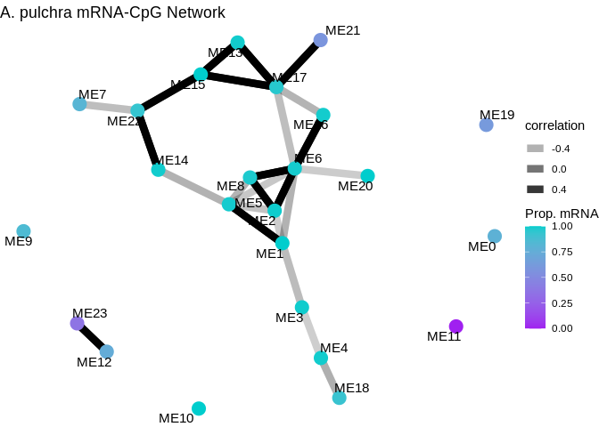
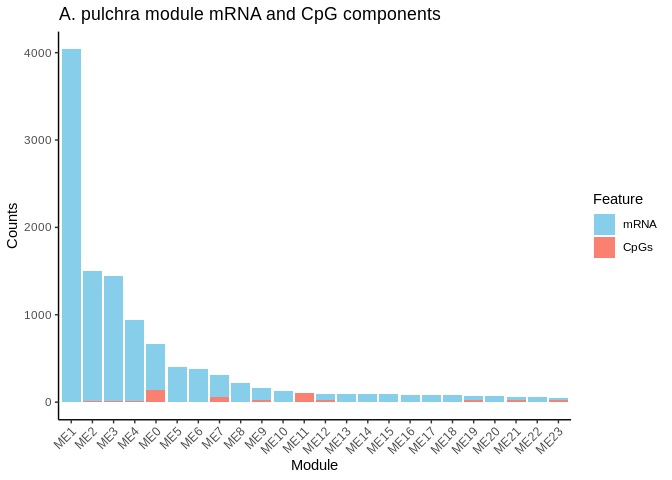
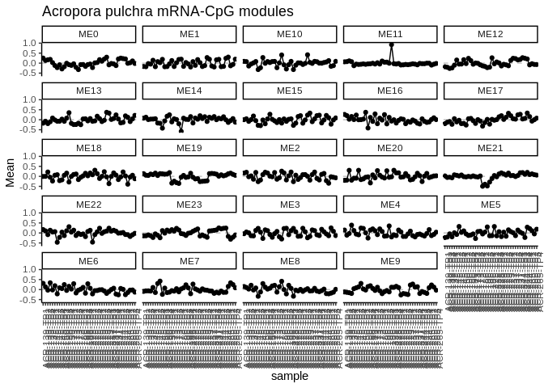
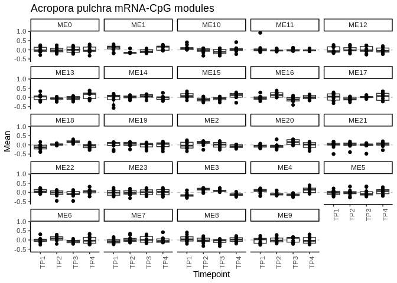
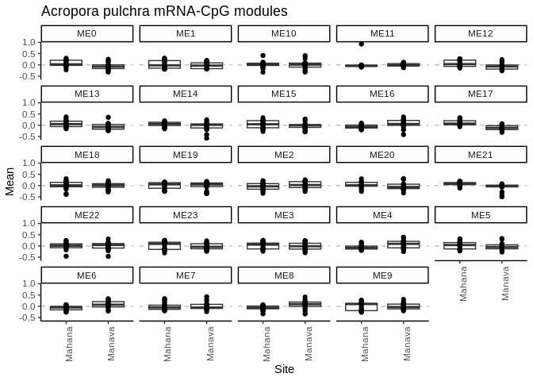
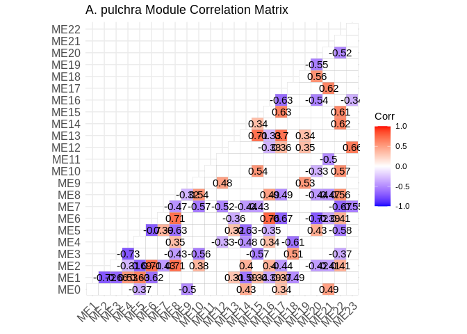
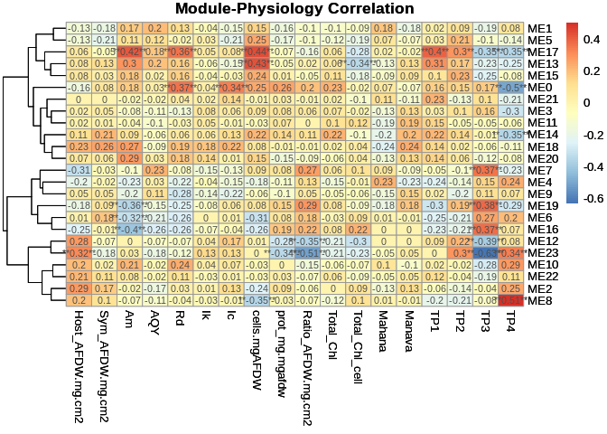

Apul time series multi-omic correlations
================
2025-02-13

This script conducts correlation network analyses for gene expression
and WGBS data for the time series project for Acropora pulchra.

# Set up

Load libraries

``` r
library(tidyverse)
library(ggplot2)
library(DESeq2)
library(igraph)
library(psych)
library(tidygraph)
library(ggraph)
library(WGCNA)
library(edgeR)
library(reshape2)
library(ggcorrplot)
library(corrplot)
library(rvest)
library(purrr)
library(pheatmap)
```

# Acropora pulchra

## Load and format data

Gene expression mRNA data.

``` r
# RNA variance stabilized counts data
genes <- read_csv("D-Apul/output/02.20-D-Apul-RNAseq-alignment-HiSat2/apul-gene_count_matrix.csv")
```

    ## Rows: 44371 Columns: 41
    ## ── Column specification ────────────────────────────────────────────────────────
    ## Delimiter: ","
    ## chr  (1): gene_id
    ## dbl (40): 1A1, 1A10, 1A12, 1A2, 1A8, 1A9, 1B1, 1B10, 1B2, 1B5, 1B9, 1C10, 1C...
    ## 
    ## ℹ Use `spec()` to retrieve the full column specification for this data.
    ## ℹ Specify the column types or set `show_col_types = FALSE` to quiet this message.

``` r
genes<-as.data.frame(genes)

rownames(genes)<-genes$gene_id

genes<-genes%>%select(!gene_id)
```

Load metadata.

``` r
metadata<-read_csv("M-multi-species/data/rna_metadata.csv")%>%select(AzentaSampleName, ColonyID, Timepoint)%>%
  filter(grepl("ACR", ColonyID))
```

    ## New names:
    ## Rows: 117 Columns: 19
    ## ── Column specification
    ## ──────────────────────────────────────────────────────── Delimiter: "," chr
    ## (13): SampleName, WellNumber, AzentaSampleName, ColonyID, Timepoint, Sam... dbl
    ## (5): SampleNumber, Plate, TotalAmount-ng, Volume-uL, Conc-ng.uL lgl (1):
    ## MethodUsedForSpectrophotometry
    ## ℹ Use `spec()` to retrieve the full column specification for this data. ℹ
    ## Specify the column types or set `show_col_types = FALSE` to quiet this message.
    ## • `` -> `...19`

``` r
colonies<-unique(metadata$ColonyID)
```

Load physiology data.

``` r
phys<-read_csv("https://github.com/urol-e5/timeseries/raw/refs/heads/master/time_series_analysis/Output/master_timeseries.csv")%>%filter(colony_id_corr %in% colonies)%>%
  select(colony_id_corr, species, timepoint, site, Host_AFDW.mg.cm2, Sym_AFDW.mg.cm2, Am, AQY, Rd, Ik, Ic, calc.umol.cm2.hr, cells.mgAFDW, prot_mg.mgafdw, Ratio_AFDW.mg.cm2, Total_Chl, Total_Chl_cell, cre.umol.mgafdw)
```

    ## Rows: 448 Columns: 46
    ## ── Column specification ────────────────────────────────────────────────────────
    ## Delimiter: ","
    ## chr (10): colony_id, colony_id_corr, species, timepoint, month, site, nutrie...
    ## dbl (36): cre.umol.mgprot, Host_AFDW.mg.cm2, Sym_AFDW.mg.cm2, Host_DW.mg.cm2...
    ## 
    ## ℹ Use `spec()` to retrieve the full column specification for this data.
    ## ℹ Specify the column types or set `show_col_types = FALSE` to quiet this message.

``` r
#add site information into metadata 
metadata$Site<-phys$site[match(metadata$ColonyID, phys$colony_id_corr)]
```

Load WGBS data.

``` r
#pull processed files from Gannet 

# Define the base URL
base_url <- "https://gannet.fish.washington.edu/seashell/bu-github/timeseries_molecular/D-Apul/output/15.5-Apul-bismark/"

# Read the HTML page
page <- read_html(base_url)

# Extract links to files
file_links <- page %>%
  html_nodes("a") %>%
  html_attr("href")

# Filter for files ending in "processed.txt"
processed_files <- file_links[grepl("processed\\.txt$", file_links)]

# Create full URLs
file_urls <- paste0(base_url, processed_files)

# Function to read a file from URL
read_processed_file <- function(url) {
  read_table(url, col_types = cols(.default = "c"))  # Read as character to avoid parsing issues
}

# Import all processed files into a list
processed_data <- lapply(file_urls, read_processed_file)

# Name the list elements by file name
names(processed_data) <- processed_files

# Print structure of imported data
str(processed_data)
```

    ## List of 40
    ##  $ ACR-139-TP1_10x_processed.txt: spc_tbl_ [6,244,910 × 2] (S3: spec_tbl_df/tbl_df/tbl/data.frame)
    ##   ..$ CpG_ntLink_0_25585: chr [1:6244910] "CpG_ntLink_0_25624" "CpG_ntLink_0_25777" "CpG_ntLink_0_25779" "CpG_ntLink_0_25788" ...
    ##   ..$ 0.000000          : chr [1:6244910] "0.000000" "0.000000" "0.000000" "0.000000" ...
    ##   ..- attr(*, "spec")=
    ##   .. .. cols(
    ##   .. ..   .default = col_character(),
    ##   .. ..   CpG_ntLink_0_25585 = col_character(),
    ##   .. ..   `0.000000` = col_character()
    ##   .. .. )
    ##  $ ACR-139-TP2_10x_processed.txt: spc_tbl_ [6,498,468 × 2] (S3: spec_tbl_df/tbl_df/tbl/data.frame)
    ##   ..$ CpG_ntLink_0_25692: chr [1:6498468] "CpG_ntLink_0_25699" "CpG_ntLink_0_80003" "CpG_ntLink_0_90500" "CpG_ntLink_0_90540" ...
    ##   ..$ 0.000000          : chr [1:6498468] "0.000000" "58.333333" "0.000000" "0.000000" ...
    ##   ..- attr(*, "spec")=
    ##   .. .. cols(
    ##   .. ..   .default = col_character(),
    ##   .. ..   CpG_ntLink_0_25692 = col_character(),
    ##   .. ..   `0.000000` = col_character()
    ##   .. .. )
    ##  $ ACR-139-TP3_10x_processed.txt: spc_tbl_ [5,784,262 × 2] (S3: spec_tbl_df/tbl_df/tbl/data.frame)
    ##   ..$ CpG_ntLink_0_90500: chr [1:5784262] "CpG_ntLink_0_90540" "CpG_ntLink_0_90562" "CpG_ntLink_0_94040" "CpG_ntLink_0_94055" ...
    ##   ..$ 0.000000          : chr [1:5784262] "0.000000" "0.000000" "0.000000" "0.000000" ...
    ##   ..- attr(*, "spec")=
    ##   .. .. cols(
    ##   .. ..   .default = col_character(),
    ##   .. ..   CpG_ntLink_0_90500 = col_character(),
    ##   .. ..   `0.000000` = col_character()
    ##   .. .. )
    ##  $ ACR-139-TP4_10x_processed.txt: spc_tbl_ [5,894,159 × 2] (S3: spec_tbl_df/tbl_df/tbl/data.frame)
    ##   ..$ CpG_ntLink_0_25624: chr [1:5894159] "CpG_ntLink_0_25788" "CpG_ntLink_0_25803" "CpG_ntLink_0_25811" "CpG_ntLink_0_25830" ...
    ##   ..$ 0.000000          : chr [1:5894159] "0.000000" "0.000000" "0.000000" "0.000000" ...
    ##   ..- attr(*, "spec")=
    ##   .. .. cols(
    ##   .. ..   .default = col_character(),
    ##   .. ..   CpG_ntLink_0_25624 = col_character(),
    ##   .. ..   `0.000000` = col_character()
    ##   .. .. )
    ##  $ ACR-145-TP1_10x_processed.txt: spc_tbl_ [6,438,148 × 2] (S3: spec_tbl_df/tbl_df/tbl/data.frame)
    ##   ..$ CpG_ntLink_0_25585: chr [1:6438148] "CpG_ntLink_0_25624" "CpG_ntLink_0_25692" "CpG_ntLink_0_25699" "CpG_ntLink_0_25761" ...
    ##   ..$ 10.000000         : chr [1:6438148] "6.666667" "0.000000" "0.000000" "4.347826" ...
    ##   ..- attr(*, "spec")=
    ##   .. .. cols(
    ##   .. ..   .default = col_character(),
    ##   .. ..   CpG_ntLink_0_25585 = col_character(),
    ##   .. ..   `10.000000` = col_character()
    ##   .. .. )
    ##  $ ACR-145-TP2_10x_processed.txt: spc_tbl_ [6,852,135 × 2] (S3: spec_tbl_df/tbl_df/tbl/data.frame)
    ##   ..$ CpG_ntLink_0_25585: chr [1:6852135] "CpG_ntLink_0_25624" "CpG_ntLink_0_25692" "CpG_ntLink_0_25699" "CpG_ntLink_0_25761" ...
    ##   ..$ 0.000000          : chr [1:6852135] "0.000000" "4.761905" "0.000000" "3.846154" ...
    ##   ..- attr(*, "spec")=
    ##   .. .. cols(
    ##   .. ..   .default = col_character(),
    ##   .. ..   CpG_ntLink_0_25585 = col_character(),
    ##   .. ..   `0.000000` = col_character()
    ##   .. .. )
    ##  $ ACR-145-TP3_10x_processed.txt: spc_tbl_ [5,290,638 × 2] (S3: spec_tbl_df/tbl_df/tbl/data.frame)
    ##   ..$ CpG_ntLink_0_25624: chr [1:5290638] "CpG_ntLink_0_25692" "CpG_ntLink_0_25699" "CpG_ntLink_0_25761" "CpG_ntLink_0_25777" ...
    ##   ..$ 0.000000          : chr [1:5290638] "0.000000" "0.000000" "0.000000" "0.000000" ...
    ##   ..- attr(*, "spec")=
    ##   .. .. cols(
    ##   .. ..   .default = col_character(),
    ##   .. ..   CpG_ntLink_0_25624 = col_character(),
    ##   .. ..   `0.000000` = col_character()
    ##   .. .. )
    ##  $ ACR-145-TP4_10x_processed.txt: spc_tbl_ [7,118,440 × 2] (S3: spec_tbl_df/tbl_df/tbl/data.frame)
    ##   ..$ CpG_ntLink_0_25585: chr [1:7118440] "CpG_ntLink_0_25624" "CpG_ntLink_0_25692" "CpG_ntLink_0_25699" "CpG_ntLink_0_25761" ...
    ##   ..$ 0.000000          : chr [1:7118440] "5.000000" "4.166667" "4.166667" "3.571429" ...
    ##   ..- attr(*, "spec")=
    ##   .. .. cols(
    ##   .. ..   .default = col_character(),
    ##   .. ..   CpG_ntLink_0_25585 = col_character(),
    ##   .. ..   `0.000000` = col_character()
    ##   .. .. )
    ##  $ ACR-150-TP1_10x_processed.txt: spc_tbl_ [6,921,066 × 2] (S3: spec_tbl_df/tbl_df/tbl/data.frame)
    ##   ..$ CpG_ntLink_0_94040: chr [1:6921066] "CpG_ntLink_0_94055" "CpG_ntLink_0_94077" "CpG_ntLink_0_94090" "CpG_ntLink_0_94095" ...
    ##   ..$ 0.000000          : chr [1:6921066] "0.000000" "0.000000" "0.000000" "0.000000" ...
    ##   ..- attr(*, "spec")=
    ##   .. .. cols(
    ##   .. ..   .default = col_character(),
    ##   .. ..   CpG_ntLink_0_94040 = col_character(),
    ##   .. ..   `0.000000` = col_character()
    ##   .. .. )
    ##  $ ACR-150-TP2_10x_processed.txt: spc_tbl_ [5,318,088 × 2] (S3: spec_tbl_df/tbl_df/tbl/data.frame)
    ##   ..$ CpG_ntLink_1_2597: chr [1:5318088] "CpG_ntLink_1_2613" "CpG_ntLink_1_2626" "CpG_ntLink_1_2633" "CpG_ntLink_1_2643" ...
    ##   ..$ 0.000000         : chr [1:5318088] "0.000000" "0.000000" "5.555556" "0.000000" ...
    ##   ..- attr(*, "spec")=
    ##   .. .. cols(
    ##   .. ..   .default = col_character(),
    ##   .. ..   CpG_ntLink_1_2597 = col_character(),
    ##   .. ..   `0.000000` = col_character()
    ##   .. .. )
    ##  $ ACR-150-TP3_10x_processed.txt: spc_tbl_ [6,300,303 × 2] (S3: spec_tbl_df/tbl_df/tbl/data.frame)
    ##   ..$ CpG_ntLink_1_2597: chr [1:6300303] "CpG_ntLink_1_2613" "CpG_ntLink_1_2626" "CpG_ntLink_1_2633" "CpG_ntLink_1_2643" ...
    ##   ..$ 0.000000         : chr [1:6300303] "0.000000" "0.000000" "0.000000" "0.000000" ...
    ##   ..- attr(*, "spec")=
    ##   .. .. cols(
    ##   .. ..   .default = col_character(),
    ##   .. ..   CpG_ntLink_1_2597 = col_character(),
    ##   .. ..   `0.000000` = col_character()
    ##   .. .. )
    ##  $ ACR-150-TP4_10x_processed.txt: spc_tbl_ [5,448,518 × 2] (S3: spec_tbl_df/tbl_df/tbl/data.frame)
    ##   ..$ CpG_ntLink_1_2597: chr [1:5448518] "CpG_ntLink_1_2613" "CpG_ntLink_1_2626" "CpG_ntLink_1_2633" "CpG_ntLink_1_2643" ...
    ##   ..$ 0.000000         : chr [1:5448518] "0.000000" "0.000000" "0.000000" "0.000000" ...
    ##   ..- attr(*, "spec")=
    ##   .. .. cols(
    ##   .. ..   .default = col_character(),
    ##   .. ..   CpG_ntLink_1_2597 = col_character(),
    ##   .. ..   `0.000000` = col_character()
    ##   .. .. )
    ##  $ ACR-173-TP1_10x_processed.txt: spc_tbl_ [6,119,173 × 2] (S3: spec_tbl_df/tbl_df/tbl/data.frame)
    ##   ..$ CpG_ntLink_0_85205: chr [1:6119173] "CpG_ntLink_0_94090" "CpG_ntLink_0_94095" "CpG_ntLink_0_94098" "CpG_ntLink_1_4888" ...
    ##   ..$ 71.428571         : chr [1:6119173] "0.000000" "0.000000" "0.000000" "0.000000" ...
    ##   ..- attr(*, "spec")=
    ##   .. .. cols(
    ##   .. ..   .default = col_character(),
    ##   .. ..   CpG_ntLink_0_85205 = col_character(),
    ##   .. ..   `71.428571` = col_character()
    ##   .. .. )
    ##  $ ACR-173-TP2_10x_processed.txt: spc_tbl_ [3,441,519 × 2] (S3: spec_tbl_df/tbl_df/tbl/data.frame)
    ##   ..$ CpG_ntLink_1_2597: chr [1:3441519] "CpG_ntLink_1_2613" "CpG_ntLink_1_2626" "CpG_ntLink_1_2633" "CpG_ntLink_1_2643" ...
    ##   ..$ 0.000000         : chr [1:3441519] "0.000000" "0.000000" "0.000000" "0.000000" ...
    ##   ..- attr(*, "spec")=
    ##   .. .. cols(
    ##   .. ..   .default = col_character(),
    ##   .. ..   CpG_ntLink_1_2597 = col_character(),
    ##   .. ..   `0.000000` = col_character()
    ##   .. .. )
    ##  $ ACR-173-TP3_10x_processed.txt: spc_tbl_ [5,017,891 × 2] (S3: spec_tbl_df/tbl_df/tbl/data.frame)
    ##   ..$ CpG_ntLink_1_22580: chr [1:5017891] "CpG_ntLink_1_22628" "CpG_ntLink_1_22653" "CpG_ntLink_1_22678" "CpG_ntLink_1_22703" ...
    ##   ..$ 0.000000          : chr [1:5017891] "0.000000" "0.000000" "0.000000" "0.000000" ...
    ##   ..- attr(*, "spec")=
    ##   .. .. cols(
    ##   .. ..   .default = col_character(),
    ##   .. ..   CpG_ntLink_1_22580 = col_character(),
    ##   .. ..   `0.000000` = col_character()
    ##   .. .. )
    ##  $ ACR-173-TP4_10x_processed.txt: spc_tbl_ [4,066,135 × 2] (S3: spec_tbl_df/tbl_df/tbl/data.frame)
    ##   ..$ CpG_ntLink_0_94040: chr [1:4066135] "CpG_ntLink_0_94055" "CpG_ntLink_0_94077" "CpG_ntLink_0_94090" "CpG_ntLink_0_94095" ...
    ##   ..$ 0.000000          : chr [1:4066135] "0.000000" "0.000000" "0.000000" "0.000000" ...
    ##   ..- attr(*, "spec")=
    ##   .. .. cols(
    ##   .. ..   .default = col_character(),
    ##   .. ..   CpG_ntLink_0_94040 = col_character(),
    ##   .. ..   `0.000000` = col_character()
    ##   .. .. )
    ##  $ ACR-186-TP1_10x_processed.txt: spc_tbl_ [4,624,114 × 2] (S3: spec_tbl_df/tbl_df/tbl/data.frame)
    ##   ..$ CpG_ntLink_0_60732: chr [1:4624114] "CpG_ntLink_0_60763" "CpG_ntLink_0_60822" "CpG_ntLink_0_60831" "CpG_ntLink_0_60880" ...
    ##   ..$ 0.000000          : chr [1:4624114] "0.000000" "0.000000" "0.000000" "0.000000" ...
    ##   ..- attr(*, "spec")=
    ##   .. .. cols(
    ##   .. ..   .default = col_character(),
    ##   .. ..   CpG_ntLink_0_60732 = col_character(),
    ##   .. ..   `0.000000` = col_character()
    ##   .. .. )
    ##  $ ACR-186-TP2_10x_processed.txt: spc_tbl_ [6,676,990 × 2] (S3: spec_tbl_df/tbl_df/tbl/data.frame)
    ##   ..$ CpG_ntLink_0_60601: chr [1:6676990] "CpG_ntLink_0_60612" "CpG_ntLink_0_60632" "CpG_ntLink_0_60642" "CpG_ntLink_0_60646" ...
    ##   ..$ 0.000000          : chr [1:6676990] "5.555556" "0.000000" "0.000000" "0.000000" ...
    ##   ..- attr(*, "spec")=
    ##   .. .. cols(
    ##   .. ..   .default = col_character(),
    ##   .. ..   CpG_ntLink_0_60601 = col_character(),
    ##   .. ..   `0.000000` = col_character()
    ##   .. .. )
    ##  $ ACR-186-TP3_10x_processed.txt: spc_tbl_ [4,731,740 × 2] (S3: spec_tbl_df/tbl_df/tbl/data.frame)
    ##   ..$ CpG_ntLink_0_60601: chr [1:4731740] "CpG_ntLink_0_60612" "CpG_ntLink_0_60632" "CpG_ntLink_0_60642" "CpG_ntLink_0_60646" ...
    ##   ..$ 0.000000          : chr [1:4731740] "0.000000" "8.333333" "0.000000" "0.000000" ...
    ##   ..- attr(*, "spec")=
    ##   .. .. cols(
    ##   .. ..   .default = col_character(),
    ##   .. ..   CpG_ntLink_0_60601 = col_character(),
    ##   .. ..   `0.000000` = col_character()
    ##   .. .. )
    ##  $ ACR-186-TP4_10x_processed.txt: spc_tbl_ [5,866,391 × 2] (S3: spec_tbl_df/tbl_df/tbl/data.frame)
    ##   ..$ CpG_ntLink_0_60612: chr [1:5866391] "CpG_ntLink_0_60632" "CpG_ntLink_0_60642" "CpG_ntLink_0_60646" "CpG_ntLink_0_60732" ...
    ##   ..$ 0.000000          : chr [1:5866391] "0.000000" "0.000000" "0.000000" "0.000000" ...
    ##   ..- attr(*, "spec")=
    ##   .. .. cols(
    ##   .. ..   .default = col_character(),
    ##   .. ..   CpG_ntLink_0_60612 = col_character(),
    ##   .. ..   `0.000000` = col_character()
    ##   .. .. )
    ##  $ ACR-225-TP1_10x_processed.txt: spc_tbl_ [71,708 × 2] (S3: spec_tbl_df/tbl_df/tbl/data.frame)
    ##   ..$ CpG_ntLink_3_73753: chr [1:71708] "CpG_ntLink_3_73782" "CpG_ntLink_3_73798" "CpG_ntLink_3_73813" "CpG_ntLink_3_73875" ...
    ##   ..$ 0.000000          : chr [1:71708] "3.333333" "0.000000" "5.405405" "14.285714" ...
    ##   ..- attr(*, "spec")=
    ##   .. .. cols(
    ##   .. ..   .default = col_character(),
    ##   .. ..   CpG_ntLink_3_73753 = col_character(),
    ##   .. ..   `0.000000` = col_character()
    ##   .. .. )
    ##  $ ACR-225-TP2_10x_processed.txt: spc_tbl_ [4,093,305 × 2] (S3: spec_tbl_df/tbl_df/tbl/data.frame)
    ##   ..$ CpG_ntLink_0_25624: chr [1:4093305] "CpG_ntLink_0_25692" "CpG_ntLink_0_25830" "CpG_ntLink_0_90540" "CpG_ntLink_0_90562" ...
    ##   ..$ 0.000000          : chr [1:4093305] "0.000000" "0.000000" "0.000000" "0.000000" ...
    ##   ..- attr(*, "spec")=
    ##   .. .. cols(
    ##   .. ..   .default = col_character(),
    ##   .. ..   CpG_ntLink_0_25624 = col_character(),
    ##   .. ..   `0.000000` = col_character()
    ##   .. .. )
    ##  $ ACR-225-TP3_10x_processed.txt: spc_tbl_ [4,586,401 × 2] (S3: spec_tbl_df/tbl_df/tbl/data.frame)
    ##   ..$ CpG_ntLink_0_90540: chr [1:4586401] "CpG_ntLink_0_90562" "CpG_ntLink_1_2597" "CpG_ntLink_1_2613" "CpG_ntLink_1_2626" ...
    ##   ..$ 18.181818         : chr [1:4586401] "0.000000" "0.000000" "0.000000" "0.000000" ...
    ##   ..- attr(*, "spec")=
    ##   .. .. cols(
    ##   .. ..   .default = col_character(),
    ##   .. ..   CpG_ntLink_0_90540 = col_character(),
    ##   .. ..   `18.181818` = col_character()
    ##   .. .. )
    ##  $ ACR-225-TP4_10x_processed.txt: spc_tbl_ [5,081,490 × 2] (S3: spec_tbl_df/tbl_df/tbl/data.frame)
    ##   ..$ CpG_ntLink_0_90500: chr [1:5081490] "CpG_ntLink_0_90540" "CpG_ntLink_0_90562" "CpG_ntLink_0_94090" "CpG_ntLink_0_94095" ...
    ##   ..$ 0.000000          : chr [1:5081490] "0.000000" "0.000000" "0.000000" "0.000000" ...
    ##   ..- attr(*, "spec")=
    ##   .. .. cols(
    ##   .. ..   .default = col_character(),
    ##   .. ..   CpG_ntLink_0_90500 = col_character(),
    ##   .. ..   `0.000000` = col_character()
    ##   .. .. )
    ##  $ ACR-229-TP1_10x_processed.txt: spc_tbl_ [7,723,251 × 2] (S3: spec_tbl_df/tbl_df/tbl/data.frame)
    ##   ..$ CpG_ntLink_0_60601: chr [1:7723251] "CpG_ntLink_0_60612" "CpG_ntLink_0_60632" "CpG_ntLink_0_60642" "CpG_ntLink_0_60646" ...
    ##   ..$ 0.000000          : chr [1:7723251] "0.000000" "0.000000" "0.000000" "9.090909" ...
    ##   ..- attr(*, "spec")=
    ##   .. .. cols(
    ##   .. ..   .default = col_character(),
    ##   .. ..   CpG_ntLink_0_60601 = col_character(),
    ##   .. ..   `0.000000` = col_character()
    ##   .. .. )
    ##  $ ACR-229-TP2_10x_processed.txt: spc_tbl_ [7,260,637 × 2] (S3: spec_tbl_df/tbl_df/tbl/data.frame)
    ##   ..$ CpG_ntLink_0_60732: chr [1:7260637] "CpG_ntLink_0_60763" "CpG_ntLink_0_60822" "CpG_ntLink_0_60831" "CpG_ntLink_0_60880" ...
    ##   ..$ 0.000000          : chr [1:7260637] "0.000000" "4.166667" "0.000000" "5.555556" ...
    ##   ..- attr(*, "spec")=
    ##   .. .. cols(
    ##   .. ..   .default = col_character(),
    ##   .. ..   CpG_ntLink_0_60732 = col_character(),
    ##   .. ..   `0.000000` = col_character()
    ##   .. .. )
    ##  $ ACR-229-TP3_10x_processed.txt: spc_tbl_ [6,339,294 × 2] (S3: spec_tbl_df/tbl_df/tbl/data.frame)
    ##   ..$ CpG_ntLink_0_60732: chr [1:6339294] "CpG_ntLink_0_60763" "CpG_ntLink_0_60822" "CpG_ntLink_0_60831" "CpG_ntLink_0_85205" ...
    ##   ..$ 0.000000          : chr [1:6339294] "0.000000" "0.000000" "0.000000" "0.000000" ...
    ##   ..- attr(*, "spec")=
    ##   .. .. cols(
    ##   .. ..   .default = col_character(),
    ##   .. ..   CpG_ntLink_0_60732 = col_character(),
    ##   .. ..   `0.000000` = col_character()
    ##   .. .. )
    ##  $ ACR-229-TP4_10x_processed.txt: spc_tbl_ [5,788,701 × 2] (S3: spec_tbl_df/tbl_df/tbl/data.frame)
    ##   ..$ CpG_ntLink_0_60822: chr [1:5788701] "CpG_ntLink_0_85205" "CpG_ntLink_0_90500" "CpG_ntLink_0_90540" "CpG_ntLink_0_90562" ...
    ##   ..$ 0.000000          : chr [1:5788701] "14.285714" "0.000000" "0.000000" "0.000000" ...
    ##   ..- attr(*, "spec")=
    ##   .. .. cols(
    ##   .. ..   .default = col_character(),
    ##   .. ..   CpG_ntLink_0_60822 = col_character(),
    ##   .. ..   `0.000000` = col_character()
    ##   .. .. )
    ##  $ ACR-237-TP1_10x_processed.txt: spc_tbl_ [6,124,966 × 2] (S3: spec_tbl_df/tbl_df/tbl/data.frame)
    ##   ..$ CpG_ntLink_1_2597: chr [1:6124966] "CpG_ntLink_1_2613" "CpG_ntLink_1_2626" "CpG_ntLink_1_2633" "CpG_ntLink_1_2643" ...
    ##   ..$ 0.000000         : chr [1:6124966] "0.000000" "0.000000" "0.000000" "0.000000" ...
    ##   ..- attr(*, "spec")=
    ##   .. .. cols(
    ##   .. ..   .default = col_character(),
    ##   .. ..   CpG_ntLink_1_2597 = col_character(),
    ##   .. ..   `0.000000` = col_character()
    ##   .. .. )
    ##  $ ACR-237-TP2_10x_processed.txt: spc_tbl_ [5,949,289 × 2] (S3: spec_tbl_df/tbl_df/tbl/data.frame)
    ##   ..$ CpG_ntLink_1_2597: chr [1:5949289] "CpG_ntLink_1_2613" "CpG_ntLink_1_2626" "CpG_ntLink_1_2633" "CpG_ntLink_1_2643" ...
    ##   ..$ 0.000000         : chr [1:5949289] "0.000000" "0.000000" "0.000000" "0.000000" ...
    ##   ..- attr(*, "spec")=
    ##   .. .. cols(
    ##   .. ..   .default = col_character(),
    ##   .. ..   CpG_ntLink_1_2597 = col_character(),
    ##   .. ..   `0.000000` = col_character()
    ##   .. .. )
    ##  $ ACR-237-TP3_10x_processed.txt: spc_tbl_ [6,983,165 × 2] (S3: spec_tbl_df/tbl_df/tbl/data.frame)
    ##   ..$ CpG_ntLink_1_2597: chr [1:6983165] "CpG_ntLink_1_2613" "CpG_ntLink_1_2626" "CpG_ntLink_1_2633" "CpG_ntLink_1_2643" ...
    ##   ..$ 0.000000         : chr [1:6983165] "0.000000" "0.000000" "0.000000" "0.000000" ...
    ##   ..- attr(*, "spec")=
    ##   .. .. cols(
    ##   .. ..   .default = col_character(),
    ##   .. ..   CpG_ntLink_1_2597 = col_character(),
    ##   .. ..   `0.000000` = col_character()
    ##   .. .. )
    ##  $ ACR-237-TP4_10x_processed.txt: spc_tbl_ [5,735,668 × 2] (S3: spec_tbl_df/tbl_df/tbl/data.frame)
    ##   ..$ CpG_ntLink_1_2597: chr [1:5735668] "CpG_ntLink_1_2613" "CpG_ntLink_1_2626" "CpG_ntLink_1_2633" "CpG_ntLink_1_2643" ...
    ##   ..$ 0.000000         : chr [1:5735668] "0.000000" "0.000000" "0.000000" "0.000000" ...
    ##   ..- attr(*, "spec")=
    ##   .. .. cols(
    ##   .. ..   .default = col_character(),
    ##   .. ..   CpG_ntLink_1_2597 = col_character(),
    ##   .. ..   `0.000000` = col_character()
    ##   .. .. )
    ##  $ ACR-244-TP1_10x_processed.txt: spc_tbl_ [6,741,848 × 2] (S3: spec_tbl_df/tbl_df/tbl/data.frame)
    ##   ..$ CpG_ntLink_1_4093: chr [1:6741848] "CpG_ntLink_1_4151" "CpG_ntLink_1_4171" "CpG_ntLink_1_7038" "CpG_ntLink_1_7044" ...
    ##   ..$ 0.000000         : chr [1:6741848] "0.000000" "0.000000" "0.000000" "0.000000" ...
    ##   ..- attr(*, "spec")=
    ##   .. .. cols(
    ##   .. ..   .default = col_character(),
    ##   .. ..   CpG_ntLink_1_4093 = col_character(),
    ##   .. ..   `0.000000` = col_character()
    ##   .. .. )
    ##  $ ACR-244-TP2_10x_processed.txt: spc_tbl_ [6,428,640 × 2] (S3: spec_tbl_df/tbl_df/tbl/data.frame)
    ##   ..$ CpG_ntLink_1_2626: chr [1:6428640] "CpG_ntLink_1_2725" "CpG_ntLink_1_4093" "CpG_ntLink_1_4151" "CpG_ntLink_1_4707" ...
    ##   ..$ 0.000000         : chr [1:6428640] "0.000000" "0.000000" "0.000000" "16.666667" ...
    ##   ..- attr(*, "spec")=
    ##   .. .. cols(
    ##   .. ..   .default = col_character(),
    ##   .. ..   CpG_ntLink_1_2626 = col_character(),
    ##   .. ..   `0.000000` = col_character()
    ##   .. .. )
    ##  $ ACR-244-TP3_10x_processed.txt: spc_tbl_ [3,619,640 × 2] (S3: spec_tbl_df/tbl_df/tbl/data.frame)
    ##   ..$ CpG_ntLink_1_4093: chr [1:3619640] "CpG_ntLink_1_4151" "CpG_ntLink_1_4671" "CpG_ntLink_1_4693" "CpG_ntLink_1_4695" ...
    ##   ..$ 0.000000         : chr [1:3619640] "0.000000" "0.000000" "10.000000" "10.000000" ...
    ##   ..- attr(*, "spec")=
    ##   .. .. cols(
    ##   .. ..   .default = col_character(),
    ##   .. ..   CpG_ntLink_1_4093 = col_character(),
    ##   .. ..   `0.000000` = col_character()
    ##   .. .. )
    ##  $ ACR-244-TP4_10x_processed.txt: spc_tbl_ [7,225,326 × 2] (S3: spec_tbl_df/tbl_df/tbl/data.frame)
    ##   ..$ CpG_ntLink_1_4093: chr [1:7225326] "CpG_ntLink_1_4151" "CpG_ntLink_1_4171" "CpG_ntLink_1_4831" "CpG_ntLink_1_4842" ...
    ##   ..$ 0.000000         : chr [1:7225326] "0.000000" "0.000000" "7.692308" "0.000000" ...
    ##   ..- attr(*, "spec")=
    ##   .. .. cols(
    ##   .. ..   .default = col_character(),
    ##   .. ..   CpG_ntLink_1_4093 = col_character(),
    ##   .. ..   `0.000000` = col_character()
    ##   .. .. )
    ##  $ ACR-265-TP1_10x_processed.txt: spc_tbl_ [6,422,762 × 2] (S3: spec_tbl_df/tbl_df/tbl/data.frame)
    ##   ..$ CpG_ntLink_0_25585: chr [1:6422762] "CpG_ntLink_0_25624" "CpG_ntLink_0_25692" "CpG_ntLink_0_25699" "CpG_ntLink_0_25761" ...
    ##   ..$ 0.000000          : chr [1:6422762] "0.000000" "0.000000" "0.000000" "0.000000" ...
    ##   ..- attr(*, "spec")=
    ##   .. .. cols(
    ##   .. ..   .default = col_character(),
    ##   .. ..   CpG_ntLink_0_25585 = col_character(),
    ##   .. ..   `0.000000` = col_character()
    ##   .. .. )
    ##  $ ACR-265-TP2_10x_processed.txt: spc_tbl_ [5,909,226 × 2] (S3: spec_tbl_df/tbl_df/tbl/data.frame)
    ##   ..$ CpG_ntLink_0_25624: chr [1:5909226] "CpG_ntLink_0_25692" "CpG_ntLink_0_25699" "CpG_ntLink_0_25761" "CpG_ntLink_0_25777" ...
    ##   ..$ 0.000000          : chr [1:5909226] "0.000000" "0.000000" "0.000000" "0.000000" ...
    ##   ..- attr(*, "spec")=
    ##   .. .. cols(
    ##   .. ..   .default = col_character(),
    ##   .. ..   CpG_ntLink_0_25624 = col_character(),
    ##   .. ..   `0.000000` = col_character()
    ##   .. .. )
    ##  $ ACR-265-TP3_10x_processed.txt: spc_tbl_ [5,666,084 × 2] (S3: spec_tbl_df/tbl_df/tbl/data.frame)
    ##   ..$ CpG_ntLink_0_25624: chr [1:5666084] "CpG_ntLink_0_25692" "CpG_ntLink_0_25699" "CpG_ntLink_0_25761" "CpG_ntLink_0_25777" ...
    ##   ..$ 0.000000          : chr [1:5666084] "0.000000" "0.000000" "0.000000" "0.000000" ...
    ##   ..- attr(*, "spec")=
    ##   .. .. cols(
    ##   .. ..   .default = col_character(),
    ##   .. ..   CpG_ntLink_0_25624 = col_character(),
    ##   .. ..   `0.000000` = col_character()
    ##   .. .. )
    ##  $ ACR-265-TP4_10x_processed.txt: spc_tbl_ [4,088,229 × 2] (S3: spec_tbl_df/tbl_df/tbl/data.frame)
    ##   ..$ CpG_ntLink_0_25624: chr [1:4088229] "CpG_ntLink_0_25692" "CpG_ntLink_0_25699" "CpG_ntLink_0_25761" "CpG_ntLink_0_25777" ...
    ##   ..$ 0.000000          : chr [1:4088229] "0.000000" "0.000000" "0.000000" "0.000000" ...
    ##   ..- attr(*, "spec")=
    ##   .. .. cols(
    ##   .. ..   .default = col_character(),
    ##   .. ..   CpG_ntLink_0_25624 = col_character(),
    ##   .. ..   `0.000000` = col_character()
    ##   .. .. )

``` r
# add a header row that has "CpG" for the first column and "sample" for the second column, which will be populated by the file name 

processed_data <- Map(function(df, filename) {
  colnames(df) <- c("CpG", filename)  # Rename columns
  return(df)
}, processed_data, names(processed_data))  # Use stored file names

#merge files together by "CpG"
merged_data <- purrr::reduce(processed_data, full_join, by = "CpG")

# Print structure of final merged data
str(merged_data)
```

    ## spc_tbl_ [12,093,025 × 41] (S3: spec_tbl_df/tbl_df/tbl/data.frame)
    ##  $ CpG                          : chr [1:12093025] "CpG_ntLink_0_25624" "CpG_ntLink_0_25777" "CpG_ntLink_0_25779" "CpG_ntLink_0_25788" ...
    ##  $ ACR-139-TP1_10x_processed.txt: chr [1:12093025] "0.000000" "0.000000" "0.000000" "0.000000" ...
    ##  $ ACR-139-TP2_10x_processed.txt: chr [1:12093025] NA NA NA NA ...
    ##  $ ACR-139-TP3_10x_processed.txt: chr [1:12093025] NA NA NA NA ...
    ##  $ ACR-139-TP4_10x_processed.txt: chr [1:12093025] NA NA NA "0.000000" ...
    ##  $ ACR-145-TP1_10x_processed.txt: chr [1:12093025] "6.666667" "4.761905" "5.000000" "5.555556" ...
    ##  $ ACR-145-TP2_10x_processed.txt: chr [1:12093025] "0.000000" "4.545455" "4.545455" "5.555556" ...
    ##  $ ACR-145-TP3_10x_processed.txt: chr [1:12093025] NA "0.000000" "0.000000" NA ...
    ##  $ ACR-145-TP4_10x_processed.txt: chr [1:12093025] "5.000000" "4.000000" "4.166667" "4.761905" ...
    ##  $ ACR-150-TP1_10x_processed.txt: chr [1:12093025] NA NA NA NA ...
    ##  $ ACR-150-TP2_10x_processed.txt: chr [1:12093025] NA NA NA NA ...
    ##  $ ACR-150-TP3_10x_processed.txt: chr [1:12093025] NA NA NA NA ...
    ##  $ ACR-150-TP4_10x_processed.txt: chr [1:12093025] NA NA NA NA ...
    ##  $ ACR-173-TP1_10x_processed.txt: chr [1:12093025] NA NA NA NA ...
    ##  $ ACR-173-TP2_10x_processed.txt: chr [1:12093025] NA NA NA NA ...
    ##  $ ACR-173-TP3_10x_processed.txt: chr [1:12093025] NA NA NA NA ...
    ##  $ ACR-173-TP4_10x_processed.txt: chr [1:12093025] NA NA NA NA ...
    ##  $ ACR-186-TP1_10x_processed.txt: chr [1:12093025] NA NA NA NA ...
    ##  $ ACR-186-TP2_10x_processed.txt: chr [1:12093025] NA NA NA NA ...
    ##  $ ACR-186-TP3_10x_processed.txt: chr [1:12093025] NA NA NA NA ...
    ##  $ ACR-186-TP4_10x_processed.txt: chr [1:12093025] NA NA NA NA ...
    ##  $ ACR-225-TP1_10x_processed.txt: chr [1:12093025] NA NA NA NA ...
    ##  $ ACR-225-TP2_10x_processed.txt: chr [1:12093025] NA NA NA NA ...
    ##  $ ACR-225-TP3_10x_processed.txt: chr [1:12093025] NA NA NA NA ...
    ##  $ ACR-225-TP4_10x_processed.txt: chr [1:12093025] NA NA NA NA ...
    ##  $ ACR-229-TP1_10x_processed.txt: chr [1:12093025] NA NA NA NA ...
    ##  $ ACR-229-TP2_10x_processed.txt: chr [1:12093025] NA NA NA NA ...
    ##  $ ACR-229-TP3_10x_processed.txt: chr [1:12093025] NA NA NA NA ...
    ##  $ ACR-229-TP4_10x_processed.txt: chr [1:12093025] NA NA NA NA ...
    ##  $ ACR-237-TP1_10x_processed.txt: chr [1:12093025] NA NA NA NA ...
    ##  $ ACR-237-TP2_10x_processed.txt: chr [1:12093025] NA NA NA NA ...
    ##  $ ACR-237-TP3_10x_processed.txt: chr [1:12093025] NA NA NA NA ...
    ##  $ ACR-237-TP4_10x_processed.txt: chr [1:12093025] NA NA NA NA ...
    ##  $ ACR-244-TP1_10x_processed.txt: chr [1:12093025] NA NA NA NA ...
    ##  $ ACR-244-TP2_10x_processed.txt: chr [1:12093025] NA NA NA NA ...
    ##  $ ACR-244-TP3_10x_processed.txt: chr [1:12093025] NA NA NA NA ...
    ##  $ ACR-244-TP4_10x_processed.txt: chr [1:12093025] NA NA NA NA ...
    ##  $ ACR-265-TP1_10x_processed.txt: chr [1:12093025] "0.000000" "0.000000" "0.000000" "0.000000" ...
    ##  $ ACR-265-TP2_10x_processed.txt: chr [1:12093025] NA "0.000000" "0.000000" "0.000000" ...
    ##  $ ACR-265-TP3_10x_processed.txt: chr [1:12093025] NA "0.000000" "0.000000" "0.000000" ...
    ##  $ ACR-265-TP4_10x_processed.txt: chr [1:12093025] NA "0.000000" "0.000000" "0.000000" ...
    ##  - attr(*, "spec")=
    ##   .. cols(
    ##   ..   .default = col_character(),
    ##   ..   CpG_ntLink_0_25585 = col_character(),
    ##   ..   `0.000000` = col_character()
    ##   .. )

Replace any NA with 0.

``` r
# Convert all columns (except "CpG") to numeric and replace NAs with 0
merged_data <- merged_data %>%
  mutate(across(-CpG, as.numeric)) %>%  # Convert all except CpG to numeric
  mutate(across(-CpG, ~ replace_na(.x, 0)))  # Replace NA with 0 in numeric columns
```

## Filter data sets

Only keep CpGs that have a non-zero value in all samples.

``` r
filtered_data <- merged_data %>%
  filter(if_all(-CpG, ~ .x > 0))
```

We had 12,093,025 CpGs before filtering and have only 507 after
filtering. This makes sense because most CpGs were not methylated in all
samples.

Only keep the sample information in the column name.

``` r
colnames(filtered_data) <- gsub("^(.*?)_.*$", "\\1", colnames(filtered_data))
```

Next I will format the genes, WGBS, and physiology data sets to have
consistent sample ID naming.

Only keep genes that are non-zero in all samples.

``` r
filtered_genes <- genes %>%
  filter(if_all(everything(), ~ .x > 0))
```

There were 44371 genes identified with 10717 genes kept after filtering
to only keep genes detected \>0 in all samples.

## Rename samples to be consistent between data sets

The goal is to have each data frame with the feature as row names and
sample ID (ACR-ID-TP) as column names.

Format metadata.

``` r
metadata$code<-paste0(metadata$ColonyID, "-", metadata$Timepoint)
```

Format gene data set.

``` r
# Create a named vector for mapping: SampleName -> colonyID
rename_map <- setNames(metadata$code, metadata$AzentaSampleName)

# Rename matching columns in the gene dataset
colnames(filtered_genes) <- ifelse(colnames(filtered_genes) %in% names(rename_map), 
                                  rename_map[colnames(filtered_genes)], 
                                  colnames(filtered_genes))
```

View differences in column names between genes and wgbs data sets.

``` r
setdiff(colnames(filtered_data), colnames(filtered_genes))
```

    ## [1] "CpG"

All colony names match!

Set CpG id as rownames in the wgbs dataset.

``` r
filtered_data<-as.data.frame(filtered_data)

rownames(filtered_data)<-filtered_data$CpG

filtered_data<-filtered_data%>%
  select(!CpG)
```

The genes and wgbs data sets are now formatted the same way.

Create a matching sample name in the physiology set.

``` r
#change the format of the timepoint column 
phys <- phys %>%
  filter(species=="Acropora")%>%
  mutate(timepoint = gsub("timepoint", "TP", timepoint))%>%
  mutate(code = paste0(colony_id_corr, "-", timepoint))

#set row names and trim to useful columns
phys<-as.data.frame(phys)
rownames(phys)<-phys$code
phys<-phys%>%
  select(!code)

#remove calcification and antioxidant capacity that have NAs 
phys<-phys%>%
  select(!c(cre.umol.mgafdw, calc.umol.cm2.hr))%>%
  select(!c(colony_id_corr, species, timepoint, site))
```

We have physiology data from 39 out of 40 colonies in this data set.

Set metadata with samples as column names.

``` r
metadata<-as.data.frame(metadata)
rownames(metadata)<-metadata$code
metadata<-metadata%>%
  select(ColonyID, Timepoint, Site)
```

## Transform data

Set the order of genes, wgbs, and metadata to all be the same.

``` r
# Ensure rownames of metadata are used as the desired column order
desired_order <- rownames(metadata)

# Find columns in genes_data that match the desired order
matching_columns <- intersect(desired_order, colnames(filtered_genes))

# Reorder columns in genes_data to match metadata rownames
filtered_genes <- filtered_genes %>%
  select(all_of(matching_columns))

# Print the updated column order
print(colnames(filtered_genes))
```

    ##  [1] "ACR-225-TP1" "ACR-225-TP2" "ACR-225-TP3" "ACR-225-TP4" "ACR-229-TP1"
    ##  [6] "ACR-229-TP2" "ACR-229-TP3" "ACR-229-TP4" "ACR-237-TP1" "ACR-237-TP2"
    ## [11] "ACR-237-TP3" "ACR-237-TP4" "ACR-244-TP1" "ACR-244-TP2" "ACR-244-TP3"
    ## [16] "ACR-244-TP4" "ACR-265-TP1" "ACR-265-TP2" "ACR-265-TP3" "ACR-265-TP4"
    ## [21] "ACR-139-TP1" "ACR-139-TP2" "ACR-139-TP3" "ACR-139-TP4" "ACR-145-TP1"
    ## [26] "ACR-145-TP2" "ACR-145-TP3" "ACR-145-TP4" "ACR-150-TP1" "ACR-150-TP2"
    ## [31] "ACR-150-TP3" "ACR-150-TP4" "ACR-173-TP1" "ACR-173-TP2" "ACR-173-TP3"
    ## [36] "ACR-173-TP4" "ACR-186-TP1" "ACR-186-TP2" "ACR-186-TP3" "ACR-186-TP4"

``` r
print(rownames(metadata))
```

    ##  [1] "ACR-225-TP1" "ACR-225-TP2" "ACR-225-TP3" "ACR-225-TP4" "ACR-229-TP1"
    ##  [6] "ACR-229-TP2" "ACR-229-TP3" "ACR-229-TP4" "ACR-237-TP1" "ACR-237-TP2"
    ## [11] "ACR-237-TP3" "ACR-237-TP4" "ACR-244-TP1" "ACR-244-TP2" "ACR-244-TP3"
    ## [16] "ACR-244-TP4" "ACR-265-TP1" "ACR-265-TP2" "ACR-265-TP3" "ACR-265-TP4"
    ## [21] "ACR-139-TP1" "ACR-139-TP2" "ACR-139-TP3" "ACR-139-TP4" "ACR-145-TP1"
    ## [26] "ACR-145-TP2" "ACR-145-TP3" "ACR-145-TP4" "ACR-150-TP1" "ACR-150-TP2"
    ## [31] "ACR-150-TP3" "ACR-150-TP4" "ACR-173-TP1" "ACR-173-TP2" "ACR-173-TP3"
    ## [36] "ACR-173-TP4" "ACR-186-TP1" "ACR-186-TP2" "ACR-186-TP3" "ACR-186-TP4"

Repeat for wgbs data.

``` r
# Find columns in genes_data that match the desired order
matching_columns <- intersect(desired_order, colnames(filtered_data))

# Reorder columns in genes_data to match metadata rownames
filtered_data <- filtered_data %>%
  select(all_of(matching_columns))

# Print the updated column order
print(colnames(filtered_data))
```

    ##  [1] "ACR-225-TP1" "ACR-225-TP2" "ACR-225-TP3" "ACR-225-TP4" "ACR-229-TP1"
    ##  [6] "ACR-229-TP2" "ACR-229-TP3" "ACR-229-TP4" "ACR-237-TP1" "ACR-237-TP2"
    ## [11] "ACR-237-TP3" "ACR-237-TP4" "ACR-244-TP1" "ACR-244-TP2" "ACR-244-TP3"
    ## [16] "ACR-244-TP4" "ACR-265-TP1" "ACR-265-TP2" "ACR-265-TP3" "ACR-265-TP4"
    ## [21] "ACR-139-TP1" "ACR-139-TP2" "ACR-139-TP3" "ACR-139-TP4" "ACR-145-TP1"
    ## [26] "ACR-145-TP2" "ACR-145-TP3" "ACR-145-TP4" "ACR-150-TP1" "ACR-150-TP2"
    ## [31] "ACR-150-TP3" "ACR-150-TP4" "ACR-173-TP1" "ACR-173-TP2" "ACR-173-TP3"
    ## [36] "ACR-173-TP4" "ACR-186-TP1" "ACR-186-TP2" "ACR-186-TP3" "ACR-186-TP4"

``` r
print(rownames(metadata))
```

    ##  [1] "ACR-225-TP1" "ACR-225-TP2" "ACR-225-TP3" "ACR-225-TP4" "ACR-229-TP1"
    ##  [6] "ACR-229-TP2" "ACR-229-TP3" "ACR-229-TP4" "ACR-237-TP1" "ACR-237-TP2"
    ## [11] "ACR-237-TP3" "ACR-237-TP4" "ACR-244-TP1" "ACR-244-TP2" "ACR-244-TP3"
    ## [16] "ACR-244-TP4" "ACR-265-TP1" "ACR-265-TP2" "ACR-265-TP3" "ACR-265-TP4"
    ## [21] "ACR-139-TP1" "ACR-139-TP2" "ACR-139-TP3" "ACR-139-TP4" "ACR-145-TP1"
    ## [26] "ACR-145-TP2" "ACR-145-TP3" "ACR-145-TP4" "ACR-150-TP1" "ACR-150-TP2"
    ## [31] "ACR-150-TP3" "ACR-150-TP4" "ACR-173-TP1" "ACR-173-TP2" "ACR-173-TP3"
    ## [36] "ACR-173-TP4" "ACR-186-TP1" "ACR-186-TP2" "ACR-186-TP3" "ACR-186-TP4"

Use a variance stabilized transformation for the genes and wgbs data
sets.

``` r
dds_genes <- DESeqDataSetFromMatrix(countData = filtered_genes, 
                              colData = metadata, 
                              design = ~ Timepoint * Site)
```

    ## converting counts to integer mode

    ## Warning in DESeqDataSet(se, design = design, ignoreRank): some variables in
    ## design formula are characters, converting to factors

``` r
# Variance Stabilizing Transformation
vsd_genes <- assay(vst(dds_genes, blind = TRUE))
```

I had to round wgbs data to whole integers for normalization - need to
return to this to decide if this is appropriate.

``` r
str(filtered_data)
```

    ## 'data.frame':    507 obs. of  40 variables:
    ##  $ ACR-225-TP1: num  15.25 12.5 6.09 1.9 9.72 ...
    ##  $ ACR-225-TP2: num  27 23.7 44.8 48.4 60 ...
    ##  $ ACR-225-TP3: num  4.55 4.55 23.53 27.78 16.67 ...
    ##  $ ACR-225-TP4: num  21.7 17.8 48.3 50 28.6 ...
    ##  $ ACR-229-TP1: num  8.11 13.95 42.22 43.9 21.21 ...
    ##  $ ACR-229-TP2: num  5.13 5.13 34.04 31.91 38.89 ...
    ##  $ ACR-229-TP3: num  9.09 9.09 31.82 37.21 28.95 ...
    ##  $ ACR-229-TP4: num  2.38 2.7 32.56 36.36 21.43 ...
    ##  $ ACR-237-TP1: num  23.8 21 65.2 65 76.2 ...
    ##  $ ACR-237-TP2: num  42.2 32.8 85.7 86.4 87.5 ...
    ##  $ ACR-237-TP3: num  30.6 30.6 71.9 68.8 54.5 ...
    ##  $ ACR-237-TP4: num  33.3 25 72.4 71 76.2 ...
    ##  $ ACR-244-TP1: num  16.7 18.8 43.8 44.8 50 ...
    ##  $ ACR-244-TP2: num  43.1 38.8 72.2 75.7 77.4 ...
    ##  $ ACR-244-TP3: num  35.7 34.1 57.1 63.2 52.4 ...
    ##  $ ACR-244-TP4: num  25.5 27.5 61.4 61 54.3 ...
    ##  $ ACR-265-TP1: num  21.7 28.1 21.3 25.6 20 ...
    ##  $ ACR-265-TP2: num  27.3 23.1 45.5 51.7 48 ...
    ##  $ ACR-265-TP3: num  24 16.7 43.6 48.8 19.4 ...
    ##  $ ACR-265-TP4: num  14.3 22.7 35.8 37.3 24.2 ...
    ##  $ ACR-139-TP1: num  43.8 43.3 40 44.9 35.1 ...
    ##  $ ACR-139-TP2: num  23.5 18.8 30.8 28.3 31.8 ...
    ##  $ ACR-139-TP3: num  23.3 17.9 22 25 30.8 ...
    ##  $ ACR-139-TP4: num  37.8 39.5 26.2 31.6 27 ...
    ##  $ ACR-145-TP1: num  12.5 9.09 41.46 41.46 44.83 ...
    ##  $ ACR-145-TP2: num  21.2 21.1 50 46.5 30 ...
    ##  $ ACR-145-TP3: num  19.2 18.5 38.2 40.6 14.3 ...
    ##  $ ACR-145-TP4: num  16 13.2 34.8 40.5 52.9 ...
    ##  $ ACR-150-TP1: num  16.4 18.2 53.8 63 54.2 ...
    ##  $ ACR-150-TP2: num  34.6 33.3 78.9 75 68.8 ...
    ##  $ ACR-150-TP3: num  34.1 26.2 66.7 73.7 66.7 ...
    ##  $ ACR-150-TP4: num  30.2 24.2 68 66.7 38.1 ...
    ##  $ ACR-173-TP1: num  7.89 5.41 34.09 34.21 20 ...
    ##  $ ACR-173-TP2: num  16.1 21.9 34.5 39.3 33.3 ...
    ##  $ ACR-173-TP3: num  16.7 16 23.8 28.8 10 ...
    ##  $ ACR-173-TP4: num  4.76 5 16.36 16.33 14.29 ...
    ##  $ ACR-186-TP1: num  16.7 8.7 36 32.7 21.4 ...
    ##  $ ACR-186-TP2: num  13.8 17.5 39.5 42.5 16.1 ...
    ##  $ ACR-186-TP3: num  12.2 13.6 34.5 36.8 12.5 ...
    ##  $ ACR-186-TP4: num  28.9 25 52.5 52.5 17.9 ...

``` r
#round to integers 
filtered_data<-filtered_data %>%
  mutate(across(where(is.numeric), round))

dds_wgbs <- DESeqDataSetFromMatrix(countData = filtered_data, 
                              colData = metadata, 
                              design = ~ Timepoint * Site)
```

    ## converting counts to integer mode

    ## Warning in DESeqDataSet(se, design = design, ignoreRank): some variables in
    ## design formula are characters, converting to factors

``` r
# Variance Stabilizing Transformation
vsd_wgbs <- assay(varianceStabilizingTransformation(dds_wgbs, blind = TRUE))
```

    ## -- note: fitType='parametric', but the dispersion trend was not well captured by the
    ##    function: y = a/x + b, and a local regression fit was automatically substituted.
    ##    specify fitType='local' or 'mean' to avoid this message next time.

Scale physiological variables to have all on the same scale (mean of 0
and std dev of 1).

``` r
phys <- phys %>%
  mutate(across(where(is.numeric), scale))
```

Rbind together the data sets in preparation for wgcna

``` r
combined_data<-rbind(vsd_genes, vsd_wgbs)
```

This dataset now has all CpGs and genes included.

## Conduct module correlations with WGCNA

Set soft threshold.

``` r
options(stringsAsFactors = FALSE)
enableWGCNAThreads()  # Enable multi-threading
```

    ## Allowing parallel execution with up to 47 working processes.

``` r
allowWGCNAThreads(nThreads = 2)
```

    ## Allowing multi-threading with up to 2 threads.

``` r
# Combine mRNA and lncRNA datasets
datExpr <- t(combined_data)

sum(is.na(datExpr))  # Should be 0
```

    ## [1] 0

``` r
sum(!is.finite(as.matrix(datExpr)))  # Should be 0
```

    ## [1] 0

``` r
# Remove genes/samples with missing or infinite values
datExpr <- datExpr[complete.cases(datExpr), ]
datExpr <- datExpr[, colSums(is.na(datExpr)) == 0]

# # Choose a set of soft-thresholding powers
powers <- c(seq(from = 1, to=19, by=2), c(21:30)) #Create a string of numbers from 1 through 10, and even numbers from 10 through 20
# 
# # Call the network topology analysis function
sft <-pickSoftThreshold(datExpr, powerVector = powers, verbose = 5)
```

    ## pickSoftThreshold: will use block size 3986.
    ##  pickSoftThreshold: calculating connectivity for given powers...
    ##    ..working on genes 1 through 3986 of 11224
    ##    ..working on genes 3987 through 7972 of 11224
    ##    ..working on genes 7973 through 11224 of 11224
    ##    Power SFT.R.sq  slope truncated.R.sq mean.k. median.k. max.k.
    ## 1      1    0.143  0.606          0.742 3060.00  2.97e+03   5100
    ## 2      3    0.888 -0.978          0.979  655.00  4.76e+02   2190
    ## 3      5    0.959 -1.190          0.992  240.00  1.17e+02   1290
    ## 4      7    0.968 -1.260          0.993  113.00  3.61e+01    875
    ## 5      9    0.977 -1.270          0.996   62.00  1.33e+01    642
    ## 6     11    0.980 -1.280          0.996   37.60  5.26e+00    496
    ## 7     13    0.977 -1.280          0.990   24.50  2.22e+00    398
    ## 8     15    0.977 -1.280          0.988   16.90  1.03e+00    329
    ## 9     17    0.979 -1.270          0.987   12.20  5.18e-01    278
    ## 10    19    0.982 -1.260          0.989    9.10  2.68e-01    238
    ## 11    21    0.980 -1.250          0.985    6.99  1.43e-01    208
    ## 12    22    0.981 -1.250          0.984    6.18  1.05e-01    195
    ## 13    23    0.978 -1.250          0.983    5.50  7.78e-02    183
    ## 14    24    0.975 -1.250          0.979    4.92  5.79e-02    173
    ## 15    25    0.967 -1.250          0.973    4.42  4.40e-02    163
    ## 16    26    0.969 -1.250          0.977    3.98  3.33e-02    155
    ## 17    27    0.953 -1.250          0.963    3.61  2.54e-02    147
    ## 18    28    0.955 -1.250          0.962    3.28  1.94e-02    140
    ## 19    29    0.956 -1.250          0.964    2.99  1.49e-02    133
    ## 20    30    0.948 -1.260          0.957    2.74  1.16e-02    127

Plot the results.

``` r
sizeGrWindow(9, 5)
par(mfrow = c(1,2));
cex1 = 0.9;
# # # Scale-free topology fit index as a function of the soft-thresholding power
plot(sft$fitIndices[,1], -sign(sft$fitIndices[,3])*sft$fitIndices[,2],
      xlab="Soft Threshold (power)",ylab="Scale Free Topology Model Fit,signed R^2",type="n",
     main = paste("Scale independence"));
 text(sft$fitIndices[,1], -sign(sft$fitIndices[,3])*sft$fitIndices[,2],
     labels=powers,cex=cex1,col="red");
# # # this line corresponds to using an R^2 cut-off
 abline(h=0.9,col="red")
# # # Mean connectivity as a function of the soft-thresholding power
 plot(sft$fitIndices[,1], sft$fitIndices[,5],
     xlab="Soft Threshold (power)",ylab="Mean Connectivity", type="n",
     main = paste("Mean connectivity"))
 text(sft$fitIndices[,1], sft$fitIndices[,5], labels=powers, cex=cex1,col="red")
```

Selected power will be 5 (the first value to cross 0.9 threshold).

### Generate network

``` r
selected_power<-5 

# Network construction (adjust power based on sft output)
net = blockwiseModules(datExpr, power = selected_power,
                       TOMType = "unsigned", minModuleSize = 30,
                       reassignThreshold = 0, mergeCutHeight = 0.25,
                       numericLabels = TRUE, pamRespectsDendro = FALSE,
                       saveTOMs = FALSE, verbose = 3)
```

    ##  Calculating module eigengenes block-wise from all genes
    ##    Flagging genes and samples with too many missing values...
    ##     ..step 1
    ##  ....pre-clustering genes to determine blocks..
    ##    Projective K-means:
    ##    ..k-means clustering..
    ##    ..merging smaller clusters...
    ## Block sizes:
    ## gBlocks
    ##    1    2    3 
    ## 4882 3279 3063 
    ##  ..Working on block 1 .
    ##     TOM calculation: adjacency..
    ##     ..will use 2 parallel threads.
    ##      Fraction of slow calculations: 0.000000
    ##     ..connectivity..
    ##     ..matrix multiplication (system BLAS)..
    ##     ..normalization..
    ##     ..done.
    ##  ....clustering..
    ##  ....detecting modules..
    ##  ....calculating module eigengenes..
    ##  ....checking kME in modules..
    ##      ..removing 256 genes from module 1 because their KME is too low.
    ##      ..removing 43 genes from module 2 because their KME is too low.
    ##      ..removing 2 genes from module 3 because their KME is too low.
    ##  ..Working on block 2 .
    ##     TOM calculation: adjacency..
    ##     ..will use 2 parallel threads.
    ##      Fraction of slow calculations: 0.000000
    ##     ..connectivity..
    ##     ..matrix multiplication (system BLAS)..
    ##     ..normalization..
    ##     ..done.
    ##  ....clustering..
    ##  ....detecting modules..
    ##  ....calculating module eigengenes..
    ##  ....checking kME in modules..
    ##      ..removing 38 genes from module 1 because their KME is too low.
    ##      ..removing 21 genes from module 2 because their KME is too low.
    ##      ..removing 17 genes from module 3 because their KME is too low.
    ##      ..removing 22 genes from module 4 because their KME is too low.
    ##      ..removing 14 genes from module 5 because their KME is too low.
    ##      ..removing 4 genes from module 6 because their KME is too low.
    ##      ..removing 7 genes from module 7 because their KME is too low.
    ##      ..removing 6 genes from module 8 because their KME is too low.
    ##      ..removing 7 genes from module 9 because their KME is too low.
    ##      ..removing 2 genes from module 10 because their KME is too low.
    ##      ..removing 1 genes from module 15 because their KME is too low.
    ##      ..removing 2 genes from module 20 because their KME is too low.
    ##  ..Working on block 3 .
    ##     TOM calculation: adjacency..
    ##     ..will use 2 parallel threads.
    ##      Fraction of slow calculations: 0.000000
    ##     ..connectivity..
    ##     ..matrix multiplication (system BLAS)..
    ##     ..normalization..
    ##     ..done.
    ##  ....clustering..
    ##  ....detecting modules..
    ##  ....calculating module eigengenes..
    ##  ....checking kME in modules..
    ##      ..removing 44 genes from module 1 because their KME is too low.
    ##      ..removing 65 genes from module 2 because their KME is too low.
    ##      ..removing 34 genes from module 3 because their KME is too low.
    ##      ..removing 58 genes from module 4 because their KME is too low.
    ##      ..removing 9 genes from module 5 because their KME is too low.
    ##      ..removing 3 genes from module 6 because their KME is too low.
    ##      ..removing 5 genes from module 7 because their KME is too low.
    ##      ..removing 1 genes from module 8 because their KME is too low.
    ##      ..removing 1 genes from module 14 because their KME is too low.
    ##      ..removing 1 genes from module 15 because their KME is too low.
    ##  ..merging modules that are too close..
    ##      mergeCloseModules: Merging modules whose distance is less than 0.25
    ##        Calculating new MEs...

View modules.

``` r
moduleEigengenes = moduleEigengenes(datExpr, colors = net$colors)$eigengenes

length(table(net$unmergedColors))
```

    ## [1] 39

``` r
length(table(net$colors))
```

    ## [1] 24

``` r
MEs<-net$MEs
moduleLabels<-net$colors
```

There are 24 modules after merging similar modules from original 39
modules.

Determine whether mRNA and or wgbs features are present in each module.

``` r
# Get gene names and corresponding module colors
gene_module_info <- data.frame(
  Gene = colnames(datExpr),
  Module = moduleLabels
)

# Check structure
head(gene_module_info)
```

    ##                  Gene Module
    ## FUN_002326 FUN_002326      9
    ## FUN_002305 FUN_002305      9
    ## FUN_002309 FUN_002309      9
    ## FUN_002311 FUN_002311      9
    ## FUN_002314 FUN_002314      9
    ## FUN_002320 FUN_002320      9

``` r
#Add ME to all the names
gene_module_info$Module <- paste0("ME", gene_module_info$Module)
```

Classify modules based on the proportion of the module comprised by
mRNAs.

``` r
# Function to calculate the proportion of mRNAs (genes with "FUN" in ID)
calculate_mRNA_proportion <- function(genes) {
  total_genes <- length(genes)
  mRNA_count <- sum(grepl("FUN", genes))
  
  # Proportion of mRNAs
  proportion_mRNA <- mRNA_count / total_genes
  return(proportion_mRNA)
}

# Apply the function to each module
module_mRNA_proportion <- tapply(gene_module_info$Gene, 
                                 gene_module_info$Module, 
                                 calculate_mRNA_proportion)

# View the proportions
module_mRNA_proportion
```

    ##       ME0       ME1      ME10      ME11      ME12      ME13      ME14      ME15 
    ## 0.7862481 0.9992572 1.0000000 0.0000000 0.7473684 0.9893617 0.9888889 1.0000000 
    ##      ME16      ME17      ME18      ME19       ME2      ME20      ME21      ME22 
    ## 0.9882353 0.9642857 0.9250000 0.6142857 0.9920213 1.0000000 0.5781250 0.9344262 
    ##      ME23       ME3       ME4       ME5       ME6       ME7       ME8       ME9 
    ## 0.3617021 0.9916782 0.9893276 0.9874372 0.9869792 0.8126984 0.9776786 0.8571429

Most modules are a mix of the two, but some have only mRNA and some have
only CpGs.

### Run correlation between modules.

``` r
cor_matrix = cor(moduleEigengenes)
```

Compute correlations with Spearman correlation and BH p-value
adjustment.

``` r
# Compute Spearman correlation between mRNA and lncRNA
apul_cor_results <- corr.test(moduleEigengenes, method = "spearman", adjust = "BH")

# Extract correlation values and p-values
apul_cor_matrix <- apul_cor_results$r  # Correlation coefficients
apul_p_matrix <- apul_cor_results$p  # Adjusted p-values
```

Construct network.

``` r
# Set correlation and significance thresholds
cor_threshold <- 0.6  # Adjust based on desired stringency
p_threshold <- 0.05

# Convert correlation matrix into an edge list
apul_significant_edges <- which(abs(apul_cor_matrix) > cor_threshold & apul_p_matrix < p_threshold, arr.ind = TRUE)

apul_edge_list <- data.frame(
  mRNA = rownames(apul_cor_matrix)[apul_significant_edges[,1]],
  CpG = colnames(apul_cor_matrix)[apul_significant_edges[,2]],
  correlation = apul_cor_matrix[apul_significant_edges]
)

# Construct network graph
apul_network <- graph_from_data_frame(apul_edge_list, directed = FALSE)

module_mRNA_proportion<-as.data.frame(module_mRNA_proportion)

V(apul_network)$prop_mrna <- module_mRNA_proportion$module_mRNA_proportion[match(V(apul_network)$name, rownames(module_mRNA_proportion))]
```

Plot network.

``` r
# Visualize network
plot1<-ggraph(apul_network, layout = "fr") +  # Force-directed layout
  geom_edge_link(aes(edge_alpha = correlation), show.legend = TRUE, width=3) +
  geom_node_point(aes(colour=prop_mrna), size = 5) +
  scale_colour_gradient(name="Prop. mRNA", low = "purple", high = "cyan3")+
  geom_node_text(aes(label = name), repel = TRUE, size = 4) +
  theme_void() +
  labs(title = "A. pulchra mRNA-CpG Network");plot1
```

<!-- -->

``` r
ggsave(plot1, filename="D-Apul/output/18-Apul-multiomic-correlation-networks/Apulchra_mrna_cpg_cor_network.png", width=8, height=8)
```

### Plot eigengene patterns and proportions of mRNA and lncRNAs

``` r
module_mRNA_proportion$module_CpG_proportion<-1-module_mRNA_proportion$module_mRNA_proportion
```

View total size of modules

``` r
module_sizes <- table(moduleLabels)
module_sizes<-as.data.frame(module_sizes)
module_sizes$module<-paste0("ME", module_sizes$moduleLabels)
```

Plot a stacked bar plot.

``` r
stack_data<-module_mRNA_proportion
stack_data$module<-rownames(stack_data)
stack_data$size<-module_sizes$Freq[match(stack_data$module, module_sizes$module)]

stack_data$module <- factor(stack_data$module, 
                             levels = rev(stack_data$module[order(stack_data$size)]))

stack_data<-stack_data%>%
  mutate(mRNAs=module_mRNA_proportion*size)%>%
  mutate(CpGs=module_CpG_proportion*size)%>%
  select(!c(module_mRNA_proportion, module_CpG_proportion, size))


# Reshape the data for ggplot (long format)

stack_long <- melt(stack_data[, c("module", "mRNAs", "CpGs")], 
                    id.vars = "module",
                    variable.name = "Feature", 
                    value.name = "Count")

plot2<-ggplot(stack_long, aes(x = module, y = Count, fill = Feature)) +
  geom_bar(stat = "identity") +
  scale_fill_manual(values = c("mRNAs" = "skyblue", 
                               "CpGs" = "salmon"), 
                    labels = c("mRNA", "CpGs"))+
  theme_classic() +
  labs(title = "A. pulchra module mRNA and CpG components",
       x = "Module",
       y = "Counts",
       fill = "Feature") +
  theme(axis.text.x = element_text(angle = 45, hjust = 1));plot2
```

<!-- -->

``` r
ggsave(plot2, filename="D-Apul/output/18-Apul-multiomic-correlation-networks/Apulchra_mrna_cpg_module_features.png", width=8, height=6)
```

Next plot eigengene expression of each module across samples.

``` r
#convert wide format to long format for plotting  
head(moduleEigengenes)
```

    ##                     ME0         ME1         ME2         ME3         ME4
    ## ACR-225-TP1 -0.04591142 -0.19244711  0.21424898  0.11617441 -0.19843290
    ## ACR-225-TP2 -0.22272908  0.07544767 -0.26545897  0.22736396 -0.09312953
    ## ACR-225-TP3  0.01173791 -0.11040345  0.05751350  0.05739563 -0.13200412
    ## ACR-225-TP4  0.03085219  0.17642057 -0.15344471 -0.16612186  0.14529229
    ## ACR-229-TP1  0.17423120  0.02283400 -0.06018809 -0.15714781  0.05093935
    ## ACR-229-TP2  0.09710345 -0.16910878  0.08386927  0.23375760 -0.17389220
    ##                     ME5          ME6         ME7          ME8        ME9
    ## ACR-225-TP1 -0.13539376  0.066012970 -0.20862319  0.059330747  0.1168932
    ## ACR-225-TP2  0.32154965 -0.215795508  0.27402438 -0.333048948  0.1119186
    ## ACR-225-TP3 -0.14427204 -0.055016294  0.03428299 -0.028071861  0.1612166
    ## ACR-225-TP4  0.06327122 -0.047074187 -0.02090924 -0.066660943  0.1016856
    ## ACR-229-TP1 -0.18177011 -0.012306773 -0.08282020  0.009203612 -0.2693969
    ## ACR-229-TP2  0.03920196 -0.006839028  0.03490515 -0.092256106 -0.1995589
    ##                     ME10        ME11        ME12        ME13        ME14
    ## ACR-225-TP1  0.087917599  0.92673727  0.26688317  0.05787415  0.15547713
    ## ACR-225-TP2 -0.321544990 -0.02949450 -0.03518777 -0.07579335 -0.16264883
    ## ACR-225-TP3 -0.102386249 -0.04421078  0.05694348 -0.05624446  0.08341526
    ## ACR-225-TP4  0.012675086 -0.01917868  0.00904271  0.17532279  0.02564851
    ## ACR-229-TP1  0.007482167 -0.09414785 -0.14073141  0.05366060  0.19991378
    ## ACR-229-TP2 -0.067808313 -0.08558788 -0.05795736 -0.09158319  0.05904664
    ##                    ME15         ME16        ME17         ME18        ME19
    ## ACR-225-TP1  0.04259013 -0.068824532  0.01988847  0.165641641  0.15391695
    ## ACR-225-TP2 -0.28021637 -0.001651933 -0.02537153  0.080083221 -0.04231409
    ## ACR-225-TP3 -0.16957381 -0.164393699  0.00556977  0.305735505 -0.12862405
    ## ACR-225-TP4  0.16042341 -0.033081042  0.14443178  0.134079966 -0.11561963
    ## ACR-229-TP1  0.20300963  0.043592591  0.20117993 -0.106918519 -0.26243796
    ## ACR-229-TP2 -0.17203062  0.020808494  0.01653664 -0.001871199 -0.24856684
    ##                    ME20        ME21       ME22         ME23
    ## ACR-225-TP1 -0.02266820 -0.11002196  0.1323272  0.008111502
    ## ACR-225-TP2  0.30257790  0.04092881 -0.4583665  0.082210072
    ## ACR-225-TP3  0.17383950 -0.02371508 -0.0838103  0.142281137
    ## ACR-225-TP4  0.17530086  0.11962054  0.0561911  0.200272269
    ## ACR-229-TP1 -0.04145369  0.17116854  0.2351708 -0.154445126
    ## ACR-229-TP2 -0.02374678  0.11997570 -0.0210091 -0.102107903

``` r
plot_MEs <- moduleEigengenes 

plot_MEs$sample<-rownames(plot_MEs)

plot_MEs<-plot_MEs%>%
  pivot_longer(
    cols = where(is.numeric),  # Select only numeric columns
    names_to = "Module",       # Name for the new column containing the column names
    values_to = "Mean"         # Name for the new column containing the values
  )

expression_plots<-plot_MEs%>%
  group_by(Module) %>%
  
  ggplot(aes(x=sample, y=Mean)) +
  facet_wrap(~ Module)+
    geom_hline(yintercept = 0, linetype="dashed", color = "grey")+
  geom_point()+
  geom_line(aes(group=1))+
  ggtitle("Acropora pulchra mRNA-CpG modules")+
  theme_classic()+ 
  theme(axis.text.x=element_text(angle = 90, hjust=1)); expression_plots
```

<!-- -->

``` r
ggsave(expression_plots, filename="D-Apul/output/18-Apul-multiomic-correlation-networks/Apulchra_module_expression_sample.png", width=20, height=14)
```

Plot expression by time point.

``` r
plot_MEs$Timepoint<-metadata$Timepoint[match(plot_MEs$sample, rownames(metadata))]

expression_plots2<-plot_MEs%>%
  group_by(Module) %>%
  
  ggplot(aes(x=Timepoint, y=Mean)) +
  facet_wrap(~ Module)+
  geom_hline(yintercept = 0, linetype="dashed", color = "grey")+
  geom_boxplot()+
  geom_point()+
  #geom_line(aes(group=Timepoint))+
  ggtitle("Acropora pulchra mRNA-CpG modules")+
  theme_classic()+ 
  theme(axis.text.x=element_text(angle = 90, hjust=1)); expression_plots2
```

<!-- -->

``` r
ggsave(expression_plots2, filename="D-Apul/output/18-Apul-multiomic-correlation-networks/Apulchra_module_expression_timepoint.png", width=20, height=14)
```

Module 11 is just elevated in one sample. We shouldn’t place much weight
on this one module, which contains only CpG features. We should look
into why the one sample was distinguished with Module 11.

Plot expression by site.

``` r
plot_MEs$Site<-metadata$Site[match(plot_MEs$sample, rownames(metadata))]

expression_plots3<-plot_MEs%>%
  group_by(Module) %>%
  
  ggplot(aes(x=Site, y=Mean)) +
  facet_wrap(~ Module)+
  geom_hline(yintercept = 0, linetype="dashed", color = "grey")+
  geom_boxplot()+
  geom_point()+
  #geom_line(aes(group=Timepoint))+
  ggtitle("Acropora pulchra mRNA-CpG modules")+
  theme_classic()+ 
  theme(axis.text.x=element_text(angle = 90, hjust=1)); expression_plots3
```

<!-- -->

``` r
ggsave(expression_plots3, filename="D-Apul/output/18-Apul-multiomic-correlation-networks/Apulchra_module_expression_site.png", width=20, height=14)
```

### Plot correlations of specific modules

Which modules were significantly correlated? Show correlation matrix.

``` r
# Compute Spearman correlation between mRNA and lncRNA
apul_cor_results 
```

    ## Call:corr.test(x = moduleEigengenes, method = "spearman", adjust = "BH")
    ## Correlation matrix 
    ##        ME0   ME1   ME2   ME3   ME4   ME5   ME6   ME7   ME8   ME9  ME10  ME11
    ## ME0   1.00 -0.13  0.13 -0.07 -0.14 -0.37  0.01 -0.15 -0.01 -0.50  0.15  0.08
    ## ME1  -0.13  1.00 -0.72 -0.66  0.53  0.63 -0.62  0.21 -0.24 -0.10  0.13 -0.02
    ## ME2   0.13 -0.72  1.00  0.18 -0.31 -0.69  0.71 -0.43  0.71 -0.19  0.38  0.18
    ## ME3  -0.07 -0.66  0.18  1.00 -0.73  0.05  0.05  0.25 -0.43  0.26 -0.56 -0.08
    ## ME4  -0.14  0.53 -0.31 -0.73  1.00  0.01  0.23  0.08  0.35 -0.09  0.19  0.08
    ## ME5  -0.37  0.63 -0.69  0.05  0.01  1.00 -0.70  0.39 -0.63  0.22 -0.20 -0.16
    ## ME6   0.01 -0.62  0.71  0.05  0.23 -0.70  1.00 -0.19  0.71 -0.06  0.17  0.19
    ## ME7  -0.15  0.21 -0.43  0.25  0.08  0.39 -0.19  1.00 -0.47  0.14 -0.57 -0.14
    ## ME8  -0.01 -0.24  0.71 -0.43  0.35 -0.63  0.71 -0.47  1.00 -0.32  0.54  0.25
    ## ME9  -0.50 -0.10 -0.19  0.26 -0.09  0.22 -0.06  0.14 -0.32  1.00 -0.18 -0.25
    ## ME10  0.15  0.13  0.38 -0.56  0.19 -0.20  0.17 -0.57  0.54 -0.18  1.00  0.12
    ## ME11  0.08 -0.02  0.18 -0.08  0.08 -0.16  0.19 -0.14  0.25 -0.25  0.12  1.00
    ## ME12 -0.09 -0.21  0.12  0.20 -0.33  0.04 -0.11 -0.52 -0.16  0.48  0.19 -0.19
    ## ME13  0.06  0.31 -0.30 -0.18 -0.06  0.32 -0.36 -0.12 -0.29  0.24  0.28 -0.25
    ## ME14  0.43 -0.59  0.40  0.24 -0.48 -0.63  0.25 -0.44  0.08  0.00  0.05 -0.01
    ## ME15  0.28  0.34 -0.15 -0.57  0.20 -0.02 -0.17 -0.43  0.12 -0.16  0.54  0.05
    ## ME16 -0.02 -0.39  0.40  0.07  0.34 -0.35  0.76  0.07  0.49 -0.16 -0.02  0.01
    ## ME17  0.34  0.37 -0.44 -0.17 -0.24  0.31 -0.67 -0.23 -0.49  0.01  0.19 -0.26
    ## ME18  0.03 -0.49  0.30  0.51 -0.61 -0.24 -0.08 -0.08 -0.07  0.03 -0.24  0.13
    ## ME19 -0.04 -0.25  0.17  0.19 -0.02 -0.04  0.31 -0.20  0.00  0.53  0.18 -0.02
    ## ME20 -0.15  0.31 -0.42  0.13 -0.28  0.43 -0.72  0.22 -0.44 -0.02 -0.33 -0.02
    ## ME21  0.49  0.25 -0.41 -0.07 -0.01  0.26 -0.39 -0.01 -0.47 -0.08  0.06 -0.50
    ## ME22  0.27 -0.23  0.41 -0.37  0.11 -0.58  0.41 -0.67  0.56 -0.10  0.57 -0.02
    ## ME23 -0.16  0.02  0.05 -0.08 -0.09  0.02 -0.17 -0.55  0.06  0.10  0.12  0.24
    ##       ME12  ME13  ME14  ME15  ME16  ME17  ME18  ME19  ME20  ME21  ME22  ME23
    ## ME0  -0.09  0.06  0.43  0.28 -0.02  0.34  0.03 -0.04 -0.15  0.49  0.27 -0.16
    ## ME1  -0.21  0.31 -0.59  0.34 -0.39  0.37 -0.49 -0.25  0.31  0.25 -0.23  0.02
    ## ME2   0.12 -0.30  0.40 -0.15  0.40 -0.44  0.30  0.17 -0.42 -0.41  0.41  0.05
    ## ME3   0.20 -0.18  0.24 -0.57  0.07 -0.17  0.51  0.19  0.13 -0.07 -0.37 -0.08
    ## ME4  -0.33 -0.06 -0.48  0.20  0.34 -0.24 -0.61 -0.02 -0.28 -0.01  0.11 -0.09
    ## ME5   0.04  0.32 -0.63 -0.02 -0.35  0.31 -0.24 -0.04  0.43  0.26 -0.58  0.02
    ## ME6  -0.11 -0.36  0.25 -0.17  0.76 -0.67 -0.08  0.31 -0.72 -0.39  0.41 -0.17
    ## ME7  -0.52 -0.12 -0.44 -0.43  0.07 -0.23 -0.08 -0.20  0.22 -0.01 -0.67 -0.55
    ## ME8  -0.16 -0.29  0.08  0.12  0.49 -0.49 -0.07  0.00 -0.44 -0.47  0.56  0.06
    ## ME9   0.48  0.24  0.00 -0.16 -0.16  0.01  0.03  0.53 -0.02 -0.08 -0.10  0.10
    ## ME10  0.19  0.28  0.05  0.54 -0.02  0.19 -0.24  0.18 -0.33  0.06  0.57  0.12
    ## ME11 -0.19 -0.25 -0.01  0.05  0.01 -0.26  0.13 -0.02 -0.02 -0.50 -0.02  0.24
    ## ME12  1.00  0.21  0.23  0.02 -0.33  0.36  0.16  0.35 -0.02  0.30  0.14  0.66
    ## ME13  0.21  1.00  0.24  0.71 -0.33  0.70 -0.18  0.34 -0.03  0.28  0.28 -0.07
    ## ME14  0.23  0.24  1.00  0.34 -0.02  0.30  0.29  0.19 -0.29  0.00  0.62  0.09
    ## ME15  0.02  0.71  0.34  1.00 -0.19  0.63 -0.30  0.09 -0.14  0.19  0.61  0.12
    ## ME16 -0.33 -0.33 -0.02 -0.19  1.00 -0.63 -0.23  0.18 -0.54 -0.20  0.15 -0.34
    ## ME17  0.36  0.70  0.30  0.63 -0.63  1.00 -0.05 -0.05  0.26  0.62  0.21  0.23
    ## ME18  0.16 -0.18  0.29 -0.30 -0.23 -0.05  1.00 -0.25  0.56 -0.27 -0.11  0.25
    ## ME19  0.35  0.34  0.19  0.09  0.18 -0.05 -0.25  1.00 -0.55  0.00  0.21 -0.18
    ## ME20 -0.02 -0.03 -0.29 -0.14 -0.54  0.26  0.56 -0.55  1.00  0.06 -0.52  0.24
    ## ME21  0.30  0.28  0.00  0.19 -0.20  0.62 -0.27  0.00  0.06  1.00 -0.05 -0.01
    ## ME22  0.14  0.28  0.62  0.61  0.15  0.21 -0.11  0.21 -0.52 -0.05  1.00  0.10
    ## ME23  0.66 -0.07  0.09  0.12 -0.34  0.23  0.25 -0.18  0.24 -0.01  0.10  1.00
    ## Sample Size 
    ## [1] 40
    ## Probability values (Entries above the diagonal are adjusted for multiple tests.) 
    ##       ME0  ME1  ME2  ME3  ME4  ME5  ME6  ME7  ME8  ME9 ME10 ME11 ME12 ME13 ME14
    ## ME0  0.00 0.61 0.61 0.80 0.56 0.07 0.97 0.52 0.98 0.01 0.55 0.79 0.74 0.83 0.03
    ## ME1  0.43 0.00 0.00 0.00 0.00 0.00 0.00 0.38 0.28 0.71 0.59 0.97 0.38 0.14 0.00
    ## ME2  0.44 0.00 0.00 0.44 0.14 0.00 0.00 0.03 0.00 0.43 0.06 0.44 0.64 0.17 0.05
    ## ME3  0.65 0.00 0.26 0.00 0.00 0.87 0.88 0.27 0.03 0.25 0.00 0.79 0.41 0.44 0.29
    ## ME4  0.38 0.00 0.05 0.00 0.00 0.97 0.31 0.79 0.09 0.77 0.41 0.79 0.12 0.83 0.01
    ## ME5  0.02 0.00 0.00 0.75 0.93 0.00 0.00 0.05 0.00 0.35 0.41 0.51 0.92 0.14 0.00
    ## ME6  0.93 0.00 0.00 0.77 0.16 0.00 0.00 0.43 0.00 0.85 0.48 0.43 0.67 0.08 0.27
    ## ME7  0.34 0.20 0.01 0.12 0.63 0.01 0.25 0.00 0.01 0.56 0.00 0.59 0.00 0.63 0.02
    ## ME8  0.95 0.13 0.00 0.01 0.03 0.00 0.00 0.00 0.00 0.13 0.00 0.27 0.50 0.19 0.79
    ## ME9  0.00 0.53 0.25 0.10 0.59 0.18 0.72 0.38 0.04 0.00 0.44 0.27 0.01 0.29 1.00
    ## ME10 0.37 0.41 0.02 0.00 0.23 0.22 0.31 0.00 0.00 0.26 0.00 0.64 0.43 0.21 0.87
    ## ME11 0.62 0.89 0.27 0.63 0.62 0.33 0.25 0.40 0.12 0.12 0.47 0.00 0.41 0.27 0.97
    ## ME12 0.56 0.20 0.46 0.23 0.04 0.82 0.50 0.00 0.32 0.00 0.25 0.23 0.00 0.38 0.30
    ## ME13 0.69 0.05 0.06 0.26 0.69 0.04 0.02 0.45 0.07 0.14 0.08 0.12 0.20 0.00 0.28
    ## ME14 0.01 0.00 0.01 0.13 0.00 0.00 0.12 0.00 0.63 0.99 0.75 0.94 0.15 0.13 0.00
    ## ME15 0.09 0.03 0.34 0.00 0.23 0.91 0.30 0.01 0.45 0.33 0.00 0.76 0.89 0.00 0.03
    ## ME16 0.90 0.01 0.01 0.66 0.03 0.03 0.00 0.69 0.00 0.32 0.90 0.97 0.04 0.04 0.90
    ## ME17 0.03 0.02 0.00 0.29 0.14 0.05 0.00 0.15 0.00 0.96 0.23 0.10 0.02 0.00 0.06
    ## ME18 0.86 0.00 0.06 0.00 0.00 0.13 0.62 0.63 0.66 0.87 0.14 0.42 0.33 0.28 0.07
    ## ME19 0.78 0.11 0.31 0.24 0.89 0.83 0.05 0.23 1.00 0.00 0.26 0.91 0.03 0.03 0.25
    ## ME20 0.35 0.06 0.01 0.43 0.08 0.01 0.00 0.17 0.00 0.90 0.04 0.92 0.92 0.86 0.07
    ## ME21 0.00 0.12 0.01 0.69 0.96 0.10 0.01 0.95 0.00 0.64 0.70 0.00 0.06 0.08 0.99
    ## ME22 0.09 0.15 0.01 0.02 0.52 0.00 0.01 0.00 0.00 0.54 0.00 0.93 0.41 0.08 0.00
    ## ME23 0.32 0.92 0.78 0.60 0.56 0.92 0.29 0.00 0.72 0.56 0.46 0.14 0.00 0.66 0.60
    ##      ME15 ME16 ME17 ME18 ME19 ME20 ME21 ME22 ME23
    ## ME0  0.22 0.97 0.11 0.96 0.89 0.53 0.01 0.23 0.50
    ## ME1  0.11 0.05 0.07 0.01 0.27 0.16 0.28 0.30 0.97
    ## ME2  0.52 0.05 0.02 0.17 0.48 0.03 0.04 0.04 0.88
    ## ME3  0.00 0.81 0.47 0.01 0.41 0.61 0.83 0.07 0.77
    ## ME4  0.41 0.11 0.29 0.00 0.97 0.20 0.98 0.70 0.74
    ## ME5  0.97 0.10 0.15 0.29 0.93 0.03 0.25 0.00 0.97
    ## ME6  0.48 0.00 0.00 0.79 0.15 0.00 0.05 0.04 0.47
    ## ME7  0.03 0.83 0.31 0.79 0.41 0.33 0.98 0.00 0.00
    ## ME8  0.63 0.01 0.01 0.81 1.00 0.02 0.01 0.00 0.85
    ## ME9  0.51 0.50 0.98 0.96 0.00 0.97 0.80 0.71 0.74
    ## ME10 0.00 0.97 0.41 0.29 0.44 0.13 0.83 0.00 0.64
    ## ME11 0.87 0.98 0.25 0.60 0.97 0.97 0.01 0.97 0.30
    ## ME12 0.97 0.12 0.08 0.51 0.10 0.97 0.16 0.59 0.00
    ## ME13 0.00 0.12 0.00 0.45 0.10 0.96 0.20 0.20 0.81
    ## ME14 0.10 0.97 0.17 0.19 0.43 0.19 1.00 0.00 0.77
    ## ME15 0.00 0.41 0.00 0.17 0.76 0.55 0.41 0.00 0.64
    ## ME16 0.24 0.00 0.00 0.31 0.45 0.00 0.41 0.53 0.11
    ## ME17 0.00 0.00 0.00 0.88 0.87 0.25 0.00 0.38 0.31
    ## ME18 0.06 0.15 0.77 0.00 0.28 0.00 0.23 0.69 0.27
    ## ME19 0.59 0.28 0.75 0.12 0.00 0.00 0.99 0.38 0.44
    ## ME20 0.37 0.00 0.11 0.00 0.00 0.00 0.86 0.00 0.29
    ## ME21 0.23 0.22 0.00 0.09 0.98 0.73 0.00 0.87 0.98
    ## ME22 0.00 0.35 0.20 0.51 0.20 0.00 0.75 0.00 0.74
    ## ME23 0.47 0.03 0.16 0.12 0.26 0.14 0.95 0.56 0.00
    ## 
    ##  To see confidence intervals of the correlations, print with the short=FALSE option

``` r
# Extract correlation values and p-values
apul_cor_matrix  # Correlation coefficients
```

    ##              ME0         ME1         ME2         ME3          ME4         ME5
    ## ME0   1.00000000 -0.12720450  0.12664165 -0.07485929 -0.142589118 -0.36791745
    ## ME1  -0.12720450  1.00000000 -0.72026266 -0.66435272  0.526078799  0.63470919
    ## ME2   0.12664165 -0.72026266  1.00000000  0.18086304 -0.314258912 -0.68893058
    ## ME3  -0.07485929 -0.66435272  0.18086304  1.00000000 -0.732270169  0.05178236
    ## ME4  -0.14258912  0.52607880 -0.31425891 -0.73227017  1.000000000  0.01425891
    ## ME5  -0.36791745  0.63470919 -0.68893058  0.05178236  0.014258912  1.00000000
    ## ME6   0.01482176 -0.62307692  0.70619137  0.04803002  0.228705441 -0.70469043
    ## ME7  -0.15422139  0.20787992 -0.42701689  0.25272045  0.077861163  0.39043152
    ## ME8  -0.01125704 -0.24352720  0.70506567 -0.43302064  0.352720450 -0.63433396
    ## ME9  -0.50487805 -0.10187617 -0.18592871  0.26416510 -0.086866792  0.21651032
    ## ME10  0.14634146  0.13395872  0.37636023 -0.56228893  0.192870544 -0.19812383
    ## ME11  0.08067542 -0.02195122  0.17973734 -0.07748593  0.081801126 -0.15666041
    ## ME12 -0.09380863 -0.20581614  0.12026266  0.19549719 -0.329455910  0.03733583
    ## ME13  0.06435272  0.31388368 -0.29587242 -0.18292683 -0.064727955  0.31913696
    ## ME14  0.42589118 -0.59343340  0.39793621  0.24090056 -0.477485929 -0.62833021
    ## ME15  0.27504690  0.33958724 -0.15365854 -0.57260788  0.195684803 -0.01932458
    ## ME16 -0.02120075 -0.38986867  0.39624765  0.07073171  0.335459662 -0.34765478
    ## ME17  0.33789869  0.36791745 -0.43564728 -0.17110694 -0.238461538  0.30919325
    ## ME18  0.02983114 -0.49024390  0.29699812  0.50562852 -0.610318949 -0.24258912
    ## ME19 -0.04465291 -0.25422139  0.16547842  0.19193246 -0.023264540 -0.03602251
    ## ME20 -0.15121951  0.30506567 -0.42232645  0.12926829 -0.280675422  0.43320826
    ## ME21  0.49249531  0.24746717 -0.40619137 -0.06585366 -0.008630394  0.26303940
    ## ME22  0.27016886 -0.23283302  0.41013133 -0.37354597  0.105440901 -0.58142589
    ## ME23 -0.16003752  0.01632270  0.04577861 -0.08480300 -0.094746717  0.01669794
    ##              ME6         ME7          ME8          ME9        ME10         ME11
    ## ME0   0.01482176 -0.15422139 -0.011257036 -0.504878049  0.14634146  0.080675422
    ## ME1  -0.62307692  0.20787992 -0.243527205 -0.101876173  0.13395872 -0.021951220
    ## ME2   0.70619137 -0.42701689  0.705065666 -0.185928705  0.37636023  0.179737336
    ## ME3   0.04803002  0.25272045 -0.433020638  0.264165103 -0.56228893 -0.077485929
    ## ME4   0.22870544  0.07786116  0.352720450 -0.086866792  0.19287054  0.081801126
    ## ME5  -0.70469043  0.39043152 -0.634333959  0.216510319 -0.19812383 -0.156660413
    ## ME6   1.00000000 -0.18742964  0.710131332 -0.058348968  0.16622889  0.187992495
    ## ME7  -0.18742964  1.00000000 -0.469981238  0.142401501 -0.57185741 -0.135647280
    ## ME8   0.71013133 -0.46998124  1.000000000 -0.324390244  0.53921201  0.251594747
    ## ME9  -0.05834897  0.14240150 -0.324390244  1.000000000 -0.18142589 -0.250281426
    ## ME10  0.16622889 -0.57185741  0.539212008 -0.181425891  1.00000000  0.118761726
    ## ME11  0.18799250 -0.13564728  0.251594747 -0.250281426  0.11876173  1.000000000
    ## ME12 -0.11106942 -0.51894934 -0.160225141  0.478048780  0.18630394 -0.192120075
    ## ME13 -0.36378987 -0.12251407 -0.286679174  0.239399625  0.27804878 -0.253095685
    ## ME14  0.24915572 -0.44127580  0.079549719 -0.001688555  0.05215760 -0.013133208
    ## ME15 -0.16716698 -0.42870544  0.122889306 -0.158348968  0.53508443  0.050469043
    ## ME16  0.75703565  0.06547842  0.485553471 -0.160037523 -0.01969981  0.006754221
    ## ME17 -0.66904315 -0.23095685 -0.485928705  0.007317073  0.19249531 -0.260600375
    ## ME18 -0.08123827 -0.07823640 -0.071669794  0.027392120 -0.23883677  0.130581614
    ## ME19  0.31050657 -0.19549719  0.000750469  0.530769231  0.18273921 -0.018386492
    ## ME20 -0.72345216  0.22251407 -0.443339587 -0.019699812 -0.32532833 -0.016697936
    ## ME21 -0.39305816 -0.00956848 -0.470731707 -0.075234522  0.06266417 -0.502626642
    ## ME22  0.40581614 -0.67279550  0.558724203 -0.100938086  0.56772983 -0.015009381
    ## ME23 -0.17129456 -0.55328330  0.059287054  0.095497186  0.11951220  0.235272045
    ##             ME12        ME13         ME14        ME15         ME16         ME17
    ## ME0  -0.09380863  0.06435272  0.425891182  0.27504690 -0.021200750  0.337898687
    ## ME1  -0.20581614  0.31388368 -0.593433396  0.33958724 -0.389868668  0.367917448
    ## ME2   0.12026266 -0.29587242  0.397936210 -0.15365854  0.396247655 -0.435647280
    ## ME3   0.19549719 -0.18292683  0.240900563 -0.57260788  0.070731707 -0.171106942
    ## ME4  -0.32945591 -0.06472795 -0.477485929  0.19568480  0.335459662 -0.238461538
    ## ME5   0.03733583  0.31913696 -0.628330206 -0.01932458 -0.347654784  0.309193246
    ## ME6  -0.11106942 -0.36378987  0.249155722 -0.16716698  0.757035647 -0.669043152
    ## ME7  -0.51894934 -0.12251407 -0.441275797 -0.42870544  0.065478424 -0.230956848
    ## ME8  -0.16022514 -0.28667917  0.079549719  0.12288931  0.485553471 -0.485928705
    ## ME9   0.47804878  0.23939962 -0.001688555 -0.15834897 -0.160037523  0.007317073
    ## ME10  0.18630394  0.27804878  0.052157598  0.53508443 -0.019699812  0.192495310
    ## ME11 -0.19212008 -0.25309568 -0.013133208  0.05046904  0.006754221 -0.260600375
    ## ME12  1.00000000  0.20825516  0.233020638  0.02345216 -0.329268293  0.360412758
    ## ME13  0.20825516  1.00000000  0.244277674  0.70525328 -0.331519700  0.698311445
    ## ME14  0.23302064  0.24427767  1.000000000  0.34446529 -0.019512195  0.298874296
    ## ME15  0.02345216  0.70525328  0.344465291  1.00000000 -0.191932458  0.631332083
    ## ME16 -0.32926829 -0.33151970 -0.019512195 -0.19193246  1.000000000 -0.630018762
    ## ME17  0.36041276  0.69831144  0.298874296  0.63133208 -0.630018762  1.000000000
    ## ME18  0.15778612 -0.17504690  0.287242026 -0.29943715 -0.229643527 -0.047842402
    ## ME19  0.34746717  0.34371482  0.187054409  0.08893058  0.175046904 -0.051407129
    ## ME20 -0.01669794 -0.02795497 -0.287054409 -0.14465291 -0.543714822  0.260037523
    ## ME21  0.30469043  0.28123827 -0.002251407  0.19287054 -0.196810507  0.618198874
    ## ME22  0.13508443  0.28105066  0.618011257  0.61313321  0.151031895  0.208818011
    ## ME23  0.66360225 -0.07204503  0.086303940  0.11838649 -0.335272045  0.227767355
    ##             ME18         ME19        ME20         ME21        ME22        ME23
    ## ME0   0.02983114 -0.044652908 -0.15121951  0.492495310  0.27016886 -0.16003752
    ## ME1  -0.49024390 -0.254221388  0.30506567  0.247467167 -0.23283302  0.01632270
    ## ME2   0.29699812  0.165478424 -0.42232645 -0.406191370  0.41013133  0.04577861
    ## ME3   0.50562852  0.191932458  0.12926829 -0.065853659 -0.37354597 -0.08480300
    ## ME4  -0.61031895 -0.023264540 -0.28067542 -0.008630394  0.10544090 -0.09474672
    ## ME5  -0.24258912 -0.036022514  0.43320826  0.263039400 -0.58142589  0.01669794
    ## ME6  -0.08123827  0.310506567 -0.72345216 -0.393058161  0.40581614 -0.17129456
    ## ME7  -0.07823640 -0.195497186  0.22251407 -0.009568480 -0.67279550 -0.55328330
    ## ME8  -0.07166979  0.000750469 -0.44333959 -0.470731707  0.55872420  0.05928705
    ## ME9   0.02739212  0.530769231 -0.01969981 -0.075234522 -0.10093809  0.09549719
    ## ME10 -0.23883677  0.182739212 -0.32532833  0.062664165  0.56772983  0.11951220
    ## ME11  0.13058161 -0.018386492 -0.01669794 -0.502626642 -0.01500938  0.23527205
    ## ME12  0.15778612  0.347467167 -0.01669794  0.304690432  0.13508443  0.66360225
    ## ME13 -0.17504690  0.343714822 -0.02795497  0.281238274  0.28105066 -0.07204503
    ## ME14  0.28724203  0.187054409 -0.28705441 -0.002251407  0.61801126  0.08630394
    ## ME15 -0.29943715  0.088930582 -0.14465291  0.192870544  0.61313321  0.11838649
    ## ME16 -0.22964353  0.175046904 -0.54371482 -0.196810507  0.15103189 -0.33527205
    ## ME17 -0.04784240 -0.051407129  0.26003752  0.618198874  0.20881801  0.22776735
    ## ME18  1.00000000 -0.247091932  0.55684803 -0.271669794 -0.10731707  0.25253283
    ## ME19 -0.24709193  1.000000000 -0.55272045 -0.003939962  0.20712946 -0.18180113
    ## ME20  0.55684803 -0.552720450  1.00000000  0.056097561 -0.52232645  0.23977486
    ## ME21 -0.27166979 -0.003939962  0.05609756  1.000000000 -0.05103189 -0.01050657
    ## ME22 -0.10731707  0.207129456 -0.52232645 -0.051031895  1.00000000  0.09587242
    ## ME23  0.25253283 -0.181801126  0.23977486 -0.010506567  0.09587242  1.00000000

``` r
apul_p_matrix  # Adjusted p-values
```

    ##                ME0           ME1           ME2           ME3           ME4
    ## ME0  2.577066e-293  6.141821e-01  6.141821e-01  7.961788e-01  5.559911e-01
    ## ME1   4.341052e-01 2.577066e-293  1.110549e-05  5.615174e-05  3.376327e-03
    ## ME2   4.361583e-01  1.609491e-07 2.577066e-293  4.364100e-01  1.441289e-01
    ## ME3   6.461741e-01  2.947106e-06  2.640597e-01 2.577066e-293  1.084880e-05
    ## ME4   3.800993e-01  4.893228e-04  4.828239e-02  7.861453e-08 2.577066e-293
    ## ME5   1.950589e-02  1.089544e-05  8.884074e-07  7.509945e-01  9.304124e-01
    ## ME6   9.276726e-01  1.754480e-05  3.561989e-07  7.685242e-01  1.557572e-01
    ## ME7   3.420344e-01  1.980341e-01  5.995715e-03  1.156444e-01  6.329718e-01
    ## ME8   9.450372e-01  1.299593e-01  3.788191e-07  5.255713e-03  2.559162e-02
    ## ME9   8.923630e-04  5.316292e-01  2.506887e-01  9.952622e-02  5.940462e-01
    ## ME10  3.675564e-01  4.098898e-01  1.668484e-02  1.593031e-04  2.331143e-01
    ## ME11  6.206957e-01  8.930504e-01  2.670939e-01  6.346161e-01  6.158133e-01
    ## ME12  5.647798e-01  2.026240e-01  4.597988e-01  2.266888e-01  3.789933e-02
    ## ME13  6.932077e-01  4.856516e-02  6.378654e-02  2.585564e-01  6.915070e-01
    ## ME14  6.144060e-03  5.438887e-05  1.099194e-02  1.342820e-01  1.835473e-03
    ## ME15  8.585255e-02  3.204926e-02  3.438204e-01  1.129243e-04  2.262345e-01
    ## ME16  8.966867e-01  1.288834e-02  1.136784e-02  6.645025e-01  3.433595e-02
    ## ME17  3.296910e-02  1.950589e-02  4.957724e-03  2.911192e-01  1.383906e-01
    ## ME18  8.550126e-01  1.321553e-03  6.273606e-02  8.741586e-04  2.895277e-05
    ## ME19  7.843989e-01  1.134250e-01  3.075164e-01  2.354388e-01  8.866920e-01
    ## ME20  3.516258e-01  5.560354e-02  6.634936e-03  4.266232e-01  7.937682e-02
    ## ME21  1.245477e-03  1.236708e-01  9.303053e-03  6.864136e-01  9.578486e-01
    ## ME22  9.178983e-02  1.482258e-01  8.578716e-03  1.758429e-02  5.172894e-01
    ## ME23  3.239136e-01  9.203707e-01  7.790974e-01  6.028735e-01  5.608766e-01
    ##                ME5           ME6           ME7           ME8           ME9
    ## ME0   7.275172e-02  9.690333e-01  5.185488e-01  9.768924e-01  5.597550e-03
    ## ME1   1.796850e-04  2.305888e-04  3.795654e-01  2.846727e-01  7.122799e-01
    ## ME2   2.229095e-05  1.185725e-05  2.758029e-02  1.185725e-05  4.270992e-01
    ## ME3   8.706838e-01  8.775018e-01  2.688659e-01  2.500995e-02  2.452610e-01
    ## ME4   9.690333e-01  3.115145e-01  7.889822e-01  9.173101e-02  7.692507e-01
    ## ME5  2.577066e-293  1.185725e-05  5.081687e-02  1.796850e-04  3.516193e-01
    ## ME6   3.866496e-07 2.577066e-293  4.270992e-01  1.185725e-05  8.499586e-01
    ## ME7   1.274757e-02  2.468156e-01 2.577066e-293  1.152893e-02  5.559911e-01
    ## ME8   1.106756e-05  2.864992e-07  2.213889e-03 2.577066e-293  1.261495e-01
    ## ME9   1.796316e-01  7.206170e-01  3.807330e-01  4.113569e-02 2.577066e-293
    ## ME10  2.203856e-01  3.052969e-01  1.158307e-04  3.305098e-04  2.625511e-01
    ## ME11  3.343610e-01  2.453737e-01  4.039588e-01  1.173303e-01  1.193206e-01
    ## ME12  8.190831e-01  4.950459e-01  6.015146e-04  3.233393e-01  1.809541e-03
    ## ME13  4.472567e-02  2.102438e-02  4.513775e-01  7.289629e-02  1.367995e-01
    ## ME14  1.418240e-05  1.210466e-01  4.368134e-03  6.255943e-01  9.917495e-01
    ## ME15  9.057866e-01  3.025368e-01  5.779005e-03  4.499821e-01  3.291115e-01
    ## ME16  2.794104e-02  1.579267e-08  6.881099e-01  1.493382e-03  3.239136e-01
    ## ME17  5.221374e-02  2.364505e-06  1.516154e-01  1.478943e-03  9.642585e-01
    ## ME18  1.314910e-01  6.182525e-01  6.313293e-01  6.603196e-01  8.667557e-01
    ## ME19  8.253467e-01  5.117065e-02  2.266888e-01  9.963330e-01  4.261181e-04
    ## ME20  5.233925e-03  1.335360e-07  1.675713e-01  4.167774e-03  9.039656e-01
    ## ME21  1.010308e-01  1.210781e-02  9.532718e-01  2.173186e-03  6.445178e-01
    ## ME22  8.338326e-05  9.374691e-03  1.976920e-06  1.789413e-04  5.354347e-01
    ## ME23  9.185461e-01  2.905826e-01  2.131441e-04  7.163105e-01  5.577630e-01
    ##               ME10          ME11          ME12          ME13          ME14
    ## ME0   5.454062e-01  7.858350e-01  7.387641e-01  8.282482e-01  2.779935e-02
    ## ME1   5.892166e-01  9.690333e-01  3.830427e-01  1.441289e-01  5.773587e-04
    ## ME2   6.485939e-02  4.387972e-01  6.377109e-01  1.743078e-01  4.596632e-02
    ## ME3   1.418312e-03  7.889822e-01  4.138925e-01  4.359681e-01  2.893622e-01
    ## ME4   4.138925e-01  7.858350e-01  1.192300e-01  8.282482e-01  9.933147e-03
    ## ME5   4.137852e-01  5.098543e-01  9.227222e-01  1.356515e-01  1.957172e-04
    ## ME6   4.842640e-01  4.270992e-01  6.730673e-01  7.736972e-02  2.738432e-01
    ## ME7   1.102389e-03  5.865799e-01  3.952810e-03  6.291929e-01  2.192009e-02
    ## ME8   2.465425e-03  2.698597e-01  5.022481e-01  1.934555e-01  7.884202e-01
    ## ME9   4.364100e-01  2.721693e-01  9.933147e-03  2.893622e-01  9.953558e-01
    ## ME10 2.577066e-293  6.379160e-01  4.270992e-01  2.104492e-01  8.706838e-01
    ## ME11  4.654596e-01 2.577066e-293  4.138925e-01  2.688659e-01  9.710783e-01
    ## ME12  2.497166e-01  2.349727e-01 2.577066e-293  3.795654e-01  3.030393e-01
    ## ME13  8.234968e-02  1.150865e-01  1.972075e-01 2.577066e-293  2.842656e-01
    ## ME14  7.492481e-01  9.358943e-01  1.478899e-01  1.287435e-01 2.577066e-293
    ## ME15  3.745357e-04  7.571163e-01  8.857842e-01  3.749591e-07  2.950984e-02
    ## ME16  9.039656e-01  9.670063e-01  3.801537e-02  3.664185e-02  9.048761e-01
    ## ME17  2.340422e-01  1.043503e-01  2.233917e-02  5.449000e-07  6.101580e-02
    ## ME18  1.377525e-01  4.218997e-01  3.308556e-01  2.799836e-01  7.231070e-02
    ## ME19  2.590535e-01  9.103411e-01  2.803138e-02  2.988934e-02  2.477801e-01
    ## ME20  4.051999e-02  9.185461e-01  9.185461e-01  8.640432e-01  7.250549e-02
    ## ME21  7.008795e-01  9.490159e-04  5.592023e-02  7.875081e-02  9.889994e-01
    ## ME22  1.330602e-04  9.267595e-01  4.059303e-01  7.895905e-02  2.146188e-05
    ## ME23  4.626246e-01  1.439028e-01  3.051725e-06  6.586492e-01  5.964480e-01
    ##               ME15          ME16          ME17          ME18          ME19
    ## ME0   2.173881e-01  9.690333e-01  1.096322e-01  9.553987e-01  8.872709e-01
    ## ME1   1.078731e-01  5.081687e-02  7.275172e-02  7.760611e-03  2.688659e-01
    ## ME2   5.185488e-01  4.682873e-02  2.443450e-02  1.731515e-01  4.849973e-01
    ## ME3   1.102389e-03  8.079414e-01  4.671448e-01  5.597550e-03  4.138925e-01
    ## ME4   4.138925e-01  1.118384e-01  2.893622e-01  3.196386e-04  9.690333e-01
    ## ME5   9.690333e-01  9.793240e-02  1.516946e-01  2.857600e-01  9.259987e-01
    ## ME6   4.826599e-01  4.358778e-06  5.020025e-05  7.858350e-01  1.502457e-01
    ## ME7   2.703399e-02  8.282482e-01  3.076900e-01  7.889822e-01  4.138925e-01
    ## ME8   6.291929e-01  8.411702e-03  8.411702e-03  8.064080e-01  9.963330e-01
    ## ME9   5.073119e-01  5.022481e-01  9.812270e-01  9.607413e-01  3.015605e-03
    ## ME10  2.720312e-03  9.690333e-01  4.138925e-01  2.893622e-01  4.359681e-01
    ## ME11  8.706838e-01  9.812270e-01  2.523072e-01  6.033384e-01  9.690333e-01
    ## ME12  9.690333e-01  1.192300e-01  8.112646e-02  5.073119e-01  9.793240e-02
    ## ME13  1.185725e-05  1.175948e-01  1.503924e-05  4.545616e-01  1.018452e-01
    ## ME14  1.018089e-01  9.690333e-01  1.701047e-01  1.934555e-01  4.270992e-01
    ## ME15 2.577066e-293  4.138925e-01  1.922301e-04  1.701047e-01  7.619631e-01
    ## ME16  2.354388e-01 2.577066e-293  1.922403e-04  3.102916e-01  4.545616e-01
    ## ME17  1.253674e-05  1.323393e-05 2.577066e-293  8.775018e-01  8.706838e-01
    ## ME18  6.050711e-02  1.540216e-01  7.694037e-01 2.577066e-293  2.765780e-01
    ## ME19  5.852760e-01  2.799836e-01  7.527420e-01  1.242597e-01 2.577066e-293
    ## ME20  3.731698e-01  2.878289e-04  1.051280e-01  1.901310e-04  2.169986e-04
    ## ME21  2.331143e-01  2.235219e-01  2.130362e-05  8.993021e-02  9.807502e-01
    ## ME22  2.597268e-05  3.522306e-01  1.959721e-01  5.098201e-01  1.996947e-01
    ## ME23  4.668806e-01  3.444299e-02  1.575071e-01  1.159241e-01  2.615486e-01
    ##               ME20          ME21          ME22          ME23
    ## ME0   5.254900e-01  7.472863e-03  2.282342e-01  5.022481e-01
    ## ME1   1.591132e-01  2.765780e-01  3.030393e-01  9.690333e-01
    ## ME2   2.953616e-02  3.980638e-02  3.758295e-02  8.849008e-01
    ## ME3   6.069484e-01  8.282482e-01  6.740644e-02  7.739213e-01
    ## ME4   2.047477e-01  9.791342e-01  6.964482e-01  7.371521e-01
    ## ME5   2.500995e-02  2.467655e-01  8.523623e-04  9.690333e-01
    ## ME6   1.110549e-05  4.914344e-02  3.980638e-02  4.671448e-01
    ## ME7   3.303549e-01  9.780781e-01  4.546916e-05  1.711189e-03
    ## ME8   2.130195e-02  1.152893e-02  1.543369e-03  8.485052e-01
    ## ME9   9.690333e-01  7.961788e-01  7.139130e-01  7.365675e-01
    ## ME10  1.256575e-01  8.338049e-01  1.224154e-03  6.379160e-01
    ## ME11  9.690333e-01  5.820631e-03  9.690333e-01  2.986253e-01
    ## ME12  9.690333e-01  1.591132e-01  5.865799e-01  5.615174e-05
    ## ME13  9.607413e-01  2.047477e-01  2.047477e-01  8.064080e-01
    ## ME14  1.934555e-01  9.953558e-01  2.575426e-04  7.692507e-01
    ## ME15  5.507746e-01  4.138925e-01  2.986859e-04  6.379160e-01
    ## ME16  2.206688e-03  4.138925e-01  5.254900e-01  1.118384e-01
    ## ME17  2.523072e-01  2.575426e-04  3.795654e-01  3.127480e-01
    ## ME18  1.590187e-03  2.256431e-01  6.897567e-01  2.688659e-01
    ## ME19  1.711189e-03  9.915277e-01  3.801085e-01  4.364100e-01
    ## ME20 2.577066e-293  8.585212e-01  3.674096e-03  2.893622e-01
    ## ME21  7.309872e-01 2.577066e-293  8.706838e-01  9.770156e-01
    ## ME22  5.457896e-04  7.544909e-01 2.577066e-293  7.365675e-01
    ## ME23  1.361669e-01  9.486964e-01  5.562093e-01 2.577066e-293

``` r
plot3<-ggcorrplot(apul_cor_results$r, 
           type = "lower", # Only plot lower triangle
           p.mat = apul_p_matrix, 
           sig.level = 0.05,  # Show significant correlations
           insig = "blank",  # Remove insignificant correlations
           lab = TRUE,  # Show correlation coefficients
           lab_size = 4,  # Label size
           colors = c("blue", "white", "red"),  # Color gradient
           title = "A. pulchra Module Correlation Matrix");plot3
```

<!-- -->

``` r
ggsave(plot3, filename="D-Apul/output/18-Apul-multiomic-correlation-networks/Apulchra_module_cor_matrix.png", width=10, height=8)
```

## Plot correlations between modules and physiological metrics and other metadata

Add a column in the phys data as a 0 or 1 for each time point to allow
us to conduct correlations to time point.

Additionally, add in a column for site to indicate Mahana = 1 and Manava
= 2.

``` r
phys$Site<-metadata$Site[match(rownames(phys), rownames(metadata))]
phys$Timepoint<-metadata$Timepoint[match(rownames(phys), rownames(metadata))]

head(phys)
```

    ##             Host_AFDW.mg.cm2 Sym_AFDW.mg.cm2         Am         AQY          Rd
    ## ACR-139-TP1        0.5775939      0.22377575  0.1504052 -0.19520267  0.07166917
    ## ACR-145-TP1       -0.5177591     -1.50757069 -0.6875817  0.01257438 -1.02631646
    ## ACR-150-TP1       -0.1115464      1.08302320  2.6452083  0.81602926  2.36635620
    ## ACR-173-TP1        0.3176993      0.09295133 -0.5913216 -0.58346340  0.25767352
    ## ACR-186-TP1       -0.6699740     -1.34654753 -0.5886637  0.14553784  0.10602665
    ## ACR-225-TP1        1.8496313     -0.86732865  0.3331340 -0.39065374  0.23207818
    ##                     Ik          Ic cells.mgAFDW prot_mg.mgafdw
    ## ACR-139-TP1  0.1606546 -0.12604421  -0.21831283    -0.09832609
    ## ACR-145-TP1 -0.9546879 -0.63997046   0.90348438    -0.28676544
    ## ACR-150-TP1  1.0457276  0.21779501   1.13073554     0.21815320
    ## ACR-173-TP1 -0.1710554  0.36137394   0.38364036    -0.22392546
    ## ACR-186-TP1 -0.9612095 -0.15964866  -0.18669121    -0.16547654
    ## ACR-225-TP1  0.6951142  0.04502582  -0.05169726    -0.52125806
    ##             Ratio_AFDW.mg.cm2    Total_Chl Total_Chl_cell   Site Timepoint
    ## ACR-139-TP1        -0.3950061  0.136923366     0.16156540 Manava       TP1
    ## ACR-145-TP1        -1.2622913  0.006467378    -0.67757546 Manava       TP1
    ## ACR-150-TP1         0.7918056  0.199278556    -0.61424894 Manava       TP1
    ## ACR-173-TP1        -0.2993886  0.509128593     0.01851625 Manava       TP1
    ## ACR-186-TP1        -0.8741899 -0.076021138    -0.14984780 Manava       TP1
    ## ACR-225-TP1        -1.8215398 -0.646946480    -0.94448629 Mahana       TP1

``` r
phys<-phys%>%
  mutate(Mahana = if_else(Site=="Mahana", 1, 0))%>%
  mutate(Manava = if_else(Site=="Manava", 1, 0))%>%
  select(!Site)

phys<-phys%>%
  mutate(TP1 = if_else(Timepoint=="TP1", 1, 0))%>%
  mutate(TP2 = if_else(Timepoint=="TP2", 1, 0))%>%
  mutate(TP3 = if_else(Timepoint=="TP3", 1, 0))%>%
  mutate(TP4 = if_else(Timepoint=="TP4", 1, 0))%>%
  select(!Timepoint)

head(phys)
```

    ##             Host_AFDW.mg.cm2 Sym_AFDW.mg.cm2         Am         AQY          Rd
    ## ACR-139-TP1        0.5775939      0.22377575  0.1504052 -0.19520267  0.07166917
    ## ACR-145-TP1       -0.5177591     -1.50757069 -0.6875817  0.01257438 -1.02631646
    ## ACR-150-TP1       -0.1115464      1.08302320  2.6452083  0.81602926  2.36635620
    ## ACR-173-TP1        0.3176993      0.09295133 -0.5913216 -0.58346340  0.25767352
    ## ACR-186-TP1       -0.6699740     -1.34654753 -0.5886637  0.14553784  0.10602665
    ## ACR-225-TP1        1.8496313     -0.86732865  0.3331340 -0.39065374  0.23207818
    ##                     Ik          Ic cells.mgAFDW prot_mg.mgafdw
    ## ACR-139-TP1  0.1606546 -0.12604421  -0.21831283    -0.09832609
    ## ACR-145-TP1 -0.9546879 -0.63997046   0.90348438    -0.28676544
    ## ACR-150-TP1  1.0457276  0.21779501   1.13073554     0.21815320
    ## ACR-173-TP1 -0.1710554  0.36137394   0.38364036    -0.22392546
    ## ACR-186-TP1 -0.9612095 -0.15964866  -0.18669121    -0.16547654
    ## ACR-225-TP1  0.6951142  0.04502582  -0.05169726    -0.52125806
    ##             Ratio_AFDW.mg.cm2    Total_Chl Total_Chl_cell Mahana Manava TP1 TP2
    ## ACR-139-TP1        -0.3950061  0.136923366     0.16156540      0      1   1   0
    ## ACR-145-TP1        -1.2622913  0.006467378    -0.67757546      0      1   1   0
    ## ACR-150-TP1         0.7918056  0.199278556    -0.61424894      0      1   1   0
    ## ACR-173-TP1        -0.2993886  0.509128593     0.01851625      0      1   1   0
    ## ACR-186-TP1        -0.8741899 -0.076021138    -0.14984780      0      1   1   0
    ## ACR-225-TP1        -1.8215398 -0.646946480    -0.94448629      1      0   1   0
    ##             TP3 TP4
    ## ACR-139-TP1   0   0
    ## ACR-145-TP1   0   0
    ## ACR-150-TP1   0   0
    ## ACR-173-TP1   0   0
    ## ACR-186-TP1   0   0
    ## ACR-225-TP1   0   0

``` r
setdiff(rownames(moduleEigengenes), rownames(phys))
```

    ## [1] "ACR-265-TP4"

``` r
#sample ACR-265-TP4 is not in the phys dataset, remove for this analysis 

cor_modules <- moduleEigengenes[!rownames(moduleEigengenes) %in% "ACR-265-TP4", ]

# Compute correlation between module eigengenes and physiological traits
module_trait_cor <- cor(cor_modules, phys, use = "pairwise.complete.obs", method = "pearson")

# Compute p-values for significance testing
module_trait_pvalues <- corPvalueStudent(module_trait_cor, nrow(datExpr))

# Print results
print(module_trait_cor)   # Correlation values
```

    ##      Host_AFDW.mg.cm2 Sym_AFDW.mg.cm2            Am         AQY          Rd
    ## ME0      -0.155403397     0.077814955  0.1767528234  0.03204787  0.36956316
    ## ME1      -0.134682942    -0.181514766  0.1668014911  0.20098413  0.13103193
    ## ME2       0.286391575     0.166678504 -0.0201788872 -0.17238707  0.02529830
    ## ME3       0.018682950     0.047277953 -0.0819712904 -0.10514066 -0.13157470
    ## ME4      -0.201022797    -0.019359361 -0.2281887321  0.02872692 -0.21533829
    ## ME5      -0.131853543    -0.214580036  0.1070655833  0.11662322 -0.01959259
    ## ME6       0.011191074     0.179543200 -0.3178606310 -0.20533360 -0.26279000
    ## ME7      -0.311923558    -0.033095509 -0.0974976676  0.23145508 -0.08041981
    ## ME8       0.196175198     0.103478882 -0.0652152372 -0.10681930 -0.03571499
    ## ME9       0.047467887     0.054039690 -0.1950479146  0.11472816 -0.27931784
    ## ME10      0.203336334     0.015069842  0.2139474256 -0.01893417  0.24478763
    ## ME11      0.017418153     0.010581330 -0.0359274071 -0.09771059 -0.02705116
    ## ME12      0.279277549    -0.068088698 -0.0008375722 -0.07468709 -0.07426038
    ## ME13      0.081134431     0.125208168  0.2956646208  0.19549443  0.16386953
    ## ME14      0.108989191     0.213044168  0.0938014341 -0.06209388  0.06177182
    ## ME15      0.078101213     0.034882547  0.1782508954  0.01534809  0.15553993
    ## ME16     -0.246206229    -0.012358550 -0.4048364343 -0.26482273 -0.25598741
    ## ME17      0.063532110    -0.053571592  0.4166292692  0.18250555  0.36001012
    ## ME18      0.230324942     0.256907641  0.2698358975 -0.08988276  0.19189520
    ## ME19     -0.178110502     0.085714317 -0.3554438766 -0.15028237 -0.24707245
    ## ME20      0.070327816     0.063357102  0.2885898389  0.03464319  0.17816177
    ## ME21      0.004487724     0.002156892 -0.0235998877 -0.02245917  0.04071705
    ## ME22      0.211172067     0.113901205  0.0759818550 -0.02012151  0.10835987
    ## ME23      0.315665204    -0.178529722  0.0332502286 -0.18207549 -0.12340997
    ##                Ik           Ic cells.mgAFDW prot_mg.mgafdw Ratio_AFDW.mg.cm2
    ## ME0   0.038739095  0.341293386  0.253299257    0.262056082       0.198819770
    ## ME1  -0.040167534 -0.149133010  0.145614119   -0.156302653      -0.096334960
    ## ME2   0.006323596  0.126341834 -0.244782981    0.091288068      -0.060136496
    ## ME3   0.075689629  0.058790242  0.090938108    0.079201631       0.064170274
    ## ME4  -0.044385200 -0.152178349 -0.184831392   -0.106420391       0.128387985
    ## ME5   0.026595291 -0.207944104  0.253542524   -0.166556056      -0.099761578
    ## ME6   0.002025392  0.008092233 -0.305284759    0.081162070       0.183504229
    ## ME7  -0.148501402 -0.126810895  0.091777550    0.084754056       0.270514906
    ## ME8  -0.031348522 -0.011332125 -0.353496545   -0.026706058      -0.070803028
    ## ME9  -0.142057292 -0.215070587 -0.063068177   -0.101965024       0.052043481
    ## ME10  0.040497786  0.065762680 -0.026081753   -0.002222945      -0.150238475
    ## ME11  0.052589527 -0.009594688 -0.034648367    0.070929633      -0.004237379
    ## ME12  0.042266236  0.171991282  0.011798383   -0.280535541      -0.347572716
    ## ME13 -0.056904726 -0.149056191  0.430794670   -0.048862841       0.017899504
    ## ME14  0.055712116  0.126266595  0.218859432    0.140501928       0.106451393
    ## ME15 -0.037277783 -0.026293103  0.242903436    0.012712596      -0.051296171
    ## ME16 -0.074336032 -0.035337260 -0.264849213    0.187783211       0.215303154
    ## ME17  0.054082089  0.084994334  0.442119564   -0.068790168      -0.159389694
    ## ME18  0.183559107  0.218050697  0.082892966   -0.014830448      -0.014568704
    ## ME19 -0.081216309  0.059784522  0.084026789    0.145033526       0.291569292
    ## ME20  0.136004370  0.011436165  0.148194452   -0.150568344      -0.088890699
    ## ME21  0.016588550  0.140421321 -0.005217592    0.026231920      -0.011072271
    ## ME22 -0.032670780  0.005750339 -0.027630288    0.028831443      -0.073374922
    ## ME23  0.134877346  0.128526612 -0.001946249   -0.337401289      -0.505579134
    ##         Total_Chl Total_Chl_cell        Mahana        Manava          TP1
    ## ME0   0.231789888   -0.018075897  0.0746100370 -0.0746100370  0.159983763
    ## ME1  -0.098629480   -0.089113814  0.1769236337 -0.1769236337  0.022318904
    ## ME2  -0.004702454    0.093916935 -0.1269865098  0.1269865098 -0.056432633
    ## ME3   0.071452048   -0.015751611 -0.1324982778  0.1324982778  0.028900757
    ## ME4  -0.148958916   -0.006103131  0.2306879752 -0.2306879752 -0.241514464
    ## ME5  -0.123097098   -0.192674871  0.0747684606 -0.0747684606  0.028842033
    ## ME6  -0.026786256    0.092756052  0.0054074451 -0.0054074451 -0.245736859
    ## ME7   0.063384491    0.098092040  0.0850380036 -0.0850380036 -0.053409783
    ## ME8  -0.121320798    0.104024589  0.0100495785 -0.0100495785 -0.201609348
    ## ME9  -0.053254866   -0.060722396 -0.1454302081  0.1454302081  0.018246534
    ## ME10 -0.057814885   -0.065940619  0.0961956638 -0.0961956638  0.024280848
    ## ME11  0.101496929    0.124095951 -0.1930680466  0.1930680466  0.150540918
    ## ME12 -0.210228359   -0.301736191 -0.0022965794  0.0022965794  0.090169436
    ## ME13  0.063499220   -0.344433592 -0.1310881008  0.1310881008  0.305015484
    ## ME14  0.223788904   -0.102333473 -0.2029553370  0.2029553370  0.217599794
    ## ME15  0.106076908   -0.177399415 -0.0937623576  0.0937623576  0.096734145
    ## ME16  0.076578117    0.224600403  0.0005947393 -0.0005947393 -0.227558273
    ## ME17  0.064197942   -0.275768581  0.0167396856 -0.0167396856  0.396651180
    ## ME18  0.016294832    0.041748600 -0.2386869635  0.2386869635  0.139765084
    ## ME19  0.082636827   -0.089424582 -0.1807042984  0.1807042984 -0.297833423
    ## ME20 -0.061344562    0.040113247 -0.1320443416  0.1320443416  0.143878578
    ## ME21  0.016419198   -0.099126889  0.1124624615 -0.1124624615  0.233060337
    ## ME22  0.058114058   -0.087009533 -0.0462792630  0.0462792630  0.123561671
    ## ME23 -0.209746522   -0.233266496 -0.0502856871  0.0502856871 -0.003208164
    ##              TP2         TP3         TP4
    ## ME0   0.15084915  0.16975664 -0.49807122
    ## ME1   0.09084902 -0.18753314  0.07707029
    ## ME2  -0.14473989 -0.04221629  0.25224219
    ## ME3   0.10311628  0.15739771 -0.29994234
    ## ME4  -0.14340315  0.15214144  0.24124351
    ## ME5   0.20716070 -0.10417983 -0.13661802
    ## ME6  -0.21294216  0.26508873  0.20063221
    ## ME7  -0.09639505  0.36742373 -0.22553489
    ## ME8  -0.20968703 -0.07712369  0.50618657
    ## ME9  -0.20201974  0.11160000  0.07479854
    ## ME10 -0.02485707 -0.27616150  0.28680417
    ## ME11 -0.04709665 -0.04840770 -0.05703855
    ## ME12  0.21755964 -0.38791100  0.08309857
    ## ME13  0.16796995 -0.22952759 -0.25231373
    ## ME14  0.13725841 -0.01426348 -0.35298401
    ## ME15  0.22911356 -0.24759768 -0.08109640
    ## ME16 -0.20745906  0.37058246  0.06677872
    ## ME17  0.29844894 -0.35427642 -0.35322132
    ## ME18  0.02341034 -0.06020646 -0.10671451
    ## ME19  0.18996495  0.38396018 -0.28613467
    ## ME20  0.05585869 -0.11935427 -0.08330696
    ## ME21 -0.13126838  0.10378044 -0.21305019
    ## ME22 -0.03540903 -0.19250854  0.10815189
    ## ME23  0.30102578 -0.62926878  0.34350785

``` r
print(module_trait_pvalues)   # P-values
```

    ##      Host_AFDW.mg.cm2 Sym_AFDW.mg.cm2          Am        AQY         Rd
    ## ME0        0.33830227       0.6331742 0.275249447 0.84436632 0.01892665
    ## ME1        0.40733994       0.2623135 0.303610257 0.21366013 0.42028691
    ## ME2        0.07319693       0.3039720 0.901641460 0.28747024 0.87685950
    ## ME3        0.90890143       0.7720516 0.615076690 0.51848972 0.41834766
    ## ME4        0.21357020       0.9056178 0.156719342 0.86032542 0.18205641
    ## ME5        0.41735332       0.1836375 0.510818202 0.47358875 0.90448590
    ## ME6        0.94535876       0.2676195 0.045635118 0.20370786 0.10136647
    ## ME7        0.05006407       0.8393442 0.549503149 0.15070975 0.62180663
    ## ME8        0.22505005       0.5251582 0.689300555 0.51179655 0.82681488
    ## ME9        0.77116032       0.7405075 0.227779121 0.48085465 0.08090271
    ## ME10       0.20823692       0.9264653 0.184964068 0.90768168 0.12792215
    ## ME11       0.91504537       0.9483318 0.825800659 0.54862741 0.86839968
    ## ME12       0.08094834       0.6763416 0.995907437 0.64693474 0.64882112
    ## ME13       0.61870297       0.4414114 0.063981970 0.22669544 0.31230917
    ## ME14       0.50320922       0.1868699 0.564809788 0.70347721 0.70494570
    ## ME15       0.63192087       0.8307921 0.271135627 0.92511138 0.33787280
    ## ME16       0.12565802       0.9396684 0.009563959 0.09865525 0.11085499
    ## ME17       0.69693238       0.7426784 0.007489706 0.25967349 0.02250041
    ## ME18       0.15276965       0.1095334 0.092206349 0.58124928 0.23553147
    ## ME19       0.27151943       0.5989686 0.024397873 0.35465320 0.12429031
    ## ME20       0.66630663       0.6977276 0.070923484 0.83193649 0.27137924
    ## ME21       0.97807454       0.9894612 0.885069492 0.89059033 0.80300904
    ## ME22       0.19086433       0.4840434 0.641224230 0.90191976 0.50569220
    ## ME23       0.04723440       0.2703744 0.838603010 0.26081722 0.44804985
    ##             Ik         Ic cells.mgAFDW prot_mg.mgafdw Ratio_AFDW.mg.cm2
    ## ME0  0.8124028 0.03114138  0.114784651     0.10235923      0.2187359639
    ## ME1  0.8056162 0.35838770  0.369968116     0.33547979      0.5542968572
    ## ME2  0.9691088 0.43725410  0.127929623     0.57532912      0.7124184104
    ## ME3  0.6425113 0.71859020  0.576800837     0.62711221      0.6940352279
    ## ME4  0.7856611 0.34854454  0.253545825     0.51338317      0.4298057352
    ## ME5  0.8705985 0.19789259  0.114424763     0.30433246      0.5402259978
    ## ME6  0.9901037 0.96047492  0.055419291     0.61858306      0.2570304264
    ## ME7  0.3604500 0.43554036  0.573273508     0.60308355      0.0913584764
    ## ME8  0.8477222 0.94467113  0.025246602     0.87006412      0.6641841686
    ## ME9  0.3818973 0.18261350  0.699041221     0.53126947      0.7497790642
    ## ME10 0.8040491 0.68682476  0.873076600     0.98913847      0.3547953822
    ## ME11 0.7472394 0.95314392  0.831911736     0.66361914      0.9792973725
    ## ME12 0.7956705 0.28859527  0.942398359     0.07953299      0.0279805269
    ## ME13 0.7272638 0.35863815  0.005520278     0.76462334      0.9127065469
    ## ME14 0.7327674 0.43752933  0.174841100     0.38718409      0.5132597714
    ## ME15 0.8193597 0.87205656  0.130976293     0.93794336      0.7532590471
    ## ME16 0.6484865 0.82861906  0.098620287     0.24590917      0.1821294497
    ## ME17 0.7403109 0.60205275  0.004285228     0.67319181      0.3259017239
    ## ME18 0.2568857 0.17647989  0.611093304     0.92763036      0.9289043422
    ## ME19 0.6183478 0.71403028  0.606208160     0.37190002      0.0679312459
    ## ME20 0.4027109 0.94416395  0.361454807     0.35372768      0.5854449628
    ## ME21 0.9190780 0.38745924  0.974509746     0.87235183      0.9459379744
    ## ME22 0.8413795 0.97190802  0.865607740     0.85982225      0.6527423947
    ## ME23 0.4066570 0.42930368  0.990490371     0.03324415      0.0008753463
    ##      Total_Chl Total_Chl_cell    Mahana    Manava        TP1        TP2
    ## ME0  0.1501034     0.91184965 0.6472752 0.6472752 0.32407831 0.35282033
    ## ME1  0.5448557     0.58450018 0.2747783 0.2747783 0.89126955 0.57717576
    ## ME2  0.9770257     0.56432852 0.4348997 0.4348997 0.72944081 0.37287936
    ## ME3  0.6612896     0.92314825 0.4150594 0.4150594 0.85948861 0.52661880
    ## ME4  0.3589554     0.97018529 0.1521057 0.1521057 0.13326223 0.37735705
    ## ME5  0.4492104     0.23359784 0.6465752 0.6465752 0.85977127 0.19962535
    ## ME6  0.8696773     0.56917429 0.9735825 0.9735825 0.12640381 0.18708606
    ## ME7  0.6976031     0.54706022 0.6018655 0.6018655 0.74342930 0.55404864
    ## ME8  0.4558304     0.52296370 0.9509251 0.9509251 0.21220919 0.19407547
    ## ME9  0.7441484     0.70973801 0.3705794 0.3705794 0.91102081 0.21126051
    ## ME10 0.7230727     0.68602073 0.5548725 0.5548725 0.88177631 0.87899122
    ## ME11 0.5331661     0.44551098 0.2326268 0.2326268 0.35381638 0.77290266
    ## ME12 0.1929006     0.05846420 0.9887787 0.9887787 0.58003938 0.17748030
    ## ME13 0.6970818     0.02952579 0.4200860 0.4200860 0.05564581 0.30018703
    ## ME14 0.1650875     0.52977890 0.2091088 0.2091088 0.17739834 0.39834597
    ## ME15 0.5147513     0.27346887 0.5649727 0.5649727 0.55264885 0.15500039
    ## ME16 0.6386013     0.16352029 0.9970940 0.9970940 0.15789909 0.19896418
    ## ME17 0.6939097     0.08500006 0.9183432 0.9183432 0.01127703 0.06140248
    ## ME18 0.9205062     0.79812069 0.1380070 0.1380070 0.38970357 0.88598651
    ## ME19 0.6121992     0.58318536 0.2644862 0.2644862 0.06196548 0.24036530
    ## ME20 0.7068955     0.80587383 0.4166737 0.4166737 0.37576087 0.73209029
    ## ME21 0.9199014     0.54281925 0.4896175 0.4896175 0.14781889 0.41944148
    ## ME22 0.7216968     0.59343772 0.7767428 0.7767428 0.44748771 0.82827620
    ## ME23 0.1939461     0.14745059 0.7579722 0.7579722 0.98432510 0.05908951
    ##               TP3          TP4
    ## ME0  0.2950005046 0.0010735116
    ## ME1  0.2465500509 0.6364394606
    ## ME2  0.7959068538 0.1163583987
    ## ME3  0.3320624733 0.0600534009
    ## ME4  0.3486628351 0.1337115949
    ## ME5  0.5223402475 0.4005715359
    ## ME6  0.0983045993 0.2144798369
    ## ME7  0.0196825386 0.1617289566
    ## ME8  0.6362050605 0.0008608365
    ## ME9  0.4929746811 0.6464423922
    ## ME10 0.0845386965 0.0727659165
    ## ME11 0.7667544718 0.7266470624
    ## ME12 0.0133882559 0.6102061858
    ## ME13 0.1542352920 0.1162513930
    ## ME14 0.9303901494 0.0254740175
    ## ME15 0.1234664561 0.6188679742
    ## ME16 0.0185751775 0.6822383092
    ## ME17 0.0249038038 0.0253685093
    ## ME18 0.7120981701 0.5122131104
    ## ME19 0.0144473803 0.0734663216
    ## ME20 0.4632203978 0.6093076250
    ## ME21 0.5239449351 0.1868571943
    ## ME22 0.2340094336 0.5065141394
    ## ME23 0.0000136478 0.0299947095

Visualize these correlations.

``` r
# Define significance threshold (e.g., p < 0.05)
significance_threshold <- 0.05

# Create a matrix of text labels for pheatmap
text_labels <- ifelse(module_trait_pvalues < significance_threshold, 
                      paste0("**", round(module_trait_cor, 2), "**"),  # Asterick significant values
                      round(module_trait_cor, 2))  # Regular for non-significant values

# Convert to matrix to ensure proper display
text_labels <- matrix(text_labels, nrow = nrow(module_trait_cor), dimnames = dimnames(module_trait_cor))

# Generate the heatmap
plot4<-pheatmap(module_trait_cor, 
         main = "Module-Physiology Correlation", 
         display_numbers = text_labels, 
         cluster_rows = TRUE, cluster_cols = FALSE);plot4
```

<!-- -->

``` r
ggsave(plot4, filename="D-Apul/output/18-Apul-multiomic-correlation-networks/Apulchra_module_trait_heatmap.png", width=10, height=8)
```

I next need to plot individual modules against traits to view the
relationships.
