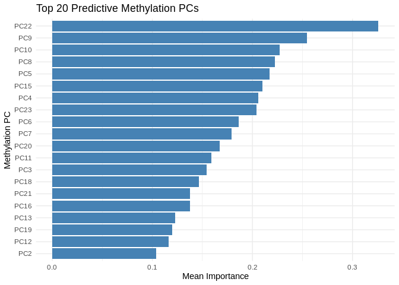
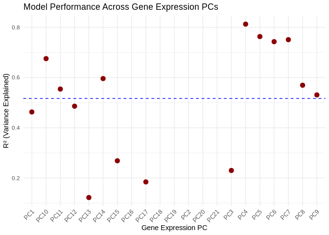
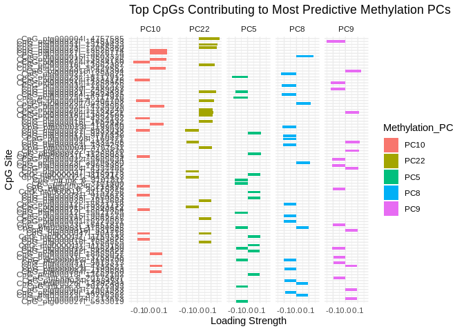
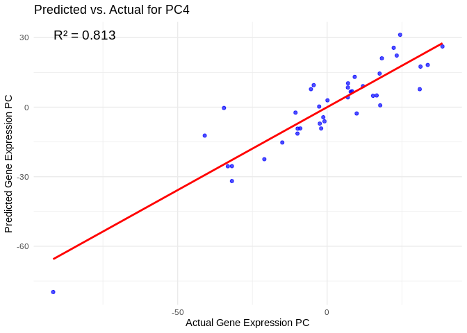
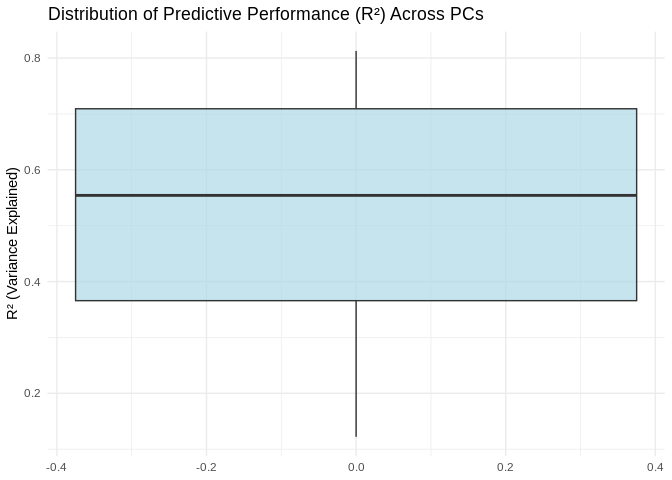
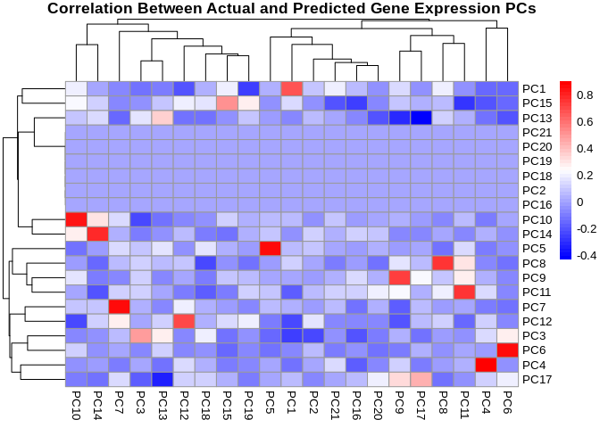

Apul time series mRNA-WGBS machine learning predictions
================
2025-02-19

This script conducts trial machine learning analyses to predict mRNA
state from methylation state.

# Set up

Load libraries

``` r
library(tidyverse)
library(ggplot2)
library(DESeq2)
library(igraph)
library(psych)
library(tidygraph)
library(ggraph)
library(WGCNA)
library(edgeR)
library(reshape2)
library(ggcorrplot)
library(corrplot)
library(rvest)
library(purrr)
library(pheatmap)
library(glmnet)
library(caret)
```

# Acropora pulchra

## Load and format data

Gene expression mRNA data.

``` r
# RNA variance stabilized counts data
genes <- read_csv("D-Apul/output/02.20-D-Apul-RNAseq-alignment-HiSat2/apul-gene_count_matrix.csv")
```

    ## Rows: 44371 Columns: 41
    ## ── Column specification ────────────────────────────────────────────────────────
    ## Delimiter: ","
    ## chr  (1): gene_id
    ## dbl (40): 1A1, 1A10, 1A12, 1A2, 1A8, 1A9, 1B1, 1B10, 1B2, 1B5, 1B9, 1C10, 1C...
    ## 
    ## ℹ Use `spec()` to retrieve the full column specification for this data.
    ## ℹ Specify the column types or set `show_col_types = FALSE` to quiet this message.

``` r
genes<-as.data.frame(genes)

rownames(genes)<-genes$gene_id

genes<-genes%>%select(!gene_id)
```

Load metadata.

``` r
metadata<-read_csv("M-multi-species/data/rna_metadata.csv")%>%select(AzentaSampleName, ColonyID, Timepoint)%>%
  filter(grepl("ACR", ColonyID))
```

    ## New names:
    ## Rows: 117 Columns: 19
    ## ── Column specification
    ## ──────────────────────────────────────────────────────── Delimiter: "," chr
    ## (13): SampleName, WellNumber, AzentaSampleName, ColonyID, Timepoint, Sam... dbl
    ## (5): SampleNumber, Plate, TotalAmount-ng, Volume-uL, Conc-ng.uL lgl (1):
    ## MethodUsedForSpectrophotometry
    ## ℹ Use `spec()` to retrieve the full column specification for this data. ℹ
    ## Specify the column types or set `show_col_types = FALSE` to quiet this message.
    ## • `` -> `...19`

``` r
colonies<-unique(metadata$ColonyID)
```

Load physiology data.

``` r
phys<-read_csv("https://github.com/urol-e5/timeseries/raw/refs/heads/master/time_series_analysis/Output/master_timeseries.csv")%>%filter(colony_id_corr %in% colonies)%>%
  select(colony_id_corr, species, timepoint, site, Host_AFDW.mg.cm2, Sym_AFDW.mg.cm2, Am, AQY, Rd, Ik, Ic, calc.umol.cm2.hr, cells.mgAFDW, prot_mg.mgafdw, Ratio_AFDW.mg.cm2, Total_Chl, Total_Chl_cell, cre.umol.mgafdw)
```

    ## Rows: 448 Columns: 46
    ## ── Column specification ────────────────────────────────────────────────────────
    ## Delimiter: ","
    ## chr (10): colony_id, colony_id_corr, species, timepoint, month, site, nutrie...
    ## dbl (36): cre.umol.mgprot, Host_AFDW.mg.cm2, Sym_AFDW.mg.cm2, Host_DW.mg.cm2...
    ## 
    ## ℹ Use `spec()` to retrieve the full column specification for this data.
    ## ℹ Specify the column types or set `show_col_types = FALSE` to quiet this message.

``` r
#add site information into metadata 
metadata$Site<-phys$site[match(metadata$ColonyID, phys$colony_id_corr)]
```

Load WGBS data.

``` r
#pull processed files from Gannet 

# Define the base URL
base_url <- "https://gannet.fish.washington.edu/seashell/bu-github/timeseries_molecular/D-Apul/output/15.5-Apul-bismark/"

# Read the HTML page
page <- read_html(base_url)

# Extract links to files
file_links <- page %>%
  html_nodes("a") %>%
  html_attr("href")

# Filter for files ending in "processed.txt"
processed_files <- file_links[grepl("processed\\.txt$", file_links)]

# Create full URLs
file_urls <- paste0(base_url, processed_files)

# Function to read a file from URL
read_processed_file <- function(url) {
  read_table(url, col_types = cols(.default = "c"))  # Read as character to avoid parsing issues
}

# Import all processed files into a list
processed_data <- lapply(file_urls, read_processed_file)

# Name the list elements by file name
names(processed_data) <- processed_files

# Print structure of imported data
str(processed_data)
```

    ## List of 40
    ##  $ ACR-139-TP1_10x_processed.txt: spc_tbl_ [6,244,910 × 2] (S3: spec_tbl_df/tbl_df/tbl/data.frame)
    ##   ..$ CpG_ntLink_0_25585: chr [1:6244910] "CpG_ntLink_0_25624" "CpG_ntLink_0_25777" "CpG_ntLink_0_25779" "CpG_ntLink_0_25788" ...
    ##   ..$ 0.000000          : chr [1:6244910] "0.000000" "0.000000" "0.000000" "0.000000" ...
    ##   ..- attr(*, "spec")=
    ##   .. .. cols(
    ##   .. ..   .default = col_character(),
    ##   .. ..   CpG_ntLink_0_25585 = col_character(),
    ##   .. ..   `0.000000` = col_character()
    ##   .. .. )
    ##  $ ACR-139-TP2_10x_processed.txt: spc_tbl_ [6,498,468 × 2] (S3: spec_tbl_df/tbl_df/tbl/data.frame)
    ##   ..$ CpG_ntLink_0_25692: chr [1:6498468] "CpG_ntLink_0_25699" "CpG_ntLink_0_80003" "CpG_ntLink_0_90500" "CpG_ntLink_0_90540" ...
    ##   ..$ 0.000000          : chr [1:6498468] "0.000000" "58.333333" "0.000000" "0.000000" ...
    ##   ..- attr(*, "spec")=
    ##   .. .. cols(
    ##   .. ..   .default = col_character(),
    ##   .. ..   CpG_ntLink_0_25692 = col_character(),
    ##   .. ..   `0.000000` = col_character()
    ##   .. .. )
    ##  $ ACR-139-TP3_10x_processed.txt: spc_tbl_ [5,784,262 × 2] (S3: spec_tbl_df/tbl_df/tbl/data.frame)
    ##   ..$ CpG_ntLink_0_90500: chr [1:5784262] "CpG_ntLink_0_90540" "CpG_ntLink_0_90562" "CpG_ntLink_0_94040" "CpG_ntLink_0_94055" ...
    ##   ..$ 0.000000          : chr [1:5784262] "0.000000" "0.000000" "0.000000" "0.000000" ...
    ##   ..- attr(*, "spec")=
    ##   .. .. cols(
    ##   .. ..   .default = col_character(),
    ##   .. ..   CpG_ntLink_0_90500 = col_character(),
    ##   .. ..   `0.000000` = col_character()
    ##   .. .. )
    ##  $ ACR-139-TP4_10x_processed.txt: spc_tbl_ [5,894,159 × 2] (S3: spec_tbl_df/tbl_df/tbl/data.frame)
    ##   ..$ CpG_ntLink_0_25624: chr [1:5894159] "CpG_ntLink_0_25788" "CpG_ntLink_0_25803" "CpG_ntLink_0_25811" "CpG_ntLink_0_25830" ...
    ##   ..$ 0.000000          : chr [1:5894159] "0.000000" "0.000000" "0.000000" "0.000000" ...
    ##   ..- attr(*, "spec")=
    ##   .. .. cols(
    ##   .. ..   .default = col_character(),
    ##   .. ..   CpG_ntLink_0_25624 = col_character(),
    ##   .. ..   `0.000000` = col_character()
    ##   .. .. )
    ##  $ ACR-145-TP1_10x_processed.txt: spc_tbl_ [6,438,148 × 2] (S3: spec_tbl_df/tbl_df/tbl/data.frame)
    ##   ..$ CpG_ntLink_0_25585: chr [1:6438148] "CpG_ntLink_0_25624" "CpG_ntLink_0_25692" "CpG_ntLink_0_25699" "CpG_ntLink_0_25761" ...
    ##   ..$ 10.000000         : chr [1:6438148] "6.666667" "0.000000" "0.000000" "4.347826" ...
    ##   ..- attr(*, "spec")=
    ##   .. .. cols(
    ##   .. ..   .default = col_character(),
    ##   .. ..   CpG_ntLink_0_25585 = col_character(),
    ##   .. ..   `10.000000` = col_character()
    ##   .. .. )
    ##  $ ACR-145-TP2_10x_processed.txt: spc_tbl_ [6,852,135 × 2] (S3: spec_tbl_df/tbl_df/tbl/data.frame)
    ##   ..$ CpG_ntLink_0_25585: chr [1:6852135] "CpG_ntLink_0_25624" "CpG_ntLink_0_25692" "CpG_ntLink_0_25699" "CpG_ntLink_0_25761" ...
    ##   ..$ 0.000000          : chr [1:6852135] "0.000000" "4.761905" "0.000000" "3.846154" ...
    ##   ..- attr(*, "spec")=
    ##   .. .. cols(
    ##   .. ..   .default = col_character(),
    ##   .. ..   CpG_ntLink_0_25585 = col_character(),
    ##   .. ..   `0.000000` = col_character()
    ##   .. .. )
    ##  $ ACR-145-TP3_10x_processed.txt: spc_tbl_ [5,290,638 × 2] (S3: spec_tbl_df/tbl_df/tbl/data.frame)
    ##   ..$ CpG_ntLink_0_25624: chr [1:5290638] "CpG_ntLink_0_25692" "CpG_ntLink_0_25699" "CpG_ntLink_0_25761" "CpG_ntLink_0_25777" ...
    ##   ..$ 0.000000          : chr [1:5290638] "0.000000" "0.000000" "0.000000" "0.000000" ...
    ##   ..- attr(*, "spec")=
    ##   .. .. cols(
    ##   .. ..   .default = col_character(),
    ##   .. ..   CpG_ntLink_0_25624 = col_character(),
    ##   .. ..   `0.000000` = col_character()
    ##   .. .. )
    ##  $ ACR-145-TP4_10x_processed.txt: spc_tbl_ [7,118,440 × 2] (S3: spec_tbl_df/tbl_df/tbl/data.frame)
    ##   ..$ CpG_ntLink_0_25585: chr [1:7118440] "CpG_ntLink_0_25624" "CpG_ntLink_0_25692" "CpG_ntLink_0_25699" "CpG_ntLink_0_25761" ...
    ##   ..$ 0.000000          : chr [1:7118440] "5.000000" "4.166667" "4.166667" "3.571429" ...
    ##   ..- attr(*, "spec")=
    ##   .. .. cols(
    ##   .. ..   .default = col_character(),
    ##   .. ..   CpG_ntLink_0_25585 = col_character(),
    ##   .. ..   `0.000000` = col_character()
    ##   .. .. )
    ##  $ ACR-150-TP1_10x_processed.txt: spc_tbl_ [6,921,066 × 2] (S3: spec_tbl_df/tbl_df/tbl/data.frame)
    ##   ..$ CpG_ntLink_0_94040: chr [1:6921066] "CpG_ntLink_0_94055" "CpG_ntLink_0_94077" "CpG_ntLink_0_94090" "CpG_ntLink_0_94095" ...
    ##   ..$ 0.000000          : chr [1:6921066] "0.000000" "0.000000" "0.000000" "0.000000" ...
    ##   ..- attr(*, "spec")=
    ##   .. .. cols(
    ##   .. ..   .default = col_character(),
    ##   .. ..   CpG_ntLink_0_94040 = col_character(),
    ##   .. ..   `0.000000` = col_character()
    ##   .. .. )
    ##  $ ACR-150-TP2_10x_processed.txt: spc_tbl_ [5,318,088 × 2] (S3: spec_tbl_df/tbl_df/tbl/data.frame)
    ##   ..$ CpG_ntLink_1_2597: chr [1:5318088] "CpG_ntLink_1_2613" "CpG_ntLink_1_2626" "CpG_ntLink_1_2633" "CpG_ntLink_1_2643" ...
    ##   ..$ 0.000000         : chr [1:5318088] "0.000000" "0.000000" "5.555556" "0.000000" ...
    ##   ..- attr(*, "spec")=
    ##   .. .. cols(
    ##   .. ..   .default = col_character(),
    ##   .. ..   CpG_ntLink_1_2597 = col_character(),
    ##   .. ..   `0.000000` = col_character()
    ##   .. .. )
    ##  $ ACR-150-TP3_10x_processed.txt: spc_tbl_ [6,300,303 × 2] (S3: spec_tbl_df/tbl_df/tbl/data.frame)
    ##   ..$ CpG_ntLink_1_2597: chr [1:6300303] "CpG_ntLink_1_2613" "CpG_ntLink_1_2626" "CpG_ntLink_1_2633" "CpG_ntLink_1_2643" ...
    ##   ..$ 0.000000         : chr [1:6300303] "0.000000" "0.000000" "0.000000" "0.000000" ...
    ##   ..- attr(*, "spec")=
    ##   .. .. cols(
    ##   .. ..   .default = col_character(),
    ##   .. ..   CpG_ntLink_1_2597 = col_character(),
    ##   .. ..   `0.000000` = col_character()
    ##   .. .. )
    ##  $ ACR-150-TP4_10x_processed.txt: spc_tbl_ [5,448,518 × 2] (S3: spec_tbl_df/tbl_df/tbl/data.frame)
    ##   ..$ CpG_ntLink_1_2597: chr [1:5448518] "CpG_ntLink_1_2613" "CpG_ntLink_1_2626" "CpG_ntLink_1_2633" "CpG_ntLink_1_2643" ...
    ##   ..$ 0.000000         : chr [1:5448518] "0.000000" "0.000000" "0.000000" "0.000000" ...
    ##   ..- attr(*, "spec")=
    ##   .. .. cols(
    ##   .. ..   .default = col_character(),
    ##   .. ..   CpG_ntLink_1_2597 = col_character(),
    ##   .. ..   `0.000000` = col_character()
    ##   .. .. )
    ##  $ ACR-173-TP1_10x_processed.txt: spc_tbl_ [6,119,173 × 2] (S3: spec_tbl_df/tbl_df/tbl/data.frame)
    ##   ..$ CpG_ntLink_0_85205: chr [1:6119173] "CpG_ntLink_0_94090" "CpG_ntLink_0_94095" "CpG_ntLink_0_94098" "CpG_ntLink_1_4888" ...
    ##   ..$ 71.428571         : chr [1:6119173] "0.000000" "0.000000" "0.000000" "0.000000" ...
    ##   ..- attr(*, "spec")=
    ##   .. .. cols(
    ##   .. ..   .default = col_character(),
    ##   .. ..   CpG_ntLink_0_85205 = col_character(),
    ##   .. ..   `71.428571` = col_character()
    ##   .. .. )
    ##  $ ACR-173-TP2_10x_processed.txt: spc_tbl_ [3,441,519 × 2] (S3: spec_tbl_df/tbl_df/tbl/data.frame)
    ##   ..$ CpG_ntLink_1_2597: chr [1:3441519] "CpG_ntLink_1_2613" "CpG_ntLink_1_2626" "CpG_ntLink_1_2633" "CpG_ntLink_1_2643" ...
    ##   ..$ 0.000000         : chr [1:3441519] "0.000000" "0.000000" "0.000000" "0.000000" ...
    ##   ..- attr(*, "spec")=
    ##   .. .. cols(
    ##   .. ..   .default = col_character(),
    ##   .. ..   CpG_ntLink_1_2597 = col_character(),
    ##   .. ..   `0.000000` = col_character()
    ##   .. .. )
    ##  $ ACR-173-TP3_10x_processed.txt: spc_tbl_ [5,017,891 × 2] (S3: spec_tbl_df/tbl_df/tbl/data.frame)
    ##   ..$ CpG_ntLink_1_22580: chr [1:5017891] "CpG_ntLink_1_22628" "CpG_ntLink_1_22653" "CpG_ntLink_1_22678" "CpG_ntLink_1_22703" ...
    ##   ..$ 0.000000          : chr [1:5017891] "0.000000" "0.000000" "0.000000" "0.000000" ...
    ##   ..- attr(*, "spec")=
    ##   .. .. cols(
    ##   .. ..   .default = col_character(),
    ##   .. ..   CpG_ntLink_1_22580 = col_character(),
    ##   .. ..   `0.000000` = col_character()
    ##   .. .. )
    ##  $ ACR-173-TP4_10x_processed.txt: spc_tbl_ [4,066,135 × 2] (S3: spec_tbl_df/tbl_df/tbl/data.frame)
    ##   ..$ CpG_ntLink_0_94040: chr [1:4066135] "CpG_ntLink_0_94055" "CpG_ntLink_0_94077" "CpG_ntLink_0_94090" "CpG_ntLink_0_94095" ...
    ##   ..$ 0.000000          : chr [1:4066135] "0.000000" "0.000000" "0.000000" "0.000000" ...
    ##   ..- attr(*, "spec")=
    ##   .. .. cols(
    ##   .. ..   .default = col_character(),
    ##   .. ..   CpG_ntLink_0_94040 = col_character(),
    ##   .. ..   `0.000000` = col_character()
    ##   .. .. )
    ##  $ ACR-186-TP1_10x_processed.txt: spc_tbl_ [4,624,114 × 2] (S3: spec_tbl_df/tbl_df/tbl/data.frame)
    ##   ..$ CpG_ntLink_0_60732: chr [1:4624114] "CpG_ntLink_0_60763" "CpG_ntLink_0_60822" "CpG_ntLink_0_60831" "CpG_ntLink_0_60880" ...
    ##   ..$ 0.000000          : chr [1:4624114] "0.000000" "0.000000" "0.000000" "0.000000" ...
    ##   ..- attr(*, "spec")=
    ##   .. .. cols(
    ##   .. ..   .default = col_character(),
    ##   .. ..   CpG_ntLink_0_60732 = col_character(),
    ##   .. ..   `0.000000` = col_character()
    ##   .. .. )
    ##  $ ACR-186-TP2_10x_processed.txt: spc_tbl_ [6,676,990 × 2] (S3: spec_tbl_df/tbl_df/tbl/data.frame)
    ##   ..$ CpG_ntLink_0_60601: chr [1:6676990] "CpG_ntLink_0_60612" "CpG_ntLink_0_60632" "CpG_ntLink_0_60642" "CpG_ntLink_0_60646" ...
    ##   ..$ 0.000000          : chr [1:6676990] "5.555556" "0.000000" "0.000000" "0.000000" ...
    ##   ..- attr(*, "spec")=
    ##   .. .. cols(
    ##   .. ..   .default = col_character(),
    ##   .. ..   CpG_ntLink_0_60601 = col_character(),
    ##   .. ..   `0.000000` = col_character()
    ##   .. .. )
    ##  $ ACR-186-TP3_10x_processed.txt: spc_tbl_ [4,731,740 × 2] (S3: spec_tbl_df/tbl_df/tbl/data.frame)
    ##   ..$ CpG_ntLink_0_60601: chr [1:4731740] "CpG_ntLink_0_60612" "CpG_ntLink_0_60632" "CpG_ntLink_0_60642" "CpG_ntLink_0_60646" ...
    ##   ..$ 0.000000          : chr [1:4731740] "0.000000" "8.333333" "0.000000" "0.000000" ...
    ##   ..- attr(*, "spec")=
    ##   .. .. cols(
    ##   .. ..   .default = col_character(),
    ##   .. ..   CpG_ntLink_0_60601 = col_character(),
    ##   .. ..   `0.000000` = col_character()
    ##   .. .. )
    ##  $ ACR-186-TP4_10x_processed.txt: spc_tbl_ [5,866,391 × 2] (S3: spec_tbl_df/tbl_df/tbl/data.frame)
    ##   ..$ CpG_ntLink_0_60612: chr [1:5866391] "CpG_ntLink_0_60632" "CpG_ntLink_0_60642" "CpG_ntLink_0_60646" "CpG_ntLink_0_60732" ...
    ##   ..$ 0.000000          : chr [1:5866391] "0.000000" "0.000000" "0.000000" "0.000000" ...
    ##   ..- attr(*, "spec")=
    ##   .. .. cols(
    ##   .. ..   .default = col_character(),
    ##   .. ..   CpG_ntLink_0_60612 = col_character(),
    ##   .. ..   `0.000000` = col_character()
    ##   .. .. )
    ##  $ ACR-225-TP1_10x_processed.txt: spc_tbl_ [71,708 × 2] (S3: spec_tbl_df/tbl_df/tbl/data.frame)
    ##   ..$ CpG_ntLink_3_73753: chr [1:71708] "CpG_ntLink_3_73782" "CpG_ntLink_3_73798" "CpG_ntLink_3_73813" "CpG_ntLink_3_73875" ...
    ##   ..$ 0.000000          : chr [1:71708] "3.333333" "0.000000" "5.405405" "14.285714" ...
    ##   ..- attr(*, "spec")=
    ##   .. .. cols(
    ##   .. ..   .default = col_character(),
    ##   .. ..   CpG_ntLink_3_73753 = col_character(),
    ##   .. ..   `0.000000` = col_character()
    ##   .. .. )
    ##  $ ACR-225-TP2_10x_processed.txt: spc_tbl_ [4,093,305 × 2] (S3: spec_tbl_df/tbl_df/tbl/data.frame)
    ##   ..$ CpG_ntLink_0_25624: chr [1:4093305] "CpG_ntLink_0_25692" "CpG_ntLink_0_25830" "CpG_ntLink_0_90540" "CpG_ntLink_0_90562" ...
    ##   ..$ 0.000000          : chr [1:4093305] "0.000000" "0.000000" "0.000000" "0.000000" ...
    ##   ..- attr(*, "spec")=
    ##   .. .. cols(
    ##   .. ..   .default = col_character(),
    ##   .. ..   CpG_ntLink_0_25624 = col_character(),
    ##   .. ..   `0.000000` = col_character()
    ##   .. .. )
    ##  $ ACR-225-TP3_10x_processed.txt: spc_tbl_ [4,586,401 × 2] (S3: spec_tbl_df/tbl_df/tbl/data.frame)
    ##   ..$ CpG_ntLink_0_90540: chr [1:4586401] "CpG_ntLink_0_90562" "CpG_ntLink_1_2597" "CpG_ntLink_1_2613" "CpG_ntLink_1_2626" ...
    ##   ..$ 18.181818         : chr [1:4586401] "0.000000" "0.000000" "0.000000" "0.000000" ...
    ##   ..- attr(*, "spec")=
    ##   .. .. cols(
    ##   .. ..   .default = col_character(),
    ##   .. ..   CpG_ntLink_0_90540 = col_character(),
    ##   .. ..   `18.181818` = col_character()
    ##   .. .. )
    ##  $ ACR-225-TP4_10x_processed.txt: spc_tbl_ [5,081,490 × 2] (S3: spec_tbl_df/tbl_df/tbl/data.frame)
    ##   ..$ CpG_ntLink_0_90500: chr [1:5081490] "CpG_ntLink_0_90540" "CpG_ntLink_0_90562" "CpG_ntLink_0_94090" "CpG_ntLink_0_94095" ...
    ##   ..$ 0.000000          : chr [1:5081490] "0.000000" "0.000000" "0.000000" "0.000000" ...
    ##   ..- attr(*, "spec")=
    ##   .. .. cols(
    ##   .. ..   .default = col_character(),
    ##   .. ..   CpG_ntLink_0_90500 = col_character(),
    ##   .. ..   `0.000000` = col_character()
    ##   .. .. )
    ##  $ ACR-229-TP1_10x_processed.txt: spc_tbl_ [7,723,251 × 2] (S3: spec_tbl_df/tbl_df/tbl/data.frame)
    ##   ..$ CpG_ntLink_0_60601: chr [1:7723251] "CpG_ntLink_0_60612" "CpG_ntLink_0_60632" "CpG_ntLink_0_60642" "CpG_ntLink_0_60646" ...
    ##   ..$ 0.000000          : chr [1:7723251] "0.000000" "0.000000" "0.000000" "9.090909" ...
    ##   ..- attr(*, "spec")=
    ##   .. .. cols(
    ##   .. ..   .default = col_character(),
    ##   .. ..   CpG_ntLink_0_60601 = col_character(),
    ##   .. ..   `0.000000` = col_character()
    ##   .. .. )
    ##  $ ACR-229-TP2_10x_processed.txt: spc_tbl_ [7,260,637 × 2] (S3: spec_tbl_df/tbl_df/tbl/data.frame)
    ##   ..$ CpG_ntLink_0_60732: chr [1:7260637] "CpG_ntLink_0_60763" "CpG_ntLink_0_60822" "CpG_ntLink_0_60831" "CpG_ntLink_0_60880" ...
    ##   ..$ 0.000000          : chr [1:7260637] "0.000000" "4.166667" "0.000000" "5.555556" ...
    ##   ..- attr(*, "spec")=
    ##   .. .. cols(
    ##   .. ..   .default = col_character(),
    ##   .. ..   CpG_ntLink_0_60732 = col_character(),
    ##   .. ..   `0.000000` = col_character()
    ##   .. .. )
    ##  $ ACR-229-TP3_10x_processed.txt: spc_tbl_ [6,339,294 × 2] (S3: spec_tbl_df/tbl_df/tbl/data.frame)
    ##   ..$ CpG_ntLink_0_60732: chr [1:6339294] "CpG_ntLink_0_60763" "CpG_ntLink_0_60822" "CpG_ntLink_0_60831" "CpG_ntLink_0_85205" ...
    ##   ..$ 0.000000          : chr [1:6339294] "0.000000" "0.000000" "0.000000" "0.000000" ...
    ##   ..- attr(*, "spec")=
    ##   .. .. cols(
    ##   .. ..   .default = col_character(),
    ##   .. ..   CpG_ntLink_0_60732 = col_character(),
    ##   .. ..   `0.000000` = col_character()
    ##   .. .. )
    ##  $ ACR-229-TP4_10x_processed.txt: spc_tbl_ [5,788,701 × 2] (S3: spec_tbl_df/tbl_df/tbl/data.frame)
    ##   ..$ CpG_ntLink_0_60822: chr [1:5788701] "CpG_ntLink_0_85205" "CpG_ntLink_0_90500" "CpG_ntLink_0_90540" "CpG_ntLink_0_90562" ...
    ##   ..$ 0.000000          : chr [1:5788701] "14.285714" "0.000000" "0.000000" "0.000000" ...
    ##   ..- attr(*, "spec")=
    ##   .. .. cols(
    ##   .. ..   .default = col_character(),
    ##   .. ..   CpG_ntLink_0_60822 = col_character(),
    ##   .. ..   `0.000000` = col_character()
    ##   .. .. )
    ##  $ ACR-237-TP1_10x_processed.txt: spc_tbl_ [6,124,966 × 2] (S3: spec_tbl_df/tbl_df/tbl/data.frame)
    ##   ..$ CpG_ntLink_1_2597: chr [1:6124966] "CpG_ntLink_1_2613" "CpG_ntLink_1_2626" "CpG_ntLink_1_2633" "CpG_ntLink_1_2643" ...
    ##   ..$ 0.000000         : chr [1:6124966] "0.000000" "0.000000" "0.000000" "0.000000" ...
    ##   ..- attr(*, "spec")=
    ##   .. .. cols(
    ##   .. ..   .default = col_character(),
    ##   .. ..   CpG_ntLink_1_2597 = col_character(),
    ##   .. ..   `0.000000` = col_character()
    ##   .. .. )
    ##  $ ACR-237-TP2_10x_processed.txt: spc_tbl_ [5,949,289 × 2] (S3: spec_tbl_df/tbl_df/tbl/data.frame)
    ##   ..$ CpG_ntLink_1_2597: chr [1:5949289] "CpG_ntLink_1_2613" "CpG_ntLink_1_2626" "CpG_ntLink_1_2633" "CpG_ntLink_1_2643" ...
    ##   ..$ 0.000000         : chr [1:5949289] "0.000000" "0.000000" "0.000000" "0.000000" ...
    ##   ..- attr(*, "spec")=
    ##   .. .. cols(
    ##   .. ..   .default = col_character(),
    ##   .. ..   CpG_ntLink_1_2597 = col_character(),
    ##   .. ..   `0.000000` = col_character()
    ##   .. .. )
    ##  $ ACR-237-TP3_10x_processed.txt: spc_tbl_ [6,983,165 × 2] (S3: spec_tbl_df/tbl_df/tbl/data.frame)
    ##   ..$ CpG_ntLink_1_2597: chr [1:6983165] "CpG_ntLink_1_2613" "CpG_ntLink_1_2626" "CpG_ntLink_1_2633" "CpG_ntLink_1_2643" ...
    ##   ..$ 0.000000         : chr [1:6983165] "0.000000" "0.000000" "0.000000" "0.000000" ...
    ##   ..- attr(*, "spec")=
    ##   .. .. cols(
    ##   .. ..   .default = col_character(),
    ##   .. ..   CpG_ntLink_1_2597 = col_character(),
    ##   .. ..   `0.000000` = col_character()
    ##   .. .. )
    ##  $ ACR-237-TP4_10x_processed.txt: spc_tbl_ [5,735,668 × 2] (S3: spec_tbl_df/tbl_df/tbl/data.frame)
    ##   ..$ CpG_ntLink_1_2597: chr [1:5735668] "CpG_ntLink_1_2613" "CpG_ntLink_1_2626" "CpG_ntLink_1_2633" "CpG_ntLink_1_2643" ...
    ##   ..$ 0.000000         : chr [1:5735668] "0.000000" "0.000000" "0.000000" "0.000000" ...
    ##   ..- attr(*, "spec")=
    ##   .. .. cols(
    ##   .. ..   .default = col_character(),
    ##   .. ..   CpG_ntLink_1_2597 = col_character(),
    ##   .. ..   `0.000000` = col_character()
    ##   .. .. )
    ##  $ ACR-244-TP1_10x_processed.txt: spc_tbl_ [6,741,848 × 2] (S3: spec_tbl_df/tbl_df/tbl/data.frame)
    ##   ..$ CpG_ntLink_1_4093: chr [1:6741848] "CpG_ntLink_1_4151" "CpG_ntLink_1_4171" "CpG_ntLink_1_7038" "CpG_ntLink_1_7044" ...
    ##   ..$ 0.000000         : chr [1:6741848] "0.000000" "0.000000" "0.000000" "0.000000" ...
    ##   ..- attr(*, "spec")=
    ##   .. .. cols(
    ##   .. ..   .default = col_character(),
    ##   .. ..   CpG_ntLink_1_4093 = col_character(),
    ##   .. ..   `0.000000` = col_character()
    ##   .. .. )
    ##  $ ACR-244-TP2_10x_processed.txt: spc_tbl_ [6,428,640 × 2] (S3: spec_tbl_df/tbl_df/tbl/data.frame)
    ##   ..$ CpG_ntLink_1_2626: chr [1:6428640] "CpG_ntLink_1_2725" "CpG_ntLink_1_4093" "CpG_ntLink_1_4151" "CpG_ntLink_1_4707" ...
    ##   ..$ 0.000000         : chr [1:6428640] "0.000000" "0.000000" "0.000000" "16.666667" ...
    ##   ..- attr(*, "spec")=
    ##   .. .. cols(
    ##   .. ..   .default = col_character(),
    ##   .. ..   CpG_ntLink_1_2626 = col_character(),
    ##   .. ..   `0.000000` = col_character()
    ##   .. .. )
    ##  $ ACR-244-TP3_10x_processed.txt: spc_tbl_ [3,619,640 × 2] (S3: spec_tbl_df/tbl_df/tbl/data.frame)
    ##   ..$ CpG_ntLink_1_4093: chr [1:3619640] "CpG_ntLink_1_4151" "CpG_ntLink_1_4671" "CpG_ntLink_1_4693" "CpG_ntLink_1_4695" ...
    ##   ..$ 0.000000         : chr [1:3619640] "0.000000" "0.000000" "10.000000" "10.000000" ...
    ##   ..- attr(*, "spec")=
    ##   .. .. cols(
    ##   .. ..   .default = col_character(),
    ##   .. ..   CpG_ntLink_1_4093 = col_character(),
    ##   .. ..   `0.000000` = col_character()
    ##   .. .. )
    ##  $ ACR-244-TP4_10x_processed.txt: spc_tbl_ [7,225,326 × 2] (S3: spec_tbl_df/tbl_df/tbl/data.frame)
    ##   ..$ CpG_ntLink_1_4093: chr [1:7225326] "CpG_ntLink_1_4151" "CpG_ntLink_1_4171" "CpG_ntLink_1_4831" "CpG_ntLink_1_4842" ...
    ##   ..$ 0.000000         : chr [1:7225326] "0.000000" "0.000000" "7.692308" "0.000000" ...
    ##   ..- attr(*, "spec")=
    ##   .. .. cols(
    ##   .. ..   .default = col_character(),
    ##   .. ..   CpG_ntLink_1_4093 = col_character(),
    ##   .. ..   `0.000000` = col_character()
    ##   .. .. )
    ##  $ ACR-265-TP1_10x_processed.txt: spc_tbl_ [6,422,762 × 2] (S3: spec_tbl_df/tbl_df/tbl/data.frame)
    ##   ..$ CpG_ntLink_0_25585: chr [1:6422762] "CpG_ntLink_0_25624" "CpG_ntLink_0_25692" "CpG_ntLink_0_25699" "CpG_ntLink_0_25761" ...
    ##   ..$ 0.000000          : chr [1:6422762] "0.000000" "0.000000" "0.000000" "0.000000" ...
    ##   ..- attr(*, "spec")=
    ##   .. .. cols(
    ##   .. ..   .default = col_character(),
    ##   .. ..   CpG_ntLink_0_25585 = col_character(),
    ##   .. ..   `0.000000` = col_character()
    ##   .. .. )
    ##  $ ACR-265-TP2_10x_processed.txt: spc_tbl_ [5,909,226 × 2] (S3: spec_tbl_df/tbl_df/tbl/data.frame)
    ##   ..$ CpG_ntLink_0_25624: chr [1:5909226] "CpG_ntLink_0_25692" "CpG_ntLink_0_25699" "CpG_ntLink_0_25761" "CpG_ntLink_0_25777" ...
    ##   ..$ 0.000000          : chr [1:5909226] "0.000000" "0.000000" "0.000000" "0.000000" ...
    ##   ..- attr(*, "spec")=
    ##   .. .. cols(
    ##   .. ..   .default = col_character(),
    ##   .. ..   CpG_ntLink_0_25624 = col_character(),
    ##   .. ..   `0.000000` = col_character()
    ##   .. .. )
    ##  $ ACR-265-TP3_10x_processed.txt: spc_tbl_ [5,666,084 × 2] (S3: spec_tbl_df/tbl_df/tbl/data.frame)
    ##   ..$ CpG_ntLink_0_25624: chr [1:5666084] "CpG_ntLink_0_25692" "CpG_ntLink_0_25699" "CpG_ntLink_0_25761" "CpG_ntLink_0_25777" ...
    ##   ..$ 0.000000          : chr [1:5666084] "0.000000" "0.000000" "0.000000" "0.000000" ...
    ##   ..- attr(*, "spec")=
    ##   .. .. cols(
    ##   .. ..   .default = col_character(),
    ##   .. ..   CpG_ntLink_0_25624 = col_character(),
    ##   .. ..   `0.000000` = col_character()
    ##   .. .. )
    ##  $ ACR-265-TP4_10x_processed.txt: spc_tbl_ [4,088,229 × 2] (S3: spec_tbl_df/tbl_df/tbl/data.frame)
    ##   ..$ CpG_ntLink_0_25624: chr [1:4088229] "CpG_ntLink_0_25692" "CpG_ntLink_0_25699" "CpG_ntLink_0_25761" "CpG_ntLink_0_25777" ...
    ##   ..$ 0.000000          : chr [1:4088229] "0.000000" "0.000000" "0.000000" "0.000000" ...
    ##   ..- attr(*, "spec")=
    ##   .. .. cols(
    ##   .. ..   .default = col_character(),
    ##   .. ..   CpG_ntLink_0_25624 = col_character(),
    ##   .. ..   `0.000000` = col_character()
    ##   .. .. )

``` r
# add a header row that has "CpG" for the first column and "sample" for the second column, which will be populated by the file name 

processed_data <- Map(function(df, filename) {
  colnames(df) <- c("CpG", filename)  # Rename columns
  return(df)
}, processed_data, names(processed_data))  # Use stored file names

#merge files together by "CpG"
merged_data <- purrr::reduce(processed_data, full_join, by = "CpG")

# Print structure of final merged data
str(merged_data)
```

    ## spc_tbl_ [12,093,025 × 41] (S3: spec_tbl_df/tbl_df/tbl/data.frame)
    ##  $ CpG                          : chr [1:12093025] "CpG_ntLink_0_25624" "CpG_ntLink_0_25777" "CpG_ntLink_0_25779" "CpG_ntLink_0_25788" ...
    ##  $ ACR-139-TP1_10x_processed.txt: chr [1:12093025] "0.000000" "0.000000" "0.000000" "0.000000" ...
    ##  $ ACR-139-TP2_10x_processed.txt: chr [1:12093025] NA NA NA NA ...
    ##  $ ACR-139-TP3_10x_processed.txt: chr [1:12093025] NA NA NA NA ...
    ##  $ ACR-139-TP4_10x_processed.txt: chr [1:12093025] NA NA NA "0.000000" ...
    ##  $ ACR-145-TP1_10x_processed.txt: chr [1:12093025] "6.666667" "4.761905" "5.000000" "5.555556" ...
    ##  $ ACR-145-TP2_10x_processed.txt: chr [1:12093025] "0.000000" "4.545455" "4.545455" "5.555556" ...
    ##  $ ACR-145-TP3_10x_processed.txt: chr [1:12093025] NA "0.000000" "0.000000" NA ...
    ##  $ ACR-145-TP4_10x_processed.txt: chr [1:12093025] "5.000000" "4.000000" "4.166667" "4.761905" ...
    ##  $ ACR-150-TP1_10x_processed.txt: chr [1:12093025] NA NA NA NA ...
    ##  $ ACR-150-TP2_10x_processed.txt: chr [1:12093025] NA NA NA NA ...
    ##  $ ACR-150-TP3_10x_processed.txt: chr [1:12093025] NA NA NA NA ...
    ##  $ ACR-150-TP4_10x_processed.txt: chr [1:12093025] NA NA NA NA ...
    ##  $ ACR-173-TP1_10x_processed.txt: chr [1:12093025] NA NA NA NA ...
    ##  $ ACR-173-TP2_10x_processed.txt: chr [1:12093025] NA NA NA NA ...
    ##  $ ACR-173-TP3_10x_processed.txt: chr [1:12093025] NA NA NA NA ...
    ##  $ ACR-173-TP4_10x_processed.txt: chr [1:12093025] NA NA NA NA ...
    ##  $ ACR-186-TP1_10x_processed.txt: chr [1:12093025] NA NA NA NA ...
    ##  $ ACR-186-TP2_10x_processed.txt: chr [1:12093025] NA NA NA NA ...
    ##  $ ACR-186-TP3_10x_processed.txt: chr [1:12093025] NA NA NA NA ...
    ##  $ ACR-186-TP4_10x_processed.txt: chr [1:12093025] NA NA NA NA ...
    ##  $ ACR-225-TP1_10x_processed.txt: chr [1:12093025] NA NA NA NA ...
    ##  $ ACR-225-TP2_10x_processed.txt: chr [1:12093025] NA NA NA NA ...
    ##  $ ACR-225-TP3_10x_processed.txt: chr [1:12093025] NA NA NA NA ...
    ##  $ ACR-225-TP4_10x_processed.txt: chr [1:12093025] NA NA NA NA ...
    ##  $ ACR-229-TP1_10x_processed.txt: chr [1:12093025] NA NA NA NA ...
    ##  $ ACR-229-TP2_10x_processed.txt: chr [1:12093025] NA NA NA NA ...
    ##  $ ACR-229-TP3_10x_processed.txt: chr [1:12093025] NA NA NA NA ...
    ##  $ ACR-229-TP4_10x_processed.txt: chr [1:12093025] NA NA NA NA ...
    ##  $ ACR-237-TP1_10x_processed.txt: chr [1:12093025] NA NA NA NA ...
    ##  $ ACR-237-TP2_10x_processed.txt: chr [1:12093025] NA NA NA NA ...
    ##  $ ACR-237-TP3_10x_processed.txt: chr [1:12093025] NA NA NA NA ...
    ##  $ ACR-237-TP4_10x_processed.txt: chr [1:12093025] NA NA NA NA ...
    ##  $ ACR-244-TP1_10x_processed.txt: chr [1:12093025] NA NA NA NA ...
    ##  $ ACR-244-TP2_10x_processed.txt: chr [1:12093025] NA NA NA NA ...
    ##  $ ACR-244-TP3_10x_processed.txt: chr [1:12093025] NA NA NA NA ...
    ##  $ ACR-244-TP4_10x_processed.txt: chr [1:12093025] NA NA NA NA ...
    ##  $ ACR-265-TP1_10x_processed.txt: chr [1:12093025] "0.000000" "0.000000" "0.000000" "0.000000" ...
    ##  $ ACR-265-TP2_10x_processed.txt: chr [1:12093025] NA "0.000000" "0.000000" "0.000000" ...
    ##  $ ACR-265-TP3_10x_processed.txt: chr [1:12093025] NA "0.000000" "0.000000" "0.000000" ...
    ##  $ ACR-265-TP4_10x_processed.txt: chr [1:12093025] NA "0.000000" "0.000000" "0.000000" ...
    ##  - attr(*, "spec")=
    ##   .. cols(
    ##   ..   .default = col_character(),
    ##   ..   CpG_ntLink_0_25585 = col_character(),
    ##   ..   `0.000000` = col_character()
    ##   .. )

Replace any NA with 0.

``` r
# Convert all columns (except "CpG") to numeric and replace NAs with 0
merged_data <- merged_data %>%
  mutate(across(-CpG, as.numeric)) %>%  # Convert all except CpG to numeric
  mutate(across(-CpG, ~ replace_na(.x, 0)))  # Replace NA with 0 in numeric columns
```

## Filter data sets

Only keep CpGs that have a non-zero value in all samples.

``` r
filtered_data <- merged_data %>%
  filter(if_all(-CpG, ~ .x > 0))
```

We had 12,093,025 CpGs before filtering and have only 507 after
filtering. This makes sense because most CpGs were not methylated in all
samples.

Only keep the sample information in the column name.

``` r
colnames(filtered_data) <- gsub("^(.*?)_.*$", "\\1", colnames(filtered_data))
```

Next I will format the genes, WGBS, and physiology data sets to have
consistent sample ID naming.

Only keep genes that are non-zero in all samples.

``` r
filtered_genes <- genes %>%
  filter(if_all(everything(), ~ .x > 0))
```

There were 44371 genes identified with 10717 genes kept after filtering
to only keep genes detected \>0 in all samples.

## Rename samples to be consistent between data sets

The goal is to have each data frame with the feature as row names and
sample ID (ACR-ID-TP) as column names.

Format metadata.

``` r
metadata$code<-paste0(metadata$ColonyID, "-", metadata$Timepoint)
```

Format gene data set.

``` r
# Create a named vector for mapping: SampleName -> colonyID
rename_map <- setNames(metadata$code, metadata$AzentaSampleName)

# Rename matching columns in the gene dataset
colnames(filtered_genes) <- ifelse(colnames(filtered_genes) %in% names(rename_map), 
                                  rename_map[colnames(filtered_genes)], 
                                  colnames(filtered_genes))
```

View differences in column names between genes and wgbs data sets.

``` r
setdiff(colnames(filtered_data), colnames(filtered_genes))
```

    ## [1] "CpG"

All colony names match!

Set CpG id as rownames in the wgbs dataset.

``` r
filtered_data<-as.data.frame(filtered_data)

rownames(filtered_data)<-filtered_data$CpG

filtered_data<-filtered_data%>%
  select(!CpG)
```

The genes and wgbs data sets are now formatted the same way.

Set metadata with samples as column names.

``` r
metadata<-as.data.frame(metadata)
rownames(metadata)<-metadata$code
metadata<-metadata%>%
  select(ColonyID, Timepoint, Site)
```

## Transform data

Set the order of genes, wgbs, and metadata to all be the same.

``` r
# Ensure rownames of metadata are used as the desired column order
desired_order <- rownames(metadata)

# Find columns in genes_data that match the desired order
matching_columns <- intersect(desired_order, colnames(filtered_genes))

# Reorder columns in genes_data to match metadata rownames
filtered_genes <- filtered_genes %>%
  select(all_of(matching_columns))

# Print the updated column order
print(colnames(filtered_genes))
```

    ##  [1] "ACR-225-TP1" "ACR-225-TP2" "ACR-225-TP3" "ACR-225-TP4" "ACR-229-TP1"
    ##  [6] "ACR-229-TP2" "ACR-229-TP3" "ACR-229-TP4" "ACR-237-TP1" "ACR-237-TP2"
    ## [11] "ACR-237-TP3" "ACR-237-TP4" "ACR-244-TP1" "ACR-244-TP2" "ACR-244-TP3"
    ## [16] "ACR-244-TP4" "ACR-265-TP1" "ACR-265-TP2" "ACR-265-TP3" "ACR-265-TP4"
    ## [21] "ACR-139-TP1" "ACR-139-TP2" "ACR-139-TP3" "ACR-139-TP4" "ACR-145-TP1"
    ## [26] "ACR-145-TP2" "ACR-145-TP3" "ACR-145-TP4" "ACR-150-TP1" "ACR-150-TP2"
    ## [31] "ACR-150-TP3" "ACR-150-TP4" "ACR-173-TP1" "ACR-173-TP2" "ACR-173-TP3"
    ## [36] "ACR-173-TP4" "ACR-186-TP1" "ACR-186-TP2" "ACR-186-TP3" "ACR-186-TP4"

``` r
print(rownames(metadata))
```

    ##  [1] "ACR-225-TP1" "ACR-225-TP2" "ACR-225-TP3" "ACR-225-TP4" "ACR-229-TP1"
    ##  [6] "ACR-229-TP2" "ACR-229-TP3" "ACR-229-TP4" "ACR-237-TP1" "ACR-237-TP2"
    ## [11] "ACR-237-TP3" "ACR-237-TP4" "ACR-244-TP1" "ACR-244-TP2" "ACR-244-TP3"
    ## [16] "ACR-244-TP4" "ACR-265-TP1" "ACR-265-TP2" "ACR-265-TP3" "ACR-265-TP4"
    ## [21] "ACR-139-TP1" "ACR-139-TP2" "ACR-139-TP3" "ACR-139-TP4" "ACR-145-TP1"
    ## [26] "ACR-145-TP2" "ACR-145-TP3" "ACR-145-TP4" "ACR-150-TP1" "ACR-150-TP2"
    ## [31] "ACR-150-TP3" "ACR-150-TP4" "ACR-173-TP1" "ACR-173-TP2" "ACR-173-TP3"
    ## [36] "ACR-173-TP4" "ACR-186-TP1" "ACR-186-TP2" "ACR-186-TP3" "ACR-186-TP4"

Repeat for wgbs data.

``` r
# Find columns in genes_data that match the desired order
matching_columns <- intersect(desired_order, colnames(filtered_data))

# Reorder columns in genes_data to match metadata rownames
filtered_data <- filtered_data %>%
  select(all_of(matching_columns))

# Print the updated column order
print(colnames(filtered_data))
```

    ##  [1] "ACR-225-TP1" "ACR-225-TP2" "ACR-225-TP3" "ACR-225-TP4" "ACR-229-TP1"
    ##  [6] "ACR-229-TP2" "ACR-229-TP3" "ACR-229-TP4" "ACR-237-TP1" "ACR-237-TP2"
    ## [11] "ACR-237-TP3" "ACR-237-TP4" "ACR-244-TP1" "ACR-244-TP2" "ACR-244-TP3"
    ## [16] "ACR-244-TP4" "ACR-265-TP1" "ACR-265-TP2" "ACR-265-TP3" "ACR-265-TP4"
    ## [21] "ACR-139-TP1" "ACR-139-TP2" "ACR-139-TP3" "ACR-139-TP4" "ACR-145-TP1"
    ## [26] "ACR-145-TP2" "ACR-145-TP3" "ACR-145-TP4" "ACR-150-TP1" "ACR-150-TP2"
    ## [31] "ACR-150-TP3" "ACR-150-TP4" "ACR-173-TP1" "ACR-173-TP2" "ACR-173-TP3"
    ## [36] "ACR-173-TP4" "ACR-186-TP1" "ACR-186-TP2" "ACR-186-TP3" "ACR-186-TP4"

``` r
print(rownames(metadata))
```

    ##  [1] "ACR-225-TP1" "ACR-225-TP2" "ACR-225-TP3" "ACR-225-TP4" "ACR-229-TP1"
    ##  [6] "ACR-229-TP2" "ACR-229-TP3" "ACR-229-TP4" "ACR-237-TP1" "ACR-237-TP2"
    ## [11] "ACR-237-TP3" "ACR-237-TP4" "ACR-244-TP1" "ACR-244-TP2" "ACR-244-TP3"
    ## [16] "ACR-244-TP4" "ACR-265-TP1" "ACR-265-TP2" "ACR-265-TP3" "ACR-265-TP4"
    ## [21] "ACR-139-TP1" "ACR-139-TP2" "ACR-139-TP3" "ACR-139-TP4" "ACR-145-TP1"
    ## [26] "ACR-145-TP2" "ACR-145-TP3" "ACR-145-TP4" "ACR-150-TP1" "ACR-150-TP2"
    ## [31] "ACR-150-TP3" "ACR-150-TP4" "ACR-173-TP1" "ACR-173-TP2" "ACR-173-TP3"
    ## [36] "ACR-173-TP4" "ACR-186-TP1" "ACR-186-TP2" "ACR-186-TP3" "ACR-186-TP4"

Use a variance stabilized transformation for the genes and wgbs data
sets.

``` r
dds_genes <- DESeqDataSetFromMatrix(countData = filtered_genes, 
                              colData = metadata, 
                              design = ~ Timepoint * Site)
```

    ## converting counts to integer mode

    ## Warning in DESeqDataSet(se, design = design, ignoreRank): some variables in
    ## design formula are characters, converting to factors

``` r
# Variance Stabilizing Transformation
vsd_genes <- assay(vst(dds_genes, blind = TRUE))
```

I had to round wgbs data to whole integers for normalization - need to
return to this to decide if this is appropriate.

``` r
str(filtered_data)
```

    ## 'data.frame':    507 obs. of  40 variables:
    ##  $ ACR-225-TP1: num  15.25 12.5 6.09 1.9 9.72 ...
    ##  $ ACR-225-TP2: num  27 23.7 44.8 48.4 60 ...
    ##  $ ACR-225-TP3: num  4.55 4.55 23.53 27.78 16.67 ...
    ##  $ ACR-225-TP4: num  21.7 17.8 48.3 50 28.6 ...
    ##  $ ACR-229-TP1: num  8.11 13.95 42.22 43.9 21.21 ...
    ##  $ ACR-229-TP2: num  5.13 5.13 34.04 31.91 38.89 ...
    ##  $ ACR-229-TP3: num  9.09 9.09 31.82 37.21 28.95 ...
    ##  $ ACR-229-TP4: num  2.38 2.7 32.56 36.36 21.43 ...
    ##  $ ACR-237-TP1: num  23.8 21 65.2 65 76.2 ...
    ##  $ ACR-237-TP2: num  42.2 32.8 85.7 86.4 87.5 ...
    ##  $ ACR-237-TP3: num  30.6 30.6 71.9 68.8 54.5 ...
    ##  $ ACR-237-TP4: num  33.3 25 72.4 71 76.2 ...
    ##  $ ACR-244-TP1: num  16.7 18.8 43.8 44.8 50 ...
    ##  $ ACR-244-TP2: num  43.1 38.8 72.2 75.7 77.4 ...
    ##  $ ACR-244-TP3: num  35.7 34.1 57.1 63.2 52.4 ...
    ##  $ ACR-244-TP4: num  25.5 27.5 61.4 61 54.3 ...
    ##  $ ACR-265-TP1: num  21.7 28.1 21.3 25.6 20 ...
    ##  $ ACR-265-TP2: num  27.3 23.1 45.5 51.7 48 ...
    ##  $ ACR-265-TP3: num  24 16.7 43.6 48.8 19.4 ...
    ##  $ ACR-265-TP4: num  14.3 22.7 35.8 37.3 24.2 ...
    ##  $ ACR-139-TP1: num  43.8 43.3 40 44.9 35.1 ...
    ##  $ ACR-139-TP2: num  23.5 18.8 30.8 28.3 31.8 ...
    ##  $ ACR-139-TP3: num  23.3 17.9 22 25 30.8 ...
    ##  $ ACR-139-TP4: num  37.8 39.5 26.2 31.6 27 ...
    ##  $ ACR-145-TP1: num  12.5 9.09 41.46 41.46 44.83 ...
    ##  $ ACR-145-TP2: num  21.2 21.1 50 46.5 30 ...
    ##  $ ACR-145-TP3: num  19.2 18.5 38.2 40.6 14.3 ...
    ##  $ ACR-145-TP4: num  16 13.2 34.8 40.5 52.9 ...
    ##  $ ACR-150-TP1: num  16.4 18.2 53.8 63 54.2 ...
    ##  $ ACR-150-TP2: num  34.6 33.3 78.9 75 68.8 ...
    ##  $ ACR-150-TP3: num  34.1 26.2 66.7 73.7 66.7 ...
    ##  $ ACR-150-TP4: num  30.2 24.2 68 66.7 38.1 ...
    ##  $ ACR-173-TP1: num  7.89 5.41 34.09 34.21 20 ...
    ##  $ ACR-173-TP2: num  16.1 21.9 34.5 39.3 33.3 ...
    ##  $ ACR-173-TP3: num  16.7 16 23.8 28.8 10 ...
    ##  $ ACR-173-TP4: num  4.76 5 16.36 16.33 14.29 ...
    ##  $ ACR-186-TP1: num  16.7 8.7 36 32.7 21.4 ...
    ##  $ ACR-186-TP2: num  13.8 17.5 39.5 42.5 16.1 ...
    ##  $ ACR-186-TP3: num  12.2 13.6 34.5 36.8 12.5 ...
    ##  $ ACR-186-TP4: num  28.9 25 52.5 52.5 17.9 ...

``` r
#round to integers 
filtered_data<-filtered_data %>%
  mutate(across(where(is.numeric), round))

dds_wgbs <- DESeqDataSetFromMatrix(countData = filtered_data, 
                              colData = metadata, 
                              design = ~ Timepoint * Site)
```

    ## converting counts to integer mode

    ## Warning in DESeqDataSet(se, design = design, ignoreRank): some variables in
    ## design formula are characters, converting to factors

``` r
# Variance Stabilizing Transformation
vsd_wgbs <- assay(varianceStabilizingTransformation(dds_wgbs, blind = TRUE))
```

    ## -- note: fitType='parametric', but the dispersion trend was not well captured by the
    ##    function: y = a/x + b, and a local regression fit was automatically substituted.
    ##    specify fitType='local' or 'mean' to avoid this message next time.

## Feature selection

Reduce dimensionality through feature selection.

``` r
str(vsd_wgbs)
```

    ##  num [1:507, 1:40] 5.36 5.25 4.91 4.34 5.16 ...
    ##  - attr(*, "dimnames")=List of 2
    ##   ..$ : chr [1:507] "CpG_ntLink_6_3101800" "CpG_ntLink_6_3101811" "CpG_ntLink_6_19999208" "CpG_ntLink_6_19999218" ...
    ##   ..$ : chr [1:40] "ACR-225-TP1" "ACR-225-TP2" "ACR-225-TP3" "ACR-225-TP4" ...

``` r
str(vsd_genes)
```

    ##  num [1:10717, 1:40] 3.91 5.27 5.04 5.07 4.61 ...
    ##  - attr(*, "dimnames")=List of 2
    ##   ..$ : chr [1:10717] "FUN_002326" "FUN_002305" "FUN_002309" "FUN_002311" ...
    ##   ..$ : chr [1:40] "ACR-225-TP1" "ACR-225-TP2" "ACR-225-TP3" "ACR-225-TP4" ...

There are more CpGs than genes in our dataset, so we need to reduce
dimensionality.

Reduce features using a pca and keep the top 20 PCs. We can return to
this later to see if we want to include more PCs.

Reduce genes.

``` r
# Perform PCA on gene expression matrix
pca_genes <- prcomp(t(vsd_genes), scale. = TRUE)

# Select top PCs that explain most variance (e.g., top 50 PCs)
explained_var <- summary(pca_genes)$importance[2, ]  # Cumulative variance explained
num_pcs <- min(which(cumsum(explained_var) > 0.9))  # Keep PCs that explain 90% variance

gene_pcs <- as.data.frame(pca_genes$x[, 1:num_pcs])  # Extract selected PCs
```

Reduce genes.

``` r
# Perform PCA on gene expression matrix
pca_wgbs <- prcomp(t(vsd_wgbs), scale. = TRUE)

# Select top PCs that explain most variance (e.g., top 50 PCs)
explained_var <- summary(pca_wgbs)$importance[2, ]  # Cumulative variance explained
num_pcs <- min(which(cumsum(explained_var) > 0.9))  # Keep PCs that explain 90% variance

wgbs_pcs <- as.data.frame(pca_wgbs$x[, 1:num_pcs])  # Extract selected PCs
```

``` r
dim(gene_pcs)
```

    ## [1] 40 21

``` r
dim(wgbs_pcs)
```

    ## [1] 40 24

We have 21 gene expression PCs and 24 WGBS PCs.

``` r
# Ensure sample matching between gene and methylation PCs
common_samples <- intersect(rownames(gene_pcs), rownames(wgbs_pcs))
gene_pcs <- gene_pcs[common_samples, ]
wgbs_pcs <- wgbs_pcs[common_samples, ]
```

Train elastic models to predict gene expression PCs from methylation
PCs.

``` r
train_models <- function(response_pcs, predictor_pcs) {
  models <- list()
  
  for (pc in colnames(response_pcs)) {
    y <- response_pcs[[pc]]  # Gene expression PC
    X <- as.matrix(predictor_pcs)  # Methylation PCs as predictors
    
    # Train elastic net model (alpha = 0.5 for mix of LASSO & Ridge)
    model <- cv.glmnet(X, y, alpha = 0.5)
    
    models[[pc]] <- model
  }
  
  return(models)
}

# Train models predicting gene expression PCs from methylation PCs
models <- train_models(gene_pcs, wgbs_pcs)
```

Extract feature importance.

``` r
get_feature_importance <- function(models) {
  importance_list <- lapply(models, function(model) {
    coefs <- as.matrix(coef(model, s = "lambda.min"))[-1, , drop = FALSE]  # Convert to regular matrix & remove intercept
    
    # Convert to data frame
    coefs_df <- data.frame(Feature = rownames(coefs), Importance = as.numeric(coefs))
    
    return(coefs_df)
  })
  
  # Combine feature importance across all predicted gene PCs
  importance_df <- bind_rows(importance_list) %>%
    group_by(Feature) %>%
    summarize(MeanImportance = mean(abs(Importance)), .groups = "drop") %>%
    arrange(desc(MeanImportance))
  
  return(importance_df)
}

feature_importance <- get_feature_importance(models)
head(feature_importance, 20)  # Top 20 predictive methylation PCs
```

    ## # A tibble: 20 × 2
    ##    Feature MeanImportance
    ##    <chr>            <dbl>
    ##  1 PC22             0.326
    ##  2 PC9              0.254
    ##  3 PC10             0.227
    ##  4 PC8              0.222
    ##  5 PC5              0.217
    ##  6 PC15             0.210
    ##  7 PC4              0.206
    ##  8 PC23             0.204
    ##  9 PC6              0.186
    ## 10 PC7              0.179
    ## 11 PC20             0.167
    ## 12 PC11             0.159
    ## 13 PC3              0.154
    ## 14 PC18             0.147
    ## 15 PC21             0.138
    ## 16 PC16             0.138
    ## 17 PC13             0.123
    ## 18 PC19             0.120
    ## 19 PC12             0.116
    ## 20 PC2              0.104

Evaluate performance.

``` r
evaluate_model_performance <- function(models, response_pcs, predictor_pcs) {
  results <- data.frame(PC = colnames(response_pcs), R2 = NA)
  
  for (pc in colnames(response_pcs)) {
    y <- response_pcs[[pc]]
    X <- as.matrix(predictor_pcs)
    
    model <- models[[pc]]
    preds <- predict(model, X, s = "lambda.min")
    
    R2 <- cor(y, preds)^2  # R-squared metric
    results[results$PC == pc, "R2"] <- R2
  }
  
  return(results)
}

performance_results <- evaluate_model_performance(models, gene_pcs, wgbs_pcs)
summary(performance_results$R2)
```

    ##    Min. 1st Qu.  Median    Mean 3rd Qu.    Max.    NA's 
    ##  0.1221  0.3658  0.5542  0.5167  0.7092  0.8128       6

Plot results.

``` r
# Select top 20 predictive methylation PCs
top_features <- feature_importance %>% top_n(20, MeanImportance)

# Plot
ggplot(top_features, aes(x = reorder(Feature, MeanImportance), y = MeanImportance)) +
  geom_bar(stat = "identity", fill = "steelblue") +
  coord_flip() +  # Flip for readability
  theme_minimal() +
  labs(title = "Top 20 Predictive Methylation PCs",
       x = "Methylation PC",
       y = "Mean Importance")
```

<!-- -->

``` r
ggplot(performance_results, aes(x = PC, y = R2)) +
  geom_point(color = "darkred", size = 3) +
  geom_hline(yintercept = mean(performance_results$R2, na.rm = TRUE), linetype = "dashed", color = "blue") +
  theme_minimal() +
  labs(title = "Model Performance Across Gene Expression PCs",
       x = "Gene Expression PC",
       y = "R² (Variance Explained)") +
  theme(axis.text.x = element_text(angle = 45, hjust = 1))  # Rotate labels
```

    ## Warning: Removed 6 rows containing missing values or values outside the scale range
    ## (`geom_point()`).

<!-- -->

View components associated with PCs

``` r
# Get the PCA rotation (loadings) matrix from the original WGBS PCA
wgbs_loadings <- pca_wgbs$rotation  # Each column corresponds to a PC

# Identify the top predictive PCs (from feature importance)
top_predictive_pcs <- feature_importance$Feature[1:5]  # Select top 5 most predictive PCs

# Extract the loadings for those PCs
top_loadings <- wgbs_loadings[, top_predictive_pcs, drop = FALSE]

# Convert to data frame and reshape for plotting
top_loadings_df <- as.data.frame(top_loadings) %>%
  rownames_to_column(var = "CpG") %>%
  pivot_longer(-CpG, names_to = "Methylation_PC", values_to = "Loading")

# View top CpGs contributing most to each PC
top_cpgs <- top_loadings_df %>%
  group_by(Methylation_PC) %>%
  arrange(desc(abs(Loading))) %>%
  slice_head(n = 20)  # Select top 10 CpGs per PC

print(top_cpgs)
```

    ## # A tibble: 100 × 3
    ## # Groups:   Methylation_PC [5]
    ##    CpG                     Methylation_PC Loading
    ##    <chr>                   <chr>            <dbl>
    ##  1 CpG_ptg000027l_13526774 PC10             0.141
    ##  2 CpG_ptg000027l_13526778 PC10             0.139
    ##  3 CpG_ptg000027l_13526776 PC10             0.134
    ##  4 CpG_ptg000024l_4334180  PC10            -0.134
    ##  5 CpG_ptg000023l_16429552 PC10             0.130
    ##  6 CpG_ptg000024l_4334178  PC10            -0.125
    ##  7 CpG_ptg000024l_4334569  PC10             0.117
    ##  8 CpG_ptg000024l_4334182  PC10            -0.115
    ##  9 CpG_ptg000016l_4107446  PC10             0.113
    ## 10 CpG_ptg000047l_404708   PC10            -0.112
    ## # ℹ 90 more rows

View top 20 CpGs associated with PC9 (the most important PC)

``` r
print(top_cpgs%>%filter(Methylation_PC=="PC9"))
```

    ## # A tibble: 20 × 3
    ## # Groups:   Methylation_PC [1]
    ##    CpG                     Methylation_PC Loading
    ##    <chr>                   <chr>            <dbl>
    ##  1 CpG_ptg000023l_15451833 PC9            -0.154 
    ##  2 CpG_ptg000016l_831394   PC9             0.129 
    ##  3 CpG_ptg000031l_13258965 PC9            -0.120 
    ##  4 CpG_ptg000024l_4334495  PC9             0.119 
    ##  5 CpG_ptg000030l_2489083  PC9            -0.118 
    ##  6 CpG_ptg000024l_4334221  PC9             0.112 
    ##  7 CpG_ptg000022l_5439870  PC9             0.109 
    ##  8 CpG_ptg000022l_5985634  PC9            -0.108 
    ##  9 CpG_ptg000012l_5662480  PC9            -0.107 
    ## 10 CpG_ptg000008l_19954852 PC9            -0.107 
    ## 11 CpG_ptg000024l_4334485  PC9             0.106 
    ## 12 CpG_ntLink_6_20175819   PC9            -0.104 
    ## 13 CpG_ptg000023l_15451819 PC9            -0.101 
    ## 14 CpG_ptg000016l_831268   PC9             0.101 
    ## 15 CpG_ptg000031l_13258948 PC9            -0.0988
    ## 16 CpG_ptg000031l_5818313  PC9            -0.0977
    ## 17 CpG_ntLink_6_20175807   PC9            -0.0959
    ## 18 CpG_ptg000024l_4334521  PC9             0.0942
    ## 19 CpG_ptg000001l_2901983  PC9             0.0935
    ## 20 CpG_ptg000024l_213653   PC9             0.0920

``` r
ggplot(top_cpgs, aes(x = reorder(CpG, abs(Loading)), y = Loading, fill = Methylation_PC)) +
  geom_bar(stat = "identity") +
  coord_flip() +  
  theme_minimal() +
  labs(title = "Top CpGs Contributing to Most Predictive Methylation PCs",
       x = "CpG Site",
       y = "Loading Strength") +
  facet_grid(~Methylation_PC, scales = "free_y")  # Separate plots for each PC
```

<!-- -->

View predicted vs actual gene expression values to evaluate model.

``` r
# Choose a gene expression PC to visualize (e.g., the most predictable one)
best_pc <- performance_results$PC[which.max(performance_results$R2)]

# Extract actual and predicted values for that PC
actual_values <- gene_pcs[[best_pc]]
predicted_values <- predict(models[[best_pc]], as.matrix(wgbs_pcs), s = "lambda.min")

# Create data frame
prediction_df <- data.frame(
  Actual = actual_values,
  Predicted = predicted_values
)

# Scatter plot with regression line
ggplot(prediction_df, aes(x = Actual, y = lambda.min)) +
  geom_point(color = "blue", alpha = 0.7) +
  geom_smooth(method = "lm", color = "red", se = FALSE) +
  theme_minimal() +
  labs(title = paste("Predicted vs. Actual for", best_pc),
       x = "Actual Gene Expression PC",
       y = "Predicted Gene Expression PC") +
  annotate("text", x = min(actual_values), y = max(predicted_values), 
           label = paste("R² =", round(max(performance_results$R2, na.rm=TRUE), 3)), 
           hjust = 0, color = "black", size = 5)
```

    ## `geom_smooth()` using formula = 'y ~ x'

<!-- -->

``` r
ggplot(performance_results, aes(y = R2)) +
  geom_boxplot(fill = "lightblue", alpha = 0.7) +
  theme_minimal() +
  labs(title = "Distribution of Predictive Performance (R²) Across PCs",
       y = "R² (Variance Explained)")
```

    ## Warning: Removed 6 rows containing non-finite outside the scale range
    ## (`stat_boxplot()`).

<!-- -->

``` r
# Compute correlation between actual and predicted gene expression PCs
predicted_matrix <- sapply(models, function(m) predict(m, as.matrix(wgbs_pcs), s = "lambda.min"))

# Ensure matrices are the same size
predicted_matrix <- predicted_matrix[, colnames(gene_pcs), drop = FALSE]  # Align columns

# Compute correlation matrix, handling missing values
cor_matrix <- cor(predicted_matrix, as.matrix(gene_pcs), use = "pairwise.complete.obs")

# Replace NA or Inf values with zero
cor_matrix[is.na(cor_matrix) | is.infinite(cor_matrix)] <- 0  

# Plot heatmap
pheatmap(cor_matrix, color = colorRampPalette(c("blue", "white", "red"))(50),
         main = "Correlation Between Actual and Predicted Gene Expression PCs",
         fontsize = 10)
```

<!-- -->
