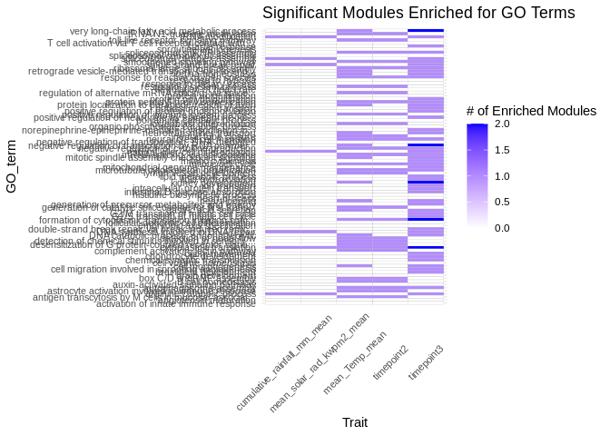

21-Apul-annotate-miRNA-mRNA-WGCNA
================
Kathleen Durkin
2025-03-19

- <a href="#1-load-packages" id="toc-1-load-packages">1 Load packages</a>
- <a href="#2-load-and-format-annotation-files"
  id="toc-2-load-and-format-annotation-files">2 Load and format annotation
  files</a>
- <a href="#3-annotate-wgcna-modules" id="toc-3-annotate-wgcna-modules">3
  Annotate WGCNA modules</a>
- <a href="#4-functional-enrichment-of-modules-topgo"
  id="toc-4-functional-enrichment-of-modules-topgo">4 Functional
  Enrichment of modules (topGO)</a>
  - <a href="#41-format-gene-ontology-go-annotations"
    id="toc-41-format-gene-ontology-go-annotations">4.1 Format Gene Ontology
    (GO) annotations</a>
  - <a href="#42-extract-list-of-significant-wgcna-modules"
    id="toc-42-extract-list-of-significant-wgcna-modules">4.2 Extract list
    of significant WGCNA modules</a>
  - <a href="#43-topgo-function" id="toc-43-topgo-function">4.3 topGO
    function</a>
  - <a href="#44-heatmap-of-significant-go-terms-by-trait"
    id="toc-44-heatmap-of-significant-go-terms-by-trait">4.4 Heatmap of
    significant GO terms by trait</a>
  - <a href="#45-isolate-enriched-terms-by-associated-traits"
    id="toc-45-isolate-enriched-terms-by-associated-traits">4.5 Isolate
    enriched terms by associated trait(s)</a>
- <a href="#5-annotate-putative-binding"
  id="toc-5-annotate-putative-binding">5 Annotate putative binding</a>
  - <a href="#51-load-module-module-correlations"
    id="toc-51-load-module-module-correlations">5.1 Load module-module
    correlations</a>
  - <a href="#52-annotate-whether-a-given-module-contains-mirna"
    id="toc-52-annotate-whether-a-given-module-contains-mirna">5.2 Annotate
    whether a given module contains miRNA</a>
  - <a href="#53-id-which-mirna-mrna-pairs-putatively-bind"
    id="toc-53-id-which-mirna-mrna-pairs-putatively-bind">5.3 ID which
    miRNA-mRNA pairs putatively bind</a>
  - <a href="#54-join-with-fa-table-to-annotate-each-binding-mrna"
    id="toc-54-join-with-fa-table-to-annotate-each-binding-mrna">5.4 Join
    with FA table to annotate each binding mRNA</a>
- <a href="#6-functional-enrichment-of-putative-binding"
  id="toc-6-functional-enrichment-of-putative-binding">6 Functional
  Enrichment of putative binding</a>
- <a href="#7-summary-figures" id="toc-7-summary-figures">7 Summary
  figures</a>

After running WGCNA to evaluate modules of mRNA and miRNA with
correlated expression, we need to functionally annotate genes to
evaluate module function(s).

# 1 Load packages

``` r
library(dplyr)
library(tidyverse)
library(ggplot2)
library(topGO)
```

# 2 Load and format annotation files

Already annotated the A.pulchra genome as part of the
`deep-dive expression` project (see
[`deep-dive-expression/D-Apul/code/02-Apul-reference-annotation.Rmd`](https://github.com/urol-e5/deep-dive-expression/blob/main/D-Apul/code/02-Apul-reference-annotation.Rmd)),
so we’ll pull the annotation file from that

``` bash
# Can access file stored here if needed
# https://gannet.fish.washington.edu/kdurkin1/ravenbackups/deep-dive-expression/D-Apul/output/02-Apul-reference-annotation/Apulcra-genome-mRNA-IDmapping-2024_12_12.tab
cp ../../../deep-dive-expression/D-Apul/output/02-Apul-reference-annotation/Apulcra-genome-mRNA-IDmapping-2024_12_12.tab ../output/21-Apul-annotate-miRNA-mRNA-WGCNA
```

Read mapping file into R

``` r
IDmapping_dirty <- read.table("../output/21-Apul-annotate-miRNA-mRNA-WGCNA/Apulcra-genome-mRNA-IDmapping-2024_12_12.tab", header = TRUE, sep = "\t", stringsAsFactors = FALSE)

# Need to remove quotations surrounding each entry
IDmapping_locations <- IDmapping_dirty
IDmapping_locations[] <- lapply(IDmapping_locations, function(x) gsub('^"(.*)"$', '\\1', x))
# Remove unneeded columns 
IDmapping_locations <- IDmapping_locations %>% dplyr::select(-X, -V13)
# Ensure there are no duplicate rows
IDmapping_locations <- IDmapping_locations %>% distinct()

head(IDmapping_locations)
```

                        V1     V3 Protein.names
    1   ntLink_4:1155-1537 P35061   Histone H2A
    2   ntLink_4:2660-3441 P84239    Histone H3
    3   ntLink_4:4515-6830 P35061   Histone H2A
    4   ntLink_4:7096-7859 P84239    Histone H3
    5   ntLink_4:8474-9669 P35061   Histone H2A
    6 ntLink_4:11162-11925 P84239    Histone H3
                                        Organism Gene.Ontology..biological.process.
    1          Acropora formosa (Staghorn coral)                                   
    2 Urechis caupo (Innkeeper worm) (Spoonworm)                                   
    3          Acropora formosa (Staghorn coral)                                   
    4 Urechis caupo (Innkeeper worm) (Spoonworm)                                   
    5          Acropora formosa (Staghorn coral)                                   
    6 Urechis caupo (Innkeeper worm) (Spoonworm)                                   
                                               Gene.Ontology.IDs
    1 GO:0000786; GO:0003677; GO:0005634; GO:0030527; GO:0046982
    2 GO:0000786; GO:0003677; GO:0005634; GO:0030527; GO:0046982
    3 GO:0000786; GO:0003677; GO:0005634; GO:0030527; GO:0046982
    4 GO:0000786; GO:0003677; GO:0005634; GO:0030527; GO:0046982
    5 GO:0000786; GO:0003677; GO:0005634; GO:0030527; GO:0046982
    6 GO:0000786; GO:0003677; GO:0005634; GO:0030527; GO:0046982

``` r
# Looks good!
```

This file shows each gene as it’s genomic location. We want to use gene
IDs to associate genes, so add gene IDs to this annotation table

Read in file that associates each mRNA genomic location with
corresponding gene ID

``` r
mRNA_FUNids <- read.table("../output/05-Apul-annotate-UTRs/Apul-mRNA-FUNids.txt", header=FALSE, col.names=c("location", "type", "mRNA_ID", "gene_ID", "product"), sep="\t")

# Remove unwanted text from parent column
mRNA_FUNids$gene_ID <- gsub("Parent=", "", mRNA_FUNids$gene_ID)
# Only need to keep mRNA location and gene ID
mRNA_FUNids <- mRNA_FUNids %>% dplyr::select(location, gene_ID)
```

join with annotation file

``` r
IDmapping <- left_join(IDmapping_locations, mRNA_FUNids, by = c("V1" = "location"))
```

# 3 Annotate WGCNA modules

Load file that shows which module each gene/miRNA is in

``` r
module_membership <- read.table("../output/12-Apul-miRNA-mRNA-WGCNA/WGCNA-module-membership.tab", header = TRUE, sep = "\t", stringsAsFactors = FALSE)
```

join with annotation file

``` r
module_FA <- left_join(module_membership, IDmapping, by = c("gene" = "gene_ID"))
```

Many of the genes don’t have available annotations, so reduce to only
keep those that are annotated (note this will also remove lncRNA and
miRNA).

``` r
module_FA_available <- module_FA[!is.na(module_FA$Gene.Ontology.IDs),]
module_FA_available <- module_FA_available[module_FA_available$Gene.Ontology.IDs != "",]
```

# 4 Functional Enrichment of modules (topGO)

I want to see whether our modules of coexpressed genes/miRNA represent
specific, over-represented functionalities (i.e. does any module contain
more metabolism-related genes than expected?)

To do this we’ll perform functional enrichment of each module using the
R package topGO

## 4.1 Format Gene Ontology (GO) annotations

Want to isolate a list of GO terms per gene

``` r
gene_to_GO <- IDmapping %>% filter(!is.na(Gene.Ontology.IDs)) %>% dplyr::select(gene_ID, Gene.Ontology.IDs)
#head(gene_to_GO)

# Needs to be formatted as a named list for use in topGO
# Convert data frame to a named list
# gene_to_GO_list <- gene_to_GO %>%
#   mutate(GO_terms = strsplit(Gene.Ontology.IDs, ";")) %>%
#   tibble::deframe()

gene_to_GO_list <- setNames(
  strsplit(as.character(gene_to_GO$Gene.Ontology.IDs), ";"), 
  gene_to_GO$gene_ID
)
```

Note: I think this means genes that had a Uniprot ID but no GO terms are
excluded from this analysis

Define reference set. This should be all genes *found in our samples*,
NOT all genes in the A.pulchra genome. Some genes (e.g., reproduction
pathways) may not be found/expected in our samples for valid biological
reasons.

``` r
reference_genes <- module_membership$gene
length(reference_genes)
```

    [1] 23502

## 4.2 Extract list of significant WGCNA modules

``` r
WGCNA_pvals <- read.delim("../output/12-Apul-miRNA-mRNA-WGCNA/pval-cor-WGCNA_module-phys_envir.tab", header=TRUE, sep="\t")

# filter to only keep rows and columns with at least one significant pval
filtered_rows <- WGCNA_pvals[rowSums(WGCNA_pvals < 0.05, na.rm = TRUE) > 0, ]
WGCNA_pvals_significant <- filtered_rows[, colSums(filtered_rows < 0.05, na.rm = TRUE) > 0]

# Create list of modules that are significantly correlated with at least one trait
significant_modules <- row.names(WGCNA_pvals_significant)
```

## 4.3 topGO function

Create a function to run topGO functional enrichment analysis for an
input module (we’ll want to use this for many modules of interest)

``` r
module_topGO_FE <- function(module.name) {
  
  #Isolate genes in our input module of interest
  genes_in_module <- module_membership %>%
    filter(module == module.name) %>%
    pull(gene)
  
  # Create factor for all reference genes, where 1 represents module membership and 0 means the gene is not in module of interest
  gene_list <- factor(as.integer(reference_genes %in% genes_in_module))
  names(gene_list) <- reference_genes
  
  # Create topGO object
  GO_BP <- new("topGOdata",
              description = "Functional Enrichment Analysis", 
              ontology = "BP", # Biological Process
              allGenes = gene_list,
              annot = annFUN.gene2GO, 
              gene2GO = gene_to_GO_list)
  
  # Run GO enrichment test
  GO_BP_FE <- runTest(GO_BP, algorithm = "weight01", statistic = "fisher")
  
  # View the results
  GO_BP_results <- GenTable(GO_BP, Fisher = GO_BP_FE, orderBy = "Fisher",  topNodes = 100, numChar = 51)
  
  # Filter by significant results
  GO_BP_results$Fisher<-as.numeric(GO_BP_results$Fisher)
  GO_BP_results_sig<-GO_BP_results[GO_BP_results$Fisher<0.05,]

  # Return
  print(GO_BP_results_sig)
}
```

``` r
results <- list()

for(module in significant_modules) {
  # Run topGo enrichent function
  module_results <- module_topGO_FE(module)
  
  # Only keep results if not empty
  if (nrow(module_results) > 0) {
    # note the source column
    module_results$module <- module
    # append to results list
    results[[module]] <- module_results
  }
}
```

           GO.ID                                                   Term Annotated
    1 GO:0006890 retrograde vesicle-mediated transport, Golgi to end...         1
    2 GO:0007094          mitotic spindle assembly checkpoint signaling         1
    3 GO:0001696                                 gastric acid secretion        11
      Significant Expected Fisher
    1           1     0.03  0.028
    2           1     0.03  0.028
    3           2     0.31  0.036
           GO.ID                                 Term Annotated Significant
    1 GO:0002181              cytoplasmic translation        21           3
    2 GO:0006527           arginine catabolic process         1           1
    3 GO:0001779  natural killer cell differentiation         1           1
    4 GO:0000012           single strand break repair         1           1
    5 GO:0000245        spliceosomal complex assembly         4           1
    6 GO:0006400                    tRNA modification         4           1
    7 GO:0000731 DNA synthesis involved in DNA repair         4           1
      Expected Fisher
    1     0.25 0.0016
    2     0.01 0.0119
    3     0.01 0.0119
    4     0.01 0.0119
    5     0.05 0.0468
    6     0.05 0.0468
    7     0.05 0.0468
           GO.ID                                                   Term Annotated
    1 GO:0000727 double-strand break repair via break-induced replic...         3
    2 GO:0000086                  G2/M transition of mitotic cell cycle         7
    3 GO:0000002                       mitochondrial genome maintenance         9
      Significant Expected Fisher
    1           1     0.02  0.016
    2           1     0.04  0.036
    3           1     0.05  0.046
           GO.ID               Term Annotated Significant Expected Fisher
    1 GO:0000278 mitotic cell cycle       157           2     0.23  0.012
           GO.ID                                                   Term Annotated
    1 GO:0002003                                 angiotensin maturation         1
    2 GO:0007420                                      brain development         1
    3 GO:0002291 T cell activation via T cell receptor contact with ...        10
    4 GO:0001581 detection of chemical stimulus involved in sensory ...        10
      Significant Expected Fisher
    1           1     0.03  0.027
    2           1     0.03  0.027
    3           2     0.27  0.027
    4           2     0.27  0.027
           GO.ID                                                   Term Annotated
    1 GO:0001649                             osteoblast differentiation        26
    2 GO:0001945                               lymph vessel development         5
    3 GO:0002939                            tRNA N1-guanine methylation         1
    4 GO:0003127                                detection of nodal flow         1
    5 GO:0000349 generation of catalytic spliceosome for first trans...         1
    6 GO:0002265       astrocyte activation involved in immune response         1
    7 GO:0000492                                box C/D snoRNP assembly         1
    8 GO:0001581 detection of chemical stimulus involved in sensory ...        10
      Significant Expected Fisher
    1           6     0.93 0.0002
    2           2     0.18 0.0117
    3           1     0.04 0.0357
    4           1     0.04 0.0357
    5           1     0.04 0.0357
    6           1     0.04 0.0357
    7           1     0.04 0.0357
    8           2     0.36 0.0468
           GO.ID                                                   Term Annotated
    1 GO:0002181                                cytoplasmic translation        21
    2 GO:0001732 formation of cytoplasmic translation initiation com...         6
    3 GO:0000398                         mRNA splicing, via spliceosome        63
    4 GO:0000413                  protein peptidyl-prolyl isomerization         9
    5 GO:0000387                            spliceosomal snRNP assembly         8
    6 GO:0000027                       ribosomal large subunit assembly         2
    7 GO:0000226                  microtubule cytoskeleton organization        41
      Significant Expected    Fisher
    1          15     2.22 0.0000012
    2           5     0.63 0.0000680
    3          19     6.66 0.0001200
    4           5     0.95 0.0010900
    5           4     0.85 0.0042200
    6           2     0.21 0.0110900
    7           9     4.33 0.0261500
           GO.ID                                                   Term Annotated
    1 GO:0001732 formation of cytoplasmic translation initiation com...         6
    2 GO:0006091         generation of precursor metabolites and energy        11
      Significant Expected Fisher
    1           1     0.03  0.027
    2           1     0.05  0.048
           GO.ID                                  Term Annotated Significant
    1 GO:0001867 complement activation, lectin pathway         9           1
    2 GO:0002027              regulation of heart rate        13           1
      Expected Fisher
    1     0.03  0.027
    2     0.04  0.038
           GO.ID                                                   Term Annotated
    1 GO:0001867                  complement activation, lectin pathway         9
    2 GO:0002224                   toll-like receptor signaling pathway         1
    3 GO:0002684           positive regulation of immune system process        29
    4 GO:0002412 antigen transcytosis by M cells in mucosal-associat...        18
    5 GO:0002032 desensitization of G protein-coupled receptor signa...         2
    6 GO:0003016                             respiratory system process         3
      Significant Expected Fisher
    1           2     0.14 0.0078
    2           1     0.02 0.0156
    3           3     0.45 0.0287
    4           2     0.28 0.0306
    5           1     0.03 0.0310
    6           1     0.05 0.0462
           GO.ID                                           Term Annotated
    1 GO:0006091 generation of precursor metabolites and energy        11
      Significant Expected Fisher
    1           1     0.01 0.0082
           GO.ID                Term Annotated Significant Expected Fisher
    1 GO:0001666 response to hypoxia        12           1     0.02  0.018
           GO.ID                                                   Term Annotated
    1 GO:0006091         generation of precursor metabolites and energy        11
    2 GO:0002412 antigen transcytosis by M cells in mucosal-associat...        18
    3 GO:0003015                                          heart process        21
    4 GO:0002933                                    lipid hydroxylation         3
      Significant Expected  Fisher
    1           3     0.18 0.00058
    2           2     0.29 0.03341
    3           2     0.34 0.04452
    4           1     0.05 0.04834
           GO.ID                                  Term Annotated Significant
    1 GO:0019700 organic phosphonate catabolic process        11           2
    2 GO:0000390      spliceosomal complex disassembly         1           1
    3 GO:0006884               cell volume homeostasis         1           1
    4 GO:0002218  activation of innate immune response        17           2
    5 GO:0006598           polyamine catabolic process         3           1
    6 GO:0009734     auxin-activated signaling pathway         4           1
      Expected Fisher
    1     0.14 0.0077
    2     0.01 0.0126
    3     0.01 0.0126
    4     0.22 0.0183
    5     0.04 0.0375
    6     0.05 0.0497
           GO.ID                           Term Annotated Significant Expected
    1 GO:0007268 chemical synaptic transmission         1           1     0.00
    2 GO:0002933            lipid hydroxylation         3           1     0.01
      Fisher
    1 0.0030
    2 0.0089
           GO.ID                                                   Term Annotated
    1 GO:0001843                                    neural tube closure         7
    2 GO:0001782                                     B cell homeostasis         7
    3 GO:0000381 regulation of alternative mRNA splicing, via splice...        11
      Significant Expected Fisher
    1           1     0.03  0.031
    2           1     0.03  0.031
    3           1     0.05  0.048
           GO.ID                                                   Term Annotated
    1 GO:0002412 antigen transcytosis by M cells in mucosal-associat...        18
      Significant Expected  Fisher
    1           5     0.11 1.3e-08
           GO.ID               Term Annotated Significant Expected Fisher
    1 GO:0001822 kidney development        61           2     0.09  0.002
           GO.ID                                               Term Annotated
    1 GO:0000335 negative regulation of transposition, DNA-mediated         1
    2 GO:0001822                                 kidney development        61
      Significant Expected Fisher
    1           1     0.01 0.0089
    2           3     0.54 0.0146
           GO.ID               Term Annotated Significant Expected  Fisher
    1 GO:0001822 kidney development        61           6     0.64 1.5e-05
    [1] GO.ID       Term        Annotated   Significant Expected    Fisher     
    <0 rows> (or 0-length row.names)
           GO.ID                        Term Annotated Significant Expected Fisher
    1 GO:0000045      autophagosome assembly         7           2     0.11 0.0047
    2 GO:0001755 neural crest cell migration         2           1     0.03 0.0310
           GO.ID                   Term Annotated Significant Expected Fisher
    1 GO:0016567 protein ubiquitination        37           2     0.17  0.026
           GO.ID                                            Term Annotated
    1 GO:0002175 protein localization to paranode region of axon        18
    2 GO:0000737          DNA catabolic process, endonucleolytic         1
    3 GO:0006836                      neurotransmitter transport         6
      Significant Expected Fisher
    1           2     0.07 0.0017
    2           1     0.00 0.0037
    3           1     0.02 0.0222
           GO.ID                                  Term Annotated Significant
    1 GO:0000082 G1/S transition of mitotic cell cycle       103           3
    2 GO:0003360                 brainstem development         5           1
      Expected Fisher
    1     0.54  0.012
    2     0.03  0.026
           GO.ID                                      Term Annotated Significant
    1 GO:0001649                osteoblast differentiation        26           2
    2 GO:0002268 follicular dendritic cell differentiation         1           1
    3 GO:0002040                    sprouting angiogenesis        11           1
      Expected Fisher
    1     0.08 0.0021
    2     0.00 0.0030
    3     0.03 0.0324
           GO.ID                                       Term Annotated Significant
    1 GO:0000302        response to reactive oxygen species         6           5
    2 GO:0007224               smoothened signaling pathway         2           2
    3 GO:0001818 negative regulation of cytokine production        17           6
    4 GO:0000278                         mitotic cell cycle       157          24
      Expected  Fisher
    1     0.83 0.00025
    2     0.28 0.01886
    3     2.34 0.02088
    4    21.61 0.04440
           GO.ID                                         Term Annotated Significant
    1 GO:0001822                           kidney development        61           6
    2 GO:0003341                              cilium movement        20           3
    3 GO:0000038 very long-chain fatty acid metabolic process         9           2
      Expected  Fisher
    1     1.09 0.00048
    2     0.36 0.00468
    3     0.16 0.01020
           GO.ID                                                   Term Annotated
    1 GO:0001996 positive regulation of heart rate by epinephrine-no...        12
    2 GO:0002042      cell migration involved in sprouting angiogenesis         7
    3 GO:0006811                                          ion transport        18
    4 GO:0006813                                potassium ion transport         1
    5 GO:0002063                                chondrocyte development         1
    6 GO:0002025 norepinephrine-epinephrine-mediated vasodilation in...         1
    7 GO:0001951                        intestinal D-glucose absorption         1
    8 GO:0006629                                lipid metabolic process        36
      Significant Expected Fisher
    1           4     0.57 0.0017
    2           2     0.33 0.0402
    3           5     0.86 0.0452
    4           1     0.05 0.0476
    5           1     0.05 0.0476
    6           1     0.05 0.0476
    7           1     0.05 0.0476
    8           2     1.71 0.0481
           GO.ID                                            Term Annotated
    1 GO:0000082           G1/S transition of mitotic cell cycle       103
    2 GO:0002175 protein localization to paranode region of axon        18
    3 GO:0001867           complement activation, lectin pathway         9
    4 GO:0002021                      response to dietary excess         1
    5 GO:0000105                  histidine biosynthetic process         1
    6 GO:0000578                    embryonic axis specification         1
      Significant Expected Fisher
    1           8     3.07 0.0088
    2           3     0.54 0.0146
    3           2     0.27 0.0272
    4           1     0.03 0.0298
    5           1     0.03 0.0298
    6           1     0.03 0.0298
           GO.ID                                         Term Annotated Significant
    1 GO:0001895                           retina homeostasis         2           1
    2 GO:0001947                                heart looping         4           1
    3 GO:0000038 very long-chain fatty acid metabolic process         9           1
      Expected Fisher
    1     0.01 0.0074
    2     0.01 0.0148
    3     0.03 0.0331
           GO.ID                                                   Term Annotated
    1 GO:0001822                                     kidney development        61
    2 GO:0000122 negative regulation of transcription by RNA polymer...       134
    3 GO:0000902                                     cell morphogenesis         7
      Significant Expected Fisher
    1           8     3.09  0.020
    2          12     6.78  0.032
    3           2     0.35  0.045
           GO.ID                                                   Term Annotated
    1 GO:0001934         positive regulation of protein phosphorylation         4
    2 GO:0000209                             protein polyubiquitination        30
    3 GO:0006886                        intracellular protein transport         5
    4 GO:0000122 negative regulation of transcription by RNA polymer...       134
    5 GO:0001964                                       startle response         6
    6 GO:0000281                                    mitotic cytokinesis        15
      Significant Expected Fisher
    1           2     0.23  0.018
    2           5     1.70  0.024
    3           2     0.28  0.028
    4          13     7.58  0.033
    5           2     0.34  0.041
    6           3     0.85  0.048

``` r
# Combine all the resuts data frames into one
combined_GO_BP_results_sig <- do.call(rbind, results)

# View
print(combined_GO_BP_results_sig)
```

                GO.ID                                                   Term
    ME6.1  GO:0006890 retrograde vesicle-mediated transport, Golgi to end...
    ME6.2  GO:0007094          mitotic spindle assembly checkpoint signaling
    ME6.3  GO:0001696                                 gastric acid secretion
    ME18.1 GO:0002181                                cytoplasmic translation
    ME18.2 GO:0006527                             arginine catabolic process
    ME18.3 GO:0001779                    natural killer cell differentiation
    ME18.4 GO:0000012                             single strand break repair
    ME18.5 GO:0000245                          spliceosomal complex assembly
    ME18.6 GO:0006400                                      tRNA modification
    ME18.7 GO:0000731                   DNA synthesis involved in DNA repair
    ME33.1 GO:0000727 double-strand break repair via break-induced replic...
    ME33.2 GO:0000086                  G2/M transition of mitotic cell cycle
    ME33.3 GO:0000002                       mitochondrial genome maintenance
    ME43   GO:0000278                                     mitotic cell cycle
    ME12.1 GO:0002003                                 angiotensin maturation
    ME12.2 GO:0007420                                      brain development
    ME12.3 GO:0002291 T cell activation via T cell receptor contact with ...
    ME12.4 GO:0001581 detection of chemical stimulus involved in sensory ...
    ME7.1  GO:0001649                             osteoblast differentiation
    ME7.2  GO:0001945                               lymph vessel development
    ME7.3  GO:0002939                            tRNA N1-guanine methylation
    ME7.4  GO:0003127                                detection of nodal flow
    ME7.5  GO:0000349 generation of catalytic spliceosome for first trans...
    ME7.6  GO:0002265       astrocyte activation involved in immune response
    ME7.7  GO:0000492                                box C/D snoRNP assembly
    ME7.8  GO:0001581 detection of chemical stimulus involved in sensory ...
    ME2.1  GO:0002181                                cytoplasmic translation
    ME2.2  GO:0001732 formation of cytoplasmic translation initiation com...
    ME2.3  GO:0000398                         mRNA splicing, via spliceosome
    ME2.4  GO:0000413                  protein peptidyl-prolyl isomerization
    ME2.5  GO:0000387                            spliceosomal snRNP assembly
    ME2.6  GO:0000027                       ribosomal large subunit assembly
    ME2.7  GO:0000226                  microtubule cytoskeleton organization
    ME23.1 GO:0001732 formation of cytoplasmic translation initiation com...
    ME23.2 GO:0006091         generation of precursor metabolites and energy
    ME36.1 GO:0001867                  complement activation, lectin pathway
    ME36.2 GO:0002027                               regulation of heart rate
    ME15.1 GO:0001867                  complement activation, lectin pathway
    ME15.2 GO:0002224                   toll-like receptor signaling pathway
    ME15.3 GO:0002684           positive regulation of immune system process
    ME15.4 GO:0002412 antigen transcytosis by M cells in mucosal-associat...
    ME15.5 GO:0002032 desensitization of G protein-coupled receptor signa...
    ME15.6 GO:0003016                             respiratory system process
    ME51   GO:0006091         generation of precursor metabolites and energy
    ME46   GO:0001666                                    response to hypoxia
    ME11.1 GO:0006091         generation of precursor metabolites and energy
    ME11.2 GO:0002412 antigen transcytosis by M cells in mucosal-associat...
    ME11.3 GO:0003015                                          heart process
    ME11.4 GO:0002933                                    lipid hydroxylation
    ME16.1 GO:0019700                  organic phosphonate catabolic process
    ME16.2 GO:0000390                       spliceosomal complex disassembly
    ME16.3 GO:0006884                                cell volume homeostasis
    ME16.4 GO:0002218                   activation of innate immune response
    ME16.5 GO:0006598                            polyamine catabolic process
    ME16.6 GO:0009734                      auxin-activated signaling pathway
    ME25.1 GO:0007268                         chemical synaptic transmission
    ME25.2 GO:0002933                                    lipid hydroxylation
    ME34.1 GO:0001843                                    neural tube closure
    ME34.2 GO:0001782                                     B cell homeostasis
    ME34.3 GO:0000381 regulation of alternative mRNA splicing, via splice...
    ME48   GO:0002412 antigen transcytosis by M cells in mucosal-associat...
    ME52   GO:0001822                                     kidney development
    ME28.1 GO:0000335     negative regulation of transposition, DNA-mediated
    ME28.2 GO:0001822                                     kidney development
    ME32   GO:0001822                                     kidney development
    ME19.1 GO:0000045                                 autophagosome assembly
    ME19.2 GO:0001755                            neural crest cell migration
    ME27   GO:0016567                                 protein ubiquitination
    ME45.1 GO:0002175        protein localization to paranode region of axon
    ME45.2 GO:0000737                 DNA catabolic process, endonucleolytic
    ME45.3 GO:0006836                             neurotransmitter transport
    ME30.1 GO:0000082                  G1/S transition of mitotic cell cycle
    ME30.2 GO:0003360                                  brainstem development
    ME29.1 GO:0001649                             osteoblast differentiation
    ME29.2 GO:0002268              follicular dendritic cell differentiation
    ME29.3 GO:0002040                                 sprouting angiogenesis
    ME1.1  GO:0000302                    response to reactive oxygen species
    ME1.2  GO:0007224                           smoothened signaling pathway
    ME1.3  GO:0001818             negative regulation of cytokine production
    ME1.4  GO:0000278                                     mitotic cell cycle
    ME17.1 GO:0001822                                     kidney development
    ME17.2 GO:0003341                                        cilium movement
    ME17.3 GO:0000038           very long-chain fatty acid metabolic process
    ME4.1  GO:0001996 positive regulation of heart rate by epinephrine-no...
    ME4.2  GO:0002042      cell migration involved in sprouting angiogenesis
    ME4.3  GO:0006811                                          ion transport
    ME4.4  GO:0006813                                potassium ion transport
    ME4.5  GO:0002063                                chondrocyte development
    ME4.6  GO:0002025 norepinephrine-epinephrine-mediated vasodilation in...
    ME4.7  GO:0001951                        intestinal D-glucose absorption
    ME4.8  GO:0006629                                lipid metabolic process
    ME10.1 GO:0000082                  G1/S transition of mitotic cell cycle
    ME10.2 GO:0002175        protein localization to paranode region of axon
    ME10.3 GO:0001867                  complement activation, lectin pathway
    ME10.4 GO:0002021                             response to dietary excess
    ME10.5 GO:0000105                         histidine biosynthetic process
    ME10.6 GO:0000578                           embryonic axis specification
    ME42.1 GO:0001895                                     retina homeostasis
    ME42.2 GO:0001947                                          heart looping
    ME42.3 GO:0000038           very long-chain fatty acid metabolic process
    ME8.1  GO:0001822                                     kidney development
    ME8.2  GO:0000122 negative regulation of transcription by RNA polymer...
    ME8.3  GO:0000902                                     cell morphogenesis
    ME9.1  GO:0001934         positive regulation of protein phosphorylation
    ME9.2  GO:0000209                             protein polyubiquitination
    ME9.3  GO:0006886                        intracellular protein transport
    ME9.4  GO:0000122 negative regulation of transcription by RNA polymer...
    ME9.5  GO:0001964                                       startle response
    ME9.6  GO:0000281                                    mitotic cytokinesis
           Annotated Significant Expected    Fisher module
    ME6.1          1           1     0.03 2.800e-02    ME6
    ME6.2          1           1     0.03 2.800e-02    ME6
    ME6.3         11           2     0.31 3.600e-02    ME6
    ME18.1        21           3     0.25 1.600e-03   ME18
    ME18.2         1           1     0.01 1.190e-02   ME18
    ME18.3         1           1     0.01 1.190e-02   ME18
    ME18.4         1           1     0.01 1.190e-02   ME18
    ME18.5         4           1     0.05 4.680e-02   ME18
    ME18.6         4           1     0.05 4.680e-02   ME18
    ME18.7         4           1     0.05 4.680e-02   ME18
    ME33.1         3           1     0.02 1.600e-02   ME33
    ME33.2         7           1     0.04 3.600e-02   ME33
    ME33.3         9           1     0.05 4.600e-02   ME33
    ME43         157           2     0.23 1.200e-02   ME43
    ME12.1         1           1     0.03 2.700e-02   ME12
    ME12.2         1           1     0.03 2.700e-02   ME12
    ME12.3        10           2     0.27 2.700e-02   ME12
    ME12.4        10           2     0.27 2.700e-02   ME12
    ME7.1         26           6     0.93 2.000e-04    ME7
    ME7.2          5           2     0.18 1.170e-02    ME7
    ME7.3          1           1     0.04 3.570e-02    ME7
    ME7.4          1           1     0.04 3.570e-02    ME7
    ME7.5          1           1     0.04 3.570e-02    ME7
    ME7.6          1           1     0.04 3.570e-02    ME7
    ME7.7          1           1     0.04 3.570e-02    ME7
    ME7.8         10           2     0.36 4.680e-02    ME7
    ME2.1         21          15     2.22 1.200e-06    ME2
    ME2.2          6           5     0.63 6.800e-05    ME2
    ME2.3         63          19     6.66 1.200e-04    ME2
    ME2.4          9           5     0.95 1.090e-03    ME2
    ME2.5          8           4     0.85 4.220e-03    ME2
    ME2.6          2           2     0.21 1.109e-02    ME2
    ME2.7         41           9     4.33 2.615e-02    ME2
    ME23.1         6           1     0.03 2.700e-02   ME23
    ME23.2        11           1     0.05 4.800e-02   ME23
    ME36.1         9           1     0.03 2.700e-02   ME36
    ME36.2        13           1     0.04 3.800e-02   ME36
    ME15.1         9           2     0.14 7.800e-03   ME15
    ME15.2         1           1     0.02 1.560e-02   ME15
    ME15.3        29           3     0.45 2.870e-02   ME15
    ME15.4        18           2     0.28 3.060e-02   ME15
    ME15.5         2           1     0.03 3.100e-02   ME15
    ME15.6         3           1     0.05 4.620e-02   ME15
    ME51          11           1     0.01 8.200e-03   ME51
    ME46          12           1     0.02 1.800e-02   ME46
    ME11.1        11           3     0.18 5.800e-04   ME11
    ME11.2        18           2     0.29 3.341e-02   ME11
    ME11.3        21           2     0.34 4.452e-02   ME11
    ME11.4         3           1     0.05 4.834e-02   ME11
    ME16.1        11           2     0.14 7.700e-03   ME16
    ME16.2         1           1     0.01 1.260e-02   ME16
    ME16.3         1           1     0.01 1.260e-02   ME16
    ME16.4        17           2     0.22 1.830e-02   ME16
    ME16.5         3           1     0.04 3.750e-02   ME16
    ME16.6         4           1     0.05 4.970e-02   ME16
    ME25.1         1           1     0.00 3.000e-03   ME25
    ME25.2         3           1     0.01 8.900e-03   ME25
    ME34.1         7           1     0.03 3.100e-02   ME34
    ME34.2         7           1     0.03 3.100e-02   ME34
    ME34.3        11           1     0.05 4.800e-02   ME34
    ME48          18           5     0.11 1.300e-08   ME48
    ME52          61           2     0.09 2.000e-03   ME52
    ME28.1         1           1     0.01 8.900e-03   ME28
    ME28.2        61           3     0.54 1.460e-02   ME28
    ME32          61           6     0.64 1.500e-05   ME32
    ME19.1         7           2     0.11 4.700e-03   ME19
    ME19.2         2           1     0.03 3.100e-02   ME19
    ME27          37           2     0.17 2.600e-02   ME27
    ME45.1        18           2     0.07 1.700e-03   ME45
    ME45.2         1           1     0.00 3.700e-03   ME45
    ME45.3         6           1     0.02 2.220e-02   ME45
    ME30.1       103           3     0.54 1.200e-02   ME30
    ME30.2         5           1     0.03 2.600e-02   ME30
    ME29.1        26           2     0.08 2.100e-03   ME29
    ME29.2         1           1     0.00 3.000e-03   ME29
    ME29.3        11           1     0.03 3.240e-02   ME29
    ME1.1          6           5     0.83 2.500e-04    ME1
    ME1.2          2           2     0.28 1.886e-02    ME1
    ME1.3         17           6     2.34 2.088e-02    ME1
    ME1.4        157          24    21.61 4.440e-02    ME1
    ME17.1        61           6     1.09 4.800e-04   ME17
    ME17.2        20           3     0.36 4.680e-03   ME17
    ME17.3         9           2     0.16 1.020e-02   ME17
    ME4.1         12           4     0.57 1.700e-03    ME4
    ME4.2          7           2     0.33 4.020e-02    ME4
    ME4.3         18           5     0.86 4.520e-02    ME4
    ME4.4          1           1     0.05 4.760e-02    ME4
    ME4.5          1           1     0.05 4.760e-02    ME4
    ME4.6          1           1     0.05 4.760e-02    ME4
    ME4.7          1           1     0.05 4.760e-02    ME4
    ME4.8         36           2     1.71 4.810e-02    ME4
    ME10.1       103           8     3.07 8.800e-03   ME10
    ME10.2        18           3     0.54 1.460e-02   ME10
    ME10.3         9           2     0.27 2.720e-02   ME10
    ME10.4         1           1     0.03 2.980e-02   ME10
    ME10.5         1           1     0.03 2.980e-02   ME10
    ME10.6         1           1     0.03 2.980e-02   ME10
    ME42.1         2           1     0.01 7.400e-03   ME42
    ME42.2         4           1     0.01 1.480e-02   ME42
    ME42.3         9           1     0.03 3.310e-02   ME42
    ME8.1         61           8     3.09 2.000e-02    ME8
    ME8.2        134          12     6.78 3.200e-02    ME8
    ME8.3          7           2     0.35 4.500e-02    ME8
    ME9.1          4           2     0.23 1.800e-02    ME9
    ME9.2         30           5     1.70 2.400e-02    ME9
    ME9.3          5           2     0.28 2.800e-02    ME9
    ME9.4        134          13     7.58 3.300e-02    ME9
    ME9.5          6           2     0.34 4.100e-02    ME9
    ME9.6         15           3     0.85 4.800e-02    ME9

## 4.4 Heatmap of significant GO terms by trait

``` r
# Extract significant modules for each trait
significant_modules_per_trait <- apply(WGCNA_pvals_significant, 2, function(x) rownames(WGCNA_pvals_significant)[x < 0.05])

# Specify traits of interest
#traits <- colnames(WGCNA_pvals_significant)
traits <- c("timepoint2", "timepoint3", "mean_Temp_mean", "mean_solar_rad_kwpm2_mean", "cumulative_rainfall_mm_mean")

# Create empty matrix to store values for hetmap
go_term_counts <- matrix(0, nrow = length(traits), ncol = length(unique(combined_GO_BP_results_sig$Term)))
rownames(go_term_counts) <- traits  # Trait names
colnames(go_term_counts) <- unique(combined_GO_BP_results_sig$Term)  # Unique GO terms

# Loop through each trait, calculate the number of significant modules enriched for each GO term
for (trait in traits) {
  # Get the significant modules for this trait
  significant_modules <- significant_modules_per_trait[[trait]]
  
  # Check if a module is enriched for each GO term
  for (go_term in unique(combined_GO_BP_results_sig$Term)) {
    # Check if the module is in the list of significant modules for the trait and if it's enriched for this GO term
    enriched_modules <- combined_GO_BP_results_sig %>%
      filter(Term == go_term & module %in% significant_modules) %>%
      nrow()  # Count of modules enriched for this GO term
    
    # Count number of modules that contain each GO term
    go_term_counts[trait, go_term] <- enriched_modules
  }
}

# Convert matrix to df for plotting
go_term_counts_df <- as.data.frame(go_term_counts) %>%
  rownames_to_column("Trait") %>%
  gather(key = "GO_term", value = "Module_Count", -Trait)

# Truncate GO term names
#go_term_counts_df$GO_term <- substr(go_term_counts_df$GO_term, 1, 40)

# Plot
ggplot(go_term_counts_df, aes(x = Trait, y = GO_term, fill = Module_Count)) +
  geom_tile(color = "grey") +  # Adds grid lines
  scale_fill_gradient(low = "white", high = "blue") +  # Color gradient from white (low) to blue (high)
  theme_minimal() +
  theme(axis.text.x = element_text(size = 8, angle = 45, hjust=0.5, vjust=0.5), 
        axis.text.y = element_text(size = 8),
        ) + 
  labs(fill = "# of Enriched Modules", title = "Significant Modules Enriched for GO Terms") +
  theme(legend.position = "right")
```

<!-- -->

``` r
ggsave("../output/21-Apul-annotate-miRNA-mRNA-WGCNA/go_term_heatmap_envir_traits.png", width = 12, height = 10, dpi = 300)
```

## 4.5 Isolate enriched terms by associated trait(s)

Terms enriched in modules correlated with TP2

``` r
modules_TP2 <- significant_modules_per_trait[["timepoint2"]]
GO_TP2 <- combined_GO_BP_results_sig[combined_GO_BP_results_sig$module %in% modules_TP2,]
GO_TP2
```

                GO.ID                                                   Term
    ME7.1  GO:0001649                             osteoblast differentiation
    ME7.2  GO:0001945                               lymph vessel development
    ME7.3  GO:0002939                            tRNA N1-guanine methylation
    ME7.4  GO:0003127                                detection of nodal flow
    ME7.5  GO:0000349 generation of catalytic spliceosome for first trans...
    ME7.6  GO:0002265       astrocyte activation involved in immune response
    ME7.7  GO:0000492                                box C/D snoRNP assembly
    ME7.8  GO:0001581 detection of chemical stimulus involved in sensory ...
    ME2.1  GO:0002181                                cytoplasmic translation
    ME2.2  GO:0001732 formation of cytoplasmic translation initiation com...
    ME2.3  GO:0000398                         mRNA splicing, via spliceosome
    ME2.4  GO:0000413                  protein peptidyl-prolyl isomerization
    ME2.5  GO:0000387                            spliceosomal snRNP assembly
    ME2.6  GO:0000027                       ribosomal large subunit assembly
    ME2.7  GO:0000226                  microtubule cytoskeleton organization
    ME15.1 GO:0001867                  complement activation, lectin pathway
    ME15.2 GO:0002224                   toll-like receptor signaling pathway
    ME15.3 GO:0002684           positive regulation of immune system process
    ME15.4 GO:0002412 antigen transcytosis by M cells in mucosal-associat...
    ME15.5 GO:0002032 desensitization of G protein-coupled receptor signa...
    ME15.6 GO:0003016                             respiratory system process
    ME34.1 GO:0001843                                    neural tube closure
    ME34.2 GO:0001782                                     B cell homeostasis
    ME34.3 GO:0000381 regulation of alternative mRNA splicing, via splice...
    ME19.1 GO:0000045                                 autophagosome assembly
    ME19.2 GO:0001755                            neural crest cell migration
    ME1.1  GO:0000302                    response to reactive oxygen species
    ME1.2  GO:0007224                           smoothened signaling pathway
    ME1.3  GO:0001818             negative regulation of cytokine production
    ME1.4  GO:0000278                                     mitotic cell cycle
           Annotated Significant Expected    Fisher module
    ME7.1         26           6     0.93 0.0002000    ME7
    ME7.2          5           2     0.18 0.0117000    ME7
    ME7.3          1           1     0.04 0.0357000    ME7
    ME7.4          1           1     0.04 0.0357000    ME7
    ME7.5          1           1     0.04 0.0357000    ME7
    ME7.6          1           1     0.04 0.0357000    ME7
    ME7.7          1           1     0.04 0.0357000    ME7
    ME7.8         10           2     0.36 0.0468000    ME7
    ME2.1         21          15     2.22 0.0000012    ME2
    ME2.2          6           5     0.63 0.0000680    ME2
    ME2.3         63          19     6.66 0.0001200    ME2
    ME2.4          9           5     0.95 0.0010900    ME2
    ME2.5          8           4     0.85 0.0042200    ME2
    ME2.6          2           2     0.21 0.0110900    ME2
    ME2.7         41           9     4.33 0.0261500    ME2
    ME15.1         9           2     0.14 0.0078000   ME15
    ME15.2         1           1     0.02 0.0156000   ME15
    ME15.3        29           3     0.45 0.0287000   ME15
    ME15.4        18           2     0.28 0.0306000   ME15
    ME15.5         2           1     0.03 0.0310000   ME15
    ME15.6         3           1     0.05 0.0462000   ME15
    ME34.1         7           1     0.03 0.0310000   ME34
    ME34.2         7           1     0.03 0.0310000   ME34
    ME34.3        11           1     0.05 0.0480000   ME34
    ME19.1         7           2     0.11 0.0047000   ME19
    ME19.2         2           1     0.03 0.0310000   ME19
    ME1.1          6           5     0.83 0.0002500    ME1
    ME1.2          2           2     0.28 0.0188600    ME1
    ME1.3         17           6     2.34 0.0208800    ME1
    ME1.4        157          24    21.61 0.0444000    ME1

Terms enriched in modules correlated with TP3

``` r
modules_TP3 <- significant_modules_per_trait[["timepoint3"]]
GO_TP3 <- combined_GO_BP_results_sig[combined_GO_BP_results_sig$module %in% modules_TP3,]
GO_TP3
```

                GO.ID                                                   Term
    ME6.1  GO:0006890 retrograde vesicle-mediated transport, Golgi to end...
    ME6.2  GO:0007094          mitotic spindle assembly checkpoint signaling
    ME6.3  GO:0001696                                 gastric acid secretion
    ME18.1 GO:0002181                                cytoplasmic translation
    ME18.2 GO:0006527                             arginine catabolic process
    ME18.3 GO:0001779                    natural killer cell differentiation
    ME18.4 GO:0000012                             single strand break repair
    ME18.5 GO:0000245                          spliceosomal complex assembly
    ME18.6 GO:0006400                                      tRNA modification
    ME18.7 GO:0000731                   DNA synthesis involved in DNA repair
    ME33.1 GO:0000727 double-strand break repair via break-induced replic...
    ME33.2 GO:0000086                  G2/M transition of mitotic cell cycle
    ME33.3 GO:0000002                       mitochondrial genome maintenance
    ME2.1  GO:0002181                                cytoplasmic translation
    ME2.2  GO:0001732 formation of cytoplasmic translation initiation com...
    ME2.3  GO:0000398                         mRNA splicing, via spliceosome
    ME2.4  GO:0000413                  protein peptidyl-prolyl isomerization
    ME2.5  GO:0000387                            spliceosomal snRNP assembly
    ME2.6  GO:0000027                       ribosomal large subunit assembly
    ME2.7  GO:0000226                  microtubule cytoskeleton organization
    ME23.1 GO:0001732 formation of cytoplasmic translation initiation com...
    ME23.2 GO:0006091         generation of precursor metabolites and energy
    ME25.1 GO:0007268                         chemical synaptic transmission
    ME25.2 GO:0002933                                    lipid hydroxylation
    ME19.1 GO:0000045                                 autophagosome assembly
    ME19.2 GO:0001755                            neural crest cell migration
    ME45.1 GO:0002175        protein localization to paranode region of axon
    ME45.2 GO:0000737                 DNA catabolic process, endonucleolytic
    ME45.3 GO:0006836                             neurotransmitter transport
    ME30.1 GO:0000082                  G1/S transition of mitotic cell cycle
    ME30.2 GO:0003360                                  brainstem development
    ME1.1  GO:0000302                    response to reactive oxygen species
    ME1.2  GO:0007224                           smoothened signaling pathway
    ME1.3  GO:0001818             negative regulation of cytokine production
    ME1.4  GO:0000278                                     mitotic cell cycle
    ME17.1 GO:0001822                                     kidney development
    ME17.2 GO:0003341                                        cilium movement
    ME17.3 GO:0000038           very long-chain fatty acid metabolic process
    ME4.1  GO:0001996 positive regulation of heart rate by epinephrine-no...
    ME4.2  GO:0002042      cell migration involved in sprouting angiogenesis
    ME4.3  GO:0006811                                          ion transport
    ME4.4  GO:0006813                                potassium ion transport
    ME4.5  GO:0002063                                chondrocyte development
    ME4.6  GO:0002025 norepinephrine-epinephrine-mediated vasodilation in...
    ME4.7  GO:0001951                        intestinal D-glucose absorption
    ME4.8  GO:0006629                                lipid metabolic process
    ME42.1 GO:0001895                                     retina homeostasis
    ME42.2 GO:0001947                                          heart looping
    ME42.3 GO:0000038           very long-chain fatty acid metabolic process
    ME8.1  GO:0001822                                     kidney development
    ME8.2  GO:0000122 negative regulation of transcription by RNA polymer...
    ME8.3  GO:0000902                                     cell morphogenesis
    ME9.1  GO:0001934         positive regulation of protein phosphorylation
    ME9.2  GO:0000209                             protein polyubiquitination
    ME9.3  GO:0006886                        intracellular protein transport
    ME9.4  GO:0000122 negative regulation of transcription by RNA polymer...
    ME9.5  GO:0001964                                       startle response
    ME9.6  GO:0000281                                    mitotic cytokinesis
           Annotated Significant Expected    Fisher module
    ME6.1          1           1     0.03 0.0280000    ME6
    ME6.2          1           1     0.03 0.0280000    ME6
    ME6.3         11           2     0.31 0.0360000    ME6
    ME18.1        21           3     0.25 0.0016000   ME18
    ME18.2         1           1     0.01 0.0119000   ME18
    ME18.3         1           1     0.01 0.0119000   ME18
    ME18.4         1           1     0.01 0.0119000   ME18
    ME18.5         4           1     0.05 0.0468000   ME18
    ME18.6         4           1     0.05 0.0468000   ME18
    ME18.7         4           1     0.05 0.0468000   ME18
    ME33.1         3           1     0.02 0.0160000   ME33
    ME33.2         7           1     0.04 0.0360000   ME33
    ME33.3         9           1     0.05 0.0460000   ME33
    ME2.1         21          15     2.22 0.0000012    ME2
    ME2.2          6           5     0.63 0.0000680    ME2
    ME2.3         63          19     6.66 0.0001200    ME2
    ME2.4          9           5     0.95 0.0010900    ME2
    ME2.5          8           4     0.85 0.0042200    ME2
    ME2.6          2           2     0.21 0.0110900    ME2
    ME2.7         41           9     4.33 0.0261500    ME2
    ME23.1         6           1     0.03 0.0270000   ME23
    ME23.2        11           1     0.05 0.0480000   ME23
    ME25.1         1           1     0.00 0.0030000   ME25
    ME25.2         3           1     0.01 0.0089000   ME25
    ME19.1         7           2     0.11 0.0047000   ME19
    ME19.2         2           1     0.03 0.0310000   ME19
    ME45.1        18           2     0.07 0.0017000   ME45
    ME45.2         1           1     0.00 0.0037000   ME45
    ME45.3         6           1     0.02 0.0222000   ME45
    ME30.1       103           3     0.54 0.0120000   ME30
    ME30.2         5           1     0.03 0.0260000   ME30
    ME1.1          6           5     0.83 0.0002500    ME1
    ME1.2          2           2     0.28 0.0188600    ME1
    ME1.3         17           6     2.34 0.0208800    ME1
    ME1.4        157          24    21.61 0.0444000    ME1
    ME17.1        61           6     1.09 0.0004800   ME17
    ME17.2        20           3     0.36 0.0046800   ME17
    ME17.3         9           2     0.16 0.0102000   ME17
    ME4.1         12           4     0.57 0.0017000    ME4
    ME4.2          7           2     0.33 0.0402000    ME4
    ME4.3         18           5     0.86 0.0452000    ME4
    ME4.4          1           1     0.05 0.0476000    ME4
    ME4.5          1           1     0.05 0.0476000    ME4
    ME4.6          1           1     0.05 0.0476000    ME4
    ME4.7          1           1     0.05 0.0476000    ME4
    ME4.8         36           2     1.71 0.0481000    ME4
    ME42.1         2           1     0.01 0.0074000   ME42
    ME42.2         4           1     0.01 0.0148000   ME42
    ME42.3         9           1     0.03 0.0331000   ME42
    ME8.1         61           8     3.09 0.0200000    ME8
    ME8.2        134          12     6.78 0.0320000    ME8
    ME8.3          7           2     0.35 0.0450000    ME8
    ME9.1          4           2     0.23 0.0180000    ME9
    ME9.2         30           5     1.70 0.0240000    ME9
    ME9.3          5           2     0.28 0.0280000    ME9
    ME9.4        134          13     7.58 0.0330000    ME9
    ME9.5          6           2     0.34 0.0410000    ME9
    ME9.6         15           3     0.85 0.0480000    ME9

Terms enriched in modules correlated with temp

``` r
modules_temp <- significant_modules_per_trait[["mean_Temp_mean"]]
GO_temp <- combined_GO_BP_results_sig[combined_GO_BP_results_sig$module %in% modules_temp,]
GO_temp
```

                GO.ID                                                   Term
    ME6.1  GO:0006890 retrograde vesicle-mediated transport, Golgi to end...
    ME6.2  GO:0007094          mitotic spindle assembly checkpoint signaling
    ME6.3  GO:0001696                                 gastric acid secretion
    ME7.1  GO:0001649                             osteoblast differentiation
    ME7.2  GO:0001945                               lymph vessel development
    ME7.3  GO:0002939                            tRNA N1-guanine methylation
    ME7.4  GO:0003127                                detection of nodal flow
    ME7.5  GO:0000349 generation of catalytic spliceosome for first trans...
    ME7.6  GO:0002265       astrocyte activation involved in immune response
    ME7.7  GO:0000492                                box C/D snoRNP assembly
    ME7.8  GO:0001581 detection of chemical stimulus involved in sensory ...
    ME2.1  GO:0002181                                cytoplasmic translation
    ME2.2  GO:0001732 formation of cytoplasmic translation initiation com...
    ME2.3  GO:0000398                         mRNA splicing, via spliceosome
    ME2.4  GO:0000413                  protein peptidyl-prolyl isomerization
    ME2.5  GO:0000387                            spliceosomal snRNP assembly
    ME2.6  GO:0000027                       ribosomal large subunit assembly
    ME2.7  GO:0000226                  microtubule cytoskeleton organization
    ME15.1 GO:0001867                  complement activation, lectin pathway
    ME15.2 GO:0002224                   toll-like receptor signaling pathway
    ME15.3 GO:0002684           positive regulation of immune system process
    ME15.4 GO:0002412 antigen transcytosis by M cells in mucosal-associat...
    ME15.5 GO:0002032 desensitization of G protein-coupled receptor signa...
    ME15.6 GO:0003016                             respiratory system process
    ME34.1 GO:0001843                                    neural tube closure
    ME34.2 GO:0001782                                     B cell homeostasis
    ME34.3 GO:0000381 regulation of alternative mRNA splicing, via splice...
    ME19.1 GO:0000045                                 autophagosome assembly
    ME19.2 GO:0001755                            neural crest cell migration
    ME45.1 GO:0002175        protein localization to paranode region of axon
    ME45.2 GO:0000737                 DNA catabolic process, endonucleolytic
    ME45.3 GO:0006836                             neurotransmitter transport
    ME1.1  GO:0000302                    response to reactive oxygen species
    ME1.2  GO:0007224                           smoothened signaling pathway
    ME1.3  GO:0001818             negative regulation of cytokine production
    ME1.4  GO:0000278                                     mitotic cell cycle
    ME42.1 GO:0001895                                     retina homeostasis
    ME42.2 GO:0001947                                          heart looping
    ME42.3 GO:0000038           very long-chain fatty acid metabolic process
    ME8.1  GO:0001822                                     kidney development
    ME8.2  GO:0000122 negative regulation of transcription by RNA polymer...
    ME8.3  GO:0000902                                     cell morphogenesis
           Annotated Significant Expected    Fisher module
    ME6.1          1           1     0.03 0.0280000    ME6
    ME6.2          1           1     0.03 0.0280000    ME6
    ME6.3         11           2     0.31 0.0360000    ME6
    ME7.1         26           6     0.93 0.0002000    ME7
    ME7.2          5           2     0.18 0.0117000    ME7
    ME7.3          1           1     0.04 0.0357000    ME7
    ME7.4          1           1     0.04 0.0357000    ME7
    ME7.5          1           1     0.04 0.0357000    ME7
    ME7.6          1           1     0.04 0.0357000    ME7
    ME7.7          1           1     0.04 0.0357000    ME7
    ME7.8         10           2     0.36 0.0468000    ME7
    ME2.1         21          15     2.22 0.0000012    ME2
    ME2.2          6           5     0.63 0.0000680    ME2
    ME2.3         63          19     6.66 0.0001200    ME2
    ME2.4          9           5     0.95 0.0010900    ME2
    ME2.5          8           4     0.85 0.0042200    ME2
    ME2.6          2           2     0.21 0.0110900    ME2
    ME2.7         41           9     4.33 0.0261500    ME2
    ME15.1         9           2     0.14 0.0078000   ME15
    ME15.2         1           1     0.02 0.0156000   ME15
    ME15.3        29           3     0.45 0.0287000   ME15
    ME15.4        18           2     0.28 0.0306000   ME15
    ME15.5         2           1     0.03 0.0310000   ME15
    ME15.6         3           1     0.05 0.0462000   ME15
    ME34.1         7           1     0.03 0.0310000   ME34
    ME34.2         7           1     0.03 0.0310000   ME34
    ME34.3        11           1     0.05 0.0480000   ME34
    ME19.1         7           2     0.11 0.0047000   ME19
    ME19.2         2           1     0.03 0.0310000   ME19
    ME45.1        18           2     0.07 0.0017000   ME45
    ME45.2         1           1     0.00 0.0037000   ME45
    ME45.3         6           1     0.02 0.0222000   ME45
    ME1.1          6           5     0.83 0.0002500    ME1
    ME1.2          2           2     0.28 0.0188600    ME1
    ME1.3         17           6     2.34 0.0208800    ME1
    ME1.4        157          24    21.61 0.0444000    ME1
    ME42.1         2           1     0.01 0.0074000   ME42
    ME42.2         4           1     0.01 0.0148000   ME42
    ME42.3         9           1     0.03 0.0331000   ME42
    ME8.1         61           8     3.09 0.0200000    ME8
    ME8.2        134          12     6.78 0.0320000    ME8
    ME8.3          7           2     0.35 0.0450000    ME8

Terms enriched in modules correlated with solar

``` r
modules_solar <- significant_modules_per_trait[["mean_solar_rad_kwpm2_mean"]]
GO_solar <- combined_GO_BP_results_sig[combined_GO_BP_results_sig$module %in% modules_solar,]
GO_solar
```

                GO.ID                                 Term Annotated Significant
    ME18.1 GO:0002181              cytoplasmic translation        21           3
    ME18.2 GO:0006527           arginine catabolic process         1           1
    ME18.3 GO:0001779  natural killer cell differentiation         1           1
    ME18.4 GO:0000012           single strand break repair         1           1
    ME18.5 GO:0000245        spliceosomal complex assembly         4           1
    ME18.6 GO:0006400                    tRNA modification         4           1
    ME18.7 GO:0000731 DNA synthesis involved in DNA repair         4           1
           Expected Fisher module
    ME18.1     0.25 0.0016   ME18
    ME18.2     0.01 0.0119   ME18
    ME18.3     0.01 0.0119   ME18
    ME18.4     0.01 0.0119   ME18
    ME18.5     0.05 0.0468   ME18
    ME18.6     0.05 0.0468   ME18
    ME18.7     0.05 0.0468   ME18

Terms enriched in modules correlated with rain

``` r
modules_rain <- significant_modules_per_trait[["cumulative_rainfall_mm_mean"]]
GO_rain <- combined_GO_BP_results_sig[combined_GO_BP_results_sig$module %in% modules_rain,]
GO_rain
```

                GO.ID                                 Term Annotated Significant
    ME18.1 GO:0002181              cytoplasmic translation        21           3
    ME18.2 GO:0006527           arginine catabolic process         1           1
    ME18.3 GO:0001779  natural killer cell differentiation         1           1
    ME18.4 GO:0000012           single strand break repair         1           1
    ME18.5 GO:0000245        spliceosomal complex assembly         4           1
    ME18.6 GO:0006400                    tRNA modification         4           1
    ME18.7 GO:0000731 DNA synthesis involved in DNA repair         4           1
           Expected Fisher module
    ME18.1     0.25 0.0016   ME18
    ME18.2     0.01 0.0119   ME18
    ME18.3     0.01 0.0119   ME18
    ME18.4     0.01 0.0119   ME18
    ME18.5     0.05 0.0468   ME18
    ME18.6     0.05 0.0468   ME18
    ME18.7     0.05 0.0468   ME18

# 5 Annotate putative binding

Outline:

1.  Have table module pair and correlation values

## 5.1 Load module-module correlations

``` r
modules_cor <- read.delim("../output/12-Apul-miRNA-mRNA-WGCNA/WGCNA-modules-correlations.tab", header=TRUE, sep="\t")
# Remove instances where a module is just correlating to itself
modules_cor <- modules_cor[modules_cor$module_A != modules_cor$module_B,]
```

## 5.2 Annotate whether a given module contains miRNA

``` r
# Separate module membership into only mRNA and only miRNA
module_membership_mRNA <- module_membership %>% filter(grepl("FUN", gene))
module_membership_miRNA <- module_membership %>% filter(grepl("Cluster", gene))

# Expand each miRNA_module to show all contained miRNAa
modules_cor_miRNA <- left_join(modules_cor, module_membership_miRNA, by = c("module_A" = "module"))
# Rename columns appropriately
colnames(modules_cor_miRNA) <- c("miRNA_module", "mRNA_module", "correlation", "miRNA")

# Remove instances where the module_A (miRNA_module) doesn't contain miRNA
modules_cor_miRNA <- modules_cor_miRNA %>% filter(!is.na(miRNA))

# Expand each mRNA module to show all contained genes
modules_cor_miRNA_mRNA <- left_join(modules_cor_miRNA, module_membership_mRNA, by = c("mRNA_module" = "module"))
```

## 5.3 ID which miRNA-mRNA pairs putatively bind

Load and format miRanda tables

``` r
## Load ##
miRanda_3UTR <- read.delim("../output/07-Apul-miRNA-mRNA-miRanda/Apul-miRanda-3UTR-strict-parsed-geneIDs.txt", header=FALSE, sep="\t")

miRanda_5UTR <- read.delim("../output/07.1-Apul-miRNA-mRNA-miRanda-additional_inputs/Apul-miRanda-5UTR_1kb-strict-parsed.txt", header=FALSE, sep="\t")
  
miRanda_mRNA <- read.delim("../output/07.1-Apul-miRNA-mRNA-miRanda-additional_inputs/Apul-miRanda-mRNA_full-strict-parsed.txt", header=FALSE, sep="\t")

## Format ##
# Remove superfluous text in miRNA name column
miRanda_3UTR <- miRanda_3UTR %>% mutate(V1 = str_extract(V1, "Cluster[^.]+"))
miRanda_5UTR <- miRanda_5UTR %>% mutate(V1 = str_extract(V1, "Cluster[^.]+"))
miRanda_mRNA <- miRanda_mRNA %>% mutate(V1 = str_extract(V1, "Cluster[^.]+"))

# For 5UTR and mRNA, need to add gene_IDs associated with each genomic location
# Load and format table of 5UTR geneIDs
FUNids_5UTR <- read.delim("../output/05-Apul-annotate-UTRs/Apul-5UTR-FUNids.txt", header=FALSE, sep="\t")
FUNids_5UTR$V4 <- gsub("Parent=", "", FUNids_5UTR$V4)
FUNids_5UTR <- FUNids_5UTR %>% dplyr::select(V1, V4)
# Already have table of mRNA geneIDs

# Add gene IDs to the miRanda tables
miRanda_5UTR <- left_join(miRanda_5UTR, FUNids_5UTR, by=c("V2" = "V1"))
miRanda_mRNA <- left_join(miRanda_mRNA, mRNA_FUNids, by=c("V2"="location"))

# Ensure no unwanted duplicate rows
miRanda_3UTR <- miRanda_3UTR %>% distinct()
miRanda_5UTR <- miRanda_5UTR %>% distinct()
miRanda_mRNA <- miRanda_mRNA %>% distinct()

# Add column to identify whether putative binding is in 3UTR, 5UTR, or CDS
miRanda_3UTR$binding_loc <- "3UTR"
miRanda_5UTR$binding_loc <- "5UTR"
miRanda_mRNA$binding_loc <- "mRNA"

# Combine into single data frame
colnames(miRanda_3UTR) <- c("V1", "V2", "V3", "V4", "V5", "V6", "V7", "V8", "V9", "V10", "binding_loc")
colnames(miRanda_5UTR) <- c("V1", "V2", "V3", "V4", "V5", "V6", "V7", "V8", "V9", "V10", "binding_loc")
colnames(miRanda_mRNA) <- c("V1", "V2", "V3", "V4", "V5", "V6", "V7", "V8", "V9", "V10", "binding_loc")
miRanda_combined <- rbind(miRanda_3UTR, miRanda_5UTR, miRanda_mRNA)

head(miRanda_combined)
```

                 V1                         V2  V3     V4   V5       V6 V7      V8
    1 Cluster_10452     ntLink_4:203294-204294 159 -17.21 2 21  826 849 21  66.67%
    2 Cluster_10452     ntLink_4:241021-242021 159 -17.21 2 21  396 419 21  66.67%
    3 Cluster_10452 ntLink_6:10024836-10025836 145 -11.73 2 10  961 982  8 100.00%
    4 Cluster_10452 ntLink_6:10090673-10091673 152 -12.39 2 18  200 222 17  70.59%
    5 Cluster_10452   ntLink_6:1012473-1013473 152 -19.96 2 19 976 1000 20  65.00%
    6 Cluster_10452 ntLink_6:10232308-10233308 141 -13.18 2 10    67 88  8  87.50%
           V9        V10 binding_loc
    1  80.95% FUN_000136        3UTR
    2  80.95% FUN_000150        3UTR
    3 100.00% FUN_001230        3UTR
    4  82.35% FUN_001234        3UTR
    5  85.00% FUN_000278        3UTR
    6 100.00% FUN_001242        3UTR

Join with table of correlating modules and their members to annotate,
for each miRNA, which of the mRNAs in its correlated module it may bind
to

``` r
# Join 
modules_cor_miRNA_mRNA_bind <- left_join(modules_cor_miRNA_mRNA, miRanda_combined, by=c("gene" = "V10"))
# Only keep rows where the full miRNA-mRNA interaction matches, not just the mRNA
modules_cor_miRNA_mRNA_bind <- modules_cor_miRNA_mRNA_bind[modules_cor_miRNA_mRNA_bind$miRNA == modules_cor_miRNA_mRNA_bind$V1,] %>% distinct()
```

This is now a table that, for each module that contians miRNA
(miRNA_module), shows each module it’s correlated with (mRNA_module),
the genes in that module, and whether that gene putatively binds with
the miRNA. It still includes, though, instances of multiple putative
binding positions for the same miRNA-mRNA pair. Since we just care about
the high-level miRNA-mRNA pair, let’s remove this level of detail

``` r
mod_cor_bind <- modules_cor_miRNA_mRNA_bind %>% dplyr::select(miRNA_module, mRNA_module, correlation, miRNA, gene, binding_loc) %>% distinct()

nrow(mod_cor_bind)
```

    [1] 41633

``` r
nrow(mod_cor_bind[mod_cor_bind$correlation < 0,])
```

    [1] 21274

So there are 41,633 instances of an miRNA putatively binding to a gene
that is contained in a correlated module. 21,274 of these (roughly half)
are putative binding between modules that are *negatively* correlated
with each other, which is the expected behavior for canonical miRNA
function.

## 5.4 Join with FA table to annotate each binding mRNA

``` r
mod_cor_bind_FA <- left_join(mod_cor_bind, IDmapping, by=c("gene" = "gene_ID")) %>% distinct()

nrow(mod_cor_bind_FA %>% filter(!is.na(Gene.Ontology.IDs)))
```

    [1] 12367

``` r
nrow(mod_cor_bind_FA %>% filter(!is.na(Gene.Ontology.IDs) & correlation < 0))
```

    [1] 6286

Of these 41,633 instances of an miRNA putatively binding to a gene
contained in a correlated module, only 12,367 (roughly a quarter) of the
putatively bound genes are annotated with GO terms. Roughly half of the
annotated genes are associated with negative module correlation.

# 6 Functional Enrichment of putative binding

In the above annotation we’ve functionally annotated all miRNA-mRNA
pairs that are in correlated modules *and* putatively bind in the 3UTR,
5UTR and/or coding sequence (based on miRanda). The ultimate goal is to
elucidate putative function of our miRNAs by evaluating the functions of
the mRNAs they putatively interact with.

To aid this we can run functional enrichment on the mRNAs that each
miRNA putatively interacts with.

``` r
# Modify topGO function for use with miRNA names

miRNA_topGO_FE <- function(miRNA.name) {
  
  #Isolate genes in our input module of interest
  interacting_genes <- mod_cor_bind_FA %>%
    filter(miRNA == miRNA.name) %>%
    pull(gene)
  if (length(interacting_genes) > 0) {
    # Create factor for all reference genes, where 1 represents module membership and 0 means the gene is not in module of interest
    gene_list <- factor(as.integer(reference_genes %in% interacting_genes))
    names(gene_list) <- reference_genes
    
    str(gene_list)
    
    # Create topGO object
    GO_BP <- new("topGOdata",
                description = "Functional Enrichment Analysis", 
                ontology = "BP", # Biological Process
                allGenes = gene_list,
                annot = annFUN.gene2GO, 
                gene2GO = gene_to_GO_list)
    
    # Run GO enrichment test
    GO_BP_FE <- runTest(GO_BP, algorithm = "weight01", statistic = "fisher")
    
    # View the results
    GO_BP_results <- GenTable(GO_BP, Fisher = GO_BP_FE, orderBy = "Fisher",  topNodes = 100, numChar = 51)
    
    # Filter by significant results
    GO_BP_results$Fisher<-as.numeric(GO_BP_results$Fisher)
    GO_BP_results_sig<-GO_BP_results[GO_BP_results$Fisher<0.05,]
  
    # Return
    print(GO_BP_results_sig)
  }
}
```

``` r
interacting_miRNAs <- unique(mod_cor_bind_FA$miRNA) %>% na.omit
results <- list()

for(miRNA in interacting_miRNAs) {
  # Run topGo enrichment function
  miRNA_results <- miRNA_topGO_FE(miRNA)
  
  print(miRNA_results)
  
  # Only keep results if not empty
  if (nrow(miRNA_results) > 0) {
    # note the source column
    miRNA_results$miRNA <- miRNA
    # append to results list
    results[[miRNA]] <- miRNA_results
  }
}
```

     Factor w/ 2 levels "0","1": 1 1 1 1 1 1 1 1 1 1 ...
     - attr(*, "names")= chr [1:23502] "FUN_002326" "FUN_002303" "FUN_002305" "FUN_002309" ...
           GO.ID                                             Term Annotated
    1 GO:0002040                           sprouting angiogenesis        11
    2 GO:0006884                          cell volume homeostasis         1
    3 GO:0000390                 spliceosomal complex disassembly         1
    4 GO:0001569 branching involved in blood vessel morphogenesis         2
    5 GO:0000165                                     MAPK cascade        27
      Significant Expected Fisher
    1           2     0.10 0.0038
    2           1     0.01 0.0089
    3           1     0.01 0.0089
    4           1     0.02 0.0178
    5           2     0.24 0.0227
           GO.ID                                             Term Annotated
    1 GO:0002040                           sprouting angiogenesis        11
    2 GO:0006884                          cell volume homeostasis         1
    3 GO:0000390                 spliceosomal complex disassembly         1
    4 GO:0001569 branching involved in blood vessel morphogenesis         2
    5 GO:0000165                                     MAPK cascade        27
      Significant Expected Fisher
    1           2     0.10 0.0038
    2           1     0.01 0.0089
    3           1     0.01 0.0089
    4           1     0.02 0.0178
    5           2     0.24 0.0227
     Factor w/ 2 levels "0","1": 1 1 1 1 1 1 1 1 1 1 ...
     - attr(*, "names")= chr [1:23502] "FUN_002326" "FUN_002303" "FUN_002305" "FUN_002309" ...
           GO.ID               Term Annotated Significant Expected  Fisher
    1 GO:0001822 kidney development        61           5     0.59 0.00016
           GO.ID               Term Annotated Significant Expected  Fisher
    1 GO:0001822 kidney development        61           5     0.59 0.00016
     Factor w/ 2 levels "0","1": 1 1 1 1 1 1 1 1 1 1 ...
     - attr(*, "names")= chr [1:23502] "FUN_002326" "FUN_002303" "FUN_002305" "FUN_002309" ...
           GO.ID                                       Term Annotated Significant
    1 GO:0015969 guanosine tetraphosphate metabolic process         8           1
    2 GO:0001818 negative regulation of cytokine production        17           1
      Expected Fisher
    1     0.02  0.018
    2     0.04  0.037
           GO.ID                                       Term Annotated Significant
    1 GO:0015969 guanosine tetraphosphate metabolic process         8           1
    2 GO:0001818 negative regulation of cytokine production        17           1
      Expected Fisher
    1     0.02  0.018
    2     0.04  0.037
     Factor w/ 2 levels "0","1": 1 1 1 1 1 1 1 1 1 1 ...
     - attr(*, "names")= chr [1:23502] "FUN_002326" "FUN_002303" "FUN_002305" "FUN_002309" ...
    [1] GO.ID       Term        Annotated   Significant Expected    Fisher     
    <0 rows> (or 0-length row.names)
    [1] GO.ID       Term        Annotated   Significant Expected    Fisher     
    <0 rows> (or 0-length row.names)
     Factor w/ 2 levels "0","1": 1 1 1 1 1 1 1 1 1 1 ...
     - attr(*, "names")= chr [1:23502] "FUN_002326" "FUN_002303" "FUN_002305" "FUN_002309" ...
           GO.ID                                                   Term Annotated
    1 GO:0000380             alternative mRNA splicing, via spliceosome        15
    2 GO:0009734                      auxin-activated signaling pathway         4
    3 GO:0002064                            epithelial cell development         4
    4 GO:0000462 maturation of SSU-rRNA from tricistronic rRNA trans...         5
    5 GO:0000281                                    mitotic cytokinesis        15
      Significant Expected Fisher
    1           3     0.84  0.017
    2           2     0.22  0.017
    3           2     0.22  0.017
    4           2     0.28  0.028
    5           3     0.84  0.047
           GO.ID                                                   Term Annotated
    1 GO:0000380             alternative mRNA splicing, via spliceosome        15
    2 GO:0009734                      auxin-activated signaling pathway         4
    3 GO:0002064                            epithelial cell development         4
    4 GO:0000462 maturation of SSU-rRNA from tricistronic rRNA trans...         5
    5 GO:0000281                                    mitotic cytokinesis        15
      Significant Expected Fisher
    1           3     0.84  0.017
    2           2     0.22  0.017
    3           2     0.22  0.017
    4           2     0.28  0.028
    5           3     0.84  0.047
     Factor w/ 2 levels "0","1": 1 1 1 1 1 1 1 1 1 1 ...
     - attr(*, "names")= chr [1:23502] "FUN_002326" "FUN_002303" "FUN_002305" "FUN_002309" ...
           GO.ID                                                   Term Annotated
    1 GO:0001822                                     kidney development        61
    2 GO:0002064                            epithelial cell development         4
    3 GO:0003341                                        cilium movement        20
    4 GO:0000184 nuclear-transcribed mRNA catabolic process, nonsens...        10
      Significant Expected Fisher
    1          17     8.31 0.0025
    2           3     0.54 0.0090
    3           7     2.72 0.0337
    4           4     1.36 0.0359
           GO.ID                                                   Term Annotated
    1 GO:0001822                                     kidney development        61
    2 GO:0002064                            epithelial cell development         4
    3 GO:0003341                                        cilium movement        20
    4 GO:0000184 nuclear-transcribed mRNA catabolic process, nonsens...        10
      Significant Expected Fisher
    1          17     8.31 0.0025
    2           3     0.54 0.0090
    3           7     2.72 0.0337
    4           4     1.36 0.0359
     Factor w/ 2 levels "0","1": 1 1 1 1 1 1 1 1 1 1 ...
     - attr(*, "names")= chr [1:23502] "FUN_002326" "FUN_002303" "FUN_002305" "FUN_002309" ...
           GO.ID                                                   Term Annotated
    1 GO:0000462 maturation of SSU-rRNA from tricistronic rRNA trans...         5
    2 GO:0002064                            epithelial cell development         4
    3 GO:0002181                                cytoplasmic translation        21
    4 GO:0001732 formation of cytoplasmic translation initiation com...         6
    5 GO:0001947                                          heart looping         4
      Significant Expected Fisher
    1           5     1.21 0.0034
    2           4     0.97 0.0034
    3          11     5.09 0.0308
    4           4     1.46 0.0335
    5           3     0.97 0.0464
           GO.ID                                                   Term Annotated
    1 GO:0000462 maturation of SSU-rRNA from tricistronic rRNA trans...         5
    2 GO:0002064                            epithelial cell development         4
    3 GO:0002181                                cytoplasmic translation        21
    4 GO:0001732 formation of cytoplasmic translation initiation com...         6
    5 GO:0001947                                          heart looping         4
      Significant Expected Fisher
    1           5     1.21 0.0034
    2           4     0.97 0.0034
    3          11     5.09 0.0308
    4           4     1.46 0.0335
    5           3     0.97 0.0464
     Factor w/ 2 levels "0","1": 1 1 1 1 1 1 1 1 1 1 ...
     - attr(*, "names")= chr [1:23502] "FUN_002326" "FUN_002303" "FUN_002305" "FUN_002309" ...
           GO.ID                                                   Term Annotated
    1 GO:0001732 formation of cytoplasmic translation initiation com...         6
    2 GO:0000302                    response to reactive oxygen species         6
    3 GO:0000278                                     mitotic cell cycle       157
    4 GO:0007224                           smoothened signaling pathway         2
    5 GO:0002790                                      peptide secretion         2
    6 GO:0002181                                cytoplasmic translation        21
      Significant Expected Fisher
    1           4     1.25  0.019
    2           4     1.25  0.019
    3          27    32.59  0.026
    4           2     0.42  0.043
    5           2     0.42  0.043
    6          11     4.36  0.048
           GO.ID                                                   Term Annotated
    1 GO:0001732 formation of cytoplasmic translation initiation com...         6
    2 GO:0000302                    response to reactive oxygen species         6
    3 GO:0000278                                     mitotic cell cycle       157
    4 GO:0007224                           smoothened signaling pathway         2
    5 GO:0002790                                      peptide secretion         2
    6 GO:0002181                                cytoplasmic translation        21
      Significant Expected Fisher
    1           4     1.25  0.019
    2           4     1.25  0.019
    3          27    32.59  0.026
    4           2     0.42  0.043
    5           2     0.42  0.043
    6          11     4.36  0.048
     Factor w/ 2 levels "0","1": 1 1 1 1 1 1 1 1 1 1 ...
     - attr(*, "names")= chr [1:23502] "FUN_002326" "FUN_002303" "FUN_002305" "FUN_002309" ...
           GO.ID                                                   Term Annotated
    1 GO:0000302                    response to reactive oxygen species         6
    2 GO:0001732 formation of cytoplasmic translation initiation com...         6
    3 GO:0007224                           smoothened signaling pathway         2
    4 GO:0002790                                      peptide secretion         2
      Significant Expected Fisher
    1           4     1.11  0.013
    2           4     1.11  0.013
    3           2     0.37  0.034
    4           2     0.37  0.034
           GO.ID                                                   Term Annotated
    1 GO:0000302                    response to reactive oxygen species         6
    2 GO:0001732 formation of cytoplasmic translation initiation com...         6
    3 GO:0007224                           smoothened signaling pathway         2
    4 GO:0002790                                      peptide secretion         2
      Significant Expected Fisher
    1           4     1.11  0.013
    2           4     1.11  0.013
    3           2     0.37  0.034
    4           2     0.37  0.034
     Factor w/ 2 levels "0","1": 1 1 1 1 1 1 1 1 1 1 ...
     - attr(*, "names")= chr [1:23502] "FUN_002326" "FUN_002303" "FUN_002305" "FUN_002309" ...
           GO.ID                                                   Term Annotated
    1 GO:0001558                              regulation of cell growth         3
    2 GO:0001732 formation of cytoplasmic translation initiation com...         6
    3 GO:0000302                    response to reactive oxygen species         6
    4 GO:0000045                                 autophagosome assembly         7
    5 GO:0000027                       ribosomal large subunit assembly         2
    6 GO:0007224                           smoothened signaling pathway         2
    7 GO:0002790                                      peptide secretion         2
      Significant Expected Fisher
    1           3     0.65  0.010
    2           4     1.30  0.022
    3           4     1.30  0.022
    4           4     1.52  0.043
    5           2     0.43  0.047
    6           2     0.43  0.047
    7           2     0.43  0.047
           GO.ID                                                   Term Annotated
    1 GO:0001558                              regulation of cell growth         3
    2 GO:0001732 formation of cytoplasmic translation initiation com...         6
    3 GO:0000302                    response to reactive oxygen species         6
    4 GO:0000045                                 autophagosome assembly         7
    5 GO:0000027                       ribosomal large subunit assembly         2
    6 GO:0007224                           smoothened signaling pathway         2
    7 GO:0002790                                      peptide secretion         2
      Significant Expected Fisher
    1           3     0.65  0.010
    2           4     1.30  0.022
    3           4     1.30  0.022
    4           4     1.52  0.043
    5           2     0.43  0.047
    6           2     0.43  0.047
    7           2     0.43  0.047
     Factor w/ 2 levels "0","1": 1 1 1 1 1 1 1 1 1 1 ...
     - attr(*, "names")= chr [1:23502] "FUN_002326" "FUN_002303" "FUN_002305" "FUN_002309" ...
           GO.ID                           Term Annotated Significant Expected
    1 GO:0001558      regulation of cell growth         3           3     0.54
    2 GO:0000398 mRNA splicing, via spliceosome        63          20    11.30
    3 GO:0002064    epithelial cell development         4           3     0.72
    4 GO:0060271                cilium assembly         3           3     0.54
    5 GO:0007224   smoothened signaling pathway         2           2     0.36
      Fisher
    1 0.0057
    2 0.0162
    3 0.0198
    4 0.0318
    5 0.0320
           GO.ID                           Term Annotated Significant Expected
    1 GO:0001558      regulation of cell growth         3           3     0.54
    2 GO:0000398 mRNA splicing, via spliceosome        63          20    11.30
    3 GO:0002064    epithelial cell development         4           3     0.72
    4 GO:0060271                cilium assembly         3           3     0.54
    5 GO:0007224   smoothened signaling pathway         2           2     0.36
      Fisher
    1 0.0057
    2 0.0162
    3 0.0198
    4 0.0318
    5 0.0320
     Factor w/ 2 levels "0","1": 1 1 1 1 1 1 1 1 1 1 ...
     - attr(*, "names")= chr [1:23502] "FUN_002326" "FUN_002303" "FUN_002305" "FUN_002309" ...
           GO.ID                                                   Term Annotated
    1 GO:0002224                   toll-like receptor signaling pathway         1
    2 GO:0002412 antigen transcytosis by M cells in mucosal-associat...        18
    3 GO:0001755                            neural crest cell migration         2
      Significant Expected Fisher
    1           1     0.01  0.014
    2           2     0.25  0.025
    3           1     0.03  0.028
           GO.ID                                                   Term Annotated
    1 GO:0002224                   toll-like receptor signaling pathway         1
    2 GO:0002412 antigen transcytosis by M cells in mucosal-associat...        18
    3 GO:0001755                            neural crest cell migration         2
      Significant Expected Fisher
    1           1     0.01  0.014
    2           2     0.25  0.025
    3           1     0.03  0.028
     Factor w/ 2 levels "0","1": 1 1 1 1 1 1 1 1 1 1 ...
     - attr(*, "names")= chr [1:23502] "FUN_002326" "FUN_002303" "FUN_002305" "FUN_002309" ...
           GO.ID                                  Term Annotated Significant
    1 GO:0001867 complement activation, lectin pathway         9           2
    2 GO:0000105        histidine biosynthetic process         1           1
    3 GO:0001172           RNA-templated transcription         1           1
    4 GO:0006605                     protein targeting         2           1
    5 GO:0002121        inter-male aggressive behavior         2           1
      Expected Fisher
    1     0.19  0.015
    2     0.02  0.022
    3     0.02  0.022
    4     0.04  0.043
    5     0.04  0.043
           GO.ID                                  Term Annotated Significant
    1 GO:0001867 complement activation, lectin pathway         9           2
    2 GO:0000105        histidine biosynthetic process         1           1
    3 GO:0001172           RNA-templated transcription         1           1
    4 GO:0006605                     protein targeting         2           1
    5 GO:0002121        inter-male aggressive behavior         2           1
      Expected Fisher
    1     0.19  0.015
    2     0.02  0.022
    3     0.02  0.022
    4     0.04  0.043
    5     0.04  0.043
     Factor w/ 2 levels "0","1": 1 1 1 1 1 1 1 1 1 1 ...
     - attr(*, "names")= chr [1:23502] "FUN_002326" "FUN_002303" "FUN_002305" "FUN_002309" ...
           GO.ID                                       Term Annotated Significant
    1 GO:0001867      complement activation, lectin pathway         9           2
    2 GO:0000105             histidine biosynthetic process         1           1
    3 GO:0002121             inter-male aggressive behavior         2           1
    4 GO:0001818 negative regulation of cytokine production        17           2
      Expected Fisher
    1     0.18  0.013
    2     0.02  0.020
    3     0.04  0.040
    4     0.34  0.044
           GO.ID                                       Term Annotated Significant
    1 GO:0001867      complement activation, lectin pathway         9           2
    2 GO:0000105             histidine biosynthetic process         1           1
    3 GO:0002121             inter-male aggressive behavior         2           1
    4 GO:0001818 negative regulation of cytokine production        17           2
      Expected Fisher
    1     0.18  0.013
    2     0.02  0.020
    3     0.04  0.040
    4     0.34  0.044
     Factor w/ 2 levels "0","1": 1 1 1 1 1 1 1 1 1 1 ...
     - attr(*, "names")= chr [1:23502] "FUN_002326" "FUN_002303" "FUN_002305" "FUN_002309" ...
           GO.ID                                                   Term Annotated
    1 GO:0003417                     growth plate cartilage development         2
    2 GO:0001822                                     kidney development        61
    3 GO:0000184 nuclear-transcribed mRNA catabolic process, nonsens...        10
    4 GO:0001818             negative regulation of cytokine production        17
    5 GO:0001558                              regulation of cell growth         3
      Significant Expected Fisher
    1           2     0.22  0.012
    2          13     6.72  0.012
    3           4     1.10  0.017
    4           5     1.87  0.031
    5           2     0.33  0.034
           GO.ID                                                   Term Annotated
    1 GO:0003417                     growth plate cartilage development         2
    2 GO:0001822                                     kidney development        61
    3 GO:0000184 nuclear-transcribed mRNA catabolic process, nonsens...        10
    4 GO:0001818             negative regulation of cytokine production        17
    5 GO:0001558                              regulation of cell growth         3
      Significant Expected Fisher
    1           2     0.22  0.012
    2          13     6.72  0.012
    3           4     1.10  0.017
    4           5     1.87  0.031
    5           2     0.33  0.034
     Factor w/ 2 levels "0","1": 1 1 1 1 1 1 1 1 1 1 ...
     - attr(*, "names")= chr [1:23502] "FUN_002326" "FUN_002303" "FUN_002305" "FUN_002309" ...
           GO.ID                                                   Term Annotated
    1 GO:0001822                                     kidney development        61
    2 GO:0000184 nuclear-transcribed mRNA catabolic process, nonsens...        10
    3 GO:0001818             negative regulation of cytokine production        17
    4 GO:0001843                                    neural tube closure         7
    5 GO:0001558                              regulation of cell growth         3
    6 GO:0003341                                        cilium movement        20
      Significant Expected Fisher
    1          14     6.17 0.0021
    2           4     1.01 0.0130
    3           5     1.72 0.0224
    4           3     0.71 0.0262
    5           2     0.30 0.0285
    6           5     2.02 0.0438
           GO.ID                                                   Term Annotated
    1 GO:0001822                                     kidney development        61
    2 GO:0000184 nuclear-transcribed mRNA catabolic process, nonsens...        10
    3 GO:0001818             negative regulation of cytokine production        17
    4 GO:0001843                                    neural tube closure         7
    5 GO:0001558                              regulation of cell growth         3
    6 GO:0003341                                        cilium movement        20
      Significant Expected Fisher
    1          14     6.17 0.0021
    2           4     1.01 0.0130
    3           5     1.72 0.0224
    4           3     0.71 0.0262
    5           2     0.30 0.0285
    6           5     2.02 0.0438
     Factor w/ 2 levels "0","1": 1 1 1 1 1 1 1 1 1 1 ...
     - attr(*, "names")= chr [1:23502] "FUN_002326" "FUN_002303" "FUN_002305" "FUN_002309" ...
           GO.ID               Term Annotated Significant Expected Fisher
    1 GO:0001822 kidney development        61           1     0.05  0.045
           GO.ID               Term Annotated Significant Expected Fisher
    1 GO:0001822 kidney development        61           1     0.05  0.045
     Factor w/ 2 levels "0","1": 1 1 1 1 1 1 1 1 1 1 ...
     - attr(*, "names")= chr [1:23502] "FUN_002326" "FUN_002303" "FUN_002305" "FUN_002309" ...
           GO.ID                                                   Term Annotated
    1 GO:0001732 formation of cytoplasmic translation initiation com...         6
    2 GO:0000281                                    mitotic cytokinesis        15
    3 GO:0006886                        intracellular protein transport         5
    4 GO:0000338                                  protein deneddylation         3
    5 GO:0002244          hematopoietic progenitor cell differentiation         4
      Significant Expected Fisher
    1           5     1.42 0.0034
    2           8     3.54 0.0117
    3           4     1.18 0.0130
    4           3     0.71 0.0130
    5           3     0.94 0.0430
           GO.ID                                                   Term Annotated
    1 GO:0001732 formation of cytoplasmic translation initiation com...         6
    2 GO:0000281                                    mitotic cytokinesis        15
    3 GO:0006886                        intracellular protein transport         5
    4 GO:0000338                                  protein deneddylation         3
    5 GO:0002244          hematopoietic progenitor cell differentiation         4
      Significant Expected Fisher
    1           5     1.42 0.0034
    2           8     3.54 0.0117
    3           4     1.18 0.0130
    4           3     0.71 0.0130
    5           3     0.94 0.0430
     Factor w/ 2 levels "0","1": 1 1 1 1 1 1 1 1 1 1 ...
     - attr(*, "names")= chr [1:23502] "FUN_002326" "FUN_002303" "FUN_002305" "FUN_002309" ...
           GO.ID                                                   Term Annotated
    1 GO:0000184 nuclear-transcribed mRNA catabolic process, nonsens...        10
    2 GO:0001843                                    neural tube closure         7
    3 GO:0001822                                     kidney development        61
    4 GO:0001558                              regulation of cell growth         3
    5 GO:0002244          hematopoietic progenitor cell differentiation         4
    6 GO:0003179                              heart valve morphogenesis         4
      Significant Expected Fisher
    1           4     0.93 0.0096
    2           3     0.65 0.0208
    3          11     5.67 0.0212
    4           2     0.28 0.0242
    5           2     0.37 0.0454
    6           2     0.37 0.0454
           GO.ID                                                   Term Annotated
    1 GO:0000184 nuclear-transcribed mRNA catabolic process, nonsens...        10
    2 GO:0001843                                    neural tube closure         7
    3 GO:0001822                                     kidney development        61
    4 GO:0001558                              regulation of cell growth         3
    5 GO:0002244          hematopoietic progenitor cell differentiation         4
    6 GO:0003179                              heart valve morphogenesis         4
      Significant Expected Fisher
    1           4     0.93 0.0096
    2           3     0.65 0.0208
    3          11     5.67 0.0212
    4           2     0.28 0.0242
    5           2     0.37 0.0454
    6           2     0.37 0.0454
     Factor w/ 2 levels "0","1": 1 1 1 1 1 1 1 1 1 1 ...
     - attr(*, "names")= chr [1:23502] "FUN_002326" "FUN_002303" "FUN_002305" "FUN_002309" ...
           GO.ID                                                   Term Annotated
    1 GO:0002053 positive regulation of mesenchymal cell proliferati...         2
      Significant Expected Fisher
    1           1     0.02  0.022
           GO.ID                                                   Term Annotated
    1 GO:0002053 positive regulation of mesenchymal cell proliferati...         2
      Significant Expected Fisher
    1           1     0.02  0.022
     Factor w/ 2 levels "0","1": 1 1 1 1 1 1 1 1 1 1 ...
     - attr(*, "names")= chr [1:23502] "FUN_002326" "FUN_002303" "FUN_002305" "FUN_002309" ...
           GO.ID                       Term Annotated Significant Expected Fisher
    1 GO:0001561 fatty acid alpha-oxidation         3           1     0.02  0.018
    2 GO:0001843        neural tube closure         7           1     0.04  0.041
           GO.ID                       Term Annotated Significant Expected Fisher
    1 GO:0001561 fatty acid alpha-oxidation         3           1     0.02  0.018
    2 GO:0001843        neural tube closure         7           1     0.04  0.041
     Factor w/ 2 levels "0","1": 1 1 1 1 1 1 1 1 1 1 ...
     - attr(*, "names")= chr [1:23502] "FUN_002326" "FUN_002303" "FUN_002305" "FUN_002309" ...
           GO.ID            Term Annotated Significant Expected  Fisher
    1 GO:0008218 bioluminescence        10           6     0.05 1.8e-13
           GO.ID            Term Annotated Significant Expected  Fisher
    1 GO:0008218 bioluminescence        10           6     0.05 1.8e-13
     Factor w/ 2 levels "0","1": 1 1 1 1 1 1 1 1 1 1 ...
     - attr(*, "names")= chr [1:23502] "FUN_002326" "FUN_002303" "FUN_002305" "FUN_002309" ...
           GO.ID                                                   Term Annotated
    1 GO:0008218                                        bioluminescence        10
    2 GO:0000724 double-strand break repair via homologous recombina...        13
      Significant Expected  Fisher
    1           3     0.04 2.9e-06
    2           1     0.05 4.8e-02
           GO.ID                                                   Term Annotated
    1 GO:0008218                                        bioluminescence        10
    2 GO:0000724 double-strand break repair via homologous recombina...        13
      Significant Expected  Fisher
    1           3     0.04 2.9e-06
    2           1     0.05 4.8e-02
     Factor w/ 2 levels "0","1": 2 2 2 2 2 2 2 2 2 1 ...
     - attr(*, "names")= chr [1:23502] "FUN_002326" "FUN_002303" "FUN_002305" "FUN_002309" ...
           GO.ID                                                   Term Annotated
    1 GO:0000724 double-strand break repair via homologous recombina...        13
    2 GO:0001649                             osteoblast differentiation        26
      Significant Expected Fisher
    1           1     0.02  0.019
    2           1     0.04  0.038
           GO.ID                                                   Term Annotated
    1 GO:0000724 double-strand break repair via homologous recombina...        13
    2 GO:0001649                             osteoblast differentiation        26
      Significant Expected Fisher
    1           1     0.02  0.019
    2           1     0.04  0.038

``` r
# Combine all the resuts data frames into one
combined_GO_BP_results_miRNA <- do.call(rbind, results)

# View
print(combined_GO_BP_results_miRNA)
```

                         GO.ID
    Cluster_2746.1  GO:0002040
    Cluster_2746.2  GO:0006884
    Cluster_2746.3  GO:0000390
    Cluster_2746.4  GO:0001569
    Cluster_2746.5  GO:0000165
    Cluster_1819    GO:0001822
    Cluster_3226.1  GO:0015969
    Cluster_3226.2  GO:0001818
    Cluster_3301.1  GO:0000380
    Cluster_3301.2  GO:0009734
    Cluster_3301.3  GO:0002064
    Cluster_3301.4  GO:0000462
    Cluster_3301.5  GO:0000281
    Cluster_2372.1  GO:0001822
    Cluster_2372.2  GO:0002064
    Cluster_2372.3  GO:0003341
    Cluster_2372.4  GO:0000184
    Cluster_14532.1 GO:0000462
    Cluster_14532.2 GO:0002064
    Cluster_14532.3 GO:0002181
    Cluster_14532.4 GO:0001732
    Cluster_14532.5 GO:0001947
    Cluster_4752.1  GO:0001732
    Cluster_4752.2  GO:0000302
    Cluster_4752.3  GO:0000278
    Cluster_4752.4  GO:0007224
    Cluster_4752.5  GO:0002790
    Cluster_4752.6  GO:0002181
    Cluster_5603.1  GO:0000302
    Cluster_5603.2  GO:0001732
    Cluster_5603.3  GO:0007224
    Cluster_5603.4  GO:0002790
    Cluster_9706.1  GO:0001558
    Cluster_9706.2  GO:0001732
    Cluster_9706.3  GO:0000302
    Cluster_9706.4  GO:0000045
    Cluster_9706.5  GO:0000027
    Cluster_9706.6  GO:0007224
    Cluster_9706.7  GO:0002790
    Cluster_15097.1 GO:0001558
    Cluster_15097.2 GO:0000398
    Cluster_15097.3 GO:0002064
    Cluster_15097.4 GO:0060271
    Cluster_15097.5 GO:0007224
    Cluster_17186.1 GO:0002224
    Cluster_17186.2 GO:0002412
    Cluster_17186.3 GO:0001755
    Cluster_4036.1  GO:0001867
    Cluster_4036.2  GO:0000105
    Cluster_4036.3  GO:0001172
    Cluster_4036.4  GO:0006605
    Cluster_4036.5  GO:0002121
    Cluster_14146.1 GO:0001867
    Cluster_14146.2 GO:0000105
    Cluster_14146.3 GO:0002121
    Cluster_14146.4 GO:0001818
    Cluster_17245.1 GO:0003417
    Cluster_17245.2 GO:0001822
    Cluster_17245.3 GO:0000184
    Cluster_17245.4 GO:0001818
    Cluster_17245.5 GO:0001558
    Cluster_17623.1 GO:0001822
    Cluster_17623.2 GO:0000184
    Cluster_17623.3 GO:0001818
    Cluster_17623.4 GO:0001843
    Cluster_17623.5 GO:0001558
    Cluster_17623.6 GO:0003341
    Cluster_13327   GO:0001822
    Cluster_17173.1 GO:0001732
    Cluster_17173.2 GO:0000281
    Cluster_17173.3 GO:0006886
    Cluster_17173.4 GO:0000338
    Cluster_17173.5 GO:0002244
    Cluster_16354.1 GO:0000184
    Cluster_16354.2 GO:0001843
    Cluster_16354.3 GO:0001822
    Cluster_16354.4 GO:0001558
    Cluster_16354.5 GO:0002244
    Cluster_16354.6 GO:0003179
    Cluster_9366    GO:0002053
    Cluster_3227.1  GO:0001561
    Cluster_3227.2  GO:0001843
    Cluster_1832    GO:0008218
    Cluster_1950.1  GO:0008218
    Cluster_1950.2  GO:0000724
    Cluster_14692.1 GO:0000724
    Cluster_14692.2 GO:0001649
                                                                      Term
    Cluster_2746.1                                  sprouting angiogenesis
    Cluster_2746.2                                 cell volume homeostasis
    Cluster_2746.3                        spliceosomal complex disassembly
    Cluster_2746.4        branching involved in blood vessel morphogenesis
    Cluster_2746.5                                            MAPK cascade
    Cluster_1819                                        kidney development
    Cluster_3226.1              guanosine tetraphosphate metabolic process
    Cluster_3226.2              negative regulation of cytokine production
    Cluster_3301.1              alternative mRNA splicing, via spliceosome
    Cluster_3301.2                       auxin-activated signaling pathway
    Cluster_3301.3                             epithelial cell development
    Cluster_3301.4  maturation of SSU-rRNA from tricistronic rRNA trans...
    Cluster_3301.5                                     mitotic cytokinesis
    Cluster_2372.1                                      kidney development
    Cluster_2372.2                             epithelial cell development
    Cluster_2372.3                                         cilium movement
    Cluster_2372.4  nuclear-transcribed mRNA catabolic process, nonsens...
    Cluster_14532.1 maturation of SSU-rRNA from tricistronic rRNA trans...
    Cluster_14532.2                            epithelial cell development
    Cluster_14532.3                                cytoplasmic translation
    Cluster_14532.4 formation of cytoplasmic translation initiation com...
    Cluster_14532.5                                          heart looping
    Cluster_4752.1  formation of cytoplasmic translation initiation com...
    Cluster_4752.2                     response to reactive oxygen species
    Cluster_4752.3                                      mitotic cell cycle
    Cluster_4752.4                            smoothened signaling pathway
    Cluster_4752.5                                       peptide secretion
    Cluster_4752.6                                 cytoplasmic translation
    Cluster_5603.1                     response to reactive oxygen species
    Cluster_5603.2  formation of cytoplasmic translation initiation com...
    Cluster_5603.3                            smoothened signaling pathway
    Cluster_5603.4                                       peptide secretion
    Cluster_9706.1                               regulation of cell growth
    Cluster_9706.2  formation of cytoplasmic translation initiation com...
    Cluster_9706.3                     response to reactive oxygen species
    Cluster_9706.4                                  autophagosome assembly
    Cluster_9706.5                        ribosomal large subunit assembly
    Cluster_9706.6                            smoothened signaling pathway
    Cluster_9706.7                                       peptide secretion
    Cluster_15097.1                              regulation of cell growth
    Cluster_15097.2                         mRNA splicing, via spliceosome
    Cluster_15097.3                            epithelial cell development
    Cluster_15097.4                                        cilium assembly
    Cluster_15097.5                           smoothened signaling pathway
    Cluster_17186.1                   toll-like receptor signaling pathway
    Cluster_17186.2 antigen transcytosis by M cells in mucosal-associat...
    Cluster_17186.3                            neural crest cell migration
    Cluster_4036.1                   complement activation, lectin pathway
    Cluster_4036.2                          histidine biosynthetic process
    Cluster_4036.3                             RNA-templated transcription
    Cluster_4036.4                                       protein targeting
    Cluster_4036.5                          inter-male aggressive behavior
    Cluster_14146.1                  complement activation, lectin pathway
    Cluster_14146.2                         histidine biosynthetic process
    Cluster_14146.3                         inter-male aggressive behavior
    Cluster_14146.4             negative regulation of cytokine production
    Cluster_17245.1                     growth plate cartilage development
    Cluster_17245.2                                     kidney development
    Cluster_17245.3 nuclear-transcribed mRNA catabolic process, nonsens...
    Cluster_17245.4             negative regulation of cytokine production
    Cluster_17245.5                              regulation of cell growth
    Cluster_17623.1                                     kidney development
    Cluster_17623.2 nuclear-transcribed mRNA catabolic process, nonsens...
    Cluster_17623.3             negative regulation of cytokine production
    Cluster_17623.4                                    neural tube closure
    Cluster_17623.5                              regulation of cell growth
    Cluster_17623.6                                        cilium movement
    Cluster_13327                                       kidney development
    Cluster_17173.1 formation of cytoplasmic translation initiation com...
    Cluster_17173.2                                    mitotic cytokinesis
    Cluster_17173.3                        intracellular protein transport
    Cluster_17173.4                                  protein deneddylation
    Cluster_17173.5          hematopoietic progenitor cell differentiation
    Cluster_16354.1 nuclear-transcribed mRNA catabolic process, nonsens...
    Cluster_16354.2                                    neural tube closure
    Cluster_16354.3                                     kidney development
    Cluster_16354.4                              regulation of cell growth
    Cluster_16354.5          hematopoietic progenitor cell differentiation
    Cluster_16354.6                              heart valve morphogenesis
    Cluster_9366    positive regulation of mesenchymal cell proliferati...
    Cluster_3227.1                              fatty acid alpha-oxidation
    Cluster_3227.2                                     neural tube closure
    Cluster_1832                                           bioluminescence
    Cluster_1950.1                                         bioluminescence
    Cluster_1950.2  double-strand break repair via homologous recombina...
    Cluster_14692.1 double-strand break repair via homologous recombina...
    Cluster_14692.2                             osteoblast differentiation
                    Annotated Significant Expected   Fisher         miRNA
    Cluster_2746.1         11           2     0.10 3.80e-03  Cluster_2746
    Cluster_2746.2          1           1     0.01 8.90e-03  Cluster_2746
    Cluster_2746.3          1           1     0.01 8.90e-03  Cluster_2746
    Cluster_2746.4          2           1     0.02 1.78e-02  Cluster_2746
    Cluster_2746.5         27           2     0.24 2.27e-02  Cluster_2746
    Cluster_1819           61           5     0.59 1.60e-04  Cluster_1819
    Cluster_3226.1          8           1     0.02 1.80e-02  Cluster_3226
    Cluster_3226.2         17           1     0.04 3.70e-02  Cluster_3226
    Cluster_3301.1         15           3     0.84 1.70e-02  Cluster_3301
    Cluster_3301.2          4           2     0.22 1.70e-02  Cluster_3301
    Cluster_3301.3          4           2     0.22 1.70e-02  Cluster_3301
    Cluster_3301.4          5           2     0.28 2.80e-02  Cluster_3301
    Cluster_3301.5         15           3     0.84 4.70e-02  Cluster_3301
    Cluster_2372.1         61          17     8.31 2.50e-03  Cluster_2372
    Cluster_2372.2          4           3     0.54 9.00e-03  Cluster_2372
    Cluster_2372.3         20           7     2.72 3.37e-02  Cluster_2372
    Cluster_2372.4         10           4     1.36 3.59e-02  Cluster_2372
    Cluster_14532.1         5           5     1.21 3.40e-03 Cluster_14532
    Cluster_14532.2         4           4     0.97 3.40e-03 Cluster_14532
    Cluster_14532.3        21          11     5.09 3.08e-02 Cluster_14532
    Cluster_14532.4         6           4     1.46 3.35e-02 Cluster_14532
    Cluster_14532.5         4           3     0.97 4.64e-02 Cluster_14532
    Cluster_4752.1          6           4     1.25 1.90e-02  Cluster_4752
    Cluster_4752.2          6           4     1.25 1.90e-02  Cluster_4752
    Cluster_4752.3        157          27    32.59 2.60e-02  Cluster_4752
    Cluster_4752.4          2           2     0.42 4.30e-02  Cluster_4752
    Cluster_4752.5          2           2     0.42 4.30e-02  Cluster_4752
    Cluster_4752.6         21          11     4.36 4.80e-02  Cluster_4752
    Cluster_5603.1          6           4     1.11 1.30e-02  Cluster_5603
    Cluster_5603.2          6           4     1.11 1.30e-02  Cluster_5603
    Cluster_5603.3          2           2     0.37 3.40e-02  Cluster_5603
    Cluster_5603.4          2           2     0.37 3.40e-02  Cluster_5603
    Cluster_9706.1          3           3     0.65 1.00e-02  Cluster_9706
    Cluster_9706.2          6           4     1.30 2.20e-02  Cluster_9706
    Cluster_9706.3          6           4     1.30 2.20e-02  Cluster_9706
    Cluster_9706.4          7           4     1.52 4.30e-02  Cluster_9706
    Cluster_9706.5          2           2     0.43 4.70e-02  Cluster_9706
    Cluster_9706.6          2           2     0.43 4.70e-02  Cluster_9706
    Cluster_9706.7          2           2     0.43 4.70e-02  Cluster_9706
    Cluster_15097.1         3           3     0.54 5.70e-03 Cluster_15097
    Cluster_15097.2        63          20    11.30 1.62e-02 Cluster_15097
    Cluster_15097.3         4           3     0.72 1.98e-02 Cluster_15097
    Cluster_15097.4         3           3     0.54 3.18e-02 Cluster_15097
    Cluster_15097.5         2           2     0.36 3.20e-02 Cluster_15097
    Cluster_17186.1         1           1     0.01 1.40e-02 Cluster_17186
    Cluster_17186.2        18           2     0.25 2.50e-02 Cluster_17186
    Cluster_17186.3         2           1     0.03 2.80e-02 Cluster_17186
    Cluster_4036.1          9           2     0.19 1.50e-02  Cluster_4036
    Cluster_4036.2          1           1     0.02 2.20e-02  Cluster_4036
    Cluster_4036.3          1           1     0.02 2.20e-02  Cluster_4036
    Cluster_4036.4          2           1     0.04 4.30e-02  Cluster_4036
    Cluster_4036.5          2           1     0.04 4.30e-02  Cluster_4036
    Cluster_14146.1         9           2     0.18 1.30e-02 Cluster_14146
    Cluster_14146.2         1           1     0.02 2.00e-02 Cluster_14146
    Cluster_14146.3         2           1     0.04 4.00e-02 Cluster_14146
    Cluster_14146.4        17           2     0.34 4.40e-02 Cluster_14146
    Cluster_17245.1         2           2     0.22 1.20e-02 Cluster_17245
    Cluster_17245.2        61          13     6.72 1.20e-02 Cluster_17245
    Cluster_17245.3        10           4     1.10 1.70e-02 Cluster_17245
    Cluster_17245.4        17           5     1.87 3.10e-02 Cluster_17245
    Cluster_17245.5         3           2     0.33 3.40e-02 Cluster_17245
    Cluster_17623.1        61          14     6.17 2.10e-03 Cluster_17623
    Cluster_17623.2        10           4     1.01 1.30e-02 Cluster_17623
    Cluster_17623.3        17           5     1.72 2.24e-02 Cluster_17623
    Cluster_17623.4         7           3     0.71 2.62e-02 Cluster_17623
    Cluster_17623.5         3           2     0.30 2.85e-02 Cluster_17623
    Cluster_17623.6        20           5     2.02 4.38e-02 Cluster_17623
    Cluster_13327          61           1     0.05 4.50e-02 Cluster_13327
    Cluster_17173.1         6           5     1.42 3.40e-03 Cluster_17173
    Cluster_17173.2        15           8     3.54 1.17e-02 Cluster_17173
    Cluster_17173.3         5           4     1.18 1.30e-02 Cluster_17173
    Cluster_17173.4         3           3     0.71 1.30e-02 Cluster_17173
    Cluster_17173.5         4           3     0.94 4.30e-02 Cluster_17173
    Cluster_16354.1        10           4     0.93 9.60e-03 Cluster_16354
    Cluster_16354.2         7           3     0.65 2.08e-02 Cluster_16354
    Cluster_16354.3        61          11     5.67 2.12e-02 Cluster_16354
    Cluster_16354.4         3           2     0.28 2.42e-02 Cluster_16354
    Cluster_16354.5         4           2     0.37 4.54e-02 Cluster_16354
    Cluster_16354.6         4           2     0.37 4.54e-02 Cluster_16354
    Cluster_9366            2           1     0.02 2.20e-02  Cluster_9366
    Cluster_3227.1          3           1     0.02 1.80e-02  Cluster_3227
    Cluster_3227.2          7           1     0.04 4.10e-02  Cluster_3227
    Cluster_1832           10           6     0.05 1.80e-13  Cluster_1832
    Cluster_1950.1         10           3     0.04 2.90e-06  Cluster_1950
    Cluster_1950.2         13           1     0.05 4.80e-02  Cluster_1950
    Cluster_14692.1        13           1     0.02 1.90e-02 Cluster_14692
    Cluster_14692.2        26           1     0.04 3.80e-02 Cluster_14692

# 7 Summary figures

Bubbleplot showing number of significantly correlated modules for eacvh
trait and the total genes represented by those modules

``` r
# Example significance threshold
pval_threshold <- 0.05

# Filter significant modules for each trait
significant_modules_long <- WGCNA_pvals %>%
  rownames_to_column("module") %>%
  pivot_longer(-module, names_to = "Trait", values_to = "Pvalue") %>%
  filter(Pvalue < 0.05)

# Count the number of significant modules per trait
module_counts <- significant_modules_long %>%
  group_by(Trait) %>%
  summarise(NumModules = n())

# Count the number of genes in significant modules
gene_counts <- module_membership %>%
  filter(module %in% significant_modules_long$module) %>%
  group_by(module) %>%
  summarise(NumGenes = n()) %>%
  inner_join(significant_modules_long, by = "module") %>%
  group_by(Trait) %>%
  summarise(TotalGenes = sum(NumGenes))

# Merge data
plot_data <- module_counts %>%
  left_join(gene_counts, by = "Trait")

# Filter to certain traits if desired
# traits <- c("timepoint2", "timepoint3", "mean_Temp_mean", "mean_solar_rad_kwpm2_mean", "cumulative_rainfall_mm_mean")
# plot_data <- plot_data[plot_data$Trait %in% traits,]

# Bubble plot
ggplot(plot_data, aes(x = Trait, y = 0.5, size = TotalGenes, color = NumModules)) +
  geom_point(alpha = 0.8) +
  scale_color_gradient(low = "blue", high = "red") +
  scale_size_continuous(trans = "log10", range = c(2, 15)) + 
  ylim(0,1) +
  theme_classic() +
  labs(title = "Significant Modules per Trait",
       x = "Trait",
       y = "",
       size = "Total Genes",
       color = "Num Modules") +
  theme(axis.text.x = element_text(angle = 45, hjust = 1),
        axis.text.y = element_blank(),  # Hide y-axis labels
        axis.ticks.y = element_blank())
```

<!-- -->

``` r
ggsave("../output/21-Apul-annotate-miRNA-mRNA-WGCNA/bubble_signif_modules.png", width = 12, height = 6, dpi = 300)
```
