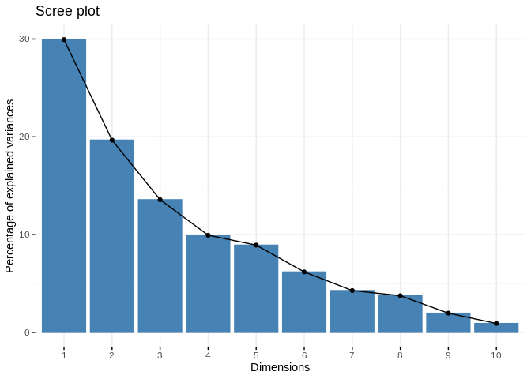
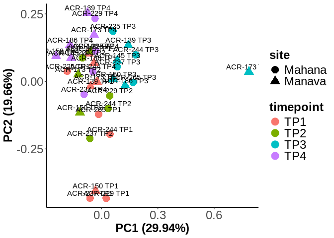
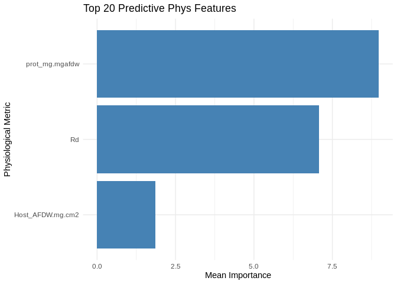
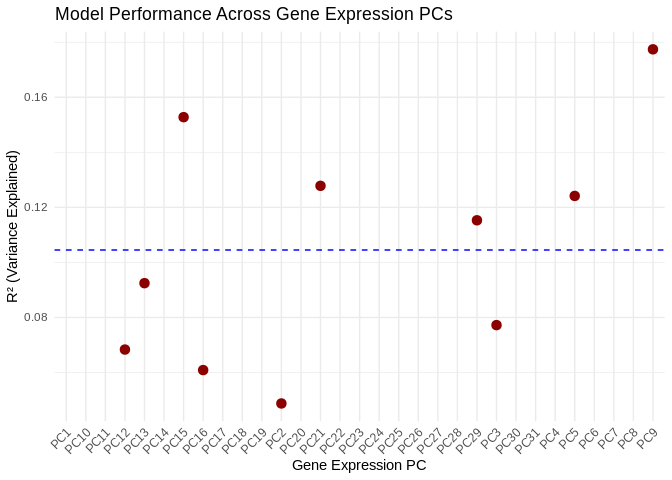
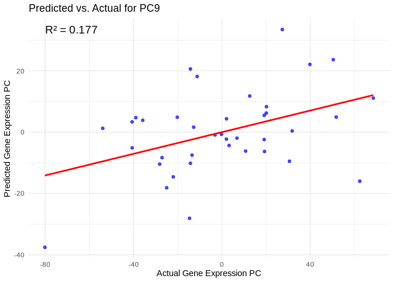
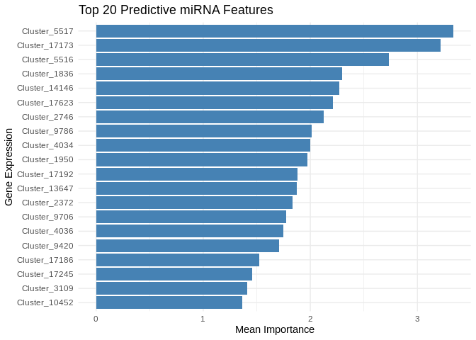
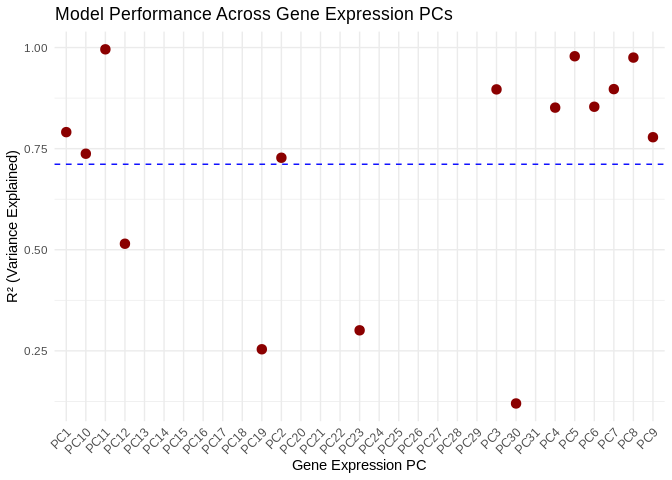
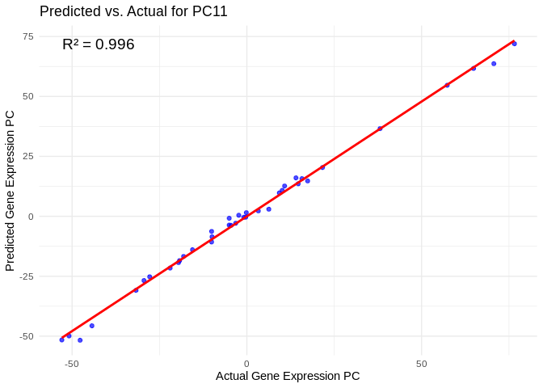
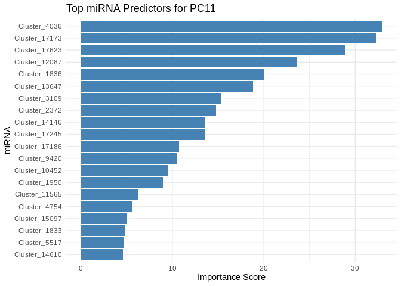

22-Apul-miRNA-mRNA-machine-learning
================
Kathleen Durkin
2025-03-31

- <a href="#1-load-libraries" id="toc-1-load-libraries">1 Load
  libraries</a>
- <a href="#2-load-and-prep-data" id="toc-2-load-and-prep-data">2 Load and
  prep data</a>
  - <a href="#21-counts-filtering" id="toc-21-counts-filtering">2.1 Counts
    filtering</a>
  - <a href="#22-physiology-filtering" id="toc-22-physiology-filtering">2.2
    Physiology filtering</a>
  - <a href="#23-assign-metadata-and-arrange-order-of-columns"
    id="toc-23-assign-metadata-and-arrange-order-of-columns">2.3 Assign
    metadata and arrange order of columns</a>
  - <a href="#24-conduct-variance-stabilized-transformation"
    id="toc-24-conduct-variance-stabilized-transformation">2.4 Conduct
    variance stabilized transformation</a>
    - <a href="#241-genes" id="toc-241-genes">2.4.1 Genes:</a>
    - <a href="#242-mirna" id="toc-242-mirna">2.4.2 miRNA:</a>
  - <a href="#25-combine-counts-data" id="toc-25-combine-counts-data">2.5
    Combine counts data</a>
- <a href="#3-feature-selection" id="toc-3-feature-selection">3 Feature
  selection</a>
  - <a href="#31-genes--mirna" id="toc-31-genes--mirna">3.1 Genes +
    miRNA</a>
  - <a href="#32-genes-only" id="toc-32-genes-only">3.2 Genes only</a>
  - <a href="#33-physiological-metrics"
    id="toc-33-physiological-metrics">3.3 Physiological metrics</a>
- <a href="#4-phenotype-to-predict-genemirna-expression"
  id="toc-4-phenotype-to-predict-genemirna-expression">4 Phenotype to
  predict gene/miRNA expression</a>
  - <a href="#41-the-model" id="toc-41-the-model">4.1 The model</a>
  - <a href="#42-results" id="toc-42-results">4.2 Results</a>
- <a href="#5-mirna-expression-to-predict-gene-expression"
  id="toc-5-mirna-expression-to-predict-gene-expression">5 miRNA
  expression to predict gene expression</a>
  - <a href="#51-the-model" id="toc-51-the-model">5.1 The model</a>
  - <a href="#52-results" id="toc-52-results">5.2 Results</a>

I’d like to see whether phenotype can predict gene and/or miRNA
expression, will be testing this using the ML approach Ariana has been
trialing (see her mRNA-WGBS ML post here:
<https://ahuffmyer.github.io/ASH_Putnam_Lab_Notebook/E5-timeseries-molecular-mRNA-WGBS-machine-learning-analysis-Part-1/>)

Inputs:

- RNA counts matrix (raw):
  `../output/02.20-D-Apul-RNAseq-alignment-HiSat2/apul-gene_count_matrix.csv`

- sRNA/miRNA counts matrix (raw):
  `../output/03.10-D-Apul-sRNAseq-expression-DESeq2/Apul_miRNA_ShortStack_counts_formatted.txt`

- sample metadata: `../../M-multi-species/data/rna_metadata.csv`

- physiological data:
  <https://github.com/urol-e5/timeseries/raw/refs/heads/master/time_series_analysis/Output/master_timeseries.csv>

Note that I’ll start by using phenotype (e.g. biomass, respiration) as
the predictor, which is suitable for understanding *how external factors
drive gene expression changes.*

If, instead, we wanted to build some sort of predictive model, where
*gene expression could be used to predict phenotype*, we could switch so
that gene counts are used as the predictors.

# 1 Load libraries

``` r
library(tidyverse)
```

    ## ── Attaching core tidyverse packages ──────────────────────── tidyverse 2.0.0 ──
    ## ✔ dplyr     1.1.4     ✔ readr     2.1.5
    ## ✔ forcats   1.0.0     ✔ stringr   1.5.1
    ## ✔ ggplot2   3.5.1     ✔ tibble    3.2.1
    ## ✔ lubridate 1.9.4     ✔ tidyr     1.3.1
    ## ✔ purrr     1.0.2     
    ## ── Conflicts ────────────────────────────────────────── tidyverse_conflicts() ──
    ## ✖ dplyr::filter() masks stats::filter()
    ## ✖ dplyr::lag()    masks stats::lag()
    ## ℹ Use the conflicted package (<http://conflicted.r-lib.org/>) to force all conflicts to become errors

``` r
library(ggplot2)
library(DESeq2)
```

    ## Loading required package: S4Vectors
    ## Loading required package: stats4
    ## Loading required package: BiocGenerics
    ## 
    ## Attaching package: 'BiocGenerics'
    ## 
    ## The following objects are masked from 'package:lubridate':
    ## 
    ##     intersect, setdiff, union
    ## 
    ## The following objects are masked from 'package:dplyr':
    ## 
    ##     combine, intersect, setdiff, union
    ## 
    ## The following objects are masked from 'package:stats':
    ## 
    ##     IQR, mad, sd, var, xtabs
    ## 
    ## The following objects are masked from 'package:base':
    ## 
    ##     anyDuplicated, aperm, append, as.data.frame, basename, cbind,
    ##     colnames, dirname, do.call, duplicated, eval, evalq, Filter, Find,
    ##     get, grep, grepl, intersect, is.unsorted, lapply, Map, mapply,
    ##     match, mget, order, paste, pmax, pmax.int, pmin, pmin.int,
    ##     Position, rank, rbind, Reduce, rownames, sapply, setdiff, sort,
    ##     table, tapply, union, unique, unsplit, which.max, which.min
    ## 
    ## 
    ## Attaching package: 'S4Vectors'
    ## 
    ## The following objects are masked from 'package:lubridate':
    ## 
    ##     second, second<-
    ## 
    ## The following objects are masked from 'package:dplyr':
    ## 
    ##     first, rename
    ## 
    ## The following object is masked from 'package:tidyr':
    ## 
    ##     expand
    ## 
    ## The following objects are masked from 'package:base':
    ## 
    ##     expand.grid, I, unname
    ## 
    ## Loading required package: IRanges
    ## 
    ## Attaching package: 'IRanges'
    ## 
    ## The following object is masked from 'package:lubridate':
    ## 
    ##     %within%
    ## 
    ## The following objects are masked from 'package:dplyr':
    ## 
    ##     collapse, desc, slice
    ## 
    ## The following object is masked from 'package:purrr':
    ## 
    ##     reduce
    ## 
    ## Loading required package: GenomicRanges
    ## Loading required package: GenomeInfoDb
    ## Loading required package: SummarizedExperiment
    ## Loading required package: MatrixGenerics
    ## Loading required package: matrixStats
    ## 
    ## Attaching package: 'matrixStats'
    ## 
    ## The following object is masked from 'package:dplyr':
    ## 
    ##     count
    ## 
    ## 
    ## Attaching package: 'MatrixGenerics'
    ## 
    ## The following objects are masked from 'package:matrixStats':
    ## 
    ##     colAlls, colAnyNAs, colAnys, colAvgsPerRowSet, colCollapse,
    ##     colCounts, colCummaxs, colCummins, colCumprods, colCumsums,
    ##     colDiffs, colIQRDiffs, colIQRs, colLogSumExps, colMadDiffs,
    ##     colMads, colMaxs, colMeans2, colMedians, colMins, colOrderStats,
    ##     colProds, colQuantiles, colRanges, colRanks, colSdDiffs, colSds,
    ##     colSums2, colTabulates, colVarDiffs, colVars, colWeightedMads,
    ##     colWeightedMeans, colWeightedMedians, colWeightedSds,
    ##     colWeightedVars, rowAlls, rowAnyNAs, rowAnys, rowAvgsPerColSet,
    ##     rowCollapse, rowCounts, rowCummaxs, rowCummins, rowCumprods,
    ##     rowCumsums, rowDiffs, rowIQRDiffs, rowIQRs, rowLogSumExps,
    ##     rowMadDiffs, rowMads, rowMaxs, rowMeans2, rowMedians, rowMins,
    ##     rowOrderStats, rowProds, rowQuantiles, rowRanges, rowRanks,
    ##     rowSdDiffs, rowSds, rowSums2, rowTabulates, rowVarDiffs, rowVars,
    ##     rowWeightedMads, rowWeightedMeans, rowWeightedMedians,
    ##     rowWeightedSds, rowWeightedVars
    ## 
    ## Loading required package: Biobase
    ## Welcome to Bioconductor
    ## 
    ##     Vignettes contain introductory material; view with
    ##     'browseVignettes()'. To cite Bioconductor, see
    ##     'citation("Biobase")', and for packages 'citation("pkgname")'.
    ## 
    ## 
    ## Attaching package: 'Biobase'
    ## 
    ## The following object is masked from 'package:MatrixGenerics':
    ## 
    ##     rowMedians
    ## 
    ## The following objects are masked from 'package:matrixStats':
    ## 
    ##     anyMissing, rowMedians

``` r
library(igraph)
```

    ## 
    ## Attaching package: 'igraph'
    ## 
    ## The following object is masked from 'package:GenomicRanges':
    ## 
    ##     union
    ## 
    ## The following object is masked from 'package:IRanges':
    ## 
    ##     union
    ## 
    ## The following object is masked from 'package:S4Vectors':
    ## 
    ##     union
    ## 
    ## The following objects are masked from 'package:BiocGenerics':
    ## 
    ##     normalize, path, union
    ## 
    ## The following objects are masked from 'package:lubridate':
    ## 
    ##     %--%, union
    ## 
    ## The following objects are masked from 'package:dplyr':
    ## 
    ##     as_data_frame, groups, union
    ## 
    ## The following objects are masked from 'package:purrr':
    ## 
    ##     compose, simplify
    ## 
    ## The following object is masked from 'package:tidyr':
    ## 
    ##     crossing
    ## 
    ## The following object is masked from 'package:tibble':
    ## 
    ##     as_data_frame
    ## 
    ## The following objects are masked from 'package:stats':
    ## 
    ##     decompose, spectrum
    ## 
    ## The following object is masked from 'package:base':
    ## 
    ##     union

``` r
library(psych)
```

    ## 
    ## Attaching package: 'psych'
    ## 
    ## The following object is masked from 'package:SummarizedExperiment':
    ## 
    ##     distance
    ## 
    ## The following object is masked from 'package:GenomicRanges':
    ## 
    ##     distance
    ## 
    ## The following objects are masked from 'package:IRanges':
    ## 
    ##     distance, reflect
    ## 
    ## The following objects are masked from 'package:ggplot2':
    ## 
    ##     %+%, alpha

``` r
library(tidygraph)
```

    ## 
    ## Attaching package: 'tidygraph'
    ## 
    ## The following object is masked from 'package:igraph':
    ## 
    ##     groups
    ## 
    ## The following objects are masked from 'package:IRanges':
    ## 
    ##     active, slice
    ## 
    ## The following objects are masked from 'package:S4Vectors':
    ## 
    ##     active, rename
    ## 
    ## The following object is masked from 'package:stats':
    ## 
    ##     filter

``` r
library(ggraph)
library(WGCNA)
```

    ## Loading required package: dynamicTreeCut
    ## Loading required package: fastcluster
    ## 
    ## Attaching package: 'fastcluster'
    ## 
    ## The following object is masked from 'package:stats':
    ## 
    ##     hclust
    ## 
    ## 
    ## 
    ## Attaching package: 'WGCNA'
    ## 
    ## The following object is masked from 'package:IRanges':
    ## 
    ##     cor
    ## 
    ## The following object is masked from 'package:S4Vectors':
    ## 
    ##     cor
    ## 
    ## The following object is masked from 'package:stats':
    ## 
    ##     cor

``` r
library(edgeR)
```

    ## Loading required package: limma
    ## 
    ## Attaching package: 'limma'
    ## 
    ## The following object is masked from 'package:DESeq2':
    ## 
    ##     plotMA
    ## 
    ## The following object is masked from 'package:BiocGenerics':
    ## 
    ##     plotMA

``` r
library(reshape2)
```

    ## 
    ## Attaching package: 'reshape2'
    ## 
    ## The following object is masked from 'package:tidyr':
    ## 
    ##     smiths

``` r
library(ggcorrplot)
library(corrplot)
```

    ## corrplot 0.94 loaded

``` r
library(rvest)
```

    ## 
    ## Attaching package: 'rvest'
    ## 
    ## The following object is masked from 'package:readr':
    ## 
    ##     guess_encoding

``` r
library(purrr)
library(pheatmap)
library(glmnet)
```

    ## Loading required package: Matrix
    ## 
    ## Attaching package: 'Matrix'
    ## 
    ## The following object is masked from 'package:S4Vectors':
    ## 
    ##     expand
    ## 
    ## The following objects are masked from 'package:tidyr':
    ## 
    ##     expand, pack, unpack
    ## 
    ## Loaded glmnet 4.1-8

``` r
library(caret)
```

    ## Loading required package: lattice
    ## 
    ## Attaching package: 'caret'
    ## 
    ## The following object is masked from 'package:purrr':
    ## 
    ##     lift

``` r
library(factoextra)
```

    ## Welcome! Want to learn more? See two factoextra-related books at https://goo.gl/ve3WBa

``` r
library(vegan)
```

    ## Loading required package: permute
    ## 
    ## Attaching package: 'permute'
    ## 
    ## The following object is masked from 'package:igraph':
    ## 
    ##     permute
    ## 
    ## This is vegan 2.6-8
    ## 
    ## Attaching package: 'vegan'
    ## 
    ## The following object is masked from 'package:caret':
    ## 
    ##     tolerance
    ## 
    ## The following object is masked from 'package:psych':
    ## 
    ##     pca
    ## 
    ## The following object is masked from 'package:igraph':
    ## 
    ##     diversity

``` r
library(ggfortify)
```

# 2 Load and prep data

Load in count matrices for RNAseq.

``` r
# raw gene counts data (will filter and variance stabilize)
Apul_genes <- read_csv("../output/02.20-D-Apul-RNAseq-alignment-HiSat2/apul-gene_count_matrix.csv")
```

    ## Rows: 44371 Columns: 41
    ## ── Column specification ────────────────────────────────────────────────────────
    ## Delimiter: ","
    ## chr  (1): gene_id
    ## dbl (40): 1A1, 1A10, 1A12, 1A2, 1A8, 1A9, 1B1, 1B10, 1B2, 1B5, 1B9, 1C10, 1C...
    ## 
    ## ℹ Use `spec()` to retrieve the full column specification for this data.
    ## ℹ Specify the column types or set `show_col_types = FALSE` to quiet this message.

``` r
Apul_genes <- as.data.frame(Apul_genes)

# format gene IDs as rownames (instead of a column)
rownames(Apul_genes) <- Apul_genes$gene_id
Apul_genes <- Apul_genes%>%select(!gene_id)


# load and format metadata
metadata <- read_csv("../../M-multi-species/data/rna_metadata.csv")%>%select(AzentaSampleName, ColonyID, Timepoint) %>%
  filter(grepl("ACR", ColonyID))
```

    ## New names:
    ## Rows: 117 Columns: 19
    ## ── Column specification
    ## ──────────────────────────────────────────────────────── Delimiter: "," chr
    ## (13): SampleName, WellNumber, AzentaSampleName, ColonyID, Timepoint, Sam... dbl
    ## (5): SampleNumber, Plate, TotalAmount-ng, Volume-uL, Conc-ng.uL lgl (1):
    ## MethodUsedForSpectrophotometry
    ## ℹ Use `spec()` to retrieve the full column specification for this data. ℹ
    ## Specify the column types or set `show_col_types = FALSE` to quiet this message.
    ## • `` -> `...19`

``` r
metadata$Sample <- paste(metadata$AzentaSampleName, metadata$ColonyID, metadata$Timepoint, sep = "_")

colonies <- unique(metadata$ColonyID)

# Load physiological data
phys<-read_csv("https://github.com/urol-e5/timeseries/raw/refs/heads/master/time_series_analysis/Output/master_timeseries.csv")%>%filter(colony_id_corr %in% colonies)%>%
  select(colony_id_corr, species, timepoint, site, Host_AFDW.mg.cm2, Sym_AFDW.mg.cm2, Am, AQY, Rd, Ik, Ic, calc.umol.cm2.hr, cells.mgAFDW, prot_mg.mgafdw, Ratio_AFDW.mg.cm2, Total_Chl, Total_Chl_cell, cre.umol.mgafdw)
```

    ## Rows: 448 Columns: 46
    ## ── Column specification ────────────────────────────────────────────────────────
    ## Delimiter: ","
    ## chr (10): colony_id, colony_id_corr, species, timepoint, month, site, nutrie...
    ## dbl (36): cre.umol.mgprot, Host_AFDW.mg.cm2, Sym_AFDW.mg.cm2, Host_DW.mg.cm2...
    ## 
    ## ℹ Use `spec()` to retrieve the full column specification for this data.
    ## ℹ Specify the column types or set `show_col_types = FALSE` to quiet this message.

``` r
# format timepoint
phys$timepoint <- gsub("timepoint", "TP", phys$timepoint)
#add column with full sample info
phys <- merge(phys, metadata, by.x = c("colony_id_corr", "timepoint"), by.y = c("ColonyID", "Timepoint")) %>%
  select(-AzentaSampleName)
  

#add site information into metadata 
metadata$Site<-phys$site[match(metadata$ColonyID, phys$colony_id_corr)]


# Rename gene column names to include full sample info (as in miRNA table)
colnames(Apul_genes) <- metadata$Sample[match(colnames(Apul_genes), metadata$AzentaSampleName)]

# raw miRNA counts (will filter and variance stabilize)
Apul_miRNA <- read.table(file = "../output/03.10-D-Apul-sRNAseq-expression-DESeq2/Apul_miRNA_ShortStack_counts_formatted.txt", header = TRUE, sep = "\t", check.names = FALSE)
```

## 2.1 Counts filtering

Ensure there are no genes or miRNAs with 0 counts across all samples.

``` r
nrow(Apul_genes)
```

    ## [1] 44371

``` r
Apul_genes_filt<-Apul_genes %>%
     mutate(Total = rowSums(.[, 1:40]))%>%
    filter(!Total==0)%>%
    dplyr::select(!Total)

nrow(Apul_genes_filt)
```

    ## [1] 35869

``` r
# miRNAs
nrow(Apul_miRNA)
```

    ## [1] 51

``` r
Apul_miRNA_filt<-Apul_miRNA %>%
     mutate(Total = rowSums(.[, 1:40]))%>%
    filter(!Total==0)%>%
    dplyr::select(!Total)

nrow(Apul_miRNA_filt)
```

    ## [1] 51

Removing genes with only 0 counts reduced number from 44371 to 35869.
Retained all 51 miRNAs.

Will not be performing pOverA filtering for now, since LM should
presumabily incorporate sample representation

## 2.2 Physiology filtering

Run PCA on physiology data to see if there are phys outliers

Export data for PERMANOVA test.

``` r
test<-as.data.frame(phys)
test<-test[complete.cases(test), ]
```

Build PERMANOVA model.

``` r
scaled_test <-prcomp(test%>%select(where(is.numeric)), scale=TRUE, center=TRUE)
fviz_eig(scaled_test)
```

<!-- -->

``` r
# scale data
vegan <- scale(test%>%select(where(is.numeric)))

# PerMANOVA 
permanova<-adonis2(vegan ~ timepoint*site, data = test, method='eu')
permanova
```

    ## Permutation test for adonis under reduced model
    ## Permutation: free
    ## Number of permutations: 999
    ## 
    ## adonis2(formula = vegan ~ timepoint * site, data = test, method = "eu")
    ##          Df SumOfSqs      R2      F Pr(>F)    
    ## Model     7   208.16 0.43731 2.9976  0.001 ***
    ## Residual 27   267.84 0.56269                  
    ## Total    34   476.00 1.00000                  
    ## ---
    ## Signif. codes:  0 '***' 0.001 '**' 0.01 '*' 0.05 '.' 0.1 ' ' 1

``` r
pca1<-ggplot2::autoplot(scaled_test, data=test, frame.colour="timepoint", loadings=FALSE,  colour="timepoint", shape="site", loadings.label.colour="black", loadings.colour="black", loadings.label=FALSE, frame=FALSE, loadings.label.size=5, loadings.label.vjust=-1, size=5) + 
  geom_text(aes(x = PC1, y = PC2, label = paste(colony_id_corr, timepoint)), vjust = -0.5)+
  theme_classic()+
   theme(legend.text = element_text(size=18), 
         legend.position="right",
        plot.background = element_blank(),
        legend.title = element_text(size=18, face="bold"), 
        axis.text = element_text(size=18), 
        axis.title = element_text(size=18,  face="bold"));pca1
```

<!-- -->

Remove ACR-173, timepoint 3 sample from analysis. This is Azenta sample
1B2.

``` r
Apul_genes_filt <- Apul_genes_filt %>%
  select(!`1B2_ACR-173_TP3`)

Apul_miRNA_filt <- Apul_miRNA_filt %>%
  select(!`1B2_ACR-173_TP3`)

metadata <- metadata %>%
  filter(Sample != "1B2_ACR-173_TP3")
```

We also do not have phys data for colony 1B9 ACR-265 at TP4, so I’ll
remove that here as well.

``` r
Apul_genes_filt <- Apul_genes_filt%>%
  select(!`1B9_ACR-265_TP4`)

Apul_miRNA_filt <- Apul_miRNA_filt%>%
  select(!`1B9_ACR-265_TP4`)

metadata <- metadata %>%
  filter(Sample != "1B9_ACR-265_TP4")
```

## 2.3 Assign metadata and arrange order of columns

Order metadata the same as the column order in the gene matrix.

``` r
list<-colnames(Apul_genes_filt)
list<-as.factor(list)

metadata$Sample<-as.factor(metadata$Sample)

# Re-order the levels
metadata$Sample <- factor(as.character(metadata$Sample), levels=list)
# Re-order the data.frame
metadata_ordered <- metadata[order(metadata$Sample),]
metadata_ordered$Sample
```

    ##  [1] 1A1_ACR-173_TP1  1A10_ACR-145_TP4 1A12_ACR-237_TP3 1A2_ACR-244_TP4 
    ##  [5] 1A8_ACR-186_TP2  1A9_ACR-244_TP2  1B1_ACR-225_TP3  1B10_ACR-150_TP4
    ##  [9] 1B5_ACR-229_TP1  1C10_ACR-173_TP4 1C4_ACR-139_TP4  1D10_ACR-265_TP2
    ## [13] 1D3_ACR-225_TP4  1D4_ACR-237_TP4  1D6_ACR-229_TP2  1D8_ACR-237_TP2 
    ## [17] 1D9_ACR-229_TP4  1E1_ACR-265_TP3  1E3_ACR-150_TP2  1E5_ACR-139_TP3 
    ## [21] 1E9_ACR-237_TP1  1F11_ACR-173_TP2 1F4_ACR-150_TP3  1F8_ACR-145_TP3 
    ## [25] 1G5_ACR-244_TP3  1H11_ACR-225_TP1 1H12_ACR-186_TP3 1H6_ACR-225_TP2 
    ## [29] 1H7_ACR-229_TP3  1H8_ACR-186_TP4  2B2_ACR-145_TP1  2B3_ACR-139_TP2 
    ## [33] 2C1_ACR-244_TP1  2C2_ACR-139_TP1  2D2_ACR-150_TP1  2E2_ACR-186_TP1 
    ## [37] 2F1_ACR-265_TP1  2G1_ACR-145_TP2 
    ## 38 Levels: 1A1_ACR-173_TP1 1A10_ACR-145_TP4 ... 2G1_ACR-145_TP2

``` r
# Make sure the miRNA colnames are also in the same order as the gene colnames
Apul_miRNA_filt <- Apul_miRNA_filt[, colnames(Apul_genes_filt)]
```

Metadata and gene count matrix are now ordered the same.

## 2.4 Conduct variance stabilized transformation

VST should be performed on our two input datasets (gene counts and miRNA
counts) separately

### 2.4.1 Genes:

``` r
#Set DESeq2 design
dds_genes <- DESeqDataSetFromMatrix(countData = Apul_genes_filt,
                              colData = metadata_ordered,
                              design = ~Timepoint+ColonyID)
```

    ## converting counts to integer mode

    ## Warning in DESeqDataSet(se, design = design, ignoreRank): some variables in
    ## design formula are characters, converting to factors

    ##   Note: levels of factors in the design contain characters other than
    ##   letters, numbers, '_' and '.'. It is recommended (but not required) to use
    ##   only letters, numbers, and delimiters '_' or '.', as these are safe characters
    ##   for column names in R. [This is a message, not a warning or an error]

Check size factors.

``` r
SF.dds_genes <- estimateSizeFactors(dds_genes) #estimate size factors to determine if we can use vst  to transform our data. Size factors should be less than 4 for us to use vst
```

    ##   Note: levels of factors in the design contain characters other than
    ##   letters, numbers, '_' and '.'. It is recommended (but not required) to use
    ##   only letters, numbers, and delimiters '_' or '.', as these are safe characters
    ##   for column names in R. [This is a message, not a warning or an error]

``` r
print(sizeFactors(SF.dds_genes)) #View size factors
```

    ##  1A1_ACR-173_TP1 1A10_ACR-145_TP4 1A12_ACR-237_TP3  1A2_ACR-244_TP4 
    ##        0.7568024        0.7700354        1.4234168        0.6403634 
    ##  1A8_ACR-186_TP2  1A9_ACR-244_TP2  1B1_ACR-225_TP3 1B10_ACR-150_TP4 
    ##        1.1214880        1.2047491        1.4207289        1.4020164 
    ##  1B5_ACR-229_TP1 1C10_ACR-173_TP4  1C4_ACR-139_TP4 1D10_ACR-265_TP2 
    ##        1.6051212        0.7138877        1.1896990        1.1370395 
    ##  1D3_ACR-225_TP4  1D4_ACR-237_TP4  1D6_ACR-229_TP2  1D8_ACR-237_TP2 
    ##        0.6728303        1.0536139        1.0902785        0.8698195 
    ##  1D9_ACR-229_TP4  1E1_ACR-265_TP3  1E3_ACR-150_TP2  1E5_ACR-139_TP3 
    ##        0.6692241        1.0722951        1.1788615        1.2207644 
    ##  1E9_ACR-237_TP1 1F11_ACR-173_TP2  1F4_ACR-150_TP3  1F8_ACR-145_TP3 
    ##        1.0408338        1.0442345        1.4020713        0.7941250 
    ##  1G5_ACR-244_TP3 1H11_ACR-225_TP1 1H12_ACR-186_TP3  1H6_ACR-225_TP2 
    ##        1.6118118        1.4234168        0.6115323        0.7941250 
    ##  1H7_ACR-229_TP3  1H8_ACR-186_TP4  2B2_ACR-145_TP1  2B3_ACR-139_TP2 
    ##        1.3288255        1.2192334        1.1021148        1.4414683 
    ##  2C1_ACR-244_TP1  2C2_ACR-139_TP1  2D2_ACR-150_TP1  2E2_ACR-186_TP1 
    ##        0.6638831        1.1950136        0.7798443        0.6222376 
    ##  2F1_ACR-265_TP1  2G1_ACR-145_TP2 
    ##        0.9538723        0.8204576

``` r
all(sizeFactors(SF.dds_genes)) < 4
```

    ## Warning in all(sizeFactors(SF.dds_genes)): coercing argument of type 'double'
    ## to logical

    ## [1] TRUE

All size factors are less than 4, so we can use VST transformation.

``` r
vsd_genes <- vst(dds_genes, blind=TRUE) #apply a variance stabilizing transformation to minimize effects of small counts and normalize with respect to library size
vsd_genes <- assay(vsd_genes)
head(vsd_genes, 3) #view transformed gene count data for the first three genes in the dataset.  
```

    ##            1A1_ACR-173_TP1 1A10_ACR-145_TP4 1A12_ACR-237_TP3 1A2_ACR-244_TP4
    ## FUN_002326        6.207893         6.133639         5.751040        5.403964
    ## FUN_002315        4.946774         5.242300         5.164311        4.946774
    ## FUN_002316        4.946774         4.946774         5.164311        4.946774
    ##            1A8_ACR-186_TP2 1A9_ACR-244_TP2 1B1_ACR-225_TP3 1B10_ACR-150_TP4
    ## FUN_002326        5.292863        5.280744        5.779288         5.698269
    ## FUN_002315        4.946774        4.946774        4.946774         4.946774
    ## FUN_002316        4.946774        4.946774        4.946774         4.946774
    ##            1B5_ACR-229_TP1 1C10_ACR-173_TP4 1C4_ACR-139_TP4 1D10_ACR-265_TP2
    ## FUN_002326        5.151650         6.142146        5.282841         5.670053
    ## FUN_002315        4.946774         4.946774        4.946774         4.946774
    ## FUN_002316        4.946774         4.946774        4.946774         5.190111
    ##            1D3_ACR-225_TP4 1D4_ACR-237_TP4 1D6_ACR-229_TP2 1D8_ACR-237_TP2
    ## FUN_002326        5.975256        6.102690        5.195262        5.931837
    ## FUN_002315        4.946774        4.946774        4.946774        4.946774
    ## FUN_002316        4.946774        4.946774        5.195262        5.224889
    ##            1D9_ACR-229_TP4 1E1_ACR-265_TP3 1E3_ACR-150_TP2 1E5_ACR-139_TP3
    ## FUN_002326        5.263696        5.556731        5.284375        5.352679
    ## FUN_002315        4.946774        4.946774        4.946774        4.946774
    ## FUN_002316        4.946774        4.946774        4.946774        4.946774
    ##            1E9_ACR-237_TP1 1F11_ACR-173_TP2 1F4_ACR-150_TP3 1F8_ACR-145_TP3
    ## FUN_002326        5.974779         5.613433        5.698254        5.808464
    ## FUN_002315        4.946774         5.200667        4.946774        4.946774
    ## FUN_002316        4.946774         5.305373        4.946774        4.946774
    ##            1G5_ACR-244_TP3 1H11_ACR-225_TP1 1H12_ACR-186_TP3 1H6_ACR-225_TP2
    ## FUN_002326        5.235671         5.751040         5.414526        5.808464
    ## FUN_002315        4.946774         5.164311         4.946774        4.946774
    ## FUN_002316        4.946774         5.164311         4.946774        4.946774
    ##            1H7_ACR-229_TP3 1H8_ACR-186_TP4 2B2_ACR-145_TP1 2B3_ACR-139_TP2
    ## FUN_002326        5.171905        5.278764        5.756809        5.320502
    ## FUN_002315        4.946774        4.946774        4.946774        4.946774
    ## FUN_002316        4.946774        4.946774        4.946774        4.946774
    ##            2C1_ACR-244_TP1 2C2_ACR-139_TP1 2D2_ACR-150_TP1 2E2_ACR-186_TP1
    ## FUN_002326        5.395858        5.357000        6.360417        5.410519
    ## FUN_002315        4.946774        4.946774        4.946774        4.946774
    ## FUN_002316        4.946774        4.946774        4.946774        4.946774
    ##            2F1_ACR-265_TP1 2G1_ACR-145_TP2
    ## FUN_002326        6.077068        5.582917
    ## FUN_002315        4.946774        4.946774
    ## FUN_002316        4.946774        5.351050

### 2.4.2 miRNA:

``` r
#Set DESeq2 design
dds_miRNA <- DESeqDataSetFromMatrix(countData = Apul_miRNA_filt,
                              colData = metadata_ordered,
                              design = ~Timepoint+ColonyID)
```

    ## Warning in DESeqDataSet(se, design = design, ignoreRank): some variables in
    ## design formula are characters, converting to factors

    ##   Note: levels of factors in the design contain characters other than
    ##   letters, numbers, '_' and '.'. It is recommended (but not required) to use
    ##   only letters, numbers, and delimiters '_' or '.', as these are safe characters
    ##   for column names in R. [This is a message, not a warning or an error]

Check size factors.

``` r
SF.dds_miRNA <- estimateSizeFactors(dds_miRNA) #estimate size factors to determine if we can use vst  to transform our data. Size factors should be less than 4 for us to use vst
```

    ##   Note: levels of factors in the design contain characters other than
    ##   letters, numbers, '_' and '.'. It is recommended (but not required) to use
    ##   only letters, numbers, and delimiters '_' or '.', as these are safe characters
    ##   for column names in R. [This is a message, not a warning or an error]

``` r
print(sizeFactors(SF.dds_miRNA)) #View size factors
```

    ##  1A1_ACR-173_TP1 1A10_ACR-145_TP4 1A12_ACR-237_TP3  1A2_ACR-244_TP4 
    ##        1.4375773        0.4873497        1.1278371        1.3906883 
    ##  1A8_ACR-186_TP2  1A9_ACR-244_TP2  1B1_ACR-225_TP3 1B10_ACR-150_TP4 
    ##        1.4576506        3.6175606        0.6314484        0.5933158 
    ##  1B5_ACR-229_TP1 1C10_ACR-173_TP4  1C4_ACR-139_TP4 1D10_ACR-265_TP2 
    ##        3.4568168        0.3494818        0.2635332        1.6883200 
    ##  1D3_ACR-225_TP4  1D4_ACR-237_TP4  1D6_ACR-229_TP2  1D8_ACR-237_TP2 
    ##        3.3510894        1.6862052        3.0187618        1.6095839 
    ##  1D9_ACR-229_TP4  1E1_ACR-265_TP3  1E3_ACR-150_TP2  1E5_ACR-139_TP3 
    ##        1.6452632        0.4710913        2.5273448        0.1018135 
    ##  1E9_ACR-237_TP1 1F11_ACR-173_TP2  1F4_ACR-150_TP3  1F8_ACR-145_TP3 
    ##        0.8833733        1.4438548        1.9140909        0.3982620 
    ##  1G5_ACR-244_TP3 1H11_ACR-225_TP1 1H12_ACR-186_TP3  1H6_ACR-225_TP2 
    ##        2.2537502        0.8044495        0.4593767        1.8545938 
    ##  1H7_ACR-229_TP3  1H8_ACR-186_TP4  2B2_ACR-145_TP1  2B3_ACR-139_TP2 
    ##        1.0932705        0.8296064        0.8877596        1.8683207 
    ##  2C1_ACR-244_TP1  2C2_ACR-139_TP1  2D2_ACR-150_TP1  2E2_ACR-186_TP1 
    ##        1.1967504        1.3986634        0.5117454        0.3091478 
    ##  2F1_ACR-265_TP1  2G1_ACR-145_TP2 
    ##        0.2926522        1.8710888

``` r
all(sizeFactors(SF.dds_miRNA)) < 4
```

    ## Warning in all(sizeFactors(SF.dds_miRNA)): coercing argument of type 'double'
    ## to logical

    ## [1] TRUE

All size factors are less than 4, so we can use VST transformation.

``` r
vsd_miRNA <- varianceStabilizingTransformation(dds_miRNA, blind=TRUE) #apply a variance stabilizing transformation to minimize effects of small counts and normalize with respect to library size. Using varianceStabilizingTransformation() instead of vst() because few input genes
```

    ##   Note: levels of factors in the design contain characters other than
    ##   letters, numbers, '_' and '.'. It is recommended (but not required) to use
    ##   only letters, numbers, and delimiters '_' or '.', as these are safe characters
    ##   for column names in R. [This is a message, not a warning or an error]

``` r
vsd_miRNA <- assay(vsd_miRNA)
head(vsd_miRNA, 3) #view transformed gene count data for the first three genes in the dataset.
```

    ##              1A1_ACR-173_TP1 1A10_ACR-145_TP4 1A12_ACR-237_TP3 1A2_ACR-244_TP4
    ## Cluster_1819        6.241577         6.333406         5.156288        5.908382
    ## Cluster_1832       10.316256         9.391572         8.609063        9.421515
    ## Cluster_1833        5.019572         5.227543         5.666254        4.708296
    ##              1A8_ACR-186_TP2 1A9_ACR-244_TP2 1B1_ACR-225_TP3 1B10_ACR-150_TP4
    ## Cluster_1819        5.961721        6.625229        5.117430         4.816702
    ## Cluster_1832        9.738252        9.242548        9.850665         8.546454
    ## Cluster_1833        3.036811        1.259803        5.567643         3.858641
    ##              1B5_ACR-229_TP1 1C10_ACR-173_TP4 1C4_ACR-139_TP4 1D10_ACR-265_TP2
    ## Cluster_1819        5.993518         5.812294        5.412800         5.943860
    ## Cluster_1832       10.008435         9.403449        9.653634         8.534568
    ## Cluster_1833        5.542640         3.692640        5.755228         1.259803
    ##              1D3_ACR-225_TP4 1D4_ACR-237_TP4 1D6_ACR-229_TP2 1D8_ACR-237_TP2
    ## Cluster_1819        4.599786        4.853289        6.114836        5.781585
    ## Cluster_1832        9.763673        9.191750        9.883012        8.663557
    ## Cluster_1833        4.861042        5.917452        3.840651        5.324054
    ##              1D9_ACR-229_TP4 1E1_ACR-265_TP3 1E3_ACR-150_TP2 1E5_ACR-139_TP3
    ## Cluster_1819        5.484665        5.491651        6.223934        4.596699
    ## Cluster_1832        9.392642        9.147975        9.048323        8.803360
    ## Cluster_1833        3.534570        5.622057        1.259803        1.259803
    ##              1E9_ACR-237_TP1 1F11_ACR-173_TP2 1F4_ACR-150_TP3 1F8_ACR-145_TP3
    ## Cluster_1819        4.704752         6.036720        5.082222        5.964592
    ## Cluster_1832        8.369793        10.053070        8.644804        9.082451
    ## Cluster_1833        4.704752         4.401916        3.394119        4.466381
    ##              1G5_ACR-244_TP3 1H11_ACR-225_TP1 1H12_ACR-186_TP3 1H6_ACR-225_TP2
    ## Cluster_1819        5.549014         4.752323         6.258346        4.904013
    ## Cluster_1832       10.258012         9.575661         9.907531        9.859495
    ## Cluster_1833        1.259803         4.880505         4.834599        4.646739
    ##              1H7_ACR-229_TP3 1H8_ACR-186_TP4 2B2_ACR-145_TP1 2B3_ACR-139_TP2
    ## Cluster_1819        5.655634        5.262690        5.761459        5.359165
    ## Cluster_1832        9.533533       10.045883        8.055823        9.894246
    ## Cluster_1833        3.853406        5.789521        1.259803        3.808839
    ##              2C1_ACR-244_TP1 2C2_ACR-139_TP1 2D2_ACR-150_TP1 2E2_ACR-186_TP1
    ## Cluster_1819        5.708977        5.336131        5.574679        6.363739
    ## Cluster_1832        9.373366        9.647408        8.160674        9.424801
    ## Cluster_1833        5.613494        4.438563        3.600868        1.259803
    ##              2F1_ACR-265_TP1 2G1_ACR-145_TP2
    ## Cluster_1819        5.891542        5.239293
    ## Cluster_1832        9.202346        9.119796
    ## Cluster_1833        1.259803        4.241552

## 2.5 Combine counts data

``` r
# Extract variance stabilized counts as dataframes
# want samples in rows, genes/miRNAs in columns
vsd_genes <- as.data.frame(t(vsd_genes))
vsd_miRNA <- as.data.frame(t(vsd_miRNA))

# Double check the row names (sample names) are in same order
rownames(vsd_genes) == rownames(vsd_miRNA)
```

    ##  [1] TRUE TRUE TRUE TRUE TRUE TRUE TRUE TRUE TRUE TRUE TRUE TRUE TRUE TRUE TRUE
    ## [16] TRUE TRUE TRUE TRUE TRUE TRUE TRUE TRUE TRUE TRUE TRUE TRUE TRUE TRUE TRUE
    ## [31] TRUE TRUE TRUE TRUE TRUE TRUE TRUE TRUE

``` r
# Combine vst gene counts and vst miRNA counts by rows (sample names)
vsd_merged <- cbind(vsd_genes, vsd_miRNA)
```

# 3 Feature selection

## 3.1 Genes + miRNA

We have a large number of genes, so we’ll reduce dimensionality using
PCA. Note that, since we only have a few phenotypes of interest, we
don’t need to reduce this dataset

First need to remove any genes/miRNA that are invariant

``` r
vsd_merged_filt <- vsd_merged[, apply(vsd_merged, 2, var) > 0]

ncol(vsd_merged)
```

    ## [1] 35920

``` r
ncol(vsd_merged_filt)
```

    ## [1] 35846

``` r
colnames(vsd_merged[, apply(vsd_merged, 2, var) == 0])
```

    ##  [1] "FUN_002873" "FUN_000675" "FUN_000696" "FUN_000732" "FUN_000780"
    ##  [6] "FUN_000804" "FUN_000805" "FUN_000808" "FUN_000840" "FUN_000841"
    ## [11] "FUN_000936" "FUN_001813" "FUN_005801" "FUN_006990" "FUN_006991"
    ## [16] "FUN_008788" "FUN_009193" "FUN_011084" "FUN_013317" "FUN_013915"
    ## [21] "FUN_015197" "FUN_016825" "FUN_019362" "FUN_019400" "FUN_023532"
    ## [26] "FUN_025493" "FUN_026386" "FUN_026452" "FUN_027886" "FUN_030163"
    ## [31] "FUN_032965" "FUN_033045" "FUN_034668" "FUN_035219" "FUN_035616"
    ## [36] "FUN_035884" "FUN_036141" "FUN_036423" "FUN_039232" "FUN_039257"
    ## [41] "FUN_040044" "FUN_040130" "FUN_042351" "FUN_043742" "FUN_003407"
    ## [46] "FUN_007954" "FUN_010106" "FUN_011370" "FUN_013836" "FUN_015936"
    ## [51] "FUN_019027" "FUN_020080" "FUN_020084" "FUN_020088" "FUN_020639"
    ## [56] "FUN_020669" "FUN_020695" "FUN_020713" "FUN_020719" "FUN_020915"
    ## [61] "FUN_021209" "FUN_021247" "FUN_021265" "FUN_021271" "FUN_021274"
    ## [66] "FUN_021313" "FUN_021316" "FUN_021367" "FUN_021391" "FUN_021394"
    ## [71] "FUN_021427" "FUN_037387" "FUN_038781" "FUN_042170"

Removed 74 invariant genes. I was worried we lost miRNA, but it looks
like everything removed was a gene (prefix “FUN”)!

Reduce dimensionality (genes+miRNA)

``` r
# Perform PCA on gene+miRNA expression matrix
pca_merged <- prcomp(vsd_merged_filt, scale. = TRUE)

# Select top PCs that explain most variance (e.g., top 50 PCs)
explained_var <- summary(pca_merged)$importance[2, ]  # Cumulative variance explained
num_pcs <- min(which(cumsum(explained_var) > 0.95))  # Keep PCs that explain 95% variance

merged_pcs <- as.data.frame(pca_merged$x[, 1:num_pcs])  # Extract selected PCs

dim(merged_pcs)
```

    ## [1] 38 31

We have 27 gene/miRNA expression PCs

## 3.2 Genes only

To investigate gene expression separately from miRNA expression, reduce
dimensionality of genes alone.

Remove any genes that are invariant

``` r
vsd_genes_filt <- vsd_genes[, apply(vsd_genes, 2, var) > 0]

ncol(vsd_genes)
```

    ## [1] 35869

``` r
ncol(vsd_genes_filt)
```

    ## [1] 35795

Removed 74 invariant genes.

Reduce dimensionality

``` r
# Perform PCA on gene expression matrix
pca_genes <- prcomp(vsd_genes_filt, scale. = TRUE)

# Select top PCs that explain most variance (e.g., top 50 PCs)
explained_var_genes <- summary(pca_genes)$importance[2, ]  # Cumulative variance explained
num_pcs_genes <- min(which(cumsum(explained_var_genes) > 0.95))  # Keep PCs that explain 95% variance

genes_pcs <- as.data.frame(pca_genes$x[, 1:num_pcs_genes])  # Extract selected PCs

dim(genes_pcs)
```

    ## [1] 38 31

## 3.3 Physiological metrics

Select physiological metrics of interest. For now we’ll focus on biomass
(“Host_AFDW.mg.cm2”), protein (“prot_mg.mgafdw”), and respiration
(“Rd”). These are all metrics of host energy storage and expenditure.

``` r
# Assign sample IDs to row names
rownames(phys) <- phys$Sample

# Select metrics
phys_selection <- phys %>% select(Host_AFDW.mg.cm2, prot_mg.mgafdw, Rd)

# Make sure the phys rownames are in the same order as the gene/miRNA rownames
phys_selection <- phys_selection[rownames(merged_pcs),]
```

# 4 Phenotype to predict gene/miRNA expression

## 4.1 The model

Train elastic models to predict gene expression PCs from phys data.

``` r
train_models <- function(response_pcs, predictor_pcs) {
  models <- list()
  
  for (pc in colnames(response_pcs)) {
    y <- response_pcs[[pc]]  # Gene expression PC
    X <- as.matrix(predictor_pcs)  # Phys as predictors
    
    # Train elastic net model (alpha = 0.5 for mix of LASSO & Ridge)
    model <- cv.glmnet(X, y, alpha = 0.5)
    
    models[[pc]] <- model
  }
  
  return(models)
}

# Train models predicting gene expression PCs from phys data
models <- train_models(merged_pcs, phys_selection)
```

Extract feature importance.

``` r
get_feature_importance <- function(models) {
  importance_list <- lapply(models, function(model) {
    coefs <- as.matrix(coef(model, s = "lambda.min"))[-1, , drop = FALSE]  # Convert to regular matrix & remove intercept
    
    # Convert to data frame
    coefs_df <- data.frame(Feature = rownames(coefs), Importance = as.numeric(coefs))
    
    return(coefs_df)
  })
  
  # Combine feature importance across all predicted gene PCs
  importance_df <- bind_rows(importance_list) %>%
    group_by(Feature) %>%
    summarize(MeanImportance = mean(abs(Importance)), .groups = "drop") %>%
    arrange(desc(MeanImportance))
  
  return(importance_df)
}

feature_importance <- get_feature_importance(models)
head(feature_importance, 20)  # Top predictive phys features
```

    ## # A tibble: 3 × 2
    ##   Feature          MeanImportance
    ##   <chr>                     <dbl>
    ## 1 prot_mg.mgafdw             8.97
    ## 2 Rd                         7.08
    ## 3 Host_AFDW.mg.cm2           1.86

Evaluate performance.

``` r
evaluate_model_performance <- function(models, response_pcs, predictor_pcs) {
  results <- data.frame(PC = colnames(response_pcs), R2 = NA)
  
  for (pc in colnames(response_pcs)) {
    y <- response_pcs[[pc]]
    X <- as.matrix(predictor_pcs)
    
    model <- models[[pc]]
    preds <- predict(model, X, s = "lambda.min")
    
    R2 <- cor(y, preds)^2  # R-squared metric
    results[results$PC == pc, "R2"] <- R2
  }
  
  return(results)
}

performance_results <- evaluate_model_performance(models, merged_pcs, phys_selection)
summary(performance_results$R2)
```

    ##    Min. 1st Qu.  Median    Mean 3rd Qu.    Max.    NA's 
    ## 0.04877 0.07057 0.10389 0.10452 0.12691 0.17742      21

## 4.2 Results

Plot results.

``` r
# Select top 20 predictive phys features
top_features <- feature_importance %>% top_n(20, MeanImportance)

# Plot
ggplot(top_features, aes(x = reorder(Feature, MeanImportance), y = MeanImportance)) +
  geom_bar(stat = "identity", fill = "steelblue") +
  coord_flip() +  # Flip for readability
  theme_minimal() +
  labs(title = "Top 20 Predictive Phys Features",
       x = "Physiological Metric",
       y = "Mean Importance")
```

<!-- -->

``` r
ggplot(performance_results, aes(x = PC, y = R2)) +
  geom_point(color = "darkred", size = 3) +
  geom_hline(yintercept = mean(performance_results$R2, na.rm = TRUE), linetype = "dashed", color = "blue") +
  theme_minimal() +
  labs(title = "Model Performance Across Gene Expression PCs",
       x = "Gene Expression PC",
       y = "R² (Variance Explained)") +
  theme(axis.text.x = element_text(angle = 45, hjust = 1))  # Rotate labels
```

    ## Warning: Removed 21 rows containing missing values or values outside the scale range
    ## (`geom_point()`).

<!-- -->

Keep in mind that, while we ran the model with physiological predictors,
we’re really interested in the genes/miRNA associated with these
predictors

View components associated with gene/miRNA PCs

``` r
# Get the PCA rotation (loadings) matrix from the original gene/miRNA PCA
merged_loadings <- pca_merged$rotation  # Each column corresponds to a PC

# Convert to data frame and reshape for plotting
merged_loadings_df <- as.data.frame(merged_loadings) %>%
  rownames_to_column(var = "gene_miRNA") %>%
  pivot_longer(-gene_miRNA, names_to = "Merged_PC", values_to = "Loading")

# View top CpGs contributing most to each PC
top_genes <- merged_loadings_df %>%
  group_by(Merged_PC) %>%
  arrange(desc(abs(Loading))) %>%
  slice_head(n = 20)  # Select top 10 CpGs per PC

print(top_genes)
```

    ## # A tibble: 760 × 3
    ## # Groups:   Merged_PC [38]
    ##    gene_miRNA Merged_PC Loading
    ##    <chr>      <chr>       <dbl>
    ##  1 FUN_007064 PC1       -0.0129
    ##  2 FUN_014752 PC1       -0.0129
    ##  3 FUN_015256 PC1       -0.0129
    ##  4 FUN_008915 PC1       -0.0129
    ##  5 FUN_034091 PC1       -0.0129
    ##  6 FUN_034489 PC1       -0.0129
    ##  7 FUN_038509 PC1       -0.0129
    ##  8 FUN_014524 PC1       -0.0129
    ##  9 FUN_033051 PC1       -0.0129
    ## 10 FUN_001532 PC1       -0.0129
    ## # ℹ 750 more rows

View top 20 miRNA/genes associated with PC9 (the PC with the highest
R^2)

``` r
print(top_genes%>%filter(Merged_PC=="PC9"))
```

    ## # A tibble: 20 × 3
    ## # Groups:   Merged_PC [1]
    ##    gene_miRNA   Merged_PC Loading
    ##    <chr>        <chr>       <dbl>
    ##  1 FUN_023262   PC9       -0.0227
    ##  2 FUN_016918   PC9        0.0198
    ##  3 FUN_007014   PC9       -0.0194
    ##  4 FUN_031632   PC9        0.0192
    ##  5 FUN_035523   PC9        0.0188
    ##  6 FUN_041996   PC9        0.0188
    ##  7 FUN_006731   PC9       -0.0186
    ##  8 FUN_022897   PC9       -0.0185
    ##  9 FUN_043835   PC9        0.0184
    ## 10 FUN_004465   PC9        0.0183
    ## 11 FUN_014188   PC9       -0.0183
    ## 12 FUN_034114   PC9       -0.0181
    ## 13 FUN_024741   PC9       -0.0181
    ## 14 FUN_006446   PC9       -0.0179
    ## 15 FUN_018629   PC9       -0.0178
    ## 16 FUN_013857   PC9       -0.0178
    ## 17 Cluster_4034 PC9        0.0176
    ## 18 FUN_039308   PC9       -0.0175
    ## 19 FUN_012117   PC9        0.0175
    ## 20 FUN_000459   PC9       -0.0174

Interesting, there’s an miRNA in there!

View predicted vs actual gene expression values to evaluate model.

``` r
# Choose a gene expression PC to visualize (e.g., the most predictable one)
best_pc <- performance_results$PC[which.max(performance_results$R2)]

# Extract actual and predicted values for that PC
actual_values <- merged_pcs[[best_pc]]
predicted_values <- predict(models[[best_pc]], as.matrix(phys_selection), s = "lambda.min")

# Create data frame
prediction_df <- data.frame(
  Actual = actual_values,
  Predicted = predicted_values
)

# Scatter plot with regression line
ggplot(prediction_df, aes(x = Actual, y = lambda.min)) +
  geom_point(color = "blue", alpha = 0.7) +
  geom_smooth(method = "lm", color = "red", se = FALSE) +
  theme_minimal() +
  labs(title = paste("Predicted vs. Actual for", best_pc),
       x = "Actual Gene Expression PC",
       y = "Predicted Gene Expression PC") +
  annotate("text", x = min(actual_values), y = max(predicted_values), 
           label = paste("R² =", round(max(performance_results$R2, na.rm=TRUE), 3)), 
           hjust = 0, color = "black", size = 5)
```

    ## `geom_smooth()` using formula = 'y ~ x'

<!-- -->

``` r
## `geom_smooth()` using formula = 'y ~ x'
```

# 5 miRNA expression to predict gene expression

## 5.1 The model

Train elastic models to predict gene expression PCs from phys data.

``` r
# Train models predicting gene expression PCs from phys data
models2 <- train_models(genes_pcs, vsd_miRNA)
```

Extract feature importance.

``` r
feature_importance2 <- get_feature_importance(models2)
head(feature_importance2, 20)  # Top predictive phys features
```

    ## # A tibble: 20 × 2
    ##    Feature       MeanImportance
    ##    <chr>                  <dbl>
    ##  1 Cluster_5517            3.33
    ##  2 Cluster_17173           3.22
    ##  3 Cluster_5516            2.73
    ##  4 Cluster_1836            2.30
    ##  5 Cluster_14146           2.27
    ##  6 Cluster_17623           2.21
    ##  7 Cluster_2746            2.13
    ##  8 Cluster_9786            2.01
    ##  9 Cluster_4034            2.00
    ## 10 Cluster_1950            1.97
    ## 11 Cluster_17192           1.88
    ## 12 Cluster_13647           1.87
    ## 13 Cluster_2372            1.83
    ## 14 Cluster_9706            1.77
    ## 15 Cluster_4036            1.75
    ## 16 Cluster_9420            1.71
    ## 17 Cluster_17186           1.52
    ## 18 Cluster_17245           1.46
    ## 19 Cluster_3109            1.41
    ## 20 Cluster_10452           1.37

Evaluate performance.

``` r
performance_results2 <- evaluate_model_performance(models2, genes_pcs, vsd_miRNA)
summary(performance_results2$R2)
```

    ##    Min. 1st Qu.  Median    Mean 3rd Qu.    Max.    NA's 
    ##  0.1198  0.6212  0.7909  0.7115  0.8969  0.9957      16

## 5.2 Results

Plot results.

``` r
# Select top 20 predictive phys features
top_features2 <- feature_importance2 %>% top_n(20, MeanImportance)

# Plot
ggplot(top_features2, aes(x = reorder(Feature, MeanImportance), y = MeanImportance)) +
  geom_bar(stat = "identity", fill = "steelblue") +
  coord_flip() +  # Flip for readability
  theme_minimal() +
  labs(title = "Top 20 Predictive miRNA Features",
       x = "Gene Expression",
       y = "Mean Importance")
```

<!-- -->

``` r
ggplot(performance_results2, aes(x = PC, y = R2)) +
  geom_point(color = "darkred", size = 3) +
  geom_hline(yintercept = mean(performance_results2$R2, na.rm = TRUE), linetype = "dashed", color = "blue") +
  theme_minimal() +
  labs(title = "Model Performance Across Gene Expression PCs",
       x = "Gene Expression PC",
       y = "R² (Variance Explained)") +
  theme(axis.text.x = element_text(angle = 45, hjust = 1))  # Rotate labels
```

    ## Warning: Removed 16 rows containing missing values or values outside the scale range
    ## (`geom_point()`).

<!-- -->

View components associated with gene PCs

``` r
# Get the PCA rotation (loadings) matrix from the original gene PCA
genes_loadings <- pca_genes$rotation  # Each column corresponds to a PC

# Convert to data frame and reshape for plotting
genes_loadings_df <- as.data.frame(genes_loadings) %>%
  rownames_to_column(var = "gene") %>%
  pivot_longer(-gene, names_to = "Genes_PC", values_to = "Loading")

# View top genes contributing most to each PC
top_genes2 <- genes_loadings_df %>%
  group_by(Genes_PC) %>%
  arrange(desc(abs(Loading))) %>%
  slice_head(n = 20)  # Select top 10 CpGs per PC

print(top_genes2)
```

    ## # A tibble: 760 × 3
    ## # Groups:   Genes_PC [38]
    ##    gene       Genes_PC Loading
    ##    <chr>      <chr>      <dbl>
    ##  1 FUN_007064 PC1      -0.0129
    ##  2 FUN_014752 PC1      -0.0129
    ##  3 FUN_015256 PC1      -0.0129
    ##  4 FUN_008915 PC1      -0.0129
    ##  5 FUN_034091 PC1      -0.0129
    ##  6 FUN_034489 PC1      -0.0129
    ##  7 FUN_038509 PC1      -0.0129
    ##  8 FUN_014524 PC1      -0.0129
    ##  9 FUN_033051 PC1      -0.0129
    ## 10 FUN_001532 PC1      -0.0129
    ## # ℹ 750 more rows

View top 20 genes associated with PC11 (the most “predictable” PC, with
the highest R^2)

``` r
print(top_genes2%>%filter(Genes_PC=="PC11"))
```

    ## # A tibble: 20 × 3
    ## # Groups:   Genes_PC [1]
    ##    gene       Genes_PC Loading
    ##    <chr>      <chr>      <dbl>
    ##  1 FUN_029347 PC11      0.0196
    ##  2 FUN_001854 PC11     -0.0193
    ##  3 FUN_025457 PC11      0.0192
    ##  4 FUN_021609 PC11     -0.0190
    ##  5 FUN_041974 PC11      0.0190
    ##  6 FUN_008614 PC11      0.0190
    ##  7 FUN_001958 PC11      0.0189
    ##  8 FUN_033958 PC11      0.0189
    ##  9 FUN_000394 PC11     -0.0188
    ## 10 FUN_039508 PC11      0.0187
    ## 11 FUN_016324 PC11     -0.0187
    ## 12 FUN_001244 PC11     -0.0185
    ## 13 FUN_016966 PC11     -0.0185
    ## 14 FUN_004574 PC11      0.0183
    ## 15 FUN_011795 PC11     -0.0181
    ## 16 FUN_015171 PC11      0.0181
    ## 17 FUN_009743 PC11      0.0180
    ## 18 FUN_039139 PC11      0.0180
    ## 19 FUN_020597 PC11      0.0180
    ## 20 FUN_032877 PC11      0.0180

View predicted vs actual gene expression values to evaluate model.

``` r
# Choose a gene expression PC to visualize (e.g., the most predictable one)
best_pc2 <- performance_results2$PC[which.max(performance_results2$R2)]

# Extract actual and predicted values for that PC
actual_values2 <- genes_pcs[[best_pc2]]
predicted_values2 <- predict(models2[[best_pc2]], as.matrix(vsd_miRNA), s = "lambda.min")

# Create data frame
prediction_df2 <- data.frame(
  Actual = actual_values2,
  Predicted = predicted_values2
)

# Scatter plot with regression line
ggplot(prediction_df2, aes(x = Actual, y = lambda.min)) +
  geom_point(color = "blue", alpha = 0.7) +
  geom_smooth(method = "lm", color = "red", se = FALSE) +
  theme_minimal() +
  labs(title = paste("Predicted vs. Actual for", best_pc2),
       x = "Actual Gene Expression PC",
       y = "Predicted Gene Expression PC") +
  annotate("text", x = min(actual_values2), y = max(predicted_values2), 
           label = paste("R² =", round(max(performance_results2$R2, na.rm=TRUE), 3)), 
           hjust = 0, color = "black", size = 5)
```

    ## `geom_smooth()` using formula = 'y ~ x'

<!-- -->

``` r
## `geom_smooth()` using formula = 'y ~ x'
```

We can also look att which miRNA(s) contributed most to predicting gene
PCs of interest

``` r
get_feature_importance_for_pc <- function(model) {
  coefs <- as.matrix(coef(model, s = "lambda.min"))[-1, , drop = FALSE]  # Remove intercept
  coefs_df <- data.frame(Feature = rownames(coefs), Importance = abs(as.numeric(coefs)))
  
  return(coefs_df %>% arrange(desc(Importance)))  # Sort by importance
}

# Extract feature importance for the most predictable PC
#best_pc2 <- "PC11"
best_pc_model2 <- models2[[best_pc2]]
best_pc_importance2 <- get_feature_importance_for_pc(best_pc_model2)

# View top most important miRNA for predicting this PC
print(head(best_pc_importance2, 10))
```

    ##          Feature Importance
    ## 1   Cluster_4036   32.89142
    ## 2  Cluster_17173   32.27377
    ## 3  Cluster_17623   28.88668
    ## 4  Cluster_12087   23.55512
    ## 5   Cluster_1836   20.09018
    ## 6  Cluster_13647   18.79217
    ## 7   Cluster_3109   15.31504
    ## 8   Cluster_2372   14.76384
    ## 9  Cluster_14146   13.51489
    ## 10 Cluster_17245   13.50697

``` r
# Plot
ggplot(best_pc_importance2 %>% head(20), aes(x = reorder(Feature, Importance), y = Importance)) +
  geom_bar(stat = "identity", fill = "steelblue") +
  coord_flip() +
  theme_minimal() +
  labs(title = paste("Top miRNA Predictors for", best_pc2),
       x = "miRNA",
       y = "Importance Score")
```

<!-- -->
