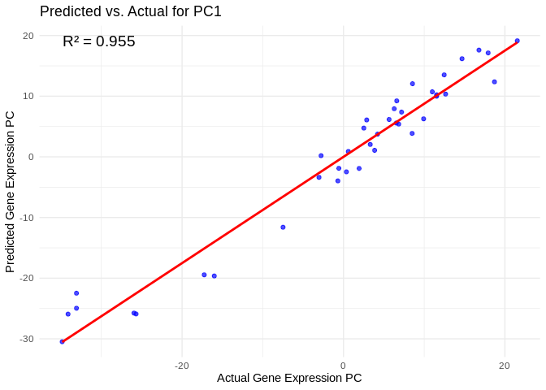

22.1-Apul-miRNA-mRNA-machine-learning-gene_sets
================
Kathleen Durkin
2025-04-04

- <a href="#1-load-libraries" id="toc-1-load-libraries">1 Load
  libraries</a>
- <a href="#2-load-and-prep-data" id="toc-2-load-and-prep-data">2 Load and
  prep data</a>
  - <a href="#21-counts-filtering" id="toc-21-counts-filtering">2.1 Counts
    filtering</a>
  - <a href="#22-physiology-filtering" id="toc-22-physiology-filtering">2.2
    Physiology filtering</a>
  - <a href="#23-assign-metadata-and-arrange-order-of-columns"
    id="toc-23-assign-metadata-and-arrange-order-of-columns">2.3 Assign
    metadata and arrange order of columns</a>
  - <a href="#24-conduct-variance-stabilized-transformation"
    id="toc-24-conduct-variance-stabilized-transformation">2.4 Conduct
    variance stabilized transformation</a>
  - <a href="#25-islolate-gene-sets" id="toc-25-islolate-gene-sets">2.5
    Islolate gene sets</a>
- <a href="#3-feature-selection" id="toc-3-feature-selection">3 Feature
  selection</a>
  - <a href="#31-host_afdw" id="toc-31-host_afdw">3.1 Host_AFDW</a>
- <a href="#4-the-model" id="toc-4-the-model">4 The model</a>
- <a href="#5-results" id="toc-5-results">5 Results</a>

Applying ML model using smaller, specific gene sets (e.g. genes
significantly correlated with a phys metric, genes with a specific known
function). Also adding in pOverA filtering

Inputs:

- RNA counts matrix (raw):
  `../output/02.20-D-Apul-RNAseq-alignment-HiSat2/apul-gene_count_matrix.csv`

- Gene sets of interest:
  `../output/21-Apul-annotate-miRNA-mRNA-WGCNA/filtered-gene-sets/`

- sRNA/miRNA counts matrix (raw):
  `../output/03.10-D-Apul-sRNAseq-expression-DESeq2/Apul_miRNA_ShortStack_counts_formatted.txt`

- sample metadata: `../../M-multi-species/data/rna_metadata.csv`

- physiological data:
  <https://github.com/urol-e5/timeseries/raw/refs/heads/master/time_series_analysis/Output/master_timeseries.csv>

Note that I’ll start by using phenotype (e.g. biomass, respiration) as
the predictor, which is suitable for understanding *how external factors
drive gene expression changes.*

If, instead, we wanted to build some sort of predictive model, where
*gene expression could be used to predict phenotype*, we could switch so
that gene counts are used as the predictors.

# 1 Load libraries

``` r
library(tidyverse)
```

    ## ── Attaching core tidyverse packages ──────────────────────── tidyverse 2.0.0 ──
    ## ✔ dplyr     1.1.4     ✔ readr     2.1.5
    ## ✔ forcats   1.0.0     ✔ stringr   1.5.1
    ## ✔ ggplot2   3.5.1     ✔ tibble    3.2.1
    ## ✔ lubridate 1.9.4     ✔ tidyr     1.3.1
    ## ✔ purrr     1.0.2     
    ## ── Conflicts ────────────────────────────────────────── tidyverse_conflicts() ──
    ## ✖ dplyr::filter() masks stats::filter()
    ## ✖ dplyr::lag()    masks stats::lag()
    ## ℹ Use the conflicted package (<http://conflicted.r-lib.org/>) to force all conflicts to become errors

``` r
library(ggplot2)
library(DESeq2)
```

    ## Loading required package: S4Vectors
    ## Loading required package: stats4
    ## Loading required package: BiocGenerics
    ## 
    ## Attaching package: 'BiocGenerics'
    ## 
    ## The following objects are masked from 'package:lubridate':
    ## 
    ##     intersect, setdiff, union
    ## 
    ## The following objects are masked from 'package:dplyr':
    ## 
    ##     combine, intersect, setdiff, union
    ## 
    ## The following objects are masked from 'package:stats':
    ## 
    ##     IQR, mad, sd, var, xtabs
    ## 
    ## The following objects are masked from 'package:base':
    ## 
    ##     anyDuplicated, aperm, append, as.data.frame, basename, cbind,
    ##     colnames, dirname, do.call, duplicated, eval, evalq, Filter, Find,
    ##     get, grep, grepl, intersect, is.unsorted, lapply, Map, mapply,
    ##     match, mget, order, paste, pmax, pmax.int, pmin, pmin.int,
    ##     Position, rank, rbind, Reduce, rownames, sapply, setdiff, sort,
    ##     table, tapply, union, unique, unsplit, which.max, which.min
    ## 
    ## 
    ## Attaching package: 'S4Vectors'
    ## 
    ## The following objects are masked from 'package:lubridate':
    ## 
    ##     second, second<-
    ## 
    ## The following objects are masked from 'package:dplyr':
    ## 
    ##     first, rename
    ## 
    ## The following object is masked from 'package:tidyr':
    ## 
    ##     expand
    ## 
    ## The following objects are masked from 'package:base':
    ## 
    ##     expand.grid, I, unname
    ## 
    ## Loading required package: IRanges
    ## 
    ## Attaching package: 'IRanges'
    ## 
    ## The following object is masked from 'package:lubridate':
    ## 
    ##     %within%
    ## 
    ## The following objects are masked from 'package:dplyr':
    ## 
    ##     collapse, desc, slice
    ## 
    ## The following object is masked from 'package:purrr':
    ## 
    ##     reduce
    ## 
    ## Loading required package: GenomicRanges
    ## Loading required package: GenomeInfoDb
    ## Loading required package: SummarizedExperiment
    ## Loading required package: MatrixGenerics
    ## Loading required package: matrixStats
    ## 
    ## Attaching package: 'matrixStats'
    ## 
    ## The following object is masked from 'package:dplyr':
    ## 
    ##     count
    ## 
    ## 
    ## Attaching package: 'MatrixGenerics'
    ## 
    ## The following objects are masked from 'package:matrixStats':
    ## 
    ##     colAlls, colAnyNAs, colAnys, colAvgsPerRowSet, colCollapse,
    ##     colCounts, colCummaxs, colCummins, colCumprods, colCumsums,
    ##     colDiffs, colIQRDiffs, colIQRs, colLogSumExps, colMadDiffs,
    ##     colMads, colMaxs, colMeans2, colMedians, colMins, colOrderStats,
    ##     colProds, colQuantiles, colRanges, colRanks, colSdDiffs, colSds,
    ##     colSums2, colTabulates, colVarDiffs, colVars, colWeightedMads,
    ##     colWeightedMeans, colWeightedMedians, colWeightedSds,
    ##     colWeightedVars, rowAlls, rowAnyNAs, rowAnys, rowAvgsPerColSet,
    ##     rowCollapse, rowCounts, rowCummaxs, rowCummins, rowCumprods,
    ##     rowCumsums, rowDiffs, rowIQRDiffs, rowIQRs, rowLogSumExps,
    ##     rowMadDiffs, rowMads, rowMaxs, rowMeans2, rowMedians, rowMins,
    ##     rowOrderStats, rowProds, rowQuantiles, rowRanges, rowRanks,
    ##     rowSdDiffs, rowSds, rowSums2, rowTabulates, rowVarDiffs, rowVars,
    ##     rowWeightedMads, rowWeightedMeans, rowWeightedMedians,
    ##     rowWeightedSds, rowWeightedVars
    ## 
    ## Loading required package: Biobase
    ## Welcome to Bioconductor
    ## 
    ##     Vignettes contain introductory material; view with
    ##     'browseVignettes()'. To cite Bioconductor, see
    ##     'citation("Biobase")', and for packages 'citation("pkgname")'.
    ## 
    ## 
    ## Attaching package: 'Biobase'
    ## 
    ## The following object is masked from 'package:MatrixGenerics':
    ## 
    ##     rowMedians
    ## 
    ## The following objects are masked from 'package:matrixStats':
    ## 
    ##     anyMissing, rowMedians

``` r
library(igraph)
```

    ## 
    ## Attaching package: 'igraph'
    ## 
    ## The following object is masked from 'package:GenomicRanges':
    ## 
    ##     union
    ## 
    ## The following object is masked from 'package:IRanges':
    ## 
    ##     union
    ## 
    ## The following object is masked from 'package:S4Vectors':
    ## 
    ##     union
    ## 
    ## The following objects are masked from 'package:BiocGenerics':
    ## 
    ##     normalize, path, union
    ## 
    ## The following objects are masked from 'package:lubridate':
    ## 
    ##     %--%, union
    ## 
    ## The following objects are masked from 'package:dplyr':
    ## 
    ##     as_data_frame, groups, union
    ## 
    ## The following objects are masked from 'package:purrr':
    ## 
    ##     compose, simplify
    ## 
    ## The following object is masked from 'package:tidyr':
    ## 
    ##     crossing
    ## 
    ## The following object is masked from 'package:tibble':
    ## 
    ##     as_data_frame
    ## 
    ## The following objects are masked from 'package:stats':
    ## 
    ##     decompose, spectrum
    ## 
    ## The following object is masked from 'package:base':
    ## 
    ##     union

``` r
library(psych)
```

    ## 
    ## Attaching package: 'psych'
    ## 
    ## The following object is masked from 'package:SummarizedExperiment':
    ## 
    ##     distance
    ## 
    ## The following object is masked from 'package:GenomicRanges':
    ## 
    ##     distance
    ## 
    ## The following objects are masked from 'package:IRanges':
    ## 
    ##     distance, reflect
    ## 
    ## The following objects are masked from 'package:ggplot2':
    ## 
    ##     %+%, alpha

``` r
library(tidygraph)
```

    ## 
    ## Attaching package: 'tidygraph'
    ## 
    ## The following object is masked from 'package:igraph':
    ## 
    ##     groups
    ## 
    ## The following objects are masked from 'package:IRanges':
    ## 
    ##     active, slice
    ## 
    ## The following objects are masked from 'package:S4Vectors':
    ## 
    ##     active, rename
    ## 
    ## The following object is masked from 'package:stats':
    ## 
    ##     filter

``` r
library(ggraph)
library(WGCNA)
```

    ## Loading required package: dynamicTreeCut
    ## Loading required package: fastcluster
    ## 
    ## Attaching package: 'fastcluster'
    ## 
    ## The following object is masked from 'package:stats':
    ## 
    ##     hclust
    ## 
    ## 
    ## 
    ## Attaching package: 'WGCNA'
    ## 
    ## The following object is masked from 'package:IRanges':
    ## 
    ##     cor
    ## 
    ## The following object is masked from 'package:S4Vectors':
    ## 
    ##     cor
    ## 
    ## The following object is masked from 'package:stats':
    ## 
    ##     cor

``` r
library(edgeR)
```

    ## Loading required package: limma
    ## 
    ## Attaching package: 'limma'
    ## 
    ## The following object is masked from 'package:DESeq2':
    ## 
    ##     plotMA
    ## 
    ## The following object is masked from 'package:BiocGenerics':
    ## 
    ##     plotMA

``` r
library(reshape2)
```

    ## 
    ## Attaching package: 'reshape2'
    ## 
    ## The following object is masked from 'package:tidyr':
    ## 
    ##     smiths

``` r
library(ggcorrplot)
library(corrplot)
```

    ## corrplot 0.94 loaded

``` r
library(rvest)
```

    ## 
    ## Attaching package: 'rvest'
    ## 
    ## The following object is masked from 'package:readr':
    ## 
    ##     guess_encoding

``` r
library(purrr)
library(pheatmap)
library(glmnet)
```

    ## Loading required package: Matrix
    ## 
    ## Attaching package: 'Matrix'
    ## 
    ## The following object is masked from 'package:S4Vectors':
    ## 
    ##     expand
    ## 
    ## The following objects are masked from 'package:tidyr':
    ## 
    ##     expand, pack, unpack
    ## 
    ## Loaded glmnet 4.1-8

``` r
library(caret)
```

    ## Loading required package: lattice
    ## 
    ## Attaching package: 'caret'
    ## 
    ## The following object is masked from 'package:purrr':
    ## 
    ##     lift

``` r
library(factoextra)
```

    ## Welcome! Want to learn more? See two factoextra-related books at https://goo.gl/ve3WBa

``` r
library(vegan)
```

    ## Loading required package: permute
    ## 
    ## Attaching package: 'permute'
    ## 
    ## The following object is masked from 'package:igraph':
    ## 
    ##     permute
    ## 
    ## This is vegan 2.6-8
    ## 
    ## Attaching package: 'vegan'
    ## 
    ## The following object is masked from 'package:caret':
    ## 
    ##     tolerance
    ## 
    ## The following object is masked from 'package:psych':
    ## 
    ##     pca
    ## 
    ## The following object is masked from 'package:igraph':
    ## 
    ##     diversity

``` r
library(ggfortify)
library(genefilter)
```

    ## 
    ## Attaching package: 'genefilter'
    ## 
    ## The following object is masked from 'package:psych':
    ## 
    ##     AUC
    ## 
    ## The following objects are masked from 'package:MatrixGenerics':
    ## 
    ##     rowSds, rowVars
    ## 
    ## The following objects are masked from 'package:matrixStats':
    ## 
    ##     rowSds, rowVars
    ## 
    ## The following object is masked from 'package:readr':
    ## 
    ##     spec

# 2 Load and prep data

Load in count matrices for RNAseq.

``` r
# raw gene counts data (will filter and variance stabilize)
Apul_genes <- read_csv("../output/02.20-D-Apul-RNAseq-alignment-HiSat2/apul-gene_count_matrix.csv")
```

    ## Rows: 44371 Columns: 41
    ## ── Column specification ────────────────────────────────────────────────────────
    ## Delimiter: ","
    ## chr  (1): gene_id
    ## dbl (40): 1A1, 1A10, 1A12, 1A2, 1A8, 1A9, 1B1, 1B10, 1B2, 1B5, 1B9, 1C10, 1C...
    ## 
    ## ℹ Use `spec()` to retrieve the full column specification for this data.
    ## ℹ Specify the column types or set `show_col_types = FALSE` to quiet this message.

``` r
Apul_genes <- as.data.frame(Apul_genes)

# format gene IDs as rownames (instead of a column)
rownames(Apul_genes) <- Apul_genes$gene_id
Apul_genes <- Apul_genes%>%select(!gene_id)


# load and format metadata
metadata <- read_csv("../../M-multi-species/data/rna_metadata.csv")%>%select(AzentaSampleName, ColonyID, Timepoint) %>%
  filter(grepl("ACR", ColonyID))
```

    ## New names:
    ## Rows: 117 Columns: 19
    ## ── Column specification
    ## ──────────────────────────────────────────────────────── Delimiter: "," chr
    ## (13): SampleName, WellNumber, AzentaSampleName, ColonyID, Timepoint, Sam... dbl
    ## (5): SampleNumber, Plate, TotalAmount-ng, Volume-uL, Conc-ng.uL lgl (1):
    ## MethodUsedForSpectrophotometry
    ## ℹ Use `spec()` to retrieve the full column specification for this data. ℹ
    ## Specify the column types or set `show_col_types = FALSE` to quiet this message.
    ## • `` -> `...19`

``` r
metadata$Sample <- paste(metadata$AzentaSampleName, metadata$ColonyID, metadata$Timepoint, sep = "_")

colonies <- unique(metadata$ColonyID)

# Load physiological data
phys<-read_csv("https://github.com/urol-e5/timeseries/raw/refs/heads/master/time_series_analysis/Output/master_timeseries.csv")%>%filter(colony_id_corr %in% colonies)%>%
  select(colony_id_corr, species, timepoint, site, Host_AFDW.mg.cm2, Sym_AFDW.mg.cm2, Am, AQY, Rd, Ik, Ic, calc.umol.cm2.hr, cells.mgAFDW, prot_mg.mgafdw, Ratio_AFDW.mg.cm2, Total_Chl, Total_Chl_cell, cre.umol.mgafdw)
```

    ## Rows: 448 Columns: 46
    ## ── Column specification ────────────────────────────────────────────────────────
    ## Delimiter: ","
    ## chr (10): colony_id, colony_id_corr, species, timepoint, month, site, nutrie...
    ## dbl (36): cre.umol.mgprot, Host_AFDW.mg.cm2, Sym_AFDW.mg.cm2, Host_DW.mg.cm2...
    ## 
    ## ℹ Use `spec()` to retrieve the full column specification for this data.
    ## ℹ Specify the column types or set `show_col_types = FALSE` to quiet this message.

``` r
# format timepoint
phys$timepoint <- gsub("timepoint", "TP", phys$timepoint)
#add column with full sample info
phys <- merge(phys, metadata, by.x = c("colony_id_corr", "timepoint"), by.y = c("ColonyID", "Timepoint")) %>%
  select(-AzentaSampleName)
  

#add site information into metadata 
metadata$Site<-phys$site[match(metadata$ColonyID, phys$colony_id_corr)]


# Rename gene column names to include full sample info (as in miRNA table)
colnames(Apul_genes) <- metadata$Sample[match(colnames(Apul_genes), metadata$AzentaSampleName)]

# raw miRNA counts (will filter and variance stabilize)
Apul_miRNA <- read.table(file = "../output/03.10-D-Apul-sRNAseq-expression-DESeq2/Apul_miRNA_ShortStack_counts_formatted.txt", header = TRUE, sep = "\t", check.names = FALSE)
```

## 2.1 Counts filtering

Note: I’m filtering (removing unrepresented and lowly-represented genes)
and variance stabilizing *before* I isolate specific gene sets. Not sure
if the preliminary vst is appropriate though?

Ensure there are no genes or miRNAs with 0 counts across all samples.

``` r
nrow(Apul_genes)
```

    ## [1] 44371

``` r
Apul_genes_red<-Apul_genes %>%
     mutate(Total = rowSums(.[, 1:40]))%>%
    filter(!Total==0)%>%
    dplyr::select(!Total)

nrow(Apul_genes_red)
```

    ## [1] 35869

``` r
# miRNAs
nrow(Apul_miRNA)
```

    ## [1] 51

``` r
Apul_miRNA_red<-Apul_miRNA %>%
     mutate(Total = rowSums(.[, 1:40]))%>%
    filter(!Total==0)%>%
    dplyr::select(!Total)

nrow(Apul_miRNA_red)
```

    ## [1] 51

Removing genes with only 0 counts reduced number from 44371 to 35869.
Retained all 51 miRNAs.

*pOverA*: Specifying the minimum count for a proportion of samples for
each gene. Setting 3/38 = 0.08. This would retain genes that are only
expressed in a single season in a couple of the colonies. Additionally,
setting the minimum count so that the minimum number of samples must
have a gene count above a certain threshold.

genes:

``` r
filt <- filterfun(pOverA(0.08, 5))

#create filter for the counts data
gfilt <- genefilter(Apul_genes_red, filt)

#identify genes to keep by count filter
gkeep <- Apul_genes_red[gfilt,]

#identify gene lists
gn.keep <- rownames(gkeep)

#gene count data filtered in PoverA, P percent of the samples have counts over A
Apul_genes_filt <- as.data.frame(Apul_genes_red[which(rownames(Apul_genes_red) %in% gn.keep),])

#How many rows do we have before and after filtering?
nrow(Apul_genes_red) #Before
```

    ## [1] 35869

``` r
nrow(Apul_genes_filt) #After
```

    ## [1] 25730

We had 35869 genes before, and 25730 genes after filtering.

miRNA:

``` r
mifilt <- filterfun(pOverA(0.08, 5))

#create filter for the counts data
mifilt <- genefilter(Apul_miRNA_red, mifilt)

#identify genes to keep by count filter
mikeep <- Apul_miRNA_red[mifilt,]

#identify genes to keep by count filter
mikeep <- Apul_miRNA_red[mifilt,]

#identify gene lists
mi.keep <- rownames(mikeep)

#gene count data filtered in PoverA, P percent of the samples have counts over A
Apul_miRNA_filt <- as.data.frame(Apul_miRNA_red[which(rownames(Apul_miRNA_red) %in% mi.keep),])

#How many rows do we have before and after filtering?
nrow(Apul_miRNA_red) #Before
```

    ## [1] 51

``` r
nrow(Apul_miRNA_filt) #After
```

    ## [1] 47

Of the 51 miRNA, 47 were retained. Which were removed?

``` r
setdiff(rownames(Apul_miRNA_red), rownames(Apul_miRNA_filt))
```

    ## [1] "Cluster_5685"  "Cluster_11565" "Cluster_13647" "Cluster_14633"

## 2.2 Physiology filtering

Run PCA on physiology data to see if there are phys outliers

Export data for PERMANOVA test.

``` r
test<-as.data.frame(phys)
test<-test[complete.cases(test), ]
```

Build PERMANOVA model.

``` r
scaled_test <-prcomp(test%>%select(where(is.numeric)), scale=TRUE, center=TRUE)
fviz_eig(scaled_test)
```

<!-- -->

``` r
# scale data
vegan <- scale(test%>%select(where(is.numeric)))

# PerMANOVA 
permanova<-adonis2(vegan ~ timepoint*site, data = test, method='eu')
permanova
```

    ## Permutation test for adonis under reduced model
    ## Permutation: free
    ## Number of permutations: 999
    ## 
    ## adonis2(formula = vegan ~ timepoint * site, data = test, method = "eu")
    ##          Df SumOfSqs      R2      F Pr(>F)    
    ## Model     7   208.16 0.43731 2.9976  0.001 ***
    ## Residual 27   267.84 0.56269                  
    ## Total    34   476.00 1.00000                  
    ## ---
    ## Signif. codes:  0 '***' 0.001 '**' 0.01 '*' 0.05 '.' 0.1 ' ' 1

``` r
pca1<-ggplot2::autoplot(scaled_test, data=test, frame.colour="timepoint", loadings=FALSE,  colour="timepoint", shape="site", loadings.label.colour="black", loadings.colour="black", loadings.label=FALSE, frame=FALSE, loadings.label.size=5, loadings.label.vjust=-1, size=5) + 
  geom_text(aes(x = PC1, y = PC2, label = paste(colony_id_corr, timepoint)), vjust = -0.5)+
  theme_classic()+
   theme(legend.text = element_text(size=18), 
         legend.position="right",
        plot.background = element_blank(),
        legend.title = element_text(size=18, face="bold"), 
        axis.text = element_text(size=18), 
        axis.title = element_text(size=18,  face="bold"));pca1
```

<!-- -->

Remove ACR-173, timepoint 3 sample from analysis. This is Azenta sample
1B2.

``` r
Apul_genes_filt <- Apul_genes_filt %>%
  select(!`1B2_ACR-173_TP3`)

Apul_miRNA_filt <- Apul_miRNA_filt %>%
  select(!`1B2_ACR-173_TP3`)

metadata <- metadata %>%
  filter(Sample != "1B2_ACR-173_TP3")
```

We also do not have phys data for colony 1B9 ACR-265 at TP4, so I’ll
remove that here as well.

``` r
Apul_genes_filt <- Apul_genes_filt%>%
  select(!`1B9_ACR-265_TP4`)

Apul_miRNA_filt <- Apul_miRNA_filt%>%
  select(!`1B9_ACR-265_TP4`)

metadata <- metadata %>%
  filter(Sample != "1B9_ACR-265_TP4")
```

## 2.3 Assign metadata and arrange order of columns

Order metadata the same as the column order in the gene matrix.

``` r
list<-colnames(Apul_genes_filt)
list<-as.factor(list)

metadata$Sample<-as.factor(metadata$Sample)

# Re-order the levels
metadata$Sample <- factor(as.character(metadata$Sample), levels=list)
# Re-order the data.frame
metadata_ordered <- metadata[order(metadata$Sample),]
metadata_ordered$Sample
```

    ##  [1] 1A1_ACR-173_TP1  1A10_ACR-145_TP4 1A12_ACR-237_TP3 1A2_ACR-244_TP4 
    ##  [5] 1A8_ACR-186_TP2  1A9_ACR-244_TP2  1B1_ACR-225_TP3  1B10_ACR-150_TP4
    ##  [9] 1B5_ACR-229_TP1  1C10_ACR-173_TP4 1C4_ACR-139_TP4  1D10_ACR-265_TP2
    ## [13] 1D3_ACR-225_TP4  1D4_ACR-237_TP4  1D6_ACR-229_TP2  1D8_ACR-237_TP2 
    ## [17] 1D9_ACR-229_TP4  1E1_ACR-265_TP3  1E3_ACR-150_TP2  1E5_ACR-139_TP3 
    ## [21] 1E9_ACR-237_TP1  1F11_ACR-173_TP2 1F4_ACR-150_TP3  1F8_ACR-145_TP3 
    ## [25] 1G5_ACR-244_TP3  1H11_ACR-225_TP1 1H12_ACR-186_TP3 1H6_ACR-225_TP2 
    ## [29] 1H7_ACR-229_TP3  1H8_ACR-186_TP4  2B2_ACR-145_TP1  2B3_ACR-139_TP2 
    ## [33] 2C1_ACR-244_TP1  2C2_ACR-139_TP1  2D2_ACR-150_TP1  2E2_ACR-186_TP1 
    ## [37] 2F1_ACR-265_TP1  2G1_ACR-145_TP2 
    ## 38 Levels: 1A1_ACR-173_TP1 1A10_ACR-145_TP4 ... 2G1_ACR-145_TP2

``` r
# Make sure the miRNA colnames are also in the same order as the gene colnames
Apul_miRNA_filt <- Apul_miRNA_filt[, colnames(Apul_genes_filt)]
```

Metadata and gene count matrix are now ordered the same.

## 2.4 Conduct variance stabilized transformation

VST should be performed on our two input datasets (gene counts and miRNA
counts) separately

Genes:

``` r
#Set DESeq2 design
dds_genes <- DESeqDataSetFromMatrix(countData = Apul_genes_filt,
                              colData = metadata_ordered,
                              design = ~Timepoint+ColonyID)
```

    ## converting counts to integer mode

    ## Warning in DESeqDataSet(se, design = design, ignoreRank): some variables in
    ## design formula are characters, converting to factors

    ##   Note: levels of factors in the design contain characters other than
    ##   letters, numbers, '_' and '.'. It is recommended (but not required) to use
    ##   only letters, numbers, and delimiters '_' or '.', as these are safe characters
    ##   for column names in R. [This is a message, not a warning or an error]

Check size factors.

``` r
SF.dds_genes <- estimateSizeFactors(dds_genes) #estimate size factors to determine if we can use vst  to transform our data. Size factors should be less than 4 for us to use vst
```

    ##   Note: levels of factors in the design contain characters other than
    ##   letters, numbers, '_' and '.'. It is recommended (but not required) to use
    ##   only letters, numbers, and delimiters '_' or '.', as these are safe characters
    ##   for column names in R. [This is a message, not a warning or an error]

``` r
print(sizeFactors(SF.dds_genes)) #View size factors
```

    ##  1A1_ACR-173_TP1 1A10_ACR-145_TP4 1A12_ACR-237_TP3  1A2_ACR-244_TP4 
    ##        0.7567890        0.7700217        1.4233018        0.6403927 
    ##  1A8_ACR-186_TP2  1A9_ACR-244_TP2  1B1_ACR-225_TP3 1B10_ACR-150_TP4 
    ##        1.1214847        1.2046263        1.4206067        1.4019970 
    ##  1B5_ACR-229_TP1 1C10_ACR-173_TP4  1C4_ACR-139_TP4 1D10_ACR-265_TP2 
    ##        1.6051748        0.7139222        1.1898481        1.1369329 
    ##  1D3_ACR-225_TP4  1D4_ACR-237_TP4  1D6_ACR-229_TP2  1D8_ACR-237_TP2 
    ##        0.6728868        1.0535544        1.0900767        0.8697746 
    ##  1D9_ACR-229_TP4  1E1_ACR-265_TP3  1E3_ACR-150_TP2  1E5_ACR-139_TP3 
    ##        0.6693118        1.0722836        1.1788412        1.2208465 
    ##  1E9_ACR-237_TP1 1F11_ACR-173_TP2  1F4_ACR-150_TP3  1F8_ACR-145_TP3 
    ##        1.0408533        1.0440427        1.4020133        0.7941454 
    ##  1G5_ACR-244_TP3 1H11_ACR-225_TP1 1H12_ACR-186_TP3  1H6_ACR-225_TP2 
    ##        1.6118042        1.4233018        0.6115886        0.7941454 
    ##  1H7_ACR-229_TP3  1H8_ACR-186_TP4  2B2_ACR-145_TP1  2B3_ACR-139_TP2 
    ##        1.3289345        1.2191892        1.1023039        1.4412454 
    ##  2C1_ACR-244_TP1  2C2_ACR-139_TP1  2D2_ACR-150_TP1  2E2_ACR-186_TP1 
    ##        0.6639057        1.1948885        0.7798554        0.6224898 
    ##  2F1_ACR-265_TP1  2G1_ACR-145_TP2 
    ##        0.9539420        0.8204492

``` r
all(sizeFactors(SF.dds_genes)) < 4
```

    ## Warning in all(sizeFactors(SF.dds_genes)): coercing argument of type 'double'
    ## to logical

    ## [1] TRUE

All size factors are less than 4, so we can use VST transformation.

``` r
vsd_genes <- vst(dds_genes, blind=TRUE) #apply a variance stabilizing transformation to minimize effects of small counts and normalize with respect to library size
vsd_genes <- assay(vsd_genes)
head(vsd_genes, 3) #view transformed gene count data for the first three genes in the dataset.  
```

    ##            1A1_ACR-173_TP1 1A10_ACR-145_TP4 1A12_ACR-237_TP3 1A2_ACR-244_TP4
    ## FUN_002326        6.314727         6.244262         5.882260        5.555038
    ## FUN_002303        7.230929         6.733346         6.318919        5.730939
    ## FUN_002304        6.551691         5.402921         5.663512        5.429656
    ##            1A8_ACR-186_TP2 1A9_ACR-244_TP2 1B1_ACR-225_TP3 1B10_ACR-150_TP4
    ## FUN_002326        5.450486        5.439101        5.908938         5.832424
    ## FUN_002303        5.523209        5.568320        6.319990         6.173548
    ## FUN_002304        5.355409        5.347334        5.479050         5.416237
    ##            1B5_ACR-229_TP1 1C10_ACR-173_TP4 1C4_ACR-139_TP4 1D10_ACR-265_TP2
    ## FUN_002326        5.317659         6.252295        5.441037         5.805828
    ## FUN_002303        5.458172         6.748057        5.859637         6.263178
    ## FUN_002304        5.125042         5.826117        5.511671         5.448277
    ##            1D3_ACR-225_TP4 1D4_ACR-237_TP4 1D6_ACR-229_TP2 1D8_ACR-237_TP2
    ## FUN_002326        6.094144        6.214933        5.358697        6.053120
    ## FUN_002303        6.382582        6.649246        5.455122        6.527197
    ## FUN_002304        5.422236        5.460769        5.358697        5.645936
    ##            1D9_ACR-229_TP4 1E1_ACR-265_TP3 1E3_ACR-150_TP2 1E5_ACR-139_TP3
    ## FUN_002326        5.423026        5.698947        5.442503        5.506760
    ## FUN_002303        5.125042        6.157587        5.672716        5.782426
    ## FUN_002304        5.125042        5.532183        5.349747        5.345855
    ##            1E9_ACR-237_TP1 1F11_ACR-173_TP2 1F4_ACR-150_TP3 1F8_ACR-145_TP3
    ## FUN_002326        6.093723         5.752452        5.832420        5.936453
    ## FUN_002303        6.542912         6.170885        6.446496        6.344285
    ## FUN_002304        5.462802         5.706555        5.832420        5.398681
    ##            1G5_ACR-244_TP3 1H11_ACR-225_TP1 1H12_ACR-186_TP3 1H6_ACR-225_TP2
    ## FUN_002326        5.396684         5.882260         5.564971        5.936453
    ## FUN_002303        5.728931         6.318919         5.662814        6.344285
    ## FUN_002304        5.396684         5.663512         5.125042        5.398681
    ##            1H7_ACR-229_TP3 1H8_ACR-186_TP4 2B2_ACR-145_TP1 2B3_ACR-139_TP2
    ## FUN_002326        5.336702        5.437227        5.887613        5.476519
    ## FUN_002303        5.336702        5.706287        6.300901        5.620892
    ## FUN_002304        5.336702        5.346005        5.453294        5.328302
    ##            2C1_ACR-244_TP1 2C2_ACR-139_TP1 2D2_ACR-150_TP1 2E2_ACR-186_TP1
    ## FUN_002326        5.547410        5.510860        6.459683        5.561132
    ## FUN_002303        5.641423        5.824671        6.762732        5.561132
    ## FUN_002304        5.424232        5.440373        5.943662        5.433989
    ##            2F1_ACR-265_TP1 2G1_ACR-145_TP2
    ## FUN_002326        6.190578        5.723629
    ## FUN_002303        6.583149        6.325652
    ## FUN_002304        5.374775        5.590023

miRNA:

``` r
#Set DESeq2 design
dds_miRNA <- DESeqDataSetFromMatrix(countData = Apul_miRNA_filt,
                              colData = metadata_ordered,
                              design = ~Timepoint+ColonyID)
```

    ## Warning in DESeqDataSet(se, design = design, ignoreRank): some variables in
    ## design formula are characters, converting to factors

    ##   Note: levels of factors in the design contain characters other than
    ##   letters, numbers, '_' and '.'. It is recommended (but not required) to use
    ##   only letters, numbers, and delimiters '_' or '.', as these are safe characters
    ##   for column names in R. [This is a message, not a warning or an error]

Check size factors.

``` r
SF.dds_miRNA <- estimateSizeFactors(dds_miRNA) #estimate size factors to determine if we can use vst  to transform our data. Size factors should be less than 4 for us to use vst
```

    ##   Note: levels of factors in the design contain characters other than
    ##   letters, numbers, '_' and '.'. It is recommended (but not required) to use
    ##   only letters, numbers, and delimiters '_' or '.', as these are safe characters
    ##   for column names in R. [This is a message, not a warning or an error]

``` r
print(sizeFactors(SF.dds_miRNA)) #View size factors
```

    ##  1A1_ACR-173_TP1 1A10_ACR-145_TP4 1A12_ACR-237_TP3  1A2_ACR-244_TP4 
    ##        1.4375773        0.4873497        1.1278371        1.3906883 
    ##  1A8_ACR-186_TP2  1A9_ACR-244_TP2  1B1_ACR-225_TP3 1B10_ACR-150_TP4 
    ##        1.4576506        3.6175606        0.6314484        0.5933158 
    ##  1B5_ACR-229_TP1 1C10_ACR-173_TP4  1C4_ACR-139_TP4 1D10_ACR-265_TP2 
    ##        3.4568168        0.3494818        0.2635332        1.6883200 
    ##  1D3_ACR-225_TP4  1D4_ACR-237_TP4  1D6_ACR-229_TP2  1D8_ACR-237_TP2 
    ##        3.3510894        1.6862052        3.0187618        1.6095839 
    ##  1D9_ACR-229_TP4  1E1_ACR-265_TP3  1E3_ACR-150_TP2  1E5_ACR-139_TP3 
    ##        1.6452632        0.4710913        2.5273448        0.1018135 
    ##  1E9_ACR-237_TP1 1F11_ACR-173_TP2  1F4_ACR-150_TP3  1F8_ACR-145_TP3 
    ##        0.8833733        1.4438548        1.9140909        0.3982620 
    ##  1G5_ACR-244_TP3 1H11_ACR-225_TP1 1H12_ACR-186_TP3  1H6_ACR-225_TP2 
    ##        2.2537502        0.8044495        0.4593767        1.8545938 
    ##  1H7_ACR-229_TP3  1H8_ACR-186_TP4  2B2_ACR-145_TP1  2B3_ACR-139_TP2 
    ##        1.0932705        0.8296064        0.8877596        1.8683207 
    ##  2C1_ACR-244_TP1  2C2_ACR-139_TP1  2D2_ACR-150_TP1  2E2_ACR-186_TP1 
    ##        1.1967504        1.3986634        0.5117454        0.3091478 
    ##  2F1_ACR-265_TP1  2G1_ACR-145_TP2 
    ##        0.2926522        1.8710888

``` r
all(sizeFactors(SF.dds_miRNA)) < 4
```

    ## Warning in all(sizeFactors(SF.dds_miRNA)): coercing argument of type 'double'
    ## to logical

    ## [1] TRUE

All size factors are less than 4, so we can use VST transformation.

``` r
vsd_miRNA <- varianceStabilizingTransformation(dds_miRNA, blind=TRUE) #apply a variance stabilizing transformation to minimize effects of small counts and normalize with respect to library size. Using varianceStabilizingTransformation() instead of vst() because few input genes
```

    ##   Note: levels of factors in the design contain characters other than
    ##   letters, numbers, '_' and '.'. It is recommended (but not required) to use
    ##   only letters, numbers, and delimiters '_' or '.', as these are safe characters
    ##   for column names in R. [This is a message, not a warning or an error]

``` r
vsd_miRNA <- assay(vsd_miRNA)
head(vsd_miRNA, 3) #view transformed gene count data for the first three genes in the dataset.
```

    ##              1A1_ACR-173_TP1 1A10_ACR-145_TP4 1A12_ACR-237_TP3 1A2_ACR-244_TP4
    ## Cluster_1819        6.263936         6.354440         5.201640        5.936251
    ## Cluster_1832       10.317637         9.394188         8.613546        9.424077
    ## Cluster_1833        5.069025         5.270882         5.698909        4.768360
    ##              1A8_ACR-186_TP2 1A9_ACR-244_TP2 1B1_ACR-225_TP3 1B10_ACR-150_TP4
    ## Cluster_1819        5.988629        6.642535        5.163915         4.872860
    ## Cluster_1832        9.740311        9.245447        9.852571         8.551135
    ## Cluster_1833        3.192231        1.588067        5.602461         3.958294
    ##              1B5_ACR-229_TP1 1C10_ACR-173_TP4 1C4_ACR-139_TP4 1D10_ACR-265_TP2
    ## Cluster_1819        6.019868         5.841977        5.451284         5.971086
    ## Cluster_1832       10.010143         9.406043        9.655816         8.539287
    ## Cluster_1833        5.578027         3.802098        5.786041         1.588067
    ##              1D3_ACR-225_TP4 1D4_ACR-237_TP4 1D6_ACR-229_TP2 1D8_ACR-237_TP2
    ## Cluster_1819        4.663998        4.908181        6.139156        5.811871
    ## Cluster_1832        9.765696        9.194752        9.884875        8.667876
    ## Cluster_1833        4.915670        5.945156        3.941332        5.364798
    ##              1D9_ACR-229_TP4 1E1_ACR-265_TP3 1E3_ACR-150_TP2 1E5_ACR-139_TP3
    ## Cluster_1819        5.521406        5.528226        6.246557        4.661032
    ## Cluster_1832        9.395256        9.151069        9.051636        8.807282
    ## Cluster_1833        3.654043        5.655666        1.588067        1.588067
    ##              1E9_ACR-237_TP1 1F11_ACR-173_TP2 1F4_ACR-150_TP3 1F8_ACR-145_TP3
    ## Cluster_1819        4.764948         6.062330        5.129756        5.991449
    ## Cluster_1832        8.375077        10.054726        8.649179        9.085687
    ## Cluster_1833        4.764948         4.474336        3.523055        4.536033
    ##              1G5_ACR-244_TP3 1H11_ACR-225_TP1 1H12_ACR-186_TP3 1H6_ACR-225_TP2
    ## Cluster_1819        5.584256         4.810773         6.280458        4.957192
    ## Cluster_1832       10.259449         9.577964         9.909363        9.861389
    ## Cluster_1833        1.588067         4.934472         4.890136        4.709127
    ##              1H7_ACR-229_TP3 1H8_ACR-186_TP4 2B2_ACR-145_TP1 2B3_ACR-139_TP2
    ## Cluster_1819        5.688516        5.305067        5.792147        5.399001
    ## Cluster_1832        9.535904       10.047547        8.062376        9.896095
    ## Cluster_1833        3.953358        5.819650        1.588067        3.911358
    ##              2C1_ACR-244_TP1 2C2_ACR-139_TP1 2D2_ACR-150_TP1 2E2_ACR-186_TP1
    ## Cluster_1819        5.740735        5.376560        5.609338        6.384352
    ## Cluster_1832        9.376015        9.649600        8.166773        9.427357
    ## Cluster_1833        5.647291        4.509398        3.716059        1.588067
    ##              2F1_ACR-265_TP1 2G1_ACR-145_TP2
    ## Cluster_1819        5.919722        5.282308
    ## Cluster_1832        9.205326        9.122950
    ## Cluster_1833        1.588067        4.321270

``` r
vsd_genes <- as.data.frame(t(vsd_genes))
vsd_miRNA <- as.data.frame(t(vsd_miRNA))
```

## 2.5 Islolate gene sets

Read in gene set tables

``` r
# genes from WGCNA modules significantly correlated with host biomass
Host_AFDW <- read.table("../output/21-Apul-annotate-miRNA-mRNA-WGCNA/filtered-gene-sets/Host_AFDW.mg.cm2_gene_counts.tab", sep="\t", header=TRUE)
# genes from WGCNA modules significantly correlated with symbiont photosynthesis
Am <- read.table("../output/21-Apul-annotate-miRNA-mRNA-WGCNA/filtered-gene-sets/Am_gene_counts.tab", sep="\t", header=TRUE)
# GO temrs related to energy production
ATP_production_GO <- read.table("../output/21-Apul-annotate-miRNA-mRNA-WGCNA/filtered-gene-sets/ATP_production_GO_terms_gene_counts.tab", sep="\t", header=TRUE)
```

Isolate filtered counts by gene set

``` r
vsd_Host_AFDW <- vsd_genes[, colnames(vsd_genes) %in% Host_AFDW$gene_id]
vsd_Am <- vsd_genes[, colnames(vsd_genes) %in% Am$gene_id]
#vsd_ATP_production_GO <- vsd_genes[, colnames(vsd_genes_ %in% ATP_production_GO$gene_id)]
```

# 3 Feature selection

For gene sets that are large we’ll need to reduce dimensionality using
PCA. Note that the \# of miRNA (47 after filtering) is low enough that
reduction isn’t necessary.

## 3.1 Host_AFDW

Reduce dimensionality (genes+miRNA)

``` r
# Perform PCA on gene+miRNA expression matrix
pca_Host_AFDW <- prcomp(vsd_Host_AFDW, scale. = TRUE)

# Select top PCs that explain most variance (e.g., top 50 PCs)
explained_var_Host_AFDW <- summary(pca_Host_AFDW)$importance[2, ]  # Cumulative variance explained
num_pcs_Host_AFDW <- min(which(cumsum(explained_var_Host_AFDW) > 0.95))  # Keep PCs that explain 95% variance

Host_AFDW_pcs <- as.data.frame(pca_Host_AFDW$x[, 1:num_pcs_Host_AFDW])  # Extract selected PCs

dim(Host_AFDW_pcs)
```

    ## [1] 38 27

We have 27 gene/miRNA expression PCs

# 4 The model

Train elastic models to predict gene expression PCs from phys data.

``` r
train_models <- function(response_pcs, predictor_pcs) {
  models <- list()
  
  for (pc in colnames(response_pcs)) {
    y <- response_pcs[[pc]]  # Gene expression PC
    X <- as.matrix(predictor_pcs)  # Phys as predictors
    
    # Train elastic net model (alpha = 0.5 for mix of LASSO & Ridge)
    model <- cv.glmnet(X, y, alpha = 0.5)
    
    models[[pc]] <- model
  }
  
  return(models)
}

# Train models predicting gene expression PCs from phys data
models <- train_models(Host_AFDW_pcs, vsd_miRNA)
```

Extract feature importance.

``` r
get_feature_importance <- function(models) {
  importance_list <- lapply(models, function(model) {
    coefs <- as.matrix(coef(model, s = "lambda.min"))[-1, , drop = FALSE]  # Convert to regular matrix & remove intercept
    
    # Convert to data frame
    coefs_df <- data.frame(Feature = rownames(coefs), Importance = as.numeric(coefs))
    
    return(coefs_df)
  })
  
  # Combine feature importance across all predicted gene PCs
  importance_df <- bind_rows(importance_list) %>%
    group_by(Feature) %>%
    summarize(MeanImportance = mean(abs(Importance)), .groups = "drop") %>%
    arrange(desc(MeanImportance))
  
  return(importance_df)
}

feature_importance <- get_feature_importance(models)
head(feature_importance, 20)  # Top predictive phys features
```

    ## # A tibble: 20 × 2
    ##    Feature       MeanImportance
    ##    <chr>                  <dbl>
    ##  1 Cluster_17623          0.504
    ##  2 Cluster_2746           0.373
    ##  3 Cluster_9706           0.351
    ##  4 Cluster_5517           0.294
    ##  5 Cluster_14146          0.289
    ##  6 Cluster_17245          0.266
    ##  7 Cluster_9420           0.261
    ##  8 Cluster_14605          0.254
    ##  9 Cluster_5516           0.251
    ## 10 Cluster_17173          0.243
    ## 11 Cluster_1819           0.231
    ## 12 Cluster_1950           0.212
    ## 13 Cluster_9786           0.211
    ## 14 Cluster_17186          0.210
    ## 15 Cluster_9512           0.206
    ## 16 Cluster_3301           0.202
    ## 17 Cluster_1865           0.187
    ## 18 Cluster_10452          0.169
    ## 19 Cluster_3226           0.165
    ## 20 Cluster_3109           0.155

Evaluate performance.

``` r
# evaluate_model_performance <- function(models, response_pcs, predictor_pcs) {
#   results <- data.frame(PC = colnames(response_pcs), R2 = NA)
#   
#   for (pc in colnames(response_pcs)) {
#     y <- response_pcs[[pc]]
#     X <- as.matrix(predictor_pcs)
#     
#     model <- models[[pc]]
#     preds <- predict(model, X, s = "lambda.min")
#     
#     R2 <- cor(y, preds)^2  # R-squared metric
#     results[results$PC == pc, "R2"] <- R2
#   }
#   
#   return(results)
# }

evaluate_model_performance <- function(models, response_pcs, predictor_pcs) {
  results <- data.frame(PC = colnames(response_pcs), R2 = NA)
  
  for (pc in colnames(response_pcs)) {
    cat("Processing:", pc, "\n")
    
    y <- response_pcs[[pc]]
    X <- as.matrix(predictor_pcs)
    
    if (!(pc %in% names(models))) {
      cat("Model missing for PC:", pc, "\n")
      next
    }
  
    model <- models[[pc]]
    preds <- predict(model, X, s = "lambda.min")
    
    if (any(is.na(preds))) {
      cat("NA in predictions for PC:", pc, "\n")
    }
    
    if (var(y) == 0) {
      cat("Zero variance in y for PC:", pc, "\n")
      next
    }
  
    R2 <- cor(y, preds)^2
    results[results$PC == pc, "R2"] <- R2
  }
  
  return(results)
}

performance_results <- evaluate_model_performance(models, Host_AFDW_pcs, vsd_miRNA)
```

    ## Processing: PC1 
    ## Processing: PC2 
    ## Processing: PC3 
    ## Processing: PC4 
    ## Processing: PC5 
    ## Processing: PC6 
    ## Processing: PC7 
    ## Processing: PC8 
    ## Processing: PC9 
    ## Processing: PC10 
    ## Processing: PC11 
    ## Processing: PC12 
    ## Processing: PC13 
    ## Processing: PC14 
    ## Processing: PC15 
    ## Processing: PC16 
    ## Processing: PC17 
    ## Processing: PC18 
    ## Processing: PC19 
    ## Processing: PC20 
    ## Processing: PC21 
    ## Processing: PC22 
    ## Processing: PC23 
    ## Processing: PC24 
    ## Processing: PC25 
    ## Processing: PC26 
    ## Processing: PC27

``` r
summary(performance_results$R2)
```

    ##    Min. 1st Qu.  Median    Mean 3rd Qu.    Max.    NA's 
    ##  0.1235  0.4348  0.6521  0.6291  0.8924  0.9956      13

# 5 Results

Plot results.

``` r
# Select top 20 predictive phys features
top_features <- feature_importance %>% top_n(20, MeanImportance)

# Plot
ggplot(top_features, aes(x = reorder(Feature, MeanImportance), y = MeanImportance)) +
  geom_bar(stat = "identity", fill = "steelblue") +
  coord_flip() +  # Flip for readability
  theme_minimal() +
  labs(title = "Top 20 Predictive Phys Features",
       x = "Physiological Metric",
       y = "Mean Importance")
```

<!-- -->

``` r
ggplot(performance_results, aes(x = PC, y = R2)) +
  geom_point(color = "darkred", size = 3) +
  geom_hline(yintercept = mean(performance_results$R2, na.rm = TRUE), linetype = "dashed", color = "blue") +
  theme_minimal() +
  labs(title = "Model Performance Across Gene Expression PCs",
       x = "Gene Expression PC",
       y = "R² (Variance Explained)") +
  theme(axis.text.x = element_text(angle = 45, hjust = 1))  # Rotate labels
```

    ## Warning: Removed 13 rows containing missing values or values outside the scale range
    ## (`geom_point()`).

<!-- -->

Keep in mind that, while we ran the model with physiological predictors,
we’re really interested in the genes/miRNA associated with these
predictors

View components associated with gene/miRNA PCs

``` r
# Get the PCA rotation (loadings) matrix from the original gene/miRNA PCA
Host_AFDW_loadings <- pca_Host_AFDW$rotation  # Each column corresponds to a PC

# Convert to data frame and reshape for plotting
Host_AFDW_loadings_df <- as.data.frame(Host_AFDW_loadings) %>%
  rownames_to_column(var = "gene") %>%
  pivot_longer(-gene, names_to = "Host_AFDW_PC", values_to = "Loading")

# View top CpGs contributing most to each PC
top_genes_Host_AFDW <- Host_AFDW_loadings_df %>%
  group_by(Host_AFDW_PC) %>%
  arrange(desc(abs(Loading))) %>%
  slice_head(n = 20)  # Select top 10 CpGs per PC

print(top_genes_Host_AFDW)
```

    ## # A tibble: 760 × 3
    ## # Groups:   Host_AFDW_PC [38]
    ##    gene       Host_AFDW_PC Loading
    ##    <chr>      <chr>          <dbl>
    ##  1 FUN_010504 PC1          -0.0587
    ##  2 FUN_033160 PC1          -0.0581
    ##  3 FUN_042402 PC1          -0.0578
    ##  4 FUN_026248 PC1          -0.0575
    ##  5 FUN_013949 PC1          -0.0573
    ##  6 FUN_036450 PC1          -0.0571
    ##  7 FUN_040401 PC1          -0.0570
    ##  8 FUN_010505 PC1          -0.0570
    ##  9 FUN_027385 PC1          -0.0569
    ## 10 FUN_030089 PC1          -0.0568
    ## # ℹ 750 more rows

View predicted vs actual gene expression values to evaluate model.

``` r
# Choose a gene expression PC to visualize (e.g., the most predictable one)
best_pc <- performance_results$PC[which.max(performance_results$R2)]

# Extract actual and predicted values for that PC
actual_values <- Host_AFDW_pcs[[best_pc]]
predicted_values <- predict(models[[best_pc]], as.matrix(vsd_miRNA), s = "lambda.min")

# Create data frame
prediction_df <- data.frame(
  Actual = actual_values,
  Predicted = predicted_values
)

# Scatter plot with regression line
ggplot(prediction_df, aes(x = Actual, y = lambda.min)) +
  geom_point(color = "blue", alpha = 0.7) +
  geom_smooth(method = "lm", color = "red", se = FALSE) +
  theme_minimal() +
  labs(title = paste("Predicted vs. Actual for", best_pc),
       x = "Actual Gene Expression PC",
       y = "Predicted Gene Expression PC") +
  annotate("text", x = min(actual_values), y = max(predicted_values), 
           label = paste("R² =", round(max(performance_results$R2, na.rm=TRUE), 3)), 
           hjust = 0, color = "black", size = 5)
```

    ## `geom_smooth()` using formula = 'y ~ x'

<!-- -->

``` r
## `geom_smooth()` using formula = 'y ~ x'
```

View top 20 genes associated with PC5 (the PC with the highest R^2)

``` r
print(top_genes_Host_AFDW%>%filter(Host_AFDW_PC==best_pc))
```

    ## # A tibble: 20 × 3
    ## # Groups:   Host_AFDW_PC [1]
    ##    gene       Host_AFDW_PC Loading
    ##    <chr>      <chr>          <dbl>
    ##  1 FUN_041322 PC24          0.133 
    ##  2 FUN_031689 PC24         -0.111 
    ##  3 FUN_039905 PC24          0.109 
    ##  4 FUN_030186 PC24          0.109 
    ##  5 FUN_010850 PC24          0.107 
    ##  6 FUN_027778 PC24         -0.106 
    ##  7 FUN_036908 PC24          0.105 
    ##  8 FUN_039804 PC24          0.101 
    ##  9 FUN_019579 PC24         -0.0992
    ## 10 FUN_017950 PC24         -0.0938
    ## 11 FUN_007712 PC24         -0.0907
    ## 12 FUN_024097 PC24          0.0872
    ## 13 FUN_022337 PC24          0.0857
    ## 14 FUN_012492 PC24         -0.0834
    ## 15 FUN_038120 PC24          0.0822
    ## 16 FUN_019689 PC24          0.0819
    ## 17 FUN_032454 PC24         -0.0811
    ## 18 FUN_014898 PC24         -0.0802
    ## 19 FUN_009041 PC24         -0.0800
    ## 20 FUN_006125 PC24          0.0789

Plot performance for all PCs

``` r
# Select all PCs with R^2 values above line in plot
all_pcs <- performance_results %>% filter(R2 > 0.75) %>% pull(PC)

for (pc in all_pcs) {
  
  # Extract actual and predicted values for that PC
  actual_values <- Host_AFDW_pcs[[pc]]
  predicted_values <- predict(models[[pc]], as.matrix(vsd_miRNA), s = "lambda.min")
  
  # Create data frame
  prediction_df <- data.frame(
    Actual = actual_values,
    Predicted = predicted_values
  )
  
  # Scatter plot with regression line
  plot <- ggplot(prediction_df, aes(x = Actual, y = lambda.min)) +
    geom_point(color = "blue", alpha = 0.7) +
    geom_smooth(method = "lm", color = "red", se = FALSE) +
    theme_minimal() +
    labs(title = paste("Predicted vs. Actual for", pc),
         x = "Actual Gene Expression PC",
         y = "Predicted Gene Expression PC") +
    annotate("text", x = min(actual_values), y = max(predicted_values), 
             label = paste("R² =", round(max(performance_results[performance_results$PC==pc,2], na.rm=TRUE), 3)), 
             hjust = 0, color = "black", size = 5)
  
  print(plot)
}
```

    ## `geom_smooth()` using formula = 'y ~ x'

<!-- -->

    ## `geom_smooth()` using formula = 'y ~ x'

<!-- -->

    ## `geom_smooth()` using formula = 'y ~ x'

<!-- -->

    ## `geom_smooth()` using formula = 'y ~ x'

<!-- -->

    ## `geom_smooth()` using formula = 'y ~ x'

<!-- -->

    ## `geom_smooth()` using formula = 'y ~ x'

<!-- -->

We can also look att which miRNA(s) contributed most to predicting gene
PCs of interest

``` r
get_feature_importance_for_pc <- function(model) {
  coefs <- as.matrix(coef(model, s = "lambda.min"))[-1, , drop = FALSE]  # Remove intercept
  coefs_df <- data.frame(Feature = rownames(coefs), Importance = abs(as.numeric(coefs)))
  
  return(coefs_df %>% arrange(desc(Importance)))  # Sort by importance
}

for (pc in all_pcs) {
  # Extract feature importance for the most predictable PC
  best_pc_model <- models[[pc]]
  best_pc_importance <- get_feature_importance_for_pc(best_pc_model)
  
  # Plot top most important miRNA for predicting this PC
  plot <- ggplot(best_pc_importance %>% head(20), aes(x = reorder(Feature, Importance), y = Importance)) +
    geom_bar(stat = "identity", fill = "steelblue") +
    coord_flip() +
    theme_minimal() +
    labs(title = paste("Top miRNA Predictors for", pc),
         x = "miRNA",
         y = "Importance Score")
  
  print(plot)
}
```

<!-- --><!-- --><!-- --><!-- --><!-- --><!-- -->
