22.1-Apul-miRNA-mRNA-machine-learning-gene_sets
================
Kathleen Durkin
2025-04-04

- <a href="#1-load-libraries" id="toc-1-load-libraries">1 Load
  libraries</a>
- <a href="#2-load-and-prep-data" id="toc-2-load-and-prep-data">2 Load and
  prep data</a>
  - <a href="#21-counts-filtering" id="toc-21-counts-filtering">2.1 Counts
    filtering</a>
  - <a href="#22-assign-metadata-and-arrange-order-of-columns"
    id="toc-22-assign-metadata-and-arrange-order-of-columns">2.2 Assign
    metadata and arrange order of columns</a>
  - <a href="#23-conduct-variance-stabilized-transformation"
    id="toc-23-conduct-variance-stabilized-transformation">2.3 Conduct
    variance stabilized transformation</a>
  - <a href="#24-islolate-gene-sets" id="toc-24-islolate-gene-sets">2.4
    Islolate gene sets</a>
- <a href="#3-feature-selection" id="toc-3-feature-selection">3 Feature
  selection</a>
  - <a href="#31-host_afdw" id="toc-31-host_afdw">3.1 Host_AFDW</a>
  - <a href="#32-am" id="toc-32-am">3.2 Am</a>
  - <a href="#33-atp-production-go-terms"
    id="toc-33-atp-production-go-terms">3.3 ATP production GO terms</a>
  - <a href="#34-energy-usagestorage-go-terms"
    id="toc-34-energy-usagestorage-go-terms">3.4 Energy usage/storage GO
    terms</a>
- <a href="#4-host-biomass-host_afdw" id="toc-4-host-biomass-host_afdw">4
  Host biomass (Host_AFDW)</a>
  - <a href="#41-the-model" id="toc-41-the-model">4.1 The model</a>
  - <a href="#42-results" id="toc-42-results">4.2 Results</a>
- <a href="#5-symbiont-photsynthesis-am"
  id="toc-5-symbiont-photsynthesis-am">5 Symbiont photsynthesis (Am)</a>
  - <a href="#51-the-model" id="toc-51-the-model">5.1 The model</a>
  - <a href="#52-results" id="toc-52-results">5.2 Results</a>
- <a href="#6-atp-production-go-terms"
  id="toc-6-atp-production-go-terms">6 ATP production (GO terms)</a>
  - <a href="#61-the-model" id="toc-61-the-model">6.1 The model</a>
  - <a href="#62-results" id="toc-62-results">6.2 Results</a>
- <a href="#7-energy-usagestorage-go-terms"
  id="toc-7-energy-usagestorage-go-terms">7 Energy Usage/Storage (GO
  terms)</a>
  - <a href="#71-the-model" id="toc-71-the-model">7.1 The model</a>
  - <a href="#72-results" id="toc-72-results">7.2 Results</a>
- <a href="#8-compare" id="toc-8-compare">8 Compare</a>

Applying ML model using smaller, specific gene sets (e.g. genes
significantly correlated with a phys metric, genes with a specific known
function). Also adding in pOverA filtering

Inputs:

- RNA counts matrix (raw):
  `../output/02.20-D-Apul-RNAseq-alignment-HiSat2/apul-gene_count_matrix.csv`

- Gene sets of interest:
  `../output/21-Apul-annotate-miRNA-mRNA-WGCNA/filtered-gene-sets/`

- sRNA/miRNA counts matrix (raw):
  `../output/03.10-D-Apul-sRNAseq-expression-DESeq2/Apul_miRNA_ShortStack_counts_formatted.txt`

- sample metadata: `../../M-multi-species/data/rna_metadata.csv`

# 1 Load libraries

``` r
library(tidyverse)
```

    ## ── Attaching core tidyverse packages ──────────────────────── tidyverse 2.0.0 ──
    ## ✔ dplyr     1.1.4     ✔ readr     2.1.5
    ## ✔ forcats   1.0.0     ✔ stringr   1.5.1
    ## ✔ ggplot2   3.5.1     ✔ tibble    3.2.1
    ## ✔ lubridate 1.9.4     ✔ tidyr     1.3.1
    ## ✔ purrr     1.0.2     
    ## ── Conflicts ────────────────────────────────────────── tidyverse_conflicts() ──
    ## ✖ dplyr::filter() masks stats::filter()
    ## ✖ dplyr::lag()    masks stats::lag()
    ## ℹ Use the conflicted package (<http://conflicted.r-lib.org/>) to force all conflicts to become errors

``` r
library(ggplot2)
library(DESeq2)
```

    ## Loading required package: S4Vectors
    ## Loading required package: stats4
    ## Loading required package: BiocGenerics
    ## 
    ## Attaching package: 'BiocGenerics'
    ## 
    ## The following objects are masked from 'package:lubridate':
    ## 
    ##     intersect, setdiff, union
    ## 
    ## The following objects are masked from 'package:dplyr':
    ## 
    ##     combine, intersect, setdiff, union
    ## 
    ## The following objects are masked from 'package:stats':
    ## 
    ##     IQR, mad, sd, var, xtabs
    ## 
    ## The following objects are masked from 'package:base':
    ## 
    ##     anyDuplicated, aperm, append, as.data.frame, basename, cbind,
    ##     colnames, dirname, do.call, duplicated, eval, evalq, Filter, Find,
    ##     get, grep, grepl, intersect, is.unsorted, lapply, Map, mapply,
    ##     match, mget, order, paste, pmax, pmax.int, pmin, pmin.int,
    ##     Position, rank, rbind, Reduce, rownames, sapply, setdiff, sort,
    ##     table, tapply, union, unique, unsplit, which.max, which.min
    ## 
    ## 
    ## Attaching package: 'S4Vectors'
    ## 
    ## The following objects are masked from 'package:lubridate':
    ## 
    ##     second, second<-
    ## 
    ## The following objects are masked from 'package:dplyr':
    ## 
    ##     first, rename
    ## 
    ## The following object is masked from 'package:tidyr':
    ## 
    ##     expand
    ## 
    ## The following objects are masked from 'package:base':
    ## 
    ##     expand.grid, I, unname
    ## 
    ## Loading required package: IRanges
    ## 
    ## Attaching package: 'IRanges'
    ## 
    ## The following object is masked from 'package:lubridate':
    ## 
    ##     %within%
    ## 
    ## The following objects are masked from 'package:dplyr':
    ## 
    ##     collapse, desc, slice
    ## 
    ## The following object is masked from 'package:purrr':
    ## 
    ##     reduce
    ## 
    ## Loading required package: GenomicRanges
    ## Loading required package: GenomeInfoDb
    ## Loading required package: SummarizedExperiment
    ## Loading required package: MatrixGenerics
    ## Loading required package: matrixStats
    ## 
    ## Attaching package: 'matrixStats'
    ## 
    ## The following object is masked from 'package:dplyr':
    ## 
    ##     count
    ## 
    ## 
    ## Attaching package: 'MatrixGenerics'
    ## 
    ## The following objects are masked from 'package:matrixStats':
    ## 
    ##     colAlls, colAnyNAs, colAnys, colAvgsPerRowSet, colCollapse,
    ##     colCounts, colCummaxs, colCummins, colCumprods, colCumsums,
    ##     colDiffs, colIQRDiffs, colIQRs, colLogSumExps, colMadDiffs,
    ##     colMads, colMaxs, colMeans2, colMedians, colMins, colOrderStats,
    ##     colProds, colQuantiles, colRanges, colRanks, colSdDiffs, colSds,
    ##     colSums2, colTabulates, colVarDiffs, colVars, colWeightedMads,
    ##     colWeightedMeans, colWeightedMedians, colWeightedSds,
    ##     colWeightedVars, rowAlls, rowAnyNAs, rowAnys, rowAvgsPerColSet,
    ##     rowCollapse, rowCounts, rowCummaxs, rowCummins, rowCumprods,
    ##     rowCumsums, rowDiffs, rowIQRDiffs, rowIQRs, rowLogSumExps,
    ##     rowMadDiffs, rowMads, rowMaxs, rowMeans2, rowMedians, rowMins,
    ##     rowOrderStats, rowProds, rowQuantiles, rowRanges, rowRanks,
    ##     rowSdDiffs, rowSds, rowSums2, rowTabulates, rowVarDiffs, rowVars,
    ##     rowWeightedMads, rowWeightedMeans, rowWeightedMedians,
    ##     rowWeightedSds, rowWeightedVars
    ## 
    ## Loading required package: Biobase
    ## Welcome to Bioconductor
    ## 
    ##     Vignettes contain introductory material; view with
    ##     'browseVignettes()'. To cite Bioconductor, see
    ##     'citation("Biobase")', and for packages 'citation("pkgname")'.
    ## 
    ## 
    ## Attaching package: 'Biobase'
    ## 
    ## The following object is masked from 'package:MatrixGenerics':
    ## 
    ##     rowMedians
    ## 
    ## The following objects are masked from 'package:matrixStats':
    ## 
    ##     anyMissing, rowMedians

``` r
library(igraph)
```

    ## 
    ## Attaching package: 'igraph'
    ## 
    ## The following object is masked from 'package:GenomicRanges':
    ## 
    ##     union
    ## 
    ## The following object is masked from 'package:IRanges':
    ## 
    ##     union
    ## 
    ## The following object is masked from 'package:S4Vectors':
    ## 
    ##     union
    ## 
    ## The following objects are masked from 'package:BiocGenerics':
    ## 
    ##     normalize, path, union
    ## 
    ## The following objects are masked from 'package:lubridate':
    ## 
    ##     %--%, union
    ## 
    ## The following objects are masked from 'package:dplyr':
    ## 
    ##     as_data_frame, groups, union
    ## 
    ## The following objects are masked from 'package:purrr':
    ## 
    ##     compose, simplify
    ## 
    ## The following object is masked from 'package:tidyr':
    ## 
    ##     crossing
    ## 
    ## The following object is masked from 'package:tibble':
    ## 
    ##     as_data_frame
    ## 
    ## The following objects are masked from 'package:stats':
    ## 
    ##     decompose, spectrum
    ## 
    ## The following object is masked from 'package:base':
    ## 
    ##     union

``` r
library(psych)
```

    ## 
    ## Attaching package: 'psych'
    ## 
    ## The following object is masked from 'package:SummarizedExperiment':
    ## 
    ##     distance
    ## 
    ## The following object is masked from 'package:GenomicRanges':
    ## 
    ##     distance
    ## 
    ## The following objects are masked from 'package:IRanges':
    ## 
    ##     distance, reflect
    ## 
    ## The following objects are masked from 'package:ggplot2':
    ## 
    ##     %+%, alpha

``` r
library(tidygraph)
```

    ## 
    ## Attaching package: 'tidygraph'
    ## 
    ## The following object is masked from 'package:igraph':
    ## 
    ##     groups
    ## 
    ## The following objects are masked from 'package:IRanges':
    ## 
    ##     active, slice
    ## 
    ## The following objects are masked from 'package:S4Vectors':
    ## 
    ##     active, rename
    ## 
    ## The following object is masked from 'package:stats':
    ## 
    ##     filter

``` r
library(ggraph)
library(WGCNA)
```

    ## Loading required package: dynamicTreeCut
    ## Loading required package: fastcluster
    ## 
    ## Attaching package: 'fastcluster'
    ## 
    ## The following object is masked from 'package:stats':
    ## 
    ##     hclust
    ## 
    ## 
    ## 
    ## Attaching package: 'WGCNA'
    ## 
    ## The following object is masked from 'package:IRanges':
    ## 
    ##     cor
    ## 
    ## The following object is masked from 'package:S4Vectors':
    ## 
    ##     cor
    ## 
    ## The following object is masked from 'package:stats':
    ## 
    ##     cor

``` r
library(edgeR)
```

    ## Loading required package: limma
    ## 
    ## Attaching package: 'limma'
    ## 
    ## The following object is masked from 'package:DESeq2':
    ## 
    ##     plotMA
    ## 
    ## The following object is masked from 'package:BiocGenerics':
    ## 
    ##     plotMA

``` r
library(reshape2)
```

    ## 
    ## Attaching package: 'reshape2'
    ## 
    ## The following object is masked from 'package:tidyr':
    ## 
    ##     smiths

``` r
library(ggcorrplot)
library(corrplot)
```

    ## corrplot 0.94 loaded

``` r
library(rvest)
```

    ## 
    ## Attaching package: 'rvest'
    ## 
    ## The following object is masked from 'package:readr':
    ## 
    ##     guess_encoding

``` r
library(purrr)
library(pheatmap)
library(glmnet)
```

    ## Loading required package: Matrix
    ## 
    ## Attaching package: 'Matrix'
    ## 
    ## The following object is masked from 'package:S4Vectors':
    ## 
    ##     expand
    ## 
    ## The following objects are masked from 'package:tidyr':
    ## 
    ##     expand, pack, unpack
    ## 
    ## Loaded glmnet 4.1-8

``` r
library(caret)
```

    ## Loading required package: lattice
    ## 
    ## Attaching package: 'caret'
    ## 
    ## The following object is masked from 'package:purrr':
    ## 
    ##     lift

``` r
library(factoextra)
```

    ## Welcome! Want to learn more? See two factoextra-related books at https://goo.gl/ve3WBa

``` r
library(vegan)
```

    ## Loading required package: permute
    ## 
    ## Attaching package: 'permute'
    ## 
    ## The following object is masked from 'package:igraph':
    ## 
    ##     permute
    ## 
    ## This is vegan 2.6-8
    ## 
    ## Attaching package: 'vegan'
    ## 
    ## The following object is masked from 'package:caret':
    ## 
    ##     tolerance
    ## 
    ## The following object is masked from 'package:psych':
    ## 
    ##     pca
    ## 
    ## The following object is masked from 'package:igraph':
    ## 
    ##     diversity

``` r
library(ggfortify)
library(genefilter)
```

    ## 
    ## Attaching package: 'genefilter'
    ## 
    ## The following object is masked from 'package:psych':
    ## 
    ##     AUC
    ## 
    ## The following objects are masked from 'package:MatrixGenerics':
    ## 
    ##     rowSds, rowVars
    ## 
    ## The following objects are masked from 'package:matrixStats':
    ## 
    ##     rowSds, rowVars
    ## 
    ## The following object is masked from 'package:readr':
    ## 
    ##     spec

``` r
library(scales)
```

    ## 
    ## Attaching package: 'scales'
    ## 
    ## The following objects are masked from 'package:psych':
    ## 
    ##     alpha, rescale
    ## 
    ## The following object is masked from 'package:purrr':
    ## 
    ##     discard
    ## 
    ## The following object is masked from 'package:readr':
    ## 
    ##     col_factor

# 2 Load and prep data

Load in count matrices for RNAseq.

``` r
# raw gene counts data (will filter and variance stabilize)
Apul_genes <- read_csv("../output/02.20-D-Apul-RNAseq-alignment-HiSat2/apul-gene_count_matrix.csv")
```

    ## Rows: 44371 Columns: 41
    ## ── Column specification ────────────────────────────────────────────────────────
    ## Delimiter: ","
    ## chr  (1): gene_id
    ## dbl (40): 1A1, 1A10, 1A12, 1A2, 1A8, 1A9, 1B1, 1B10, 1B2, 1B5, 1B9, 1C10, 1C...
    ## 
    ## ℹ Use `spec()` to retrieve the full column specification for this data.
    ## ℹ Specify the column types or set `show_col_types = FALSE` to quiet this message.

``` r
Apul_genes <- as.data.frame(Apul_genes)

# format gene IDs as rownames (instead of a column)
rownames(Apul_genes) <- Apul_genes$gene_id
Apul_genes <- Apul_genes%>%select(!gene_id)


# load and format metadata
metadata <- read_csv("../../M-multi-species/data/rna_metadata.csv")%>%select(AzentaSampleName, ColonyID, Timepoint) %>%
  filter(grepl("ACR", ColonyID))
```

    ## New names:
    ## Rows: 117 Columns: 19
    ## ── Column specification
    ## ──────────────────────────────────────────────────────── Delimiter: "," chr
    ## (13): SampleName, WellNumber, AzentaSampleName, ColonyID, Timepoint, Sam... dbl
    ## (5): SampleNumber, Plate, TotalAmount-ng, Volume-uL, Conc-ng.uL lgl (1):
    ## MethodUsedForSpectrophotometry
    ## ℹ Use `spec()` to retrieve the full column specification for this data. ℹ
    ## Specify the column types or set `show_col_types = FALSE` to quiet this message.
    ## • `` -> `...19`

``` r
metadata$Sample <- paste(metadata$AzentaSampleName, metadata$ColonyID, metadata$Timepoint, sep = "_")

colonies <- unique(metadata$ColonyID)

# Rename gene column names to include full sample info (as in miRNA table)
colnames(Apul_genes) <- metadata$Sample[match(colnames(Apul_genes), metadata$AzentaSampleName)]

# raw miRNA counts (will filter and variance stabilize)
Apul_miRNA <- read.table(file = "../output/03.10-D-Apul-sRNAseq-expression-DESeq2/Apul_miRNA_ShortStack_counts_formatted.txt", header = TRUE, sep = "\t", check.names = FALSE)
```

## 2.1 Counts filtering

Note: I’m filtering (removing unrepresented and lowly-represented genes)
and variance stabilizing *before* I isolate specific gene sets. Not sure
if the preliminary vst is appropriate though?

Ensure there are no genes or miRNAs with 0 counts across all samples.

``` r
nrow(Apul_genes)
```

    ## [1] 44371

``` r
Apul_genes_red<-Apul_genes %>%
     mutate(Total = rowSums(.[, 1:40]))%>%
    filter(!Total==0)%>%
    dplyr::select(!Total)

nrow(Apul_genes_red)
```

    ## [1] 35869

``` r
# miRNAs
nrow(Apul_miRNA)
```

    ## [1] 51

``` r
Apul_miRNA_red<-Apul_miRNA %>%
     mutate(Total = rowSums(.[, 1:40]))%>%
    filter(!Total==0)%>%
    dplyr::select(!Total)

nrow(Apul_miRNA_red)
```

    ## [1] 51

Removing genes with only 0 counts reduced number from 44371 to 35869.
Retained all 51 miRNAs.

*pOverA*: Specifying the minimum count for a proportion of samples for
each gene. Setting 3/38 = 0.08. This would retain genes that are only
expressed in a single season in a couple of the colonies. Additionally,
setting the minimum count so that the minimum number of samples must
have a gene count above a certain threshold.

genes:

``` r
filt <- filterfun(pOverA(0.08, 5))

#create filter for the counts data
gfilt <- genefilter(Apul_genes_red, filt)

#identify genes to keep by count filter
gkeep <- Apul_genes_red[gfilt,]

#identify gene lists
gn.keep <- rownames(gkeep)

#gene count data filtered in PoverA, P percent of the samples have counts over A
Apul_genes_filt <- as.data.frame(Apul_genes_red[which(rownames(Apul_genes_red) %in% gn.keep),])

#How many rows do we have before and after filtering?
nrow(Apul_genes_red) #Before
```

    ## [1] 35869

``` r
nrow(Apul_genes_filt) #After
```

    ## [1] 25730

We had 35869 genes before, and 25730 genes after filtering.

miRNA:

``` r
mifilt <- filterfun(pOverA(0.08, 5))

#create filter for the counts data
mifilt <- genefilter(Apul_miRNA_red, mifilt)

#identify genes to keep by count filter
mikeep <- Apul_miRNA_red[mifilt,]

#identify genes to keep by count filter
mikeep <- Apul_miRNA_red[mifilt,]

#identify gene lists
mi.keep <- rownames(mikeep)

#gene count data filtered in PoverA, P percent of the samples have counts over A
Apul_miRNA_filt <- as.data.frame(Apul_miRNA_red[which(rownames(Apul_miRNA_red) %in% mi.keep),])

#How many rows do we have before and after filtering?
nrow(Apul_miRNA_red) #Before
```

    ## [1] 51

``` r
nrow(Apul_miRNA_filt) #After
```

    ## [1] 47

Of the 51 miRNA, 47 were retained. Which were removed?

``` r
setdiff(rownames(Apul_miRNA_red), rownames(Apul_miRNA_filt))
```

    ## [1] "Cluster_5685"  "Cluster_11565" "Cluster_13647" "Cluster_14633"

## 2.2 Assign metadata and arrange order of columns

Order metadata the same as the column order in the gene matrix.

``` r
list<-colnames(Apul_genes_filt)
list<-as.factor(list)

metadata$Sample<-as.factor(metadata$Sample)

# Re-order the levels
metadata$Sample <- factor(as.character(metadata$Sample), levels=list)
# Re-order the data.frame
metadata_ordered <- metadata[order(metadata$Sample),]
metadata_ordered$Sample
```

    ##  [1] 1A1_ACR-173_TP1  1A10_ACR-145_TP4 1A12_ACR-237_TP3 1A2_ACR-244_TP4 
    ##  [5] 1A8_ACR-186_TP2  1A9_ACR-244_TP2  1B1_ACR-225_TP3  1B10_ACR-150_TP4
    ##  [9] 1B2_ACR-173_TP3  1B5_ACR-229_TP1  1B9_ACR-265_TP4  1C10_ACR-173_TP4
    ## [13] 1C4_ACR-139_TP4  1D10_ACR-265_TP2 1D3_ACR-225_TP4  1D4_ACR-237_TP4 
    ## [17] 1D6_ACR-229_TP2  1D8_ACR-237_TP2  1D9_ACR-229_TP4  1E1_ACR-265_TP3 
    ## [21] 1E3_ACR-150_TP2  1E5_ACR-139_TP3  1E9_ACR-237_TP1  1F11_ACR-173_TP2
    ## [25] 1F4_ACR-150_TP3  1F8_ACR-145_TP3  1G5_ACR-244_TP3  1H11_ACR-225_TP1
    ## [29] 1H12_ACR-186_TP3 1H6_ACR-225_TP2  1H7_ACR-229_TP3  1H8_ACR-186_TP4 
    ## [33] 2B2_ACR-145_TP1  2B3_ACR-139_TP2  2C1_ACR-244_TP1  2C2_ACR-139_TP1 
    ## [37] 2D2_ACR-150_TP1  2E2_ACR-186_TP1  2F1_ACR-265_TP1  2G1_ACR-145_TP2 
    ## 40 Levels: 1A1_ACR-173_TP1 1A10_ACR-145_TP4 ... 2G1_ACR-145_TP2

``` r
# Make sure the miRNA colnames are also in the same order as the gene colnames
Apul_miRNA_filt <- Apul_miRNA_filt[, colnames(Apul_genes_filt)]
```

Metadata and gene count matrix are now ordered the same.

## 2.3 Conduct variance stabilized transformation

VST should be performed on our two input datasets (gene counts and miRNA
counts) separately

Genes:

``` r
#Set DESeq2 design
dds_genes <- DESeqDataSetFromMatrix(countData = Apul_genes_filt,
                              colData = metadata_ordered,
                              design = ~Timepoint+ColonyID)
```

    ## converting counts to integer mode

    ## Warning in DESeqDataSet(se, design = design, ignoreRank): some variables in
    ## design formula are characters, converting to factors

    ##   Note: levels of factors in the design contain characters other than
    ##   letters, numbers, '_' and '.'. It is recommended (but not required) to use
    ##   only letters, numbers, and delimiters '_' or '.', as these are safe characters
    ##   for column names in R. [This is a message, not a warning or an error]

Check size factors.

``` r
SF.dds_genes <- estimateSizeFactors(dds_genes) #estimate size factors to determine if we can use vst  to transform our data. Size factors should be less than 4 for us to use vst
```

    ##   Note: levels of factors in the design contain characters other than
    ##   letters, numbers, '_' and '.'. It is recommended (but not required) to use
    ##   only letters, numbers, and delimiters '_' or '.', as these are safe characters
    ##   for column names in R. [This is a message, not a warning or an error]

``` r
print(sizeFactors(SF.dds_genes)) #View size factors
```

    ##  1A1_ACR-173_TP1 1A10_ACR-145_TP4 1A12_ACR-237_TP3  1A2_ACR-244_TP4 
    ##        0.7568558        0.7687730        1.4234818        0.6420081 
    ##  1A8_ACR-186_TP2  1A9_ACR-244_TP2  1B1_ACR-225_TP3 1B10_ACR-150_TP4 
    ##        1.1213916        1.2061267        1.4198168        1.4021990 
    ##  1B2_ACR-173_TP3  1B5_ACR-229_TP1  1B9_ACR-265_TP4 1C10_ACR-173_TP4 
    ##        1.0388656        1.6077879        0.9862597        0.7148431 
    ##  1C4_ACR-139_TP4 1D10_ACR-265_TP2  1D3_ACR-225_TP4  1D4_ACR-237_TP4 
    ##        1.1895625        1.1390590        0.6730531        1.0550212 
    ##  1D6_ACR-229_TP2  1D8_ACR-237_TP2  1D9_ACR-229_TP4  1E1_ACR-265_TP3 
    ##        1.0931378        0.8705408        0.6710741        1.0715773 
    ##  1E3_ACR-150_TP2  1E5_ACR-139_TP3  1E9_ACR-237_TP1 1F11_ACR-173_TP2 
    ##        1.1807769        1.2228114        1.0417935        1.0435593 
    ##  1F4_ACR-150_TP3  1F8_ACR-145_TP3  1G5_ACR-244_TP3 1H11_ACR-225_TP1 
    ##        1.3998258        0.7956019        1.6096974        1.4234818 
    ## 1H12_ACR-186_TP3  1H6_ACR-225_TP2  1H7_ACR-229_TP3  1H8_ACR-186_TP4 
    ##        0.6119729        0.7956019        1.3289120        1.2201768 
    ##  2B2_ACR-145_TP1  2B3_ACR-139_TP2  2C1_ACR-244_TP1  2C2_ACR-139_TP1 
    ##        1.1042385        1.4406114        0.6651642        1.1926753 
    ##  2D2_ACR-150_TP1  2E2_ACR-186_TP1  2F1_ACR-265_TP1  2G1_ACR-145_TP2 
    ##        0.7835924        0.6245044        0.9581634        0.8213095

``` r
all(sizeFactors(SF.dds_genes)) < 4
```

    ## Warning in all(sizeFactors(SF.dds_genes)): coercing argument of type 'double'
    ## to logical

    ## [1] TRUE

All size factors are less than 4, so we can use VST transformation.

``` r
vsd_genes <- vst(dds_genes, blind=TRUE) #apply a variance stabilizing transformation to minimize effects of small counts and normalize with respect to library size
vsd_genes <- assay(vsd_genes)
head(vsd_genes, 3) #view transformed gene count data for the first three genes in the dataset.  
```

    ##            1A1_ACR-173_TP1 1A10_ACR-145_TP4 1A12_ACR-237_TP3 1A2_ACR-244_TP4
    ## FUN_002326        6.381927         6.314605         5.963893        5.647868
    ## FUN_002303        7.272815         6.789218         6.385965        5.817225
    ## FUN_002304        6.611599         5.502055         5.752904        5.527221
    ##            1A8_ACR-186_TP2 1A9_ACR-244_TP2 1B1_ACR-225_TP3 1B10_ACR-150_TP4
    ## FUN_002326        5.547668        5.536500        5.989895         5.915797
    ## FUN_002303        5.617732        5.660921        6.387376         6.245288
    ## FUN_002304        5.456087        5.448168        5.575266         5.514644
    ##            1B2_ACR-173_TP3 1B5_ACR-229_TP1 1B9_ACR-265_TP4 1C10_ACR-173_TP4
    ## FUN_002326        6.380263        5.419572        5.937605         6.320872
    ## FUN_002303        6.996842        5.554799        6.270729         6.801444
    ## FUN_002304        5.693721        5.234250        5.470765         5.909332
    ##            1C4_ACR-139_TP4 1D10_ACR-265_TP2 1D3_ACR-225_TP4 1D4_ACR-237_TP4
    ## FUN_002326        5.538589         5.889583        6.168475        6.284689
    ## FUN_002303        5.942188         6.331095        6.447554        6.705413
    ## FUN_002304        5.606644         5.545237        5.520407        5.557336
    ##            1D6_ACR-229_TP2 1D8_ACR-237_TP2 1D9_ACR-229_TP4 1E1_ACR-265_TP3
    ## FUN_002326        5.458930        6.128558        5.520828        5.787281
    ## FUN_002303        5.551676        6.587336        5.234250        6.230238
    ## FUN_002304        5.458930        5.735774        5.234250        5.626491
    ##            1E3_ACR-150_TP2 1E5_ACR-139_TP3 1E9_ACR-237_TP1 1F11_ACR-173_TP2
    ## FUN_002326        5.539715        5.601574        6.167772         5.838837
    ## FUN_002303        5.761383        5.867108        6.602561         6.243007
    ## FUN_002304        5.450448        5.446706        5.559372         5.794565
    ##            1F4_ACR-150_TP3 1F8_ACR-145_TP3 1G5_ACR-244_TP3 1H11_ACR-225_TP1
    ## FUN_002326        5.916364        6.015555        5.496001         5.963893
    ## FUN_002303        6.510569        6.409577        5.816389         6.385965
    ## FUN_002304        5.916364        5.497514        5.496001         5.752904
    ##            1H12_ACR-186_TP3 1H6_ACR-225_TP2 1H7_ACR-229_TP3 1H8_ACR-186_TP4
    ## FUN_002326         5.657826        6.015555        5.438063        5.534761
    ## FUN_002303         5.752103        6.409577        5.438063        5.793954
    ## FUN_002304         5.234250        5.497514        5.438063        5.446935
    ##            2B2_ACR-145_TP1 2B3_ACR-139_TP2 2C1_ACR-244_TP1 2C2_ACR-139_TP1
    ## FUN_002326        5.968475        5.572807        5.640653        5.606161
    ## FUN_002303        6.367643        5.711957        5.731177        5.908979
    ## FUN_002304        5.550083        5.430015        5.522094        5.538193
    ##            2D2_ACR-150_TP1 2E2_ACR-186_TP1 2F1_ACR-265_TP1 2G1_ACR-145_TP2
    ## FUN_002326        6.519530        5.653585        6.259654        5.810603
    ## FUN_002303        6.813192        5.653585        6.639302        6.391978
    ## FUN_002304        6.021376        5.531284        5.474200        5.681868

miRNA:

``` r
#Set DESeq2 design
dds_miRNA <- DESeqDataSetFromMatrix(countData = Apul_miRNA_filt,
                              colData = metadata_ordered,
                              design = ~Timepoint+ColonyID)
```

    ## Warning in DESeqDataSet(se, design = design, ignoreRank): some variables in
    ## design formula are characters, converting to factors

    ##   Note: levels of factors in the design contain characters other than
    ##   letters, numbers, '_' and '.'. It is recommended (but not required) to use
    ##   only letters, numbers, and delimiters '_' or '.', as these are safe characters
    ##   for column names in R. [This is a message, not a warning or an error]

Check size factors.

``` r
SF.dds_miRNA <- estimateSizeFactors(dds_miRNA) #estimate size factors to determine if we can use vst  to transform our data. Size factors should be less than 4 for us to use vst
```

    ##   Note: levels of factors in the design contain characters other than
    ##   letters, numbers, '_' and '.'. It is recommended (but not required) to use
    ##   only letters, numbers, and delimiters '_' or '.', as these are safe characters
    ##   for column names in R. [This is a message, not a warning or an error]

``` r
print(sizeFactors(SF.dds_miRNA)) #View size factors
```

    ##  1A1_ACR-173_TP1 1A10_ACR-145_TP4 1A12_ACR-237_TP3  1A2_ACR-244_TP4 
    ##        1.4663620        0.5013837        1.1375801        1.4285229 
    ##  1A8_ACR-186_TP2  1A9_ACR-244_TP2  1B1_ACR-225_TP3 1B10_ACR-150_TP4 
    ##        1.4848190        3.6543406        0.6428434        0.6090123 
    ##  1B2_ACR-173_TP3  1B5_ACR-229_TP1  1B9_ACR-265_TP4 1C10_ACR-173_TP4 
    ##        0.8904346        3.5848052        0.5041214        0.3523615 
    ##  1C4_ACR-139_TP4 1D10_ACR-265_TP2  1D3_ACR-225_TP4  1D4_ACR-237_TP4 
    ##        0.2687172        1.7352574        3.3952218        1.7342028 
    ##  1D6_ACR-229_TP2  1D8_ACR-237_TP2  1D9_ACR-229_TP4  1E1_ACR-265_TP3 
    ##        3.1325088        1.6420440        1.6784438        0.4768304 
    ##  1E3_ACR-150_TP2  1E5_ACR-139_TP3  1E9_ACR-237_TP1 1F11_ACR-173_TP2 
    ##        2.5657486        0.1036718        0.8991829        1.4685414 
    ##  1F4_ACR-150_TP3  1F8_ACR-145_TP3  1G5_ACR-244_TP3 1H11_ACR-225_TP1 
    ##        1.9455453        0.4071314        2.2838388        0.8196170 
    ## 1H12_ACR-186_TP3  1H6_ACR-225_TP2  1H7_ACR-229_TP3  1H8_ACR-186_TP4 
    ##        0.4730390        1.9006672        1.1185865        0.8466327 
    ##  2B2_ACR-145_TP1  2B3_ACR-139_TP2  2C1_ACR-244_TP1  2C2_ACR-139_TP1 
    ##        0.9294126        1.8998015        1.2208764        1.4280205 
    ##  2D2_ACR-150_TP1  2E2_ACR-186_TP1  2F1_ACR-265_TP1  2G1_ACR-145_TP2 
    ##        0.5326906        0.3152060        0.3054304        1.9176071

``` r
all(sizeFactors(SF.dds_miRNA)) < 4
```

    ## Warning in all(sizeFactors(SF.dds_miRNA)): coercing argument of type 'double'
    ## to logical

    ## [1] TRUE

All size factors are less than 4, so we can use VST transformation.

``` r
vsd_miRNA <- varianceStabilizingTransformation(dds_miRNA, blind=TRUE) #apply a variance stabilizing transformation to minimize effects of small counts and normalize with respect to library size. Using varianceStabilizingTransformation() instead of vst() because few input genes
```

    ##   Note: levels of factors in the design contain characters other than
    ##   letters, numbers, '_' and '.'. It is recommended (but not required) to use
    ##   only letters, numbers, and delimiters '_' or '.', as these are safe characters
    ##   for column names in R. [This is a message, not a warning or an error]

``` r
vsd_miRNA <- assay(vsd_miRNA)
head(vsd_miRNA, 3) #view transformed gene count data for the first three genes in the dataset.
```

    ##              1A1_ACR-173_TP1 1A10_ACR-145_TP4 1A12_ACR-237_TP3 1A2_ACR-244_TP4
    ## Cluster_1819        6.238826         6.317673         5.193726        5.902841
    ## Cluster_1832       10.289253         9.353757         8.601591        9.385848
    ## Cluster_1833        5.048031         5.238450         5.689758        4.740887
    ##              1A8_ACR-186_TP2 1A9_ACR-244_TP2 1B1_ACR-225_TP3 1B10_ACR-150_TP4
    ## Cluster_1819        5.965996        6.629812        5.144832         4.845529
    ## Cluster_1832        9.713980        9.231169        9.827051         8.514351
    ## Cluster_1833        3.187374        1.605181        5.581722         3.938572
    ##              1B2_ACR-173_TP3 1B5_ACR-229_TP1 1B9_ACR-265_TP4 1C10_ACR-173_TP4
    ## Cluster_1819        5.533393        5.973709        5.794654         5.833047
    ## Cluster_1832        9.277000        9.958107        8.808700         9.394462
    ## Cluster_1833        5.305314        5.533981        4.125680         3.800581
    ##              1C4_ACR-139_TP4 1D10_ACR-265_TP2 1D3_ACR-225_TP4 1D4_ACR-237_TP4
    ## Cluster_1819        5.429070         5.936798        4.652820        4.878331
    ## Cluster_1832        9.628054         8.500652        9.747072        9.154859
    ## Cluster_1833        5.762673         1.605181        4.903375        5.910117
    ##              1D6_ACR-229_TP2 1D8_ACR-237_TP2 1D9_ACR-229_TP4 1E1_ACR-265_TP3
    ## Cluster_1819        6.091687        5.787796        5.498316        5.515029
    ## Cluster_1832        9.831971        8.639755        9.366864        9.133968
    ## Cluster_1833        3.911358        5.342319        3.643082        5.642128
    ##              1E3_ACR-150_TP2 1E5_ACR-139_TP3 1E9_ACR-237_TP1 1F11_ACR-173_TP2
    ## Cluster_1819        6.227797        4.644213        4.747952         6.041496
    ## Cluster_1832        9.030323        8.781771        8.350263        10.030506
    ## Cluster_1833        1.605181        1.605181        4.747952         4.459880
    ##              1F4_ACR-150_TP3 1F8_ACR-145_TP3 1G5_ACR-244_TP3 1H11_ACR-225_TP1
    ## Cluster_1819        5.112737        5.964150        5.569442         4.792447
    ## Cluster_1832        8.626276        9.054458       10.240496         9.551367
    ## Cluster_1833        3.516495        4.515605        1.605181         4.915503
    ##              1H12_ACR-186_TP3 1H6_ACR-225_TP2 1H7_ACR-229_TP3 1H8_ACR-186_TP4
    ## Cluster_1819         6.242681        4.931185        5.661095        5.282405
    ## Cluster_1832         9.867459        9.826331        9.503289       10.018506
    ## Cluster_1833         4.858957        4.684693        3.936790        5.795099
    ##              2B2_ACR-145_TP1 2B3_ACR-139_TP2 2C1_ACR-244_TP1 2C2_ACR-139_TP1
    ## Cluster_1819        5.734780        5.380442        5.716894        5.353031
    ## Cluster_1832        7.998131        9.872251        9.347640        9.619989
    ## Cluster_1833        1.605181        3.901090        5.623762        4.490532
    ##              2D2_ACR-150_TP1 2E2_ACR-186_TP1 2F1_ACR-265_TP1 2G1_ACR-145_TP2
    ## Cluster_1819        5.560357        6.359532        5.865697        5.254525
    ## Cluster_1832        8.110494        9.399757        9.144490        9.088095
    ## Cluster_1833        3.686480        1.605181        1.605181        4.299740

``` r
vsd_genes <- as.data.frame(t(vsd_genes))
vsd_miRNA <- as.data.frame(t(vsd_miRNA))
```

## 2.4 Islolate gene sets

Read in gene set tables

``` r
# genes from WGCNA modules significantly correlated with host biomass
Host_AFDW <- read.table("../output/21-Apul-annotate-miRNA-mRNA-WGCNA/filtered-gene-sets/Host_AFDW.mg.cm2_gene_counts.tab", sep="\t", header=TRUE)
# genes from WGCNA modules significantly correlated with symbiont photosynthesis
Am <- read.table("../output/21-Apul-annotate-miRNA-mRNA-WGCNA/filtered-gene-sets/Am_gene_counts.tab", sep="\t", header=TRUE)
# GO temrs related to energy production
ATP_production_GO <- read.table("../output/21-Apul-annotate-miRNA-mRNA-WGCNA/filtered-gene-sets/ATP_production_GO_terms_gene_counts.tab", sep="\t", header=TRUE)
energy_GO <- read.table("../output/21-Apul-annotate-miRNA-mRNA-WGCNA/filtered-gene-sets/energy_usage_storage_GO_terms_gene_counts.tab", sep="\t", header=TRUE)
```

Isolate filtered counts by gene set

``` r
vsd_Host_AFDW <- vsd_genes[, colnames(vsd_genes) %in% Host_AFDW$gene_id]
vsd_Am <- vsd_genes[, colnames(vsd_genes) %in% Am$gene_id]
vsd_ATP_production_GO <- vsd_genes[, colnames(vsd_genes) %in% ATP_production_GO$gene_id]
vsd_energy_GO <- vsd_genes[, colnames(vsd_genes) %in% energy_GO$gene_id]
```

# 3 Feature selection

For gene sets that are large we’ll need to reduce dimensionality using
PCA. Note that the \# of miRNA (47 after filtering) is low enough that
reduction isn’t necessary.

## 3.1 Host_AFDW

Reduce dimensionality

``` r
# Perform PCA on gene+miRNA expression matrix
pca_Host_AFDW <- prcomp(vsd_Host_AFDW, scale. = TRUE)

# Select top PCs that explain most variance (e.g., top 50 PCs)
explained_var_Host_AFDW <- summary(pca_Host_AFDW)$importance[2, ]  # Cumulative variance explained
num_pcs_Host_AFDW <- min(which(cumsum(explained_var_Host_AFDW) > 0.95))  # Keep PCs that explain 95% cumulative variance

Host_AFDW_pcs <- as.data.frame(pca_Host_AFDW$x[, 1:num_pcs_Host_AFDW])  # Extract selected PCs

dim(Host_AFDW_pcs)
```

    ## [1] 40 29

29 PCs summarize 95% of the explained variance in genes associated with
host biomass (Host AFDW)

## 3.2 Am

Reduce dimensionality

``` r
# Perform PCA on gene+miRNA expression matrix
pca_Am <- prcomp(vsd_Am, scale. = TRUE)

# Select top PCs that explain most variance (e.g., top 50 PCs)
explained_var_Am <- summary(pca_Am)$importance[2, ]  # Cumulative variance explained
num_pcs_Am <- min(which(cumsum(explained_var_Am) > 0.95))  # Keep PCs that explain 95% cumulative variance

Am_pcs <- as.data.frame(pca_Am$x[, 1:num_pcs_Am])  # Extract selected PCs

dim(Am_pcs)
```

    ## [1] 40 30

30 PCs summarize 95% of the explained variance in genes associated with
symbiont photosynthesis (Am)

## 3.3 ATP production GO terms

Reduce dimensionality

``` r
# Perform PCA on gene+miRNA expression matrix
pca_ATP_prod_GO <- prcomp(vsd_ATP_production_GO, scale. = TRUE)

# Select top PCs that explain most variance (e.g., top 50 PCs)
explained_var_ATP_prod_GO <- summary(pca_ATP_prod_GO)$importance[2, ]  # Cumulative variance explained
num_pcs_ATP_prod_GO <- min(which(cumsum(explained_var_ATP_prod_GO) > 0.95))  # Keep PCs that explain 95% cumulative variance

ATP_prod_GO_pcs <- as.data.frame(pca_ATP_prod_GO$x[, 1:num_pcs_ATP_prod_GO])  # Extract selected PCs

dim(ATP_prod_GO_pcs)
```

    ## [1] 40 11

11 PCs summarize 95% of the explained variance in genes annotated with
ATP production GO terms

## 3.4 Energy usage/storage GO terms

Reduce dimensionality

``` r
# Perform PCA on gene+miRNA expression matrix
pca_energy_GO <- prcomp(vsd_energy_GO, scale. = TRUE)

# Select top PCs that explain most variance (e.g., top 50 PCs)
explained_var_energy_GO <- summary(pca_energy_GO)$importance[2, ]  # Cumulative variance explained
num_pcs_energy_GO <- min(which(cumsum(explained_var_energy_GO) > 0.95))  # Keep PCs that explain 95% cumulative variance

energy_GO_pcs <- as.data.frame(pca_energy_GO$x[, 1:num_pcs_energy_GO])  # Extract selected PCs

dim(energy_GO_pcs)
```

    ## [1] 40 27

11 PCs summarize 95% of the explained variance in genes annotated with
ATP production GO terms

# 4 Host biomass (Host_AFDW)

## 4.1 The model

Train elastic models to predict gene expression PCs from miRNA
expression.

``` r
train_models <- function(response_pcs, predictor_pcs) {
  models <- list()
  
  for (pc in colnames(response_pcs)) {
    y <- response_pcs[[pc]]  # Gene expression PC
    X <- as.matrix(predictor_pcs)  # miRNA expression as predictors
    
    # Train elastic net model (alpha = 0.5 for mix of LASSO & Ridge)
    model <- cv.glmnet(X, y, alpha = 0.5)
    
    models[[pc]] <- model
  }
  
  return(models)
}

# Train models predicting gene expression PCs from miRNA expression
models_Host_AFDW <- train_models(Host_AFDW_pcs, vsd_miRNA)
```

Extract feature importance.

``` r
get_feature_importance <- function(models) {
  importance_list <- lapply(models, function(model) {
    coefs <- as.matrix(coef(model, s = "lambda.min"))[-1, , drop = FALSE]  # Convert to regular matrix & remove intercept
    
    # Convert to data frame
    coefs_df <- data.frame(Feature = rownames(coefs), Importance = as.numeric(coefs))
    
    return(coefs_df)
  })
  
  # Combine feature importance across all predicted gene PCs
  importance_df <- bind_rows(importance_list) %>%
    group_by(Feature) %>%
    summarize(MeanImportance = mean(abs(Importance)), .groups = "drop") %>%
    arrange(desc(MeanImportance))
  
  return(importance_df)
}

feature_importance_Host_AFDW <- get_feature_importance(models_Host_AFDW)
head(feature_importance_Host_AFDW, 20)  # Top predictive miRNA
```

    ## # A tibble: 20 × 2
    ##    Feature       MeanImportance
    ##    <chr>                  <dbl>
    ##  1 Cluster_17623          0.341
    ##  2 Cluster_9706           0.334
    ##  3 Cluster_2746           0.315
    ##  4 Cluster_5516           0.301
    ##  5 Cluster_14146          0.232
    ##  6 Cluster_3301           0.219
    ##  7 Cluster_9420           0.198
    ##  8 Cluster_3109           0.187
    ##  9 Cluster_5517           0.182
    ## 10 Cluster_17173          0.182
    ## 11 Cluster_17245          0.181
    ## 12 Cluster_1865           0.172
    ## 13 Cluster_3226           0.171
    ## 14 Cluster_14605          0.170
    ## 15 Cluster_9786           0.170
    ## 16 Cluster_17192          0.158
    ## 17 Cluster_9366           0.150
    ## 18 Cluster_9512           0.137
    ## 19 Cluster_1819           0.123
    ## 20 Cluster_1950           0.118

Evaluate performance.

``` r
evaluate_model_performance <- function(models, response_pcs, predictor_pcs) {
  results <- data.frame(PC = colnames(response_pcs), R2 = NA)

  for (pc in colnames(response_pcs)) {
    y <- response_pcs[[pc]]
    X <- as.matrix(predictor_pcs)

    model <- models[[pc]]
    preds <- predict(model, X, s = "lambda.min")

    R2 <- cor(y, preds)^2  # R-squared metric
    results[results$PC == pc, "R2"] <- R2
  }

  return(results)
}

# Function with error warnings:
# evaluate_model_performance <- function(models, response_pcs, predictor_pcs) {
#   results <- data.frame(PC = colnames(response_pcs), R2 = NA)
#   
#   for (pc in colnames(response_pcs)) {
#     cat("Processing:", pc, "\n")
#     
#     y <- response_pcs[[pc]]
#     X <- as.matrix(predictor_pcs)
#     
#     if (!(pc %in% names(models))) {
#       cat("Model missing for PC:", pc, "\n")
#       next
#     }
#   
#     model <- models[[pc]]
#     preds <- predict(model, X, s = "lambda.min")
#     
#     if (any(is.na(preds))) {
#       cat("NA in predictions for PC:", pc, "\n")
#     }
#     
#     if (var(y) == 0) {
#       cat("Zero variance in y for PC:", pc, "\n")
#       next
#     }
#   
#     R2 <- cor(y, preds)^2
#     results[results$PC == pc, "R2"] <- R2
#   }
#   
#   return(results)
# }

performance_results_Host_AFDW <- evaluate_model_performance(models_Host_AFDW, Host_AFDW_pcs, vsd_miRNA)
summary(performance_results_Host_AFDW$R2)
```

    ##    Min. 1st Qu.  Median    Mean 3rd Qu.    Max.    NA's 
    ##  0.1616  0.2962  0.6722  0.5680  0.7887  0.9546      15

## 4.2 Results

Plot results.

``` r
# Select top predictive features
# few enough miRNA that we can show all
top_features_Host_AFDW <- feature_importance_Host_AFDW %>% top_n(50, MeanImportance)

# Plot
ggplot(top_features_Host_AFDW, aes(x = reorder(Feature, MeanImportance), y = MeanImportance)) +
  geom_bar(stat = "identity", fill = "steelblue") +
  coord_flip() +  # Flip for readability
  theme_minimal() +
  labs(title = "miRNA as Predictive Features",
       x = "miRNA",
       y = "Mean Importance")
```

<!-- -->

``` r
ggplot(performance_results_Host_AFDW, aes(x = as.factor(PC), y = R2)) +
  geom_point(color = "darkred", size = 3) +
  geom_hline(yintercept = mean(performance_results_Host_AFDW$R2, na.rm = TRUE), linetype = "dashed", color = "blue") +
  theme_minimal() +
  labs(title = "Model Performance Across Gene Expression PCs",
       x = "Gene Expression PC",
       y = "R² (Variance Explained)") +
  theme(axis.text.x = element_text(angle = 45, hjust = 1))  # Rotate labels
```

    ## Warning: Removed 15 rows containing missing values or values outside the scale range
    ## (`geom_point()`).

<!-- -->

View components associated with gene PCs

``` r
# Get the PCA rotation (loadings) matrix from the original gene PCA
loadings_Host_AFDW <- pca_Host_AFDW$rotation  # Each column corresponds to a PC

# Convert to data frame and reshape for plotting
loadings_Host_AFDW_df <- as.data.frame(loadings_Host_AFDW) %>%
  rownames_to_column(var = "gene") %>%
  pivot_longer(-gene, names_to = "Host_AFDW_PC", values_to = "Loading")

# View top CpGs contributing most to each PC
top_genes_Host_AFDW <- loadings_Host_AFDW_df %>%
  group_by(Host_AFDW_PC) %>%
  arrange(desc(abs(Loading))) %>%
  slice_head(n = 20)  # Select top 10 CpGs per PC

print(top_genes_Host_AFDW)
```

    ## # A tibble: 800 × 3
    ## # Groups:   Host_AFDW_PC [40]
    ##    gene       Host_AFDW_PC Loading
    ##    <chr>      <chr>          <dbl>
    ##  1 FUN_010504 PC1          -0.0593
    ##  2 FUN_033160 PC1          -0.0587
    ##  3 FUN_042402 PC1          -0.0580
    ##  4 FUN_026248 PC1          -0.0579
    ##  5 FUN_010505 PC1          -0.0578
    ##  6 FUN_030089 PC1          -0.0576
    ##  7 FUN_027385 PC1          -0.0575
    ##  8 FUN_013949 PC1          -0.0573
    ##  9 FUN_008069 PC1          -0.0572
    ## 10 FUN_036450 PC1          -0.0570
    ## # ℹ 790 more rows

View predicted vs actual gene expression values to evaluate model.

``` r
# Choose a gene expression PC to visualize (e.g., the most predictable one)
best_pc_Host_AFDW <- performance_results_Host_AFDW$PC[which.max(performance_results_Host_AFDW$R2)]

# Extract actual and predicted values for that PC
actual_values_Host_AFDW <- Host_AFDW_pcs[[best_pc_Host_AFDW]]
predicted_values_Host_AFDW <- predict(models_Host_AFDW[[best_pc_Host_AFDW]], as.matrix(vsd_miRNA), s = "lambda.min")

# Create data frame
prediction_df_Host_AFDW <- data.frame(
  Actual = actual_values_Host_AFDW,
  Predicted = predicted_values_Host_AFDW
)

# Scatter plot with regression line
ggplot(prediction_df_Host_AFDW, aes(x = Actual, y = lambda.min)) +
  geom_point(color = "blue", alpha = 0.7) +
  geom_smooth(method = "lm", color = "red", se = FALSE) +
  theme_minimal() +
  labs(title = paste("Predicted vs. Actual for", best_pc_Host_AFDW),
       x = "Actual Gene Expression PC",
       y = "Predicted Gene Expression PC") +
  annotate("text", x = min(actual_values_Host_AFDW), y = max(predicted_values_Host_AFDW), 
           label = paste("R² =", round(max(performance_results_Host_AFDW$R2, na.rm=TRUE), 3)), 
           hjust = 0, color = "black", size = 5)
```

    ## `geom_smooth()` using formula = 'y ~ x'

<!-- -->

``` r
## `geom_smooth()` using formula = 'y ~ x'
```

View top 20 genes associated with the PC with the highest R^2

``` r
print(top_genes_Host_AFDW%>%filter(Host_AFDW_PC==best_pc_Host_AFDW))
```

    ## # A tibble: 20 × 3
    ## # Groups:   Host_AFDW_PC [1]
    ##    gene       Host_AFDW_PC Loading
    ##    <chr>      <chr>          <dbl>
    ##  1 FUN_010504 PC1          -0.0593
    ##  2 FUN_033160 PC1          -0.0587
    ##  3 FUN_042402 PC1          -0.0580
    ##  4 FUN_026248 PC1          -0.0579
    ##  5 FUN_010505 PC1          -0.0578
    ##  6 FUN_030089 PC1          -0.0576
    ##  7 FUN_027385 PC1          -0.0575
    ##  8 FUN_013949 PC1          -0.0573
    ##  9 FUN_008069 PC1          -0.0572
    ## 10 FUN_036450 PC1          -0.0570
    ## 11 FUN_025551 PC1          -0.0569
    ## 12 FUN_027383 PC1          -0.0567
    ## 13 FUN_035483 PC1          -0.0566
    ## 14 FUN_040002 PC1          -0.0563
    ## 15 FUN_031375 PC1          -0.0558
    ## 16 FUN_040401 PC1          -0.0558
    ## 17 FUN_032914 PC1          -0.0557
    ## 18 FUN_032541 PC1          -0.0555
    ## 19 FUN_027486 PC1          -0.0555
    ## 20 FUN_033529 PC1          -0.0552

Plot performance for all PCs

``` r
# Select all PCs with R^2 values above 0.75
all_pcs_Host_AFDW <- performance_results_Host_AFDW %>% filter(R2 > 0.75) %>% pull(PC)

for (pc in all_pcs_Host_AFDW) {
  
  # Extract actual and predicted values for that PC
  actual_values <- Host_AFDW_pcs[[pc]]
  predicted_values <- predict(models_Host_AFDW[[pc]], as.matrix(vsd_miRNA), s = "lambda.min")
  
  # Create data frame
  prediction_df <- data.frame(
    Actual = actual_values,
    Predicted = predicted_values
  )
  
  # Scatter plot with regression line
  plot <- ggplot(prediction_df, aes(x = Actual, y = lambda.min)) +
    geom_point(color = "blue", alpha = 0.7) +
    geom_smooth(method = "lm", color = "red", se = FALSE) +
    theme_minimal() +
    labs(title = paste("Predicted vs. Actual for", pc),
         x = "Actual Gene Expression PC",
         y = "Predicted Gene Expression PC") +
    annotate("text", x = min(actual_values), y = max(predicted_values), 
             label = paste("R² =", round(max(performance_results_Host_AFDW[performance_results_Host_AFDW$PC==pc,2], na.rm=TRUE), 3)), 
             hjust = 0, color = "black", size = 5)
  
  print(plot)
}
```

    ## `geom_smooth()` using formula = 'y ~ x'

<!-- -->

    ## `geom_smooth()` using formula = 'y ~ x'

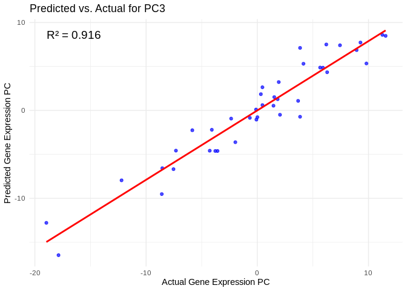<!-- -->

    ## `geom_smooth()` using formula = 'y ~ x'

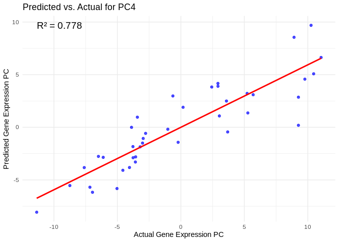<!-- -->

    ## `geom_smooth()` using formula = 'y ~ x'

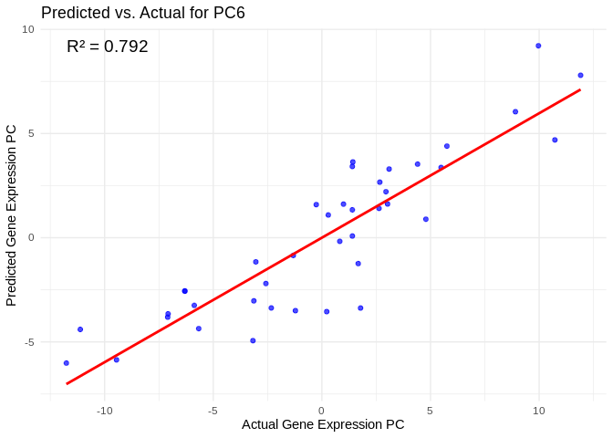<!-- -->

    ## `geom_smooth()` using formula = 'y ~ x'

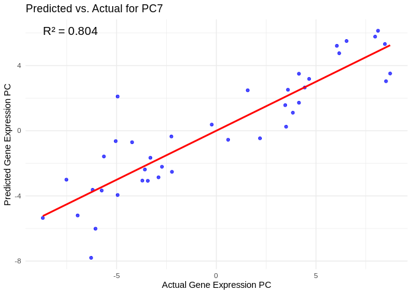<!-- -->

    ## `geom_smooth()` using formula = 'y ~ x'

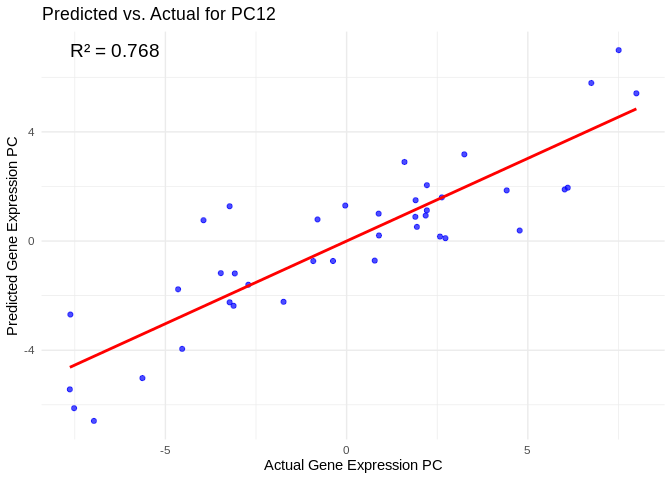<!-- -->

We can also look at which miRNA(s) contributed most to predicting gene
PCs of interest

``` r
get_feature_importance_for_pc <- function(model) {
  coefs <- as.matrix(coef(model, s = "lambda.min"))[-1, , drop = FALSE]  # Remove intercept
  coefs_df <- data.frame(Feature = rownames(coefs), Importance = abs(as.numeric(coefs)))
  
  return(coefs_df %>% arrange(desc(Importance)))  # Sort by importance
}

for (pc in all_pcs_Host_AFDW) {
  # Extract feature importance for the most predictable PC
  best_pc_model <- models_Host_AFDW[[pc]]
  best_pc_importance <- get_feature_importance_for_pc(best_pc_model)
  
  # Plot top most important miRNA for predicting this PC
  plot <- ggplot(best_pc_importance %>% head(20), aes(x = reorder(Feature, Importance), y = Importance)) +
    geom_bar(stat = "identity", fill = "steelblue") +
    coord_flip() +
    theme_minimal() +
    labs(title = paste("Top miRNA Predictors for", pc),
         x = "miRNA",
         y = "Importance Score")
  
  print(plot)
}
```

<!-- --><!-- --><!-- --><!-- --><!-- --><!-- -->

# 5 Symbiont photsynthesis (Am)

## 5.1 The model

Train elastic models to predict gene expression PCs from miRNA
expression

``` r
# Train models predicting gene expression PCs from miRNA expression
models_Am <- train_models(Am_pcs, vsd_miRNA)
```

Extract feature importance.

``` r
feature_importance_Am <- get_feature_importance(models_Am)
head(feature_importance_Am, 20)  # Top predictive miRNA
```

    ## # A tibble: 20 × 2
    ##    Feature       MeanImportance
    ##    <chr>                  <dbl>
    ##  1 Cluster_17173          1.27 
    ##  2 Cluster_9706           0.967
    ##  3 Cluster_9420           0.914
    ##  4 Cluster_5516           0.832
    ##  5 Cluster_14146          0.826
    ##  6 Cluster_5517           0.809
    ##  7 Cluster_1836           0.724
    ##  8 Cluster_4752           0.718
    ##  9 Cluster_1865           0.676
    ## 10 Cluster_4036           0.672
    ## 11 Cluster_17245          0.660
    ## 12 Cluster_14692          0.634
    ## 13 Cluster_17186          0.540
    ## 14 Cluster_17192          0.531
    ## 15 Cluster_2372           0.528
    ## 16 Cluster_9786           0.522
    ## 17 Cluster_4026           0.507
    ## 18 Cluster_10452          0.485
    ## 19 Cluster_17623          0.473
    ## 20 Cluster_16354          0.455

Evaluate performance.

``` r
performance_results_Am <- evaluate_model_performance(models_Am, Am_pcs, vsd_miRNA)
summary(performance_results_Am$R2)
```

    ##    Min. 1st Qu.  Median    Mean 3rd Qu.    Max.    NA's 
    ##  0.2536  0.5563  0.6951  0.6646  0.8340  0.9414      15

## 5.2 Results

Plot results.

``` r
# Select top predictive features
# few enough miRNA that we can show all
top_features_Am <- feature_importance_Am %>% top_n(50, MeanImportance)

# Plot
ggplot(top_features_Am, aes(x = reorder(Feature, MeanImportance), y = MeanImportance)) +
  geom_bar(stat = "identity", fill = "steelblue") +
  coord_flip() +  # Flip for readability
  theme_minimal() +
  labs(title = "miRNA as Predictive Features",
       x = "miRNA",
       y = "Mean Importance")
```

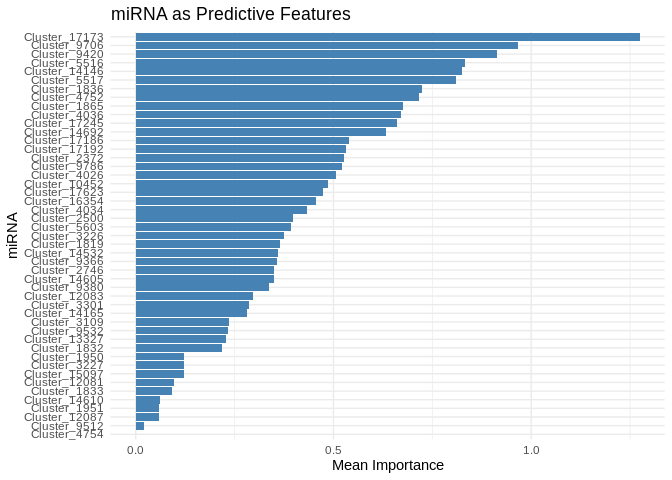<!-- -->

``` r
ggplot(performance_results_Am, aes(x = as.factor(PC), y = R2)) +
  geom_point(color = "darkred", size = 3) +
  geom_hline(yintercept = mean(performance_results_Am$R2, na.rm = TRUE), linetype = "dashed", color = "blue") +
  theme_minimal() +
  labs(title = "Model Performance Across Gene Expression PCs",
       x = "Gene Expression PC",
       y = "R² (Variance Explained)") +
  theme(axis.text.x = element_text(angle = 45, hjust = 1))  # Rotate labels
```

    ## Warning: Removed 15 rows containing missing values or values outside the scale range
    ## (`geom_point()`).

<!-- -->

View components associated with gene PCs

``` r
# Get the PCA rotation (loadings) matrix from the original gene PCA
loadings_Am <- pca_Am$rotation  # Each column corresponds to a PC

# Convert to data frame and reshape for plotting
loadings_Am_df <- as.data.frame(loadings_Am) %>%
  rownames_to_column(var = "gene") %>%
  pivot_longer(-gene, names_to = "Am_PC", values_to = "Loading")

# View top CpGs contributing most to each PC
top_genes_Am <- loadings_Am_df %>%
  group_by(Am_PC) %>%
  arrange(desc(abs(Loading))) %>%
  slice_head(n = 20)  # Select top 10 CpGs per PC

print(top_genes_Am)
```

    ## # A tibble: 800 × 3
    ## # Groups:   Am_PC [40]
    ##    gene       Am_PC Loading
    ##    <chr>      <chr>   <dbl>
    ##  1 FUN_011681 PC1   -0.0250
    ##  2 FUN_040949 PC1    0.0244
    ##  3 FUN_027962 PC1    0.0244
    ##  4 FUN_023373 PC1    0.0244
    ##  5 FUN_000239 PC1    0.0244
    ##  6 FUN_014926 PC1    0.0241
    ##  7 FUN_001784 PC1   -0.0240
    ##  8 FUN_016798 PC1   -0.0239
    ##  9 FUN_023033 PC1   -0.0239
    ## 10 FUN_016083 PC1   -0.0238
    ## # ℹ 790 more rows

View predicted vs actual gene expression values to evaluate model.

``` r
# Choose a gene expression PC to visualize (e.g., the most predictable one)
best_pc_Am <- performance_results_Am$PC[which.max(performance_results_Am$R2)]

# Extract actual and predicted values for that PC
actual_values_Am <- Am_pcs[[best_pc_Am]]
predicted_values_Am <- predict(models_Am[[best_pc_Am]], as.matrix(vsd_miRNA), s = "lambda.min")

# Create data frame
prediction_df_Am <- data.frame(
  Actual = actual_values_Am,
  Predicted = predicted_values_Am
)

# Scatter plot with regression line
ggplot(prediction_df_Am, aes(x = Actual, y = lambda.min)) +
  geom_point(color = "blue", alpha = 0.7) +
  geom_smooth(method = "lm", color = "red", se = FALSE) +
  theme_minimal() +
  labs(title = paste("Predicted vs. Actual for", best_pc_Am),
       x = "Actual Gene Expression PC",
       y = "Predicted Gene Expression PC") +
  annotate("text", x = min(actual_values_Am), y = max(predicted_values_Am), 
           label = paste("R² =", round(max(performance_results_Am$R2, na.rm=TRUE), 3)), 
           hjust = 0, color = "black", size = 5)
```

    ## `geom_smooth()` using formula = 'y ~ x'

<!-- -->

``` r
## `geom_smooth()` using formula = 'y ~ x'
```

View top 20 genes associated with the PC with the highest R^2

``` r
print(top_genes_Am%>%filter(Am_PC==best_pc_Am))
```

    ## # A tibble: 20 × 3
    ## # Groups:   Am_PC [1]
    ##    gene       Am_PC Loading
    ##    <chr>      <chr>   <dbl>
    ##  1 FUN_000870 PC5   -0.0479
    ##  2 FUN_031256 PC5   -0.0439
    ##  3 FUN_006410 PC5    0.0420
    ##  4 FUN_034999 PC5   -0.0416
    ##  5 FUN_018197 PC5    0.0411
    ##  6 FUN_036049 PC5   -0.0402
    ##  7 FUN_043250 PC5   -0.0400
    ##  8 FUN_011275 PC5   -0.0398
    ##  9 FUN_015215 PC5    0.0397
    ## 10 FUN_008217 PC5    0.0396
    ## 11 FUN_001269 PC5    0.0389
    ## 12 FUN_039800 PC5    0.0389
    ## 13 FUN_018741 PC5   -0.0382
    ## 14 FUN_003878 PC5   -0.0382
    ## 15 FUN_030103 PC5    0.0381
    ## 16 FUN_005241 PC5   -0.0378
    ## 17 FUN_035648 PC5    0.0378
    ## 18 FUN_033743 PC5    0.0377
    ## 19 FUN_029320 PC5   -0.0376
    ## 20 FUN_037177 PC5   -0.0375

Plot performance for all PCs

``` r
# Select all PCs with R^2 values above 0.75
all_pcs_Am <- performance_results_Am %>% filter(R2 > 0.75) %>% pull(PC)

for (pc in all_pcs_Am) {
  
  # Extract actual and predicted values for that PC
  actual_values <- Am_pcs[[pc]]
  predicted_values <- predict(models_Am[[pc]], as.matrix(vsd_miRNA), s = "lambda.min")
  
  # Create data frame
  prediction_df <- data.frame(
    Actual = actual_values,
    Predicted = predicted_values
  )
  
  # Scatter plot with regression line
  plot <- ggplot(prediction_df, aes(x = Actual, y = lambda.min)) +
    geom_point(color = "blue", alpha = 0.7) +
    geom_smooth(method = "lm", color = "red", se = FALSE) +
    theme_minimal() +
    labs(title = paste("Predicted vs. Actual for", pc),
         x = "Actual Gene Expression PC",
         y = "Predicted Gene Expression PC") +
    annotate("text", x = min(actual_values), y = max(predicted_values), 
             label = paste("R² =", round(max(performance_results_Am[performance_results_Am$PC==pc,2], na.rm=TRUE), 3)), 
             hjust = 0, color = "black", size = 5)
  
  print(plot)
}
```

    ## `geom_smooth()` using formula = 'y ~ x'

<!-- -->

    ## `geom_smooth()` using formula = 'y ~ x'

<!-- -->

    ## `geom_smooth()` using formula = 'y ~ x'

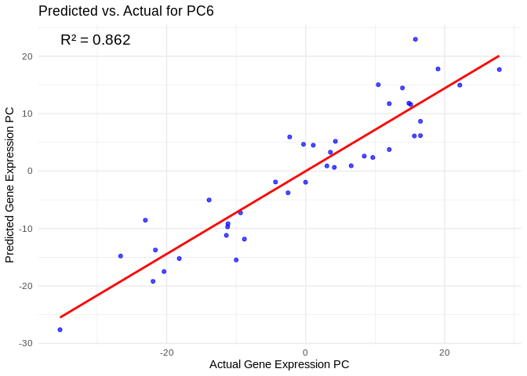<!-- -->

    ## `geom_smooth()` using formula = 'y ~ x'

<!-- -->

    ## `geom_smooth()` using formula = 'y ~ x'

<!-- -->

We can also look at which miRNA(s) contributed most to predicting gene
PCs of interest

``` r
get_feature_importance_for_pc <- function(model) {
  coefs <- as.matrix(coef(model, s = "lambda.min"))[-1, , drop = FALSE]  # Remove intercept
  coefs_df <- data.frame(Feature = rownames(coefs), Importance = abs(as.numeric(coefs)))
  
  return(coefs_df %>% arrange(desc(Importance)))  # Sort by importance
}

for (pc in all_pcs_Am) {
  # Extract feature importance for the most predictable PC
  best_pc_model <- models_Am[[pc]]
  best_pc_importance <- get_feature_importance_for_pc(best_pc_model)
  
  # Plot top most important miRNA for predicting this PC
  plot <- ggplot(best_pc_importance %>% head(20), aes(x = reorder(Feature, Importance), y = Importance)) +
    geom_bar(stat = "identity", fill = "steelblue") +
    coord_flip() +
    theme_minimal() +
    labs(title = paste("Top miRNA Predictors for", pc),
         x = "miRNA",
         y = "Importance Score")
  
  print(plot)
}
```

<!-- --><!-- --><!-- --><!-- --><!-- -->

# 6 ATP production (GO terms)

## 6.1 The model

Train elastic models to predict gene expression PCs from miRNA
expression

``` r
# Train models predicting gene expression PCs from miRNA expression
models_ATP_prod_GO <- train_models(ATP_prod_GO_pcs, vsd_miRNA)
```

Extract feature importance.

``` r
feature_importance_ATP_prod_GO <- get_feature_importance(models_ATP_prod_GO)
head(feature_importance_ATP_prod_GO, 20)  # Top predictive miRNA
```

    ## # A tibble: 20 × 2
    ##    Feature       MeanImportance
    ##    <chr>                  <dbl>
    ##  1 Cluster_2372          0.150 
    ##  2 Cluster_17623         0.120 
    ##  3 Cluster_9366          0.101 
    ##  4 Cluster_17173         0.0934
    ##  5 Cluster_3109          0.0889
    ##  6 Cluster_14146         0.0879
    ##  7 Cluster_4026          0.0797
    ##  8 Cluster_4752          0.0754
    ##  9 Cluster_10452         0.0744
    ## 10 Cluster_9786          0.0706
    ## 11 Cluster_14165         0.0681
    ## 12 Cluster_5516          0.0672
    ## 13 Cluster_1865          0.0641
    ## 14 Cluster_17245         0.0622
    ## 15 Cluster_16354         0.0578
    ## 16 Cluster_14692         0.0550
    ## 17 Cluster_5603          0.0526
    ## 18 Cluster_9706          0.0467
    ## 19 Cluster_17186         0.0384
    ## 20 Cluster_12081         0.0373

Evaluate performance.

``` r
performance_results_ATP_prod_GO <- evaluate_model_performance(models_ATP_prod_GO, ATP_prod_GO_pcs, vsd_miRNA)
summary(performance_results_ATP_prod_GO$R2)
```

    ##    Min. 1st Qu.  Median    Mean 3rd Qu.    Max.    NA's 
    ##  0.2498  0.4040  0.7439  0.6260  0.7851  0.8532       2

## 6.2 Results

Plot results.

``` r
# Select top predictive features
# few enough miRNA that we can show all
top_features_ATP_prod_GO <- feature_importance_ATP_prod_GO %>% top_n(50, MeanImportance)

# Plot
ggplot(top_features_ATP_prod_GO, aes(x = reorder(Feature, MeanImportance), y = MeanImportance)) +
  geom_bar(stat = "identity", fill = "steelblue") +
  coord_flip() +  # Flip for readability
  theme_minimal() +
  labs(title = "miRNA as Predictive Features",
       x = "miRNA",
       y = "Mean Importance")
```

<!-- -->

``` r
ggplot(performance_results_ATP_prod_GO, aes(x = as.factor(PC), y = R2)) +
  geom_point(color = "darkred", size = 3) +
  geom_hline(yintercept = mean(performance_results_ATP_prod_GO$R2, na.rm = TRUE), linetype = "dashed", color = "blue") +
  theme_minimal() +
  labs(title = "Model Performance Across Gene Expression PCs",
       x = "Gene Expression PC",
       y = "R² (Variance Explained)") +
  theme(axis.text.x = element_text(angle = 45, hjust = 1))  # Rotate labels
```

    ## Warning: Removed 2 rows containing missing values or values outside the scale range
    ## (`geom_point()`).

<!-- -->

View components associated with gene PCs

``` r
# Get the PCA rotation (loadings) matrix from the original gene PCA
loadings_ATP_prod_GO <- pca_ATP_prod_GO$rotation  # Each column corresponds to a PC

# Convert to data frame and reshape for plotting
loadings_ATP_prod_GO_df <- as.data.frame(loadings_ATP_prod_GO) %>%
  rownames_to_column(var = "gene") %>%
  pivot_longer(-gene, names_to = "ATP_prod_GO_PC", values_to = "Loading")

# View top CpGs contributing most to each PC
top_genes_ATP_prod_GO <- loadings_ATP_prod_GO_df %>%
  group_by(ATP_prod_GO_PC) %>%
  arrange(desc(abs(Loading))) %>%
  slice_head(n = 20)  # Select top 10 CpGs per PC

print(top_genes_ATP_prod_GO)
```

    ## # A tibble: 440 × 3
    ## # Groups:   ATP_prod_GO_PC [22]
    ##    gene       ATP_prod_GO_PC Loading
    ##    <chr>      <chr>            <dbl>
    ##  1 FUN_025802 PC1             -0.328
    ##  2 FUN_025367 PC1             -0.316
    ##  3 FUN_000960 PC1             -0.313
    ##  4 FUN_031975 PC1             -0.311
    ##  5 FUN_031686 PC1             -0.290
    ##  6 FUN_014565 PC1             -0.277
    ##  7 FUN_007016 PC1             -0.246
    ##  8 FUN_039808 PC1             -0.243
    ##  9 FUN_038166 PC1             -0.242
    ## 10 FUN_025823 PC1             -0.208
    ## # ℹ 430 more rows

View predicted vs actual gene expression values to evaluate model.

``` r
# Choose a gene expression PC to visualize (e.g., the most predictable one)
best_pc_ATP_prod_GO <- performance_results_ATP_prod_GO$PC[which.max(performance_results_ATP_prod_GO$R2)]

# Extract actual and predicted values for that PC
actual_values_ATP_prod_GO <- ATP_prod_GO_pcs[[best_pc_ATP_prod_GO]]
predicted_values_ATP_prod_GO <- predict(models_ATP_prod_GO[[best_pc_ATP_prod_GO]], as.matrix(vsd_miRNA), s = "lambda.min")

# Create data frame
prediction_df_ATP_prod_GO <- data.frame(
  Actual = actual_values_ATP_prod_GO,
  Predicted = predicted_values_ATP_prod_GO
)

# Scatter plot with regression line
ggplot(prediction_df_ATP_prod_GO, aes(x = Actual, y = lambda.min)) +
  geom_point(color = "blue", alpha = 0.7) +
  geom_smooth(method = "lm", color = "red", se = FALSE) +
  theme_minimal() +
  labs(title = paste("Predicted vs. Actual for", best_pc_ATP_prod_GO),
       x = "Actual Gene Expression PC",
       y = "Predicted Gene Expression PC") +
  annotate("text", x = min(actual_values_ATP_prod_GO), y = max(predicted_values_ATP_prod_GO), 
           label = paste("R² =", round(max(performance_results_ATP_prod_GO$R2, na.rm=TRUE), 3)), 
           hjust = 0, color = "black", size = 5)
```

    ## `geom_smooth()` using formula = 'y ~ x'

<!-- -->

``` r
## `geom_smooth()` using formula = 'y ~ x'
```

View top 20 genes associated with the PC with the highest R^2

``` r
print(top_genes_ATP_prod_GO%>%filter(ATP_prod_GO_PC==best_pc_ATP_prod_GO))
```

    ## # A tibble: 20 × 3
    ## # Groups:   ATP_prod_GO_PC [1]
    ##    gene       ATP_prod_GO_PC Loading
    ##    <chr>      <chr>            <dbl>
    ##  1 FUN_038727 PC10           -0.540 
    ##  2 FUN_009532 PC10            0.319 
    ##  3 FUN_033885 PC10            0.303 
    ##  4 FUN_014565 PC10           -0.288 
    ##  5 FUN_007016 PC10            0.285 
    ##  6 FUN_038738 PC10           -0.251 
    ##  7 FUN_036898 PC10            0.247 
    ##  8 FUN_031975 PC10            0.226 
    ##  9 FUN_025823 PC10           -0.189 
    ## 10 FUN_040783 PC10            0.188 
    ## 11 FUN_039808 PC10            0.178 
    ## 12 FUN_014563 PC10           -0.130 
    ## 13 FUN_028263 PC10           -0.122 
    ## 14 FUN_025802 PC10            0.120 
    ## 15 FUN_025367 PC10           -0.108 
    ## 16 FUN_031686 PC10           -0.0718
    ## 17 FUN_014564 PC10            0.0558
    ## 18 FUN_015065 PC10            0.0480
    ## 19 FUN_038166 PC10            0.0475
    ## 20 FUN_032701 PC10            0.0323

Plot performance for all PCs

``` r
# Select all PCs with R^2 values above line in plot
all_pcs_ATP_prod_GO <- performance_results_ATP_prod_GO %>% filter(R2 > 0.75) %>% pull(PC)

for (pc in all_pcs_ATP_prod_GO) {
  
  # Extract actual and predicted values for that PC
  actual_values <- ATP_prod_GO_pcs[[pc]]
  predicted_values <- predict(models_ATP_prod_GO[[pc]], as.matrix(vsd_miRNA), s = "lambda.min")
  
  # Create data frame
  prediction_df <- data.frame(
    Actual = actual_values,
    Predicted = predicted_values
  )
  
  # Scatter plot with regression line
  plot <- ggplot(prediction_df, aes(x = Actual, y = lambda.min)) +
    geom_point(color = "blue", alpha = 0.7) +
    geom_smooth(method = "lm", color = "red", se = FALSE) +
    theme_minimal() +
    labs(title = paste("Predicted vs. Actual for", pc),
         x = "Actual Gene Expression PC",
         y = "Predicted Gene Expression PC") +
    annotate("text", x = min(actual_values), y = max(predicted_values), 
             label = paste("R² =", round(max(performance_results_ATP_prod_GO[performance_results_ATP_prod_GO$PC==pc,2], na.rm=TRUE), 3)), 
             hjust = 0, color = "black", size = 5)
  
  print(plot)
}
```

    ## `geom_smooth()` using formula = 'y ~ x'

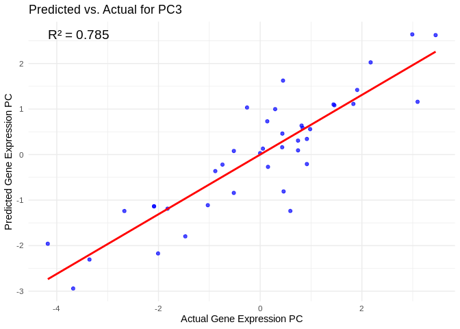<!-- -->

    ## `geom_smooth()` using formula = 'y ~ x'

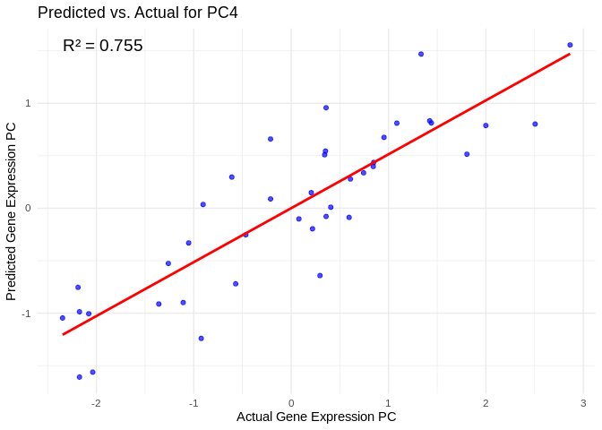<!-- -->

    ## `geom_smooth()` using formula = 'y ~ x'

<!-- -->

    ## `geom_smooth()` using formula = 'y ~ x'

<!-- -->

We can also look at which miRNA(s) contributed most to predicting gene
PCs of interest

``` r
get_feature_importance_for_pc <- function(model) {
  coefs <- as.matrix(coef(model, s = "lambda.min"))[-1, , drop = FALSE]  # Remove intercept
  coefs_df <- data.frame(Feature = rownames(coefs), Importance = abs(as.numeric(coefs)))
  
  return(coefs_df %>% arrange(desc(Importance)))  # Sort by importance
}

for (pc in all_pcs_ATP_prod_GO) {
  # Extract feature importance for the most predictable PC
  best_pc_model <- models_ATP_prod_GO[[pc]]
  best_pc_importance <- get_feature_importance_for_pc(best_pc_model)
  
  # Plot top most important miRNA for predicting this PC
  plot <- ggplot(best_pc_importance %>% head(20), aes(x = reorder(Feature, Importance), y = Importance)) +
    geom_bar(stat = "identity", fill = "steelblue") +
    coord_flip() +
    theme_minimal() +
    labs(title = paste("Top miRNA Predictors for", pc),
         x = "miRNA",
         y = "Importance Score")
  
  print(plot)
}
```

<!-- --><!-- --><!-- --><!-- -->

# 7 Energy Usage/Storage (GO terms)

## 7.1 The model

Train elastic models to predict gene expression PCs from miRNA
expression

``` r
# Train models predicting gene expression PCs from miRNA expression
models_energy_GO <- train_models(energy_GO_pcs, vsd_miRNA)
```

Extract feature importance.

``` r
feature_importance_energy_GO <- get_feature_importance(models_energy_GO)
head(feature_importance_energy_GO, 20)  # Top predictive miRNA
```

    ## # A tibble: 20 × 2
    ##    Feature       MeanImportance
    ##    <chr>                  <dbl>
    ##  1 Cluster_17173         0.222 
    ##  2 Cluster_5516          0.202 
    ##  3 Cluster_17623         0.192 
    ##  4 Cluster_2372          0.184 
    ##  5 Cluster_17192         0.181 
    ##  6 Cluster_9420          0.170 
    ##  7 Cluster_9786          0.169 
    ##  8 Cluster_14146         0.164 
    ##  9 Cluster_5517          0.150 
    ## 10 Cluster_14605         0.142 
    ## 11 Cluster_3301          0.140 
    ## 12 Cluster_1819          0.129 
    ## 13 Cluster_17186         0.105 
    ## 14 Cluster_14165         0.104 
    ## 15 Cluster_10452         0.0935
    ## 16 Cluster_9366          0.0924
    ## 17 Cluster_4752          0.0864
    ## 18 Cluster_4036          0.0862
    ## 19 Cluster_1865          0.0838
    ## 20 Cluster_3226          0.0816

Evaluate performance.

``` r
performance_results_energy_GO <- evaluate_model_performance(models_energy_GO, energy_GO_pcs, vsd_miRNA)
summary(performance_results_energy_GO$R2)
```

    ##    Min. 1st Qu.  Median    Mean 3rd Qu.    Max.    NA's 
    ##  0.1121  0.5775  0.6554  0.6060  0.7653  0.9519      13

## 7.2 Results

Plot results.

``` r
# Select top predictive features
# few enough miRNA that we can show all
top_features_energy_GO <- feature_importance_energy_GO %>% top_n(50, MeanImportance)

# Plot
ggplot(top_features_energy_GO, aes(x = reorder(Feature, MeanImportance), y = MeanImportance)) +
  geom_bar(stat = "identity", fill = "steelblue") +
  coord_flip() +  # Flip for readability
  theme_minimal() +
  labs(title = "miRNA as Predictive Features",
       x = "miRNA",
       y = "Mean Importance")
```

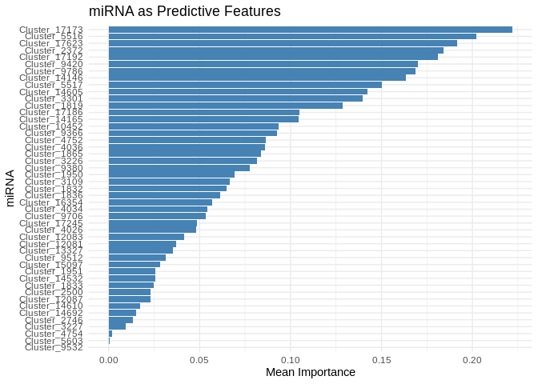<!-- -->

``` r
ggplot(performance_results_energy_GO, aes(x = as.factor(PC), y = R2)) +
  geom_point(color = "darkred", size = 3) +
  geom_hline(yintercept = mean(performance_results_energy_GO$R2, na.rm = TRUE), linetype = "dashed", color = "blue") +
  theme_minimal() +
  labs(title = "Model Performance Across Gene Expression PCs",
       x = "Gene Expression PC",
       y = "R² (Variance Explained)") +
  theme(axis.text.x = element_text(angle = 45, hjust = 1))  # Rotate labels
```

    ## Warning: Removed 13 rows containing missing values or values outside the scale range
    ## (`geom_point()`).

<!-- -->

View components associated with gene PCs

``` r
# Get the PCA rotation (loadings) matrix from the original gene PCA
loadings_energy_GO <- pca_energy_GO$rotation  # Each column corresponds to a PC

# Convert to data frame and reshape for plotting
loadings_energy_GO_df <- as.data.frame(loadings_energy_GO) %>%
  rownames_to_column(var = "gene") %>%
  pivot_longer(-gene, names_to = "energy_GO_PC", values_to = "Loading")

# View top CpGs contributing most to each PC
top_genes_energy_GO <- loadings_energy_GO_df %>%
  group_by(energy_GO_PC) %>%
  arrange(desc(abs(Loading))) %>%
  slice_head(n = 20)  # Select top 10 CpGs per PC

print(top_genes_energy_GO)
```

    ## # A tibble: 800 × 3
    ## # Groups:   energy_GO_PC [40]
    ##    gene       energy_GO_PC Loading
    ##    <chr>      <chr>          <dbl>
    ##  1 FUN_028200 PC1           -0.115
    ##  2 FUN_040444 PC1           -0.113
    ##  3 FUN_017915 PC1           -0.112
    ##  4 FUN_001396 PC1            0.109
    ##  5 FUN_026618 PC1            0.108
    ##  6 FUN_029673 PC1            0.107
    ##  7 FUN_023596 PC1           -0.107
    ##  8 FUN_000370 PC1            0.106
    ##  9 FUN_039293 PC1           -0.106
    ## 10 FUN_001160 PC1            0.105
    ## # ℹ 790 more rows

View predicted vs actual gene expression values to evaluate model.

``` r
# Choose a gene expression PC to visualize (e.g., the most predictable one)
best_pc_energy_GO <- performance_results_energy_GO$PC[which.max(performance_results_energy_GO$R2)]

# Extract actual and predicted values for that PC
actual_values_energy_GO <- energy_GO_pcs[[best_pc_energy_GO]]
predicted_values_energy_GO <- predict(models_energy_GO[[best_pc_energy_GO]], as.matrix(vsd_miRNA), s = "lambda.min")

# Create data frame
prediction_df_energy_GO <- data.frame(
  Actual = actual_values_energy_GO,
  Predicted = predicted_values_energy_GO
)

# Scatter plot with regression line
ggplot(prediction_df_energy_GO, aes(x = Actual, y = lambda.min)) +
  geom_point(color = "blue", alpha = 0.7) +
  geom_smooth(method = "lm", color = "red", se = FALSE) +
  theme_minimal() +
  labs(title = paste("Predicted vs. Actual for", best_pc_energy_GO),
       x = "Actual Gene Expression PC",
       y = "Predicted Gene Expression PC") +
  annotate("text", x = min(actual_values_energy_GO), y = max(predicted_values_energy_GO), 
           label = paste("R² =", round(max(performance_results_energy_GO$R2, na.rm=TRUE), 3)), 
           hjust = 0, color = "black", size = 5)
```

    ## `geom_smooth()` using formula = 'y ~ x'

<!-- -->

``` r
## `geom_smooth()` using formula = 'y ~ x'
```

View top 20 genes associated with the PC with the highest R^2

``` r
print(top_genes_energy_GO%>%filter(energy_GO_PC==best_pc_energy_GO))
```

    ## # A tibble: 20 × 3
    ## # Groups:   energy_GO_PC [1]
    ##    gene       energy_GO_PC Loading
    ##    <chr>      <chr>          <dbl>
    ##  1 FUN_042982 PC3           0.176 
    ##  2 FUN_008385 PC3           0.140 
    ##  3 FUN_036246 PC3           0.139 
    ##  4 FUN_014563 PC3           0.134 
    ##  5 FUN_011723 PC3          -0.131 
    ##  6 FUN_031898 PC3           0.124 
    ##  7 FUN_015086 PC3           0.123 
    ##  8 FUN_037137 PC3          -0.121 
    ##  9 FUN_015261 PC3           0.120 
    ## 10 FUN_023676 PC3           0.119 
    ## 11 FUN_013363 PC3          -0.118 
    ## 12 FUN_014844 PC3          -0.118 
    ## 13 FUN_022926 PC3          -0.109 
    ## 14 FUN_037111 PC3          -0.107 
    ## 15 FUN_014565 PC3           0.104 
    ## 16 FUN_040116 PC3          -0.104 
    ## 17 FUN_022700 PC3           0.101 
    ## 18 FUN_029437 PC3           0.101 
    ## 19 FUN_007022 PC3          -0.100 
    ## 20 FUN_022927 PC3          -0.0997

Plot performance for all PCs

``` r
# Select all PCs with R^2 values above line in plot
all_pcs_energy_GO <- performance_results_energy_GO %>% filter(R2 > 0.75) %>% pull(PC)

for (pc in all_pcs_energy_GO) {
  
  # Extract actual and predicted values for that PC
  actual_values <- energy_GO_pcs[[pc]]
  predicted_values <- predict(models_energy_GO[[pc]], as.matrix(vsd_miRNA), s = "lambda.min")
  
  # Create data frame
  prediction_df <- data.frame(
    Actual = actual_values,
    Predicted = predicted_values
  )
  
  # Scatter plot with regression line
  plot <- ggplot(prediction_df, aes(x = Actual, y = lambda.min)) +
    geom_point(color = "blue", alpha = 0.7) +
    geom_smooth(method = "lm", color = "red", se = FALSE) +
    theme_minimal() +
    labs(title = paste("Predicted vs. Actual for", pc),
         x = "Actual Gene Expression PC",
         y = "Predicted Gene Expression PC") +
    annotate("text", x = min(actual_values), y = max(predicted_values), 
             label = paste("R² =", round(max(performance_results_energy_GO[performance_results_energy_GO$PC==pc,2], na.rm=TRUE), 3)), 
             hjust = 0, color = "black", size = 5)
  
  print(plot)
}
```

    ## `geom_smooth()` using formula = 'y ~ x'

<!-- -->

    ## `geom_smooth()` using formula = 'y ~ x'

<!-- -->

    ## `geom_smooth()` using formula = 'y ~ x'

<!-- -->

    ## `geom_smooth()` using formula = 'y ~ x'

<!-- -->

We can also look at which miRNA(s) contributed most to predicting gene
PCs of interest

``` r
get_feature_importance_for_pc <- function(model) {
  coefs <- as.matrix(coef(model, s = "lambda.min"))[-1, , drop = FALSE]  # Remove intercept
  coefs_df <- data.frame(Feature = rownames(coefs), Importance = abs(as.numeric(coefs)))
  
  return(coefs_df %>% arrange(desc(Importance)))  # Sort by importance
}

for (pc in all_pcs_energy_GO) {
  # Extract feature importance for the most predictable PC
  best_pc_model <- models_energy_GO[[pc]]
  best_pc_importance <- get_feature_importance_for_pc(best_pc_model)
  
  # Plot top most important miRNA for predicting this PC
  plot <- ggplot(best_pc_importance %>% head(20), aes(x = reorder(Feature, Importance), y = Importance)) +
    geom_bar(stat = "identity", fill = "steelblue") +
    coord_flip() +
    theme_minimal() +
    labs(title = paste("Top miRNA Predictors for", pc),
         x = "miRNA",
         y = "Importance Score")
  
  print(plot)
}
```

<!-- -->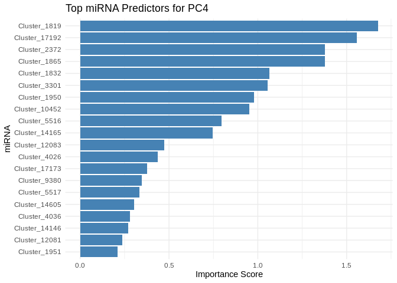<!-- --><!-- -->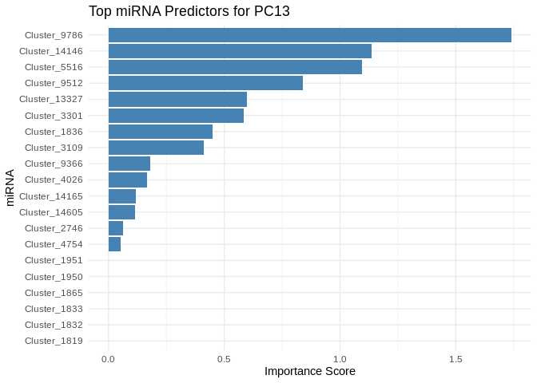<!-- -->

# 8 Compare

Visualize the relative importance of miRNA in predicting expression for
these different gene sets:

``` r
# Perfomr min-max normalization on the mean importance of miRNA for each group
# This will place all along a 0-1 range for comparison purposes
normalize <- function(x) {
  (x - min(x)) / (max(x) - min(x))
}

# Normalize
top_features_Host_AFDW$MeanImportance_norm <- normalize(top_features_Host_AFDW$MeanImportance)
top_features_Am$MeanImportance_norm <- normalize(top_features_Am$MeanImportance)
top_features_ATP_prod_GO$MeanImportance_norm <- normalize(top_features_ATP_prod_GO$MeanImportance)
top_features_energy_GO$MeanImportance_norm <- normalize(top_features_energy_GO$MeanImportance)

# Add group labels
top_features_Host_AFDW <- top_features_Host_AFDW %>% mutate(group = "Host_AFDW")
top_features_Am <- top_features_Am %>% mutate(group = "Am")
top_features_ATP_prod_GO <- top_features_ATP_prod_GO %>% mutate(group = "ATP_prod_GO")
top_features_energy_GO <- top_features_energy_GO %>% mutate(group = "energy_GO")

# Set rows in same order
top_features_Am <- top_features_Am[rownames(top_features_Host_AFDW),]
top_features_ATP_prod_GO <- top_features_ATP_prod_GO[rownames(top_features_Host_AFDW),]
top_features_energy_GO <- top_features_energy_GO[rownames(top_features_Host_AFDW),]

# Combine
all_gene_sets <- bind_rows(top_features_Host_AFDW, top_features_Am, top_features_ATP_prod_GO, top_features_energy_GO)
# Remove raw mean importance
all_gene_sets <- all_gene_sets %>% select(!MeanImportance)

# Wide format: rows = miRNAs, columns = groups
heatmap_df <- all_gene_sets %>%
  pivot_wider(names_from = group, values_from = MeanImportance_norm)

heatmap_df <- as.data.frame(heatmap_df)

# Melt into long format for ggplot
heatmap_long <- melt(heatmap_df, id.vars = "Feature")

ggplot(heatmap_long, aes(x = variable, y = Feature, fill = value)) +
  geom_tile(color = "white") +
  scale_fill_gradient(low = "white", high = "red") +
  theme_minimal() +
  labs(x = "Group", y = "Feature", fill = "Importance") +
  theme(axis.text.x = element_text(angle = 45, hjust = 1))
```

<!-- -->

Cluster by miRNA importance

``` r
# Make Feature column the rownames and convert to matrix
rownames(heatmap_df) <- heatmap_df$Feature
heatmap_matrix <- as.matrix(heatmap_df[, -1])  # Removes the 'Feature' column

pheatmap(
  heatmap_matrix, 
  cluster_rows = TRUE,  # Clustering miRNAs (rows) by similarity in importance
  cluster_cols = TRUE,  # Clustering groups (columns)
  scale = "none",  # No scaling (since data is already normalized)
  show_rownames = TRUE,  # Show miRNA names
  show_colnames = TRUE,  # Show group names
  color = colorRampPalette(c("white", "red"))(100),  # Red gradient for importance
  main = "miRNAs Importance Across Groups"  # Title of the heatmap
)
```

<!-- -->
