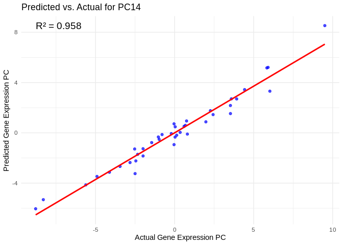
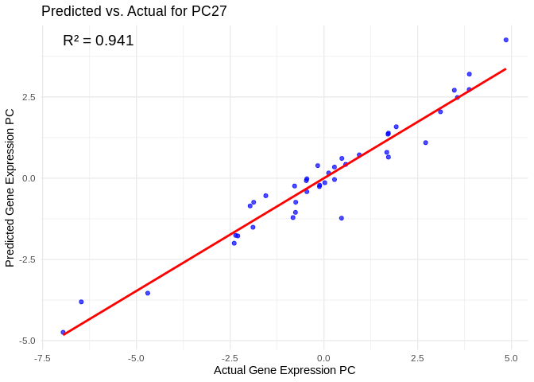
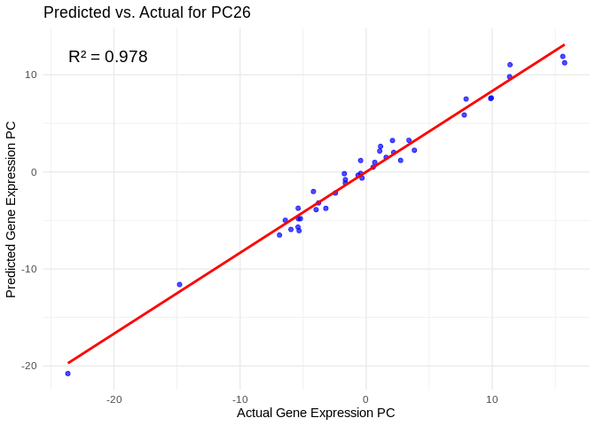
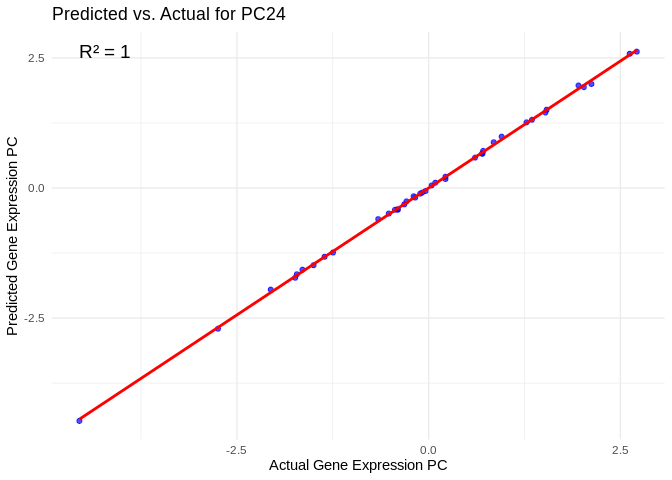
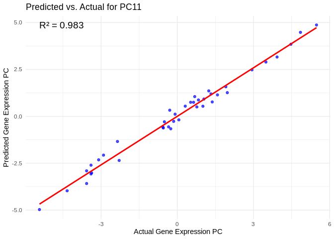

22.2-Apul-multiomic-machine-learning
================
Kathleen Durkin
2025-04-18

- <a href="#1-set-up" id="toc-1-set-up">1 Set up</a>
- <a href="#2-load-libraries" id="toc-2-load-libraries">2 Load
  libraries</a>
- <a href="#3-load-and-format-data" id="toc-3-load-and-format-data">3 Load
  and format data</a>
  - <a href="#31-rna-seq-data-mrna-mirna-lncrna"
    id="toc-31-rna-seq-data-mrna-mirna-lncrna">3.1 RNA-seq data (mRNA,
    miRNA, lncRNA)</a>
  - <a href="#32-wgbs-data" id="toc-32-wgbs-data">3.2 WGBS data</a>
  - <a href="#33-filter-data-sets" id="toc-33-filter-data-sets">3.3 Filter
    data sets</a>
  - <a href="#34-transform-data" id="toc-34-transform-data">3.4 Transform
    data</a>
  - <a href="#35-islolate-gene-sets" id="toc-35-islolate-gene-sets">3.5
    Islolate gene sets</a>
- <a href="#4-feature-selection" id="toc-4-feature-selection">4 Feature
  selection</a>
  - <a href="#41-all-genes" id="toc-41-all-genes">4.1 All genes</a>
  - <a href="#42-lncrna" id="toc-42-lncrna">4.2 lncRNA</a>
  - <a href="#43-mirna" id="toc-43-mirna">4.3 miRNA</a>
  - <a href="#44-wgbs" id="toc-44-wgbs">4.4 WGBS</a>
  - <a href="#45-host_afdw" id="toc-45-host_afdw">4.5 Host_AFDW</a>
  - <a href="#46-am" id="toc-46-am">4.6 Am</a>
  - <a href="#47-atp-production-go-terms"
    id="toc-47-atp-production-go-terms">4.7 ATP production GO terms</a>
  - <a href="#48-energy-usagestorage-go-terms"
    id="toc-48-energy-usagestorage-go-terms">4.8 Energy usage/storage GO
    terms</a>
- <a href="#5-merge-predictor-features"
  id="toc-5-merge-predictor-features">5 Merge predictor features</a>
- <a href="#6-all-genes" id="toc-6-all-genes">6 All genes</a>
  - <a href="#61-the-model" id="toc-61-the-model">6.1 The model</a>
  - <a href="#62-results" id="toc-62-results">6.2 Results</a>
- <a href="#7-host-biomass-host_afdw" id="toc-7-host-biomass-host_afdw">7
  Host biomass (Host_AFDW)</a>
  - <a href="#71-the-model" id="toc-71-the-model">7.1 The model</a>
  - <a href="#72-results" id="toc-72-results">7.2 Results</a>
- <a href="#8-symbiont-photsynthesis-am"
  id="toc-8-symbiont-photsynthesis-am">8 Symbiont photsynthesis (Am)</a>
  - <a href="#81-the-model" id="toc-81-the-model">8.1 The model</a>
  - <a href="#82-results" id="toc-82-results">8.2 Results</a>
- <a href="#9-atp-production-go-terms"
  id="toc-9-atp-production-go-terms">9 ATP production (GO terms)</a>
  - <a href="#91-the-model" id="toc-91-the-model">9.1 The model</a>
  - <a href="#92-results" id="toc-92-results">9.2 Results</a>
- <a href="#10-energy-usagestorage-go-terms"
  id="toc-10-energy-usagestorage-go-terms">10 Energy Usage/Storage (GO
  terms)</a>
  - <a href="#101-the-model" id="toc-101-the-model">10.1 The model</a>
  - <a href="#102-results" id="toc-102-results">10.2 Results</a>
- <a href="#11-compare" id="toc-11-compare">11 Compare</a>

Applying ML model using multiomic predictors – miRNA + lncRNA +
methylation as predictors of gene expression

Inputs:

- RNA counts matrix (raw):
  `../output/02.20-D-Apul-RNAseq-alignment-HiSat2/apul-gene_count_matrix.csv`

- Gene sets of interest:
  `../output/21-Apul-annotate-miRNA-mRNA-WGCNA/filtered-gene-sets/`

- sRNA/miRNA counts matrix (raw):
  `../output/03.10-D-Apul-sRNAseq-expression-DESeq2/Apul_miRNA_ShortStack_counts_formatted.txt`

- lncRNA counts matrix (raw): `../output/08-Apul-lncNRA/counts.txt`

- WGBS data (processed):

- sample metadata: `../../M-multi-species/data/rna_metadata.csv`

# 1 Set up

# 2 Load libraries

``` r
library(tidyverse)
library(ggplot2)
library(DESeq2)
library(igraph)
library(psych)
library(tidygraph)
library(ggraph)
library(WGCNA)
library(edgeR)
library(reshape2)
library(ggcorrplot)
library(corrplot)
library(rvest)
library(purrr)
library(pheatmap)
library(glmnet)
library(caret)
library(factoextra)
library(vegan)
library(ggfortify)
library(genefilter)
library(scales)
```

The model includes random processes, so set a seed for reproducability.
Note: for final results, should we consider bootstrapping to ensure
reported results are representative?

``` r
set.seed(703)
```

# 3 Load and format data

## 3.1 RNA-seq data (mRNA, miRNA, lncRNA)

``` r
### mRNA ###
# raw gene counts data (will filter and variance stabilize)
Apul_genes <- read_csv("../output/02.20-D-Apul-RNAseq-alignment-HiSat2/apul-gene_count_matrix.csv")
```

    ## Rows: 44371 Columns: 41
    ## ── Column specification ────────────────────────────────────────────────────────
    ## Delimiter: ","
    ## chr  (1): gene_id
    ## dbl (40): 1A1, 1A10, 1A12, 1A2, 1A8, 1A9, 1B1, 1B10, 1B2, 1B5, 1B9, 1C10, 1C...
    ## 
    ## ℹ Use `spec()` to retrieve the full column specification for this data.
    ## ℹ Specify the column types or set `show_col_types = FALSE` to quiet this message.

``` r
Apul_genes <- as.data.frame(Apul_genes)

# format gene IDs as rownames (instead of a column)
rownames(Apul_genes) <- Apul_genes$gene_id
Apul_genes <- Apul_genes%>%select(!gene_id)


### miRNA ###
# raw miRNA counts (will filter and variance stabilize)
Apul_miRNA <- read.table(file = "../output/03.10-D-Apul-sRNAseq-expression-DESeq2/Apul_miRNA_ShortStack_counts_formatted.txt", header = TRUE, sep = "\t", check.names = FALSE)


### lncRNA ###
# raw lncRNA counts (will filter and variance stabilize)
Apul_lncRNA_full <- read.table("../output/08-Apul-lncRNA/counts.txt", header = TRUE, sep = "\t", skip = 1)

# Remove info on genomic location, set lncRNA IDs as rownames
rownames(Apul_lncRNA_full) <- Apul_lncRNA_full$Geneid
Apul_lncRNA <- Apul_lncRNA_full %>% select(-Geneid, -Chr, -Start, -End, -Strand, -Length)


### load and format metadata ###
metadata <- read_csv("../../M-multi-species/data/rna_metadata.csv")%>%select(AzentaSampleName, ColonyID, Timepoint) %>%
  filter(grepl("ACR", ColonyID))
```

    ## New names:
    ## Rows: 117 Columns: 19
    ## ── Column specification
    ## ──────────────────────────────────────────────────────── Delimiter: "," chr
    ## (13): SampleName, WellNumber, AzentaSampleName, ColonyID, Timepoint, Sam... dbl
    ## (5): SampleNumber, Plate, TotalAmount-ng, Volume-uL, Conc-ng.uL lgl (1):
    ## MethodUsedForSpectrophotometry
    ## ℹ Use `spec()` to retrieve the full column specification for this data. ℹ
    ## Specify the column types or set `show_col_types = FALSE` to quiet this message.
    ## • `` -> `...19`

``` r
metadata$Sample <- paste0(metadata$ColonyID, "-", metadata$Timepoint)
rownames(metadata) <- metadata$Sample
```

    ## Warning: Setting row names on a tibble is deprecated.

``` r
colonies <- unique(metadata$ColonyID)

# Rename gene column names to include full sample info
colnames(Apul_genes) <- metadata$Sample[match(colnames(Apul_genes), metadata$AzentaSampleName)]

# Rename miRNA column names to match formatting
colnames(Apul_miRNA) <- sub("_.*", "", colnames(Apul_miRNA))
colnames(Apul_miRNA) <- metadata$Sample[match(colnames(Apul_miRNA), metadata$AzentaSampleName)]

# rename lncRNA colin names to include full sample info
colnames(Apul_lncRNA) <- sub("...data.", "", colnames(Apul_lncRNA))
colnames(Apul_lncRNA) <- sub(".sorted.bam", "", colnames(Apul_lncRNA))
colnames(Apul_lncRNA) <- metadata$Sample[match(colnames(Apul_lncRNA), metadata$AzentaSampleName)]
```

## 3.2 WGBS data

``` r
#pull processed files from Gannet 
# Note: Unfortunately we can't use the `cache` feature to make this process more time efficient, as it doesn't support long vectors

# Define the base URL
base_url <- "https://gannet.fish.washington.edu/seashell/bu-github/timeseries_molecular/D-Apul/output/15.5-Apul-bismark/"

# Read the HTML page
page <- read_html(base_url)

# Extract links to files
file_links <- page %>%
  html_nodes("a") %>%
  html_attr("href")

# Filter for files ending in "processed.txt"
processed_files <- file_links[grepl("processed\\.txt$", file_links)]

# Create full URLs
file_urls <- paste0(base_url, processed_files)

# Function to read a file from URL
read_processed_file <- function(url) {
  read_table(url, col_types = cols(.default = "c"))  # Read as character to avoid parsing issues
}

# Import all processed files into a list
processed_data <- lapply(file_urls, read_processed_file)

# Name the list elements by file name
names(processed_data) <- processed_files

# Print structure of imported data
str(processed_data)
```

    ## List of 40
    ##  $ ACR-139-TP1_10x_processed.txt: spc_tbl_ [6,244,910 × 2] (S3: spec_tbl_df/tbl_df/tbl/data.frame)
    ##   ..$ CpG_ntLink_0_25585: chr [1:6244910] "CpG_ntLink_0_25624" "CpG_ntLink_0_25777" "CpG_ntLink_0_25779" "CpG_ntLink_0_25788" ...
    ##   ..$ 0.000000          : chr [1:6244910] "0.000000" "0.000000" "0.000000" "0.000000" ...
    ##   ..- attr(*, "spec")=
    ##   .. .. cols(
    ##   .. ..   .default = col_character(),
    ##   .. ..   CpG_ntLink_0_25585 = col_character(),
    ##   .. ..   `0.000000` = col_character()
    ##   .. .. )
    ##  $ ACR-139-TP2_10x_processed.txt: spc_tbl_ [6,498,468 × 2] (S3: spec_tbl_df/tbl_df/tbl/data.frame)
    ##   ..$ CpG_ntLink_0_25692: chr [1:6498468] "CpG_ntLink_0_25699" "CpG_ntLink_0_80003" "CpG_ntLink_0_90500" "CpG_ntLink_0_90540" ...
    ##   ..$ 0.000000          : chr [1:6498468] "0.000000" "58.333333" "0.000000" "0.000000" ...
    ##   ..- attr(*, "spec")=
    ##   .. .. cols(
    ##   .. ..   .default = col_character(),
    ##   .. ..   CpG_ntLink_0_25692 = col_character(),
    ##   .. ..   `0.000000` = col_character()
    ##   .. .. )
    ##  $ ACR-139-TP3_10x_processed.txt: spc_tbl_ [5,784,262 × 2] (S3: spec_tbl_df/tbl_df/tbl/data.frame)
    ##   ..$ CpG_ntLink_0_90500: chr [1:5784262] "CpG_ntLink_0_90540" "CpG_ntLink_0_90562" "CpG_ntLink_0_94040" "CpG_ntLink_0_94055" ...
    ##   ..$ 0.000000          : chr [1:5784262] "0.000000" "0.000000" "0.000000" "0.000000" ...
    ##   ..- attr(*, "spec")=
    ##   .. .. cols(
    ##   .. ..   .default = col_character(),
    ##   .. ..   CpG_ntLink_0_90500 = col_character(),
    ##   .. ..   `0.000000` = col_character()
    ##   .. .. )
    ##  $ ACR-139-TP4_10x_processed.txt: spc_tbl_ [5,894,159 × 2] (S3: spec_tbl_df/tbl_df/tbl/data.frame)
    ##   ..$ CpG_ntLink_0_25624: chr [1:5894159] "CpG_ntLink_0_25788" "CpG_ntLink_0_25803" "CpG_ntLink_0_25811" "CpG_ntLink_0_25830" ...
    ##   ..$ 0.000000          : chr [1:5894159] "0.000000" "0.000000" "0.000000" "0.000000" ...
    ##   ..- attr(*, "spec")=
    ##   .. .. cols(
    ##   .. ..   .default = col_character(),
    ##   .. ..   CpG_ntLink_0_25624 = col_character(),
    ##   .. ..   `0.000000` = col_character()
    ##   .. .. )
    ##  $ ACR-145-TP1_10x_processed.txt: spc_tbl_ [6,438,148 × 2] (S3: spec_tbl_df/tbl_df/tbl/data.frame)
    ##   ..$ CpG_ntLink_0_25585: chr [1:6438148] "CpG_ntLink_0_25624" "CpG_ntLink_0_25692" "CpG_ntLink_0_25699" "CpG_ntLink_0_25761" ...
    ##   ..$ 10.000000         : chr [1:6438148] "6.666667" "0.000000" "0.000000" "4.347826" ...
    ##   ..- attr(*, "spec")=
    ##   .. .. cols(
    ##   .. ..   .default = col_character(),
    ##   .. ..   CpG_ntLink_0_25585 = col_character(),
    ##   .. ..   `10.000000` = col_character()
    ##   .. .. )
    ##  $ ACR-145-TP2_10x_processed.txt: spc_tbl_ [6,852,135 × 2] (S3: spec_tbl_df/tbl_df/tbl/data.frame)
    ##   ..$ CpG_ntLink_0_25585: chr [1:6852135] "CpG_ntLink_0_25624" "CpG_ntLink_0_25692" "CpG_ntLink_0_25699" "CpG_ntLink_0_25761" ...
    ##   ..$ 0.000000          : chr [1:6852135] "0.000000" "4.761905" "0.000000" "3.846154" ...
    ##   ..- attr(*, "spec")=
    ##   .. .. cols(
    ##   .. ..   .default = col_character(),
    ##   .. ..   CpG_ntLink_0_25585 = col_character(),
    ##   .. ..   `0.000000` = col_character()
    ##   .. .. )
    ##  $ ACR-145-TP3_10x_processed.txt: spc_tbl_ [5,290,638 × 2] (S3: spec_tbl_df/tbl_df/tbl/data.frame)
    ##   ..$ CpG_ntLink_0_25624: chr [1:5290638] "CpG_ntLink_0_25692" "CpG_ntLink_0_25699" "CpG_ntLink_0_25761" "CpG_ntLink_0_25777" ...
    ##   ..$ 0.000000          : chr [1:5290638] "0.000000" "0.000000" "0.000000" "0.000000" ...
    ##   ..- attr(*, "spec")=
    ##   .. .. cols(
    ##   .. ..   .default = col_character(),
    ##   .. ..   CpG_ntLink_0_25624 = col_character(),
    ##   .. ..   `0.000000` = col_character()
    ##   .. .. )
    ##  $ ACR-145-TP4_10x_processed.txt: spc_tbl_ [7,118,440 × 2] (S3: spec_tbl_df/tbl_df/tbl/data.frame)
    ##   ..$ CpG_ntLink_0_25585: chr [1:7118440] "CpG_ntLink_0_25624" "CpG_ntLink_0_25692" "CpG_ntLink_0_25699" "CpG_ntLink_0_25761" ...
    ##   ..$ 0.000000          : chr [1:7118440] "5.000000" "4.166667" "4.166667" "3.571429" ...
    ##   ..- attr(*, "spec")=
    ##   .. .. cols(
    ##   .. ..   .default = col_character(),
    ##   .. ..   CpG_ntLink_0_25585 = col_character(),
    ##   .. ..   `0.000000` = col_character()
    ##   .. .. )
    ##  $ ACR-150-TP1_10x_processed.txt: spc_tbl_ [6,921,066 × 2] (S3: spec_tbl_df/tbl_df/tbl/data.frame)
    ##   ..$ CpG_ntLink_0_94040: chr [1:6921066] "CpG_ntLink_0_94055" "CpG_ntLink_0_94077" "CpG_ntLink_0_94090" "CpG_ntLink_0_94095" ...
    ##   ..$ 0.000000          : chr [1:6921066] "0.000000" "0.000000" "0.000000" "0.000000" ...
    ##   ..- attr(*, "spec")=
    ##   .. .. cols(
    ##   .. ..   .default = col_character(),
    ##   .. ..   CpG_ntLink_0_94040 = col_character(),
    ##   .. ..   `0.000000` = col_character()
    ##   .. .. )
    ##  $ ACR-150-TP2_10x_processed.txt: spc_tbl_ [5,318,088 × 2] (S3: spec_tbl_df/tbl_df/tbl/data.frame)
    ##   ..$ CpG_ntLink_1_2597: chr [1:5318088] "CpG_ntLink_1_2613" "CpG_ntLink_1_2626" "CpG_ntLink_1_2633" "CpG_ntLink_1_2643" ...
    ##   ..$ 0.000000         : chr [1:5318088] "0.000000" "0.000000" "5.555556" "0.000000" ...
    ##   ..- attr(*, "spec")=
    ##   .. .. cols(
    ##   .. ..   .default = col_character(),
    ##   .. ..   CpG_ntLink_1_2597 = col_character(),
    ##   .. ..   `0.000000` = col_character()
    ##   .. .. )
    ##  $ ACR-150-TP3_10x_processed.txt: spc_tbl_ [6,300,303 × 2] (S3: spec_tbl_df/tbl_df/tbl/data.frame)
    ##   ..$ CpG_ntLink_1_2597: chr [1:6300303] "CpG_ntLink_1_2613" "CpG_ntLink_1_2626" "CpG_ntLink_1_2633" "CpG_ntLink_1_2643" ...
    ##   ..$ 0.000000         : chr [1:6300303] "0.000000" "0.000000" "0.000000" "0.000000" ...
    ##   ..- attr(*, "spec")=
    ##   .. .. cols(
    ##   .. ..   .default = col_character(),
    ##   .. ..   CpG_ntLink_1_2597 = col_character(),
    ##   .. ..   `0.000000` = col_character()
    ##   .. .. )
    ##  $ ACR-150-TP4_10x_processed.txt: spc_tbl_ [5,448,518 × 2] (S3: spec_tbl_df/tbl_df/tbl/data.frame)
    ##   ..$ CpG_ntLink_1_2597: chr [1:5448518] "CpG_ntLink_1_2613" "CpG_ntLink_1_2626" "CpG_ntLink_1_2633" "CpG_ntLink_1_2643" ...
    ##   ..$ 0.000000         : chr [1:5448518] "0.000000" "0.000000" "0.000000" "0.000000" ...
    ##   ..- attr(*, "spec")=
    ##   .. .. cols(
    ##   .. ..   .default = col_character(),
    ##   .. ..   CpG_ntLink_1_2597 = col_character(),
    ##   .. ..   `0.000000` = col_character()
    ##   .. .. )
    ##  $ ACR-173-TP1_10x_processed.txt: spc_tbl_ [6,119,173 × 2] (S3: spec_tbl_df/tbl_df/tbl/data.frame)
    ##   ..$ CpG_ntLink_0_85205: chr [1:6119173] "CpG_ntLink_0_94090" "CpG_ntLink_0_94095" "CpG_ntLink_0_94098" "CpG_ntLink_1_4888" ...
    ##   ..$ 71.428571         : chr [1:6119173] "0.000000" "0.000000" "0.000000" "0.000000" ...
    ##   ..- attr(*, "spec")=
    ##   .. .. cols(
    ##   .. ..   .default = col_character(),
    ##   .. ..   CpG_ntLink_0_85205 = col_character(),
    ##   .. ..   `71.428571` = col_character()
    ##   .. .. )
    ##  $ ACR-173-TP2_10x_processed.txt: spc_tbl_ [3,441,519 × 2] (S3: spec_tbl_df/tbl_df/tbl/data.frame)
    ##   ..$ CpG_ntLink_1_2597: chr [1:3441519] "CpG_ntLink_1_2613" "CpG_ntLink_1_2626" "CpG_ntLink_1_2633" "CpG_ntLink_1_2643" ...
    ##   ..$ 0.000000         : chr [1:3441519] "0.000000" "0.000000" "0.000000" "0.000000" ...
    ##   ..- attr(*, "spec")=
    ##   .. .. cols(
    ##   .. ..   .default = col_character(),
    ##   .. ..   CpG_ntLink_1_2597 = col_character(),
    ##   .. ..   `0.000000` = col_character()
    ##   .. .. )
    ##  $ ACR-173-TP3_10x_processed.txt: spc_tbl_ [5,017,891 × 2] (S3: spec_tbl_df/tbl_df/tbl/data.frame)
    ##   ..$ CpG_ntLink_1_22580: chr [1:5017891] "CpG_ntLink_1_22628" "CpG_ntLink_1_22653" "CpG_ntLink_1_22678" "CpG_ntLink_1_22703" ...
    ##   ..$ 0.000000          : chr [1:5017891] "0.000000" "0.000000" "0.000000" "0.000000" ...
    ##   ..- attr(*, "spec")=
    ##   .. .. cols(
    ##   .. ..   .default = col_character(),
    ##   .. ..   CpG_ntLink_1_22580 = col_character(),
    ##   .. ..   `0.000000` = col_character()
    ##   .. .. )
    ##  $ ACR-173-TP4_10x_processed.txt: spc_tbl_ [4,066,135 × 2] (S3: spec_tbl_df/tbl_df/tbl/data.frame)
    ##   ..$ CpG_ntLink_0_94040: chr [1:4066135] "CpG_ntLink_0_94055" "CpG_ntLink_0_94077" "CpG_ntLink_0_94090" "CpG_ntLink_0_94095" ...
    ##   ..$ 0.000000          : chr [1:4066135] "0.000000" "0.000000" "0.000000" "0.000000" ...
    ##   ..- attr(*, "spec")=
    ##   .. .. cols(
    ##   .. ..   .default = col_character(),
    ##   .. ..   CpG_ntLink_0_94040 = col_character(),
    ##   .. ..   `0.000000` = col_character()
    ##   .. .. )
    ##  $ ACR-186-TP1_10x_processed.txt: spc_tbl_ [4,624,114 × 2] (S3: spec_tbl_df/tbl_df/tbl/data.frame)
    ##   ..$ CpG_ntLink_0_60732: chr [1:4624114] "CpG_ntLink_0_60763" "CpG_ntLink_0_60822" "CpG_ntLink_0_60831" "CpG_ntLink_0_60880" ...
    ##   ..$ 0.000000          : chr [1:4624114] "0.000000" "0.000000" "0.000000" "0.000000" ...
    ##   ..- attr(*, "spec")=
    ##   .. .. cols(
    ##   .. ..   .default = col_character(),
    ##   .. ..   CpG_ntLink_0_60732 = col_character(),
    ##   .. ..   `0.000000` = col_character()
    ##   .. .. )
    ##  $ ACR-186-TP2_10x_processed.txt: spc_tbl_ [6,676,990 × 2] (S3: spec_tbl_df/tbl_df/tbl/data.frame)
    ##   ..$ CpG_ntLink_0_60601: chr [1:6676990] "CpG_ntLink_0_60612" "CpG_ntLink_0_60632" "CpG_ntLink_0_60642" "CpG_ntLink_0_60646" ...
    ##   ..$ 0.000000          : chr [1:6676990] "5.555556" "0.000000" "0.000000" "0.000000" ...
    ##   ..- attr(*, "spec")=
    ##   .. .. cols(
    ##   .. ..   .default = col_character(),
    ##   .. ..   CpG_ntLink_0_60601 = col_character(),
    ##   .. ..   `0.000000` = col_character()
    ##   .. .. )
    ##  $ ACR-186-TP3_10x_processed.txt: spc_tbl_ [4,731,740 × 2] (S3: spec_tbl_df/tbl_df/tbl/data.frame)
    ##   ..$ CpG_ntLink_0_60601: chr [1:4731740] "CpG_ntLink_0_60612" "CpG_ntLink_0_60632" "CpG_ntLink_0_60642" "CpG_ntLink_0_60646" ...
    ##   ..$ 0.000000          : chr [1:4731740] "0.000000" "8.333333" "0.000000" "0.000000" ...
    ##   ..- attr(*, "spec")=
    ##   .. .. cols(
    ##   .. ..   .default = col_character(),
    ##   .. ..   CpG_ntLink_0_60601 = col_character(),
    ##   .. ..   `0.000000` = col_character()
    ##   .. .. )
    ##  $ ACR-186-TP4_10x_processed.txt: spc_tbl_ [5,866,391 × 2] (S3: spec_tbl_df/tbl_df/tbl/data.frame)
    ##   ..$ CpG_ntLink_0_60612: chr [1:5866391] "CpG_ntLink_0_60632" "CpG_ntLink_0_60642" "CpG_ntLink_0_60646" "CpG_ntLink_0_60732" ...
    ##   ..$ 0.000000          : chr [1:5866391] "0.000000" "0.000000" "0.000000" "0.000000" ...
    ##   ..- attr(*, "spec")=
    ##   .. .. cols(
    ##   .. ..   .default = col_character(),
    ##   .. ..   CpG_ntLink_0_60612 = col_character(),
    ##   .. ..   `0.000000` = col_character()
    ##   .. .. )
    ##  $ ACR-225-TP1_10x_processed.txt: spc_tbl_ [71,708 × 2] (S3: spec_tbl_df/tbl_df/tbl/data.frame)
    ##   ..$ CpG_ntLink_3_73753: chr [1:71708] "CpG_ntLink_3_73782" "CpG_ntLink_3_73798" "CpG_ntLink_3_73813" "CpG_ntLink_3_73875" ...
    ##   ..$ 0.000000          : chr [1:71708] "3.333333" "0.000000" "5.405405" "14.285714" ...
    ##   ..- attr(*, "spec")=
    ##   .. .. cols(
    ##   .. ..   .default = col_character(),
    ##   .. ..   CpG_ntLink_3_73753 = col_character(),
    ##   .. ..   `0.000000` = col_character()
    ##   .. .. )
    ##  $ ACR-225-TP2_10x_processed.txt: spc_tbl_ [4,093,305 × 2] (S3: spec_tbl_df/tbl_df/tbl/data.frame)
    ##   ..$ CpG_ntLink_0_25624: chr [1:4093305] "CpG_ntLink_0_25692" "CpG_ntLink_0_25830" "CpG_ntLink_0_90540" "CpG_ntLink_0_90562" ...
    ##   ..$ 0.000000          : chr [1:4093305] "0.000000" "0.000000" "0.000000" "0.000000" ...
    ##   ..- attr(*, "spec")=
    ##   .. .. cols(
    ##   .. ..   .default = col_character(),
    ##   .. ..   CpG_ntLink_0_25624 = col_character(),
    ##   .. ..   `0.000000` = col_character()
    ##   .. .. )
    ##  $ ACR-225-TP3_10x_processed.txt: spc_tbl_ [4,586,401 × 2] (S3: spec_tbl_df/tbl_df/tbl/data.frame)
    ##   ..$ CpG_ntLink_0_90540: chr [1:4586401] "CpG_ntLink_0_90562" "CpG_ntLink_1_2597" "CpG_ntLink_1_2613" "CpG_ntLink_1_2626" ...
    ##   ..$ 18.181818         : chr [1:4586401] "0.000000" "0.000000" "0.000000" "0.000000" ...
    ##   ..- attr(*, "spec")=
    ##   .. .. cols(
    ##   .. ..   .default = col_character(),
    ##   .. ..   CpG_ntLink_0_90540 = col_character(),
    ##   .. ..   `18.181818` = col_character()
    ##   .. .. )
    ##  $ ACR-225-TP4_10x_processed.txt: spc_tbl_ [5,081,490 × 2] (S3: spec_tbl_df/tbl_df/tbl/data.frame)
    ##   ..$ CpG_ntLink_0_90500: chr [1:5081490] "CpG_ntLink_0_90540" "CpG_ntLink_0_90562" "CpG_ntLink_0_94090" "CpG_ntLink_0_94095" ...
    ##   ..$ 0.000000          : chr [1:5081490] "0.000000" "0.000000" "0.000000" "0.000000" ...
    ##   ..- attr(*, "spec")=
    ##   .. .. cols(
    ##   .. ..   .default = col_character(),
    ##   .. ..   CpG_ntLink_0_90500 = col_character(),
    ##   .. ..   `0.000000` = col_character()
    ##   .. .. )
    ##  $ ACR-229-TP1_10x_processed.txt: spc_tbl_ [7,723,251 × 2] (S3: spec_tbl_df/tbl_df/tbl/data.frame)
    ##   ..$ CpG_ntLink_0_60601: chr [1:7723251] "CpG_ntLink_0_60612" "CpG_ntLink_0_60632" "CpG_ntLink_0_60642" "CpG_ntLink_0_60646" ...
    ##   ..$ 0.000000          : chr [1:7723251] "0.000000" "0.000000" "0.000000" "9.090909" ...
    ##   ..- attr(*, "spec")=
    ##   .. .. cols(
    ##   .. ..   .default = col_character(),
    ##   .. ..   CpG_ntLink_0_60601 = col_character(),
    ##   .. ..   `0.000000` = col_character()
    ##   .. .. )
    ##  $ ACR-229-TP2_10x_processed.txt: spc_tbl_ [7,260,637 × 2] (S3: spec_tbl_df/tbl_df/tbl/data.frame)
    ##   ..$ CpG_ntLink_0_60732: chr [1:7260637] "CpG_ntLink_0_60763" "CpG_ntLink_0_60822" "CpG_ntLink_0_60831" "CpG_ntLink_0_60880" ...
    ##   ..$ 0.000000          : chr [1:7260637] "0.000000" "4.166667" "0.000000" "5.555556" ...
    ##   ..- attr(*, "spec")=
    ##   .. .. cols(
    ##   .. ..   .default = col_character(),
    ##   .. ..   CpG_ntLink_0_60732 = col_character(),
    ##   .. ..   `0.000000` = col_character()
    ##   .. .. )
    ##  $ ACR-229-TP3_10x_processed.txt: spc_tbl_ [6,339,294 × 2] (S3: spec_tbl_df/tbl_df/tbl/data.frame)
    ##   ..$ CpG_ntLink_0_60732: chr [1:6339294] "CpG_ntLink_0_60763" "CpG_ntLink_0_60822" "CpG_ntLink_0_60831" "CpG_ntLink_0_85205" ...
    ##   ..$ 0.000000          : chr [1:6339294] "0.000000" "0.000000" "0.000000" "0.000000" ...
    ##   ..- attr(*, "spec")=
    ##   .. .. cols(
    ##   .. ..   .default = col_character(),
    ##   .. ..   CpG_ntLink_0_60732 = col_character(),
    ##   .. ..   `0.000000` = col_character()
    ##   .. .. )
    ##  $ ACR-229-TP4_10x_processed.txt: spc_tbl_ [5,788,701 × 2] (S3: spec_tbl_df/tbl_df/tbl/data.frame)
    ##   ..$ CpG_ntLink_0_60822: chr [1:5788701] "CpG_ntLink_0_85205" "CpG_ntLink_0_90500" "CpG_ntLink_0_90540" "CpG_ntLink_0_90562" ...
    ##   ..$ 0.000000          : chr [1:5788701] "14.285714" "0.000000" "0.000000" "0.000000" ...
    ##   ..- attr(*, "spec")=
    ##   .. .. cols(
    ##   .. ..   .default = col_character(),
    ##   .. ..   CpG_ntLink_0_60822 = col_character(),
    ##   .. ..   `0.000000` = col_character()
    ##   .. .. )
    ##  $ ACR-237-TP1_10x_processed.txt: spc_tbl_ [6,124,966 × 2] (S3: spec_tbl_df/tbl_df/tbl/data.frame)
    ##   ..$ CpG_ntLink_1_2597: chr [1:6124966] "CpG_ntLink_1_2613" "CpG_ntLink_1_2626" "CpG_ntLink_1_2633" "CpG_ntLink_1_2643" ...
    ##   ..$ 0.000000         : chr [1:6124966] "0.000000" "0.000000" "0.000000" "0.000000" ...
    ##   ..- attr(*, "spec")=
    ##   .. .. cols(
    ##   .. ..   .default = col_character(),
    ##   .. ..   CpG_ntLink_1_2597 = col_character(),
    ##   .. ..   `0.000000` = col_character()
    ##   .. .. )
    ##  $ ACR-237-TP2_10x_processed.txt: spc_tbl_ [5,949,289 × 2] (S3: spec_tbl_df/tbl_df/tbl/data.frame)
    ##   ..$ CpG_ntLink_1_2597: chr [1:5949289] "CpG_ntLink_1_2613" "CpG_ntLink_1_2626" "CpG_ntLink_1_2633" "CpG_ntLink_1_2643" ...
    ##   ..$ 0.000000         : chr [1:5949289] "0.000000" "0.000000" "0.000000" "0.000000" ...
    ##   ..- attr(*, "spec")=
    ##   .. .. cols(
    ##   .. ..   .default = col_character(),
    ##   .. ..   CpG_ntLink_1_2597 = col_character(),
    ##   .. ..   `0.000000` = col_character()
    ##   .. .. )
    ##  $ ACR-237-TP3_10x_processed.txt: spc_tbl_ [6,983,165 × 2] (S3: spec_tbl_df/tbl_df/tbl/data.frame)
    ##   ..$ CpG_ntLink_1_2597: chr [1:6983165] "CpG_ntLink_1_2613" "CpG_ntLink_1_2626" "CpG_ntLink_1_2633" "CpG_ntLink_1_2643" ...
    ##   ..$ 0.000000         : chr [1:6983165] "0.000000" "0.000000" "0.000000" "0.000000" ...
    ##   ..- attr(*, "spec")=
    ##   .. .. cols(
    ##   .. ..   .default = col_character(),
    ##   .. ..   CpG_ntLink_1_2597 = col_character(),
    ##   .. ..   `0.000000` = col_character()
    ##   .. .. )
    ##  $ ACR-237-TP4_10x_processed.txt: spc_tbl_ [5,735,668 × 2] (S3: spec_tbl_df/tbl_df/tbl/data.frame)
    ##   ..$ CpG_ntLink_1_2597: chr [1:5735668] "CpG_ntLink_1_2613" "CpG_ntLink_1_2626" "CpG_ntLink_1_2633" "CpG_ntLink_1_2643" ...
    ##   ..$ 0.000000         : chr [1:5735668] "0.000000" "0.000000" "0.000000" "0.000000" ...
    ##   ..- attr(*, "spec")=
    ##   .. .. cols(
    ##   .. ..   .default = col_character(),
    ##   .. ..   CpG_ntLink_1_2597 = col_character(),
    ##   .. ..   `0.000000` = col_character()
    ##   .. .. )
    ##  $ ACR-244-TP1_10x_processed.txt: spc_tbl_ [6,741,848 × 2] (S3: spec_tbl_df/tbl_df/tbl/data.frame)
    ##   ..$ CpG_ntLink_1_4093: chr [1:6741848] "CpG_ntLink_1_4151" "CpG_ntLink_1_4171" "CpG_ntLink_1_7038" "CpG_ntLink_1_7044" ...
    ##   ..$ 0.000000         : chr [1:6741848] "0.000000" "0.000000" "0.000000" "0.000000" ...
    ##   ..- attr(*, "spec")=
    ##   .. .. cols(
    ##   .. ..   .default = col_character(),
    ##   .. ..   CpG_ntLink_1_4093 = col_character(),
    ##   .. ..   `0.000000` = col_character()
    ##   .. .. )
    ##  $ ACR-244-TP2_10x_processed.txt: spc_tbl_ [6,428,640 × 2] (S3: spec_tbl_df/tbl_df/tbl/data.frame)
    ##   ..$ CpG_ntLink_1_2626: chr [1:6428640] "CpG_ntLink_1_2725" "CpG_ntLink_1_4093" "CpG_ntLink_1_4151" "CpG_ntLink_1_4707" ...
    ##   ..$ 0.000000         : chr [1:6428640] "0.000000" "0.000000" "0.000000" "16.666667" ...
    ##   ..- attr(*, "spec")=
    ##   .. .. cols(
    ##   .. ..   .default = col_character(),
    ##   .. ..   CpG_ntLink_1_2626 = col_character(),
    ##   .. ..   `0.000000` = col_character()
    ##   .. .. )
    ##  $ ACR-244-TP3_10x_processed.txt: spc_tbl_ [3,619,640 × 2] (S3: spec_tbl_df/tbl_df/tbl/data.frame)
    ##   ..$ CpG_ntLink_1_4093: chr [1:3619640] "CpG_ntLink_1_4151" "CpG_ntLink_1_4671" "CpG_ntLink_1_4693" "CpG_ntLink_1_4695" ...
    ##   ..$ 0.000000         : chr [1:3619640] "0.000000" "0.000000" "10.000000" "10.000000" ...
    ##   ..- attr(*, "spec")=
    ##   .. .. cols(
    ##   .. ..   .default = col_character(),
    ##   .. ..   CpG_ntLink_1_4093 = col_character(),
    ##   .. ..   `0.000000` = col_character()
    ##   .. .. )
    ##  $ ACR-244-TP4_10x_processed.txt: spc_tbl_ [7,225,326 × 2] (S3: spec_tbl_df/tbl_df/tbl/data.frame)
    ##   ..$ CpG_ntLink_1_4093: chr [1:7225326] "CpG_ntLink_1_4151" "CpG_ntLink_1_4171" "CpG_ntLink_1_4831" "CpG_ntLink_1_4842" ...
    ##   ..$ 0.000000         : chr [1:7225326] "0.000000" "0.000000" "7.692308" "0.000000" ...
    ##   ..- attr(*, "spec")=
    ##   .. .. cols(
    ##   .. ..   .default = col_character(),
    ##   .. ..   CpG_ntLink_1_4093 = col_character(),
    ##   .. ..   `0.000000` = col_character()
    ##   .. .. )
    ##  $ ACR-265-TP1_10x_processed.txt: spc_tbl_ [6,422,762 × 2] (S3: spec_tbl_df/tbl_df/tbl/data.frame)
    ##   ..$ CpG_ntLink_0_25585: chr [1:6422762] "CpG_ntLink_0_25624" "CpG_ntLink_0_25692" "CpG_ntLink_0_25699" "CpG_ntLink_0_25761" ...
    ##   ..$ 0.000000          : chr [1:6422762] "0.000000" "0.000000" "0.000000" "0.000000" ...
    ##   ..- attr(*, "spec")=
    ##   .. .. cols(
    ##   .. ..   .default = col_character(),
    ##   .. ..   CpG_ntLink_0_25585 = col_character(),
    ##   .. ..   `0.000000` = col_character()
    ##   .. .. )
    ##  $ ACR-265-TP2_10x_processed.txt: spc_tbl_ [5,909,226 × 2] (S3: spec_tbl_df/tbl_df/tbl/data.frame)
    ##   ..$ CpG_ntLink_0_25624: chr [1:5909226] "CpG_ntLink_0_25692" "CpG_ntLink_0_25699" "CpG_ntLink_0_25761" "CpG_ntLink_0_25777" ...
    ##   ..$ 0.000000          : chr [1:5909226] "0.000000" "0.000000" "0.000000" "0.000000" ...
    ##   ..- attr(*, "spec")=
    ##   .. .. cols(
    ##   .. ..   .default = col_character(),
    ##   .. ..   CpG_ntLink_0_25624 = col_character(),
    ##   .. ..   `0.000000` = col_character()
    ##   .. .. )
    ##  $ ACR-265-TP3_10x_processed.txt: spc_tbl_ [5,666,084 × 2] (S3: spec_tbl_df/tbl_df/tbl/data.frame)
    ##   ..$ CpG_ntLink_0_25624: chr [1:5666084] "CpG_ntLink_0_25692" "CpG_ntLink_0_25699" "CpG_ntLink_0_25761" "CpG_ntLink_0_25777" ...
    ##   ..$ 0.000000          : chr [1:5666084] "0.000000" "0.000000" "0.000000" "0.000000" ...
    ##   ..- attr(*, "spec")=
    ##   .. .. cols(
    ##   .. ..   .default = col_character(),
    ##   .. ..   CpG_ntLink_0_25624 = col_character(),
    ##   .. ..   `0.000000` = col_character()
    ##   .. .. )
    ##  $ ACR-265-TP4_10x_processed.txt: spc_tbl_ [4,088,229 × 2] (S3: spec_tbl_df/tbl_df/tbl/data.frame)
    ##   ..$ CpG_ntLink_0_25624: chr [1:4088229] "CpG_ntLink_0_25692" "CpG_ntLink_0_25699" "CpG_ntLink_0_25761" "CpG_ntLink_0_25777" ...
    ##   ..$ 0.000000          : chr [1:4088229] "0.000000" "0.000000" "0.000000" "0.000000" ...
    ##   ..- attr(*, "spec")=
    ##   .. .. cols(
    ##   .. ..   .default = col_character(),
    ##   .. ..   CpG_ntLink_0_25624 = col_character(),
    ##   .. ..   `0.000000` = col_character()
    ##   .. .. )

``` r
# add a header row that has "CpG" for the first column and "sample" for the second column, which will be populated by the file name 

processed_data <- Map(function(df, filename) {
  colnames(df) <- c("CpG", filename)  # Rename columns
  return(df)
}, processed_data, names(processed_data))  # Use stored file names

#merge files together by "CpG"
merged_data <- purrr::reduce(processed_data, full_join, by = "CpG")

# Print structure of final merged data
str(merged_data)
```

    ## spc_tbl_ [12,093,025 × 41] (S3: spec_tbl_df/tbl_df/tbl/data.frame)
    ##  $ CpG                          : chr [1:12093025] "CpG_ntLink_0_25624" "CpG_ntLink_0_25777" "CpG_ntLink_0_25779" "CpG_ntLink_0_25788" ...
    ##  $ ACR-139-TP1_10x_processed.txt: chr [1:12093025] "0.000000" "0.000000" "0.000000" "0.000000" ...
    ##  $ ACR-139-TP2_10x_processed.txt: chr [1:12093025] NA NA NA NA ...
    ##  $ ACR-139-TP3_10x_processed.txt: chr [1:12093025] NA NA NA NA ...
    ##  $ ACR-139-TP4_10x_processed.txt: chr [1:12093025] NA NA NA "0.000000" ...
    ##  $ ACR-145-TP1_10x_processed.txt: chr [1:12093025] "6.666667" "4.761905" "5.000000" "5.555556" ...
    ##  $ ACR-145-TP2_10x_processed.txt: chr [1:12093025] "0.000000" "4.545455" "4.545455" "5.555556" ...
    ##  $ ACR-145-TP3_10x_processed.txt: chr [1:12093025] NA "0.000000" "0.000000" NA ...
    ##  $ ACR-145-TP4_10x_processed.txt: chr [1:12093025] "5.000000" "4.000000" "4.166667" "4.761905" ...
    ##  $ ACR-150-TP1_10x_processed.txt: chr [1:12093025] NA NA NA NA ...
    ##  $ ACR-150-TP2_10x_processed.txt: chr [1:12093025] NA NA NA NA ...
    ##  $ ACR-150-TP3_10x_processed.txt: chr [1:12093025] NA NA NA NA ...
    ##  $ ACR-150-TP4_10x_processed.txt: chr [1:12093025] NA NA NA NA ...
    ##  $ ACR-173-TP1_10x_processed.txt: chr [1:12093025] NA NA NA NA ...
    ##  $ ACR-173-TP2_10x_processed.txt: chr [1:12093025] NA NA NA NA ...
    ##  $ ACR-173-TP3_10x_processed.txt: chr [1:12093025] NA NA NA NA ...
    ##  $ ACR-173-TP4_10x_processed.txt: chr [1:12093025] NA NA NA NA ...
    ##  $ ACR-186-TP1_10x_processed.txt: chr [1:12093025] NA NA NA NA ...
    ##  $ ACR-186-TP2_10x_processed.txt: chr [1:12093025] NA NA NA NA ...
    ##  $ ACR-186-TP3_10x_processed.txt: chr [1:12093025] NA NA NA NA ...
    ##  $ ACR-186-TP4_10x_processed.txt: chr [1:12093025] NA NA NA NA ...
    ##  $ ACR-225-TP1_10x_processed.txt: chr [1:12093025] NA NA NA NA ...
    ##  $ ACR-225-TP2_10x_processed.txt: chr [1:12093025] NA NA NA NA ...
    ##  $ ACR-225-TP3_10x_processed.txt: chr [1:12093025] NA NA NA NA ...
    ##  $ ACR-225-TP4_10x_processed.txt: chr [1:12093025] NA NA NA NA ...
    ##  $ ACR-229-TP1_10x_processed.txt: chr [1:12093025] NA NA NA NA ...
    ##  $ ACR-229-TP2_10x_processed.txt: chr [1:12093025] NA NA NA NA ...
    ##  $ ACR-229-TP3_10x_processed.txt: chr [1:12093025] NA NA NA NA ...
    ##  $ ACR-229-TP4_10x_processed.txt: chr [1:12093025] NA NA NA NA ...
    ##  $ ACR-237-TP1_10x_processed.txt: chr [1:12093025] NA NA NA NA ...
    ##  $ ACR-237-TP2_10x_processed.txt: chr [1:12093025] NA NA NA NA ...
    ##  $ ACR-237-TP3_10x_processed.txt: chr [1:12093025] NA NA NA NA ...
    ##  $ ACR-237-TP4_10x_processed.txt: chr [1:12093025] NA NA NA NA ...
    ##  $ ACR-244-TP1_10x_processed.txt: chr [1:12093025] NA NA NA NA ...
    ##  $ ACR-244-TP2_10x_processed.txt: chr [1:12093025] NA NA NA NA ...
    ##  $ ACR-244-TP3_10x_processed.txt: chr [1:12093025] NA NA NA NA ...
    ##  $ ACR-244-TP4_10x_processed.txt: chr [1:12093025] NA NA NA NA ...
    ##  $ ACR-265-TP1_10x_processed.txt: chr [1:12093025] "0.000000" "0.000000" "0.000000" "0.000000" ...
    ##  $ ACR-265-TP2_10x_processed.txt: chr [1:12093025] NA "0.000000" "0.000000" "0.000000" ...
    ##  $ ACR-265-TP3_10x_processed.txt: chr [1:12093025] NA "0.000000" "0.000000" "0.000000" ...
    ##  $ ACR-265-TP4_10x_processed.txt: chr [1:12093025] NA "0.000000" "0.000000" "0.000000" ...
    ##  - attr(*, "spec")=
    ##   .. cols(
    ##   ..   .default = col_character(),
    ##   ..   CpG_ntLink_0_25585 = col_character(),
    ##   ..   `0.000000` = col_character()
    ##   .. )

Replace any NA with 0.

``` r
# Convert all columns (except "CpG") to numeric and replace NAs with 0
merged_data <- merged_data %>%
  mutate(across(-CpG, as.numeric)) %>%  # Convert all except CpG to numeric
  mutate(across(-CpG, ~ replace_na(.x, 0)))  # Replace NA with 0 in numeric columns
```

## 3.3 Filter data sets

Only keep CpGs that have a non-zero value in all samples.

``` r
filtered_wgbs <- merged_data %>% filter(if_all(-CpG, ~ .x > 0))

# Ensure it's formatted as a datat frame
filtered_wgbs <- as.data.frame(filtered_wgbs)
# Only keep the sample information in the column name. 
colnames(filtered_wgbs) <- gsub("^(.*?)_.*$", "\\1", colnames(filtered_wgbs))
# Set CpG IDs to rownames
rownames(filtered_wgbs) <- filtered_wgbs$CpG
filtered_wgbs <- filtered_wgbs %>% select(-CpG)

nrow(merged_data)
```

    ## [1] 12093025

``` r
nrow(filtered_wgbs)
```

    ## [1] 507

We had 12,093,025 CpGs before filtering and have only 507 after
filtering. This makes sense because most CpGs were not methylated in all
samples.

Only keep genes, miRNA, and lncRNA that are present in at least one
sample

``` r
# genes
Apul_genes_red <- Apul_genes[rowSums(Apul_genes) != 0, ]
# miRNA
Apul_miRNA_red <- Apul_miRNA[rowSums(Apul_miRNA) != 0, ]
# lncRNA
Apul_lncRNA_red <- Apul_lncRNA[rowSums(Apul_lncRNA) != 0, ]

cat("Retained ", nrow(Apul_genes_red), " of ", nrow(Apul_genes), "genes; ",
       nrow(Apul_miRNA_red), " of ", nrow(Apul_miRNA), " miRNA; and ", 
       nrow(Apul_lncRNA_red), " of ", nrow(Apul_lncRNA), " lncRNA")
```

    ## Retained  35869  of  44371 genes;  51  of  51  miRNA; and  20559  of  24181  lncRNA

*pOverA*: Specifying the minimum count for a proportion of samples for
each gene. Setting 3/40 = 0.08. This would retain genes that are only
expressed in a single season in a couple of the colonies. Additionally,
setting the minimum count so that the minimum number of samples must
have a gene count above a certain threshold.

genes:

``` r
filt <- filterfun(pOverA(0.08, 5))

#create filter for the counts data
gfilt <- genefilter(Apul_genes_red, filt)

#identify genes to keep by count filter
gkeep <- Apul_genes_red[gfilt,]

#identify gene lists
gn.keep <- rownames(gkeep)

#gene count data filtered in PoverA, P percent of the samples have counts over A
Apul_genes_filt <- as.data.frame(Apul_genes_red[which(rownames(Apul_genes_red) %in% gn.keep),])

#How many rows do we have before and after filtering?
cat("Pre-filtering:", nrow(Apul_genes_red), "; Post-filtering:", nrow(Apul_genes_filt))
```

    ## Pre-filtering: 35869 ; Post-filtering: 25730

miRNA:

``` r
mifilt <- filterfun(pOverA(0.08, 5))

#create filter for the counts data
mifilt <- genefilter(Apul_miRNA_red, mifilt)

#identify genes to keep by count filter
mikeep <- Apul_miRNA_red[mifilt,]

#identify genes to keep by count filter
mikeep <- Apul_miRNA_red[mifilt,]

#identify gene lists
mi.keep <- rownames(mikeep)

#gene count data filtered in PoverA, P percent of the samples have counts over A
Apul_miRNA_filt <- as.data.frame(Apul_miRNA_red[which(rownames(Apul_miRNA_red) %in% mi.keep),])

#How many rows do we have before and after filtering?
cat("Pre-filtering:", nrow(Apul_miRNA_red), "; Post-filtering:", nrow(Apul_miRNA_filt))
```

    ## Pre-filtering: 51 ; Post-filtering: 47

Of the 51 miRNA, 47 were retained. Which were removed?

``` r
setdiff(rownames(Apul_miRNA_red), rownames(Apul_miRNA_filt))
```

    ## [1] "Cluster_5685"  "Cluster_11565" "Cluster_13647" "Cluster_14633"

lncRNA:

``` r
lncfilt <- filterfun(pOverA(0.08, 5))

#create filter for the counts data
lncfilt <- genefilter(Apul_lncRNA_red, lncfilt)

#identify genes to keep by count filter
lnckeep <- Apul_lncRNA_red[lncfilt,]

#identify genes to keep by count filter
lnckeep <- Apul_lncRNA_red[lncfilt,]

#identify gene lists
lnc.keep <- rownames(lnckeep)

#gene count data filtered in PoverA, P percent of the samples have counts over A
Apul_lncRNA_filt <- as.data.frame(Apul_lncRNA_red[which(rownames(Apul_lncRNA_red) %in% lnc.keep),])

#How many rows do we have before and after filtering?
cat("Pre-filtering:", nrow(Apul_lncRNA_red), "; Post-filtering:", nrow(Apul_lncRNA_filt))
```

    ## Pre-filtering: 20559 ; Post-filtering: 16006

## 3.4 Transform data

Set the order of genes, miRNA, lncRNA, wgbs, and metadata to all be the
same.

``` r
# Ensure rownames of metadata are used as the desired column order
desired_order <- rownames(metadata)

# Reorder data frame columns
Apul_genes_filt <- Apul_genes_filt[, desired_order]
Apul_miRNA_filt <- Apul_miRNA_filt[, desired_order]
Apul_lncRNA_filt <- Apul_lncRNA_filt[, desired_order]
filtered_wgbs <- filtered_wgbs[, desired_order]

# Check they all match
identical(rownames(metadata), colnames(Apul_genes_filt))
```

    ## [1] TRUE

``` r
identical(rownames(metadata), colnames(Apul_miRNA_filt))
```

    ## [1] TRUE

``` r
identical(rownames(metadata), colnames(Apul_lncRNA_filt))
```

    ## [1] TRUE

``` r
identical(rownames(metadata), colnames(filtered_wgbs))
```

    ## [1] TRUE

Use a variance stabilized transformation for all four data sets.
Variance stabilization essentially tries to make variance independent of
the mean

(Is this the most appropriate design to use?)

genes:

``` r
dds_genes <- DESeqDataSetFromMatrix(countData = Apul_genes_filt, 
                              colData = metadata, 
                              design = ~Timepoint+ColonyID)
```

    ## converting counts to integer mode

    ## Warning in DESeqDataSet(se, design = design, ignoreRank): some variables in
    ## design formula are characters, converting to factors

    ##   Note: levels of factors in the design contain characters other than
    ##   letters, numbers, '_' and '.'. It is recommended (but not required) to use
    ##   only letters, numbers, and delimiters '_' or '.', as these are safe characters
    ##   for column names in R. [This is a message, not a warning or an error]

``` r
# Variance Stabilizing Transformation
vsd_genes <- assay(vst(dds_genes, blind = TRUE))
```

miRNA:

``` r
dds_miRNA <- DESeqDataSetFromMatrix(countData = Apul_miRNA_filt, 
                              colData = metadata, 
                              design = ~Timepoint+ColonyID)
```

    ## Warning in DESeqDataSet(se, design = design, ignoreRank): some variables in
    ## design formula are characters, converting to factors

    ##   Note: levels of factors in the design contain characters other than
    ##   letters, numbers, '_' and '.'. It is recommended (but not required) to use
    ##   only letters, numbers, and delimiters '_' or '.', as these are safe characters
    ##   for column names in R. [This is a message, not a warning or an error]

``` r
# Variance Stabilizing Transformation
vsd_miRNA <- varianceStabilizingTransformation(dds_miRNA, blind=TRUE) # Must use varianceStabilizingTransformation() instead of vst() due to few input genes
```

    ##   Note: levels of factors in the design contain characters other than
    ##   letters, numbers, '_' and '.'. It is recommended (but not required) to use
    ##   only letters, numbers, and delimiters '_' or '.', as these are safe characters
    ##   for column names in R. [This is a message, not a warning or an error]

``` r
vsd_miRNA <- assay(vsd_miRNA)
```

lncRNA:

``` r
dds_lncRNA <- DESeqDataSetFromMatrix(countData = Apul_lncRNA_filt, 
                              colData = metadata, 
                              design = ~Timepoint+ColonyID)
```

    ## Warning in DESeqDataSet(se, design = design, ignoreRank): some variables in
    ## design formula are characters, converting to factors

    ##   Note: levels of factors in the design contain characters other than
    ##   letters, numbers, '_' and '.'. It is recommended (but not required) to use
    ##   only letters, numbers, and delimiters '_' or '.', as these are safe characters
    ##   for column names in R. [This is a message, not a warning or an error]

``` r
# Variance Stabilizing Transformation
vsd_lncRNA <- assay(vst(dds_lncRNA, blind = TRUE))
```

Must round wgbs data to whole integers for normalization - need to
return to this to decide if this is appropriate.

``` r
#round to integers 
filtered_wgbs<-filtered_wgbs %>% mutate(across(where(is.numeric), round))

dds_wgbs <- DESeqDataSetFromMatrix(countData = filtered_wgbs, 
                              colData = metadata, 
                              design = ~ Timepoint+ColonyID)
```

    ## converting counts to integer mode

    ## Warning in DESeqDataSet(se, design = design, ignoreRank): some variables in
    ## design formula are characters, converting to factors

    ##   Note: levels of factors in the design contain characters other than
    ##   letters, numbers, '_' and '.'. It is recommended (but not required) to use
    ##   only letters, numbers, and delimiters '_' or '.', as these are safe characters
    ##   for column names in R. [This is a message, not a warning or an error]

``` r
# Variance Stabilizing Transformation
vsd_wgbs <- assay(varianceStabilizingTransformation(dds_wgbs, blind = TRUE))
```

    ##   Note: levels of factors in the design contain characters other than
    ##   letters, numbers, '_' and '.'. It is recommended (but not required) to use
    ##   only letters, numbers, and delimiters '_' or '.', as these are safe characters
    ##   for column names in R. [This is a message, not a warning or an error]

    ## -- note: fitType='parametric', but the dispersion trend was not well captured by the
    ##    function: y = a/x + b, and a local regression fit was automatically substituted.
    ##    specify fitType='local' or 'mean' to avoid this message next time.

## 3.5 Islolate gene sets

Read in gene set tables

``` r
# genes from WGCNA modules significantly correlated with host biomass
Host_AFDW <- read.table("../output/21-Apul-annotate-miRNA-mRNA-WGCNA/filtered-gene-sets/Host_AFDW.mg.cm2_gene_counts.tab", sep="\t", header=TRUE)
# genes from WGCNA modules significantly correlated with symbiont photosynthesis
Am <- read.table("../output/21-Apul-annotate-miRNA-mRNA-WGCNA/filtered-gene-sets/Am_gene_counts.tab", sep="\t", header=TRUE)
# GO temrs related to energy production
ATP_production_GO <- read.table("../output/21-Apul-annotate-miRNA-mRNA-WGCNA/filtered-gene-sets/ATP_production_GO_terms_gene_counts.tab", sep="\t", header=TRUE)
energy_GO <- read.table("../output/21-Apul-annotate-miRNA-mRNA-WGCNA/filtered-gene-sets/energy_usage_storage_GO_terms_gene_counts.tab", sep="\t", header=TRUE)
```

Isolate filtered counts by gene set

``` r
vsd_Host_AFDW <- vsd_genes[rownames(vsd_genes) %in% Host_AFDW$gene_id,]
vsd_Am <- vsd_genes[rownames(vsd_genes) %in% Am$gene_id,]
vsd_ATP_production_GO <- vsd_genes[rownames(vsd_genes) %in% ATP_production_GO$gene_id,]
vsd_energy_GO <- vsd_genes[rownames(vsd_genes) %in% energy_GO$gene_id,]
```

# 4 Feature selection

Reduce dimensionality through feature selection.

``` r
nrow(vsd_genes)
```

    ## [1] 25730

``` r
nrow(vsd_miRNA)
```

    ## [1] 47

``` r
nrow(vsd_lncRNA)
```

    ## [1] 16006

``` r
nrow(vsd_wgbs)
```

    ## [1] 507

``` r
cat("\n")
```

``` r
nrow(vsd_Host_AFDW)
```

    ## [1] 793

``` r
nrow(vsd_Am)
```

    ## [1] 5746

``` r
nrow(vsd_ATP_production_GO)
```

    ## [1] 22

``` r
nrow(vsd_energy_GO)
```

    ## [1] 284

The genes, lncRNA, and WGBS sets are very large, so we need to reduce
using dimensionality reduction. We’ll need to do the same for the gene
sets, which are also fairly large.

## 4.1 All genes

``` r
# Perform PCA on gene expression matrix
pca_genes <- prcomp(t(vsd_genes), scale. = TRUE)

# Select top PCs that explain most variance (e.g., top 50 PCs)
explained_var_genes <- summary(pca_genes)$importance[2, ]  # Cumulative variance explained
num_pcs_genes <- min(which(cumsum(explained_var_genes) > 0.95))  # Keep PCs that explain 95% variance

genes_pcs <- as.data.frame(pca_genes$x[, 1:num_pcs_genes])  # Extract selected PCs
dim(genes_pcs)
```

    ## [1] 40 30

30 PCs summarize 95% of the explained variance in all gene expression

## 4.2 lncRNA

``` r
# Perform PCA on lncRNA expression matrix
pca_lncRNA <- prcomp(t(vsd_lncRNA), scale. = TRUE)

# Select top PCs that explain most variance (e.g., top 50 PCs)
explained_var_lncRNA <- summary(pca_lncRNA)$importance[2, ]  # Cumulative variance explained
num_pcs_lncRNA <- min(which(cumsum(explained_var_lncRNA) > 0.95))  # Keep PCs that explain 95% variance

lncRNA_pcs <- as.data.frame(pca_lncRNA$x[, 1:num_pcs_lncRNA])  # Extract selected PCs
dim(lncRNA_pcs)
```

    ## [1] 40 31

31 PCs summarize 95% of the explained variance in lncRNA expression

## 4.3 miRNA

``` r
# Perform PCA on miRNA expression matrix
pca_miRNA <- prcomp(t(vsd_miRNA), scale. = TRUE)

# Select top PCs that explain most variance (e.g., top 50 PCs)
explained_var_miRNA <- summary(pca_miRNA)$importance[2, ]  # Cumulative variance explained
num_pcs_miRNA <- min(which(cumsum(explained_var_miRNA) > 0.95))  # Keep PCs that explain 95% variance

miRNA_pcs <- as.data.frame(pca_miRNA$x[, 1:num_pcs_miRNA])  # Extract selected PCs
dim(miRNA_pcs)
```

    ## [1] 40 20

20 PCs summarize 95% of the explained variance in miRNA expression

## 4.4 WGBS

``` r
# Perform PCA on WGBS CpG matrix
pca_wgbs <- prcomp(t(vsd_wgbs), scale. = TRUE)

# Select top PCs that explain most variance (e.g., top 50 PCs)
explained_var_wgbs <- summary(pca_wgbs)$importance[2, ]  # Cumulative variance explained
num_pcs_wgbs <- min(which(cumsum(explained_var_wgbs) > 0.95))  # Keep PCs that explain 95% variance

wgbs_pcs <- as.data.frame(pca_wgbs$x[, 1:num_pcs_wgbs])  # Extract selected PCs
dim(wgbs_pcs)
```

    ## [1] 40 30

30 PCs summarize 95% of the explained variance in methylation

## 4.5 Host_AFDW

``` r
# Perform PCA on gene+miRNA expression matrix
pca_Host_AFDW <- prcomp(t(vsd_Host_AFDW), scale. = TRUE)

# Select top PCs that explain most variance (e.g., top 50 PCs)
explained_var_Host_AFDW <- summary(pca_Host_AFDW)$importance[2, ]  # Cumulative variance explained
num_pcs_Host_AFDW <- min(which(cumsum(explained_var_Host_AFDW) > 0.95))  # Keep PCs that explain 95% cumulative variance

Host_AFDW_pcs <- as.data.frame(pca_Host_AFDW$x[, 1:num_pcs_Host_AFDW])  # Extract selected PCs

dim(Host_AFDW_pcs)
```

    ## [1] 40 29

29 PCs summarize 95% of the explained variance in genes associated with
host biomass (Host AFDW)

## 4.6 Am

Reduce dimensionality

``` r
# Perform PCA on gene+miRNA expression matrix
pca_Am <- prcomp(t(vsd_Am), scale. = TRUE)

# Select top PCs that explain most variance (e.g., top 50 PCs)
explained_var_Am <- summary(pca_Am)$importance[2, ]  # Cumulative variance explained
num_pcs_Am <- min(which(cumsum(explained_var_Am) > 0.95))  # Keep PCs that explain 95% cumulative variance

Am_pcs <- as.data.frame(pca_Am$x[, 1:num_pcs_Am])  # Extract selected PCs

dim(Am_pcs)
```

    ## [1] 40 30

30 PCs summarize 95% of the explained variance in genes associated with
symbiont photosynthesis (Am)

## 4.7 ATP production GO terms

Reduce dimensionality

``` r
# Perform PCA on gene+miRNA expression matrix
pca_ATP_prod_GO <- prcomp(t(vsd_ATP_production_GO), scale. = TRUE)

# Select top PCs that explain most variance (e.g., top 50 PCs)
explained_var_ATP_prod_GO <- summary(pca_ATP_prod_GO)$importance[2, ]  # Cumulative variance explained
num_pcs_ATP_prod_GO <- min(which(cumsum(explained_var_ATP_prod_GO) > 0.95))  # Keep PCs that explain 95% cumulative variance

ATP_prod_GO_pcs <- as.data.frame(pca_ATP_prod_GO$x[, 1:num_pcs_ATP_prod_GO])  # Extract selected PCs

dim(ATP_prod_GO_pcs)
```

    ## [1] 40 11

11 PCs summarize 95% of the explained variance in genes annotated with
ATP production GO terms

## 4.8 Energy usage/storage GO terms

Reduce dimensionality

``` r
# Perform PCA on gene+miRNA expression matrix
pca_energy_GO <- prcomp(t(vsd_energy_GO), scale. = TRUE)

# Select top PCs that explain most variance (e.g., top 50 PCs)
explained_var_energy_GO <- summary(pca_energy_GO)$importance[2, ]  # Cumulative variance explained
num_pcs_energy_GO <- min(which(cumsum(explained_var_energy_GO) > 0.95))  # Keep PCs that explain 95% cumulative variance

energy_GO_pcs <- as.data.frame(pca_energy_GO$x[, 1:num_pcs_energy_GO])  # Extract selected PCs

dim(energy_GO_pcs)
```

    ## [1] 40 27

27 PCs summarize 95% of the explained variance in genes annotated with
ATP production GO terms

# 5 Merge predictor features

I want to use miRNA, lncRNA, and methylation (WGBS) as predictors for
gene expression, so I need to merge the features of these three data
sets.

``` r
# Note which dataset each lncRNA and WGBS PC is associated with
colnames(lncRNA_pcs) <- paste0(colnames(lncRNA_pcs), "_lncRNA")
colnames(miRNA_pcs) <- paste0(colnames(miRNA_pcs), "_miRNA")
colnames(wgbs_pcs) <- paste0(colnames(wgbs_pcs), "_WGBS")

# Transform miRNA VSD datafrmae, so that it also has samples on rows and features on columns
# vsd_miRNA <- t(vsd_miRNA)
```

``` r
# Triple check that all three data frames have sample names in the same order
identical(rownames(lncRNA_pcs), rownames(wgbs_pcs))
```

    ## [1] TRUE

``` r
identical(rownames(lncRNA_pcs), rownames(miRNA_pcs))
```

    ## [1] TRUE

``` r
# identical(rownames(lncRNA_pcs), rownames(vsd_miRNA))

# Bind (stack dataframes horizontally)
# full_pred <- cbind(lncRNA_pcs, wgbs_pcs, vsd_miRNA)
full_pred <- cbind(lncRNA_pcs, miRNA_pcs, wgbs_pcs)

head(full_pred)
```

    ##             PC1_lncRNA PC2_lncRNA PC3_lncRNA PC4_lncRNA  PC5_lncRNA PC6_lncRNA
    ## ACR-225-TP1 -16.652946  73.328741  -4.900662   23.63265 -15.5434633 18.6993987
    ## ACR-225-TP2 -64.415273 -39.989770  25.849109   31.36694  -2.7418550 16.8817935
    ## ACR-225-TP3   7.426632   3.836323   2.613068  -18.79839  -2.1512861  8.4294017
    ## ACR-225-TP4 -44.525340 -22.405730 -26.727351  -12.11801   9.4110284  5.1441162
    ## ACR-229-TP1 -56.226873   1.285908  -4.624646  -17.85891   0.4800111  0.9084579
    ## ACR-229-TP2 -23.046364  25.786839  21.772068  -18.73687  -7.1031312 -0.7275392
    ##             PC7_lncRNA PC8_lncRNA PC9_lncRNA PC10_lncRNA PC11_lncRNA
    ## ACR-225-TP1  -6.606146   3.907170 -24.668541    2.700613  -19.570934
    ## ACR-225-TP2  -6.297825  10.732377  42.589155   24.811017  -26.751535
    ## ACR-225-TP3  -1.467871 -17.039753  27.992788  -71.853887  -42.845320
    ## ACR-225-TP4  18.329047  -4.863639   6.499017  -61.577003  -25.414126
    ## ACR-229-TP1  25.162031 -37.787739  -4.995677   10.091432    5.796247
    ## ACR-229-TP2   9.430113 -63.615657  14.032926   20.235658   -1.191159
    ##             PC12_lncRNA PC13_lncRNA PC14_lncRNA PC15_lncRNA PC16_lncRNA
    ## ACR-225-TP1   14.521305   -2.262914  -41.957968    5.820290   8.3988888
    ## ACR-225-TP2   23.931986    6.942925    1.163011   -9.992572   8.1105349
    ## ACR-225-TP3  -13.762339    1.103723   -5.710279   -5.183437  -3.1364670
    ## ACR-225-TP4  -11.896056   22.104165    2.714092    2.601415   0.1158628
    ## ACR-229-TP1   -9.434515    6.262263   -1.934178    7.166601   7.3463125
    ## ACR-229-TP2  -12.910408   -6.829857    2.837974   18.804798  10.0055494
    ##             PC17_lncRNA PC18_lncRNA PC19_lncRNA PC20_lncRNA PC21_lncRNA
    ## ACR-225-TP1  -11.414071   -8.144753   -7.129114   -5.766714   0.3039167
    ## ACR-225-TP2    8.257330  -12.779865    2.255193   14.444535  -3.5473589
    ## ACR-225-TP3    5.373520    4.439530    4.525741   -6.271834   2.2093061
    ## ACR-225-TP4   -7.026531   -6.954813   -7.076966   10.860342  -3.9469359
    ## ACR-229-TP1    3.321744    4.570894    3.865441    6.583016  -1.3653023
    ## ACR-229-TP2   -7.968622   12.486084    7.597807    5.465330  -3.8226527
    ##             PC22_lncRNA PC23_lncRNA  PC24_lncRNA PC25_lncRNA PC26_lncRNA
    ## ACR-225-TP1  3.33621967   6.2624463   7.12577766  -1.1624725  -2.4803030
    ## ACR-225-TP2 10.36360595  -2.2710427   0.09666598   0.8515688  -0.3120913
    ## ACR-225-TP3  1.10178240  -3.6705225 -10.74023891  14.7092812 -31.1962830
    ## ACR-225-TP4 -0.01032393   9.5566511   8.46526275 -15.0129144  38.2439731
    ## ACR-229-TP1  9.56966429   0.5830298   4.66792421  -5.1182417   0.3595885
    ## ACR-229-TP2  0.79390943  15.1861516  15.35476257  -4.6161473   8.6759452
    ##             PC27_lncRNA PC28_lncRNA PC29_lncRNA PC30_lncRNA PC31_lncRNA
    ## ACR-225-TP1   -3.354632   -1.019635  -3.4401091    1.043338    1.360794
    ## ACR-225-TP2    1.365050   -1.387810   0.7383812   -1.806439   -1.272689
    ## ACR-225-TP3    7.629537   25.437233   5.4302405   13.490468   -3.264919
    ## ACR-225-TP4   -7.281209  -28.557006  -3.6872263  -16.900518    5.777254
    ## ACR-229-TP1   -3.147646   -6.305934  11.2241848    3.291629   -5.355760
    ## ACR-229-TP2    6.612615    5.732498  32.6675771   -2.783756    1.239237
    ##             PC1_miRNA   PC2_miRNA  PC3_miRNA   PC4_miRNA   PC5_miRNA  PC6_miRNA
    ## ACR-225-TP1  2.798740 -1.60103790  0.3902826 -2.78416979  2.89850841 -1.9126175
    ## ACR-225-TP2 -2.006672  2.35384472  3.3094108  0.68396712  1.00642619 -2.7188868
    ## ACR-225-TP3  3.402678  0.03989579  2.7920820 -0.98471667 -0.04969853  0.5269023
    ## ACR-225-TP4  1.743162 -0.74508972  1.7601194 -1.62529700  2.43570856 -1.1716437
    ## ACR-229-TP1 -1.684434 -3.73740125 -0.7669801 -2.64001620  2.58499410 -1.9776859
    ## ACR-229-TP2 -3.660540 -1.78878170  1.2071028 -0.01069494  0.49089503 -0.8033196
    ##              PC7_miRNA  PC8_miRNA   PC9_miRNA PC10_miRNA  PC11_miRNA PC12_miRNA
    ## ACR-225-TP1  0.4024505 -1.7868230  1.17633110 -0.8139795  0.84528773 -0.5757136
    ## ACR-225-TP2 -0.2493649 -3.5015635 -0.01719534 -0.3481687 -1.19223681 -0.5321468
    ## ACR-225-TP3  3.1542881 -3.1946856  0.81511665 -2.1479615  0.02257447 -0.3650203
    ## ACR-225-TP4 -0.6827463 -1.1612550  1.71987368 -1.2097857 -0.69841499 -0.4210997
    ## ACR-229-TP1  1.3091331  0.6514011 -1.91405432  0.4606718  1.11677702 -1.7419935
    ## ACR-229-TP2  1.2042832  1.1837645 -2.59581592  0.8979452 -0.30985309  1.1755465
    ##             PC13_miRNA PC14_miRNA PC15_miRNA  PC16_miRNA  PC17_miRNA PC18_miRNA
    ## ACR-225-TP1  0.2554555 -0.1297357 -0.4883509  1.38110641  0.16749476 -0.5965978
    ## ACR-225-TP2 -0.1981750 -0.9609219 -0.1396524 -1.67384952  1.62178054 -0.4466742
    ## ACR-225-TP3 -1.5374296  0.6401065 -0.5767027 -0.68668664 -1.05804473 -0.3272770
    ## ACR-225-TP4  1.8524932  0.6855648 -0.5112841  0.07760664 -0.18793380  0.9265410
    ## ACR-229-TP1  0.8215141  1.3028887  0.4432213 -0.30498022  0.09989403  0.2487335
    ## ACR-229-TP2 -0.6203428  0.6040737 -0.4276845 -1.61714671  0.63347585 -0.5473325
    ##              PC19_miRNA  PC20_miRNA   PC1_WGBS   PC2_WGBS   PC3_WGBS   PC4_WGBS
    ## ACR-225-TP1 -0.17349545  0.03586059 -47.371386 -7.4281666 -15.911669 -1.9801404
    ## ACR-225-TP2 -0.89143615  0.46667292   3.763531 -8.1177745   5.056844 -0.5106781
    ## ACR-225-TP3  0.34320992 -0.41047389   3.784780 -7.2719899   6.449627  2.5534316
    ## ACR-225-TP4  0.37380836 -0.74593072   3.149372 -6.2894599   3.109440  3.4838126
    ## ACR-229-TP1 -0.39021763 -0.16141186   4.620443  0.7863283  -1.764767 -5.1060003
    ## ACR-229-TP2  0.08006026  0.19192730   4.614269 -0.2214307  -3.036966 -4.6587985
    ##             PC5_WGBS    PC6_WGBS  PC7_WGBS    PC8_WGBS   PC9_WGBS  PC10_WGBS
    ## ACR-225-TP1 4.817743  -1.2987551  2.268259  -0.5752089  2.1437705 -0.1523134
    ## ACR-225-TP2 1.632951 -10.3927327  4.563777  -4.8349365  1.9806328 -6.6701787
    ## ACR-225-TP3 6.117338  -5.9982021  4.682503 -13.7502728  7.4823613  1.5927329
    ## ACR-225-TP4 2.596055  -7.8141716  4.917917  -9.3518752  2.0215227  0.8340144
    ## ACR-229-TP1 3.500710   0.7757339 12.436617   5.2231857 -2.6032216  4.1532102
    ## ACR-229-TP2 3.681378  -0.4584829 10.458070   5.2523072 -0.6308566 -0.2433186
    ##              PC11_WGBS  PC12_WGBS  PC13_WGBS  PC14_WGBS  PC15_WGBS  PC16_WGBS
    ## ACR-225-TP1  1.1999889 -0.2133351 -0.2022223  1.1702454 -0.3240623 -0.4613926
    ## ACR-225-TP2 -2.0992700  3.7117384 -2.7824001  1.8365265 -3.3164335 -1.6319654
    ## ACR-225-TP3 -2.0633762 -5.4812552  3.0632119 -2.9768045 -2.4804053 -1.7654961
    ## ACR-225-TP4 -0.2796565  5.7409197 -0.9415802  1.2707304  7.0430354  2.5553601
    ## ACR-229-TP1 -0.2271934 -0.7732254  0.2543079  2.5133914  0.4451549  4.8256273
    ## ACR-229-TP2  1.6555274 -0.6643908  1.0330861 -0.2804019  1.0525279  0.4234749
    ##              PC17_WGBS   PC18_WGBS  PC19_WGBS PC20_WGBS  PC21_WGBS  PC22_WGBS
    ## ACR-225-TP1  0.2556796  0.04848013  0.1379598  0.163844  0.4163461 -0.2478828
    ## ACR-225-TP2  4.0691392  6.21452411 -5.3580039 -2.696985  1.7539712  1.0939080
    ## ACR-225-TP3  2.3378453 -6.08085670  2.2829177  3.437195 -0.2178858  3.0976112
    ## ACR-225-TP4 -2.2242573  2.59441480  3.1965907 -1.718827 -1.3134491 -6.1534216
    ## ACR-229-TP1  1.9901032  1.68799711 -2.4572699  4.012089 -1.8905085  1.9925271
    ## ACR-229-TP2  1.3819023  0.49627020  0.2958164 -1.487058  2.5702578  1.6684459
    ##               PC23_WGBS  PC24_WGBS  PC25_WGBS   PC26_WGBS   PC27_WGBS
    ## ACR-225-TP1 -0.01477822 -0.4024602  0.2823349  0.09620127  0.19132873
    ## ACR-225-TP2 -2.83840621  0.3542538  2.0758895  1.60663820  0.05388139
    ## ACR-225-TP3 -0.23924425 -0.4659744 -0.3007130  0.26198619 -0.23169049
    ## ACR-225-TP4  2.94984959  0.9442884 -2.2553056 -0.51859589 -0.02708711
    ## ACR-229-TP1  2.35415772 -2.9270652  0.4592204  2.00858242 -0.73890630
    ## ACR-229-TP2  0.25382606  1.4273242 -0.6150447 -2.84497287  0.11903672
    ##               PC28_WGBS   PC29_WGBS  PC30_WGBS
    ## ACR-225-TP1  0.02296127  0.31068945 -0.3600702
    ## ACR-225-TP2  2.45735398 -0.01454505  0.6784057
    ## ACR-225-TP3 -1.85458312 -0.53013267 -0.3520069
    ## ACR-225-TP4  0.20395801 -0.80341258 -1.4896686
    ## ACR-229-TP1  0.24333281 -2.07909037 -2.5953092
    ## ACR-229-TP2 -3.70723373 -2.71780970  3.1118242

Ok, now we can run the model!

# 6 All genes

Let’s start by just throwing all our genes in.

miRNA + lncRNA + methylation as predictors of expression for all genes

## 6.1 The model

``` r
# Ensure sample matching between gene and methylation PCs
common_samples <- intersect(rownames(genes_pcs), rownames(full_pred))
genes_pcs <- genes_pcs[common_samples, ]
full_pred <- full_pred[common_samples, ]
```

Train elastic models to predict gene expression PCs from methylation
PCs.

``` r
train_models <- function(response_pcs, predictor_pcs) {
  models <- list()
  
  for (pc in colnames(response_pcs)) {
    y <- response_pcs[[pc]]  # Gene expression PC
    X <- as.matrix(predictor_pcs)  # Methylation PCs as predictors
    
    # Train elastic net model (alpha = 0.5 for mix of LASSO & Ridge)
    model <- cv.glmnet(X, y, alpha = 0.05)
    
    models[[pc]] <- model
  }
  
  return(models)
}

# Train models predicting gene expression PCs from methylation PCs
models_all <- train_models(genes_pcs, full_pred)
```

Extract feature importance.

``` r
get_feature_importance <- function(models) {
  importance_list <- lapply(models, function(model) {
    coefs <- as.matrix(coef(model, s = "lambda.min"))[-1, , drop = FALSE]  # Convert to regular matrix & remove intercept
    
    # Convert to data frame
    coefs_df <- data.frame(Feature = rownames(coefs), Importance = as.numeric(coefs))
    
    return(coefs_df)
  })
  
  # Combine feature importance across all predicted gene PCs
  importance_df <- bind_rows(importance_list) %>%
    group_by(Feature) %>%
    summarize(MeanImportance = mean(abs(Importance)), .groups = "drop") %>%
    arrange(desc(MeanImportance))
  
  return(importance_df)
}

feature_importance_all <- get_feature_importance(models_all)
head(feature_importance_all, 20)  # Top 20 predictive epigenetic features
```

    ## # A tibble: 20 × 2
    ##    Feature    MeanImportance
    ##    <chr>               <dbl>
    ##  1 PC16_miRNA          1.03 
    ##  2 PC18_miRNA          0.895
    ##  3 PC9_miRNA           0.687
    ##  4 PC17_miRNA          0.626
    ##  5 PC14_miRNA          0.618
    ##  6 PC11_miRNA          0.614
    ##  7 PC15_miRNA          0.600
    ##  8 PC7_miRNA           0.595
    ##  9 PC12_miRNA          0.586
    ## 10 PC10_miRNA          0.577
    ## 11 PC19_miRNA          0.576
    ## 12 PC20_miRNA          0.562
    ## 13 PC5_miRNA           0.448
    ## 14 PC6_miRNA           0.442
    ## 15 PC13_miRNA          0.438
    ## 16 PC4_miRNA           0.418
    ## 17 PC2_miRNA           0.410
    ## 18 PC8_miRNA           0.397
    ## 19 PC3_miRNA           0.365
    ## 20 PC1_miRNA           0.327

Evaluate performance.

``` r
evaluate_model_performance <- function(models, response_pcs, predictor_pcs) {
  results <- data.frame(PC = colnames(response_pcs), R2 = NA)
  
  for (pc in colnames(response_pcs)) {
    y <- response_pcs[[pc]]
    X <- as.matrix(predictor_pcs)
    
    model <- models[[pc]]
    preds <- predict(model, X, s = "lambda.min")
    
    R2 <- cor(y, preds)^2  # R-squared metric
    results[results$PC == pc, "R2"] <- R2
  }
  
  return(results)
}

performance_results_all <- evaluate_model_performance(models_all, genes_pcs, full_pred)
summary(performance_results_all$R2)
```

    ##    Min. 1st Qu.  Median    Mean 3rd Qu.    Max.    NA's 
    ##  0.1811  0.8549  0.9812  0.8504  0.9984  0.9992       4

## 6.2 Results

Plot results.

``` r
# Select top 20 predictive features
top_features_all <- feature_importance_all %>% top_n(20, MeanImportance)

# Plot
ggplot(top_features_all, aes(x = reorder(Feature, MeanImportance), y = MeanImportance)) +
  geom_bar(stat = "identity", fill = "steelblue") +
  coord_flip() +  # Flip for readability
  theme_minimal() +
  labs(title = "Top 20 Predictive Epigenetic Features",
       x = "Feature",
       y = "Mean Importance")
```

<!-- -->

``` r
ggplot(performance_results_all, aes(x = PC, y = R2)) +
  geom_point(color = "darkred", size = 3) +
  geom_hline(yintercept = mean(performance_results_all$R2, na.rm = TRUE), linetype = "dashed", color = "blue") +
  theme_minimal() +
  labs(title = "Model Performance Across Gene Expression PCs",
       x = "Gene Expression PC",
       y = "R² (Variance Explained)") +
  theme(axis.text.x = element_text(angle = 45, hjust = 1))  # Rotate labels
```

    ## Warning: Removed 4 rows containing missing values or values outside the scale range
    ## (`geom_point()`).

<!-- -->

``` r
# Mean explained variance
mean(!is.na(performance_results_all$R2))
```

    ## [1] 0.8666667

View components associated with PCs (need to fix this code to work with
the hybrid predictive input)

``` r
# # Get the PCA rotation (loadings) matrix from each PCA
# lncRNA_loadings <- pca_lncRNA$rotation  # Each column corresponds to a PC
# miRNA_loadings <- pca_miRNA$rotation  # Each column corresponds to a PC
# wgbs_loadings <- pca_wgbs$rotation  # Each column corresponds to a PC
# 
# # Identify the top predictive PCs (from feature importance)
# all_top_predictive_pcs <- feature_importance_all$Feature[1:5]  # Select top 5 most predictive PCs
# 
# # Extract the loadings for those PCs
# top_loadings <- wgbs_loadings[, top_predictive_pcs, drop = FALSE]
# 
# # Convert to data frame and reshape for plotting
# top_loadings_df <- as.data.frame(top_loadings) %>%
#   rownames_to_column(var = "CpG") %>%
#   pivot_longer(-CpG, names_to = "Methylation_PC", values_to = "Loading")
# 
# # View top CpGs contributing most to each PC
# top_cpgs <- top_loadings_df %>%
#   group_by(Methylation_PC) %>%
#   arrange(desc(abs(Loading))) %>%
#   slice_head(n = 20)  # Select top 10 CpGs per PC
# 
# print(top_cpgs)
```

View top 20 CpGs associated with PC9 (the most important PC)

``` r
# print(top_cpgs%>%filter(Methylation_PC=="PC9"))
```

``` r
# ggplot(top_cpgs, aes(x = reorder(CpG, abs(Loading)), y = Loading, fill = Methylation_PC)) +
#   geom_bar(stat = "identity") +
#   coord_flip() +  
#   theme_minimal() +
#   labs(title = "Top CpGs Contributing to Most Predictive Methylation PCs",
#        x = "CpG Site",
#        y = "Loading Strength") +
#   facet_grid(~Methylation_PC, scales = "free_y")  # Separate plots for each PC
```

View predicted vs actual gene expression values to evaluate model.

``` r
# Choose a gene expression PC to visualize (e.g., the most predictable one)
best_pc <- performance_results_all$PC[which.max(performance_results_all$R2)]

# Extract actual and predicted values for that PC
actual_values <- genes_pcs[[best_pc]]
predicted_values <- predict(models_all[[best_pc]], as.matrix(full_pred), s = "lambda.min")

# Create data frame
prediction_df <- data.frame(
  Actual = actual_values,
  Predicted = predicted_values
)

# Scatter plot with regression line
ggplot(prediction_df, aes(x = Actual, y = lambda.min)) +
  geom_point(color = "blue", alpha = 0.7) +
  geom_smooth(method = "lm", color = "red", se = FALSE) +
  theme_minimal() +
  labs(title = paste("Predicted vs. Actual for", best_pc),
       x = "Actual Gene Expression PC",
       y = "Predicted Gene Expression PC") +
  annotate("text", x = min(actual_values), y = max(predicted_values), 
           label = paste("R² =", round(max(performance_results_all$R2, na.rm=TRUE), 3)), 
           hjust = 0, color = "black", size = 5)
```

    ## `geom_smooth()` using formula = 'y ~ x'

<!-- -->

``` r
ggplot(performance_results_all, aes(y = R2)) +
  geom_boxplot(fill = "lightblue", alpha = 0.7) +
  theme_minimal() +
  labs(title = "Distribution of Predictive Performance (R²) Across PCs",
       y = "R² (Variance Explained)")
```

    ## Warning: Removed 4 rows containing non-finite outside the scale range
    ## (`stat_boxplot()`).

<!-- -->

``` r
# Compute correlation between actual and predicted gene expression PCs
predicted_matrix <- sapply(models_all, function(m) predict(m, as.matrix(full_pred), s = "lambda.min"))

# Ensure matrices are the same size
predicted_matrix <- predicted_matrix[, colnames(genes_pcs), drop = FALSE]  # Align columns

# remove 0 variance columns
predicted_matrix <- predicted_matrix[, apply(predicted_matrix, 2, function(col) sd(col, na.rm = TRUE) > 0)]

# Compute correlation matrix, handling missing values
cor_matrix <- cor(predicted_matrix, as.matrix(genes_pcs), use = "complete.obs")

# Replace NA or Inf values with zero
cor_matrix[is.na(cor_matrix) | is.infinite(cor_matrix)] <- 0  

# Plot heatmap
pheatmap(cor_matrix, color = colorRampPalette(c("blue", "white", "red"))(100),
         main = "Correlation Between Actual and Predicted Gene Expression PCs",
         cluster_rows = FALSE,
         cluster_cols = FALSE,
         fontsize = 10)
```

<!-- -->

# 7 Host biomass (Host_AFDW)

## 7.1 The model

Train elastic models to predict gene expression PCs from miRNA
expression.

``` r
train_models <- function(response_pcs, predictor_pcs) {
  models <- list()
  
  for (pc in colnames(response_pcs)) {
    y <- response_pcs[[pc]]  # Gene expression PC
    X <- as.matrix(predictor_pcs)  # miRNA expression as predictors
    
    # Train elastic net model (alpha = 0.5 for mix of LASSO & Ridge)
    model <- cv.glmnet(X, y, alpha = 0.5)
    
    models[[pc]] <- model
  }
  
  return(models)
}

# Train models predicting gene expression PCs from miRNA expression
models_Host_AFDW <- train_models(Host_AFDW_pcs, full_pred)
```

Extract feature importance.

``` r
get_feature_importance <- function(models) {
  importance_list <- lapply(models, function(model) {
    coefs <- as.matrix(coef(model, s = "lambda.min"))[-1, , drop = FALSE]  # Convert to regular matrix & remove intercept
    
    # Convert to data frame
    coefs_df <- data.frame(Feature = rownames(coefs), Importance = as.numeric(coefs))
    
    return(coefs_df)
  })
  
  # Combine feature importance across all predicted gene PCs
  importance_df <- bind_rows(importance_list) %>%
    group_by(Feature) %>%
    summarize(MeanImportance = mean(abs(Importance)), .groups = "drop") %>%
    arrange(desc(MeanImportance))
  
  return(importance_df)
}

feature_importance_Host_AFDW <- get_feature_importance(models_Host_AFDW)
head(feature_importance_Host_AFDW, 20)  # Top predictive features
```

    ## # A tibble: 20 × 2
    ##    Feature    MeanImportance
    ##    <chr>               <dbl>
    ##  1 PC20_miRNA         0.0906
    ##  2 PC18_miRNA         0.0771
    ##  3 PC17_miRNA         0.0762
    ##  4 PC19_miRNA         0.0760
    ##  5 PC16_miRNA         0.0753
    ##  6 PC8_miRNA          0.0689
    ##  7 PC3_miRNA          0.0674
    ##  8 PC13_miRNA         0.0672
    ##  9 PC11_miRNA         0.0669
    ## 10 PC7_miRNA          0.0663
    ## 11 PC9_miRNA          0.0581
    ## 12 PC27_WGBS          0.0527
    ## 13 PC26_WGBS          0.0516
    ## 14 PC2_miRNA          0.0505
    ## 15 PC14_miRNA         0.0471
    ## 16 PC5_miRNA          0.0463
    ## 17 PC12_miRNA         0.0440
    ## 18 PC21_WGBS          0.0430
    ## 19 PC13_WGBS          0.0430
    ## 20 PC11_WGBS          0.0354

Evaluate performance.

``` r
evaluate_model_performance <- function(models, response_pcs, predictor_pcs) {
  results <- data.frame(PC = colnames(response_pcs), R2 = NA)

  for (pc in colnames(response_pcs)) {
    y <- response_pcs[[pc]]
    X <- as.matrix(predictor_pcs)

    model <- models[[pc]]
    preds <- predict(model, X, s = "lambda.min")

    R2 <- cor(y, preds)^2  # R-squared metric
    results[results$PC == pc, "R2"] <- R2
  }

  return(results)
}

# Function with error warnings:
# evaluate_model_performance <- function(models, response_pcs, predictor_pcs) {
#   results <- data.frame(PC = colnames(response_pcs), R2 = NA)
#   
#   for (pc in colnames(response_pcs)) {
#     cat("Processing:", pc, "\n")
#     
#     y <- response_pcs[[pc]]
#     X <- as.matrix(predictor_pcs)
#     
#     if (!(pc %in% names(models))) {
#       cat("Model missing for PC:", pc, "\n")
#       next
#     }
#   
#     model <- models[[pc]]
#     preds <- predict(model, X, s = "lambda.min")
#     
#     if (any(is.na(preds))) {
#       cat("NA in predictions for PC:", pc, "\n")
#     }
#     
#     if (var(y) == 0) {
#       cat("Zero variance in y for PC:", pc, "\n")
#       next
#     }
#   
#     R2 <- cor(y, preds)^2
#     results[results$PC == pc, "R2"] <- R2
#   }
#   
#   return(results)
# }

performance_results_Host_AFDW <- evaluate_model_performance(models_Host_AFDW, Host_AFDW_pcs, full_pred)
summary(performance_results_Host_AFDW$R2)
```

    ##    Min. 1st Qu.  Median    Mean 3rd Qu.    Max.    NA's 
    ##  0.2360  0.8370  0.9701  0.8500  0.9960  0.9997       7

## 7.2 Results

Plot results.

``` r
# Select top predictive features
# few enough miRNA that we can show all
top_features_Host_AFDW <- feature_importance_Host_AFDW %>% top_n(50, MeanImportance)

# Plot
ggplot(top_features_Host_AFDW, aes(x = reorder(Feature, MeanImportance), y = MeanImportance)) +
  geom_bar(stat = "identity", fill = "steelblue") +
  coord_flip() +  # Flip for readability
  theme_minimal() +
  labs(title = "lncRNA, miRNA, and methylation as predictive features",
       x = "Features",
       y = "Mean Importance")
```

<!-- -->

``` r
ggplot(performance_results_Host_AFDW, aes(x = as.factor(PC), y = R2)) +
  geom_point(color = "darkred", size = 3) +
  geom_hline(yintercept = mean(performance_results_Host_AFDW$R2, na.rm = TRUE), linetype = "dashed", color = "blue") +
  theme_minimal() +
  labs(title = "Model Performance Across Gene Expression PCs",
       x = "Gene Expression PC",
       y = "R² (Variance Explained)") +
  theme(axis.text.x = element_text(angle = 45, hjust = 1))  # Rotate labels
```

    ## Warning: Removed 7 rows containing missing values or values outside the scale range
    ## (`geom_point()`).

<!-- -->

View components associated with gene PCs

``` r
# Get the PCA rotation (loadings) matrix from the original gene PCA
loadings_Host_AFDW <- pca_Host_AFDW$rotation  # Each column corresponds to a PC

# Convert to data frame and reshape for plotting
loadings_Host_AFDW_df <- as.data.frame(loadings_Host_AFDW) %>%
  rownames_to_column(var = "gene") %>%
  pivot_longer(-gene, names_to = "Host_AFDW_PC", values_to = "Loading")

# View top genes contributing most to each PC
top_genes_Host_AFDW <- loadings_Host_AFDW_df %>%
  group_by(Host_AFDW_PC) %>%
  arrange(desc(abs(Loading))) %>%
  slice_head(n = 20)  # Select top 20 genes per PC

print(top_genes_Host_AFDW)
```

    ## # A tibble: 800 × 3
    ## # Groups:   Host_AFDW_PC [40]
    ##    gene       Host_AFDW_PC Loading
    ##    <chr>      <chr>          <dbl>
    ##  1 FUN_010504 PC1           0.0593
    ##  2 FUN_033160 PC1           0.0587
    ##  3 FUN_042402 PC1           0.0580
    ##  4 FUN_026248 PC1           0.0579
    ##  5 FUN_010505 PC1           0.0578
    ##  6 FUN_030089 PC1           0.0576
    ##  7 FUN_027385 PC1           0.0575
    ##  8 FUN_013949 PC1           0.0573
    ##  9 FUN_008069 PC1           0.0572
    ## 10 FUN_036450 PC1           0.0570
    ## # ℹ 790 more rows

View predicted vs actual gene expression values to evaluate model.

``` r
# Choose a gene expression PC to visualize (e.g., the most predictable one)
best_pc_Host_AFDW <- performance_results_Host_AFDW$PC[which.max(performance_results_Host_AFDW$R2)]

# Extract actual and predicted values for that PC
actual_values_Host_AFDW <- Host_AFDW_pcs[[best_pc_Host_AFDW]]
predicted_values_Host_AFDW <- predict(models_Host_AFDW[[best_pc_Host_AFDW]], as.matrix(full_pred), s = "lambda.min")

# Create data frame
prediction_df_Host_AFDW <- data.frame(
  Actual = actual_values_Host_AFDW,
  Predicted = predicted_values_Host_AFDW
)

# Scatter plot with regression line
ggplot(prediction_df_Host_AFDW, aes(x = Actual, y = lambda.min)) +
  geom_point(color = "blue", alpha = 0.7) +
  geom_smooth(method = "lm", color = "red", se = FALSE) +
  theme_minimal() +
  labs(title = paste("Predicted vs. Actual for", best_pc_Host_AFDW),
       x = "Actual Gene Expression PC",
       y = "Predicted Gene Expression PC") +
  annotate("text", x = min(actual_values_Host_AFDW), y = max(predicted_values_Host_AFDW), 
           label = paste("R² =", round(max(performance_results_Host_AFDW$R2, na.rm=TRUE), 3)), 
           hjust = 0, color = "black", size = 5)
```

    ## `geom_smooth()` using formula = 'y ~ x'

<!-- -->

``` r
## `geom_smooth()` using formula = 'y ~ x'
```

View top 20 genes associated with the PC with the highest R^2

``` r
print(top_genes_Host_AFDW%>%filter(Host_AFDW_PC==best_pc_Host_AFDW))
```

    ## # A tibble: 20 × 3
    ## # Groups:   Host_AFDW_PC [1]
    ##    gene       Host_AFDW_PC Loading
    ##    <chr>      <chr>          <dbl>
    ##  1 FUN_032266 PC11         -0.121 
    ##  2 FUN_001078 PC11         -0.120 
    ##  3 FUN_002256 PC11         -0.110 
    ##  4 FUN_036908 PC11         -0.105 
    ##  5 FUN_038819 PC11         -0.102 
    ##  6 FUN_041309 PC11          0.0960
    ##  7 FUN_011431 PC11          0.0955
    ##  8 FUN_026266 PC11          0.0935
    ##  9 FUN_035522 PC11          0.0903
    ## 10 FUN_004295 PC11         -0.0870
    ## 11 FUN_001845 PC11          0.0857
    ## 12 FUN_035669 PC11         -0.0854
    ## 13 FUN_008411 PC11          0.0853
    ## 14 FUN_035580 PC11          0.0849
    ## 15 FUN_037480 PC11         -0.0848
    ## 16 FUN_021024 PC11          0.0840
    ## 17 FUN_012009 PC11          0.0831
    ## 18 FUN_029326 PC11          0.0812
    ## 19 FUN_029077 PC11          0.0791
    ## 20 FUN_027127 PC11          0.0789

Plot performance for all PCs

``` r
# Select all PCs with R^2 values above 0.75
all_pcs_Host_AFDW <- performance_results_Host_AFDW %>% filter(R2 > 0.75) %>% pull(PC)

for (pc in all_pcs_Host_AFDW) {
  
  # Extract actual and predicted values for that PC
  actual_values <- Host_AFDW_pcs[[pc]]
  predicted_values <- predict(models_Host_AFDW[[pc]], as.matrix(full_pred), s = "lambda.min")
  
  # Create data frame
  prediction_df <- data.frame(
    Actual = actual_values,
    Predicted = predicted_values
  )
  
  # Scatter plot with regression line
  plot <- ggplot(prediction_df, aes(x = Actual, y = lambda.min)) +
    geom_point(color = "blue", alpha = 0.7) +
    geom_smooth(method = "lm", color = "red", se = FALSE) +
    theme_minimal() +
    labs(title = paste("Predicted vs. Actual for", pc),
         x = "Actual Gene Expression PC",
         y = "Predicted Gene Expression PC") +
    annotate("text", x = min(actual_values), y = max(predicted_values), 
             label = paste("R² =", round(max(performance_results_Host_AFDW[performance_results_Host_AFDW$PC==pc,2], na.rm=TRUE), 3)), 
             hjust = 0, color = "black", size = 5)
  
  print(plot)
}
```

    ## `geom_smooth()` using formula = 'y ~ x'

<!-- -->

    ## `geom_smooth()` using formula = 'y ~ x'

<!-- -->

    ## `geom_smooth()` using formula = 'y ~ x'

<!-- -->

    ## `geom_smooth()` using formula = 'y ~ x'

<!-- -->

    ## `geom_smooth()` using formula = 'y ~ x'

<!-- -->

    ## `geom_smooth()` using formula = 'y ~ x'

<!-- -->

    ## `geom_smooth()` using formula = 'y ~ x'

<!-- -->

    ## `geom_smooth()` using formula = 'y ~ x'

<!-- -->

    ## `geom_smooth()` using formula = 'y ~ x'

<!-- -->

    ## `geom_smooth()` using formula = 'y ~ x'

<!-- -->

    ## `geom_smooth()` using formula = 'y ~ x'

<!-- -->

    ## `geom_smooth()` using formula = 'y ~ x'

<!-- -->

    ## `geom_smooth()` using formula = 'y ~ x'

<!-- -->

    ## `geom_smooth()` using formula = 'y ~ x'

<!-- -->

    ## `geom_smooth()` using formula = 'y ~ x'

<!-- -->

    ## `geom_smooth()` using formula = 'y ~ x'

<!-- -->

    ## `geom_smooth()` using formula = 'y ~ x'

<!-- -->

We can also look at which feature(s) contributed most to predicting gene
PCs of interest

``` r
get_feature_importance_for_pc <- function(model) {
  coefs <- as.matrix(coef(model, s = "lambda.min"))[-1, , drop = FALSE]  # Remove intercept
  coefs_df <- data.frame(Feature = rownames(coefs), Importance = abs(as.numeric(coefs)))
  
  return(coefs_df %>% arrange(desc(Importance)))  # Sort by importance
}

for (pc in all_pcs_Host_AFDW) {
  # Extract feature importance for the most predictable PC
  best_pc_model <- models_Host_AFDW[[pc]]
  best_pc_importance <- get_feature_importance_for_pc(best_pc_model)
  
  # Plot top most important miRNA for predicting this PC
  plot <- ggplot(best_pc_importance %>% head(20), aes(x = reorder(Feature, Importance), y = Importance)) +
    geom_bar(stat = "identity", fill = "steelblue") +
    coord_flip() +
    theme_minimal() +
    labs(title = paste("Top miRNA Predictors for", pc),
         x = "miRNA",
         y = "Importance Score")
  
  print(plot)
}
```

<!-- --><!-- --><!-- --><!-- --><!-- --><!-- --><!-- --><!-- --><!-- --><!-- --><!-- --><!-- --><!-- --><!-- --><!-- --><!-- --><!-- -->

# 8 Symbiont photsynthesis (Am)

## 8.1 The model

Train elastic models to predict gene expression PCs from miRNA
expression

``` r
# Train models predicting gene expression PCs from miRNA expression
models_Am <- train_models(Am_pcs, full_pred)
```

Extract feature importance.

``` r
feature_importance_Am <- get_feature_importance(models_Am)
head(feature_importance_Am, 20)  # Top predictive miRNA
```

    ## # A tibble: 20 × 2
    ##    Feature    MeanImportance
    ##    <chr>               <dbl>
    ##  1 PC20_miRNA         0.327 
    ##  2 PC10_miRNA         0.210 
    ##  3 PC18_miRNA         0.201 
    ##  4 PC16_miRNA         0.197 
    ##  5 PC12_miRNA         0.172 
    ##  6 PC9_miRNA          0.172 
    ##  7 PC19_miRNA         0.162 
    ##  8 PC14_miRNA         0.155 
    ##  9 PC5_miRNA          0.150 
    ## 10 PC7_miRNA          0.146 
    ## 11 PC11_miRNA         0.138 
    ## 12 PC23_WGBS          0.127 
    ## 13 PC13_miRNA         0.125 
    ## 14 PC17_miRNA         0.124 
    ## 15 PC30_WGBS          0.121 
    ## 16 PC19_WGBS          0.116 
    ## 17 PC1_miRNA          0.104 
    ## 18 PC15_miRNA         0.103 
    ## 19 PC8_miRNA          0.0926
    ## 20 PC6_miRNA          0.0910

Evaluate performance.

``` r
performance_results_Am <- evaluate_model_performance(models_Am, Am_pcs, full_pred)
summary(performance_results_Am$R2)
```

    ##    Min. 1st Qu.  Median    Mean 3rd Qu.    Max.    NA's 
    ##  0.2020  0.8016  0.9304  0.8191  0.9905  0.9995       5

## 8.2 Results

Plot results.

``` r
# Select top predictive features
# few enough miRNA that we can show all
top_features_Am <- feature_importance_Am %>% top_n(50, MeanImportance)

# Plot
ggplot(top_features_Am, aes(x = reorder(Feature, MeanImportance), y = MeanImportance)) +
  geom_bar(stat = "identity", fill = "steelblue") +
  coord_flip() +  # Flip for readability
  theme_minimal() +
  labs(title = "miRNA as Predictive Features",
       x = "miRNA",
       y = "Mean Importance")
```

<!-- -->

``` r
ggplot(performance_results_Am, aes(x = as.factor(PC), y = R2)) +
  geom_point(color = "darkred", size = 3) +
  geom_hline(yintercept = mean(performance_results_Am$R2, na.rm = TRUE), linetype = "dashed", color = "blue") +
  theme_minimal() +
  labs(title = "Model Performance Across Gene Expression PCs",
       x = "Gene Expression PC",
       y = "R² (Variance Explained)") +
  theme(axis.text.x = element_text(angle = 45, hjust = 1))  # Rotate labels
```

    ## Warning: Removed 5 rows containing missing values or values outside the scale range
    ## (`geom_point()`).

<!-- -->

View components associated with gene PCs

``` r
# Get the PCA rotation (loadings) matrix from the original gene PCA
loadings_Am <- pca_Am$rotation  # Each column corresponds to a PC

# Convert to data frame and reshape for plotting
loadings_Am_df <- as.data.frame(loadings_Am) %>%
  rownames_to_column(var = "gene") %>%
  pivot_longer(-gene, names_to = "Am_PC", values_to = "Loading")

# View top CpGs contributing most to each PC
top_genes_Am <- loadings_Am_df %>%
  group_by(Am_PC) %>%
  arrange(desc(abs(Loading))) %>%
  slice_head(n = 20)  # Select top 10 CpGs per PC

print(top_genes_Am)
```

    ## # A tibble: 800 × 3
    ## # Groups:   Am_PC [40]
    ##    gene       Am_PC Loading
    ##    <chr>      <chr>   <dbl>
    ##  1 FUN_011681 PC1   -0.0250
    ##  2 FUN_040949 PC1    0.0244
    ##  3 FUN_027962 PC1    0.0244
    ##  4 FUN_023373 PC1    0.0244
    ##  5 FUN_000239 PC1    0.0244
    ##  6 FUN_014926 PC1    0.0241
    ##  7 FUN_001784 PC1   -0.0240
    ##  8 FUN_016798 PC1   -0.0239
    ##  9 FUN_023033 PC1   -0.0239
    ## 10 FUN_016083 PC1   -0.0238
    ## # ℹ 790 more rows

View predicted vs actual gene expression values to evaluate model.

``` r
# Choose a gene expression PC to visualize (e.g., the most predictable one)
best_pc_Am <- performance_results_Am$PC[which.max(performance_results_Am$R2)]

# Extract actual and predicted values for that PC
actual_values_Am <- Am_pcs[[best_pc_Am]]
predicted_values_Am <- predict(models_Am[[best_pc_Am]], as.matrix(full_pred), s = "lambda.min")

# Create data frame
prediction_df_Am <- data.frame(
  Actual = actual_values_Am,
  Predicted = predicted_values_Am
)

# Scatter plot with regression line
ggplot(prediction_df_Am, aes(x = Actual, y = lambda.min)) +
  geom_point(color = "blue", alpha = 0.7) +
  geom_smooth(method = "lm", color = "red", se = FALSE) +
  theme_minimal() +
  labs(title = paste("Predicted vs. Actual for", best_pc_Am),
       x = "Actual Gene Expression PC",
       y = "Predicted Gene Expression PC") +
  annotate("text", x = min(actual_values_Am), y = max(predicted_values_Am), 
           label = paste("R² =", round(max(performance_results_Am$R2, na.rm=TRUE), 3)), 
           hjust = 0, color = "black", size = 5)
```

    ## `geom_smooth()` using formula = 'y ~ x'

<!-- -->

``` r
## `geom_smooth()` using formula = 'y ~ x'
```

View top 20 genes associated with the PC with the highest R^2

``` r
print(top_genes_Am%>%filter(Am_PC==best_pc_Am))
```

    ## # A tibble: 20 × 3
    ## # Groups:   Am_PC [1]
    ##    gene       Am_PC Loading
    ##    <chr>      <chr>   <dbl>
    ##  1 FUN_005990 PC18   0.0578
    ##  2 FUN_005864 PC18  -0.0489
    ##  3 FUN_025766 PC18  -0.0441
    ##  4 FUN_040041 PC18   0.0440
    ##  5 FUN_017855 PC18  -0.0439
    ##  6 FUN_043319 PC18   0.0431
    ##  7 FUN_001332 PC18   0.0428
    ##  8 FUN_008277 PC18  -0.0424
    ##  9 FUN_015347 PC18  -0.0424
    ## 10 FUN_001477 PC18   0.0422
    ## 11 FUN_026571 PC18   0.0421
    ## 12 FUN_027848 PC18  -0.0417
    ## 13 FUN_005860 PC18  -0.0414
    ## 14 FUN_024487 PC18  -0.0405
    ## 15 FUN_033692 PC18  -0.0403
    ## 16 FUN_041284 PC18  -0.0403
    ## 17 FUN_000995 PC18  -0.0402
    ## 18 FUN_001762 PC18  -0.0402
    ## 19 FUN_014703 PC18   0.0395
    ## 20 FUN_032441 PC18   0.0395

Plot performance for all PCs

``` r
# Select all PCs with R^2 values above 0.75
all_pcs_Am <- performance_results_Am %>% filter(R2 > 0.75) %>% pull(PC)

for (pc in all_pcs_Am) {
  
  # Extract actual and predicted values for that PC
  actual_values <- Am_pcs[[pc]]
  predicted_values <- predict(models_Am[[pc]], as.matrix(full_pred), s = "lambda.min")
  
  # Create data frame
  prediction_df <- data.frame(
    Actual = actual_values,
    Predicted = predicted_values
  )
  
  # Scatter plot with regression line
  plot <- ggplot(prediction_df, aes(x = Actual, y = lambda.min)) +
    geom_point(color = "blue", alpha = 0.7) +
    geom_smooth(method = "lm", color = "red", se = FALSE) +
    theme_minimal() +
    labs(title = paste("Predicted vs. Actual for", pc),
         x = "Actual Gene Expression PC",
         y = "Predicted Gene Expression PC") +
    annotate("text", x = min(actual_values), y = max(predicted_values), 
             label = paste("R² =", round(max(performance_results_Am[performance_results_Am$PC==pc,2], na.rm=TRUE), 3)), 
             hjust = 0, color = "black", size = 5)
  
  print(plot)
}
```

    ## `geom_smooth()` using formula = 'y ~ x'

<!-- -->

    ## `geom_smooth()` using formula = 'y ~ x'

<!-- -->

    ## `geom_smooth()` using formula = 'y ~ x'

<!-- -->

    ## `geom_smooth()` using formula = 'y ~ x'

<!-- -->

    ## `geom_smooth()` using formula = 'y ~ x'

<!-- -->

    ## `geom_smooth()` using formula = 'y ~ x'

<!-- -->

    ## `geom_smooth()` using formula = 'y ~ x'

<!-- -->

    ## `geom_smooth()` using formula = 'y ~ x'

<!-- -->

    ## `geom_smooth()` using formula = 'y ~ x'

<!-- -->

    ## `geom_smooth()` using formula = 'y ~ x'

<!-- -->

    ## `geom_smooth()` using formula = 'y ~ x'

<!-- -->

    ## `geom_smooth()` using formula = 'y ~ x'

<!-- -->

    ## `geom_smooth()` using formula = 'y ~ x'

<!-- -->

    ## `geom_smooth()` using formula = 'y ~ x'

<!-- -->

    ## `geom_smooth()` using formula = 'y ~ x'

<!-- -->

    ## `geom_smooth()` using formula = 'y ~ x'

<!-- -->

    ## `geom_smooth()` using formula = 'y ~ x'

<!-- -->

    ## `geom_smooth()` using formula = 'y ~ x'

<!-- -->

    ## `geom_smooth()` using formula = 'y ~ x'

<!-- -->

We can also look at which miRNA(s) contributed most to predicting gene
PCs of interest

``` r
get_feature_importance_for_pc <- function(model) {
  coefs <- as.matrix(coef(model, s = "lambda.min"))[-1, , drop = FALSE]  # Remove intercept
  coefs_df <- data.frame(Feature = rownames(coefs), Importance = abs(as.numeric(coefs)))
  
  return(coefs_df %>% arrange(desc(Importance)))  # Sort by importance
}

for (pc in all_pcs_Am) {
  # Extract feature importance for the most predictable PC
  best_pc_model <- models_Am[[pc]]
  best_pc_importance <- get_feature_importance_for_pc(best_pc_model)
  
  # Plot top most important miRNA for predicting this PC
  plot <- ggplot(best_pc_importance %>% head(20), aes(x = reorder(Feature, Importance), y = Importance)) +
    geom_bar(stat = "identity", fill = "steelblue") +
    coord_flip() +
    theme_minimal() +
    labs(title = paste("Top miRNA Predictors for", pc),
         x = "miRNA",
         y = "Importance Score")
  
  print(plot)
}
```

<!-- --><!-- --><!-- --><!-- --><!-- --><!-- --><!-- --><!-- --><!-- --><!-- --><!-- --><!-- --><!-- --><!-- --><!-- --><!-- --><!-- --><!-- --><!-- -->

# 9 ATP production (GO terms)

## 9.1 The model

Train elastic models to predict gene expression PCs from miRNA
expression

``` r
# Train models predicting gene expression PCs from miRNA expression
models_ATP_prod_GO <- train_models(ATP_prod_GO_pcs, full_pred)
```

Extract feature importance.

``` r
feature_importance_ATP_prod_GO <- get_feature_importance(models_ATP_prod_GO)
head(feature_importance_ATP_prod_GO, 20)  # Top predictive miRNA
```

    ## # A tibble: 20 × 2
    ##    Feature    MeanImportance
    ##    <chr>               <dbl>
    ##  1 PC19_miRNA        0.0437 
    ##  2 PC12_miRNA        0.0380 
    ##  3 PC5_miRNA         0.0298 
    ##  4 PC18_miRNA        0.0251 
    ##  5 PC20_miRNA        0.0236 
    ##  6 PC30_WGBS         0.0224 
    ##  7 PC16_miRNA        0.0223 
    ##  8 PC1_miRNA         0.0209 
    ##  9 PC2_miRNA         0.0169 
    ## 10 PC24_WGBS         0.0154 
    ## 11 PC12_WGBS         0.0145 
    ## 12 PC23_WGBS         0.0143 
    ## 13 PC7_miRNA         0.0139 
    ## 14 PC3_miRNA         0.0137 
    ## 15 PC4_miRNA         0.00962
    ## 16 PC11_WGBS         0.00828
    ## 17 PC15_miRNA        0.00820
    ## 18 PC21_WGBS         0.00786
    ## 19 PC9_WGBS          0.00761
    ## 20 PC14_miRNA        0.00712

Evaluate performance.

``` r
performance_results_ATP_prod_GO <- evaluate_model_performance(models_ATP_prod_GO, ATP_prod_GO_pcs, full_pred)
summary(performance_results_ATP_prod_GO$R2)
```

    ##    Min. 1st Qu.  Median    Mean 3rd Qu.    Max.    NA's 
    ##  0.1980  0.7518  0.9177  0.7903  0.9953  0.9994       3

## 9.2 Results

Plot results.

``` r
# Select top predictive features
# few enough miRNA that we can show all
top_features_ATP_prod_GO <- feature_importance_ATP_prod_GO %>% top_n(50, MeanImportance)

# Plot
ggplot(top_features_ATP_prod_GO, aes(x = reorder(Feature, MeanImportance), y = MeanImportance)) +
  geom_bar(stat = "identity", fill = "steelblue") +
  coord_flip() +  # Flip for readability
  theme_minimal() +
  labs(title = "miRNA as Predictive Features",
       x = "miRNA",
       y = "Mean Importance")
```

<!-- -->

``` r
ggplot(performance_results_ATP_prod_GO, aes(x = as.factor(PC), y = R2)) +
  geom_point(color = "darkred", size = 3) +
  geom_hline(yintercept = mean(performance_results_ATP_prod_GO$R2, na.rm = TRUE), linetype = "dashed", color = "blue") +
  theme_minimal() +
  labs(title = "Model Performance Across Gene Expression PCs",
       x = "Gene Expression PC",
       y = "R² (Variance Explained)") +
  theme(axis.text.x = element_text(angle = 45, hjust = 1))  # Rotate labels
```

    ## Warning: Removed 3 rows containing missing values or values outside the scale range
    ## (`geom_point()`).

<!-- -->

View components associated with gene PCs

``` r
# Get the PCA rotation (loadings) matrix from the original gene PCA
loadings_ATP_prod_GO <- pca_ATP_prod_GO$rotation  # Each column corresponds to a PC

# Convert to data frame and reshape for plotting
loadings_ATP_prod_GO_df <- as.data.frame(loadings_ATP_prod_GO) %>%
  rownames_to_column(var = "gene") %>%
  pivot_longer(-gene, names_to = "ATP_prod_GO_PC", values_to = "Loading")

# View top CpGs contributing most to each PC
top_genes_ATP_prod_GO <- loadings_ATP_prod_GO_df %>%
  group_by(ATP_prod_GO_PC) %>%
  arrange(desc(abs(Loading))) %>%
  slice_head(n = 20)  # Select top 10 CpGs per PC

print(top_genes_ATP_prod_GO)
```

    ## # A tibble: 440 × 3
    ## # Groups:   ATP_prod_GO_PC [22]
    ##    gene       ATP_prod_GO_PC Loading
    ##    <chr>      <chr>            <dbl>
    ##  1 FUN_025802 PC1              0.328
    ##  2 FUN_025367 PC1              0.316
    ##  3 FUN_000960 PC1              0.313
    ##  4 FUN_031975 PC1              0.311
    ##  5 FUN_031686 PC1              0.290
    ##  6 FUN_014565 PC1              0.277
    ##  7 FUN_007016 PC1              0.246
    ##  8 FUN_039808 PC1              0.243
    ##  9 FUN_038166 PC1              0.242
    ## 10 FUN_025823 PC1              0.208
    ## # ℹ 430 more rows

View predicted vs actual gene expression values to evaluate model.

``` r
# Choose a gene expression PC to visualize (e.g., the most predictable one)
best_pc_ATP_prod_GO <- performance_results_ATP_prod_GO$PC[which.max(performance_results_ATP_prod_GO$R2)]

# Extract actual and predicted values for that PC
actual_values_ATP_prod_GO <- ATP_prod_GO_pcs[[best_pc_ATP_prod_GO]]
predicted_values_ATP_prod_GO <- predict(models_ATP_prod_GO[[best_pc_ATP_prod_GO]], as.matrix(full_pred), s = "lambda.min")

# Create data frame
prediction_df_ATP_prod_GO <- data.frame(
  Actual = actual_values_ATP_prod_GO,
  Predicted = predicted_values_ATP_prod_GO
)

# Scatter plot with regression line
ggplot(prediction_df_ATP_prod_GO, aes(x = Actual, y = lambda.min)) +
  geom_point(color = "blue", alpha = 0.7) +
  geom_smooth(method = "lm", color = "red", se = FALSE) +
  theme_minimal() +
  labs(title = paste("Predicted vs. Actual for", best_pc_ATP_prod_GO),
       x = "Actual Gene Expression PC",
       y = "Predicted Gene Expression PC") +
  annotate("text", x = min(actual_values_ATP_prod_GO), y = max(predicted_values_ATP_prod_GO), 
           label = paste("R² =", round(max(performance_results_ATP_prod_GO$R2, na.rm=TRUE), 3)), 
           hjust = 0, color = "black", size = 5)
```

    ## `geom_smooth()` using formula = 'y ~ x'

<!-- -->

``` r
## `geom_smooth()` using formula = 'y ~ x'
```

View top 20 genes associated with the PC with the highest R^2

``` r
print(top_genes_ATP_prod_GO%>%filter(ATP_prod_GO_PC==best_pc_ATP_prod_GO))
```

    ## # A tibble: 20 × 3
    ## # Groups:   ATP_prod_GO_PC [1]
    ##    gene       ATP_prod_GO_PC Loading
    ##    <chr>      <chr>            <dbl>
    ##  1 FUN_014563 PC4             0.371 
    ##  2 FUN_040783 PC4            -0.361 
    ##  3 FUN_015065 PC4             0.328 
    ##  4 FUN_014565 PC4             0.319 
    ##  5 FUN_038688 PC4             0.309 
    ##  6 FUN_007016 PC4             0.258 
    ##  7 FUN_038727 PC4            -0.249 
    ##  8 FUN_032701 PC4            -0.236 
    ##  9 FUN_014564 PC4             0.236 
    ## 10 FUN_033885 PC4             0.209 
    ## 11 FUN_028263 PC4            -0.197 
    ## 12 FUN_038166 PC4            -0.183 
    ## 13 FUN_025802 PC4            -0.137 
    ## 14 FUN_038738 PC4             0.122 
    ## 15 FUN_009532 PC4            -0.109 
    ## 16 FUN_025367 PC4            -0.0883
    ## 17 FUN_031686 PC4             0.0695
    ## 18 FUN_039808 PC4            -0.0625
    ## 19 FUN_036898 PC4            -0.0576
    ## 20 FUN_000960 PC4            -0.0524

Plot performance for all PCs

``` r
# Select all PCs with R^2 values above line in plot
all_pcs_ATP_prod_GO <- performance_results_ATP_prod_GO %>% filter(R2 > 0.75) %>% pull(PC)

for (pc in all_pcs_ATP_prod_GO) {
  
  # Extract actual and predicted values for that PC
  actual_values <- ATP_prod_GO_pcs[[pc]]
  predicted_values <- predict(models_ATP_prod_GO[[pc]], as.matrix(full_pred), s = "lambda.min")
  
  # Create data frame
  prediction_df <- data.frame(
    Actual = actual_values,
    Predicted = predicted_values
  )
  
  # Scatter plot with regression line
  plot <- ggplot(prediction_df, aes(x = Actual, y = lambda.min)) +
    geom_point(color = "blue", alpha = 0.7) +
    geom_smooth(method = "lm", color = "red", se = FALSE) +
    theme_minimal() +
    labs(title = paste("Predicted vs. Actual for", pc),
         x = "Actual Gene Expression PC",
         y = "Predicted Gene Expression PC") +
    annotate("text", x = min(actual_values), y = max(predicted_values), 
             label = paste("R² =", round(max(performance_results_ATP_prod_GO[performance_results_ATP_prod_GO$PC==pc,2], na.rm=TRUE), 3)), 
             hjust = 0, color = "black", size = 5)
  
  print(plot)
}
```

    ## `geom_smooth()` using formula = 'y ~ x'

<!-- -->

    ## `geom_smooth()` using formula = 'y ~ x'

<!-- -->

    ## `geom_smooth()` using formula = 'y ~ x'

<!-- -->

    ## `geom_smooth()` using formula = 'y ~ x'

<!-- -->

    ## `geom_smooth()` using formula = 'y ~ x'

<!-- -->

    ## `geom_smooth()` using formula = 'y ~ x'

<!-- -->

We can also look at which miRNA(s) contributed most to predicting gene
PCs of interest

``` r
get_feature_importance_for_pc <- function(model) {
  coefs <- as.matrix(coef(model, s = "lambda.min"))[-1, , drop = FALSE]  # Remove intercept
  coefs_df <- data.frame(Feature = rownames(coefs), Importance = abs(as.numeric(coefs)))
  
  return(coefs_df %>% arrange(desc(Importance)))  # Sort by importance
}

for (pc in all_pcs_ATP_prod_GO) {
  # Extract feature importance for the most predictable PC
  best_pc_model <- models_ATP_prod_GO[[pc]]
  best_pc_importance <- get_feature_importance_for_pc(best_pc_model)
  
  # Plot top most important miRNA for predicting this PC
  plot <- ggplot(best_pc_importance %>% head(20), aes(x = reorder(Feature, Importance), y = Importance)) +
    geom_bar(stat = "identity", fill = "steelblue") +
    coord_flip() +
    theme_minimal() +
    labs(title = paste("Top miRNA Predictors for", pc),
         x = "miRNA",
         y = "Importance Score")
  
  print(plot)
}
```

<!-- --><!-- --><!-- --><!-- --><!-- --><!-- -->

# 10 Energy Usage/Storage (GO terms)

## 10.1 The model

Train elastic models to predict gene expression PCs from miRNA
expression

``` r
# Train models predicting gene expression PCs from miRNA expression
models_energy_GO <- train_models(energy_GO_pcs, full_pred)
```

Extract feature importance.

``` r
feature_importance_energy_GO <- get_feature_importance(models_energy_GO)
head(feature_importance_energy_GO, 20)  # Top predictive miRNA
```

    ## # A tibble: 20 × 2
    ##    Feature    MeanImportance
    ##    <chr>               <dbl>
    ##  1 PC10_miRNA         0.0556
    ##  2 PC16_miRNA         0.0544
    ##  3 PC20_miRNA         0.0542
    ##  4 PC11_miRNA         0.0516
    ##  5 PC12_miRNA         0.0449
    ##  6 PC18_miRNA         0.0423
    ##  7 PC9_miRNA          0.0395
    ##  8 PC17_miRNA         0.0378
    ##  9 PC23_WGBS          0.0330
    ## 10 PC6_miRNA          0.0327
    ## 11 PC14_miRNA         0.0317
    ## 12 PC5_miRNA          0.0307
    ## 13 PC7_miRNA          0.0262
    ## 14 PC20_WGBS          0.0255
    ## 15 PC27_WGBS          0.0245
    ## 16 PC19_miRNA         0.0240
    ## 17 PC18_WGBS          0.0235
    ## 18 PC29_WGBS          0.0215
    ## 19 PC4_miRNA          0.0215
    ## 20 PC15_miRNA         0.0208

Evaluate performance.

``` r
performance_results_energy_GO <- evaluate_model_performance(models_energy_GO, energy_GO_pcs, full_pred)
summary(performance_results_energy_GO$R2)
```

    ##    Min. 1st Qu.  Median    Mean 3rd Qu.    Max.    NA's 
    ##  0.1689  0.6786  0.9219  0.7595  0.9822  0.9996       4

## 10.2 Results

Plot results.

``` r
# Select top predictive features
# few enough miRNA that we can show all
top_features_energy_GO <- feature_importance_energy_GO %>% top_n(50, MeanImportance)

# Plot
ggplot(top_features_energy_GO, aes(x = reorder(Feature, MeanImportance), y = MeanImportance)) +
  geom_bar(stat = "identity", fill = "steelblue") +
  coord_flip() +  # Flip for readability
  theme_minimal() +
  labs(title = "miRNA as Predictive Features",
       x = "miRNA",
       y = "Mean Importance")
```

<!-- -->

``` r
ggplot(performance_results_energy_GO, aes(x = as.factor(PC), y = R2)) +
  geom_point(color = "darkred", size = 3) +
  geom_hline(yintercept = mean(performance_results_energy_GO$R2, na.rm = TRUE), linetype = "dashed", color = "blue") +
  theme_minimal() +
  labs(title = "Model Performance Across Gene Expression PCs",
       x = "Gene Expression PC",
       y = "R² (Variance Explained)") +
  theme(axis.text.x = element_text(angle = 45, hjust = 1))  # Rotate labels
```

    ## Warning: Removed 4 rows containing missing values or values outside the scale range
    ## (`geom_point()`).

<!-- -->

View components associated with gene PCs

``` r
# Get the PCA rotation (loadings) matrix from the original gene PCA
loadings_energy_GO <- pca_energy_GO$rotation  # Each column corresponds to a PC

# Convert to data frame and reshape for plotting
loadings_energy_GO_df <- as.data.frame(loadings_energy_GO) %>%
  rownames_to_column(var = "gene") %>%
  pivot_longer(-gene, names_to = "energy_GO_PC", values_to = "Loading")

# View top CpGs contributing most to each PC
top_genes_energy_GO <- loadings_energy_GO_df %>%
  group_by(energy_GO_PC) %>%
  arrange(desc(abs(Loading))) %>%
  slice_head(n = 20)  # Select top 10 CpGs per PC

print(top_genes_energy_GO)
```

    ## # A tibble: 800 × 3
    ## # Groups:   energy_GO_PC [40]
    ##    gene       energy_GO_PC Loading
    ##    <chr>      <chr>          <dbl>
    ##  1 FUN_028200 PC1            0.115
    ##  2 FUN_040444 PC1            0.113
    ##  3 FUN_017915 PC1            0.112
    ##  4 FUN_001396 PC1           -0.109
    ##  5 FUN_026618 PC1           -0.108
    ##  6 FUN_029673 PC1           -0.107
    ##  7 FUN_023596 PC1            0.107
    ##  8 FUN_000370 PC1           -0.106
    ##  9 FUN_039293 PC1            0.106
    ## 10 FUN_001160 PC1           -0.105
    ## # ℹ 790 more rows

View predicted vs actual gene expression values to evaluate model.

``` r
# Choose a gene expression PC to visualize (e.g., the most predictable one)
best_pc_energy_GO <- performance_results_energy_GO$PC[which.max(performance_results_energy_GO$R2)]

# Extract actual and predicted values for that PC
actual_values_energy_GO <- energy_GO_pcs[[best_pc_energy_GO]]
predicted_values_energy_GO <- predict(models_energy_GO[[best_pc_energy_GO]], as.matrix(full_pred), s = "lambda.min")

# Create data frame
prediction_df_energy_GO <- data.frame(
  Actual = actual_values_energy_GO,
  Predicted = predicted_values_energy_GO
)

# Scatter plot with regression line
ggplot(prediction_df_energy_GO, aes(x = Actual, y = lambda.min)) +
  geom_point(color = "blue", alpha = 0.7) +
  geom_smooth(method = "lm", color = "red", se = FALSE) +
  theme_minimal() +
  labs(title = paste("Predicted vs. Actual for", best_pc_energy_GO),
       x = "Actual Gene Expression PC",
       y = "Predicted Gene Expression PC") +
  annotate("text", x = min(actual_values_energy_GO), y = max(predicted_values_energy_GO), 
           label = paste("R² =", round(max(performance_results_energy_GO$R2, na.rm=TRUE), 3)), 
           hjust = 0, color = "black", size = 5)
```

    ## `geom_smooth()` using formula = 'y ~ x'

<!-- -->

``` r
## `geom_smooth()` using formula = 'y ~ x'
```

View top 20 genes associated with the PC with the highest R^2

``` r
print(top_genes_energy_GO%>%filter(energy_GO_PC==best_pc_energy_GO))
```

    ## # A tibble: 20 × 3
    ## # Groups:   energy_GO_PC [1]
    ##    gene       energy_GO_PC Loading
    ##    <chr>      <chr>          <dbl>
    ##  1 FUN_022041 PC24           0.205
    ##  2 FUN_037231 PC24          -0.189
    ##  3 FUN_033720 PC24           0.187
    ##  4 FUN_041903 PC24          -0.172
    ##  5 FUN_009346 PC24          -0.163
    ##  6 FUN_042618 PC24          -0.151
    ##  7 FUN_012471 PC24          -0.150
    ##  8 FUN_017849 PC24           0.150
    ##  9 FUN_041699 PC24          -0.137
    ## 10 FUN_011931 PC24           0.137
    ## 11 FUN_011927 PC24           0.132
    ## 12 FUN_036984 PC24           0.132
    ## 13 FUN_023089 PC24           0.128
    ## 14 FUN_012329 PC24           0.126
    ## 15 FUN_014897 PC24           0.124
    ## 16 FUN_001205 PC24           0.122
    ## 17 FUN_004635 PC24           0.121
    ## 18 FUN_006975 PC24          -0.120
    ## 19 FUN_025406 PC24          -0.118
    ## 20 FUN_043629 PC24           0.113

Plot performance for all PCs

``` r
# Select all PCs with R^2 values above line in plot
all_pcs_energy_GO <- performance_results_energy_GO %>% filter(R2 > 0.75) %>% pull(PC)

for (pc in all_pcs_energy_GO) {
  
  # Extract actual and predicted values for that PC
  actual_values <- energy_GO_pcs[[pc]]
  predicted_values <- predict(models_energy_GO[[pc]], as.matrix(full_pred), s = "lambda.min")
  
  # Create data frame
  prediction_df <- data.frame(
    Actual = actual_values,
    Predicted = predicted_values
  )
  
  # Scatter plot with regression line
  plot <- ggplot(prediction_df, aes(x = Actual, y = lambda.min)) +
    geom_point(color = "blue", alpha = 0.7) +
    geom_smooth(method = "lm", color = "red", se = FALSE) +
    theme_minimal() +
    labs(title = paste("Predicted vs. Actual for", pc),
         x = "Actual Gene Expression PC",
         y = "Predicted Gene Expression PC") +
    annotate("text", x = min(actual_values), y = max(predicted_values), 
             label = paste("R² =", round(max(performance_results_energy_GO[performance_results_energy_GO$PC==pc,2], na.rm=TRUE), 3)), 
             hjust = 0, color = "black", size = 5)
  
  print(plot)
}
```

    ## `geom_smooth()` using formula = 'y ~ x'

<!-- -->

    ## `geom_smooth()` using formula = 'y ~ x'

<!-- -->

    ## `geom_smooth()` using formula = 'y ~ x'

<!-- -->

    ## `geom_smooth()` using formula = 'y ~ x'

<!-- -->

    ## `geom_smooth()` using formula = 'y ~ x'

<!-- -->

    ## `geom_smooth()` using formula = 'y ~ x'

<!-- -->

    ## `geom_smooth()` using formula = 'y ~ x'

<!-- -->

    ## `geom_smooth()` using formula = 'y ~ x'

<!-- -->

    ## `geom_smooth()` using formula = 'y ~ x'

<!-- -->

    ## `geom_smooth()` using formula = 'y ~ x'

<!-- -->

    ## `geom_smooth()` using formula = 'y ~ x'

<!-- -->

    ## `geom_smooth()` using formula = 'y ~ x'

<!-- -->

    ## `geom_smooth()` using formula = 'y ~ x'

<!-- -->

    ## `geom_smooth()` using formula = 'y ~ x'

<!-- -->

    ## `geom_smooth()` using formula = 'y ~ x'

<!-- -->

We can also look at which miRNA(s) contributed most to predicting gene
PCs of interest

``` r
get_feature_importance_for_pc <- function(model) {
  coefs <- as.matrix(coef(model, s = "lambda.min"))[-1, , drop = FALSE]  # Remove intercept
  coefs_df <- data.frame(Feature = rownames(coefs), Importance = abs(as.numeric(coefs)))
  
  return(coefs_df %>% arrange(desc(Importance)))  # Sort by importance
}

for (pc in all_pcs_energy_GO) {
  # Extract feature importance for the most predictable PC
  best_pc_model <- models_energy_GO[[pc]]
  best_pc_importance <- get_feature_importance_for_pc(best_pc_model)
  
  # Plot top most important miRNA for predicting this PC
  plot <- ggplot(best_pc_importance %>% head(20), aes(x = reorder(Feature, Importance), y = Importance)) +
    geom_bar(stat = "identity", fill = "steelblue") +
    coord_flip() +
    theme_minimal() +
    labs(title = paste("Top miRNA Predictors for", pc),
         x = "miRNA",
         y = "Importance Score")
  
  print(plot)
}
```

<!-- --><!-- --><!-- --><!-- --><!-- --><!-- --><!-- --><!-- --><!-- --><!-- --><!-- --><!-- --><!-- --><!-- --><!-- -->

# 11 Compare

Visualize the relative importance of miRNA in predicting expression for
these different gene sets:

``` r
# Perfomr min-max normalization on the mean importance of miRNA for each group
# This will place all along a 0-1 range for comparison purposes
normalize <- function(x) {
  (x - min(x)) / (max(x) - min(x))
}

# Normalize
top_features_Host_AFDW$MeanImportance_norm <- normalize(top_features_Host_AFDW$MeanImportance)
top_features_Am$MeanImportance_norm <- normalize(top_features_Am$MeanImportance)
top_features_ATP_prod_GO$MeanImportance_norm <- normalize(top_features_ATP_prod_GO$MeanImportance)
top_features_energy_GO$MeanImportance_norm <- normalize(top_features_energy_GO$MeanImportance)

# Add group labels
top_features_Host_AFDW <- top_features_Host_AFDW %>% mutate(group = "Host_AFDW")
top_features_Am <- top_features_Am %>% mutate(group = "Am")
top_features_ATP_prod_GO <- top_features_ATP_prod_GO %>% mutate(group = "ATP_prod_GO")
top_features_energy_GO <- top_features_energy_GO %>% mutate(group = "energy_GO")

# Set rows in same order
top_features_Am <- top_features_Am[rownames(top_features_Host_AFDW),]
top_features_ATP_prod_GO <- top_features_ATP_prod_GO[rownames(top_features_Host_AFDW),]
top_features_energy_GO <- top_features_energy_GO[rownames(top_features_Host_AFDW),]

# Combine
all_gene_sets <- bind_rows(top_features_Host_AFDW, top_features_Am, top_features_ATP_prod_GO, top_features_energy_GO)
# Remove raw mean importance
all_gene_sets <- all_gene_sets %>% select(!MeanImportance)

# Wide format: rows = miRNAs, columns = groups
heatmap_df <- all_gene_sets %>%
  pivot_wider(names_from = group, values_from = MeanImportance_norm)

heatmap_df <- as.data.frame(heatmap_df)

# Melt into long format for ggplot
heatmap_long <- melt(heatmap_df, id.vars = "Feature")

ggplot(heatmap_long, aes(x = variable, y = Feature, fill = value)) +
  geom_tile(color = "white") +
  scale_fill_gradient(low = "white", high = "red") +
  theme_minimal() +
  labs(x = "Group", y = "Feature", fill = "Importance") +
  theme(axis.text.x = element_text(angle = 45, hjust = 1))
```

<!-- -->

Cluster by miRNA importance

``` r
# Make Feature column the rownames and convert to matrix
rownames(heatmap_df) <- heatmap_df$Feature
heatmap_matrix <- as.matrix(heatmap_df[, -1])  # Removes the 'Feature' column

# Replace NAs with 0
heatmap_matrix[is.na(heatmap_matrix)] <- 0

pheatmap(
  heatmap_matrix, 
  cluster_rows = TRUE,  # Clustering miRNAs (rows) by similarity in importance
  cluster_cols = TRUE,  # Clustering groups (columns)
  scale = "none",  # No scaling (since data is already normalized)
  show_rownames = TRUE,  # Show miRNA names
  show_colnames = TRUE,  # Show group names
  color = colorRampPalette(c("white", "red"))(100),  # Red gradient for importance
  main = "miRNAs Importance Across Groups"  # Title of the heatmap
)
```

<!-- -->
