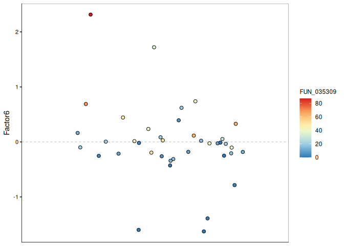
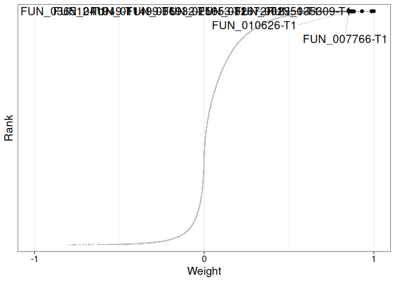
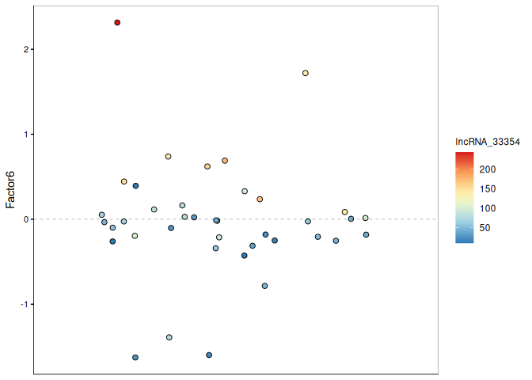

22.20-Apul-multiomics-MOFA2
================
Sam White
2025-09-15

- <a href="#1-summary" id="toc-1-summary">1 SUMMARY</a>
- <a href="#2-background" id="toc-2-background">2 BACKGROUND</a>
- <a href="#3-setup" id="toc-3-setup">3 Setup</a>
  - <a href="#31-libraries" id="toc-31-libraries">3.1 Libraries</a>
  - <a href="#32-variables" id="toc-32-variables">3.2 Variables</a>
- <a href="#4-data-structure-overview"
  id="toc-4-data-structure-overview">4 Data Structure Overview</a>
- <a href="#5-data-prep-for-mofa2" id="toc-5-data-prep-for-mofa2">5 DATA
  PREP FOR MOFA2</a>
  - <a href="#51-view-data-structures" id="toc-51-view-data-structures">5.1
    View data structures</a>
  - <a href="#52-compare-column-names-across-input-data"
    id="toc-52-compare-column-names-across-input-data">5.2 Compare Column
    Names Across Input Data</a>
  - <a href="#53-harmonize-columns-across-data-frames"
    id="toc-53-harmonize-columns-across-data-frames">5.3 Harmonize Columns
    Across Data Frames</a>
  - <a href="#54-remove-zero-variance-features"
    id="toc-54-remove-zero-variance-features">5.4 Remove Zero-Variance
    Features</a>
  - <a href="#55-create-matrices-after-zero-variance-removal"
    id="toc-55-create-matrices-after-zero-variance-removal">5.5 Create
    Matrices After Zero-Variance Removal</a>
- <a href="#6-create-mofa2-object" id="toc-6-create-mofa2-object">6 CREATE
  MOFA2 OBJECT</a>
  - <a href="#61-plot-data-overview" id="toc-61-plot-data-overview">6.1 Plot
    data overview</a>
- <a href="#7-define-mofa2-options" id="toc-7-define-mofa2-options">7
  DEFINE MOFA2 OPTIONS</a>
  - <a href="#71-data-options" id="toc-71-data-options">7.1 Data options</a>
  - <a href="#72-model-options" id="toc-72-model-options">7.2 Model
    options</a>
  - <a href="#73-training-options" id="toc-73-training-options">7.3 Training
    options</a>
- <a href="#8-train-mofa2-object" id="toc-8-train-mofa2-object">8 TRAIN
  MOFA2 OBJECT</a>
  - <a href="#81-load-saved-mofa-objects-from-disk"
    id="toc-81-load-saved-mofa-objects-from-disk">8.1 Load saved MOFA
    objects from disk</a>
  - <a href="#82-train-mofa-objects-for-different-numbers-of-factors"
    id="toc-82-train-mofa-objects-for-different-numbers-of-factors">8.2
    Train MOFA objects for different numbers of factors</a>
- <a href="#9-plots" id="toc-9-plots">9 PLOTS</a>
  - <a href="#91-factor-correlation" id="toc-91-factor-correlation">9.1
    Factor correlation</a>
  - <a href="#92-variance-decomposition"
    id="toc-92-variance-decomposition">9.2 Variance decomposition</a>
- <a href="#10-factor-6-characterization"
  id="toc-10-factor-6-characterization">10 FACTOR 6 CHARACTERIZATION</a>
  - <a href="#101-factor-6-variance-decomposition"
    id="toc-101-factor-6-variance-decomposition">10.1 Factor 6 Variance
    decomposition</a>
  - <a href="#102-plot-variance-explained-per-view"
    id="toc-102-plot-variance-explained-per-view">10.2 Plot variance
    explained per view</a>
  - <a href="#103-print-percent-variance-explained-per-view-as-a-table"
    id="toc-103-print-percent-variance-explained-per-view-as-a-table">10.3
    Print percent variance explained per view as a table</a>
  - <a href="#104-plot-factor-6-values"
    id="toc-104-plot-factor-6-values">10.4 Plot Factor 6 values</a>
  - <a href="#105-plot-factor-6-weights"
    id="toc-105-plot-factor-6-weights">10.5 Plot Factor 6 weights</a>
    - <a href="#1051-genes" id="toc-1051-genes">10.5.1 Genes</a>
    - <a href="#1052-transcripts" id="toc-1052-transcripts">10.5.2
      Transcripts</a>
    - <a href="#1053-lncrna" id="toc-1053-lncrna">10.5.3 lncRNA</a>
    - <a href="#1054-methylation" id="toc-1054-methylation">10.5.4
      Methylation</a>
- <a href="#11-session-info" id="toc-11-session-info">11 SESSION INFO</a>
- <a href="#12-references" id="toc-12-references">12 REFERENCES</a>

# 1 SUMMARY

This script performs multiomics data integration and analysis for *A.
pulchra* using the MOFA2 framework ([MOFA2
documentation](https://biofam.github.io/MOFA2/)).

**Software:** - MOFA2: Multi-Omics Factor Analysis v2, a statistical
framework for comprehensive integration of multi-modal data (Argelaguet
et al. 2020).

**Input files:** - Genes:
[apul-gene_count_matrix.csv](https://gannet.fish.washington.edu/gitrepos/urol-e5/timeseries_molecular/D-Apul/output/02.20-D-Apul-RNAseq-alignment-HiSat2/apul-gene_count_matrix.csv) -
Transcripts:
[apul-transcript_count_matrix.csv](https://gannet.fish.washington.edu/gitrepos/urol-e5/timeseries_molecular/D-Apul/output/02.20-D-Apul-RNAseq-alignment-HiSat2/apul-transcript_count_matrix.csv) -
lncRNA:
[lncRNA_counts.clean.filtered.txt](https://gannet.fish.washington.edu/v1_web/owlshell/bu-github/timeseries_molecular/D-Apul/output/31.5-Apul-lncRNA-discovery/lncRNA_counts.clean.filtered.txt) -
Methylated CpGs:
[merged-WGBS-CpG-counts_filtered.csv](https://gannet.fish.washington.edu/metacarcinus/E5/20250903_meth_Apul/merged-WGBS-CpG-counts_filtered.csv)

**Output files:** - MOFA2 model HDF5 files:
`MOFA2_model_factors-<N>.hdf5` (where `<N>` is the number of factors,
e.g. 10-15) - MOFA2 model RDS files: `MOFA2_model_factors-<N>.rds`
(where `<N>` is the number of factors, e.g. 10-15) - Output files are
written to: `../output/22.20-Apul-multiomics-MOFA2/`

**Script workflow:** - Loads and harmonizes multiomics input data (gene,
transcript, lncRNA, methylation counts) - Preprocesses data (removes
zero-variance features, harmonizes sample columns) - Trains MOFA2 models
for a range of factor numbers (10-15) or loads pre-trained models from
disk - Performs downstream analysis and visualization of MOFA2 results
(variance explained, factor characterization, feature weights)

**MOFA2 reference:** See (Argelaguet et al. 2020) for details.

# 2 BACKGROUND

This script performs multi-omics data integration and analysis for *A.
pulchra* using the MOFA2 framework ([MOFA2
documentation](https://biofam.github.io/MOFA2/)) .

**Software:** - MOFA2: Multi-Omics Factor Analysis v2, a statistical
framework for comprehensive integration of multi-modal data.

**Input files:**

Data files downloaded from [*A.pulchra* Expression Count GitHub
wiki](https://github.com/urol-e5/timeseries_molecular/wiki/02%E2%80%90Expression-Count-Matrices#a-pulchra).

- Genes:
  [apul-gene_count_matrix.csv](https://gannet.fish.washington.edu/gitrepos/urol-e5/timeseries_molecular/D-Apul/output/02.20-D-Apul-RNAseq-alignment-HiSat2/apul-gene_count_matrix.csv)
- Transcripts:
  [apul-transcript_count_matrix.csv](https://gannet.fish.washington.edu/gitrepos/urol-e5/timeseries_molecular/D-Apul/output/02.20-D-Apul-RNAseq-alignment-HiSat2/apul-transcript_count_matrix.csv)
- lncRNA:
  [lncRNA_counts.clean.filtered.txt](https://gannet.fish.washington.edu/v1_web/owlshell/bu-github/timeseries_molecular/D-Apul/output/31.5-Apul-lncRNA-discovery/lncRNA_counts.clean.filtered.txt)
- Methylated CpGs:
  [merged-WGBS-CpG-counts_filtered.csv](https://gannet.fish.washington.edu/metacarcinus/E5/20250903_meth_Apul/merged-WGBS-CpG-counts_filtered.csv)

**Output files:**

NOTE: Due to the large file sizes of the output files, they are not
uploaded to GitHub.

They are available here:
<https://gannet.fish.washington.edu/gitrepos/urol-e5/timeseries_molecular/D-Apul/output/22.20-Apul-multiomics-MOFA2/>

Creating these files (MOFA2 model HDF5 and RDS files) requires running
the MOFA2 training steps in this script, which can take several hours
depending on the number of factors and computational resources. It will
be faster to download these output files from the above link and then
run this script.

- Output files are written to: `../output/22.20-Apul-multiomics-MOFA2/`
  - MOFA2 model HDF5 files: `MOFA2_model_factors-<N>.hdf5` (where `<N>`
    is the number of factors, e.g. 10-15)
  - MOFA2 model RDS files: `MOFA2_model_factors-<N>.rds` (where `<N>` is
    the number of factors, e.g. 10-15)

**Script workflow:** - Loads and harmonizes multi-omics input data
(gene, transcript, lncRNA, methylation counts) - Preprocesses data
(removes zero-variance features, harmonizes sample columns) - Trains
MOFA2 models for a range of factor numbers (10-15) or loads pre-trained
models from disk - Performs downstream analysis and visualization of
MOFA2 results (variance explained, factor characterization, feature
weights)

# 3 Setup

## 3.1 Libraries

## 3.2 Variables

``` r
# Output directory
output_dir <- "../output/22.20-Apul-multiomics-MOFA2"

# Model seed
model_seed <- 42

# INPUT FILES
data_files <- list(
  gene_counts = "../data/apul-gene_count_matrix.csv",
  transcript_counts = "../data/apul-transcript_count_matrix.csv",
  lncRNA_counts = "../data/lncRNA_counts.clean.filtered.txt",
  methylation_counts = "../data/merged-WGBS-CpG-counts_filtered_n20.csv"
)
```

# 4 Data Structure Overview

``` r
# Show structure and preview of each data file in the data folder using tidyverse/dplyr

for (name in names(data_files)) {
  cat("\n\n===== ", name, " =====\n")
  file <- data_files[[name]]
  dat <- fread(file)
  print(glimpse(dat))
  print(dat %>% slice_head(n = 3))
}
```

    =====  gene_counts  =====
    Rows: 44,371
    Columns: 41
    $ gene_id       <chr> "FUN_002326", "FUN_002315", "FUN_002316", "FUN_002303", …
    $ `ACR-139-TP1` <int> 3, 0, 0, 10, 2, 12, 3, 1, 3, 12, 4, 10, 4, 1, 8, 1, 5, 1…
    $ `ACR-139-TP2` <int> 2, 1, 0, 5, 1, 7, 1, 2, 1, 7, 1, 7, 1, 2, 4, 2, 3, 1, 6,…
    $ `ACR-139-TP3` <int> 3, 0, 0, 10, 1, 10, 2, 1, 1, 11, 1, 11, 1, 2, 9, 2, 3, 1…
    $ `ACR-139-TP4` <int> 4, 0, 0, 10, 2, 10, 2, 1, 3, 11, 3, 8, 3, 1, 8, 1, 3, 0,…
    $ `ACR-145-TP1` <int> 12, 0, 0, 23, 2, 26, 1, 3, 2, 24, 2, 20, 2, 2, 20, 2, 12…
    $ `ACR-145-TP2` <int> 7, 1, 1, 18, 3, 25, 2, 4, 2, 19, 3, 19, 3, 4, 19, 4, 6, …
    $ `ACR-145-TP3` <int> 7, 0, 0, 20, 1, 22, 1, 2, 1, 25, 1, 24, 1, 2, 17, 2, 5, …
    $ `ACR-145-TP4` <int> 16, 1, 0, 38, 1, 49, 1, 3, 1, 36, 1, 34, 1, 4, 31, 5, 15…
    $ `ACR-150-TP1` <int> 21, 0, 0, 38, 9, 38, 9, 0, 9, 33, 9, 34, 10, 0, 41, 0, 1…
    $ `ACR-150-TP2` <int> 3, 0, 0, 6, 1, 10, 1, 3, 1, 7, 1, 6, 1, 2, 5, 2, 3, 1, 5…
    $ `ACR-150-TP3` <int> 10, 1, 2, 40, 11, 54, 11, 10, 12, 44, 12, 47, 10, 9, 34,…
    $ `ACR-150-TP4` <int> 11, 0, 0, 30, 2, 38, 2, 6, 2, 32, 2, 31, 1, 6, 28, 6, 14…
    $ `ACR-173-TP1` <int> 19, 1, 0, 73, 28, 70, 30, 2, 33, 53, 35, 49, 39, 2, 50, …
    $ `ACR-173-TP2` <int> 6, 1, 2, 18, 5, 27, 7, 7, 6, 22, 6, 20, 6, 7, 16, 5, 6, …
    $ `ACR-173-TP3` <int> 24, 1, 0, 73, 5, 89, 5, 15, 4, 72, 5, 78, 4, 14, 65, 13,…
    $ `ACR-173-TP4` <int> 17, 0, 0, 31, 6, 40, 7, 3, 6, 28, 6, 27, 7, 2, 35, 2, 12…
    $ `ACR-186-TP1` <int> 1, 0, 0, 3, 1, 3, 1, 0, 1, 3, 1, 2, 1, 0, 2, 0, 0, 0, 1,…
    $ `ACR-186-TP2` <int> 2, 0, 0, 5, 1, 5, 1, 1, 1, 4, 0, 3, 0, 1, 2, 0, 2, 0, 3,…
    $ `ACR-186-TP3` <int> 2, 0, 0, 4, 1, 5, 0, 0, 1, 3, 0, 3, 0, 1, 3, 0, 3, 0, 3,…
    $ `ACR-186-TP4` <int> 3, 0, 0, 9, 1, 9, 1, 2, 1, 6, 1, 7, 1, 1, 7, 2, 3, 0, 7,…
    $ `ACR-225-TP1` <int> 20, 0, 0, 34, 2, 38, 2, 3, 2, 29, 2, 29, 2, 3, 33, 3, 10…
    $ `ACR-225-TP2` <int> 15, 2, 0, 54, 6, 74, 6, 9, 6, 58, 7, 55, 8, 8, 43, 9, 14…
    $ `ACR-225-TP3` <int> 13, 0, 0, 38, 3, 47, 4, 10, 4, 41, 3, 40, 4, 9, 30, 11, …
    $ `ACR-225-TP4` <int> 11, 0, 0, 21, 1, 23, 2, 1, 2, 20, 2, 18, 2, 1, 17, 2, 10…
    $ `ACR-229-TP1` <int> 2, 0, 0, 2, 1, 4, 0, 1, 2, 2, 1, 2, 1, 0, 3, 0, 1, 1, 2,…
    $ `ACR-229-TP2` <int> 1, 0, 0, 2, 1, 2, 2, 0, 1, 3, 1, 3, 1, 0, 1, 0, 1, 1, 3,…
    $ `ACR-229-TP3` <int> 1, 0, 0, 3, 1, 2, 1, 0, 1, 2, 1, 2, 1, 0, 1, 0, 1, 0, 1,…
    $ `ACR-229-TP4` <int> 0, 0, 0, 1, 0, 1, 0, 0, 0, 1, 0, 1, 0, 0, 1, 0, 1, 0, 1,…
    $ `ACR-237-TP1` <int> 16, 0, 0, 45, 2, 43, 2, 2, 2, 35, 2, 35, 2, 3, 36, 2, 11…
    $ `ACR-237-TP2` <int> 16, 0, 0, 37, 4, 52, 4, 7, 3, 42, 4, 44, 4, 6, 35, 7, 14…
    $ `ACR-237-TP3` <int> 14, 1, 1, 36, 7, 52, 6, 15, 6, 41, 6, 41, 7, 11, 31, 13,…
    $ `ACR-237-TP4` <int> 24, 0, 0, 51, 2, 54, 2, 4, 2, 44, 2, 41, 2, 3, 45, 5, 16…
    $ `ACR-244-TP1` <int> 2, 0, 0, 3, 0, 3, 0, 0, 0, 2, 0, 2, 0, 1, 2, 0, 0, 0, 2,…
    $ `ACR-244-TP2` <int> 1, 0, 0, 4, 1, 5, 1, 1, 1, 4, 1, 4, 1, 2, 3, 2, 1, 0, 3,…
    $ `ACR-244-TP3` <int> 3, 0, 0, 12, 3, 12, 3, 2, 3, 10, 4, 9, 3, 2, 7, 2, 2, 1,…
    $ `ACR-244-TP4` <int> 1, 0, 0, 3, 1, 3, 1, 0, 1, 3, 1, 3, 1, 0, 3, 0, 1, 0, 3,…
    $ `ACR-265-TP1` <int> 18, 0, 0, 31, 1, 39, 1, 0, 1, 38, 1, 30, 1, 1, 34, 1, 13…
    $ `ACR-265-TP2` <int> 9, 0, 1, 29, 2, 37, 2, 9, 3, 33, 2, 31, 3, 10, 22, 7, 12…
    $ `ACR-265-TP3` <int> 5, 0, 0, 23, 3, 30, 4, 6, 3, 24, 4, 26, 4, 5, 17, 5, 5, …
    $ `ACR-265-TP4` <int> 12, 0, 0, 23, 1, 20, 1, 0, 2, 16, 1, 15, 1, 1, 20, 0, 8,…
              gene_id ACR-139-TP1 ACR-139-TP2 ACR-139-TP3 ACR-139-TP4 ACR-145-TP1
               <char>       <int>       <int>       <int>       <int>       <int>
        1: FUN_002326           3           2           3           4          12
        2: FUN_002315           0           1           0           0           0
        3: FUN_002316           0           0           0           0           0
        4: FUN_002303          10           5          10          10          23
        5: FUN_002304           2           1           1           2           2
       ---                                                                       
    44367: FUN_044367           0           0           0           0           0
    44368: FUN_044368           0           0           0           0           0
    44369: FUN_044369           0           0           0           0           0
    44370: FUN_044370           0           0           0           0           0
    44371: FUN_044371           0           2           0           1           0
           ACR-145-TP2 ACR-145-TP3 ACR-145-TP4 ACR-150-TP1 ACR-150-TP2 ACR-150-TP3
                 <int>       <int>       <int>       <int>       <int>       <int>
        1:           7           7          16          21           3          10
        2:           1           0           1           0           0           1
        3:           1           0           0           0           0           2
        4:          18          20          38          38           6          40
        5:           3           1           1           9           1          11
       ---                                                                        
    44367:           0           0           0           0           0           0
    44368:           0           0           0           0           0           0
    44369:           0           0           0           0           0           0
    44370:           0           0           0           0           0           0
    44371:           1           0           0           0           0           0
           ACR-150-TP4 ACR-173-TP1 ACR-173-TP2 ACR-173-TP3 ACR-173-TP4 ACR-186-TP1
                 <int>       <int>       <int>       <int>       <int>       <int>
        1:          11          19           6          24          17           1
        2:           0           1           1           1           0           0
        3:           0           0           2           0           0           0
        4:          30          73          18          73          31           3
        5:           2          28           5           5           6           1
       ---                                                                        
    44367:           0           0           0           0           0           0
    44368:           0           0           0           0           0           0
    44369:           0           0           0           0           0           0
    44370:           0           0           0           0           0           0
    44371:           0           1           0           0           0           0
           ACR-186-TP2 ACR-186-TP3 ACR-186-TP4 ACR-225-TP1 ACR-225-TP2 ACR-225-TP3
                 <int>       <int>       <int>       <int>       <int>       <int>
        1:           2           2           3          20          15          13
        2:           0           0           0           0           2           0
        3:           0           0           0           0           0           0
        4:           5           4           9          34          54          38
        5:           1           1           1           2           6           3
       ---                                                                        
    44367:           0           0           0           0           0           0
    44368:           0           0           0           0           0           0
    44369:           0           0           0           0           0           0
    44370:           0           0           0           0           0           0
    44371:           0           0           0           0           4           0
           ACR-225-TP4 ACR-229-TP1 ACR-229-TP2 ACR-229-TP3 ACR-229-TP4 ACR-237-TP1
                 <int>       <int>       <int>       <int>       <int>       <int>
        1:          11           2           1           1           0          16
        2:           0           0           0           0           0           0
        3:           0           0           0           0           0           0
        4:          21           2           2           3           1          45
        5:           1           1           1           1           0           2
       ---                                                                        
    44367:           0           0           0           0           0           0
    44368:           0           0           0           0           0           0
    44369:           0           0           0           0           0           0
    44370:           0           0           0           0           0           0
    44371:           0           0           0           7           0           0
           ACR-237-TP2 ACR-237-TP3 ACR-237-TP4 ACR-244-TP1 ACR-244-TP2 ACR-244-TP3
                 <int>       <int>       <int>       <int>       <int>       <int>
        1:          16          14          24           2           1           3
        2:           0           1           0           0           0           0
        3:           0           1           0           0           0           0
        4:          37          36          51           3           4          12
        5:           4           7           2           0           1           3
       ---                                                                        
    44367:           0           0           0           0           0           0
    44368:           0           0           0           0           0           0
    44369:           0           0           0           0           0           0
    44370:           0           0           0           0           0           0
    44371:           0           0           0           0           0           6
           ACR-244-TP4 ACR-265-TP1 ACR-265-TP2 ACR-265-TP3 ACR-265-TP4
                 <int>       <int>       <int>       <int>       <int>
        1:           1          18           9           5          12
        2:           0           0           0           0           0
        3:           0           0           1           0           0
        4:           3          31          29          23          23
        5:           1           1           2           3           1
       ---                                                            
    44367:           0           0           0           0           0
    44368:           0           0           0           0           0
    44369:           0           0           0           0           0
    44370:           0           0           0           0           0
    44371:           0           0           0           0           0
          gene_id ACR-139-TP1 ACR-139-TP2 ACR-139-TP3 ACR-139-TP4 ACR-145-TP1
           <char>       <int>       <int>       <int>       <int>       <int>
    1: FUN_002326           3           2           3           4          12
    2: FUN_002315           0           1           0           0           0
    3: FUN_002316           0           0           0           0           0
       ACR-145-TP2 ACR-145-TP3 ACR-145-TP4 ACR-150-TP1 ACR-150-TP2 ACR-150-TP3
             <int>       <int>       <int>       <int>       <int>       <int>
    1:           7           7          16          21           3          10
    2:           1           0           1           0           0           1
    3:           1           0           0           0           0           2
       ACR-150-TP4 ACR-173-TP1 ACR-173-TP2 ACR-173-TP3 ACR-173-TP4 ACR-186-TP1
             <int>       <int>       <int>       <int>       <int>       <int>
    1:          11          19           6          24          17           1
    2:           0           1           1           1           0           0
    3:           0           0           2           0           0           0
       ACR-186-TP2 ACR-186-TP3 ACR-186-TP4 ACR-225-TP1 ACR-225-TP2 ACR-225-TP3
             <int>       <int>       <int>       <int>       <int>       <int>
    1:           2           2           3          20          15          13
    2:           0           0           0           0           2           0
    3:           0           0           0           0           0           0
       ACR-225-TP4 ACR-229-TP1 ACR-229-TP2 ACR-229-TP3 ACR-229-TP4 ACR-237-TP1
             <int>       <int>       <int>       <int>       <int>       <int>
    1:          11           2           1           1           0          16
    2:           0           0           0           0           0           0
    3:           0           0           0           0           0           0
       ACR-237-TP2 ACR-237-TP3 ACR-237-TP4 ACR-244-TP1 ACR-244-TP2 ACR-244-TP3
             <int>       <int>       <int>       <int>       <int>       <int>
    1:          16          14          24           2           1           3
    2:           0           1           0           0           0           0
    3:           0           1           0           0           0           0
       ACR-244-TP4 ACR-265-TP1 ACR-265-TP2 ACR-265-TP3 ACR-265-TP4
             <int>       <int>       <int>       <int>       <int>
    1:           1          18           9           5          12
    2:           0           0           0           0           0
    3:           0           0           1           0           0


    =====  transcript_counts  =====
    Rows: 44,371
    Columns: 41
    $ transcript_id <chr> "FUN_002326-T1", "FUN_002315-T1", "FUN_002316-T1", "FUN_…
    $ `ACR-139-TP1` <int> 3, 0, 0, 10, 2, 12, 3, 1, 3, 12, 4, 10, 4, 1, 8, 1, 5, 1…
    $ `ACR-139-TP2` <int> 2, 1, 0, 5, 1, 7, 1, 2, 1, 7, 1, 7, 1, 2, 4, 2, 3, 1, 6,…
    $ `ACR-139-TP3` <int> 3, 0, 0, 10, 1, 10, 2, 1, 1, 11, 1, 11, 1, 2, 9, 2, 3, 1…
    $ `ACR-139-TP4` <int> 4, 0, 0, 10, 2, 10, 2, 1, 3, 11, 3, 8, 3, 1, 8, 1, 3, 0,…
    $ `ACR-145-TP1` <int> 12, 0, 0, 23, 2, 26, 1, 3, 2, 24, 2, 20, 2, 2, 20, 2, 12…
    $ `ACR-145-TP2` <int> 7, 1, 1, 18, 3, 25, 2, 4, 2, 19, 3, 19, 3, 4, 19, 4, 6, …
    $ `ACR-145-TP3` <int> 7, 0, 0, 20, 1, 22, 1, 2, 1, 25, 1, 24, 1, 2, 17, 2, 5, …
    $ `ACR-145-TP4` <int> 16, 1, 0, 38, 1, 49, 1, 3, 1, 36, 1, 34, 1, 4, 31, 5, 15…
    $ `ACR-150-TP1` <int> 21, 0, 0, 38, 9, 38, 9, 0, 9, 33, 9, 34, 10, 0, 41, 0, 1…
    $ `ACR-150-TP2` <int> 3, 0, 0, 6, 1, 10, 1, 3, 1, 7, 1, 6, 1, 2, 5, 2, 3, 1, 5…
    $ `ACR-150-TP3` <int> 10, 1, 2, 40, 11, 54, 11, 10, 12, 44, 12, 47, 10, 9, 34,…
    $ `ACR-150-TP4` <int> 11, 0, 0, 30, 2, 38, 2, 6, 2, 32, 2, 31, 1, 6, 28, 6, 14…
    $ `ACR-173-TP1` <int> 19, 1, 0, 73, 28, 70, 30, 2, 33, 53, 35, 49, 39, 2, 50, …
    $ `ACR-173-TP2` <int> 6, 1, 2, 18, 5, 27, 7, 7, 6, 22, 6, 20, 6, 7, 16, 5, 6, …
    $ `ACR-173-TP3` <int> 24, 1, 0, 73, 5, 89, 5, 15, 4, 72, 5, 78, 4, 14, 65, 13,…
    $ `ACR-173-TP4` <int> 17, 0, 0, 31, 6, 40, 7, 3, 6, 28, 6, 27, 7, 2, 35, 2, 12…
    $ `ACR-186-TP1` <int> 1, 0, 0, 3, 1, 3, 1, 0, 1, 3, 1, 2, 1, 0, 2, 0, 0, 0, 1,…
    $ `ACR-186-TP2` <int> 2, 0, 0, 5, 1, 5, 1, 1, 1, 4, 0, 3, 0, 1, 2, 0, 2, 0, 3,…
    $ `ACR-186-TP3` <int> 2, 0, 0, 4, 1, 5, 0, 0, 1, 3, 0, 3, 0, 1, 3, 0, 3, 0, 3,…
    $ `ACR-186-TP4` <int> 3, 0, 0, 9, 1, 9, 1, 2, 1, 6, 1, 7, 1, 1, 7, 2, 3, 0, 7,…
    $ `ACR-225-TP1` <int> 20, 0, 0, 34, 2, 38, 2, 3, 2, 29, 2, 29, 2, 3, 33, 3, 10…
    $ `ACR-225-TP2` <int> 15, 2, 0, 54, 6, 74, 6, 9, 6, 58, 7, 55, 8, 8, 43, 9, 14…
    $ `ACR-225-TP3` <int> 13, 0, 0, 38, 3, 47, 4, 10, 4, 41, 3, 40, 4, 9, 30, 11, …
    $ `ACR-225-TP4` <int> 11, 0, 0, 21, 1, 23, 2, 1, 2, 20, 2, 18, 2, 1, 17, 2, 10…
    $ `ACR-229-TP1` <int> 2, 0, 0, 2, 1, 4, 0, 1, 2, 2, 1, 2, 1, 0, 3, 0, 1, 1, 2,…
    $ `ACR-229-TP2` <int> 1, 0, 0, 2, 1, 2, 2, 0, 1, 3, 1, 3, 1, 0, 1, 0, 1, 1, 3,…
    $ `ACR-229-TP3` <int> 1, 0, 0, 3, 1, 2, 1, 0, 1, 2, 1, 2, 1, 0, 1, 0, 1, 0, 1,…
    $ `ACR-229-TP4` <int> 0, 0, 0, 1, 0, 1, 0, 0, 0, 1, 0, 1, 0, 0, 1, 0, 1, 0, 1,…
    $ `ACR-237-TP1` <int> 16, 0, 0, 45, 2, 43, 2, 2, 2, 35, 2, 35, 2, 3, 36, 2, 11…
    $ `ACR-237-TP2` <int> 16, 0, 0, 37, 4, 52, 4, 7, 3, 42, 4, 44, 4, 6, 35, 7, 14…
    $ `ACR-237-TP3` <int> 14, 1, 1, 36, 7, 52, 6, 15, 6, 41, 6, 41, 7, 11, 31, 13,…
    $ `ACR-237-TP4` <int> 24, 0, 0, 51, 2, 54, 2, 4, 2, 44, 2, 41, 2, 3, 45, 5, 16…
    $ `ACR-244-TP1` <int> 2, 0, 0, 3, 0, 3, 0, 0, 0, 2, 0, 2, 0, 1, 2, 0, 0, 0, 2,…
    $ `ACR-244-TP2` <int> 1, 0, 0, 4, 1, 5, 1, 1, 1, 4, 1, 4, 1, 2, 3, 2, 1, 0, 3,…
    $ `ACR-244-TP3` <int> 3, 0, 0, 12, 3, 12, 3, 2, 3, 10, 4, 9, 3, 2, 7, 2, 2, 1,…
    $ `ACR-244-TP4` <int> 1, 0, 0, 3, 1, 3, 1, 0, 1, 3, 1, 3, 1, 0, 3, 0, 1, 0, 3,…
    $ `ACR-265-TP1` <int> 18, 0, 0, 31, 1, 39, 1, 0, 1, 38, 1, 30, 1, 1, 34, 1, 13…
    $ `ACR-265-TP2` <int> 9, 0, 1, 29, 2, 37, 2, 9, 3, 33, 2, 31, 3, 10, 22, 7, 12…
    $ `ACR-265-TP3` <int> 5, 0, 0, 23, 3, 30, 4, 6, 3, 24, 4, 26, 4, 5, 17, 5, 5, …
    $ `ACR-265-TP4` <int> 12, 0, 0, 23, 1, 20, 1, 0, 2, 16, 1, 15, 1, 1, 20, 0, 8,…
           transcript_id ACR-139-TP1 ACR-139-TP2 ACR-139-TP3 ACR-139-TP4
                  <char>       <int>       <int>       <int>       <int>
        1: FUN_002326-T1           3           2           3           4
        2: FUN_002315-T1           0           1           0           0
        3: FUN_002316-T1           0           0           0           0
        4: FUN_002303-T1          10           5          10          10
        5: FUN_002304-T1           2           1           1           2
       ---                                                              
    44367: FUN_044367-T1           0           0           0           0
    44368: FUN_044368-T1           0           0           0           0
    44369: FUN_044369-T1           0           0           0           0
    44370: FUN_044370-T1           0           0           0           0
    44371: FUN_044371-T1           0           2           0           1
           ACR-145-TP1 ACR-145-TP2 ACR-145-TP3 ACR-145-TP4 ACR-150-TP1 ACR-150-TP2
                 <int>       <int>       <int>       <int>       <int>       <int>
        1:          12           7           7          16          21           3
        2:           0           1           0           1           0           0
        3:           0           1           0           0           0           0
        4:          23          18          20          38          38           6
        5:           2           3           1           1           9           1
       ---                                                                        
    44367:           0           0           0           0           0           0
    44368:           0           0           0           0           0           0
    44369:           0           0           0           0           0           0
    44370:           0           0           0           0           0           0
    44371:           0           1           0           0           0           0
           ACR-150-TP3 ACR-150-TP4 ACR-173-TP1 ACR-173-TP2 ACR-173-TP3 ACR-173-TP4
                 <int>       <int>       <int>       <int>       <int>       <int>
        1:          10          11          19           6          24          17
        2:           1           0           1           1           1           0
        3:           2           0           0           2           0           0
        4:          40          30          73          18          73          31
        5:          11           2          28           5           5           6
       ---                                                                        
    44367:           0           0           0           0           0           0
    44368:           0           0           0           0           0           0
    44369:           0           0           0           0           0           0
    44370:           0           0           0           0           0           0
    44371:           0           0           1           0           0           0
           ACR-186-TP1 ACR-186-TP2 ACR-186-TP3 ACR-186-TP4 ACR-225-TP1 ACR-225-TP2
                 <int>       <int>       <int>       <int>       <int>       <int>
        1:           1           2           2           3          20          15
        2:           0           0           0           0           0           2
        3:           0           0           0           0           0           0
        4:           3           5           4           9          34          54
        5:           1           1           1           1           2           6
       ---                                                                        
    44367:           0           0           0           0           0           0
    44368:           0           0           0           0           0           0
    44369:           0           0           0           0           0           0
    44370:           0           0           0           0           0           0
    44371:           0           0           0           0           0           4
           ACR-225-TP3 ACR-225-TP4 ACR-229-TP1 ACR-229-TP2 ACR-229-TP3 ACR-229-TP4
                 <int>       <int>       <int>       <int>       <int>       <int>
        1:          13          11           2           1           1           0
        2:           0           0           0           0           0           0
        3:           0           0           0           0           0           0
        4:          38          21           2           2           3           1
        5:           3           1           1           1           1           0
       ---                                                                        
    44367:           0           0           0           0           0           0
    44368:           0           0           0           0           0           0
    44369:           0           0           0           0           0           0
    44370:           0           0           0           0           0           0
    44371:           0           0           0           0           7           0
           ACR-237-TP1 ACR-237-TP2 ACR-237-TP3 ACR-237-TP4 ACR-244-TP1 ACR-244-TP2
                 <int>       <int>       <int>       <int>       <int>       <int>
        1:          16          16          14          24           2           1
        2:           0           0           1           0           0           0
        3:           0           0           1           0           0           0
        4:          45          37          36          51           3           4
        5:           2           4           7           2           0           1
       ---                                                                        
    44367:           0           0           0           0           0           0
    44368:           0           0           0           0           0           0
    44369:           0           0           0           0           0           0
    44370:           0           0           0           0           0           0
    44371:           0           0           0           0           0           0
           ACR-244-TP3 ACR-244-TP4 ACR-265-TP1 ACR-265-TP2 ACR-265-TP3 ACR-265-TP4
                 <int>       <int>       <int>       <int>       <int>       <int>
        1:           3           1          18           9           5          12
        2:           0           0           0           0           0           0
        3:           0           0           0           1           0           0
        4:          12           3          31          29          23          23
        5:           3           1           1           2           3           1
       ---                                                                        
    44367:           0           0           0           0           0           0
    44368:           0           0           0           0           0           0
    44369:           0           0           0           0           0           0
    44370:           0           0           0           0           0           0
    44371:           6           0           0           0           0           0
       transcript_id ACR-139-TP1 ACR-139-TP2 ACR-139-TP3 ACR-139-TP4 ACR-145-TP1
              <char>       <int>       <int>       <int>       <int>       <int>
    1: FUN_002326-T1           3           2           3           4          12
    2: FUN_002315-T1           0           1           0           0           0
    3: FUN_002316-T1           0           0           0           0           0
       ACR-145-TP2 ACR-145-TP3 ACR-145-TP4 ACR-150-TP1 ACR-150-TP2 ACR-150-TP3
             <int>       <int>       <int>       <int>       <int>       <int>
    1:           7           7          16          21           3          10
    2:           1           0           1           0           0           1
    3:           1           0           0           0           0           2
       ACR-150-TP4 ACR-173-TP1 ACR-173-TP2 ACR-173-TP3 ACR-173-TP4 ACR-186-TP1
             <int>       <int>       <int>       <int>       <int>       <int>
    1:          11          19           6          24          17           1
    2:           0           1           1           1           0           0
    3:           0           0           2           0           0           0
       ACR-186-TP2 ACR-186-TP3 ACR-186-TP4 ACR-225-TP1 ACR-225-TP2 ACR-225-TP3
             <int>       <int>       <int>       <int>       <int>       <int>
    1:           2           2           3          20          15          13
    2:           0           0           0           0           2           0
    3:           0           0           0           0           0           0
       ACR-225-TP4 ACR-229-TP1 ACR-229-TP2 ACR-229-TP3 ACR-229-TP4 ACR-237-TP1
             <int>       <int>       <int>       <int>       <int>       <int>
    1:          11           2           1           1           0          16
    2:           0           0           0           0           0           0
    3:           0           0           0           0           0           0
       ACR-237-TP2 ACR-237-TP3 ACR-237-TP4 ACR-244-TP1 ACR-244-TP2 ACR-244-TP3
             <int>       <int>       <int>       <int>       <int>       <int>
    1:          16          14          24           2           1           3
    2:           0           1           0           0           0           0
    3:           0           1           0           0           0           0
       ACR-244-TP4 ACR-265-TP1 ACR-265-TP2 ACR-265-TP3 ACR-265-TP4
             <int>       <int>       <int>       <int>       <int>
    1:           1          18           9           5          12
    2:           0           0           0           0           0
    3:           0           0           1           0           0


    =====  lncRNA_counts  =====
    Rows: 15,559
    Columns: 46
    $ Geneid        <chr> "lncRNA_015", "lncRNA_076", "lncRNA_077", "lncRNA_078", …
    $ Chr           <chr> "ntLink_2", "ntLink_6", "ntLink_6", "ntLink_6", "ntLink_…
    $ Start         <int> 327086, 48577, 191068, 191227, 191233, 191352, 253957, 2…
    $ End           <int> 329262, 50741, 194203, 194203, 194203, 194203, 256027, 2…
    $ Strand        <chr> "+", "+", "+", "+", "+", "+", "+", "+", "+", "+", "+", "…
    $ Length        <int> 2177, 2165, 3136, 2977, 2971, 2852, 2071, 1764, 1100, 18…
    $ `ACR-139-TP1` <dbl> 113.00, 48.00, 648.25, 648.25, 648.25, 648.25, 52.50, 36…
    $ `ACR-139-TP2` <dbl> 2.00, 19.00, 694.75, 694.75, 694.75, 694.75, 13.00, 8.00…
    $ `ACR-139-TP3` <dbl> 2.00, 23.00, 958.50, 958.50, 958.50, 958.50, 19.00, 13.0…
    $ `ACR-139-TP4` <dbl> 114.00, 10.00, 764.75, 764.75, 764.75, 764.75, 71.00, 34…
    $ `ACR-145-TP1` <dbl> 154.00, 50.00, 846.25, 846.25, 846.25, 846.25, 23.00, 15…
    $ `ACR-145-TP2` <dbl> 20.00, 11.00, 488.75, 488.75, 488.75, 488.75, 12.00, 8.0…
    $ `ACR-145-TP3` <dbl> 90.00, 49.00, 1035.25, 1035.25, 1035.25, 1035.25, 19.50,…
    $ `ACR-145-TP4` <dbl> 106.00, 72.00, 585.00, 585.00, 585.00, 585.00, 24.00, 15…
    $ `ACR-150-TP1` <dbl> 268.00, 33.00, 719.50, 719.50, 719.50, 719.50, 8.00, 8.0…
    $ `ACR-150-TP2` <dbl> 37.00, 44.00, 590.75, 590.75, 590.75, 590.75, 20.50, 9.5…
    $ `ACR-150-TP3` <dbl> 108.00, 19.00, 671.25, 671.25, 671.25, 671.25, 16.00, 10…
    $ `ACR-150-TP4` <dbl> 26.00, 0.00, 839.75, 839.75, 839.75, 839.75, 37.00, 19.0…
    $ `ACR-173-TP1` <dbl> 430.00, 13.00, 622.75, 622.75, 622.75, 622.75, 36.50, 35…
    $ `ACR-173-TP2` <dbl> 36.00, 38.00, 417.75, 417.75, 417.75, 417.75, 15.50, 3.5…
    $ `ACR-173-TP3` <dbl> 16.00, 24.00, 1084.00, 1084.00, 1084.00, 1084.00, 2.50, …
    $ `ACR-173-TP4` <dbl> 99.00, 6.00, 848.50, 848.50, 848.50, 848.50, 19.00, 7.00…
    $ `ACR-186-TP1` <dbl> 32.00, 54.00, 625.00, 625.00, 625.00, 625.00, 12.00, 12.…
    $ `ACR-186-TP2` <dbl> 7.00, 122.00, 932.08, 931.08, 931.08, 930.75, 22.00, 13.…
    $ `ACR-186-TP3` <dbl> 29.00, 40.00, 1325.50, 1325.50, 1325.50, 1325.50, 45.00,…
    $ `ACR-186-TP4` <dbl> 37.00, 69.00, 888.50, 888.50, 888.50, 888.50, 50.50, 28.…
    $ `ACR-225-TP1` <dbl> 15.00, 66.00, 870.75, 870.75, 870.75, 870.75, 3.50, 3.50…
    $ `ACR-225-TP2` <dbl> 267.00, 47.00, 711.50, 711.50, 711.50, 711.50, 40.00, 28…
    $ `ACR-225-TP3` <dbl> 43.00, 26.00, 947.75, 947.75, 947.75, 947.75, 15.50, 10.…
    $ `ACR-225-TP4` <dbl> 8.00, 5.00, 782.50, 782.50, 782.50, 782.50, 5.00, 3.00, …
    $ `ACR-229-TP1` <dbl> 4.00, 59.00, 929.25, 929.25, 929.25, 929.25, 28.00, 21.0…
    $ `ACR-229-TP2` <dbl> 45.00, 68.00, 914.50, 914.50, 914.50, 914.50, 49.00, 28.…
    $ `ACR-229-TP3` <dbl> 107.00, 96.00, 837.25, 837.25, 837.25, 837.25, 44.50, 21…
    $ `ACR-229-TP4` <dbl> 66.00, 178.00, 786.00, 786.00, 786.00, 786.00, 0.00, 0.0…
    $ `ACR-237-TP1` <dbl> 22.00, 42.00, 1060.75, 1060.75, 1060.75, 1060.75, 1.50, …
    $ `ACR-237-TP2` <dbl> 58.00, 60.00, 680.20, 680.20, 680.20, 680.20, 15.00, 11.…
    $ `ACR-237-TP3` <dbl> 29.00, 23.00, 672.75, 672.75, 672.75, 672.75, 34.50, 23.…
    $ `ACR-237-TP4` <dbl> 104.00, 4.00, 1327.50, 1327.50, 1327.50, 1327.50, 0.00, …
    $ `ACR-244-TP1` <dbl> 6.00, 116.00, 697.50, 697.50, 697.50, 697.50, 1.00, 0.00…
    $ `ACR-244-TP2` <dbl> 32.00, 109.00, 834.50, 834.50, 834.50, 834.50, 27.50, 22…
    $ `ACR-244-TP3` <dbl> 181.00, 58.00, 823.00, 823.00, 823.00, 823.00, 46.50, 38…
    $ `ACR-244-TP4` <dbl> 38.00, 67.00, 1132.75, 1132.75, 1132.75, 1132.75, 9.50, …
    $ `ACR-265-TP1` <dbl> 5.00, 147.00, 1188.50, 1188.50, 1188.50, 1188.50, 25.00,…
    $ `ACR-265-TP2` <dbl> 76.00, 106.00, 812.25, 812.25, 812.25, 812.25, 40.50, 30…
    $ `ACR-265-TP3` <dbl> 254.00, 109.00, 735.00, 735.00, 735.00, 735.00, 33.00, 2…
    $ `ACR-265-TP4` <dbl> 43.00, 28.00, 982.25, 982.25, 982.25, 982.25, 14.00, 14.…
                 Geneid        Chr  Start    End Strand Length ACR-139-TP1
                 <char>     <char>  <int>  <int> <char>  <int>       <num>
        1:   lncRNA_015   ntLink_2 327086 329262      +   2177      113.00
        2:   lncRNA_076   ntLink_6  48577  50741      +   2165       48.00
        3:   lncRNA_077   ntLink_6 191068 194203      +   3136      648.25
        4:   lncRNA_078   ntLink_6 191227 194203      +   2977      648.25
        5:   lncRNA_080   ntLink_6 191233 194203      +   2971      648.25
       ---                                                                
    15555: lncRNA_55784 ptg000076l 100025 114600      +  14576        5.81
    15556: lncRNA_55785 ptg000076l 100059 114600      +  14542        5.81
    15557: lncRNA_55814 ptg000086l  27295  29656      +   2362       25.00
    15558: lncRNA_55815 ptg000086l  27333  30207      +   2875       27.00
    15559: lncRNA_55927 ptg000126l  19531  20380      +    850        3.00
           ACR-139-TP2 ACR-139-TP3 ACR-139-TP4 ACR-145-TP1 ACR-145-TP2 ACR-145-TP3
                 <num>       <num>       <num>       <num>       <num>       <num>
        1:        2.00        2.00      114.00      154.00       20.00       90.00
        2:       19.00       23.00       10.00       50.00       11.00       49.00
        3:      694.75      958.50      764.75      846.25      488.75     1035.25
        4:      694.75      958.50      764.75      846.25      488.75     1035.25
        5:      694.75      958.50      764.75      846.25      488.75     1035.25
       ---                                                                        
    15555:      184.16       29.73       30.35      177.56       11.24       37.31
    15556:      184.16       29.73       30.35      177.56       11.24       37.31
    15557:       12.00       22.50       21.50      252.00      128.00      255.00
    15558:       13.00       23.50       23.50      255.00      142.00      258.00
    15559:       29.00       50.00       33.00       33.00        0.00       92.00
           ACR-145-TP4 ACR-150-TP1 ACR-150-TP2 ACR-150-TP3 ACR-150-TP4 ACR-173-TP1
                 <num>       <num>       <num>       <num>       <num>       <num>
        1:      106.00       268.0       37.00      108.00       26.00      430.00
        2:       72.00        33.0       44.00       19.00        0.00       13.00
        3:      585.00       719.5      590.75      671.25      839.75      622.75
        4:      585.00       719.5      590.75      671.25      839.75      622.75
        5:      585.00       719.5      590.75      671.25      839.75      622.75
       ---                                                                        
    15555:      111.07        10.3       92.34       12.64       25.57       19.51
    15556:      111.07        10.3       92.34       12.64       25.57       19.51
    15557:      550.50        97.5      232.00      235.00      189.00       49.50
    15558:      607.50       101.5      281.00      239.00      213.00       54.50
    15559:       90.00        25.0       21.00       31.00       40.00       76.00
           ACR-173-TP2 ACR-173-TP3 ACR-173-TP4 ACR-186-TP1 ACR-186-TP2 ACR-186-TP3
                 <num>       <num>       <num>       <num>       <num>       <num>
        1:       36.00       16.00       99.00       32.00        7.00        29.0
        2:       38.00       24.00        6.00       54.00      122.00        40.0
        3:      417.75     1084.00      848.50      625.00      932.08      1325.5
        4:      417.75     1084.00      848.50      625.00      931.08      1325.5
        5:      417.75     1084.00      848.50      625.00      931.08      1325.5
       ---                                                                        
    15555:       46.02       59.42       14.84       44.54       24.91        12.8
    15556:       46.02       59.42       14.84       44.54       24.91        12.8
    15557:       24.00       40.50       71.00        0.00        1.00         0.0
    15558:       28.00       40.50       71.00        0.00        1.00         0.0
    15559:       10.00      117.00       40.00       38.00      104.00       114.0
           ACR-186-TP4 ACR-225-TP1 ACR-225-TP2 ACR-225-TP3 ACR-225-TP4 ACR-229-TP1
                 <num>       <num>       <num>       <num>       <num>       <num>
        1:       37.00       15.00      267.00       43.00        8.00        4.00
        2:       69.00       66.00       47.00       26.00        5.00       59.00
        3:      888.50      870.75      711.50      947.75      782.50      929.25
        4:      888.50      870.75      711.50      947.75      782.50      929.25
        5:      888.50      870.75      711.50      947.75      782.50      929.25
       ---                                                                        
    15555:       34.18      146.58       23.34      118.35      197.86       66.95
    15556:       34.18      146.58       23.34      118.35      197.86       66.95
    15557:        0.00       67.00       60.00       76.00       58.50      152.00
    15558:        0.00       70.00       70.00       81.00       58.50      159.00
    15559:       89.00       63.00        7.00       48.00       18.00        0.00
           ACR-229-TP2 ACR-229-TP3 ACR-229-TP4 ACR-237-TP1 ACR-237-TP2 ACR-237-TP3
                 <num>       <num>       <num>       <num>       <num>       <num>
        1:       45.00      107.00        66.0       22.00       58.00       29.00
        2:       68.00       96.00       178.0       42.00       60.00       23.00
        3:      914.50      837.25       786.0     1060.75      680.20      672.75
        4:      914.50      837.25       786.0     1060.75      680.20      672.75
        5:      914.50      837.25       786.0     1060.75      680.20      672.75
       ---                                                                        
    15555:       36.22       24.41        73.2       28.93       11.32       31.15
    15556:       36.22       24.41        73.2       28.93       11.32       31.15
    15557:       45.00       77.50       140.0      122.00      186.50      199.50
    15558:       53.00      104.50       142.0      122.00      230.50      227.50
    15559:        0.00        0.00         0.0       76.00       18.00        8.00
           ACR-237-TP4 ACR-244-TP1 ACR-244-TP2 ACR-244-TP3 ACR-244-TP4 ACR-265-TP1
                 <num>       <num>       <num>       <num>       <num>       <num>
        1:      104.00        6.00       32.00      181.00       38.00        5.00
        2:        4.00      116.00      109.00       58.00       67.00      147.00
        3:     1327.50      697.50      834.50      823.00     1132.75     1188.50
        4:     1327.50      697.50      834.50      823.00     1132.75     1188.50
        5:     1327.50      697.50      834.50      823.00     1132.75     1188.50
       ---                                                                        
    15555:       76.14       13.05       14.61       11.47       45.68      189.53
    15556:       76.14       13.05       14.61       11.47       45.68      189.53
    15557:      198.00      122.50      208.00      185.50      168.50      546.50
    15558:      199.00      118.50      230.00      207.50      175.50      550.50
    15559:       58.00      118.00      120.00      179.00      345.00       55.00
           ACR-265-TP2 ACR-265-TP3 ACR-265-TP4
                 <num>       <num>       <num>
        1:       76.00      254.00       43.00
        2:      106.00      109.00       28.00
        3:      812.25      735.00      982.25
        4:      812.25      735.00      982.25
        5:      812.25      735.00      982.25
       ---                                    
    15555:       19.69       75.12       94.46
    15556:       19.69       75.12       94.46
    15557:      391.00      287.00      210.50
    15558:      463.00      320.00      213.50
    15559:       66.00       68.00       82.00
           Geneid      Chr  Start    End Strand Length ACR-139-TP1 ACR-139-TP2
           <char>   <char>  <int>  <int> <char>  <int>       <num>       <num>
    1: lncRNA_015 ntLink_2 327086 329262      +   2177      113.00        2.00
    2: lncRNA_076 ntLink_6  48577  50741      +   2165       48.00       19.00
    3: lncRNA_077 ntLink_6 191068 194203      +   3136      648.25      694.75
       ACR-139-TP3 ACR-139-TP4 ACR-145-TP1 ACR-145-TP2 ACR-145-TP3 ACR-145-TP4
             <num>       <num>       <num>       <num>       <num>       <num>
    1:         2.0      114.00      154.00       20.00       90.00         106
    2:        23.0       10.00       50.00       11.00       49.00          72
    3:       958.5      764.75      846.25      488.75     1035.25         585
       ACR-150-TP1 ACR-150-TP2 ACR-150-TP3 ACR-150-TP4 ACR-173-TP1 ACR-173-TP2
             <num>       <num>       <num>       <num>       <num>       <num>
    1:       268.0       37.00      108.00       26.00      430.00       36.00
    2:        33.0       44.00       19.00        0.00       13.00       38.00
    3:       719.5      590.75      671.25      839.75      622.75      417.75
       ACR-173-TP3 ACR-173-TP4 ACR-186-TP1 ACR-186-TP2 ACR-186-TP3 ACR-186-TP4
             <num>       <num>       <num>       <num>       <num>       <num>
    1:          16        99.0          32        7.00        29.0        37.0
    2:          24         6.0          54      122.00        40.0        69.0
    3:        1084       848.5         625      932.08      1325.5       888.5
       ACR-225-TP1 ACR-225-TP2 ACR-225-TP3 ACR-225-TP4 ACR-229-TP1 ACR-229-TP2
             <num>       <num>       <num>       <num>       <num>       <num>
    1:       15.00       267.0       43.00         8.0        4.00        45.0
    2:       66.00        47.0       26.00         5.0       59.00        68.0
    3:      870.75       711.5      947.75       782.5      929.25       914.5
       ACR-229-TP3 ACR-229-TP4 ACR-237-TP1 ACR-237-TP2 ACR-237-TP3 ACR-237-TP4
             <num>       <num>       <num>       <num>       <num>       <num>
    1:      107.00          66       22.00        58.0       29.00       104.0
    2:       96.00         178       42.00        60.0       23.00         4.0
    3:      837.25         786     1060.75       680.2      672.75      1327.5
       ACR-244-TP1 ACR-244-TP2 ACR-244-TP3 ACR-244-TP4 ACR-265-TP1 ACR-265-TP2
             <num>       <num>       <num>       <num>       <num>       <num>
    1:         6.0        32.0         181       38.00         5.0       76.00
    2:       116.0       109.0          58       67.00       147.0      106.00
    3:       697.5       834.5         823     1132.75      1188.5      812.25
       ACR-265-TP3 ACR-265-TP4
             <num>       <num>
    1:         254       43.00
    2:         109       28.00
    3:         735      982.25


    =====  methylation_counts  =====
    Rows: 6,566,306
    Columns: 40
    $ CpG           <chr> "CpG_ntLink_0_90500", "CpG_ntLink_0_90540", "CpG_ntLink_…
    $ `ACR-145-TP3` <dbl> 0.000000, 0.000000, 0.000000, 0.000000, 0.000000, 17.391…
    $ `ACR-265-TP4` <dbl> 0.000000, 0.000000, 0.000000, NA, 0.000000, 30.000000, N…
    $ `ACR-139-TP3` <dbl> 0.000000, 0.000000, 0.000000, 0.000000, 0.000000, NA, NA…
    $ `ACR-244-TP1` <dbl> NA, NA, NA, NA, NA, NA, NA, 50.00000, NA, 50.00000, 54.5…
    $ `ACR-237-TP1` <dbl> NA, NA, NA, NA, NA, NA, NA, 33.33333, 21.42857, 28.57143…
    $ `ACR-265-TP3` <dbl> 0.000000, 0.000000, 0.000000, 0.000000, 0.000000, 6.2500…
    $ `ACR-186-TP4` <dbl> 0.000000, 0.000000, 0.000000, 2.857143, 5.555556, 14.285…
    $ `ACR-186-TP2` <dbl> 1.851852, 2.985075, 1.428571, 3.030303, 2.777778, 5.5555…
    $ `ACR-244-TP4` <dbl> NA, NA, NA, NA, NA, NA, NA, 25.000000, 31.250000, 29.411…
    $ `ACR-225-TP3` <dbl> NA, NA, NA, NA, NA, NA, NA, 21.428571, 21.428571, 21.428…
    $ `ACR-139-TP2` <dbl> 0.000000, 0.000000, 0.000000, 0.000000, 0.000000, 18.750…
    $ `ACR-186-TP1` <dbl> 0.000000, 0.000000, 0.000000, 0.000000, 0.000000, 23.529…
    $ `ACR-145-TP1` <dbl> 0.000000, 0.000000, 0.000000, 0.000000, 0.000000, 7.1428…
    $ `ACR-145-TP4` <dbl> 0.000000, 3.448276, 0.000000, 0.000000, 0.000000, 5.5555…
    $ `ACR-225-TP4` <dbl> 0.000000, 0.000000, 0.000000, 0.000000, 0.000000, 9.0909…
    $ `ACR-173-TP3` <dbl> NA, NA, NA, NA, NA, NA, NA, 7.142857, 6.666667, 6.666667…
    $ `ACR-150-TP4` <dbl> NA, NA, 0.000000, NA, NA, NA, NA, 27.272727, 28.571429, …
    $ `ACR-173-TP1` <dbl> NA, 0.000000, 0.000000, NA, NA, NA, NA, 8.333333, 8.3333…
    $ `ACR-173-TP2` <dbl> NA, NA, 0.000000, NA, 0.000000, 30.000000, 0.000000, 15.…
    $ `ACR-237-TP3` <dbl> NA, NA, NA, NA, NA, NA, NA, 50.000000, 40.000000, 50.000…
    $ `ACR-265-TP1` <dbl> 0.000000, 0.000000, 0.000000, 0.000000, 0.000000, 13.513…
    $ `ACR-186-TP3` <dbl> 0.000000, 0.000000, 0.000000, 0.000000, 0.000000, 26.315…
    $ `ACR-229-TP1` <dbl> 0.000000, 0.000000, 0.000000, 4.545455, 0.000000, 9.0909…
    $ `ACR-229-TP2` <dbl> 0.000000, 0.000000, 0.000000, 0.000000, 0.000000, 8.3333…
    $ `ACR-150-TP3` <dbl> NA, NA, NA, NA, NA, NA, NA, 46.666667, 50.000000, 50.000…
    $ `ACR-173-TP4` <dbl> NA, NA, NA, NA, NA, NA, NA, 17.647059, 25.000000, 12.500…
    $ `ACR-225-TP2` <dbl> 0.000000, 0.000000, 0.000000, 8.333333, 0.000000, 0.0000…
    $ `ACR-244-TP2` <dbl> NA, NA, NA, NA, NA, NA, NA, 33.33333, 26.08696, 40.90909…
    $ `ACR-150-TP2` <dbl> NA, NA, NA, NA, NA, NA, NA, 30.769231, 25.000000, 36.000…
    $ `ACR-237-TP2` <dbl> NA, 0.000000, 0.000000, NA, NA, NA, NA, 12.500000, 12.00…
    $ `ACR-265-TP2` <dbl> 4.166667, 0.000000, 0.000000, 0.000000, 0.000000, 18.750…
    $ `ACR-229-TP4` <dbl> 0.00000, 0.00000, 0.00000, 0.00000, 0.00000, 15.38462, 0…
    $ `ACR-244-TP3` <dbl> NA, NA, NA, NA, NA, NA, NA, NA, NA, NA, 27.272727, 15.38…
    $ `ACR-150-TP1` <dbl> NA, 0.000000, 0.000000, NA, NA, NA, NA, 28.571429, 20.00…
    $ `ACR-139-TP1` <dbl> 0.000000, 0.000000, 0.000000, 5.882353, 0.000000, 5.5555…
    $ `ACR-145-TP2` <dbl> 0.000000, 2.631579, 2.439024, 0.000000, 0.000000, 8.6956…
    $ `ACR-139-TP4` <dbl> 0.00000, 0.00000, 0.00000, 0.00000, 0.00000, 16.66667, 0…
    $ `ACR-229-TP3` <dbl> 0.00000, 0.00000, 0.00000, 0.00000, 0.00000, 12.50000, 0…
    $ `ACR-237-TP4` <dbl> NA, NA, NA, NA, NA, NA, NA, 40.000000, 30.000000, 30.000…
                              CpG ACR-145-TP3 ACR-265-TP4 ACR-139-TP3 ACR-244-TP1
                           <char>       <num>       <num>       <num>       <num>
          1:   CpG_ntLink_0_90500           0           0     0.00000          NA
          2:   CpG_ntLink_0_90540           0           0     0.00000          NA
          3:   CpG_ntLink_0_90562           0           0     0.00000          NA
          4:   CpG_ntLink_0_90633           0          NA     0.00000          NA
          5:   CpG_ntLink_0_90648           0           0     0.00000          NA
         ---                                                                     
    6566302: CpG_ptg000185l_33346          NA          NA     0.00000    2.272727
    6566303: CpG_ptg000185l_33559          NA          NA     0.00000    0.000000
    6566304: CpG_ptg000185l_33571          NA          NA    13.33333    1.666667
    6566305: CpG_ptg000185l_33573          NA          NA    13.33333    0.000000
    6566306: CpG_ptg000185l_33592          NA          NA     0.00000    0.000000
             ACR-237-TP1 ACR-265-TP3 ACR-186-TP4 ACR-186-TP2 ACR-244-TP4
                   <num>       <num>       <num>       <num>       <num>
          1:          NA           0    0.000000    1.851852          NA
          2:          NA           0    0.000000    2.985075          NA
          3:          NA           0    0.000000    1.428571          NA
          4:          NA           0    2.857143    3.030303          NA
          5:          NA           0    5.555556    2.777778          NA
         ---                                                            
    6566302:           0          NA          NA          NA    0.000000
    6566303:           0          NA          NA          NA    0.000000
    6566304:           0          NA          NA          NA    0.000000
    6566305:           0          NA          NA          NA    2.040816
    6566306:           0          NA          NA          NA    0.000000
             ACR-225-TP3 ACR-139-TP2 ACR-186-TP1 ACR-145-TP1 ACR-145-TP4
                   <num>       <num>       <num>       <num>       <num>
          1:          NA           0           0           0    0.000000
          2:          NA           0           0           0    3.448276
          3:          NA           0           0           0    0.000000
          4:          NA           0           0           0    0.000000
          5:          NA           0           0           0    0.000000
         ---                                                            
    6566302:    0.000000           0          NA          NA          NA
    6566303:    0.000000           0          NA          NA    0.000000
    6566304:    0.000000           0          NA          NA    0.000000
    6566305:    6.666667           0          NA          NA    0.000000
    6566306:    0.000000           0          NA          NA          NA
             ACR-225-TP4 ACR-173-TP3 ACR-150-TP4 ACR-173-TP1 ACR-173-TP2
                   <num>       <num>       <num>       <num>       <num>
          1:           0          NA          NA          NA          NA
          2:           0          NA          NA           0          NA
          3:           0          NA    0.000000           0           0
          4:           0          NA          NA          NA          NA
          5:           0          NA          NA          NA           0
         ---                                                            
    6566302:           0           0    0.000000           0           0
    6566303:           0           0    0.000000           0           0
    6566304:           0           0    7.142857           0           0
    6566305:           0           0    0.000000           0           0
    6566306:          20           0   18.181818           0           0
             ACR-237-TP3 ACR-265-TP1 ACR-186-TP3 ACR-229-TP1 ACR-229-TP2
                   <num>       <num>       <num>       <num>       <num>
          1:          NA           0           0    0.000000           0
          2:          NA           0           0    0.000000           0
          3:          NA           0           0    0.000000           0
          4:          NA           0           0    4.545455           0
          5:          NA           0           0    0.000000           0
         ---                                                            
    6566302:    0.000000          NA           0          NA          NA
    6566303:    0.000000          NA          NA          NA          NA
    6566304:    0.000000          NA          NA          NA          NA
    6566305:    5.263158          NA          NA          NA          NA
    6566306:    0.000000          NA          NA          NA          NA
             ACR-150-TP3 ACR-173-TP4 ACR-225-TP2 ACR-244-TP2 ACR-150-TP2
                   <num>       <num>       <num>       <num>       <num>
          1:          NA          NA    0.000000          NA          NA
          2:          NA          NA    0.000000          NA          NA
          3:          NA          NA    0.000000          NA          NA
          4:          NA          NA    8.333333          NA          NA
          5:          NA          NA    0.000000          NA          NA
         ---                                                            
    6566302:    0.000000           0    0.000000           0           0
    6566303:    0.000000           0    0.000000           0           0
    6566304:    0.000000           0    0.000000           0           0
    6566305:    0.000000           0    0.000000           0           0
    6566306:    9.090909          NA    0.000000           0           0
             ACR-237-TP2 ACR-265-TP2 ACR-229-TP4 ACR-244-TP3 ACR-150-TP1
                   <num>       <num>       <num>       <num>       <num>
          1:          NA    4.166667           0          NA          NA
          2:    0.000000    0.000000           0          NA    0.000000
          3:    0.000000    0.000000           0          NA    0.000000
          4:          NA    0.000000           0          NA          NA
          5:          NA    0.000000           0          NA          NA
         ---                                                            
    6566302:    0.000000          NA          NA           0    0.000000
    6566303:    0.000000          NA          NA           0    5.263158
    6566304:    0.000000          NA          NA           0    0.000000
    6566305:    0.000000          NA          NA           0    0.000000
    6566306:    7.692308          NA          NA           0    6.666667
             ACR-139-TP1 ACR-145-TP2 ACR-139-TP4 ACR-229-TP3 ACR-237-TP4
                   <num>       <num>       <num>       <num>       <num>
          1:    0.000000    0.000000    0.000000           0          NA
          2:    0.000000    2.631579    0.000000           0          NA
          3:    0.000000    2.439024    0.000000           0          NA
          4:    5.882353    0.000000    0.000000           0          NA
          5:    0.000000    0.000000    0.000000           0          NA
         ---                                                            
    6566302:    0.000000    0.000000    0.000000          NA    0.000000
    6566303:    4.545455          NA    0.000000          NA    3.703704
    6566304:    5.555556          NA   18.181818          NA    0.000000
    6566305:   10.526316          NA   14.285714          NA    0.000000
    6566306:    0.000000          NA    5.555556          NA    0.000000
                      CpG ACR-145-TP3 ACR-265-TP4 ACR-139-TP3 ACR-244-TP1
                   <char>       <num>       <num>       <num>       <num>
    1: CpG_ntLink_0_90500           0           0           0          NA
    2: CpG_ntLink_0_90540           0           0           0          NA
    3: CpG_ntLink_0_90562           0           0           0          NA
       ACR-237-TP1 ACR-265-TP3 ACR-186-TP4 ACR-186-TP2 ACR-244-TP4 ACR-225-TP3
             <num>       <num>       <num>       <num>       <num>       <num>
    1:          NA           0           0    1.851852          NA          NA
    2:          NA           0           0    2.985075          NA          NA
    3:          NA           0           0    1.428571          NA          NA
       ACR-139-TP2 ACR-186-TP1 ACR-145-TP1 ACR-145-TP4 ACR-225-TP4 ACR-173-TP3
             <num>       <num>       <num>       <num>       <num>       <num>
    1:           0           0           0    0.000000           0          NA
    2:           0           0           0    3.448276           0          NA
    3:           0           0           0    0.000000           0          NA
       ACR-150-TP4 ACR-173-TP1 ACR-173-TP2 ACR-237-TP3 ACR-265-TP1 ACR-186-TP3
             <num>       <num>       <num>       <num>       <num>       <num>
    1:          NA          NA          NA          NA           0           0
    2:          NA           0          NA          NA           0           0
    3:           0           0           0          NA           0           0
       ACR-229-TP1 ACR-229-TP2 ACR-150-TP3 ACR-173-TP4 ACR-225-TP2 ACR-244-TP2
             <num>       <num>       <num>       <num>       <num>       <num>
    1:           0           0          NA          NA           0          NA
    2:           0           0          NA          NA           0          NA
    3:           0           0          NA          NA           0          NA
       ACR-150-TP2 ACR-237-TP2 ACR-265-TP2 ACR-229-TP4 ACR-244-TP3 ACR-150-TP1
             <num>       <num>       <num>       <num>       <num>       <num>
    1:          NA          NA    4.166667           0          NA          NA
    2:          NA           0    0.000000           0          NA           0
    3:          NA           0    0.000000           0          NA           0
       ACR-139-TP1 ACR-145-TP2 ACR-139-TP4 ACR-229-TP3 ACR-237-TP4
             <num>       <num>       <num>       <num>       <num>
    1:           0    0.000000           0           0          NA
    2:           0    2.631579           0           0          NA
    3:           0    2.439024           0           0          NA

# 5 DATA PREP FOR MOFA2

## 5.1 View data structures

Primarily converts data to tibbles for easier viewing/compatability with
tidyverse.

``` r
# Prepare data for MOFA2: ensure features are rows, samples are columns using dplyr/tidyverse
lncRNA_raw <- fread(data_files$lncRNA_counts) %>% as_tibble()
lncRNA_counts <- lncRNA_raw %>% select(-(1:6))
lncRNA_counts <- lncRNA_counts %>% mutate(Geneid = lncRNA_raw$Geneid) %>% relocate(Geneid)

gene_counts <- fread(data_files$gene_counts) %>% as_tibble()

transcript_counts <- fread(data_files$transcript_counts) %>% as_tibble()

methylation_counts <- fread(data_files$methylation_counts) %>% as_tibble()

# Show structure of processed data
cat("\n\n===== lncRNA_counts (processed) =====\n")
```

    ===== lncRNA_counts (processed) =====

``` r
print(glimpse(lncRNA_counts))
```

    Rows: 15,559
    Columns: 41
    $ Geneid        <chr> "lncRNA_015", "lncRNA_076", "lncRNA_077", "lncRNA_078", …
    $ `ACR-139-TP1` <dbl> 113.00, 48.00, 648.25, 648.25, 648.25, 648.25, 52.50, 36…
    $ `ACR-139-TP2` <dbl> 2.00, 19.00, 694.75, 694.75, 694.75, 694.75, 13.00, 8.00…
    $ `ACR-139-TP3` <dbl> 2.00, 23.00, 958.50, 958.50, 958.50, 958.50, 19.00, 13.0…
    $ `ACR-139-TP4` <dbl> 114.00, 10.00, 764.75, 764.75, 764.75, 764.75, 71.00, 34…
    $ `ACR-145-TP1` <dbl> 154.00, 50.00, 846.25, 846.25, 846.25, 846.25, 23.00, 15…
    $ `ACR-145-TP2` <dbl> 20.00, 11.00, 488.75, 488.75, 488.75, 488.75, 12.00, 8.0…
    $ `ACR-145-TP3` <dbl> 90.00, 49.00, 1035.25, 1035.25, 1035.25, 1035.25, 19.50,…
    $ `ACR-145-TP4` <dbl> 106.00, 72.00, 585.00, 585.00, 585.00, 585.00, 24.00, 15…
    $ `ACR-150-TP1` <dbl> 268.00, 33.00, 719.50, 719.50, 719.50, 719.50, 8.00, 8.0…
    $ `ACR-150-TP2` <dbl> 37.00, 44.00, 590.75, 590.75, 590.75, 590.75, 20.50, 9.5…
    $ `ACR-150-TP3` <dbl> 108.00, 19.00, 671.25, 671.25, 671.25, 671.25, 16.00, 10…
    $ `ACR-150-TP4` <dbl> 26.00, 0.00, 839.75, 839.75, 839.75, 839.75, 37.00, 19.0…
    $ `ACR-173-TP1` <dbl> 430.00, 13.00, 622.75, 622.75, 622.75, 622.75, 36.50, 35…
    $ `ACR-173-TP2` <dbl> 36.00, 38.00, 417.75, 417.75, 417.75, 417.75, 15.50, 3.5…
    $ `ACR-173-TP3` <dbl> 16.00, 24.00, 1084.00, 1084.00, 1084.00, 1084.00, 2.50, …
    $ `ACR-173-TP4` <dbl> 99.00, 6.00, 848.50, 848.50, 848.50, 848.50, 19.00, 7.00…
    $ `ACR-186-TP1` <dbl> 32.00, 54.00, 625.00, 625.00, 625.00, 625.00, 12.00, 12.…
    $ `ACR-186-TP2` <dbl> 7.00, 122.00, 932.08, 931.08, 931.08, 930.75, 22.00, 13.…
    $ `ACR-186-TP3` <dbl> 29.00, 40.00, 1325.50, 1325.50, 1325.50, 1325.50, 45.00,…
    $ `ACR-186-TP4` <dbl> 37.00, 69.00, 888.50, 888.50, 888.50, 888.50, 50.50, 28.…
    $ `ACR-225-TP1` <dbl> 15.00, 66.00, 870.75, 870.75, 870.75, 870.75, 3.50, 3.50…
    $ `ACR-225-TP2` <dbl> 267.00, 47.00, 711.50, 711.50, 711.50, 711.50, 40.00, 28…
    $ `ACR-225-TP3` <dbl> 43.00, 26.00, 947.75, 947.75, 947.75, 947.75, 15.50, 10.…
    $ `ACR-225-TP4` <dbl> 8.00, 5.00, 782.50, 782.50, 782.50, 782.50, 5.00, 3.00, …
    $ `ACR-229-TP1` <dbl> 4.00, 59.00, 929.25, 929.25, 929.25, 929.25, 28.00, 21.0…
    $ `ACR-229-TP2` <dbl> 45.00, 68.00, 914.50, 914.50, 914.50, 914.50, 49.00, 28.…
    $ `ACR-229-TP3` <dbl> 107.00, 96.00, 837.25, 837.25, 837.25, 837.25, 44.50, 21…
    $ `ACR-229-TP4` <dbl> 66.00, 178.00, 786.00, 786.00, 786.00, 786.00, 0.00, 0.0…
    $ `ACR-237-TP1` <dbl> 22.00, 42.00, 1060.75, 1060.75, 1060.75, 1060.75, 1.50, …
    $ `ACR-237-TP2` <dbl> 58.00, 60.00, 680.20, 680.20, 680.20, 680.20, 15.00, 11.…
    $ `ACR-237-TP3` <dbl> 29.00, 23.00, 672.75, 672.75, 672.75, 672.75, 34.50, 23.…
    $ `ACR-237-TP4` <dbl> 104.00, 4.00, 1327.50, 1327.50, 1327.50, 1327.50, 0.00, …
    $ `ACR-244-TP1` <dbl> 6.00, 116.00, 697.50, 697.50, 697.50, 697.50, 1.00, 0.00…
    $ `ACR-244-TP2` <dbl> 32.00, 109.00, 834.50, 834.50, 834.50, 834.50, 27.50, 22…
    $ `ACR-244-TP3` <dbl> 181.00, 58.00, 823.00, 823.00, 823.00, 823.00, 46.50, 38…
    $ `ACR-244-TP4` <dbl> 38.00, 67.00, 1132.75, 1132.75, 1132.75, 1132.75, 9.50, …
    $ `ACR-265-TP1` <dbl> 5.00, 147.00, 1188.50, 1188.50, 1188.50, 1188.50, 25.00,…
    $ `ACR-265-TP2` <dbl> 76.00, 106.00, 812.25, 812.25, 812.25, 812.25, 40.50, 30…
    $ `ACR-265-TP3` <dbl> 254.00, 109.00, 735.00, 735.00, 735.00, 735.00, 33.00, 2…
    $ `ACR-265-TP4` <dbl> 43.00, 28.00, 982.25, 982.25, 982.25, 982.25, 14.00, 14.…
    # A tibble: 15,559 × 41
       Geneid  `ACR-139-TP1` `ACR-139-TP2` `ACR-139-TP3` `ACR-139-TP4` `ACR-145-TP1`
       <chr>           <dbl>         <dbl>         <dbl>         <dbl>         <dbl>
     1 lncRNA…         113             2             2           114           154  
     2 lncRNA…          48            19            23            10            50  
     3 lncRNA…         648.          695.          958.          765.          846. 
     4 lncRNA…         648.          695.          958.          765.          846. 
     5 lncRNA…         648.          695.          958.          765.          846. 
     6 lncRNA…         648.          695.          958.          765.          846. 
     7 lncRNA…          52.5          13            19            71            23  
     8 lncRNA…          36.5           8            13            34            15  
     9 lncRNA…           0             3.5           4.5           2.5          53.5
    10 lncRNA…           4             6            25            39            26  
    # ℹ 15,549 more rows
    # ℹ 35 more variables: `ACR-145-TP2` <dbl>, `ACR-145-TP3` <dbl>,
    #   `ACR-145-TP4` <dbl>, `ACR-150-TP1` <dbl>, `ACR-150-TP2` <dbl>,
    #   `ACR-150-TP3` <dbl>, `ACR-150-TP4` <dbl>, `ACR-173-TP1` <dbl>,
    #   `ACR-173-TP2` <dbl>, `ACR-173-TP3` <dbl>, `ACR-173-TP4` <dbl>,
    #   `ACR-186-TP1` <dbl>, `ACR-186-TP2` <dbl>, `ACR-186-TP3` <dbl>,
    #   `ACR-186-TP4` <dbl>, `ACR-225-TP1` <dbl>, `ACR-225-TP2` <dbl>, …

``` r
print(lncRNA_counts %>% slice_head(n = 3))
```

    # A tibble: 3 × 41
      Geneid   `ACR-139-TP1` `ACR-139-TP2` `ACR-139-TP3` `ACR-139-TP4` `ACR-145-TP1`
      <chr>            <dbl>         <dbl>         <dbl>         <dbl>         <dbl>
    1 lncRNA_…          113             2             2           114           154 
    2 lncRNA_…           48            19            23            10            50 
    3 lncRNA_…          648.          695.          958.          765.          846.
    # ℹ 35 more variables: `ACR-145-TP2` <dbl>, `ACR-145-TP3` <dbl>,
    #   `ACR-145-TP4` <dbl>, `ACR-150-TP1` <dbl>, `ACR-150-TP2` <dbl>,
    #   `ACR-150-TP3` <dbl>, `ACR-150-TP4` <dbl>, `ACR-173-TP1` <dbl>,
    #   `ACR-173-TP2` <dbl>, `ACR-173-TP3` <dbl>, `ACR-173-TP4` <dbl>,
    #   `ACR-186-TP1` <dbl>, `ACR-186-TP2` <dbl>, `ACR-186-TP3` <dbl>,
    #   `ACR-186-TP4` <dbl>, `ACR-225-TP1` <dbl>, `ACR-225-TP2` <dbl>,
    #   `ACR-225-TP3` <dbl>, `ACR-225-TP4` <dbl>, `ACR-229-TP1` <dbl>, …

``` r
cat("\n\n===== gene_counts (original) =====\n")
```

    ===== gene_counts (original) =====

``` r
print(glimpse(gene_counts))
```

    Rows: 44,371
    Columns: 41
    $ gene_id       <chr> "FUN_002326", "FUN_002315", "FUN_002316", "FUN_002303", …
    $ `ACR-139-TP1` <int> 3, 0, 0, 10, 2, 12, 3, 1, 3, 12, 4, 10, 4, 1, 8, 1, 5, 1…
    $ `ACR-139-TP2` <int> 2, 1, 0, 5, 1, 7, 1, 2, 1, 7, 1, 7, 1, 2, 4, 2, 3, 1, 6,…
    $ `ACR-139-TP3` <int> 3, 0, 0, 10, 1, 10, 2, 1, 1, 11, 1, 11, 1, 2, 9, 2, 3, 1…
    $ `ACR-139-TP4` <int> 4, 0, 0, 10, 2, 10, 2, 1, 3, 11, 3, 8, 3, 1, 8, 1, 3, 0,…
    $ `ACR-145-TP1` <int> 12, 0, 0, 23, 2, 26, 1, 3, 2, 24, 2, 20, 2, 2, 20, 2, 12…
    $ `ACR-145-TP2` <int> 7, 1, 1, 18, 3, 25, 2, 4, 2, 19, 3, 19, 3, 4, 19, 4, 6, …
    $ `ACR-145-TP3` <int> 7, 0, 0, 20, 1, 22, 1, 2, 1, 25, 1, 24, 1, 2, 17, 2, 5, …
    $ `ACR-145-TP4` <int> 16, 1, 0, 38, 1, 49, 1, 3, 1, 36, 1, 34, 1, 4, 31, 5, 15…
    $ `ACR-150-TP1` <int> 21, 0, 0, 38, 9, 38, 9, 0, 9, 33, 9, 34, 10, 0, 41, 0, 1…
    $ `ACR-150-TP2` <int> 3, 0, 0, 6, 1, 10, 1, 3, 1, 7, 1, 6, 1, 2, 5, 2, 3, 1, 5…
    $ `ACR-150-TP3` <int> 10, 1, 2, 40, 11, 54, 11, 10, 12, 44, 12, 47, 10, 9, 34,…
    $ `ACR-150-TP4` <int> 11, 0, 0, 30, 2, 38, 2, 6, 2, 32, 2, 31, 1, 6, 28, 6, 14…
    $ `ACR-173-TP1` <int> 19, 1, 0, 73, 28, 70, 30, 2, 33, 53, 35, 49, 39, 2, 50, …
    $ `ACR-173-TP2` <int> 6, 1, 2, 18, 5, 27, 7, 7, 6, 22, 6, 20, 6, 7, 16, 5, 6, …
    $ `ACR-173-TP3` <int> 24, 1, 0, 73, 5, 89, 5, 15, 4, 72, 5, 78, 4, 14, 65, 13,…
    $ `ACR-173-TP4` <int> 17, 0, 0, 31, 6, 40, 7, 3, 6, 28, 6, 27, 7, 2, 35, 2, 12…
    $ `ACR-186-TP1` <int> 1, 0, 0, 3, 1, 3, 1, 0, 1, 3, 1, 2, 1, 0, 2, 0, 0, 0, 1,…
    $ `ACR-186-TP2` <int> 2, 0, 0, 5, 1, 5, 1, 1, 1, 4, 0, 3, 0, 1, 2, 0, 2, 0, 3,…
    $ `ACR-186-TP3` <int> 2, 0, 0, 4, 1, 5, 0, 0, 1, 3, 0, 3, 0, 1, 3, 0, 3, 0, 3,…
    $ `ACR-186-TP4` <int> 3, 0, 0, 9, 1, 9, 1, 2, 1, 6, 1, 7, 1, 1, 7, 2, 3, 0, 7,…
    $ `ACR-225-TP1` <int> 20, 0, 0, 34, 2, 38, 2, 3, 2, 29, 2, 29, 2, 3, 33, 3, 10…
    $ `ACR-225-TP2` <int> 15, 2, 0, 54, 6, 74, 6, 9, 6, 58, 7, 55, 8, 8, 43, 9, 14…
    $ `ACR-225-TP3` <int> 13, 0, 0, 38, 3, 47, 4, 10, 4, 41, 3, 40, 4, 9, 30, 11, …
    $ `ACR-225-TP4` <int> 11, 0, 0, 21, 1, 23, 2, 1, 2, 20, 2, 18, 2, 1, 17, 2, 10…
    $ `ACR-229-TP1` <int> 2, 0, 0, 2, 1, 4, 0, 1, 2, 2, 1, 2, 1, 0, 3, 0, 1, 1, 2,…
    $ `ACR-229-TP2` <int> 1, 0, 0, 2, 1, 2, 2, 0, 1, 3, 1, 3, 1, 0, 1, 0, 1, 1, 3,…
    $ `ACR-229-TP3` <int> 1, 0, 0, 3, 1, 2, 1, 0, 1, 2, 1, 2, 1, 0, 1, 0, 1, 0, 1,…
    $ `ACR-229-TP4` <int> 0, 0, 0, 1, 0, 1, 0, 0, 0, 1, 0, 1, 0, 0, 1, 0, 1, 0, 1,…
    $ `ACR-237-TP1` <int> 16, 0, 0, 45, 2, 43, 2, 2, 2, 35, 2, 35, 2, 3, 36, 2, 11…
    $ `ACR-237-TP2` <int> 16, 0, 0, 37, 4, 52, 4, 7, 3, 42, 4, 44, 4, 6, 35, 7, 14…
    $ `ACR-237-TP3` <int> 14, 1, 1, 36, 7, 52, 6, 15, 6, 41, 6, 41, 7, 11, 31, 13,…
    $ `ACR-237-TP4` <int> 24, 0, 0, 51, 2, 54, 2, 4, 2, 44, 2, 41, 2, 3, 45, 5, 16…
    $ `ACR-244-TP1` <int> 2, 0, 0, 3, 0, 3, 0, 0, 0, 2, 0, 2, 0, 1, 2, 0, 0, 0, 2,…
    $ `ACR-244-TP2` <int> 1, 0, 0, 4, 1, 5, 1, 1, 1, 4, 1, 4, 1, 2, 3, 2, 1, 0, 3,…
    $ `ACR-244-TP3` <int> 3, 0, 0, 12, 3, 12, 3, 2, 3, 10, 4, 9, 3, 2, 7, 2, 2, 1,…
    $ `ACR-244-TP4` <int> 1, 0, 0, 3, 1, 3, 1, 0, 1, 3, 1, 3, 1, 0, 3, 0, 1, 0, 3,…
    $ `ACR-265-TP1` <int> 18, 0, 0, 31, 1, 39, 1, 0, 1, 38, 1, 30, 1, 1, 34, 1, 13…
    $ `ACR-265-TP2` <int> 9, 0, 1, 29, 2, 37, 2, 9, 3, 33, 2, 31, 3, 10, 22, 7, 12…
    $ `ACR-265-TP3` <int> 5, 0, 0, 23, 3, 30, 4, 6, 3, 24, 4, 26, 4, 5, 17, 5, 5, …
    $ `ACR-265-TP4` <int> 12, 0, 0, 23, 1, 20, 1, 0, 2, 16, 1, 15, 1, 1, 20, 0, 8,…
    # A tibble: 44,371 × 41
       gene_id `ACR-139-TP1` `ACR-139-TP2` `ACR-139-TP3` `ACR-139-TP4` `ACR-145-TP1`
       <chr>           <int>         <int>         <int>         <int>         <int>
     1 FUN_00…             3             2             3             4            12
     2 FUN_00…             0             1             0             0             0
     3 FUN_00…             0             0             0             0             0
     4 FUN_00…            10             5            10            10            23
     5 FUN_00…             2             1             1             2             2
     6 FUN_00…            12             7            10            10            26
     7 FUN_00…             3             1             2             2             1
     8 FUN_00…             1             2             1             1             3
     9 FUN_00…             3             1             1             3             2
    10 FUN_00…            12             7            11            11            24
    # ℹ 44,361 more rows
    # ℹ 35 more variables: `ACR-145-TP2` <int>, `ACR-145-TP3` <int>,
    #   `ACR-145-TP4` <int>, `ACR-150-TP1` <int>, `ACR-150-TP2` <int>,
    #   `ACR-150-TP3` <int>, `ACR-150-TP4` <int>, `ACR-173-TP1` <int>,
    #   `ACR-173-TP2` <int>, `ACR-173-TP3` <int>, `ACR-173-TP4` <int>,
    #   `ACR-186-TP1` <int>, `ACR-186-TP2` <int>, `ACR-186-TP3` <int>,
    #   `ACR-186-TP4` <int>, `ACR-225-TP1` <int>, `ACR-225-TP2` <int>, …

``` r
print(gene_counts %>% slice_head(n = 3))
```

    # A tibble: 3 × 41
      gene_id  `ACR-139-TP1` `ACR-139-TP2` `ACR-139-TP3` `ACR-139-TP4` `ACR-145-TP1`
      <chr>            <int>         <int>         <int>         <int>         <int>
    1 FUN_002…             3             2             3             4            12
    2 FUN_002…             0             1             0             0             0
    3 FUN_002…             0             0             0             0             0
    # ℹ 35 more variables: `ACR-145-TP2` <int>, `ACR-145-TP3` <int>,
    #   `ACR-145-TP4` <int>, `ACR-150-TP1` <int>, `ACR-150-TP2` <int>,
    #   `ACR-150-TP3` <int>, `ACR-150-TP4` <int>, `ACR-173-TP1` <int>,
    #   `ACR-173-TP2` <int>, `ACR-173-TP3` <int>, `ACR-173-TP4` <int>,
    #   `ACR-186-TP1` <int>, `ACR-186-TP2` <int>, `ACR-186-TP3` <int>,
    #   `ACR-186-TP4` <int>, `ACR-225-TP1` <int>, `ACR-225-TP2` <int>,
    #   `ACR-225-TP3` <int>, `ACR-225-TP4` <int>, `ACR-229-TP1` <int>, …

``` r
cat("\n\n===== transcript_counts (original) =====\n")
```

    ===== transcript_counts (original) =====

``` r
print(glimpse(transcript_counts))
```

    Rows: 44,371
    Columns: 41
    $ transcript_id <chr> "FUN_002326-T1", "FUN_002315-T1", "FUN_002316-T1", "FUN_…
    $ `ACR-139-TP1` <int> 3, 0, 0, 10, 2, 12, 3, 1, 3, 12, 4, 10, 4, 1, 8, 1, 5, 1…
    $ `ACR-139-TP2` <int> 2, 1, 0, 5, 1, 7, 1, 2, 1, 7, 1, 7, 1, 2, 4, 2, 3, 1, 6,…
    $ `ACR-139-TP3` <int> 3, 0, 0, 10, 1, 10, 2, 1, 1, 11, 1, 11, 1, 2, 9, 2, 3, 1…
    $ `ACR-139-TP4` <int> 4, 0, 0, 10, 2, 10, 2, 1, 3, 11, 3, 8, 3, 1, 8, 1, 3, 0,…
    $ `ACR-145-TP1` <int> 12, 0, 0, 23, 2, 26, 1, 3, 2, 24, 2, 20, 2, 2, 20, 2, 12…
    $ `ACR-145-TP2` <int> 7, 1, 1, 18, 3, 25, 2, 4, 2, 19, 3, 19, 3, 4, 19, 4, 6, …
    $ `ACR-145-TP3` <int> 7, 0, 0, 20, 1, 22, 1, 2, 1, 25, 1, 24, 1, 2, 17, 2, 5, …
    $ `ACR-145-TP4` <int> 16, 1, 0, 38, 1, 49, 1, 3, 1, 36, 1, 34, 1, 4, 31, 5, 15…
    $ `ACR-150-TP1` <int> 21, 0, 0, 38, 9, 38, 9, 0, 9, 33, 9, 34, 10, 0, 41, 0, 1…
    $ `ACR-150-TP2` <int> 3, 0, 0, 6, 1, 10, 1, 3, 1, 7, 1, 6, 1, 2, 5, 2, 3, 1, 5…
    $ `ACR-150-TP3` <int> 10, 1, 2, 40, 11, 54, 11, 10, 12, 44, 12, 47, 10, 9, 34,…
    $ `ACR-150-TP4` <int> 11, 0, 0, 30, 2, 38, 2, 6, 2, 32, 2, 31, 1, 6, 28, 6, 14…
    $ `ACR-173-TP1` <int> 19, 1, 0, 73, 28, 70, 30, 2, 33, 53, 35, 49, 39, 2, 50, …
    $ `ACR-173-TP2` <int> 6, 1, 2, 18, 5, 27, 7, 7, 6, 22, 6, 20, 6, 7, 16, 5, 6, …
    $ `ACR-173-TP3` <int> 24, 1, 0, 73, 5, 89, 5, 15, 4, 72, 5, 78, 4, 14, 65, 13,…
    $ `ACR-173-TP4` <int> 17, 0, 0, 31, 6, 40, 7, 3, 6, 28, 6, 27, 7, 2, 35, 2, 12…
    $ `ACR-186-TP1` <int> 1, 0, 0, 3, 1, 3, 1, 0, 1, 3, 1, 2, 1, 0, 2, 0, 0, 0, 1,…
    $ `ACR-186-TP2` <int> 2, 0, 0, 5, 1, 5, 1, 1, 1, 4, 0, 3, 0, 1, 2, 0, 2, 0, 3,…
    $ `ACR-186-TP3` <int> 2, 0, 0, 4, 1, 5, 0, 0, 1, 3, 0, 3, 0, 1, 3, 0, 3, 0, 3,…
    $ `ACR-186-TP4` <int> 3, 0, 0, 9, 1, 9, 1, 2, 1, 6, 1, 7, 1, 1, 7, 2, 3, 0, 7,…
    $ `ACR-225-TP1` <int> 20, 0, 0, 34, 2, 38, 2, 3, 2, 29, 2, 29, 2, 3, 33, 3, 10…
    $ `ACR-225-TP2` <int> 15, 2, 0, 54, 6, 74, 6, 9, 6, 58, 7, 55, 8, 8, 43, 9, 14…
    $ `ACR-225-TP3` <int> 13, 0, 0, 38, 3, 47, 4, 10, 4, 41, 3, 40, 4, 9, 30, 11, …
    $ `ACR-225-TP4` <int> 11, 0, 0, 21, 1, 23, 2, 1, 2, 20, 2, 18, 2, 1, 17, 2, 10…
    $ `ACR-229-TP1` <int> 2, 0, 0, 2, 1, 4, 0, 1, 2, 2, 1, 2, 1, 0, 3, 0, 1, 1, 2,…
    $ `ACR-229-TP2` <int> 1, 0, 0, 2, 1, 2, 2, 0, 1, 3, 1, 3, 1, 0, 1, 0, 1, 1, 3,…
    $ `ACR-229-TP3` <int> 1, 0, 0, 3, 1, 2, 1, 0, 1, 2, 1, 2, 1, 0, 1, 0, 1, 0, 1,…
    $ `ACR-229-TP4` <int> 0, 0, 0, 1, 0, 1, 0, 0, 0, 1, 0, 1, 0, 0, 1, 0, 1, 0, 1,…
    $ `ACR-237-TP1` <int> 16, 0, 0, 45, 2, 43, 2, 2, 2, 35, 2, 35, 2, 3, 36, 2, 11…
    $ `ACR-237-TP2` <int> 16, 0, 0, 37, 4, 52, 4, 7, 3, 42, 4, 44, 4, 6, 35, 7, 14…
    $ `ACR-237-TP3` <int> 14, 1, 1, 36, 7, 52, 6, 15, 6, 41, 6, 41, 7, 11, 31, 13,…
    $ `ACR-237-TP4` <int> 24, 0, 0, 51, 2, 54, 2, 4, 2, 44, 2, 41, 2, 3, 45, 5, 16…
    $ `ACR-244-TP1` <int> 2, 0, 0, 3, 0, 3, 0, 0, 0, 2, 0, 2, 0, 1, 2, 0, 0, 0, 2,…
    $ `ACR-244-TP2` <int> 1, 0, 0, 4, 1, 5, 1, 1, 1, 4, 1, 4, 1, 2, 3, 2, 1, 0, 3,…
    $ `ACR-244-TP3` <int> 3, 0, 0, 12, 3, 12, 3, 2, 3, 10, 4, 9, 3, 2, 7, 2, 2, 1,…
    $ `ACR-244-TP4` <int> 1, 0, 0, 3, 1, 3, 1, 0, 1, 3, 1, 3, 1, 0, 3, 0, 1, 0, 3,…
    $ `ACR-265-TP1` <int> 18, 0, 0, 31, 1, 39, 1, 0, 1, 38, 1, 30, 1, 1, 34, 1, 13…
    $ `ACR-265-TP2` <int> 9, 0, 1, 29, 2, 37, 2, 9, 3, 33, 2, 31, 3, 10, 22, 7, 12…
    $ `ACR-265-TP3` <int> 5, 0, 0, 23, 3, 30, 4, 6, 3, 24, 4, 26, 4, 5, 17, 5, 5, …
    $ `ACR-265-TP4` <int> 12, 0, 0, 23, 1, 20, 1, 0, 2, 16, 1, 15, 1, 1, 20, 0, 8,…
    # A tibble: 44,371 × 41
       transcript_id `ACR-139-TP1` `ACR-139-TP2` `ACR-139-TP3` `ACR-139-TP4`
       <chr>                 <int>         <int>         <int>         <int>
     1 FUN_002326-T1             3             2             3             4
     2 FUN_002315-T1             0             1             0             0
     3 FUN_002316-T1             0             0             0             0
     4 FUN_002303-T1            10             5            10            10
     5 FUN_002304-T1             2             1             1             2
     6 FUN_002305-T1            12             7            10            10
     7 FUN_002306-T1             3             1             2             2
     8 FUN_002307-T1             1             2             1             1
     9 FUN_002308-T1             3             1             1             3
    10 FUN_002309-T1            12             7            11            11
    # ℹ 44,361 more rows
    # ℹ 36 more variables: `ACR-145-TP1` <int>, `ACR-145-TP2` <int>,
    #   `ACR-145-TP3` <int>, `ACR-145-TP4` <int>, `ACR-150-TP1` <int>,
    #   `ACR-150-TP2` <int>, `ACR-150-TP3` <int>, `ACR-150-TP4` <int>,
    #   `ACR-173-TP1` <int>, `ACR-173-TP2` <int>, `ACR-173-TP3` <int>,
    #   `ACR-173-TP4` <int>, `ACR-186-TP1` <int>, `ACR-186-TP2` <int>,
    #   `ACR-186-TP3` <int>, `ACR-186-TP4` <int>, `ACR-225-TP1` <int>, …

``` r
print(transcript_counts %>% slice_head(n = 3))
```

    # A tibble: 3 × 41
      transcript_id `ACR-139-TP1` `ACR-139-TP2` `ACR-139-TP3` `ACR-139-TP4`
      <chr>                 <int>         <int>         <int>         <int>
    1 FUN_002326-T1             3             2             3             4
    2 FUN_002315-T1             0             1             0             0
    3 FUN_002316-T1             0             0             0             0
    # ℹ 36 more variables: `ACR-145-TP1` <int>, `ACR-145-TP2` <int>,
    #   `ACR-145-TP3` <int>, `ACR-145-TP4` <int>, `ACR-150-TP1` <int>,
    #   `ACR-150-TP2` <int>, `ACR-150-TP3` <int>, `ACR-150-TP4` <int>,
    #   `ACR-173-TP1` <int>, `ACR-173-TP2` <int>, `ACR-173-TP3` <int>,
    #   `ACR-173-TP4` <int>, `ACR-186-TP1` <int>, `ACR-186-TP2` <int>,
    #   `ACR-186-TP3` <int>, `ACR-186-TP4` <int>, `ACR-225-TP1` <int>,
    #   `ACR-225-TP2` <int>, `ACR-225-TP3` <int>, `ACR-225-TP4` <int>, …

``` r
cat("\n\n===== methylation_counts (original) =====\n")
```

    ===== methylation_counts (original) =====

``` r
print(glimpse(methylation_counts))
```

    Rows: 6,566,306
    Columns: 40
    $ CpG           <chr> "CpG_ntLink_0_90500", "CpG_ntLink_0_90540", "CpG_ntLink_…
    $ `ACR-145-TP3` <dbl> 0.000000, 0.000000, 0.000000, 0.000000, 0.000000, 17.391…
    $ `ACR-265-TP4` <dbl> 0.000000, 0.000000, 0.000000, NA, 0.000000, 30.000000, N…
    $ `ACR-139-TP3` <dbl> 0.000000, 0.000000, 0.000000, 0.000000, 0.000000, NA, NA…
    $ `ACR-244-TP1` <dbl> NA, NA, NA, NA, NA, NA, NA, 50.00000, NA, 50.00000, 54.5…
    $ `ACR-237-TP1` <dbl> NA, NA, NA, NA, NA, NA, NA, 33.33333, 21.42857, 28.57143…
    $ `ACR-265-TP3` <dbl> 0.000000, 0.000000, 0.000000, 0.000000, 0.000000, 6.2500…
    $ `ACR-186-TP4` <dbl> 0.000000, 0.000000, 0.000000, 2.857143, 5.555556, 14.285…
    $ `ACR-186-TP2` <dbl> 1.851852, 2.985075, 1.428571, 3.030303, 2.777778, 5.5555…
    $ `ACR-244-TP4` <dbl> NA, NA, NA, NA, NA, NA, NA, 25.000000, 31.250000, 29.411…
    $ `ACR-225-TP3` <dbl> NA, NA, NA, NA, NA, NA, NA, 21.428571, 21.428571, 21.428…
    $ `ACR-139-TP2` <dbl> 0.000000, 0.000000, 0.000000, 0.000000, 0.000000, 18.750…
    $ `ACR-186-TP1` <dbl> 0.000000, 0.000000, 0.000000, 0.000000, 0.000000, 23.529…
    $ `ACR-145-TP1` <dbl> 0.000000, 0.000000, 0.000000, 0.000000, 0.000000, 7.1428…
    $ `ACR-145-TP4` <dbl> 0.000000, 3.448276, 0.000000, 0.000000, 0.000000, 5.5555…
    $ `ACR-225-TP4` <dbl> 0.000000, 0.000000, 0.000000, 0.000000, 0.000000, 9.0909…
    $ `ACR-173-TP3` <dbl> NA, NA, NA, NA, NA, NA, NA, 7.142857, 6.666667, 6.666667…
    $ `ACR-150-TP4` <dbl> NA, NA, 0.000000, NA, NA, NA, NA, 27.272727, 28.571429, …
    $ `ACR-173-TP1` <dbl> NA, 0.000000, 0.000000, NA, NA, NA, NA, 8.333333, 8.3333…
    $ `ACR-173-TP2` <dbl> NA, NA, 0.000000, NA, 0.000000, 30.000000, 0.000000, 15.…
    $ `ACR-237-TP3` <dbl> NA, NA, NA, NA, NA, NA, NA, 50.000000, 40.000000, 50.000…
    $ `ACR-265-TP1` <dbl> 0.000000, 0.000000, 0.000000, 0.000000, 0.000000, 13.513…
    $ `ACR-186-TP3` <dbl> 0.000000, 0.000000, 0.000000, 0.000000, 0.000000, 26.315…
    $ `ACR-229-TP1` <dbl> 0.000000, 0.000000, 0.000000, 4.545455, 0.000000, 9.0909…
    $ `ACR-229-TP2` <dbl> 0.000000, 0.000000, 0.000000, 0.000000, 0.000000, 8.3333…
    $ `ACR-150-TP3` <dbl> NA, NA, NA, NA, NA, NA, NA, 46.666667, 50.000000, 50.000…
    $ `ACR-173-TP4` <dbl> NA, NA, NA, NA, NA, NA, NA, 17.647059, 25.000000, 12.500…
    $ `ACR-225-TP2` <dbl> 0.000000, 0.000000, 0.000000, 8.333333, 0.000000, 0.0000…
    $ `ACR-244-TP2` <dbl> NA, NA, NA, NA, NA, NA, NA, 33.33333, 26.08696, 40.90909…
    $ `ACR-150-TP2` <dbl> NA, NA, NA, NA, NA, NA, NA, 30.769231, 25.000000, 36.000…
    $ `ACR-237-TP2` <dbl> NA, 0.000000, 0.000000, NA, NA, NA, NA, 12.500000, 12.00…
    $ `ACR-265-TP2` <dbl> 4.166667, 0.000000, 0.000000, 0.000000, 0.000000, 18.750…
    $ `ACR-229-TP4` <dbl> 0.00000, 0.00000, 0.00000, 0.00000, 0.00000, 15.38462, 0…
    $ `ACR-244-TP3` <dbl> NA, NA, NA, NA, NA, NA, NA, NA, NA, NA, 27.272727, 15.38…
    $ `ACR-150-TP1` <dbl> NA, 0.000000, 0.000000, NA, NA, NA, NA, 28.571429, 20.00…
    $ `ACR-139-TP1` <dbl> 0.000000, 0.000000, 0.000000, 5.882353, 0.000000, 5.5555…
    $ `ACR-145-TP2` <dbl> 0.000000, 2.631579, 2.439024, 0.000000, 0.000000, 8.6956…
    $ `ACR-139-TP4` <dbl> 0.00000, 0.00000, 0.00000, 0.00000, 0.00000, 16.66667, 0…
    $ `ACR-229-TP3` <dbl> 0.00000, 0.00000, 0.00000, 0.00000, 0.00000, 12.50000, 0…
    $ `ACR-237-TP4` <dbl> NA, NA, NA, NA, NA, NA, NA, 40.000000, 30.000000, 30.000…
    # A tibble: 6,566,306 × 40
       CpG     `ACR-145-TP3` `ACR-265-TP4` `ACR-139-TP3` `ACR-244-TP1` `ACR-237-TP1`
       <chr>           <dbl>         <dbl>         <dbl>         <dbl>         <dbl>
     1 CpG_nt…          0             0             0               NA          NA  
     2 CpG_nt…          0             0             0               NA          NA  
     3 CpG_nt…          0             0             0               NA          NA  
     4 CpG_nt…          0            NA             0               NA          NA  
     5 CpG_nt…          0             0             0               NA          NA  
     6 CpG_nt…         17.4          30            NA               NA          NA  
     7 CpG_nt…          0            NA            NA               NA          NA  
     8 CpG_nt…         13.3           9.09         17.6             50          33.3
     9 CpG_nt…          6.67          0            12.5             NA          21.4
    10 CpG_nt…         13.3           0             6.67            50          28.6
    # ℹ 6,566,296 more rows
    # ℹ 34 more variables: `ACR-265-TP3` <dbl>, `ACR-186-TP4` <dbl>,
    #   `ACR-186-TP2` <dbl>, `ACR-244-TP4` <dbl>, `ACR-225-TP3` <dbl>,
    #   `ACR-139-TP2` <dbl>, `ACR-186-TP1` <dbl>, `ACR-145-TP1` <dbl>,
    #   `ACR-145-TP4` <dbl>, `ACR-225-TP4` <dbl>, `ACR-173-TP3` <dbl>,
    #   `ACR-150-TP4` <dbl>, `ACR-173-TP1` <dbl>, `ACR-173-TP2` <dbl>,
    #   `ACR-237-TP3` <dbl>, `ACR-265-TP1` <dbl>, `ACR-186-TP3` <dbl>, …

``` r
print(methylation_counts %>% slice_head(n = 3))
```

    # A tibble: 3 × 40
      CpG      `ACR-145-TP3` `ACR-265-TP4` `ACR-139-TP3` `ACR-244-TP1` `ACR-237-TP1`
      <chr>            <dbl>         <dbl>         <dbl>         <dbl>         <dbl>
    1 CpG_ntL…             0             0             0            NA            NA
    2 CpG_ntL…             0             0             0            NA            NA
    3 CpG_ntL…             0             0             0            NA            NA
    # ℹ 34 more variables: `ACR-265-TP3` <dbl>, `ACR-186-TP4` <dbl>,
    #   `ACR-186-TP2` <dbl>, `ACR-244-TP4` <dbl>, `ACR-225-TP3` <dbl>,
    #   `ACR-139-TP2` <dbl>, `ACR-186-TP1` <dbl>, `ACR-145-TP1` <dbl>,
    #   `ACR-145-TP4` <dbl>, `ACR-225-TP4` <dbl>, `ACR-173-TP3` <dbl>,
    #   `ACR-150-TP4` <dbl>, `ACR-173-TP1` <dbl>, `ACR-173-TP2` <dbl>,
    #   `ACR-237-TP3` <dbl>, `ACR-265-TP1` <dbl>, `ACR-186-TP3` <dbl>,
    #   `ACR-229-TP1` <dbl>, `ACR-229-TP2` <dbl>, `ACR-150-TP3` <dbl>, …

## 5.2 Compare Column Names Across Input Data

``` r
# List of all data frames
input_dfs <- list(
  gene_counts = gene_counts,
  transcript_counts = transcript_counts,
  lncRNA_counts = lncRNA_counts,
  methylation_counts = methylation_counts
)

# Get column names for each (excluding feature/ID column)
colnames_list <- lapply(input_dfs, function(df) colnames(df)[-1])

# Use the first as reference
ref_names <- colnames_list[[1]]
ref_file <- names(colnames_list)[1]

for (i in seq_along(colnames_list)) {
  this_names <- colnames_list[[i]]
  this_file <- names(colnames_list)[i]
  if (!identical(ref_names, this_names)) {
    cat("\nFile with different column names:", this_file, "\n")
    cat("Columns in", this_file, "not in", ref_file, ":\n")
    print(setdiff(this_names, ref_names))
    cat("Columns in", ref_file, "not in", this_file, ":\n")
    print(setdiff(ref_names, this_names))
  }
}
```

    File with different column names: methylation_counts 
    Columns in methylation_counts not in gene_counts :
    character(0)
    Columns in gene_counts not in methylation_counts :
    [1] "ACR-225-TP1"

``` r
cat("\nColumn name comparison complete.\n")
```

    Column name comparison complete.

## 5.3 Harmonize Columns Across Data Frames

``` r
# Use the intersection of all sample columns (excluding feature/ID column)
colnames_list <- lapply(list(
  gene_counts = gene_counts,
  transcript_counts = transcript_counts,
  lncRNA_counts = lncRNA_counts,
  methylation_counts = methylation_counts
), function(df) colnames(df)[-1])

common_cols <- Reduce(intersect, colnames_list)

# Function to remove extra columns and print what is removed
remove_extra_cols <- function(df, df_name) {
  orig_cols <- colnames(df)[-1]
  extra <- setdiff(orig_cols, common_cols)
  if (length(extra) > 0) {
    cat("\nRemoving columns from", df_name, ":\n")
    print(extra)
  }
  # Keep only the ID column and common columns
  df <- df[, c(colnames(df)[1], common_cols)]
  return(df)
}

gene_counts <- remove_extra_cols(gene_counts, "gene_counts")
```

    Removing columns from gene_counts :
    [1] "ACR-225-TP1"

``` r
transcript_counts <- remove_extra_cols(transcript_counts, "transcript_counts")
```

    Removing columns from transcript_counts :
    [1] "ACR-225-TP1"

``` r
lncRNA_counts <- remove_extra_cols(lncRNA_counts, "lncRNA_counts")
```

    Removing columns from lncRNA_counts :
    [1] "ACR-225-TP1"

``` r
methylation_counts <- remove_extra_cols(methylation_counts, "methylation_counts")

# Print final structure
cat("\nFinal structure after harmonizing columns:\n")
```

    Final structure after harmonizing columns:

``` r
cat("\ngene_counts:\n")
```

    gene_counts:

``` r
print(str(gene_counts))
```

    tibble [44,371 × 40] (S3: tbl_df/tbl/data.frame)
     $ gene_id    : chr [1:44371] "FUN_002326" "FUN_002315" "FUN_002316" "FUN_002303" ...
     $ ACR-139-TP1: int [1:44371] 3 0 0 10 2 12 3 1 3 12 ...
     $ ACR-139-TP2: int [1:44371] 2 1 0 5 1 7 1 2 1 7 ...
     $ ACR-139-TP3: int [1:44371] 3 0 0 10 1 10 2 1 1 11 ...
     $ ACR-139-TP4: int [1:44371] 4 0 0 10 2 10 2 1 3 11 ...
     $ ACR-145-TP1: int [1:44371] 12 0 0 23 2 26 1 3 2 24 ...
     $ ACR-145-TP2: int [1:44371] 7 1 1 18 3 25 2 4 2 19 ...
     $ ACR-145-TP3: int [1:44371] 7 0 0 20 1 22 1 2 1 25 ...
     $ ACR-145-TP4: int [1:44371] 16 1 0 38 1 49 1 3 1 36 ...
     $ ACR-150-TP1: int [1:44371] 21 0 0 38 9 38 9 0 9 33 ...
     $ ACR-150-TP2: int [1:44371] 3 0 0 6 1 10 1 3 1 7 ...
     $ ACR-150-TP3: int [1:44371] 10 1 2 40 11 54 11 10 12 44 ...
     $ ACR-150-TP4: int [1:44371] 11 0 0 30 2 38 2 6 2 32 ...
     $ ACR-173-TP1: int [1:44371] 19 1 0 73 28 70 30 2 33 53 ...
     $ ACR-173-TP2: int [1:44371] 6 1 2 18 5 27 7 7 6 22 ...
     $ ACR-173-TP3: int [1:44371] 24 1 0 73 5 89 5 15 4 72 ...
     $ ACR-173-TP4: int [1:44371] 17 0 0 31 6 40 7 3 6 28 ...
     $ ACR-186-TP1: int [1:44371] 1 0 0 3 1 3 1 0 1 3 ...
     $ ACR-186-TP2: int [1:44371] 2 0 0 5 1 5 1 1 1 4 ...
     $ ACR-186-TP3: int [1:44371] 2 0 0 4 1 5 0 0 1 3 ...
     $ ACR-186-TP4: int [1:44371] 3 0 0 9 1 9 1 2 1 6 ...
     $ ACR-225-TP2: int [1:44371] 15 2 0 54 6 74 6 9 6 58 ...
     $ ACR-225-TP3: int [1:44371] 13 0 0 38 3 47 4 10 4 41 ...
     $ ACR-225-TP4: int [1:44371] 11 0 0 21 1 23 2 1 2 20 ...
     $ ACR-229-TP1: int [1:44371] 2 0 0 2 1 4 0 1 2 2 ...
     $ ACR-229-TP2: int [1:44371] 1 0 0 2 1 2 2 0 1 3 ...
     $ ACR-229-TP3: int [1:44371] 1 0 0 3 1 2 1 0 1 2 ...
     $ ACR-229-TP4: int [1:44371] 0 0 0 1 0 1 0 0 0 1 ...
     $ ACR-237-TP1: int [1:44371] 16 0 0 45 2 43 2 2 2 35 ...
     $ ACR-237-TP2: int [1:44371] 16 0 0 37 4 52 4 7 3 42 ...
     $ ACR-237-TP3: int [1:44371] 14 1 1 36 7 52 6 15 6 41 ...
     $ ACR-237-TP4: int [1:44371] 24 0 0 51 2 54 2 4 2 44 ...
     $ ACR-244-TP1: int [1:44371] 2 0 0 3 0 3 0 0 0 2 ...
     $ ACR-244-TP2: int [1:44371] 1 0 0 4 1 5 1 1 1 4 ...
     $ ACR-244-TP3: int [1:44371] 3 0 0 12 3 12 3 2 3 10 ...
     $ ACR-244-TP4: int [1:44371] 1 0 0 3 1 3 1 0 1 3 ...
     $ ACR-265-TP1: int [1:44371] 18 0 0 31 1 39 1 0 1 38 ...
     $ ACR-265-TP2: int [1:44371] 9 0 1 29 2 37 2 9 3 33 ...
     $ ACR-265-TP3: int [1:44371] 5 0 0 23 3 30 4 6 3 24 ...
     $ ACR-265-TP4: int [1:44371] 12 0 0 23 1 20 1 0 2 16 ...
    NULL

``` r
cat("\ntranscript_counts:\n")
```

    transcript_counts:

``` r
print(str(transcript_counts))
```

    tibble [44,371 × 40] (S3: tbl_df/tbl/data.frame)
     $ transcript_id: chr [1:44371] "FUN_002326-T1" "FUN_002315-T1" "FUN_002316-T1" "FUN_002303-T1" ...
     $ ACR-139-TP1  : int [1:44371] 3 0 0 10 2 12 3 1 3 12 ...
     $ ACR-139-TP2  : int [1:44371] 2 1 0 5 1 7 1 2 1 7 ...
     $ ACR-139-TP3  : int [1:44371] 3 0 0 10 1 10 2 1 1 11 ...
     $ ACR-139-TP4  : int [1:44371] 4 0 0 10 2 10 2 1 3 11 ...
     $ ACR-145-TP1  : int [1:44371] 12 0 0 23 2 26 1 3 2 24 ...
     $ ACR-145-TP2  : int [1:44371] 7 1 1 18 3 25 2 4 2 19 ...
     $ ACR-145-TP3  : int [1:44371] 7 0 0 20 1 22 1 2 1 25 ...
     $ ACR-145-TP4  : int [1:44371] 16 1 0 38 1 49 1 3 1 36 ...
     $ ACR-150-TP1  : int [1:44371] 21 0 0 38 9 38 9 0 9 33 ...
     $ ACR-150-TP2  : int [1:44371] 3 0 0 6 1 10 1 3 1 7 ...
     $ ACR-150-TP3  : int [1:44371] 10 1 2 40 11 54 11 10 12 44 ...
     $ ACR-150-TP4  : int [1:44371] 11 0 0 30 2 38 2 6 2 32 ...
     $ ACR-173-TP1  : int [1:44371] 19 1 0 73 28 70 30 2 33 53 ...
     $ ACR-173-TP2  : int [1:44371] 6 1 2 18 5 27 7 7 6 22 ...
     $ ACR-173-TP3  : int [1:44371] 24 1 0 73 5 89 5 15 4 72 ...
     $ ACR-173-TP4  : int [1:44371] 17 0 0 31 6 40 7 3 6 28 ...
     $ ACR-186-TP1  : int [1:44371] 1 0 0 3 1 3 1 0 1 3 ...
     $ ACR-186-TP2  : int [1:44371] 2 0 0 5 1 5 1 1 1 4 ...
     $ ACR-186-TP3  : int [1:44371] 2 0 0 4 1 5 0 0 1 3 ...
     $ ACR-186-TP4  : int [1:44371] 3 0 0 9 1 9 1 2 1 6 ...
     $ ACR-225-TP2  : int [1:44371] 15 2 0 54 6 74 6 9 6 58 ...
     $ ACR-225-TP3  : int [1:44371] 13 0 0 38 3 47 4 10 4 41 ...
     $ ACR-225-TP4  : int [1:44371] 11 0 0 21 1 23 2 1 2 20 ...
     $ ACR-229-TP1  : int [1:44371] 2 0 0 2 1 4 0 1 2 2 ...
     $ ACR-229-TP2  : int [1:44371] 1 0 0 2 1 2 2 0 1 3 ...
     $ ACR-229-TP3  : int [1:44371] 1 0 0 3 1 2 1 0 1 2 ...
     $ ACR-229-TP4  : int [1:44371] 0 0 0 1 0 1 0 0 0 1 ...
     $ ACR-237-TP1  : int [1:44371] 16 0 0 45 2 43 2 2 2 35 ...
     $ ACR-237-TP2  : int [1:44371] 16 0 0 37 4 52 4 7 3 42 ...
     $ ACR-237-TP3  : int [1:44371] 14 1 1 36 7 52 6 15 6 41 ...
     $ ACR-237-TP4  : int [1:44371] 24 0 0 51 2 54 2 4 2 44 ...
     $ ACR-244-TP1  : int [1:44371] 2 0 0 3 0 3 0 0 0 2 ...
     $ ACR-244-TP2  : int [1:44371] 1 0 0 4 1 5 1 1 1 4 ...
     $ ACR-244-TP3  : int [1:44371] 3 0 0 12 3 12 3 2 3 10 ...
     $ ACR-244-TP4  : int [1:44371] 1 0 0 3 1 3 1 0 1 3 ...
     $ ACR-265-TP1  : int [1:44371] 18 0 0 31 1 39 1 0 1 38 ...
     $ ACR-265-TP2  : int [1:44371] 9 0 1 29 2 37 2 9 3 33 ...
     $ ACR-265-TP3  : int [1:44371] 5 0 0 23 3 30 4 6 3 24 ...
     $ ACR-265-TP4  : int [1:44371] 12 0 0 23 1 20 1 0 2 16 ...
    NULL

``` r
cat("\nlncRNA_counts:\n")
```

    lncRNA_counts:

``` r
print(str(lncRNA_counts))
```

    tibble [15,559 × 40] (S3: tbl_df/tbl/data.frame)
     $ Geneid     : chr [1:15559] "lncRNA_015" "lncRNA_076" "lncRNA_077" "lncRNA_078" ...
     $ ACR-139-TP1: num [1:15559] 113 48 648 648 648 ...
     $ ACR-139-TP2: num [1:15559] 2 19 695 695 695 ...
     $ ACR-139-TP3: num [1:15559] 2 23 958 958 958 ...
     $ ACR-139-TP4: num [1:15559] 114 10 765 765 765 ...
     $ ACR-145-TP1: num [1:15559] 154 50 846 846 846 ...
     $ ACR-145-TP2: num [1:15559] 20 11 489 489 489 ...
     $ ACR-145-TP3: num [1:15559] 90 49 1035 1035 1035 ...
     $ ACR-145-TP4: num [1:15559] 106 72 585 585 585 585 24 15 63.5 23 ...
     $ ACR-150-TP1: num [1:15559] 268 33 720 720 720 ...
     $ ACR-150-TP2: num [1:15559] 37 44 591 591 591 ...
     $ ACR-150-TP3: num [1:15559] 108 19 671 671 671 ...
     $ ACR-150-TP4: num [1:15559] 26 0 840 840 840 ...
     $ ACR-173-TP1: num [1:15559] 430 13 623 623 623 ...
     $ ACR-173-TP2: num [1:15559] 36 38 418 418 418 ...
     $ ACR-173-TP3: num [1:15559] 16 24 1084 1084 1084 ...
     $ ACR-173-TP4: num [1:15559] 99 6 848 848 848 ...
     $ ACR-186-TP1: num [1:15559] 32 54 625 625 625 625 12 12 16 10.5 ...
     $ ACR-186-TP2: num [1:15559] 7 122 932 931 931 ...
     $ ACR-186-TP3: num [1:15559] 29 40 1326 1326 1326 ...
     $ ACR-186-TP4: num [1:15559] 37 69 888 888 888 ...
     $ ACR-225-TP2: num [1:15559] 267 47 712 712 712 ...
     $ ACR-225-TP3: num [1:15559] 43 26 948 948 948 ...
     $ ACR-225-TP4: num [1:15559] 8 5 782 782 782 ...
     $ ACR-229-TP1: num [1:15559] 4 59 929 929 929 ...
     $ ACR-229-TP2: num [1:15559] 45 68 914 914 914 ...
     $ ACR-229-TP3: num [1:15559] 107 96 837 837 837 ...
     $ ACR-229-TP4: num [1:15559] 66 178 786 786 786 786 0 0 29 8 ...
     $ ACR-237-TP1: num [1:15559] 22 42 1061 1061 1061 ...
     $ ACR-237-TP2: num [1:15559] 58 60 680 680 680 ...
     $ ACR-237-TP3: num [1:15559] 29 23 673 673 673 ...
     $ ACR-237-TP4: num [1:15559] 104 4 1328 1328 1328 ...
     $ ACR-244-TP1: num [1:15559] 6 116 698 698 698 ...
     $ ACR-244-TP2: num [1:15559] 32 109 834 834 834 ...
     $ ACR-244-TP3: num [1:15559] 181 58 823 823 823 823 46.5 38.5 26 12 ...
     $ ACR-244-TP4: num [1:15559] 38 67 1133 1133 1133 ...
     $ ACR-265-TP1: num [1:15559] 5 147 1188 1188 1188 ...
     $ ACR-265-TP2: num [1:15559] 76 106 812 812 812 ...
     $ ACR-265-TP3: num [1:15559] 254 109 735 735 735 735 33 27 49 2 ...
     $ ACR-265-TP4: num [1:15559] 43 28 982 982 982 ...
    NULL

``` r
cat("\nmethylation_counts:\n")
```

    methylation_counts:

``` r
print(str(methylation_counts))
```

    tibble [6,566,306 × 40] (S3: tbl_df/tbl/data.frame)
     $ CpG        : chr [1:6566306] "CpG_ntLink_0_90500" "CpG_ntLink_0_90540" "CpG_ntLink_0_90562" "CpG_ntLink_0_90633" ...
     $ ACR-139-TP1: num [1:6566306] 0 0 0 5.88 0 ...
     $ ACR-139-TP2: num [1:6566306] 0 0 0 0 0 ...
     $ ACR-139-TP3: num [1:6566306] 0 0 0 0 0 ...
     $ ACR-139-TP4: num [1:6566306] 0 0 0 0 0 ...
     $ ACR-145-TP1: num [1:6566306] 0 0 0 0 0 ...
     $ ACR-145-TP2: num [1:6566306] 0 2.63 2.44 0 0 ...
     $ ACR-145-TP3: num [1:6566306] 0 0 0 0 0 ...
     $ ACR-145-TP4: num [1:6566306] 0 3.45 0 0 0 ...
     $ ACR-150-TP1: num [1:6566306] NA 0 0 NA NA ...
     $ ACR-150-TP2: num [1:6566306] NA NA NA NA NA ...
     $ ACR-150-TP3: num [1:6566306] NA NA NA NA NA ...
     $ ACR-150-TP4: num [1:6566306] NA NA 0 NA NA ...
     $ ACR-173-TP1: num [1:6566306] NA 0 0 NA NA ...
     $ ACR-173-TP2: num [1:6566306] NA NA 0 NA 0 ...
     $ ACR-173-TP3: num [1:6566306] NA NA NA NA NA ...
     $ ACR-173-TP4: num [1:6566306] NA NA NA NA NA ...
     $ ACR-186-TP1: num [1:6566306] 0 0 0 0 0 ...
     $ ACR-186-TP2: num [1:6566306] 1.85 2.99 1.43 3.03 2.78 ...
     $ ACR-186-TP3: num [1:6566306] 0 0 0 0 0 ...
     $ ACR-186-TP4: num [1:6566306] 0 0 0 2.86 5.56 ...
     $ ACR-225-TP2: num [1:6566306] 0 0 0 8.33 0 ...
     $ ACR-225-TP3: num [1:6566306] NA NA NA NA NA ...
     $ ACR-225-TP4: num [1:6566306] 0 0 0 0 0 ...
     $ ACR-229-TP1: num [1:6566306] 0 0 0 4.55 0 ...
     $ ACR-229-TP2: num [1:6566306] 0 0 0 0 0 ...
     $ ACR-229-TP3: num [1:6566306] 0 0 0 0 0 12.5 0 6.25 6.25 6.25 ...
     $ ACR-229-TP4: num [1:6566306] 0 0 0 0 0 ...
     $ ACR-237-TP1: num [1:6566306] NA NA NA NA NA ...
     $ ACR-237-TP2: num [1:6566306] NA 0 0 NA NA NA NA 12.5 12 12.5 ...
     $ ACR-237-TP3: num [1:6566306] NA NA NA NA NA NA NA 50 40 50 ...
     $ ACR-237-TP4: num [1:6566306] NA NA NA NA NA NA NA 40 30 30 ...
     $ ACR-244-TP1: num [1:6566306] NA NA NA NA NA NA NA 50 NA 50 ...
     $ ACR-244-TP2: num [1:6566306] NA NA NA NA NA ...
     $ ACR-244-TP3: num [1:6566306] NA NA NA NA NA NA NA NA NA NA ...
     $ ACR-244-TP4: num [1:6566306] NA NA NA NA NA ...
     $ ACR-265-TP1: num [1:6566306] 0 0 0 0 0 ...
     $ ACR-265-TP2: num [1:6566306] 4.17 0 0 0 0 ...
     $ ACR-265-TP3: num [1:6566306] 0 0 0 0 0 ...
     $ ACR-265-TP4: num [1:6566306] 0 0 0 NA 0 ...
    NULL

## 5.4 Remove Zero-Variance Features

MOFA2 model training recommends removing features with no variance.

``` r
remove_zero_var <- function(df) {
  feature_data <- df[ , -1, drop=FALSE]
  # Compute variance for each row (feature)
  vars <- apply(feature_data, 1, function(x) var(as.numeric(x), na.rm=TRUE))
  zero_var_idx <- which(vars == 0 | is.na(vars))
  keep_idx <- which(vars > 0 & !is.na(vars))
  removed <- df[zero_var_idx, , drop=FALSE]
  filtered <- df[keep_idx, , drop=FALSE]
  list(filtered=filtered, removed=removed)
}

# Apply to each data frame
gene_counts_zero <- remove_zero_var(gene_counts)
transcript_counts_zero <- remove_zero_var(transcript_counts)
lncRNA_counts_zero <- remove_zero_var(lncRNA_counts)
methylation_counts_zero <- remove_zero_var(methylation_counts)

# Extract filtered and removed data frames
gene_counts_nzv <- gene_counts_zero$filtered
gene_counts_zero_removed <- gene_counts_zero$removed
transcript_counts_nzv <- transcript_counts_zero$filtered
transcript_counts_zero_removed <- transcript_counts_zero$removed
lncRNA_counts_nzv <- lncRNA_counts_zero$filtered
lncRNA_counts_zero_removed <- lncRNA_counts_zero$removed
methylation_counts_nzv <- methylation_counts_zero$filtered
methylation_counts_zero_removed <- methylation_counts_zero$removed

# Print structure of all created data frames
cat("\nFiltered data frames (zero-variance features removed):\n")
```

    Filtered data frames (zero-variance features removed):

``` r
cat("\ngene_counts_nzv:\n")
```

    gene_counts_nzv:

``` r
print(str(gene_counts_nzv))
```

    tibble [36,041 × 40] (S3: tbl_df/tbl/data.frame)
     $ gene_id    : chr [1:36041] "FUN_002326" "FUN_002315" "FUN_002316" "FUN_002303" ...
     $ ACR-139-TP1: int [1:36041] 3 0 0 10 2 12 3 1 3 12 ...
     $ ACR-139-TP2: int [1:36041] 2 1 0 5 1 7 1 2 1 7 ...
     $ ACR-139-TP3: int [1:36041] 3 0 0 10 1 10 2 1 1 11 ...
     $ ACR-139-TP4: int [1:36041] 4 0 0 10 2 10 2 1 3 11 ...
     $ ACR-145-TP1: int [1:36041] 12 0 0 23 2 26 1 3 2 24 ...
     $ ACR-145-TP2: int [1:36041] 7 1 1 18 3 25 2 4 2 19 ...
     $ ACR-145-TP3: int [1:36041] 7 0 0 20 1 22 1 2 1 25 ...
     $ ACR-145-TP4: int [1:36041] 16 1 0 38 1 49 1 3 1 36 ...
     $ ACR-150-TP1: int [1:36041] 21 0 0 38 9 38 9 0 9 33 ...
     $ ACR-150-TP2: int [1:36041] 3 0 0 6 1 10 1 3 1 7 ...
     $ ACR-150-TP3: int [1:36041] 10 1 2 40 11 54 11 10 12 44 ...
     $ ACR-150-TP4: int [1:36041] 11 0 0 30 2 38 2 6 2 32 ...
     $ ACR-173-TP1: int [1:36041] 19 1 0 73 28 70 30 2 33 53 ...
     $ ACR-173-TP2: int [1:36041] 6 1 2 18 5 27 7 7 6 22 ...
     $ ACR-173-TP3: int [1:36041] 24 1 0 73 5 89 5 15 4 72 ...
     $ ACR-173-TP4: int [1:36041] 17 0 0 31 6 40 7 3 6 28 ...
     $ ACR-186-TP1: int [1:36041] 1 0 0 3 1 3 1 0 1 3 ...
     $ ACR-186-TP2: int [1:36041] 2 0 0 5 1 5 1 1 1 4 ...
     $ ACR-186-TP3: int [1:36041] 2 0 0 4 1 5 0 0 1 3 ...
     $ ACR-186-TP4: int [1:36041] 3 0 0 9 1 9 1 2 1 6 ...
     $ ACR-225-TP2: int [1:36041] 15 2 0 54 6 74 6 9 6 58 ...
     $ ACR-225-TP3: int [1:36041] 13 0 0 38 3 47 4 10 4 41 ...
     $ ACR-225-TP4: int [1:36041] 11 0 0 21 1 23 2 1 2 20 ...
     $ ACR-229-TP1: int [1:36041] 2 0 0 2 1 4 0 1 2 2 ...
     $ ACR-229-TP2: int [1:36041] 1 0 0 2 1 2 2 0 1 3 ...
     $ ACR-229-TP3: int [1:36041] 1 0 0 3 1 2 1 0 1 2 ...
     $ ACR-229-TP4: int [1:36041] 0 0 0 1 0 1 0 0 0 1 ...
     $ ACR-237-TP1: int [1:36041] 16 0 0 45 2 43 2 2 2 35 ...
     $ ACR-237-TP2: int [1:36041] 16 0 0 37 4 52 4 7 3 42 ...
     $ ACR-237-TP3: int [1:36041] 14 1 1 36 7 52 6 15 6 41 ...
     $ ACR-237-TP4: int [1:36041] 24 0 0 51 2 54 2 4 2 44 ...
     $ ACR-244-TP1: int [1:36041] 2 0 0 3 0 3 0 0 0 2 ...
     $ ACR-244-TP2: int [1:36041] 1 0 0 4 1 5 1 1 1 4 ...
     $ ACR-244-TP3: int [1:36041] 3 0 0 12 3 12 3 2 3 10 ...
     $ ACR-244-TP4: int [1:36041] 1 0 0 3 1 3 1 0 1 3 ...
     $ ACR-265-TP1: int [1:36041] 18 0 0 31 1 39 1 0 1 38 ...
     $ ACR-265-TP2: int [1:36041] 9 0 1 29 2 37 2 9 3 33 ...
     $ ACR-265-TP3: int [1:36041] 5 0 0 23 3 30 4 6 3 24 ...
     $ ACR-265-TP4: int [1:36041] 12 0 0 23 1 20 1 0 2 16 ...
    NULL

``` r
cat("\ntranscript_counts_nzv:\n")
```

    transcript_counts_nzv:

``` r
print(str(transcript_counts_nzv))
```

    tibble [36,041 × 40] (S3: tbl_df/tbl/data.frame)
     $ transcript_id: chr [1:36041] "FUN_002326-T1" "FUN_002315-T1" "FUN_002316-T1" "FUN_002303-T1" ...
     $ ACR-139-TP1  : int [1:36041] 3 0 0 10 2 12 3 1 3 12 ...
     $ ACR-139-TP2  : int [1:36041] 2 1 0 5 1 7 1 2 1 7 ...
     $ ACR-139-TP3  : int [1:36041] 3 0 0 10 1 10 2 1 1 11 ...
     $ ACR-139-TP4  : int [1:36041] 4 0 0 10 2 10 2 1 3 11 ...
     $ ACR-145-TP1  : int [1:36041] 12 0 0 23 2 26 1 3 2 24 ...
     $ ACR-145-TP2  : int [1:36041] 7 1 1 18 3 25 2 4 2 19 ...
     $ ACR-145-TP3  : int [1:36041] 7 0 0 20 1 22 1 2 1 25 ...
     $ ACR-145-TP4  : int [1:36041] 16 1 0 38 1 49 1 3 1 36 ...
     $ ACR-150-TP1  : int [1:36041] 21 0 0 38 9 38 9 0 9 33 ...
     $ ACR-150-TP2  : int [1:36041] 3 0 0 6 1 10 1 3 1 7 ...
     $ ACR-150-TP3  : int [1:36041] 10 1 2 40 11 54 11 10 12 44 ...
     $ ACR-150-TP4  : int [1:36041] 11 0 0 30 2 38 2 6 2 32 ...
     $ ACR-173-TP1  : int [1:36041] 19 1 0 73 28 70 30 2 33 53 ...
     $ ACR-173-TP2  : int [1:36041] 6 1 2 18 5 27 7 7 6 22 ...
     $ ACR-173-TP3  : int [1:36041] 24 1 0 73 5 89 5 15 4 72 ...
     $ ACR-173-TP4  : int [1:36041] 17 0 0 31 6 40 7 3 6 28 ...
     $ ACR-186-TP1  : int [1:36041] 1 0 0 3 1 3 1 0 1 3 ...
     $ ACR-186-TP2  : int [1:36041] 2 0 0 5 1 5 1 1 1 4 ...
     $ ACR-186-TP3  : int [1:36041] 2 0 0 4 1 5 0 0 1 3 ...
     $ ACR-186-TP4  : int [1:36041] 3 0 0 9 1 9 1 2 1 6 ...
     $ ACR-225-TP2  : int [1:36041] 15 2 0 54 6 74 6 9 6 58 ...
     $ ACR-225-TP3  : int [1:36041] 13 0 0 38 3 47 4 10 4 41 ...
     $ ACR-225-TP4  : int [1:36041] 11 0 0 21 1 23 2 1 2 20 ...
     $ ACR-229-TP1  : int [1:36041] 2 0 0 2 1 4 0 1 2 2 ...
     $ ACR-229-TP2  : int [1:36041] 1 0 0 2 1 2 2 0 1 3 ...
     $ ACR-229-TP3  : int [1:36041] 1 0 0 3 1 2 1 0 1 2 ...
     $ ACR-229-TP4  : int [1:36041] 0 0 0 1 0 1 0 0 0 1 ...
     $ ACR-237-TP1  : int [1:36041] 16 0 0 45 2 43 2 2 2 35 ...
     $ ACR-237-TP2  : int [1:36041] 16 0 0 37 4 52 4 7 3 42 ...
     $ ACR-237-TP3  : int [1:36041] 14 1 1 36 7 52 6 15 6 41 ...
     $ ACR-237-TP4  : int [1:36041] 24 0 0 51 2 54 2 4 2 44 ...
     $ ACR-244-TP1  : int [1:36041] 2 0 0 3 0 3 0 0 0 2 ...
     $ ACR-244-TP2  : int [1:36041] 1 0 0 4 1 5 1 1 1 4 ...
     $ ACR-244-TP3  : int [1:36041] 3 0 0 12 3 12 3 2 3 10 ...
     $ ACR-244-TP4  : int [1:36041] 1 0 0 3 1 3 1 0 1 3 ...
     $ ACR-265-TP1  : int [1:36041] 18 0 0 31 1 39 1 0 1 38 ...
     $ ACR-265-TP2  : int [1:36041] 9 0 1 29 2 37 2 9 3 33 ...
     $ ACR-265-TP3  : int [1:36041] 5 0 0 23 3 30 4 6 3 24 ...
     $ ACR-265-TP4  : int [1:36041] 12 0 0 23 1 20 1 0 2 16 ...
    NULL

``` r
cat("\nlncRNA_counts_nzv:\n")
```

    lncRNA_counts_nzv:

``` r
print(str(lncRNA_counts_nzv))
```

    tibble [15,559 × 40] (S3: tbl_df/tbl/data.frame)
     $ Geneid     : chr [1:15559] "lncRNA_015" "lncRNA_076" "lncRNA_077" "lncRNA_078" ...
     $ ACR-139-TP1: num [1:15559] 113 48 648 648 648 ...
     $ ACR-139-TP2: num [1:15559] 2 19 695 695 695 ...
     $ ACR-139-TP3: num [1:15559] 2 23 958 958 958 ...
     $ ACR-139-TP4: num [1:15559] 114 10 765 765 765 ...
     $ ACR-145-TP1: num [1:15559] 154 50 846 846 846 ...
     $ ACR-145-TP2: num [1:15559] 20 11 489 489 489 ...
     $ ACR-145-TP3: num [1:15559] 90 49 1035 1035 1035 ...
     $ ACR-145-TP4: num [1:15559] 106 72 585 585 585 585 24 15 63.5 23 ...
     $ ACR-150-TP1: num [1:15559] 268 33 720 720 720 ...
     $ ACR-150-TP2: num [1:15559] 37 44 591 591 591 ...
     $ ACR-150-TP3: num [1:15559] 108 19 671 671 671 ...
     $ ACR-150-TP4: num [1:15559] 26 0 840 840 840 ...
     $ ACR-173-TP1: num [1:15559] 430 13 623 623 623 ...
     $ ACR-173-TP2: num [1:15559] 36 38 418 418 418 ...
     $ ACR-173-TP3: num [1:15559] 16 24 1084 1084 1084 ...
     $ ACR-173-TP4: num [1:15559] 99 6 848 848 848 ...
     $ ACR-186-TP1: num [1:15559] 32 54 625 625 625 625 12 12 16 10.5 ...
     $ ACR-186-TP2: num [1:15559] 7 122 932 931 931 ...
     $ ACR-186-TP3: num [1:15559] 29 40 1326 1326 1326 ...
     $ ACR-186-TP4: num [1:15559] 37 69 888 888 888 ...
     $ ACR-225-TP2: num [1:15559] 267 47 712 712 712 ...
     $ ACR-225-TP3: num [1:15559] 43 26 948 948 948 ...
     $ ACR-225-TP4: num [1:15559] 8 5 782 782 782 ...
     $ ACR-229-TP1: num [1:15559] 4 59 929 929 929 ...
     $ ACR-229-TP2: num [1:15559] 45 68 914 914 914 ...
     $ ACR-229-TP3: num [1:15559] 107 96 837 837 837 ...
     $ ACR-229-TP4: num [1:15559] 66 178 786 786 786 786 0 0 29 8 ...
     $ ACR-237-TP1: num [1:15559] 22 42 1061 1061 1061 ...
     $ ACR-237-TP2: num [1:15559] 58 60 680 680 680 ...
     $ ACR-237-TP3: num [1:15559] 29 23 673 673 673 ...
     $ ACR-237-TP4: num [1:15559] 104 4 1328 1328 1328 ...
     $ ACR-244-TP1: num [1:15559] 6 116 698 698 698 ...
     $ ACR-244-TP2: num [1:15559] 32 109 834 834 834 ...
     $ ACR-244-TP3: num [1:15559] 181 58 823 823 823 823 46.5 38.5 26 12 ...
     $ ACR-244-TP4: num [1:15559] 38 67 1133 1133 1133 ...
     $ ACR-265-TP1: num [1:15559] 5 147 1188 1188 1188 ...
     $ ACR-265-TP2: num [1:15559] 76 106 812 812 812 ...
     $ ACR-265-TP3: num [1:15559] 254 109 735 735 735 735 33 27 49 2 ...
     $ ACR-265-TP4: num [1:15559] 43 28 982 982 982 ...
    NULL

``` r
cat("\nmethylation_counts_nzv:\n")
```

    methylation_counts_nzv:

``` r
print(str(methylation_counts_nzv))
```

    tibble [5,539,289 × 40] (S3: tbl_df/tbl/data.frame)
     $ CpG        : chr [1:5539289] "CpG_ntLink_0_90500" "CpG_ntLink_0_90540" "CpG_ntLink_0_90562" "CpG_ntLink_0_90633" ...
     $ ACR-139-TP1: num [1:5539289] 0 0 0 5.88 0 ...
     $ ACR-139-TP2: num [1:5539289] 0 0 0 0 0 ...
     $ ACR-139-TP3: num [1:5539289] 0 0 0 0 0 ...
     $ ACR-139-TP4: num [1:5539289] 0 0 0 0 0 ...
     $ ACR-145-TP1: num [1:5539289] 0 0 0 0 0 ...
     $ ACR-145-TP2: num [1:5539289] 0 2.63 2.44 0 0 ...
     $ ACR-145-TP3: num [1:5539289] 0 0 0 0 0 ...
     $ ACR-145-TP4: num [1:5539289] 0 3.45 0 0 0 ...
     $ ACR-150-TP1: num [1:5539289] NA 0 0 NA NA ...
     $ ACR-150-TP2: num [1:5539289] NA NA NA NA NA ...
     $ ACR-150-TP3: num [1:5539289] NA NA NA NA NA ...
     $ ACR-150-TP4: num [1:5539289] NA NA 0 NA NA ...
     $ ACR-173-TP1: num [1:5539289] NA 0 0 NA NA ...
     $ ACR-173-TP2: num [1:5539289] NA NA 0 NA 0 ...
     $ ACR-173-TP3: num [1:5539289] NA NA NA NA NA ...
     $ ACR-173-TP4: num [1:5539289] NA NA NA NA NA ...
     $ ACR-186-TP1: num [1:5539289] 0 0 0 0 0 ...
     $ ACR-186-TP2: num [1:5539289] 1.85 2.99 1.43 3.03 2.78 ...
     $ ACR-186-TP3: num [1:5539289] 0 0 0 0 0 ...
     $ ACR-186-TP4: num [1:5539289] 0 0 0 2.86 5.56 ...
     $ ACR-225-TP2: num [1:5539289] 0 0 0 8.33 0 ...
     $ ACR-225-TP3: num [1:5539289] NA NA NA NA NA ...
     $ ACR-225-TP4: num [1:5539289] 0 0 0 0 0 ...
     $ ACR-229-TP1: num [1:5539289] 0 0 0 4.55 0 ...
     $ ACR-229-TP2: num [1:5539289] 0 0 0 0 0 ...
     $ ACR-229-TP3: num [1:5539289] 0 0 0 0 0 12.5 0 6.25 6.25 6.25 ...
     $ ACR-229-TP4: num [1:5539289] 0 0 0 0 0 ...
     $ ACR-237-TP1: num [1:5539289] NA NA NA NA NA ...
     $ ACR-237-TP2: num [1:5539289] NA 0 0 NA NA NA NA 12.5 12 12.5 ...
     $ ACR-237-TP3: num [1:5539289] NA NA NA NA NA NA NA 50 40 50 ...
     $ ACR-237-TP4: num [1:5539289] NA NA NA NA NA NA NA 40 30 30 ...
     $ ACR-244-TP1: num [1:5539289] NA NA NA NA NA NA NA 50 NA 50 ...
     $ ACR-244-TP2: num [1:5539289] NA NA NA NA NA ...
     $ ACR-244-TP3: num [1:5539289] NA NA NA NA NA NA NA NA NA NA ...
     $ ACR-244-TP4: num [1:5539289] NA NA NA NA NA ...
     $ ACR-265-TP1: num [1:5539289] 0 0 0 0 0 ...
     $ ACR-265-TP2: num [1:5539289] 4.17 0 0 0 0 ...
     $ ACR-265-TP3: num [1:5539289] 0 0 0 0 0 ...
     $ ACR-265-TP4: num [1:5539289] 0 0 0 NA 0 ...
    NULL

``` r
cat("\nData frames of removed zero-variance features:\n")
```

    Data frames of removed zero-variance features:

``` r
cat("\ngene_counts_zero_removed:\n")
```

    gene_counts_zero_removed:

``` r
print(str(gene_counts_zero_removed))
```

    tibble [8,330 × 40] (S3: tbl_df/tbl/data.frame)
     $ gene_id    : chr [1:8330] "FUN_002347" "FUN_002390" "FUN_002423" "FUN_002674" ...
     $ ACR-139-TP1: int [1:8330] 0 0 0 0 0 0 0 0 0 0 ...
     $ ACR-139-TP2: int [1:8330] 0 0 0 0 0 0 0 0 0 0 ...
     $ ACR-139-TP3: int [1:8330] 0 0 0 0 0 0 0 0 0 0 ...
     $ ACR-139-TP4: int [1:8330] 0 0 0 0 0 0 0 0 0 0 ...
     $ ACR-145-TP1: int [1:8330] 0 0 0 0 0 0 0 0 0 0 ...
     $ ACR-145-TP2: int [1:8330] 0 0 0 0 0 0 0 0 0 0 ...
     $ ACR-145-TP3: int [1:8330] 0 0 0 0 0 0 0 0 0 0 ...
     $ ACR-145-TP4: int [1:8330] 0 0 0 0 0 0 0 0 0 0 ...
     $ ACR-150-TP1: int [1:8330] 0 0 0 0 0 0 0 0 0 0 ...
     $ ACR-150-TP2: int [1:8330] 0 0 0 0 0 0 0 0 0 0 ...
     $ ACR-150-TP3: int [1:8330] 0 0 0 0 0 0 0 0 0 0 ...
     $ ACR-150-TP4: int [1:8330] 0 0 0 0 0 0 0 0 0 0 ...
     $ ACR-173-TP1: int [1:8330] 0 0 0 0 0 0 0 0 0 0 ...
     $ ACR-173-TP2: int [1:8330] 0 0 0 0 0 0 0 0 0 0 ...
     $ ACR-173-TP3: int [1:8330] 0 0 0 0 0 0 0 0 0 0 ...
     $ ACR-173-TP4: int [1:8330] 0 0 0 0 0 0 0 0 0 0 ...
     $ ACR-186-TP1: int [1:8330] 0 0 0 0 0 0 0 0 0 0 ...
     $ ACR-186-TP2: int [1:8330] 0 0 0 0 0 0 0 0 0 0 ...
     $ ACR-186-TP3: int [1:8330] 0 0 0 0 0 0 0 0 0 0 ...
     $ ACR-186-TP4: int [1:8330] 0 0 0 0 0 0 0 0 0 0 ...
     $ ACR-225-TP2: int [1:8330] 0 0 0 0 0 0 0 0 0 0 ...
     $ ACR-225-TP3: int [1:8330] 0 0 0 0 0 0 0 0 0 0 ...
     $ ACR-225-TP4: int [1:8330] 0 0 0 0 0 0 0 0 0 0 ...
     $ ACR-229-TP1: int [1:8330] 0 0 0 0 0 0 0 0 0 0 ...
     $ ACR-229-TP2: int [1:8330] 0 0 0 0 0 0 0 0 0 0 ...
     $ ACR-229-TP3: int [1:8330] 0 0 0 0 0 0 0 0 0 0 ...
     $ ACR-229-TP4: int [1:8330] 0 0 0 0 0 0 0 0 0 0 ...
     $ ACR-237-TP1: int [1:8330] 0 0 0 0 0 0 0 0 0 0 ...
     $ ACR-237-TP2: int [1:8330] 0 0 0 0 0 0 0 0 0 0 ...
     $ ACR-237-TP3: int [1:8330] 0 0 0 0 0 0 0 0 0 0 ...
     $ ACR-237-TP4: int [1:8330] 0 0 0 0 0 0 0 0 0 0 ...
     $ ACR-244-TP1: int [1:8330] 0 0 0 0 0 0 0 0 0 0 ...
     $ ACR-244-TP2: int [1:8330] 0 0 0 0 0 0 0 0 0 0 ...
     $ ACR-244-TP3: int [1:8330] 0 0 0 0 0 0 0 0 0 0 ...
     $ ACR-244-TP4: int [1:8330] 0 0 0 0 0 0 0 0 0 0 ...
     $ ACR-265-TP1: int [1:8330] 0 0 0 0 0 0 0 0 0 0 ...
     $ ACR-265-TP2: int [1:8330] 0 0 0 0 0 0 0 0 0 0 ...
     $ ACR-265-TP3: int [1:8330] 0 0 0 0 0 0 0 0 0 0 ...
     $ ACR-265-TP4: int [1:8330] 0 0 0 0 0 0 0 0 0 0 ...
    NULL

``` r
cat("\ntranscript_counts_zero_removed:\n")
```

    transcript_counts_zero_removed:

``` r
print(str(transcript_counts_zero_removed))
```

    tibble [8,330 × 40] (S3: tbl_df/tbl/data.frame)
     $ transcript_id: chr [1:8330] "FUN_002347-T1" "FUN_002390-T1" "FUN_002423-T1" "FUN_002674-T1" ...
     $ ACR-139-TP1  : int [1:8330] 0 0 0 0 0 0 0 0 0 0 ...
     $ ACR-139-TP2  : int [1:8330] 0 0 0 0 0 0 0 0 0 0 ...
     $ ACR-139-TP3  : int [1:8330] 0 0 0 0 0 0 0 0 0 0 ...
     $ ACR-139-TP4  : int [1:8330] 0 0 0 0 0 0 0 0 0 0 ...
     $ ACR-145-TP1  : int [1:8330] 0 0 0 0 0 0 0 0 0 0 ...
     $ ACR-145-TP2  : int [1:8330] 0 0 0 0 0 0 0 0 0 0 ...
     $ ACR-145-TP3  : int [1:8330] 0 0 0 0 0 0 0 0 0 0 ...
     $ ACR-145-TP4  : int [1:8330] 0 0 0 0 0 0 0 0 0 0 ...
     $ ACR-150-TP1  : int [1:8330] 0 0 0 0 0 0 0 0 0 0 ...
     $ ACR-150-TP2  : int [1:8330] 0 0 0 0 0 0 0 0 0 0 ...
     $ ACR-150-TP3  : int [1:8330] 0 0 0 0 0 0 0 0 0 0 ...
     $ ACR-150-TP4  : int [1:8330] 0 0 0 0 0 0 0 0 0 0 ...
     $ ACR-173-TP1  : int [1:8330] 0 0 0 0 0 0 0 0 0 0 ...
     $ ACR-173-TP2  : int [1:8330] 0 0 0 0 0 0 0 0 0 0 ...
     $ ACR-173-TP3  : int [1:8330] 0 0 0 0 0 0 0 0 0 0 ...
     $ ACR-173-TP4  : int [1:8330] 0 0 0 0 0 0 0 0 0 0 ...
     $ ACR-186-TP1  : int [1:8330] 0 0 0 0 0 0 0 0 0 0 ...
     $ ACR-186-TP2  : int [1:8330] 0 0 0 0 0 0 0 0 0 0 ...
     $ ACR-186-TP3  : int [1:8330] 0 0 0 0 0 0 0 0 0 0 ...
     $ ACR-186-TP4  : int [1:8330] 0 0 0 0 0 0 0 0 0 0 ...
     $ ACR-225-TP2  : int [1:8330] 0 0 0 0 0 0 0 0 0 0 ...
     $ ACR-225-TP3  : int [1:8330] 0 0 0 0 0 0 0 0 0 0 ...
     $ ACR-225-TP4  : int [1:8330] 0 0 0 0 0 0 0 0 0 0 ...
     $ ACR-229-TP1  : int [1:8330] 0 0 0 0 0 0 0 0 0 0 ...
     $ ACR-229-TP2  : int [1:8330] 0 0 0 0 0 0 0 0 0 0 ...
     $ ACR-229-TP3  : int [1:8330] 0 0 0 0 0 0 0 0 0 0 ...
     $ ACR-229-TP4  : int [1:8330] 0 0 0 0 0 0 0 0 0 0 ...
     $ ACR-237-TP1  : int [1:8330] 0 0 0 0 0 0 0 0 0 0 ...
     $ ACR-237-TP2  : int [1:8330] 0 0 0 0 0 0 0 0 0 0 ...
     $ ACR-237-TP3  : int [1:8330] 0 0 0 0 0 0 0 0 0 0 ...
     $ ACR-237-TP4  : int [1:8330] 0 0 0 0 0 0 0 0 0 0 ...
     $ ACR-244-TP1  : int [1:8330] 0 0 0 0 0 0 0 0 0 0 ...
     $ ACR-244-TP2  : int [1:8330] 0 0 0 0 0 0 0 0 0 0 ...
     $ ACR-244-TP3  : int [1:8330] 0 0 0 0 0 0 0 0 0 0 ...
     $ ACR-244-TP4  : int [1:8330] 0 0 0 0 0 0 0 0 0 0 ...
     $ ACR-265-TP1  : int [1:8330] 0 0 0 0 0 0 0 0 0 0 ...
     $ ACR-265-TP2  : int [1:8330] 0 0 0 0 0 0 0 0 0 0 ...
     $ ACR-265-TP3  : int [1:8330] 0 0 0 0 0 0 0 0 0 0 ...
     $ ACR-265-TP4  : int [1:8330] 0 0 0 0 0 0 0 0 0 0 ...
    NULL

``` r
cat("\nlncRNA_counts_zero_removed:\n")
```

    lncRNA_counts_zero_removed:

``` r
print(str(lncRNA_counts_zero_removed))
```

    tibble [0 × 40] (S3: tbl_df/tbl/data.frame)
     $ Geneid     : chr(0) 
     $ ACR-139-TP1: num(0) 
     $ ACR-139-TP2: num(0) 
     $ ACR-139-TP3: num(0) 
     $ ACR-139-TP4: num(0) 
     $ ACR-145-TP1: num(0) 
     $ ACR-145-TP2: num(0) 
     $ ACR-145-TP3: num(0) 
     $ ACR-145-TP4: num(0) 
     $ ACR-150-TP1: num(0) 
     $ ACR-150-TP2: num(0) 
     $ ACR-150-TP3: num(0) 
     $ ACR-150-TP4: num(0) 
     $ ACR-173-TP1: num(0) 
     $ ACR-173-TP2: num(0) 
     $ ACR-173-TP3: num(0) 
     $ ACR-173-TP4: num(0) 
     $ ACR-186-TP1: num(0) 
     $ ACR-186-TP2: num(0) 
     $ ACR-186-TP3: num(0) 
     $ ACR-186-TP4: num(0) 
     $ ACR-225-TP2: num(0) 
     $ ACR-225-TP3: num(0) 
     $ ACR-225-TP4: num(0) 
     $ ACR-229-TP1: num(0) 
     $ ACR-229-TP2: num(0) 
     $ ACR-229-TP3: num(0) 
     $ ACR-229-TP4: num(0) 
     $ ACR-237-TP1: num(0) 
     $ ACR-237-TP2: num(0) 
     $ ACR-237-TP3: num(0) 
     $ ACR-237-TP4: num(0) 
     $ ACR-244-TP1: num(0) 
     $ ACR-244-TP2: num(0) 
     $ ACR-244-TP3: num(0) 
     $ ACR-244-TP4: num(0) 
     $ ACR-265-TP1: num(0) 
     $ ACR-265-TP2: num(0) 
     $ ACR-265-TP3: num(0) 
     $ ACR-265-TP4: num(0) 
    NULL

``` r
cat("\nmethylation_counts_zero_removed:\n")
```

    methylation_counts_zero_removed:

``` r
print(str(methylation_counts_zero_removed))
```

    tibble [1,027,017 × 40] (S3: tbl_df/tbl/data.frame)
     $ CpG        : chr [1:1027017] "CpG_ntLink_1_108004" "CpG_ntLink_1_109308" "CpG_ntLink_1_143885" "CpG_ntLink_1_149665" ...
     $ ACR-139-TP1: num [1:1027017] 0 NA 0 0 0 0 0 0 0 0 ...
     $ ACR-139-TP2: num [1:1027017] 0 0 0 0 0 0 0 0 0 0 ...
     $ ACR-139-TP3: num [1:1027017] 0 0 0 0 0 NA NA NA NA NA ...
     $ ACR-139-TP4: num [1:1027017] NA NA NA NA 0 0 0 0 0 0 ...
     $ ACR-145-TP1: num [1:1027017] 0 0 0 0 0 NA NA NA NA NA ...
     $ ACR-145-TP2: num [1:1027017] 0 0 0 NA NA 0 0 0 0 0 ...
     $ ACR-145-TP3: num [1:1027017] 0 0 0 0 0 NA NA NA NA NA ...
     $ ACR-145-TP4: num [1:1027017] 0 0 0 0 0 0 0 0 0 0 ...
     $ ACR-150-TP1: num [1:1027017] 0 0 0 0 0 NA NA NA 0 0 ...
     $ ACR-150-TP2: num [1:1027017] 0 0 NA NA NA 0 0 0 0 0 ...
     $ ACR-150-TP3: num [1:1027017] NA 0 0 NA 0 0 0 0 0 0 ...
     $ ACR-150-TP4: num [1:1027017] 0 0 NA 0 0 NA NA NA NA NA ...
     $ ACR-173-TP1: num [1:1027017] 0 0 0 0 0 0 NA NA NA NA ...
     $ ACR-173-TP2: num [1:1027017] NA 0 NA NA NA 0 0 0 0 0 ...
     $ ACR-173-TP3: num [1:1027017] 0 0 0 0 0 NA NA NA NA NA ...
     $ ACR-173-TP4: num [1:1027017] 0 0 0 0 0 NA NA NA NA NA ...
     $ ACR-186-TP1: num [1:1027017] 0 0 0 0 0 0 NA 0 NA NA ...
     $ ACR-186-TP2: num [1:1027017] 0 NA 0 0 0 NA NA NA NA 0 ...
     $ ACR-186-TP3: num [1:1027017] NA NA 0 0 0 NA NA NA NA NA ...
     $ ACR-186-TP4: num [1:1027017] 0 NA 0 NA NA 0 0 0 0 0 ...
     $ ACR-225-TP2: num [1:1027017] NA NA NA NA NA NA NA NA NA NA ...
     $ ACR-225-TP3: num [1:1027017] 0 0 0 0 0 NA NA NA NA NA ...
     $ ACR-225-TP4: num [1:1027017] 0 NA NA NA NA NA NA NA NA NA ...
     $ ACR-229-TP1: num [1:1027017] 0 0 0 0 0 0 0 0 0 0 ...
     $ ACR-229-TP2: num [1:1027017] 0 0 0 0 0 0 0 0 0 0 ...
     $ ACR-229-TP3: num [1:1027017] NA NA NA NA NA 0 0 0 0 NA ...
     $ ACR-229-TP4: num [1:1027017] 0 0 0 0 0 0 0 0 0 0 ...
     $ ACR-237-TP1: num [1:1027017] 0 NA NA 0 0 0 0 0 0 0 ...
     $ ACR-237-TP2: num [1:1027017] 0 0 0 0 0 0 0 0 0 0 ...
     $ ACR-237-TP3: num [1:1027017] NA 0 NA NA NA 0 0 0 0 0 ...
     $ ACR-237-TP4: num [1:1027017] 0 0 NA 0 0 0 0 0 0 0 ...
     $ ACR-244-TP1: num [1:1027017] NA NA NA NA NA 0 0 0 0 0 ...
     $ ACR-244-TP2: num [1:1027017] NA NA NA NA NA 0 0 0 0 0 ...
     $ ACR-244-TP3: num [1:1027017] NA NA NA NA NA NA NA NA NA 0 ...
     $ ACR-244-TP4: num [1:1027017] NA NA NA NA NA 0 0 0 0 0 ...
     $ ACR-265-TP1: num [1:1027017] 0 NA 0 NA NA 0 0 0 0 0 ...
     $ ACR-265-TP2: num [1:1027017] 0 0 0 NA NA 0 0 0 0 0 ...
     $ ACR-265-TP3: num [1:1027017] 0 0 0 0 0 NA NA NA NA NA ...
     $ ACR-265-TP4: num [1:1027017] 0 0 0 NA NA NA NA NA NA NA ...
    NULL

## 5.5 Create Matrices After Zero-Variance Removal

``` r
# Create matrices from filtered data frames
gene_mat_nzv <- gene_counts_nzv %>% 
  column_to_rownames(var = colnames(gene_counts_nzv)[1]) %>% 
  as.matrix()

transcript_mat_nzv <- transcript_counts_nzv %>% 
  column_to_rownames(var = colnames(transcript_counts_nzv)[1]) %>% 
  as.matrix()

lncRNA_mat_nzv <- lncRNA_counts_nzv %>% 
  column_to_rownames(var = "Geneid") %>% 
  as.matrix()

methylation_mat_nzv <- methylation_counts_nzv %>% 
  column_to_rownames(var = colnames(methylation_counts_nzv)[1]) %>% 
  as.matrix()

# Combine into a named list for MOFA2
data_list_nzv <- list(
  gene = gene_mat_nzv,
  transcript = transcript_mat_nzv,
  lncRNA = lncRNA_mat_nzv,
  methylation = methylation_mat_nzv
)
# Show structure of the new list
str(data_list_nzv, max.level = 1)
```

    List of 4
     $ gene       : int [1:36041, 1:39] 3 0 0 10 2 12 3 1 3 12 ...
      ..- attr(*, "dimnames")=List of 2
     $ transcript : int [1:36041, 1:39] 3 0 0 10 2 12 3 1 3 12 ...
      ..- attr(*, "dimnames")=List of 2
     $ lncRNA     : num [1:15559, 1:39] 113 48 648 648 648 ...
      ..- attr(*, "dimnames")=List of 2
     $ methylation: num [1:5539289, 1:39] 0 0 0 5.88 0 ...
      ..- attr(*, "dimnames")=List of 2

``` r
cat("\nList of matrices after zero-variance feature removal ready for MOFA2 object creation.\n")
```

    List of matrices after zero-variance feature removal ready for MOFA2 object creation.

# 6 CREATE MOFA2 OBJECT

``` r
# Create a MOFA object from the list of matrices
MOFAobject <- create_mofa(data_list_nzv)

# Show summary of the MOFA object
print(MOFAobject)
```

    Untrained MOFA model with the following characteristics: 
     Number of views: 4 
     Views names: gene transcript lncRNA methylation 
     Number of features (per view): 36041 36041 15559 5539289 
     Number of groups: 1 
     Groups names: group1 
     Number of samples (per group): 39 
     

``` r
cat("\nMOFA object created.\n")
```

    MOFA object created.

## 6.1 Plot data overview

``` r
plot_data_overview(MOFAobject)
```

<!-- -->

# 7 DEFINE MOFA2 OPTIONS

## 7.1 Data options

``` r
data_opts <- get_default_data_options(MOFAobject)
data_opts
```

    $scale_views
    [1] FALSE

    $scale_groups
    [1] FALSE

    $center_groups
    [1] TRUE

    $use_float32
    [1] TRUE

    $views
    [1] "gene"        "transcript"  "lncRNA"      "methylation"

    $groups
    [1] "group1"

## 7.2 Model options

``` r
model_opts <- get_default_model_options(MOFAobject)
model_opts$num_factors <- 10

model_opts
```

    $likelihoods
           gene  transcript      lncRNA methylation 
     "gaussian"  "gaussian"  "gaussian"  "gaussian" 

    $num_factors
    [1] 10

    $spikeslab_factors
    [1] FALSE

    $spikeslab_weights
    [1] FALSE

    $ard_factors
    [1] FALSE

    $ard_weights
    [1] TRUE

## 7.3 Training options

``` r
train_opts <- get_default_training_options(MOFAobject)
train_opts$convergence_mode <- "fast"
train_opts$seed <- model_seed

train_opts
```

    $maxiter
    [1] 1000

    $convergence_mode
    [1] "fast"

    $drop_factor_threshold
    [1] -1

    $verbose
    [1] FALSE

    $startELBO
    [1] 1

    $freqELBO
    [1] 5

    $stochastic
    [1] FALSE

    $gpu_mode
    [1] FALSE

    $seed
    [1] 42

    $outfile
    NULL

    $weight_views
    [1] FALSE

    $save_interrupted
    [1] FALSE

# 8 TRAIN MOFA2 OBJECT

A range from 10 - 15 factors is recommended by the developers.

## 8.1 Load saved MOFA objects from disk

If this has been previously run, this will load existing, trained
models.

``` r
# Create a new list to store loaded MOFA objects
mofa_objects <- list()
for (nf in 10:15) {
  rds_file <- file.path(output_dir, paste0("MOFA2_model_factors-", nf, ".rds"))
  obj_name <- paste0("MOFAobject_factors", nf)
  if (file.exists(rds_file)) {
    mofa_objects[[obj_name]] <- readRDS(rds_file)
  } else {
    warning(paste("File not found:", rds_file))
  }
}
```

## 8.2 Train MOFA objects for different numbers of factors

If this is the first time running this, this will train the models.

``` r
# List to store MOFA objects
mofa_objects <- list()

data_opts <- get_default_data_options(MOFAobject)

for (nf in 10:15) {
  # Set model options for this number of factors
  model_opts_i <- get_default_model_options(MOFAobject)
  model_opts_i$num_factors <- nf
  train_opts_i <- get_default_training_options(MOFAobject)
  train_opts_i$convergence_mode <- "fast"
  train_opts_i$seed <- model_seed

  # Prepare MOFA object
  MOFAobject_i <- prepare_mofa(MOFAobject,
    data_options = data_opts,
    model_options = model_opts_i,
    training_options = train_opts_i
  )

  # Output filenames and object name
  model_hdf5_file_i <- file.path(output_dir, paste0("MOFA2_model_factors-", nf, ".hdf5"))
  model_rds_file_i <- file.path(output_dir, paste0("MOFA2_model_factors-", nf, ".rds"))
  mofa_obj_name <- paste0("MOFAobject_factors", nf)

  # Train and save
  MOFAobject_i <- run_mofa(MOFAobject_i, outfile = model_hdf5_file_i, use_basilisk = TRUE)
  saveRDS(MOFAobject_i, model_rds_file_i)

  # Store in list with descriptive name
  mofa_objects[[mofa_obj_name]] <- MOFAobject_i
  cat("\nTrained and saved MOFA object with", nf, "factors.\n")
}
```

# 9 PLOTS

## 9.1 Factor correlation

``` r
for (obj_name in names(mofa_objects)) {
  cat("\nFactor correlation for", obj_name, ":\n")
  print(plot_factor_cor(mofa_objects[[obj_name]]))
}
```

    Factor correlation for MOFAobject_factors10 :

<!-- -->

    $corr
                Factor1     Factor2    Factor3    Factor4    Factor5     Factor6
    Factor1  1.00000000 0.046681334 0.05182031 0.01561756 0.30921785 0.108586555
    Factor2  0.04668133 1.000000000 0.06662943 0.01406297 0.04187124 0.007950676
    Factor3  0.05182031 0.066629434 1.00000000 0.11377171 0.07144919 0.194514754
    Factor4  0.01561756 0.014062971 0.11377171 1.00000000 0.15377259 0.199532043
    Factor5  0.30921785 0.041871242 0.07144919 0.15377259 1.00000000 0.012461337
    Factor6  0.10858656 0.007950676 0.19451475 0.19953204 0.01246134 1.000000000
    Factor7  0.07290545 0.169090429 0.01295552 0.01742722 0.13309303 0.064046676
    Factor8  0.15005099 0.005521237 0.06461261 0.11274888 0.22139646 0.062286310
    Factor9  0.22883061 0.013924212 0.06786212 0.18152442 0.09914594 0.021700794
    Factor10 0.21285997 0.087985593 0.08247005 0.05210695 0.01028841 0.028337434
                Factor7     Factor8     Factor9    Factor10
    Factor1  0.07290545 0.150050993 0.228830611 0.212859969
    Factor2  0.16909043 0.005521237 0.013924212 0.087985593
    Factor3  0.01295552 0.064612605 0.067862120 0.082470046
    Factor4  0.01742722 0.112748880 0.181524422 0.052106954
    Factor5  0.13309303 0.221396459 0.099145935 0.010288409
    Factor6  0.06404668 0.062286310 0.021700794 0.028337434
    Factor7  1.00000000 0.094469509 0.011627080 0.128411913
    Factor8  0.09446951 1.000000000 0.122213538 0.205433192
    Factor9  0.01162708 0.122213538 1.000000000 0.002845682
    Factor10 0.12841191 0.205433192 0.002845682 1.000000000

    $corrPos
           xName    yName  x  y        corr
    1    Factor1  Factor1  1 10 1.000000000
    2    Factor1  Factor2  1  9 0.046681334
    3    Factor1  Factor3  1  8 0.051820312
    4    Factor1  Factor4  1  7 0.015617560
    5    Factor1  Factor5  1  6 0.309217845
    6    Factor1  Factor6  1  5 0.108586555
    7    Factor1  Factor7  1  4 0.072905449
    8    Factor1  Factor8  1  3 0.150050993
    9    Factor1  Factor9  1  2 0.228830611
    10   Factor1 Factor10  1  1 0.212859969
    11   Factor2  Factor1  2 10 0.046681334
    12   Factor2  Factor2  2  9 1.000000000
    13   Factor2  Factor3  2  8 0.066629434
    14   Factor2  Factor4  2  7 0.014062971
    15   Factor2  Factor5  2  6 0.041871242
    16   Factor2  Factor6  2  5 0.007950676
    17   Factor2  Factor7  2  4 0.169090429
    18   Factor2  Factor8  2  3 0.005521237
    19   Factor2  Factor9  2  2 0.013924212
    20   Factor2 Factor10  2  1 0.087985593
    21   Factor3  Factor1  3 10 0.051820312
    22   Factor3  Factor2  3  9 0.066629434
    23   Factor3  Factor3  3  8 1.000000000
    24   Factor3  Factor4  3  7 0.113771710
    25   Factor3  Factor5  3  6 0.071449187
    26   Factor3  Factor6  3  5 0.194514754
    27   Factor3  Factor7  3  4 0.012955519
    28   Factor3  Factor8  3  3 0.064612605
    29   Factor3  Factor9  3  2 0.067862120
    30   Factor3 Factor10  3  1 0.082470046
    31   Factor4  Factor1  4 10 0.015617560
    32   Factor4  Factor2  4  9 0.014062971
    33   Factor4  Factor3  4  8 0.113771710
    34   Factor4  Factor4  4  7 1.000000000
    35   Factor4  Factor5  4  6 0.153772587
    36   Factor4  Factor6  4  5 0.199532043
    37   Factor4  Factor7  4  4 0.017427217
    38   Factor4  Factor8  4  3 0.112748880
    39   Factor4  Factor9  4  2 0.181524422
    40   Factor4 Factor10  4  1 0.052106954
    41   Factor5  Factor1  5 10 0.309217845
    42   Factor5  Factor2  5  9 0.041871242
    43   Factor5  Factor3  5  8 0.071449187
    44   Factor5  Factor4  5  7 0.153772587
    45   Factor5  Factor5  5  6 1.000000000
    46   Factor5  Factor6  5  5 0.012461337
    47   Factor5  Factor7  5  4 0.133093028
    48   Factor5  Factor8  5  3 0.221396459
    49   Factor5  Factor9  5  2 0.099145935
    50   Factor5 Factor10  5  1 0.010288409
    51   Factor6  Factor1  6 10 0.108586555
    52   Factor6  Factor2  6  9 0.007950676
    53   Factor6  Factor3  6  8 0.194514754
    54   Factor6  Factor4  6  7 0.199532043
    55   Factor6  Factor5  6  6 0.012461337
    56   Factor6  Factor6  6  5 1.000000000
    57   Factor6  Factor7  6  4 0.064046676
    58   Factor6  Factor8  6  3 0.062286310
    59   Factor6  Factor9  6  2 0.021700794
    60   Factor6 Factor10  6  1 0.028337434
    61   Factor7  Factor1  7 10 0.072905449
    62   Factor7  Factor2  7  9 0.169090429
    63   Factor7  Factor3  7  8 0.012955519
    64   Factor7  Factor4  7  7 0.017427217
    65   Factor7  Factor5  7  6 0.133093028
    66   Factor7  Factor6  7  5 0.064046676
    67   Factor7  Factor7  7  4 1.000000000
    68   Factor7  Factor8  7  3 0.094469509
    69   Factor7  Factor9  7  2 0.011627080
    70   Factor7 Factor10  7  1 0.128411913
    71   Factor8  Factor1  8 10 0.150050993
    72   Factor8  Factor2  8  9 0.005521237
    73   Factor8  Factor3  8  8 0.064612605
    74   Factor8  Factor4  8  7 0.112748880
    75   Factor8  Factor5  8  6 0.221396459
    76   Factor8  Factor6  8  5 0.062286310
    77   Factor8  Factor7  8  4 0.094469509
    78   Factor8  Factor8  8  3 1.000000000
    79   Factor8  Factor9  8  2 0.122213538
    80   Factor8 Factor10  8  1 0.205433192
    81   Factor9  Factor1  9 10 0.228830611
    82   Factor9  Factor2  9  9 0.013924212
    83   Factor9  Factor3  9  8 0.067862120
    84   Factor9  Factor4  9  7 0.181524422
    85   Factor9  Factor5  9  6 0.099145935
    86   Factor9  Factor6  9  5 0.021700794
    87   Factor9  Factor7  9  4 0.011627080
    88   Factor9  Factor8  9  3 0.122213538
    89   Factor9  Factor9  9  2 1.000000000
    90   Factor9 Factor10  9  1 0.002845682
    91  Factor10  Factor1 10 10 0.212859969
    92  Factor10  Factor2 10  9 0.087985593
    93  Factor10  Factor3 10  8 0.082470046
    94  Factor10  Factor4 10  7 0.052106954
    95  Factor10  Factor5 10  6 0.010288409
    96  Factor10  Factor6 10  5 0.028337434
    97  Factor10  Factor7 10  4 0.128411913
    98  Factor10  Factor8 10  3 0.205433192
    99  Factor10  Factor9 10  2 0.002845682
    100 Factor10 Factor10 10  1 1.000000000

    $arg
    $arg$type
    [1] "full"


    Factor correlation for MOFAobject_factors11 :

<!-- -->

    $corr
                 Factor1     Factor2      Factor3    Factor4     Factor5
    Factor1  1.000000000 0.041415952 0.0832233579 0.01912833 0.082142027
    Factor2  0.041415952 1.000000000 0.1201312250 0.22008940 0.065054558
    Factor3  0.083223358 0.120131225 1.0000000000 0.03209471 0.013395633
    Factor4  0.019128325 0.220089399 0.0320947102 1.00000000 0.084651235
    Factor5  0.082142027 0.065054558 0.0133956328 0.08465123 1.000000000
    Factor6  0.004511983 0.007471543 0.0804404186 0.10270985 0.105282819
    Factor7  0.024247862 0.099026480 0.0007957089 0.07648256 0.214653140
    Factor8  0.155715887 0.064379877 0.0144386679 0.11742570 0.001329419
    Factor9  0.058424620 0.120030864 0.1550781096 0.09697500 0.063728275
    Factor10 0.001950196 0.096047488 0.1559241619 0.01301972 0.074573598
    Factor11 0.028704149 0.157837294 0.0192674926 0.05435085 0.065666816
                 Factor6      Factor7     Factor8    Factor9    Factor10   Factor11
    Factor1  0.004511983 0.0242478624 0.155715887 0.05842462 0.001950196 0.02870415
    Factor2  0.007471543 0.0990264798 0.064379877 0.12003086 0.096047488 0.15783729
    Factor3  0.080440419 0.0007957089 0.014438668 0.15507811 0.155924162 0.01926749
    Factor4  0.102709849 0.0764825610 0.117425700 0.09697500 0.013019718 0.05435085
    Factor5  0.105282819 0.2146531404 0.001329419 0.06372827 0.074573598 0.06566682
    Factor6  1.000000000 0.2033791746 0.009728593 0.11594433 0.191014321 0.03215011
    Factor7  0.203379175 1.0000000000 0.054972070 0.03541703 0.123688443 0.03869996
    Factor8  0.009728593 0.0549720699 1.000000000 0.07566166 0.012717315 0.16974650
    Factor9  0.115944331 0.0354170263 0.075661660 1.00000000 0.126120288 0.30242051
    Factor10 0.191014321 0.1236884426 0.012717315 0.12612029 1.000000000 0.05050392
    Factor11 0.032150109 0.0386999553 0.169746504 0.30242051 0.050503922 1.00000000

    $corrPos
           xName    yName  x  y         corr
    1    Factor1  Factor1  1 11 1.0000000000
    2    Factor1  Factor2  1 10 0.0414159520
    3    Factor1  Factor3  1  9 0.0832233579
    4    Factor1  Factor4  1  8 0.0191283254
    5    Factor1  Factor5  1  7 0.0821420269
    6    Factor1  Factor6  1  6 0.0045119825
    7    Factor1  Factor7  1  5 0.0242478624
    8    Factor1  Factor8  1  4 0.1557158871
    9    Factor1  Factor9  1  3 0.0584246196
    10   Factor1 Factor10  1  2 0.0019501959
    11   Factor1 Factor11  1  1 0.0287041486
    12   Factor2  Factor1  2 11 0.0414159520
    13   Factor2  Factor2  2 10 1.0000000000
    14   Factor2  Factor3  2  9 0.1201312250
    15   Factor2  Factor4  2  8 0.2200893987
    16   Factor2  Factor5  2  7 0.0650545584
    17   Factor2  Factor6  2  6 0.0074715433
    18   Factor2  Factor7  2  5 0.0990264798
    19   Factor2  Factor8  2  4 0.0643798766
    20   Factor2  Factor9  2  3 0.1200308637
    21   Factor2 Factor10  2  2 0.0960474878
    22   Factor2 Factor11  2  1 0.1578372936
    23   Factor3  Factor1  3 11 0.0832233579
    24   Factor3  Factor2  3 10 0.1201312250
    25   Factor3  Factor3  3  9 1.0000000000
    26   Factor3  Factor4  3  8 0.0320947102
    27   Factor3  Factor5  3  7 0.0133956328
    28   Factor3  Factor6  3  6 0.0804404186
    29   Factor3  Factor7  3  5 0.0007957089
    30   Factor3  Factor8  3  4 0.0144386679
    31   Factor3  Factor9  3  3 0.1550781096
    32   Factor3 Factor10  3  2 0.1559241619
    33   Factor3 Factor11  3  1 0.0192674926
    34   Factor4  Factor1  4 11 0.0191283254
    35   Factor4  Factor2  4 10 0.2200893987
    36   Factor4  Factor3  4  9 0.0320947102
    37   Factor4  Factor4  4  8 1.0000000000
    38   Factor4  Factor5  4  7 0.0846512346
    39   Factor4  Factor6  4  6 0.1027098487
    40   Factor4  Factor7  4  5 0.0764825610
    41   Factor4  Factor8  4  4 0.1174256995
    42   Factor4  Factor9  4  3 0.0969749999
    43   Factor4 Factor10  4  2 0.0130197180
    44   Factor4 Factor11  4  1 0.0543508545
    45   Factor5  Factor1  5 11 0.0821420269
    46   Factor5  Factor2  5 10 0.0650545584
    47   Factor5  Factor3  5  9 0.0133956328
    48   Factor5  Factor4  5  8 0.0846512346
    49   Factor5  Factor5  5  7 1.0000000000
    50   Factor5  Factor6  5  6 0.1052828193
    51   Factor5  Factor7  5  5 0.2146531404
    52   Factor5  Factor8  5  4 0.0013294192
    53   Factor5  Factor9  5  3 0.0637282745
    54   Factor5 Factor10  5  2 0.0745735979
    55   Factor5 Factor11  5  1 0.0656668162
    56   Factor6  Factor1  6 11 0.0045119825
    57   Factor6  Factor2  6 10 0.0074715433
    58   Factor6  Factor3  6  9 0.0804404186
    59   Factor6  Factor4  6  8 0.1027098487
    60   Factor6  Factor5  6  7 0.1052828193
    61   Factor6  Factor6  6  6 1.0000000000
    62   Factor6  Factor7  6  5 0.2033791746
    63   Factor6  Factor8  6  4 0.0097285925
    64   Factor6  Factor9  6  3 0.1159443307
    65   Factor6 Factor10  6  2 0.1910143209
    66   Factor6 Factor11  6  1 0.0321501087
    67   Factor7  Factor1  7 11 0.0242478624
    68   Factor7  Factor2  7 10 0.0990264798
    69   Factor7  Factor3  7  9 0.0007957089
    70   Factor7  Factor4  7  8 0.0764825610
    71   Factor7  Factor5  7  7 0.2146531404
    72   Factor7  Factor6  7  6 0.2033791746
    73   Factor7  Factor7  7  5 1.0000000000
    74   Factor7  Factor8  7  4 0.0549720699
    75   Factor7  Factor9  7  3 0.0354170263
    76   Factor7 Factor10  7  2 0.1236884426
    77   Factor7 Factor11  7  1 0.0386999553
    78   Factor8  Factor1  8 11 0.1557158871
    79   Factor8  Factor2  8 10 0.0643798766
    80   Factor8  Factor3  8  9 0.0144386679
    81   Factor8  Factor4  8  8 0.1174256995
    82   Factor8  Factor5  8  7 0.0013294192
    83   Factor8  Factor6  8  6 0.0097285925
    84   Factor8  Factor7  8  5 0.0549720699
    85   Factor8  Factor8  8  4 1.0000000000
    86   Factor8  Factor9  8  3 0.0756616599
    87   Factor8 Factor10  8  2 0.0127173147
    88   Factor8 Factor11  8  1 0.1697465038
    89   Factor9  Factor1  9 11 0.0584246196
    90   Factor9  Factor2  9 10 0.1200308637
    91   Factor9  Factor3  9  9 0.1550781096
    92   Factor9  Factor4  9  8 0.0969749999
    93   Factor9  Factor5  9  7 0.0637282745
    94   Factor9  Factor6  9  6 0.1159443307
    95   Factor9  Factor7  9  5 0.0354170263
    96   Factor9  Factor8  9  4 0.0756616599
    97   Factor9  Factor9  9  3 1.0000000000
    98   Factor9 Factor10  9  2 0.1261202881
    99   Factor9 Factor11  9  1 0.3024205067
    100 Factor10  Factor1 10 11 0.0019501959
    101 Factor10  Factor2 10 10 0.0960474878
    102 Factor10  Factor3 10  9 0.1559241619
    103 Factor10  Factor4 10  8 0.0130197180
    104 Factor10  Factor5 10  7 0.0745735979
    105 Factor10  Factor6 10  6 0.1910143209
    106 Factor10  Factor7 10  5 0.1236884426
    107 Factor10  Factor8 10  4 0.0127173147
    108 Factor10  Factor9 10  3 0.1261202881
    109 Factor10 Factor10 10  2 1.0000000000
    110 Factor10 Factor11 10  1 0.0505039222
    111 Factor11  Factor1 11 11 0.0287041486
    112 Factor11  Factor2 11 10 0.1578372936
    113 Factor11  Factor3 11  9 0.0192674926
    114 Factor11  Factor4 11  8 0.0543508545
    115 Factor11  Factor5 11  7 0.0656668162
    116 Factor11  Factor6 11  6 0.0321501087
    117 Factor11  Factor7 11  5 0.0386999553
    118 Factor11  Factor8 11  4 0.1697465038
    119 Factor11  Factor9 11  3 0.3024205067
    120 Factor11 Factor10 11  2 0.0505039222
    121 Factor11 Factor11 11  1 1.0000000000

    $arg
    $arg$type
    [1] "full"


    Factor correlation for MOFAobject_factors12 :

<!-- -->

    $corr
                 Factor1    Factor2    Factor3     Factor4    Factor5     Factor6
    Factor1  1.000000000 0.13086693 0.01746828 0.074277490 0.01637824 0.076300346
    Factor2  0.130866935 1.00000000 0.07139340 0.056759551 0.21461996 0.013051486
    Factor3  0.017468276 0.07139340 1.00000000 0.056013428 0.08048173 0.125627669
    Factor4  0.074277490 0.05675955 0.05601343 1.000000000 0.03111472 0.007031898
    Factor5  0.016378238 0.21461996 0.08048173 0.031114722 1.00000000 0.124148183
    Factor6  0.076300346 0.01305149 0.12562767 0.007031898 0.12414818 1.000000000
    Factor7  0.022718549 0.07214932 0.15988032 0.079907231 0.03872940 0.161274213
    Factor8  0.113239443 0.09828416 0.12029754 0.156821057 0.04968091 0.100619029
    Factor9  0.003804119 0.07664182 0.02964587 0.186709098 0.11493523 0.014710688
    Factor10 0.111243326 0.11514797 0.06963699 0.072813296 0.08639477 0.109973203
    Factor11 0.110775696 0.10879751 0.11509737 0.013526279 0.00237050 0.203137930
    Factor12 0.047765690 0.13575159 0.02390891 0.060370655 0.03359439 0.043589928
                 Factor7    Factor8     Factor9   Factor10    Factor11   Factor12
    Factor1  0.022718549 0.11323944 0.003804119 0.11124333 0.110775696 0.04776569
    Factor2  0.072149324 0.09828416 0.076641820 0.11514797 0.108797513 0.13575159
    Factor3  0.159880322 0.12029754 0.029645874 0.06963699 0.115097372 0.02390891
    Factor4  0.079907231 0.15682106 0.186709098 0.07281330 0.013526279 0.06037065
    Factor5  0.038729398 0.04968091 0.114935227 0.08639477 0.002370500 0.03359439
    Factor6  0.161274213 0.10061903 0.014710688 0.10997320 0.203137930 0.04358993
    Factor7  1.000000000 0.06000014 0.001436961 0.06655498 0.144149539 0.11161860
    Factor8  0.060000144 1.00000000 0.148761855 0.03278847 0.113923861 0.22633038
    Factor9  0.001436961 0.14876186 1.000000000 0.06288716 0.003465289 0.16655696
    Factor10 0.066554979 0.03278847 0.062887160 1.00000000 0.129479762 0.34530840
    Factor11 0.144149539 0.11392386 0.003465289 0.12947976 1.000000000 0.08625117
    Factor12 0.111618600 0.22633038 0.166556958 0.34530840 0.086251174 1.00000000

    $corrPos
           xName    yName  x  y        corr
    1    Factor1  Factor1  1 12 1.000000000
    2    Factor1  Factor2  1 11 0.130866935
    3    Factor1  Factor3  1 10 0.017468276
    4    Factor1  Factor4  1  9 0.074277490
    5    Factor1  Factor5  1  8 0.016378238
    6    Factor1  Factor6  1  7 0.076300346
    7    Factor1  Factor7  1  6 0.022718549
    8    Factor1  Factor8  1  5 0.113239443
    9    Factor1  Factor9  1  4 0.003804119
    10   Factor1 Factor10  1  3 0.111243326
    11   Factor1 Factor11  1  2 0.110775696
    12   Factor1 Factor12  1  1 0.047765690
    13   Factor2  Factor1  2 12 0.130866935
    14   Factor2  Factor2  2 11 1.000000000
    15   Factor2  Factor3  2 10 0.071393404
    16   Factor2  Factor4  2  9 0.056759551
    17   Factor2  Factor5  2  8 0.214619960
    18   Factor2  Factor6  2  7 0.013051486
    19   Factor2  Factor7  2  6 0.072149324
    20   Factor2  Factor8  2  5 0.098284156
    21   Factor2  Factor9  2  4 0.076641820
    22   Factor2 Factor10  2  3 0.115147966
    23   Factor2 Factor11  2  2 0.108797513
    24   Factor2 Factor12  2  1 0.135751587
    25   Factor3  Factor1  3 12 0.017468276
    26   Factor3  Factor2  3 11 0.071393404
    27   Factor3  Factor3  3 10 1.000000000
    28   Factor3  Factor4  3  9 0.056013428
    29   Factor3  Factor5  3  8 0.080481735
    30   Factor3  Factor6  3  7 0.125627669
    31   Factor3  Factor7  3  6 0.159880322
    32   Factor3  Factor8  3  5 0.120297540
    33   Factor3  Factor9  3  4 0.029645874
    34   Factor3 Factor10  3  3 0.069636993
    35   Factor3 Factor11  3  2 0.115097372
    36   Factor3 Factor12  3  1 0.023908908
    37   Factor4  Factor1  4 12 0.074277490
    38   Factor4  Factor2  4 11 0.056759551
    39   Factor4  Factor3  4 10 0.056013428
    40   Factor4  Factor4  4  9 1.000000000
    41   Factor4  Factor5  4  8 0.031114722
    42   Factor4  Factor6  4  7 0.007031898
    43   Factor4  Factor7  4  6 0.079907231
    44   Factor4  Factor8  4  5 0.156821057
    45   Factor4  Factor9  4  4 0.186709098
    46   Factor4 Factor10  4  3 0.072813296
    47   Factor4 Factor11  4  2 0.013526279
    48   Factor4 Factor12  4  1 0.060370655
    49   Factor5  Factor1  5 12 0.016378238
    50   Factor5  Factor2  5 11 0.214619960
    51   Factor5  Factor3  5 10 0.080481735
    52   Factor5  Factor4  5  9 0.031114722
    53   Factor5  Factor5  5  8 1.000000000
    54   Factor5  Factor6  5  7 0.124148183
    55   Factor5  Factor7  5  6 0.038729398
    56   Factor5  Factor8  5  5 0.049680908
    57   Factor5  Factor9  5  4 0.114935227
    58   Factor5 Factor10  5  3 0.086394775
    59   Factor5 Factor11  5  2 0.002370500
    60   Factor5 Factor12  5  1 0.033594387
    61   Factor6  Factor1  6 12 0.076300346
    62   Factor6  Factor2  6 11 0.013051486
    63   Factor6  Factor3  6 10 0.125627669
    64   Factor6  Factor4  6  9 0.007031898
    65   Factor6  Factor5  6  8 0.124148183
    66   Factor6  Factor6  6  7 1.000000000
    67   Factor6  Factor7  6  6 0.161274213
    68   Factor6  Factor8  6  5 0.100619029
    69   Factor6  Factor9  6  4 0.014710688
    70   Factor6 Factor10  6  3 0.109973203
    71   Factor6 Factor11  6  2 0.203137930
    72   Factor6 Factor12  6  1 0.043589928
    73   Factor7  Factor1  7 12 0.022718549
    74   Factor7  Factor2  7 11 0.072149324
    75   Factor7  Factor3  7 10 0.159880322
    76   Factor7  Factor4  7  9 0.079907231
    77   Factor7  Factor5  7  8 0.038729398
    78   Factor7  Factor6  7  7 0.161274213
    79   Factor7  Factor7  7  6 1.000000000
    80   Factor7  Factor8  7  5 0.060000144
    81   Factor7  Factor9  7  4 0.001436961
    82   Factor7 Factor10  7  3 0.066554979
    83   Factor7 Factor11  7  2 0.144149539
    84   Factor7 Factor12  7  1 0.111618600
    85   Factor8  Factor1  8 12 0.113239443
    86   Factor8  Factor2  8 11 0.098284156
    87   Factor8  Factor3  8 10 0.120297540
    88   Factor8  Factor4  8  9 0.156821057
    89   Factor8  Factor5  8  8 0.049680908
    90   Factor8  Factor6  8  7 0.100619029
    91   Factor8  Factor7  8  6 0.060000144
    92   Factor8  Factor8  8  5 1.000000000
    93   Factor8  Factor9  8  4 0.148761855
    94   Factor8 Factor10  8  3 0.032788466
    95   Factor8 Factor11  8  2 0.113923861
    96   Factor8 Factor12  8  1 0.226330375
    97   Factor9  Factor1  9 12 0.003804119
    98   Factor9  Factor2  9 11 0.076641820
    99   Factor9  Factor3  9 10 0.029645874
    100  Factor9  Factor4  9  9 0.186709098
    101  Factor9  Factor5  9  8 0.114935227
    102  Factor9  Factor6  9  7 0.014710688
    103  Factor9  Factor7  9  6 0.001436961
    104  Factor9  Factor8  9  5 0.148761855
    105  Factor9  Factor9  9  4 1.000000000
    106  Factor9 Factor10  9  3 0.062887160
    107  Factor9 Factor11  9  2 0.003465289
    108  Factor9 Factor12  9  1 0.166556958
    109 Factor10  Factor1 10 12 0.111243326
    110 Factor10  Factor2 10 11 0.115147966
    111 Factor10  Factor3 10 10 0.069636993
    112 Factor10  Factor4 10  9 0.072813296
    113 Factor10  Factor5 10  8 0.086394775
    114 Factor10  Factor6 10  7 0.109973203
    115 Factor10  Factor7 10  6 0.066554979
    116 Factor10  Factor8 10  5 0.032788466
    117 Factor10  Factor9 10  4 0.062887160
    118 Factor10 Factor10 10  3 1.000000000
    119 Factor10 Factor11 10  2 0.129479762
    120 Factor10 Factor12 10  1 0.345308402
    121 Factor11  Factor1 11 12 0.110775696
    122 Factor11  Factor2 11 11 0.108797513
    123 Factor11  Factor3 11 10 0.115097372
    124 Factor11  Factor4 11  9 0.013526279
    125 Factor11  Factor5 11  8 0.002370500
    126 Factor11  Factor6 11  7 0.203137930
    127 Factor11  Factor7 11  6 0.144149539
    128 Factor11  Factor8 11  5 0.113923861
    129 Factor11  Factor9 11  4 0.003465289
    130 Factor11 Factor10 11  3 0.129479762
    131 Factor11 Factor11 11  2 1.000000000
    132 Factor11 Factor12 11  1 0.086251174
    133 Factor12  Factor1 12 12 0.047765690
    134 Factor12  Factor2 12 11 0.135751587
    135 Factor12  Factor3 12 10 0.023908908
    136 Factor12  Factor4 12  9 0.060370655
    137 Factor12  Factor5 12  8 0.033594387
    138 Factor12  Factor6 12  7 0.043589928
    139 Factor12  Factor7 12  6 0.111618600
    140 Factor12  Factor8 12  5 0.226330375
    141 Factor12  Factor9 12  4 0.166556958
    142 Factor12 Factor10 12  3 0.345308402
    143 Factor12 Factor11 12  2 0.086251174
    144 Factor12 Factor12 12  1 1.000000000

    $arg
    $arg$type
    [1] "full"


    Factor correlation for MOFAobject_factors13 :

<!-- -->

    $corr
                 Factor1    Factor2    Factor3     Factor4    Factor5     Factor6
    Factor1  1.000000000 0.10883718 0.02917426 0.085260293 0.05260163 0.040176519
    Factor2  0.108837178 1.00000000 0.07882284 0.066884655 0.09140162 0.031987942
    Factor3  0.029174261 0.07882284 1.00000000 0.054893389 0.17344255 0.125723961
    Factor4  0.085260293 0.06688466 0.05489339 1.000000000 0.07954139 0.004491018
    Factor5  0.052601633 0.09140162 0.17344255 0.079541391 1.00000000 0.150530776
    Factor6  0.040176519 0.03198794 0.12572396 0.004491018 0.15053078 1.000000000
    Factor7  0.129748839 0.10854823 0.11531595 0.168131777 0.06216099 0.088442694
    Factor8  0.003348177 0.06100529 0.04192253 0.189832742 0.01888140 0.027724751
    Factor9  0.055722884 0.15658411 0.10144777 0.057101968 0.15676741 0.202352888
    Factor10 0.082639157 0.16644617 0.02922537 0.016463176 0.04817191 0.137561570
    Factor11 0.152130432 0.12762415 0.06846731 0.076921441 0.07620836 0.088377258
    Factor12 0.120455467 0.07593366 0.12528261 0.003210706 0.16728397 0.188653526
    Factor13 0.071766701 0.14256943 0.01514701 0.040767999 0.10439966 0.037237076
                 Factor7     Factor8     Factor9    Factor10    Factor11
    Factor1  0.129748839 0.003348177 0.055722884 0.082639157 0.152130432
    Factor2  0.108548228 0.061005286 0.156584109 0.166446174 0.127624146
    Factor3  0.115315954 0.041922532 0.101447768 0.029225374 0.068467309
    Factor4  0.168131777 0.189832742 0.057101968 0.016463176 0.076921441
    Factor5  0.062160990 0.018881401 0.156767407 0.048171908 0.076208363
    Factor6  0.088442694 0.027724751 0.202352888 0.137561570 0.088377258
    Factor7  1.000000000 0.164227752 0.042521176 0.041899150 0.009596608
    Factor8  0.164227752 1.000000000 0.092514074 0.045638665 0.076533440
    Factor9  0.042521176 0.092514074 1.000000000 0.378164816 0.088922487
    Factor10 0.041899150 0.045638665 0.378164816 1.000000000 0.091136364
    Factor11 0.009596608 0.076533440 0.088922487 0.091136364 1.000000000
    Factor12 0.139105803 0.006732573 0.107210144 0.003900319 0.135472591
    Factor13 0.257157654 0.179499453 0.007800134 0.046608605 0.345852914
                Factor12    Factor13
    Factor1  0.120455467 0.071766701
    Factor2  0.075933658 0.142569434
    Factor3  0.125282611 0.015147008
    Factor4  0.003210706 0.040767999
    Factor5  0.167283968 0.104399659
    Factor6  0.188653526 0.037237076
    Factor7  0.139105803 0.257157654
    Factor8  0.006732573 0.179499453
    Factor9  0.107210144 0.007800134
    Factor10 0.003900319 0.046608605
    Factor11 0.135472591 0.345852914
    Factor12 1.000000000 0.079050784
    Factor13 0.079050784 1.000000000

    $corrPos
           xName    yName  x  y        corr
    1    Factor1  Factor1  1 13 1.000000000
    2    Factor1  Factor2  1 12 0.108837178
    3    Factor1  Factor3  1 11 0.029174261
    4    Factor1  Factor4  1 10 0.085260293
    5    Factor1  Factor5  1  9 0.052601633
    6    Factor1  Factor6  1  8 0.040176519
    7    Factor1  Factor7  1  7 0.129748839
    8    Factor1  Factor8  1  6 0.003348177
    9    Factor1  Factor9  1  5 0.055722884
    10   Factor1 Factor10  1  4 0.082639157
    11   Factor1 Factor11  1  3 0.152130432
    12   Factor1 Factor12  1  2 0.120455467
    13   Factor1 Factor13  1  1 0.071766701
    14   Factor2  Factor1  2 13 0.108837178
    15   Factor2  Factor2  2 12 1.000000000
    16   Factor2  Factor3  2 11 0.078822838
    17   Factor2  Factor4  2 10 0.066884655
    18   Factor2  Factor5  2  9 0.091401617
    19   Factor2  Factor6  2  8 0.031987942
    20   Factor2  Factor7  2  7 0.108548228
    21   Factor2  Factor8  2  6 0.061005286
    22   Factor2  Factor9  2  5 0.156584109
    23   Factor2 Factor10  2  4 0.166446174
    24   Factor2 Factor11  2  3 0.127624146
    25   Factor2 Factor12  2  2 0.075933658
    26   Factor2 Factor13  2  1 0.142569434
    27   Factor3  Factor1  3 13 0.029174261
    28   Factor3  Factor2  3 12 0.078822838
    29   Factor3  Factor3  3 11 1.000000000
    30   Factor3  Factor4  3 10 0.054893389
    31   Factor3  Factor5  3  9 0.173442546
    32   Factor3  Factor6  3  8 0.125723961
    33   Factor3  Factor7  3  7 0.115315954
    34   Factor3  Factor8  3  6 0.041922532
    35   Factor3  Factor9  3  5 0.101447768
    36   Factor3 Factor10  3  4 0.029225374
    37   Factor3 Factor11  3  3 0.068467309
    38   Factor3 Factor12  3  2 0.125282611
    39   Factor3 Factor13  3  1 0.015147008
    40   Factor4  Factor1  4 13 0.085260293
    41   Factor4  Factor2  4 12 0.066884655
    42   Factor4  Factor3  4 11 0.054893389
    43   Factor4  Factor4  4 10 1.000000000
    44   Factor4  Factor5  4  9 0.079541391
    45   Factor4  Factor6  4  8 0.004491018
    46   Factor4  Factor7  4  7 0.168131777
    47   Factor4  Factor8  4  6 0.189832742
    48   Factor4  Factor9  4  5 0.057101968
    49   Factor4 Factor10  4  4 0.016463176
    50   Factor4 Factor11  4  3 0.076921441
    51   Factor4 Factor12  4  2 0.003210706
    52   Factor4 Factor13  4  1 0.040767999
    53   Factor5  Factor1  5 13 0.052601633
    54   Factor5  Factor2  5 12 0.091401617
    55   Factor5  Factor3  5 11 0.173442546
    56   Factor5  Factor4  5 10 0.079541391
    57   Factor5  Factor5  5  9 1.000000000
    58   Factor5  Factor6  5  8 0.150530776
    59   Factor5  Factor7  5  7 0.062160990
    60   Factor5  Factor8  5  6 0.018881401
    61   Factor5  Factor9  5  5 0.156767407
    62   Factor5 Factor10  5  4 0.048171908
    63   Factor5 Factor11  5  3 0.076208363
    64   Factor5 Factor12  5  2 0.167283968
    65   Factor5 Factor13  5  1 0.104399659
    66   Factor6  Factor1  6 13 0.040176519
    67   Factor6  Factor2  6 12 0.031987942
    68   Factor6  Factor3  6 11 0.125723961
    69   Factor6  Factor4  6 10 0.004491018
    70   Factor6  Factor5  6  9 0.150530776
    71   Factor6  Factor6  6  8 1.000000000
    72   Factor6  Factor7  6  7 0.088442694
    73   Factor6  Factor8  6  6 0.027724751
    74   Factor6  Factor9  6  5 0.202352888
    75   Factor6 Factor10  6  4 0.137561570
    76   Factor6 Factor11  6  3 0.088377258
    77   Factor6 Factor12  6  2 0.188653526
    78   Factor6 Factor13  6  1 0.037237076
    79   Factor7  Factor1  7 13 0.129748839
    80   Factor7  Factor2  7 12 0.108548228
    81   Factor7  Factor3  7 11 0.115315954
    82   Factor7  Factor4  7 10 0.168131777
    83   Factor7  Factor5  7  9 0.062160990
    84   Factor7  Factor6  7  8 0.088442694
    85   Factor7  Factor7  7  7 1.000000000
    86   Factor7  Factor8  7  6 0.164227752
    87   Factor7  Factor9  7  5 0.042521176
    88   Factor7 Factor10  7  4 0.041899150
    89   Factor7 Factor11  7  3 0.009596608
    90   Factor7 Factor12  7  2 0.139105803
    91   Factor7 Factor13  7  1 0.257157654
    92   Factor8  Factor1  8 13 0.003348177
    93   Factor8  Factor2  8 12 0.061005286
    94   Factor8  Factor3  8 11 0.041922532
    95   Factor8  Factor4  8 10 0.189832742
    96   Factor8  Factor5  8  9 0.018881401
    97   Factor8  Factor6  8  8 0.027724751
    98   Factor8  Factor7  8  7 0.164227752
    99   Factor8  Factor8  8  6 1.000000000
    100  Factor8  Factor9  8  5 0.092514074
    101  Factor8 Factor10  8  4 0.045638665
    102  Factor8 Factor11  8  3 0.076533440
    103  Factor8 Factor12  8  2 0.006732573
    104  Factor8 Factor13  8  1 0.179499453
    105  Factor9  Factor1  9 13 0.055722884
    106  Factor9  Factor2  9 12 0.156584109
    107  Factor9  Factor3  9 11 0.101447768
    108  Factor9  Factor4  9 10 0.057101968
    109  Factor9  Factor5  9  9 0.156767407
    110  Factor9  Factor6  9  8 0.202352888
    111  Factor9  Factor7  9  7 0.042521176
    112  Factor9  Factor8  9  6 0.092514074
    113  Factor9  Factor9  9  5 1.000000000
    114  Factor9 Factor10  9  4 0.378164816
    115  Factor9 Factor11  9  3 0.088922487
    116  Factor9 Factor12  9  2 0.107210144
    117  Factor9 Factor13  9  1 0.007800134
    118 Factor10  Factor1 10 13 0.082639157
    119 Factor10  Factor2 10 12 0.166446174
    120 Factor10  Factor3 10 11 0.029225374
    121 Factor10  Factor4 10 10 0.016463176
    122 Factor10  Factor5 10  9 0.048171908
    123 Factor10  Factor6 10  8 0.137561570
    124 Factor10  Factor7 10  7 0.041899150
    125 Factor10  Factor8 10  6 0.045638665
    126 Factor10  Factor9 10  5 0.378164816
    127 Factor10 Factor10 10  4 1.000000000
    128 Factor10 Factor11 10  3 0.091136364
    129 Factor10 Factor12 10  2 0.003900319
    130 Factor10 Factor13 10  1 0.046608605
    131 Factor11  Factor1 11 13 0.152130432
    132 Factor11  Factor2 11 12 0.127624146
    133 Factor11  Factor3 11 11 0.068467309
    134 Factor11  Factor4 11 10 0.076921441
    135 Factor11  Factor5 11  9 0.076208363
    136 Factor11  Factor6 11  8 0.088377258
    137 Factor11  Factor7 11  7 0.009596608
    138 Factor11  Factor8 11  6 0.076533440
    139 Factor11  Factor9 11  5 0.088922487
    140 Factor11 Factor10 11  4 0.091136364
    141 Factor11 Factor11 11  3 1.000000000
    142 Factor11 Factor12 11  2 0.135472591
    143 Factor11 Factor13 11  1 0.345852914
    144 Factor12  Factor1 12 13 0.120455467
    145 Factor12  Factor2 12 12 0.075933658
    146 Factor12  Factor3 12 11 0.125282611
    147 Factor12  Factor4 12 10 0.003210706
    148 Factor12  Factor5 12  9 0.167283968
    149 Factor12  Factor6 12  8 0.188653526
    150 Factor12  Factor7 12  7 0.139105803
    151 Factor12  Factor8 12  6 0.006732573
    152 Factor12  Factor9 12  5 0.107210144
    153 Factor12 Factor10 12  4 0.003900319
    154 Factor12 Factor11 12  3 0.135472591
    155 Factor12 Factor12 12  2 1.000000000
    156 Factor12 Factor13 12  1 0.079050784
    157 Factor13  Factor1 13 13 0.071766701
    158 Factor13  Factor2 13 12 0.142569434
    159 Factor13  Factor3 13 11 0.015147008
    160 Factor13  Factor4 13 10 0.040767999
    161 Factor13  Factor5 13  9 0.104399659
    162 Factor13  Factor6 13  8 0.037237076
    163 Factor13  Factor7 13  7 0.257157654
    164 Factor13  Factor8 13  6 0.179499453
    165 Factor13  Factor9 13  5 0.007800134
    166 Factor13 Factor10 13  4 0.046608605
    167 Factor13 Factor11 13  3 0.345852914
    168 Factor13 Factor12 13  2 0.079050784
    169 Factor13 Factor13 13  1 1.000000000

    $arg
    $arg$type
    [1] "full"


    Factor correlation for MOFAobject_factors14 :

<!-- -->

    $corr
                  Factor1    Factor2    Factor3     Factor4    Factor5     Factor6
    Factor1  1.0000000000 0.11185298 0.01166482 0.064482643 0.03367936 0.010979930
    Factor2  0.1118529797 1.00000000 0.08063007 0.076694302 0.08476539 0.034442182
    Factor3  0.0116648226 0.08063007 1.00000000 0.075753382 0.16694813 0.137581115
    Factor4  0.0644826429 0.07669430 0.07575338 1.000000000 0.06189666 0.002388335
    Factor5  0.0336793625 0.08476539 0.16694813 0.061896657 1.00000000 0.126417561
    Factor6  0.0109799298 0.03444218 0.13758112 0.002388335 0.12641756 1.000000000
    Factor7  0.0985672438 0.10806663 0.05313236 0.153207371 0.12019190 0.103861225
    Factor8  0.0001492538 0.06390530 0.01582762 0.187413390 0.04540096 0.035061494
    Factor9  0.0367626622 0.15454289 0.18353325 0.047322967 0.10633356 0.190863456
    Factor10 0.1295273065 0.12187117 0.03549435 0.061902681 0.07053367 0.065640721
    Factor11 0.1066522393 0.15522002 0.03090395 0.025450634 0.01821226 0.132326364
    Factor12 0.1110742171 0.06065820 0.18297922 0.011941174 0.12808304 0.186585746
    Factor13 0.0864242195 0.05493836 0.01793211 0.011617815 0.07990058 0.058273683
    Factor14 0.0655191198 0.12864278 0.07154271 0.032180684 0.02269720 0.030729872
                 Factor7      Factor8    Factor9   Factor10   Factor11   Factor12
    Factor1  0.098567244 0.0001492538 0.03676266 0.12952731 0.10665224 0.11107422
    Factor2  0.108066632 0.0639053047 0.15454289 0.12187117 0.15522002 0.06065820
    Factor3  0.053132363 0.0158276211 0.18353325 0.03549435 0.03090395 0.18297922
    Factor4  0.153207371 0.1874133899 0.04732297 0.06190268 0.02545063 0.01194117
    Factor5  0.120191900 0.0454009649 0.10633356 0.07053367 0.01821226 0.12808304
    Factor6  0.103861225 0.0350614936 0.19086346 0.06564072 0.13232636 0.18658575
    Factor7  1.000000000 0.1592447782 0.03266840 0.03487607 0.07832920 0.16116934
    Factor8  0.159244778 1.0000000000 0.07427074 0.06851454 0.04062926 0.00535282
    Factor9  0.032668396 0.0742707366 1.00000000 0.11029803 0.33177415 0.13187051
    Factor10 0.034876069 0.0685145399 0.11029803 1.00000000 0.09114700 0.08664029
    Factor11 0.078329204 0.0406292553 0.33177415 0.09114700 1.00000000 0.07137104
    Factor12 0.161169341 0.0053528205 0.13187051 0.08664029 0.07137104 1.00000000
    Factor13 0.007438082 0.0517656301 0.18130530 0.14163951 0.13982486 0.23491372
    Factor14 0.236442713 0.2054668627 0.02400050 0.28678063 0.02493496 0.08308732
                Factor13   Factor14
    Factor1  0.086424220 0.06551912
    Factor2  0.054938358 0.12864278
    Factor3  0.017932109 0.07154271
    Factor4  0.011617815 0.03218068
    Factor5  0.079900578 0.02269720
    Factor6  0.058273683 0.03072987
    Factor7  0.007438082 0.23644271
    Factor8  0.051765630 0.20546686
    Factor9  0.181305301 0.02400050
    Factor10 0.141639515 0.28678063
    Factor11 0.139824860 0.02493496
    Factor12 0.234913721 0.08308732
    Factor13 1.000000000 0.26657263
    Factor14 0.266572631 1.00000000

    $corrPos
           xName    yName  x  y         corr
    1    Factor1  Factor1  1 14 1.0000000000
    2    Factor1  Factor2  1 13 0.1118529797
    3    Factor1  Factor3  1 12 0.0116648226
    4    Factor1  Factor4  1 11 0.0644826429
    5    Factor1  Factor5  1 10 0.0336793625
    6    Factor1  Factor6  1  9 0.0109799298
    7    Factor1  Factor7  1  8 0.0985672438
    8    Factor1  Factor8  1  7 0.0001492538
    9    Factor1  Factor9  1  6 0.0367626622
    10   Factor1 Factor10  1  5 0.1295273065
    11   Factor1 Factor11  1  4 0.1066522393
    12   Factor1 Factor12  1  3 0.1110742171
    13   Factor1 Factor13  1  2 0.0864242195
    14   Factor1 Factor14  1  1 0.0655191198
    15   Factor2  Factor1  2 14 0.1118529797
    16   Factor2  Factor2  2 13 1.0000000000
    17   Factor2  Factor3  2 12 0.0806300670
    18   Factor2  Factor4  2 11 0.0766943023
    19   Factor2  Factor5  2 10 0.0847653892
    20   Factor2  Factor6  2  9 0.0344421821
    21   Factor2  Factor7  2  8 0.1080666322
    22   Factor2  Factor8  2  7 0.0639053047
    23   Factor2  Factor9  2  6 0.1545428910
    24   Factor2 Factor10  2  5 0.1218711700
    25   Factor2 Factor11  2  4 0.1552200212
    26   Factor2 Factor12  2  3 0.0606581961
    27   Factor2 Factor13  2  2 0.0549383584
    28   Factor2 Factor14  2  1 0.1286427799
    29   Factor3  Factor1  3 14 0.0116648226
    30   Factor3  Factor2  3 13 0.0806300670
    31   Factor3  Factor3  3 12 1.0000000000
    32   Factor3  Factor4  3 11 0.0757533817
    33   Factor3  Factor5  3 10 0.1669481285
    34   Factor3  Factor6  3  9 0.1375811151
    35   Factor3  Factor7  3  8 0.0531323628
    36   Factor3  Factor8  3  7 0.0158276211
    37   Factor3  Factor9  3  6 0.1835332499
    38   Factor3 Factor10  3  5 0.0354943538
    39   Factor3 Factor11  3  4 0.0309039477
    40   Factor3 Factor12  3  3 0.1829792150
    41   Factor3 Factor13  3  2 0.0179321092
    42   Factor3 Factor14  3  1 0.0715427104
    43   Factor4  Factor1  4 14 0.0644826429
    44   Factor4  Factor2  4 13 0.0766943023
    45   Factor4  Factor3  4 12 0.0757533817
    46   Factor4  Factor4  4 11 1.0000000000
    47   Factor4  Factor5  4 10 0.0618966567
    48   Factor4  Factor6  4  9 0.0023883348
    49   Factor4  Factor7  4  8 0.1532073708
    50   Factor4  Factor8  4  7 0.1874133899
    51   Factor4  Factor9  4  6 0.0473229668
    52   Factor4 Factor10  4  5 0.0619026813
    53   Factor4 Factor11  4  4 0.0254506337
    54   Factor4 Factor12  4  3 0.0119411735
    55   Factor4 Factor13  4  2 0.0116178147
    56   Factor4 Factor14  4  1 0.0321806844
    57   Factor5  Factor1  5 14 0.0336793625
    58   Factor5  Factor2  5 13 0.0847653892
    59   Factor5  Factor3  5 12 0.1669481285
    60   Factor5  Factor4  5 11 0.0618966567
    61   Factor5  Factor5  5 10 1.0000000000
    62   Factor5  Factor6  5  9 0.1264175615
    63   Factor5  Factor7  5  8 0.1201919004
    64   Factor5  Factor8  5  7 0.0454009649
    65   Factor5  Factor9  5  6 0.1063335633
    66   Factor5 Factor10  5  5 0.0705336666
    67   Factor5 Factor11  5  4 0.0182122645
    68   Factor5 Factor12  5  3 0.1280830412
    69   Factor5 Factor13  5  2 0.0799005782
    70   Factor5 Factor14  5  1 0.0226971955
    71   Factor6  Factor1  6 14 0.0109799298
    72   Factor6  Factor2  6 13 0.0344421821
    73   Factor6  Factor3  6 12 0.1375811151
    74   Factor6  Factor4  6 11 0.0023883348
    75   Factor6  Factor5  6 10 0.1264175615
    76   Factor6  Factor6  6  9 1.0000000000
    77   Factor6  Factor7  6  8 0.1038612253
    78   Factor6  Factor8  6  7 0.0350614936
    79   Factor6  Factor9  6  6 0.1908634561
    80   Factor6 Factor10  6  5 0.0656407211
    81   Factor6 Factor11  6  4 0.1323263645
    82   Factor6 Factor12  6  3 0.1865857462
    83   Factor6 Factor13  6  2 0.0582736832
    84   Factor6 Factor14  6  1 0.0307298718
    85   Factor7  Factor1  7 14 0.0985672438
    86   Factor7  Factor2  7 13 0.1080666322
    87   Factor7  Factor3  7 12 0.0531323628
    88   Factor7  Factor4  7 11 0.1532073708
    89   Factor7  Factor5  7 10 0.1201919004
    90   Factor7  Factor6  7  9 0.1038612253
    91   Factor7  Factor7  7  8 1.0000000000
    92   Factor7  Factor8  7  7 0.1592447782
    93   Factor7  Factor9  7  6 0.0326683961
    94   Factor7 Factor10  7  5 0.0348760692
    95   Factor7 Factor11  7  4 0.0783292041
    96   Factor7 Factor12  7  3 0.1611693413
    97   Factor7 Factor13  7  2 0.0074380817
    98   Factor7 Factor14  7  1 0.2364427127
    99   Factor8  Factor1  8 14 0.0001492538
    100  Factor8  Factor2  8 13 0.0639053047
    101  Factor8  Factor3  8 12 0.0158276211
    102  Factor8  Factor4  8 11 0.1874133899
    103  Factor8  Factor5  8 10 0.0454009649
    104  Factor8  Factor6  8  9 0.0350614936
    105  Factor8  Factor7  8  8 0.1592447782
    106  Factor8  Factor8  8  7 1.0000000000
    107  Factor8  Factor9  8  6 0.0742707366
    108  Factor8 Factor10  8  5 0.0685145399
    109  Factor8 Factor11  8  4 0.0406292553
    110  Factor8 Factor12  8  3 0.0053528205
    111  Factor8 Factor13  8  2 0.0517656301
    112  Factor8 Factor14  8  1 0.2054668627
    113  Factor9  Factor1  9 14 0.0367626622
    114  Factor9  Factor2  9 13 0.1545428910
    115  Factor9  Factor3  9 12 0.1835332499
    116  Factor9  Factor4  9 11 0.0473229668
    117  Factor9  Factor5  9 10 0.1063335633
    118  Factor9  Factor6  9  9 0.1908634561
    119  Factor9  Factor7  9  8 0.0326683961
    120  Factor9  Factor8  9  7 0.0742707366
    121  Factor9  Factor9  9  6 1.0000000000
    122  Factor9 Factor10  9  5 0.1102980339
    123  Factor9 Factor11  9  4 0.3317741539
    124  Factor9 Factor12  9  3 0.1318705127
    125  Factor9 Factor13  9  2 0.1813053011
    126  Factor9 Factor14  9  1 0.0240004964
    127 Factor10  Factor1 10 14 0.1295273065
    128 Factor10  Factor2 10 13 0.1218711700
    129 Factor10  Factor3 10 12 0.0354943538
    130 Factor10  Factor4 10 11 0.0619026813
    131 Factor10  Factor5 10 10 0.0705336666
    132 Factor10  Factor6 10  9 0.0656407211
    133 Factor10  Factor7 10  8 0.0348760692
    134 Factor10  Factor8 10  7 0.0685145399
    135 Factor10  Factor9 10  6 0.1102980339
    136 Factor10 Factor10 10  5 1.0000000000
    137 Factor10 Factor11 10  4 0.0911469953
    138 Factor10 Factor12 10  3 0.0866402938
    139 Factor10 Factor13 10  2 0.1416395147
    140 Factor10 Factor14 10  1 0.2867806257
    141 Factor11  Factor1 11 14 0.1066522393
    142 Factor11  Factor2 11 13 0.1552200212
    143 Factor11  Factor3 11 12 0.0309039477
    144 Factor11  Factor4 11 11 0.0254506337
    145 Factor11  Factor5 11 10 0.0182122645
    146 Factor11  Factor6 11  9 0.1323263645
    147 Factor11  Factor7 11  8 0.0783292041
    148 Factor11  Factor8 11  7 0.0406292553
    149 Factor11  Factor9 11  6 0.3317741539
    150 Factor11 Factor10 11  5 0.0911469953
    151 Factor11 Factor11 11  4 1.0000000000
    152 Factor11 Factor12 11  3 0.0713710355
    153 Factor11 Factor13 11  2 0.1398248598
    154 Factor11 Factor14 11  1 0.0249349622
    155 Factor12  Factor1 12 14 0.1110742171
    156 Factor12  Factor2 12 13 0.0606581961
    157 Factor12  Factor3 12 12 0.1829792150
    158 Factor12  Factor4 12 11 0.0119411735
    159 Factor12  Factor5 12 10 0.1280830412
    160 Factor12  Factor6 12  9 0.1865857462
    161 Factor12  Factor7 12  8 0.1611693413
    162 Factor12  Factor8 12  7 0.0053528205
    163 Factor12  Factor9 12  6 0.1318705127
    164 Factor12 Factor10 12  5 0.0866402938
    165 Factor12 Factor11 12  4 0.0713710355
    166 Factor12 Factor12 12  3 1.0000000000
    167 Factor12 Factor13 12  2 0.2349137211
    168 Factor12 Factor14 12  1 0.0830873218
    169 Factor13  Factor1 13 14 0.0864242195
    170 Factor13  Factor2 13 13 0.0549383584
    171 Factor13  Factor3 13 12 0.0179321092
    172 Factor13  Factor4 13 11 0.0116178147
    173 Factor13  Factor5 13 10 0.0799005782
    174 Factor13  Factor6 13  9 0.0582736832
    175 Factor13  Factor7 13  8 0.0074380817
    176 Factor13  Factor8 13  7 0.0517656301
    177 Factor13  Factor9 13  6 0.1813053011
    178 Factor13 Factor10 13  5 0.1416395147
    179 Factor13 Factor11 13  4 0.1398248598
    180 Factor13 Factor12 13  3 0.2349137211
    181 Factor13 Factor13 13  2 1.0000000000
    182 Factor13 Factor14 13  1 0.2665726313
    183 Factor14  Factor1 14 14 0.0655191198
    184 Factor14  Factor2 14 13 0.1286427799
    185 Factor14  Factor3 14 12 0.0715427104
    186 Factor14  Factor4 14 11 0.0321806844
    187 Factor14  Factor5 14 10 0.0226971955
    188 Factor14  Factor6 14  9 0.0307298718
    189 Factor14  Factor7 14  8 0.2364427127
    190 Factor14  Factor8 14  7 0.2054668627
    191 Factor14  Factor9 14  6 0.0240004964
    192 Factor14 Factor10 14  5 0.2867806257
    193 Factor14 Factor11 14  4 0.0249349622
    194 Factor14 Factor12 14  3 0.0830873218
    195 Factor14 Factor13 14  2 0.2665726313
    196 Factor14 Factor14 14  1 1.0000000000

    $arg
    $arg$type
    [1] "full"


    Factor correlation for MOFAobject_factors15 :

<!-- -->

    $corr
                 Factor1    Factor2     Factor3     Factor4    Factor5     Factor6
    Factor1  1.000000000 0.08265231 0.010075792 0.002227215 0.03311076 0.018265268
    Factor2  0.082652314 1.00000000 0.056587357 0.072537652 0.04911838 0.065961632
    Factor3  0.010075792 0.05658736 1.000000000 0.134917076 0.07755240 0.127838669
    Factor4  0.002227215 0.07253765 0.134917076 1.000000000 0.11593823 0.079140133
    Factor5  0.033110758 0.04911838 0.077552404 0.115938231 1.00000000 0.030723603
    Factor6  0.018265268 0.06596163 0.127838669 0.079140133 0.03072360 1.000000000
    Factor7  0.017936052 0.06879429 0.031382334 0.036244306 0.16432469 0.003883665
    Factor8  0.114871210 0.06297853 0.069689993 0.061112689 0.18389448 0.114856637
    Factor9  0.023949875 0.17190549 0.184043930 0.087368588 0.05676291 0.181184623
    Factor10 0.108481580 0.14108798 0.087945892 0.158610179 0.10130856 0.132821439
    Factor11 0.153009925 0.15109829 0.032695342 0.042017679 0.03566015 0.051961859
    Factor12 0.104673557 0.14804224 0.050926829 0.011177712 0.01447160 0.125145012
    Factor13 0.113364802 0.06801741 0.175931232 0.144320676 0.02001997 0.199766704
    Factor14 0.076145980 0.07421608 0.009915111 0.046775764 0.02186389 0.088123556
    Factor15 0.063166542 0.13290280 0.041653879 0.005051877 0.04436457 0.059158598
                 Factor7    Factor8    Factor9   Factor10   Factor11   Factor12
    Factor1  0.017936052 0.11487121 0.02394987 0.10848158 0.15300992 0.10467356
    Factor2  0.068794289 0.06297853 0.17190549 0.14108798 0.15109829 0.14804224
    Factor3  0.031382334 0.06968999 0.18404393 0.08794589 0.03269534 0.05092683
    Factor4  0.036244306 0.06111269 0.08736859 0.15861018 0.04201768 0.01117771
    Factor5  0.164324688 0.18389448 0.05676291 0.10130856 0.03566015 0.01447160
    Factor6  0.003883665 0.11485664 0.18118462 0.13282144 0.05196186 0.12514501
    Factor7  1.000000000 0.10022220 0.07407366 0.09099808 0.05342566 0.02618218
    Factor8  0.100222200 1.00000000 0.03065698 0.09860674 0.07264727 0.07397032
    Factor9  0.074073663 0.03065698 1.00000000 0.07505948 0.12308722 0.34636501
    Factor10 0.090998081 0.09860674 0.07505948 1.00000000 0.11275268 0.03318288
    Factor11 0.053425658 0.07264727 0.12308722 0.11275268 1.00000000 0.08486419
    Factor12 0.026182176 0.07397032 0.34636501 0.03318288 0.08486419 1.00000000
    Factor13 0.012671786 0.17308875 0.12239443 0.01194059 0.09545847 0.08687148
    Factor14 0.037413247 0.04868704 0.17360623 0.10120211 0.13800822 0.15112277
    Factor15 0.182823305 0.29087751 0.01452429 0.05058466 0.28434342 0.04574815
               Factor13    Factor14    Factor15
    Factor1  0.11336480 0.076145980 0.063166542
    Factor2  0.06801741 0.074216080 0.132902802
    Factor3  0.17593123 0.009915111 0.041653879
    Factor4  0.14432068 0.046775764 0.005051877
    Factor5  0.02001997 0.021863886 0.044364572
    Factor6  0.19976670 0.088123556 0.059158598
    Factor7  0.01267179 0.037413247 0.182823305
    Factor8  0.17308875 0.048687045 0.290877509
    Factor9  0.12239443 0.173606227 0.014524292
    Factor10 0.01194059 0.101202113 0.050584660
    Factor11 0.09545847 0.138008217 0.284343422
    Factor12 0.08687148 0.151122773 0.045748149
    Factor13 1.00000000 0.244142008 0.072195321
    Factor14 0.24414201 1.000000000 0.254973263
    Factor15 0.07219532 0.254973263 1.000000000

    $corrPos
           xName    yName  x  y        corr
    1    Factor1  Factor1  1 15 1.000000000
    2    Factor1  Factor2  1 14 0.082652314
    3    Factor1  Factor3  1 13 0.010075792
    4    Factor1  Factor4  1 12 0.002227215
    5    Factor1  Factor5  1 11 0.033110758
    6    Factor1  Factor6  1 10 0.018265268
    7    Factor1  Factor7  1  9 0.017936052
    8    Factor1  Factor8  1  8 0.114871210
    9    Factor1  Factor9  1  7 0.023949875
    10   Factor1 Factor10  1  6 0.108481580
    11   Factor1 Factor11  1  5 0.153009925
    12   Factor1 Factor12  1  4 0.104673557
    13   Factor1 Factor13  1  3 0.113364802
    14   Factor1 Factor14  1  2 0.076145980
    15   Factor1 Factor15  1  1 0.063166542
    16   Factor2  Factor1  2 15 0.082652314
    17   Factor2  Factor2  2 14 1.000000000
    18   Factor2  Factor3  2 13 0.056587357
    19   Factor2  Factor4  2 12 0.072537652
    20   Factor2  Factor5  2 11 0.049118384
    21   Factor2  Factor6  2 10 0.065961632
    22   Factor2  Factor7  2  9 0.068794289
    23   Factor2  Factor8  2  8 0.062978525
    24   Factor2  Factor9  2  7 0.171905491
    25   Factor2 Factor10  2  6 0.141087978
    26   Factor2 Factor11  2  5 0.151098290
    27   Factor2 Factor12  2  4 0.148042238
    28   Factor2 Factor13  2  3 0.068017412
    29   Factor2 Factor14  2  2 0.074216080
    30   Factor2 Factor15  2  1 0.132902802
    31   Factor3  Factor1  3 15 0.010075792
    32   Factor3  Factor2  3 14 0.056587357
    33   Factor3  Factor3  3 13 1.000000000
    34   Factor3  Factor4  3 12 0.134917076
    35   Factor3  Factor5  3 11 0.077552404
    36   Factor3  Factor6  3 10 0.127838669
    37   Factor3  Factor7  3  9 0.031382334
    38   Factor3  Factor8  3  8 0.069689993
    39   Factor3  Factor9  3  7 0.184043930
    40   Factor3 Factor10  3  6 0.087945892
    41   Factor3 Factor11  3  5 0.032695342
    42   Factor3 Factor12  3  4 0.050926829
    43   Factor3 Factor13  3  3 0.175931232
    44   Factor3 Factor14  3  2 0.009915111
    45   Factor3 Factor15  3  1 0.041653879
    46   Factor4  Factor1  4 15 0.002227215
    47   Factor4  Factor2  4 14 0.072537652
    48   Factor4  Factor3  4 13 0.134917076
    49   Factor4  Factor4  4 12 1.000000000
    50   Factor4  Factor5  4 11 0.115938231
    51   Factor4  Factor6  4 10 0.079140133
    52   Factor4  Factor7  4  9 0.036244306
    53   Factor4  Factor8  4  8 0.061112689
    54   Factor4  Factor9  4  7 0.087368588
    55   Factor4 Factor10  4  6 0.158610179
    56   Factor4 Factor11  4  5 0.042017679
    57   Factor4 Factor12  4  4 0.011177712
    58   Factor4 Factor13  4  3 0.144320676
    59   Factor4 Factor14  4  2 0.046775764
    60   Factor4 Factor15  4  1 0.005051877
    61   Factor5  Factor1  5 15 0.033110758
    62   Factor5  Factor2  5 14 0.049118384
    63   Factor5  Factor3  5 13 0.077552404
    64   Factor5  Factor4  5 12 0.115938231
    65   Factor5  Factor5  5 11 1.000000000
    66   Factor5  Factor6  5 10 0.030723603
    67   Factor5  Factor7  5  9 0.164324688
    68   Factor5  Factor8  5  8 0.183894483
    69   Factor5  Factor9  5  7 0.056762906
    70   Factor5 Factor10  5  6 0.101308562
    71   Factor5 Factor11  5  5 0.035660154
    72   Factor5 Factor12  5  4 0.014471602
    73   Factor5 Factor13  5  3 0.020019972
    74   Factor5 Factor14  5  2 0.021863886
    75   Factor5 Factor15  5  1 0.044364572
    76   Factor6  Factor1  6 15 0.018265268
    77   Factor6  Factor2  6 14 0.065961632
    78   Factor6  Factor3  6 13 0.127838669
    79   Factor6  Factor4  6 12 0.079140133
    80   Factor6  Factor5  6 11 0.030723603
    81   Factor6  Factor6  6 10 1.000000000
    82   Factor6  Factor7  6  9 0.003883665
    83   Factor6  Factor8  6  8 0.114856637
    84   Factor6  Factor9  6  7 0.181184623
    85   Factor6 Factor10  6  6 0.132821439
    86   Factor6 Factor11  6  5 0.051961859
    87   Factor6 Factor12  6  4 0.125145012
    88   Factor6 Factor13  6  3 0.199766704
    89   Factor6 Factor14  6  2 0.088123556
    90   Factor6 Factor15  6  1 0.059158598
    91   Factor7  Factor1  7 15 0.017936052
    92   Factor7  Factor2  7 14 0.068794289
    93   Factor7  Factor3  7 13 0.031382334
    94   Factor7  Factor4  7 12 0.036244306
    95   Factor7  Factor5  7 11 0.164324688
    96   Factor7  Factor6  7 10 0.003883665
    97   Factor7  Factor7  7  9 1.000000000
    98   Factor7  Factor8  7  8 0.100222200
    99   Factor7  Factor9  7  7 0.074073663
    100  Factor7 Factor10  7  6 0.090998081
    101  Factor7 Factor11  7  5 0.053425658
    102  Factor7 Factor12  7  4 0.026182176
    103  Factor7 Factor13  7  3 0.012671786
    104  Factor7 Factor14  7  2 0.037413247
    105  Factor7 Factor15  7  1 0.182823305
    106  Factor8  Factor1  8 15 0.114871210
    107  Factor8  Factor2  8 14 0.062978525
    108  Factor8  Factor3  8 13 0.069689993
    109  Factor8  Factor4  8 12 0.061112689
    110  Factor8  Factor5  8 11 0.183894483
    111  Factor8  Factor6  8 10 0.114856637
    112  Factor8  Factor7  8  9 0.100222200
    113  Factor8  Factor8  8  8 1.000000000
    114  Factor8  Factor9  8  7 0.030656980
    115  Factor8 Factor10  8  6 0.098606739
    116  Factor8 Factor11  8  5 0.072647274
    117  Factor8 Factor12  8  4 0.073970316
    118  Factor8 Factor13  8  3 0.173088752
    119  Factor8 Factor14  8  2 0.048687045
    120  Factor8 Factor15  8  1 0.290877509
    121  Factor9  Factor1  9 15 0.023949875
    122  Factor9  Factor2  9 14 0.171905491
    123  Factor9  Factor3  9 13 0.184043930
    124  Factor9  Factor4  9 12 0.087368588
    125  Factor9  Factor5  9 11 0.056762906
    126  Factor9  Factor6  9 10 0.181184623
    127  Factor9  Factor7  9  9 0.074073663
    128  Factor9  Factor8  9  8 0.030656980
    129  Factor9  Factor9  9  7 1.000000000
    130  Factor9 Factor10  9  6 0.075059479
    131  Factor9 Factor11  9  5 0.123087220
    132  Factor9 Factor12  9  4 0.346365007
    133  Factor9 Factor13  9  3 0.122394431
    134  Factor9 Factor14  9  2 0.173606227
    135  Factor9 Factor15  9  1 0.014524292
    136 Factor10  Factor1 10 15 0.108481580
    137 Factor10  Factor2 10 14 0.141087978
    138 Factor10  Factor3 10 13 0.087945892
    139 Factor10  Factor4 10 12 0.158610179
    140 Factor10  Factor5 10 11 0.101308562
    141 Factor10  Factor6 10 10 0.132821439
    142 Factor10  Factor7 10  9 0.090998081
    143 Factor10  Factor8 10  8 0.098606739
    144 Factor10  Factor9 10  7 0.075059479
    145 Factor10 Factor10 10  6 1.000000000
    146 Factor10 Factor11 10  5 0.112752681
    147 Factor10 Factor12 10  4 0.033182877
    148 Factor10 Factor13 10  3 0.011940591
    149 Factor10 Factor14 10  2 0.101202113
    150 Factor10 Factor15 10  1 0.050584660
    151 Factor11  Factor1 11 15 0.153009925
    152 Factor11  Factor2 11 14 0.151098290
    153 Factor11  Factor3 11 13 0.032695342
    154 Factor11  Factor4 11 12 0.042017679
    155 Factor11  Factor5 11 11 0.035660154
    156 Factor11  Factor6 11 10 0.051961859
    157 Factor11  Factor7 11  9 0.053425658
    158 Factor11  Factor8 11  8 0.072647274
    159 Factor11  Factor9 11  7 0.123087220
    160 Factor11 Factor10 11  6 0.112752681
    161 Factor11 Factor11 11  5 1.000000000
    162 Factor11 Factor12 11  4 0.084864186
    163 Factor11 Factor13 11  3 0.095458469
    164 Factor11 Factor14 11  2 0.138008217
    165 Factor11 Factor15 11  1 0.284343422
    166 Factor12  Factor1 12 15 0.104673557
    167 Factor12  Factor2 12 14 0.148042238
    168 Factor12  Factor3 12 13 0.050926829
    169 Factor12  Factor4 12 12 0.011177712
    170 Factor12  Factor5 12 11 0.014471602
    171 Factor12  Factor6 12 10 0.125145012
    172 Factor12  Factor7 12  9 0.026182176
    173 Factor12  Factor8 12  8 0.073970316
    174 Factor12  Factor9 12  7 0.346365007
    175 Factor12 Factor10 12  6 0.033182877
    176 Factor12 Factor11 12  5 0.084864186
    177 Factor12 Factor12 12  4 1.000000000
    178 Factor12 Factor13 12  3 0.086871476
    179 Factor12 Factor14 12  2 0.151122773
    180 Factor12 Factor15 12  1 0.045748149
    181 Factor13  Factor1 13 15 0.113364802
    182 Factor13  Factor2 13 14 0.068017412
    183 Factor13  Factor3 13 13 0.175931232
    184 Factor13  Factor4 13 12 0.144320676
    185 Factor13  Factor5 13 11 0.020019972
    186 Factor13  Factor6 13 10 0.199766704
    187 Factor13  Factor7 13  9 0.012671786
    188 Factor13  Factor8 13  8 0.173088752
    189 Factor13  Factor9 13  7 0.122394431
    190 Factor13 Factor10 13  6 0.011940591
    191 Factor13 Factor11 13  5 0.095458469
    192 Factor13 Factor12 13  4 0.086871476
    193 Factor13 Factor13 13  3 1.000000000
    194 Factor13 Factor14 13  2 0.244142008
    195 Factor13 Factor15 13  1 0.072195321
    196 Factor14  Factor1 14 15 0.076145980
    197 Factor14  Factor2 14 14 0.074216080
    198 Factor14  Factor3 14 13 0.009915111
    199 Factor14  Factor4 14 12 0.046775764
    200 Factor14  Factor5 14 11 0.021863886
    201 Factor14  Factor6 14 10 0.088123556
    202 Factor14  Factor7 14  9 0.037413247
    203 Factor14  Factor8 14  8 0.048687045
    204 Factor14  Factor9 14  7 0.173606227
    205 Factor14 Factor10 14  6 0.101202113
    206 Factor14 Factor11 14  5 0.138008217
    207 Factor14 Factor12 14  4 0.151122773
    208 Factor14 Factor13 14  3 0.244142008
    209 Factor14 Factor14 14  2 1.000000000
    210 Factor14 Factor15 14  1 0.254973263
    211 Factor15  Factor1 15 15 0.063166542
    212 Factor15  Factor2 15 14 0.132902802
    213 Factor15  Factor3 15 13 0.041653879
    214 Factor15  Factor4 15 12 0.005051877
    215 Factor15  Factor5 15 11 0.044364572
    216 Factor15  Factor6 15 10 0.059158598
    217 Factor15  Factor7 15  9 0.182823305
    218 Factor15  Factor8 15  8 0.290877509
    219 Factor15  Factor9 15  7 0.014524292
    220 Factor15 Factor10 15  6 0.050584660
    221 Factor15 Factor11 15  5 0.284343422
    222 Factor15 Factor12 15  4 0.045748149
    223 Factor15 Factor13 15  3 0.072195321
    224 Factor15 Factor14 15  2 0.254973263
    225 Factor15 Factor15 15  1 1.000000000

    $arg
    $arg$type
    [1] "full"

## 9.2 Variance decomposition

``` r
for (obj_name in names(mofa_objects)) {
  cat("\nVariance explained for", obj_name, ":\n")
  print(plot_variance_explained(mofa_objects[[obj_name]], max_r2=10))
}
```

    Variance explained for MOFAobject_factors10 :

<!-- -->

    Variance explained for MOFAobject_factors11 :

<!-- -->

    Variance explained for MOFAobject_factors12 :

<!-- -->

    Variance explained for MOFAobject_factors13 :

<!-- -->

    Variance explained for MOFAobject_factors14 :

<!-- -->

    Variance explained for MOFAobject_factors15 :

<!-- -->

Looks like the MOFA object with Factor count of `10` is the most
informative. It shows a variance range in methylation (i.e. variation
percentage isn’t pegged at the max/min colors across all factors), as
well as some possible effects in Factor 6 within `gene`, `transcript`,
and `lncRNA`.

# 10 FACTOR 6 CHARACTERIZATION

## 10.1 Factor 6 Variance decomposition

Let’s reduce the `max_r2` value (percent variation) to see if we can
better see an effect from the methylation view on the other views.

``` r
cat("\nVariance explained for MOFAobject_factors10:\n")
```

    Variance explained for MOFAobject_factors10:

``` r
print(plot_variance_explained(mofa_objects[["MOFAobject_factors10"]], max_r2=4))
```

<!-- -->

## 10.2 Plot variance explained per view

``` r
cat("\nVariance explained per view for MOFAobject_factors10:\n")
```

    Variance explained per view for MOFAobject_factors10:

``` r
print(plot_variance_explained(mofa_objects[["MOFAobject_factors10"]], plot_total = T)[[2]])
```

<!-- -->

## 10.3 Print percent variance explained per view as a table

``` r
var_list <- plot_variance_explained(mofa_objects[["MOFAobject_factors10"]], plot_total = TRUE)
# Extract the ggplot object
var_gg <- var_list[[2]]
# Get the data frame from the ggplot object
var_df <- var_gg$data
print(var_df)
```

             R2        view  group
    1  0.410676        gene group1
    2  0.410676  transcript group1
    3  1.506209      lncRNA group1
    4 94.758272 methylation group1

## 10.4 Plot Factor 6 values

``` r
plot_factor(mofa_objects[["MOFAobject_factors10"]], 
  factors = 6, 
  color_by = "Factor6"
)
```

<!-- -->

## 10.5 Plot Factor 6 weights

### 10.5.1 Genes

``` r
plot_weights(mofa_objects[["MOFAobject_factors10"]],
 view = "gene",
 factor = 6,
 nfeatures = 10,     # Top number of features to highlight
 scale = T           # Scale weights from -1 to 1
)
```

<!-- -->

#### 10.5.1.1 Plot top weights

``` r
plot_top_weights(mofa_objects[["MOFAobject_factors10"]],
 view = "gene",
 factor = 6,
 nfeatures = 10,     # Top number of features to highlight
 scale = T           # Scale weights from -1 to 1
)
```

<!-- -->

#### 10.5.1.2 Print top 10 weights

``` r
# Print top 10 gene features (by absolute weight) and their actual weights for factor 6
weights <- get_weights(mofa_objects[["MOFAobject_factors10"]], view = "gene", factor = 6)

# Extract the matrix from the list
weights_vec <- weights[[1]][,1]
names(weights_vec) <- rownames(weights[[1]])
top_n <- 10
top_features <- sort(abs(weights_vec), decreasing = TRUE)[1:top_n]
top_feature_names <- names(top_features)
top_feature_weights <- weights_vec[top_feature_names]
top_df <- data.frame(Feature = top_feature_names, Weight = top_feature_weights)
print(top_df)
```

                  Feature   Weight
    FUN_035309 FUN_035309 11.96884
    FUN_002351 FUN_002351 11.81707
    FUN_032672 FUN_032672 11.14206
    FUN_025653 FUN_025653 10.56827
    FUN_036932 FUN_036932 10.55383
    FUN_011499 FUN_011499 10.45472
    FUN_041949 FUN_041949 10.40296
    FUN_036512 FUN_036512 10.35465
    FUN_007766 FUN_007766 10.20227
    FUN_010626 FUN_010626 10.18359

#### 10.5.1.3 Plot heatmap

``` r
plot_data_heatmap(mofa_objects[["MOFAobject_factors10"]], 
  view = "gene",
  factor = 6,  
  features = 25,
  denoise = TRUE,
  cluster_rows = FALSE, cluster_cols = TRUE,
  show_rownames = TRUE, show_colnames = TRUE,
  scale = "row"
)
```

<!-- -->

#### 10.5.1.4 Plot top gene

``` r
# Programmatically get top gene by absolute weight for factor 6
weights <- get_weights(mofa_objects[["MOFAobject_factors10"]], view = "gene", factor = 6)
weights_vec <- weights[[1]][,1]
names(weights_vec) <- rownames(weights[[1]])
top_n <- 1
top_features <- sort(abs(weights_vec), decreasing = TRUE)[1:top_n]
top_gene <- names(top_features)[1]
cat("Top gene by absolute weight for factor 6:", top_gene, "\n")
```

    Top gene by absolute weight for factor 6: FUN_035309 

``` r
plot_factor(mofa_objects[["MOFAobject_factors10"]], 
  factors = 6, 
  color_by = top_gene,
  add_violin = TRUE,
  dodge = TRUE
)
```

<!-- -->

#### 10.5.1.5 Plot gene by transcript scatter

``` r
plot_data_scatter(mofa_objects[["MOFAobject_factors10"]], 
  view = "transcript",
  factor = 6,  
  features = 12,
  sign = "positive",
  color_by = top_gene
) + labs(y="Transcript expression")
```

<!-- -->

#### 10.5.1.6 Plot gene by lncRNA scatter

``` r
plot_data_scatter(mofa_objects[["MOFAobject_factors10"]], 
  view = "lncRNA",
  factor = 6,  
  features = 12,
  sign = "positive",
  color_by = top_gene
) + labs(y="lncRNA expression")
```

<!-- -->

#### 10.5.1.7 Plot gene by methylation scatter

``` r
plot_data_scatter(mofa_objects[["MOFAobject_factors10"]], 
  view = "methylation",
  factor = 6,  
  features = 12,
  sign = "positive",
  color_by = top_gene
) + labs(y="Methylated CpG counts")
```

<!-- -->

### 10.5.2 Transcripts

``` r
plot_weights(mofa_objects[["MOFAobject_factors10"]],
 view = "transcript",
 factor = 6,
 nfeatures = 10,     # Top number of features to highlight
 scale = T           # Scale weights from -1 to 1
)
```

<!-- -->

#### 10.5.2.1 Plot top weights

``` r
plot_top_weights(mofa_objects[["MOFAobject_factors10"]],
 view = "transcript",
 factor = 6,
 nfeatures = 10,     # Top number of features to highlight
 scale = T           # Scale weights from -1 to 1
)
```

<!-- -->

#### 10.5.2.2 Print top 10 weights

``` r
# Print top 10 transcripts features (by absolute weight) and their actual weights for factor 6
weights <- get_weights(mofa_objects[["MOFAobject_factors10"]], view = "transcript", factor = 6)

# Extract the matrix from the list
weights_vec <- weights[[1]][,1]
names(weights_vec) <- rownames(weights[[1]])
top_n <- 10
top_features <- sort(abs(weights_vec), decreasing = TRUE)[1:top_n]
top_feature_names <- names(top_features)
top_feature_weights <- weights_vec[top_feature_names]
top_df <- data.frame(Feature = top_feature_names, Weight = top_feature_weights)
print(top_df)
```

                        Feature   Weight
    FUN_035309-T1 FUN_035309-T1 11.96884
    FUN_002351-T1 FUN_002351-T1 11.81707
    FUN_032672-T1 FUN_032672-T1 11.14206
    FUN_025653-T1 FUN_025653-T1 10.56827
    FUN_036932-T1 FUN_036932-T1 10.55383
    FUN_011499-T1 FUN_011499-T1 10.45472
    FUN_041949-T1 FUN_041949-T1 10.40296
    FUN_036512-T1 FUN_036512-T1 10.35465
    FUN_007766-T1 FUN_007766-T1 10.20227
    FUN_010626-T1 FUN_010626-T1 10.18359

#### 10.5.2.3 Plot heatmap

``` r
plot_data_heatmap(mofa_objects[["MOFAobject_factors10"]], 
  view = "transcript",
  factor = 6,  
  features = 25,
  denoise = TRUE,
  cluster_rows = FALSE, cluster_cols = TRUE,
  show_rownames = TRUE, show_colnames = TRUE,
  scale = "row"
)
```

<!-- -->

#### 10.5.2.4 Plot top transcript

``` r
# Programmatically get top transcripts by absolute weight for factor 6
weights <- get_weights(mofa_objects[["MOFAobject_factors10"]], view = "transcript", factor = 6)
weights_vec <- weights[[1]][,1]
names(weights_vec) <- rownames(weights[[1]])
top_n <- 1
top_features <- sort(abs(weights_vec), decreasing = TRUE)[1:top_n]
top_transcript <- names(top_features)[1]
cat("Top transcript by absolute weight for factor 6:", top_transcript, "\n")
```

    Top transcript by absolute weight for factor 6: FUN_035309-T1 

``` r
plot_factor(mofa_objects[["MOFAobject_factors10"]], 
  factors = 6, 
  color_by = top_transcript,
  add_violin = TRUE,
  dodge = TRUE
)
```

<!-- -->

#### 10.5.2.5 Plot transcript by gene scatter

``` r
plot_data_scatter(mofa_objects[["MOFAobject_factors10"]], 
  view = "gene",
  factor = 6,  
  features = 12,
  sign = "positive",
  color_by = top_transcript
) + labs(y="Transcript expression")
```

<!-- -->

#### 10.5.2.6 Plot transcript by lncRNA scatter

``` r
plot_data_scatter(mofa_objects[["MOFAobject_factors10"]], 
  view = "lncRNA",
  factor = 6,  
  features = 12,
  sign = "positive",
  color_by = top_transcript
) + labs(y="lncRNA expression")
```

<!-- -->

#### 10.5.2.7 Plot transcript by methylation scatter

``` r
plot_data_scatter(mofa_objects[["MOFAobject_factors10"]], 
  view = "methylation",
  factor = 6,  
  features = 12,
  sign = "positive",
  color_by = top_transcript
) + labs(y="Methylated CpG counts")
```

<!-- -->

### 10.5.3 lncRNA

#### 10.5.3.1 Plot weights

``` r
plot_weights(mofa_objects[["MOFAobject_factors10"]], 
  view = "lncRNA", 
  factor = 6, 
  nfeatures = 10
)
```

<!-- -->

#### 10.5.3.2 Plot top weights

``` r
plot_top_weights(mofa_objects[["MOFAobject_factors10"]],
 view = "lncRNA",
 factor = 6,
 nfeatures = 10,     # Top number of features to highlight
 scale = T           # Scale weights from -1 to 1
)
```

<!-- -->

#### 10.5.3.3 Print top 10 weights

``` r
# Print top 10 lncRNA features (by absolute weight) and their actual weights for factor 6
weights <- get_weights(mofa_objects[["MOFAobject_factors10"]], view = "lncRNA", factor = 6)

# Extract the matrix from the list
weights_vec <- weights[[1]][,1]
names(weights_vec) <- rownames(weights[[1]])
top_n <- 10
top_features <- sort(abs(weights_vec), decreasing = TRUE)[1:top_n]
top_feature_names <- names(top_features)
top_feature_weights <- weights_vec[top_feature_names]
top_df <- data.frame(Feature = top_feature_names, Weight = top_feature_weights)
print(top_df)
```

                      Feature    Weight
    lncRNA_33354 lncRNA_33354  31.58608
    lncRNA_10790 lncRNA_10790 -30.48354
    lncRNA_10791 lncRNA_10791 -30.48354
    lncRNA_46600 lncRNA_46600  30.17580
    lncRNA_22684 lncRNA_22684 -29.42667
    lncRNA_13576 lncRNA_13576  29.42543
    lncRNA_2530   lncRNA_2530  29.14041
    lncRNA_50019 lncRNA_50019 -29.02657
    lncRNA_46598 lncRNA_46598  28.83803
    lncRNA_3048   lncRNA_3048  28.63909

#### 10.5.3.4 Plot heatmap

``` r
plot_data_heatmap(mofa_objects[["MOFAobject_factors10"]], 
  view = "lncRNA",
  factor = 6,  
  features = 25,
  denoise = TRUE,
  cluster_rows = FALSE, cluster_cols = TRUE,
  show_rownames = TRUE, show_colnames = TRUE,
  scale = "row"
)
```

<!-- -->

#### 10.5.3.5 Plot top lncRNA

``` r
# Programmatically get top lncRNA by absolute weight for factor 6
weights <- get_weights(mofa_objects[["MOFAobject_factors10"]], view = "lncRNA", factor = 6)
weights_vec <- weights[[1]][,1]
names(weights_vec) <- rownames(weights[[1]])
top_n <- 1
top_features <- sort(abs(weights_vec), decreasing = TRUE)[1:top_n]
top_lncRNA <- names(top_features)[1]
cat("Top lncRNA by absolute weight for factor 6:", top_lncRNA, "\n")
```

    Top lncRNA by absolute weight for factor 6: lncRNA_33354 

``` r
plot_factor(mofa_objects[["MOFAobject_factors10"]], 
  factors = 6, 
  color_by = top_lncRNA,
  add_violin = TRUE,
  dodge = TRUE
)
```

<!-- -->

#### 10.5.3.6 Plot lncRNA by gene scatter

``` r
plot_data_scatter(mofa_objects[["MOFAobject_factors10"]], 
  view = "gene",
  factor = 6,  
  features = 12,
  sign = "positive",
  color_by = top_lncRNA
) + labs(y="Gene expression")
```

<!-- -->

#### 10.5.3.7 Plot lncRNA by transcript scatter

``` r
plot_data_scatter(mofa_objects[["MOFAobject_factors10"]], 
  view = "transcript",
  factor = 6,  
  features = 12,
  sign = "positive",
  color_by = top_lncRNA
) + labs(y="Transcript expression")
```

<!-- -->

#### 10.5.3.8 Plot lncRNA by methylation scatter

``` r
plot_data_scatter(mofa_objects[["MOFAobject_factors10"]], 
  view = "methylation",
  factor = 6,  
  features = 12,
  sign = "positive",
  color_by = top_lncRNA
) + labs(y="Methylated CpG counts")
```

<!-- -->

### 10.5.4 Methylation

#### 10.5.4.1 Plot weights

``` r
plot_weights(mofa_objects[["MOFAobject_factors10"]], 
  view = "methylation", 
  factor = 6, 
  nfeatures = 10
)
```

<!-- -->

#### 10.5.4.2 Plot top weights

``` r
plot_top_weights(mofa_objects[["MOFAobject_factors10"]],
 view = "methylation",
 factor = 6,
 nfeatures = 10,     # Top number of features to highlight
 scale = T           # Scale weights from -1 to 1
)
```

<!-- -->

#### 10.5.4.3 Print top 10 weights

``` r
# Print top 10 methylation features (by absolute weight) and their actual weights for factor 6
weights <- get_weights(mofa_objects[["MOFAobject_factors10"]], view = "methylation", factor = 6)

# Extract the matrix from the list
weights_vec <- weights[[1]][,1]
names(weights_vec) <- rownames(weights[[1]])
top_n <- 10
top_features <- sort(abs(weights_vec), decreasing = TRUE)[1:top_n]
top_feature_names <- names(top_features)
top_feature_weights <- weights_vec[top_feature_names]
top_df <- data.frame(Feature = top_feature_names, Weight = top_feature_weights)
print(top_df)
```

                                            Feature    Weight
    CpG_ptg000047l_8165595   CpG_ptg000047l_8165595 -1.450179
    CpG_ptg000022l_8261039   CpG_ptg000022l_8261039 -1.382780
    CpG_ptg000011l_8087502   CpG_ptg000011l_8087502 -1.375819
    CpG_ptg000002l_15471402 CpG_ptg000002l_15471402 -1.371485
    CpG_ntLink_8_27585833     CpG_ntLink_8_27585833 -1.370763
    CpG_ptg000008l_11026672 CpG_ptg000008l_11026672 -1.361102
    CpG_ntLink_6_4139446       CpG_ntLink_6_4139446  1.354538
    CpG_ptg000017l_2063994   CpG_ptg000017l_2063994 -1.352967
    CpG_ptg000026l_8778144   CpG_ptg000026l_8778144  1.352686
    CpG_ptg000017l_3148268   CpG_ptg000017l_3148268  1.351798

#### 10.5.4.4 Plot heatmap

``` r
plot_data_heatmap(mofa_objects[["MOFAobject_factors10"]], 
  view = "methylation",
  factor = 6,  
  features = 25,
  denoise = TRUE,
  cluster_rows = FALSE, cluster_cols = TRUE,
  show_rownames = TRUE, show_colnames = TRUE,
  scale = "row"
)
```

<!-- -->

#### 10.5.4.5 Plot top methylation

``` r
# Programmatically get top methylation by absolute weight for factor 6
weights <- get_weights(mofa_objects[["MOFAobject_factors10"]], view = "methylation", factor = 6)
weights_vec <- weights[[1]][,1]
names(weights_vec) <- rownames(weights[[1]])
top_n <- 1
top_features <- sort(abs(weights_vec), decreasing = TRUE)[1:top_n]
top_methylation <- names(top_features)[1]
cat("Top methylation by absolute weight for factor 6:", top_methylation, "\n")
```

    Top methylation by absolute weight for factor 6: CpG_ptg000047l_8165595 

``` r
plot_factor(mofa_objects[["MOFAobject_factors10"]], 
  factors = 6, 
  color_by = top_methylation,
  add_violin = TRUE,
  dodge = TRUE
)
```

<!-- -->

#### 10.5.4.6 Plot methylation by gene scatter

``` r
plot_data_scatter(mofa_objects[["MOFAobject_factors10"]], 
  view = "gene",
  factor = 6,  
  features = 12,
  sign = "negative",
  color_by = top_methylation
) + labs(y="Gene expression")
```

<!-- -->

#### 10.5.4.7 Plot methylation by transcript scatter

``` r
plot_data_scatter(mofa_objects[["MOFAobject_factors10"]], 
  view = "transcript",
  factor = 6,  
  features = 12,
  sign = "negative",
  color_by = top_methylation
) + labs(y="Transcript expression")
```

<!-- -->

#### 10.5.4.8 Plot methylation by lncRNA scatter

``` r
plot_data_scatter(mofa_objects[["MOFAobject_factors10"]], 
  view = "lncRNA",
  factor = 6,  
  features = 12,
  sign = "negative",
  color_by = top_methylation
) + labs(y="lncRNA expression")
```

<!-- -->

# 11 SESSION INFO

``` r
sessionInfo()
```

    R version 4.2.3 (2023-03-15)
    Platform: x86_64-pc-linux-gnu (64-bit)
    Running under: Ubuntu 24.04.3 LTS

    Matrix products: default
    BLAS:   /usr/lib/x86_64-linux-gnu/openblas-pthread/libblas.so.3
    LAPACK: /usr/lib/x86_64-linux-gnu/openblas-pthread/libopenblasp-r0.3.26.so

    locale:
     [1] LC_CTYPE=en_US.UTF-8       LC_NUMERIC=C              
     [3] LC_TIME=en_US.UTF-8        LC_COLLATE=en_US.UTF-8    
     [5] LC_MONETARY=en_US.UTF-8    LC_MESSAGES=en_US.UTF-8   
     [7] LC_PAPER=en_US.UTF-8       LC_NAME=C                 
     [9] LC_ADDRESS=C               LC_TELEPHONE=C            
    [11] LC_MEASUREMENT=en_US.UTF-8 LC_IDENTIFICATION=C       

    attached base packages:
    [1] stats     graphics  grDevices utils     datasets  methods   base     

    other attached packages:
     [1] ggpubr_0.6.1      lubridate_1.9.4   forcats_1.0.0     stringr_1.5.1    
     [5] dplyr_1.1.4       purrr_1.1.0       readr_2.1.5       tidyr_1.3.1      
     [9] tibble_3.3.0      tidyverse_2.0.0   ggplot2_4.0.0     MOFA2_1.8.0      
    [13] data.table_1.17.8 knitr_1.50       

    loaded via a namespace (and not attached):
     [1] MatrixGenerics_1.10.0 splines_4.2.3         jsonlite_2.0.0       
     [4] carData_3.0-5         Formula_1.2-5         S7_0.2.0             
     [7] stats4_4.2.3          yaml_2.3.10           ggrepel_0.9.6        
    [10] corrplot_0.95         backports_1.5.0       pillar_1.11.0        
    [13] lattice_0.22-7        glue_1.8.0            reticulate_1.43.0    
    [16] digest_0.6.37         RColorBrewer_1.1-3    ggsignif_0.6.4       
    [19] cowplot_1.2.0         htmltools_0.5.8.1     Matrix_1.6-1         
    [22] plyr_1.8.9            pkgconfig_2.0.3       pheatmap_1.0.13      
    [25] broom_1.0.9           dir.expiry_1.6.0      scales_1.4.0         
    [28] HDF5Array_1.26.0      Rtsne_0.17            tzdb_0.5.0           
    [31] timechange_0.3.0      mgcv_1.9-3            car_3.1-3            
    [34] generics_0.1.4        farver_2.1.2          IRanges_2.32.0       
    [37] withr_3.0.2           BiocGenerics_0.44.0   cli_3.6.5            
    [40] magrittr_2.0.4        evaluate_1.0.5        nlme_3.1-168         
    [43] rstatix_0.7.2         tools_4.2.3           hms_1.1.3            
    [46] lifecycle_1.0.4       matrixStats_1.5.0     basilisk.utils_1.10.0
    [49] Rhdf5lib_1.20.0       S4Vectors_0.36.2      DelayedArray_0.24.0  
    [52] compiler_4.2.3        rlang_1.1.6           rhdf5_2.42.1         
    [55] grid_4.2.3            rhdf5filters_1.10.1   rstudioapi_0.17.1    
    [58] labeling_0.4.3        rmarkdown_2.29        basilisk_1.10.2      
    [61] gtable_0.3.6          abind_1.4-8           reshape2_1.4.4       
    [64] R6_2.6.1              utf8_1.2.6            fastmap_1.2.0        
    [67] uwot_0.2.3            filelock_1.0.3        stringi_1.8.7        
    [70] parallel_4.2.3        Rcpp_1.1.0            vctrs_0.6.5          
    [73] png_0.1-8             tidyselect_1.2.1      xfun_0.53            

# 12 REFERENCES

<div id="refs" class="references csl-bib-body hanging-indent">

<div id="ref-Argelaguet2020" class="csl-entry">

Argelaguet, R., D. Arnol, D. Bredikhin, Y. Deloro, B. Velten, J. C.
Marioni, and O. Stegle. 2020. “MOFA+: A Statistical Framework for
Comprehensive Integration of Multi-Modal Single-Cell Data.” *Genome
Biology* 21 (1): 111.

</div>

</div>
