22.6-Apul-multiomic-machine-learning-updatedWGBS
================
Kathleen Durkin
2025-05-25

- <a href="#1-set-up" id="toc-1-set-up">1 Set up</a>
- <a href="#2-load-libraries" id="toc-2-load-libraries">2 Load
  libraries</a>
- <a href="#3-load-and-format-data" id="toc-3-load-and-format-data">3 Load
  and format data</a>
  - <a href="#31-rna-seq-data-mrna-mirna-lncrna"
    id="toc-31-rna-seq-data-mrna-mirna-lncrna">3.1 RNA-seq data (mRNA,
    miRNA, lncRNA)</a>
  - <a href="#32-islolate-gene-set" id="toc-32-islolate-gene-set">3.2
    Islolate gene set</a>
  - <a href="#33-wgbs-data" id="toc-33-wgbs-data">3.3 WGBS data</a>
  - <a href="#34-filter-data-sets" id="toc-34-filter-data-sets">3.4 Filter
    data sets</a>
    - <a href="#341-wgbs" id="toc-341-wgbs">3.4.1 WGBS</a>
    - <a href="#342-rna" id="toc-342-rna">3.4.2 RNA</a>
  - <a href="#35-transform-data" id="toc-35-transform-data">3.5 Transform
    data</a>
  - <a href="#36-merge-predictor-features"
    id="toc-36-merge-predictor-features">3.6 Merge predictor features</a>
  - <a href="#37-format" id="toc-37-format">3.7 Format</a>
- <a href="#4-define-model-functions" id="toc-4-define-model-functions">4
  Define model functions</a>
- <a href="#5-energetic-state-go-terms"
  id="toc-5-energetic-state-go-terms">5 Energetic state (GO terms)</a>
- <a href="#6-split-training-and-test"
  id="toc-6-split-training-and-test">6 Split training and test</a>
  - <a href="#61-define-model-training-and-testing-function"
    id="toc-61-define-model-training-and-testing-function">6.1 Define model
    training and testing function</a>
- <a href="#7-bootstrapping" id="toc-7-bootstrapping">7 Bootstrapping</a>
- <a href="#8-boostrapping-on-predictable-genes"
  id="toc-8-boostrapping-on-predictable-genes">8 Boostrapping on
  predictable genes</a>
- <a href="#9-plot-expression-of-genes-and-their-predictors"
  id="toc-9-plot-expression-of-genes-and-their-predictors">9 Plot
  expression of genes and their predictors</a>
- <a href="#10-functions-of-well-predicted-genes"
  id="toc-10-functions-of-well-predicted-genes">10 Functions of
  well-predicted genes</a>

Applying ML model using multiomic predictors – miRNA + lncRNA +
methylation as predictors of gene expression. Rerun of
`22.3-Apul-multiomic-machine-learning-byTP` with revised input set of
CpG sites. One bad sample, `ACR-225-TP1` had dramatically reduced the
number of considered sites, so this rerun will exclude that sample.

Inputs:

- RNA counts matrix (raw):
  `../output/02.20-D-Apul-RNAseq-alignment-HiSat2/apul-gene_count_matrix.csv`

- Gene sets of interest:
  `../output/21-Apul-annotate-miRNA-mRNA-WGCNA/filtered-gene-sets/`

- sRNA/miRNA counts matrix (raw):
  `../output/03.10-D-Apul-sRNAseq-expression-DESeq2/Apul_miRNA_ShortStack_counts_formatted.txt`

- lncRNA counts matrix (raw): `../output/08-Apul-lncNRA/counts.txt`

- WGBS data (processed): Performed in
  `/timeseries_molecular/D-Apul/output/15.5-Apul-bismark/`, data in
  [large-file
  storage](https://gannet.fish.washington.edu/seashell/bu-github/timeseries_molecular/D-Apul/output/15.5-Apul-bismark/).
  Will be using filtered set generated by SR in `22.5-Apul-multiomic-SR`
  (available
  [here](https://github.com/urol-e5/timeseries_molecular/blob/main/D-Apul/output/22.5-Apul-multiomic-SR/Apul-filtered-WGBS-CpG-counts.csv))

- sample metadata: `../../M-multi-species/data/rna_metadata.csv`

Will be predicting expression for a subset of genes related to energetic
state (those annotated for the below GO terms)

- Glycolysis <GO:0006096>

- Gluconeogenesis <GO:0006094>

- Lipolysis/lipid catabolism <GO:0016042>

- Fatty acid beta oxidation <GO:0006635>

- Starvation <GO:0042594>

- Lipid biosynthesis <GO:000861>

- Protein catabolic process <GO:0030163>

Selected GO terms evaluated at
<https://github.com/urol-e5/timeseries_molecular/blob/main/D-Apul/code/23-Apul-energetic-state.md>

# 1 Set up

# 2 Load libraries

``` r
library(tidyverse)
library(ggplot2)
library(DESeq2)
library(igraph)
library(psych)
library(tidygraph)
library(ggraph)
library(WGCNA)
library(edgeR)
library(reshape2)
library(ggcorrplot)
library(corrplot)
library(rvest)
library(purrr)
library(pheatmap)
library(glmnet)
library(caret)
library(factoextra)
library(vegan)
library(ggfortify)
library(genefilter)
library(scales)
library(purrr)
```

The model includes random processes, so set a seed for reproducability

``` r
set.seed(703)
```

# 3 Load and format data

## 3.1 RNA-seq data (mRNA, miRNA, lncRNA)

``` r
### mRNA ###
# raw gene counts data (will filter and variance stabilize)
Apul_genes <- read_csv("../output/02.20-D-Apul-RNAseq-alignment-HiSat2/apul-gene_count_matrix.csv")
```

    ## Rows: 44371 Columns: 41
    ## ── Column specification ────────────────────────────────────────────────────────
    ## Delimiter: ","
    ## chr  (1): gene_id
    ## dbl (40): 1A1, 1A10, 1A12, 1A2, 1A8, 1A9, 1B1, 1B10, 1B2, 1B5, 1B9, 1C10, 1C...
    ## 
    ## ℹ Use `spec()` to retrieve the full column specification for this data.
    ## ℹ Specify the column types or set `show_col_types = FALSE` to quiet this message.

``` r
Apul_genes <- as.data.frame(Apul_genes)

# format gene IDs as rownames (instead of a column)
rownames(Apul_genes) <- Apul_genes$gene_id
Apul_genes <- Apul_genes%>%select(!gene_id)


### miRNA ###
# raw miRNA counts (will filter and variance stabilize)
Apul_miRNA <- read.table(file = "../output/03.10-D-Apul-sRNAseq-expression-DESeq2/Apul_miRNA_ShortStack_counts_formatted.txt", header = TRUE, sep = "\t", check.names = FALSE)


### lncRNA ###
# raw lncRNA counts (will filter and variance stabilize)
Apul_lncRNA_full <- read.table("../output/08-Apul-lncRNA/counts.txt", header = TRUE, sep = "\t", skip = 1)

# Remove info on genomic location, set lncRNA IDs as rownames
rownames(Apul_lncRNA_full) <- Apul_lncRNA_full$Geneid
Apul_lncRNA <- Apul_lncRNA_full %>% select(-Geneid, -Chr, -Start, -End, -Strand, -Length)


### load and format metadata ###
metadata <- read_csv("../../M-multi-species/data/rna_metadata.csv")%>%select(AzentaSampleName, ColonyID, Timepoint) %>%
  filter(grepl("ACR", ColonyID))
```

    ## New names:
    ## Rows: 117 Columns: 19
    ## ── Column specification
    ## ──────────────────────────────────────────────────────── Delimiter: "," chr
    ## (13): SampleName, WellNumber, AzentaSampleName, ColonyID, Timepoint, Sam... dbl
    ## (5): SampleNumber, Plate, TotalAmount-ng, Volume-uL, Conc-ng.uL lgl (1):
    ## MethodUsedForSpectrophotometry
    ## ℹ Use `spec()` to retrieve the full column specification for this data. ℹ
    ## Specify the column types or set `show_col_types = FALSE` to quiet this message.
    ## • `` -> `...19`

``` r
metadata$Sample <- paste0(metadata$ColonyID, "-", metadata$Timepoint)
rownames(metadata) <- metadata$Sample
```

    ## Warning: Setting row names on a tibble is deprecated.

``` r
colonies <- unique(metadata$ColonyID)

# Rename gene column names to include full sample info
colnames(Apul_genes) <- metadata$Sample[match(colnames(Apul_genes), metadata$AzentaSampleName)]

# Rename miRNA column names to match formatting
colnames(Apul_miRNA) <- sub("_.*", "", colnames(Apul_miRNA))
colnames(Apul_miRNA) <- metadata$Sample[match(colnames(Apul_miRNA), metadata$AzentaSampleName)]

# rename lncRNA column names to include full sample info
colnames(Apul_lncRNA) <- sub("...data.", "", colnames(Apul_lncRNA))
colnames(Apul_lncRNA) <- sub(".sorted.bam", "", colnames(Apul_lncRNA))
colnames(Apul_lncRNA) <- metadata$Sample[match(colnames(Apul_lncRNA), metadata$AzentaSampleName)]
```

## 3.2 Islolate gene set

Read in gene set table

``` r
# GO terms related to energetic state
energetic_state_GO <- read.csv("../output/21-Apul-annotate-miRNA-mRNA-WGCNA/filtered-gene-sets/energetic_state_GO_terms_genes_FA.csv")
```

Isolate filtered counts by gene set

``` r
energetic_state_GO_genes <- Apul_genes[rownames(Apul_genes) %in% energetic_state_GO$gene,]
```

## 3.3 WGBS data

``` r
#pull processed files from Gannet 
# Note: Unfortunately we can't use the `cache` feature to make this process more time efficient, as it doesn't support long vectors

# Define the base URL
base_url <- "https://gannet.fish.washington.edu/seashell/bu-github/timeseries_molecular/D-Apul/output/15.5-Apul-bismark/"

# Read the HTML page
page <- read_html(base_url)

# Extract links to files
file_links <- page %>%
  html_nodes("a") %>%
  html_attr("href")

# Filter for files ending in "processed.txt"
processed_files <- file_links[grepl("processed\\.txt$", file_links)]

# Create full URLs
file_urls <- paste0(base_url, processed_files)

# Function to read a file from URL
read_processed_file <- function(url) {
  read_table(url, col_types = cols(.default = "c"))  # Read as character to avoid parsing issues
}

# Import all processed files into a list
processed_data <- lapply(file_urls, read_processed_file)

# Name the list elements by file name
names(processed_data) <- processed_files

# Print structure of imported data
str(processed_data)

# add a header row that has "CpG" for the first column and "sample" for the second column, which will be populated by the file name 

processed_data <- Map(function(df, filename) {
  colnames(df) <- c("CpG", filename)  # Rename columns
  return(df)
}, processed_data, names(processed_data))  # Use stored file names

#merge files together by "CpG"
merged_data <- purrr::reduce(processed_data, full_join, by = "CpG")

# Print structure of final merged data
str(merged_data)
```

Replace any NA with 0.

``` r
# Convert all columns (except "CpG") to numeric and replace NAs with 0
merged_data <- merged_data %>%
  mutate(across(-CpG, as.numeric)) %>%  # Convert all except CpG to numeric
  mutate(across(-CpG, ~ replace_na(.x, 0)))  # Replace NA with 0 in numeric columns
```

## 3.4 Filter data sets

### 3.4.1 WGBS

Remove the sample with poor WGBS data quality (`ACR-225-TP1`)

``` r
merged_data <- merged_data %>% select(-"ACR-225-TP1_10x_processed.txt")
```

Only keep CpGs that have a non-zero value in all samples.

``` r
filtered_wgbs <- merged_data %>% filter(if_all(-CpG, ~ .x > 0))

# Ensure it's formatted as a data frame
filtered_wgbs <- as.data.frame(filtered_wgbs)
# Only keep the sample information in the column name. 
colnames(filtered_wgbs) <- gsub("^(.*?)_.*$", "\\1", colnames(filtered_wgbs))
# Set CpG IDs to rownames
rownames(filtered_wgbs) <- filtered_wgbs$CpG
filtered_wgbs <- filtered_wgbs %>% select(-CpG)

nrow(merged_data)
nrow(filtered_wgbs)
```

We had 12,093,025 CpGs before filtering and have 14872 after filtering.
This is a huge improvement to the 507 CpG sites retained when we
included Sample `ACR-225-TP1`

Save filtered set to make code reruns/knitting quicker

``` r
write.csv(filtered_wgbs, "../output/22.6-Apul-multiomic-machine-learning-updatedWGBS/filtered-WGBS-CpG-counts.csv")
```

If knitting/rerunning code, we can load in this filtered data here,
instead of loading raw counts and reprocessing.

``` r
filtered_wgbs <- read.csv("../output/22.6-Apul-multiomic-machine-learning-updatedWGBS/filtered-WGBS-CpG-counts.csv", row.names = 1, check.names = FALSE)
```

### 3.4.2 RNA

Remove the sample with poor WGBS data quality (`ACR-225-TP1`)

``` r
energetic_state_GO_genes <- energetic_state_GO_genes %>% select(-"ACR-225-TP1")
Apul_miRNA <- Apul_miRNA %>% select(-"ACR-225-TP1")
Apul_lncRNA <- Apul_lncRNA %>% select(-"ACR-225-TP1")
```

Only keep genes, miRNA, and lncRNA that are present in at least one
sample

``` r
# genes
energetic_state_GO_genes_red <- energetic_state_GO_genes[rowSums(energetic_state_GO_genes) != 0, ]
# miRNA
Apul_miRNA_red <- Apul_miRNA[rowSums(Apul_miRNA) != 0, ]
# lncRNA
Apul_lncRNA_red <- Apul_lncRNA[rowSums(Apul_lncRNA) != 0, ]

cat("Retained ", nrow(energetic_state_GO_genes_red), " of ", nrow(energetic_state_GO_genes), "genes; ",
       nrow(Apul_miRNA_red), " of ", nrow(Apul_miRNA), " miRNA; and ", 
       nrow(Apul_lncRNA_red), " of ", nrow(Apul_lncRNA), " lncRNA")
```

    ## Retained  99  of  99 genes;  51  of  51  miRNA; and  20559  of  24181  lncRNA

*pOverA*: Specifying the minimum count for a proportion of samples for
each gene. Setting 3/40 = 0.08. This would retain genes that are only
expressed in a single season in a couple of the colonies. Additionally,
setting the minimum count so that the minimum number of samples must
have a gene count above a certain threshold.

genes:

``` r
filt <- filterfun(pOverA(0.08, 5))

#create filter for the counts data
gfilt <- genefilter(energetic_state_GO_genes_red, filt)

#identify genes to keep by count filter
gkeep <- energetic_state_GO_genes_red[gfilt,]

#identify gene lists
gn.keep <- rownames(gkeep)

#gene count data filtered in PoverA, P percent of the samples have counts over A
energetic_state_GO_genes_filt <- as.data.frame(energetic_state_GO_genes_red[which(rownames(energetic_state_GO_genes_red) %in% gn.keep),])

#How many rows do we have before and after filtering?
cat("Pre-filtering:", nrow(energetic_state_GO_genes_red), "; Post-filtering:", nrow(energetic_state_GO_genes_filt))
```

    ## Pre-filtering: 99 ; Post-filtering: 99

miRNA:

``` r
mifilt <- filterfun(pOverA(0.08, 5))

#create filter for the counts data
mifilt <- genefilter(Apul_miRNA_red, mifilt)

#identify miRNA to keep by count filter
mikeep <- Apul_miRNA_red[mifilt,]

#identify miRNA to keep by count filter
mikeep <- Apul_miRNA_red[mifilt,]

#identify miRNA lists
mi.keep <- rownames(mikeep)

#miRNA count data filtered in PoverA, P percent of the samples have counts over A
Apul_miRNA_filt <- as.data.frame(Apul_miRNA_red[which(rownames(Apul_miRNA_red) %in% mi.keep),])

#How many rows do we have before and after filtering?
cat("Pre-filtering:", nrow(Apul_miRNA_red), "; Post-filtering:", nrow(Apul_miRNA_filt))
```

    ## Pre-filtering: 51 ; Post-filtering: 47

Of the 51 miRNA, 47 were retained. Which were removed?

``` r
setdiff(rownames(Apul_miRNA_red), rownames(Apul_miRNA_filt))
```

    ## [1] "Cluster_5685"  "Cluster_11565" "Cluster_13647" "Cluster_14633"

lncRNA:

``` r
lncfilt <- filterfun(pOverA(0.08, 5))

#create filter for the counts data
lncfilt <- genefilter(Apul_lncRNA_red, lncfilt)

#identify lncRNA to keep by count filter
lnckeep <- Apul_lncRNA_red[lncfilt,]

#identify lncRNA to keep by count filter
lnckeep <- Apul_lncRNA_red[lncfilt,]

#identify lncRNA lists
lnc.keep <- rownames(lnckeep)

#lncRNA count data filtered in PoverA, P percent of the samples have counts over A
Apul_lncRNA_filt <- as.data.frame(Apul_lncRNA_red[which(rownames(Apul_lncRNA_red) %in% lnc.keep),])

#How many rows do we have before and after filtering?
cat("Pre-filtering:", nrow(Apul_lncRNA_red), "; Post-filtering:", nrow(Apul_lncRNA_filt))
```

    ## Pre-filtering: 20559 ; Post-filtering: 16006

## 3.5 Transform data

Remove Sample `ACR-225-TP` from metadata table

``` r
metadata <-  metadata[!(rownames(metadata) == "ACR-225-TP1"), ]
rownames(metadata) <- metadata$Sample
```

    ## Warning: Setting row names on a tibble is deprecated.

Set the order of genes, miRNA, lncRNA, wgbs, and metadata to all be the
same.

``` r
# Ensure rownames of metadata are used as the desired column order
desired_order <- rownames(metadata)

# Reorder data frame columns
energetic_state_GO_genes_filt <- energetic_state_GO_genes_filt[, desired_order]
Apul_miRNA_filt <- Apul_miRNA_filt[, desired_order]
Apul_lncRNA_filt <- Apul_lncRNA_filt[, desired_order]
filtered_wgbs <- filtered_wgbs[, desired_order]

# Check they all match
identical(rownames(metadata), colnames(energetic_state_GO_genes_filt))
```

    ## [1] TRUE

``` r
identical(rownames(metadata), colnames(Apul_miRNA_filt))
```

    ## [1] TRUE

``` r
identical(rownames(metadata), colnames(Apul_lncRNA_filt))
```

    ## [1] TRUE

``` r
identical(rownames(metadata), colnames(filtered_wgbs))
```

    ## [1] TRUE

Use a variance stabilized transformation for all four data sets.
Variance stabilization essentially tries to make variance independent of
the mean

(Is this the most appropriate design to use?)

genes:

``` r
dds_energetic_state_GO <- DESeqDataSetFromMatrix(countData = energetic_state_GO_genes_filt, 
                              colData = metadata, 
                              design = ~Timepoint+ColonyID)
```

    ## converting counts to integer mode

    ## Warning in DESeqDataSet(se, design = design, ignoreRank): some variables in
    ## design formula are characters, converting to factors

    ##   Note: levels of factors in the design contain characters other than
    ##   letters, numbers, '_' and '.'. It is recommended (but not required) to use
    ##   only letters, numbers, and delimiters '_' or '.', as these are safe characters
    ##   for column names in R. [This is a message, not a warning or an error]

``` r
# Variance Stabilizing Transformation
vsd_energetic_state_GO <- varianceStabilizingTransformation(dds_energetic_state_GO, blind = TRUE)  # Must use varianceStabilizingTransformation() instead of vst() due to few input genes
```

    ##   Note: levels of factors in the design contain characters other than
    ##   letters, numbers, '_' and '.'. It is recommended (but not required) to use
    ##   only letters, numbers, and delimiters '_' or '.', as these are safe characters
    ##   for column names in R. [This is a message, not a warning or an error]

``` r
vsd_energetic_state_GO <- assay(vsd_energetic_state_GO)
```

miRNA:

``` r
dds_miRNA <- DESeqDataSetFromMatrix(countData = Apul_miRNA_filt, 
                              colData = metadata, 
                              design = ~Timepoint+ColonyID)
```

    ## Warning in DESeqDataSet(se, design = design, ignoreRank): some variables in
    ## design formula are characters, converting to factors

    ##   Note: levels of factors in the design contain characters other than
    ##   letters, numbers, '_' and '.'. It is recommended (but not required) to use
    ##   only letters, numbers, and delimiters '_' or '.', as these are safe characters
    ##   for column names in R. [This is a message, not a warning or an error]

``` r
# Variance Stabilizing Transformation
vsd_miRNA <- varianceStabilizingTransformation(dds_miRNA, blind=TRUE) # Must use varianceStabilizingTransformation() instead of vst() due to few input genes
```

    ##   Note: levels of factors in the design contain characters other than
    ##   letters, numbers, '_' and '.'. It is recommended (but not required) to use
    ##   only letters, numbers, and delimiters '_' or '.', as these are safe characters
    ##   for column names in R. [This is a message, not a warning or an error]

``` r
vsd_miRNA <- assay(vsd_miRNA)
```

lncRNA:

``` r
dds_lncRNA <- DESeqDataSetFromMatrix(countData = Apul_lncRNA_filt, 
                              colData = metadata, 
                              design = ~Timepoint+ColonyID)
```

    ## Warning in DESeqDataSet(se, design = design, ignoreRank): some variables in
    ## design formula are characters, converting to factors

    ##   Note: levels of factors in the design contain characters other than
    ##   letters, numbers, '_' and '.'. It is recommended (but not required) to use
    ##   only letters, numbers, and delimiters '_' or '.', as these are safe characters
    ##   for column names in R. [This is a message, not a warning or an error]

``` r
# Variance Stabilizing Transformation
vsd_lncRNA <- assay(vst(dds_lncRNA, blind = TRUE))
```

Must round wgbs data to whole integers for normalization - need to
return to this to decide if this is appropriate.

``` r
#round to integers 
filtered_wgbs<-filtered_wgbs %>% mutate(across(where(is.numeric), round))

dds_wgbs <- DESeqDataSetFromMatrix(countData = filtered_wgbs, 
                              colData = metadata, 
                              design = ~ Timepoint+ColonyID)
```

    ## converting counts to integer mode

    ## Warning in DESeqDataSet(se, design = design, ignoreRank): some variables in
    ## design formula are characters, converting to factors

    ##   Note: levels of factors in the design contain characters other than
    ##   letters, numbers, '_' and '.'. It is recommended (but not required) to use
    ##   only letters, numbers, and delimiters '_' or '.', as these are safe characters
    ##   for column names in R. [This is a message, not a warning or an error]

``` r
# Variance Stabilizing Transformation
vsd_wgbs <- assay(varianceStabilizingTransformation(dds_wgbs, blind = TRUE))
```

    ##   Note: levels of factors in the design contain characters other than
    ##   letters, numbers, '_' and '.'. It is recommended (but not required) to use
    ##   only letters, numbers, and delimiters '_' or '.', as these are safe characters
    ##   for column names in R. [This is a message, not a warning or an error]

    ## -- note: fitType='parametric', but the dispersion trend was not well captured by the
    ##    function: y = a/x + b, and a local regression fit was automatically substituted.
    ##    specify fitType='local' or 'mean' to avoid this message next time.

## 3.6 Merge predictor features

Create a merged dataset that contains the variance stabilized counts for
all miRNA, lncRNA, and CpGs.

``` r
# Triple check that all three data frames have sample names in the same order
identical(colnames(vsd_lncRNA), colnames(vsd_miRNA))
```

    ## [1] TRUE

``` r
identical(colnames(vsd_lncRNA), colnames(vsd_wgbs))
```

    ## [1] TRUE

``` r
# Bind (stack dataframes vertically, so that they match by column/sample)
full_pred_counts <- rbind(vsd_lncRNA, vsd_miRNA, vsd_wgbs)

# Transform so that samples are on rows and features are in columns
full_pred_counts <- t(full_pred_counts)

dim(full_pred_counts)
```

    ## [1]    39 30925

## 3.7 Format

``` r
# Transform the counts matrices so that samples are on the rows and gene IDs on the columns
vsd_energetic_state_GO_t <- t(vsd_energetic_state_GO)

# Ensure both are formatted as data frames
full_pred_counts <- as.data.frame(full_pred_counts)
vsd_energetic_state_GO_t <- as.data.frame(vsd_energetic_state_GO_t)

# Ensure sample matching between gene and epigenetic dfs
common_samples <- intersect(rownames(vsd_energetic_state_GO_t), rownames(full_pred_counts))

full_pred_counts <- full_pred_counts[common_samples, ]
vsd_energetic_state_GO_t <- vsd_energetic_state_GO_t[common_samples,]
```

# 4 Define model functions

``` r
train_models <- function(response_features, predictor_features) {
  models <- list()
  
  for (feature in colnames(response_features)) {
    y <- response_features[[feature]]  # Gene expression
    X <- as.matrix(predictor_features)  # miRNA/lncRNA/methylation as predictors
    
    # Train elastic net model (alpha = 0.5 for mix of LASSO & Ridge)
    # Reducing nfolds from 10 (default) to 5, since I'm using smaller sample sizes of just 10 samples per timepoint
    model <- cv.glmnet(X, y, alpha = 0.5, nfolds = 3)
    
    models[[feature]] <- model
  }
  
  return(models)
}

get_feature_importance <- function(models) {
  importance_list <- lapply(models, function(model) {
    coefs <- as.matrix(coef(model, s = "lambda.min"))[-1, , drop = FALSE]  # Convert to regular matrix & remove intercept
    
    # Convert to data frame
    coefs_df <- data.frame(Feature = rownames(coefs), Importance = as.numeric(coefs))
    
    return(coefs_df)
  })
  
  # Combine feature importance across all predicted genes
  importance_df <- bind_rows(importance_list) %>%
    group_by(Feature) %>%
    summarize(MeanImportance = mean(abs(Importance)), .groups = "drop") %>%
    arrange(desc(MeanImportance))
  
  return(importance_df)
}

evaluate_model_performance <- function(models, response_features, predictor_features) {
  results <- data.frame(Feature = colnames(response_features), R2 = NA)

  for (feature in colnames(response_features)) {
    y <- response_features[[feature]]
    X <- as.matrix(predictor_features)

    model <- models[[feature]]
    preds <- predict(model, X, s = "lambda.min")

    R2 <- cor(y, preds)^2  # R-squared metric
    results[results$Feature == feature, "R2"] <- R2
  }

  return(results)
}
```

# 5 Energetic state (GO terms)

# 6 Split training and test

## 6.1 Define model training and testing function

``` r
train_models_split <- function(response_features, predictor_features, train_frac = 0.8, alpha = 0.5, nfolds = 10) {
  
  # Set up storage
  models <- list()
  performance <- data.frame(Feature = colnames(response_features), R2 = NA)

  # Select fraction of data
  sample_idx <- sample(seq_len(nrow(predictor_features)), size = floor(train_frac * nrow(predictor_features)))

  # Split predictor data
  X_train <- predictor_features[sample_idx, ]
  X_test  <- predictor_features[-sample_idx, ]

  for (feature in colnames(response_features)) {
    # Split response data
    y_train <- response_features[sample_idx, feature]
    y_test  <- response_features[-sample_idx, feature]

    
    # Check if y_train is constant
    if (length(unique(y_train)) == 1) {
      warning(sprintf("Skipping feature '%s': y_train is constant", feature))
      next
    }
    
    # Run model on training data
    model <- cv.glmnet(as.matrix(X_train), y_train, alpha = alpha, nfolds = nfolds)
    models[[feature]] <- model

    # Now apply the trained model to test data
    preds <- predict(model, newx = as.matrix(X_test), s = "lambda.min")
    R2 <- cor(y_test, preds)^2
    performance[performance$Feature == feature, "R2"] <- R2
  }

  return(list(models = models, performance = performance))
}
```

# 7 Bootstrapping

``` r
n_replicates <- 25  # number of replicates
r2_threshold <- 0.5 # threshold for "good" prediction
TM_list <- list()
MP_list <- list()
FI_list <- list()

# Perform bootstrapping
for (i in 1:n_replicates) {
  cat("Beginning replicate", i)
  cat("\n")
  result <- train_models_split(vsd_energetic_state_GO_t, full_pred_counts)
  
  cat("Extracting results for replicate", i)
  cat("\n")
  trained_models <- result$models
  model_performance <- result$performance
  feature_importance <- get_feature_importance(trained_models)
  
  TM_list[[i]] <- trained_models
  TM_list[[i]]$Replicate <- i
  
  MP_list[[i]] <- model_performance
  MP_list[[i]]$Replicate <- i
  
  FI_list[[i]] <- feature_importance
  FI_list[[i]]$Replicate <- i
}
```

    ## Beginning replicate 1
    ## Extracting results for replicate 1
    ## Beginning replicate 2
    ## Extracting results for replicate 2
    ## Beginning replicate 3
    ## Extracting results for replicate 3
    ## Beginning replicate 4
    ## Extracting results for replicate 4
    ## Beginning replicate 5
    ## Extracting results for replicate 5
    ## Beginning replicate 6
    ## Extracting results for replicate 6
    ## Beginning replicate 7
    ## Extracting results for replicate 7
    ## Beginning replicate 8
    ## Extracting results for replicate 8
    ## Beginning replicate 9
    ## Extracting results for replicate 9
    ## Beginning replicate 10
    ## Extracting results for replicate 10
    ## Beginning replicate 11
    ## Extracting results for replicate 11
    ## Beginning replicate 12
    ## Extracting results for replicate 12
    ## Beginning replicate 13
    ## Extracting results for replicate 13
    ## Beginning replicate 14
    ## Extracting results for replicate 14
    ## Beginning replicate 15
    ## Extracting results for replicate 15
    ## Beginning replicate 16
    ## Extracting results for replicate 16
    ## Beginning replicate 17
    ## Extracting results for replicate 17
    ## Beginning replicate 18
    ## Extracting results for replicate 18
    ## Beginning replicate 19
    ## Extracting results for replicate 19
    ## Beginning replicate 20
    ## Extracting results for replicate 20
    ## Beginning replicate 21
    ## Extracting results for replicate 21
    ## Beginning replicate 22
    ## Extracting results for replicate 22
    ## Beginning replicate 23
    ## Extracting results for replicate 23
    ## Beginning replicate 24
    ## Extracting results for replicate 24
    ## Beginning replicate 25
    ## Extracting results for replicate 25

``` r
# Combine all results
all_TM <- do.call(rbind, TM_list)
all_MP <- do.call(rbind, MP_list)
all_FI <- do.call(rbind, FI_list)
```

``` r
# Count how often each feature exceeds the R² threshold

MP_summary <- all_MP %>%
  group_by(Feature) %>%
  summarize(
    Mean_R2 = mean(R2, na.rm = TRUE),
    SD_R2 = sd(R2, na.rm = TRUE),
    SE_R2 = SD_R2/sqrt(n()),
    High_Perf_Count = sum(R2 >= r2_threshold),
    .groups = 'drop'
  ) %>%
  arrange(desc(High_Perf_Count))

# View top consistently high-performing features
print(MP_summary)
```

    ## # A tibble: 99 × 5
    ##    Feature    Mean_R2  SD_R2   SE_R2 High_Perf_Count
    ##    <chr>        <dbl>  <dbl>   <dbl>           <int>
    ##  1 FUN_004083   0.793 0.0995 0.0199               25
    ##  2 FUN_008934   0.889 0.0779 0.0156               25
    ##  3 FUN_025232   0.845 0.0819 0.0164               25
    ##  4 FUN_028200   0.937 0.0330 0.00659              25
    ##  5 FUN_037573   0.722 0.107  0.0213               25
    ##  6 FUN_039293   0.859 0.0960 0.0192               25
    ##  7 FUN_001160   0.757 0.101  0.0202               24
    ##  8 FUN_012474   0.762 0.134  0.0268               24
    ##  9 FUN_023596   0.773 0.140  0.0279               24
    ## 10 FUN_027948   0.924 0.196  0.0391               24
    ## # ℹ 89 more rows

``` r
# How many genes are consistently well-predicted?
nrow(MP_summary[MP_summary$Mean_R2 > 0.5,])
```

    ## [1] 29

Sort genes by average R^2 across all replicates, then plot R^2 for all
replicates

``` r
# Merge mean R2 info into full replicate-level data
all_MP <- merge(all_MP, MP_summary[, c("Feature", "Mean_R2", "SD_R2")], by = "Feature")

# Reorder Feature factor by Mean_R2
all_MP$Feature <- factor(all_MP$Feature,
                                          levels = MP_summary$Feature[order(MP_summary$Mean_R2)])
```

``` r
# Plot mean R² with error bars
# Choose SD to describe variability in model performance
ggplot(all_MP, aes(x = Feature, y = Mean_R2)) +
  geom_errorbar(aes(ymin = Mean_R2 - SD_R2, ymax = Mean_R2 + SD_R2), width = 0.4, color = "gray40", linewidth = 0.25) +
  geom_point(size = 2, color = "black") +
  geom_hline(yintercept = 0.5,
             linetype = "dashed", color = "blue") +
  theme_minimal() +
  labs(title = "Mean R² with Error Bars Across Gene Features",
       x = "Gene Expression Feature (Ordered by Mean R²)",
       y = "Mean R² ± SD") +
  theme(axis.text.x = element_text(angle = 45, hjust = 1, size=5)) +
  ylim(-0.2, 1.2) +
  scale_y_continuous(breaks = c(0, 0.25, 0.5, 0.75, 1))
```

    ## Scale for y is already present.
    ## Adding another scale for y, which will replace the existing scale.

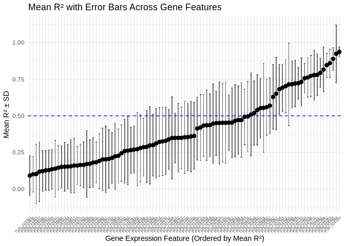<!-- -->

``` r
# Plot with features sorted by mean R²
ggplot(all_MP, aes(x = Feature, y = R2)) +
  geom_point(aes(color = as.factor(Replicate)), size = 1) +
  geom_point(aes(y = Mean_R2), color = "black", shape = 18, size = 3) + 
  geom_hline(yintercept = mean(all_MP$R2, na.rm = TRUE),
             linetype = "dashed", color = "blue") +
  theme_minimal() +
  labs(title = "Model Performance Across Gene Expression",
       x = "Gene Expression Feature (Ordered by Mean R²)",
       y = "R² (Variance Explained)",
       color = "Replicate") +
  theme(axis.text.x = element_text(angle = 45, hjust = 1)) +
  ylim(0, 1)
```

    ## Warning: Removed 107 rows containing missing values or values outside the scale range
    ## (`geom_point()`).

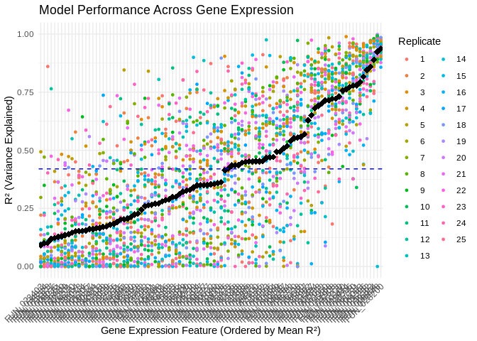<!-- -->

Average importance of all predictive features and plot those with
highest average importance accross all replicates

``` r
# Average importance across replicates
mean_importance_df <- all_FI %>%
  group_by(Feature) %>%
  summarise(MeanImportance = mean(MeanImportance, na.rm = TRUE)) %>%
  arrange(desc(MeanImportance))

# Select top 50 features
top_features <- mean_importance_df %>% top_n(50, MeanImportance)

# Plot
ggplot(top_features, aes(x = reorder(Feature, MeanImportance), y = MeanImportance)) +
  geom_bar(stat = "identity", fill = "steelblue") +
  coord_flip() +  # Flip for readability
  theme_minimal() +
  labs(title = "Top Predictive Features by Mean Importance",
       x = "Feature",
       y = "Mean Importance")
```

<!-- -->

# 8 Boostrapping on predictable genes

Now I only want to model genes that are well-predicted over many
replicates

Isolate well-predicted genes

``` r
well_predicted <- MP_summary[MP_summary$Mean_R2 > 0.5,]

vsd_high_perf_t <- vsd_energetic_state_GO_t[,colnames(vsd_energetic_state_GO_t) %in% well_predicted$Feature]
dim(vsd_high_perf_t)
```

    ## [1] 39 29

Of the original 99 genes annotated for energetic state GO terms, 33 are
consistently well-predicted by our model (mean R^2 \> 0.5, over 25
replicates).

Run bootstrapping on isolated genes

``` r
n_replicates <- 50  # number of replicates
r2_threshold <- 0.5 # threshold for "good" prediction
TM_list <- list()
MP_list <- list()
FI_list <- list()

# Perform bootstrapping
for (i in 1:n_replicates) {
  cat("Beginning replicate", i)
  cat("\n")
  result <- train_models_split(vsd_high_perf_t, full_pred_counts)
  
  cat("Extracting results for replicate", i)
  cat("\n")
  trained_models <- result$models
  model_performance <- result$performance
  feature_importance <- get_feature_importance(trained_models)
  
  TM_list[[i]] <- list(Replicate = i, Models = trained_models)
  
  MP_list[[i]] <- model_performance
  MP_list[[i]]$Replicate <- i
  
  FI_list[[i]] <- feature_importance
  FI_list[[i]]$Replicate <- i
}
```

    ## Beginning replicate 1
    ## Extracting results for replicate 1
    ## Beginning replicate 2
    ## Extracting results for replicate 2
    ## Beginning replicate 3
    ## Extracting results for replicate 3
    ## Beginning replicate 4
    ## Extracting results for replicate 4
    ## Beginning replicate 5
    ## Extracting results for replicate 5
    ## Beginning replicate 6
    ## Extracting results for replicate 6
    ## Beginning replicate 7
    ## Extracting results for replicate 7
    ## Beginning replicate 8
    ## Extracting results for replicate 8
    ## Beginning replicate 9
    ## Extracting results for replicate 9
    ## Beginning replicate 10
    ## Extracting results for replicate 10
    ## Beginning replicate 11
    ## Extracting results for replicate 11
    ## Beginning replicate 12
    ## Extracting results for replicate 12
    ## Beginning replicate 13
    ## Extracting results for replicate 13
    ## Beginning replicate 14
    ## Extracting results for replicate 14
    ## Beginning replicate 15
    ## Extracting results for replicate 15
    ## Beginning replicate 16
    ## Extracting results for replicate 16
    ## Beginning replicate 17
    ## Extracting results for replicate 17
    ## Beginning replicate 18
    ## Extracting results for replicate 18
    ## Beginning replicate 19
    ## Extracting results for replicate 19
    ## Beginning replicate 20
    ## Extracting results for replicate 20
    ## Beginning replicate 21
    ## Extracting results for replicate 21
    ## Beginning replicate 22
    ## Extracting results for replicate 22
    ## Beginning replicate 23
    ## Extracting results for replicate 23
    ## Beginning replicate 24
    ## Extracting results for replicate 24
    ## Beginning replicate 25
    ## Extracting results for replicate 25
    ## Beginning replicate 26
    ## Extracting results for replicate 26
    ## Beginning replicate 27
    ## Extracting results for replicate 27
    ## Beginning replicate 28
    ## Extracting results for replicate 28
    ## Beginning replicate 29
    ## Extracting results for replicate 29
    ## Beginning replicate 30
    ## Extracting results for replicate 30
    ## Beginning replicate 31
    ## Extracting results for replicate 31
    ## Beginning replicate 32
    ## Extracting results for replicate 32
    ## Beginning replicate 33
    ## Extracting results for replicate 33
    ## Beginning replicate 34
    ## Extracting results for replicate 34
    ## Beginning replicate 35
    ## Extracting results for replicate 35
    ## Beginning replicate 36
    ## Extracting results for replicate 36
    ## Beginning replicate 37
    ## Extracting results for replicate 37
    ## Beginning replicate 38
    ## Extracting results for replicate 38
    ## Beginning replicate 39
    ## Extracting results for replicate 39
    ## Beginning replicate 40
    ## Extracting results for replicate 40
    ## Beginning replicate 41
    ## Extracting results for replicate 41
    ## Beginning replicate 42
    ## Extracting results for replicate 42
    ## Beginning replicate 43
    ## Extracting results for replicate 43
    ## Beginning replicate 44
    ## Extracting results for replicate 44
    ## Beginning replicate 45
    ## Extracting results for replicate 45
    ## Beginning replicate 46
    ## Extracting results for replicate 46
    ## Beginning replicate 47
    ## Extracting results for replicate 47
    ## Beginning replicate 48
    ## Extracting results for replicate 48
    ## Beginning replicate 49
    ## Extracting results for replicate 49
    ## Beginning replicate 50
    ## Extracting results for replicate 50

``` r
# Combine all results
all_MP_highperf <- do.call(rbind, MP_list)
all_FI_highperf <- do.call(rbind, FI_list)
```

``` r
# Count how often each feature exceeds the R² threshold

MP_summary_highperf <- all_MP_highperf %>%
  group_by(Feature) %>%
  summarize(
    Mean_R2 = mean(R2, na.rm = TRUE),
    SD_R2 = sd(R2, na.rm = TRUE),
    SE_R2 = SD_R2 / sqrt(n()),
    High_Perf_Count = sum(R2 >= r2_threshold),
    .groups = 'drop'
  ) %>%
  arrange(desc(High_Perf_Count))

# View top consistently high-performing features
print(MP_summary_highperf)
```

    ## # A tibble: 29 × 5
    ##    Feature    Mean_R2  SD_R2   SE_R2 High_Perf_Count
    ##    <chr>        <dbl>  <dbl>   <dbl>           <int>
    ##  1 FUN_008934   0.870 0.0949 0.0134               50
    ##  2 FUN_025232   0.848 0.0928 0.0131               50
    ##  3 FUN_028200   0.934 0.0521 0.00736              50
    ##  4 FUN_039293   0.866 0.0851 0.0120               50
    ##  5 FUN_023596   0.761 0.150  0.0213               48
    ##  6 FUN_041721   0.802 0.129  0.0182               48
    ##  7 FUN_001160   0.779 0.131  0.0185               47
    ##  8 FUN_035468   0.735 0.181  0.0256               46
    ##  9 FUN_037573   0.756 0.158  0.0223               46
    ## 10 FUN_002433   0.744 0.155  0.0219               45
    ## # ℹ 19 more rows

``` r
# How many genes are consistently well-predicted?
nrow(MP_summary_highperf[MP_summary_highperf$Mean_R2 > 0.5,])
```

    ## [1] 28

When I train the model on only these 33 well-predicted genes, 28 of them
are again well-predicted. That’s a much higher success rate! This
suggests that epigenetic mechanisms may indeed be able to predict
expression of these genes

Sort genes by average R^2 across all replicates, then plot R^2 for all
replicates

``` r
# Merge mean R2 info into full replicate-level data
all_MP_highperf <- merge(all_MP_highperf, MP_summary_highperf[, c("Feature", "Mean_R2", "SD_R2")], by = "Feature")

# Reorder Feature factor by Mean_R2
all_MP_highperf$Feature <- factor(all_MP_highperf$Feature,
                                          levels = MP_summary_highperf$Feature[order(MP_summary_highperf$Mean_R2)])
```

``` r
# Plot mean R² with error bars
# Choose SD to describe variability in model performance
ggplot(all_MP_highperf, aes(x = Feature, y = Mean_R2)) +
  geom_errorbar(aes(ymin = Mean_R2 - SD_R2, ymax = Mean_R2 + SD_R2), width = 0.3, color = "gray40") +
  geom_point(size = 2, color = "black") +
  geom_hline(yintercept = 0.5,
             linetype = "dashed", color = "blue") +
  theme_minimal() +
  labs(title = "Mean R² with Error Bars Across Gene Features",
       x = "Gene Expression Feature (Ordered by Mean R²)",
       y = "Mean R² ± SD") +
  theme(axis.text.x = element_text(angle = 45, hjust = 1)) +
  ylim(-0.2, 1.2) +
  scale_y_continuous(breaks = c(0, 0.25, 0.5, 0.75, 1))
```

    ## Scale for y is already present.
    ## Adding another scale for y, which will replace the existing scale.

<!-- -->

``` r
# Plot all replicate R2s, with features sorted by mean R²
ggplot(all_MP_highperf, aes(x = Feature, y = R2)) +
  geom_point(aes(color = as.factor(Replicate)), size = 1.5) +
  geom_point(aes(y = Mean_R2), color = "black", shape = 18, size = 3) + 
  geom_hline(yintercept = mean(all_MP_highperf$R2, na.rm = TRUE),
             linetype = "dashed", color = "blue") +
  theme_minimal() +
  labs(title = "Model Performance Across Gene Expression",
       x = "Gene Expression Feature (Ordered by Mean R²)",
       y = "R² (Variance Explained)",
       color = "Replicate") +
  theme(axis.text.x = element_text(angle = 45, hjust = 1)) +
  ylim(0, 1)
```

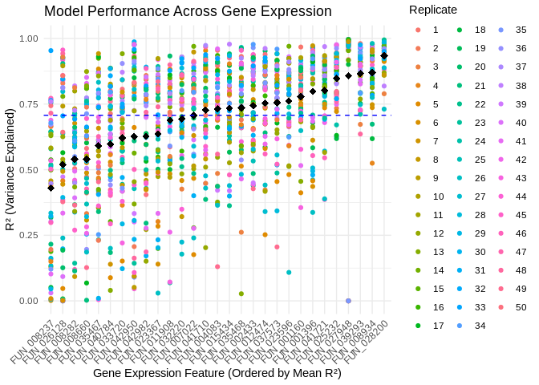<!-- -->

``` r
# Average importance across replicates
mean_importance_df_highperf <- all_FI_highperf %>%
  group_by(Feature) %>%
  summarise(MeanImportance = mean(MeanImportance, na.rm = TRUE)) %>%
  arrange(desc(MeanImportance))

# Select top 50 features
top_features_highperf <- mean_importance_df_highperf %>% top_n(50, MeanImportance)

# Plot
ggplot(top_features_highperf, aes(x = reorder(Feature, MeanImportance), y = MeanImportance)) +
  geom_bar(stat = "identity", fill = "steelblue") +
  coord_flip() +  # Flip for readability
  theme_minimal() +
  labs(title = "Top Predictive Features by Mean Importance",
       x = "Feature",
       y = "Mean Importance")
```

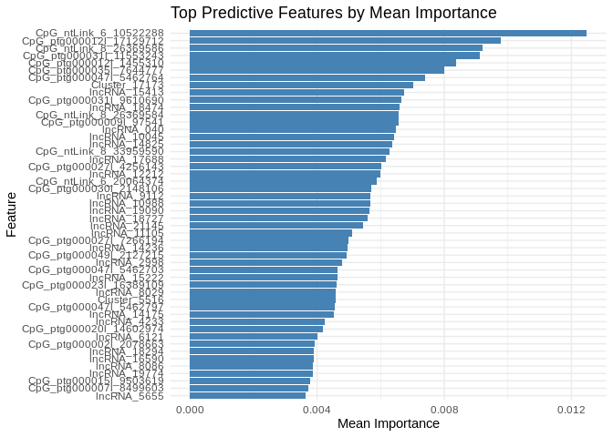<!-- -->

Look at most predictive epigenetic features for these well-predicted
genes

``` r
# Define color assignments for predictor types
color_palette <- c(miRNA = "#E69F00", lncRNA = "#0072B2", CpG = "#009E73")

#  Define well-predicted features
all_features_highR2 <- all_MP_highperf %>%
  filter(Mean_R2 > 0.5) %>%
  pull(Feature) %>%
  unique()

# Function to extract importance from a single model
get_feature_importance_for_feature <- function(model) {
  coefs <- as.matrix(coef(model, s = "lambda.min"))[-1, , drop = FALSE]  # remove intercept
  data.frame(Predictor = rownames(coefs), Importance = abs(as.numeric(coefs)))
}

# Function to assign predictor type
get_predictor_type <- function(predictor_name) {
  if (startsWith(predictor_name, "Cluster")) return("miRNA")
  if (startsWith(predictor_name, "lncRNA")) return("lncRNA")
  if (startsWith(predictor_name, "CpG")) return("CpG")
  return("Other")
}

# Initialize list to save top predictors
top_predictors <- list()

# Loop over features, aggregate importance across replicates, and plot
for (target_feature in all_features_highR2) {
  
  # Extract and combine importance scores across all replicates
  importance_all_reps <- lapply(TM_list, function(rep_entry) {
    model <- rep_entry$Models[[target_feature]]
    if (!is.null(model)) {
      get_feature_importance_for_feature(model)
    } else {
      NULL
    }
  }) %>% bind_rows()

  # If no importance data was found, skip
  if (nrow(importance_all_reps) == 0) next

  # Compute average importance across replicates
  mean_importance <- importance_all_reps %>%
    group_by(Predictor) %>%
    summarise(MeanImportance = mean(Importance, na.rm = TRUE), .groups = "drop") %>%
    arrange(desc(MeanImportance)) %>%
    slice_head(n = 20) %>%
    mutate(Type = sapply(Predictor, get_predictor_type))


  # Plot once per target feature
  plot <- ggplot(mean_importance, aes(x = reorder(Predictor, MeanImportance), y = MeanImportance, fill=Type)) +
    geom_bar(stat = "identity") +
    scale_fill_manual(values = color_palette) +
    coord_flip() +
    theme_minimal() +
    labs(title = paste("Top Predictors for", target_feature),
         x = "Predictor",
         y = "Mean Importance (across replicates)")

  # Save top 20 most important predictors for later use
  top20 <- mean_importance %>% 
    mutate(Feature = target_feature)
  
  top_predictors[[target_feature]] <- top20
  
  print(plot)
}
```

<!-- -->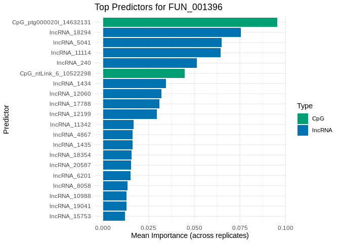<!-- --><!-- --><!-- --><!-- --><!-- --><!-- --><!-- -->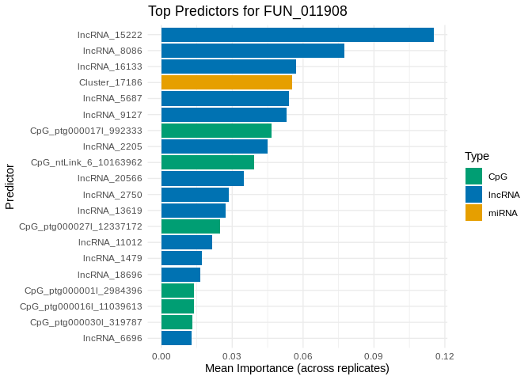<!-- --><!-- -->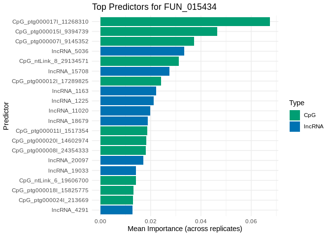<!-- --><!-- --><!-- --><!-- --><!-- -->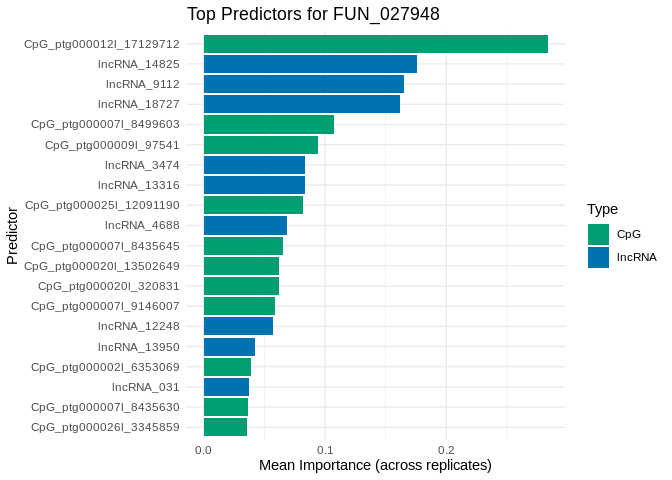<!-- -->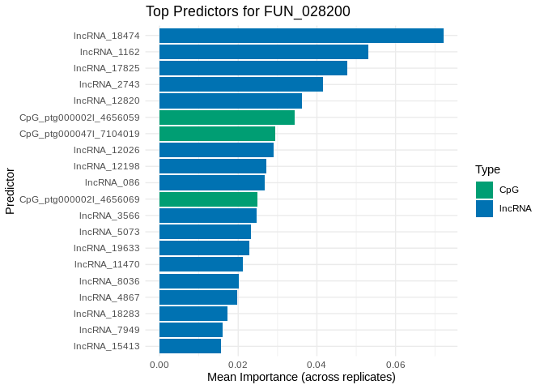<!-- --><!-- -->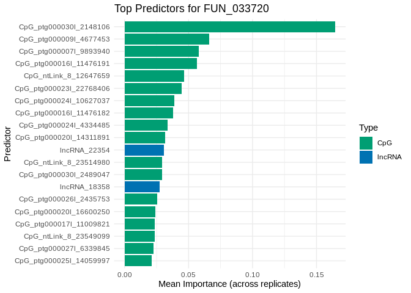<!-- -->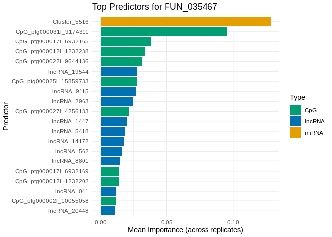<!-- --><!-- --><!-- --><!-- -->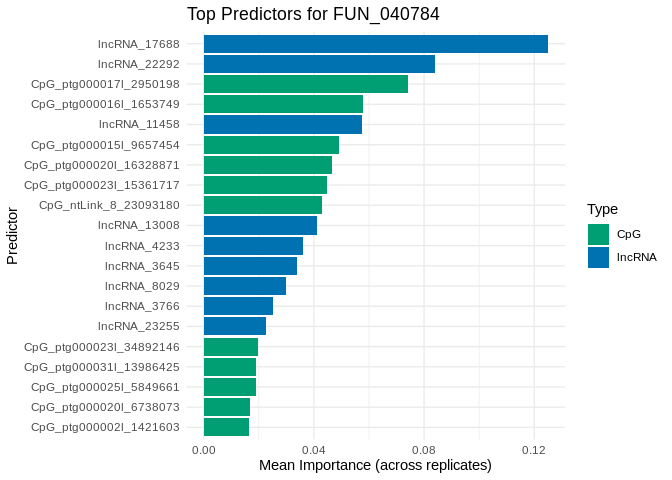<!-- --><!-- --><!-- --><!-- --><!-- -->

# 9 Plot expression of genes and their predictors

``` r
# Put predictor expression in format with samples in columns
full_pred_counts_t <- t(full_pred_counts)

# Loop over each feature in the list
for (feature in names(top_predictors)) {
  
  # Get top 5 predictors for this feature
  top_df <- top_predictors[[feature]] %>%
    slice_head(n = 5)
  predictors <- top_df$Predictor
  
  # Combine feature and predictors
  all_genes <- c(feature, predictors)
  
  # Check which genes are actually present
  present_genes <- all_genes[all_genes %in% rownames(full_pred_counts_t) | all_genes %in% rownames(vsd_energetic_state_GO)]
  
  if (!(feature %in% rownames(vsd_energetic_state_GO))) {
    warning(paste("Feature", feature, "not found in vsd_energetic_state_GO Skipping..."))
    next
  }

  # Extract predictor expression (only those present)
  predictor_expr <- full_pred_counts_t[intersect(predictors, rownames(full_pred_counts_t)), , drop = FALSE] %>% as.data.frame()

  # Add the feature expression
  feature_expr <- vsd_energetic_state_GO[feature, , drop = FALSE] %>% as.data.frame()
  
  # Combine into one data frame
  combined_expr <- rbind(predictor_expr, feature_expr)
  combined_expr$Gene <- rownames(combined_expr)
  
  # Convert to long format
  expr_long <- combined_expr %>%
    pivot_longer(-Gene, names_to = "Sample", values_to = "Expression")
  
  # Join with sample metadata
  expr_long <- expr_long %>%
    left_join(metadata, by = "Sample")
  
  # Plot, with colonies aggregated by timepoint
  # p <- ggplot(expr_long, aes(x = interaction(Timepoint), y = Expression, color = Gene, group = Gene)) +
  #   geom_point(alpha = 0.7) +
  #   geom_smooth(se = FALSE, method = "loess") +
  #   labs(title = paste("Expression of", feature, "and Top 5 Predictors"),
  #        x = "Colony-Timepoint",
  #        y = "Expression") +
  #   theme_minimal() +
  #   theme(axis.text.x = element_text(angle = 45, hjust = 1))
  
  # Plot, faceted by colony
  p <- ggplot(expr_long, aes(x = Timepoint, y = Expression, color = Gene, group = Gene)) +
  geom_point(alpha = 0.7) +
  geom_smooth(se = FALSE, method = "loess", linewidth = 0.5) +
  facet_wrap(~ColonyID) +
  labs(title = paste("Expression of", feature, "and Top 5 Predictors by Colony"),
       x = "Timepoint",
       y = "Expression") +
  theme_minimal() +
  theme(axis.text.x = element_text(angle = 45, hjust = 1))

  
  print(p)
}
```

    ## `geom_smooth()` using formula = 'y ~ x'

<!-- -->

    ## `geom_smooth()` using formula = 'y ~ x'

<!-- -->

    ## `geom_smooth()` using formula = 'y ~ x'

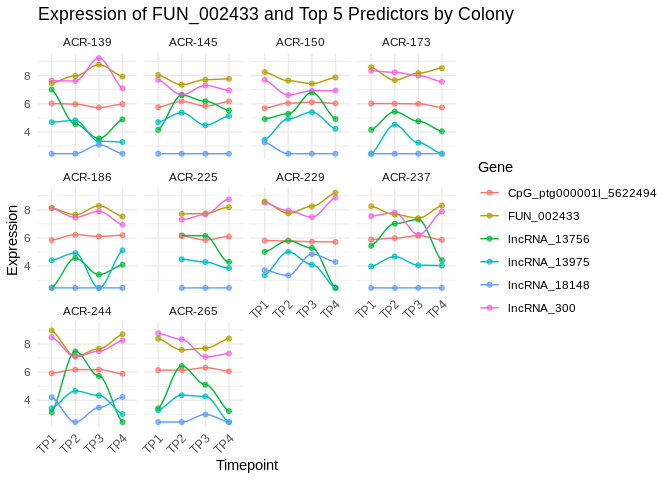<!-- -->

    ## `geom_smooth()` using formula = 'y ~ x'

<!-- -->

    ## `geom_smooth()` using formula = 'y ~ x'

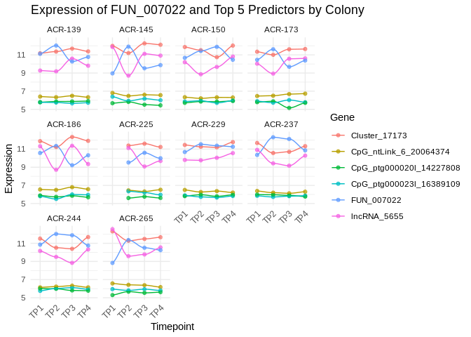<!-- -->

    ## `geom_smooth()` using formula = 'y ~ x'

<!-- -->

    ## `geom_smooth()` using formula = 'y ~ x'

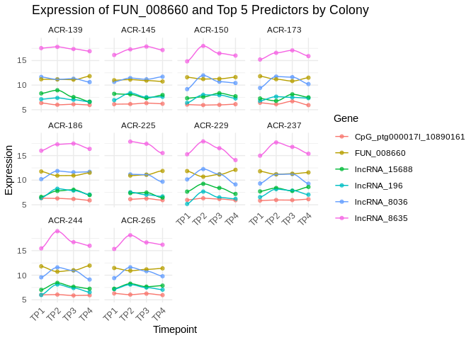<!-- -->

    ## `geom_smooth()` using formula = 'y ~ x'

<!-- -->

    ## `geom_smooth()` using formula = 'y ~ x'

<!-- -->

    ## `geom_smooth()` using formula = 'y ~ x'

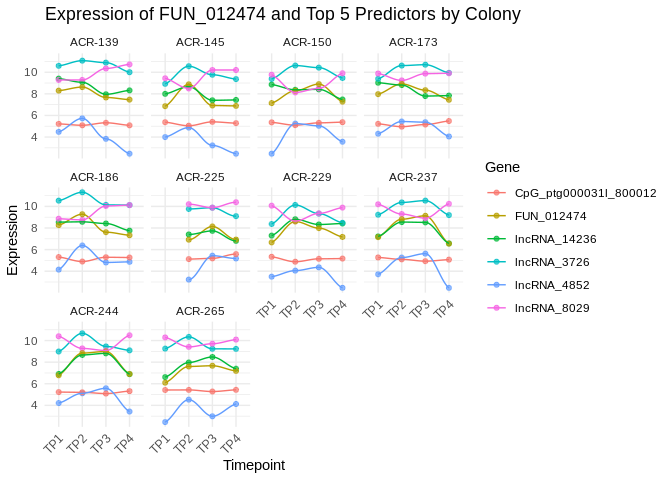<!-- -->

    ## `geom_smooth()` using formula = 'y ~ x'

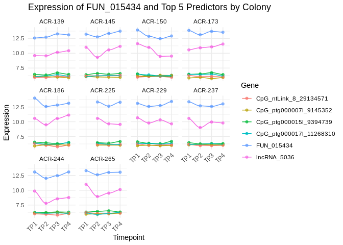<!-- -->

    ## `geom_smooth()` using formula = 'y ~ x'

<!-- -->

    ## `geom_smooth()` using formula = 'y ~ x'

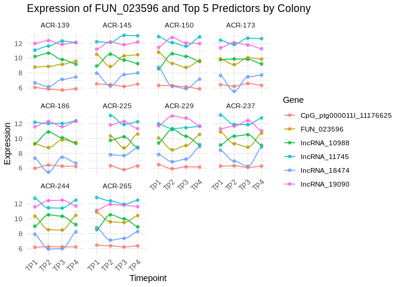<!-- -->

    ## `geom_smooth()` using formula = 'y ~ x'

<!-- -->

    ## `geom_smooth()` using formula = 'y ~ x'

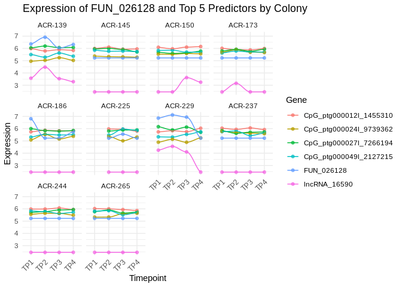<!-- -->

    ## `geom_smooth()` using formula = 'y ~ x'

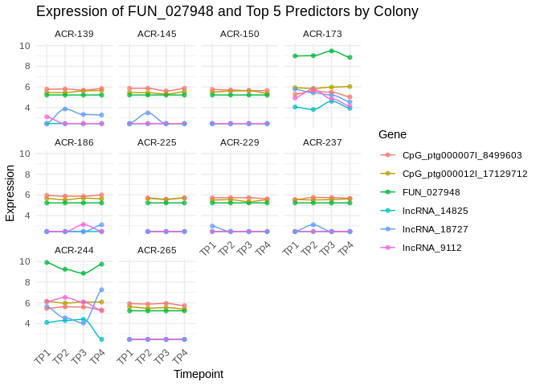<!-- -->

    ## `geom_smooth()` using formula = 'y ~ x'

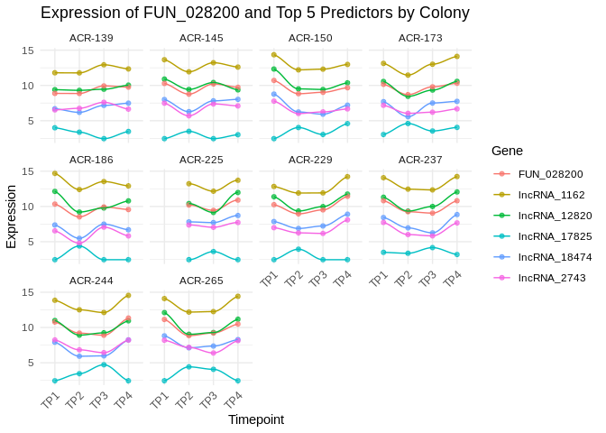<!-- -->

    ## `geom_smooth()` using formula = 'y ~ x'

<!-- -->

    ## `geom_smooth()` using formula = 'y ~ x'

<!-- -->

    ## `geom_smooth()` using formula = 'y ~ x'

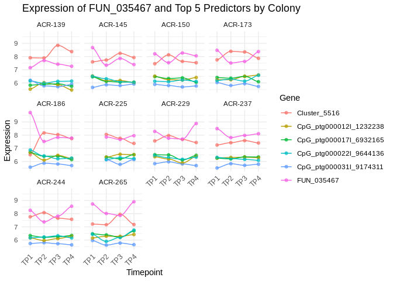<!-- -->

    ## `geom_smooth()` using formula = 'y ~ x'

<!-- -->

    ## `geom_smooth()` using formula = 'y ~ x'

<!-- -->

    ## `geom_smooth()` using formula = 'y ~ x'

<!-- -->

    ## `geom_smooth()` using formula = 'y ~ x'

<!-- -->

    ## `geom_smooth()` using formula = 'y ~ x'

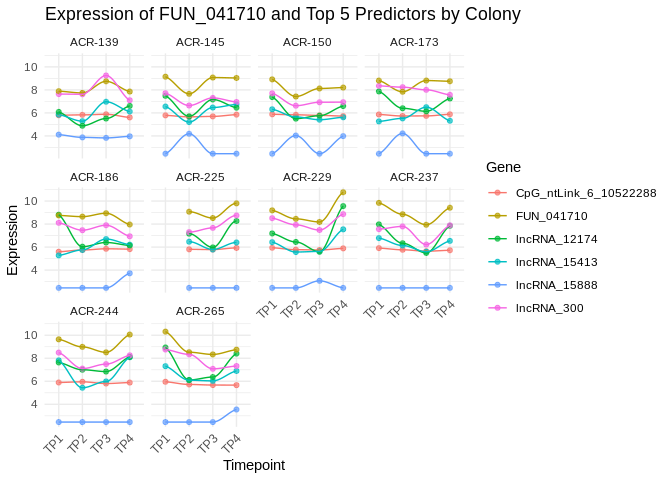<!-- -->

    ## `geom_smooth()` using formula = 'y ~ x'

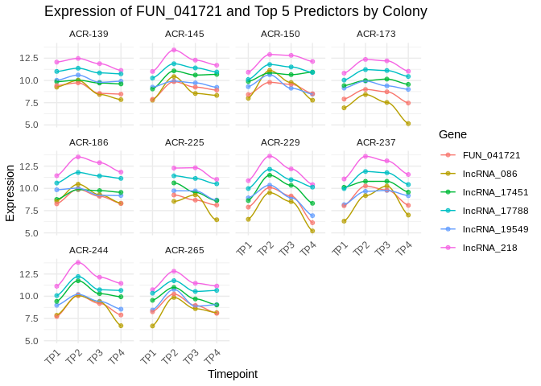<!-- -->

    ## `geom_smooth()` using formula = 'y ~ x'

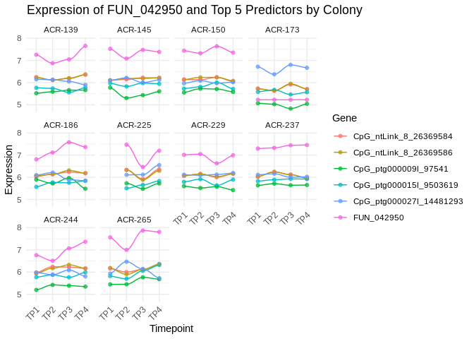<!-- -->

    ## `geom_smooth()` using formula = 'y ~ x'

<!-- -->

# 10 Functions of well-predicted genes

``` r
all_features_highR2_FA <- energetic_state_GO[energetic_state_GO$gene %in% all_features_highR2,]
print(all_features_highR2_FA)
```

    ##          gene module                           V1     V3
    ## 1  FUN_002433    ME2     ntLink_8:1537514-1543906 F1LU71
    ## 2  FUN_004083    ME2   ntLink_8:18989336-18999141 Q9ET22
    ## 8  FUN_001160    ME1     ntLink_6:9221504-9231233 P97742
    ## 13 FUN_001396    ME1   ntLink_6:11908587-11910717 O97562
    ## 19 FUN_007022    ME9 ptg000001l:19386902-19398415 Q8WP19
    ## 22 FUN_008282    ME3   ptg000002l:9911971-9929166 Q9VCU9
    ## 26 FUN_008660   ME14 ptg000002l:14136576-14138681 Q5R9Y4
    ## 27 FUN_008934    ME8     ptg000004l:622874-629747 A5D7I4
    ## 31 FUN_011908   ME14   ptg000008l:2748000-2770398 Q5R4G2
    ## 39 FUN_012474    ME1   ptg000008l:9228493-9235608 Q9XTR8
    ## 44 FUN_015434   ME14 ptg000009l:10125666-10128350 P53448
    ## 50 FUN_023367    ME1   ptg000017l:6723553-6730063 P17712
    ## 52 FUN_023596    ME2   ptg000017l:9699993-9702655 Q9Y5Y6
    ## 54 FUN_025232    ME2     ptg000019l:257406-264111 P55070
    ## 58 FUN_026128   ME41   ptg000020l:4918603-4924154 P42574
    ## 59 FUN_027948   ME32 ptg000021l:13714157-13715126 Q63HM9
    ## 61 FUN_028200    ME2 ptg000021l:16810807-16815447 Q4R7L3
    ## 67 FUN_032220    ME1 ptg000023l:29856466-29862755 Q19749
    ## 68 FUN_033720    ME4     ptg000024l:673513-676224 Q8VDL4
    ## 74 FUN_035467   ME14   ptg000025l:7690136-7695911 Q16822
    ## 75 FUN_035468    ME8   ptg000025l:7702781-7707570 Q8BH04
    ## 79 FUN_037573    ME2 ptg000026l:11925692-11934635 O42586
    ## 83 FUN_039293    ME2     ptg000028l:389925-395432 P55070
    ## 88 FUN_040784   ME13 ptg000031l:12653616-12663860 O65201
    ## 89 FUN_041710    ME2   ptg000035l:6737981-6752397 Q5LUF3
    ## 90 FUN_041721    ME5   ptg000035l:6790698-6792011 Q5R4G2
    ## 93 FUN_042950    ME0   ptg000047l:2301377-2311682 Q12933
    ## 97 FUN_042982   ME12   ptg000047l:2690313-2698318 Q8BS35
    ##                                                                                                                                                                                                                                                             Protein.names
    ## 1                                                                  Methylglutaconyl-CoA hydratase, mitochondrial (3-MG-CoA hydratase) (EC 4.2.1.18) (AU-specific RNA-binding enoyl-CoA hydratase) (AU-binding enoyl-CoA hydratase) (Itaconyl-CoA hydratase) (EC 4.2.1.56)
    ## 2                                                                                                    Dipeptidyl peptidase 2 (EC 3.4.14.2) (Dipeptidyl aminopeptidase II) (Dipeptidyl peptidase 7) (Dipeptidyl peptidase II) (DPP II) (Quiescent cell proline dipeptidase)
    ## 8                                                                                       Carnitine O-palmitoyltransferase 1, liver isoform (CPT1-L) (EC 2.3.1.21) (Carnitine O-palmitoyltransferase I, liver isoform) (CPT I) (CPTI-L) (Carnitine palmitoyltransferase 1A)
    ## 13                                                                                                                                                         Dicarboxylate carrier SLC25A8 (Mitochondrial uncoupling protein 2) (UCP 2) (Solute carrier family 25 member 8)
    ## 19                                                                                                                                                                                                                                                         Cryptochrome-1
    ## 22                                                                                                                                                                                                                 Endoribonuclease Dcr-1 (Protein dicer-1) (EC 3.1.26.-)
    ## 26                                                                                                                                                                                                                                Ras-related protein Rab-7a (EC 3.6.5.2)
    ## 27                                                            Exostosin-1 (EC 2.4.1.224) (EC 2.4.1.225) (Glucuronosyl-N-acetylglucosaminyl-proteoglycan/N-acetylglucosaminyl-proteoglycan 4-alpha-N-acetylglucosaminyltransferase) (Multiple exostoses protein 1 homolog)
    ## 31                                                                                     Platelet-activating factor acetylhydrolase IB subunit alpha2 (EC 3.1.1.47) (PAF acetylhydrolase 30 kDa subunit) (PAF-AH 30 kDa subunit) (PAF-AH subunit beta) (PAFAH subunit beta)
    ## 39                                                                                                                                                                                                                                            Lipase ZK262.3 (EC 3.1.1.-)
    ## 44                                                                                                                                                                                                   Fructose-bisphosphate aldolase C (EC 4.1.2.13) (Brain-type aldolase)
    ## 50                                                                                                                                                                              Hexokinase-4 (HK4) (EC 2.7.1.1) (Glucokinase) (Hexokinase type IV) (HK IV) (Hexokinase-D)
    ## 52                                 Suppressor of tumorigenicity 14 protein (EC 3.4.21.109) (Matriptase) (Membrane-type serine protease 1) (MT-SP1) (Prostamin) (Serine protease 14) (Serine protease TADG-15) (Tumor-associated differentially-expressed gene 15 protein)
    ## 54                                                                                                                                                                                                         Glyceraldehyde-3-phosphate dehydrogenase (GAPDH) (EC 1.2.1.12)
    ## 58                                                                         Caspase-3 (CASP-3) (EC 3.4.22.56) (Apopain) (Cysteine protease CPP32) (CPP-32) (Protein Yama) (SREBP cleavage activity 1) (SCA-1) [Cleaved into: Caspase-3 subunit p17; Caspase-3 subunit p12]
    ## 59                                                                                                                                                                                                                                   PI-PLC X domain-containing protein 3
    ## 61                                                                                                                                                        26S proteasome regulatory subunit 6B (26S proteasome AAA-ATPase subunit RPT3) (Proteasome 26S subunit ATPase 4)
    ## 67 Dihydrolipoyllysine-residue acetyltransferase component of pyruvate dehydrogenase complex, mitochondrial (EC 2.3.1.12) (Dihydrolipoamide acetyltransferase component of pyruvate dehydrogenase complex) (Pyruvate dehydrogenase complex component E2) (PDC-E2) (PDCE2)
    ## 68                                                                                                                                                                                                              ADP-dependent glucokinase (ADP-GK) (ADPGK) (EC 2.7.1.147)
    ## 74                                                                                                                                                                                         Phosphoenolpyruvate carboxykinase [GTP], mitochondrial (PEPCK-M) (EC 4.1.1.32)
    ## 75                                                                                                                                                                                         Phosphoenolpyruvate carboxykinase [GTP], mitochondrial (PEPCK-M) (EC 4.1.1.32)
    ## 79                                                                                                                26S proteasome regulatory subunit 6A-B (26S proteasome AAA-ATPase subunit RPT5-B) (Proteasome 26S subunit ATPase 3-B) (Tat-binding protein 10) (TBP-10)
    ## 83                                                                                                                                                                                                         Glyceraldehyde-3-phosphate dehydrogenase (GAPDH) (EC 1.2.1.12)
    ## 88                                                                                                                                                                      Acyl-coenzyme A oxidase 2, peroxisomal (AOX 2) (EC 1.3.3.6) (Long-chain acyl-CoA oxidase) (AtCX2)
    ## 89                                                                                                                                                                                                                     Propionyl-CoA carboxylase alpha chain (EC 6.4.1.3)
    ## 90                                                                                     Platelet-activating factor acetylhydrolase IB subunit alpha2 (EC 3.1.1.47) (PAF acetylhydrolase 30 kDa subunit) (PAF-AH 30 kDa subunit) (PAF-AH subunit beta) (PAFAH subunit beta)
    ## 93                                                                             TNF receptor-associated factor 2 (EC 2.3.2.27) (E3 ubiquitin-protein ligase TRAF2) (RING-type E3 ubiquitin transferase TRAF2) (Tumor necrosis factor type 2 receptor-associated protein 3)
    ## 97                                                                                                                                                                                                 Alkylglycerol monooxygenase (EC 1.14.16.5) (Transmembrane protein 195)
    ##                                                                              Organism
    ## 1                                                             Rattus norvegicus (Rat)
    ## 2                                                                Mus musculus (Mouse)
    ## 8                                                                Mus musculus (Mouse)
    ## 13                                                                   Sus scrofa (Pig)
    ## 19                      Macaca fascicularis (Crab-eating macaque) (Cynomolgus monkey)
    ## 22                                                Drosophila melanogaster (Fruit fly)
    ## 26                          Pongo abelii (Sumatran orangutan) (Pongo pygmaeus abelii)
    ## 27                                                                Bos taurus (Bovine)
    ## 31                          Pongo abelii (Sumatran orangutan) (Pongo pygmaeus abelii)
    ## 39                                                             Caenorhabditis elegans
    ## 44                                                       Carassius auratus (Goldfish)
    ## 50                                                            Rattus norvegicus (Rat)
    ## 52                                                               Homo sapiens (Human)
    ## 54                                       Lactarius deterrimus (False saffron milkcap)
    ## 58                                                               Homo sapiens (Human)
    ## 59                                                               Homo sapiens (Human)
    ## 61                      Macaca fascicularis (Crab-eating macaque) (Cynomolgus monkey)
    ## 67                                                             Caenorhabditis elegans
    ## 68                                                               Mus musculus (Mouse)
    ## 74                                                               Homo sapiens (Human)
    ## 75                                                               Mus musculus (Mouse)
    ## 79                                               Xenopus laevis (African clawed frog)
    ## 83                                       Lactarius deterrimus (False saffron milkcap)
    ## 88                                             Arabidopsis thaliana (Mouse-ear cress)
    ## 89 Ruegeria pomeroyi (strain ATCC 700808 / DSM 15171 / DSS-3) (Silicibacter pomeroyi)
    ## 90                          Pongo abelii (Sumatran orangutan) (Pongo pygmaeus abelii)
    ## 93                                                               Homo sapiens (Human)
    ## 97                                                               Mus musculus (Mouse)
    ##                                                                                                                                                                                                                                                                                                                                                                                                                                                                                                                                                                                                                                                                                                                                                                                                                                                                                                                                                                                                                                                                                                                                                                                                                                                                                                                                                                                                                                                                                                                                                                                                                                                                                                                                                                                                                                                                                                                                                                                                                                                                                                                                                                                                                                                                                                                                                                                                                                                                                                                                                                                                                                                                                                                                                                                                                                                                                                                                                                                                                                                                                                                                                                                                                                                                                                                                                                                                                                                                                                                                          Gene.Ontology..biological.process.
    ## 1                                                                                                                                                                                                                                                                                                                                                                                                                                                                                                                                                                                                                                                                                                                                                                                                                                                                                                                                                                                                                                                                                                                                                                                                                                                                                                                                                                                                                                                                                                                                                                                                                                                                                                                                                                                                                                                                                                                                                                                                                                                                                                                                                                                                                                                                                                                                                                                                                                                                                                                                                                                                                                                                                                                                                                                                                                                                                                                                                                                                                                                                                                                                                                                                                                                                                                                                                                                                                                                                                            fatty acid beta-oxidation [GO:0006635]; leucine catabolic process [GO:0006552]
    ## 2                                                                                                                                                                                                                                                                                                                                                                                                                                                                                                                                                                                                                                                                                                                                                                                                                                                                                                                                                                                                                                                                                                                                                                                                                                                                                                                                                                                                                                                                                                                                                                                                                                                                                                                                                                                                                                                                                                                                                                                                                                                                                                                                                                                                                                                                                                                                                                                                                                                                                                                                                                                                                                                                                                                                                                                                                                                                                                                                                                                                                                                                                                                                                                                                                                                                                                                                                                                                                                                        lysosomal protein catabolic process [GO:1905146]; protein catabolic process [GO:0030163]; proteolysis [GO:0006508]
    ## 8                                                                                                                                                                                                                                                                                                                                                                                                                                                                                                                                                                                                                                                                                                                                                                                                                                                                                                                                                                                                                                                                                                                                                                                                                                                                                                                                                                                                                                                                                                                                                                                                                                                                                                                                                                                                                                                                                                                                                                                                                                                                                                                                                                                                                                                                                                                                                                                                                                                                                                                                                                                               carnitine metabolic process [GO:0009437]; cellular response to fatty acid [GO:0071398]; eating behavior [GO:0042755]; epithelial cell differentiation [GO:0030855]; fatty acid beta-oxidation [GO:0006635]; fatty acid metabolic process [GO:0006631]; glucose metabolic process [GO:0006006]; lipid localization [GO:0010876]; liver regeneration [GO:0097421]; long-chain fatty acid metabolic process [GO:0001676]; positive regulation of fatty acid beta-oxidation [GO:0032000]; regulation of fatty acid oxidation [GO:0046320]; regulation of insulin secretion [GO:0050796]; regulation of lipid storage [GO:0010883]; response to alkaloid [GO:0043279]; response to antibiotic [GO:0046677]; response to ethanol [GO:0045471]; response to nutrient levels [GO:0031667]; response to organic cyclic compound [GO:0014070]; response to tetrachloromethane [GO:1904772]; response to xenobiotic stimulus [GO:0009410]; triglyceride metabolic process [GO:0006641]
    ## 13                                                                                                                                                                                                                                                                                                                                                                                                                                                                                                                                                                                                                                                                                                                                                                                                                                                                                                                                                                                                                                                                                                                                                                                                                                                                                                                                                                                                                                                                                                                                                                                                                                                                                                                                                                                                                                                                                                                                                                                                                                                                                                                                                                                                                                                                                                                                                                                                                                                                                                                                                                                                                                                                                                                                                                                                                                                                                                                                                                                                                                                                                                adaptive thermogenesis [GO:1990845]; C4-dicarboxylate transport [GO:0015740]; cellular response to glucose stimulus [GO:0071333]; glutamine metabolic process [GO:0006541]; glycolytic process [GO:0006096]; macrophage differentiation [GO:0030225]; mitochondrial fission [GO:0000266]; mitochondrial transmembrane transport [GO:1990542]; mitochondrial transport [GO:0006839]; reactive oxygen species metabolic process [GO:0072593]; response to cold [GO:0009409]
    ## 19                                                                                                                                                                                                                                                                                                                                                                                                                                                                                                                                                                                                                                                                                                                                                                                                                                                                                                                                                                                                                                                                                                                                                                                                                                                                                                                                                                                                                                                                                                                                                                                                                                                                                                                                                                                                                                                                                                                                                                                                                                                                                                                                                                                                                                                                                                                                                                                                                                                                                                                                   circadian regulation of gene expression [GO:0032922]; circadian rhythm [GO:0007623]; entrainment of circadian clock by photoperiod [GO:0043153]; gluconeogenesis [GO:0006094]; glucose homeostasis [GO:0042593]; negative regulation of circadian rhythm [GO:0042754]; negative regulation of DNA-templated transcription [GO:0045892]; negative regulation of G protein-coupled receptor signaling pathway [GO:0045744]; negative regulation of glucocorticoid receptor signaling pathway [GO:2000323]; negative regulation of gluconeogenesis [GO:0045721]; negative regulation of protein ubiquitination [GO:0031397]; negative regulation of transcription by RNA polymerase II [GO:0000122]; positive regulation of protein ubiquitination [GO:0031398]; regulation of circadian rhythm [GO:0042752]; regulation of DNA damage checkpoint [GO:2000001]; response to activity [GO:0014823]; response to glucagon [GO:0033762]; response to light stimulus [GO:0009416]; signal transduction in response to DNA damage [GO:0042770]
    ## 22                                                                                                                                                                                                                                                                                                                                                                                                                                                                                                                                                                                                                                                                                                                                                                                                                                                                                                                                                                                                                                                                                                                                                                                                                                                                                                                                                                                                                                                                                                                                                                                                                                                                                                                                                                                                                                                                                                                                                                                                                                                                                                                                                                                                                                                                                                                                                                                                                                                                                                                                                                                                                                                                                                                                                                                                                                                                    apoptotic DNA fragmentation [GO:0006309]; dendrite morphogenesis [GO:0048813]; dsRNA transport [GO:0033227]; germ-line stem cell division [GO:0042078]; germarium-derived female germ-line cyst formation [GO:0030727]; germarium-derived oocyte fate determination [GO:0007294]; miRNA processing [GO:0035196]; mitotic cell cycle, embryonic [GO:0045448]; pole cell formation [GO:0007279]; pre-miRNA processing [GO:0031054]; response to starvation [GO:0042594]; RISC complex assembly [GO:0070922]; RNA phosphodiester bond hydrolysis [GO:0090501]; RNA-mediated post-transcriptional gene silencing [GO:0035194]; segment polarity determination [GO:0007367]; siRNA processing [GO:0030422]
    ## 26                                                                                                                                                                                                                                                                                                                                                                                                                                                                                                                                                                                                                                                                                                                                                                                                                                                                                                                                                                                                                                                                                                                                                                                                                                                                                                                                                                                                                                                                                                                                                                                                                                                                                                                                                                                                                                                                                                                                                                                                                                                                                                                                                                                                                                                                                                                                                                                                                                                                                                                                                                                                                                                                                                                                                                                                                                                                                                                                                                                                                                                                                                                                                                                                                                                                                                           early endosome to late endosome transport [GO:0045022]; endosome to plasma membrane protein transport [GO:0099638]; lipid catabolic process [GO:0016042]; lipophagy [GO:0061724]; phagosome acidification [GO:0090383]; phagosome-lysosome fusion [GO:0090385]
    ## 27 antigen processing and presentation [GO:0019882]; axon guidance [GO:0007411]; basement membrane organization [GO:0071711]; blood vessel remodeling [GO:0001974]; BMP signaling pathway [GO:0030509]; bone resorption [GO:0045453]; canonical Wnt signaling pathway [GO:0060070]; cartilage development involved in endochondral bone morphogenesis [GO:0060351]; cell adhesion mediated by integrin [GO:0033627]; cell fate commitment [GO:0045165]; cellular response to virus [GO:0098586]; chondrocyte hypertrophy [GO:0003415]; chondrocyte proliferation [GO:0035988]; chondroitin sulfate metabolic process [GO:0030204]; collagen fibril organization [GO:0030199]; cranial skeletal system development [GO:1904888]; dendrite self-avoidance [GO:0070593]; dendritic cell migration [GO:0036336]; developmental growth involved in morphogenesis [GO:0060560]; embryonic skeletal joint development [GO:0072498]; endochondral bone growth [GO:0003416]; endochondral ossification [GO:0001958]; endoderm development [GO:0007492]; epithelial tube branching involved in lung morphogenesis [GO:0060441]; fear response [GO:0042596]; fibroblast growth factor receptor signaling pathway [GO:0008543]; fluid transport [GO:0042044]; gastrulation [GO:0007369]; gene expression [GO:0010467]; glandular epithelial cell differentiation [GO:0002067]; glomerular basement membrane development [GO:0032836]; hair follicle morphogenesis [GO:0031069]; heart contraction [GO:0060047]; heart field specification [GO:0003128]; hematopoietic stem cell differentiation [GO:0060218]; hematopoietic stem cell homeostasis [GO:0061484]; hematopoietic stem cell migration to bone marrow [GO:0097241]; heparan sulfate proteoglycan biosynthetic process, polysaccharide chain biosynthetic process [GO:0015014]; heparin biosynthetic process [GO:0030210]; hypersensitivity [GO:0002524]; leukocyte tethering or rolling [GO:0050901]; limb joint morphogenesis [GO:0036022]; lymphocyte adhesion to endothelial cell of high endothelial venule [GO:0036339]; lymphocyte migration into lymphoid organs [GO:0097021]; mesenchymal cell differentiation involved in bone development [GO:1901706]; mesoderm development [GO:0007498]; motor behavior [GO:0061744]; multicellular organism growth [GO:0035264]; multicellular organismal water homeostasis [GO:0050891]; neural crest cell differentiation [GO:0014033]; olfactory bulb development [GO:0021772]; optic nerve development [GO:0021554]; ossification involved in bone maturation [GO:0043931]; perichondral bone morphogenesis [GO:0061974]; podocyte differentiation [GO:0072112]; protein catabolic process [GO:0030163]; protein glycosylation [GO:0006486]; protein-containing complex assembly [GO:0065003]; regulation of blood pressure [GO:0008217]; response to heparin [GO:0071503]; response to leukemia inhibitory factor [GO:1990823]; response to light intensity [GO:0009642]; sebaceous gland development [GO:0048733]; smoothened signaling pathway involved in lung development [GO:0060506]; social behavior [GO:0035176]; sodium ion homeostasis [GO:0055078]; stem cell division [GO:0017145]; stomach development [GO:0062094]; sulfation [GO:0051923]; sweat gland development [GO:0060792]; synaptic transmission, glutamatergic [GO:0035249]; tight junction organization [GO:0120193]; TNFSF11-mediated signaling pathway [GO:0071847]; vacuole organization [GO:0007033]; vasodilation [GO:0042311]; vocalization behavior [GO:0071625]; wound healing [GO:0042060]
    ## 31                                                                                                                                                                                                                                                                                                                                                                                                                                                                                                                                                                                                                                                                                                                                                                                                                                                                                                                                                                                                                                                                                                                                                                                                                                                                                                                                                                                                                                                                                                                                                                                                                                                                                                                                                                                                                                                                                                                                                                                                                                                                                                                                                                                                                                                                                                                                                                                                                                                                                                                                                                                                                                                                                                                                                                                                                                                                                                                                                                                                                                                                                                                                                                                                                                                                                                                                                                                                                                                   lipid catabolic process [GO:0016042]; positive regulation of macroautophagy [GO:0016239]; spermatogenesis [GO:0007283]
    ## 39                                                                                                                                                                                                                                                                                                                                                                                                                                                                                                                                                                                                                                                                                                                                                                                                                                                                                                                                                                                                                                                                                                                                                                                                                                                                                                                                                                                                                                                                                                                                                                                                                                                                                                                                                                                                                                                                                                                                                                                                                                                                                                                                                                                                                                                                                                                                                                                                                                                                                                                                                                                                                                                                                                                                                                                                                                                                                                                                                                                                                                                                                                                                                                                                                                                                                                                                                                                                                                                                                                                                     lipid catabolic process [GO:0016042]
    ## 44                                                                                                                                                                                                                                                                                                                                                                                                                                                                                                                                                                                                                                                                                                                                                                                                                                                                                                                                                                                                                                                                                                                                                                                                                                                                                                                                                                                                                                                                                                                                                                                                                                                                                                                                                                                                                                                                                                                                                                                                                                                                                                                                                                                                                                                                                                                                                                                                                                                                                                                                                                                                                                                                                                                                                                                                                                                                                                                                                                                                                                                                                                                                                                                                                                                                                                                                                                                                                                                                                fructose 1,6-bisphosphate metabolic process [GO:0030388]; glycolytic process [GO:0006096]
    ## 50                                                                                                                                                                                                                                                                                                                                                                                                                                                                                                                                                                                                                                                                                                                                                                                                                                                                                                                                                                                                                                                                                                                                                                                                                                                                                                                                                                                                                                                                                                                                                                                                                                                                                                                                                                                                                                                                                                                                                                                                                                                                                                                                                                                       calcium ion import [GO:0070509]; carbohydrate phosphorylation [GO:0046835]; cellular glucose homeostasis [GO:0001678]; cellular response to glucose starvation [GO:0042149]; cellular response to insulin stimulus [GO:0032869]; cellular response to leptin stimulus [GO:0044320]; detection of glucose [GO:0051594]; fructose 2,6-bisphosphate metabolic process [GO:0006003]; fructose 6-phosphate metabolic process [GO:0006002]; glucose 6-phosphate metabolic process [GO:0051156]; glucose homeostasis [GO:0042593]; glucose metabolic process [GO:0006006]; glycogen biosynthetic process [GO:0005978]; glycolytic process [GO:0006096]; lipid homeostasis [GO:0055088]; mannose metabolic process [GO:0006013]; NADP metabolic process [GO:0006739]; negative regulation of epinephrine secretion [GO:0032811]; negative regulation of gluconeogenesis [GO:0045721]; positive regulation of cytosolic calcium ion concentration [GO:0007204]; positive regulation of glycogen biosynthetic process [GO:0045725]; positive regulation of glycolytic process [GO:0045821]; positive regulation of insulin secretion [GO:0032024]; positive regulation of phosphorylation [GO:0042327]; regulation of insulin secretion [GO:0050796]; regulation of potassium ion transport [GO:0043266]; response to glucose [GO:0009749]; second-messenger-mediated signaling [GO:0019932]
    ## 52                                                                                                                                                                                                                                                                                                                                                                                                                                                                                                                                                                                                                                                                                                                                                                                                                                                                                                                                                                                                                                                                                                                                                                                                                                                                                                                                                                                                                                                                                                                                                                                                                                                                                                                                                                                                                                                                                                                                                                                                                                                                                                                                                                                                                                                                                                                                                                                                                                                                                                                                                                                                                                                                                                                                                                                                                                                                                                                                                                                                                                                                                                                                                                                                                                                                                                                                                epithelial cell morphogenesis involved in placental branching [GO:0060672]; keratinocyte differentiation [GO:0030216]; neural tube closure [GO:0001843]; protein catabolic process [GO:0030163]; proteolysis [GO:0006508]
    ## 54                                                                                                                                                                                                                                                                                                                                                                                                                                                                                                                                                                                                                                                                                                                                                                                                                                                                                                                                                                                                                                                                                                                                                                                                                                                                                                                                                                                                                                                                                                                                                                                                                                                                                                                                                                                                                                                                                                                                                                                                                                                                                                                                                                                                                                                                                                                                                                                                                                                                                                                                                                                                                                                                                                                                                                                                                                                                                                                                                                                                                                                                                                                                                                                                                                                                                                                                                                                                                                                                                                                                          glycolytic process [GO:0006096]
    ## 58                                                                                                                                                                                                                                                                                                                                                                                                                                                                                                                                                                                                                                                                                                                                                                                                                                                                                                                                                                                                                                                                                                                         anterior neural tube closure [GO:0061713]; apoptotic process [GO:0006915]; apoptotic signaling pathway [GO:0097190]; axonal fasciculation [GO:0007413]; B cell homeostasis [GO:0001782]; cell fate commitment [GO:0045165]; cellular response to DNA damage stimulus [GO:0006974]; cellular response to staurosporine [GO:0072734]; epithelial cell apoptotic process [GO:1904019]; erythrocyte differentiation [GO:0030218]; execution phase of apoptosis [GO:0097194]; extrinsic apoptotic signaling pathway [GO:0097191]; fibroblast apoptotic process [GO:0044346]; glial cell apoptotic process [GO:0034349]; heart development [GO:0007507]; hippocampus development [GO:0021766]; intrinsic apoptotic signaling pathway [GO:0097193]; intrinsic apoptotic signaling pathway in response to osmotic stress [GO:0008627]; keratinocyte differentiation [GO:0030216]; learning or memory [GO:0007611]; leukocyte apoptotic process [GO:0071887]; luteolysis [GO:0001554]; negative regulation of activated T cell proliferation [GO:0046007]; negative regulation of B cell proliferation [GO:0030889]; neuron apoptotic process [GO:0051402]; neuron differentiation [GO:0030182]; neurotrophin TRK receptor signaling pathway [GO:0048011]; platelet formation [GO:0030220]; positive regulation of amyloid-beta formation [GO:1902004]; positive regulation of apoptotic DNA fragmentation [GO:1902512]; positive regulation of apoptotic process [GO:0043065]; positive regulation of neuron apoptotic process [GO:0043525]; protein catabolic process [GO:0030163]; protein processing [GO:0016485]; proteolysis [GO:0006508]; regulation of macroautophagy [GO:0016241]; regulation of protein stability [GO:0031647]; response to amino acid [GO:0043200]; response to antibiotic [GO:0046677]; response to cobalt ion [GO:0032025]; response to estradiol [GO:0032355]; response to glucocorticoid [GO:0051384]; response to glucose [GO:0009749]; response to hydrogen peroxide [GO:0042542]; response to hypoxia [GO:0001666]; response to lipopolysaccharide [GO:0032496]; response to nicotine [GO:0035094]; response to tumor necrosis factor [GO:0034612]; response to UV [GO:0009411]; response to X-ray [GO:0010165]; response to xenobiotic stimulus [GO:0009410]; sensory perception of sound [GO:0007605]; striated muscle cell differentiation [GO:0051146]; T cell homeostasis [GO:0043029]; wound healing [GO:0042060]
    ## 59                                                                                                                                                                                                                                                                                                                                                                                                                                                                                                                                                                                                                                                                                                                                                                                                                                                                                                                                                                                                                                                                                                                                                                                                                                                                                                                                                                                                                                                                                                                                                                                                                                                                                                                                                                                                                                                                                                                                                                                                                                                                                                                                                                                                                                                                                                                                                                                                                                                                                                                                                                                                                                                                                                                                                                                                                                                                                                                                                                                                                                                                                                                                                                                                                                                                                                                                                                                                                                                                                                   lipid catabolic process [GO:0016042]; signal transduction [GO:0007165]
    ## 61                                                                                                                                                                                                                                                                                                                                                                                                                                                                                                                                                                                                                                                                                                                                                                                                                                                                                                                                                                                                                                                                                                                                                                                                                                                                                                                                                                                                                                                                                                                                                                                                                                                                                                                                                                                                                                                                                                                                                                                                                                                                                                                                                                                                                                                                                                                                                                                                                                                                                                                                                                                                                                                                                                                                                                                                                                                                                                                                                                                                                                                                                                                                                                                                                                                                                                                                                                                                                                                                                                                                   protein catabolic process [GO:0030163]
    ## 67                                                                                                                                                                                                                                                                                                                                                                                                                                                                                                                                                                                                                                                                                                                                                                                                                                                                                                                                                                                                                                                                                                                                                                                                                                                                                                                                                                                                                                                                                                                                                                                                                                                                                                                                                                                                                                                                                                                                                                                                                                                                                                                                                                                                                                                                                                                                                                                                                                                                                                                                                                                                                                                                                                                                                                                                                                                                                                                                                                                                                                                                                                                                                                                                                                                                                                                                                                                                                                                                              acetyl-CoA biosynthetic process from pyruvate [GO:0006086]; glycolytic process [GO:0006096]
    ## 68                                                                                                                                                                                                                                                                                                                                                                                                                                                                                                                                                                                                                                                                                                                                                                                                                                                                                                                                                                                                                                                                                                                                                                                                                                                                                                                                                                                                                                                                                                                                                                                                                                                                                                                                                                                                                                                                                                                                                                                                                                                                                                                                                                                                                                                                                                                                                                                                                                                                                                                                                                                                                                                                                                                                                                                                                                                                                                                                                                                                                                                                                                                                                                                                                                                                                                                                                                                                                                                     carbohydrate metabolic process [GO:0005975]; glucose metabolic process [GO:0006006]; glycolytic process [GO:0006096]
    ## 74                                                                                                                                                                                                                                                                                                                                                                                                                                                                                                                                                                                                                                                                                                                                                                                                                                                                                                                                                                                                                                                                                                                                                                                                                                                                                                                                                                                                                                                                                                                                                                                                                                                                                                                                                                                                                                                                                                                                                                                                                                                                                                                                                                                                                                                                                                                                                                                                                                                                                                                                                                                                                                                                                                                                                                                                                                                                                                                 cellular response to dexamethasone stimulus [GO:0071549]; cellular response to glucose stimulus [GO:0071333]; cellular response to insulin stimulus [GO:0032869]; cellular response to tumor necrosis factor [GO:0071356]; gluconeogenesis [GO:0006094]; glycerol biosynthetic process from pyruvate [GO:0046327]; hepatocyte differentiation [GO:0070365]; NADH oxidation [GO:0006116]; oxaloacetate metabolic process [GO:0006107]; positive regulation of insulin secretion [GO:0032024]; propionate catabolic process [GO:0019543]; response to lipid [GO:0033993]; response to lipopolysaccharide [GO:0032496]; response to starvation [GO:0042594]
    ## 75                                                                                                                                                                                                                                                                                                                                                                                                                                                                                                                                                                                                                                                                                                                                                                                                                                                                                                                                                                                                                                                                                                                                                                                                                                                                                                                                                                                                                                                                                                                                                                                                                                                                                                                                                                                                                                                                                                                                                                                                                                                                                                                                                                                                                                                                                                                                                                                                                                                                                                                                                                                                                                                                                                                                                                                                                                                                                                                                                                              cellular response to dexamethasone stimulus [GO:0071549]; cellular response to glucose stimulus [GO:0071333]; cellular response to insulin stimulus [GO:0032869]; gluconeogenesis [GO:0006094]; glycerol biosynthetic process from pyruvate [GO:0046327]; hepatocyte differentiation [GO:0070365]; NADH oxidation [GO:0006116]; oxaloacetate metabolic process [GO:0006107]; positive regulation of insulin secretion [GO:0032024]; propionate catabolic process [GO:0019543]; pyruvate metabolic process [GO:0006090]; response to lipid [GO:0033993]; response to starvation [GO:0042594]
    ## 79                                                                                                                                                                                                                                                                                                                                                                                                                                                                                                                                                                                                                                                                                                                                                                                                                                                                                                                                                                                                                                                                                                                                                                                                                                                                                                                                                                                                                                                                                                                                                                                                                                                                                                                                                                                                                                                                                                                                                                                                                                                                                                                                                                                                                                                                                                                                                                                                                                                                                                                                                                                                                                                                                                                                                                                                                                                                                                                                                                                                                                                                                                                                                                                                                                                                                                                                                                                                                                                                                                                                   protein catabolic process [GO:0030163]
    ## 83                                                                                                                                                                                                                                                                                                                                                                                                                                                                                                                                                                                                                                                                                                                                                                                                                                                                                                                                                                                                                                                                                                                                                                                                                                                                                                                                                                                                                                                                                                                                                                                                                                                                                                                                                                                                                                                                                                                                                                                                                                                                                                                                                                                                                                                                                                                                                                                                                                                                                                                                                                                                                                                                                                                                                                                                                                                                                                                                                                                                                                                                                                                                                                                                                                                                                                                                                                                                                                                                                                                                          glycolytic process [GO:0006096]
    ## 88                                                                                                                                                                                                                                                                                                                                                                                                                                                                                                                                                                                                                                                                                                                                                                                                                                                                                                                                                                                                                                                                                                                                                                                                                                                                                                                                                                                                                                                                                                                                                                                                                                                                                                                                                                                                                                                                                                                                                                                                                                                                                                                                                                                                                                                                                                                                                                                                                                                                                                                                                                                                                                                                                                                                                                                                                                                                                                                                                                                                                                                                                                                                                                                                                                                                                                                                                                              fatty acid beta-oxidation [GO:0006635]; fatty acid beta-oxidation using acyl-CoA oxidase [GO:0033540]; lipid homeostasis [GO:0055088]; long-chain fatty acid metabolic process [GO:0001676]
    ## 89                                                                                                                                                                                                                                                                                                                                                                                                                                                                                                                                                                                                                                                                                                                                                                                                                                                                                                                                                                                                                                                                                                                                                                                                                                                                                                                                                                                                                                                                                                                                                                                                                                                                                                                                                                                                                                                                                                                                                                                                                                                                                                                                                                                                                                                                                                                                                                                                                                                                                                                                                                                                                                                                                                                                                                                                                                                                                                                                                                                                                                                                                                                                                                                                                                                                                                                                                                                                                                                                                                                                     lipid catabolic process [GO:0016042]
    ## 90                                                                                                                                                                                                                                                                                                                                                                                                                                                                                                                                                                                                                                                                                                                                                                                                                                                                                                                                                                                                                                                                                                                                                                                                                                                                                                                                                                                                                                                                                                                                                                                                                                                                                                                                                                                                                                                                                                                                                                                                                                                                                                                                                                                                                                                                                                                                                                                                                                                                                                                                                                                                                                                                                                                                                                                                                                                                                                                                                                                                                                                                                                                                                                                                                                                                                                                                                                                                                                                   lipid catabolic process [GO:0016042]; positive regulation of macroautophagy [GO:0016239]; spermatogenesis [GO:0007283]
    ## 93                                                                                                                                                                                                                                                                                                                                                                                                                                                                                                                                                                                                                                                                                                                                                                                                                                                                                                                                                                                                                                                                                                                                                                                                                                                                                                                                                                                                                                                                                                                                                                                                                                                                                                                           activation of NF-kappaB-inducing kinase activity [GO:0007250]; cellular response to nitric oxide [GO:0071732]; interleukin-17-mediated signaling pathway [GO:0097400]; intrinsic apoptotic signaling pathway in response to endoplasmic reticulum stress [GO:0070059]; mRNA stabilization [GO:0048255]; negative regulation of glial cell apoptotic process [GO:0034351]; negative regulation of neuron death [GO:1901215]; positive regulation of DNA-binding transcription factor activity [GO:0051091]; positive regulation of extrinsic apoptotic signaling pathway [GO:2001238]; positive regulation of I-kappaB kinase/NF-kappaB signaling [GO:0043123]; positive regulation of I-kappaB phosphorylation [GO:1903721]; positive regulation of interleukin-2 production [GO:0032743]; positive regulation of JNK cascade [GO:0046330]; positive regulation of JUN kinase activity [GO:0043507]; positive regulation of NF-kappaB transcription factor activity [GO:0051092]; positive regulation of T cell cytokine production [GO:0002726]; positive regulation of tumor necrosis factor-mediated signaling pathway [GO:1903265]; programmed necrotic cell death [GO:0097300]; protein autoubiquitination [GO:0051865]; protein catabolic process [GO:0030163]; protein K63-linked ubiquitination [GO:0070534]; protein-containing complex assembly [GO:0065003]; regulation of apoptotic process [GO:0042981]; regulation of I-kappaB kinase/NF-kappaB signaling [GO:0043122]; regulation of immunoglobulin production [GO:0002637]; regulation of protein-containing complex assembly [GO:0043254]; response to endoplasmic reticulum stress [GO:0034976]; signal transduction [GO:0007165]; signal transduction involved in regulation of gene expression [GO:0023019]; tumor necrosis factor-mediated signaling pathway [GO:0033209]
    ## 97                                                                                                                                                                                                                                                                                                                                                                                                                                                                                                                                                                                                                                                                                                                                                                                                                                                                                                                                                                                                                                                                                                                                                                                                                                                                                                                                                                                                                                                                                                                                                                                                                                                                                                                                                                                                                                                                                                                                                                                                                                                                                                                                                                                                                                                                                                                                                                                                                                                                                                                                                                                                                                                                                                                                                                                                                                                                                                                                                                                                                                                                                                                                                                                                                                                                                                                                                                                                                                       ether lipid metabolic process [GO:0046485]; lipid biosynthetic process [GO:0008610]; membrane lipid metabolic process [GO:0006643]
    ##                                                                                                                                                                                                                                                                                                                                                                                                                                                                                                                                                                                                                                                                                                                                                                                                                                                                                                                                                                                                                                                                                             Gene.Ontology.IDs
    ## 1                                                                                                                                                                                                                                                                                                                                                                                                                                                                                                                                                                                                                                                                                                                                                                                                                                                                                                                                                                                                              GO:0003723; GO:0003730; GO:0004300; GO:0004490; GO:0005739; GO:0006552; GO:0006635; GO:0050011
    ## 2                                                                                                                                                                                                                                                                                                                                                                                                                                                                                                                                                                                                                                                                                                                                                                                                                                                                                                                                                  GO:0004177; GO:0005576; GO:0005764; GO:0005794; GO:0005829; GO:0006508; GO:0008236; GO:0008239; GO:0030163; GO:0031410; GO:0031982; GO:0043231; GO:1905146
    ## 8                                                                                                                                                                                                                                                                                                                                                                                                                                                                                                                                                                                                                                                                                                                                      GO:0001676; GO:0004095; GO:0005739; GO:0005741; GO:0005743; GO:0006006; GO:0006631; GO:0006635; GO:0006641; GO:0009410; GO:0009437; GO:0010876; GO:0010883; GO:0014070; GO:0016020; GO:0030855; GO:0031667; GO:0032000; GO:0042755; GO:0042802; GO:0043231; GO:0043279; GO:0045471; GO:0046320; GO:0046677; GO:0050796; GO:0071398; GO:0097421; GO:1904772; GO:1990698
    ## 13                                                                                                                                                                                                                                                                                                                                                                                                                                                                                                                                                                                                                                                                                                                                                                                                                                     GO:0000266; GO:0005743; GO:0006096; GO:0006541; GO:0006839; GO:0008271; GO:0009409; GO:0015078; GO:0015131; GO:0015140; GO:0015183; GO:0015297; GO:0015740; GO:0017077; GO:0022857; GO:0030225; GO:0042803; GO:0071333; GO:0072593; GO:0140787; GO:1990542; GO:1990845
    ## 19                                                                                                                                                                                                                                                                                                                                                                                                                                                                                                                                                                                                                                                                                                                                                                                                                         GO:0000122; GO:0000166; GO:0005634; GO:0005737; GO:0006094; GO:0007623; GO:0009416; GO:0009881; GO:0014823; GO:0031397; GO:0031398; GO:0032922; GO:0033762; GO:0042593; GO:0042752; GO:0042754; GO:0042770; GO:0043153; GO:0045721; GO:0045744; GO:0045892; GO:2000001; GO:2000323
    ## 22                                                                                                                                                                                                                                                                                                                                                                                                                                                                                                                                                                                                                                                                                                                                                             GO:0003723; GO:0003727; GO:0004386; GO:0004525; GO:0004530; GO:0005524; GO:0005737; GO:0006309; GO:0007279; GO:0007294; GO:0007367; GO:0016442; GO:0016443; GO:0030422; GO:0030727; GO:0031054; GO:0033227; GO:0035194; GO:0035196; GO:0042078; GO:0042594; GO:0045448; GO:0046872; GO:0048813; GO:0070578; GO:0070883; GO:0070922; GO:0090501
    ## 26                                                                                                                                                                                                                                                                                                                                                                                                                                                                                                                                                                                                                                                                                                                                                                                                                                                                         GO:0000421; GO:0003925; GO:0005525; GO:0005739; GO:0005765; GO:0005770; GO:0005811; GO:0005829; GO:0016042; GO:0030670; GO:0031902; GO:0031966; GO:0033162; GO:0045022; GO:0045335; GO:0061724; GO:0090383; GO:0090385; GO:0099638
    ## 27 GO:0000139; GO:0001958; GO:0001974; GO:0002067; GO:0002524; GO:0003128; GO:0003415; GO:0003416; GO:0005789; GO:0005794; GO:0006486; GO:0007033; GO:0007369; GO:0007411; GO:0007492; GO:0007498; GO:0008217; GO:0008375; GO:0008543; GO:0009642; GO:0010467; GO:0014033; GO:0015014; GO:0015020; GO:0016757; GO:0017145; GO:0019882; GO:0021554; GO:0021772; GO:0030163; GO:0030199; GO:0030204; GO:0030210; GO:0030509; GO:0031069; GO:0032836; GO:0033627; GO:0035176; GO:0035249; GO:0035264; GO:0035988; GO:0036022; GO:0036336; GO:0036339; GO:0042044; GO:0042060; GO:0042311; GO:0042596; GO:0042803; GO:0043931; GO:0045165; GO:0045202; GO:0045453; GO:0046872; GO:0046982; GO:0048733; GO:0050508; GO:0050509; GO:0050891; GO:0050901; GO:0051923; GO:0055078; GO:0060047; GO:0060070; GO:0060218; GO:0060351; GO:0060441; GO:0060506; GO:0060560; GO:0060792; GO:0061484; GO:0061744; GO:0061974; GO:0062094; GO:0065003; GO:0070593; GO:0071503; GO:0071625; GO:0071711; GO:0071847; GO:0072112; GO:0072498; GO:0097021; GO:0097241; GO:0098586; GO:0120193; GO:1901706; GO:1904888; GO:1990823
    ## 31                                                                                                                                                                                                                                                                                                                                                                                                                                                                                                                                                                                                                                                                                                                                                                                                                                                                                                                                                                                     GO:0001650; GO:0003847; GO:0005829; GO:0005886; GO:0007283; GO:0008247; GO:0016042; GO:0016239; GO:0042803; GO:0046982
    ## 39                                                                                                                                                                                                                                                                                                                                                                                                                                                                                                                                                                                                                                                                                                                                                                                                                                                                                                                                                                                                                                                                         GO:0005576; GO:0016042; GO:0016787
    ## 44                                                                                                                                                                                                                                                                                                                                                                                                                                                                                                                                                                                                                                                                                                                                                                                                                                                                                                                                                                                                                                                                         GO:0004332; GO:0006096; GO:0030388
    ## 50                                                                                                                                                                                                                                                                                                                                                                                                                                                                                                                                                 GO:0000287; GO:0001678; GO:0004340; GO:0004396; GO:0005524; GO:0005536; GO:0005634; GO:0005654; GO:0005737; GO:0005739; GO:0005829; GO:0005938; GO:0005978; GO:0006002; GO:0006003; GO:0006006; GO:0006013; GO:0006096; GO:0006739; GO:0007204; GO:0008865; GO:0009749; GO:0019158; GO:0019903; GO:0019932; GO:0030141; GO:0032024; GO:0032811; GO:0032869; GO:0042149; GO:0042327; GO:0042593; GO:0043266; GO:0043531; GO:0044320; GO:0045180; GO:0045721; GO:0045725; GO:0045821; GO:0046835; GO:0050796; GO:0051156; GO:0051594; GO:0055088; GO:0070509
    ## 52                                                                                                                                                                                                                                                                                                                                                                                                                                                                                                                                                                                                                                                                                                                                                                                                                                                                                                                                                                         GO:0001843; GO:0004252; GO:0005615; GO:0005886; GO:0006508; GO:0008236; GO:0009897; GO:0016323; GO:0030163; GO:0030216; GO:0060672
    ## 54                                                                                                                                                                                                                                                                                                                                                                                                                                                                                                                                                                                                                                                                                                                                                                                                                                                                                                                                                                                                                                                             GO:0004365; GO:0005737; GO:0006096; GO:0051287
    ## 58                                                                                                                                                                                     GO:0001554; GO:0001666; GO:0001782; GO:0002020; GO:0004190; GO:0004197; GO:0004861; GO:0005123; GO:0005634; GO:0005654; GO:0005737; GO:0005829; GO:0006508; GO:0006915; GO:0006974; GO:0007413; GO:0007507; GO:0007605; GO:0007611; GO:0008233; GO:0008303; GO:0008627; GO:0009410; GO:0009411; GO:0009749; GO:0010165; GO:0016005; GO:0016241; GO:0016485; GO:0021766; GO:0030163; GO:0030182; GO:0030216; GO:0030218; GO:0030220; GO:0030889; GO:0031264; GO:0031647; GO:0032025; GO:0032355; GO:0032496; GO:0034349; GO:0034612; GO:0035094; GO:0042060; GO:0042542; GO:0043025; GO:0043029; GO:0043065; GO:0043200; GO:0043525; GO:0044346; GO:0044877; GO:0045121; GO:0045165; GO:0046007; GO:0046677; GO:0048011; GO:0051146; GO:0051384; GO:0051402; GO:0061713; GO:0071887; GO:0072734; GO:0097153; GO:0097190; GO:0097191; GO:0097193; GO:0097194; GO:0097199; GO:0097200; GO:1902004; GO:1902512; GO:1904019
    ## 59                                                                                                                                                                                                                                                                                                                                                                                                                                                                                                                                                                                                                                                                                                                                                                                                                                                                                                                                                                                                                                                 GO:0005737; GO:0007165; GO:0008081; GO:0016042; GO:0045202
    ## 61                                                                                                                                                                                                                                                                                                                                                                                                                                                                                                                                                                                                                                                                                                                                                                                                                                                                                                                                                                                                                         GO:0005524; GO:0005654; GO:0005829; GO:0016887; GO:0022624; GO:0030163; GO:0036402
    ## 67                                                                                                                                                                                                                                                                                                                                                                                                                                                                                                                                                                                                                                                                                                                                                                                                                                                                                                                                                                                                                                                             GO:0004742; GO:0005967; GO:0006086; GO:0006096
    ## 68                                                                                                                                                                                                                                                                                                                                                                                                                                                                                                                                                                                                                                                                                                                                                                                                                                                                                                                                                                                                                         GO:0005576; GO:0005783; GO:0005975; GO:0006006; GO:0006096; GO:0043843; GO:0046872
    ## 74                                                                                                                                                                                                                                                                                                                                                                                                                                                                                                                                                                                                                                                                                                                                                                                                                                                 GO:0004611; GO:0004613; GO:0005525; GO:0005739; GO:0005759; GO:0005829; GO:0006094; GO:0006107; GO:0006116; GO:0019543; GO:0030145; GO:0032024; GO:0032496; GO:0032869; GO:0033993; GO:0042594; GO:0046327; GO:0070365; GO:0071333; GO:0071356; GO:0071549
    ## 75                                                                                                                                                                                                                                                                                                                                                                                                                                                                                                                                                                                                                                                                                                                                                                                                                                                             GO:0004611; GO:0004613; GO:0005525; GO:0005739; GO:0005759; GO:0005829; GO:0006090; GO:0006094; GO:0006107; GO:0006116; GO:0019543; GO:0030145; GO:0032024; GO:0032869; GO:0033993; GO:0042594; GO:0046327; GO:0070365; GO:0071333; GO:0071549
    ## 79                                                                                                                                                                                                                                                                                                                                                                                                                                                                                                                                                                                                                                                                                                                                                                                                                                                                                                                                                                                                                         GO:0005524; GO:0005634; GO:0005737; GO:0016887; GO:0022624; GO:0030163; GO:0036402
    ## 83                                                                                                                                                                                                                                                                                                                                                                                                                                                                                                                                                                                                                                                                                                                                                                                                                                                                                                                                                                                                                                                             GO:0004365; GO:0005737; GO:0006096; GO:0051287
    ## 88                                                                                                                                                                                                                                                                                                                                                                                                                                                                                                                                                                                                                                                                                                                                                                                                                                                                                                                                                                                                 GO:0001676; GO:0003997; GO:0005504; GO:0005777; GO:0006635; GO:0033540; GO:0050660; GO:0055088; GO:0071949
    ## 89                                                                                                                                                                                                                                                                                                                                                                                                                                                                                                                                                                                                                                                                                                                                                                                                                                                                                                                                                                                                                                                             GO:0004658; GO:0005524; GO:0016042; GO:0046872
    ## 90                                                                                                                                                                                                                                                                                                                                                                                                                                                                                                                                                                                                                                                                                                                                                                                                                                                                                                                                                                                     GO:0001650; GO:0003847; GO:0005829; GO:0005886; GO:0007283; GO:0008247; GO:0016042; GO:0016239; GO:0042803; GO:0046982
    ## 93                                                                                                                                                                                                                                                                                                                                                                                                             GO:0000151; GO:0002637; GO:0002726; GO:0002947; GO:0004842; GO:0005164; GO:0005174; GO:0005654; GO:0005829; GO:0005938; GO:0007165; GO:0007250; GO:0008270; GO:0009898; GO:0012506; GO:0019899; GO:0019901; GO:0019903; GO:0023019; GO:0030163; GO:0030674; GO:0031435; GO:0031625; GO:0031996; GO:0032743; GO:0033209; GO:0034351; GO:0034976; GO:0035631; GO:0042802; GO:0042981; GO:0043120; GO:0043122; GO:0043123; GO:0043254; GO:0043507; GO:0044877; GO:0045121; GO:0046330; GO:0046625; GO:0048255; GO:0051091; GO:0051092; GO:0051865; GO:0065003; GO:0070059; GO:0070534; GO:0071732; GO:0097057; GO:0097300; GO:0097400; GO:1901215; GO:1903265; GO:1903721; GO:1990604; GO:2001238
    ## 97                                                                                                                                                                                                                                                                                                                                                                                                                                                                                                                                                                                                                                                                                                                                                                                                                                                                                                                                                                                                                         GO:0005506; GO:0005783; GO:0005789; GO:0006643; GO:0008610; GO:0046485; GO:0050479

Save

``` r
write.csv(all_features_highR2_FA, "../output/22.6-Apul-multiomic-machine-learning-updatedWGBS/energetic_state_highperf_FA.csv")
```

Save top predictors and metrics of each well-predicted gene

``` r
# Combine all sub-tibbles into a single data frame with the parent list name as an ID
top_predictors_df <- imap_dfr(top_predictors, ~ {
  .x
})

# View the resulting data frame
print(top_predictors_df)
```

    ## # A tibble: 560 × 4
    ##    Predictor              MeanImportance Type   Feature   
    ##    <chr>                           <dbl> <chr>  <chr>     
    ##  1 lncRNA_19090                   0.100  lncRNA FUN_001160
    ##  2 lncRNA_19455                   0.0465 lncRNA FUN_001160
    ##  3 lncRNA_19080                   0.0454 lncRNA FUN_001160
    ##  4 CpG_ptg000035l_4874360         0.0453 CpG    FUN_001160
    ##  5 lncRNA_20578                   0.0432 lncRNA FUN_001160
    ##  6 lncRNA_8841                    0.0411 lncRNA FUN_001160
    ##  7 lncRNA_22049                   0.0277 lncRNA FUN_001160
    ##  8 lncRNA_18344                   0.0268 lncRNA FUN_001160
    ##  9 lncRNA_040                     0.0254 lncRNA FUN_001160
    ## 10 lncRNA_7887                    0.0231 lncRNA FUN_001160
    ## # ℹ 550 more rows

``` r
# Optional: save to CSV
write.csv(top_predictors_df, "../output/22.6-Apul-multiomic-machine-learning-updatedWGBS/top_predictors.csv", row.names = FALSE)
```

Wow! Removing Sample ACR-225-TP1 had a huge impact. 30x more CpG sites
were retained, and a preliminary rerun of the model (5 replicates)
showed CpGs as a much more important component of predicting gene
expression! Will up the number of replicates to increase confidence
