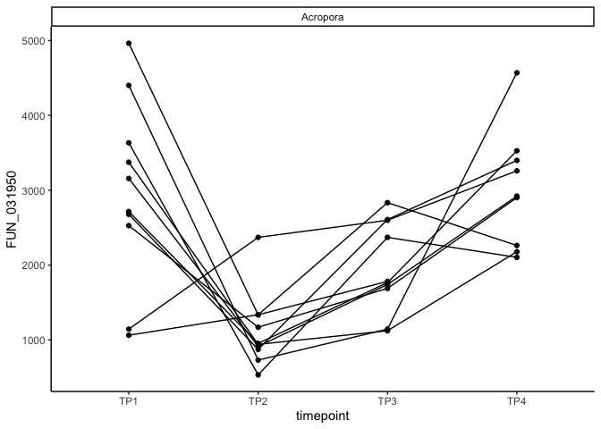

Apul molecular energetic state gene expression analysis
================
2025-02-19

Analysis of gene expression of A pulchra energetic state using the
following gene set GO categories:

- Glycolysis <GO:0006096>
- Gluconeogenesis <GO:0006094>
- Lipolysis/lipid catabolism <GO:0016042>
- Fatty acid beta oxidation <GO:0006635>
- Starvation <GO:0042594>
- Lipid biosynthesis <GO:000861>
- Protein catabolic process <GO:0030163>

# Set up

Load libraries

``` r
library(ggplot2)
library(vegan)
```

    ## Loading required package: permute

    ## Loading required package: lattice

    ## This is vegan 2.6-6.1

``` r
library(mixOmics)
```

    ## Loading required package: MASS

    ## 
    ## Loaded mixOmics 6.28.0
    ## Thank you for using mixOmics!
    ## Tutorials: http://mixomics.org
    ## Bookdown vignette: https://mixomicsteam.github.io/Bookdown
    ## Questions, issues: Follow the prompts at http://mixomics.org/contact-us
    ## Cite us:  citation('mixOmics')

``` r
library(readxl)
library(factoextra)
```

    ## Welcome! Want to learn more? See two factoextra-related books at https://goo.gl/ve3WBa

``` r
library(ggfortify)
library(ComplexHeatmap)
```

    ## Loading required package: grid

    ## ========================================
    ## ComplexHeatmap version 2.20.0
    ## Bioconductor page: http://bioconductor.org/packages/ComplexHeatmap/
    ## Github page: https://github.com/jokergoo/ComplexHeatmap
    ## Documentation: http://jokergoo.github.io/ComplexHeatmap-reference
    ## 
    ## If you use it in published research, please cite either one:
    ## - Gu, Z. Complex Heatmap Visualization. iMeta 2022.
    ## - Gu, Z. Complex heatmaps reveal patterns and correlations in multidimensional 
    ##     genomic data. Bioinformatics 2016.
    ## 
    ## 
    ## The new InteractiveComplexHeatmap package can directly export static 
    ## complex heatmaps into an interactive Shiny app with zero effort. Have a try!
    ## 
    ## This message can be suppressed by:
    ##   suppressPackageStartupMessages(library(ComplexHeatmap))
    ## ========================================

``` r
library(viridis)
```

    ## Loading required package: viridisLite

``` r
library(lme4)
```

    ## Loading required package: Matrix

``` r
library(lmerTest)
```

    ## 
    ## Attaching package: 'lmerTest'

    ## The following object is masked from 'package:lme4':
    ## 
    ##     lmer

    ## The following object is masked from 'package:stats':
    ## 
    ##     step

``` r
library(emmeans)
```

    ## Welcome to emmeans.
    ## Caution: You lose important information if you filter this package's results.
    ## See '? untidy'

``` r
library(broom.mixed)
library(broom)
library(tidyverse)
```

    ## ── Attaching core tidyverse packages ──────────────────────── tidyverse 2.0.0 ──
    ## ✔ dplyr     1.1.4     ✔ readr     2.1.5
    ## ✔ forcats   1.0.0     ✔ stringr   1.5.1
    ## ✔ lubridate 1.9.3     ✔ tibble    3.2.1
    ## ✔ purrr     1.0.2     ✔ tidyr     1.3.1

    ## ── Conflicts ────────────────────────────────────────── tidyverse_conflicts() ──
    ## ✖ tidyr::expand() masks Matrix::expand()
    ## ✖ dplyr::filter() masks stats::filter()
    ## ✖ dplyr::lag()    masks stats::lag()
    ## ✖ purrr::map()    masks mixOmics::map()
    ## ✖ tidyr::pack()   masks Matrix::pack()
    ## ✖ dplyr::select() masks MASS::select()
    ## ✖ tidyr::unpack() masks Matrix::unpack()
    ## ℹ Use the conflicted package (<http://conflicted.r-lib.org/>) to force all conflicts to become errors

``` r
library(RVAideMemoire)
```

    ## *** Package RVAideMemoire v 0.9-83-7 ***
    ## 
    ## Attaching package: 'RVAideMemoire'
    ## 
    ## The following object is masked from 'package:broom':
    ## 
    ##     bootstrap
    ## 
    ## The following object is masked from 'package:lme4':
    ## 
    ##     dummy

``` r
library(Hmisc)
```

    ## 
    ## Attaching package: 'Hmisc'
    ## 
    ## The following objects are masked from 'package:dplyr':
    ## 
    ##     src, summarize
    ## 
    ## The following objects are masked from 'package:base':
    ## 
    ##     format.pval, units

``` r
library(corrplot)
```

    ## corrplot 0.92 loaded

# Read in gene count matrix

Gene count matrix for all genes

``` r
# raw gene counts data (will filter and variance stabilize)
Apul_genes <- read_csv("D-Apul/output/02.20-D-Apul-RNAseq-alignment-HiSat2/apul-gene_count_matrix.csv")
```

    ## Rows: 44371 Columns: 41
    ## ── Column specification ────────────────────────────────────────────────────────
    ## Delimiter: ","
    ## chr  (1): gene_id
    ## dbl (40): 1A1, 1A10, 1A12, 1A2, 1A8, 1A9, 1B1, 1B10, 1B2, 1B5, 1B9, 1C10, 1C...
    ## 
    ## ℹ Use `spec()` to retrieve the full column specification for this data.
    ## ℹ Specify the column types or set `show_col_types = FALSE` to quiet this message.

``` r
Apul_genes <- as.data.frame(Apul_genes)

# format gene IDs as rownames (instead of a column)
rownames(Apul_genes) <- Apul_genes$gene_id
Apul_genes <- Apul_genes%>%dplyr::select(!gene_id)

# load and format metadata
metadata <- read_csv("M-multi-species/data/rna_metadata.csv")%>%dplyr::select(AzentaSampleName, ColonyID, Timepoint) %>%
  filter(grepl("ACR", ColonyID))
```

    ## New names:
    ## Rows: 117 Columns: 19
    ## ── Column specification
    ## ──────────────────────────────────────────────────────── Delimiter: "," chr
    ## (13): SampleName, WellNumber, AzentaSampleName, ColonyID, Timepoint, Sam... dbl
    ## (5): SampleNumber, Plate, TotalAmount-ng, Volume-uL, Conc-ng.uL lgl (1):
    ## MethodUsedForSpectrophotometry
    ## ℹ Use `spec()` to retrieve the full column specification for this data. ℹ
    ## Specify the column types or set `show_col_types = FALSE` to quiet this message.
    ## • `` -> `...19`

``` r
metadata$Sample <- paste(metadata$ColonyID, metadata$Timepoint, sep = "_")

colonies <- unique(metadata$ColonyID)

# Load physiological data
phys<-read_csv("https://github.com/urol-e5/timeseries/raw/refs/heads/master/time_series_analysis/Output/master_timeseries.csv")%>%filter(colony_id_corr %in% colonies)%>%
  dplyr::select(colony_id_corr, species, timepoint, site, Host_AFDW.mg.cm2, Sym_AFDW.mg.cm2, Am, AQY, Rd, Ik, Ic, calc.umol.cm2.hr, cells.mgAFDW, prot_mg.mgafdw, Ratio_AFDW.mg.cm2, Total_Chl, Total_Chl_cell, cre.umol.mgafdw)
```

    ## Rows: 448 Columns: 46
    ## ── Column specification ────────────────────────────────────────────────────────
    ## Delimiter: ","
    ## chr (10): colony_id, colony_id_corr, species, timepoint, month, site, nutrie...
    ## dbl (36): cre.umol.mgprot, Host_AFDW.mg.cm2, Sym_AFDW.mg.cm2, Host_DW.mg.cm2...
    ## 
    ## ℹ Use `spec()` to retrieve the full column specification for this data.
    ## ℹ Specify the column types or set `show_col_types = FALSE` to quiet this message.

``` r
# format timepoint
phys$timepoint <- gsub("timepoint", "TP", phys$timepoint)

#add column with full sample info
phys <- merge(phys, metadata, by.x = c("colony_id_corr", "timepoint"), by.y = c("ColonyID", "Timepoint")) %>%
  dplyr::select(-AzentaSampleName)
  
#add site information into metadata 
metadata$Site<-phys$site[match(metadata$ColonyID, phys$colony_id_corr)]

# Rename gene column names to include full sample info (as in miRNA table)
colnames(Apul_genes) <- metadata$Sample[match(colnames(Apul_genes), metadata$AzentaSampleName)]
```

# Gene set 1: Glycolysis <GO:0006096>

Load in gene set generated by Apul-energy-go script

``` r
glycolysis_go<-read_table(file="D-Apul/output/23-Apul-energy-GO/Apul_blastp-GO:0006096_out.tab")%>%pull(var=1)
```

    ## Warning: Duplicated column names deduplicated: '6' => '6_1' [9]

    ## 
    ## ── Column specification ────────────────────────────────────────────────────────
    ## cols(
    ##   `FUN_000589-T1` = col_character(),
    ##   `sp|Q9NQ88|TIGAR_HUMAN` = col_character(),
    ##   `36.260` = col_double(),
    ##   `262` = col_double(),
    ##   `147` = col_double(),
    ##   `6` = col_double(),
    ##   `43` = col_double(),
    ##   `288` = col_double(),
    ##   `6_1` = col_double(),
    ##   `263` = col_double(),
    ##   `4.01e-43` = col_double(),
    ##   `146` = col_double()
    ## )

``` r
glycolysis_go <- str_remove(glycolysis_go, "-T1$")
glycolysis_go <- str_remove(glycolysis_go, "-T2$")
```

Subset gene count matrix for this gene set.

``` r
glycolysis_genes<-Apul_genes%>%
  filter(rownames(.) %in% glycolysis_go)
```

Calculate the sum of the total gene set for each sample.

``` r
glycolysis_genes<-as.data.frame(t(glycolysis_genes))

glycolysis_genes$Sample<-rownames(glycolysis_genes)

glycolysis_genes<-glycolysis_genes %>%
  rowwise() %>%
  mutate(glycolysis_count = sum(c_across(where(is.numeric)))) %>%
  ungroup()%>%
  as.data.frame()
```

Merge into master data frame with metadata and physiology as a new
column called “glycolysis”.

``` r
data<-left_join(phys, glycolysis_genes)
```

    ## Joining with `by = join_by(Sample)`

Plot over timepoints.

``` r
plot<-data%>%
  ggplot(aes(x=timepoint, y=glycolysis_count, group=colony_id_corr))+
  facet_wrap(~species)+
  geom_point()+
  geom_line()+
  theme_classic();plot
```

<!-- -->

Plot as a PCA.

``` r
pca_data <- data %>% dplyr::select(c(starts_with("FUN"), colony_id_corr, timepoint))

# Identify numeric columns
numeric_cols <- sapply(pca_data, is.numeric)

# Among numeric columns, find those with non-zero sum
non_zero_cols <- colSums(pca_data[, numeric_cols]) != 0

# Combine non-numeric columns with numeric columns that have non-zero sum
pca_data_cleaned <- cbind(
  pca_data[, !numeric_cols],                  # All non-numeric columns
  pca_data[, numeric_cols][, non_zero_cols]   # Numeric columns with non-zero sum
)
```

``` r
scaled.pca<-prcomp(pca_data_cleaned%>%dplyr::select(where(is.numeric)), scale=TRUE, center=TRUE) 
```

Prepare a PCA plot

``` r
# scale data
vegan <- scale(pca_data_cleaned%>%dplyr::select(where(is.numeric)))

# PerMANOVA 
permanova<-adonis2(vegan ~ timepoint, data = pca_data_cleaned, method='eu')
permanova
```

    ## Permutation test for adonis under reduced model
    ## Terms added sequentially (first to last)
    ## Permutation: free
    ## Number of permutations: 999
    ## 
    ## adonis2(formula = vegan ~ timepoint, data = pca_data_cleaned, method = "eu")
    ##           Df SumOfSqs      R2      F Pr(>F)   
    ## timepoint  3      914 0.15721 2.1763  0.004 **
    ## Residual  35     4900 0.84279                 
    ## Total     38     5814 1.00000                 
    ## ---
    ## Signif. codes:  0 '***' 0.001 '**' 0.01 '*' 0.05 '.' 0.1 ' ' 1

Significant differences in glycolysis gene expression profile between
time points.

View by species

``` r
plot<-ggplot2::autoplot(scaled.pca, data=pca_data_cleaned, loadings=FALSE,  colour="timepoint", loadings.label.colour="black", loadings.colour="black", loadings.label=FALSE, frame=TRUE, loadings.label.size=5, loadings.label.vjust=-1, size=5) + 
  theme_classic()+
   theme(legend.text = element_text(size=18), 
         legend.position="right",
        plot.background = element_blank(),
        legend.title = element_text(size=18, face="bold"), 
        axis.text = element_text(size=18), 
        axis.title = element_text(size=18,  face="bold"));plot
```

<!-- -->

Which genes are driving this? Run PLSDA and VIP.

``` r
#assigning datasets 
X <- pca_data_cleaned
                
levels(as.factor(X$timepoint))
```

    ## [1] "TP1" "TP2" "TP3" "TP4"

``` r
Y <- as.factor(X$timepoint) #select treatment names
Y
```

    ##  [1] TP1 TP2 TP3 TP4 TP1 TP2 TP3 TP4 TP1 TP2 TP3 TP4 TP1 TP2 TP3 TP4 TP1 TP2 TP3
    ## [20] TP4 TP1 TP2 TP3 TP4 TP1 TP2 TP3 TP4 TP1 TP2 TP3 TP4 TP1 TP2 TP3 TP4 TP1 TP2
    ## [39] TP3
    ## Levels: TP1 TP2 TP3 TP4

``` r
X<-X%>%dplyr::select(where(is.numeric)) #pull only data columns

# run PLSDA 
MyResult.plsda <- plsda(X,Y) # 1 Run the method
            
plotIndiv(MyResult.plsda, ind.names = FALSE, legend=TRUE, legend.title = "Glycolysis", ellipse = FALSE, title="", style = "graphics", centroid=FALSE, point.lwd = 2, cex=2)
```

<!-- -->

Extract VIPs.

``` r
#extract
treatment_VIP <- PLSDA.VIP(MyResult.plsda)
treatment_VIP_df <- as.data.frame(treatment_VIP[["tab"]])
treatment_VIP_df
```

    ##                  VIP
    ## FUN_010519 2.1288653
    ## FUN_004577 1.9754806
    ## FUN_037979 1.9440275
    ## FUN_018531 1.9409098
    ## FUN_012871 1.9163118
    ## FUN_038373 1.6968997
    ## FUN_032220 1.5950702
    ## FUN_023442 1.5806763
    ## FUN_028145 1.5761666
    ## FUN_026023 1.5606720
    ## FUN_025367 1.5410538
    ## FUN_012969 1.5215856
    ## FUN_001193 1.4895900
    ## FUN_001396 1.4881482
    ## FUN_038166 1.4717319
    ## FUN_015292 1.4651100
    ## FUN_001356 1.4598205
    ## FUN_042050 1.4592599
    ## FUN_041521 1.4188102
    ## FUN_039790 1.4110821
    ## FUN_006649 1.4006538
    ## FUN_014904 1.3251108
    ## FUN_039893 1.3121526
    ## FUN_029410 1.3107630
    ## FUN_036246 1.3049162
    ## FUN_032389 1.3002010
    ## FUN_010945 1.2783056
    ## FUN_009488 1.2705454
    ## FUN_008485 1.2612065
    ## FUN_025750 1.2572145
    ## FUN_001204 1.2530099
    ## FUN_012684 1.2503302
    ## FUN_004777 1.2382277
    ## FUN_026016 1.2346559
    ## FUN_025325 1.2286447
    ## FUN_022677 1.2114909
    ## FUN_001665 1.2084743
    ## FUN_022596 1.2064956
    ## FUN_009301 1.1819083
    ## FUN_022598 1.1811234
    ## FUN_017952 1.1757480
    ## FUN_037768 1.1715280
    ## FUN_014497 1.1530174
    ## FUN_001040 1.1522475
    ## FUN_026011 1.1517161
    ## FUN_006864 1.1460675
    ## FUN_023367 1.1280969
    ## FUN_006260 1.1164242
    ## FUN_008390 1.1122289
    ## FUN_012284 1.1052573
    ## FUN_025232 1.1022338
    ## FUN_015434 1.0911157
    ## FUN_007060 1.0758043
    ## FUN_025257 1.0730376
    ## FUN_039293 1.0561923
    ## FUN_035615 1.0550289
    ## FUN_041658 1.0342009
    ## FUN_032243 1.0087694
    ## FUN_004114 0.9842377
    ## FUN_016506 0.9761898
    ## FUN_008052 0.9760703
    ## FUN_023023 0.9724545
    ## FUN_026015 0.9722445
    ## FUN_026008 0.9638713
    ## FUN_022957 0.9565013
    ## FUN_023003 0.9553941
    ## FUN_018032 0.9355156
    ## FUN_023521 0.9333803
    ## FUN_029093 0.9293140
    ## FUN_035758 0.9278127
    ## FUN_031686 0.9229733
    ## FUN_037862 0.9227477
    ## FUN_006927 0.9142849
    ## FUN_035334 0.8864964
    ## FUN_015352 0.8746305
    ## FUN_026024 0.8657006
    ## FUN_016624 0.8613922
    ## FUN_036155 0.8602654
    ## FUN_041494 0.8585809
    ## FUN_026013 0.8225270
    ## FUN_008891 0.8179643
    ## FUN_041704 0.8150857
    ## FUN_025984 0.8109893
    ## FUN_016573 0.8059268
    ## FUN_018146 0.7993596
    ## FUN_023408 0.7989779
    ## FUN_040243 0.7893793
    ## FUN_018152 0.7857153
    ## FUN_001326 0.7854408
    ## FUN_017964 0.7727781
    ## FUN_000595 0.7671790
    ## FUN_023462 0.7636918
    ## FUN_005036 0.7625914
    ## FUN_005030 0.7613389
    ## FUN_008233 0.7581316
    ## FUN_018150 0.7552860
    ## FUN_001327 0.7500429
    ## FUN_043173 0.7435288
    ## FUN_040725 0.7421683
    ## FUN_025315 0.7381481
    ## FUN_043236 0.7376851
    ## FUN_041519 0.7169502
    ## FUN_016444 0.7038184
    ## FUN_026210 0.6894447
    ## FUN_023513 0.6873819
    ## FUN_008661 0.6823127
    ## FUN_016576 0.6784520
    ## FUN_029709 0.6633587
    ## FUN_037955 0.6569389
    ## FUN_033720 0.6421136
    ## FUN_031896 0.6335685
    ## FUN_004752 0.6282256
    ## FUN_025663 0.6250329
    ## FUN_043349 0.6230188
    ## FUN_004279 0.6225788
    ## FUN_016741 0.6151887
    ## FUN_015351 0.5992228
    ## FUN_029324 0.5798686
    ## FUN_043411 0.5758391
    ## FUN_034122 0.5623450
    ## FUN_032379 0.5451365
    ## FUN_029325 0.5411937
    ## FUN_001683 0.5335098
    ## FUN_042828 0.5331379
    ## FUN_006328 0.5330667
    ## FUN_001201 0.5271327
    ## FUN_005159 0.4980410
    ## FUN_016623 0.4815631
    ## FUN_023461 0.4800093
    ## FUN_026010 0.4677959
    ## FUN_012230 0.4622414
    ## FUN_023465 0.4620422
    ## FUN_009532 0.4450765
    ## FUN_005132 0.4398121
    ## FUN_043408 0.4285969
    ## FUN_008246 0.4208288
    ## FUN_035761 0.4074231
    ## FUN_013147 0.4017838
    ## FUN_032429 0.3938155
    ## FUN_022857 0.3913155
    ## FUN_015356 0.3912805
    ## FUN_028292 0.3833509
    ## FUN_022775 0.3786351
    ## FUN_004517 0.3638627
    ## FUN_015353 0.3398587
    ## FUN_015354 0.3385141
    ## FUN_001205 0.3274299
    ## FUN_001202 0.3209141
    ## FUN_043410 0.2927694
    ## FUN_014746 0.2237363
    ## FUN_025561 0.2124103
    ## FUN_041844 0.1705924
    ## FUN_038426 0.1442279

``` r
# Converting row names to column
treatment_VIP_table <- rownames_to_column(treatment_VIP_df, var = "Gene")

#filter for VIP > 1
treatment_VIP_1 <- treatment_VIP_table %>% 
  filter(VIP >= 1.5)

#plot
VIP_list_plot<-treatment_VIP_1 %>%
            arrange(VIP) %>%
  
  ggplot( aes(x = VIP, y = reorder(Gene,VIP,sum))) +
  geom_point() +
  ylab("Gene") +
  xlab("VIP Score") +
  ggtitle("Glycolysis") +
  theme_bw() + theme(panel.border = element_rect(linetype = "solid", color = "black"), panel.grid.major = element_blank(), #Makes background theme white
                     panel.grid.minor = element_blank(), axis.line = element_line(colour = "black"));VIP_list_plot
```

<!-- -->

Gene FUN_010519 is the most important - plot this. This is also the gene
most important for lipolysis.

``` r
plot<-data%>%
  ggplot(aes(x=timepoint, y=FUN_010519, group=colony_id_corr))+
  facet_wrap(~species)+
  geom_point()+
  geom_line()+
  theme_classic();plot
```

<!-- -->

Plot second most important.

``` r
plot<-data%>%
  ggplot(aes(x=timepoint, y=FUN_004577, group=colony_id_corr))+
  facet_wrap(~species)+
  geom_point()+
  geom_line()+
  theme_classic();plot
```

<!-- -->

Plot third most important.

``` r
plot<-data%>%
  ggplot(aes(x=timepoint, y=FUN_037979, group=colony_id_corr))+
  facet_wrap(~species)+
  geom_point()+
  geom_line()+
  theme_classic();plot
```

<!-- -->

Look at a PCA of the differentiating genes.

``` r
#extract list of VIPs
vip_genes<-treatment_VIP_1%>%pull(Gene)

#turn to wide format with 
pca_data_vips<-pca_data_cleaned%>%dplyr::select(all_of(c("timepoint", "colony_id_corr", vip_genes)))
```

``` r
scaled.pca<-prcomp(pca_data_vips%>%dplyr::select(where(is.numeric)), scale=TRUE, center=TRUE) 
```

Prepare a PCA plot

``` r
# scale data
vegan <- scale(pca_data_vips%>%dplyr::select(where(is.numeric)))

# PerMANOVA 
permanova<-adonis2(vegan ~ timepoint, data = pca_data_vips, method='eu')
permanova
```

    ## Permutation test for adonis under reduced model
    ## Terms added sequentially (first to last)
    ## Permutation: free
    ## Number of permutations: 999
    ## 
    ## adonis2(formula = vegan ~ timepoint, data = pca_data_vips, method = "eu")
    ##           Df SumOfSqs      R2      F Pr(>F)    
    ## timepoint  3   206.58 0.45302 9.6627  0.001 ***
    ## Residual  35   249.42 0.54698                  
    ## Total     38   456.00 1.00000                  
    ## ---
    ## Signif. codes:  0 '***' 0.001 '**' 0.01 '*' 0.05 '.' 0.1 ' ' 1

Significant differences in glycolysis gene expression profile between
time points.

View by species

``` r
plot<-ggplot2::autoplot(scaled.pca, data=pca_data_vips, loadings=FALSE,  colour="timepoint", loadings.label.colour="black", loadings.colour="black", loadings.label=FALSE, frame=TRUE, loadings.label.size=5, loadings.label.vjust=-1, size=5) + 
  theme_classic()+
  ggtitle("Glycolysis")+
   theme(legend.text = element_text(size=18), 
         legend.position="right",
        plot.background = element_blank(),
        legend.title = element_text(size=18, face="bold"), 
        axis.text = element_text(size=18), 
        axis.title = element_text(size=18,  face="bold"));plot
```

<!-- -->

Pull out PC1 score for each sample for GO term.

``` r
scores <- scaled.pca$x
scores<-as.data.frame(scores)
scores<-scores%>%dplyr::select(PC1)

scores$sample<-pca_data_vips$colony_id_corr
scores$timepoint<-pca_data_vips$timepoint

scores<-scores%>%
  rename(glycolysis=PC1)

head(scores)
```

    ##   glycolysis  sample timepoint
    ## 1  -1.190941 ACR-139       TP1
    ## 2  -3.751002 ACR-139       TP2
    ## 3  -0.367541 ACR-139       TP3
    ## 4   1.435906 ACR-139       TP4
    ## 5   4.333006 ACR-145       TP1
    ## 6  -1.959780 ACR-145       TP2

# Gene set 2: Gluconeogenesis <GO:0006094>

Load in gene set generated by Apul-energy-go script

``` r
gluconeo_go<-read_table(file="D-Apul/output/23-Apul-energy-GO/Apul_blastp-GO:0006094_out.tab")%>%pull(var=1)
```

    ## 
    ## ── Column specification ────────────────────────────────────────────────────────
    ## cols(
    ##   `FUN_000184-T1` = col_character(),
    ##   `sp|Q15043|S39AE_HUMAN` = col_character(),
    ##   `32.591` = col_double(),
    ##   `494` = col_double(),
    ##   `268` = col_double(),
    ##   `13` = col_double(),
    ##   `254` = col_double(),
    ##   `717` = col_double(),
    ##   `32` = col_double(),
    ##   `490` = col_double(),
    ##   `4.78e-71` = col_double(),
    ##   `237` = col_double()
    ## )

``` r
gluconeo_go <- str_remove(gluconeo_go, "-T1$")
gluconeo_go <- str_remove(gluconeo_go, "-T2$")
gluconeo_go <- str_remove(gluconeo_go, "-T3$")
```

Subset gene count matrix for this gene set.

``` r
gluconeo_genes<-Apul_genes%>%
  filter(rownames(.) %in% gluconeo_go)
```

Calculate the sum of the total gene set for each sample.

``` r
gluconeo_genes<-as.data.frame(t(gluconeo_genes))

gluconeo_genes$Sample<-rownames(gluconeo_genes)

gluconeo_genes<-gluconeo_genes %>%
  rowwise() %>%
  mutate(gluconeo_count = sum(c_across(where(is.numeric)))) %>%
  ungroup()%>%
  as.data.frame()
```

Merge into master data frame with metadata and physiology as a new
column called “glycolysis”.

``` r
data2<-left_join(phys, gluconeo_genes)
```

    ## Joining with `by = join_by(Sample)`

Plot over timepoints.

``` r
plot<-data2%>%
  ggplot(aes(x=timepoint, y=gluconeo_count, group=colony_id_corr))+
  facet_wrap(~species)+
  geom_point()+
  geom_line()+
  theme_classic();plot
```

<!-- -->

Plot as a PCA.

``` r
pca_data <- data2 %>% dplyr::select(c(starts_with("FUN"), colony_id_corr, timepoint))

# Identify numeric columns
numeric_cols <- sapply(pca_data, is.numeric)

# Among numeric columns, find those with non-zero sum
non_zero_cols <- colSums(pca_data[, numeric_cols]) != 0

# Combine non-numeric columns with numeric columns that have non-zero sum
pca_data_cleaned <- cbind(
  pca_data[, !numeric_cols],                  # All non-numeric columns
  pca_data[, numeric_cols][, non_zero_cols]   # Numeric columns with non-zero sum
)
```

``` r
scaled.pca<-prcomp(pca_data_cleaned%>%dplyr::select(where(is.numeric)), scale=TRUE, center=TRUE) 
```

Prepare a PCA plot

``` r
# scale data
vegan <- scale(pca_data_cleaned%>%dplyr::select(where(is.numeric)))

# PerMANOVA 
permanova<-adonis2(vegan ~ timepoint, data = pca_data_cleaned, method='eu')
permanova
```

    ## Permutation test for adonis under reduced model
    ## Terms added sequentially (first to last)
    ## Permutation: free
    ## Number of permutations: 999
    ## 
    ## adonis2(formula = vegan ~ timepoint, data = pca_data_cleaned, method = "eu")
    ##           Df SumOfSqs      R2      F Pr(>F)    
    ## timepoint  3   1213.5 0.20212 2.9554  0.001 ***
    ## Residual  35   4790.5 0.79788                  
    ## Total     38   6004.0 1.00000                  
    ## ---
    ## Signif. codes:  0 '***' 0.001 '**' 0.01 '*' 0.05 '.' 0.1 ' ' 1

Significant differences in gluconeo gene expression profile between time
points.

View by species

``` r
plot<-ggplot2::autoplot(scaled.pca, data=pca_data_cleaned, loadings=FALSE,  colour="timepoint", loadings.label.colour="black", loadings.colour="black", loadings.label=FALSE, frame=TRUE, loadings.label.size=5, loadings.label.vjust=-1, size=5) + 
  theme_classic()+
   theme(legend.text = element_text(size=18), 
         legend.position="right",
        plot.background = element_blank(),
        legend.title = element_text(size=18, face="bold"), 
        axis.text = element_text(size=18), 
        axis.title = element_text(size=18,  face="bold"));plot
```

<!-- -->

Which genes are driving this? Run PLSDA and VIP.

``` r
#assigning datasets 
X <- pca_data_cleaned
                
levels(as.factor(X$timepoint))
```

    ## [1] "TP1" "TP2" "TP3" "TP4"

``` r
Y <- as.factor(X$timepoint) #select treatment names
Y
```

    ##  [1] TP1 TP2 TP3 TP4 TP1 TP2 TP3 TP4 TP1 TP2 TP3 TP4 TP1 TP2 TP3 TP4 TP1 TP2 TP3
    ## [20] TP4 TP1 TP2 TP3 TP4 TP1 TP2 TP3 TP4 TP1 TP2 TP3 TP4 TP1 TP2 TP3 TP4 TP1 TP2
    ## [39] TP3
    ## Levels: TP1 TP2 TP3 TP4

``` r
X<-X%>%dplyr::select(where(is.numeric)) #pull only data columns

# run PLSDA 
MyResult.plsda <- plsda(X,Y) # 1 Run the method
            
plotIndiv(MyResult.plsda, ind.names = FALSE, legend=TRUE, legend.title = "Gluconeogenesis", ellipse = FALSE, title="", style = "graphics", centroid=FALSE, point.lwd = 2, cex=2)
```

<!-- -->

Extract VIPs.

``` r
#extract
treatment_VIP <- PLSDA.VIP(MyResult.plsda)
treatment_VIP_df <- as.data.frame(treatment_VIP[["tab"]])
treatment_VIP_df
```

    ##                  VIP
    ## FUN_001654 1.8868411
    ## FUN_007020 1.8019643
    ## FUN_010519 1.7054464
    ## FUN_012871 1.5364835
    ## FUN_011845 1.5113808
    ## FUN_018090 1.5015122
    ## FUN_006166 1.4906735
    ## FUN_012969 1.4875040
    ## FUN_001898 1.4580573
    ## FUN_022104 1.4322722
    ## FUN_042843 1.4190286
    ## FUN_043379 1.4105130
    ## FUN_015008 1.3961879
    ## FUN_032004 1.3710842
    ## FUN_029276 1.3519184
    ## FUN_038373 1.3453741
    ## FUN_025367 1.3299488
    ## FUN_008266 1.3190867
    ## FUN_032389 1.2799538
    ## FUN_010945 1.2772272
    ## FUN_035467 1.2735459
    ## FUN_035191 1.2695141
    ## FUN_001771 1.2686687
    ## FUN_014921 1.2579121
    ## FUN_038476 1.2530444
    ## FUN_034828 1.2467635
    ## FUN_026025 1.2415372
    ## FUN_041837 1.2375618
    ## FUN_016433 1.2349420
    ## FUN_039946 1.2328590
    ## FUN_014916 1.2241477
    ## FUN_033989 1.2185459
    ## FUN_031637 1.2100539
    ## FUN_000908 1.2006997
    ## FUN_035773 1.1988465
    ## FUN_023442 1.1965394
    ## FUN_010642 1.1946226
    ## FUN_039776 1.1704454
    ## FUN_029122 1.1654705
    ## FUN_007024 1.1580872
    ## FUN_023365 1.1514663
    ## FUN_012279 1.1464247
    ## FUN_029410 1.1349484
    ## FUN_027067 1.1237264
    ## FUN_025305 1.1234767
    ## FUN_022677 1.1198540
    ## FUN_001396 1.1182081
    ## FUN_043347 1.1159688
    ## FUN_026299 1.1097992
    ## FUN_037687 1.1022299
    ## FUN_004157 1.0997233
    ## FUN_012545 1.0971490
    ## FUN_015434 1.0872145
    ## FUN_001219 1.0793784
    ## FUN_039790 1.0774001
    ## FUN_001655 1.0753233
    ## FUN_025654 1.0743658
    ## FUN_023497 1.0712624
    ## FUN_016052 1.0686487
    ## FUN_022599 1.0632173
    ## FUN_039293 1.0591232
    ## FUN_037768 1.0575144
    ## FUN_043003 1.0474362
    ## FUN_023006 1.0428416
    ## FUN_043250 1.0396385
    ## FUN_036996 1.0392972
    ## FUN_000437 1.0311445
    ## FUN_025232 1.0285641
    ## FUN_038916 1.0252655
    ## FUN_025368 1.0245576
    ## FUN_014964 1.0079987
    ## FUN_023003 1.0063710
    ## FUN_015005 1.0042243
    ## FUN_040244 0.9983805
    ## FUN_033958 0.9922898
    ## FUN_000440 0.9908340
    ## FUN_036246 0.9860259
    ## FUN_008036 0.9842119
    ## FUN_022812 0.9832399
    ## FUN_007846 0.9730182
    ## FUN_024011 0.9582687
    ## FUN_012266 0.9579493
    ## FUN_008237 0.9554695
    ## FUN_043010 0.9501818
    ## FUN_025750 0.9438805
    ## FUN_004622 0.9280796
    ## FUN_027805 0.9256450
    ## FUN_027835 0.9252651
    ## FUN_005878 0.9216516
    ## FUN_004114 0.9199097
    ## FUN_026015 0.9152004
    ## FUN_007022 0.9103194
    ## FUN_002667 0.9076518
    ## FUN_032427 0.9029771
    ## FUN_008520 0.8846165
    ## FUN_034090 0.8700758
    ## FUN_041710 0.8700433
    ## FUN_006328 0.8691462
    ## FUN_001217 0.8576999
    ## FUN_043005 0.8558385
    ## FUN_009828 0.8501895
    ## FUN_008390 0.8413969
    ## FUN_014169 0.8392470
    ## FUN_043626 0.8390069
    ## FUN_012677 0.8365829
    ## FUN_006107 0.8344757
    ## FUN_017004 0.8299554
    ## FUN_022237 0.8082375
    ## FUN_041658 0.8041591
    ## FUN_034890 0.8036703
    ## FUN_028002 0.8030186
    ## FUN_043621 0.7944881
    ## FUN_025257 0.7816218
    ## FUN_022529 0.7770480
    ## FUN_014858 0.7741684
    ## FUN_028510 0.7741681
    ## FUN_014919 0.7730201
    ## FUN_012333 0.7685928
    ## FUN_030682 0.7643141
    ## FUN_022600 0.7449855
    ## FUN_039885 0.7184951
    ## FUN_025564 0.7177550
    ## FUN_000595 0.7153109
    ## FUN_035891 0.7086151
    ## FUN_019341 0.7084297
    ## FUN_043519 0.6850681
    ## FUN_041938 0.6761026
    ## FUN_016381 0.6682169
    ## FUN_024763 0.6546763
    ## FUN_012229 0.6477517
    ## FUN_040103 0.6404148
    ## FUN_010947 0.6401708
    ## FUN_007960 0.6367937
    ## FUN_031725 0.6345620
    ## FUN_005913 0.6050601
    ## FUN_021107 0.5864809
    ## FUN_037323 0.5449513
    ## FUN_008881 0.5245874
    ## FUN_000270 0.5125753
    ## FUN_041758 0.5061889
    ## FUN_031896 0.4951702
    ## FUN_028151 0.4303198
    ## FUN_028246 0.4099866
    ## FUN_038004 0.3981940
    ## FUN_031685 0.3887729
    ## FUN_035468 0.3761364
    ## FUN_001808 0.3695814
    ## FUN_004647 0.3527228
    ## FUN_031966 0.3506633
    ## FUN_005132 0.3251152
    ## FUN_026286 0.2810643
    ## FUN_001118 0.2736183
    ## FUN_022775 0.2500787
    ## FUN_010828 0.2108932
    ## FUN_007124 0.1989417
    ## FUN_032429 0.1844865
    ## FUN_005249 0.1584136
    ## FUN_039965 0.1261533

``` r
# Converting row names to column
treatment_VIP_table <- rownames_to_column(treatment_VIP_df, var = "Gene")

#filter for VIP > 1
treatment_VIP_1 <- treatment_VIP_table %>% 
  filter(VIP >= 1)

#plot
VIP_list_plot<-treatment_VIP_1 %>%
            arrange(VIP) %>%
  
  ggplot( aes(x = VIP, y = reorder(Gene,VIP,sum))) +
  geom_point() +
  ylab("Gene") +
  xlab("VIP Score") +
  ggtitle("Gluconeogenesis") +
  theme_bw() + theme(panel.border = element_rect(linetype = "solid", color = "black"), panel.grid.major = element_blank(), #Makes background theme white
                     panel.grid.minor = element_blank(), axis.line = element_line(colour = "black"));VIP_list_plot
```

<!-- -->

Gene FUN_001654 is the most important - plot this. This is also the gene
most important for lipolysis.

``` r
plot<-data2%>%
  ggplot(aes(x=timepoint, y=FUN_001654, group=colony_id_corr))+
  facet_wrap(~species)+
  geom_point()+
  geom_line()+
  theme_classic();plot
```

<!-- -->

Plot second most important.

``` r
plot<-data2%>%
  ggplot(aes(x=timepoint, y=FUN_007020, group=colony_id_corr))+
  facet_wrap(~species)+
  geom_point()+
  geom_line()+
  theme_classic();plot
```

<!-- -->

Plot third most important.

``` r
plot<-data2%>%
  ggplot(aes(x=timepoint, y=FUN_010519, group=colony_id_corr))+
  facet_wrap(~species)+
  geom_point()+
  geom_line()+
  theme_classic();plot
```

<!-- -->

Look at a PCA of the differentiating genes.

``` r
#extract list of VIPs
vip_genes<-treatment_VIP_1%>%pull(Gene)

#turn to wide format with 
pca_data_vips<-pca_data_cleaned%>%dplyr::select(all_of(c("timepoint", "colony_id_corr", vip_genes)))
```

``` r
scaled.pca<-prcomp(pca_data_vips%>%dplyr::select(where(is.numeric)), scale=TRUE, center=TRUE) 
```

Prepare a PCA plot

``` r
# scale data
vegan <- scale(pca_data_vips%>%dplyr::select(where(is.numeric)))

# PerMANOVA 
permanova<-adonis2(vegan ~ timepoint, data = pca_data_vips, method='eu')
permanova
```

    ## Permutation test for adonis under reduced model
    ## Terms added sequentially (first to last)
    ## Permutation: free
    ## Number of permutations: 999
    ## 
    ## adonis2(formula = vegan ~ timepoint, data = pca_data_vips, method = "eu")
    ##           Df SumOfSqs      R2      F Pr(>F)    
    ## timepoint  3   845.59 0.30483 5.1157  0.001 ***
    ## Residual  35  1928.41 0.69517                  
    ## Total     38  2774.00 1.00000                  
    ## ---
    ## Signif. codes:  0 '***' 0.001 '**' 0.01 '*' 0.05 '.' 0.1 ' ' 1

Significant differences in gluconeogenesis gene expression profile
between time points.

View by species

``` r
plot<-ggplot2::autoplot(scaled.pca, data=pca_data_vips, loadings=FALSE,  colour="timepoint", loadings.label.colour="black", loadings.colour="black", loadings.label=FALSE, frame=TRUE, loadings.label.size=5, loadings.label.vjust=-1, size=5) + 
  theme_classic()+
  ggtitle("Gluconeogenesis")+
   theme(legend.text = element_text(size=18), 
         legend.position="right",
        plot.background = element_blank(),
        legend.title = element_text(size=18, face="bold"), 
        axis.text = element_text(size=18), 
        axis.title = element_text(size=18,  face="bold"));plot
```

<!-- -->

Pull out PC1 score for each sample for GO term.

``` r
scores1 <- scaled.pca$x
scores1<-as.data.frame(scores1)
scores1<-scores1%>%dplyr::select(PC1)

scores1$sample<-pca_data_vips$colony_id_corr
scores1$timepoint<-pca_data_vips$timepoint

scores1<-scores1%>%
  rename(gluconeogenesis=PC1)

scores<-left_join(scores, scores1)
```

    ## Joining with `by = join_by(sample, timepoint)`

``` r
head(scores)
```

    ##   glycolysis  sample timepoint gluconeogenesis
    ## 1  -1.190941 ACR-139       TP1      -1.7424776
    ## 2  -3.751002 ACR-139       TP2      -7.5823907
    ## 3  -0.367541 ACR-139       TP3      -3.6596187
    ## 4   1.435906 ACR-139       TP4       0.5056709
    ## 5   4.333006 ACR-145       TP1       4.3200803
    ## 6  -1.959780 ACR-145       TP2       0.8176864

# Gene set 3: Lipolysis/lipid catabolism <GO:0016042>

Load in gene set generated by Apul-energy-go script

``` r
lipolysis_go<-read_table(file="D-Apul/output/23-Apul-energy-GO/Apul_blastp-GO:0016042_out.tab")%>%pull(var=1)
```

    ## 
    ## ── Column specification ────────────────────────────────────────────────────────
    ## cols(
    ##   `FUN_000228-T1` = col_character(),
    ##   `sp|P36411|RAB7A_DICDI` = col_character(),
    ##   `38.506` = col_double(),
    ##   `174` = col_double(),
    ##   `92` = col_double(),
    ##   `3` = col_double(),
    ##   `10` = col_double(),
    ##   `179` = col_double(),
    ##   `8` = col_double(),
    ##   `170` = col_double(),
    ##   `2.63e-35` = col_double(),
    ##   `121` = col_double()
    ## )

``` r
lipolysis_go <- str_remove(lipolysis_go, "-T1$")
lipolysis_go <- str_remove(lipolysis_go, "-T2$")
lipolysis_go <- str_remove(lipolysis_go, "-T3$")
lipolysis_go <- str_remove(lipolysis_go, "-T4$")
```

Subset gene count matrix for this gene set.

``` r
lipolysis_genes<-Apul_genes%>%
  filter(rownames(.) %in% lipolysis_go)
```

Calculate the sum of the total gene set for each sample.

``` r
lipolysis_genes<-as.data.frame(t(lipolysis_genes))

lipolysis_genes$Sample<-rownames(lipolysis_genes)

lipolysis_genes<-lipolysis_genes %>%
  rowwise() %>%
  mutate(lipolysis_count = sum(c_across(where(is.numeric)))) %>%
  ungroup()%>%
  as.data.frame()
```

Merge into master data frame with metadata and physiology as a new
column called “glycolysis”.

``` r
data3<-left_join(phys, lipolysis_genes)
```

    ## Joining with `by = join_by(Sample)`

Plot over timepoints.

``` r
plot<-data3%>%
  ggplot(aes(x=timepoint, y=lipolysis_count, group=colony_id_corr))+
  facet_wrap(~species)+
  geom_point()+
  geom_line()+
  theme_classic();plot
```

<!-- -->

Plot as a PCA.

``` r
pca_data <- data3 %>% dplyr::select(c(starts_with("FUN"), colony_id_corr, timepoint))

# Identify numeric columns
numeric_cols <- sapply(pca_data, is.numeric)

# Among numeric columns, find those with non-zero sum
non_zero_cols <- colSums(pca_data[, numeric_cols]) != 0

# Combine non-numeric columns with numeric columns that have non-zero sum
pca_data_cleaned <- cbind(
  pca_data[, !numeric_cols],                  # All non-numeric columns
  pca_data[, numeric_cols][, non_zero_cols]   # Numeric columns with non-zero sum
)
```

``` r
scaled.pca<-prcomp(pca_data_cleaned%>%dplyr::select(where(is.numeric)), scale=TRUE, center=TRUE) 
```

Prepare a PCA plot

``` r
# scale data
vegan <- scale(pca_data_cleaned%>%dplyr::select(where(is.numeric)))

# PerMANOVA 
permanova<-adonis2(vegan ~ timepoint, data = pca_data_cleaned, method='eu')
permanova
```

    ## Permutation test for adonis under reduced model
    ## Terms added sequentially (first to last)
    ## Permutation: free
    ## Number of permutations: 999
    ## 
    ## adonis2(formula = vegan ~ timepoint, data = pca_data_cleaned, method = "eu")
    ##           Df SumOfSqs      R2      F Pr(>F)   
    ## timepoint  3   4717.2 0.15854 2.1981  0.005 **
    ## Residual  35  25036.8 0.84146                 
    ## Total     38  29754.0 1.00000                 
    ## ---
    ## Signif. codes:  0 '***' 0.001 '**' 0.01 '*' 0.05 '.' 0.1 ' ' 1

Significant differences in gluconeo gene expression profile between time
points.

View by timepoint

``` r
plot<-ggplot2::autoplot(scaled.pca, data=pca_data_cleaned, loadings=FALSE,  colour="timepoint", loadings.label.colour="black", loadings.colour="black", loadings.label=FALSE, frame=FALSE, loadings.label.size=5, loadings.label.vjust=-1, size=5) + 
  theme_classic()+
   theme(legend.text = element_text(size=18), 
         legend.position="right",
        plot.background = element_blank(),
        legend.title = element_text(size=18, face="bold"), 
        axis.text = element_text(size=18), 
        axis.title = element_text(size=18,  face="bold"));plot
```

<!-- -->

Which genes are driving this? Run PLSDA and VIP.

``` r
#assigning datasets 
X <- pca_data_cleaned
                
levels(as.factor(X$timepoint))
```

    ## [1] "TP1" "TP2" "TP3" "TP4"

``` r
Y <- as.factor(X$timepoint) #select treatment names
Y
```

    ##  [1] TP1 TP2 TP3 TP4 TP1 TP2 TP3 TP4 TP1 TP2 TP3 TP4 TP1 TP2 TP3 TP4 TP1 TP2 TP3
    ## [20] TP4 TP1 TP2 TP3 TP4 TP1 TP2 TP3 TP4 TP1 TP2 TP3 TP4 TP1 TP2 TP3 TP4 TP1 TP2
    ## [39] TP3
    ## Levels: TP1 TP2 TP3 TP4

``` r
X<-X%>%dplyr::select(where(is.numeric)) #pull only data columns

# run PLSDA 
MyResult.plsda <- plsda(X,Y) # 1 Run the method
            
plotIndiv(MyResult.plsda, ind.names = FALSE, legend=TRUE, legend.title = "Lipolysis", ellipse = FALSE, title="", style = "graphics", centroid=FALSE, point.lwd = 2, cex=2)
```

<!-- -->

Extract VIPs.

``` r
#extract
treatment_VIP <- PLSDA.VIP(MyResult.plsda)
treatment_VIP_df <- as.data.frame(treatment_VIP[["tab"]])
treatment_VIP_df
```

    ##                   VIP
    ## FUN_001654 2.04371343
    ## FUN_035010 1.91874001
    ## FUN_017777 1.89086516
    ## FUN_000579 1.86082866
    ## FUN_025792 1.82334001
    ## FUN_014637 1.80193055
    ## FUN_037441 1.78513795
    ## FUN_014530 1.77358793
    ## FUN_031950 1.75447339
    ## FUN_009656 1.73643481
    ## FUN_037573 1.72334419
    ## FUN_028200 1.72121655
    ## FUN_041721 1.70189895
    ## FUN_016069 1.69792099
    ## FUN_006002 1.67112680
    ## FUN_041963 1.66980231
    ## FUN_032542 1.65902365
    ## FUN_025802 1.65711102
    ## FUN_001898 1.64430532
    ## FUN_034015 1.63572527
    ## FUN_037566 1.63363079
    ## FUN_037230 1.61602942
    ## FUN_028956 1.60956485
    ## FUN_000960 1.60646531
    ## FUN_038172 1.60243195
    ## FUN_015978 1.59665486
    ## FUN_026025 1.59102797
    ## FUN_008660 1.57362280
    ## FUN_004852 1.57361709
    ## FUN_036193 1.56739917
    ## FUN_043381 1.56339769
    ## FUN_016131 1.55733878
    ## FUN_010668 1.55123119
    ## FUN_016073 1.54678914
    ## FUN_016422 1.54588316
    ## FUN_016506 1.54390448
    ## FUN_021112 1.53386984
    ## FUN_024761 1.51377395
    ## FUN_032288 1.51036429
    ## FUN_023379 1.50925849
    ## FUN_016614 1.50815640
    ## FUN_002579 1.50577438
    ## FUN_033845 1.48778207
    ## FUN_041860 1.48772081
    ## FUN_031522 1.47553871
    ## FUN_017842 1.47395322
    ## FUN_000856 1.45605637
    ## FUN_035467 1.45150719
    ## FUN_001193 1.45144025
    ## FUN_029276 1.45126068
    ## FUN_012349 1.45071673
    ## FUN_004576 1.44656127
    ## FUN_023698 1.44135253
    ## FUN_006439 1.43649090
    ## FUN_043244 1.43579420
    ## FUN_040784 1.43120113
    ## FUN_006248 1.43002075
    ## FUN_041901 1.42560075
    ## FUN_015994 1.42550600
    ## FUN_014560 1.42149120
    ## FUN_041962 1.41506723
    ## FUN_024564 1.41422015
    ## FUN_014750 1.41395571
    ## FUN_015038 1.41370772
    ## FUN_014904 1.41186889
    ## FUN_025580 1.40661465
    ## FUN_008485 1.39895482
    ## FUN_024679 1.39514738
    ## FUN_042013 1.39306327
    ## FUN_001179 1.39081623
    ## FUN_009017 1.38905274
    ## FUN_008702 1.38780127
    ## FUN_014473 1.38749089
    ## FUN_038476 1.38655960
    ## FUN_035066 1.38407189
    ## FUN_025425 1.38100932
    ## FUN_032380 1.38037782
    ## FUN_012547 1.37830249
    ## FUN_005739 1.37665354
    ## FUN_006428 1.37598098
    ## FUN_032108 1.37573528
    ## FUN_033844 1.37460954
    ## FUN_016052 1.37458710
    ## FUN_018008 1.36999046
    ## FUN_022662 1.36570646
    ## FUN_039946 1.36158425
    ## FUN_023365 1.35870859
    ## FUN_010639 1.35533614
    ## FUN_043347 1.35150407
    ## FUN_010664 1.35053030
    ## FUN_023401 1.34256790
    ## FUN_024414 1.34204591
    ## FUN_037052 1.34196365
    ## FUN_008561 1.33740236
    ## FUN_043497 1.33677153
    ## FUN_027281 1.33541173
    ## FUN_005992 1.33252995
    ## FUN_042624 1.32662365
    ## FUN_029550 1.32542576
    ## FUN_001905 1.32510509
    ## FUN_028981 1.32332146
    ## FUN_035191 1.32090488
    ## FUN_013364 1.32018551
    ## FUN_001356 1.31966487
    ## FUN_005220 1.31906428
    ## FUN_036022 1.31461219
    ## FUN_000437 1.31458298
    ## FUN_017872 1.31402730
    ## FUN_039776 1.31235384
    ## FUN_026150 1.31048722
    ## FUN_042911 1.30949482
    ## FUN_016433 1.29822190
    ## FUN_039893 1.29454773
    ## FUN_034116 1.29329564
    ## FUN_041212 1.28930234
    ## FUN_024387 1.28185013
    ## FUN_041861 1.28168047
    ## FUN_015238 1.28006361
    ## FUN_032382 1.27763887
    ## FUN_029078 1.27611920
    ## FUN_001063 1.27434043
    ## FUN_018123 1.27225405
    ## FUN_015070 1.27132106
    ## FUN_009773 1.26920612
    ## FUN_026897 1.26749721
    ## FUN_004740 1.26707878
    ## FUN_023049 1.26405360
    ## FUN_034963 1.26368488
    ## FUN_043493 1.26192439
    ## FUN_025305 1.26126110
    ## FUN_038507 1.26087103
    ## FUN_036108 1.25910776
    ## FUN_032384 1.25862848
    ## FUN_016468 1.25692257
    ## FUN_008223 1.25524956
    ## FUN_005106 1.25476707
    ## FUN_001655 1.25368876
    ## FUN_016508 1.24606992
    ## FUN_004298 1.24400656
    ## FUN_034780 1.24264520
    ## FUN_029122 1.24103572
    ## FUN_014809 1.23862375
    ## FUN_012008 1.23850490
    ## FUN_037923 1.23745293
    ## FUN_008270 1.23529378
    ## FUN_004498 1.23448405
    ## FUN_035897 1.23412616
    ## FUN_038163 1.23400318
    ## FUN_010807 1.23365632
    ## FUN_008056 1.23152510
    ## FUN_008588 1.23113973
    ## FUN_038464 1.23108206
    ## FUN_031232 1.22958058
    ## FUN_008188 1.22846353
    ## FUN_004299 1.22738412
    ## FUN_038510 1.22526027
    ## FUN_011908 1.22365031
    ## FUN_006864 1.22219865
    ## FUN_035244 1.21909339
    ## FUN_000247 1.21889068
    ## FUN_038688 1.21690475
    ## FUN_009054 1.21489844
    ## FUN_012231 1.21475007
    ## FUN_010945 1.21438660
    ## FUN_039818 1.21419544
    ## FUN_001904 1.21378700
    ## FUN_035932 1.21320443
    ## FUN_032010 1.21311976
    ## FUN_005357 1.21074528
    ## FUN_009450 1.21022526
    ## FUN_032019 1.20805999
    ## FUN_008403 1.20793292
    ## FUN_028803 1.20615269
    ## FUN_038919 1.20479287
    ## FUN_035264 1.20115106
    ## FUN_025673 1.19934384
    ## FUN_037862 1.19811304
    ## FUN_036897 1.19676316
    ## FUN_008237 1.19458980
    ## FUN_040493 1.19389022
    ## FUN_001535 1.19341972
    ## FUN_040783 1.19216385
    ## FUN_013596 1.19204105
    ## FUN_029318 1.19110122
    ## FUN_007047 1.19070595
    ## FUN_035058 1.19059025
    ## FUN_032050 1.18726155
    ## FUN_010555 1.18572388
    ## FUN_025726 1.18570397
    ## FUN_011991 1.18535016
    ## FUN_033512 1.18476789
    ## FUN_001211 1.18403406
    ## FUN_029187 1.18329720
    ## FUN_002378 1.18321115
    ## FUN_043014 1.18285328
    ## FUN_032252 1.17657270
    ## FUN_022354 1.17494941
    ## FUN_023006 1.17373496
    ## FUN_035043 1.17314271
    ## FUN_028982 1.17303398
    ## FUN_011931 1.17214775
    ## FUN_043380 1.17105406
    ## FUN_037837 1.17079153
    ## FUN_004816 1.16506157
    ## FUN_025315 1.16425966
    ## FUN_036921 1.16405251
    ## FUN_025368 1.16393879
    ## FUN_001341 1.16256037
    ## FUN_011282 1.16243524
    ## FUN_040076 1.16106795
    ## FUN_003904 1.16102113
    ## FUN_011912 1.16052277
    ## FUN_032370 1.16039538
    ## FUN_000370 1.15965825
    ## FUN_043091 1.15885045
    ## FUN_038175 1.15864401
    ## FUN_029644 1.15803436
    ## FUN_014265 1.15571137
    ## FUN_023593 1.15559725
    ## FUN_034970 1.15144243
    ## FUN_026241 1.15057664
    ## FUN_038535 1.14975149
    ## FUN_022928 1.14692194
    ## FUN_040059 1.14543639
    ## FUN_016163 1.14512454
    ## FUN_014964 1.14371095
    ## FUN_026294 1.14181177
    ## FUN_014707 1.13970293
    ## FUN_000440 1.13957422
    ## FUN_009022 1.13858386
    ## FUN_037870 1.13721512
    ## FUN_037196 1.13512955
    ## FUN_000350 1.13488217
    ## FUN_012469 1.13478459
    ## FUN_009772 1.13471198
    ## FUN_015099 1.13348572
    ## FUN_026051 1.13261430
    ## FUN_009673 1.13228470
    ## FUN_022654 1.12888831
    ## FUN_009016 1.12817222
    ## FUN_002433 1.12701255
    ## FUN_008402 1.12440818
    ## FUN_037826 1.12433586
    ## FUN_014771 1.12404418
    ## FUN_000418 1.12196068
    ## FUN_036859 1.12146844
    ## FUN_026215 1.12062195
    ## FUN_009464 1.11942937
    ## FUN_005307 1.11867274
    ## FUN_012117 1.11843137
    ## FUN_001342 1.11831151
    ## FUN_001208 1.11827055
    ## FUN_023056 1.11817434
    ## FUN_032202 1.11559053
    ## FUN_024187 1.11452710
    ## FUN_011959 1.11204656
    ## FUN_028174 1.10888534
    ## FUN_038133 1.10797494
    ## FUN_007846 1.10595291
    ## FUN_025835 1.10573114
    ## FUN_004270 1.10445721
    ## FUN_029451 1.10437171
    ## FUN_008661 1.10436550
    ## FUN_015239 1.10177915
    ## FUN_035233 1.10151783
    ## FUN_008649 1.10145213
    ## FUN_040071 1.10000558
    ## FUN_005223 1.09982871
    ## FUN_012266 1.09879334
    ## FUN_032372 1.09624984
    ## FUN_023054 1.09561312
    ## FUN_012184 1.09473562
    ## FUN_025670 1.09422230
    ## FUN_004350 1.09420924
    ## FUN_035270 1.09404409
    ## FUN_032603 1.09295939
    ## FUN_033958 1.09135184
    ## FUN_025640 1.09094264
    ## FUN_023494 1.08909915
    ## FUN_009777 1.08884193
    ## FUN_006602 1.08711134
    ## FUN_005111 1.08277923
    ## FUN_026161 1.08038440
    ## FUN_037685 1.07854292
    ## FUN_028507 1.07739894
    ## FUN_012076 1.07635065
    ## FUN_024133 1.07590063
    ## FUN_036230 1.07535923
    ## FUN_026160 1.07489105
    ## FUN_043128 1.07450553
    ## FUN_043108 1.07154883
    ## FUN_016444 1.06899865
    ## FUN_000968 1.06892452
    ## FUN_013640 1.06888834
    ## FUN_004006 1.06807269
    ## FUN_024385 1.06615749
    ## FUN_043109 1.06322572
    ## FUN_035933 1.06240329
    ## FUN_027218 1.05834492
    ## FUN_032427 1.05721147
    ## FUN_009488 1.05717502
    ## FUN_038143 1.05660612
    ## FUN_016507 1.05571541
    ## FUN_022396 1.05273609
    ## FUN_028558 1.05135164
    ## FUN_027805 1.05127968
    ## FUN_043674 1.04723494
    ## FUN_006339 1.04721545
    ## FUN_034120 1.04627280
    ## FUN_005740 1.04501725
    ## FUN_007180 1.04392699
    ## FUN_016809 1.04385227
    ## FUN_022664 1.04312020
    ## FUN_008261 1.04228878
    ## FUN_015984 1.04066173
    ## FUN_023243 1.03927529
    ## FUN_001215 1.03902392
    ## FUN_028557 1.03750553
    ## FUN_032222 1.03687954
    ## FUN_001204 1.03653470
    ## FUN_022833 1.03640034
    ## FUN_022529 1.03563523
    ## FUN_035478 1.03440205
    ## FUN_004213 1.03273557
    ## FUN_031908 1.02927807
    ## FUN_040091 1.02926648
    ## FUN_038285 1.02906463
    ## FUN_004630 1.02761246
    ## FUN_022622 1.02675871
    ## FUN_000971 1.02658753
    ## FUN_014169 1.02615997
    ## FUN_023246 1.02583605
    ## FUN_038576 1.02447669
    ## FUN_026989 1.02223311
    ## FUN_043224 1.02208876
    ## FUN_012640 1.02173491
    ## FUN_041945 1.02144967
    ## FUN_008225 1.02026072
    ## FUN_004405 1.02009539
    ## FUN_000373 1.01629616
    ## FUN_014992 1.01469060
    ## FUN_005741 1.01279868
    ## FUN_007864 1.01062783
    ## FUN_041710 1.00856423
    ## FUN_037861 1.00833949
    ## FUN_040061 1.00578914
    ## FUN_001049 1.00453741
    ## FUN_029080 1.00400133
    ## FUN_032424 1.00389135
    ## FUN_028008 1.00277505
    ## FUN_031526 1.00178172
    ## FUN_035013 1.00021211
    ## FUN_007948 1.00006040
    ## FUN_009771 0.99646339
    ## FUN_013363 0.99630020
    ## FUN_034090 0.99560854
    ## FUN_040089 0.99554985
    ## FUN_037485 0.99430778
    ## FUN_025335 0.99335017
    ## FUN_034785 0.98869011
    ## FUN_001040 0.98547317
    ## FUN_029268 0.98388531
    ## FUN_029019 0.98352386
    ## FUN_034890 0.98140685
    ## FUN_043005 0.97829835
    ## FUN_017786 0.97732189
    ## FUN_014993 0.97665566
    ## FUN_011281 0.97556598
    ## FUN_008081 0.97474390
    ## FUN_028510 0.97431355
    ## FUN_030643 0.97410857
    ## FUN_033668 0.97149047
    ## FUN_031945 0.97116648
    ## FUN_029021 0.97045636
    ## FUN_008015 0.97023603
    ## FUN_026400 0.96977973
    ## FUN_025628 0.96891188
    ## FUN_022406 0.96848242
    ## FUN_016432 0.96830254
    ## FUN_038618 0.96806172
    ## FUN_018501 0.96743944
    ## FUN_041704 0.96571230
    ## FUN_001418 0.96393748
    ## FUN_026229 0.96335800
    ## FUN_004752 0.96188810
    ## FUN_040243 0.96124834
    ## FUN_034115 0.95947783
    ## FUN_031635 0.95790774
    ## FUN_029294 0.95755433
    ## FUN_034872 0.95556026
    ## FUN_023922 0.95507231
    ## FUN_025575 0.95383889
    ## FUN_000236 0.95334396
    ## FUN_023245 0.95333214
    ## FUN_036150 0.95288984
    ## FUN_038270 0.95128158
    ## FUN_032622 0.94967305
    ## FUN_006223 0.94887856
    ## FUN_029024 0.94624320
    ## FUN_036231 0.94622893
    ## FUN_035420 0.94575153
    ## FUN_012677 0.94459055
    ## FUN_042014 0.94421554
    ## FUN_023045 0.94413883
    ## FUN_025502 0.94303606
    ## FUN_000583 0.93914079
    ## FUN_012091 0.93886610
    ## FUN_000395 0.93825796
    ## FUN_024594 0.93742508
    ## FUN_035046 0.93336484
    ## FUN_004560 0.93316880
    ## FUN_012470 0.93283902
    ## FUN_006107 0.93272820
    ## FUN_037310 0.93232255
    ## FUN_028559 0.93207067
    ## FUN_041622 0.92956365
    ## FUN_028762 0.92802095
    ## FUN_028556 0.92717890
    ## FUN_008976 0.92701264
    ## FUN_023059 0.92694469
    ## FUN_005047 0.92607055
    ## FUN_022806 0.92545923
    ## FUN_002767 0.92464111
    ## FUN_036831 0.92341949
    ## FUN_034965 0.92340800
    ## FUN_032423 0.92279968
    ## FUN_016611 0.92088394
    ## FUN_015997 0.91995142
    ## FUN_033885 0.91723055
    ## FUN_043621 0.91663956
    ## FUN_037415 0.91649461
    ## FUN_025564 0.91649415
    ## FUN_003903 0.91131520
    ## FUN_008183 0.91027376
    ## FUN_023057 0.90949104
    ## FUN_041890 0.90713963
    ## FUN_029345 0.90481281
    ## FUN_024682 0.90470682
    ## FUN_010947 0.90450554
    ## FUN_007970 0.89854896
    ## FUN_038277 0.89752230
    ## FUN_000372 0.89511654
    ## FUN_031917 0.89464936
    ## FUN_012240 0.89442299
    ## FUN_019021 0.89358008
    ## FUN_038505 0.89064174
    ## FUN_007749 0.88896214
    ## FUN_025629 0.88796891
    ## FUN_029020 0.88775591
    ## FUN_005742 0.88542655
    ## FUN_025514 0.88460050
    ## FUN_026255 0.88447667
    ## FUN_008226 0.88275636
    ## FUN_026074 0.88246670
    ## FUN_043608 0.87831904
    ## FUN_004284 0.87823140
    ## FUN_001160 0.87688449
    ## FUN_040103 0.87554913
    ## FUN_015352 0.87466544
    ## FUN_012054 0.87445658
    ## FUN_023055 0.87241186
    ## FUN_026166 0.87034793
    ## FUN_034834 0.86995382
    ## FUN_023113 0.86929316
    ## FUN_000286 0.86914179
    ## FUN_038132 0.86858785
    ## FUN_009020 0.86786102
    ## FUN_039885 0.86574382
    ## FUN_029413 0.86294159
    ## FUN_008439 0.86260548
    ## FUN_029093 0.86248475
    ## FUN_028811 0.86234031
    ## FUN_032678 0.85945379
    ## FUN_022037 0.85795238
    ## FUN_003625 0.85735215
    ## FUN_025574 0.85616207
    ## FUN_032218 0.85417815
    ## FUN_007043 0.85244085
    ## FUN_007030 0.85188736
    ## FUN_026159 0.84967236
    ## FUN_036038 0.84938525
    ## FUN_004036 0.84925992
    ## FUN_036073 0.84746256
    ## FUN_001529 0.84737355
    ## FUN_038174 0.84608408
    ## FUN_026080 0.84534028
    ## FUN_043110 0.84404695
    ## FUN_018017 0.84196292
    ## FUN_032374 0.84034536
    ## FUN_023242 0.83908229
    ## FUN_014565 0.83885217
    ## FUN_007046 0.83668507
    ## FUN_043626 0.83667155
    ## FUN_032627 0.83524138
    ## FUN_028150 0.83351947
    ## FUN_007960 0.83287445
    ## FUN_001327 0.83211266
    ## FUN_000519 0.83205997
    ## FUN_035044 0.82678561
    ## FUN_004301 0.81977557
    ## FUN_014506 0.81775940
    ## FUN_035891 0.81760099
    ## FUN_007818 0.81582847
    ## FUN_026296 0.81358448
    ## FUN_007049 0.81353608
    ## FUN_007035 0.81324043
    ## FUN_031918 0.81257753
    ## FUN_043519 0.81214553
    ## FUN_016070 0.81073954
    ## FUN_035368 0.80878297
    ## FUN_035477 0.80394415
    ## FUN_042636 0.80199061
    ## FUN_006927 0.80165504
    ## FUN_009778 0.80066927
    ## FUN_014564 0.80010643
    ## FUN_026245 0.79951083
    ## FUN_031929 0.79779374
    ## FUN_022446 0.79712333
    ## FUN_010919 0.79697970
    ## FUN_027950 0.79546497
    ## FUN_036919 0.79466397
    ## FUN_005913 0.79302130
    ## FUN_014858 0.79244448
    ## FUN_032903 0.78773874
    ## FUN_040477 0.78645521
    ## FUN_024722 0.78530616
    ## FUN_005997 0.78443858
    ## FUN_040090 0.78397814
    ## FUN_004436 0.78285407
    ## FUN_025808 0.77888422
    ## FUN_036898 0.77789025
    ## FUN_012229 0.77648819
    ## FUN_008794 0.77584889
    ## FUN_008871 0.77403555
    ## FUN_009452 0.76976830
    ## FUN_013313 0.76941978
    ## FUN_016381 0.76930105
    ## FUN_021107 0.76928495
    ## FUN_001326 0.76843343
    ## FUN_031916 0.76807545
    ## FUN_041159 0.76749892
    ## FUN_037442 0.76658323
    ## FUN_004517 0.76568324
    ## FUN_012471 0.76550089
    ## FUN_013263 0.76534212
    ## FUN_002382 0.76319220
    ## FUN_035273 0.76285764
    ## FUN_032383 0.76257723
    ## FUN_006654 0.76180335
    ## FUN_016741 0.76165679
    ## FUN_008617 0.76094718
    ## FUN_039886 0.76066729
    ## FUN_012686 0.75860020
    ## FUN_017955 0.75815625
    ## FUN_032271 0.75457145
    ## FUN_004709 0.75452687
    ## FUN_001402 0.75331759
    ## FUN_002697 0.75173443
    ## FUN_035941 0.74936214
    ## FUN_023061 0.74497989
    ## FUN_017004 0.74133315
    ## FUN_038798 0.74046602
    ## FUN_002578 0.74017951
    ## FUN_004573 0.73947529
    ## FUN_009456 0.73732809
    ## FUN_035351 0.73547673
    ## FUN_032379 0.73240658
    ## FUN_031233 0.72714125
    ## FUN_026259 0.72583306
    ## FUN_024067 0.72542086
    ## FUN_016610 0.72525840
    ## FUN_038081 0.72119957
    ## FUN_014708 0.71836507
    ## FUN_038220 0.71573679
    ## FUN_012788 0.71555427
    ## FUN_043012 0.71160605
    ## FUN_013290 0.71084975
    ## FUN_022926 0.70864810
    ## FUN_022703 0.70692355
    ## FUN_012115 0.70583986
    ## FUN_025463 0.70521247
    ## FUN_012088 0.70361387
    ## FUN_023153 0.70293122
    ## FUN_026288 0.70263272
    ## FUN_026403 0.69945750
    ## FUN_008937 0.69849875
    ## FUN_008881 0.69776783
    ## FUN_041927 0.68512151
    ## FUN_039266 0.68243467
    ## FUN_038016 0.68060585
    ## FUN_026393 0.67426035
    ## FUN_038622 0.67209166
    ## FUN_000520 0.67079168
    ## FUN_014563 0.67020823
    ## FUN_026402 0.66476840
    ## FUN_013644 0.66475321
    ## FUN_005045 0.66315764
    ## FUN_043368 0.66314060
    ## FUN_003619 0.66250987
    ## FUN_007852 0.66242440
    ## FUN_041607 0.66194933
    ## FUN_032371 0.65800196
    ## FUN_026972 0.65615909
    ## FUN_012330 0.65140540
    ## FUN_035738 0.64981729
    ## FUN_004251 0.64817114
    ## FUN_041758 0.64771586
    ## FUN_008090 0.64106968
    ## FUN_016428 0.64066337
    ## FUN_007816 0.63981927
    ## FUN_009228 0.63862858
    ## FUN_023676 0.63693808
    ## FUN_029123 0.63664235
    ## FUN_008006 0.63563568
    ## FUN_026251 0.63490345
    ## FUN_038795 0.63418580
    ## FUN_026037 0.63201954
    ## FUN_012625 0.62321277
    ## FUN_003627 0.62132316
    ## FUN_022445 0.62072000
    ## FUN_000270 0.61840217
    ## FUN_001059 0.61713312
    ## FUN_026049 0.61699259
    ## FUN_016965 0.60950163
    ## FUN_017776 0.60825095
    ## FUN_036036 0.60725991
    ## FUN_024068 0.60554208
    ## FUN_037170 0.60493221
    ## FUN_036039 0.60005646
    ## FUN_007037 0.59941262
    ## FUN_008953 0.59542306
    ## FUN_003720 0.59407315
    ## FUN_024459 0.59272163
    ## FUN_004300 0.59047547
    ## FUN_012329 0.58513598
    ## FUN_004279 0.58468803
    ## FUN_014672 0.58286284
    ## FUN_013362 0.58268066
    ## FUN_026404 0.58005595
    ## FUN_011847 0.58000221
    ## FUN_025512 0.57949278
    ## FUN_032683 0.57857736
    ## FUN_032621 0.57598738
    ## FUN_013287 0.57245358
    ## FUN_035942 0.57235562
    ## FUN_032088 0.57140266
    ## FUN_003721 0.57062086
    ## FUN_031919 0.56501839
    ## FUN_018092 0.56414860
    ## FUN_005998 0.56260517
    ## FUN_015351 0.55912296
    ## FUN_010600 0.55879257
    ## FUN_029023 0.55840638
    ## FUN_014528 0.55764226
    ## FUN_029106 0.55712767
    ## FUN_024139 0.55479141
    ## FUN_008411 0.55453548
    ## FUN_025791 0.54720334
    ## FUN_029445 0.54671525
    ## FUN_003454 0.54515915
    ## FUN_031757 0.54413598
    ## FUN_023385 0.54155710
    ## FUN_032620 0.53851943
    ## FUN_014534 0.53252257
    ## FUN_007040 0.53124559
    ## FUN_007041 0.53124559
    ## FUN_007038 0.53124559
    ## FUN_008414 0.52767013
    ## FUN_032970 0.52507084
    ## FUN_003719 0.52286291
    ## FUN_037829 0.52266003
    ## FUN_010837 0.52210125
    ## FUN_043562 0.52011786
    ## FUN_025577 0.51919961
    ## FUN_026927 0.51819605
    ## FUN_014908 0.51753704
    ## FUN_008271 0.51706141
    ## FUN_026225 0.51580596
    ## FUN_035468 0.51387030
    ## FUN_023461 0.51199092
    ## FUN_009776 0.50616233
    ## FUN_012185 0.50555198
    ## FUN_012328 0.49737361
    ## FUN_008227 0.49715806
    ## FUN_003806 0.49059064
    ## FUN_023241 0.48859453
    ## FUN_001794 0.48172953
    ## FUN_033715 0.48018299
    ## FUN_028292 0.48013070
    ## FUN_026281 0.47661665
    ## FUN_026231 0.47215758
    ## FUN_013590 0.46924324
    ## FUN_003797 0.46648571
    ## FUN_041900 0.46355470
    ## FUN_036113 0.46255595
    ## FUN_016075 0.45991478
    ## FUN_006729 0.45947000
    ## FUN_009449 0.45945281
    ## FUN_012116 0.45497593
    ## FUN_012473 0.45192116
    ## FUN_008949 0.44974421
    ## FUN_013262 0.44799088
    ## FUN_001201 0.44663577
    ## FUN_024891 0.44574533
    ## FUN_032623 0.44373828
    ## FUN_017854 0.44239672
    ## FUN_038459 0.44193878
    ## FUN_004647 0.43957631
    ## FUN_016615 0.43793234
    ## FUN_008569 0.43537601
    ## FUN_011714 0.43457188
    ## FUN_016967 0.43391438
    ## FUN_017712 0.43225417
    ## FUN_012770 0.41382266
    ## FUN_004817 0.41180521
    ## FUN_024881 0.40997410
    ## FUN_016620 0.40869627
    ## FUN_036847 0.40679097
    ## FUN_014958 0.40259309
    ## FUN_008409 0.40159511
    ## FUN_000956 0.40037165
    ## FUN_027280 0.39647879
    ## FUN_022857 0.39373263
    ## FUN_023925 0.37949082
    ## FUN_024173 0.37159119
    ## FUN_024066 0.36965458
    ## FUN_000371 0.36590883
    ## FUN_012094 0.36564361
    ## FUN_016623 0.36146628
    ## FUN_023465 0.35699457
    ## FUN_022248 0.35223456
    ## FUN_023024 0.35016846
    ## FUN_026286 0.35002677
    ## FUN_015356 0.34573068
    ## FUN_026290 0.34206657
    ## FUN_032626 0.33054420
    ## FUN_012468 0.32558702
    ## FUN_003686 0.32483019
    ## FUN_012068 0.32449792
    ## FUN_036858 0.32086399
    ## FUN_043408 0.31716780
    ## FUN_015354 0.31558725
    ## FUN_032273 0.31517301
    ## FUN_001205 0.31472423
    ## FUN_043411 0.31062978
    ## FUN_002405 0.30897438
    ## FUN_005216 0.30466181
    ## FUN_038232 0.30356792
    ## FUN_001202 0.29448687
    ## FUN_003799 0.29381949
    ## FUN_041373 0.28781314
    ## FUN_038050 0.27644399
    ## FUN_028151 0.27587743
    ## FUN_009443 0.27197982
    ## FUN_004100 0.27062194
    ## FUN_031477 0.26946063
    ## FUN_012095 0.26183183
    ## FUN_043410 0.25977916
    ## FUN_016966 0.25331880
    ## FUN_003902 0.24106421
    ## FUN_007813 0.23660193
    ## FUN_032272 0.23512865
    ## FUN_039965 0.22466474
    ## FUN_012084 0.21995860
    ## FUN_012077 0.21626816
    ## FUN_000582 0.21322574
    ## FUN_026277 0.21084913
    ## FUN_031851 0.20890825
    ## FUN_017015 0.20010560
    ## FUN_010828 0.19559449
    ## FUN_005249 0.18747897
    ## FUN_023361 0.17996025
    ## FUN_034345 0.16458680
    ## FUN_027948 0.16417703
    ## FUN_010623 0.15403782
    ## FUN_005251 0.14784279
    ## FUN_003689 0.13881715
    ## FUN_012096 0.12474177
    ## FUN_029293 0.10010444
    ## FUN_034855 0.07708862
    ## FUN_042618 0.07056620
    ## FUN_022444 0.06161346
    ## FUN_015353 0.02912804

``` r
# Converting row names to column
treatment_VIP_table <- rownames_to_column(treatment_VIP_df, var = "Gene")

#filter for VIP > 1
treatment_VIP_1 <- treatment_VIP_table %>% 
  filter(VIP >= 1.5)

#plot
VIP_list_plot<-treatment_VIP_1 %>%
            arrange(VIP) %>%
  
  ggplot( aes(x = VIP, y = reorder(Gene,VIP,sum))) +
  geom_point() +
  ylab("Gene") +
  xlab("VIP Score") +
  ggtitle("Lipolysis") +
  theme_bw() + theme(panel.border = element_rect(linetype = "solid", color = "black"), panel.grid.major = element_blank(), #Makes background theme white
                     panel.grid.minor = element_blank(), axis.line = element_line(colour = "black"));VIP_list_plot
```

<!-- -->

Gene FUN_001654 is the most important - plot this.

``` r
plot<-data3%>%
  ggplot(aes(x=timepoint, y=FUN_001654, group=colony_id_corr))+
  facet_wrap(~species)+
  geom_point()+
  geom_line()+
  theme_classic();plot
```

<!-- -->

Plot second most important

``` r
plot<-data3%>%
  ggplot(aes(x=timepoint, y=FUN_035010, group=colony_id_corr))+
  facet_wrap(~species)+
  geom_point()+
  geom_line()+
  theme_classic();plot
```

<!-- -->

Plot third most important

``` r
plot<-data3%>%
  ggplot(aes(x=timepoint, y=FUN_017777, group=colony_id_corr))+
  facet_wrap(~species)+
  geom_point()+
  geom_line()+
  theme_classic();plot
```

<!-- -->

Look at a PCA of the differentiating genes.

``` r
#extract list of VIPs
vip_genes<-treatment_VIP_1%>%pull(Gene)

#turn to wide format with 
pca_data_vips<-pca_data_cleaned%>%dplyr::select(all_of(c("timepoint", "colony_id_corr", vip_genes)))
```

``` r
scaled.pca<-prcomp(pca_data_vips%>%dplyr::select(where(is.numeric)), scale=TRUE, center=TRUE) 
```

Prepare a PCA plot

``` r
# scale data
vegan <- scale(pca_data_vips%>%dplyr::select(where(is.numeric)))

# PerMANOVA 
permanova<-adonis2(vegan ~ timepoint, data = pca_data_vips, method='eu')
permanova
```

    ## Permutation test for adonis under reduced model
    ## Terms added sequentially (first to last)
    ## Permutation: free
    ## Number of permutations: 999
    ## 
    ## adonis2(formula = vegan ~ timepoint, data = pca_data_vips, method = "eu")
    ##           Df SumOfSqs      R2      F Pr(>F)    
    ## timepoint  3   640.67 0.40142 7.8239  0.001 ***
    ## Residual  35   955.33 0.59858                  
    ## Total     38  1596.00 1.00000                  
    ## ---
    ## Signif. codes:  0 '***' 0.001 '**' 0.01 '*' 0.05 '.' 0.1 ' ' 1

Significant differences in lipolysis gene expression profile between
time points.

View by species

``` r
plot<-ggplot2::autoplot(scaled.pca, data=pca_data_vips, loadings=FALSE,  colour="timepoint", loadings.label.colour="black", loadings.colour="black", loadings.label=FALSE, frame=TRUE, loadings.label.size=5, loadings.label.vjust=-1, size=5) + 
  theme_classic()+
  ggtitle("Lipolysis")+
   theme(legend.text = element_text(size=18), 
         legend.position="right",
        plot.background = element_blank(),
        legend.title = element_text(size=18, face="bold"), 
        axis.text = element_text(size=18), 
        axis.title = element_text(size=18,  face="bold"));plot
```

<!-- -->

Pull out PC1 score for each sample for GO term.

``` r
scores1 <- scaled.pca$x
scores1<-as.data.frame(scores1)
scores1<-scores1%>%dplyr::select(PC1)

scores1$sample<-pca_data_vips$colony_id_corr
scores1$timepoint<-pca_data_vips$timepoint

scores1<-scores1%>%
  rename(lipolysis=PC1)

scores<-left_join(scores, scores1)
```

    ## Joining with `by = join_by(sample, timepoint)`

``` r
head(scores)
```

    ##   glycolysis  sample timepoint gluconeogenesis  lipolysis
    ## 1  -1.190941 ACR-139       TP1      -1.7424776  0.2958143
    ## 2  -3.751002 ACR-139       TP2      -7.5823907  3.4220239
    ## 3  -0.367541 ACR-139       TP3      -3.6596187 -0.1048175
    ## 4   1.435906 ACR-139       TP4       0.5056709 -4.8568009
    ## 5   4.333006 ACR-145       TP1       4.3200803 -4.9876692
    ## 6  -1.959780 ACR-145       TP2       0.8176864  2.9345918

# Gene set 4: Fatty acid beta oxidation <GO:0006635>

Load in gene set generated by Apul-energy-go script

``` r
ffa_go<-read_table(file="D-Apul/output/23-Apul-energy-GO/Apul_blastp-GO:0006635_out.tab")%>%pull(var=1)
```

    ## 
    ## ── Column specification ────────────────────────────────────────────────────────
    ## cols(
    ##   `FUN_000270-T1` = col_character(),
    ##   `sp|Q06497|ANT1_YEAST` = col_character(),
    ##   `24.667` = col_double(),
    ##   `300` = col_double(),
    ##   `191` = col_double(),
    ##   `9` = col_double(),
    ##   `86` = col_double(),
    ##   `358` = col_double(),
    ##   `4` = col_double(),
    ##   `295` = col_double(),
    ##   `2.11e-21` = col_double(),
    ##   `89.4` = col_double()
    ## )

``` r
ffa_go <- str_remove(ffa_go, "-T1$")
ffa_go <- str_remove(ffa_go, "-T2$")
ffa_go <- str_remove(ffa_go, "-T3$")
ffa_go <- str_remove(ffa_go, "-T4$")
```

Subset gene count matrix for this gene set.

``` r
ffa_genes<-Apul_genes%>%
  filter(rownames(.) %in% ffa_go)
```

Calculate the sum of the total gene set for each sample.

``` r
ffa_genes<-as.data.frame(t(ffa_genes))

ffa_genes$Sample<-rownames(ffa_genes)

ffa_genes<-ffa_genes %>%
  rowwise() %>%
  mutate(ffa_count = sum(c_across(where(is.numeric)))) %>%
  ungroup()%>%
  as.data.frame()
```

Merge into master data frame with metadata and physiology as a new
column called “glycolysis”.

``` r
data4<-left_join(phys, ffa_genes)
```

    ## Joining with `by = join_by(Sample)`

Plot over timepoints.

``` r
plot<-data4%>%
  ggplot(aes(x=timepoint, y=ffa_count, group=colony_id_corr))+
  facet_wrap(~species)+
  geom_point()+
  geom_line()+
  theme_classic();plot
```

<!-- -->

Plot as a PCA.

``` r
pca_data <- data4 %>% dplyr::select(c(starts_with("FUN"), colony_id_corr, timepoint))

# Identify numeric columns
numeric_cols <- sapply(pca_data, is.numeric)

# Among numeric columns, find those with non-zero sum
non_zero_cols <- colSums(pca_data[, numeric_cols]) != 0

# Combine non-numeric columns with numeric columns that have non-zero sum
pca_data_cleaned <- cbind(
  pca_data[, !numeric_cols],                  # All non-numeric columns
  pca_data[, numeric_cols][, non_zero_cols]   # Numeric columns with non-zero sum
)
```

``` r
scaled.pca<-prcomp(pca_data_cleaned%>%dplyr::select(where(is.numeric)), scale=TRUE, center=TRUE) 
```

Prepare a PCA plot

``` r
# scale data
vegan <- scale(pca_data_cleaned%>%dplyr::select(where(is.numeric)))

# PerMANOVA 
permanova<-adonis2(vegan ~ timepoint, data = pca_data_cleaned, method='eu')
permanova
```

    ## Permutation test for adonis under reduced model
    ## Terms added sequentially (first to last)
    ## Permutation: free
    ## Number of permutations: 999
    ## 
    ## adonis2(formula = vegan ~ timepoint, data = pca_data_cleaned, method = "eu")
    ##           Df SumOfSqs     R2      F Pr(>F)   
    ## timepoint  3   1115.7 0.1717 2.4185  0.005 **
    ## Residual  35   5382.3 0.8283                 
    ## Total     38   6498.0 1.0000                 
    ## ---
    ## Signif. codes:  0 '***' 0.001 '**' 0.01 '*' 0.05 '.' 0.1 ' ' 1

Significant differences in ffa beta oxidation gene expression profile
between time points.

View by timepoint

``` r
plot<-ggplot2::autoplot(scaled.pca, data=pca_data_cleaned, loadings=FALSE,  colour="timepoint", loadings.label.colour="black", loadings.colour="black", loadings.label=FALSE, frame=FALSE, loadings.label.size=5, loadings.label.vjust=-1, size=5) + 
  theme_classic()+
  ggtitle("Fatty Acid Beta Oxidation")+
   theme(legend.text = element_text(size=18), 
         legend.position="right",
        plot.background = element_blank(),
        legend.title = element_text(size=18, face="bold"), 
        axis.text = element_text(size=18), 
        axis.title = element_text(size=18,  face="bold"));plot
```

<!-- -->

Which genes are driving this? Run PLSDA and VIP.

``` r
#assigning datasets 
X <- pca_data_cleaned
                
levels(as.factor(X$timepoint))
```

    ## [1] "TP1" "TP2" "TP3" "TP4"

``` r
Y <- as.factor(X$timepoint) #select treatment names
Y
```

    ##  [1] TP1 TP2 TP3 TP4 TP1 TP2 TP3 TP4 TP1 TP2 TP3 TP4 TP1 TP2 TP3 TP4 TP1 TP2 TP3
    ## [20] TP4 TP1 TP2 TP3 TP4 TP1 TP2 TP3 TP4 TP1 TP2 TP3 TP4 TP1 TP2 TP3 TP4 TP1 TP2
    ## [39] TP3
    ## Levels: TP1 TP2 TP3 TP4

``` r
X<-X%>%dplyr::select(where(is.numeric)) #pull only data columns

# run PLSDA 
MyResult.plsda <- plsda(X,Y) # 1 Run the method
            
plotIndiv(MyResult.plsda, ind.names = FALSE, legend=TRUE, legend.title = "FFA Beta Oxidation", ellipse = FALSE, title="", style = "graphics", centroid=FALSE, point.lwd = 2, cex=2)
```

<!-- -->

Extract VIPs.

``` r
#extract
treatment_VIP <- PLSDA.VIP(MyResult.plsda)
treatment_VIP_df <- as.data.frame(treatment_VIP[["tab"]])
treatment_VIP_df
```

    ##                  VIP
    ## FUN_035010 1.8151412
    ## FUN_014637 1.7366020
    ## FUN_031950 1.6979498
    ## FUN_028200 1.6596555
    ## FUN_037441 1.5895312
    ## FUN_037573 1.5699398
    ## FUN_006166 1.5617067
    ## FUN_004852 1.5609563
    ## FUN_015978 1.5607498
    ## FUN_036193 1.5578459
    ## FUN_025802 1.5184411
    ## FUN_024761 1.4919580
    ## FUN_041963 1.4691465
    ## FUN_006002 1.4594129
    ## FUN_016614 1.4401038
    ## FUN_026303 1.4389972
    ## FUN_021112 1.3946011
    ## FUN_040784 1.3594429
    ## FUN_012547 1.3551729
    ## FUN_016052 1.3221061
    ## FUN_024414 1.3193785
    ## FUN_042911 1.3032349
    ## FUN_004576 1.3014122
    ## FUN_012349 1.2966669
    ## FUN_024387 1.2667838
    ## FUN_010664 1.2643408
    ## FUN_041861 1.2571469
    ## FUN_034963 1.2499537
    ## FUN_025580 1.2447375
    ## FUN_026897 1.2420945
    ## FUN_009773 1.2377943
    ## FUN_034780 1.2344885
    ## FUN_010945 1.2282393
    ## FUN_001356 1.2212570
    ## FUN_008223 1.2207007
    ## FUN_038464 1.2164290
    ## FUN_043493 1.2143489
    ## FUN_035264 1.2100673
    ## FUN_016468 1.2084229
    ## FUN_036108 1.1923910
    ## FUN_029550 1.1883533
    ## FUN_008056 1.1871254
    ## FUN_039893 1.1863349
    ## FUN_037826 1.1527877
    ## FUN_035058 1.1517941
    ## FUN_011931 1.1408998
    ## FUN_037837 1.1304897
    ## FUN_024187 1.1298383
    ## FUN_008188 1.1244891
    ## FUN_006864 1.1230696
    ## FUN_016163 1.1032858
    ## FUN_005307 1.1004481
    ## FUN_009772 1.0969191
    ## FUN_043014 1.0962638
    ## FUN_008588 1.0885723
    ## FUN_025315 1.0781057
    ## FUN_040059 1.0771597
    ## FUN_040783 1.0717177
    ## FUN_022354 1.0630991
    ## FUN_001341 1.0626578
    ## FUN_007846 1.0619158
    ## FUN_040076 1.0612142
    ## FUN_002433 1.0569867
    ## FUN_025670 1.0531757
    ## FUN_009771 1.0528243
    ## FUN_008649 1.0519347
    ## FUN_036897 1.0476028
    ## FUN_023593 1.0432104
    ## FUN_011959 1.0349626
    ## FUN_032202 1.0304729
    ## FUN_004350 1.0260460
    ## FUN_043128 1.0193377
    ## FUN_009488 1.0172585
    ## FUN_004270 1.0153360
    ## FUN_024385 1.0146626
    ## FUN_038285 1.0071381
    ## FUN_008661 0.9918792
    ## FUN_023246 0.9873853
    ## FUN_037862 0.9752850
    ## FUN_032424 0.9714100
    ## FUN_023045 0.9703007
    ## FUN_014771 0.9549454
    ## FUN_040243 0.9548968
    ## FUN_022664 0.9546674
    ## FUN_022622 0.9530681
    ## FUN_018501 0.9387361
    ## FUN_012640 0.9322468
    ## FUN_035233 0.9304000
    ## FUN_006107 0.9285255
    ## FUN_033668 0.9283612
    ## FUN_016444 0.9282828
    ## FUN_014992 0.9272458
    ## FUN_008976 0.9231921
    ## FUN_023922 0.9223540
    ## FUN_014993 0.9194623
    ## FUN_004752 0.9194480
    ## FUN_034120 0.9099031
    ## FUN_031635 0.9086182
    ## FUN_032423 0.9074737
    ## FUN_041890 0.9045182
    ## FUN_040089 0.8990358
    ## FUN_009777 0.8951522
    ## FUN_008015 0.8946762
    ## FUN_043005 0.8725140
    ## FUN_014169 0.8722965
    ## FUN_035420 0.8564048
    ## FUN_001418 0.8479976
    ## FUN_040091 0.8446246
    ## FUN_038505 0.8372441
    ## FUN_043621 0.8308241
    ## FUN_029093 0.8272519
    ## FUN_036919 0.8173218
    ## FUN_026074 0.8157218
    ## FUN_030643 0.8123377
    ## FUN_001160 0.7990356
    ## FUN_034965 0.7968421
    ## FUN_002767 0.7966702
    ## FUN_009778 0.7913995
    ## FUN_038220 0.7625005
    ## FUN_025514 0.7624689
    ## FUN_040090 0.7568451
    ## FUN_035891 0.7533633
    ## FUN_029413 0.7493082
    ## FUN_025463 0.7405062
    ## FUN_034834 0.7378321
    ## FUN_002697 0.7346088
    ## FUN_026166 0.7310831
    ## FUN_006927 0.7203157
    ## FUN_031929 0.6905645
    ## FUN_032271 0.6876610
    ## FUN_022926 0.6678300
    ## FUN_032379 0.6575695
    ## FUN_008937 0.6572857
    ## FUN_012022 0.6566782
    ## FUN_017004 0.6505165
    ## FUN_035273 0.6485735
    ## FUN_041607 0.6455548
    ## FUN_017955 0.6373960
    ## FUN_012229 0.6307569
    ## FUN_012330 0.6190651
    ## FUN_036898 0.6071270
    ## FUN_043012 0.6028417
    ## FUN_038016 0.6017030
    ## FUN_006654 0.5936217
    ## FUN_008006 0.5835191
    ## FUN_011847 0.5557131
    ## FUN_008794 0.5540298
    ## FUN_041758 0.5336068
    ## FUN_009776 0.5035445
    ## FUN_025512 0.4850126
    ## FUN_012770 0.4719807
    ## FUN_004647 0.4613174
    ## FUN_036113 0.4497875
    ## FUN_024891 0.4482494
    ## FUN_017712 0.4457879
    ## FUN_038459 0.4407002
    ## FUN_024881 0.4391793
    ## FUN_033715 0.4384217
    ## FUN_017776 0.4330903
    ## FUN_010837 0.3849289
    ## FUN_016615 0.3777422
    ## FUN_014908 0.3579730
    ## FUN_038232 0.3353657
    ## FUN_022248 0.3261494
    ## FUN_028151 0.3184505
    ## FUN_023925 0.2816879
    ## FUN_032273 0.2781605
    ## FUN_016620 0.2659223
    ## FUN_032272 0.2463378
    ## FUN_005249 0.1926112
    ## FUN_039965 0.1586100

``` r
# Converting row names to column
treatment_VIP_table <- rownames_to_column(treatment_VIP_df, var = "Gene")

#filter for VIP > 1
treatment_VIP_1 <- treatment_VIP_table %>% 
  filter(VIP >= 1)

#plot
VIP_list_plot<-treatment_VIP_1 %>%
            arrange(VIP) %>%
  
  ggplot( aes(x = VIP, y = reorder(Gene,VIP,sum))) +
  geom_point() +
  ylab("Gene") +
  xlab("VIP Score") +
  ggtitle("Beta Oxidation") +
  theme_bw() + theme(panel.border = element_rect(linetype = "solid", color = "black"), panel.grid.major = element_blank(), #Makes background theme white
                     panel.grid.minor = element_blank(), axis.line = element_line(colour = "black"));VIP_list_plot
```

<!-- -->

Gene FUN_035010 is the most important - plot this.

``` r
plot<-data3%>%
  ggplot(aes(x=timepoint, y=FUN_035010, group=colony_id_corr))+
  facet_wrap(~species)+
  geom_point()+
  geom_line()+
  theme_classic();plot
```

<!-- -->

Plot second most important

``` r
plot<-data3%>%
  ggplot(aes(x=timepoint, y=FUN_014637, group=colony_id_corr))+
  facet_wrap(~species)+
  geom_point()+
  geom_line()+
  theme_classic();plot
```

<!-- -->

Plot third most important

``` r
plot<-data3%>%
  ggplot(aes(x=timepoint, y=FUN_031950, group=colony_id_corr))+
  facet_wrap(~species)+
  geom_point()+
  geom_line()+
  theme_classic();plot
```

<!-- -->

Look at a PCA of the differentiating genes.

``` r
#extract list of VIPs
vip_genes<-treatment_VIP_1%>%pull(Gene)

#turn to wide format with 
pca_data_vips<-pca_data_cleaned%>%dplyr::select(all_of(c("timepoint", "colony_id_corr", vip_genes)))
```

``` r
scaled.pca<-prcomp(pca_data_vips%>%dplyr::select(where(is.numeric)), scale=TRUE, center=TRUE) 
```

Prepare a PCA plot

``` r
# scale data
vegan <- scale(pca_data_vips%>%dplyr::select(where(is.numeric)))

# PerMANOVA 
permanova<-adonis2(vegan ~ timepoint, data = pca_data_vips, method='eu')
permanova
```

    ## Permutation test for adonis under reduced model
    ## Terms added sequentially (first to last)
    ## Permutation: free
    ## Number of permutations: 999
    ## 
    ## adonis2(formula = vegan ~ timepoint, data = pca_data_vips, method = "eu")
    ##           Df SumOfSqs      R2      F Pr(>F)    
    ## timepoint  3   777.28 0.26914 4.2963  0.001 ***
    ## Residual  35  2110.72 0.73086                  
    ## Total     38  2888.00 1.00000                  
    ## ---
    ## Signif. codes:  0 '***' 0.001 '**' 0.01 '*' 0.05 '.' 0.1 ' ' 1

Significant differences in fatty acid beta oxidation gene expression
profile between time points.

View by species

``` r
plot2<-ggplot2::autoplot(scaled.pca, data=pca_data_vips, loadings=FALSE,  colour="timepoint", loadings.label.colour="black", loadings.colour="black", loadings.label=FALSE, frame=TRUE, loadings.label.size=5, loadings.label.vjust=-1, size=5) + 
  theme_classic()+
  ggtitle("Lipolysis")+
   theme(legend.text = element_text(size=18), 
         legend.position="right",
        plot.background = element_blank(),
        legend.title = element_text(size=18, face="bold"), 
        axis.text = element_text(size=18), 
        axis.title = element_text(size=18,  face="bold"));plot2
```

<!-- -->

Pull out PC1 score for each sample for GO term.

``` r
scores1 <- scaled.pca$x
scores1<-as.data.frame(scores1)
scores1<-scores1%>%dplyr::select(PC1)

scores1$sample<-pca_data_vips$colony_id_corr
scores1$timepoint<-pca_data_vips$timepoint

scores1<-scores1%>%
  rename(fa_beta=PC1)

scores<-left_join(scores, scores1)
```

    ## Joining with `by = join_by(sample, timepoint)`

``` r
head(scores)
```

    ##   glycolysis  sample timepoint gluconeogenesis  lipolysis    fa_beta
    ## 1  -1.190941 ACR-139       TP1      -1.7424776  0.2958143 -0.2148238
    ## 2  -3.751002 ACR-139       TP2      -7.5823907  3.4220239  5.5510011
    ## 3  -0.367541 ACR-139       TP3      -3.6596187 -0.1048175  8.1317320
    ## 4   1.435906 ACR-139       TP4       0.5056709 -4.8568009  0.8125497
    ## 5   4.333006 ACR-145       TP1       4.3200803 -4.9876692 -1.4244745
    ## 6  -1.959780 ACR-145       TP2       0.8176864  2.9345918 -3.9665474

# Gene set 5: Starvation <GO:0042594>

Load in gene set generated by Apul-energy-go script

``` r
starve_go<-read_table(file="D-Apul/output/23-Apul-energy-GO/Apul_blastp-GO:0042594_out.tab")%>%pull(var=1)
```

    ## 
    ## ── Column specification ────────────────────────────────────────────────────────
    ## cols(
    ##   `FUN_000184-T1` = col_character(),
    ##   `sp|Q6P5W5|S39A4_HUMAN` = col_character(),
    ##   `30.458` = col_double(),
    ##   `568` = col_double(),
    ##   `329` = col_double(),
    ##   `13` = col_double(),
    ##   `155` = col_double(),
    ##   `716` = col_double(),
    ##   `138` = col_double(),
    ##   `645` = col_double(),
    ##   `3.51e-64` = col_double(),
    ##   `222` = col_double()
    ## )

``` r
starve_go <- str_remove(starve_go, "-T1$")
starve_go <- str_remove(starve_go, "-T2$")
starve_go <- str_remove(starve_go, "-T3$")
starve_go <- str_remove(starve_go, "-T4$")
```

Subset gene count matrix for this gene set.

``` r
starve_genes<-Apul_genes%>%
  filter(rownames(.) %in% starve_go)
```

Calculate the sum of the total gene set for each sample.

``` r
starve_genes<-as.data.frame(t(starve_genes))

starve_genes$Sample<-rownames(starve_genes)

starve_genes<-starve_genes %>%
  rowwise() %>%
  mutate(starve_count = sum(c_across(where(is.numeric)))) %>%
  ungroup()%>%
  as.data.frame()
```

Merge into master data frame with metadata and physiology as a new
column called “glycolysis”.

``` r
data5<-left_join(phys, starve_genes)
```

    ## Joining with `by = join_by(Sample)`

Plot over timepoints.

``` r
plot<-data5%>%
  ggplot(aes(x=timepoint, y=starve_count, group=colony_id_corr))+
  facet_wrap(~species)+
  geom_point()+
  geom_line()+
  theme_classic();plot
```

<!-- -->

Plot as a PCA.

``` r
pca_data <- data5 %>% dplyr::select(c(starts_with("FUN"), colony_id_corr, timepoint))

# Identify numeric columns
numeric_cols <- sapply(pca_data, is.numeric)

# Among numeric columns, find those with non-zero sum
non_zero_cols <- colSums(pca_data[, numeric_cols]) != 0

# Combine non-numeric columns with numeric columns that have non-zero sum
pca_data_cleaned <- cbind(
  pca_data[, !numeric_cols],                  # All non-numeric columns
  pca_data[, numeric_cols][, non_zero_cols]   # Numeric columns with non-zero sum
)
```

``` r
scaled.pca<-prcomp(pca_data_cleaned%>%dplyr::select(where(is.numeric)), scale=TRUE, center=TRUE) 
```

Prepare a PCA plot

``` r
# scale data
vegan <- scale(pca_data_cleaned%>%dplyr::select(where(is.numeric)))

# PerMANOVA 
permanova<-adonis2(vegan ~ timepoint, data = pca_data_cleaned, method='eu')
permanova
```

    ## Permutation test for adonis under reduced model
    ## Terms added sequentially (first to last)
    ## Permutation: free
    ## Number of permutations: 999
    ## 
    ## adonis2(formula = vegan ~ timepoint, data = pca_data_cleaned, method = "eu")
    ##           Df SumOfSqs      R2      F Pr(>F)   
    ## timepoint  3    12602 0.16177 2.2515  0.004 **
    ## Residual  35    65298 0.83823                 
    ## Total     38    77900 1.00000                 
    ## ---
    ## Signif. codes:  0 '***' 0.001 '**' 0.01 '*' 0.05 '.' 0.1 ' ' 1

Significant differences in ffa beta oxidation gene expression profile
between time points.

View by timepoint

``` r
plot<-ggplot2::autoplot(scaled.pca, data=pca_data_cleaned, loadings=FALSE,  colour="timepoint", loadings.label.colour="black", loadings.colour="black", loadings.label=FALSE, frame=FALSE, loadings.label.size=5, loadings.label.vjust=-1, size=5) + 
  theme_classic()+
   theme(legend.text = element_text(size=18), 
         legend.position="right",
        plot.background = element_blank(),
        legend.title = element_text(size=18, face="bold"), 
        axis.text = element_text(size=18), 
        axis.title = element_text(size=18,  face="bold"));plot
```

<!-- -->

Which genes are driving this? Run PLSDA and VIP.

``` r
#assigning datasets 
X <- pca_data_cleaned
                
levels(as.factor(X$timepoint))
```

    ## [1] "TP1" "TP2" "TP3" "TP4"

``` r
Y <- as.factor(X$timepoint) #select treatment names
Y
```

    ##  [1] TP1 TP2 TP3 TP4 TP1 TP2 TP3 TP4 TP1 TP2 TP3 TP4 TP1 TP2 TP3 TP4 TP1 TP2 TP3
    ## [20] TP4 TP1 TP2 TP3 TP4 TP1 TP2 TP3 TP4 TP1 TP2 TP3 TP4 TP1 TP2 TP3 TP4 TP1 TP2
    ## [39] TP3
    ## Levels: TP1 TP2 TP3 TP4

``` r
X<-X%>%dplyr::select(where(is.numeric)) #pull only data columns

# run PLSDA 
MyResult.plsda <- plsda(X,Y) # 1 Run the method
            
plotIndiv(MyResult.plsda, ind.names = FALSE, legend=TRUE, legend.title = "Starvation", ellipse = FALSE, title="", style = "graphics", centroid=FALSE, point.lwd = 2, cex=2)
```

<!-- -->

Extract VIPs.

``` r
#extract
treatment_VIP <- PLSDA.VIP(MyResult.plsda)
treatment_VIP_df <- as.data.frame(treatment_VIP[["tab"]])
treatment_VIP_df
```

    ##                   VIP
    ## FUN_014754 2.04812312
    ## FUN_001192 2.00627240
    ## FUN_010519 1.99473285
    ## FUN_043392 1.97122950
    ## FUN_037940 1.95842923
    ## FUN_014486 1.93726140
    ## FUN_024155 1.93333990
    ## FUN_024778 1.92025124
    ## FUN_018530 1.91779685
    ## FUN_009857 1.91304722
    ## FUN_028109 1.86202731
    ## FUN_001654 1.84288813
    ## FUN_014637 1.82956600
    ## FUN_017777 1.81933535
    ## FUN_025581 1.81545454
    ## FUN_023368 1.81475213
    ## FUN_025792 1.80336318
    ## FUN_014530 1.78606486
    ## FUN_016644 1.78359834
    ## FUN_037377 1.78285932
    ## FUN_040138 1.77883974
    ## FUN_012871 1.77752812
    ## FUN_032610 1.76037372
    ## FUN_029103 1.76030507
    ## FUN_012596 1.75013481
    ## FUN_016110 1.73404300
    ## FUN_009656 1.72459017
    ## FUN_038245 1.71585237
    ## FUN_015487 1.71422411
    ## FUN_004003 1.71195867
    ## FUN_004690 1.70930694
    ## FUN_007888 1.70823097
    ## FUN_022823 1.70806541
    ## FUN_038292 1.70623053
    ## FUN_037573 1.70097531
    ## FUN_023634 1.69612314
    ## FUN_008426 1.69353889
    ## FUN_006002 1.69141524
    ## FUN_032542 1.69042022
    ## FUN_016069 1.68537180
    ## FUN_033937 1.67643170
    ## FUN_041496 1.67445734
    ## FUN_037917 1.67435396
    ## FUN_001616 1.67416467
    ## FUN_031950 1.67347740
    ## FUN_038166 1.65892868
    ## FUN_043195 1.65821185
    ## FUN_010614 1.65511524
    ## FUN_026108 1.65463721
    ## FUN_001272 1.65421300
    ## FUN_001898 1.65053729
    ## FUN_032607 1.64973193
    ## FUN_028200 1.64694565
    ## FUN_012969 1.64620444
    ## FUN_038247 1.63734453
    ## FUN_008084 1.63220076
    ## FUN_034091 1.62805176
    ## FUN_038325 1.62045653
    ## FUN_043565 1.61660361
    ## FUN_037230 1.61562266
    ## FUN_031975 1.61236107
    ## FUN_028956 1.61233464
    ## FUN_008660 1.60578953
    ## FUN_012767 1.60474098
    ## FUN_024006 1.60460347
    ## FUN_009835 1.60407675
    ## FUN_006852 1.59989414
    ## FUN_043131 1.59830078
    ## FUN_029665 1.59821658
    ## FUN_024906 1.59274541
    ## FUN_036506 1.59159166
    ## FUN_023044 1.59062876
    ## FUN_026058 1.59003413
    ## FUN_000960 1.58500672
    ## FUN_006940 1.58251910
    ## FUN_000576 1.58059914
    ## FUN_038291 1.57493246
    ## FUN_038034 1.57452316
    ## FUN_025661 1.57419013
    ## FUN_000529 1.57153136
    ## FUN_016073 1.55929636
    ## FUN_001249 1.55487535
    ## FUN_015337 1.55434523
    ## FUN_032535 1.54864662
    ## FUN_006018 1.54835357
    ## FUN_028299 1.53690543
    ## FUN_036174 1.53439946
    ## FUN_012560 1.53220879
    ## FUN_017759 1.52905022
    ## FUN_038124 1.52794444
    ## FUN_032199 1.52659437
    ## FUN_032314 1.52341492
    ## FUN_016422 1.52297833
    ## FUN_035833 1.52269545
    ## FUN_040206 1.52043812
    ## FUN_007860 1.51450286
    ## FUN_038766 1.50349266
    ## FUN_013155 1.50014642
    ## FUN_041630 1.49720761
    ## FUN_043182 1.49514052
    ## FUN_024679 1.49511864
    ## FUN_016506 1.49156514
    ## FUN_010818 1.49085775
    ## FUN_005324 1.48891943
    ## FUN_014613 1.48887409
    ## FUN_036042 1.48830286
    ## FUN_038373 1.48754357
    ## FUN_004466 1.48095054
    ## FUN_032754 1.47939404
    ## FUN_001193 1.47708908
    ## FUN_035467 1.47689484
    ## FUN_010779 1.47461955
    ## FUN_043391 1.46770538
    ## FUN_011984 1.46565454
    ## FUN_011737 1.46520988
    ## FUN_017842 1.46408469
    ## FUN_038637 1.46104028
    ## FUN_037295 1.45840608
    ## FUN_021108 1.45826275
    ## FUN_014904 1.45776138
    ## FUN_012610 1.45724799
    ## FUN_005455 1.45127612
    ## FUN_041565 1.44685170
    ## FUN_024222 1.44630772
    ## FUN_010885 1.44590061
    ## FUN_023353 1.44487557
    ## FUN_004896 1.44455285
    ## FUN_029339 1.44246942
    ## FUN_007955 1.43889767
    ## FUN_040039 1.43414305
    ## FUN_015284 1.43270481
    ## FUN_004895 1.43175092
    ## FUN_015994 1.43172041
    ## FUN_042848 1.43067426
    ## FUN_041897 1.42967058
    ## FUN_036172 1.42835053
    ## FUN_043113 1.42722686
    ## FUN_001562 1.42546019
    ## FUN_037488 1.42327670
    ## FUN_031644 1.42219247
    ## FUN_036925 1.42182388
    ## FUN_036027 1.42135093
    ## FUN_014505 1.42105468
    ## FUN_026511 1.42086763
    ## FUN_028938 1.41645750
    ## FUN_032394 1.41638974
    ## FUN_021478 1.41562222
    ## FUN_024564 1.41532525
    ## FUN_022512 1.41472865
    ## FUN_035701 1.41443003
    ## FUN_010613 1.41411048
    ## FUN_036923 1.41349356
    ## FUN_016052 1.41209618
    ## FUN_031645 1.40901990
    ## FUN_023698 1.40859537
    ## FUN_032245 1.40762697
    ## FUN_038814 1.40752045
    ## FUN_006619 1.40478179
    ## FUN_041837 1.40405270
    ## FUN_014752 1.40380528
    ## FUN_001344 1.40377917
    ## FUN_000857 1.40339354
    ## FUN_004917 1.40320475
    ## FUN_041872 1.40310754
    ## FUN_015038 1.40047644
    ## FUN_008418 1.40017677
    ## FUN_035032 1.39885474
    ## FUN_029193 1.39834876
    ## FUN_024216 1.39752432
    ## FUN_019346 1.39350377
    ## FUN_029708 1.39348017
    ## FUN_038418 1.38999140
    ## FUN_032308 1.38870581
    ## FUN_035819 1.38820813
    ## FUN_016314 1.38732248
    ## FUN_012676 1.38679114
    ## FUN_037744 1.38644172
    ## FUN_016720 1.38579186
    ## FUN_022013 1.38578033
    ## FUN_022631 1.38052463
    ## FUN_022398 1.38032240
    ## FUN_025425 1.38018052
    ## FUN_022671 1.37936927
    ## FUN_023365 1.37829963
    ## FUN_024136 1.37740084
    ## FUN_012547 1.37680336
    ## FUN_037327 1.37653741
    ## FUN_032380 1.37433315
    ## FUN_032220 1.37380276
    ## FUN_011066 1.37264474
    ## FUN_038264 1.37213099
    ## FUN_043027 1.37192587
    ## FUN_023401 1.37101942
    ## FUN_037309 1.36955217
    ## FUN_014987 1.36940096
    ## FUN_031062 1.36907402
    ## FUN_034962 1.36854447
    ## FUN_022633 1.36797941
    ## FUN_036204 1.36693904
    ## FUN_038054 1.36661901
    ## FUN_036096 1.36637297
    ## FUN_027850 1.36572008
    ## FUN_004346 1.36509411
    ## FUN_006428 1.36450659
    ## FUN_029109 1.36163778
    ## FUN_004590 1.35870249
    ## FUN_004891 1.35524807
    ## FUN_002810 1.35517498
    ## FUN_005032 1.35517052
    ## FUN_039946 1.35484048
    ## FUN_001665 1.35179315
    ## FUN_008485 1.35000753
    ## FUN_006165 1.34918658
    ## FUN_029099 1.34905247
    ## FUN_003165 1.34794076
    ## FUN_000914 1.34793776
    ## FUN_023670 1.34769289
    ## FUN_002454 1.34705721
    ## FUN_024905 1.34700554
    ## FUN_026513 1.34686991
    ## FUN_037906 1.34660293
    ## FUN_016486 1.34638941
    ## FUN_014449 1.34604722
    ## FUN_014954 1.34595586
    ## FUN_036887 1.34584972
    ## FUN_006038 1.34532681
    ## FUN_035773 1.34444487
    ## FUN_038550 1.34312291
    ## FUN_038476 1.34048815
    ## FUN_022662 1.33729372
    ## FUN_004736 1.33726335
    ## FUN_024001 1.33718168
    ## FUN_029260 1.33521977
    ## FUN_029276 1.33503144
    ## FUN_029664 1.33423493
    ## FUN_016349 1.33368362
    ## FUN_005474 1.33365231
    ## FUN_027983 1.33201297
    ## FUN_034486 1.33109220
    ## FUN_023795 1.32906845
    ## FUN_025767 1.32775765
    ## FUN_001594 1.32738199
    ## FUN_043347 1.32601601
    ## FUN_038315 1.32334699
    ## FUN_012349 1.32295571
    ## FUN_001595 1.32258519
    ## FUN_001356 1.32184223
    ## FUN_043573 1.32158017
    ## FUN_012350 1.32060252
    ## FUN_038439 1.31921946
    ## FUN_034111 1.31875837
    ## FUN_038432 1.31850880
    ## FUN_039776 1.31572451
    ## FUN_039793 1.31570777
    ## FUN_000482 1.31488134
    ## FUN_024378 1.31206735
    ## FUN_023159 1.31188824
    ## FUN_005470 1.31156390
    ## FUN_015287 1.31108114
    ## FUN_035882 1.31084290
    ## FUN_028940 1.30983605
    ## FUN_005883 1.30956265
    ## FUN_014981 1.30863563
    ## FUN_033968 1.30719166
    ## FUN_002102 1.30582198
    ## FUN_041962 1.30445084
    ## FUN_043231 1.30113670
    ## FUN_035758 1.30052877
    ## FUN_017872 1.29983897
    ## FUN_001593 1.29877265
    ## FUN_025752 1.29604780
    ## FUN_032099 1.29530908
    ## FUN_035733 1.29485163
    ## FUN_025459 1.29479708
    ## FUN_014844 1.29442569
    ## FUN_022780 1.29404234
    ## FUN_034993 1.29271037
    ## FUN_026631 1.29252949
    ## FUN_032384 1.29185591
    ## FUN_006652 1.29172758
    ## FUN_043119 1.29130910
    ## FUN_004028 1.29078396
    ## FUN_011963 1.28990552
    ## FUN_034376 1.28955276
    ## FUN_023383 1.28941443
    ## FUN_041861 1.28907504
    ## FUN_008906 1.28877813
    ## FUN_001453 1.28876891
    ## FUN_023947 1.28820741
    ## FUN_001063 1.28740719
    ## FUN_008215 1.28733100
    ## FUN_035728 1.28726118
    ## FUN_011048 1.28562980
    ## FUN_001396 1.28394122
    ## FUN_029485 1.28329102
    ## FUN_012475 1.28327024
    ## FUN_004293 1.28325182
    ## FUN_022385 1.28258172
    ## FUN_014604 1.28210235
    ## FUN_026897 1.28034815
    ## FUN_009826 1.28031823
    ## FUN_016468 1.28001078
    ## FUN_014490 1.27971957
    ## FUN_002806 1.27968353
    ## FUN_001081 1.27939179
    ## FUN_000247 1.27765416
    ## FUN_018008 1.27750507
    ## FUN_032382 1.27731949
    ## FUN_005313 1.27710782
    ## FUN_031606 1.27689364
    ## FUN_022527 1.27668543
    ## FUN_032456 1.27630093
    ## FUN_011848 1.27602891
    ## FUN_015290 1.27562775
    ## FUN_000230 1.27530877
    ## FUN_012571 1.27408586
    ## FUN_015292 1.27372464
    ## FUN_023379 1.27333694
    ## FUN_000437 1.27333288
    ## FUN_035093 1.27328845
    ## FUN_024387 1.27296783
    ## FUN_029042 1.27293176
    ## FUN_000323 1.27268314
    ## FUN_004740 1.27221630
    ## FUN_009841 1.27054350
    ## FUN_017781 1.27049705
    ## FUN_003587 1.26895036
    ## FUN_025530 1.26846164
    ## FUN_005907 1.26800496
    ## FUN_016408 1.26594316
    ## FUN_016326 1.26426191
    ## FUN_003887 1.26399790
    ## FUN_038385 1.26289985
    ## FUN_017930 1.26279713
    ## FUN_025305 1.26250358
    ## FUN_033114 1.26245857
    ## FUN_016397 1.26138383
    ## FUN_004921 1.26102073
    ## FUN_001887 1.26101759
    ## FUN_015238 1.26047277
    ## FUN_024524 1.25969961
    ## FUN_032389 1.25958997
    ## FUN_028941 1.25942586
    ## FUN_001905 1.25919925
    ## FUN_012008 1.25903788
    ## FUN_031711 1.25753951
    ## FUN_004299 1.25751394
    ## FUN_015070 1.25747832
    ## FUN_037589 1.25704280
    ## FUN_022249 1.25628051
    ## FUN_043553 1.25579431
    ## FUN_013383 1.25309026
    ## FUN_024401 1.25291344
    ## FUN_012317 1.25280289
    ## FUN_014610 1.25240177
    ## FUN_014892 1.25234426
    ## FUN_038312 1.25217718
    ## FUN_039893 1.25077265
    ## FUN_010664 1.24970483
    ## FUN_022049 1.24967117
    ## FUN_009353 1.24952295
    ## FUN_010807 1.24931794
    ## FUN_041920 1.24903361
    ## FUN_009006 1.24896603
    ## FUN_023039 1.24807598
    ## FUN_035191 1.24788368
    ## FUN_008270 1.24668080
    ## FUN_034112 1.24638484
    ## FUN_037095 1.24612445
    ## FUN_022710 1.24598947
    ## FUN_000223 1.24527441
    ## FUN_003992 1.24486553
    ## FUN_006863 1.24418782
    ## FUN_002579 1.24399471
    ## FUN_017785 1.24393747
    ## FUN_006642 1.24387330
    ## FUN_024069 1.24385903
    ## FUN_038772 1.24368435
    ## FUN_006021 1.24352061
    ## FUN_041871 1.24310535
    ## FUN_040684 1.24289002
    ## FUN_019138 1.24149899
    ## FUN_014951 1.24068942
    ## FUN_002378 1.23814203
    ## FUN_008188 1.23810766
    ## FUN_026326 1.23764380
    ## FUN_004054 1.23734888
    ## FUN_012639 1.23708273
    ## FUN_035244 1.23606583
    ## FUN_030672 1.23455316
    ## FUN_010633 1.23435658
    ## FUN_004421 1.23430902
    ## FUN_010949 1.23406254
    ## FUN_024412 1.23368032
    ## FUN_043409 1.23365773
    ## FUN_007994 1.23351970
    ## FUN_028229 1.23340544
    ## FUN_028451 1.23287154
    ## FUN_012588 1.23269308
    ## FUN_013364 1.23236123
    ## FUN_014616 1.23210401
    ## FUN_037687 1.23147711
    ## FUN_038831 1.23038433
    ## FUN_009450 1.23006692
    ## FUN_027066 1.22969911
    ## FUN_041642 1.22950337
    ## FUN_022767 1.22947216
    ## FUN_014669 1.22940428
    ## FUN_012358 1.22872338
    ## FUN_000489 1.22625994
    ## FUN_023054 1.22598884
    ## FUN_033873 1.22564620
    ## FUN_043322 1.22467048
    ## FUN_041932 1.22448666
    ## FUN_032237 1.22448592
    ## FUN_032019 1.22424224
    ## FUN_006919 1.22391819
    ## FUN_013121 1.22377743
    ## FUN_038060 1.22346381
    ## FUN_004371 1.22341335
    ## FUN_011778 1.22257226
    ## FUN_004264 1.22233282
    ## FUN_023064 1.22225556
    ## FUN_016809 1.22130115
    ## FUN_022260 1.22103969
    ## FUN_041638 1.22001929
    ## FUN_026385 1.21936632
    ## FUN_025951 1.21837810
    ## FUN_042604 1.21766447
    ## FUN_039790 1.21750965
    ## FUN_011933 1.21613285
    ## FUN_042958 1.21579301
    ## FUN_043252 1.21547622
    ## FUN_008367 1.21483013
    ## FUN_032460 1.21479636
    ## FUN_006260 1.21341782
    ## FUN_033764 1.21334034
    ## FUN_041904 1.21317656
    ## FUN_037971 1.21267233
    ## FUN_023364 1.21245421
    ## FUN_041212 1.21200625
    ## FUN_004298 1.21186811
    ## FUN_025368 1.21182801
    ## FUN_034029 1.21175712
    ## FUN_014794 1.21107153
    ## FUN_014886 1.21089303
    ## FUN_028078 1.21049577
    ## FUN_043286 1.21045896
    ## FUN_034829 1.20955822
    ## FUN_009054 1.20898680
    ## FUN_034974 1.20894457
    ## FUN_041877 1.20846172
    ## FUN_008758 1.20817244
    ## FUN_032214 1.20740146
    ## FUN_012028 1.20666264
    ## FUN_008122 1.20613870
    ## FUN_037697 1.20541121
    ## FUN_014575 1.20486977
    ## FUN_039319 1.20481548
    ## FUN_029171 1.20449528
    ## FUN_038028 1.20393433
    ## FUN_012419 1.20221884
    ## FUN_007957 1.20089900
    ## FUN_038508 1.20061589
    ## FUN_005133 1.20022330
    ## FUN_037496 1.19989419
    ## FUN_041751 1.19983982
    ## FUN_034859 1.19919143
    ## FUN_022242 1.19885695
    ## FUN_014771 1.19775415
    ## FUN_029754 1.19724822
    ## FUN_026310 1.19723103
    ## FUN_035271 1.19647462
    ## FUN_007106 1.19587787
    ## FUN_023006 1.19578547
    ## FUN_043179 1.19562215
    ## FUN_031898 1.19536013
    ## FUN_006862 1.19473778
    ## FUN_016387 1.19419756
    ## FUN_010717 1.19322213
    ## FUN_004117 1.19319451
    ## FUN_029187 1.19137043
    ## FUN_029199 1.19125303
    ## FUN_037837 1.19120911
    ## FUN_014527 1.19103965
    ## FUN_035615 1.18965543
    ## FUN_015442 1.18919612
    ## FUN_026391 1.18893571
    ## FUN_004361 1.18881765
    ## FUN_013090 1.18840920
    ## FUN_028312 1.18818164
    ## FUN_037702 1.18800449
    ## FUN_029147 1.18744989
    ## FUN_004630 1.18646340
    ## FUN_025726 1.18539977
    ## FUN_038464 1.18476537
    ## FUN_041924 1.18437922
    ## FUN_038040 1.18422806
    ## FUN_038535 1.18419720
    ## FUN_012144 1.18406439
    ## FUN_027211 1.18391398
    ## FUN_016433 1.18375126
    ## FUN_014876 1.18365565
    ## FUN_004038 1.18339348
    ## FUN_003854 1.18262604
    ## FUN_025315 1.18182232
    ## FUN_038510 1.18092204
    ## FUN_035604 1.18056700
    ## FUN_016141 1.18053129
    ## FUN_033512 1.18037615
    ## FUN_014849 1.18018647
    ## FUN_000370 1.17942574
    ## FUN_016260 1.17936639
    ## FUN_004919 1.17916011
    ## FUN_028977 1.17895655
    ## FUN_037778 1.17820743
    ## FUN_016163 1.17799712
    ## FUN_014964 1.17738103
    ## FUN_004225 1.17666651
    ## FUN_016368 1.17612868
    ## FUN_010834 1.17547453
    ## FUN_038043 1.17545244
    ## FUN_008190 1.17474838
    ## FUN_007053 1.17418744
    ## FUN_000350 1.17393068
    ## FUN_016297 1.17342719
    ## FUN_000932 1.17314655
    ## FUN_034997 1.17285453
    ## FUN_010814 1.17260996
    ## FUN_034450 1.17232924
    ## FUN_015184 1.17221624
    ## FUN_033709 1.17188870
    ## FUN_001369 1.17176399
    ## FUN_036826 1.17152232
    ## FUN_022649 1.17055143
    ## FUN_038688 1.17006193
    ## FUN_042610 1.16964435
    ## FUN_028937 1.16928977
    ## FUN_024331 1.16891771
    ## FUN_033693 1.16872667
    ## FUN_026241 1.16852795
    ## FUN_032162 1.16805450
    ## FUN_037308 1.16795655
    ## FUN_037795 1.16646757
    ## FUN_034303 1.16617896
    ## FUN_026177 1.16535128
    ## FUN_035897 1.16526601
    ## FUN_038774 1.16418184
    ## FUN_037870 1.16228610
    ## FUN_035730 1.16206441
    ## FUN_020837 1.16120429
    ## FUN_025249 1.16082950
    ## FUN_022798 1.16046610
    ## FUN_002667 1.15899697
    ## FUN_043261 1.15765731
    ## FUN_024445 1.15744074
    ## FUN_022677 1.15734810
    ## FUN_002682 1.15727869
    ## FUN_001904 1.15726906
    ## FUN_035043 1.15690436
    ## FUN_039827 1.15640583
    ## FUN_038024 1.15631822
    ## FUN_017952 1.15610264
    ## FUN_016660 1.15608982
    ## FUN_028316 1.15552627
    ## FUN_009053 1.15546687
    ## FUN_011282 1.15519670
    ## FUN_032452 1.15476971
    ## FUN_028092 1.15475325
    ## FUN_038477 1.15464614
    ## FUN_032679 1.15343091
    ## FUN_022185 1.15292549
    ## FUN_038419 1.15235714
    ## FUN_042654 1.15227515
    ## FUN_013340 1.15162620
    ## FUN_023937 1.15137088
    ## FUN_001176 1.15135407
    ## FUN_011991 1.15103742
    ## FUN_011931 1.15100944
    ## FUN_014265 1.14858263
    ## FUN_018242 1.14805005
    ## FUN_032453 1.14796752
    ## FUN_009464 1.14787777
    ## FUN_016286 1.14738647
    ## FUN_012266 1.14691298
    ## FUN_008615 1.14667540
    ## FUN_039287 1.14667208
    ## FUN_030658 1.14577004
    ## FUN_026309 1.14554324
    ## FUN_025835 1.14445767
    ## FUN_001404 1.14363210
    ## FUN_033743 1.14334976
    ## FUN_005832 1.14303795
    ## FUN_038269 1.14294700
    ## FUN_019347 1.14262044
    ## FUN_007846 1.14254987
    ## FUN_043250 1.14225601
    ## FUN_025842 1.14145402
    ## FUN_004073 1.14117329
    ## FUN_006578 1.14113697
    ## FUN_026294 1.14096160
    ## FUN_039101 1.14092913
    ## FUN_031819 1.14046343
    ## FUN_008020 1.14043179
    ## FUN_014932 1.14040043
    ## FUN_004624 1.14006118
    ## FUN_043420 1.13969858
    ## FUN_028088 1.13955266
    ## FUN_003904 1.13950854
    ## FUN_001107 1.13896488
    ## FUN_022654 1.13873063
    ## FUN_031070 1.13864696
    ## FUN_037768 1.13822858
    ## FUN_001655 1.13790654
    ## FUN_028547 1.13725517
    ## FUN_032605 1.13708583
    ## FUN_032882 1.13701670
    ## FUN_029277 1.13673406
    ## FUN_026306 1.13604086
    ## FUN_000988 1.13525141
    ## FUN_004095 1.13505846
    ## FUN_008710 1.13496440
    ## FUN_032447 1.13459570
    ## FUN_016091 1.13444457
    ## FUN_038302 1.13248542
    ## FUN_005223 1.13217747
    ## FUN_012117 1.13217482
    ## FUN_005260 1.13117797
    ## FUN_005307 1.13102221
    ## FUN_026686 1.13102173
    ## FUN_007976 1.13080637
    ## FUN_007961 1.12900358
    ## FUN_035752 1.12751944
    ## FUN_010716 1.12749467
    ## FUN_008699 1.12746568
    ## FUN_016608 1.12736332
    ## FUN_000977 1.12698547
    ## FUN_008214 1.12642714
    ## FUN_005454 1.12616771
    ## FUN_028138 1.12581429
    ## FUN_036196 1.12560850
    ## FUN_004979 1.12560323
    ## FUN_001342 1.12518207
    ## FUN_029122 1.12517156
    ## FUN_015434 1.12492446
    ## FUN_038727 1.12480471
    ## FUN_018864 1.12466434
    ## FUN_002379 1.12459495
    ## FUN_007995 1.12396025
    ## FUN_004247 1.12355261
    ## FUN_033510 1.12327530
    ## FUN_037042 1.12327187
    ## FUN_040071 1.12271351
    ## FUN_032604 1.12209763
    ## FUN_041981 1.12161043
    ## FUN_017839 1.12073252
    ## FUN_006872 1.12008728
    ## FUN_032252 1.12004839
    ## FUN_040076 1.11991227
    ## FUN_016705 1.11955919
    ## FUN_019343 1.11882264
    ## FUN_042972 1.11812751
    ## FUN_027215 1.11793520
    ## FUN_000373 1.11791971
    ## FUN_022354 1.11749969
    ## FUN_012762 1.11726883
    ## FUN_025231 1.11685892
    ## FUN_012076 1.11643191
    ## FUN_017932 1.11641647
    ## FUN_022498 1.11620250
    ## FUN_016646 1.11561763
    ## FUN_013456 1.11537831
    ## FUN_042814 1.11527199
    ## FUN_031686 1.11521315
    ## FUN_001208 1.11443672
    ## FUN_037479 1.11432574
    ## FUN_025838 1.11430507
    ## FUN_029104 1.11383407
    ## FUN_012029 1.11362750
    ## FUN_031251 1.11302528
    ## FUN_004369 1.11282758
    ## FUN_015192 1.11264249
    ## FUN_011973 1.11217329
    ## FUN_010835 1.11125924
    ## FUN_035665 1.11070210
    ## FUN_015239 1.11043951
    ## FUN_043592 1.11040196
    ## FUN_001172 1.11027713
    ## FUN_015348 1.11006715
    ## FUN_037808 1.10965580
    ## FUN_011924 1.10948178
    ## FUN_041531 1.10926035
    ## FUN_029211 1.10856781
    ## FUN_013354 1.10827280
    ## FUN_001264 1.10778379
    ## FUN_029393 1.10737133
    ## FUN_008512 1.10682759
    ## FUN_022383 1.10646387
    ## FUN_005814 1.10582996
    ## FUN_001271 1.10582974
    ## FUN_017883 1.10511088
    ## FUN_014670 1.10507158
    ## FUN_006864 1.10488560
    ## FUN_008187 1.10477858
    ## FUN_023494 1.10443828
    ## FUN_035828 1.10401034
    ## FUN_004900 1.10341811
    ## FUN_023983 1.10293960
    ## FUN_014674 1.10177495
    ## FUN_014843 1.10132510
    ## FUN_005120 1.10095284
    ## FUN_026145 1.10075922
    ## FUN_024035 1.09948071
    ## FUN_029426 1.09929792
    ## FUN_006602 1.09713748
    ## FUN_034832 1.09677035
    ## FUN_016284 1.09654498
    ## FUN_009488 1.09623547
    ## FUN_024473 1.09615260
    ## FUN_006704 1.09603306
    ## FUN_031589 1.09566965
    ## FUN_004511 1.09566906
    ## FUN_013094 1.09566322
    ## FUN_028554 1.09550199
    ## FUN_001668 1.09533567
    ## FUN_025977 1.09483416
    ## FUN_043224 1.09455508
    ## FUN_027805 1.09365996
    ## FUN_001856 1.09341024
    ## FUN_022501 1.09291609
    ## FUN_023134 1.09228433
    ## FUN_026096 1.09191527
    ## FUN_001354 1.09159045
    ## FUN_001214 1.09124913
    ## FUN_019134 1.09114360
    ## FUN_006613 1.09114013
    ## FUN_025976 1.08988504
    ## FUN_035153 1.08883148
    ## FUN_043529 1.08863076
    ## FUN_037167 1.08850431
    ## FUN_029189 1.08806167
    ## FUN_022833 1.08757192
    ## FUN_023427 1.08728795
    ## FUN_030663 1.08610045
    ## FUN_014862 1.08590043
    ## FUN_018010 1.08588142
    ## FUN_029673 1.08559489
    ## FUN_004643 1.08556475
    ## FUN_039850 1.08496711
    ## FUN_027924 1.08411581
    ## FUN_004556 1.08353073
    ## FUN_032015 1.08287444
    ## FUN_008248 1.08198517
    ## FUN_024000 1.08170220
    ## FUN_034120 1.08150977
    ## FUN_009023 1.08086289
    ## FUN_004483 1.08009579
    ## FUN_012279 1.07912029
    ## FUN_008099 1.07874265
    ## FUN_037489 1.07837703
    ## FUN_035852 1.07792252
    ## FUN_040548 1.07788567
    ## FUN_016458 1.07752797
    ## FUN_043674 1.07711594
    ## FUN_023023 1.07644930
    ## FUN_037455 1.07612150
    ## FUN_038297 1.07562122
    ## FUN_022600 1.07482643
    ## FUN_004160 1.07455758
    ## FUN_037952 1.07387496
    ## FUN_001215 1.07323048
    ## FUN_038921 1.07295312
    ## FUN_024815 1.07232540
    ## FUN_017857 1.07155653
    ## FUN_013342 1.07114404
    ## FUN_042597 1.07108761
    ## FUN_033210 1.06837053
    ## FUN_023000 1.06796698
    ## FUN_041497 1.06673532
    ## FUN_038100 1.06616432
    ## FUN_041818 1.06514698
    ## FUN_038252 1.06507338
    ## FUN_006007 1.06431823
    ## FUN_029125 1.06318115
    ## FUN_022598 1.06232524
    ## FUN_025325 1.06197107
    ## FUN_014810 1.06137947
    ## FUN_029065 1.06047470
    ## FUN_029021 1.05959829
    ## FUN_004006 1.05947574
    ## FUN_023317 1.05927973
    ## FUN_007154 1.05889875
    ## FUN_008223 1.05884965
    ## FUN_035824 1.05736337
    ## FUN_010986 1.05440067
    ## FUN_034890 1.05432130
    ## FUN_029318 1.05361121
    ## FUN_037679 1.05343434
    ## FUN_007105 1.05329752
    ## FUN_037678 1.05315262
    ## FUN_008261 1.05281130
    ## FUN_017901 1.05270629
    ## FUN_029340 1.05229982
    ## FUN_012758 1.05168781
    ## FUN_038540 1.05147974
    ## FUN_034017 1.05128839
    ## FUN_035878 1.05119396
    ## FUN_000228 1.04979657
    ## FUN_033958 1.04934870
    ## FUN_025497 1.04912798
    ## FUN_015245 1.04901755
    ## FUN_026901 1.04896925
    ## FUN_029221 1.04896782
    ## FUN_015282 1.04895838
    ## FUN_032427 1.04824238
    ## FUN_041668 1.04768833
    ## FUN_014900 1.04620732
    ## FUN_023236 1.04537542
    ## FUN_038524 1.04536649
    ## FUN_014995 1.04515695
    ## FUN_042596 1.04510693
    ## FUN_037993 1.04505301
    ## FUN_017829 1.04498274
    ## FUN_011948 1.04438887
    ## FUN_015366 1.04413569
    ## FUN_029338 1.04369342
    ## FUN_034780 1.04332817
    ## FUN_016444 1.04325253
    ## FUN_031639 1.04297969
    ## FUN_023498 1.04247000
    ## FUN_010832 1.04171591
    ## FUN_023367 1.04100285
    ## FUN_015288 1.04088354
    ## FUN_022529 1.04084476
    ## FUN_038807 1.04073870
    ## FUN_035720 1.03989842
    ## FUN_024034 1.03971984
    ## FUN_005908 1.03905792
    ## FUN_031528 1.03883680
    ## FUN_013085 1.03882533
    ## FUN_034229 1.03878380
    ## FUN_029149 1.03870644
    ## FUN_034090 1.03790721
    ## FUN_037847 1.03699759
    ## FUN_005808 1.03622940
    ## FUN_005114 1.03551335
    ## FUN_041704 1.03545488
    ## FUN_033854 1.03431468
    ## FUN_002737 1.03405614
    ## FUN_006885 1.03403257
    ## FUN_037464 1.03395124
    ## FUN_009671 1.03394496
    ## FUN_042134 1.03291670
    ## FUN_000231 1.03261733
    ## FUN_016085 1.03194374
    ## FUN_035831 1.03158535
    ## FUN_006778 1.03139160
    ## FUN_032779 1.03098379
    ## FUN_002103 1.03052915
    ## FUN_024589 1.03013019
    ## FUN_000992 1.02986663
    ## FUN_012052 1.02948293
    ## FUN_033777 1.02915068
    ## FUN_006341 1.02853337
    ## FUN_024220 1.02817913
    ## FUN_023158 1.02803384
    ## FUN_043156 1.02786699
    ## FUN_012521 1.02770109
    ## FUN_026298 1.02701517
    ## FUN_027504 1.02647516
    ## FUN_024385 1.02630480
    ## FUN_028008 1.02546708
    ## FUN_014101 1.02476247
    ## FUN_032876 1.02473754
    ## FUN_027982 1.02455634
    ## FUN_043159 1.02429243
    ## FUN_034972 1.02428951
    ## FUN_012457 1.02379696
    ## FUN_001290 1.02322654
    ## FUN_002433 1.02307308
    ## FUN_037070 1.02285198
    ## FUN_002352 1.02264358
    ## FUN_029019 1.02164577
    ## FUN_040424 1.02099226
    ## FUN_007115 1.02066682
    ## FUN_001463 1.02036207
    ## FUN_036180 1.01960601
    ## FUN_038184 1.01958218
    ## FUN_022047 1.01916476
    ## FUN_027087 1.01915326
    ## FUN_033855 1.01910041
    ## FUN_033778 1.01903741
    ## FUN_006362 1.01897897
    ## FUN_022596 1.01868694
    ## FUN_016693 1.01759671
    ## FUN_043493 1.01753202
    ## FUN_003840 1.01661823
    ## FUN_022940 1.01648954
    ## FUN_012091 1.01604753
    ## FUN_022479 1.01545731
    ## FUN_000433 1.01520549
    ## FUN_001784 1.01442626
    ## FUN_028075 1.01274040
    ## FUN_023085 1.01246761
    ## FUN_004142 1.01216571
    ## FUN_012333 1.01172288
    ## FUN_006653 1.01166419
    ## FUN_025651 1.01144359
    ## FUN_005973 1.01072879
    ## FUN_022944 1.01066487
    ## FUN_041777 1.00964392
    ## FUN_025751 1.00950163
    ## FUN_023521 1.00941751
    ## FUN_031908 1.00881898
    ## FUN_031068 1.00880524
    ## FUN_006797 1.00853273
    ## FUN_007068 1.00820946
    ## FUN_035822 1.00815416
    ## FUN_034598 1.00793270
    ## FUN_026902 1.00781360
    ## FUN_016454 1.00741142
    ## FUN_023056 1.00738631
    ## FUN_015445 1.00716329
    ## FUN_035808 1.00690800
    ## FUN_016638 1.00590701
    ## FUN_029412 1.00513277
    ## FUN_008110 1.00462595
    ## FUN_043192 1.00429738
    ## FUN_043531 1.00427332
    ## FUN_043005 1.00345943
    ## FUN_029024 1.00341387
    ## FUN_015486 1.00315704
    ## FUN_013596 1.00292641
    ## FUN_007101 1.00242874
    ## FUN_007794 1.00225854
    ## FUN_016489 1.00224127
    ## FUN_008614 1.00219430
    ## FUN_043621 1.00164036
    ## FUN_040243 1.00125918
    ## FUN_027808 1.00114642
    ## FUN_037955 1.00072899
    ## FUN_004270 1.00047785
    ## FUN_013405 1.00011308
    ## FUN_022098 0.99987882
    ## FUN_017762 0.99977345
    ## FUN_002661 0.99938720
    ## FUN_006727 0.99920610
    ## FUN_027814 0.99871111
    ## FUN_016070 0.99832822
    ## FUN_005113 0.99802786
    ## FUN_006104 0.99729278
    ## FUN_011281 0.99688020
    ## FUN_012595 0.99687639
    ## FUN_000518 0.99664650
    ## FUN_017786 0.99613272
    ## FUN_029268 0.99585939
    ## FUN_038389 0.99581811
    ## FUN_023598 0.99419174
    ## FUN_013506 0.99419159
    ## FUN_012348 0.99396873
    ## FUN_028286 0.99282368
    ## FUN_019135 0.99157551
    ## FUN_031635 0.99140591
    ## FUN_029227 0.99039951
    ## FUN_026617 0.99029106
    ## FUN_031561 0.99006458
    ## FUN_016471 0.98834692
    ## FUN_002435 0.98807878
    ## FUN_034231 0.98801933
    ## FUN_011706 0.98794420
    ## FUN_023314 0.98720021
    ## FUN_032049 0.98716809
    ## FUN_037445 0.98711750
    ## FUN_008663 0.98611714
    ## FUN_026166 0.98597450
    ## FUN_001196 0.98529406
    ## FUN_031903 0.98512329
    ## FUN_014169 0.98506915
    ## FUN_026179 0.98404797
    ## FUN_000418 0.98362217
    ## FUN_005036 0.98355790
    ## FUN_018138 0.98294828
    ## FUN_006898 0.98248775
    ## FUN_041814 0.98216633
    ## FUN_007013 0.98122111
    ## FUN_031875 0.98006798
    ## FUN_029179 0.97848050
    ## FUN_005999 0.97839134
    ## FUN_022412 0.97837045
    ## FUN_012182 0.97802085
    ## FUN_013457 0.97789570
    ## FUN_037529 0.97773306
    ## FUN_015110 0.97731754
    ## FUN_037555 0.97717615
    ## FUN_034834 0.97674513
    ## FUN_001527 0.97664052
    ## FUN_037826 0.97662602
    ## FUN_032115 0.97641362
    ## FUN_039885 0.97599633
    ## FUN_034852 0.97574074
    ## FUN_008446 0.97573898
    ## FUN_016350 0.97536689
    ## FUN_041658 0.97536447
    ## FUN_018005 0.97461757
    ## FUN_006744 0.97422271
    ## FUN_004405 0.97256439
    ## FUN_040966 0.97164000
    ## FUN_025643 0.97113696
    ## FUN_023553 0.97048438
    ## FUN_034135 0.96877342
    ## FUN_043499 0.96865177
    ## FUN_017862 0.96815754
    ## FUN_008713 0.96736684
    ## FUN_022509 0.96732103
    ## FUN_032815 0.96610850
    ## FUN_003896 0.96558323
    ## FUN_009041 0.96453870
    ## FUN_031288 0.96441693
    ## FUN_035809 0.96418877
    ## FUN_007945 0.96385978
    ## FUN_012049 0.96374749
    ## FUN_033885 0.96150995
    ## FUN_004373 0.96109054
    ## FUN_018501 0.96047030
    ## FUN_025610 0.96026228
    ## FUN_007871 0.96000715
    ## FUN_036524 0.95988182
    ## FUN_000611 0.95966576
    ## FUN_032906 0.95962258
    ## FUN_015069 0.95948723
    ## FUN_028559 0.95792777
    ## FUN_032313 0.95787212
    ## FUN_039433 0.95776806
    ## FUN_035069 0.95731029
    ## FUN_006979 0.95714185
    ## FUN_004400 0.95686786
    ## FUN_036982 0.95673143
    ## FUN_002767 0.95646443
    ## FUN_011951 0.95621410
    ## FUN_043594 0.95599055
    ## FUN_006738 0.95545387
    ## FUN_003853 0.95516274
    ## FUN_017929 0.95500085
    ## FUN_035039 0.95443498
    ## FUN_016354 0.95402446
    ## FUN_018404 0.95380448
    ## FUN_038051 0.95361791
    ## FUN_003903 0.95254870
    ## FUN_026090 0.95221137
    ## FUN_022333 0.95122230
    ## FUN_007060 0.95116229
    ## FUN_006328 0.95076232
    ## FUN_001185 0.95065985
    ## FUN_024413 0.94985075
    ## FUN_041938 0.94980280
    ## FUN_036915 0.94941686
    ## FUN_022850 0.94866728
    ## FUN_004560 0.94843847
    ## FUN_008298 0.94682808
    ## FUN_014905 0.94677737
    ## FUN_013465 0.94676418
    ## FUN_018552 0.94673504
    ## FUN_023223 0.94557261
    ## FUN_041464 0.94525610
    ## FUN_006040 0.94485588
    ## FUN_031065 0.94448815
    ## FUN_011851 0.94393499
    ## FUN_025257 0.94391872
    ## FUN_023059 0.94323678
    ## FUN_004756 0.94300425
    ## FUN_028469 0.94266690
    ## FUN_022957 0.94154389
    ## FUN_015357 0.94117425
    ## FUN_028762 0.94091599
    ## FUN_033762 0.94069582
    ## FUN_014882 0.93982378
    ## FUN_038217 0.93971476
    ## FUN_026216 0.93952294
    ## FUN_008390 0.93931021
    ## FUN_028315 0.93892536
    ## FUN_037492 0.93835766
    ## FUN_022012 0.93807590
    ## FUN_022184 0.93775540
    ## FUN_005099 0.93765411
    ## FUN_025504 0.93739566
    ## FUN_022670 0.93665268
    ## FUN_013507 0.93644290
    ## FUN_023179 0.93611961
    ## FUN_011842 0.93359577
    ## FUN_004332 0.93342882
    ## FUN_032464 0.93317695
    ## FUN_007973 0.93208824
    ## FUN_032641 0.93201984
    ## FUN_003453 0.93194426
    ## FUN_023593 0.93154871
    ## FUN_027815 0.93087582
    ## FUN_006107 0.93035758
    ## FUN_024156 0.93034832
    ## FUN_006781 0.93011346
    ## FUN_027984 0.92870496
    ## FUN_016367 0.92745129
    ## FUN_018017 0.92738229
    ## FUN_038117 0.92728742
    ## FUN_035334 0.92684892
    ## FUN_022702 0.92674144
    ## FUN_018139 0.92653428
    ## FUN_032450 0.92561419
    ## FUN_025450 0.92529385
    ## FUN_007823 0.92487589
    ## FUN_000372 0.92419957
    ## FUN_008573 0.92412887
    ## FUN_031526 0.92408489
    ## FUN_011710 0.92299749
    ## FUN_022806 0.92248478
    ## FUN_037494 0.92244219
    ## FUN_029305 0.92238104
    ## FUN_000608 0.92200899
    ## FUN_029020 0.92180161
    ## FUN_041463 0.92172425
    ## FUN_013363 0.92138008
    ## FUN_038761 0.91920311
    ## FUN_025359 0.91891465
    ## FUN_036857 0.91843201
    ## FUN_025514 0.91838072
    ## FUN_035693 0.91821693
    ## FUN_004339 0.91809945
    ## FUN_035222 0.91775064
    ## FUN_004813 0.91771648
    ## FUN_031874 0.91762457
    ## FUN_041968 0.91727699
    ## FUN_025460 0.91666274
    ## FUN_005467 0.91589233
    ## FUN_012326 0.91448463
    ## FUN_004973 0.91420493
    ## FUN_007016 0.91400014
    ## FUN_023961 0.91358268
    ## FUN_019349 0.91266250
    ## FUN_029413 0.91208516
    ## FUN_042128 0.91072868
    ## FUN_012442 0.90986382
    ## FUN_035046 0.90776986
    ## FUN_006930 0.90685251
    ## FUN_028366 0.90627346
    ## FUN_040688 0.90488315
    ## FUN_041376 0.90409910
    ## FUN_008427 0.90339593
    ## FUN_008436 0.90321391
    ## FUN_042032 0.90288287
    ## FUN_035891 0.90214287
    ## FUN_033765 0.90185269
    ## FUN_011965 0.90154915
    ## FUN_041551 0.90039408
    ## FUN_005856 0.90026353
    ## FUN_041810 0.89997569
    ## FUN_001365 0.89976717
    ## FUN_026015 0.89948499
    ## FUN_037939 0.89875580
    ## FUN_035737 0.89831397
    ## FUN_042956 0.89806667
    ## FUN_035368 0.89803670
    ## FUN_042807 0.89797893
    ## FUN_013527 0.89756574
    ## FUN_043109 0.89742304
    ## FUN_037568 0.89736016
    ## FUN_026475 0.89717000
    ## FUN_035810 0.89707766
    ## FUN_006298 0.89629613
    ## FUN_040239 0.89613364
    ## FUN_037307 0.89480119
    ## FUN_032223 0.89381687
    ## FUN_022386 0.89344160
    ## FUN_015424 0.89297210
    ## FUN_022237 0.89253956
    ## FUN_010603 0.89232824
    ## FUN_028837 0.89131114
    ## FUN_029567 0.89074414
    ## FUN_037294 0.89033777
    ## FUN_013472 0.89029077
    ## FUN_005906 0.88967164
    ## FUN_025820 0.88891428
    ## FUN_016055 0.88843036
    ## FUN_028457 0.88817323
    ## FUN_028360 0.88760703
    ## FUN_005961 0.88676448
    ## FUN_036110 0.88588066
    ## FUN_036817 0.88584951
    ## FUN_001416 0.88509374
    ## FUN_023922 0.88384808
    ## FUN_017856 0.88268757
    ## FUN_007909 0.88221830
    ## FUN_001141 0.88159467
    ## FUN_012184 0.88052234
    ## FUN_032659 0.88049816
    ## FUN_022446 0.87943953
    ## FUN_007901 0.87914113
    ## FUN_040103 0.87869163
    ## FUN_031900 0.87842889
    ## FUN_041888 0.87781941
    ## FUN_025988 0.87673037
    ## FUN_012686 0.87592831
    ## FUN_004980 0.87583673
    ## FUN_037442 0.87553394
    ## FUN_006580 0.87442701
    ## FUN_004301 0.87433286
    ## FUN_043519 0.87330265
    ## FUN_037310 0.87190348
    ## FUN_021451 0.87180094
    ## FUN_038143 0.87133805
    ## FUN_026245 0.87111113
    ## FUN_034912 0.87072352
    ## FUN_041544 0.87049600
    ## FUN_032291 0.87001427
    ## FUN_038383 0.86935256
    ## FUN_041669 0.86919622
    ## FUN_007970 0.86883135
    ## FUN_042628 0.86864195
    ## FUN_023055 0.86850933
    ## FUN_033933 0.86791127
    ## FUN_035469 0.86784887
    ## FUN_012170 0.86722756
    ## FUN_033936 0.86639621
    ## FUN_025483 0.86594106
    ## FUN_010919 0.86535219
    ## FUN_032800 0.86400564
    ## FUN_022854 0.86371354
    ## FUN_016369 0.86191601
    ## FUN_015403 0.86156065
    ## FUN_017955 0.86137561
    ## FUN_041586 0.86112169
    ## FUN_034967 0.86039523
    ## FUN_000519 0.86039125
    ## FUN_037584 0.85947237
    ## FUN_005874 0.85909030
    ## FUN_035648 0.85891992
    ## FUN_041784 0.85873500
    ## FUN_032239 0.85867285
    ## FUN_038776 0.85792156
    ## FUN_028163 0.85732608
    ## FUN_024418 0.85693793
    ## FUN_022282 0.85686454
    ## FUN_042662 0.85492916
    ## FUN_032448 0.85463282
    ## FUN_013314 0.85452502
    ## FUN_005372 0.85425688
    ## FUN_026034 0.85420494
    ## FUN_016741 0.85204025
    ## FUN_041875 0.85200199
    ## FUN_029891 0.85125559
    ## FUN_000477 0.85012601
    ## FUN_037495 0.84997337
    ## FUN_032678 0.84985324
    ## FUN_004905 0.84931313
    ## FUN_001517 0.84886441
    ## FUN_017816 0.84832906
    ## FUN_013461 0.84809867
    ## FUN_025824 0.84732998
    ## FUN_019021 0.84730793
    ## FUN_001521 0.84675988
    ## FUN_042636 0.84624994
    ## FUN_016381 0.84488881
    ## FUN_040232 0.84488724
    ## FUN_036905 0.84438034
    ## FUN_007818 0.84413458
    ## FUN_000229 0.84367583
    ## FUN_010640 0.84344567
    ## FUN_031929 0.84319621
    ## FUN_028897 0.84307250
    ## FUN_043494 0.84289786
    ## FUN_010941 0.84239431
    ## FUN_026296 0.84237851
    ## FUN_006031 0.84235764
    ## FUN_007784 0.84209695
    ## FUN_005913 0.84162861
    ## FUN_035364 0.84081864
    ## FUN_019381 0.84080258
    ## FUN_023316 0.83993754
    ## FUN_006576 0.83844344
    ## FUN_040101 0.83767246
    ## FUN_031742 0.83743684
    ## FUN_013337 0.83725542
    ## FUN_001402 0.83655421
    ## FUN_025289 0.83641270
    ## FUN_011900 0.83618877
    ## FUN_002683 0.83523143
    ## FUN_021937 0.83457888
    ## FUN_021107 0.83259951
    ## FUN_014502 0.83184650
    ## FUN_031529 0.82933331
    ## FUN_040134 0.82926746
    ## FUN_004424 0.82894459
    ## FUN_026314 0.82702959
    ## FUN_022251 0.82692377
    ## FUN_003619 0.82590004
    ## FUN_028538 0.82590004
    ## FUN_014906 0.82544281
    ## FUN_022950 0.82499633
    ## FUN_002457 0.82469745
    ## FUN_002902 0.82461347
    ## FUN_023113 0.82438526
    ## FUN_042623 0.82421636
    ## FUN_025476 0.82350150
    ## FUN_015377 0.82332180
    ## FUN_008111 0.82310390
    ## FUN_031849 0.82235231
    ## FUN_023045 0.82085833
    ## FUN_040725 0.82022020
    ## FUN_012229 0.81977002
    ## FUN_014525 0.81940770
    ## FUN_043313 0.81935864
    ## FUN_025701 0.81930273
    ## FUN_000286 0.81804747
    ## FUN_037323 0.81751028
    ## FUN_035698 0.81444875
    ## FUN_023352 0.81353953
    ## FUN_043279 0.81276895
    ## FUN_040952 0.81260769
    ## FUN_022190 0.81218264
    ## FUN_008015 0.81161687
    ## FUN_003720 0.81118167
    ## FUN_008953 0.81086724
    ## FUN_032884 0.80888730
    ## FUN_031527 0.80820236
    ## FUN_007121 0.80735303
    ## FUN_024159 0.80685964
    ## FUN_004174 0.80670974
    ## FUN_015414 0.80618020
    ## FUN_005316 0.80527869
    ## FUN_005030 0.80484181
    ## FUN_043097 0.80468325
    ## FUN_007960 0.80440766
    ## FUN_000502 0.80302965
    ## FUN_037281 0.80178372
    ## FUN_038182 0.80171516
    ## FUN_012115 0.80075047
    ## FUN_034300 0.80061093
    ## FUN_033935 0.79913436
    ## FUN_004517 0.79899168
    ## FUN_011962 0.79848296
    ## FUN_040680 0.79843806
    ## FUN_035840 0.79706162
    ## FUN_013557 0.79692309
    ## FUN_013162 0.79662156
    ## FUN_042130 0.79620737
    ## FUN_008450 0.79612724
    ## FUN_029100 0.79521238
    ## FUN_041430 0.79400406
    ## FUN_009843 0.79357455
    ## FUN_043430 0.79355550
    ## FUN_034818 0.79295360
    ## FUN_041786 0.79270304
    ## FUN_037692 0.79265714
    ## FUN_025663 0.79211560
    ## FUN_035508 0.79187146
    ## FUN_010796 0.79165091
    ## FUN_035941 0.79127035
    ## FUN_025808 0.79098968
    ## FUN_023040 0.79069161
    ## FUN_006358 0.79032479
    ## FUN_040244 0.78998142
    ## FUN_035880 0.78825721
    ## FUN_014504 0.78772071
    ## FUN_029337 0.78762967
    ## FUN_039969 0.78712039
    ## FUN_036876 0.78704763
    ## FUN_035044 0.78591873
    ## FUN_011682 0.78591722
    ## FUN_025328 0.78502865
    ## FUN_028773 0.78379705
    ## FUN_038773 0.78370398
    ## FUN_043428 0.78368016
    ## FUN_029181 0.78358459
    ## FUN_012410 0.78346374
    ## FUN_008911 0.78322410
    ## FUN_004851 0.78291781
    ## FUN_008439 0.78275453
    ## FUN_035214 0.77883872
    ## FUN_037553 0.77845755
    ## FUN_032249 0.77718173
    ## FUN_022235 0.77711294
    ## FUN_028891 0.77681452
    ## FUN_008278 0.77638579
    ## FUN_016624 0.77623975
    ## FUN_023272 0.77609175
    ## FUN_009452 0.77588028
    ## FUN_022393 0.77478942
    ## FUN_032383 0.77466600
    ## FUN_008985 0.77448431
    ## FUN_041758 0.77416427
    ## FUN_015998 0.77258606
    ## FUN_008081 0.77209898
    ## FUN_043447 0.77181628
    ## FUN_016202 0.77052060
    ## FUN_024389 0.77001849
    ## FUN_031942 0.76991879
    ## FUN_002679 0.76856671
    ## FUN_003625 0.76776608
    ## FUN_039030 0.76721844
    ## FUN_005781 0.76642941
    ## FUN_004056 0.76632760
    ## FUN_013466 0.76591245
    ## FUN_035738 0.76585852
    ## FUN_029200 0.76482607
    ## FUN_028377 0.76412936
    ## FUN_032240 0.76401338
    ## FUN_005154 0.76400386
    ## FUN_041800 0.76398201
    ## FUN_038798 0.76383636
    ## FUN_038775 0.76343062
    ## FUN_025464 0.76341773
    ## FUN_006751 0.76213183
    ## FUN_015408 0.76185402
    ## FUN_026297 0.76039665
    ## FUN_026127 0.76035119
    ## FUN_034260 0.76016979
    ## FUN_014458 0.75994809
    ## FUN_008887 0.75915727
    ## FUN_006359 0.75871956
    ## FUN_038052 0.75786828
    ## FUN_038777 0.75768988
    ## FUN_028089 0.75731332
    ## FUN_038835 0.75702802
    ## FUN_042626 0.75619307
    ## FUN_026259 0.75493125
    ## FUN_008328 0.75409219
    ## FUN_027276 0.75390457
    ## FUN_038795 0.75184965
    ## FUN_011967 0.75036544
    ## FUN_008256 0.75019406
    ## FUN_041831 0.74923439
    ## FUN_042828 0.74849124
    ## FUN_029233 0.74825445
    ## FUN_035981 0.74784842
    ## FUN_036155 0.74690274
    ## FUN_041730 0.74682414
    ## FUN_034368 0.74537137
    ## FUN_004805 0.74452468
    ## FUN_029123 0.74379845
    ## FUN_025791 0.74205900
    ## FUN_000473 0.74122655
    ## FUN_040866 0.74072672
    ## FUN_043173 0.73944616
    ## FUN_035273 0.73936307
    ## FUN_043110 0.73932695
    ## FUN_022106 0.73931468
    ## FUN_025780 0.73890066
    ## FUN_032379 0.73867590
    ## FUN_016609 0.73857850
    ## FUN_006790 0.73805258
    ## FUN_016392 0.73660314
    ## FUN_034253 0.73637733
    ## FUN_038386 0.73621510
    ## FUN_024067 0.73607665
    ## FUN_028838 0.73533392
    ## FUN_043590 0.73444745
    ## FUN_032322 0.73381414
    ## FUN_038321 0.73341556
    ## FUN_009001 0.73323474
    ## FUN_021932 0.73306852
    ## FUN_029291 0.73261510
    ## FUN_022703 0.73148090
    ## FUN_018091 0.73124510
    ## FUN_000414 0.73099980
    ## FUN_040078 0.73029701
    ## FUN_008545 0.72889644
    ## FUN_017990 0.72815616
    ## FUN_017769 0.72793277
    ## FUN_016125 0.72607604
    ## FUN_001455 0.72587818
    ## FUN_041158 0.72328051
    ## FUN_003721 0.72195786
    ## FUN_016081 0.72129051
    ## FUN_004791 0.72087727
    ## FUN_004547 0.71972790
    ## FUN_025551 0.71965731
    ## FUN_025392 0.71923171
    ## FUN_004055 0.71904046
    ## FUN_034941 0.71896773
    ## FUN_041799 0.71876866
    ## FUN_008937 0.71869957
    ## FUN_032458 0.71846983
    ## FUN_016573 0.71816316
    ## FUN_028955 0.71809319
    ## FUN_026595 0.71806407
    ## FUN_029216 0.71804125
    ## FUN_028369 0.71641066
    ## FUN_012088 0.71617726
    ## FUN_029357 0.71589980
    ## FUN_033488 0.71578727
    ## FUN_024440 0.71549651
    ## FUN_011876 0.71482492
    ## FUN_036919 0.71392722
    ## FUN_012467 0.71369138
    ## FUN_023061 0.71358198
    ## FUN_004752 0.71239597
    ## FUN_018397 0.71149880
    ## FUN_029539 0.71111384
    ## FUN_035832 0.71103970
    ## FUN_016347 0.71079632
    ## FUN_038260 0.71023369
    ## FUN_022561 0.70974631
    ## FUN_041607 0.70827182
    ## FUN_017964 0.70789541
    ## FUN_009839 0.70788858
    ## FUN_008006 0.70743803
    ## FUN_029188 0.70554917
    ## FUN_001241 0.70343916
    ## FUN_017950 0.70187644
    ## FUN_025805 0.70182838
    ## FUN_029023 0.70104916
    ## FUN_012176 0.69984610
    ## FUN_023513 0.69981680
    ## FUN_003925 0.69914489
    ## FUN_002889 0.69851462
    ## FUN_005327 0.69838769
    ## FUN_041759 0.69692745
    ## FUN_007816 0.69585712
    ## FUN_016779 0.69494281
    ## FUN_012330 0.69476644
    ## FUN_011917 0.69450317
    ## FUN_006768 0.69435781
    ## FUN_035914 0.69137387
    ## FUN_032889 0.69034065
    ## FUN_015405 0.68827503
    ## FUN_038622 0.68818151
    ## FUN_008282 0.68703920
    ## FUN_003991 0.68621654
    ## FUN_013263 0.68620837
    ## FUN_023599 0.68594169
    ## FUN_004814 0.68394787
    ## FUN_002807 0.68385439
    ## FUN_022963 0.68329157
    ## FUN_016834 0.68321405
    ## FUN_034360 0.68317870
    ## FUN_016759 0.68304609
    ## FUN_007852 0.68270054
    ## FUN_027783 0.68057445
    ## FUN_017815 0.68009126
    ## FUN_016126 0.67891118
    ## FUN_011256 0.67777503
    ## FUN_038246 0.67756621
    ## FUN_022887 0.67754679
    ## FUN_026476 0.67696554
    ## FUN_008088 0.67689420
    ## FUN_017814 0.67608762
    ## FUN_029237 0.67578082
    ## FUN_034458 0.67568478
    ## FUN_037293 0.67463931
    ## FUN_038780 0.67457191
    ## FUN_014708 0.67455762
    ## FUN_035003 0.67390576
    ## FUN_035652 0.67332602
    ## FUN_037590 0.67285757
    ## FUN_032835 0.67274717
    ## FUN_014534 0.67219525
    ## FUN_017771 0.67175912
    ## FUN_008891 0.67084147
    ## FUN_024411 0.67057414
    ## FUN_036983 0.67035324
    ## FUN_028943 0.67027023
    ## FUN_035613 0.66973745
    ## FUN_023512 0.66924412
    ## FUN_041606 0.66865117
    ## FUN_027762 0.66595714
    ## FUN_008881 0.66583367
    ## FUN_002578 0.66550394
    ## FUN_025430 0.66424816
    ## FUN_009837 0.66388769
    ## FUN_024075 0.66350683
    ## FUN_001604 0.66191805
    ## FUN_015350 0.66101497
    ## FUN_004901 0.66087876
    ## FUN_009829 0.66075843
    ## FUN_024402 0.65911631
    ## FUN_007866 0.65906566
    ## FUN_029097 0.65892284
    ## FUN_013290 0.65876110
    ## FUN_022000 0.65843382
    ## FUN_026430 0.65831497
    ## FUN_023402 0.65736698
    ## FUN_026504 0.65645596
    ## FUN_041432 0.65618282
    ## FUN_001947 0.65510592
    ## FUN_043576 0.65449570
    ## FUN_002429 0.65422882
    ## FUN_000520 0.65383810
    ## FUN_005987 0.65261657
    ## FUN_028327 0.65261609
    ## FUN_031642 0.65224209
    ## FUN_025512 0.65213812
    ## FUN_012056 0.65175860
    ## FUN_032320 0.65155083
    ## FUN_041820 0.65111145
    ## FUN_039266 0.65000399
    ## FUN_002838 0.64981665
    ## FUN_023033 0.64974419
    ## FUN_024682 0.64928761
    ## FUN_028322 0.64879406
    ## FUN_011277 0.64876312
    ## FUN_010473 0.64755569
    ## FUN_023318 0.64717337
    ## FUN_017828 0.64547313
    ## FUN_022993 0.64473239
    ## FUN_027978 0.64440476
    ## FUN_033036 0.64278759
    ## FUN_010735 0.64163945
    ## FUN_006315 0.64155636
    ## FUN_023462 0.64105498
    ## FUN_012145 0.64085562
    ## FUN_000595 0.63991482
    ## FUN_026251 0.63837309
    ## FUN_005380 0.63685136
    ## FUN_013348 0.63634387
    ## FUN_004279 0.63415515
    ## FUN_013313 0.63383640
    ## FUN_040215 0.63352378
    ## FUN_005132 0.63271539
    ## FUN_012352 0.63250928
    ## FUN_013644 0.62943590
    ## FUN_017855 0.62853215
    ## FUN_019739 0.62713287
    ## FUN_036940 0.62686021
    ## FUN_001136 0.62685220
    ## FUN_027748 0.62473712
    ## FUN_016071 0.62457142
    ## FUN_004308 0.62314870
    ## FUN_009580 0.62288743
    ## FUN_000937 0.62041682
    ## FUN_006411 0.62000494
    ## FUN_013344 0.61972150
    ## FUN_028083 0.61910813
    ## FUN_019274 0.61891170
    ## FUN_038763 0.61889147
    ## FUN_012625 0.61873006
    ## FUN_043535 0.61854777
    ## FUN_037198 0.61815210
    ## FUN_039032 0.61746890
    ## FUN_040478 0.61635722
    ## FUN_017004 0.61591216
    ## FUN_018805 0.61585153
    ## FUN_032982 0.61374875
    ## FUN_005034 0.61362412
    ## FUN_028362 0.61358287
    ## FUN_038552 0.61212508
    ## FUN_037959 0.61104463
    ## FUN_032683 0.61016264
    ## FUN_025724 0.60962092
    ## FUN_007168 0.60932526
    ## FUN_031965 0.60800401
    ## FUN_028262 0.60726095
    ## FUN_015228 0.60434324
    ## FUN_028413 0.60409592
    ## FUN_028099 0.60406317
    ## FUN_006861 0.60379467
    ## FUN_006581 0.60357721
    ## FUN_006536 0.60338089
    ## FUN_032834 0.60177297
    ## FUN_017938 0.60140703
    ## FUN_014858 0.60065889
    ## FUN_017764 0.60003188
    ## FUN_028934 0.59917380
    ## FUN_011847 0.59912356
    ## FUN_009840 0.59863276
    ## FUN_037975 0.59662946
    ## FUN_041603 0.59559810
    ## FUN_038659 0.59538005
    ## FUN_015407 0.59347265
    ## FUN_023360 0.59322120
    ## FUN_016636 0.59316914
    ## FUN_016683 0.59138771
    ## FUN_004300 0.59052838
    ## FUN_007166 0.58990539
    ## FUN_026135 0.58929299
    ## FUN_014704 0.58865644
    ## FUN_035760 0.58750541
    ## FUN_025521 0.58750099
    ## FUN_015158 0.58734624
    ## FUN_001130 0.58524709
    ## FUN_008233 0.58453842
    ## FUN_043368 0.58415082
    ## FUN_025678 0.58311543
    ## FUN_007997 0.58296005
    ## FUN_016075 0.57928194
    ## FUN_013546 0.57885685
    ## FUN_011743 0.57786425
    ## FUN_013350 0.57752123
    ## FUN_031651 0.57729806
    ## FUN_016346 0.57545092
    ## FUN_026515 0.57478309
    ## FUN_024068 0.57469220
    ## FUN_016576 0.57400450
    ## FUN_016965 0.57347241
    ## FUN_035942 0.57320965
    ## FUN_013287 0.57315398
    ## FUN_042030 0.57201650
    ## FUN_008271 0.57145820
    ## FUN_010585 0.56998418
    ## FUN_032088 0.56978573
    ## FUN_034604 0.56864141
    ## FUN_001381 0.56734643
    ## FUN_013435 0.56733460
    ## FUN_023078 0.56664536
    ## FUN_022445 0.56649989
    ## FUN_037686 0.56514228
    ## FUN_013462 0.56431847
    ## FUN_006542 0.56416010
    ## FUN_028351 0.56408566
    ## FUN_016456 0.56325427
    ## FUN_019693 0.56273916
    ## FUN_038542 0.56173184
    ## FUN_033752 0.56151363
    ## FUN_043166 0.56093308
    ## FUN_028335 0.55815785
    ## FUN_023461 0.55764210
    ## FUN_037545 0.55706149
    ## FUN_035052 0.55625815
    ## FUN_035260 0.55483215
    ## FUN_038721 0.55326073
    ## FUN_018009 0.55313857
    ## FUN_016330 0.55266611
    ## FUN_012186 0.55162687
    ## FUN_013362 0.55116881
    ## FUN_026951 0.55074320
    ## FUN_025680 0.55023757
    ## FUN_027751 0.54994970
    ## FUN_029709 0.54992372
    ## FUN_012167 0.54968963
    ## FUN_013262 0.54959665
    ## FUN_017967 0.54805785
    ## FUN_025728 0.54707939
    ## FUN_019650 0.54532016
    ## FUN_032466 0.54493485
    ## FUN_003627 0.54388027
    ## FUN_037170 0.54267846
    ## FUN_016868 0.54226007
    ## FUN_037978 0.54223225
    ## FUN_036911 0.54136504
    ## FUN_026141 0.54048044
    ## FUN_022312 0.54043061
    ## FUN_036036 0.53887140
    ## FUN_028939 0.53703053
    ## FUN_032644 0.53642451
    ## FUN_025226 0.53388544
    ## FUN_008411 0.53320233
    ## FUN_008414 0.53236315
    ## FUN_027789 0.53208284
    ## FUN_003719 0.53185390
    ## FUN_041667 0.53140418
    ## FUN_040381 0.53137989
    ## FUN_008243 0.53106764
    ## FUN_015409 0.53043000
    ## FUN_026381 0.53008560
    ## FUN_016484 0.53000277
    ## FUN_002878 0.52879182
    ## FUN_035468 0.52742522
    ## FUN_004713 0.52679581
    ## FUN_025771 0.52436261
    ## FUN_041619 0.52341541
    ## FUN_006488 0.52337833
    ## FUN_032886 0.52236109
    ## FUN_022875 0.52231117
    ## FUN_016678 0.52050879
    ## FUN_016761 0.51875409
    ## FUN_018387 0.51817591
    ## FUN_013519 0.51769705
    ## FUN_028391 0.51756499
    ## FUN_032301 0.51544738
    ## FUN_042100 0.51469059
    ## FUN_001794 0.51423155
    ## FUN_008717 0.51331257
    ## FUN_040266 0.51300485
    ## FUN_005993 0.51279855
    ## FUN_005330 0.51223670
    ## FUN_033934 0.51186941
    ## FUN_012094 0.50961260
    ## FUN_020968 0.50868098
    ## FUN_025463 0.50839041
    ## FUN_015467 0.50743999
    ## FUN_034122 0.50716268
    ## FUN_013545 0.50693887
    ## FUN_033940 0.50532637
    ## FUN_009449 0.50496119
    ## FUN_006364 0.50355627
    ## FUN_009842 0.50351886
    ## FUN_038682 0.50289470
    ## FUN_037381 0.50255984
    ## FUN_000898 0.50222713
    ## FUN_004099 0.50194010
    ## FUN_028355 0.50177939
    ## FUN_033715 0.50063207
    ## FUN_014624 0.49984679
    ## FUN_044015 0.49855365
    ## FUN_038038 0.49824832
    ## FUN_038800 0.49584133
    ## FUN_025522 0.49538904
    ## FUN_015349 0.49464387
    ## FUN_034245 0.49454509
    ## FUN_025561 0.49442467
    ## FUN_031478 0.49425966
    ## FUN_026632 0.49164133
    ## FUN_012185 0.49155982
    ## FUN_016116 0.48850754
    ## FUN_032895 0.48733097
    ## FUN_000939 0.48705192
    ## FUN_016687 0.48660037
    ## FUN_041665 0.48571715
    ## FUN_038426 0.48530117
    ## FUN_005159 0.48249364
    ## FUN_035857 0.48213324
    ## FUN_017858 0.48186948
    ## FUN_024354 0.48055925
    ## FUN_029640 0.48016750
    ## FUN_015153 0.47998978
    ## FUN_024160 0.47849978
    ## FUN_026148 0.47805667
    ## FUN_006729 0.47801701
    ## FUN_042033 0.47748755
    ## FUN_023385 0.47551146
    ## FUN_008478 0.47492486
    ## FUN_016623 0.46917814
    ## FUN_028354 0.46781429
    ## FUN_026439 0.46727356
    ## FUN_016618 0.46691292
    ## FUN_009456 0.46554201
    ## FUN_002935 0.46347961
    ## FUN_038459 0.46270309
    ## FUN_010765 0.46232389
    ## FUN_019367 0.46157022
    ## FUN_043143 0.46139104
    ## FUN_015655 0.46090256
    ## FUN_017854 0.45872802
    ## FUN_009833 0.45797282
    ## FUN_026281 0.45777005
    ## FUN_023369 0.45663840
    ## FUN_008776 0.45547498
    ## FUN_036936 0.45386251
    ## FUN_012430 0.45319701
    ## FUN_005974 0.45246947
    ## FUN_008409 0.45156210
    ## FUN_025465 0.44960418
    ## FUN_025355 0.44944225
    ## FUN_003806 0.44761449
    ## FUN_000575 0.44746236
    ## FUN_035761 0.44665477
    ## FUN_014475 0.44097676
    ## FUN_002080 0.44075625
    ## FUN_004647 0.43917393
    ## FUN_036813 0.43917393
    ## FUN_000621 0.43903203
    ## FUN_022267 0.43899112
    ## FUN_023356 0.43859466
    ## FUN_008772 0.43549681
    ## FUN_002814 0.43548808
    ## FUN_008569 0.43523989
    ## FUN_038782 0.43467429
    ## FUN_011715 0.43360455
    ## FUN_000371 0.43215619
    ## FUN_003686 0.43131539
    ## FUN_010600 0.43110712
    ## FUN_022364 0.43059800
    ## FUN_036879 0.43038330
    ## FUN_003996 0.42986596
    ## FUN_019620 0.42733961
    ## FUN_008499 0.42522156
    ## FUN_031747 0.42492246
    ## FUN_031973 0.42482948
    ## FUN_023115 0.42471373
    ## FUN_026655 0.42281005
    ## FUN_017897 0.42253144
    ## FUN_012305 0.42189543
    ## FUN_011768 0.42138070
    ## FUN_016908 0.42104140
    ## FUN_040205 0.41875740
    ## FUN_001372 0.41812759
    ## FUN_016967 0.41764187
    ## FUN_003797 0.41648571
    ## FUN_015404 0.41629417
    ## FUN_038263 0.41304833
    ## FUN_036173 0.41281651
    ## FUN_022579 0.41216410
    ## FUN_012066 0.41183129
    ## FUN_031851 0.41043686
    ## FUN_012116 0.41039522
    ## FUN_025595 0.40964587
    ## FUN_016205 0.40941601
    ## FUN_001376 0.40904444
    ## FUN_028454 0.40563566
    ## FUN_016690 0.40521310
    ## FUN_013483 0.40475965
    ## FUN_002100 0.40370417
    ## FUN_009845 0.40199865
    ## FUN_010828 0.40182311
    ## FUN_029324 0.40057820
    ## FUN_041634 0.39939589
    ## FUN_012230 0.39846477
    ## FUN_027851 0.39799813
    ## FUN_023949 0.39753405
    ## FUN_038337 0.39408113
    ## FUN_022857 0.39343160
    ## FUN_024417 0.39291538
    ## FUN_014881 0.39267676
    ## FUN_020838 0.39176142
    ## FUN_043245 0.39130356
    ## FUN_001682 0.38818117
    ## FUN_000480 0.38773558
    ## FUN_014939 0.38523836
    ## FUN_013508 0.38336389
    ## FUN_005982 0.38306340
    ## FUN_008692 0.38188197
    ## FUN_039965 0.38017376
    ## FUN_026081 0.37838874
    ## FUN_028016 0.37819103
    ## FUN_004469 0.37704958
    ## FUN_017768 0.37191051
    ## FUN_026646 0.37132554
    ## FUN_041681 0.36985264
    ## FUN_000599 0.36918829
    ## FUN_011714 0.36403841
    ## FUN_041845 0.36400740
    ## FUN_006365 0.36183193
    ## FUN_014746 0.36139685
    ## FUN_001142 0.36139386
    ## FUN_026928 0.36028746
    ## FUN_032894 0.35929474
    ## FUN_028292 0.35903063
    ## FUN_043406 0.35855379
    ## FUN_028461 0.35766003
    ## FUN_026286 0.35559118
    ## FUN_000632 0.35439628
    ## FUN_028452 0.35403448
    ## FUN_000629 0.35294191
    ## FUN_040405 0.35237808
    ## FUN_006361 0.34835236
    ## FUN_027797 0.34647885
    ## FUN_035540 0.34225359
    ## FUN_026894 0.34141999
    ## FUN_031754 0.34093078
    ## FUN_026824 0.33980469
    ## FUN_016076 0.33915057
    ## FUN_024066 0.33896294
    ## FUN_000474 0.33886161
    ## FUN_010760 0.33726259
    ## FUN_019371 0.33655020
    ## FUN_038187 0.33003572
    ## FUN_008325 0.32693775
    ## FUN_022222 0.32669480
    ## FUN_014705 0.32665629
    ## FUN_036773 0.32562762
    ## FUN_029325 0.31950737
    ## FUN_013515 0.31847836
    ## FUN_009013 0.31822304
    ## FUN_043408 0.31794797
    ## FUN_010687 0.31749647
    ## FUN_032429 0.31721454
    ## FUN_005381 0.31638109
    ## FUN_032855 0.31488905
    ## FUN_005216 0.31363830
    ## FUN_040002 0.31355389
    ## FUN_025447 0.31264444
    ## FUN_013476 0.31246805
    ## FUN_007813 0.31205080
    ## FUN_026457 0.31065572
    ## FUN_016815 0.31026598
    ## FUN_005249 0.30952789
    ## FUN_040241 0.30838472
    ## FUN_011776 0.30788652
    ## FUN_025679 0.30689086
    ## FUN_040107 0.30653346
    ## FUN_038089 0.29856067
    ## FUN_029184 0.29609427
    ## FUN_018939 0.29500427
    ## FUN_016966 0.29479445
    ## FUN_005251 0.29456401
    ## FUN_023009 0.29326917
    ## FUN_043410 0.29030497
    ## FUN_008244 0.29001783
    ## FUN_027778 0.28960000
    ## FUN_034345 0.28774793
    ## FUN_039983 0.28712316
    ## FUN_012077 0.28375718
    ## FUN_036939 0.28130734
    ## FUN_038778 0.28071133
    ## FUN_016200 0.28056918
    ## FUN_016719 0.27974004
    ## FUN_026128 0.27732486
    ## FUN_022587 0.27457752
    ## FUN_019354 0.27168242
    ## FUN_016259 0.27149764
    ## FUN_043429 0.27094789
    ## FUN_038153 0.27030143
    ## FUN_016265 0.26674569
    ## FUN_005371 0.26499826
    ## FUN_023323 0.26243095
    ## FUN_023022 0.26090728
    ## FUN_000478 0.26048567
    ## FUN_033871 0.25948924
    ## FUN_012794 0.25395007
    ## FUN_016681 0.25278044
    ## FUN_000637 0.25092614
    ## FUN_026822 0.24965256
    ## FUN_003799 0.24833157
    ## FUN_022268 0.24831206
    ## FUN_032629 0.24474486
    ## FUN_025826 0.24284956
    ## FUN_028151 0.24188242
    ## FUN_004465 0.23815945
    ## FUN_000941 0.23354662
    ## FUN_027802 0.22969870
    ## FUN_028317 0.22316375
    ## FUN_013478 0.22247966
    ## FUN_013520 0.22056776
    ## FUN_041844 0.21680072
    ## FUN_041384 0.21487811
    ## FUN_012177 0.21471096
    ## FUN_016356 0.21381261
    ## FUN_024078 0.21277132
    ## FUN_006926 0.21183421
    ## FUN_013147 0.21100695
    ## FUN_012084 0.20638271
    ## FUN_026526 0.20621763
    ## FUN_022775 0.20419198
    ## FUN_032775 0.20212699
    ## FUN_013346 0.19404405
    ## FUN_022488 0.19026495
    ## FUN_000200 0.18871235
    ## FUN_026277 0.18423386
    ## FUN_043411 0.18027954
    ## FUN_022444 0.17764972
    ## FUN_012096 0.17615063
    ## FUN_012095 0.17493940
    ## FUN_005830 0.17401127
    ## FUN_025570 0.17146343
    ## FUN_015341 0.16877703
    ## FUN_012359 0.16739707
    ## FUN_034994 0.16617809
    ## FUN_028246 0.15716952
    ## FUN_023219 0.15597618
    ## FUN_023358 0.15588720
    ## FUN_003902 0.14633967
    ## FUN_022892 0.12976765
    ## FUN_009386 0.11885252
    ## FUN_035697 0.11279798
    ## FUN_023981 0.10769746
    ## FUN_003689 0.10675016
    ## FUN_013333 0.10021931
    ## FUN_024388 0.09856106
    ## FUN_043790 0.09054469
    ## FUN_028247 0.08623361
    ## FUN_023254 0.07492177
    ## FUN_033999 0.03118423
    ## FUN_010920 0.01950579

``` r
# Converting row names to column
treatment_VIP_table <- rownames_to_column(treatment_VIP_df, var = "Gene")

#filter for VIP > 1
treatment_VIP_1 <- treatment_VIP_table %>% 
  filter(VIP >= 1)

#plot
VIP_list_plot<-treatment_VIP_1 %>%
            arrange(VIP) %>%
  
  ggplot( aes(x = VIP, y = reorder(Gene,VIP,sum))) +
  geom_point() +
  ylab("Gene") +
  xlab("VIP Score") +
  ggtitle("Starvation") +
  theme_bw() + theme(panel.border = element_rect(linetype = "solid", color = "black"), panel.grid.major = element_blank(), #Makes background theme white
                     panel.grid.minor = element_blank(), axis.line = element_line(colour = "black"));VIP_list_plot
```

<!-- -->

Gene FUN_035010 is the most important - plot this.

``` r
plot<-data5%>%
  ggplot(aes(x=timepoint, y=FUN_034029, group=colony_id_corr))+
  facet_wrap(~species)+
  geom_point()+
  geom_line()+
  theme_classic();plot
```

<!-- -->

Plot second most important

``` r
plot<-data5%>%
  ggplot(aes(x=timepoint, y=FUN_014794, group=colony_id_corr))+
  facet_wrap(~species)+
  geom_point()+
  geom_line()+
  theme_classic();plot
```

<!-- -->

Plot third most important

``` r
plot<-data5%>%
  ggplot(aes(x=timepoint, y=FUN_014886, group=colony_id_corr))+
  facet_wrap(~species)+
  geom_point()+
  geom_line()+
  theme_classic();plot
```

<!-- -->

Look at a PCA of the differentiating genes.

``` r
#extract list of VIPs
vip_genes<-treatment_VIP_1%>%pull(Gene)

#turn to wide format with 
pca_data_vips<-pca_data_cleaned%>%dplyr::select(all_of(c("timepoint", "colony_id_corr", vip_genes)))
```

``` r
scaled.pca<-prcomp(pca_data_vips%>%dplyr::select(where(is.numeric)), scale=TRUE, center=TRUE) 
```

Prepare a PCA plot

``` r
# scale data
vegan <- scale(pca_data_vips%>%dplyr::select(where(is.numeric)))

# PerMANOVA 
permanova<-adonis2(vegan ~ timepoint, data = pca_data_vips, method='eu')
permanova
```

    ## Permutation test for adonis under reduced model
    ## Terms added sequentially (first to last)
    ## Permutation: free
    ## Number of permutations: 999
    ## 
    ## adonis2(formula = vegan ~ timepoint, data = pca_data_vips, method = "eu")
    ##           Df SumOfSqs      R2      F Pr(>F)    
    ## timepoint  3     8675 0.24209 3.7266  0.001 ***
    ## Residual  35    27159 0.75791                  
    ## Total     38    35834 1.00000                  
    ## ---
    ## Signif. codes:  0 '***' 0.001 '**' 0.01 '*' 0.05 '.' 0.1 ' ' 1

Significant differences in fatty acid beta oxidation gene expression
profile between time points.

View by species

``` r
plot<-ggplot2::autoplot(scaled.pca, data=pca_data_vips, loadings=FALSE,  colour="timepoint", loadings.label.colour="black", loadings.colour="black", loadings.label=FALSE, frame=TRUE, loadings.label.size=5, loadings.label.vjust=-1, size=5) + 
  theme_classic()+
  ggtitle("Starvation")+
   theme(legend.text = element_text(size=18), 
         legend.position="right",
        plot.background = element_blank(),
        legend.title = element_text(size=18, face="bold"), 
        axis.text = element_text(size=18), 
        axis.title = element_text(size=18,  face="bold"));plot
```

<!-- -->

Pull out PC1 score for each sample for GO term.

``` r
scores1 <- scaled.pca$x
scores1<-as.data.frame(scores1)
scores1<-scores1%>%dplyr::select(PC1)

scores1$sample<-pca_data_vips$colony_id_corr
scores1$timepoint<-pca_data_vips$timepoint

scores1<-scores1%>%
  rename(starve=PC1)

scores<-left_join(scores, scores1)
```

    ## Joining with `by = join_by(sample, timepoint)`

``` r
head(scores)
```

    ##   glycolysis  sample timepoint gluconeogenesis  lipolysis    fa_beta
    ## 1  -1.190941 ACR-139       TP1      -1.7424776  0.2958143 -0.2148238
    ## 2  -3.751002 ACR-139       TP2      -7.5823907  3.4220239  5.5510011
    ## 3  -0.367541 ACR-139       TP3      -3.6596187 -0.1048175  8.1317320
    ## 4   1.435906 ACR-139       TP4       0.5056709 -4.8568009  0.8125497
    ## 5   4.333006 ACR-145       TP1       4.3200803 -4.9876692 -1.4244745
    ## 6  -1.959780 ACR-145       TP2       0.8176864  2.9345918 -3.9665474
    ##        starve
    ## 1 -13.2465720
    ## 2 -32.2038389
    ## 3  -9.4273718
    ## 4  -0.7986395
    ## 5  11.4822275
    ## 6   3.1539286

# Gene set 6: Lipid biosynthesis <GO:0008610>

Load in gene set generated by Apul-energy-go script

``` r
lipid_go<-read_table(file="D-Apul/output/23-Apul-energy-GO/Apul_blastp-GO:0008610_out.tab")%>%pull(var=1)
```

    ## 
    ## ── Column specification ────────────────────────────────────────────────────────
    ## cols(
    ##   `FUN_000194-T1` = col_character(),
    ##   `sp|P70182|PI51A_MOUSE` = col_character(),
    ##   `60.579` = col_double(),
    ##   `449` = col_double(),
    ##   `126` = col_double(),
    ##   `6` = col_double(),
    ##   `56` = col_double(),
    ##   `496` = col_double(),
    ##   `43` = col_double(),
    ##   `448` = col_double(),
    ##   `0.0` = col_double(),
    ##   `547` = col_double()
    ## )

``` r
lipid_go <- str_remove(lipid_go, "-T1$")
lipid_go <- str_remove(lipid_go, "-T2$")
lipid_go <- str_remove(lipid_go, "-T3$")
lipid_go <- str_remove(lipid_go, "-T4$")
```

Subset gene count matrix for this gene set.

``` r
lipid_genes<-Apul_genes%>%
  filter(rownames(.) %in% lipid_go)
```

Calculate the sum of the total gene set for each sample.

``` r
lipid_genes<-as.data.frame(t(lipid_genes))

lipid_genes$Sample<-rownames(lipid_genes)

lipid_genes<-lipid_genes %>%
  rowwise() %>%
  mutate(lipid_count = sum(c_across(where(is.numeric)))) %>%
  ungroup()%>%
  as.data.frame()
```

Merge into master data frame with metadata and physiology as a new
column called “glycolysis”.

``` r
data6<-left_join(phys, lipid_genes)
```

    ## Joining with `by = join_by(Sample)`

Plot over timepoints.

``` r
plot<-data6%>%
  ggplot(aes(x=timepoint, y=lipid_count, group=colony_id_corr))+
  facet_wrap(~species)+
  geom_point()+
  geom_line()+
  theme_classic();plot
```

<!-- -->

Plot as a PCA.

``` r
pca_data <- data6 %>% dplyr::select(c(starts_with("FUN"), colony_id_corr, timepoint))

# Identify numeric columns
numeric_cols <- sapply(pca_data, is.numeric)

# Among numeric columns, find those with non-zero sum
non_zero_cols <- colSums(pca_data[, numeric_cols]) != 0

# Combine non-numeric columns with numeric columns that have non-zero sum
pca_data_cleaned <- cbind(
  pca_data[, !numeric_cols],                  # All non-numeric columns
  pca_data[, numeric_cols][, non_zero_cols]   # Numeric columns with non-zero sum
)
```

``` r
scaled.pca<-prcomp(pca_data_cleaned%>%dplyr::select(where(is.numeric)), scale=TRUE, center=TRUE) 
```

Prepare a PCA plot

``` r
# scale data
vegan <- scale(pca_data_cleaned%>%dplyr::select(where(is.numeric)))

# PerMANOVA 
permanova<-adonis2(vegan ~ timepoint, data = pca_data_cleaned, method='eu')
permanova
```

    ## Permutation test for adonis under reduced model
    ## Terms added sequentially (first to last)
    ## Permutation: free
    ## Number of permutations: 999
    ## 
    ## adonis2(formula = vegan ~ timepoint, data = pca_data_cleaned, method = "eu")
    ##           Df SumOfSqs      R2      F Pr(>F)   
    ## timepoint  3     9468 0.15779 2.1858  0.005 **
    ## Residual  35    50534 0.84221                 
    ## Total     38    60002 1.00000                 
    ## ---
    ## Signif. codes:  0 '***' 0.001 '**' 0.01 '*' 0.05 '.' 0.1 ' ' 1

Significant differences in ffa beta oxidation gene expression profile
between time points.

View by timepoint

``` r
plot<-ggplot2::autoplot(scaled.pca, data=pca_data_cleaned, loadings=FALSE,  colour="timepoint", loadings.label.colour="black", loadings.colour="black", loadings.label=FALSE, frame=FALSE, loadings.label.size=5, loadings.label.vjust=-1, size=5) + 
  theme_classic()+
   theme(legend.text = element_text(size=18), 
         legend.position="right",
        plot.background = element_blank(),
        legend.title = element_text(size=18, face="bold"), 
        axis.text = element_text(size=18), 
        axis.title = element_text(size=18,  face="bold"));plot
```

<!-- -->

Which genes are driving this? Run PLSDA and VIP.

``` r
#assigning datasets 
X <- pca_data_cleaned
                
levels(as.factor(X$timepoint))
```

    ## [1] "TP1" "TP2" "TP3" "TP4"

``` r
Y <- as.factor(X$timepoint) #select treatment names
Y
```

    ##  [1] TP1 TP2 TP3 TP4 TP1 TP2 TP3 TP4 TP1 TP2 TP3 TP4 TP1 TP2 TP3 TP4 TP1 TP2 TP3
    ## [20] TP4 TP1 TP2 TP3 TP4 TP1 TP2 TP3 TP4 TP1 TP2 TP3 TP4 TP1 TP2 TP3 TP4 TP1 TP2
    ## [39] TP3
    ## Levels: TP1 TP2 TP3 TP4

``` r
X<-X%>%dplyr::select(where(is.numeric)) #pull only data columns

# run PLSDA 
MyResult.plsda <- plsda(X,Y) # 1 Run the method
            
plotIndiv(MyResult.plsda, ind.names = FALSE, legend=TRUE, legend.title = "Lipid Synthesis", ellipse = FALSE, title="", style = "graphics", centroid=FALSE, point.lwd = 2, cex=2)
```

<!-- -->

Extract VIPs.

``` r
#extract
treatment_VIP <- PLSDA.VIP(MyResult.plsda)
treatment_VIP_df <- as.data.frame(treatment_VIP[["tab"]])
treatment_VIP_df
```

    ##                   VIP
    ## FUN_035821 2.07797899
    ## FUN_006730 2.05068124
    ## FUN_010519 2.02158971
    ## FUN_034874 1.97592592
    ## FUN_003718 1.92602584
    ## FUN_031669 1.91459234
    ## FUN_000579 1.91015204
    ## FUN_007988 1.90368110
    ## FUN_016644 1.89723674
    ## FUN_025581 1.89090969
    ## FUN_004062 1.86954178
    ## FUN_014639 1.84719966
    ## FUN_014637 1.84670801
    ## FUN_032610 1.82488785
    ## FUN_014599 1.81715370
    ## FUN_012871 1.80597230
    ## FUN_035536 1.79852356
    ## FUN_016110 1.79011295
    ## FUN_022580 1.77351032
    ## FUN_028970 1.77336151
    ## FUN_011845 1.77080736
    ## FUN_006002 1.76942913
    ## FUN_023217 1.76169339
    ## FUN_026025 1.74183205
    ## FUN_038245 1.73979091
    ## FUN_015487 1.73797558
    ## FUN_006940 1.73173575
    ## FUN_034880 1.72536511
    ## FUN_008388 1.71375505
    ## FUN_033718 1.70832165
    ## FUN_041963 1.68813755
    ## FUN_011997 1.68180869
    ## FUN_033937 1.67941613
    ## FUN_001616 1.67547045
    ## FUN_022526 1.67422472
    ## FUN_014657 1.67280364
    ## FUN_042806 1.67050762
    ## FUN_016493 1.66387284
    ## FUN_023647 1.66147357
    ## FUN_010685 1.65759061
    ## FUN_000329 1.65530586
    ## FUN_026156 1.65303950
    ## FUN_026108 1.65141813
    ## FUN_005823 1.64811278
    ## FUN_010613 1.63763810
    ## FUN_015978 1.63361278
    ## FUN_037566 1.63053076
    ## FUN_006018 1.62633134
    ## FUN_031667 1.62498997
    ## FUN_038034 1.62292067
    ## FUN_017756 1.62274172
    ## FUN_028198 1.62118382
    ## FUN_015008 1.61813793
    ## FUN_034162 1.61553410
    ## FUN_001735 1.60959336
    ## FUN_009835 1.60811130
    ## FUN_007116 1.60610826
    ## FUN_040086 1.60479222
    ## FUN_041574 1.59398334
    ## FUN_038766 1.58911782
    ## FUN_036174 1.57331968
    ## FUN_008370 1.56336031
    ## FUN_008544 1.55774986
    ## FUN_004852 1.55189340
    ## FUN_004359 1.53731896
    ## FUN_040042 1.53487469
    ## FUN_032365 1.52787092
    ## FUN_040784 1.52415130
    ## FUN_013617 1.52389187
    ## FUN_036193 1.52052565
    ## FUN_038387 1.51818911
    ## FUN_036042 1.51669437
    ## FUN_036044 1.51362796
    ## FUN_035467 1.51070442
    ## FUN_021112 1.49838071
    ## FUN_042044 1.49719506
    ## FUN_016052 1.49606668
    ## FUN_021108 1.49431714
    ## FUN_010676 1.49336458
    ## FUN_041565 1.49179921
    ## FUN_032132 1.48887535
    ## FUN_025823 1.48858799
    ## FUN_035833 1.48235954
    ## FUN_023379 1.48089646
    ## FUN_033859 1.47760787
    ## FUN_001079 1.47616497
    ## FUN_025518 1.47403007
    ## FUN_010818 1.47113070
    ## FUN_003163 1.46948613
    ## FUN_029276 1.46662656
    ## FUN_034962 1.46601236
    ## FUN_032288 1.46474293
    ## FUN_005474 1.46458431
    ## FUN_038205 1.46329957
    ## FUN_034385 1.45863375
    ## FUN_012709 1.45652248
    ## FUN_007955 1.45650548
    ## FUN_037484 1.45518276
    ## FUN_015022 1.45239347
    ## FUN_041860 1.45174119
    ## FUN_026155 1.45149663
    ## FUN_035805 1.44799530
    ## FUN_026303 1.44782454
    ## FUN_039878 1.44568106
    ## FUN_043347 1.44494552
    ## FUN_025405 1.44011867
    ## FUN_032754 1.43850180
    ## FUN_004895 1.43845484
    ## FUN_031522 1.43789281
    ## FUN_024201 1.43741860
    ## FUN_004916 1.43366260
    ## FUN_015284 1.43352400
    ## FUN_031644 1.43128722
    ## FUN_029438 1.43079432
    ## FUN_035402 1.42452586
    ## FUN_024223 1.42346606
    ## FUN_032245 1.41960704
    ## FUN_041703 1.41599894
    ## FUN_029339 1.41351308
    ## FUN_023140 1.41162257
    ## FUN_015041 1.40958050
    ## FUN_022013 1.40507722
    ## FUN_004896 1.40405812
    ## FUN_019346 1.39522962
    ## FUN_016486 1.39483350
    ## FUN_002454 1.39327204
    ## FUN_023365 1.39272525
    ## FUN_038500 1.39213256
    ## FUN_011811 1.38651444
    ## FUN_004346 1.38583216
    ## FUN_033863 1.38415940
    ## FUN_024414 1.38326192
    ## FUN_002579 1.38317955
    ## FUN_010664 1.38202374
    ## FUN_022662 1.38061215
    ## FUN_034232 1.37886943
    ## FUN_008954 1.37872392
    ## FUN_029550 1.37724303
    ## FUN_012265 1.37637893
    ## FUN_023670 1.37534007
    ## FUN_027961 1.37287928
    ## FUN_036022 1.36810592
    ## FUN_016840 1.36735535
    ## FUN_037862 1.36470898
    ## FUN_000247 1.36409867
    ## FUN_032010 1.36359346
    ## FUN_013383 1.36272914
    ## FUN_012436 1.36201362
    ## FUN_024216 1.36132927
    ## FUN_024524 1.35997090
    ## FUN_001053 1.35802966
    ## FUN_032099 1.35583967
    ## FUN_031296 1.35399798
    ## FUN_016720 1.35211146
    ## FUN_008194 1.35029696
    ## FUN_014473 1.34999804
    ## FUN_001344 1.34712542
    ## FUN_031668 1.34568541
    ## FUN_042911 1.34532497
    ## FUN_022671 1.34421700
    ## FUN_007994 1.34325177
    ## FUN_017872 1.34263562
    ## FUN_001656 1.34245754
    ## FUN_023376 1.34166532
    ## FUN_003587 1.34162744
    ## FUN_025425 1.34037138
    ## FUN_008702 1.33544319
    ## FUN_012547 1.33536183
    ## FUN_036096 1.33169418
    ## FUN_029405 1.33151528
    ## FUN_032380 1.33045082
    ## FUN_024136 1.32954383
    ## FUN_014987 1.32771219
    ## FUN_015443 1.32669315
    ## FUN_031489 1.32540611
    ## FUN_032220 1.32436794
    ## FUN_022049 1.32374167
    ## FUN_014750 1.32372150
    ## FUN_008122 1.32142952
    ## FUN_001080 1.31996186
    ## FUN_007870 1.31995169
    ## FUN_027983 1.31912906
    ## FUN_001267 1.31898155
    ## FUN_034486 1.31841367
    ## FUN_014442 1.31604072
    ## FUN_003887 1.31251766
    ## FUN_025315 1.31225741
    ## FUN_002667 1.31186008
    ## FUN_008237 1.31138871
    ## FUN_000482 1.31067793
    ## FUN_043231 1.31038897
    ## FUN_014809 1.30991894
    ## FUN_028145 1.30968667
    ## FUN_010794 1.30942806
    ## FUN_028981 1.30694252
    ## FUN_023220 1.30690766
    ## FUN_007926 1.30611326
    ## FUN_040235 1.30593578
    ## FUN_015287 1.30423023
    ## FUN_018035 1.30404570
    ## FUN_012590 1.30152334
    ## FUN_036841 1.29816270
    ## FUN_008524 1.29610104
    ## FUN_024001 1.29600209
    ## FUN_014449 1.29304457
    ## FUN_036165 1.29290762
    ## FUN_038774 1.29262801
    ## FUN_023054 1.29223714
    ## FUN_001356 1.29220718
    ## FUN_023064 1.28615583
    ## FUN_022205 1.28577384
    ## FUN_036255 1.28554186
    ## FUN_016433 1.28493292
    ## FUN_022771 1.28483374
    ## FUN_006021 1.28452695
    ## FUN_033837 1.28404219
    ## FUN_032456 1.28403918
    ## FUN_007047 1.28321150
    ## FUN_035233 1.28288115
    ## FUN_038393 1.28076682
    ## FUN_031686 1.28027909
    ## FUN_019138 1.28004304
    ## FUN_035932 1.27600226
    ## FUN_039793 1.27539535
    ## FUN_009777 1.27532501
    ## FUN_026051 1.27491643
    ## FUN_031920 1.27401566
    ## FUN_032352 1.27398604
    ## FUN_035462 1.27390380
    ## FUN_000323 1.27367008
    ## FUN_014806 1.27342329
    ## FUN_021608 1.27342060
    ## FUN_002378 1.27296422
    ## FUN_005883 1.27232117
    ## FUN_043573 1.27181116
    ## FUN_004428 1.27146934
    ## FUN_004413 1.27040223
    ## FUN_018123 1.26998971
    ## FUN_034450 1.26960117
    ## FUN_033040 1.26950901
    ## FUN_026917 1.26823793
    ## FUN_033512 1.26719129
    ## FUN_038757 1.26640301
    ## FUN_022606 1.26628710
    ## FUN_023694 1.26553317
    ## FUN_010597 1.26546683
    ## FUN_038772 1.26056367
    ## FUN_028451 1.26029954
    ## FUN_024576 1.25793163
    ## FUN_039893 1.25659557
    ## FUN_020837 1.25628344
    ## FUN_016141 1.25557083
    ## FUN_011307 1.25193136
    ## FUN_002102 1.25191439
    ## FUN_015290 1.25157466
    ## FUN_007004 1.25090805
    ## FUN_033968 1.25078266
    ## FUN_028229 1.24987922
    ## FUN_032384 1.24986058
    ## FUN_008994 1.24927116
    ## FUN_032191 1.24898867
    ## FUN_001081 1.24852903
    ## FUN_011933 1.24610285
    ## FUN_035665 1.24570519
    ## FUN_032382 1.24546900
    ## FUN_025640 1.24527179
    ## FUN_036897 1.24526920
    ## FUN_026897 1.24377129
    ## FUN_035170 1.24362364
    ## FUN_024069 1.24117846
    ## FUN_007957 1.24055362
    ## FUN_007961 1.24009231
    ## FUN_024387 1.24004750
    ## FUN_022315 1.23955423
    ## FUN_041654 1.23820997
    ## FUN_008188 1.23787136
    ## FUN_034116 1.23786272
    ## FUN_037589 1.23768522
    ## FUN_024371 1.23745194
    ## FUN_043322 1.23677936
    ## FUN_029042 1.23669446
    ## FUN_038507 1.23527315
    ## FUN_011048 1.23513609
    ## FUN_041656 1.23506812
    ## FUN_008588 1.23328082
    ## FUN_037923 1.23249095
    ## FUN_008489 1.23179048
    ## FUN_037970 1.23150115
    ## FUN_022609 1.23118294
    ## FUN_016468 1.22998489
    ## FUN_041638 1.22995288
    ## FUN_033510 1.22968787
    ## FUN_012144 1.22782509
    ## FUN_022527 1.22680808
    ## FUN_022936 1.22600453
    ## FUN_025305 1.22563694
    ## FUN_012317 1.22386412
    ## FUN_004919 1.22357477
    ## FUN_038535 1.22208049
    ## FUN_028014 1.22169478
    ## FUN_000440 1.22110865
    ## FUN_004979 1.22068464
    ## FUN_035244 1.21885265
    ## FUN_036016 1.21863424
    ## FUN_023983 1.21744858
    ## FUN_008519 1.21696608
    ## FUN_015292 1.21674264
    ## FUN_041494 1.21615202
    ## FUN_033114 1.21448049
    ## FUN_035043 1.21379944
    ## FUN_008056 1.21353943
    ## FUN_016408 1.21241712
    ## FUN_006869 1.21207128
    ## FUN_032268 1.21137611
    ## FUN_016508 1.20989309
    ## FUN_043448 1.20940901
    ## FUN_014610 1.20766329
    ## FUN_042912 1.20685299
    ## FUN_009006 1.20665144
    ## FUN_022668 1.20612019
    ## FUN_013596 1.20578362
    ## FUN_036523 1.20564399
    ## FUN_039827 1.20377357
    ## FUN_041932 1.20330514
    ## FUN_028982 1.20329688
    ## FUN_037808 1.20288908
    ## FUN_010807 1.20229152
    ## FUN_032367 1.20167903
    ## FUN_022649 1.20092569
    ## FUN_004498 1.19899764
    ## FUN_026686 1.19720112
    ## FUN_037794 1.19706983
    ## FUN_027211 1.19678160
    ## FUN_035736 1.19661960
    ## FUN_042814 1.19631724
    ## FUN_014951 1.19573624
    ## FUN_043285 1.19524730
    ## FUN_035683 1.19513917
    ## FUN_043240 1.19480039
    ## FUN_024133 1.19378010
    ## FUN_034387 1.19370822
    ## FUN_006578 1.19338688
    ## FUN_040965 1.18957395
    ## FUN_009450 1.18783703
    ## FUN_038533 1.18781018
    ## FUN_043176 1.18744062
    ## FUN_009054 1.18689551
    ## FUN_011912 1.18625728
    ## FUN_032252 1.18586368
    ## FUN_008121 1.18404625
    ## FUN_009773 1.18395037
    ## FUN_007705 1.18309585
    ## FUN_031232 1.18232058
    ## FUN_040493 1.18110167
    ## FUN_004421 1.18108146
    ## FUN_025835 1.17937888
    ## FUN_038297 1.17928881
    ## FUN_042610 1.17922257
    ## FUN_028484 1.17875906
    ## FUN_001518 1.17872581
    ## FUN_032370 1.17853317
    ## FUN_015149 1.17850919
    ## FUN_004264 1.17804218
    ## FUN_035058 1.17787938
    ## FUN_000489 1.17738707
    ## FUN_016296 1.17728254
    ## FUN_004078 1.17665333
    ## FUN_032781 1.17662406
    ## FUN_036230 1.17462827
    ## FUN_016064 1.17296578
    ## FUN_043108 1.17291337
    ## FUN_004000 1.17096184
    ## FUN_010701 1.17071862
    ## FUN_027127 1.17019193
    ## FUN_038510 1.17007428
    ## FUN_001535 1.16915543
    ## FUN_004468 1.16721847
    ## FUN_041815 1.16712351
    ## FUN_016368 1.16649814
    ## FUN_016722 1.16576231
    ## FUN_031251 1.16496460
    ## FUN_028174 1.16482099
    ## FUN_008758 1.16440207
    ## FUN_025256 1.16338734
    ## FUN_009044 1.16265939
    ## FUN_038464 1.16204082
    ## FUN_007704 1.16140569
    ## FUN_014900 1.16132275
    ## FUN_009673 1.16061547
    ## FUN_006864 1.16041517
    ## FUN_034859 1.16014821
    ## FUN_033836 1.15960600
    ## FUN_024339 1.15952456
    ## FUN_009023 1.15762285
    ## FUN_037196 1.15726746
    ## FUN_000932 1.15663950
    ## FUN_016587 1.15643301
    ## FUN_001271 1.15475066
    ## FUN_026160 1.15464882
    ## FUN_004248 1.15409600
    ## FUN_016444 1.15402877
    ## FUN_034383 1.15301082
    ## FUN_008020 1.15229683
    ## FUN_043493 1.15101136
    ## FUN_012374 1.15067514
    ## FUN_007115 1.15058184
    ## FUN_035229 1.15055271
    ## FUN_019347 1.15042498
    ## FUN_006872 1.15011370
    ## FUN_012303 1.14961038
    ## FUN_004225 1.14942198
    ## FUN_008408 1.14935502
    ## FUN_028312 1.14881591
    ## FUN_032447 1.14863355
    ## FUN_031983 1.14814428
    ## FUN_025878 1.14808289
    ## FUN_043014 1.14800700
    ## FUN_008190 1.14790070
    ## FUN_024724 1.14711544
    ## FUN_001211 1.14674127
    ## FUN_035655 1.14642732
    ## FUN_010717 1.14590174
    ## FUN_014980 1.14557941
    ## FUN_019134 1.14455653
    ## FUN_029644 1.14438752
    ## FUN_012245 1.14364287
    ## FUN_043378 1.14355426
    ## FUN_040326 1.14325126
    ## FUN_040071 1.14284690
    ## FUN_016063 1.14080480
    ## FUN_012758 1.14037497
    ## FUN_029119 1.13953904
    ## FUN_035628 1.13920331
    ## FUN_028316 1.13917156
    ## FUN_022529 1.13905627
    ## FUN_013340 1.13872218
    ## FUN_006007 1.13835920
    ## FUN_043674 1.13823705
    ## FUN_032372 1.13787851
    ## FUN_025254 1.13781675
    ## FUN_016091 1.13760075
    ## FUN_037496 1.13759307
    ## FUN_025252 1.13729881
    ## FUN_014733 1.13718988
    ## FUN_016651 1.13675212
    ## FUN_035060 1.13575879
    ## FUN_035264 1.13522207
    ## FUN_008225 1.13463031
    ## FUN_022902 1.13451473
    ## FUN_001246 1.13378946
    ## FUN_029541 1.13371395
    ## FUN_003852 1.13343144
    ## FUN_013418 1.13249696
    ## FUN_032452 1.13158229
    ## FUN_007995 1.13020404
    ## FUN_011931 1.12968473
    ## FUN_004862 1.12956803
    ## FUN_004247 1.12816759
    ## FUN_038919 1.12761650
    ## FUN_037795 1.12759570
    ## FUN_012181 1.12720387
    ## FUN_040091 1.12652642
    ## FUN_032202 1.12543958
    ## FUN_010631 1.12539985
    ## FUN_010814 1.12461017
    ## FUN_029410 1.12450603
    ## FUN_031887 1.12359154
    ## FUN_036826 1.12334056
    ## FUN_008615 1.12326978
    ## FUN_000931 1.12324628
    ## FUN_009268 1.12083623
    ## FUN_012457 1.12034053
    ## FUN_000977 1.12001612
    ## FUN_026241 1.11985482
    ## FUN_022937 1.11966733
    ## FUN_002433 1.11944347
    ## FUN_032605 1.11906512
    ## FUN_034120 1.11845225
    ## FUN_032364 1.11832009
    ## FUN_032453 1.11736175
    ## FUN_008551 1.11702036
    ## FUN_004275 1.11678078
    ## FUN_034951 1.11651677
    ## FUN_022532 1.11604480
    ## FUN_021928 1.11593352
    ## FUN_035256 1.11573843
    ## FUN_039323 1.11510885
    ## FUN_025842 1.11505474
    ## FUN_032260 1.11488883
    ## FUN_014561 1.11415381
    ## FUN_028092 1.11375449
    ## FUN_035933 1.11316265
    ## FUN_007161 1.11308012
    ## FUN_022056 1.11263504
    ## FUN_017919 1.11239780
    ## FUN_015099 1.11215161
    ## FUN_034321 1.11052032
    ## FUN_041938 1.11024967
    ## FUN_035255 1.11016154
    ## FUN_002682 1.10998595
    ## FUN_016051 1.10951569
    ## FUN_029113 1.10948919
    ## FUN_022082 1.10874598
    ## FUN_036103 1.10835587
    ## FUN_026294 1.10807748
    ## FUN_008661 1.10777972
    ## FUN_004511 1.10760839
    ## FUN_015233 1.10744801
    ## FUN_034303 1.10574823
    ## FUN_000301 1.10490348
    ## FUN_014707 1.10441030
    ## FUN_041552 1.10398241
    ## FUN_008512 1.10335897
    ## FUN_015042 1.10203240
    ## FUN_006329 1.10170250
    ## FUN_022978 1.10140859
    ## FUN_014606 1.10114838
    ## FUN_014928 1.10005527
    ## FUN_037685 1.09997052
    ## FUN_005200 1.09832881
    ## FUN_035818 1.09815145
    ## FUN_022654 1.09768470
    ## FUN_000968 1.09745564
    ## FUN_033672 1.09736282
    ## FUN_011054 1.09736205
    ## FUN_023311 1.09559141
    ## FUN_013456 1.09536614
    ## FUN_022850 1.09442737
    ## FUN_004270 1.09377113
    ## FUN_009026 1.09281341
    ## FUN_007846 1.09007541
    ## FUN_034384 1.08929884
    ## FUN_014932 1.08926085
    ## FUN_007908 1.08822936
    ## FUN_041700 1.08698185
    ## FUN_023246 1.08697333
    ## FUN_042034 1.08682751
    ## FUN_037861 1.08505657
    ## FUN_010716 1.08467953
    ## FUN_009772 1.08467354
    ## FUN_008407 1.08398596
    ## FUN_024035 1.08352261
    ## FUN_014674 1.08346804
    ## FUN_025977 1.08339979
    ## FUN_006704 1.08293909
    ## FUN_034846 1.08265275
    ## FUN_043439 1.08170638
    ## FUN_029182 1.08025900
    ## FUN_026909 1.07943216
    ## FUN_027215 1.07918839
    ## FUN_013354 1.07911927
    ## FUN_029451 1.07894009
    ## FUN_040492 1.07759333
    ## FUN_043365 1.07655356
    ## FUN_038756 1.07601538
    ## FUN_042908 1.07512467
    ## FUN_030663 1.07477650
    ## FUN_023243 1.07434386
    ## FUN_008075 1.07393171
    ## FUN_029426 1.07370373
    ## FUN_033673 1.07366237
    ## FUN_004350 1.07289105
    ## FUN_031561 1.07274257
    ## FUN_032165 1.07268679
    ## FUN_017901 1.07214696
    ## FUN_042854 1.07195489
    ## FUN_040243 1.07191839
    ## FUN_031734 1.07164738
    ## FUN_028315 1.07154243
    ## FUN_006223 1.06899494
    ## FUN_008099 1.06891981
    ## FUN_010785 1.06878566
    ## FUN_022664 1.06855468
    ## FUN_000231 1.06793645
    ## FUN_029151 1.06753948
    ## FUN_014169 1.06745127
    ## FUN_037455 1.06704634
    ## FUN_035895 1.06699942
    ## FUN_015997 1.06651248
    ## FUN_038270 1.06574362
    ## FUN_015984 1.06550227
    ## FUN_034319 1.06533956
    ## FUN_001733 1.06502998
    ## FUN_004890 1.06477920
    ## FUN_029318 1.06407320
    ## FUN_016723 1.06406523
    ## FUN_025266 1.06379091
    ## FUN_006602 1.06361747
    ## FUN_034115 1.06249814
    ## FUN_031888 1.06242053
    ## FUN_023056 1.06231249
    ## FUN_002379 1.06202782
    ## FUN_006821 1.06197623
    ## FUN_040140 1.06147458
    ## FUN_008085 1.06088291
    ## FUN_029024 1.06072784
    ## FUN_035828 1.05981269
    ## FUN_018010 1.05881965
    ## FUN_008261 1.05863188
    ## FUN_026486 1.05786048
    ## FUN_031525 1.05722394
    ## FUN_040061 1.05656892
    ## FUN_042973 1.05653355
    ## FUN_025750 1.05625627
    ## FUN_016402 1.05530502
    ## FUN_036231 1.05527976
    ## FUN_000971 1.05475726
    ## FUN_042040 1.05380249
    ## FUN_026161 1.05220642
    ## FUN_031878 1.05191316
    ## FUN_035817 1.05110826
    ## FUN_026628 1.04878588
    ## FUN_034890 1.04866326
    ## FUN_015192 1.04800990
    ## FUN_004213 1.04789170
    ## FUN_005814 1.04778482
    ## FUN_034965 1.04740503
    ## FUN_024385 1.04733118
    ## FUN_011686 1.04708703
    ## FUN_014862 1.04674399
    ## FUN_031528 1.04608908
    ## FUN_032255 1.04532533
    ## FUN_022044 1.04431436
    ## FUN_007077 1.04301107
    ## FUN_001354 1.04281119
    ## FUN_023082 1.04269337
    ## FUN_035478 1.04264141
    ## FUN_032284 1.04187712
    ## FUN_038789 1.04162190
    ## FUN_037835 1.04131175
    ## FUN_023000 1.04118592
    ## FUN_038934 1.04064309
    ## FUN_029268 1.04030933
    ## FUN_008187 1.03976716
    ## FUN_012184 1.03886865
    ## FUN_034972 1.03885471
    ## FUN_035460 1.03873147
    ## FUN_005467 1.03847101
    ## FUN_015282 1.03819408
    ## FUN_011913 1.03717868
    ## FUN_008183 1.03657580
    ## FUN_032131 1.03606075
    ## FUN_029338 1.03566022
    ## FUN_015059 1.03532845
    ## FUN_017762 1.03515717
    ## FUN_028510 1.03342369
    ## FUN_004160 1.03328301
    ## FUN_013342 1.03315929
    ## FUN_014992 1.03312221
    ## FUN_037485 1.03260256
    ## FUN_041945 1.03085152
    ## FUN_012295 1.03010015
    ## FUN_016284 1.03004846
    ## FUN_041556 1.02973053
    ## FUN_032559 1.02965127
    ## FUN_005961 1.02759453
    ## FUN_019139 1.02753133
    ## FUN_038241 1.02728670
    ## FUN_032603 1.02670427
    ## FUN_042134 1.02602305
    ## FUN_015076 1.02458170
    ## FUN_037397 1.02443154
    ## FUN_043109 1.02345404
    ## FUN_012363 1.02345212
    ## FUN_001529 1.02333798
    ## FUN_037529 1.02244232
    ## FUN_012442 1.02197000
    ## FUN_016507 1.02151148
    ## FUN_040089 1.02108968
    ## FUN_026159 1.02078678
    ## FUN_033915 1.02073005
    ## FUN_001218 1.02011603
    ## FUN_001215 1.01921354
    ## FUN_015226 1.01893780
    ## FUN_038100 1.01827852
    ## FUN_025976 1.01814082
    ## FUN_037952 1.01799940
    ## FUN_039882 1.01755952
    ## FUN_043636 1.01719272
    ## FUN_006781 1.01682795
    ## FUN_000418 1.01604253
    ## FUN_001418 1.01576947
    ## FUN_006797 1.01566518
    ## FUN_015288 1.01520008
    ## FUN_034388 1.01512724
    ## FUN_004914 1.01484434
    ## FUN_014995 1.01454442
    ## FUN_037826 1.01405590
    ## FUN_035831 1.01319476
    ## FUN_008263 1.01301793
    ## FUN_033765 1.01294237
    ## FUN_043324 1.01214407
    ## FUN_026484 1.01172285
    ## FUN_011948 1.00999881
    ## FUN_024127 1.00998883
    ## FUN_031972 1.00871005
    ## FUN_041461 1.00856375
    ## FUN_037775 1.00763321
    ## FUN_006727 1.00707349
    ## FUN_012170 1.00704156
    ## FUN_006201 1.00665404
    ## FUN_029412 1.00652145
    ## FUN_007946 1.00620144
    ## FUN_007823 1.00600371
    ## FUN_010986 1.00537428
    ## FUN_007984 1.00515143
    ## FUN_018398 1.00433305
    ## FUN_032557 1.00404780
    ## FUN_029250 1.00404685
    ## FUN_024128 1.00321531
    ## FUN_002377 1.00202294
    ## FUN_011959 1.00143202
    ## FUN_040103 1.00092573
    ## FUN_028286 1.00026316
    ## FUN_001370 0.99976180
    ## FUN_039433 0.99934483
    ## FUN_025651 0.99903699
    ## FUN_029340 0.99824539
    ## FUN_019141 0.99805270
    ## FUN_012640 0.99767192
    ## FUN_029021 0.99540275
    ## FUN_001204 0.99540012
    ## FUN_006778 0.99468948
    ## FUN_034811 0.99433035
    ## FUN_039816 0.99420300
    ## FUN_010726 0.99299088
    ## FUN_015245 0.99271949
    ## FUN_035830 0.99248843
    ## FUN_025610 0.99174279
    ## FUN_012182 0.99048743
    ## FUN_026989 0.98941459
    ## FUN_041710 0.98903946
    ## FUN_043005 0.98857909
    ## FUN_042042 0.98808804
    ## FUN_011264 0.98734267
    ## FUN_042820 0.98732497
    ## FUN_038524 0.98647751
    ## FUN_014993 0.98513071
    ## FUN_026537 0.98486587
    ## FUN_007749 0.98462182
    ## FUN_042011 0.98396759
    ## FUN_027504 0.98347706
    ## FUN_007680 0.98331038
    ## FUN_037564 0.98272537
    ## FUN_037316 0.98271850
    ## FUN_037993 0.98271826
    ## FUN_031917 0.98167536
    ## FUN_003875 0.97887490
    ## FUN_000644 0.97860401
    ## FUN_015486 0.97858730
    ## FUN_031719 0.97825834
    ## FUN_043156 0.97816888
    ## FUN_032424 0.97795433
    ## FUN_006253 0.97785046
    ## FUN_032813 0.97756328
    ## FUN_002103 0.97719834
    ## FUN_034785 0.97639742
    ## FUN_005352 0.97539229
    ## FUN_003840 0.97520520
    ## FUN_029179 0.97477854
    ## FUN_038547 0.97470037
    ## FUN_012326 0.97448458
    ## FUN_014618 0.97379049
    ## FUN_016106 0.97350376
    ## FUN_004158 0.97275957
    ## FUN_034229 0.97255322
    ## FUN_006228 0.97248148
    ## FUN_008110 0.97199415
    ## FUN_029019 0.97195989
    ## FUN_004284 0.97112382
    ## FUN_016061 0.97053731
    ## FUN_017786 0.97030967
    ## FUN_040239 0.96943817
    ## FUN_000583 0.96860706
    ## FUN_015069 0.96811299
    ## FUN_029294 0.96752851
    ## FUN_032810 0.96696750
    ## FUN_038776 0.96648924
    ## FUN_004405 0.96598442
    ## FUN_031665 0.96544966
    ## FUN_010578 0.96525997
    ## FUN_026394 0.96514398
    ## FUN_035235 0.96415399
    ## FUN_032294 0.96313028
    ## FUN_016783 0.96292591
    ## FUN_001040 0.96226883
    ## FUN_006580 0.96192370
    ## FUN_006031 0.96162037
    ## FUN_033777 0.96077666
    ## FUN_016432 0.95964259
    ## FUN_026487 0.95936482
    ## FUN_000213 0.95898187
    ## FUN_038761 0.95881724
    ## FUN_022446 0.95807250
    ## FUN_032264 0.95716820
    ## FUN_037926 0.95691686
    ## FUN_035258 0.95682853
    ## FUN_029413 0.95629385
    ## FUN_036150 0.95553732
    ## FUN_001738 0.95471876
    ## FUN_016820 0.95459380
    ## FUN_012769 0.95382301
    ## FUN_003800 0.95371381
    ## FUN_022940 0.95315019
    ## FUN_034853 0.95168193
    ## FUN_025502 0.95117382
    ## FUN_000578 0.95103620
    ## FUN_001327 0.95086824
    ## FUN_006442 0.95020074
    ## FUN_034344 0.94986881
    ## FUN_029891 0.94977736
    ## FUN_007945 0.94895104
    ## FUN_025514 0.94817248
    ## FUN_001236 0.94806745
    ## FUN_012049 0.94798691
    ## FUN_001784 0.94785340
    ## FUN_011417 0.94536944
    ## FUN_031526 0.94486152
    ## FUN_016839 0.94416696
    ## FUN_025575 0.94403980
    ## FUN_004813 0.94384339
    ## FUN_013527 0.94266927
    ## FUN_012316 0.94247475
    ## FUN_010792 0.94148627
    ## FUN_006898 0.94121803
    ## FUN_013506 0.94088255
    ## FUN_005188 0.94020598
    ## FUN_023157 0.93919791
    ## FUN_025319 0.93751514
    ## FUN_012054 0.93707000
    ## FUN_022012 0.93675910
    ## FUN_018139 0.93514922
    ## FUN_034021 0.93467216
    ## FUN_031247 0.93464044
    ## FUN_023245 0.93462883
    ## FUN_034953 0.93159689
    ## FUN_026090 0.93124364
    ## FUN_016638 0.92963515
    ## FUN_031982 0.92949194
    ## FUN_031845 0.92939050
    ## FUN_012348 0.92883782
    ## FUN_037445 0.92850214
    ## FUN_013457 0.92805297
    ## FUN_035469 0.92782969
    ## FUN_043037 0.92662872
    ## FUN_016798 0.92651774
    ## FUN_007046 0.92647545
    ## FUN_032462 0.92645998
    ## FUN_008015 0.92597655
    ## FUN_041551 0.92575878
    ## FUN_038614 0.92500373
    ## FUN_028762 0.92485515
    ## FUN_000620 0.92434816
    ## FUN_013327 0.92386500
    ## FUN_035606 0.92235232
    ## FUN_014506 0.92177068
    ## FUN_043440 0.92167723
    ## FUN_015352 0.92138417
    ## FUN_032450 0.92088164
    ## FUN_031918 0.92060525
    ## FUN_022203 0.92038151
    ## FUN_016406 0.92026643
    ## FUN_038548 0.91915245
    ## FUN_012637 0.91893345
    ## FUN_004980 0.91538131
    ## FUN_035257 0.91498607
    ## FUN_031903 0.91469174
    ## FUN_035046 0.91454813
    ## FUN_000873 0.91343501
    ## FUN_037415 0.91311304
    ## FUN_028559 0.91306033
    ## FUN_036038 0.91288903
    ## FUN_042043 0.91241578
    ## FUN_038390 0.91223432
    ## FUN_004373 0.91124682
    ## FUN_014598 0.91098085
    ## FUN_022806 0.91023039
    ## FUN_026179 0.90963044
    ## FUN_008713 0.90932909
    ## FUN_008427 0.90874926
    ## FUN_038811 0.90837322
    ## FUN_041622 0.90825899
    ## FUN_004085 0.90805215
    ## FUN_012686 0.90776867
    ## FUN_029020 0.90672661
    ## FUN_004560 0.90595608
    ## FUN_035044 0.90586678
    ## FUN_016056 0.90505408
    ## FUN_023059 0.90501456
    ## FUN_023999 0.90457120
    ## FUN_004400 0.90255400
    ## FUN_043563 0.90236570
    ## FUN_001160 0.90187025
    ## FUN_034803 0.90161391
    ## FUN_028360 0.90062461
    ## FUN_009269 0.90056016
    ## FUN_023057 0.89982088
    ## FUN_032423 0.89964480
    ## FUN_012440 0.89937291
    ## FUN_006107 0.89884794
    ## FUN_022702 0.89801497
    ## FUN_029150 0.89778514
    ## FUN_023055 0.89768754
    ## FUN_008450 0.89738276
    ## FUN_003882 0.89695385
    ## FUN_040101 0.89678042
    ## FUN_028457 0.89638119
    ## FUN_005099 0.89627504
    ## FUN_008548 0.89608993
    ## FUN_000395 0.89598447
    ## FUN_022950 0.89448858
    ## FUN_022251 0.89442305
    ## FUN_000408 0.89396105
    ## FUN_005999 0.89384212
    ## FUN_041786 0.89200931
    ## FUN_014510 0.89173396
    ## FUN_022589 0.89131110
    ## FUN_041903 0.89104334
    ## FUN_040102 0.89093764
    ## FUN_029540 0.89046702
    ## FUN_011965 0.89043626
    ## FUN_003453 0.88964679
    ## FUN_038775 0.88920100
    ## FUN_023961 0.88886730
    ## FUN_011972 0.88717158
    ## FUN_026074 0.88710770
    ## FUN_001326 0.88608917
    ## FUN_038217 0.88567663
    ## FUN_007043 0.88463723
    ## FUN_042853 0.88423907
    ## FUN_016055 0.88410046
    ## FUN_006298 0.88391395
    ## FUN_035042 0.88375073
    ## FUN_033957 0.88364205
    ## FUN_012024 0.88243417
    ## FUN_013465 0.88231680
    ## FUN_022085 0.88214117
    ## FUN_031900 0.88201060
    ## FUN_033773 0.88053851
    ## FUN_007871 0.88046190
    ## FUN_012022 0.87978238
    ## FUN_024219 0.87903330
    ## FUN_022235 0.87761907
    ## FUN_012445 0.87750580
    ## FUN_038505 0.87732149
    ## FUN_042128 0.87715234
    ## FUN_004752 0.87681845
    ## FUN_035602 0.87604417
    ## FUN_026579 0.87503228
    ## FUN_035813 0.87431693
    ## FUN_007049 0.87379505
    ## FUN_041544 0.87264106
    ## FUN_035222 0.87162308
    ## FUN_019349 0.87150209
    ## FUN_027276 0.87115766
    ## FUN_028469 0.86844928
    ## FUN_022670 0.86751294
    ## FUN_027815 0.86707003
    ## FUN_025574 0.86637352
    ## FUN_043012 0.86597407
    ## FUN_013507 0.86563286
    ## FUN_029093 0.86295534
    ## FUN_013472 0.86259960
    ## FUN_016060 0.86213712
    ## FUN_035477 0.86172990
    ## FUN_037205 0.86050081
    ## FUN_008226 0.85940694
    ## FUN_036919 0.85916246
    ## FUN_031521 0.85909707
    ## FUN_004566 0.85788929
    ## FUN_001416 0.85707534
    ## FUN_013337 0.85661830
    ## FUN_010603 0.85573765
    ## FUN_012461 0.85566011
    ## FUN_008752 0.85546594
    ## FUN_029200 0.85507696
    ## FUN_011879 0.85435522
    ## FUN_026255 0.85432209
    ## FUN_036905 0.85389050
    ## FUN_032678 0.85377900
    ## FUN_008081 0.85321689
    ## FUN_031800 0.85286489
    ## FUN_039030 0.85277676
    ## FUN_036258 0.85194075
    ## FUN_023045 0.85160554
    ## FUN_012229 0.85141013
    ## FUN_017955 0.85075666
    ## FUN_042636 0.85072815
    ## FUN_025629 0.85059617
    ## FUN_011900 0.84934650
    ## FUN_007030 0.84905399
    ## FUN_035971 0.84873003
    ## FUN_043290 0.84598576
    ## FUN_043608 0.84591094
    ## FUN_028773 0.84457171
    ## FUN_036529 0.84329720
    ## FUN_008707 0.84169920
    ## FUN_037064 0.84097006
    ## FUN_036017 0.84086384
    ## FUN_009771 0.83809305
    ## FUN_007784 0.83533923
    ## FUN_005129 0.83431385
    ## FUN_023242 0.83403245
    ## FUN_003876 0.83385712
    ## FUN_004313 0.83314511
    ## FUN_035121 0.83296118
    ## FUN_020615 0.83268481
    ## FUN_001739 0.83233399
    ## FUN_035368 0.83140563
    ## FUN_004036 0.83123828
    ## FUN_026034 0.83078116
    ## FUN_032369 0.83021342
    ## FUN_019559 0.82992382
    ## FUN_029337 0.82904164
    ## FUN_010941 0.82835036
    ## FUN_025824 0.82747096
    ## FUN_029291 0.82636703
    ## FUN_042807 0.82612130
    ## FUN_025988 0.82531060
    ## FUN_007707 0.82505343
    ## FUN_032241 0.82482873
    ## FUN_035891 0.82440596
    ## FUN_007818 0.82439463
    ## FUN_037510 0.82428756
    ## FUN_034807 0.82270519
    ## FUN_031916 0.82191162
    ## FUN_035254 0.82123985
    ## FUN_029545 0.82059764
    ## FUN_037568 0.82048506
    ## FUN_026296 0.82037420
    ## FUN_006927 0.81965756
    ## FUN_005193 0.81950705
    ## FUN_025672 0.81877149
    ## FUN_031551 0.81876307
    ## FUN_032448 0.81854021
    ## FUN_026080 0.81848999
    ## FUN_002902 0.81848347
    ## FUN_003925 0.81831625
    ## FUN_032549 0.81784743
    ## FUN_000519 0.81587085
    ## FUN_043110 0.81578338
    ## FUN_031299 0.81566335
    ## FUN_026245 0.81507528
    ## FUN_019381 0.81488293
    ## FUN_005781 0.81371314
    ## FUN_035968 0.81349754
    ## FUN_012495 0.81337346
    ## FUN_041607 0.81306742
    ## FUN_007112 0.81278241
    ## FUN_013461 0.81268194
    ## FUN_032263 0.81241063
    ## FUN_028897 0.81158108
    ## FUN_008406 0.81078314
    ## FUN_009457 0.80963464
    ## FUN_010787 0.80955092
    ## FUN_042130 0.80884819
    ## FUN_002683 0.80815079
    ## FUN_025404 0.80719118
    ## FUN_007035 0.80669666
    ## FUN_033513 0.80417875
    ## FUN_006790 0.80414792
    ## FUN_003844 0.80400341
    ## FUN_031295 0.80357496
    ## FUN_034458 0.80352267
    ## FUN_030201 0.80340743
    ## FUN_022282 0.80263156
    ## FUN_010452 0.80090737
    ## FUN_039886 0.80043332
    ## FUN_000502 0.80036414
    ## FUN_032461 0.80017570
    ## FUN_007080 0.79958794
    ## FUN_042628 0.79914191
    ## FUN_031501 0.79874007
    ## FUN_032266 0.79790650
    ## FUN_023997 0.79682957
    ## FUN_041430 0.79596885
    ## FUN_032322 0.79569409
    ## FUN_022915 0.79562877
    ## FUN_040232 0.79424749
    ## FUN_013466 0.79350125
    ## FUN_032371 0.79345497
    ## FUN_002723 0.79294594
    ## FUN_009778 0.79263850
    ## FUN_010831 0.79250563
    ## FUN_015447 0.79237430
    ## FUN_033047 0.79208100
    ## FUN_002382 0.79013739
    ## FUN_031527 0.79000443
    ## FUN_004174 0.78954064
    ## FUN_009452 0.78803474
    ## FUN_038386 0.78801031
    ## FUN_022876 0.78584199
    ## FUN_028538 0.78563038
    ## FUN_015036 0.78479339
    ## FUN_008953 0.78224255
    ## FUN_032379 0.78187107
    ## FUN_042626 0.78048007
    ## FUN_038780 0.77906890
    ## FUN_000419 0.77903087
    ## FUN_016439 0.77655579
    ## FUN_015308 0.77454442
    ## FUN_036166 0.77396954
    ## FUN_032271 0.77389765
    ## FUN_028377 0.77316909
    ## FUN_024700 0.77292176
    ## FUN_032326 0.77274107
    ## FUN_023153 0.77068542
    ## FUN_012774 0.76934332
    ## FUN_015998 0.76897797
    ## FUN_041784 0.76877119
    ## FUN_028263 0.76751805
    ## FUN_025808 0.76324417
    ## FUN_038773 0.76228687
    ## FUN_016105 0.76203616
    ## FUN_038777 0.75969776
    ## FUN_032383 0.75908563
    ## FUN_042987 0.75874146
    ## FUN_034386 0.75733772
    ## FUN_027783 0.75656220
    ## FUN_002679 0.75616062
    ## FUN_028482 0.75383405
    ## FUN_035832 0.75276274
    ## FUN_013557 0.75251838
    ## FUN_028011 0.75233270
    ## FUN_017950 0.74924492
    ## FUN_023419 0.74895604
    ## FUN_016428 0.74721049
    ## FUN_010735 0.74680543
    ## FUN_034300 0.74593756
    ## FUN_034253 0.74493798
    ## FUN_004506 0.74439100
    ## FUN_002578 0.74396411
    ## FUN_026288 0.74031083
    ## FUN_010677 0.74023973
    ## FUN_012711 0.74009225
    ## FUN_003923 0.73965039
    ## FUN_026393 0.73964078
    ## FUN_007852 0.73910749
    ## FUN_029539 0.73883463
    ## FUN_035182 0.73867643
    ## FUN_025682 0.73722999
    ## FUN_043348 0.73637904
    ## FUN_027270 0.73637868
    ## FUN_035351 0.73382399
    ## FUN_004056 0.73328506
    ## FUN_032903 0.73271961
    ## FUN_023676 0.73216393
    ## FUN_016062 0.73046286
    ## FUN_023061 0.73001155
    ## FUN_040090 0.72936515
    ## FUN_004573 0.72779975
    ## FUN_008993 0.72625620
    ## FUN_016496 0.72575761
    ## FUN_028083 0.72507091
    ## FUN_031240 0.72468051
    ## FUN_017769 0.72299276
    ## FUN_035624 0.72127019
    ## FUN_008617 0.72086002
    ## FUN_031882 0.71866265
    ## FUN_013263 0.71824373
    ## FUN_011945 0.71792068
    ## FUN_013588 0.71776019
    ## FUN_012638 0.71655623
    ## FUN_004812 0.71622669
    ## FUN_004786 0.71472603
    ## FUN_004851 0.71388563
    ## FUN_006315 0.71378606
    ## FUN_043836 0.71326871
    ## FUN_041758 0.71277589
    ## FUN_024067 0.71148505
    ## FUN_004628 0.71034361
    ## FUN_003857 0.70797114
    ## FUN_032745 0.70753011
    ## FUN_004251 0.70736557
    ## FUN_016791 0.70615669
    ## FUN_021612 0.70529512
    ## FUN_004805 0.70458411
    ## FUN_026297 0.70353920
    ## FUN_032458 0.70322363
    ## FUN_019739 0.70105755
    ## FUN_032466 0.70100641
    ## FUN_034360 0.70031872
    ## FUN_002889 0.69893152
    ## FUN_032801 0.69845357
    ## FUN_013313 0.69692731
    ## FUN_041158 0.69584430
    ## FUN_016779 0.69223535
    ## FUN_023962 0.69176953
    ## FUN_004809 0.69144590
    ## FUN_004071 0.69076463
    ## FUN_025980 0.69024199
    ## FUN_008937 0.68919811
    ## FUN_039032 0.68882033
    ## FUN_031642 0.68871149
    ## FUN_032320 0.68768239
    ## FUN_028838 0.68759293
    ## FUN_028369 0.68615362
    ## FUN_038016 0.68576129
    ## FUN_036039 0.68553424
    ## FUN_022926 0.68454008
    ## FUN_033036 0.68450941
    ## FUN_041155 0.68256115
    ## FUN_015085 0.68254312
    ## FUN_031490 0.68244309
    ## FUN_002697 0.68034161
    ## FUN_037590 0.68025456
    ## FUN_014708 0.68023889
    ## FUN_034346 0.67980602
    ## FUN_013290 0.67942534
    ## FUN_031795 0.67790315
    ## FUN_007816 0.67790142
    ## FUN_003924 0.67724928
    ## FUN_038717 0.67616940
    ## FUN_033751 0.67517143
    ## FUN_029023 0.67453726
    ## FUN_031233 0.67437053
    ## FUN_015276 0.67372017
    ## FUN_015151 0.67190004
    ## FUN_007983 0.67113093
    ## FUN_007037 0.66972416
    ## FUN_031708 0.66855811
    ## FUN_001653 0.66805023
    ## FUN_035946 0.66800049
    ## FUN_032811 0.66614523
    ## FUN_010585 0.66530636
    ## FUN_037593 0.66437442
    ## FUN_015261 0.66320326
    ## FUN_039266 0.66242539
    ## FUN_008006 0.65959049
    ## FUN_004814 0.65701552
    ## FUN_015072 0.65668784
    ## FUN_025512 0.65634530
    ## FUN_013388 0.65453845
    ## FUN_024556 0.65427015
    ## FUN_039804 0.65408802
    ## FUN_024068 0.65386112
    ## FUN_001238 0.65381437
    ## FUN_037395 0.65334426
    ## FUN_017004 0.65326303
    ## FUN_017771 0.65296180
    ## FUN_043086 0.65257118
    ## FUN_038763 0.65146446
    ## FUN_043368 0.65144166
    ## FUN_031965 0.65096285
    ## FUN_005356 0.65045891
    ## FUN_026430 0.64955230
    ## FUN_032555 0.64810786
    ## FUN_004317 0.64786504
    ## FUN_016484 0.64630088
    ## FUN_022883 0.64519520
    ## FUN_006581 0.64479405
    ## FUN_030202 0.64420906
    ## FUN_012342 0.64396285
    ## FUN_014803 0.64277724
    ## FUN_038622 0.64184508
    ## FUN_013644 0.64168625
    ## FUN_000520 0.64152163
    ## FUN_026422 0.64136130
    ## FUN_032552 0.64114056
    ## FUN_040971 0.63866918
    ## FUN_042874 0.63849509
    ## FUN_041441 0.63622206
    ## FUN_015075 0.63481041
    ## FUN_011256 0.63445194
    ## FUN_040009 0.63396220
    ## FUN_033508 0.63249626
    ## FUN_000628 0.63215482
    ## FUN_031757 0.62847369
    ## FUN_028327 0.62637947
    ## FUN_032897 0.62615881
    ## FUN_002429 0.62545208
    ## FUN_034341 0.62473623
    ## FUN_035763 0.62370975
    ## FUN_026972 0.62370334
    ## FUN_022000 0.62320894
    ## FUN_013348 0.62248557
    ## FUN_031890 0.62134956
    ## FUN_010793 0.61791787
    ## FUN_026251 0.61755852
    ## FUN_013344 0.61604059
    ## FUN_037233 0.61242004
    ## FUN_000937 0.61027229
    ## FUN_026049 0.60781382
    ## FUN_014534 0.60766485
    ## FUN_028362 0.60695207
    ## FUN_002838 0.60461016
    ## FUN_010791 0.60454165
    ## FUN_003874 0.60446606
    ## FUN_029445 0.60357765
    ## FUN_041667 0.60352179
    ## FUN_012145 0.60074810
    ## FUN_028413 0.60024131
    ## FUN_032644 0.59973823
    ## FUN_006536 0.59835405
    ## FUN_012368 0.59714611
    ## FUN_032265 0.59639118
    ## FUN_011847 0.59605771
    ## FUN_029180 0.59602048
    ## FUN_035468 0.59598018
    ## FUN_037398 0.59537904
    ## FUN_028262 0.59484701
    ## FUN_035522 0.59413501
    ## FUN_042982 0.59411752
    ## FUN_028470 0.59237853
    ## FUN_032683 0.59227952
    ## FUN_013435 0.59178976
    ## FUN_011056 0.59045930
    ## FUN_026983 0.59010177
    ## FUN_026449 0.59010138
    ## FUN_032565 0.58720140
    ## FUN_004815 0.58680969
    ## FUN_040266 0.58551891
    ## FUN_040478 0.57992725
    ## FUN_032970 0.57919925
    ## FUN_026037 0.57913108
    ## FUN_039805 0.57790993
    ## FUN_013350 0.57561927
    ## FUN_004079 0.57535911
    ## FUN_037545 0.57446432
    ## FUN_037170 0.57064158
    ## FUN_010453 0.56552894
    ## FUN_037088 0.56430397
    ## FUN_041821 0.56426775
    ## FUN_003859 0.56305035
    ## FUN_027789 0.56259033
    ## FUN_005317 0.56246401
    ## FUN_016198 0.56242542
    ## FUN_037413 0.56188615
    ## FUN_005988 0.56169180
    ## FUN_032803 0.56060149
    ## FUN_015351 0.56054631
    ## FUN_024139 0.56046896
    ## FUN_013546 0.56005461
    ## FUN_008243 0.55989625
    ## FUN_043562 0.55939376
    ## FUN_013287 0.55819985
    ## FUN_042878 0.55818079
    ## FUN_007183 0.55763371
    ## FUN_003919 0.55710194
    ## FUN_006845 0.55647633
    ## FUN_028351 0.55610383
    ## FUN_010598 0.55470966
    ## FUN_012185 0.55468508
    ## FUN_022445 0.55462323
    ## FUN_012430 0.55190380
    ## FUN_001794 0.55078688
    ## FUN_009456 0.54951688
    ## FUN_040133 0.54888927
    ## FUN_019367 0.54618457
    ## FUN_025584 0.54606430
    ## FUN_002878 0.54555574
    ## FUN_028335 0.54206399
    ## FUN_026515 0.54113609
    ## FUN_004370 0.54016588
    ## FUN_013462 0.53687982
    ## FUN_017938 0.53614714
    ## FUN_023241 0.53532385
    ## FUN_016156 0.53516378
    ## FUN_028355 0.53260355
    ## FUN_003450 0.53175497
    ## FUN_034245 0.53144804
    ## FUN_033981 0.53083183
    ## FUN_033491 0.52999493
    ## FUN_009776 0.52970831
    ## FUN_018092 0.52959052
    ## FUN_042989 0.52929337
    ## FUN_035876 0.52902779
    ## FUN_035625 0.52860980
    ## FUN_019693 0.52762631
    ## FUN_008946 0.52754181
    ## FUN_032561 0.52686218
    ## FUN_031246 0.52535366
    ## FUN_016636 0.52339700
    ## FUN_037422 0.52252205
    ## FUN_016617 0.51951883
    ## FUN_026281 0.51943110
    ## FUN_024459 0.51906805
    ## FUN_028391 0.51768827
    ## FUN_031919 0.51667293
    ## FUN_041619 0.51467325
    ## FUN_005822 0.51450916
    ## FUN_037414 0.50936467
    ## FUN_029709 0.50912597
    ## FUN_019650 0.50593081
    ## FUN_000939 0.50479130
    ## FUN_031478 0.50440077
    ## FUN_039803 0.50429075
    ## FUN_006729 0.50228260
    ## FUN_043239 0.50181277
    ## FUN_033509 0.50136943
    ## FUN_009449 0.50030242
    ## FUN_025577 0.49942315
    ## FUN_018533 0.49846295
    ## FUN_013262 0.49844924
    ## FUN_018399 0.49840500
    ## FUN_025406 0.49282222
    ## FUN_010789 0.49220130
    ## FUN_031304 0.49134436
    ## FUN_013519 0.49112876
    ## FUN_042976 0.48737380
    ## FUN_008309 0.48476396
    ## FUN_026225 0.48340500
    ## FUN_038800 0.48207631
    ## FUN_026927 0.48194469
    ## FUN_038459 0.48129628
    ## FUN_012068 0.48123785
    ## FUN_032563 0.48095592
    ## FUN_004312 0.47857548
    ## FUN_007079 0.47683039
    ## FUN_022437 0.47402678
    ## FUN_015074 0.47346588
    ## FUN_004647 0.47241930
    ## FUN_012776 0.47125933
    ## FUN_007686 0.46932408
    ## FUN_007685 0.46932408
    ## FUN_007038 0.46932408
    ## FUN_002080 0.46920598
    ## FUN_020838 0.46880439
    ## FUN_035068 0.46800850
    ## FUN_025595 0.46736298
    ## FUN_041665 0.46549482
    ## FUN_003856 0.46264263
    ## FUN_037829 0.46194911
    ## FUN_008945 0.46189829
    ## FUN_009833 0.46178265
    ## FUN_016908 0.46058026
    ## FUN_036113 0.45986600
    ## FUN_008227 0.45654447
    ## FUN_038782 0.45475447
    ## FUN_010678 0.45445325
    ## FUN_015655 0.45261978
    ## FUN_026439 0.45229998
    ## FUN_028354 0.45225028
    ## FUN_025465 0.45214643
    ## FUN_028846 0.45105724
    ## FUN_019371 0.44889414
    ## FUN_015356 0.44593576
    ## FUN_001201 0.44352432
    ## FUN_018528 0.44324028
    ## FUN_036173 0.44321884
    ## FUN_004060 0.44207759
    ## FUN_003921 0.44167250
    ## FUN_017854 0.44147001
    ## FUN_003869 0.44126965
    ## FUN_002935 0.44095160
    ## FUN_026928 0.43690772
    ## FUN_001202 0.43580243
    ## FUN_035259 0.43417378
    ## FUN_013545 0.43314228
    ## FUN_006290 0.43170175
    ## FUN_020968 0.42771140
    ## FUN_033785 0.42580470
    ## FUN_002100 0.42462876
    ## FUN_031973 0.42338573
    ## FUN_007172 0.41632544
    ## FUN_013483 0.41491979
    ## FUN_028454 0.41323029
    ## FUN_032806 0.41281065
    ## FUN_026894 0.41083848
    ## FUN_017858 0.41070608
    ## FUN_023182 0.41000167
    ## FUN_010926 0.40916392
    ## FUN_019620 0.40291535
    ## FUN_022267 0.40093523
    ## FUN_004817 0.39928557
    ## FUN_022364 0.39794757
    ## FUN_036029 0.39721239
    ## FUN_037317 0.39310766
    ## FUN_008795 0.39146830
    ## FUN_010795 0.38933293
    ## FUN_015078 0.38922234
    ## FUN_000606 0.38749995
    ## FUN_014939 0.38583408
    ## FUN_027797 0.38412626
    ## FUN_039965 0.38246209
    ## FUN_003917 0.38108342
    ## FUN_026148 0.37926233
    ## FUN_017897 0.37827505
    ## FUN_028452 0.37743684
    ## FUN_025982 0.37632474
    ## FUN_041634 0.37553633
    ## FUN_016053 0.37397694
    ## FUN_036773 0.37391438
    ## FUN_016065 0.37230823
    ## FUN_041681 0.37012094
    ## FUN_017840 0.36985594
    ## FUN_014475 0.36970804
    ## FUN_040205 0.36961261
    ## FUN_022579 0.36619123
    ## FUN_024066 0.36323252
    ## FUN_004414 0.36178353
    ## FUN_007989 0.36114438
    ## FUN_015354 0.35581428
    ## FUN_026824 0.35547504
    ## FUN_015082 0.35306906
    ## FUN_028461 0.35031853
    ## FUN_038092 0.35027992
    ## FUN_022637 0.34838236
    ## FUN_013508 0.34399897
    ## FUN_036956 0.34086153
    ## FUN_007813 0.34063348
    ## FUN_015081 0.34023103
    ## FUN_036847 0.33811730
    ## FUN_032273 0.33640873
    ## FUN_022248 0.33626360
    ## FUN_016205 0.33114944
    ## FUN_024173 0.33026892
    ## FUN_004230 0.32695187
    ## FUN_038778 0.32596233
    ## FUN_013515 0.32198707
    ## FUN_026457 0.31820358
    ## FUN_010620 0.31459337
    ## FUN_031666 0.31148907
    ## FUN_010670 0.31060706
    ## FUN_033039 0.30919747
    ## FUN_002405 0.30757016
    ## FUN_027802 0.30634937
    ## FUN_003868 0.30602499
    ## FUN_029184 0.30564108
    ## FUN_026290 0.30487155
    ## FUN_028317 0.29381523
    ## FUN_039881 0.29080126
    ## FUN_013476 0.29037853
    ## FUN_010450 0.28398112
    ## FUN_005249 0.28262902
    ## FUN_025981 0.27589362
    ## FUN_003867 0.27491646
    ## FUN_001205 0.27339157
    ## FUN_022587 0.27226397
    ## FUN_015084 0.27105002
    ## FUN_012794 0.26964841
    ## FUN_000582 0.26886883
    ## FUN_007683 0.26432624
    ## FUN_000941 0.25620143
    ## FUN_013478 0.25355810
    ## FUN_016801 0.24745508
    ## FUN_004465 0.24737651
    ## FUN_026822 0.24242072
    ## FUN_009443 0.24102603
    ## FUN_040081 0.23967779
    ## FUN_022268 0.23897550
    ## FUN_019354 0.23828601
    ## FUN_005131 0.23656877
    ## FUN_016719 0.23145718
    ## FUN_004100 0.22818933
    ## FUN_003871 0.22638217
    ## FUN_032454 0.22004988
    ## FUN_003863 0.21926774
    ## FUN_012889 0.21596090
    ## FUN_017015 0.21306624
    ## FUN_013520 0.21257359
    ## FUN_023981 0.20926560
    ## FUN_004368 0.20710408
    ## FUN_026526 0.20440186
    ## FUN_028486 0.20045744
    ## FUN_005989 0.19771847
    ## FUN_040263 0.19330326
    ## FUN_028151 0.18961369
    ## FUN_031843 0.18695189
    ## FUN_012177 0.18538395
    ## FUN_015259 0.18206407
    ## FUN_026277 0.17408309
    ## FUN_013346 0.17286832
    ## FUN_032272 0.17256239
    ## FUN_033507 0.16979977
    ## FUN_032257 0.16560862
    ## FUN_010493 0.15827979
    ## FUN_042618 0.12407658
    ## FUN_005123 0.12315864
    ## FUN_012670 0.12040833
    ## FUN_022444 0.11980974
    ## FUN_029045 0.11597122
    ## FUN_000220 0.11561685
    ## FUN_023774 0.11268672
    ## FUN_003861 0.11133127
    ## FUN_041373 0.10057215
    ## FUN_013333 0.09808045
    ## FUN_015353 0.06785427
    ## FUN_029293 0.04234620

``` r
# Converting row names to column
treatment_VIP_table <- rownames_to_column(treatment_VIP_df, var = "Gene")

#filter for VIP > 1
treatment_VIP_1 <- treatment_VIP_table %>% 
  filter(VIP >= 1.5)

#plot
VIP_list_plot<-treatment_VIP_1 %>%
            arrange(VIP) %>%
  
  ggplot( aes(x = VIP, y = reorder(Gene,VIP,sum))) +
  geom_point() +
  ylab("Gene") +
  xlab("VIP Score") +
  ggtitle("Lipid Catabolism") +
  theme_bw() + theme(panel.border = element_rect(linetype = "solid", color = "black"), panel.grid.major = element_blank(), #Makes background theme white
                     panel.grid.minor = element_blank(), axis.line = element_line(colour = "black"));VIP_list_plot
```

<!-- -->

Gene FUN_035821 is the most important - plot this.

``` r
plot<-data6%>%
  ggplot(aes(x=timepoint, y=FUN_035821, group=colony_id_corr))+
  facet_wrap(~species)+
  geom_point()+
  geom_line()+
  theme_classic();plot
```

<!-- -->

Plot second most important

``` r
plot<-data6%>%
  ggplot(aes(x=timepoint, y=FUN_006730, group=colony_id_corr))+
  facet_wrap(~species)+
  geom_point()+
  geom_line()+
  theme_classic();plot
```

<!-- -->

Plot third most important

``` r
plot<-data6%>%
  ggplot(aes(x=timepoint, y=FUN_010519, group=colony_id_corr))+
  facet_wrap(~species)+
  geom_point()+
  geom_line()+
  theme_classic();plot
```

<!-- -->

Look at a PCA of the differentiating genes.

``` r
#extract list of VIPs
vip_genes<-treatment_VIP_1%>%pull(Gene)

#turn to wide format with 
pca_data_vips<-pca_data_cleaned%>%dplyr::select(all_of(c("timepoint", "colony_id_corr", vip_genes)))
```

``` r
scaled.pca<-prcomp(pca_data_vips%>%dplyr::select(where(is.numeric)), scale=TRUE, center=TRUE) 
```

Prepare a PCA plot

``` r
# scale data
vegan <- scale(pca_data_vips%>%dplyr::select(where(is.numeric)))

# PerMANOVA 
permanova<-adonis2(vegan ~ timepoint, data = pca_data_vips, method='eu')
permanova
```

    ## Permutation test for adonis under reduced model
    ## Terms added sequentially (first to last)
    ## Permutation: free
    ## Number of permutations: 999
    ## 
    ## adonis2(formula = vegan ~ timepoint, data = pca_data_vips, method = "eu")
    ##           Df SumOfSqs      R2      F Pr(>F)    
    ## timepoint  3     1108 0.39404 7.5864  0.001 ***
    ## Residual  35     1704 0.60596                  
    ## Total     38     2812 1.00000                  
    ## ---
    ## Signif. codes:  0 '***' 0.001 '**' 0.01 '*' 0.05 '.' 0.1 ' ' 1

Significant differences in lipid synthesis gene expression profile
between time points.

View by species

``` r
plot<-ggplot2::autoplot(scaled.pca, data=pca_data_vips, loadings=FALSE,  colour="timepoint", loadings.label.colour="black", loadings.colour="black", loadings.label=FALSE, frame=TRUE, loadings.label.size=5, loadings.label.vjust=-1, size=5) + 
  theme_classic()+
  ggtitle("Lipid Synthesis")+
   theme(legend.text = element_text(size=18), 
         legend.position="right",
        plot.background = element_blank(),
        legend.title = element_text(size=18, face="bold"), 
        axis.text = element_text(size=18), 
        axis.title = element_text(size=18,  face="bold"));plot
```

<!-- -->

Pull out PC1 score for each sample for GO term.

``` r
scores1 <- scaled.pca$x
scores1<-as.data.frame(scores1)
scores1<-scores1%>%dplyr::select(PC1)

scores1$sample<-pca_data_vips$colony_id_corr
scores1$timepoint<-pca_data_vips$timepoint

scores1<-scores1%>%
  rename(lipids=PC1)

scores<-left_join(scores, scores1)
```

    ## Joining with `by = join_by(sample, timepoint)`

``` r
head(scores)
```

    ##   glycolysis  sample timepoint gluconeogenesis  lipolysis    fa_beta
    ## 1  -1.190941 ACR-139       TP1      -1.7424776  0.2958143 -0.2148238
    ## 2  -3.751002 ACR-139       TP2      -7.5823907  3.4220239  5.5510011
    ## 3  -0.367541 ACR-139       TP3      -3.6596187 -0.1048175  8.1317320
    ## 4   1.435906 ACR-139       TP4       0.5056709 -4.8568009  0.8125497
    ## 5   4.333006 ACR-145       TP1       4.3200803 -4.9876692 -1.4244745
    ## 6  -1.959780 ACR-145       TP2       0.8176864  2.9345918 -3.9665474
    ##        starve      lipids
    ## 1 -13.2465720 -0.59117164
    ## 2 -32.2038389 -3.86270823
    ## 3  -9.4273718 -0.06921135
    ## 4  -0.7986395  5.49471831
    ## 5  11.4822275  6.75836754
    ## 6   3.1539286 -5.20932641

# Gene set 7: Protein catabolic process <GO:0030163>

Load in gene set generated by Apul-energy-go script

``` r
protein_go<-read_table(file="D-Apul/output/23-Apul-energy-GO/Apul_blastp-GO:0030163_out.tab")%>%pull(var=1)
```

    ## 
    ## ── Column specification ────────────────────────────────────────────────────────
    ## cols(
    ##   `FUN_000185-T1` = col_character(),
    ##   `sp|Q9JJ22|ERAP1_RAT` = col_character(),
    ##   `34.755` = col_double(),
    ##   `938` = col_double(),
    ##   `537` = col_double(),
    ##   `18` = col_double(),
    ##   `55` = col_double(),
    ##   `944` = col_double(),
    ##   `13` = col_double(),
    ##   `923` = col_double(),
    ##   `0.0` = col_double(),
    ##   `587` = col_double()
    ## )

``` r
protein_go <- str_remove(protein_go, "-T1$")
protein_go <- str_remove(protein_go, "-T2$")
protein_go <- str_remove(protein_go, "-T3$")
protein_go <- str_remove(protein_go, "-T4$")
```

Subset gene count matrix for this gene set.

``` r
protein_genes<-Apul_genes%>%
  filter(rownames(.) %in% protein_go)
```

Calculate the sum of the total gene set for each sample.

``` r
protein_genes<-as.data.frame(t(protein_genes))

protein_genes$Sample<-rownames(protein_genes)

protein_genes<-protein_genes %>%
  rowwise() %>%
  mutate(protein_count = sum(c_across(where(is.numeric)))) %>%
  ungroup()%>%
  as.data.frame()
```

Merge into master data frame with metadata and physiology as a new
column called “glycolysis”.

``` r
data7<-left_join(phys, protein_genes)
```

    ## Joining with `by = join_by(Sample)`

Plot over timepoints.

``` r
plot<-data7%>%
  ggplot(aes(x=timepoint, y=protein_count, group=colony_id_corr))+
  facet_wrap(~species)+
  geom_point()+
  geom_line()+
  theme_classic();plot
```

<!-- -->

Plot as a PCA.

``` r
pca_data <- data7 %>% dplyr::select(c(starts_with("FUN"), colony_id_corr, timepoint))

# Identify numeric columns
numeric_cols <- sapply(pca_data, is.numeric)

# Among numeric columns, find those with non-zero sum
non_zero_cols <- colSums(pca_data[, numeric_cols]) != 0

# Combine non-numeric columns with numeric columns that have non-zero sum
pca_data_cleaned <- cbind(
  pca_data[, !numeric_cols],                  # All non-numeric columns
  pca_data[, numeric_cols][, non_zero_cols]   # Numeric columns with non-zero sum
)
```

``` r
scaled.pca<-prcomp(pca_data_cleaned%>%dplyr::select(where(is.numeric)), scale=TRUE, center=TRUE) 
```

Prepare a PCA plot

``` r
# scale data
vegan <- scale(pca_data_cleaned%>%dplyr::select(where(is.numeric)))

# PerMANOVA 
permanova<-adonis2(vegan ~ timepoint, data = pca_data_cleaned, method='eu')
permanova
```

    ## Permutation test for adonis under reduced model
    ## Terms added sequentially (first to last)
    ## Permutation: free
    ## Number of permutations: 999
    ## 
    ## adonis2(formula = vegan ~ timepoint, data = pca_data_cleaned, method = "eu")
    ##           Df SumOfSqs    R2      F Pr(>F)  
    ## timepoint  3    12758 0.155 2.1401  0.011 *
    ## Residual  35    69550 0.845                
    ## Total     38    82308 1.000                
    ## ---
    ## Signif. codes:  0 '***' 0.001 '**' 0.01 '*' 0.05 '.' 0.1 ' ' 1

Significant differences in ffa beta oxidation gene expression profile
between time points.

View by timepoint

``` r
plot<-ggplot2::autoplot(scaled.pca, data=pca_data_cleaned, loadings=FALSE,  colour="timepoint", loadings.label.colour="black", loadings.colour="black", loadings.label=FALSE, frame=FALSE, loadings.label.size=5, loadings.label.vjust=-1, size=5) + 
  theme_classic()+
   theme(legend.text = element_text(size=18), 
         legend.position="right",
        plot.background = element_blank(),
        legend.title = element_text(size=18, face="bold"), 
        axis.text = element_text(size=18), 
        axis.title = element_text(size=18,  face="bold"));plot
```

<!-- -->

Which genes are driving this? Run PLSDA and VIP.

``` r
#assigning datasets 
X <- pca_data_cleaned
                
levels(as.factor(X$timepoint))
```

    ## [1] "TP1" "TP2" "TP3" "TP4"

``` r
Y <- as.factor(X$timepoint) #select treatment names
Y
```

    ##  [1] TP1 TP2 TP3 TP4 TP1 TP2 TP3 TP4 TP1 TP2 TP3 TP4 TP1 TP2 TP3 TP4 TP1 TP2 TP3
    ## [20] TP4 TP1 TP2 TP3 TP4 TP1 TP2 TP3 TP4 TP1 TP2 TP3 TP4 TP1 TP2 TP3 TP4 TP1 TP2
    ## [39] TP3
    ## Levels: TP1 TP2 TP3 TP4

``` r
X<-X%>%dplyr::select(where(is.numeric)) #pull only data columns

# run PLSDA 
MyResult.plsda <- plsda(X,Y) # 1 Run the method
            
plotIndiv(MyResult.plsda, ind.names = FALSE, legend=TRUE, legend.title = "Protein Catabolism", ellipse = FALSE, title="", style = "graphics", centroid=FALSE, point.lwd = 2, cex=2)
```

<!-- -->

Extract VIPs.

``` r
#extract
treatment_VIP <- PLSDA.VIP(MyResult.plsda)
treatment_VIP_df <- as.data.frame(treatment_VIP[["tab"]])
treatment_VIP_df
```

    ##                   VIP
    ## FUN_014754 2.06863970
    ## FUN_001192 2.06765926
    ## FUN_004464 2.02781740
    ## FUN_024155 1.97855247
    ## FUN_014486 1.96707057
    ## FUN_035010 1.91363067
    ## FUN_008078 1.88931072
    ## FUN_001654 1.88376442
    ## FUN_013329 1.88149485
    ## FUN_008023 1.84920641
    ## FUN_017777 1.84538017
    ## FUN_025581 1.84350260
    ## FUN_040138 1.84112402
    ## FUN_016644 1.83639505
    ## FUN_022722 1.81635455
    ## FUN_022519 1.80181079
    ## FUN_014530 1.80128929
    ## FUN_015448 1.79984798
    ## FUN_015344 1.79630160
    ## FUN_032610 1.79478035
    ## FUN_037441 1.79274769
    ## FUN_032637 1.76917783
    ## FUN_037573 1.75292207
    ## FUN_035888 1.75291643
    ## FUN_037843 1.75090790
    ## FUN_024588 1.74556723
    ## FUN_038415 1.74163764
    ## FUN_025412 1.73976827
    ## FUN_004690 1.73634174
    ## FUN_038457 1.73585903
    ## FUN_004003 1.73245965
    ## FUN_038033 1.73068051
    ## FUN_038532 1.72384311
    ## FUN_008422 1.71836698
    ## FUN_038265 1.71504253
    ## FUN_034363 1.71373608
    ## FUN_025361 1.71204074
    ## FUN_034143 1.71061837
    ## FUN_029296 1.70119381
    ## FUN_031950 1.69408963
    ## FUN_006636 1.69347628
    ## FUN_004661 1.69179819
    ## FUN_037917 1.68915462
    ## FUN_028193 1.68863681
    ## FUN_042955 1.68689161
    ## FUN_028181 1.68500950
    ## FUN_026025 1.67802106
    ## FUN_008660 1.66827926
    ## FUN_022827 1.66645696
    ## FUN_001898 1.66540929
    ## FUN_028200 1.66486900
    ## FUN_004083 1.66313852
    ## FUN_032607 1.65823474
    ## FUN_028301 1.65476167
    ## FUN_009661 1.65249875
    ## FUN_008028 1.64874708
    ## FUN_010606 1.64577069
    ## FUN_008383 1.64451177
    ## FUN_038808 1.64120457
    ## FUN_036900 1.64098509
    ## FUN_014656 1.64062806
    ## FUN_006940 1.63957543
    ## FUN_033718 1.63957366
    ## FUN_043565 1.63842569
    ## FUN_005347 1.62930792
    ## FUN_034015 1.62773807
    ## FUN_031667 1.62611676
    ## FUN_006731 1.62598583
    ## FUN_034918 1.62554993
    ## FUN_028956 1.62520328
    ## FUN_043505 1.62472091
    ## FUN_042012 1.61858825
    ## FUN_037230 1.61857231
    ## FUN_024006 1.61117158
    ## FUN_009835 1.60925612
    ## FUN_038034 1.60750785
    ## FUN_027900 1.60483346
    ## FUN_038168 1.60310771
    ## FUN_026708 1.59373580
    ## FUN_012110 1.59059907
    ## FUN_000329 1.59034449
    ## FUN_015337 1.58486398
    ## FUN_023181 1.58151335
    ## FUN_043412 1.57986890
    ## FUN_009335 1.57569713
    ## FUN_006018 1.57358782
    ## FUN_032791 1.57148897
    ## FUN_028299 1.57000396
    ## FUN_024761 1.56978669
    ## FUN_022195 1.56710571
    ## FUN_012531 1.55731109
    ## FUN_032314 1.55688672
    ## FUN_031210 1.55497471
    ## FUN_004989 1.55211740
    ## FUN_024679 1.55133651
    ## FUN_007116 1.55058041
    ## FUN_010698 1.54817627
    ## FUN_017759 1.54509993
    ## FUN_015008 1.54326137
    ## FUN_008104 1.54153144
    ## FUN_024394 1.54075102
    ## FUN_010661 1.53864942
    ## FUN_016422 1.53863412
    ## FUN_037060 1.53271367
    ## FUN_036174 1.53060714
    ## FUN_012109 1.52761196
    ## FUN_004561 1.52722652
    ## FUN_010779 1.52646435
    ## FUN_028498 1.52595074
    ## FUN_035844 1.52503749
    ## FUN_041760 1.52120657
    ## FUN_013138 1.51994132
    ## FUN_035444 1.51736846
    ## FUN_016614 1.51158322
    ## FUN_037963 1.50631631
    ## FUN_012012 1.50318696
    ## FUN_010818 1.49744433
    ## FUN_037295 1.49682309
    ## FUN_034012 1.49587425
    ## FUN_004466 1.48706366
    ## FUN_043251 1.48666998
    ## FUN_034808 1.48558721
    ## FUN_004407 1.48505872
    ## FUN_022365 1.48079105
    ## FUN_036158 1.47778217
    ## FUN_010885 1.47648832
    ## FUN_007005 1.47319283
    ## FUN_007334 1.47026212
    ## FUN_022219 1.46996073
    ## FUN_015057 1.46967007
    ## FUN_014986 1.46845944
    ## FUN_008652 1.46189822
    ## FUN_004918 1.46162841
    ## FUN_004917 1.45553479
    ## FUN_026345 1.45543017
    ## FUN_018476 1.45394029
    ## FUN_018004 1.45233772
    ## FUN_024222 1.44866379
    ## FUN_041565 1.44821349
    ## FUN_035032 1.44602949
    ## FUN_004896 1.44447878
    ## FUN_042624 1.43657289
    ## FUN_004895 1.43633582
    ## FUN_031510 1.43493436
    ## FUN_035237 1.43410439
    ## FUN_029339 1.43157069
    ## FUN_000568 1.43126108
    ## FUN_001562 1.42977087
    ## FUN_015994 1.42936966
    ## FUN_029269 1.42935301
    ## FUN_030881 1.42718058
    ## FUN_023698 1.42240485
    ## FUN_016621 1.42022462
    ## FUN_015041 1.41980853
    ## FUN_008991 1.41797126
    ## FUN_024126 1.41763237
    ## FUN_036925 1.41556454
    ## FUN_006619 1.41274618
    ## FUN_024564 1.41240283
    ## FUN_034797 1.41186164
    ## FUN_022540 1.40993522
    ## FUN_005232 1.40835233
    ## FUN_008718 1.40775805
    ## FUN_035750 1.40731728
    ## FUN_040329 1.40502923
    ## FUN_015038 1.40415773
    ## FUN_041837 1.40175841
    ## FUN_024216 1.39957955
    ## FUN_007100 1.39811748
    ## FUN_019346 1.39770046
    ## FUN_030063 1.39695467
    ## FUN_001179 1.39668232
    ## FUN_036046 1.39567488
    ## FUN_035733 1.39369790
    ## FUN_035890 1.39269465
    ## FUN_016314 1.39250344
    ## FUN_023365 1.39170409
    ## FUN_029565 1.39156316
    ## FUN_012676 1.39149992
    ## FUN_005474 1.39133680
    ## FUN_008194 1.39108271
    ## FUN_024150 1.39063370
    ## FUN_016334 1.38814367
    ## FUN_012280 1.38794985
    ## FUN_001344 1.38716446
    ## FUN_032245 1.38708936
    ## FUN_004904 1.38641806
    ## FUN_035819 1.38586923
    ## FUN_027281 1.38556587
    ## FUN_022826 1.38308367
    ## FUN_024197 1.38213142
    ## FUN_035243 1.38194250
    ## FUN_010962 1.38164580
    ## FUN_009820 1.38101498
    ## FUN_000437 1.38027289
    ## FUN_013361 1.37913092
    ## FUN_024136 1.37860300
    ## FUN_025425 1.37584724
    ## FUN_012349 1.37458859
    ## FUN_022671 1.37411904
    ## FUN_004565 1.37397402
    ## FUN_002454 1.37196827
    ## FUN_001638 1.37073558
    ## FUN_004576 1.36934035
    ## FUN_008933 1.36905861
    ## FUN_036204 1.36850350
    ## FUN_004346 1.36738915
    ## FUN_006428 1.36517897
    ## FUN_025955 1.36483533
    ## FUN_000912 1.36283756
    ## FUN_038476 1.36006590
    ## FUN_033056 1.35947416
    ## FUN_001082 1.35847189
    ## FUN_031268 1.35781335
    ## FUN_023670 1.35619026
    ## FUN_029276 1.35433304
    ## FUN_008193 1.35398379
    ## FUN_003165 1.35381051
    ## FUN_001507 1.35336524
    ## FUN_018432 1.35262207
    ## FUN_003585 1.35164859
    ## FUN_036887 1.35054383
    ## FUN_007654 1.35021184
    ## FUN_015024 1.35018066
    ## FUN_008951 1.34926961
    ## FUN_000914 1.34790328
    ## FUN_039946 1.34762818
    ## FUN_014989 1.34721924
    ## FUN_043347 1.34567426
    ## FUN_022662 1.34483271
    ## FUN_025580 1.34456626
    ## FUN_014954 1.34102546
    ## FUN_034837 1.34056983
    ## FUN_022496 1.33977331
    ## FUN_000972 1.33603619
    ## FUN_004356 1.33507139
    ## FUN_036255 1.33479806
    ## FUN_023133 1.33327323
    ## FUN_001009 1.33228865
    ## FUN_023073 1.33105731
    ## FUN_002473 1.33007999
    ## FUN_041962 1.32921017
    ## FUN_006856 1.32917162
    ## FUN_024001 1.32910225
    ## FUN_025935 1.32625895
    ## FUN_034486 1.32319895
    ## FUN_036188 1.32172784
    ## FUN_022385 1.32094726
    ## FUN_035728 1.32091322
    ## FUN_027979 1.32076456
    ## FUN_018826 1.31732122
    ## FUN_013135 1.31599525
    ## FUN_039776 1.31558227
    ## FUN_043231 1.31454391
    ## FUN_007919 1.31290211
    ## FUN_001341 1.31222428
    ## FUN_016152 1.31141405
    ## FUN_029605 1.30998920
    ## FUN_028994 1.30493022
    ## FUN_038833 1.30472184
    ## FUN_042093 1.30171160
    ## FUN_043584 1.30150103
    ## FUN_001593 1.30115537
    ## FUN_023597 1.30077051
    ## FUN_002102 1.29935874
    ## FUN_024330 1.29935858
    ## FUN_011778 1.29915267
    ## FUN_025999 1.29904794
    ## FUN_026214 1.29831522
    ## FUN_014844 1.29758499
    ## FUN_031489 1.29757693
    ## FUN_011801 1.29662209
    ## FUN_011989 1.29649755
    ## FUN_035865 1.29556792
    ## FUN_033968 1.29501091
    ## FUN_041488 1.29498329
    ## FUN_022049 1.29445594
    ## FUN_014883 1.29408924
    ## FUN_022503 1.29370723
    ## FUN_041861 1.29363658
    ## FUN_029564 1.29306848
    ## FUN_015303 1.29293875
    ## FUN_037296 1.29250946
    ## FUN_001453 1.29221002
    ## FUN_033883 1.29207960
    ## FUN_025789 1.29080933
    ## FUN_012216 1.29075854
    ## FUN_024368 1.28927559
    ## FUN_040301 1.28803324
    ## FUN_003587 1.28738452
    ## FUN_014643 1.28704461
    ## FUN_001063 1.28549523
    ## FUN_034376 1.28542760
    ## FUN_043031 1.28523814
    ## FUN_023383 1.28521965
    ## FUN_003992 1.28502091
    ## FUN_035675 1.28421749
    ## FUN_011048 1.28396019
    ## FUN_018599 1.28394492
    ## FUN_031252 1.28384005
    ## FUN_031850 1.28220889
    ## FUN_024399 1.28220006
    ## FUN_003887 1.28136011
    ## FUN_037877 1.28116486
    ## FUN_024524 1.28105289
    ## FUN_014909 1.27892512
    ## FUN_006980 1.27869304
    ## FUN_011848 1.27844531
    ## FUN_004208 1.27844109
    ## FUN_041501 1.27794775
    ## FUN_029042 1.27567217
    ## FUN_030659 1.27526010
    ## FUN_004740 1.27445678
    ## FUN_004299 1.27336127
    ## FUN_001081 1.27293853
    ## FUN_016397 1.27273477
    ## FUN_023451 1.27094004
    ## FUN_017781 1.27053168
    ## FUN_008473 1.26993545
    ## FUN_041999 1.26988571
    ## FUN_001901 1.26930496
    ## FUN_043553 1.26879817
    ## FUN_038163 1.26866266
    ## FUN_001657 1.26727368
    ## FUN_016333 1.26703300
    ## FUN_024005 1.26621024
    ## FUN_004448 1.26602356
    ## FUN_015238 1.26586453
    ## FUN_006985 1.26574740
    ## FUN_043268 1.26565461
    ## FUN_007994 1.26485573
    ## FUN_028451 1.26440401
    ## FUN_007147 1.26428721
    ## FUN_013364 1.26400356
    ## FUN_014859 1.26387361
    ## FUN_001887 1.26368656
    ## FUN_016408 1.26366262
    ## FUN_016343 1.26336477
    ## FUN_001786 1.26331346
    ## FUN_041533 1.26316090
    ## FUN_015070 1.26297690
    ## FUN_037769 1.26001097
    ## FUN_006021 1.25860943
    ## FUN_014808 1.25825123
    ## FUN_041642 1.25823333
    ## FUN_022527 1.25810555
    ## FUN_012358 1.25802659
    ## FUN_023459 1.25647953
    ## FUN_025305 1.25509849
    ## FUN_026369 1.25484484
    ## FUN_022249 1.25452690
    ## FUN_001781 1.25327701
    ## FUN_012008 1.25293923
    ## FUN_035751 1.25246122
    ## FUN_037589 1.25205183
    ## FUN_013365 1.25113880
    ## FUN_037971 1.25102063
    ## FUN_005226 1.25068160
    ## FUN_012639 1.25046792
    ## FUN_026326 1.24998791
    ## FUN_026327 1.24969267
    ## FUN_014616 1.24942234
    ## FUN_037382 1.24920789
    ## FUN_041920 1.24846970
    ## FUN_022865 1.24752740
    ## FUN_029681 1.24697629
    ## FUN_033127 1.24686285
    ## FUN_008270 1.24631452
    ## FUN_036941 1.24597173
    ## FUN_035191 1.24531625
    ## FUN_001466 1.24437486
    ## FUN_014610 1.24430123
    ## FUN_005722 1.24392916
    ## FUN_023692 1.24301288
    ## FUN_029614 1.24146864
    ## FUN_031738 1.24118920
    ## FUN_022710 1.24102659
    ## FUN_043322 1.24054919
    ## FUN_004268 1.24048288
    ## FUN_025578 1.23988851
    ## FUN_029414 1.23838187
    ## FUN_016725 1.23837152
    ## FUN_031648 1.23769630
    ## FUN_019138 1.23619462
    ## FUN_016280 1.23618646
    ## FUN_029006 1.23374833
    ## FUN_003620 1.23352028
    ## FUN_032247 1.23342672
    ## FUN_036957 1.23310821
    ## FUN_002667 1.23308242
    ## FUN_006042 1.23299329
    ## FUN_009006 1.23275626
    ## FUN_004303 1.23256379
    ## FUN_029007 1.23253977
    ## FUN_009321 1.23232048
    ## FUN_004421 1.23193948
    ## FUN_022683 1.23187363
    ## FUN_042002 1.23181579
    ## FUN_004157 1.23085001
    ## FUN_012261 1.23031315
    ## FUN_035658 1.22937857
    ## FUN_012168 1.22815339
    ## FUN_041638 1.22799463
    ## FUN_041212 1.22660466
    ## FUN_012588 1.22574368
    ## FUN_033941 1.22513778
    ## FUN_010633 1.22456357
    ## FUN_041932 1.22432195
    ## FUN_036827 1.22408731
    ## FUN_006908 1.22314081
    ## FUN_038142 1.22180850
    ## FUN_013090 1.22165623
    ## FUN_032019 1.22152043
    ## FUN_038060 1.22123711
    ## FUN_036108 1.22072954
    ## FUN_043149 1.22055795
    ## FUN_000489 1.21948643
    ## FUN_031070 1.21934564
    ## FUN_029613 1.21908999
    ## FUN_001397 1.21844254
    ## FUN_040271 1.21807849
    ## FUN_004264 1.21689201
    ## FUN_004298 1.21655469
    ## FUN_026626 1.21612897
    ## FUN_000212 1.21610987
    ## FUN_023064 1.21558620
    ## FUN_035682 1.21543764
    ## FUN_029666 1.21490374
    ## FUN_008275 1.21481641
    ## FUN_025726 1.21475371
    ## FUN_005390 1.21460108
    ## FUN_033843 1.21387880
    ## FUN_038617 1.21371001
    ## FUN_029310 1.21352282
    ## FUN_043252 1.21282833
    ## FUN_040161 1.21260227
    ## FUN_008758 1.21251973
    ## FUN_014621 1.21251563
    ## FUN_004061 1.21211980
    ## FUN_036958 1.21169268
    ## FUN_004776 1.21143620
    ## FUN_040116 1.21081792
    ## FUN_009022 1.21050837
    ## FUN_018428 1.21046541
    ## FUN_034315 1.21027230
    ## FUN_026310 1.20991015
    ## FUN_010887 1.20921430
    ## FUN_001787 1.20905745
    ## FUN_012764 1.20776193
    ## FUN_008121 1.20724769
    ## FUN_011001 1.20701302
    ## FUN_032671 1.20670803
    ## FUN_016141 1.20508781
    ## FUN_037290 1.20488454
    ## FUN_001888 1.20470741
    ## FUN_026391 1.20464188
    ## FUN_004919 1.20400766
    ## FUN_035665 1.20390865
    ## FUN_015468 1.20364831
    ## FUN_043286 1.20301483
    ## FUN_029171 1.20291185
    ## FUN_012419 1.20127039
    ## FUN_041877 1.20113667
    ## FUN_033789 1.20037595
    ## FUN_031523 1.20015194
    ## FUN_029578 1.20009029
    ## FUN_032214 1.19972528
    ## FUN_043101 1.19938189
    ## FUN_026057 1.19826515
    ## FUN_012144 1.19755371
    ## FUN_001655 1.19695441
    ## FUN_023006 1.19687358
    ## FUN_012151 1.19682977
    ## FUN_043343 1.19609757
    ## FUN_026347 1.19544342
    ## FUN_038188 1.19491568
    ## FUN_029474 1.19473268
    ## FUN_041566 1.19366985
    ## FUN_035730 1.19366493
    ## FUN_029199 1.19344055
    ## FUN_014980 1.19282191
    ## FUN_025368 1.19279052
    ## FUN_038028 1.19249463
    ## FUN_016433 1.19173124
    ## FUN_035220 1.19119946
    ## FUN_043600 1.19077963
    ## FUN_037837 1.19055947
    ## FUN_028840 1.19047854
    ## FUN_001189 1.19046270
    ## FUN_022818 1.19039465
    ## FUN_042991 1.19018755
    ## FUN_016421 1.18974817
    ## FUN_009415 1.18971961
    ## FUN_029187 1.18948141
    ## FUN_035867 1.18888727
    ## FUN_011924 1.18872359
    ## FUN_010717 1.18868601
    ## FUN_022408 1.18860128
    ## FUN_014867 1.18855373
    ## FUN_028312 1.18826259
    ## FUN_035897 1.18733480
    ## FUN_032882 1.18717920
    ## FUN_022649 1.18619469
    ## FUN_001369 1.18593219
    ## FUN_010555 1.18506606
    ## FUN_034450 1.18440293
    ## FUN_033510 1.18364335
    ## FUN_024199 1.18332404
    ## FUN_032063 1.18262708
    ## FUN_022354 1.18183735
    ## FUN_004816 1.18152301
    ## FUN_043351 1.18142957
    ## FUN_027830 1.18111197
    ## FUN_014966 1.18074258
    ## FUN_005133 1.18061211
    ## FUN_032238 1.18058622
    ## FUN_025822 1.18047205
    ## FUN_028316 1.17999496
    ## FUN_014485 1.17967753
    ## FUN_014897 1.17923778
    ## FUN_043179 1.17917150
    ## FUN_001405 1.17917016
    ## FUN_016323 1.17862415
    ## FUN_034182 1.17769708
    ## FUN_038040 1.17741981
    ## FUN_013156 1.17684039
    ## FUN_043599 1.17642786
    ## FUN_023983 1.17586191
    ## FUN_003621 1.17560214
    ## FUN_014964 1.17468523
    ## FUN_030658 1.17467825
    ## FUN_006436 1.17466273
    ## FUN_000370 1.17356593
    ## FUN_002813 1.17328991
    ## FUN_001884 1.17327847
    ## FUN_014463 1.17313937
    ## FUN_008729 1.17290735
    ## FUN_012784 1.17279471
    ## FUN_013340 1.17260057
    ## FUN_036826 1.17245845
    ## FUN_022604 1.17213438
    ## FUN_001904 1.17208472
    ## FUN_013132 1.17180128
    ## FUN_010814 1.17163557
    ## FUN_004225 1.17116779
    ## FUN_016163 1.17072538
    ## FUN_016297 1.17050914
    ## FUN_041771 1.17050170
    ## FUN_014630 1.16805302
    ## FUN_006578 1.16790970
    ## FUN_031841 1.16755827
    ## FUN_026241 1.16669355
    ## FUN_042593 1.16615458
    ## FUN_000350 1.16575050
    ## FUN_043629 1.16527827
    ## FUN_011927 1.16381899
    ## FUN_028547 1.16355226
    ## FUN_038510 1.16351461
    ## FUN_023320 1.16349520
    ## FUN_008981 1.16316015
    ## FUN_035011 1.16287043
    ## FUN_039827 1.16202931
    ## FUN_001867 1.16150456
    ## FUN_034986 1.16109661
    ## FUN_024725 1.15996649
    ## FUN_021940 1.15985488
    ## FUN_002682 1.15945670
    ## FUN_016223 1.15936426
    ## FUN_025998 1.15907198
    ## FUN_033693 1.15867020
    ## FUN_031652 1.15844110
    ## FUN_011991 1.15816522
    ## FUN_037808 1.15812202
    ## FUN_032162 1.15737752
    ## FUN_008020 1.15703254
    ## FUN_025598 1.15653799
    ## FUN_010961 1.15601696
    ## FUN_004803 1.15597440
    ## FUN_018436 1.15591892
    ## FUN_026177 1.15574351
    ## FUN_003166 1.15550556
    ## FUN_040154 1.15527110
    ## FUN_040106 1.15526112
    ## FUN_040076 1.15483003
    ## FUN_018018 1.15449972
    ## FUN_022185 1.15427239
    ## FUN_040782 1.15342031
    ## FUN_037586 1.15317962
    ## FUN_007076 1.15233314
    ## FUN_023309 1.15128502
    ## FUN_026686 1.15115937
    ## FUN_007995 1.15080951
    ## FUN_029122 1.15078635
    ## FUN_036821 1.15053853
    ## FUN_016368 1.15032898
    ## FUN_032105 1.14980519
    ## FUN_000932 1.14956142
    ## FUN_014265 1.14910925
    ## FUN_042969 1.14902290
    ## FUN_023049 1.14874655
    ## FUN_013094 1.14864803
    ## FUN_014914 1.14833501
    ## FUN_037548 1.14830827
    ## FUN_038419 1.14817943
    ## FUN_004574 1.14786400
    ## FUN_014707 1.14776543
    ## FUN_037915 1.14748657
    ## FUN_012266 1.14742498
    ## FUN_006869 1.14710124
    ## FUN_019347 1.14699014
    ## FUN_016091 1.14655540
    ## FUN_026145 1.14645083
    ## FUN_039287 1.14636862
    ## FUN_006923 1.14623692
    ## FUN_033790 1.14472081
    ## FUN_035818 1.14467336
    ## FUN_016000 1.14451860
    ## FUN_035962 1.14443810
    ## FUN_037089 1.14417212
    ## FUN_029306 1.14290917
    ## FUN_014900 1.14265523
    ## FUN_005178 1.14167333
    ## FUN_011892 1.14163740
    ## FUN_034303 1.14030879
    ## FUN_023586 1.13965699
    ## FUN_026294 1.13810611
    ## FUN_004511 1.13799272
    ## FUN_004330 1.13789045
    ## FUN_043014 1.13735631
    ## FUN_012561 1.13735294
    ## FUN_036028 1.13713746
    ## FUN_009464 1.13708967
    ## FUN_040071 1.13706436
    ## FUN_001342 1.13693298
    ## FUN_016340 1.13538729
    ## FUN_039088 1.13487167
    ## FUN_023308 1.13436016
    ## FUN_037839 1.13365557
    ## FUN_007846 1.13311607
    ## FUN_034365 1.13259606
    ## FUN_029189 1.13237917
    ## FUN_027218 1.13228439
    ## FUN_005223 1.13127880
    ## FUN_022405 1.13073082
    ## FUN_040062 1.12983664
    ## FUN_009023 1.12981019
    ## FUN_000977 1.12750212
    ## FUN_000942 1.12748851
    ## FUN_012279 1.12737831
    ## FUN_029277 1.12729629
    ## FUN_041907 1.12681622
    ## FUN_022661 1.12656420
    ## FUN_006872 1.12653690
    ## FUN_043261 1.12599518
    ## FUN_033137 1.12526001
    ## FUN_014932 1.12426709
    ## FUN_004522 1.12396655
    ## FUN_032605 1.12379721
    ## FUN_006369 1.12345332
    ## FUN_005260 1.12280715
    ## FUN_007115 1.12252350
    ## FUN_022971 1.12228247
    ## FUN_014710 1.12214995
    ## FUN_026305 1.12158713
    ## FUN_014674 1.12147795
    ## FUN_032907 1.12137321
    ## FUN_008649 1.12123933
    ## FUN_007961 1.12117736
    ## FUN_018864 1.12109229
    ## FUN_001214 1.12108097
    ## FUN_029609 1.12056241
    ## FUN_025231 1.12028899
    ## FUN_012063 1.11990815
    ## FUN_004909 1.11933060
    ## FUN_037417 1.11895934
    ## FUN_023158 1.11889722
    ## FUN_005307 1.11878104
    ## FUN_029560 1.11844646
    ## FUN_031981 1.11711945
    ## FUN_025838 1.11688477
    ## FUN_009414 1.11686497
    ## FUN_002469 1.11664948
    ## FUN_024225 1.11644065
    ## FUN_026215 1.11616352
    ## FUN_022498 1.11590437
    ## FUN_012181 1.11518852
    ## FUN_012758 1.11450034
    ## FUN_010716 1.11431536
    ## FUN_000373 1.11380818
    ## FUN_032027 1.11324671
    ## FUN_031734 1.11307538
    ## FUN_001208 1.11258395
    ## FUN_022834 1.11250547
    ## FUN_015348 1.11228298
    ## FUN_024309 1.11163892
    ## FUN_008538 1.11119557
    ## FUN_034948 1.11100838
    ## FUN_043010 1.11001252
    ## FUN_023050 1.10890253
    ## FUN_029645 1.10868553
    ## FUN_041906 1.10731678
    ## FUN_037941 1.10552436
    ## FUN_033066 1.10544859
    ## FUN_042972 1.10487802
    ## FUN_043413 1.10485472
    ## FUN_005814 1.10464058
    ## FUN_012762 1.10436236
    ## FUN_005821 1.10426957
    ## FUN_042973 1.10426297
    ## FUN_037006 1.10380892
    ## FUN_001465 1.10373472
    ## FUN_016051 1.10341331
    ## FUN_029566 1.10336199
    ## FUN_036966 1.10272237
    ## FUN_033038 1.10221995
    ## FUN_022937 1.10213521
    ## FUN_002379 1.10175379
    ## FUN_035828 1.10157574
    ## FUN_038181 1.10123113
    ## FUN_036196 1.10053814
    ## FUN_012065 1.10007530
    ## FUN_023494 1.09970567
    ## FUN_004748 1.09932386
    ## FUN_029592 1.09930722
    ## FUN_008099 1.09834407
    ## FUN_038417 1.09778431
    ## FUN_035852 1.09750263
    ## FUN_015010 1.09725459
    ## FUN_007182 1.09699197
    ## FUN_033744 1.09662386
    ## FUN_029596 1.09585281
    ## FUN_012544 1.09558411
    ## FUN_001102 1.09424154
    ## FUN_034832 1.09400899
    ## FUN_012380 1.09393068
    ## FUN_033745 1.09349446
    ## FUN_015239 1.09334364
    ## FUN_023086 1.09333620
    ## FUN_008512 1.09205840
    ## FUN_019134 1.09167008
    ## FUN_029065 1.09161071
    ## FUN_013354 1.09154542
    ## FUN_008187 1.09144646
    ## FUN_008223 1.09086369
    ## FUN_014614 1.09065305
    ## FUN_034312 1.09049185
    ## FUN_040038 1.08947914
    ## FUN_004525 1.08940391
    ## FUN_015087 1.08939483
    ## FUN_014940 1.08926329
    ## FUN_031678 1.08872214
    ## FUN_032985 1.08836503
    ## FUN_022103 1.08818305
    ## FUN_010832 1.08784522
    ## FUN_016093 1.08697873
    ## FUN_022529 1.08690094
    ## FUN_035817 1.08675988
    ## FUN_034799 1.08623958
    ## FUN_001885 1.08488755
    ## FUN_011750 1.08470737
    ## FUN_043327 1.08421046
    ## FUN_026909 1.08390270
    ## FUN_001271 1.08389388
    ## FUN_001151 1.08366881
    ## FUN_015145 1.08312514
    ## FUN_011802 1.08226106
    ## FUN_001264 1.08186906
    ## FUN_022813 1.08113520
    ## FUN_039850 1.08077394
    ## FUN_038252 1.08075170
    ## FUN_007001 1.07981486
    ## FUN_017850 1.07939967
    ## FUN_001354 1.07878322
    ## FUN_014862 1.07839094
    ## FUN_004556 1.07803653
    ## FUN_001952 1.07779697
    ## FUN_041838 1.07765363
    ## FUN_027805 1.07735033
    ## FUN_017883 1.07705199
    ## FUN_031970 1.07646583
    ## FUN_027735 1.07624223
    ## FUN_024473 1.07614202
    ## FUN_038921 1.07575961
    ## FUN_022833 1.07574025
    ## FUN_007836 1.07572434
    ## FUN_025443 1.07571263
    ## FUN_016656 1.07563584
    ## FUN_032022 1.07503696
    ## FUN_032876 1.07431480
    ## FUN_025810 1.07406884
    ## FUN_033958 1.07371341
    ## FUN_007864 1.07307993
    ## FUN_013342 1.07241409
    ## FUN_023000 1.07236455
    ## FUN_037231 1.07211932
    ## FUN_041562 1.07146616
    ## FUN_008296 1.07095384
    ## FUN_016284 1.07084058
    ## FUN_043232 1.07065663
    ## FUN_043224 1.07041027
    ## FUN_012970 1.07035577
    ## FUN_013160 1.06948911
    ## FUN_034727 1.06938422
    ## FUN_025915 1.06922176
    ## FUN_012497 1.06921856
    ## FUN_013594 1.06909356
    ## FUN_038934 1.06879565
    ## FUN_025732 1.06843783
    ## FUN_023338 1.06842602
    ## FUN_015323 1.06833950
    ## FUN_001198 1.06799705
    ## FUN_042965 1.06787317
    ## FUN_007708 1.06737854
    ## FUN_034890 1.06713872
    ## FUN_017901 1.06571826
    ## FUN_029602 1.06545250
    ## FUN_017857 1.06509087
    ## FUN_006007 1.06435505
    ## FUN_025977 1.06430716
    ## FUN_015034 1.06394521
    ## FUN_029654 1.06375842
    ## FUN_027902 1.06369807
    ## FUN_033797 1.06356392
    ## FUN_029598 1.06295238
    ## FUN_004523 1.06277052
    ## FUN_033942 1.06251637
    ## FUN_024273 1.06247361
    ## FUN_012514 1.06229019
    ## FUN_015984 1.06218645
    ## FUN_016585 1.06208357
    ## FUN_012276 1.06201010
    ## FUN_015980 1.06155876
    ## FUN_004568 1.06125213
    ## FUN_029673 1.06064491
    ## FUN_042963 1.06035135
    ## FUN_004779 1.05976776
    ## FUN_022238 1.05958420
    ## FUN_034781 1.05940472
    ## FUN_033854 1.05889386
    ## FUN_010947 1.05850158
    ## FUN_033778 1.05832997
    ## FUN_031557 1.05790032
    ## FUN_001105 1.05780028
    ## FUN_024713 1.05714146
    ## FUN_005808 1.05709401
    ## FUN_040077 1.05608597
    ## FUN_038100 1.05558421
    ## FUN_011928 1.05539373
    ## FUN_032427 1.05511999
    ## FUN_036948 1.05491418
    ## FUN_018010 1.05487599
    ## FUN_002350 1.05439232
    ## FUN_036942 1.05362504
    ## FUN_032255 1.05351629
    ## FUN_041811 1.05334259
    ## FUN_028819 1.05319535
    ## FUN_005337 1.05306566
    ## FUN_000544 1.05255554
    ## FUN_040057 1.05197873
    ## FUN_031643 1.05173212
    ## FUN_014682 1.05160428
    ## FUN_009043 1.05136738
    ## FUN_025454 1.05132380
    ## FUN_004447 1.05108794
    ## FUN_004684 1.05085649
    ## FUN_042917 1.04999999
    ## FUN_022314 1.04979785
    ## FUN_011755 1.04955895
    ## FUN_024113 1.04936378
    ## FUN_040171 1.04887489
    ## FUN_023623 1.04883119
    ## FUN_034780 1.04874290
    ## FUN_015366 1.04861678
    ## FUN_025335 1.04829365
    ## FUN_013330 1.04814477
    ## FUN_032685 1.04813701
    ## FUN_000228 1.04747002
    ## FUN_004834 1.04719136
    ## FUN_017829 1.04624646
    ## FUN_012079 1.04603796
    ## FUN_005114 1.04572400
    ## FUN_027903 1.04543811
    ## FUN_024305 1.04510305
    ## FUN_035976 1.04452012
    ## FUN_022047 1.04449371
    ## FUN_006885 1.04434701
    ## FUN_041938 1.04432062
    ## FUN_029604 1.04389758
    ## FUN_009333 1.04359791
    ## FUN_033809 1.04309386
    ## FUN_037062 1.04289233
    ## FUN_039883 1.04288807
    ## FUN_023762 1.04256955
    ## FUN_024017 1.04237766
    ## FUN_033210 1.04229658
    ## FUN_024589 1.04206145
    ## FUN_035414 1.04048496
    ## FUN_015997 1.03941404
    ## FUN_024241 1.03922818
    ## FUN_007923 1.03859652
    ## FUN_029338 1.03838135
    ## FUN_029259 1.03822772
    ## FUN_011681 1.03795971
    ## FUN_035143 1.03754123
    ## FUN_010986 1.03703538
    ## FUN_015460 1.03666182
    ## FUN_006104 1.03615510
    ## FUN_025956 1.03613293
    ## FUN_008444 1.03602129
    ## FUN_038524 1.03566382
    ## FUN_006778 1.03566105
    ## FUN_033611 1.03534065
    ## FUN_026002 1.03492883
    ## FUN_043596 1.03443303
    ## FUN_015032 1.03396919
    ## FUN_014537 1.03385673
    ## FUN_038285 1.03321097
    ## FUN_035065 1.03292910
    ## FUN_034972 1.03192576
    ## FUN_000639 1.03162284
    ## FUN_016653 1.03153498
    ## FUN_017852 1.03133788
    ## FUN_001921 1.03100922
    ## FUN_008391 1.03050703
    ## FUN_033930 1.02985134
    ## FUN_043156 1.02971514
    ## FUN_028315 1.02909911
    ## FUN_014267 1.02891981
    ## FUN_034090 1.02879253
    ## FUN_031712 1.02782132
    ## FUN_035720 1.02763948
    ## FUN_002103 1.02746503
    ## FUN_037865 1.02692323
    ## FUN_018497 1.02629103
    ## FUN_031258 1.02515123
    ## FUN_022850 1.02466711
    ## FUN_001139 1.02450533
    ## FUN_017762 1.02398196
    ## FUN_024382 1.02360919
    ## FUN_023341 1.02318636
    ## FUN_023137 1.02293482
    ## FUN_027982 1.02199331
    ## FUN_035657 1.02185599
    ## FUN_033881 1.02162690
    ## FUN_008201 1.02155161
    ## FUN_037464 1.02139075
    ## FUN_007794 1.02115400
    ## FUN_034229 1.02110451
    ## FUN_007946 1.02027461
    ## FUN_004767 1.02024721
    ## FUN_001312 1.02020095
    ## FUN_014554 1.01972159
    ## FUN_007068 1.01934906
    ## FUN_014846 1.01917285
    ## FUN_009341 1.01860633
    ## FUN_029594 1.01834270
    ## FUN_024220 1.01764336
    ## FUN_016645 1.01726024
    ## FUN_007154 1.01626835
    ## FUN_008650 1.01574043
    ## FUN_006169 1.01516317
    ## FUN_032123 1.01493855
    ## FUN_016233 1.01492298
    ## FUN_006906 1.01486607
    ## FUN_033815 1.01457464
    ## FUN_023400 1.01380885
    ## FUN_029655 1.01352502
    ## FUN_027504 1.01160072
    ## FUN_009327 1.01095093
    ## FUN_022041 1.01042531
    ## FUN_000210 1.00971257
    ## FUN_034107 1.00904222
    ## FUN_043005 1.00887053
    ## FUN_012507 1.00824249
    ## FUN_014169 1.00738866
    ## FUN_025610 1.00665949
    ## FUN_029559 1.00617547
    ## FUN_033855 1.00573449
    ## FUN_023594 1.00542493
    ## FUN_026298 1.00409650
    ## FUN_026713 1.00374903
    ## FUN_042101 1.00314878
    ## FUN_013405 1.00291581
    ## FUN_025564 1.00272948
    ## FUN_043622 1.00256679
    ## FUN_001204 1.00157194
    ## FUN_025497 1.00149673
    ## FUN_023435 1.00146701
    ## FUN_008753 1.00122048
    ## FUN_008018 1.00111325
    ## FUN_003840 1.00102751
    ## FUN_032377 1.00080338
    ## FUN_012595 1.00019882
    ## FUN_041777 1.00007798
    ## FUN_022940 0.99952995
    ## FUN_007075 0.99928997
    ## FUN_029412 0.99922449
    ## FUN_006915 0.99920477
    ## FUN_015043 0.99892886
    ## FUN_043531 0.99814430
    ## FUN_008110 0.99787669
    ## FUN_030643 0.99752117
    ## FUN_009828 0.99659852
    ## FUN_005467 0.99529532
    ## FUN_003881 0.99505770
    ## FUN_024711 0.99498987
    ## FUN_016640 0.99457748
    ## FUN_035524 0.99455855
    ## FUN_012501 0.99402695
    ## FUN_022406 0.99288585
    ## FUN_007823 0.99270412
    ## FUN_043594 0.99256064
    ## FUN_007101 0.99251811
    ## FUN_023403 0.99214356
    ## FUN_026229 0.99190658
    ## FUN_002767 0.99128673
    ## FUN_004254 0.99124967
    ## FUN_001040 0.99123826
    ## FUN_031945 0.98979517
    ## FUN_025319 0.98948494
    ## FUN_001784 0.98855245
    ## FUN_028286 0.98818831
    ## FUN_006781 0.98807346
    ## FUN_007785 0.98769003
    ## FUN_001327 0.98735550
    ## FUN_031635 0.98670315
    ## FUN_002377 0.98648789
    ## FUN_032104 0.98616544
    ## FUN_005113 0.98530757
    ## FUN_011706 0.98473326
    ## FUN_042088 0.98472947
    ## FUN_026166 0.98470191
    ## FUN_006912 0.98423130
    ## FUN_006727 0.98421892
    ## FUN_016354 0.98333384
    ## FUN_032602 0.98331594
    ## FUN_000215 0.98238288
    ## FUN_006744 0.98233647
    ## FUN_043621 0.98195580
    ## FUN_043499 0.98190463
    ## FUN_012348 0.98149839
    ## FUN_026537 0.98057961
    ## FUN_009322 0.98053246
    ## FUN_024037 0.97921624
    ## FUN_037445 0.97804832
    ## FUN_004887 0.97740014
    ## FUN_000905 0.97689621
    ## FUN_016454 0.97619938
    ## FUN_001196 0.97609455
    ## FUN_013363 0.97594511
    ## FUN_043414 0.97525693
    ## FUN_025431 0.97520299
    ## FUN_029600 0.97397316
    ## FUN_012182 0.97384902
    ## FUN_039433 0.97294375
    ## FUN_036181 0.97261908
    ## FUN_043415 0.97257723
    ## FUN_024259 0.97204718
    ## FUN_035659 0.97176709
    ## FUN_033885 0.97132213
    ## FUN_022030 0.97094378
    ## FUN_012050 0.97067169
    ## FUN_035076 0.96973530
    ## FUN_023066 0.96969045
    ## FUN_040966 0.96952434
    ## FUN_006799 0.96916976
    ## FUN_036524 0.96904758
    ## FUN_006719 0.96869823
    ## FUN_016638 0.96860518
    ## FUN_031526 0.96829364
    ## FUN_029248 0.96660153
    ## FUN_040103 0.96627890
    ## FUN_007945 0.96588859
    ## FUN_024156 0.96506701
    ## FUN_005961 0.96397529
    ## FUN_018013 0.96389199
    ## FUN_026179 0.96318161
    ## FUN_032150 0.96275392
    ## FUN_016350 0.96255840
    ## FUN_032204 0.96214163
    ## FUN_004377 0.96121547
    ## FUN_026617 0.96084671
    ## FUN_026589 0.96070126
    ## FUN_041968 0.96063437
    ## FUN_023593 0.96015200
    ## FUN_041213 0.96009069
    ## FUN_004400 0.95995825
    ## FUN_031784 0.95954370
    ## FUN_006898 0.95903929
    ## FUN_004161 0.95893740
    ## FUN_008713 0.95868160
    ## FUN_000611 0.95775937
    ## FUN_032980 0.95772582
    ## FUN_024454 0.95756310
    ## FUN_042822 0.95619269
    ## FUN_041980 0.95612961
    ## FUN_004514 0.95493950
    ## FUN_004373 0.95434683
    ## FUN_008216 0.95431555
    ## FUN_043419 0.95393458
    ## FUN_013605 0.95349225
    ## FUN_004455 0.95335700
    ## FUN_035702 0.95253743
    ## FUN_007783 0.95197829
    ## FUN_034834 0.95156309
    ## FUN_039885 0.95123085
    ## FUN_005893 0.95006877
    ## FUN_012035 0.94989971
    ## FUN_037477 0.94945217
    ## FUN_005999 0.94934032
    ## FUN_022874 0.94886074
    ## FUN_009334 0.94752509
    ## FUN_034062 0.94717600
    ## FUN_015352 0.94681183
    ## FUN_015053 0.94678276
    ## FUN_006008 0.94635575
    ## FUN_008573 0.94608219
    ## FUN_001185 0.94584789
    ## FUN_041810 0.94576995
    ## FUN_024231 0.94575566
    ## FUN_029690 0.94558602
    ## FUN_014103 0.94538636
    ## FUN_040013 0.94493318
    ## FUN_007920 0.94454631
    ## FUN_006617 0.94453792
    ## FUN_015069 0.94371199
    ## FUN_008735 0.94366745
    ## FUN_024269 0.94356671
    ## FUN_016034 0.94332929
    ## FUN_014813 0.94232490
    ## FUN_014941 0.94147436
    ## FUN_008070 0.94109034
    ## FUN_015357 0.94068858
    ## FUN_041551 0.94001143
    ## FUN_006894 0.93918736
    ## FUN_022702 0.93863516
    ## FUN_004347 0.93825896
    ## FUN_011710 0.93820355
    ## FUN_043598 0.93711923
    ## FUN_043316 0.93686128
    ## FUN_001141 0.93589965
    ## FUN_022591 0.93580113
    ## FUN_008791 0.93567483
    ## FUN_006107 0.93556742
    ## FUN_017811 0.93414378
    ## FUN_007871 0.93358155
    ## FUN_032080 0.93356351
    ## FUN_039930 0.93052556
    ## FUN_036119 0.93044942
    ## FUN_001326 0.93006644
    ## FUN_012686 0.92958882
    ## FUN_036857 0.92924804
    ## FUN_002505 0.92812278
    ## FUN_018139 0.92750546
    ## FUN_041463 0.92739414
    ## FUN_008794 0.92737512
    ## FUN_010694 0.92728485
    ## FUN_026216 0.92719247
    ## FUN_001932 0.92708321
    ## FUN_032670 0.92682431
    ## FUN_022309 0.92657663
    ## FUN_040058 0.92596186
    ## FUN_001847 0.92555140
    ## FUN_037494 0.92553714
    ## FUN_025450 0.92514119
    ## FUN_000209 0.92504028
    ## FUN_000186 0.92416314
    ## FUN_029891 0.92350201
    ## FUN_032186 0.92244132
    ## FUN_042827 0.92224955
    ## FUN_029582 0.92152077
    ## FUN_024484 0.92139225
    ## FUN_032393 0.92131614
    ## FUN_034949 0.92113131
    ## FUN_042950 0.92105936
    ## FUN_028457 0.92073193
    ## FUN_005479 0.92026099
    ## FUN_025359 0.91864800
    ## FUN_022409 0.91860553
    ## FUN_006580 0.91759920
    ## FUN_022495 0.91712653
    ## FUN_032120 0.91682746
    ## FUN_014860 0.91674388
    ## FUN_018017 0.91623990
    ## FUN_041570 0.91615466
    ## FUN_008320 0.91600475
    ## FUN_022728 0.91529533
    ## FUN_006149 0.91485515
    ## FUN_001019 0.91399845
    ## FUN_000372 0.91380127
    ## FUN_009409 0.91377785
    ## FUN_026240 0.91343919
    ## FUN_025997 0.91329320
    ## FUN_022996 0.91315877
    ## FUN_035903 0.91282980
    ## FUN_042970 0.91280026
    ## FUN_036915 0.91247586
    ## FUN_001559 0.91204296
    ## FUN_035087 0.91111830
    ## FUN_031703 0.91073538
    ## FUN_012346 0.91065339
    ## FUN_026001 0.91056107
    ## FUN_015424 0.90996781
    ## FUN_038061 0.90931661
    ## FUN_035673 0.90918269
    ## FUN_012054 0.90774254
    ## FUN_035077 0.90614612
    ## FUN_019349 0.90604631
    ## FUN_024780 0.90594952
    ## FUN_031877 0.90528396
    ## FUN_028987 0.90522842
    ## FUN_016216 0.90498666
    ## FUN_009328 0.90437713
    ## FUN_004980 0.90394517
    ## FUN_042885 0.90358541
    ## FUN_014991 0.90346873
    ## FUN_007777 0.90324807
    ## FUN_029707 0.90295705
    ## FUN_023922 0.90173061
    ## FUN_007960 0.90101910
    ## FUN_043219 0.89841237
    ## FUN_010984 0.89782457
    ## FUN_010603 0.89775661
    ## FUN_022608 0.89774998
    ## FUN_032520 0.89760254
    ## FUN_005372 0.89706087
    ## FUN_006435 0.89537851
    ## FUN_014690 0.89528681
    ## FUN_031641 0.89508014
    ## FUN_043116 0.89456543
    ## FUN_028360 0.89446279
    ## FUN_034058 0.89440477
    ## FUN_001365 0.89375556
    ## FUN_023113 0.89349962
    ## FUN_008382 0.89225329
    ## FUN_038143 0.89223115
    ## FUN_043218 0.89135344
    ## FUN_038628 0.89064780
    ## FUN_038277 0.89026052
    ## FUN_029660 0.88998217
    ## FUN_010763 0.88988820
    ## FUN_037938 0.88986796
    ## FUN_008730 0.88868791
    ## FUN_006930 0.88867546
    ## FUN_022567 0.88859112
    ## FUN_015403 0.88801418
    ## FUN_001416 0.88743473
    ## FUN_042807 0.88711823
    ## FUN_018400 0.88651240
    ## FUN_031716 0.88583981
    ## FUN_022212 0.88575752
    ## FUN_026255 0.88477519
    ## FUN_035413 0.88463934
    ## FUN_006031 0.88459672
    ## FUN_016055 0.88451406
    ## FUN_035222 0.88375255
    ## FUN_031900 0.88338072
    ## FUN_032291 0.88322700
    ## FUN_004301 0.88223743
    ## FUN_023961 0.88209399
    ## FUN_008338 0.88071896
    ## FUN_043773 0.88048417
    ## FUN_004575 0.87995921
    ## FUN_029575 0.87991075
    ## FUN_037310 0.87967542
    ## FUN_038171 0.87933917
    ## FUN_021107 0.87862415
    ## FUN_022386 0.87848287
    ## FUN_005099 0.87800342
    ## FUN_010583 0.87674359
    ## FUN_032069 0.87581242
    ## FUN_013337 0.87541872
    ## FUN_043519 0.87516843
    ## FUN_017709 0.87506780
    ## FUN_034967 0.87468803
    ## FUN_042826 0.87307966
    ## FUN_024755 0.87079401
    ## FUN_025483 0.86866730
    ## FUN_007332 0.86843662
    ## FUN_005915 0.86605338
    ## FUN_023157 0.86570002
    ## FUN_012081 0.86559025
    ## FUN_023501 0.86547028
    ## FUN_029611 0.86521470
    ## FUN_037495 0.86457278
    ## FUN_042656 0.86400278
    ## FUN_006298 0.86371446
    ## FUN_034061 0.86352553
    ## FUN_041544 0.86352249
    ## FUN_032659 0.86319898
    ## FUN_035469 0.86201392
    ## FUN_036953 0.86152040
    ## FUN_010941 0.86137603
    ## FUN_022950 0.86120184
    ## FUN_000351 0.86116391
    ## FUN_032522 0.86104384
    ## FUN_037442 0.86096162
    ## FUN_022341 0.86094560
    ## FUN_014942 0.86058216
    ## FUN_022282 0.86049602
    ## FUN_025824 0.86046577
    ## FUN_008278 0.85988025
    ## FUN_008445 0.85943460
    ## FUN_026034 0.85936125
    ## FUN_004344 0.85919654
    ## FUN_012011 0.85908770
    ## FUN_026245 0.85894187
    ## FUN_040692 0.85859369
    ## FUN_036964 0.85836862
    ## FUN_004799 0.85829662
    ## FUN_006743 0.85821313
    ## FUN_001338 0.85811062
    ## FUN_026296 0.85774659
    ## FUN_035355 0.85754792
    ## FUN_005913 0.85726610
    ## FUN_036258 0.85657787
    ## FUN_031529 0.85501395
    ## FUN_006654 0.85468704
    ## FUN_029678 0.85457277
    ## FUN_016035 0.85402080
    ## FUN_001024 0.85359569
    ## FUN_029676 0.85342005
    ## FUN_007818 0.85285525
    ## FUN_028897 0.85241703
    ## FUN_037526 0.85221517
    ## FUN_017856 0.85215737
    ## FUN_015990 0.85086638
    ## FUN_043588 0.85070335
    ## FUN_007784 0.85043578
    ## FUN_024345 0.84898089
    ## FUN_041557 0.84843592
    ## FUN_032651 0.84697297
    ## FUN_036176 0.84665511
    ## FUN_041875 0.84596180
    ## FUN_032702 0.84563582
    ## FUN_008450 0.84532336
    ## FUN_032678 0.84469196
    ## FUN_031929 0.84460856
    ## FUN_043012 0.84455436
    ## FUN_024159 0.84211670
    ## FUN_025476 0.84172616
    ## FUN_004472 0.84014137
    ## FUN_004304 0.83951347
    ## FUN_032403 0.83946382
    ## FUN_009396 0.83929188
    ## FUN_008616 0.83906236
    ## FUN_010690 0.83833071
    ## FUN_009652 0.83814948
    ## FUN_016381 0.83782350
    ## FUN_029586 0.83659327
    ## FUN_026242 0.83632478
    ## FUN_032524 0.83607245
    ## FUN_022251 0.83573350
    ## FUN_032632 0.83571353
    ## FUN_018439 0.83547277
    ## FUN_036024 0.83545035
    ## FUN_036767 0.83384377
    ## FUN_034818 0.83267390
    ## FUN_009338 0.83255243
    ## FUN_031800 0.83142955
    ## FUN_025701 0.83089473
    ## FUN_012589 0.83068034
    ## FUN_026314 0.83045165
    ## FUN_012156 0.82999978
    ## FUN_004905 0.82976631
    ## FUN_032062 0.82973143
    ## FUN_028488 0.82948779
    ## FUN_008525 0.82934511
    ## FUN_002683 0.82836833
    ## FUN_007748 0.82807086
    ## FUN_024238 0.82775551
    ## FUN_035073 0.82683918
    ## FUN_038634 0.82595251
    ## FUN_032789 0.82585649
    ## FUN_032884 0.82555754
    ## FUN_037553 0.82425675
    ## FUN_025672 0.82372051
    ## FUN_041794 0.82323617
    ## FUN_024228 0.82298602
    ## FUN_004174 0.82199332
    ## FUN_041784 0.82179106
    ## FUN_016439 0.82064426
    ## FUN_014539 0.82021514
    ## FUN_026230 0.81993354
    ## FUN_036221 0.81939800
    ## FUN_012101 0.81887774
    ## FUN_029652 0.81856479
    ## FUN_008953 0.81822804
    ## FUN_001402 0.81739375
    ## FUN_028773 0.81705406
    ## FUN_022753 0.81669207
    ## FUN_041786 0.81625809
    ## FUN_005266 0.81573801
    ## FUN_011835 0.81567067
    ## FUN_009390 0.81561340
    ## FUN_015998 0.81410400
    ## FUN_005720 0.81406274
    ## FUN_016181 0.81404641
    ## FUN_029291 0.81313700
    ## FUN_004253 0.81284063
    ## FUN_037990 0.81233793
    ## FUN_010750 0.81186242
    ## FUN_022735 0.81174953
    ## FUN_013557 0.81115221
    ## FUN_031527 0.80943813
    ## FUN_027276 0.80921952
    ## FUN_012229 0.80842851
    ## FUN_000502 0.80747066
    ## FUN_026499 0.80721642
    ## FUN_019381 0.80654453
    ## FUN_008440 0.80518042
    ## FUN_042987 0.80467109
    ## FUN_040052 0.80398057
    ## FUN_035537 0.80386702
    ## FUN_041641 0.80383949
    ## FUN_029702 0.80361917
    ## FUN_033687 0.80301374
    ## FUN_033775 0.80292744
    ## FUN_028538 0.80269308
    ## FUN_028192 0.80257806
    ## FUN_001954 0.80226230
    ## FUN_022211 0.80150902
    ## FUN_001261 0.80045837
    ## FUN_005781 0.80034278
    ## FUN_029591 0.79979906
    ## FUN_008985 0.79887560
    ## FUN_041662 0.79824946
    ## FUN_034300 0.79715731
    ## FUN_013133 0.79628104
    ## FUN_035981 0.79591063
    ## FUN_043626 0.79524729
    ## FUN_003925 0.79523826
    ## FUN_018397 0.79512426
    ## FUN_032322 0.79480623
    ## FUN_022744 0.79477462
    ## FUN_014504 0.79439045
    ## FUN_041430 0.79433516
    ## FUN_022718 0.79430243
    ## FUN_029648 0.79340604
    ## FUN_006790 0.79286402
    ## FUN_041611 0.79257673
    ## FUN_033017 0.79222823
    ## FUN_031289 0.79210204
    ## FUN_020615 0.79202758
    ## FUN_022900 0.79122291
    ## FUN_026288 0.79048149
    ## FUN_025392 0.78961537
    ## FUN_029759 0.78918326
    ## FUN_038835 0.78907892
    ## FUN_016211 0.78879086
    ## FUN_036876 0.78830606
    ## FUN_001222 0.78825647
    ## FUN_035083 0.78823628
    ## FUN_026004 0.78733832
    ## FUN_028924 0.78710649
    ## FUN_022748 0.78635325
    ## FUN_023415 0.78618639
    ## FUN_041730 0.78511872
    ## FUN_016347 0.78472527
    ## FUN_006638 0.78371965
    ## FUN_032628 0.78312696
    ## FUN_039969 0.78308738
    ## FUN_036829 0.78269932
    ## FUN_038081 0.78238736
    ## FUN_035941 0.78136342
    ## FUN_022742 0.78083979
    ## FUN_038466 0.78068132
    ## FUN_031852 0.77975666
    ## FUN_030045 0.77946708
    ## FUN_024700 0.77945678
    ## FUN_015427 0.77833810
    ## FUN_034361 0.77805238
    ## FUN_008475 0.77797970
    ## FUN_016218 0.77757370
    ## FUN_001860 0.77754326
    ## FUN_004056 0.77736594
    ## FUN_017776 0.77728714
    ## FUN_003940 0.77663024
    ## FUN_010691 0.77639898
    ## FUN_022497 0.77585699
    ## FUN_041502 0.77558788
    ## FUN_002679 0.77529839
    ## FUN_009316 0.77495133
    ## FUN_033014 0.77484614
    ## FUN_035714 0.77423209
    ## FUN_023075 0.77337286
    ## FUN_023226 0.77249465
    ## FUN_022725 0.77132857
    ## FUN_027749 0.77107562
    ## FUN_004851 0.77077374
    ## FUN_012698 0.77075636
    ## FUN_034064 0.77040213
    ## FUN_022731 0.77026445
    ## FUN_037281 0.77023214
    ## FUN_022726 0.77022744
    ## FUN_031942 0.76989190
    ## FUN_021932 0.76983642
    ## FUN_023272 0.76910839
    ## FUN_008067 0.76810133
    ## FUN_035273 0.76752101
    ## FUN_015450 0.76717840
    ## FUN_026127 0.76712666
    ## FUN_042949 0.76673735
    ## FUN_009342 0.76553813
    ## FUN_015414 0.76553229
    ## FUN_038523 0.76539513
    ## FUN_035086 0.76520598
    ## FUN_029337 0.76332866
    ## FUN_037936 0.76319709
    ## FUN_009405 0.76198458
    ## FUN_032074 0.76130299
    ## FUN_022729 0.76100046
    ## FUN_028377 0.76049595
    ## FUN_034253 0.76046463
    ## FUN_034260 0.76002136
    ## FUN_035738 0.75728943
    ## FUN_041789 0.75685981
    ## FUN_029607 0.75681395
    ## FUN_002668 0.75503530
    ## FUN_034067 0.75467145
    ## FUN_017950 0.75396044
    ## FUN_040012 0.75340321
    ## FUN_008881 0.75316406
    ## FUN_015045 0.75268394
    ## FUN_025905 0.75209485
    ## FUN_026174 0.75199309
    ## FUN_041758 0.75181711
    ## FUN_004716 0.75168974
    ## FUN_022745 0.75148245
    ## FUN_005997 0.75093601
    ## FUN_025681 0.75080475
    ## FUN_022751 0.74905017
    ## FUN_023441 0.74900159
    ## FUN_042887 0.74886324
    ## FUN_006726 0.74655216
    ## FUN_013421 0.74587618
    ## FUN_024717 0.74529365
    ## FUN_022561 0.74452758
    ## FUN_022739 0.74323345
    ## FUN_026043 0.74243284
    ## FUN_026259 0.74235612
    ## FUN_032026 0.74091609
    ## FUN_005175 0.74022722
    ## FUN_022727 0.74007478
    ## FUN_022732 0.73934561
    ## FUN_004786 0.73929285
    ## FUN_026297 0.73799080
    ## FUN_035356 0.73757301
    ## FUN_023162 0.73715828
    ## FUN_028838 0.73653111
    ## FUN_035965 0.73468148
    ## FUN_026595 0.73415746
    ## FUN_001455 0.73400849
    ## FUN_002649 0.73396263
    ## FUN_022703 0.73324356
    ## FUN_041831 0.73284876
    ## FUN_028508 0.73204080
    ## FUN_034458 0.73158944
    ## FUN_034082 0.73097186
    ## FUN_022557 0.73083566
    ## FUN_036167 0.73064657
    ## FUN_024151 0.72955012
    ## FUN_035886 0.72918077
    ## FUN_022915 0.72892285
    ## FUN_017769 0.72854121
    ## FUN_023688 0.72787619
    ## FUN_042946 0.72747745
    ## FUN_004093 0.72669879
    ## FUN_025990 0.72615934
    ## FUN_024440 0.72614317
    ## FUN_004524 0.72565517
    ## FUN_030060 0.72502671
    ## FUN_017990 0.72494898
    ## FUN_031490 0.72327638
    ## FUN_027783 0.72322977
    ## FUN_016779 0.72315709
    ## FUN_041793 0.72263210
    ## FUN_022730 0.72246668
    ## FUN_022206 0.72213048
    ## FUN_029608 0.72117055
    ## FUN_032061 0.72116800
    ## FUN_037937 0.72055393
    ## FUN_001447 0.71914159
    ## FUN_029244 0.71909001
    ## FUN_034059 0.71814357
    ## FUN_022736 0.71808630
    ## FUN_028983 0.71754461
    ## FUN_013140 0.71658181
    ## FUN_026076 0.71637019
    ## FUN_029107 0.71632193
    ## FUN_029123 0.71616718
    ## FUN_001137 0.71555686
    ## FUN_026274 0.71541775
    ## FUN_038149 0.71511105
    ## FUN_031704 0.71376807
    ## FUN_012176 0.71350927
    ## FUN_029658 0.71300298
    ## FUN_028369 0.71280564
    ## FUN_022754 0.71200944
    ## FUN_004001 0.71063383
    ## FUN_022110 0.70949567
    ## FUN_035946 0.70949484
    ## FUN_029188 0.70884733
    ## FUN_012092 0.70877641
    ## FUN_025495 0.70774189
    ## FUN_032396 0.70759219
    ## FUN_010842 0.70649801
    ## FUN_043204 0.70529878
    ## FUN_000617 0.70443620
    ## FUN_026362 0.70419183
    ## FUN_024411 0.70327526
    ## FUN_005380 0.70272019
    ## FUN_031795 0.70226301
    ## FUN_034843 0.70192945
    ## FUN_002889 0.70017615
    ## FUN_033036 0.69949505
    ## FUN_022747 0.69814747
    ## FUN_034360 0.69739047
    ## FUN_026313 0.69709806
    ## FUN_024380 0.69705113
    ## FUN_040055 0.69672306
    ## FUN_040162 0.69628919
    ## FUN_033488 0.69585474
    ## FUN_018091 0.69570517
    ## FUN_041927 0.69564320
    ## FUN_010837 0.69431854
    ## FUN_042884 0.69420639
    ## FUN_004651 0.69286547
    ## FUN_011747 0.69150563
    ## FUN_035084 0.69112205
    ## FUN_043230 0.69028293
    ## FUN_022738 0.68970978
    ## FUN_022272 0.68866046
    ## FUN_010605 0.68844773
    ## FUN_043171 0.68823676
    ## FUN_031642 0.68796363
    ## FUN_029646 0.68729779
    ## FUN_040992 0.68615608
    ## FUN_022755 0.68594273
    ## FUN_032788 0.68478900
    ## FUN_038295 0.68370953
    ## FUN_013388 0.68368514
    ## FUN_022756 0.68355388
    ## FUN_035003 0.68238202
    ## FUN_010735 0.68220036
    ## FUN_042919 0.68190875
    ## FUN_002886 0.68069624
    ## FUN_032889 0.68039475
    ## FUN_011256 0.67937486
    ## FUN_029687 0.67812031
    ## FUN_007019 0.67645546
    ## FUN_002429 0.67601689
    ## FUN_036250 0.67525678
    ## FUN_009459 0.67489345
    ## FUN_032785 0.67440870
    ## FUN_032638 0.67414313
    ## FUN_027762 0.67389964
    ## FUN_022611 0.67342319
    ## FUN_004181 0.67270896
    ## FUN_006315 0.67270896
    ## FUN_009330 0.67270896
    ## FUN_002812 0.67227382
    ## FUN_017771 0.67119978
    ## FUN_008737 0.66754407
    ## FUN_016338 0.66749768
    ## FUN_012625 0.66699736
    ## FUN_022733 0.66624552
    ## FUN_037293 0.66607336
    ## FUN_022749 0.66405209
    ## FUN_026430 0.66398673
    ## FUN_012283 0.66285111
    ## FUN_014908 0.66193279
    ## FUN_033678 0.66168255
    ## FUN_043576 0.66167439
    ## FUN_023434 0.66101246
    ## FUN_024682 0.66053355
    ## FUN_038004 0.66031784
    ## FUN_039804 0.65966406
    ## FUN_009323 0.65908008
    ## FUN_028322 0.65906997
    ## FUN_022740 0.65841671
    ## FUN_035412 0.65833170
    ## FUN_032320 0.65741241
    ## FUN_012968 0.65737745
    ## FUN_015350 0.65700338
    ## FUN_008731 0.65663132
    ## FUN_019739 0.65596946
    ## FUN_013612 0.65578571
    ## FUN_001608 0.65370037
    ## FUN_002334 0.65108098
    ## FUN_016620 0.65062871
    ## FUN_028327 0.65007209
    ## FUN_035942 0.65002080
    ## FUN_013344 0.64918974
    ## FUN_035138 0.64890544
    ## FUN_023402 0.64868407
    ## FUN_011804 0.64572098
    ## FUN_006581 0.64558938
    ## FUN_001023 0.64461740
    ## FUN_042874 0.64344197
    ## FUN_027748 0.64333674
    ## FUN_014089 0.64304052
    ## FUN_042059 0.64294381
    ## FUN_028169 0.64270532
    ## FUN_032310 0.64220407
    ## FUN_028099 0.64214684
    ## FUN_002838 0.63991403
    ## FUN_012352 0.63979155
    ## FUN_033722 0.63976151
    ## FUN_042891 0.63970389
    ## FUN_014858 0.63966039
    ## FUN_002338 0.63920073
    ## FUN_035260 0.63834265
    ## FUN_026251 0.63790150
    ## FUN_019875 0.63593259
    ## FUN_037305 0.63578437
    ## FUN_009319 0.63371498
    ## FUN_019406 0.63345144
    ## FUN_042892 0.63292120
    ## FUN_033726 0.63286399
    ## FUN_013348 0.63147401
    ## FUN_010585 0.63119344
    ## FUN_004295 0.63110425
    ## FUN_012056 0.62973568
    ## FUN_042882 0.62854096
    ## FUN_013137 0.62824384
    ## FUN_001947 0.62715839
    ## FUN_019332 0.62678628
    ## FUN_005998 0.62545323
    ## FUN_008071 0.62328822
    ## FUN_032653 0.62305375
    ## FUN_009331 0.62282333
    ## FUN_040158 0.62253484
    ## FUN_001653 0.62157091
    ## FUN_000937 0.62106181
    ## FUN_019274 0.61990633
    ## FUN_013350 0.61959344
    ## FUN_025032 0.61836656
    ## FUN_042896 0.61832924
    ## FUN_031965 0.61648807
    ## FUN_032088 0.61613381
    ## FUN_023324 0.61605098
    ## FUN_032402 0.61600290
    ## FUN_017004 0.61524203
    ## FUN_023976 0.61498089
    ## FUN_038717 0.61389271
    ## FUN_012574 0.61365164
    ## FUN_037004 0.61207942
    ## FUN_028413 0.61199919
    ## FUN_028548 0.61192731
    ## FUN_028362 0.61082818
    ## FUN_023574 0.61061703
    ## FUN_022734 0.60927336
    ## FUN_025724 0.60880284
    ## FUN_008442 0.60867636
    ## FUN_024706 0.60853279
    ## FUN_029574 0.60828106
    ## FUN_034604 0.60819026
    ## FUN_006536 0.60805172
    ## FUN_040118 0.60759235
    ## FUN_042903 0.60710024
    ## FUN_041618 0.60654590
    ## FUN_025954 0.60621331
    ## FUN_020601 0.60454978
    ## FUN_028262 0.60428509
    ## FUN_031651 0.60186652
    ## FUN_040009 0.60056494
    ## FUN_038421 0.60017953
    ## FUN_032784 0.60012328
    ## FUN_032148 0.59903341
    ## FUN_016219 0.59875105
    ## FUN_002650 0.59851593
    ## FUN_017938 0.59808180
    ## FUN_027751 0.59735963
    ## FUN_024592 0.59666651
    ## FUN_004300 0.59657222
    ## FUN_029599 0.59590098
    ## FUN_012145 0.59477788
    ## FUN_042100 0.59410737
    ## FUN_022724 0.59386916
    ## FUN_025748 0.59350636
    ## FUN_032630 0.59270793
    ## FUN_008934 0.59097153
    ## FUN_025521 0.58855459
    ## FUN_022750 0.58584829
    ## FUN_036961 0.58543220
    ## FUN_042899 0.58338705
    ## FUN_016346 0.58237951
    ## FUN_012583 0.58229931
    ## FUN_039805 0.58170616
    ## FUN_017855 0.58153114
    ## FUN_042992 0.58034861
    ## FUN_006542 0.57964816
    ## FUN_004988 0.57915740
    ## FUN_031685 0.57754700
    ## FUN_026135 0.57678291
    ## FUN_008271 0.57651448
    ## FUN_041667 0.57630677
    ## FUN_023935 0.57596774
    ## FUN_009666 0.57540995
    ## FUN_035081 0.57519424
    ## FUN_028351 0.57488931
    ## FUN_026088 0.57468583
    ## FUN_012771 0.57465311
    ## FUN_022741 0.57447343
    ## FUN_035358 0.57274023
    ## FUN_042881 0.57161766
    ## FUN_010948 0.57117526
    ## FUN_002336 0.57111297
    ## FUN_010593 0.57010114
    ## FUN_026951 0.56998451
    ## FUN_043580 0.56873043
    ## FUN_032886 0.56683464
    ## FUN_017967 0.56652878
    ## FUN_040266 0.56644911
    ## FUN_029680 0.56632016
    ## FUN_015086 0.56626641
    ## FUN_022746 0.56317410
    ## FUN_005306 0.56307661
    ## FUN_033715 0.56298936
    ## FUN_009407 0.56282952
    ## FUN_042904 0.56176512
    ## FUN_028335 0.56135510
    ## FUN_015351 0.55915650
    ## FUN_037443 0.55798769
    ## FUN_041390 0.55667769
    ## FUN_042898 0.55628986
    ## FUN_001098 0.55579631
    ## FUN_036036 0.55554448
    ## FUN_022423 0.55528070
    ## FUN_033727 0.55522048
    ## FUN_036563 0.55419217
    ## FUN_038038 0.55367372
    ## FUN_043506 0.55313689
    ## FUN_024130 0.55277340
    ## FUN_010693 0.55244121
    ## FUN_025957 0.55169516
    ## FUN_013139 0.55112100
    ## FUN_027789 0.54987901
    ## FUN_013362 0.54851988
    ## FUN_023974 0.54830853
    ## FUN_012264 0.54749669
    ## FUN_042883 0.54524208
    ## FUN_000382 0.54470452
    ## FUN_043762 0.54442667
    ## FUN_026141 0.54435633
    ## FUN_012067 0.54397785
    ## FUN_035080 0.54388582
    ## FUN_035137 0.54355947
    ## FUN_019650 0.54285955
    ## FUN_015467 0.54285899
    ## FUN_016868 0.54251487
    ## FUN_019693 0.54231405
    ## FUN_026515 0.54191418
    ## FUN_041595 0.54151312
    ## FUN_018264 0.54140972
    ## FUN_017962 0.53913933
    ## FUN_041495 0.53812425
    ## FUN_016617 0.53581420
    ## FUN_008701 0.53577852
    ## FUN_010692 0.53527171
    ## FUN_028391 0.53427396
    ## FUN_043143 0.53410543
    ## FUN_035680 0.53334786
    ## FUN_028355 0.53267812
    ## FUN_016615 0.53255959
    ## FUN_025463 0.53201926
    ## FUN_009416 0.53111434
    ## FUN_035456 0.53065286
    ## FUN_023925 0.53029652
    ## FUN_014555 0.52941893
    ## FUN_025226 0.52851522
    ## FUN_031208 0.52774141
    ## FUN_002878 0.52752119
    ## FUN_006488 0.52714883
    ## FUN_032151 0.52607597
    ## FUN_028501 0.52493699
    ## FUN_022875 0.52417472
    ## FUN_032064 0.52369826
    ## FUN_041619 0.52096690
    ## FUN_022752 0.51929588
    ## FUN_008443 0.51842235
    ## FUN_006322 0.51600726
    ## FUN_043166 0.51593672
    ## FUN_032790 0.51542100
    ## FUN_044015 0.51504756
    ## FUN_002808 0.51475920
    ## FUN_007663 0.51432044
    ## FUN_002332 0.51388915
    ## FUN_041790 0.50911238
    ## FUN_026225 0.50852206
    ## FUN_010483 0.50783066
    ## FUN_039803 0.50711422
    ## FUN_007094 0.50451691
    ## FUN_025992 0.50200173
    ## FUN_023071 0.50123621
    ## FUN_029657 0.49960781
    ## FUN_034245 0.49939189
    ## FUN_036104 0.49806799
    ## FUN_031256 0.49595429
    ## FUN_015356 0.49416647
    ## FUN_009823 0.49335010
    ## FUN_035539 0.49288835
    ## FUN_008185 0.49224223
    ## FUN_026281 0.49149806
    ## FUN_013113 0.48997466
    ## FUN_024160 0.48908269
    ## FUN_031478 0.48872699
    ## FUN_022737 0.48753349
    ## FUN_015991 0.48694194
    ## FUN_010765 0.48610844
    ## FUN_002080 0.48545403
    ## FUN_012068 0.48428474
    ## FUN_009325 0.48262994
    ## FUN_027851 0.48240936
    ## FUN_035354 0.48050547
    ## FUN_000939 0.47913105
    ## FUN_009326 0.47897905
    ## FUN_008089 0.47846269
    ## FUN_028291 0.47775281
    ## FUN_014624 0.47746473
    ## FUN_025595 0.47742559
    ## FUN_037381 0.47739354
    ## FUN_001202 0.47627772
    ## FUN_022743 0.47528067
    ## FUN_042897 0.47512448
    ## FUN_038889 0.47511484
    ## FUN_026231 0.47218227
    ## FUN_009833 0.47109149
    ## FUN_029640 0.47057732
    ## FUN_032895 0.47023910
    ## FUN_031243 0.46829946
    ## FUN_036936 0.46825761
    ## FUN_028354 0.46800315
    ## FUN_015349 0.46790259
    ## FUN_026130 0.46747752
    ## FUN_013373 0.46533778
    ## FUN_026439 0.46490370
    ## FUN_014931 0.46456247
    ## FUN_023404 0.46435426
    ## FUN_016116 0.46358777
    ## FUN_033016 0.46338871
    ## FUN_002935 0.46267907
    ## FUN_020968 0.46189649
    ## FUN_025355 0.46045118
    ## FUN_036173 0.45928061
    ## FUN_041665 0.45883358
    ## FUN_032404 0.45879167
    ## FUN_000621 0.45816902
    ## FUN_019367 0.45778329
    ## FUN_006249 0.45773842
    ## FUN_025492 0.45538076
    ## FUN_009402 0.45497096
    ## FUN_033060 0.45453058
    ## FUN_008478 0.45392247
    ## FUN_016908 0.45349422
    ## FUN_004647 0.45228991
    ## FUN_005923 0.44917528
    ## FUN_009324 0.44915167
    ## FUN_002340 0.44821384
    ## FUN_025465 0.44679512
    ## FUN_026148 0.44654232
    ## FUN_001225 0.44640571
    ## FUN_001201 0.44445659
    ## FUN_015404 0.44275429
    ## FUN_007050 0.44128073
    ## FUN_032147 0.44014669
    ## FUN_025522 0.43993024
    ## FUN_031713 0.43842591
    ## FUN_017897 0.43772559
    ## FUN_016616 0.43772401
    ## FUN_034314 0.43667272
    ## FUN_022364 0.43623445
    ## FUN_004505 0.43267735
    ## FUN_042810 0.43235641
    ## FUN_042901 0.43148764
    ## FUN_035357 0.42956504
    ## FUN_000319 0.42944920
    ## FUN_014475 0.42880495
    ## FUN_008499 0.42702556
    ## FUN_008662 0.42596148
    ## FUN_035705 0.42537228
    ## FUN_026132 0.42262777
    ## FUN_008569 0.42226998
    ## FUN_017712 0.42210194
    ## FUN_042900 0.42029143
    ## FUN_028454 0.42023079
    ## FUN_043376 0.41959837
    ## FUN_019620 0.41760582
    ## FUN_000867 0.41707403
    ## FUN_003387 0.41701147
    ## FUN_014881 0.41683853
    ## FUN_033608 0.41653732
    ## FUN_031851 0.41604797
    ## FUN_043200 0.41564096
    ## FUN_039965 0.41291006
    ## FUN_008321 0.40776536
    ## FUN_032660 0.40678456
    ## FUN_000187 0.40506909
    ## FUN_002100 0.40380664
    ## FUN_012058 0.40331490
    ## FUN_026139 0.40244284
    ## FUN_031973 0.40204615
    ## FUN_036773 0.40151564
    ## FUN_031754 0.40138801
    ## FUN_000192 0.39657935
    ## FUN_041634 0.39422845
    ## FUN_000371 0.39284080
    ## FUN_032028 0.39272268
    ## FUN_009313 0.39266911
    ## FUN_042888 0.39137763
    ## FUN_012066 0.39080903
    ## FUN_022579 0.38963310
    ## FUN_032435 0.38891219
    ## FUN_014939 0.38806978
    ## FUN_033057 0.38682047
    ## FUN_026928 0.38621078
    ## FUN_026363 0.38553605
    ## FUN_026280 0.38293365
    ## FUN_037297 0.38292707
    ## FUN_013106 0.38032512
    ## FUN_041681 0.37930102
    ## FUN_016298 0.37907513
    ## FUN_001022 0.37796457
    ## FUN_010623 0.37784999
    ## FUN_004469 0.37592543
    ## FUN_023975 0.37553521
    ## FUN_010828 0.37491273
    ## FUN_041923 0.37394330
    ## FUN_027280 0.37311113
    ## FUN_033869 0.37150946
    ## FUN_027797 0.37130346
    ## FUN_005381 0.37043354
    ## FUN_010751 0.36981531
    ## FUN_033119 0.36949133
    ## FUN_013328 0.36295847
    ## FUN_006135 0.36219562
    ## FUN_032400 0.36134719
    ## FUN_022491 0.36029486
    ## FUN_024709 0.35928175
    ## FUN_017790 0.35665491
    ## FUN_036192 0.35659257
    ## FUN_000629 0.35643594
    ## FUN_028461 0.35589713
    ## FUN_002663 0.35401666
    ## FUN_028452 0.35324538
    ## FUN_036939 0.35218290
    ## FUN_029705 0.35107842
    ## FUN_035079 0.35035202
    ## FUN_032894 0.34842389
    ## FUN_002330 0.34802363
    ## FUN_026824 0.34674682
    ## FUN_002328 0.34625698
    ## FUN_025445 0.34619935
    ## FUN_020920 0.34500463
    ## FUN_001846 0.34483295
    ## FUN_019371 0.34429489
    ## FUN_029535 0.34326547
    ## FUN_004002 0.34317077
    ## FUN_017770 0.34242542
    ## FUN_009336 0.34235964
    ## FUN_024715 0.34156279
    ## FUN_040002 0.34117548
    ## FUN_017768 0.34034766
    ## FUN_000632 0.33999155
    ## FUN_033812 0.33952912
    ## FUN_029589 0.33934564
    ## FUN_008956 0.33248277
    ## FUN_025350 0.33076938
    ## FUN_029674 0.32637915
    ## FUN_031666 0.32589573
    ## FUN_016355 0.32479362
    ## FUN_004768 0.32317206
    ## FUN_040241 0.32216690
    ## FUN_010760 0.32197428
    ## FUN_027752 0.32169055
    ## FUN_026290 0.31951118
    ## FUN_042953 0.31920152
    ## FUN_026457 0.31824314
    ## FUN_037871 0.31773878
    ## FUN_037559 0.31065454
    ## FUN_040107 0.31054486
    ## FUN_036163 0.30926013
    ## FUN_025472 0.30899212
    ## FUN_022292 0.30747752
    ## FUN_015354 0.30743242
    ## FUN_026270 0.30342773
    ## FUN_040088 0.30109436
    ## FUN_033015 0.30098054
    ## FUN_036228 0.30078997
    ## FUN_019354 0.29610420
    ## FUN_036169 0.29248873
    ## FUN_004781 0.29084367
    ## FUN_032397 0.28927891
    ## FUN_005249 0.28826678
    ## FUN_024215 0.28806209
    ## FUN_027778 0.28713373
    ## FUN_017889 0.28536721
    ## FUN_027802 0.28247788
    ## FUN_033012 0.27988289
    ## FUN_001205 0.27869311
    ## FUN_028317 0.27410854
    ## FUN_033813 0.27357625
    ## FUN_022487 0.26820340
    ## FUN_036962 0.26638420
    ## FUN_010557 0.26516646
    ## FUN_032526 0.25685180
    ## FUN_026143 0.25569077
    ## FUN_026128 0.25379002
    ## FUN_023790 0.25301055
    ## FUN_000941 0.24937346
    ## FUN_037563 0.24893335
    ## FUN_010767 0.24560518
    ## FUN_038153 0.24211469
    ## FUN_000637 0.23574559
    ## FUN_028151 0.23519667
    ## FUN_039081 0.23409223
    ## FUN_022587 0.23228511
    ## FUN_041617 0.23173781
    ## FUN_009825 0.22970480
    ## FUN_013346 0.22736116
    ## FUN_032787 0.21787859
    ## FUN_022549 0.21627266
    ## FUN_032304 0.21541370
    ## FUN_016356 0.21508836
    ## FUN_031086 0.21338999
    ## FUN_039983 0.21329173
    ## FUN_004465 0.21205234
    ## FUN_026526 0.20996622
    ## FUN_000552 0.20870540
    ## FUN_012177 0.20712190
    ## FUN_000553 0.20154401
    ## FUN_036899 0.19431641
    ## FUN_026277 0.19363772
    ## FUN_015341 0.18663851
    ## FUN_022091 0.18428520
    ## FUN_009329 0.18348511
    ## FUN_014178 0.18147265
    ## FUN_001609 0.17943411
    ## FUN_027779 0.17829756
    ## FUN_040263 0.17534756
    ## FUN_001332 0.16879947
    ## FUN_034065 0.16522379
    ## FUN_012359 0.16517236
    ## FUN_042902 0.16063923
    ## FUN_001908 0.15984121
    ## FUN_027756 0.15632670
    ## FUN_026047 0.15361233
    ## FUN_016341 0.14898611
    ## FUN_014484 0.14632146
    ## FUN_028242 0.13909021
    ## FUN_041503 0.13526531
    ## FUN_040227 0.13382636
    ## FUN_023112 0.12552238
    ## FUN_035109 0.12467301
    ## FUN_028447 0.11660413
    ## FUN_033723 0.11368661
    ## FUN_028015 0.09907032
    ## FUN_009386 0.09124355
    ## FUN_043537 0.08715281
    ## FUN_005267 0.08628626
    ## FUN_033725 0.08542253
    ## FUN_013333 0.07945065
    ## FUN_015353 0.06394600
    ## FUN_041616 0.05972050
    ## FUN_035082 0.02831813

``` r
# Converting row names to column
treatment_VIP_table <- rownames_to_column(treatment_VIP_df, var = "Gene")

#filter for VIP > 1
treatment_VIP_1 <- treatment_VIP_table %>% 
  filter(VIP >= 1)

#plot
VIP_list_plot<-treatment_VIP_1 %>%
            arrange(VIP) %>%
  
  ggplot( aes(x = VIP, y = reorder(Gene,VIP,sum))) +
  geom_point() +
  ylab("Gene") +
  xlab("VIP Score") +
  ggtitle("Protein Catabolism") +
  theme_bw() + theme(panel.border = element_rect(linetype = "solid", color = "black"), panel.grid.major = element_blank(), #Makes background theme white
                     panel.grid.minor = element_blank(), axis.line = element_line(colour = "black"));VIP_list_plot
```

<!-- -->

Gene FUN_035867 is the most important - plot this.

``` r
plot<-data7%>%
  ggplot(aes(x=timepoint, y=FUN_035867, group=colony_id_corr))+
  facet_wrap(~species)+
  geom_point()+
  geom_line()+
  theme_classic();plot
```

<!-- -->

Plot second most important

``` r
plot<-data7%>%
  ggplot(aes(x=timepoint, y=FUN_011924, group=colony_id_corr))+
  facet_wrap(~species)+
  geom_point()+
  geom_line()+
  theme_classic();plot
```

<!-- -->

Plot third most important

``` r
plot<-data7%>%
  ggplot(aes(x=timepoint, y=FUN_010717, group=colony_id_corr))+
  facet_wrap(~species)+
  geom_point()+
  geom_line()+
  theme_classic();plot
```

<!-- -->

Look at a PCA of the differentiating genes.

``` r
#extract list of VIPs
vip_genes<-treatment_VIP_1%>%pull(Gene)

#turn to wide format with 
pca_data_vips<-pca_data_cleaned%>%dplyr::select(all_of(c("timepoint", "colony_id_corr", vip_genes)))
```

``` r
scaled.pca<-prcomp(pca_data_vips%>%dplyr::select(where(is.numeric)), scale=TRUE, center=TRUE) 
```

Prepare a PCA plot

``` r
# scale data
vegan <- scale(pca_data_vips%>%dplyr::select(where(is.numeric)))

# PerMANOVA 
permanova<-adonis2(vegan ~ timepoint, data = pca_data_vips, method='eu')
permanova
```

    ## Permutation test for adonis under reduced model
    ## Terms added sequentially (first to last)
    ## Permutation: free
    ## Number of permutations: 999
    ## 
    ## adonis2(formula = vegan ~ timepoint, data = pca_data_vips, method = "eu")
    ##           Df SumOfSqs     R2      F Pr(>F)    
    ## timepoint  3     8642 0.2288 3.4613  0.001 ***
    ## Residual  35    29130 0.7712                  
    ## Total     38    37772 1.0000                  
    ## ---
    ## Signif. codes:  0 '***' 0.001 '**' 0.01 '*' 0.05 '.' 0.1 ' ' 1

Significant differences in fatty acid beta oxidation gene expression
profile between time points.

View by species

``` r
plot<-ggplot2::autoplot(scaled.pca, data=pca_data_vips, loadings=FALSE,  colour="timepoint", loadings.label.colour="black", loadings.colour="black", loadings.label=FALSE, frame=TRUE, loadings.label.size=5, loadings.label.vjust=-1, size=5) + 
  theme_classic()+
  ggtitle("Protein Catabolism")+
   theme(legend.text = element_text(size=18), 
         legend.position="right",
        plot.background = element_blank(),
        legend.title = element_text(size=18, face="bold"), 
        axis.text = element_text(size=18), 
        axis.title = element_text(size=18,  face="bold"));plot
```

<!-- -->

Pull out PC1 score for each sample for GO term.

``` r
scores1 <- scaled.pca$x
scores1<-as.data.frame(scores1)
scores1<-scores1%>%dplyr::select(PC1)

scores1$sample<-pca_data_vips$colony_id_corr
scores1$timepoint<-pca_data_vips$timepoint

scores1<-scores1%>%
  rename(protein=PC1)

scores<-left_join(scores, scores1)
```

    ## Joining with `by = join_by(sample, timepoint)`

``` r
head(scores)
```

    ##   glycolysis  sample timepoint gluconeogenesis  lipolysis    fa_beta
    ## 1  -1.190941 ACR-139       TP1      -1.7424776  0.2958143 -0.2148238
    ## 2  -3.751002 ACR-139       TP2      -7.5823907  3.4220239  5.5510011
    ## 3  -0.367541 ACR-139       TP3      -3.6596187 -0.1048175  8.1317320
    ## 4   1.435906 ACR-139       TP4       0.5056709 -4.8568009  0.8125497
    ## 5   4.333006 ACR-145       TP1       4.3200803 -4.9876692 -1.4244745
    ## 6  -1.959780 ACR-145       TP2       0.8176864  2.9345918 -3.9665474
    ##        starve      lipids    protein
    ## 1 -13.2465720 -0.59117164 -12.460811
    ## 2 -32.2038389 -3.86270823 -30.611104
    ## 3  -9.4273718 -0.06921135  -8.232598
    ## 4  -0.7986395  5.49471831  -2.797053
    ## 5  11.4822275  6.75836754   9.963967
    ## 6   3.1539286 -5.20932641   5.752924

# Output PC1 scores for each GO term for each sample

``` r
head(scores)
```

    ##   glycolysis  sample timepoint gluconeogenesis  lipolysis    fa_beta
    ## 1  -1.190941 ACR-139       TP1      -1.7424776  0.2958143 -0.2148238
    ## 2  -3.751002 ACR-139       TP2      -7.5823907  3.4220239  5.5510011
    ## 3  -0.367541 ACR-139       TP3      -3.6596187 -0.1048175  8.1317320
    ## 4   1.435906 ACR-139       TP4       0.5056709 -4.8568009  0.8125497
    ## 5   4.333006 ACR-145       TP1       4.3200803 -4.9876692 -1.4244745
    ## 6  -1.959780 ACR-145       TP2       0.8176864  2.9345918 -3.9665474
    ##        starve      lipids    protein
    ## 1 -13.2465720 -0.59117164 -12.460811
    ## 2 -32.2038389 -3.86270823 -30.611104
    ## 3  -9.4273718 -0.06921135  -8.232598
    ## 4  -0.7986395  5.49471831  -2.797053
    ## 5  11.4822275  6.75836754   9.963967
    ## 6   3.1539286 -5.20932641   5.752924

``` r
scores<-scores%>%
  rename(colony_id_corr=sample)
```

# Correlate PC scores to physiology metrics

``` r
#merge scores into physiology data frame
head(phys)
```

    ##   colony_id_corr timepoint  species   site Host_AFDW.mg.cm2 Sym_AFDW.mg.cm2
    ## 1        ACR-139       TP1 Acropora Manava        1.7591018       0.7954199
    ## 2        ACR-139       TP2 Acropora Manava        1.2115782       0.5452102
    ## 3        ACR-139       TP3 Acropora Manava        0.6641778       0.4933892
    ## 4        ACR-139       TP4 Acropora Manava        1.1328361       0.5380971
    ## 5        ACR-145       TP1 Acropora Manava        1.1008131       0.3124889
    ## 6        ACR-145       TP2 Acropora Manava        1.1518671       0.7818735
    ##          Am         AQY        Rd       Ik        Ic calc.umol.cm2.hr
    ## 1 1.0423651 0.002247138 0.4110558 463.8635 199.05551       0.00696294
    ## 2 0.7502141 0.001797326 0.3126811 417.4057 191.38564       0.00000000
    ## 3 0.5297574 0.001605656 0.3435224 329.9320 281.04264       0.29804663
    ## 4 0.4480059 0.001089380 0.1397578 411.2486 135.02956       0.00000000
    ## 5 0.7092019 0.002476605 0.2058895 286.3605  86.87529       0.00000000
    ## 6 1.3689889 0.003914251 0.4722326 349.7448 128.53368       0.00000000
    ##   cells.mgAFDW prot_mg.mgafdw Ratio_AFDW.mg.cm2 Total_Chl Total_Chl_cell
    ## 1     357004.8      0.3305641         0.3113772 3.0301449   8.487686e-06
    ## 2     432916.7      0.2441992         0.3103448 1.3906667   3.212320e-06
    ## 3     398214.3      0.5820417         0.4262295 2.2954762   5.764425e-06
    ## 4     190625.0      0.1845620         0.3220339 0.6833594   3.584836e-06
    ## 5     622222.2      0.2806709         0.2211055 2.7291398   4.386118e-06
    ## 6     823232.3      0.2684692         0.4043321 2.9794444   3.619202e-06
    ##   cre.umol.mgafdw      Sample
    ## 1      0.02538140 ACR-139_TP1
    ## 2              NA ACR-139_TP2
    ## 3      0.16866813 ACR-139_TP3
    ## 4      0.06861166 ACR-139_TP4
    ## 5      0.03220156 ACR-145_TP1
    ## 6              NA ACR-145_TP2

``` r
head(scores)
```

    ##   glycolysis colony_id_corr timepoint gluconeogenesis  lipolysis    fa_beta
    ## 1  -1.190941        ACR-139       TP1      -1.7424776  0.2958143 -0.2148238
    ## 2  -3.751002        ACR-139       TP2      -7.5823907  3.4220239  5.5510011
    ## 3  -0.367541        ACR-139       TP3      -3.6596187 -0.1048175  8.1317320
    ## 4   1.435906        ACR-139       TP4       0.5056709 -4.8568009  0.8125497
    ## 5   4.333006        ACR-145       TP1       4.3200803 -4.9876692 -1.4244745
    ## 6  -1.959780        ACR-145       TP2       0.8176864  2.9345918 -3.9665474
    ##        starve      lipids    protein
    ## 1 -13.2465720 -0.59117164 -12.460811
    ## 2 -32.2038389 -3.86270823 -30.611104
    ## 3  -9.4273718 -0.06921135  -8.232598
    ## 4  -0.7986395  5.49471831  -2.797053
    ## 5  11.4822275  6.75836754   9.963967
    ## 6   3.1539286 -5.20932641   5.752924

``` r
main<-left_join(phys, scores)
```

    ## Joining with `by = join_by(colony_id_corr, timepoint)`

``` r
head(main)
```

    ##   colony_id_corr timepoint  species   site Host_AFDW.mg.cm2 Sym_AFDW.mg.cm2
    ## 1        ACR-139       TP1 Acropora Manava        1.7591018       0.7954199
    ## 2        ACR-139       TP2 Acropora Manava        1.2115782       0.5452102
    ## 3        ACR-139       TP3 Acropora Manava        0.6641778       0.4933892
    ## 4        ACR-139       TP4 Acropora Manava        1.1328361       0.5380971
    ## 5        ACR-145       TP1 Acropora Manava        1.1008131       0.3124889
    ## 6        ACR-145       TP2 Acropora Manava        1.1518671       0.7818735
    ##          Am         AQY        Rd       Ik        Ic calc.umol.cm2.hr
    ## 1 1.0423651 0.002247138 0.4110558 463.8635 199.05551       0.00696294
    ## 2 0.7502141 0.001797326 0.3126811 417.4057 191.38564       0.00000000
    ## 3 0.5297574 0.001605656 0.3435224 329.9320 281.04264       0.29804663
    ## 4 0.4480059 0.001089380 0.1397578 411.2486 135.02956       0.00000000
    ## 5 0.7092019 0.002476605 0.2058895 286.3605  86.87529       0.00000000
    ## 6 1.3689889 0.003914251 0.4722326 349.7448 128.53368       0.00000000
    ##   cells.mgAFDW prot_mg.mgafdw Ratio_AFDW.mg.cm2 Total_Chl Total_Chl_cell
    ## 1     357004.8      0.3305641         0.3113772 3.0301449   8.487686e-06
    ## 2     432916.7      0.2441992         0.3103448 1.3906667   3.212320e-06
    ## 3     398214.3      0.5820417         0.4262295 2.2954762   5.764425e-06
    ## 4     190625.0      0.1845620         0.3220339 0.6833594   3.584836e-06
    ## 5     622222.2      0.2806709         0.2211055 2.7291398   4.386118e-06
    ## 6     823232.3      0.2684692         0.4043321 2.9794444   3.619202e-06
    ##   cre.umol.mgafdw      Sample glycolysis gluconeogenesis  lipolysis    fa_beta
    ## 1      0.02538140 ACR-139_TP1  -1.190941      -1.7424776  0.2958143 -0.2148238
    ## 2              NA ACR-139_TP2  -3.751002      -7.5823907  3.4220239  5.5510011
    ## 3      0.16866813 ACR-139_TP3  -0.367541      -3.6596187 -0.1048175  8.1317320
    ## 4      0.06861166 ACR-139_TP4   1.435906       0.5056709 -4.8568009  0.8125497
    ## 5      0.03220156 ACR-145_TP1   4.333006       4.3200803 -4.9876692 -1.4244745
    ## 6              NA ACR-145_TP2  -1.959780       0.8176864  2.9345918 -3.9665474
    ##        starve      lipids    protein
    ## 1 -13.2465720 -0.59117164 -12.460811
    ## 2 -32.2038389 -3.86270823 -30.611104
    ## 3  -9.4273718 -0.06921135  -8.232598
    ## 4  -0.7986395  5.49471831  -2.797053
    ## 5  11.4822275  6.75836754   9.963967
    ## 6   3.1539286 -5.20932641   5.752924

``` r
main<-main%>%
  dplyr::select(where(is.numeric))

head(main)
```

    ##   Host_AFDW.mg.cm2 Sym_AFDW.mg.cm2        Am         AQY        Rd       Ik
    ## 1        1.7591018       0.7954199 1.0423651 0.002247138 0.4110558 463.8635
    ## 2        1.2115782       0.5452102 0.7502141 0.001797326 0.3126811 417.4057
    ## 3        0.6641778       0.4933892 0.5297574 0.001605656 0.3435224 329.9320
    ## 4        1.1328361       0.5380971 0.4480059 0.001089380 0.1397578 411.2486
    ## 5        1.1008131       0.3124889 0.7092019 0.002476605 0.2058895 286.3605
    ## 6        1.1518671       0.7818735 1.3689889 0.003914251 0.4722326 349.7448
    ##          Ic calc.umol.cm2.hr cells.mgAFDW prot_mg.mgafdw Ratio_AFDW.mg.cm2
    ## 1 199.05551       0.00696294     357004.8      0.3305641         0.3113772
    ## 2 191.38564       0.00000000     432916.7      0.2441992         0.3103448
    ## 3 281.04264       0.29804663     398214.3      0.5820417         0.4262295
    ## 4 135.02956       0.00000000     190625.0      0.1845620         0.3220339
    ## 5  86.87529       0.00000000     622222.2      0.2806709         0.2211055
    ## 6 128.53368       0.00000000     823232.3      0.2684692         0.4043321
    ##   Total_Chl Total_Chl_cell cre.umol.mgafdw glycolysis gluconeogenesis
    ## 1 3.0301449   8.487686e-06      0.02538140  -1.190941      -1.7424776
    ## 2 1.3906667   3.212320e-06              NA  -3.751002      -7.5823907
    ## 3 2.2954762   5.764425e-06      0.16866813  -0.367541      -3.6596187
    ## 4 0.6833594   3.584836e-06      0.06861166   1.435906       0.5056709
    ## 5 2.7291398   4.386118e-06      0.03220156   4.333006       4.3200803
    ## 6 2.9794444   3.619202e-06              NA  -1.959780       0.8176864
    ##    lipolysis    fa_beta      starve      lipids    protein
    ## 1  0.2958143 -0.2148238 -13.2465720 -0.59117164 -12.460811
    ## 2  3.4220239  5.5510011 -32.2038389 -3.86270823 -30.611104
    ## 3 -0.1048175  8.1317320  -9.4273718 -0.06921135  -8.232598
    ## 4 -4.8568009  0.8125497  -0.7986395  5.49471831  -2.797053
    ## 5 -4.9876692 -1.4244745  11.4822275  6.75836754   9.963967
    ## 6  2.9345918 -3.9665474   3.1539286 -5.20932641   5.752924

Compute correlations

``` r
# Compute correlations with rcorr
corr_result <- rcorr(as.matrix(main), type = "pearson")

# Extract correlation matrix and p-values
cor_matrix <- corr_result$r
p_matrix <- corr_result$P

# Get correlation between sets of interest only
terms<-c("glycolysis", "gluconeogenesis", "lipolysis", "fa_beta", "starve", "protein", "lipids")
phys_var<-c("Host_AFDW.mg.cm2", "Sym_AFDW.mg.cm2", "Am", "AQY", "Rd", "Ik", "Ic", "calc.umol.cm2.hr", "cells.mgAFDW", "prot_mg.mgafdw", "Ratio_AFDW.mg.cm2", "Total_Chl", "Total_Chl_cell", "cre.umol.mgafdw")

# Subset the correlation matrix
subset_cor <- cor_matrix[terms, phys_var, drop = FALSE]

# Subset the p-value matrix
subset_p <- p_matrix[terms, phys_var, drop = FALSE]
```

Plot heatmap

``` r
# Create matrix of formatted p-values
p_labels <- matrix(sprintf("%.3f", subset_p), nrow = nrow(subset_p))

# Plot with corrplot
corrplot(subset_cor, 
         method = "color",          # Fill squares with color
         col = colorRampPalette(c("blue", "white", "red"))(200),
         type = "full",
         tl.col = "black",          # Text label color
         tl.cex = 1.1,              # Label size
         addCoef.col = "black",     # Show correlation values (optional)
         number.cex = 0.8,          # Text size for numbers
         p.mat = subset_p,             # p-value matrix
         insig = "blank",           # Only show significant
         diag = FALSE               # Hide diagonal
)
```

<!-- -->

``` r
# Overlay p-values as text manually (optional if not showing coef)
#text(x = rep(1:ncol(subset_p), each = nrow(subset_p)),
#     y = rep(nrow(subset_p):1, ncol(subset_p)),
#     labels = p_labels,
#     cex = 0.8)
```
