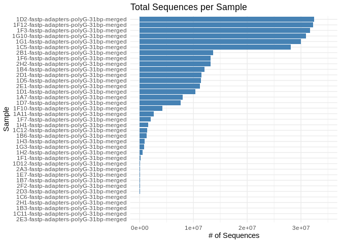
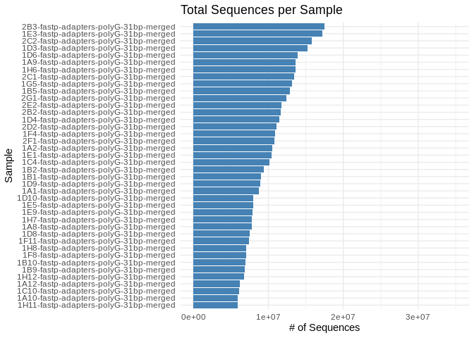

01.10-E-Peve-sRNAseq-trimming-fastp-FastQC-MultiQC
================
Kathleen Durkin
2024-04-30

- <a href="#1-create-a-bash-variables-file"
  id="toc-1-create-a-bash-variables-file">1 Create a Bash variables
  file</a>
- <a href="#2-create-adapters-fasta-for-use-with-fastp-trimming"
  id="toc-2-create-adapters-fasta-for-use-with-fastp-trimming">2 Create
  adapters FastA for use with <code>fastp</code> trimming</a>
- <a href="#3-fastp-trimming" id="toc-3-fastp-trimming">3 Fastp
  Trimming</a>
- <a href="#4-quality-check-with-fastqc-and-multiqc"
  id="toc-4-quality-check-with-fastqc-and-multiqc">4 Quality Check with
  FastQC and MultiQC</a>

------------------------------------------------------------------------

This Rmd file trims *P.evermanni* sRNA-seq files using
[fastp](https://github.com/OpenGene/fastp) (Chen 2023), followed by
quality checks with [FastQC](https://github.com/s-andrews/FastQC) and
[MultiQC](https://multiqc.info/)(Ewels et al. 2016).

Expects input files formatted like so:
`<number>--<sample_name>_R[1,2]_001.fastq.gz`

# 1 Create a Bash variables file

This allows usage of Bash variables across R Markdown chunks.

``` bash
{
echo "#### Assign Variables ####"
echo ""

echo "# Data directories"
echo 'export timeseries_dir=/home/shared/8TB_HDD_02/shedurkin/timeseries_molecular'
echo 'export output_dir_top=${timeseries_dir}/E-Peve/output/01.10-E-Peve-sRNAseq-trimming-fastp-FastQC-MultiQC'
echo 'export raw_reads_dir=${timeseries_dir}/E-Peve/data/raw-fastqs-sRNA'
echo 'export raw_reads_url="https://owl.fish.washington.edu/nightingales/E5-coral-time-series/30-1069297013/"'
echo 'export trimmed_fastqs_dir=${output_dir_top}/trimmed-fastqs-sRNA'
echo 'export trimmed_fastqc_dir=${output_dir_top}/trimmed-fastqc-sRNA'
echo ""

echo "# Paths to programs"
echo 'export programs_dir="/home/shared"'
echo 'export fastp=/home/shared/fastp'
echo 'export fastqc=${programs_dir}/FastQC-0.12.1/fastqc'
echo 'export multiqc=/home/sam/programs/mambaforge/bin/multiqc'
echo ""

echo "# Set FastQ filename patterns"
echo "export fastq_pattern='*.fastq.gz'"
echo "export R1_fastq_pattern='*_R1_*.fastq.gz'"
echo "export R2_fastq_pattern='*_R2_*.fastq.gz'"
echo "export trimmed_fastq_pattern='*31bp-merged.fq.gz'"
echo ""

echo "# Set number of CPUs to use"
echo 'export threads=40'
echo ""

echo "# Set maximum read length"
echo 'export max_read_length=31'
echo ""

echo "## NEB nebnext-small-rna-library-prep-set-for-illumina adapters"
echo 'export NEB_adapters_fasta=NEB-adapters.fasta'
echo 'export first_adapter="AGATCGGAAGAGCACACGTCTGAACTCCAGTCAC"'
echo 'export second_adapter="GATCGTCGGACTGTAGAACTCTGAACGTGTAGATCTCGGTGGTCGCCGTATCATT"'
echo ""

echo "## Inititalize arrays"
echo 'export fastq_array_R1=()'
echo 'export fastq_array_R2=()'
echo 'export raw_fastqs_array=()'
echo 'export R1_names_array=()'
echo 'export R2_names_array=()'
echo 'export trimmed_fastqs_array=()'
echo ""

echo "# Programs associative array"
echo "declare -A programs_array"
echo "programs_array=("
echo '[fastp]="${fastp}"'
echo '[fastqc]="${fastqc}" \'
echo '[multiqc]="${multiqc}" \'
echo ")"
echo ""

echo "# Print formatting"
echo 'export line="--------------------------------------------------------"'
echo ""
} > .bashvars

cat .bashvars
```

    #### Assign Variables ####

    # Data directories
    export timeseries_dir=/home/shared/8TB_HDD_02/shedurkin/timeseries_molecular
    export output_dir_top=${timeseries_dir}/E-Peve/output/01.10-E-Peve-sRNAseq-trimming-fastp-FastQC-MultiQC
    export raw_reads_dir=${timeseries_dir}/E-Peve/data/raw-fastqs-sRNA
    export raw_reads_url="https://owl.fish.washington.edu/nightingales/E5-coral-time-series/30-1069297013/"
    export trimmed_fastqs_dir=${output_dir_top}/trimmed-fastqs-sRNA
    export trimmed_fastqc_dir=${output_dir_top}/trimmed-fastqc-sRNA

    # Paths to programs
    export programs_dir="/home/shared"
    export fastp=/home/shared/fastp
    export fastqc=${programs_dir}/FastQC-0.12.1/fastqc
    export multiqc=/home/sam/programs/mambaforge/bin/multiqc

    # Set FastQ filename patterns
    export fastq_pattern='*.fastq.gz'
    export R1_fastq_pattern='*_R1_*.fastq.gz'
    export R2_fastq_pattern='*_R2_*.fastq.gz'
    export trimmed_fastq_pattern='*31bp-merged.fq.gz'

    # Set number of CPUs to use
    export threads=40

    # Set maximum read length
    export max_read_length=31

    ## NEB nebnext-small-rna-library-prep-set-for-illumina adapters
    export NEB_adapters_fasta=NEB-adapters.fasta
    export first_adapter="AGATCGGAAGAGCACACGTCTGAACTCCAGTCAC"
    export second_adapter="GATCGTCGGACTGTAGAACTCTGAACGTGTAGATCTCGGTGGTCGCCGTATCATT"

    ## Inititalize arrays
    export fastq_array_R1=()
    export fastq_array_R2=()
    export raw_fastqs_array=()
    export R1_names_array=()
    export R2_names_array=()
    export trimmed_fastqs_array=()

    # Programs associative array
    declare -A programs_array
    programs_array=(
    [fastp]="${fastp}"
    [fastqc]="${fastqc}" \
    [multiqc]="${multiqc}" \
    )

    # Print formatting
    export line="--------------------------------------------------------"

If needed, download raw RNA-seq.

``` bash
# Load bash variables into memory
source .bashvars

# Make output directory if it doesn't exist
mkdir --parents ${raw_reads_dir}

# Create list of only P.evermanni sample names
sample_list=$(awk -F "," '$6 ~ /^POR/ {print $5}' ${timeseries_dir}/M-multi-species/data/rna_metadata.csv)

echo ""
echo "${line}"
echo ""
echo "Sample list:"
echo ""
echo "${sample_list}"
echo ""
echo "${line}"
echo ""


# Use printf to format each item for use in wget
formatted_list=$(printf "%s_*," ${sample_list})

# Remove the trailing comma
formatted_list=${formatted_list%,}

# Output the final wget command
echo ""
echo "${line}"
echo ""
echo "Formatted wget accept list:"
echo ""
echo "wget --accept=\"$formatted_list\""
echo ""
echo "${line}"
echo ""

# Run wget to retrieve FastQs and MD5 files
# Note: the --no-clobber command will skip re-downloading any files that are already present in the output directory
wget \
--directory-prefix ${raw_reads_dir} \
--recursive \
--no-check-certificate \
--continue \
--cut-dirs 3 \
--no-host-directories \
--no-parent \
--quiet \
--no-clobber \
--accept=${formatted_list} ${raw_reads_url}

ls -lh "${raw_reads_dir}"
```

Verify raw read checksums

``` bash
# Load bash variables into memory
source .bashvars

cd "${raw_reads_dir}"

# Checksums file contains other files, so this just looks for the sRNAseq files.
for file in *.md5
do
  md5sum --check "${file}"
done
```

# 2 Create adapters FastA for use with [`fastp`](https://github.com/OpenGene/fastp) trimming

``` bash
# Load bash variables into memory
source .bashvars

mkdir --parents "${output_dir_top}"

echo "Creating adapters FastA."
echo ""
adapter_count=0

# Check for adapters file first
# Then create adapters file if doesn't exist
if [ -f "${output_dir_top}/${NEB_adapters_fasta}" ]; then
  echo "${output_dir_top}/${NEB_adapters_fasta} already exists. Nothing to do."
else
  for adapter in "${first_adapter}" "${second_adapter}"
  do
    adapter_count=$((adapter_count + 1))
    printf ">%s\n%s\n" "adapter_${adapter_count}" "${adapter}"
  done >> "${output_dir_top}/${NEB_adapters_fasta}"
fi

echo ""
echo "Adapters FastA:"
echo ""
cat "${output_dir_top}/${NEB_adapters_fasta}"
echo ""
```

# 3 Fastp Trimming

[fastp](https://github.com/OpenGene/fastp) (Chen 2023) is set to
auto-detect Illumina adapters, as well as trim the first 20bp from each
read, as past experience shows these first 20bp are more inconsistent
than the remainder of the read length.

``` bash
# Load bash variables into memory
source .bashvars

# Make output directories, if it doesn't exist
mkdir --parents "${trimmed_fastqs_dir}"

# Change to raw reads directory
cd "${raw_reads_dir}"

# Create arrays of fastq R1 files and sample names
for fastq in ${R1_fastq_pattern}
do
  fastq_array_R1+=("${fastq}")
  R1_names_array+=("$(echo "${fastq}" | awk -F"_" '{print $1}')")
done

# Create array of fastq R2 files
for fastq in ${R2_fastq_pattern}
do
  fastq_array_R2+=("${fastq}")
  R2_names_array+=("$(echo "${fastq}" | awk -F"_" '{print $1}')")
done

# Create list of fastq files used in analysis
# Create MD5 checksum for reference
if [ ! -f "${output_dir_top}"/raw-fastq-checksums.md5 ]; then
for fastq in *.gz
  do
    md5sum ${fastq} >> "${output_dir_top}"/raw-fastq-checksums.md5
  done
fi

############ RUN FASTP ############
# Uses parameter substitution (e.g. ${R1_sample_name%%_*})to rm the _R[12]

# Run fastp on files
echo "Beginning fastp trimming."
echo ""

time \
for index in "${!fastq_array_R1[@]}"
do
  # Get sample name
  R1_sample_name="${R1_names_array[index]%%_*}"

  # Set fastp report title
  trimmed_fastp_report_title="${R1_sample_name}-fastp-adapters-polyG-${max_read_length}bp-merged"
  
  # Set merged output location and filename
  merged_output=${trimmed_fastqs_dir}/${trimmed_fastp_report_title}.fq.gz

  # Begin fastp trimming
  ${programs_array[fastp]} \
  --in1 ${fastq_array_R1[index]} \
  --in2 ${fastq_array_R2[index]} \
  --adapter_fasta ${output_dir_top}/${NEB_adapters_fasta} \
  --trim_poly_g \
  --overlap_len_require 17 \
  --length_limit 31 \
  --merge \
  --merged_out ${merged_output} \
  --thread ${threads} \
  --html "${trimmed_fastp_report_title}.html" \
  --json "${trimmed_fastp_report_title}.json" \
  --report_title "${trimmed_fastp_report_title}"
    
  # Move to trimmed directory
  # This is done so checksums file doesn't include excess path
  cd ${trimmed_fastqs_dir}

  # Generate md5 checksums for newly trimmed files
  {
    md5sum "${trimmed_fastp_report_title}.fq.gz"
  } >> "${trimmed_checksums}"
  
  # Change back to to raw reads directory
  cd "${raw_reads_dir}"

done

echo ""
echo "fastp trimming complete."
echo ""

echo "Trimmed FastQs MD5 checksums:"
echo ""

cat "${trimmed_fastqs_dir}/${trimmed_checksums}"
```

# 4 Quality Check with FastQC and MultiQC

``` bash
# Load bash variables into memory
source .bashvars

# Make output directory if it doesn't exist
mkdir --parents "${trimmed_fastqc_dir}"

############ RUN FASTQC ############


# Create array of trimmed FastQs
trimmed_fastqs_array=(${trimmed_fastqs_dir}/${trimmed_fastq_pattern})

# Pass array contents to new variable as space-delimited list
trimmed_fastqc_list=$(echo "${trimmed_fastqs_array[*]}")

echo "Beginning FastQC on trimmed reads..."
echo ""

# Run FastQC
### NOTE: Do NOT quote raw_fastqc_list
${programs_array[fastqc]} \
--threads ${threads} \
--outdir ${trimmed_fastqc_dir} \
--quiet \
${trimmed_fastqc_list}

echo "FastQC on trimmed reads complete!"
echo ""

############ END FASTQC ############

############ RUN MULTIQC ############
echo "Beginning MultiQC on trimmed FastQC..."
echo ""

${programs_array[multiqc]} ${trimmed_fastqc_dir} -o ${trimmed_fastqc_dir}

echo ""
echo "MultiQC on trimmed FastQs complete."
echo ""

############ END MULTIQC ############

echo "Removing FastQC zip files."
echo ""
rm ${trimmed_fastqc_dir}/*.zip
echo "FastQC zip files removed."
echo ""
```

It looks like many of the P.evermanni samples have extremely low read
counts (this was also noted in Sam’s [notebook
post](https://robertslab.github.io/sams-notebook/posts/2024/2024-12-10-Data-Received---Coral-E5-sRNA-seq-Time-Series-Azenta-Project-30-1069297013/index.html)
on recieiving the data from Azenta). There are also several samples with
very *high* counts, notably higher than any of our A.pulchra samples.

``` r
Peve_stats <- read.table("../output/01.10-E-Peve-sRNAseq-trimming-fastp-FastQC-MultiQC/trimmed-fastqc-sRNA/multiqc_data/multiqc_general_stats.txt", header=TRUE)

library(ggplot2)

ggplot(Peve_stats, aes(x = FastQC_mqc.generalstats.fastqc.total_sequences, 
                       y = reorder(Sample, FastQC_mqc.generalstats.fastqc.total_sequences))) +
  geom_bar(stat = "identity", fill = "steelblue") +
  labs(x = "# of Sequences", y = "Sample", 
       title = "Total Sequences per Sample") +
  xlim(0, 3.5e07) +
  theme_minimal()
```

<!-- -->

``` r
cat("min:", min(Peve_stats$FastQC_mqc.generalstats.fastqc.total_sequences), "mean:", mean(Peve_stats$FastQC_mqc.generalstats.fastqc.total_sequences), "max:", max(Peve_stats$FastQC_mqc.generalstats.fastqc.total_sequences))
```

    min: 95 mean: 8481438 max: 32445344

``` r
Apul_stats <- read.table("../../D-Apul/output/01.10-D-Apul-sRNAseq-trimming-fastp-FastQC-MultiQC/trimmed-fastqc-sRNA/multiqc_data/multiqc_general_stats.txt", header=TRUE)

library(ggplot2)

ggplot(Apul_stats, aes(x = FastQC_mqc.generalstats.fastqc.total_sequences, 
                       y = reorder(Sample, FastQC_mqc.generalstats.fastqc.total_sequences))) +
  geom_bar(stat = "identity", fill = "steelblue") +
  labs(x = "# of Sequences", y = "Sample", 
       title = "Total Sequences per Sample") +
  xlim(0, 3.5e07) +
  theme_minimal()
```

<!-- -->

``` r
cat("min:", min(Apul_stats$FastQC_mqc.generalstats.fastqc.total_sequences), "mean:", mean(Apul_stats$FastQC_mqc.generalstats.fastqc.total_sequences), "max:", max(Apul_stats$FastQC_mqc.generalstats.fastqc.total_sequences))
```

    min: 5914953 mean: 10171840 max: 17445078

How many P.evermanni samples have read counts in the range we’d expect
based on the A.pulchra samples?

``` r
nrow(Peve_stats[Peve_stats$FastQC_mqc.generalstats.fastqc.total_sequences < max(Apul_stats$FastQC_mqc.generalstats.fastqc.total_sequences) & Peve_stats$FastQC_mqc.generalstats.fastqc.total_sequences > min(Apul_stats$FastQC_mqc.generalstats.fastqc.total_sequences),])
```

    [1] 10

Only 10 of the 37 P.evermanni samples have read counts in the range of
A.pulchra samples….

<div id="refs" class="references csl-bib-body hanging-indent">

<div id="ref-chen2023" class="csl-entry">

Chen, Shifu. 2023. “Ultrafast One-Pass FASTQ Data Preprocessing, Quality
Control, and Deduplication Using Fastp.” *iMeta* 2 (2).
<https://doi.org/10.1002/imt2.107>.

</div>

<div id="ref-ewels2016" class="csl-entry">

Ewels, Philip, Måns Magnusson, Sverker Lundin, and Max Käller. 2016.
“MultiQC: Summarize Analysis Results for Multiple Tools and Samples in a
Single Report.” *Bioinformatics* 32 (19): 3047–48.
<https://doi.org/10.1093/bioinformatics/btw354>.

</div>

</div>
