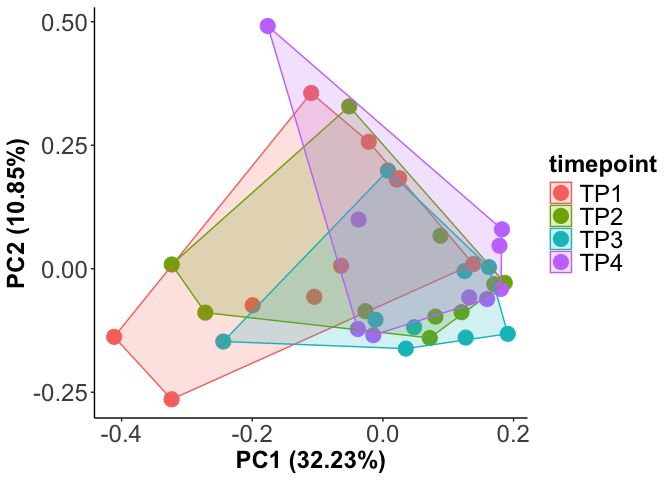
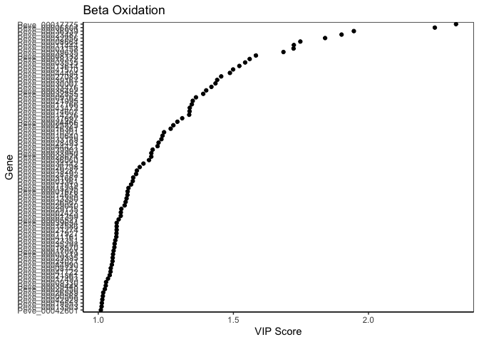
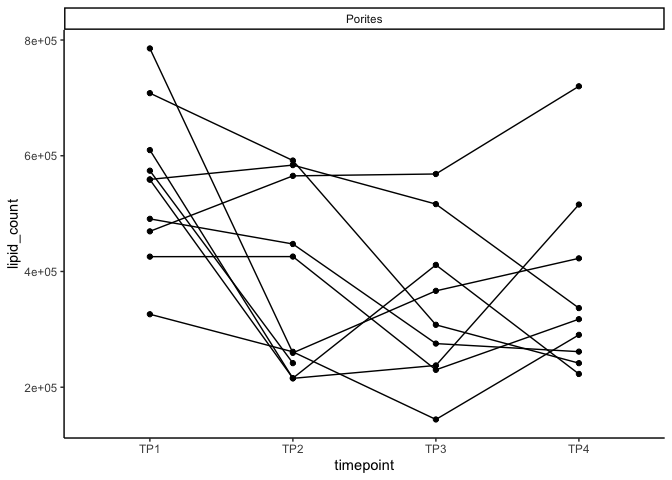

Peve molecular energetic state gene expression analysis
================
2025-02-19

Analysis of gene expression of P evermanni energetic state using the
following gene set GO categories: - Glycolysis <GO:0006096> -
Gluconeogenesis <GO:0006094> - Lipolysis/lipid catabolism <GO:0016042> -
Fatty acid beta oxidation <GO:0006635> - Starvation <GO:0042594> - Lipid
biosynthesis <GO:000861> - Protein catabolic process <GO:0030163>

# Set up

Load libraries

``` r
library(ggplot2)
library(vegan)
```

    ## Loading required package: permute

    ## Loading required package: lattice

    ## This is vegan 2.6-6.1

``` r
library(mixOmics)
```

    ## Loading required package: MASS

    ## 
    ## Loaded mixOmics 6.28.0
    ## Thank you for using mixOmics!
    ## Tutorials: http://mixomics.org
    ## Bookdown vignette: https://mixomicsteam.github.io/Bookdown
    ## Questions, issues: Follow the prompts at http://mixomics.org/contact-us
    ## Cite us:  citation('mixOmics')

``` r
library(readxl)
library(factoextra)
```

    ## Welcome! Want to learn more? See two factoextra-related books at https://goo.gl/ve3WBa

``` r
library(ggfortify)
library(ComplexHeatmap)
```

    ## Loading required package: grid

    ## ========================================
    ## ComplexHeatmap version 2.20.0
    ## Bioconductor page: http://bioconductor.org/packages/ComplexHeatmap/
    ## Github page: https://github.com/jokergoo/ComplexHeatmap
    ## Documentation: http://jokergoo.github.io/ComplexHeatmap-reference
    ## 
    ## If you use it in published research, please cite either one:
    ## - Gu, Z. Complex Heatmap Visualization. iMeta 2022.
    ## - Gu, Z. Complex heatmaps reveal patterns and correlations in multidimensional 
    ##     genomic data. Bioinformatics 2016.
    ## 
    ## 
    ## The new InteractiveComplexHeatmap package can directly export static 
    ## complex heatmaps into an interactive Shiny app with zero effort. Have a try!
    ## 
    ## This message can be suppressed by:
    ##   suppressPackageStartupMessages(library(ComplexHeatmap))
    ## ========================================

``` r
library(viridis)
```

    ## Loading required package: viridisLite

``` r
library(lme4)
```

    ## Loading required package: Matrix

``` r
library(lmerTest)
```

    ## 
    ## Attaching package: 'lmerTest'

    ## The following object is masked from 'package:lme4':
    ## 
    ##     lmer

    ## The following object is masked from 'package:stats':
    ## 
    ##     step

``` r
library(emmeans)
```

    ## Welcome to emmeans.
    ## Caution: You lose important information if you filter this package's results.
    ## See '? untidy'

``` r
library(broom.mixed)
library(broom)
library(tidyverse)
```

    ## ── Attaching core tidyverse packages ──────────────────────── tidyverse 2.0.0 ──
    ## ✔ dplyr     1.1.4     ✔ readr     2.1.5
    ## ✔ forcats   1.0.0     ✔ stringr   1.5.1
    ## ✔ lubridate 1.9.3     ✔ tibble    3.2.1
    ## ✔ purrr     1.0.2     ✔ tidyr     1.3.1

    ## ── Conflicts ────────────────────────────────────────── tidyverse_conflicts() ──
    ## ✖ tidyr::expand() masks Matrix::expand()
    ## ✖ dplyr::filter() masks stats::filter()
    ## ✖ dplyr::lag()    masks stats::lag()
    ## ✖ purrr::map()    masks mixOmics::map()
    ## ✖ tidyr::pack()   masks Matrix::pack()
    ## ✖ dplyr::select() masks MASS::select()
    ## ✖ tidyr::unpack() masks Matrix::unpack()
    ## ℹ Use the conflicted package (<http://conflicted.r-lib.org/>) to force all conflicts to become errors

``` r
library(RVAideMemoire)
```

    ## *** Package RVAideMemoire v 0.9-83-7 ***
    ## 
    ## Attaching package: 'RVAideMemoire'
    ## 
    ## The following object is masked from 'package:broom':
    ## 
    ##     bootstrap
    ## 
    ## The following object is masked from 'package:lme4':
    ## 
    ##     dummy

``` r
library(Hmisc)
```

    ## 
    ## Attaching package: 'Hmisc'
    ## 
    ## The following objects are masked from 'package:dplyr':
    ## 
    ##     src, summarize
    ## 
    ## The following objects are masked from 'package:base':
    ## 
    ##     format.pval, units

``` r
library(corrplot)
```

    ## corrplot 0.92 loaded

# Read in gene count matrix

Gene count matrix for all genes

``` r
# raw gene counts data (will filter and variance stabilize)
Peve_genes <- read_csv("E-Peve/output/02.20-E-Peve-RNAseq-alignment-HiSat2/peve-gene_count_matrix.csv")
```

    ## Rows: 40389 Columns: 39
    ## ── Column specification ────────────────────────────────────────────────────────
    ## Delimiter: ","
    ## chr  (1): gene_id
    ## dbl (38): POR-216-TP1, POR-216-TP2, POR-216-TP3, POR-216-TP4, POR-236-TP1, P...
    ## 
    ## ℹ Use `spec()` to retrieve the full column specification for this data.
    ## ℹ Specify the column types or set `show_col_types = FALSE` to quiet this message.

``` r
Peve_genes <- as.data.frame(Peve_genes)

#Remove the "-gene" prefix from the gene ID column 
Peve_genes<-Peve_genes%>%
  mutate(gene_id = str_remove(gene_id, "^gene-"))%>%
  as.data.frame()

# format gene IDs as rownames (instead of a column)
rownames(Peve_genes) <- Peve_genes$gene_id
Peve_genes <- Peve_genes%>%dplyr::select(!gene_id)

colnames(Peve_genes) <- str_replace(colnames(Peve_genes), "^([^\\-]+\\-[^\\-]+)\\-", "\\1_")

# load and format metadata
metadata <- read_csv("M-multi-species/data/rna_metadata.csv")%>%dplyr::select(AzentaSampleName, ColonyID, Timepoint) %>%
  filter(grepl("POR", ColonyID))
```

    ## New names:
    ## Rows: 117 Columns: 19
    ## ── Column specification
    ## ──────────────────────────────────────────────────────── Delimiter: "," chr
    ## (13): SampleName, WellNumber, AzentaSampleName, ColonyID, Timepoint, Sam... dbl
    ## (5): SampleNumber, Plate, TotalAmount-ng, Volume-uL, Conc-ng.uL lgl (1):
    ## MethodUsedForSpectrophotometry
    ## ℹ Use `spec()` to retrieve the full column specification for this data. ℹ
    ## Specify the column types or set `show_col_types = FALSE` to quiet this message.
    ## • `` -> `...19`

``` r
metadata$Sample <- paste(metadata$ColonyID, metadata$Timepoint, sep = "_")

colonies <- unique(metadata$ColonyID)

# Load physiological data
phys<-read_csv("https://github.com/urol-e5/timeseries/raw/refs/heads/master/time_series_analysis/Output/master_timeseries.csv")%>%filter(colony_id_corr %in% colonies)%>%
  dplyr::select(colony_id_corr, species, timepoint, site, Host_AFDW.mg.cm2, Sym_AFDW.mg.cm2, Am, AQY, Rd, Ik, Ic, calc.umol.cm2.hr, cells.mgAFDW, prot_mg.mgafdw, Ratio_AFDW.mg.cm2, Total_Chl, Total_Chl_cell, cre.umol.mgafdw)
```

    ## Rows: 448 Columns: 46
    ## ── Column specification ────────────────────────────────────────────────────────
    ## Delimiter: ","
    ## chr (10): colony_id, colony_id_corr, species, timepoint, month, site, nutrie...
    ## dbl (36): cre.umol.mgprot, Host_AFDW.mg.cm2, Sym_AFDW.mg.cm2, Host_DW.mg.cm2...
    ## 
    ## ℹ Use `spec()` to retrieve the full column specification for this data.
    ## ℹ Specify the column types or set `show_col_types = FALSE` to quiet this message.

``` r
# format timepoint
phys$timepoint <- gsub("timepoint", "TP", phys$timepoint)

#add column with full sample info
phys <- merge(phys, metadata, by.x = c("colony_id_corr", "timepoint"), by.y = c("ColonyID", "Timepoint")) %>%
  dplyr::select(-AzentaSampleName)
  
#add site information into metadata 
metadata$Site<-phys$site[match(metadata$ColonyID, phys$colony_id_corr)]

# Rename gene column names to include full sample info (as in miRNA table)
#colnames(Apul_genes) <- metadata$Sample[match(colnames(Apul_genes), metadata$AzentaSampleName)]
```

# Gene set 1: Glycolysis <GO:0006096>

Load in gene set generated by Peve-energy-go script

``` r
glycolysis_go<-read_table(file="E-Peve/output/05-Peve-energy-GO/Apul_blastp-GO:0006096_out.tab")%>%pull(var=1)
```

    ## 
    ## ── Column specification ────────────────────────────────────────────────────────
    ## cols(
    ##   Peve_00000079 = col_character(),
    ##   `sp|O97562|UCP2_PIG` = col_character(),
    ##   `35.106` = col_double(),
    ##   `282` = col_double(),
    ##   `167` = col_double(),
    ##   `5` = col_double(),
    ##   `33` = col_double(),
    ##   `301` = col_double(),
    ##   `17` = col_double(),
    ##   `295` = col_double(),
    ##   `6.46e-49` = col_double(),
    ##   `163` = col_double()
    ## )

Subset gene count matrix for this gene set.

``` r
glycolysis_genes<-Peve_genes%>%
  filter(rownames(.) %in% glycolysis_go)
```

Calculate the sum of the total gene set for each sample.

``` r
glycolysis_genes<-as.data.frame(t(glycolysis_genes))

glycolysis_genes$Sample<-rownames(glycolysis_genes)

glycolysis_genes<-glycolysis_genes %>%
  rowwise() %>%
  mutate(glycolysis_count = sum(c_across(where(is.numeric)))) %>%
  ungroup()%>%
  as.data.frame()
```

Merge into master data frame with metadata and physiology as a new
column called “glycolysis”.

``` r
data<-left_join(phys, glycolysis_genes)
```

    ## Joining with `by = join_by(Sample)`

Plot over timepoints.

``` r
plot<-data%>%
  ggplot(aes(x=timepoint, y=glycolysis_count, group=colony_id_corr))+
  facet_wrap(~species)+
  geom_point()+
  geom_line()+
  theme_classic();plot
```

<!-- -->

Plot as a PCA.

``` r
pca_data <- data %>% dplyr::select(c(starts_with("Peve"), colony_id_corr, timepoint))

# Identify numeric columns
numeric_cols <- sapply(pca_data, is.numeric)

# Among numeric columns, find those with non-zero sum
non_zero_cols <- colSums(pca_data[, numeric_cols]) != 0

# Combine non-numeric columns with numeric columns that have non-zero sum
pca_data_cleaned <- cbind(
  pca_data[, !numeric_cols],                  # All non-numeric columns
  pca_data[, numeric_cols][, non_zero_cols]   # Numeric columns with non-zero sum
)
```

``` r
scaled.pca<-prcomp(pca_data_cleaned%>%dplyr::select(where(is.numeric)), scale=TRUE, center=TRUE) 
```

Prepare a PCA plot

``` r
# scale data
vegan <- scale(pca_data_cleaned%>%dplyr::select(where(is.numeric)))

# PerMANOVA 
permanova<-adonis2(vegan ~ timepoint, data = pca_data_cleaned, method='eu')
permanova
```

    ## Permutation test for adonis under reduced model
    ## Terms added sequentially (first to last)
    ## Permutation: free
    ## Number of permutations: 999
    ## 
    ## adonis2(formula = vegan ~ timepoint, data = pca_data_cleaned, method = "eu")
    ##           Df SumOfSqs      R2      F Pr(>F)
    ## timepoint  3    788.2 0.10598 1.3434  0.119
    ## Residual  34   6648.8 0.89402              
    ## Total     37   7437.0 1.00000

View by species

``` r
plot<-ggplot2::autoplot(scaled.pca, data=pca_data_cleaned, loadings=FALSE,  colour="timepoint", loadings.label.colour="black", loadings.colour="black", loadings.label=FALSE, frame=TRUE, loadings.label.size=5, loadings.label.vjust=-1, size=5) + 
  theme_classic()+
   theme(legend.text = element_text(size=18), 
         legend.position="right",
        plot.background = element_blank(),
        legend.title = element_text(size=18, face="bold"), 
        axis.text = element_text(size=18), 
        axis.title = element_text(size=18,  face="bold"));plot
```

<!-- -->

Are there genes different by time point? Run PLSDA and VIP.

``` r
#assigning datasets 
X <- pca_data_cleaned
                
levels(as.factor(X$timepoint))
```

    ## [1] "TP1" "TP2" "TP3" "TP4"

``` r
Y <- as.factor(X$timepoint) #select treatment names
Y
```

    ##  [1] TP1 TP2 TP3 TP4 TP1 TP2 TP1 TP2 TP3 TP4 TP1 TP2 TP3 TP4 TP1 TP2 TP3 TP4 TP1
    ## [20] TP2 TP3 TP4 TP1 TP2 TP3 TP4 TP1 TP2 TP3 TP4 TP1 TP2 TP3 TP4 TP1 TP2 TP3 TP4
    ## Levels: TP1 TP2 TP3 TP4

``` r
X<-X%>%dplyr::select(where(is.numeric)) #pull only data columns

# run PLSDA 
MyResult.plsda <- plsda(X,Y) # 1 Run the method
            
plotIndiv(MyResult.plsda, ind.names = FALSE, legend=TRUE, legend.title = "Glycolysis", ellipse = FALSE, title="", style = "graphics", centroid=FALSE, point.lwd = 2, cex=2)
```

<!-- -->

Extract VIPs.

``` r
#extract
treatment_VIP <- PLSDA.VIP(MyResult.plsda)
treatment_VIP_df <- as.data.frame(treatment_VIP[["tab"]])
treatment_VIP_df
```

    ##                      VIP
    ## Peve_00033963 2.29727741
    ## Peve_00038087 2.06300202
    ## Peve_00024602 1.95676921
    ## Peve_00016096 1.94733180
    ## Peve_00020350 1.91657065
    ## Peve_00029657 1.78154850
    ## Peve_00033950 1.76687439
    ## Peve_00004659 1.74481509
    ## Peve_00026350 1.74398003
    ## Peve_00003158 1.72667526
    ## Peve_00001586 1.67965218
    ## Peve_00015643 1.67670872
    ## Peve_00025794 1.63174479
    ## Peve_00028656 1.61599470
    ## Peve_00037310 1.54796932
    ## Peve_00016268 1.53106537
    ## Peve_00029032 1.50622400
    ## Peve_00026729 1.41932988
    ## Peve_00016809 1.41729244
    ## Peve_00012722 1.38216340
    ## Peve_00044760 1.37998883
    ## Peve_00043390 1.37411309
    ## Peve_00026977 1.36428046
    ## Peve_00040401 1.34116034
    ## Peve_00027083 1.33672977
    ## Peve_00021856 1.33596835
    ## Peve_00031790 1.33507836
    ## Peve_00013838 1.33305138
    ## Peve_00042157 1.32407468
    ## Peve_00003539 1.32005827
    ## Peve_00019806 1.31190308
    ## Peve_00027073 1.30574730
    ## Peve_00020572 1.29416791
    ## Peve_00015045 1.27937656
    ## Peve_00029654 1.27772162
    ## Peve_00016646 1.27059237
    ## Peve_00021245 1.26795430
    ## Peve_00022328 1.26591970
    ## Peve_00014624 1.26370595
    ## Peve_00033476 1.25124486
    ## Peve_00015518 1.21635205
    ## Peve_00022867 1.20615562
    ## Peve_00044062 1.20519140
    ## Peve_00002321 1.20417487
    ## Peve_00026728 1.19914806
    ## Peve_00044421 1.19182653
    ## Peve_00012020 1.18106763
    ## Peve_00040733 1.17495078
    ## Peve_00031785 1.16330283
    ## Peve_00001411 1.15433075
    ## Peve_00003570 1.14891602
    ## Peve_00033089 1.14663160
    ## Peve_00007243 1.13731246
    ## Peve_00009560 1.13320289
    ## Peve_00042302 1.12571563
    ## Peve_00014159 1.12157060
    ## Peve_00000114 1.10041690
    ## Peve_00003219 1.09284168
    ## Peve_00022830 1.08040741
    ## Peve_00009073 1.07979774
    ## Peve_00019240 1.07510531
    ## Peve_00016361 1.06835306
    ## Peve_00005527 1.06410905
    ## Peve_00031326 1.06209340
    ## Peve_00001435 1.05929942
    ## Peve_00007365 1.05756829
    ## Peve_00004657 1.05496814
    ## Peve_00019361 1.05477124
    ## Peve_00044666 1.04717944
    ## Peve_00040519 1.03765074
    ## Peve_00017602 1.03509939
    ## Peve_00018570 1.02670854
    ## Peve_00017071 1.02170343
    ## Peve_00012273 0.99329999
    ## Peve_00004660 0.98422554
    ## Peve_00026347 0.97632261
    ## Peve_00005352 0.97483136
    ## Peve_00007726 0.97198678
    ## Peve_00010022 0.97177005
    ## Peve_00031003 0.96025805
    ## Peve_00023694 0.95906842
    ## Peve_00029178 0.95160027
    ## Peve_00020457 0.94676473
    ## Peve_00023464 0.94499178
    ## Peve_00028171 0.93992452
    ## Peve_00027572 0.93594819
    ## Peve_00012587 0.93093792
    ## Peve_00036445 0.92949213
    ## Peve_00018899 0.92835309
    ## Peve_00000418 0.92654947
    ## Peve_00032593 0.91878755
    ## Peve_00045066 0.91330935
    ## Peve_00039119 0.90365776
    ## Peve_00007764 0.89155469
    ## Peve_00034319 0.88963361
    ## Peve_00018336 0.88547219
    ## Peve_00033645 0.88287420
    ## Peve_00021861 0.87973173
    ## Peve_00028793 0.85779089
    ## Peve_00041828 0.85170788
    ## Peve_00038394 0.84935335
    ## Peve_00042168 0.84913127
    ## Peve_00008951 0.84790214
    ## Peve_00014328 0.84725291
    ## Peve_00002969 0.84055710
    ## Peve_00040732 0.83754441
    ## Peve_00041779 0.83707702
    ## Peve_00033826 0.83675524
    ## Peve_00022156 0.83461986
    ## Peve_00025321 0.83357023
    ## Peve_00040503 0.83275613
    ## Peve_00007364 0.82699702
    ## Peve_00044998 0.82384087
    ## Peve_00031599 0.81776057
    ## Peve_00041056 0.81674940
    ## Peve_00025384 0.81638612
    ## Peve_00027369 0.81229141
    ## Peve_00037725 0.81066756
    ## Peve_00017515 0.79335512
    ## Peve_00003792 0.79299457
    ## Peve_00042763 0.78856815
    ## Peve_00044664 0.78482127
    ## Peve_00009969 0.77985286
    ## Peve_00039118 0.77647505
    ## Peve_00000391 0.77176008
    ## Peve_00041037 0.77117294
    ## Peve_00036957 0.76925045
    ## Peve_00019553 0.76470224
    ## Peve_00029726 0.75386195
    ## Peve_00033436 0.75302077
    ## Peve_00026674 0.74645725
    ## Peve_00042762 0.74539695
    ## Peve_00020199 0.74405144
    ## Peve_00004630 0.74394847
    ## Peve_00039201 0.73754216
    ## Peve_00014688 0.72230857
    ## Peve_00036372 0.72214391
    ## Peve_00006937 0.71818044
    ## Peve_00038665 0.71145995
    ## Peve_00017049 0.70533003
    ## Peve_00008952 0.69582006
    ## Peve_00000209 0.69459855
    ## Peve_00009808 0.69321089
    ## Peve_00007821 0.68534053
    ## Peve_00027717 0.68181204
    ## Peve_00032931 0.66620306
    ## Peve_00022742 0.65317425
    ## Peve_00016095 0.65236011
    ## Peve_00016743 0.64479308
    ## Peve_00035951 0.64290673
    ## Peve_00032222 0.64152352
    ## Peve_00008881 0.63869412
    ## Peve_00016589 0.63720891
    ## Peve_00004978 0.62801938
    ## Peve_00031001 0.62045578
    ## Peve_00037749 0.61349046
    ## Peve_00028934 0.61329257
    ## Peve_00006921 0.61129067
    ## Peve_00039585 0.60983438
    ## Peve_00024151 0.60780500
    ## Peve_00025007 0.60409894
    ## Peve_00045154 0.59550888
    ## Peve_00026737 0.59476138
    ## Peve_00018002 0.58787463
    ## Peve_00002770 0.58640462
    ## Peve_00032223 0.58467663
    ## Peve_00018571 0.56806361
    ## Peve_00025006 0.55407112
    ## Peve_00003538 0.54230798
    ## Peve_00023980 0.54077972
    ## Peve_00039845 0.52661165
    ## Peve_00006977 0.52594123
    ## Peve_00033827 0.52404903
    ## Peve_00005351 0.51876790
    ## Peve_00018895 0.50934669
    ## Peve_00004634 0.50396802
    ## Peve_00025848 0.50243441
    ## Peve_00031783 0.49770142
    ## Peve_00009866 0.49120238
    ## Peve_00020608 0.48899272
    ## Peve_00034834 0.48606815
    ## Peve_00039958 0.48056216
    ## Peve_00018723 0.46643487
    ## Peve_00028378 0.45124312
    ## Peve_00004071 0.44907168
    ## Peve_00012559 0.44808404
    ## Peve_00013429 0.42941765
    ## Peve_00035358 0.41951844
    ## Peve_00025417 0.41662198
    ## Peve_00011363 0.40830199
    ## Peve_00031596 0.38134584
    ## Peve_00006976 0.37932686
    ## Peve_00004025 0.34541396
    ## Peve_00010476 0.34119690
    ## Peve_00024621 0.30971680
    ## Peve_00025500 0.28411450
    ## Peve_00045007 0.23024002
    ## Peve_00040465 0.22654523
    ## Peve_00031151 0.19706388
    ## Peve_00005980 0.17127345
    ## Peve_00001733 0.03048582

``` r
# Converting row names to column
treatment_VIP_table <- rownames_to_column(treatment_VIP_df, var = "Gene")

#filter for VIP > 1
treatment_VIP_1 <- treatment_VIP_table %>% 
  filter(VIP >= 1)

#plot
VIP_list_plot<-treatment_VIP_1 %>%
            arrange(VIP) %>%
  
  ggplot( aes(x = VIP, y = reorder(Gene,VIP,sum))) +
  geom_point() +
  ylab("Gene") +
  xlab("VIP Score") +
  ggtitle("Glycolysis") +
  theme_bw() + theme(panel.border = element_rect(linetype = "solid", color = "black"), panel.grid.major = element_blank(), #Makes background theme white
                     panel.grid.minor = element_blank(), axis.line = element_line(colour = "black"));VIP_list_plot
```

<!-- -->

``` r
treatment_VIP_1 %>%
            arrange(VIP)
```

    ##             Gene      VIP
    ## 1  Peve_00017071 1.021703
    ## 2  Peve_00018570 1.026709
    ## 3  Peve_00017602 1.035099
    ## 4  Peve_00040519 1.037651
    ## 5  Peve_00044666 1.047179
    ## 6  Peve_00019361 1.054771
    ## 7  Peve_00004657 1.054968
    ## 8  Peve_00007365 1.057568
    ## 9  Peve_00001435 1.059299
    ## 10 Peve_00031326 1.062093
    ## 11 Peve_00005527 1.064109
    ## 12 Peve_00016361 1.068353
    ## 13 Peve_00019240 1.075105
    ## 14 Peve_00009073 1.079798
    ## 15 Peve_00022830 1.080407
    ## 16 Peve_00003219 1.092842
    ## 17 Peve_00000114 1.100417
    ## 18 Peve_00014159 1.121571
    ## 19 Peve_00042302 1.125716
    ## 20 Peve_00009560 1.133203
    ## 21 Peve_00007243 1.137312
    ## 22 Peve_00033089 1.146632
    ## 23 Peve_00003570 1.148916
    ## 24 Peve_00001411 1.154331
    ## 25 Peve_00031785 1.163303
    ## 26 Peve_00040733 1.174951
    ## 27 Peve_00012020 1.181068
    ## 28 Peve_00044421 1.191827
    ## 29 Peve_00026728 1.199148
    ## 30 Peve_00002321 1.204175
    ## 31 Peve_00044062 1.205191
    ## 32 Peve_00022867 1.206156
    ## 33 Peve_00015518 1.216352
    ## 34 Peve_00033476 1.251245
    ## 35 Peve_00014624 1.263706
    ## 36 Peve_00022328 1.265920
    ## 37 Peve_00021245 1.267954
    ## 38 Peve_00016646 1.270592
    ## 39 Peve_00029654 1.277722
    ## 40 Peve_00015045 1.279377
    ## 41 Peve_00020572 1.294168
    ## 42 Peve_00027073 1.305747
    ## 43 Peve_00019806 1.311903
    ## 44 Peve_00003539 1.320058
    ## 45 Peve_00042157 1.324075
    ## 46 Peve_00013838 1.333051
    ## 47 Peve_00031790 1.335078
    ## 48 Peve_00021856 1.335968
    ## 49 Peve_00027083 1.336730
    ## 50 Peve_00040401 1.341160
    ## 51 Peve_00026977 1.364280
    ## 52 Peve_00043390 1.374113
    ## 53 Peve_00044760 1.379989
    ## 54 Peve_00012722 1.382163
    ## 55 Peve_00016809 1.417292
    ## 56 Peve_00026729 1.419330
    ## 57 Peve_00029032 1.506224
    ## 58 Peve_00016268 1.531065
    ## 59 Peve_00037310 1.547969
    ## 60 Peve_00028656 1.615995
    ## 61 Peve_00025794 1.631745
    ## 62 Peve_00015643 1.676709
    ## 63 Peve_00001586 1.679652
    ## 64 Peve_00003158 1.726675
    ## 65 Peve_00026350 1.743980
    ## 66 Peve_00004659 1.744815
    ## 67 Peve_00033950 1.766874
    ## 68 Peve_00029657 1.781548
    ## 69 Peve_00020350 1.916571
    ## 70 Peve_00016096 1.947332
    ## 71 Peve_00024602 1.956769
    ## 72 Peve_00038087 2.063002
    ## 73 Peve_00033963 2.297277

Plot important genes

``` r
plot<-data%>%
  ggplot(aes(x=timepoint, y=Peve_00033963, group=colony_id_corr))+
  facet_wrap(~species)+
  geom_point()+
  geom_line()+
  theme_classic();plot
```

<!-- -->

Plot second most important.

``` r
plot<-data%>%
  ggplot(aes(x=timepoint, y=Peve_00038087, group=colony_id_corr))+
  facet_wrap(~species)+
  geom_point()+
  geom_line()+
  theme_classic();plot
```

<!-- -->

Plot third most important.

``` r
plot<-data%>%
  ggplot(aes(x=timepoint, y=Peve_00024602, group=colony_id_corr))+
  facet_wrap(~species)+
  geom_point()+
  geom_line()+
  theme_classic();plot
```

<!-- -->

Look at a PCA of the differentiating genes.

``` r
#extract list of VIPs
vip_genes<-treatment_VIP_1%>%pull(Gene)

#turn to wide format with 
pca_data_vips<-pca_data_cleaned%>%dplyr::select(all_of(c("timepoint", "colony_id_corr", vip_genes)))
```

``` r
scaled.pca<-prcomp(pca_data_vips%>%dplyr::select(where(is.numeric)), scale=TRUE, center=TRUE) 
```

Prepare a PCA plot

``` r
# scale data
vegan <- scale(pca_data_vips%>%dplyr::select(where(is.numeric)))

# PerMANOVA 
permanova<-adonis2(vegan ~ timepoint, data = pca_data_vips, method='eu')
permanova
```

    ## Permutation test for adonis under reduced model
    ## Terms added sequentially (first to last)
    ## Permutation: free
    ## Number of permutations: 999
    ## 
    ## adonis2(formula = vegan ~ timepoint, data = pca_data_vips, method = "eu")
    ##           Df SumOfSqs      R2      F Pr(>F)  
    ## timepoint  3   356.58 0.13202 1.7238  0.034 *
    ## Residual  34  2344.42 0.86798                
    ## Total     37  2701.00 1.00000                
    ## ---
    ## Signif. codes:  0 '***' 0.001 '**' 0.01 '*' 0.05 '.' 0.1 ' ' 1

``` r
plot<-ggplot2::autoplot(scaled.pca, data=pca_data_vips, loadings=FALSE,  colour="timepoint", loadings.label.colour="black", loadings.colour="black", loadings.label=FALSE, frame=TRUE, loadings.label.size=5, loadings.label.vjust=-1, size=5) + 
  theme_classic()+
  ggtitle("Glycolysis")+
   theme(legend.text = element_text(size=18), 
         legend.position="right",
        plot.background = element_blank(),
        legend.title = element_text(size=18, face="bold"), 
        axis.text = element_text(size=18), 
        axis.title = element_text(size=18,  face="bold"));plot
```

<!-- -->

Pull out PC1 score for each sample for GO term.

``` r
scores <- scaled.pca$x
scores<-as.data.frame(scores)
scores<-scores%>%dplyr::select(PC1)

scores$sample<-pca_data_vips$colony_id_corr
scores$timepoint<-pca_data_vips$timepoint

scores<-scores%>%
  rename(glycolysis=PC1)

head(scores)
```

    ##   glycolysis  sample timepoint
    ## 1  -3.423127 POR-216       TP1
    ## 2 -13.074547 POR-216       TP2
    ## 3   1.186372 POR-216       TP3
    ## 4   4.455591 POR-216       TP4
    ## 5  -9.380917 POR-236       TP1
    ## 6   1.519258 POR-236       TP2

# Gene set 2: Gluconeogenesis <GO:0006094>

Load in gene set generated by Apul-energy-go script

``` r
gluconeo_go<-read_table(file="E-Peve/output/05-Peve-energy-GO/Apul_blastp-GO:0006094_out.tab")%>%pull(var=1)
```

    ## 
    ## ── Column specification ────────────────────────────────────────────────────────
    ## cols(
    ##   Peve_00000079 = col_character(),
    ##   `sp|Q9UBX3|DIC_HUMAN` = col_character(),
    ##   `61.348` = col_double(),
    ##   `282` = col_double(),
    ##   `106` = col_double(),
    ##   `3` = col_double(),
    ##   `27` = col_double(),
    ##   `307` = col_double(),
    ##   `5` = col_double(),
    ##   `284` = col_double(),
    ##   `9.30e-128` = col_double(),
    ##   `363` = col_double()
    ## )

Subset gene count matrix for this gene set.

``` r
gluconeo_genes<-Peve_genes%>%
  filter(rownames(.) %in% gluconeo_go)
```

Calculate the sum of the total gene set for each sample.

``` r
gluconeo_genes<-as.data.frame(t(gluconeo_genes))

gluconeo_genes$Sample<-rownames(gluconeo_genes)

gluconeo_genes<-gluconeo_genes %>%
  rowwise() %>%
  mutate(gluconeo_count = sum(c_across(where(is.numeric)))) %>%
  ungroup()%>%
  as.data.frame()
```

Merge into master data frame with metadata and physiology as a new
column called “glycolysis”.

``` r
data2<-left_join(phys, gluconeo_genes)
```

    ## Joining with `by = join_by(Sample)`

Plot over timepoints.

``` r
plot<-data2%>%
  ggplot(aes(x=timepoint, y=gluconeo_count, group=colony_id_corr))+
  facet_wrap(~species)+
  geom_point()+
  geom_line()+
  theme_classic();plot
```

<!-- -->

Plot as a PCA.

``` r
pca_data <- data2 %>% dplyr::select(c(starts_with("Peve"), colony_id_corr, timepoint))

# Identify numeric columns
numeric_cols <- sapply(pca_data, is.numeric)

# Among numeric columns, find those with non-zero sum
non_zero_cols <- colSums(pca_data[, numeric_cols]) != 0

# Combine non-numeric columns with numeric columns that have non-zero sum
pca_data_cleaned <- cbind(
  pca_data[, !numeric_cols],                  # All non-numeric columns
  pca_data[, numeric_cols][, non_zero_cols]   # Numeric columns with non-zero sum
)
```

``` r
scaled.pca<-prcomp(pca_data_cleaned%>%dplyr::select(where(is.numeric)), scale=TRUE, center=TRUE) 
```

Prepare a PCA plot

``` r
# scale data
vegan <- scale(pca_data_cleaned%>%dplyr::select(where(is.numeric)))

# PerMANOVA 
permanova<-adonis2(vegan ~ timepoint, data = pca_data_cleaned, method='eu')
permanova
```

    ## Permutation test for adonis under reduced model
    ## Terms added sequentially (first to last)
    ## Permutation: free
    ## Number of permutations: 999
    ## 
    ## adonis2(formula = vegan ~ timepoint, data = pca_data_cleaned, method = "eu")
    ##           Df SumOfSqs     R2      F Pr(>F)  
    ## timepoint  3    902.2 0.1318 1.7205   0.04 *
    ## Residual  34   5942.8 0.8682                
    ## Total     37   6845.0 1.0000                
    ## ---
    ## Signif. codes:  0 '***' 0.001 '**' 0.01 '*' 0.05 '.' 0.1 ' ' 1

View by species

``` r
plot<-ggplot2::autoplot(scaled.pca, data=pca_data_cleaned, loadings=FALSE,  colour="timepoint", loadings.label.colour="black", loadings.colour="black", loadings.label=FALSE, frame=TRUE, loadings.label.size=5, loadings.label.vjust=-1, size=5) + 
  theme_classic()+
   theme(legend.text = element_text(size=18), 
         legend.position="right",
        plot.background = element_blank(),
        legend.title = element_text(size=18, face="bold"), 
        axis.text = element_text(size=18), 
        axis.title = element_text(size=18,  face="bold"));plot
```

<!-- -->

Which genes are driving this? Run PLSDA and VIP.

``` r
#assigning datasets 
X <- pca_data_cleaned
                
levels(as.factor(X$timepoint))
```

    ## [1] "TP1" "TP2" "TP3" "TP4"

``` r
Y <- as.factor(X$timepoint) #select treatment names
Y
```

    ##  [1] TP1 TP2 TP3 TP4 TP1 TP2 TP1 TP2 TP3 TP4 TP1 TP2 TP3 TP4 TP1 TP2 TP3 TP4 TP1
    ## [20] TP2 TP3 TP4 TP1 TP2 TP3 TP4 TP1 TP2 TP3 TP4 TP1 TP2 TP3 TP4 TP1 TP2 TP3 TP4
    ## Levels: TP1 TP2 TP3 TP4

``` r
X<-X%>%dplyr::select(where(is.numeric)) #pull only data columns

# run PLSDA 
MyResult.plsda <- plsda(X,Y) # 1 Run the method
            
plotIndiv(MyResult.plsda, ind.names = FALSE, legend=TRUE, legend.title = "Gluconeogenesis", ellipse = FALSE, title="", style = "graphics", centroid=FALSE, point.lwd = 2, cex=2)
```

<!-- -->

Extract VIPs.

``` r
#extract
treatment_VIP <- PLSDA.VIP(MyResult.plsda)
treatment_VIP_df <- as.data.frame(treatment_VIP[["tab"]])
treatment_VIP_df
```

    ##                     VIP
    ## Peve_00003523 2.2020393
    ## Peve_00021850 1.8184345
    ## Peve_00017775 1.8164215
    ## Peve_00037415 1.7509739
    ## Peve_00040632 1.5750100
    ## Peve_00031000 1.5503151
    ## Peve_00027763 1.4954287
    ## Peve_00033369 1.4934716
    ## Peve_00012132 1.4878704
    ## Peve_00030742 1.4559505
    ## Peve_00002053 1.4409764
    ## Peve_00005205 1.4011433
    ## Peve_00004922 1.3948744
    ## Peve_00029370 1.3901128
    ## Peve_00003158 1.3892511
    ## Peve_00006508 1.3841796
    ## Peve_00028672 1.3707337
    ## Peve_00040399 1.3438049
    ## Peve_00022915 1.3392245
    ## Peve_00032681 1.3247457
    ## Peve_00003003 1.3144545
    ## Peve_00035350 1.3139105
    ## Peve_00002770 1.3054433
    ## Peve_00015643 1.3018288
    ## Peve_00017576 1.2881001
    ## Peve_00022082 1.2647923
    ## Peve_00038388 1.2572085
    ## Peve_00032890 1.2550320
    ## Peve_00017459 1.2538755
    ## Peve_00028481 1.2535505
    ## Peve_00043694 1.2447196
    ## Peve_00035492 1.2360014
    ## Peve_00011193 1.2341325
    ## Peve_00027796 1.2340782
    ## Peve_00003879 1.2276343
    ## Peve_00016361 1.2252368
    ## Peve_00008487 1.2218106
    ## Peve_00040520 1.2042993
    ## Peve_00016285 1.2001786
    ## Peve_00021477 1.1882022
    ## Peve_00041570 1.1869318
    ## Peve_00036485 1.1867027
    ## Peve_00004469 1.1814521
    ## Peve_00021031 1.1805823
    ## Peve_00028811 1.1760254
    ## Peve_00038364 1.1690568
    ## Peve_00034684 1.1662316
    ## Peve_00029852 1.1546701
    ## Peve_00017777 1.1512344
    ## Peve_00037340 1.1501076
    ## Peve_00035574 1.1433581
    ## Peve_00040413 1.1261282
    ## Peve_00019553 1.1220267
    ## Peve_00014226 1.1143988
    ## Peve_00003533 1.1124688
    ## Peve_00043390 1.1119368
    ## Peve_00012220 1.1109683
    ## Peve_00028171 1.0786618
    ## Peve_00018002 1.0780391
    ## Peve_00035371 1.0746720
    ## Peve_00036382 1.0726754
    ## Peve_00038365 1.0605132
    ## Peve_00023586 1.0577297
    ## Peve_00040519 1.0572593
    ## Peve_00042417 1.0539271
    ## Peve_00017613 1.0409495
    ## Peve_00008862 1.0383614
    ## Peve_00006258 1.0375157
    ## Peve_00039255 1.0350023
    ## Peve_00018649 1.0237334
    ## Peve_00042157 1.0226243
    ## Peve_00012228 1.0202052
    ## Peve_00007726 1.0143311
    ## Peve_00008236 1.0128945
    ## Peve_00017602 1.0123965
    ## Peve_00029395 1.0041935
    ## Peve_00012587 0.9918678
    ## Peve_00003528 0.9908753
    ## Peve_00041242 0.9811291
    ## Peve_00010044 0.9723435
    ## Peve_00019240 0.9676238
    ## Peve_00010033 0.9651402
    ## Peve_00003361 0.9620201
    ## Peve_00044663 0.9619335
    ## Peve_00009730 0.9613775
    ## Peve_00034371 0.9575052
    ## Peve_00008103 0.9555568
    ## Peve_00026674 0.9455668
    ## Peve_00012433 0.9439027
    ## Peve_00012273 0.9417393
    ## Peve_00033645 0.9287986
    ## Peve_00003439 0.9246893
    ## Peve_00032896 0.9183120
    ## Peve_00023588 0.9105777
    ## Peve_00032861 0.9097257
    ## Peve_00031452 0.9076593
    ## Peve_00037419 0.9046973
    ## Peve_00037070 0.8922609
    ## Peve_00006000 0.8887866
    ## Peve_00034681 0.8878743
    ## Peve_00009726 0.8855778
    ## Peve_00008231 0.8833475
    ## Peve_00037278 0.8715987
    ## Peve_00037817 0.8649846
    ## Peve_00014710 0.8582113
    ## Peve_00002148 0.8566428
    ## Peve_00002050 0.8530950
    ## Peve_00019809 0.8513851
    ## Peve_00041056 0.8505226
    ## Peve_00015579 0.8498295
    ## Peve_00040552 0.8489469
    ## Peve_00034834 0.8426395
    ## Peve_00014328 0.8403748
    ## Peve_00039187 0.8321441
    ## Peve_00009969 0.8311370
    ## Peve_00023587 0.8276228
    ## Peve_00004462 0.8219470
    ## Peve_00030392 0.8213284
    ## Peve_00031630 0.8211397
    ## Peve_00016245 0.8205044
    ## Peve_00005211 0.8161727
    ## Peve_00037180 0.8147067
    ## Peve_00004978 0.8107594
    ## Peve_00006230 0.8104648
    ## Peve_00000418 0.8096330
    ## Peve_00027369 0.8083231
    ## Peve_00010690 0.8024150
    ## Peve_00040946 0.8006128
    ## Peve_00039004 0.7910773
    ## Peve_00033089 0.7865846
    ## Peve_00039032 0.7830092
    ## Peve_00007270 0.7810574
    ## Peve_00043808 0.7806844
    ## Peve_00003529 0.7758200
    ## Peve_00004308 0.7529076
    ## Peve_00028667 0.7496030
    ## Peve_00043038 0.7472513
    ## Peve_00025819 0.7455804
    ## Peve_00002890 0.7446924
    ## Peve_00010172 0.7442618
    ## Peve_00022633 0.7385173
    ## Peve_00017238 0.7264070
    ## Peve_00034411 0.7246432
    ## Peve_00020490 0.7173064
    ## Peve_00004071 0.7143102
    ## Peve_00004468 0.7123780
    ## Peve_00027370 0.7080572
    ## Peve_00006507 0.7058833
    ## Peve_00017262 0.6953082
    ## Peve_00037724 0.6923009
    ## Peve_00005350 0.6900063
    ## Peve_00034442 0.6787867
    ## Peve_00037181 0.6687205
    ## Peve_00031001 0.6641380
    ## Peve_00027710 0.6608170
    ## Peve_00013532 0.6585120
    ## Peve_00012434 0.6573702
    ## Peve_00032354 0.6443032
    ## Peve_00026725 0.6436848
    ## Peve_00013255 0.6319186
    ## Peve_00043673 0.6291934
    ## Peve_00025258 0.6204576
    ## Peve_00003570 0.6069976
    ## Peve_00040401 0.6030500
    ## Peve_00022742 0.5948961
    ## Peve_00019384 0.5729757
    ## Peve_00045074 0.5647421
    ## Peve_00023585 0.5504449
    ## Peve_00002534 0.5468384
    ## Peve_00019361 0.5385266
    ## Peve_00023281 0.5080967
    ## Peve_00027579 0.4944957
    ## Peve_00021324 0.4939870
    ## Peve_00009647 0.4821455
    ## Peve_00020571 0.4641428
    ## Peve_00028673 0.4305067
    ## Peve_00038787 0.4281249
    ## Peve_00018569 0.4093585
    ## Peve_00024576 0.3962509
    ## Peve_00023823 0.3819573
    ## Peve_00037417 0.3702621
    ## Peve_00024621 0.3625989
    ## Peve_00045157 0.3597447
    ## Peve_00020576 0.3493728
    ## Peve_00035418 0.2601230

``` r
# Converting row names to column
treatment_VIP_table <- rownames_to_column(treatment_VIP_df, var = "Gene")

#filter for VIP > 1
treatment_VIP_1 <- treatment_VIP_table %>% 
  filter(VIP >= 1)

#plot
VIP_list_plot<-treatment_VIP_1 %>%
            arrange(VIP) %>%
  
  ggplot( aes(x = VIP, y = reorder(Gene,VIP,sum))) +
  geom_point() +
  ylab("Gene") +
  xlab("VIP Score") +
  ggtitle("Gluconeogenesis") +
  theme_bw() + theme(panel.border = element_rect(linetype = "solid", color = "black"), panel.grid.major = element_blank(), #Makes background theme white
                     panel.grid.minor = element_blank(), axis.line = element_line(colour = "black"));VIP_list_plot
```

<!-- -->

``` r
treatment_VIP_1 %>%
            arrange(VIP)
```

    ##             Gene      VIP
    ## 1  Peve_00029395 1.004194
    ## 2  Peve_00017602 1.012397
    ## 3  Peve_00008236 1.012895
    ## 4  Peve_00007726 1.014331
    ## 5  Peve_00012228 1.020205
    ## 6  Peve_00042157 1.022624
    ## 7  Peve_00018649 1.023733
    ## 8  Peve_00039255 1.035002
    ## 9  Peve_00006258 1.037516
    ## 10 Peve_00008862 1.038361
    ## 11 Peve_00017613 1.040950
    ## 12 Peve_00042417 1.053927
    ## 13 Peve_00040519 1.057259
    ## 14 Peve_00023586 1.057730
    ## 15 Peve_00038365 1.060513
    ## 16 Peve_00036382 1.072675
    ## 17 Peve_00035371 1.074672
    ## 18 Peve_00018002 1.078039
    ## 19 Peve_00028171 1.078662
    ## 20 Peve_00012220 1.110968
    ## 21 Peve_00043390 1.111937
    ## 22 Peve_00003533 1.112469
    ## 23 Peve_00014226 1.114399
    ## 24 Peve_00019553 1.122027
    ## 25 Peve_00040413 1.126128
    ## 26 Peve_00035574 1.143358
    ## 27 Peve_00037340 1.150108
    ## 28 Peve_00017777 1.151234
    ## 29 Peve_00029852 1.154670
    ## 30 Peve_00034684 1.166232
    ## 31 Peve_00038364 1.169057
    ## 32 Peve_00028811 1.176025
    ## 33 Peve_00021031 1.180582
    ## 34 Peve_00004469 1.181452
    ## 35 Peve_00036485 1.186703
    ## 36 Peve_00041570 1.186932
    ## 37 Peve_00021477 1.188202
    ## 38 Peve_00016285 1.200179
    ## 39 Peve_00040520 1.204299
    ## 40 Peve_00008487 1.221811
    ## 41 Peve_00016361 1.225237
    ## 42 Peve_00003879 1.227634
    ## 43 Peve_00027796 1.234078
    ## 44 Peve_00011193 1.234133
    ## 45 Peve_00035492 1.236001
    ## 46 Peve_00043694 1.244720
    ## 47 Peve_00028481 1.253551
    ## 48 Peve_00017459 1.253876
    ## 49 Peve_00032890 1.255032
    ## 50 Peve_00038388 1.257209
    ## 51 Peve_00022082 1.264792
    ## 52 Peve_00017576 1.288100
    ## 53 Peve_00015643 1.301829
    ## 54 Peve_00002770 1.305443
    ## 55 Peve_00035350 1.313910
    ## 56 Peve_00003003 1.314455
    ## 57 Peve_00032681 1.324746
    ## 58 Peve_00022915 1.339224
    ## 59 Peve_00040399 1.343805
    ## 60 Peve_00028672 1.370734
    ## 61 Peve_00006508 1.384180
    ## 62 Peve_00003158 1.389251
    ## 63 Peve_00029370 1.390113
    ## 64 Peve_00004922 1.394874
    ## 65 Peve_00005205 1.401143
    ## 66 Peve_00002053 1.440976
    ## 67 Peve_00030742 1.455951
    ## 68 Peve_00012132 1.487870
    ## 69 Peve_00033369 1.493472
    ## 70 Peve_00027763 1.495429
    ## 71 Peve_00031000 1.550315
    ## 72 Peve_00040632 1.575010
    ## 73 Peve_00037415 1.750974
    ## 74 Peve_00017775 1.816422
    ## 75 Peve_00021850 1.818434
    ## 76 Peve_00003523 2.202039

Plot top genes.

``` r
plot<-data2%>%
  ggplot(aes(x=timepoint, y=Peve_00003523, group=colony_id_corr))+
  facet_wrap(~species)+
  geom_point()+
  geom_line()+
  theme_classic();plot
```

<!-- -->

Plot second most important.

``` r
plot<-data2%>%
  ggplot(aes(x=timepoint, y=Peve_00021850, group=colony_id_corr))+
  facet_wrap(~species)+
  geom_point()+
  geom_line()+
  theme_classic();plot
```

<!-- -->

Plot third most important.

``` r
plot<-data2%>%
  ggplot(aes(x=timepoint, y=Peve_00017775, group=colony_id_corr))+
  facet_wrap(~species)+
  geom_point()+
  geom_line()+
  theme_classic();plot
```

<!-- -->

Look at a PCA of the differentiating genes.

``` r
#extract list of VIPs
vip_genes<-treatment_VIP_1%>%pull(Gene)

#turn to wide format with 
pca_data_vips<-pca_data_cleaned%>%dplyr::select(all_of(c("timepoint", "colony_id_corr", vip_genes)))
```

``` r
scaled.pca<-prcomp(pca_data_vips%>%dplyr::select(where(is.numeric)), scale=TRUE, center=TRUE) 
```

Prepare a PCA plot

``` r
# scale data
vegan <- scale(pca_data_vips%>%dplyr::select(where(is.numeric)))

# PerMANOVA 
permanova<-adonis2(vegan ~ timepoint, data = pca_data_vips, method='eu')
permanova
```

    ## Permutation test for adonis under reduced model
    ## Terms added sequentially (first to last)
    ## Permutation: free
    ## Number of permutations: 999
    ## 
    ## adonis2(formula = vegan ~ timepoint, data = pca_data_vips, method = "eu")
    ##           Df SumOfSqs      R2      F Pr(>F)   
    ## timepoint  3   509.17 0.18107 2.5059  0.007 **
    ## Residual  34  2302.83 0.81893                 
    ## Total     37  2812.00 1.00000                 
    ## ---
    ## Signif. codes:  0 '***' 0.001 '**' 0.01 '*' 0.05 '.' 0.1 ' ' 1

View by species

``` r
plot<-ggplot2::autoplot(scaled.pca, data=pca_data_vips, loadings=FALSE,  colour="timepoint", loadings.label.colour="black", loadings.colour="black", loadings.label=FALSE, frame=TRUE, loadings.label.size=5, loadings.label.vjust=-1, size=5) + 
  theme_classic()+
  ggtitle("Gluconeogenesis")+
   theme(legend.text = element_text(size=18), 
         legend.position="right",
        plot.background = element_blank(),
        legend.title = element_text(size=18, face="bold"), 
        axis.text = element_text(size=18), 
        axis.title = element_text(size=18,  face="bold"));plot
```

<!-- -->

Pull out PC1 score for each sample for GO term.

``` r
scores1 <- scaled.pca$x
scores1<-as.data.frame(scores1)
scores1<-scores1%>%dplyr::select(PC1)

scores1$sample<-pca_data_vips$colony_id_corr
scores1$timepoint<-pca_data_vips$timepoint

scores1<-scores1%>%
  rename(gluconeogenesis=PC1)

scores<-left_join(scores, scores1)
```

    ## Joining with `by = join_by(sample, timepoint)`

``` r
head(scores)
```

    ##   glycolysis  sample timepoint gluconeogenesis
    ## 1  -3.423127 POR-216       TP1       -6.749172
    ## 2 -13.074547 POR-216       TP2      -10.860762
    ## 3   1.186372 POR-216       TP3        1.457899
    ## 4   4.455591 POR-216       TP4        7.899062
    ## 5  -9.380917 POR-236       TP1      -11.102232
    ## 6   1.519258 POR-236       TP2        3.529447

# Gene set 3: Lipolysis/lipid catabolism <GO:0016042>

Load in gene set generated by Apul-energy-go script

``` r
lipolysis_go<-read_table(file="E-Peve/output/05-Peve-energy-GO/Apul_blastp-GO:0016042_out.tab")%>%pull(var=1)
```

    ## 
    ## ── Column specification ────────────────────────────────────────────────────────
    ## cols(
    ##   Peve_00000150 = col_character(),
    ##   `sp|O49561|G2OX8_ARATH` = col_character(),
    ##   `30.000` = col_double(),
    ##   `280` = col_double(),
    ##   `168` = col_double(),
    ##   `8` = col_double(),
    ##   `3` = col_double(),
    ##   `279` = col_double(),
    ##   `42` = col_double(),
    ##   `296` = col_double(),
    ##   `8.27e-32` = col_double(),
    ##   `119` = col_double()
    ## )

Subset gene count matrix for this gene set.

``` r
lipolysis_genes<-Peve_genes%>%
  filter(rownames(.) %in% lipolysis_go)
```

Calculate the sum of the total gene set for each sample.

``` r
lipolysis_genes<-as.data.frame(t(lipolysis_genes))

lipolysis_genes$Sample<-rownames(lipolysis_genes)

lipolysis_genes<-lipolysis_genes %>%
  rowwise() %>%
  mutate(lipolysis_count = sum(c_across(where(is.numeric)))) %>%
  ungroup()%>%
  as.data.frame()
```

Merge into master data frame with metadata and physiology as a new
column called “glycolysis”.

``` r
data3<-left_join(phys, lipolysis_genes)
```

    ## Joining with `by = join_by(Sample)`

Plot over timepoints.

``` r
plot<-data3%>%
  ggplot(aes(x=timepoint, y=lipolysis_count, group=colony_id_corr))+
  facet_wrap(~species)+
  geom_point()+
  geom_line()+
  theme_classic();plot
```

<!-- -->

Plot as a PCA.

``` r
pca_data <- data3 %>% dplyr::select(c(starts_with("Peve"), colony_id_corr, timepoint))

# Identify numeric columns
numeric_cols <- sapply(pca_data, is.numeric)

# Among numeric columns, find those with non-zero sum
non_zero_cols <- colSums(pca_data[, numeric_cols]) != 0

# Combine non-numeric columns with numeric columns that have non-zero sum
pca_data_cleaned <- cbind(
  pca_data[, !numeric_cols],                  # All non-numeric columns
  pca_data[, numeric_cols][, non_zero_cols]   # Numeric columns with non-zero sum
)
```

``` r
scaled.pca<-prcomp(pca_data_cleaned%>%dplyr::select(where(is.numeric)), scale=TRUE, center=TRUE) 
```

Prepare a PCA plot

``` r
# scale data
vegan <- scale(pca_data_cleaned%>%dplyr::select(where(is.numeric)))

# PerMANOVA 
permanova<-adonis2(vegan ~ timepoint, data = pca_data_cleaned, method='eu')
permanova
```

    ## Permutation test for adonis under reduced model
    ## Terms added sequentially (first to last)
    ## Permutation: free
    ## Number of permutations: 999
    ## 
    ## adonis2(formula = vegan ~ timepoint, data = pca_data_cleaned, method = "eu")
    ##           Df SumOfSqs     R2      F Pr(>F)
    ## timepoint  3     4229 0.1038 1.3127  0.115
    ## Residual  34    36508 0.8962              
    ## Total     37    40737 1.0000

View by timepoint

``` r
plot<-ggplot2::autoplot(scaled.pca, data=pca_data_cleaned, loadings=FALSE,  colour="timepoint", loadings.label.colour="black", loadings.colour="black", loadings.label=FALSE, frame=FALSE, loadings.label.size=5, loadings.label.vjust=-1, size=5) + 
  theme_classic()+
   theme(legend.text = element_text(size=18), 
         legend.position="right",
        plot.background = element_blank(),
        legend.title = element_text(size=18, face="bold"), 
        axis.text = element_text(size=18), 
        axis.title = element_text(size=18,  face="bold"));plot
```

<!-- -->

Which genes are driving this? Run PLSDA and VIP.

``` r
#assigning datasets 
X <- pca_data_cleaned
                
levels(as.factor(X$timepoint))
```

    ## [1] "TP1" "TP2" "TP3" "TP4"

``` r
Y <- as.factor(X$timepoint) #select treatment names
Y
```

    ##  [1] TP1 TP2 TP3 TP4 TP1 TP2 TP1 TP2 TP3 TP4 TP1 TP2 TP3 TP4 TP1 TP2 TP3 TP4 TP1
    ## [20] TP2 TP3 TP4 TP1 TP2 TP3 TP4 TP1 TP2 TP3 TP4 TP1 TP2 TP3 TP4 TP1 TP2 TP3 TP4
    ## Levels: TP1 TP2 TP3 TP4

``` r
X<-X%>%dplyr::select(where(is.numeric)) #pull only data columns

# run PLSDA 
MyResult.plsda <- plsda(X,Y) # 1 Run the method
            
plotIndiv(MyResult.plsda, ind.names = FALSE, legend=TRUE, legend.title = "Lipolysis", ellipse = FALSE, title="", style = "graphics", centroid=FALSE, point.lwd = 2, cex=2)
```

<!-- -->

Extract VIPs.

``` r
#extract
treatment_VIP <- PLSDA.VIP(MyResult.plsda)
treatment_VIP_df <- as.data.frame(treatment_VIP[["tab"]])
treatment_VIP_df
```

    ##                     VIP
    ## Peve_00017775 2.1715182
    ## Peve_00006804 2.1131345
    ## Peve_00021850 2.1053841
    ## Peve_00032336 2.0882591
    ## Peve_00033018 2.0061051
    ## Peve_00005936 1.9964799
    ## Peve_00038430 1.9850825
    ## Peve_00001961 1.9045622
    ## Peve_00023487 1.8969505
    ## Peve_00036049 1.8724582
    ## Peve_00037585 1.8436706
    ## Peve_00036939 1.8355605
    ## Peve_00022762 1.8027845
    ## Peve_00021880 1.7903000
    ## Peve_00032856 1.7860496
    ## Peve_00016032 1.7793200
    ## Peve_00036046 1.7776571
    ## Peve_00038749 1.7611318
    ## Peve_00027198 1.7350277
    ## Peve_00004624 1.7322801
    ## Peve_00006753 1.7200365
    ## Peve_00015834 1.6788684
    ## Peve_00001194 1.6772963
    ## Peve_00008664 1.6742312
    ## Peve_00028037 1.6595831
    ## Peve_00026350 1.6557498
    ## Peve_00006892 1.6475433
    ## Peve_00030037 1.6451702
    ## Peve_00017203 1.6381495
    ## Peve_00030742 1.6377827
    ## Peve_00000626 1.6359788
    ## Peve_00002968 1.6358869
    ## Peve_00034757 1.6308602
    ## Peve_00016220 1.6305254
    ## Peve_00019683 1.6272281
    ## Peve_00023375 1.6231227
    ## Peve_00006912 1.6218438
    ## Peve_00032844 1.6157929
    ## Peve_00024810 1.6139177
    ## Peve_00002772 1.6074553
    ## Peve_00021294 1.6059982
    ## Peve_00024065 1.5945168
    ## Peve_00022915 1.5940988
    ## Peve_00034022 1.5925554
    ## Peve_00031211 1.5900577
    ## Peve_00028038 1.5796486
    ## Peve_00033530 1.5793834
    ## Peve_00043558 1.5680273
    ## Peve_00011444 1.5596564
    ## Peve_00013614 1.5551544
    ## Peve_00003252 1.5514351
    ## Peve_00001522 1.5472004
    ## Peve_00024386 1.5408633
    ## Peve_00000528 1.5336760
    ## Peve_00044494 1.5332297
    ## Peve_00031844 1.5301144
    ## Peve_00037635 1.5301040
    ## Peve_00030007 1.5257571
    ## Peve_00017897 1.5182101
    ## Peve_00026126 1.5144292
    ## Peve_00010859 1.5133882
    ## Peve_00042079 1.5117567
    ## Peve_00024967 1.5109261
    ## Peve_00030297 1.5081580
    ## Peve_00012723 1.5079175
    ## Peve_00044383 1.5061728
    ## Peve_00009113 1.5048237
    ## Peve_00018372 1.5017945
    ## Peve_00042832 1.4957882
    ## Peve_00018677 1.4949186
    ## Peve_00031366 1.4884081
    ## Peve_00044100 1.4868638
    ## Peve_00012936 1.4829600
    ## Peve_00038751 1.4755650
    ## Peve_00042919 1.4737674
    ## Peve_00043434 1.4712192
    ## Peve_00008132 1.4666190
    ## Peve_00001052 1.4658288
    ## Peve_00036567 1.4651181
    ## Peve_00043616 1.4647010
    ## Peve_00003535 1.4631164
    ## Peve_00004242 1.4612056
    ## Peve_00016809 1.4606602
    ## Peve_00039167 1.4585869
    ## Peve_00035492 1.4585364
    ## Peve_00039635 1.4550056
    ## Peve_00000818 1.4514970
    ## Peve_00010277 1.4472931
    ## Peve_00034700 1.4468666
    ## Peve_00017766 1.4466725
    ## Peve_00034484 1.4406832
    ## Peve_00038364 1.4399183
    ## Peve_00009162 1.4393518
    ## Peve_00038504 1.4383846
    ## Peve_00042077 1.4358619
    ## Peve_00032855 1.4341865
    ## Peve_00031923 1.4295511
    ## Peve_00036458 1.4275185
    ## Peve_00011089 1.4264479
    ## Peve_00002053 1.4255919
    ## Peve_00012877 1.4179630
    ## Peve_00041570 1.4162248
    ## Peve_00007801 1.4149175
    ## Peve_00011095 1.4073109
    ## Peve_00001490 1.4025207
    ## Peve_00021477 1.3981878
    ## Peve_00018424 1.3936931
    ## Peve_00000296 1.3931959
    ## Peve_00001262 1.3902848
    ## Peve_00026382 1.3885257
    ## Peve_00004344 1.3808728
    ## Peve_00004715 1.3799913
    ## Peve_00038432 1.3798203
    ## Peve_00016285 1.3794322
    ## Peve_00034013 1.3771466
    ## Peve_00037573 1.3770772
    ## Peve_00008766 1.3761817
    ## Peve_00005087 1.3749587
    ## Peve_00032890 1.3734711
    ## Peve_00019247 1.3726519
    ## Peve_00033821 1.3664552
    ## Peve_00025988 1.3649606
    ## Peve_00040520 1.3641877
    ## Peve_00010077 1.3606559
    ## Peve_00034790 1.3603944
    ## Peve_00008487 1.3551563
    ## Peve_00011191 1.3549379
    ## Peve_00026130 1.3546936
    ## Peve_00012132 1.3536289
    ## Peve_00017462 1.3532184
    ## Peve_00024466 1.3505490
    ## Peve_00033476 1.3502198
    ## Peve_00027083 1.3488917
    ## Peve_00024408 1.3480728
    ## Peve_00013257 1.3472579
    ## Peve_00039654 1.3455647
    ## Peve_00033950 1.3450785
    ## Peve_00033529 1.3449896
    ## Peve_00014607 1.3449750
    ## Peve_00006894 1.3444848
    ## Peve_00036485 1.3442062
    ## Peve_00033189 1.3404262
    ## Peve_00011193 1.3394232
    ## Peve_00019287 1.3387367
    ## Peve_00019000 1.3380268
    ## Peve_00026425 1.3370807
    ## Peve_00026107 1.3369714
    ## Peve_00033216 1.3305189
    ## Peve_00041684 1.3282608
    ## Peve_00024010 1.3268367
    ## Peve_00031436 1.3260272
    ## Peve_00004544 1.3253627
    ## Peve_00028710 1.3234428
    ## Peve_00030718 1.3206044
    ## Peve_00038767 1.3189351
    ## Peve_00021243 1.3188751
    ## Peve_00016733 1.3166593
    ## Peve_00021331 1.3134436
    ## Peve_00016361 1.3131656
    ## Peve_00005411 1.3129805
    ## Peve_00040557 1.3102716
    ## Peve_00021995 1.3075245
    ## Peve_00004364 1.3051420
    ## Peve_00018935 1.3009518
    ## Peve_00037340 1.3007909
    ## Peve_00042234 1.3005762
    ## Peve_00028674 1.3003824
    ## Peve_00020371 1.2991478
    ## Peve_00019983 1.2972127
    ## Peve_00003539 1.2968586
    ## Peve_00023784 1.2962639
    ## Peve_00037697 1.2910120
    ## Peve_00042048 1.2879806
    ## Peve_00043615 1.2868459
    ## Peve_00044062 1.2849050
    ## Peve_00009666 1.2836561
    ## Peve_00031448 1.2834036
    ## Peve_00033364 1.2831202
    ## Peve_00010060 1.2830537
    ## Peve_00004363 1.2813531
    ## Peve_00042762 1.2782531
    ## Peve_00023967 1.2772314
    ## Peve_00014495 1.2765538
    ## Peve_00043371 1.2738372
    ## Peve_00040399 1.2721858
    ## Peve_00044933 1.2706299
    ## Peve_00013550 1.2691404
    ## Peve_00016735 1.2687613
    ## Peve_00036495 1.2663864
    ## Peve_00043373 1.2643623
    ## Peve_00010640 1.2613062
    ## Peve_00029040 1.2596740
    ## Peve_00044947 1.2589805
    ## Peve_00018969 1.2584899
    ## Peve_00003359 1.2572368
    ## Peve_00029735 1.2526941
    ## Peve_00042929 1.2523413
    ## Peve_00033589 1.2488353
    ## Peve_00033815 1.2481925
    ## Peve_00042769 1.2441951
    ## Peve_00016660 1.2429377
    ## Peve_00044340 1.2428145
    ## Peve_00033895 1.2418862
    ## Peve_00026632 1.2413670
    ## Peve_00025183 1.2410011
    ## Peve_00014918 1.2407448
    ## Peve_00032327 1.2384604
    ## Peve_00026750 1.2363666
    ## Peve_00015398 1.2352391
    ## Peve_00007692 1.2337399
    ## Peve_00014195 1.2330088
    ## Peve_00014814 1.2329638
    ## Peve_00008027 1.2319038
    ## Peve_00021295 1.2316535
    ## Peve_00041745 1.2310318
    ## Peve_00026798 1.2294802
    ## Peve_00001054 1.2274626
    ## Peve_00043472 1.2272857
    ## Peve_00001876 1.2251898
    ## Peve_00001870 1.2250754
    ## Peve_00036060 1.2229235
    ## Peve_00008880 1.2206952
    ## Peve_00004770 1.2206384
    ## Peve_00016661 1.2190846
    ## Peve_00043495 1.2155417
    ## Peve_00017667 1.2150710
    ## Peve_00035085 1.2131337
    ## Peve_00028493 1.2115920
    ## Peve_00005767 1.2111793
    ## Peve_00011538 1.2107008
    ## Peve_00021920 1.2090377
    ## Peve_00039877 1.2035404
    ## Peve_00018289 1.2016846
    ## Peve_00017935 1.2014686
    ## Peve_00022114 1.2005720
    ## Peve_00044378 1.1999607
    ## Peve_00027053 1.1991728
    ## Peve_00022089 1.1981515
    ## Peve_00004095 1.1967502
    ## Peve_00008519 1.1940054
    ## Peve_00001927 1.1936712
    ## Peve_00024064 1.1923551
    ## Peve_00016635 1.1915624
    ## Peve_00021214 1.1904875
    ## Peve_00008862 1.1904014
    ## Peve_00041156 1.1903637
    ## Peve_00000698 1.1900335
    ## Peve_00014226 1.1894502
    ## Peve_00038365 1.1877274
    ## Peve_00003553 1.1876362
    ## Peve_00018719 1.1864388
    ## Peve_00025803 1.1838810
    ## Peve_00021915 1.1826271
    ## Peve_00031667 1.1820486
    ## Peve_00000209 1.1818480
    ## Peve_00006506 1.1802554
    ## Peve_00025755 1.1802179
    ## Peve_00037091 1.1770812
    ## Peve_00007232 1.1755262
    ## Peve_00034406 1.1745775
    ## Peve_00033366 1.1719602
    ## Peve_00006258 1.1710598
    ## Peve_00018886 1.1699717
    ## Peve_00031027 1.1692749
    ## Peve_00026567 1.1672715
    ## Peve_00042344 1.1637568
    ## Peve_00005527 1.1635931
    ## Peve_00025825 1.1624068
    ## Peve_00006966 1.1597480
    ## Peve_00017927 1.1579528
    ## Peve_00004269 1.1571595
    ## Peve_00023296 1.1569908
    ## Peve_00028896 1.1567820
    ## Peve_00033537 1.1563302
    ## Peve_00034981 1.1552743
    ## Peve_00004950 1.1552572
    ## Peve_00026220 1.1538640
    ## Peve_00022385 1.1537003
    ## Peve_00042727 1.1533678
    ## Peve_00018649 1.1529192
    ## Peve_00014586 1.1518927
    ## Peve_00044421 1.1508665
    ## Peve_00023545 1.1461537
    ## Peve_00021274 1.1456022
    ## Peve_00006750 1.1448363
    ## Peve_00017195 1.1447012
    ## Peve_00020731 1.1441920
    ## Peve_00015295 1.1424822
    ## Peve_00037669 1.1418039
    ## Peve_00020611 1.1386620
    ## Peve_00021919 1.1382911
    ## Peve_00042601 1.1381396
    ## Peve_00021060 1.1357161
    ## Peve_00024021 1.1346537
    ## Peve_00044663 1.1327436
    ## Peve_00014491 1.1323710
    ## Peve_00013091 1.1316751
    ## Peve_00017493 1.1316303
    ## Peve_00009337 1.1296986
    ## Peve_00014158 1.1292192
    ## Peve_00043842 1.1288801
    ## Peve_00004882 1.1281287
    ## Peve_00024673 1.1269800
    ## Peve_00041125 1.1262723
    ## Peve_00041789 1.1259535
    ## Peve_00019671 1.1250233
    ## Peve_00004187 1.1246842
    ## Peve_00021554 1.1197904
    ## Peve_00024909 1.1188262
    ## Peve_00016851 1.1165121
    ## Peve_00028350 1.1148688
    ## Peve_00021042 1.1121838
    ## Peve_00007389 1.1114234
    ## Peve_00037694 1.1110541
    ## Peve_00001653 1.1109184
    ## Peve_00024531 1.1106862
    ## Peve_00023351 1.1104333
    ## Peve_00023047 1.1100492
    ## Peve_00011919 1.1095022
    ## Peve_00020563 1.1087101
    ## Peve_00030224 1.1067094
    ## Peve_00037923 1.1066076
    ## Peve_00039590 1.1056535
    ## Peve_00013503 1.1045663
    ## Peve_00016985 1.1042503
    ## Peve_00010033 1.1015433
    ## Peve_00019163 1.1014311
    ## Peve_00021861 1.1013783
    ## Peve_00002423 1.1008296
    ## Peve_00037711 1.1003606
    ## Peve_00016374 1.1003145
    ## Peve_00031935 1.0994824
    ## Peve_00020828 1.0988327
    ## Peve_00022617 1.0972062
    ## Peve_00042679 1.0945446
    ## Peve_00031444 1.0938443
    ## Peve_00034146 1.0934835
    ## Peve_00014486 1.0934321
    ## Peve_00045006 1.0916991
    ## Peve_00041161 1.0911777
    ## Peve_00004102 1.0903437
    ## Peve_00015583 1.0902468
    ## Peve_00037817 1.0890935
    ## Peve_00021914 1.0870467
    ## Peve_00023037 1.0861057
    ## Peve_00015538 1.0854307
    ## Peve_00000751 1.0853514
    ## Peve_00044176 1.0848421
    ## Peve_00028192 1.0836265
    ## Peve_00037587 1.0830585
    ## Peve_00039587 1.0820325
    ## Peve_00029395 1.0805388
    ## Peve_00010247 1.0802176
    ## Peve_00041692 1.0786673
    ## Peve_00013481 1.0780027
    ## Peve_00044734 1.0776677
    ## Peve_00032154 1.0771777
    ## Peve_00025334 1.0771611
    ## Peve_00018546 1.0771271
    ## Peve_00015302 1.0767050
    ## Peve_00038540 1.0758096
    ## Peve_00033431 1.0757660
    ## Peve_00004356 1.0754047
    ## Peve_00001337 1.0740620
    ## Peve_00031914 1.0734211
    ## Peve_00017419 1.0730942
    ## Peve_00000781 1.0727335
    ## Peve_00001210 1.0727078
    ## Peve_00016637 1.0704678
    ## Peve_00000594 1.0703573
    ## Peve_00024966 1.0687190
    ## Peve_00040532 1.0685937
    ## Peve_00021008 1.0683889
    ## Peve_00033177 1.0678023
    ## Peve_00035307 1.0674690
    ## Peve_00010301 1.0667351
    ## Peve_00023464 1.0663524
    ## Peve_00002785 1.0661485
    ## Peve_00021461 1.0648400
    ## Peve_00035494 1.0625959
    ## Peve_00031025 1.0623937
    ## Peve_00027940 1.0620367
    ## Peve_00036629 1.0605472
    ## Peve_00018570 1.0598374
    ## Peve_00021061 1.0597265
    ## Peve_00044990 1.0593942
    ## Peve_00019002 1.0585038
    ## Peve_00023995 1.0571750
    ## Peve_00007470 1.0569561
    ## Peve_00007945 1.0557508
    ## Peve_00033917 1.0546608
    ## Peve_00007102 1.0541442
    ## Peve_00002214 1.0541155
    ## Peve_00009227 1.0538101
    ## Peve_00035298 1.0535144
    ## Peve_00017515 1.0533156
    ## Peve_00007764 1.0531115
    ## Peve_00019553 1.0530926
    ## Peve_00037696 1.0511928
    ## Peve_00029547 1.0508084
    ## Peve_00026033 1.0506266
    ## Peve_00043996 1.0505215
    ## Peve_00011448 1.0496124
    ## Peve_00003439 1.0488160
    ## Peve_00009460 1.0486926
    ## Peve_00042049 1.0472808
    ## Peve_00007980 1.0455671
    ## Peve_00029230 1.0445766
    ## Peve_00039903 1.0442338
    ## Peve_00018376 1.0436273
    ## Peve_00032593 1.0436199
    ## Peve_00003847 1.0436080
    ## Peve_00009817 1.0434373
    ## Peve_00022577 1.0428254
    ## Peve_00031155 1.0424575
    ## Peve_00003361 1.0423509
    ## Peve_00015391 1.0393117
    ## Peve_00021006 1.0382170
    ## Peve_00001454 1.0375691
    ## Peve_00033897 1.0363875
    ## Peve_00020616 1.0357425
    ## Peve_00018122 1.0341539
    ## Peve_00007379 1.0333953
    ## Peve_00002050 1.0325162
    ## Peve_00038750 1.0314201
    ## Peve_00024913 1.0298149
    ## Peve_00019422 1.0292496
    ## Peve_00011540 1.0287693
    ## Peve_00015410 1.0285157
    ## Peve_00016042 1.0273683
    ## Peve_00031228 1.0264030
    ## Peve_00022578 1.0256244
    ## Peve_00021814 1.0246984
    ## Peve_00035454 1.0238534
    ## Peve_00008974 1.0234032
    ## Peve_00002402 1.0230808
    ## Peve_00001258 1.0220140
    ## Peve_00032369 1.0208801
    ## Peve_00020522 1.0203916
    ## Peve_00001193 1.0187577
    ## Peve_00003892 1.0163401
    ## Peve_00004130 1.0162377
    ## Peve_00010097 1.0162079
    ## Peve_00016927 1.0158118
    ## Peve_00020213 1.0155131
    ## Peve_00001359 1.0149125
    ## Peve_00033394 1.0142857
    ## Peve_00031933 1.0135915
    ## Peve_00028040 1.0134305
    ## Peve_00038918 1.0128766
    ## Peve_00003219 1.0128080
    ## Peve_00000568 1.0128018
    ## Peve_00028041 1.0099909
    ## Peve_00025143 1.0094349
    ## Peve_00016663 1.0084599
    ## Peve_00030402 1.0083665
    ## Peve_00043372 1.0066197
    ## Peve_00032155 1.0060132
    ## Peve_00036957 1.0052138
    ## Peve_00002096 1.0042372
    ## Peve_00034142 1.0042072
    ## Peve_00040836 1.0041726
    ## Peve_00042194 1.0011509
    ## Peve_00019684 1.0000279
    ## Peve_00010690 0.9999239
    ## Peve_00022086 0.9999140
    ## Peve_00034052 0.9992649
    ## Peve_00001257 0.9982095
    ## Peve_00037684 0.9975676
    ## Peve_00025146 0.9967630
    ## Peve_00008001 0.9952099
    ## Peve_00022156 0.9951311
    ## Peve_00017091 0.9950306
    ## Peve_00005057 0.9947353
    ## Peve_00039119 0.9947256
    ## Peve_00038251 0.9940152
    ## Peve_00040548 0.9938029
    ## Peve_00025335 0.9931672
    ## Peve_00000384 0.9919561
    ## Peve_00013037 0.9914977
    ## Peve_00019809 0.9909748
    ## Peve_00039798 0.9904912
    ## Peve_00004174 0.9902329
    ## Peve_00025329 0.9896336
    ## Peve_00002062 0.9894099
    ## Peve_00026589 0.9888431
    ## Peve_00041779 0.9886867
    ## Peve_00006215 0.9884424
    ## Peve_00028039 0.9861382
    ## Peve_00042535 0.9857596
    ## Peve_00011116 0.9855311
    ## Peve_00017895 0.9855177
    ## Peve_00034498 0.9851165
    ## Peve_00036854 0.9833932
    ## Peve_00039448 0.9833394
    ## Peve_00018607 0.9828683
    ## Peve_00012447 0.9827914
    ## Peve_00037278 0.9825038
    ## Peve_00032947 0.9817193
    ## Peve_00035326 0.9809744
    ## Peve_00031922 0.9806896
    ## Peve_00007754 0.9795511
    ## Peve_00002969 0.9794916
    ## Peve_00041722 0.9787377
    ## Peve_00033826 0.9769730
    ## Peve_00037596 0.9766868
    ## Peve_00007466 0.9758122
    ## Peve_00023831 0.9750443
    ## Peve_00018429 0.9748287
    ## Peve_00018687 0.9746916
    ## Peve_00028303 0.9746355
    ## Peve_00033970 0.9720241
    ## Peve_00016284 0.9712910
    ## Peve_00029256 0.9699386
    ## Peve_00015579 0.9680991
    ## Peve_00008999 0.9673115
    ## Peve_00005547 0.9666008
    ## Peve_00019199 0.9663233
    ## Peve_00021662 0.9662240
    ## Peve_00039027 0.9658375
    ## Peve_00008720 0.9650345
    ## Peve_00022045 0.9643357
    ## Peve_00029336 0.9621734
    ## Peve_00003625 0.9621570
    ## Peve_00039634 0.9618456
    ## Peve_00043740 0.9613456
    ## Peve_00026068 0.9598299
    ## Peve_00043844 0.9593933
    ## Peve_00032861 0.9592755
    ## Peve_00036840 0.9586535
    ## Peve_00018748 0.9576688
    ## Peve_00015445 0.9575333
    ## Peve_00018172 0.9575283
    ## Peve_00025700 0.9567764
    ## Peve_00037709 0.9559580
    ## Peve_00010959 0.9559260
    ## Peve_00029404 0.9558090
    ## Peve_00019681 0.9550265
    ## Peve_00032931 0.9541736
    ## Peve_00001066 0.9538212
    ## Peve_00002458 0.9535959
    ## Peve_00020618 0.9528578
    ## Peve_00003332 0.9526217
    ## Peve_00023546 0.9522519
    ## Peve_00026545 0.9510668
    ## Peve_00043038 0.9488693
    ## Peve_00014524 0.9477612
    ## Peve_00036382 0.9471075
    ## Peve_00032733 0.9466135
    ## Peve_00005055 0.9452833
    ## Peve_00021389 0.9440906
    ## Peve_00003242 0.9436827
    ## Peve_00041508 0.9436279
    ## Peve_00018179 0.9435438
    ## Peve_00037070 0.9434555
    ## Peve_00030817 0.9431396
    ## Peve_00019721 0.9429222
    ## Peve_00026383 0.9423480
    ## Peve_00025870 0.9419164
    ## Peve_00035762 0.9418185
    ## Peve_00003792 0.9415982
    ## Peve_00041700 0.9413661
    ## Peve_00016662 0.9401972
    ## Peve_00014141 0.9400509
    ## Peve_00040558 0.9380007
    ## Peve_00014159 0.9355223
    ## Peve_00024258 0.9352412
    ## Peve_00014710 0.9336762
    ## Peve_00020453 0.9327670
    ## Peve_00011678 0.9326724
    ## Peve_00036389 0.9325758
    ## Peve_00017951 0.9312496
    ## Peve_00007231 0.9293982
    ## Peve_00016543 0.9283843
    ## Peve_00042932 0.9267842
    ## Peve_00003879 0.9254639
    ## Peve_00010079 0.9252821
    ## Peve_00034369 0.9244670
    ## Peve_00029663 0.9239925
    ## Peve_00007103 0.9239743
    ## Peve_00036938 0.9219879
    ## Peve_00019672 0.9216419
    ## Peve_00024469 0.9201303
    ## Peve_00012274 0.9198509
    ## Peve_00034791 0.9182407
    ## Peve_00045247 0.9166347
    ## Peve_00039032 0.9165774
    ## Peve_00021548 0.9165624
    ## Peve_00008003 0.9154819
    ## Peve_00006080 0.9152338
    ## Peve_00012106 0.9139861
    ## Peve_00018354 0.9131050
    ## Peve_00029475 0.9122344
    ## Peve_00032150 0.9117281
    ## Peve_00010422 0.9105965
    ## Peve_00008951 0.9099328
    ## Peve_00036084 0.9098429
    ## Peve_00008742 0.9094782
    ## Peve_00031571 0.9087568
    ## Peve_00009330 0.9085254
    ## Peve_00009844 0.9075221
    ## Peve_00020369 0.9064603
    ## Peve_00023621 0.9026422
    ## Peve_00041557 0.9023082
    ## Peve_00044173 0.9022334
    ## Peve_00021555 0.8992922
    ## Peve_00030446 0.8979561
    ## Peve_00019167 0.8977061
    ## Peve_00034516 0.8968506
    ## Peve_00022189 0.8960978
    ## Peve_00043832 0.8960067
    ## Peve_00022633 0.8925365
    ## Peve_00007365 0.8905253
    ## Peve_00042731 0.8903312
    ## Peve_00012860 0.8896839
    ## Peve_00013092 0.8883197
    ## Peve_00009184 0.8872410
    ## Peve_00001455 0.8872117
    ## Peve_00030802 0.8856496
    ## Peve_00016623 0.8842546
    ## Peve_00023045 0.8841674
    ## Peve_00043302 0.8824379
    ## Peve_00036630 0.8821333
    ## Peve_00008103 0.8816700
    ## Peve_00033827 0.8813628
    ## Peve_00026737 0.8800849
    ## Peve_00044449 0.8793827
    ## Peve_00020488 0.8779820
    ## Peve_00014113 0.8750686
    ## Peve_00023036 0.8733813
    ## Peve_00009697 0.8730132
    ## Peve_00004239 0.8721037
    ## Peve_00002215 0.8679501
    ## Peve_00040401 0.8677139
    ## Peve_00001983 0.8675292
    ## Peve_00030795 0.8663840
    ## Peve_00015731 0.8656715
    ## Peve_00016949 0.8651348
    ## Peve_00029698 0.8627687
    ## Peve_00027370 0.8624539
    ## Peve_00031823 0.8624157
    ## Peve_00008231 0.8616319
    ## Peve_00016545 0.8612743
    ## Peve_00036045 0.8612377
    ## Peve_00037724 0.8608289
    ## Peve_00016197 0.8605060
    ## Peve_00001610 0.8602641
    ## Peve_00023043 0.8602278
    ## Peve_00032420 0.8597954
    ## Peve_00003314 0.8593308
    ## Peve_00021196 0.8584845
    ## Peve_00023828 0.8575754
    ## Peve_00036459 0.8574588
    ## Peve_00009968 0.8561423
    ## Peve_00031318 0.8557479
    ## Peve_00015511 0.8550388
    ## Peve_00023389 0.8546670
    ## Peve_00032227 0.8542764
    ## Peve_00006866 0.8507339
    ## Peve_00001441 0.8491838
    ## Peve_00007364 0.8474220
    ## Peve_00045019 0.8468550
    ## Peve_00044352 0.8454414
    ## Peve_00029069 0.8453612
    ## Peve_00008763 0.8447402
    ## Peve_00027316 0.8445002
    ## Peve_00030785 0.8443855
    ## Peve_00021976 0.8420966
    ## Peve_00001065 0.8417470
    ## Peve_00016589 0.8409019
    ## Peve_00030023 0.8401557
    ## Peve_00026003 0.8400315
    ## Peve_00008868 0.8399120
    ## Peve_00038422 0.8385417
    ## Peve_00014643 0.8379824
    ## Peve_00043506 0.8372281
    ## Peve_00027197 0.8362561
    ## Peve_00042614 0.8360803
    ## Peve_00039879 0.8360421
    ## Peve_00041899 0.8360206
    ## Peve_00001259 0.8356986
    ## Peve_00016117 0.8347741
    ## Peve_00040946 0.8337120
    ## Peve_00001220 0.8336060
    ## Peve_00024585 0.8301115
    ## Peve_00005399 0.8292984
    ## Peve_00032536 0.8284960
    ## Peve_00005350 0.8279347
    ## Peve_00002890 0.8270680
    ## Peve_00044756 0.8262983
    ## Peve_00031482 0.8262694
    ## Peve_00008300 0.8260430
    ## Peve_00038478 0.8259873
    ## Peve_00036767 0.8259862
    ## Peve_00040550 0.8238225
    ## Peve_00016245 0.8227416
    ## Peve_00020418 0.8224470
    ## Peve_00025722 0.8206047
    ## Peve_00006605 0.8195941
    ## Peve_00010728 0.8184681
    ## Peve_00020274 0.8183264
    ## Peve_00045138 0.8170500
    ## Peve_00042073 0.8159530
    ## Peve_00002097 0.8140906
    ## Peve_00032846 0.8136217
    ## Peve_00034539 0.8129850
    ## Peve_00040699 0.8129076
    ## Peve_00014701 0.8100384
    ## Peve_00027226 0.8076922
    ## Peve_00001529 0.8058176
    ## Peve_00018373 0.8051390
    ## Peve_00022190 0.8050842
    ## Peve_00021911 0.8032014
    ## Peve_00017870 0.8025592
    ## Peve_00015966 0.8014703
    ## Peve_00044143 0.7994212
    ## Peve_00015169 0.7980734
    ## Peve_00009740 0.7957925
    ## Peve_00019673 0.7954230
    ## Peve_00013155 0.7949629
    ## Peve_00026218 0.7931017
    ## Peve_00029302 0.7921132
    ## Peve_00014086 0.7917431
    ## Peve_00019988 0.7901553
    ## Peve_00021798 0.7894877
    ## Peve_00040378 0.7874949
    ## Peve_00031981 0.7868336
    ## Peve_00018374 0.7866859
    ## Peve_00005575 0.7853454
    ## Peve_00032030 0.7849464
    ## Peve_00030634 0.7837074
    ## Peve_00015332 0.7832177
    ## Peve_00041483 0.7829648
    ## Peve_00016430 0.7817755
    ## Peve_00001219 0.7814051
    ## Peve_00028934 0.7798951
    ## Peve_00004630 0.7795941
    ## Peve_00018463 0.7786966
    ## Peve_00014697 0.7785653
    ## Peve_00028734 0.7782128
    ## Peve_00025987 0.7781317
    ## Peve_00039844 0.7774725
    ## Peve_00030254 0.7769731
    ## Peve_00008680 0.7769034
    ## Peve_00022174 0.7759784
    ## Peve_00039560 0.7759151
    ## Peve_00018407 0.7758680
    ## Peve_00028051 0.7740442
    ## Peve_00021894 0.7730087
    ## Peve_00044442 0.7728493
    ## Peve_00034237 0.7719141
    ## Peve_00025590 0.7697440
    ## Peve_00023485 0.7696253
    ## Peve_00042421 0.7681088
    ## Peve_00042034 0.7678657
    ## Peve_00025726 0.7645155
    ## Peve_00041037 0.7632026
    ## Peve_00002248 0.7583319
    ## Peve_00042768 0.7576674
    ## Peve_00020296 0.7572576
    ## Peve_00012909 0.7553685
    ## Peve_00005977 0.7526294
    ## Peve_00009186 0.7525976
    ## Peve_00021296 0.7519318
    ## Peve_00026725 0.7511122
    ## Peve_00032651 0.7510832
    ## Peve_00017765 0.7510812
    ## Peve_00006779 0.7508419
    ## Peve_00026881 0.7503427
    ## Peve_00001261 0.7496196
    ## Peve_00018150 0.7495741
    ## Peve_00027942 0.7483694
    ## Peve_00039793 0.7433640
    ## Peve_00033656 0.7432987
    ## Peve_00039187 0.7416502
    ## Peve_00007821 0.7415199
    ## Peve_00026736 0.7397094
    ## Peve_00039477 0.7396396
    ## Peve_00004657 0.7395242
    ## Peve_00019675 0.7382682
    ## Peve_00039252 0.7374434
    ## Peve_00030544 0.7373171
    ## Peve_00014227 0.7373164
    ## Peve_00009931 0.7368284
    ## Peve_00015730 0.7361687
    ## Peve_00030354 0.7343495
    ## Peve_00016959 0.7339946
    ## Peve_00043014 0.7339353
    ## Peve_00007775 0.7330920
    ## Peve_00008741 0.7284291
    ## Peve_00011225 0.7268567
    ## Peve_00003538 0.7264993
    ## Peve_00032852 0.7259365
    ## Peve_00027256 0.7213116
    ## Peve_00005841 0.7180725
    ## Peve_00009003 0.7156752
    ## Peve_00042237 0.7152321
    ## Peve_00007390 0.7140112
    ## Peve_00021048 0.7138643
    ## Peve_00007012 0.7111648
    ## Peve_00008305 0.7104606
    ## Peve_00015321 0.7103992
    ## Peve_00036227 0.7103462
    ## Peve_00032633 0.7090107
    ## Peve_00000151 0.7086795
    ## Peve_00007568 0.7017643
    ## Peve_00013532 0.7013768
    ## Peve_00023035 0.6993257
    ## Peve_00022647 0.6979736
    ## Peve_00015698 0.6963124
    ## Peve_00021901 0.6960210
    ## Peve_00003893 0.6954766
    ## Peve_00014493 0.6946623
    ## Peve_00027240 0.6941107
    ## Peve_00021852 0.6937940
    ## Peve_00019697 0.6934073
    ## Peve_00013041 0.6907058
    ## Peve_00016239 0.6902968
    ## Peve_00022172 0.6875793
    ## Peve_00007198 0.6871455
    ## Peve_00021379 0.6870102
    ## Peve_00012014 0.6851887
    ## Peve_00038312 0.6851173
    ## Peve_00012682 0.6833367
    ## Peve_00002105 0.6820621
    ## Peve_00010980 0.6817212
    ## Peve_00029729 0.6810313
    ## Peve_00002905 0.6807567
    ## Peve_00011861 0.6798741
    ## Peve_00008115 0.6797850
    ## Peve_00014688 0.6786539
    ## Peve_00001669 0.6745879
    ## Peve_00007360 0.6727979
    ## Peve_00035682 0.6724317
    ## Peve_00030107 0.6720197
    ## Peve_00019674 0.6706178
    ## Peve_00019963 0.6671860
    ## Peve_00008306 0.6641383
    ## Peve_00032682 0.6635977
    ## Peve_00036055 0.6634412
    ## Peve_00033678 0.6612762
    ## Peve_00015855 0.6611546
    ## Peve_00020526 0.6609726
    ## Peve_00011920 0.6607818
    ## Peve_00012068 0.6606102
    ## Peve_00037434 0.6601818
    ## Peve_00027662 0.6592608
    ## Peve_00029861 0.6585303
    ## Peve_00008491 0.6574770
    ## Peve_00015310 0.6558613
    ## Peve_00020576 0.6533003
    ## Peve_00031192 0.6528724
    ## Peve_00035086 0.6503986
    ## Peve_00004143 0.6501036
    ## Peve_00044919 0.6500926
    ## Peve_00010452 0.6499667
    ## Peve_00026131 0.6488714
    ## Peve_00016948 0.6445922
    ## Peve_00020614 0.6441558
    ## Peve_00033846 0.6423288
    ## Peve_00015505 0.6399941
    ## Peve_00036759 0.6386422
    ## Peve_00022646 0.6359719
    ## Peve_00018571 0.6359263
    ## Peve_00009259 0.6357863
    ## Peve_00025258 0.6353159
    ## Peve_00035560 0.6346762
    ## Peve_00039118 0.6305034
    ## Peve_00042076 0.6300746
    ## Peve_00017238 0.6293270
    ## Peve_00001336 0.6288863
    ## Peve_00024652 0.6281825
    ## Peve_00016548 0.6274847
    ## Peve_00023169 0.6271724
    ## Peve_00019209 0.6261045
    ## Peve_00022393 0.6254866
    ## Peve_00001195 0.6249545
    ## Peve_00033741 0.6242050
    ## Peve_00014487 0.6239087
    ## Peve_00043613 0.6235914
    ## Peve_00016544 0.6218705
    ## Peve_00034325 0.6216997
    ## Peve_00012645 0.6216992
    ## Peve_00031083 0.6212260
    ## Peve_00016104 0.6211084
    ## Peve_00025077 0.6192244
    ## Peve_00033635 0.6174143
    ## Peve_00018955 0.6169338
    ## Peve_00024962 0.6154520
    ## Peve_00029710 0.6145827
    ## Peve_00009691 0.6144835
    ## Peve_00024809 0.6139757
    ## Peve_00003698 0.6134692
    ## Peve_00031543 0.6134278
    ## Peve_00041900 0.6132675
    ## Peve_00038506 0.6118282
    ## Peve_00000980 0.6112259
    ## Peve_00017943 0.6078580
    ## Peve_00002027 0.6063907
    ## Peve_00029227 0.6057901
    ## Peve_00033564 0.6053591
    ## Peve_00035833 0.6029092
    ## Peve_00021549 0.6005579
    ## Peve_00008303 0.6000442
    ## Peve_00028793 0.5984016
    ## Peve_00020674 0.5963666
    ## Peve_00004131 0.5958912
    ## Peve_00015697 0.5942059
    ## Peve_00016095 0.5937699
    ## Peve_00043867 0.5934700
    ## Peve_00043840 0.5917424
    ## Peve_00005765 0.5915308
    ## Peve_00016431 0.5900835
    ## Peve_00032328 0.5837999
    ## Peve_00031917 0.5810338
    ## Peve_00036622 0.5768895
    ## Peve_00024948 0.5693823
    ## Peve_00035486 0.5692973
    ## Peve_00027663 0.5670528
    ## Peve_00003840 0.5668084
    ## Peve_00023390 0.5664266
    ## Peve_00031921 0.5664205
    ## Peve_00040803 0.5661362
    ## Peve_00001212 0.5655577
    ## Peve_00039198 0.5648486
    ## Peve_00030010 0.5638228
    ## Peve_00028722 0.5631314
    ## Peve_00004634 0.5618043
    ## Peve_00042684 0.5617550
    ## Peve_00026735 0.5616710
    ## Peve_00002135 0.5594220
    ## Peve_00016105 0.5576288
    ## Peve_00012559 0.5567255
    ## Peve_00034442 0.5547679
    ## Peve_00030356 0.5503819
    ## Peve_00005561 0.5495950
    ## Peve_00034240 0.5484077
    ## Peve_00034698 0.5473563
    ## Peve_00020830 0.5466790
    ## Peve_00034702 0.5460991
    ## Peve_00028818 0.5459295
    ## Peve_00013172 0.5445625
    ## Peve_00004025 0.5443046
    ## Peve_00028008 0.5438972
    ## Peve_00020571 0.5436055
    ## Peve_00008511 0.5431132
    ## Peve_00023044 0.5418582
    ## Peve_00040110 0.5387153
    ## Peve_00033570 0.5374961
    ## Peve_00013043 0.5350810
    ## Peve_00019239 0.5347564
    ## Peve_00015853 0.5335663
    ## Peve_00031388 0.5323818
    ## Peve_00009284 0.5322625
    ## Peve_00032368 0.5316330
    ## Peve_00030447 0.5307509
    ## Peve_00013063 0.5299478
    ## Peve_00017545 0.5295513
    ## Peve_00002059 0.5290513
    ## Peve_00024115 0.5265252
    ## Peve_00043866 0.5230300
    ## Peve_00005573 0.5227866
    ## Peve_00043838 0.5197194
    ## Peve_00036616 0.5191753
    ## Peve_00020673 0.5169756
    ## Peve_00006865 0.5110077
    ## Peve_00031924 0.5087714
    ## Peve_00019169 0.5048149
    ## Peve_00014920 0.5045944
    ## Peve_00021875 0.5043830
    ## Peve_00025528 0.5035438
    ## Peve_00017665 0.5007643
    ## Peve_00025148 0.4988282
    ## Peve_00039506 0.4975215
    ## Peve_00034858 0.4968900
    ## Peve_00004660 0.4920913
    ## Peve_00041481 0.4919106
    ## Peve_00034063 0.4902434
    ## Peve_00032277 0.4886885
    ## Peve_00027319 0.4872383
    ## Peve_00018045 0.4861671
    ## Peve_00045210 0.4854107
    ## Peve_00038511 0.4831299
    ## Peve_00009698 0.4824594
    ## Peve_00032148 0.4796504
    ## Peve_00020368 0.4783307
    ## Peve_00024329 0.4745515
    ## Peve_00009027 0.4728382
    ## Peve_00024972 0.4720210
    ## Peve_00043614 0.4697677
    ## Peve_00004744 0.4682559
    ## Peve_00033630 0.4565334
    ## Peve_00039508 0.4552585
    ## Peve_00003462 0.4516243
    ## Peve_00000665 0.4479595
    ## Peve_00018293 0.4455126
    ## Peve_00002061 0.4453173
    ## Peve_00010023 0.4409238
    ## Peve_00020387 0.4318905
    ## Peve_00024769 0.4236709
    ## Peve_00029076 0.4200129
    ## Peve_00036204 0.4188142
    ## Peve_00027320 0.4158357
    ## Peve_00034763 0.4151257
    ## Peve_00026127 0.4120222
    ## Peve_00044754 0.4110923
    ## Peve_00028576 0.4105512
    ## Peve_00011736 0.4074146
    ## Peve_00017476 0.4046295
    ## Peve_00026134 0.4046263
    ## Peve_00006937 0.4027190
    ## Peve_00024959 0.4024169
    ## Peve_00005766 0.3982670
    ## Peve_00024938 0.3964631
    ## Peve_00036496 0.3964088
    ## Peve_00022188 0.3955883
    ## Peve_00019535 0.3945966
    ## Peve_00015932 0.3926217
    ## Peve_00044998 0.3822135
    ## Peve_00033771 0.3806148
    ## Peve_00023597 0.3745231
    ## Peve_00030611 0.3739863
    ## Peve_00032584 0.3738677
    ## Peve_00026860 0.3737849
    ## Peve_00021899 0.3698507
    ## Peve_00011860 0.3680279
    ## Peve_00019680 0.3664292
    ## Peve_00044927 0.3653286
    ## Peve_00033571 0.3640543
    ## Peve_00033569 0.3627763
    ## Peve_00030355 0.3600534
    ## Peve_00001372 0.3579221
    ## Peve_00004351 0.3509434
    ## Peve_00009193 0.3452439
    ## Peve_00000715 0.3439003
    ## Peve_00041467 0.3417742
    ## Peve_00013040 0.3406688
    ## Peve_00008952 0.3394576
    ## Peve_00033229 0.3393406
    ## Peve_00024576 0.3369974
    ## Peve_00011839 0.3352550
    ## Peve_00008082 0.3324158
    ## Peve_00019393 0.3294819
    ## Peve_00017200 0.3276871
    ## Peve_00009152 0.3214890
    ## Peve_00038063 0.3135867
    ## Peve_00010869 0.3117388
    ## Peve_00014913 0.3109959
    ## Peve_00028036 0.3104012
    ## Peve_00028634 0.3079193
    ## Peve_00038665 0.2997091
    ## Peve_00013897 0.2988947
    ## Peve_00036463 0.2962318
    ## Peve_00007419 0.2949663
    ## Peve_00026273 0.2944395
    ## Peve_00029677 0.2929872
    ## Peve_00025147 0.2900512
    ## Peve_00010095 0.2896616
    ## Peve_00041704 0.2860001
    ## Peve_00010098 0.2805614
    ## Peve_00042110 0.2730111
    ## Peve_00001263 0.2647003
    ## Peve_00034993 0.2618073
    ## Peve_00028689 0.2596559
    ## Peve_00042617 0.2581788
    ## Peve_00033332 0.2440608
    ## Peve_00023486 0.2431129
    ## Peve_00028711 0.2413697
    ## Peve_00004352 0.2355717
    ## Peve_00029078 0.2346551
    ## Peve_00011114 0.2337310
    ## Peve_00004877 0.2326238
    ## Peve_00013591 0.2321748
    ## Peve_00001380 0.2244332
    ## Peve_00022088 0.2226468
    ## Peve_00036465 0.2222573
    ## Peve_00011010 0.2184097
    ## Peve_00001311 0.2182667
    ## Peve_00019425 0.2139019
    ## Peve_00024470 0.2112225
    ## Peve_00033164 0.2061914
    ## Peve_00045007 0.2026311
    ## Peve_00041730 0.2020993
    ## Peve_00001984 0.1988274
    ## Peve_00040398 0.1906568
    ## Peve_00016236 0.1856058
    ## Peve_00020613 0.1824805
    ## Peve_00010237 0.1799610
    ## Peve_00023599 0.1688783
    ## Peve_00006474 0.1622243
    ## Peve_00020827 0.1589428
    ## Peve_00026219 0.1504053
    ## Peve_00022394 0.1443306
    ## Peve_00021924 0.1405473
    ## Peve_00029077 0.1377499
    ## Peve_00042622 0.1368229
    ## Peve_00022087 0.1363416
    ## Peve_00027038 0.1281876
    ## Peve_00026497 0.1239171
    ## Peve_00012876 0.1100838
    ## Peve_00035220 0.1085293

``` r
# Converting row names to column
treatment_VIP_table <- rownames_to_column(treatment_VIP_df, var = "Gene")

#filter for VIP > 1
treatment_VIP_1 <- treatment_VIP_table %>% 
  filter(VIP >= 1.5)

#plot
VIP_list_plot<-treatment_VIP_1 %>%
            arrange(VIP) %>%
  
  ggplot( aes(x = VIP, y = reorder(Gene,VIP,sum))) +
  geom_point() +
  ylab("Gene") +
  xlab("VIP Score") +
  ggtitle("Lipolysis") +
  theme_bw() + theme(panel.border = element_rect(linetype = "solid", color = "black"), panel.grid.major = element_blank(), #Makes background theme white
                     panel.grid.minor = element_blank(), axis.line = element_line(colour = "black"));VIP_list_plot
```

<!-- -->

``` r
treatment_VIP_1 %>%
            arrange(VIP)
```

    ##             Gene      VIP
    ## 1  Peve_00018372 1.501795
    ## 2  Peve_00009113 1.504824
    ## 3  Peve_00044383 1.506173
    ## 4  Peve_00012723 1.507918
    ## 5  Peve_00030297 1.508158
    ## 6  Peve_00024967 1.510926
    ## 7  Peve_00042079 1.511757
    ## 8  Peve_00010859 1.513388
    ## 9  Peve_00026126 1.514429
    ## 10 Peve_00017897 1.518210
    ## 11 Peve_00030007 1.525757
    ## 12 Peve_00037635 1.530104
    ## 13 Peve_00031844 1.530114
    ## 14 Peve_00044494 1.533230
    ## 15 Peve_00000528 1.533676
    ## 16 Peve_00024386 1.540863
    ## 17 Peve_00001522 1.547200
    ## 18 Peve_00003252 1.551435
    ## 19 Peve_00013614 1.555154
    ## 20 Peve_00011444 1.559656
    ## 21 Peve_00043558 1.568027
    ## 22 Peve_00033530 1.579383
    ## 23 Peve_00028038 1.579649
    ## 24 Peve_00031211 1.590058
    ## 25 Peve_00034022 1.592555
    ## 26 Peve_00022915 1.594099
    ## 27 Peve_00024065 1.594517
    ## 28 Peve_00021294 1.605998
    ## 29 Peve_00002772 1.607455
    ## 30 Peve_00024810 1.613918
    ## 31 Peve_00032844 1.615793
    ## 32 Peve_00006912 1.621844
    ## 33 Peve_00023375 1.623123
    ## 34 Peve_00019683 1.627228
    ## 35 Peve_00016220 1.630525
    ## 36 Peve_00034757 1.630860
    ## 37 Peve_00002968 1.635887
    ## 38 Peve_00000626 1.635979
    ## 39 Peve_00030742 1.637783
    ## 40 Peve_00017203 1.638150
    ## 41 Peve_00030037 1.645170
    ## 42 Peve_00006892 1.647543
    ## 43 Peve_00026350 1.655750
    ## 44 Peve_00028037 1.659583
    ## 45 Peve_00008664 1.674231
    ## 46 Peve_00001194 1.677296
    ## 47 Peve_00015834 1.678868
    ## 48 Peve_00006753 1.720037
    ## 49 Peve_00004624 1.732280
    ## 50 Peve_00027198 1.735028
    ## 51 Peve_00038749 1.761132
    ## 52 Peve_00036046 1.777657
    ## 53 Peve_00016032 1.779320
    ## 54 Peve_00032856 1.786050
    ## 55 Peve_00021880 1.790300
    ## 56 Peve_00022762 1.802784
    ## 57 Peve_00036939 1.835560
    ## 58 Peve_00037585 1.843671
    ## 59 Peve_00036049 1.872458
    ## 60 Peve_00023487 1.896950
    ## 61 Peve_00001961 1.904562
    ## 62 Peve_00038430 1.985082
    ## 63 Peve_00005936 1.996480
    ## 64 Peve_00033018 2.006105
    ## 65 Peve_00032336 2.088259
    ## 66 Peve_00021850 2.105384
    ## 67 Peve_00006804 2.113135
    ## 68 Peve_00017775 2.171518

Plot important genes.

``` r
plot<-data3%>%
  ggplot(aes(x=timepoint, y=Peve_00017775, group=colony_id_corr))+
  facet_wrap(~species)+
  geom_point()+
  geom_line()+
  theme_classic();plot
```

<!-- -->

Plot second most important

``` r
plot<-data3%>%
  ggplot(aes(x=timepoint, y=Peve_00006804, group=colony_id_corr))+
  facet_wrap(~species)+
  geom_point()+
  geom_line()+
  theme_classic();plot
```

<!-- -->

Plot third most important

``` r
plot<-data3%>%
  ggplot(aes(x=timepoint, y=Peve_00021850, group=colony_id_corr))+
  facet_wrap(~species)+
  geom_point()+
  geom_line()+
  theme_classic();plot
```

<!-- -->

Look at a PCA of the differentiating genes.

``` r
#extract list of VIPs
vip_genes<-treatment_VIP_1%>%pull(Gene)

#turn to wide format with 
pca_data_vips<-pca_data_cleaned%>%dplyr::select(all_of(c("timepoint", "colony_id_corr", vip_genes)))
```

``` r
scaled.pca<-prcomp(pca_data_vips%>%dplyr::select(where(is.numeric)), scale=TRUE, center=TRUE) 
```

Prepare a PCA plot

``` r
# scale data
vegan <- scale(pca_data_vips%>%dplyr::select(where(is.numeric)))

# PerMANOVA 
permanova<-adonis2(vegan ~ timepoint, data = pca_data_vips, method='eu')
permanova
```

    ## Permutation test for adonis under reduced model
    ## Terms added sequentially (first to last)
    ## Permutation: free
    ## Number of permutations: 999
    ## 
    ## adonis2(formula = vegan ~ timepoint, data = pca_data_vips, method = "eu")
    ##           Df SumOfSqs      R2      F Pr(>F)   
    ## timepoint  3   517.49 0.20568 2.9346  0.004 **
    ## Residual  34  1998.51 0.79432                 
    ## Total     37  2516.00 1.00000                 
    ## ---
    ## Signif. codes:  0 '***' 0.001 '**' 0.01 '*' 0.05 '.' 0.1 ' ' 1

Significant differences in lipolysis gene expression profile between
time points.

View by species

``` r
plot<-ggplot2::autoplot(scaled.pca, data=pca_data_vips, loadings=FALSE,  colour="timepoint", loadings.label.colour="black", loadings.colour="black", loadings.label=FALSE, frame=TRUE, loadings.label.size=5, loadings.label.vjust=-1, size=5) + 
  theme_classic()+
  ggtitle("Lipolysis")+
   theme(legend.text = element_text(size=18), 
         legend.position="right",
        plot.background = element_blank(),
        legend.title = element_text(size=18, face="bold"), 
        axis.text = element_text(size=18), 
        axis.title = element_text(size=18,  face="bold"));plot
```

<!-- -->

Pull out PC1 score for each sample for GO term.

``` r
scores1 <- scaled.pca$x
scores1<-as.data.frame(scores1)
scores1<-scores1%>%dplyr::select(PC1)

scores1$sample<-pca_data_vips$colony_id_corr
scores1$timepoint<-pca_data_vips$timepoint

scores1<-scores1%>%
  rename(lipolysis=PC1)

scores<-left_join(scores, scores1)
```

    ## Joining with `by = join_by(sample, timepoint)`

``` r
head(scores)
```

    ##   glycolysis  sample timepoint gluconeogenesis lipolysis
    ## 1  -3.423127 POR-216       TP1       -6.749172 10.646590
    ## 2 -13.074547 POR-216       TP2      -10.860762  6.295957
    ## 3   1.186372 POR-216       TP3        1.457899 -2.164272
    ## 4   4.455591 POR-216       TP4        7.899062 -4.821601
    ## 5  -9.380917 POR-236       TP1      -11.102232  5.090455
    ## 6   1.519258 POR-236       TP2        3.529447 -3.952191

# Gene set 4: Fatty acid beta oxidation <GO:0006635>

Load in gene set generated by Apul-energy-go script

``` r
ffa_go<-read_table(file="E-Peve/output/05-Peve-energy-GO/Apul_blastp-GO:0006635_out.tab")%>%pull(var=1)
```

    ## 
    ## ── Column specification ────────────────────────────────────────────────────────
    ## cols(
    ##   Peve_00000384 = col_character(),
    ##   `sp|O07610|LCFB_BACSU` = col_character(),
    ##   `27.789` = col_double(),
    ##   `511` = col_double(),
    ##   `323` = col_double(),
    ##   `13` = col_double(),
    ##   `66` = col_double(),
    ##   `561` = col_double(),
    ##   `28` = col_double(),
    ##   `507` = col_double(),
    ##   `8.18e-55` = col_double(),
    ##   `189` = col_double()
    ## )

Subset gene count matrix for this gene set.

``` r
ffa_genes<-Peve_genes%>%
  filter(rownames(.) %in% ffa_go)
```

Calculate the sum of the total gene set for each sample.

``` r
ffa_genes<-as.data.frame(t(ffa_genes))

ffa_genes$Sample<-rownames(ffa_genes)

ffa_genes<-ffa_genes %>%
  rowwise() %>%
  mutate(ffa_count = sum(c_across(where(is.numeric)))) %>%
  ungroup()%>%
  as.data.frame()
```

Merge into master data frame with metadata and physiology as a new
column called “glycolysis”.

``` r
data4<-left_join(phys, ffa_genes)
```

    ## Joining with `by = join_by(Sample)`

Plot over timepoints.

``` r
plot<-data4%>%
  ggplot(aes(x=timepoint, y=ffa_count, group=colony_id_corr))+
  facet_wrap(~species)+
  geom_point()+
  geom_line()+
  theme_classic();plot
```

<!-- -->

Plot as a PCA.

``` r
pca_data <- data4 %>% dplyr::select(c(starts_with("Peve"), colony_id_corr, timepoint))

# Identify numeric columns
numeric_cols <- sapply(pca_data, is.numeric)

# Among numeric columns, find those with non-zero sum
non_zero_cols <- colSums(pca_data[, numeric_cols]) != 0

# Combine non-numeric columns with numeric columns that have non-zero sum
pca_data_cleaned <- cbind(
  pca_data[, !numeric_cols],                  # All non-numeric columns
  pca_data[, numeric_cols][, non_zero_cols]   # Numeric columns with non-zero sum
)
```

``` r
scaled.pca<-prcomp(pca_data_cleaned%>%dplyr::select(where(is.numeric)), scale=TRUE, center=TRUE) 
```

Prepare a PCA plot

``` r
# scale data
vegan <- scale(pca_data_cleaned%>%dplyr::select(where(is.numeric)))

# PerMANOVA 
permanova<-adonis2(vegan ~ timepoint, data = pca_data_cleaned, method='eu')
permanova
```

    ## Permutation test for adonis under reduced model
    ## Terms added sequentially (first to last)
    ## Permutation: free
    ## Number of permutations: 999
    ## 
    ## adonis2(formula = vegan ~ timepoint, data = pca_data_cleaned, method = "eu")
    ##           Df SumOfSqs      R2      F Pr(>F)
    ## timepoint  3    798.1 0.09894 1.2445  0.194
    ## Residual  34   7267.9 0.90106              
    ## Total     37   8066.0 1.00000

View by timepoint

``` r
plot<-ggplot2::autoplot(scaled.pca, data=pca_data_cleaned, loadings=FALSE,  colour="timepoint", loadings.label.colour="black", loadings.colour="black", loadings.label=FALSE, frame=FALSE, loadings.label.size=5, loadings.label.vjust=-1, size=5) + 
  theme_classic()+
  ggtitle("Fatty Acid Beta Oxidation")+
   theme(legend.text = element_text(size=18), 
         legend.position="right",
        plot.background = element_blank(),
        legend.title = element_text(size=18, face="bold"), 
        axis.text = element_text(size=18), 
        axis.title = element_text(size=18,  face="bold"));plot
```

<!-- -->

Which genes are driving this? Run PLSDA and VIP.

``` r
#assigning datasets 
X <- pca_data_cleaned
                
levels(as.factor(X$timepoint))
```

    ## [1] "TP1" "TP2" "TP3" "TP4"

``` r
Y <- as.factor(X$timepoint) #select treatment names
Y
```

    ##  [1] TP1 TP2 TP3 TP4 TP1 TP2 TP1 TP2 TP3 TP4 TP1 TP2 TP3 TP4 TP1 TP2 TP3 TP4 TP1
    ## [20] TP2 TP3 TP4 TP1 TP2 TP3 TP4 TP1 TP2 TP3 TP4 TP1 TP2 TP3 TP4 TP1 TP2 TP3 TP4
    ## Levels: TP1 TP2 TP3 TP4

``` r
X<-X%>%dplyr::select(where(is.numeric)) #pull only data columns

# run PLSDA 
MyResult.plsda <- plsda(X,Y) # 1 Run the method
            
plotIndiv(MyResult.plsda, ind.names = FALSE, legend=TRUE, legend.title = "FFA Beta Oxidation", ellipse = FALSE, title="", style = "graphics", centroid=FALSE, point.lwd = 2, cex=2)
```

<!-- -->

Extract VIPs.

``` r
#extract
treatment_VIP <- PLSDA.VIP(MyResult.plsda)
treatment_VIP_df <- as.data.frame(treatment_VIP[["tab"]])
treatment_VIP_df
```

    ##                     VIP
    ## Peve_00017775 2.3240019
    ## Peve_00006804 2.2455354
    ## Peve_00036939 1.9457828
    ## Peve_00023487 1.9003601
    ## Peve_00032856 1.8394630
    ## Peve_00008664 1.7477847
    ## Peve_00011444 1.7237536
    ## Peve_00003158 1.7226833
    ## Peve_00039635 1.6853036
    ## Peve_00008132 1.5833793
    ## Peve_00018372 1.5602704
    ## Peve_00003535 1.5435196
    ## Peve_00013614 1.5220648
    ## Peve_00041570 1.4989825
    ## Peve_00044494 1.4871761
    ## Peve_00027083 1.4548913
    ## Peve_00039167 1.4401242
    ## Peve_00030007 1.4337418
    ## Peve_00033476 1.4187384
    ## Peve_00035492 1.3994425
    ## Peve_00032855 1.3883995
    ## Peve_00009162 1.3615691
    ## Peve_00021995 1.3496289
    ## Peve_00017766 1.3462394
    ## Peve_00043472 1.3385807
    ## Peve_00014607 1.3378548
    ## Peve_00014226 1.3364379
    ## Peve_00037697 1.3106115
    ## Peve_00024466 1.2926876
    ## Peve_00025825 1.2778427
    ## Peve_00016361 1.2679170
    ## Peve_00010301 1.2434933
    ## Peve_00010640 1.2378294
    ## Peve_00033189 1.2336998
    ## Peve_00028493 1.2231198
    ## Peve_00044421 1.2193486
    ## Peve_00039903 1.2012316
    ## Peve_00033950 1.1963301
    ## Peve_00028674 1.1961125
    ## Peve_00036060 1.1876943
    ## Peve_00034142 1.1671869
    ## Peve_00026798 1.1534882
    ## Peve_00019287 1.1428545
    ## Peve_00028192 1.1399252
    ## Peve_00031667 1.1293437
    ## Peve_00003361 1.1276770
    ## Peve_00011919 1.1215073
    ## Peve_00015295 1.1117894
    ## Peve_00001876 1.1086602
    ## Peve_00014658 1.1078840
    ## Peve_00013350 1.1046822
    ## Peve_00026567 1.1012700
    ## Peve_00029040 1.0974822
    ## Peve_00029735 1.0853543
    ## Peve_00002423 1.0834566
    ## Peve_00001359 1.0832114
    ## Peve_00005527 1.0754635
    ## Peve_00039634 1.0680830
    ## Peve_00014586 1.0680248
    ## Peve_00021274 1.0679603
    ## Peve_00017927 1.0673329
    ## Peve_00041161 1.0668234
    ## Peve_00023351 1.0630573
    ## Peve_00035298 1.0603940
    ## Peve_00018570 1.0595917
    ## Peve_00017091 1.0566813
    ## Peve_00003219 1.0546425
    ## Peve_00029395 1.0534004
    ## Peve_00024021 1.0526942
    ## Peve_00044990 1.0502196
    ## Peve_00008742 1.0462104
    ## Peve_00041722 1.0454150
    ## Peve_00021861 1.0423000
    ## Peve_00017493 1.0359682
    ## Peve_00009330 1.0288563
    ## Peve_00039448 1.0277233
    ## Peve_00028350 1.0243629
    ## Peve_00026589 1.0182666
    ## Peve_00000568 1.0169526
    ## Peve_00042929 1.0149846
    ## Peve_00019553 1.0130617
    ## Peve_00013503 1.0122846
    ## Peve_00042601 1.0095705
    ## Peve_00042194 0.9964184
    ## Peve_00030402 0.9946561
    ## Peve_00023464 0.9945293
    ## Peve_00034791 0.9862804
    ## Peve_00018687 0.9840791
    ## Peve_00032593 0.9818115
    ## Peve_00026737 0.9792513
    ## Peve_00007754 0.9751108
    ## Peve_00007764 0.9748461
    ## Peve_00022617 0.9739395
    ## Peve_00015302 0.9706532
    ## Peve_00021548 0.9689192
    ## Peve_00018376 0.9672576
    ## Peve_00021042 0.9667425
    ## Peve_00033394 0.9563085
    ## Peve_00006866 0.9559771
    ## Peve_00031823 0.9534237
    ## Peve_00020488 0.9502955
    ## Peve_00031318 0.9501939
    ## Peve_00021461 0.9482097
    ## Peve_00002969 0.9408445
    ## Peve_00041557 0.9389628
    ## Peve_00022156 0.9379819
    ## Peve_00041692 0.9377135
    ## Peve_00032931 0.9366392
    ## Peve_00018374 0.9342473
    ## Peve_00020213 0.9342026
    ## Peve_00037817 0.9332467
    ## Peve_00031444 0.9287995
    ## Peve_00041779 0.9216010
    ## Peve_00021662 0.9200529
    ## Peve_00025870 0.9122628
    ## Peve_00036389 0.9063371
    ## Peve_00042932 0.9025158
    ## Peve_00024469 0.8983325
    ## Peve_00003792 0.8882501
    ## Peve_00034052 0.8852449
    ## Peve_00005055 0.8852115
    ## Peve_00002096 0.8837041
    ## Peve_00039032 0.8832438
    ## Peve_00008763 0.8787634
    ## Peve_00043740 0.8768133
    ## Peve_00004239 0.8748733
    ## Peve_00037724 0.8718898
    ## Peve_00029256 0.8689790
    ## Peve_00015169 0.8583671
    ## Peve_00041483 0.8575959
    ## Peve_00034369 0.8572435
    ## Peve_00011678 0.8570660
    ## Peve_00016543 0.8394219
    ## Peve_00008680 0.8391125
    ## Peve_00034498 0.8279554
    ## Peve_00032651 0.8243689
    ## Peve_00043506 0.8241272
    ## Peve_00039844 0.8231446
    ## Peve_00008231 0.8219558
    ## Peve_00008001 0.8135041
    ## Peve_00003314 0.8038444
    ## Peve_00037709 0.7925431
    ## Peve_00038478 0.7869164
    ## Peve_00025726 0.7811850
    ## Peve_00021976 0.7782692
    ## Peve_00039477 0.7702337
    ## Peve_00002097 0.7637862
    ## Peve_00018373 0.7631705
    ## Peve_00014697 0.7589686
    ## Peve_00017870 0.7583207
    ## Peve_00007821 0.7572040
    ## Peve_00012274 0.7568343
    ## Peve_00008003 0.7544969
    ## Peve_00014701 0.7534921
    ## Peve_00029069 0.7424481
    ## Peve_00028934 0.7404092
    ## Peve_00025258 0.7385960
    ## Peve_00017238 0.7365724
    ## Peve_00017765 0.7340581
    ## Peve_00024585 0.7323089
    ## Peve_00034237 0.7300582
    ## Peve_00002905 0.7241904
    ## Peve_00037434 0.7237990
    ## Peve_00033832 0.7218384
    ## Peve_00001529 0.7197282
    ## Peve_00030254 0.7165321
    ## Peve_00005977 0.7131954
    ## Peve_00040401 0.6993693
    ## Peve_00018354 0.6896263
    ## Peve_00015321 0.6865276
    ## Peve_00043840 0.6794398
    ## Peve_00043014 0.6778110
    ## Peve_00003698 0.6739686
    ## Peve_00027942 0.6701363
    ## Peve_00032682 0.6574362
    ## Peve_00010452 0.6562997
    ## Peve_00018571 0.6457955
    ## Peve_00010728 0.6454230
    ## Peve_00033846 0.6357873
    ## Peve_00002105 0.6330006
    ## Peve_00014227 0.6276167
    ## Peve_00000980 0.6206203
    ## Peve_00015310 0.6110529
    ## Peve_00002248 0.6092868
    ## Peve_00019963 0.6071791
    ## Peve_00007198 0.6009908
    ## Peve_00031192 0.5952094
    ## Peve_00030544 0.5929568
    ## Peve_00033678 0.5845950
    ## Peve_00035682 0.5844242
    ## Peve_00029729 0.5839509
    ## Peve_00012068 0.5820525
    ## Peve_00024115 0.5811102
    ## Peve_00020576 0.5758711
    ## Peve_00002027 0.5672062
    ## Peve_00011920 0.5580918
    ## Peve_00002135 0.5478890
    ## Peve_00021901 0.5452997
    ## Peve_00029227 0.5285517
    ## Peve_00006240 0.5275959
    ## Peve_00017665 0.5210523
    ## Peve_00027663 0.5159669
    ## Peve_00008511 0.5013093
    ## Peve_00030447 0.4937471
    ## Peve_00018045 0.4936202
    ## Peve_00027662 0.4630728
    ## Peve_00019209 0.4567323
    ## Peve_00014920 0.4105430
    ## Peve_00021899 0.3825504
    ## Peve_00026860 0.3679765
    ## Peve_00033569 0.3588673
    ## Peve_00017200 0.3528177
    ## Peve_00019393 0.3521646
    ## Peve_00033229 0.3413434
    ## Peve_00034993 0.2853485
    ## Peve_00011114 0.2312228
    ## Peve_00001311 0.2154329
    ## Peve_00013591 0.1833091

``` r
# Converting row names to column
treatment_VIP_table <- rownames_to_column(treatment_VIP_df, var = "Gene")

#filter for VIP > 1
treatment_VIP_1 <- treatment_VIP_table %>% 
  filter(VIP >= 1)

#plot
VIP_list_plot<-treatment_VIP_1 %>%
            arrange(VIP) %>%
  
  ggplot( aes(x = VIP, y = reorder(Gene,VIP,sum))) +
  geom_point() +
  ylab("Gene") +
  xlab("VIP Score") +
  ggtitle("Beta Oxidation") +
  theme_bw() + theme(panel.border = element_rect(linetype = "solid", color = "black"), panel.grid.major = element_blank(), #Makes background theme white
                     panel.grid.minor = element_blank(), axis.line = element_line(colour = "black"));VIP_list_plot
```

<!-- -->

``` r
treatment_VIP_1 %>%
            arrange(VIP)
```

    ##             Gene      VIP
    ## 1  Peve_00042601 1.009571
    ## 2  Peve_00013503 1.012285
    ## 3  Peve_00019553 1.013062
    ## 4  Peve_00042929 1.014985
    ## 5  Peve_00000568 1.016953
    ## 6  Peve_00026589 1.018267
    ## 7  Peve_00028350 1.024363
    ## 8  Peve_00039448 1.027723
    ## 9  Peve_00009330 1.028856
    ## 10 Peve_00017493 1.035968
    ## 11 Peve_00021861 1.042300
    ## 12 Peve_00041722 1.045415
    ## 13 Peve_00008742 1.046210
    ## 14 Peve_00044990 1.050220
    ## 15 Peve_00024021 1.052694
    ## 16 Peve_00029395 1.053400
    ## 17 Peve_00003219 1.054642
    ## 18 Peve_00017091 1.056681
    ## 19 Peve_00018570 1.059592
    ## 20 Peve_00035298 1.060394
    ## 21 Peve_00023351 1.063057
    ## 22 Peve_00041161 1.066823
    ## 23 Peve_00017927 1.067333
    ## 24 Peve_00021274 1.067960
    ## 25 Peve_00014586 1.068025
    ## 26 Peve_00039634 1.068083
    ## 27 Peve_00005527 1.075464
    ## 28 Peve_00001359 1.083211
    ## 29 Peve_00002423 1.083457
    ## 30 Peve_00029735 1.085354
    ## 31 Peve_00029040 1.097482
    ## 32 Peve_00026567 1.101270
    ## 33 Peve_00013350 1.104682
    ## 34 Peve_00014658 1.107884
    ## 35 Peve_00001876 1.108660
    ## 36 Peve_00015295 1.111789
    ## 37 Peve_00011919 1.121507
    ## 38 Peve_00003361 1.127677
    ## 39 Peve_00031667 1.129344
    ## 40 Peve_00028192 1.139925
    ## 41 Peve_00019287 1.142854
    ## 42 Peve_00026798 1.153488
    ## 43 Peve_00034142 1.167187
    ## 44 Peve_00036060 1.187694
    ## 45 Peve_00028674 1.196113
    ## 46 Peve_00033950 1.196330
    ## 47 Peve_00039903 1.201232
    ## 48 Peve_00044421 1.219349
    ## 49 Peve_00028493 1.223120
    ## 50 Peve_00033189 1.233700
    ## 51 Peve_00010640 1.237829
    ## 52 Peve_00010301 1.243493
    ## 53 Peve_00016361 1.267917
    ## 54 Peve_00025825 1.277843
    ## 55 Peve_00024466 1.292688
    ## 56 Peve_00037697 1.310611
    ## 57 Peve_00014226 1.336438
    ## 58 Peve_00014607 1.337855
    ## 59 Peve_00043472 1.338581
    ## 60 Peve_00017766 1.346239
    ## 61 Peve_00021995 1.349629
    ## 62 Peve_00009162 1.361569
    ## 63 Peve_00032855 1.388400
    ## 64 Peve_00035492 1.399443
    ## 65 Peve_00033476 1.418738
    ## 66 Peve_00030007 1.433742
    ## 67 Peve_00039167 1.440124
    ## 68 Peve_00027083 1.454891
    ## 69 Peve_00044494 1.487176
    ## 70 Peve_00041570 1.498982
    ## 71 Peve_00013614 1.522065
    ## 72 Peve_00003535 1.543520
    ## 73 Peve_00018372 1.560270
    ## 74 Peve_00008132 1.583379
    ## 75 Peve_00039635 1.685304
    ## 76 Peve_00003158 1.722683
    ## 77 Peve_00011444 1.723754
    ## 78 Peve_00008664 1.747785
    ## 79 Peve_00032856 1.839463
    ## 80 Peve_00023487 1.900360
    ## 81 Peve_00036939 1.945783
    ## 82 Peve_00006804 2.245535
    ## 83 Peve_00017775 2.324002

Plot important genes.

``` r
plot<-data3%>%
  ggplot(aes(x=timepoint, y=Peve_00017775, group=colony_id_corr))+
  facet_wrap(~species)+
  geom_point()+
  geom_line()+
  theme_classic();plot
```

<!-- -->

Plot second most important

``` r
plot<-data3%>%
  ggplot(aes(x=timepoint, y=Peve_00006804, group=colony_id_corr))+
  facet_wrap(~species)+
  geom_point()+
  geom_line()+
  theme_classic();plot
```

<!-- -->

Plot third most important

``` r
plot<-data3%>%
  ggplot(aes(x=timepoint, y=Peve_00036939, group=colony_id_corr))+
  facet_wrap(~species)+
  geom_point()+
  geom_line()+
  theme_classic();plot
```

<!-- -->

Look at a PCA of the differentiating genes.

``` r
#extract list of VIPs
vip_genes<-treatment_VIP_1%>%pull(Gene)

#turn to wide format with 
pca_data_vips<-pca_data_cleaned%>%dplyr::select(all_of(c("timepoint", "colony_id_corr", vip_genes)))
```

``` r
scaled.pca<-prcomp(pca_data_vips%>%dplyr::select(where(is.numeric)), scale=TRUE, center=TRUE) 
```

Prepare a PCA plot

``` r
# scale data
vegan <- scale(pca_data_vips%>%dplyr::select(where(is.numeric)))

# PerMANOVA 
permanova<-adonis2(vegan ~ timepoint, data = pca_data_vips, method='eu')
permanova
```

    ## Permutation test for adonis under reduced model
    ## Terms added sequentially (first to last)
    ## Permutation: free
    ## Number of permutations: 999
    ## 
    ## adonis2(formula = vegan ~ timepoint, data = pca_data_vips, method = "eu")
    ##           Df SumOfSqs     R2     F Pr(>F)  
    ## timepoint  3   424.73 0.1383 1.819   0.03 *
    ## Residual  34  2646.27 0.8617               
    ## Total     37  3071.00 1.0000               
    ## ---
    ## Signif. codes:  0 '***' 0.001 '**' 0.01 '*' 0.05 '.' 0.1 ' ' 1

View by species

``` r
plot2<-ggplot2::autoplot(scaled.pca, data=pca_data_vips, loadings=FALSE,  colour="timepoint", loadings.label.colour="black", loadings.colour="black", loadings.label=FALSE, frame=TRUE, loadings.label.size=5, loadings.label.vjust=-1, size=5) + 
  theme_classic()+
  ggtitle("Fatty acid Beta Oxidation")+
   theme(legend.text = element_text(size=18), 
         legend.position="right",
        plot.background = element_blank(),
        legend.title = element_text(size=18, face="bold"), 
        axis.text = element_text(size=18), 
        axis.title = element_text(size=18,  face="bold"));plot2
```

<!-- -->

Pull out PC1 score for each sample for GO term.

``` r
scores1 <- scaled.pca$x
scores1<-as.data.frame(scores1)
scores1<-scores1%>%dplyr::select(PC1)

scores1$sample<-pca_data_vips$colony_id_corr
scores1$timepoint<-pca_data_vips$timepoint

scores1<-scores1%>%
  rename(fa_beta=PC1)

scores<-left_join(scores, scores1)
```

    ## Joining with `by = join_by(sample, timepoint)`

``` r
head(scores)
```

    ##   glycolysis  sample timepoint gluconeogenesis lipolysis     fa_beta
    ## 1  -3.423127 POR-216       TP1       -6.749172 10.646590  -2.7317639
    ## 2 -13.074547 POR-216       TP2      -10.860762  6.295957 -15.4501240
    ## 3   1.186372 POR-216       TP3        1.457899 -2.164272   0.2483462
    ## 4   4.455591 POR-216       TP4        7.899062 -4.821601   7.3058463
    ## 5  -9.380917 POR-236       TP1      -11.102232  5.090455 -12.1525556
    ## 6   1.519258 POR-236       TP2        3.529447 -3.952191   2.0021942

# Gene set 5: Starvation <GO:0042594>

Load in gene set generated by Apul-energy-go script

``` r
starve_go<-read_table(file="E-Peve/output/05-Peve-energy-GO/Apul_blastp-GO:0042594_out.tab")%>%pull(var=1)
```

    ## 
    ## ── Column specification ────────────────────────────────────────────────────────
    ## cols(
    ##   Peve_00000005 = col_character(),
    ##   `sp|Q21307|MEK1_CAEEL` = col_character(),
    ##   `40.134` = col_double(),
    ##   `299` = col_double(),
    ##   `162` = col_double(),
    ##   `7` = col_double(),
    ##   `90` = col_double(),
    ##   `383` = col_double(),
    ##   `34` = col_double(),
    ##   `320` = col_double(),
    ##   `4.31e-69` = col_double(),
    ##   `218` = col_double()
    ## )

Subset gene count matrix for this gene set.

``` r
starve_genes<-Peve_genes%>%
  filter(rownames(.) %in% starve_go)
```

Calculate the sum of the total gene set for each sample.

``` r
starve_genes<-as.data.frame(t(starve_genes))

starve_genes$Sample<-rownames(starve_genes)

starve_genes<-starve_genes %>%
  rowwise() %>%
  mutate(starve_count = sum(c_across(where(is.numeric)))) %>%
  ungroup()%>%
  as.data.frame()
```

Merge into master data frame with metadata and physiology as a new
column called “glycolysis”.

``` r
data5<-left_join(phys, starve_genes)
```

    ## Joining with `by = join_by(Sample)`

Plot over timepoints.

``` r
plot<-data5%>%
  ggplot(aes(x=timepoint, y=starve_count, group=colony_id_corr))+
  facet_wrap(~species)+
  geom_point()+
  geom_line()+
  theme_classic();plot
```

<!-- -->

Plot as a PCA.

``` r
pca_data <- data5 %>% dplyr::select(c(starts_with("Peve"), colony_id_corr, timepoint))

# Identify numeric columns
numeric_cols <- sapply(pca_data, is.numeric)

# Among numeric columns, find those with non-zero sum
non_zero_cols <- colSums(pca_data[, numeric_cols]) != 0

# Combine non-numeric columns with numeric columns that have non-zero sum
pca_data_cleaned <- cbind(
  pca_data[, !numeric_cols],                  # All non-numeric columns
  pca_data[, numeric_cols][, non_zero_cols]   # Numeric columns with non-zero sum
)
```

``` r
scaled.pca<-prcomp(pca_data_cleaned%>%dplyr::select(where(is.numeric)), scale=TRUE, center=TRUE) 
```

Prepare a PCA plot

``` r
# scale data
vegan <- scale(pca_data_cleaned%>%dplyr::select(where(is.numeric)))

# PerMANOVA 
permanova<-adonis2(vegan ~ timepoint, data = pca_data_cleaned, method='eu')
permanova
```

    ## Permutation test for adonis under reduced model
    ## Terms added sequentially (first to last)
    ## Permutation: free
    ## Number of permutations: 999
    ## 
    ## adonis2(formula = vegan ~ timepoint, data = pca_data_cleaned, method = "eu")
    ##           Df SumOfSqs      R2      F Pr(>F)  
    ## timepoint  3    12779 0.11947 1.5377  0.032 *
    ## Residual  34    94188 0.88053                
    ## Total     37   106967 1.00000                
    ## ---
    ## Signif. codes:  0 '***' 0.001 '**' 0.01 '*' 0.05 '.' 0.1 ' ' 1

View by timepoint

``` r
plot<-ggplot2::autoplot(scaled.pca, data=pca_data_cleaned, loadings=FALSE,  colour="timepoint", loadings.label.colour="black", loadings.colour="black", loadings.label=FALSE, frame=FALSE, loadings.label.size=5, loadings.label.vjust=-1, size=5) + 
  theme_classic()+
   theme(legend.text = element_text(size=18), 
         legend.position="right",
        plot.background = element_blank(),
        legend.title = element_text(size=18, face="bold"), 
        axis.text = element_text(size=18), 
        axis.title = element_text(size=18,  face="bold"));plot
```

<!-- -->

Which genes are driving this? Run PLSDA and VIP.

``` r
#assigning datasets 
X <- pca_data_cleaned
                
levels(as.factor(X$timepoint))
```

    ## [1] "TP1" "TP2" "TP3" "TP4"

``` r
Y <- as.factor(X$timepoint) #select treatment names
Y
```

    ##  [1] TP1 TP2 TP3 TP4 TP1 TP2 TP1 TP2 TP3 TP4 TP1 TP2 TP3 TP4 TP1 TP2 TP3 TP4 TP1
    ## [20] TP2 TP3 TP4 TP1 TP2 TP3 TP4 TP1 TP2 TP3 TP4 TP1 TP2 TP3 TP4 TP1 TP2 TP3 TP4
    ## Levels: TP1 TP2 TP3 TP4

``` r
X<-X%>%dplyr::select(where(is.numeric)) #pull only data columns

# run PLSDA 
MyResult.plsda <- plsda(X,Y) # 1 Run the method
            
plotIndiv(MyResult.plsda, ind.names = FALSE, legend=TRUE, legend.title = "Starvation", ellipse = FALSE, title="", style = "graphics", centroid=FALSE, point.lwd = 2, cex=2)
```

<!-- -->

Extract VIPs.

``` r
#extract
treatment_VIP <- PLSDA.VIP(MyResult.plsda)
treatment_VIP_df <- as.data.frame(treatment_VIP[["tab"]])
treatment_VIP_df
```

    ##                      VIP
    ## Peve_00018490 2.97596650
    ## Peve_00027062 2.20562522
    ## Peve_00013660 2.11612585
    ## Peve_00020989 2.01845893
    ## Peve_00018054 1.99853290
    ## Peve_00013900 1.98474546
    ## Peve_00036772 1.98208957
    ## Peve_00024597 1.96280172
    ## Peve_00027223 1.95671770
    ## Peve_00011914 1.94567765
    ## Peve_00003308 1.93197317
    ## Peve_00038749 1.92895438
    ## Peve_00015544 1.90244361
    ## Peve_00037730 1.90047464
    ## Peve_00006912 1.89637526
    ## Peve_00016139 1.88907140
    ## Peve_00029670 1.88297985
    ## Peve_00017775 1.84950953
    ## Peve_00042452 1.84935657
    ## Peve_00041690 1.84525502
    ## Peve_00024410 1.83351395
    ## Peve_00021850 1.83188724
    ## Peve_00029784 1.82634415
    ## Peve_00008454 1.81222098
    ## Peve_00009662 1.81049971
    ## Peve_00022825 1.80765074
    ## Peve_00037415 1.80616899
    ## Peve_00015419 1.79214801
    ## Peve_00001919 1.76985182
    ## Peve_00033018 1.76750519
    ## Peve_00017138 1.76702019
    ## Peve_00037702 1.76540572
    ## Peve_00038744 1.75886414
    ## Peve_00034195 1.75453118
    ## Peve_00009248 1.75181310
    ## Peve_00016713 1.74746252
    ## Peve_00011913 1.74631572
    ## Peve_00014691 1.74382322
    ## Peve_00000174 1.74372727
    ## Peve_00007988 1.74188795
    ## Peve_00016809 1.74151591
    ## Peve_00017929 1.73433176
    ## Peve_00034340 1.73219886
    ## Peve_00044500 1.72194946
    ## Peve_00037277 1.71507937
    ## Peve_00012059 1.71153071
    ## Peve_00009311 1.70971756
    ## Peve_00002619 1.70840852
    ## Peve_00027794 1.70395376
    ## Peve_00000006 1.70194602
    ## Peve_00032944 1.69788450
    ## Peve_00037864 1.69756345
    ## Peve_00027763 1.69313884
    ## Peve_00042557 1.68408851
    ## Peve_00013493 1.67469239
    ## Peve_00040575 1.67163440
    ## Peve_00038468 1.67009080
    ## Peve_00029657 1.66341091
    ## Peve_00034872 1.66255863
    ## Peve_00001961 1.65798413
    ## Peve_00045083 1.65659799
    ## Peve_00007263 1.65446809
    ## Peve_00033939 1.63909934
    ## Peve_00001955 1.63849375
    ## Peve_00002788 1.63542279
    ## Peve_00024967 1.63489590
    ## Peve_00032286 1.63048146
    ## Peve_00000339 1.63029376
    ## Peve_00007065 1.63015883
    ## Peve_00043739 1.62835851
    ## Peve_00027531 1.62699235
    ## Peve_00000494 1.62595049
    ## Peve_00021328 1.62336877
    ## Peve_00027793 1.62315213
    ## Peve_00003830 1.62172882
    ## Peve_00001194 1.62133070
    ## Peve_00018573 1.61911974
    ## Peve_00030742 1.61689422
    ## Peve_00021463 1.61686714
    ## Peve_00015465 1.61605718
    ## Peve_00011121 1.61523879
    ## Peve_00038883 1.60871880
    ## Peve_00036499 1.60637198
    ## Peve_00022762 1.60598927
    ## Peve_00033710 1.60526105
    ## Peve_00027198 1.60324936
    ## Peve_00014560 1.60229955
    ## Peve_00015904 1.60222286
    ## Peve_00036347 1.59956346
    ## Peve_00025358 1.59584104
    ## Peve_00035895 1.58764605
    ## Peve_00023487 1.58396392
    ## Peve_00010859 1.58300715
    ## Peve_00025206 1.58054290
    ## Peve_00019876 1.57964248
    ## Peve_00028567 1.57786571
    ## Peve_00033792 1.57461717
    ## Peve_00004769 1.57449958
    ## Peve_00001586 1.57253887
    ## Peve_00028239 1.57160856
    ## Peve_00005967 1.56874368
    ## Peve_00040036 1.56831737
    ## Peve_00019683 1.56519379
    ## Peve_00008866 1.56363822
    ## Peve_00001903 1.56271724
    ## Peve_00008499 1.56226090
    ## Peve_00004526 1.55998243
    ## Peve_00027250 1.55879383
    ## Peve_00006508 1.55705363
    ## Peve_00014072 1.55241921
    ## Peve_00038504 1.55192919
    ## Peve_00023277 1.55149884
    ## Peve_00003158 1.55139941
    ## Peve_00032881 1.55071709
    ## Peve_00034053 1.54861730
    ## Peve_00044503 1.54860608
    ## Peve_00033992 1.54849413
    ## Peve_00040857 1.54667467
    ## Peve_00004144 1.54643228
    ## Peve_00024602 1.54163132
    ## Peve_00023970 1.53654398
    ## Peve_00017518 1.53261660
    ## Peve_00030194 1.53208106
    ## Peve_00021294 1.52888948
    ## Peve_00021195 1.52804942
    ## Peve_00039635 1.52686390
    ## Peve_00014687 1.52601729
    ## Peve_00020723 1.52512269
    ## Peve_00015416 1.52444031
    ## Peve_00029377 1.52443743
    ## Peve_00038115 1.52346687
    ## Peve_00000528 1.52327740
    ## Peve_00013452 1.51851095
    ## Peve_00007448 1.51648938
    ## Peve_00009007 1.51552599
    ## Peve_00042748 1.51382327
    ## Peve_00009183 1.50985086
    ## Peve_00008524 1.50963053
    ## Peve_00044115 1.50835610
    ## Peve_00012655 1.50584334
    ## Peve_00006523 1.50567555
    ## Peve_00023838 1.50264261
    ## Peve_00044549 1.50009959
    ## Peve_00037424 1.49959900
    ## Peve_00018194 1.49834842
    ## Peve_00020198 1.49730189
    ## Peve_00028072 1.49721302
    ## Peve_00011771 1.49705198
    ## Peve_00023836 1.49306555
    ## Peve_00024527 1.49273405
    ## Peve_00017834 1.49016096
    ## Peve_00034106 1.48866815
    ## Peve_00020417 1.48842818
    ## Peve_00013878 1.48816870
    ## Peve_00028038 1.48740727
    ## Peve_00006859 1.48728349
    ## Peve_00033530 1.48617928
    ## Peve_00035853 1.48553107
    ## Peve_00041076 1.48483049
    ## Peve_00026350 1.48299817
    ## Peve_00044707 1.48247396
    ## Peve_00024600 1.48105501
    ## Peve_00017576 1.48063864
    ## Peve_00022447 1.47571042
    ## Peve_00029795 1.47441387
    ## Peve_00006198 1.47360500
    ## Peve_00040173 1.47356492
    ## Peve_00018044 1.47244052
    ## Peve_00004331 1.47187801
    ## Peve_00012697 1.47143582
    ## Peve_00022326 1.47012131
    ## Peve_00014347 1.46831152
    ## Peve_00045298 1.46780493
    ## Peve_00037732 1.46379526
    ## Peve_00029812 1.46276974
    ## Peve_00007875 1.46026917
    ## Peve_00037078 1.45971431
    ## Peve_00036778 1.45836481
    ## Peve_00008094 1.45792075
    ## Peve_00027249 1.45769608
    ## Peve_00007809 1.45708234
    ## Peve_00020724 1.45668085
    ## Peve_00003252 1.45564922
    ## Peve_00034790 1.45538173
    ## Peve_00038808 1.45518597
    ## Peve_00042048 1.45277765
    ## Peve_00039654 1.45229779
    ## Peve_00015294 1.45224368
    ## Peve_00012025 1.45140249
    ## Peve_00006348 1.45078254
    ## Peve_00008989 1.44876585
    ## Peve_00014804 1.44814410
    ## Peve_00018146 1.44809498
    ## Peve_00016916 1.44653338
    ## Peve_00001478 1.44616063
    ## Peve_00019951 1.44483197
    ## Peve_00021878 1.44398609
    ## Peve_00002527 1.44352059
    ## Peve_00016667 1.44274908
    ## Peve_00043616 1.44241034
    ## Peve_00002968 1.44238982
    ## Peve_00013008 1.43927512
    ## Peve_00025001 1.43838675
    ## Peve_00027168 1.43799460
    ## Peve_00029908 1.43790602
    ## Peve_00013450 1.43759220
    ## Peve_00014579 1.43703109
    ## Peve_00023991 1.43576879
    ## Peve_00000060 1.43543632
    ## Peve_00014941 1.42675165
    ## Peve_00028755 1.42601158
    ## Peve_00019472 1.42399255
    ## Peve_00031895 1.42354715
    ## Peve_00043558 1.42234689
    ## Peve_00001160 1.42071516
    ## Peve_00031211 1.41969376
    ## Peve_00014756 1.41932580
    ## Peve_00041984 1.41772355
    ## Peve_00039642 1.41706840
    ## Peve_00042234 1.41699115
    ## Peve_00016220 1.41455924
    ## Peve_00028481 1.41393085
    ## Peve_00026382 1.41283955
    ## Peve_00031707 1.41231889
    ## Peve_00006545 1.41107766
    ## Peve_00014871 1.41074069
    ## Peve_00018685 1.40868272
    ## Peve_00019033 1.40806249
    ## Peve_00044100 1.40778380
    ## Peve_00019685 1.40758634
    ## Peve_00007645 1.40722281
    ## Peve_00018839 1.40487199
    ## Peve_00037085 1.40259321
    ## Peve_00022915 1.40227071
    ## Peve_00020350 1.40214033
    ## Peve_00005803 1.40211076
    ## Peve_00035887 1.40024624
    ## Peve_00040865 1.40017139
    ## Peve_00033364 1.39909340
    ## Peve_00044383 1.39872300
    ## Peve_00029796 1.39789467
    ## Peve_00042079 1.39742047
    ## Peve_00037558 1.39732295
    ## Peve_00024726 1.39479805
    ## Peve_00010104 1.39455060
    ## Peve_00029340 1.39231022
    ## Peve_00003746 1.39194007
    ## Peve_00023799 1.39072664
    ## Peve_00044994 1.38903805
    ## Peve_00009886 1.38784059
    ## Peve_00044127 1.38751818
    ## Peve_00030037 1.38726348
    ## Peve_00039469 1.38592751
    ## Peve_00026531 1.38567721
    ## Peve_00038456 1.38512017
    ## Peve_00017667 1.38426930
    ## Peve_00019782 1.38315720
    ## Peve_00000523 1.38150945
    ## Peve_00023210 1.37996074
    ## Peve_00010250 1.37722130
    ## Peve_00012956 1.37524239
    ## Peve_00000035 1.37402298
    ## Peve_00000637 1.37210573
    ## Peve_00000231 1.37206657
    ## Peve_00040562 1.37171757
    ## Peve_00038759 1.36975240
    ## Peve_00038751 1.36948415
    ## Peve_00017897 1.36898147
    ## Peve_00035492 1.36837317
    ## Peve_00006247 1.36796565
    ## Peve_00017245 1.36777792
    ## Peve_00019983 1.36754761
    ## Peve_00006310 1.36717396
    ## Peve_00027210 1.36654804
    ## Peve_00036042 1.36630523
    ## Peve_00018055 1.36499269
    ## Peve_00027702 1.36446464
    ## Peve_00034972 1.36444901
    ## Peve_00017334 1.36444052
    ## Peve_00044262 1.36337365
    ## Peve_00015767 1.36332597
    ## Peve_00035623 1.36277641
    ## Peve_00025176 1.36270288
    ## Peve_00040324 1.36229612
    ## Peve_00006989 1.36212007
    ## Peve_00015220 1.36190520
    ## Peve_00037892 1.36176396
    ## Peve_00008961 1.36171064
    ## Peve_00002930 1.36124308
    ## Peve_00011538 1.36069953
    ## Peve_00006270 1.36030523
    ## Peve_00028070 1.35991694
    ## Peve_00038785 1.35986790
    ## Peve_00019558 1.35937610
    ## Peve_00025642 1.35897733
    ## Peve_00038135 1.35846583
    ## Peve_00004455 1.35788293
    ## Peve_00000946 1.35762653
    ## Peve_00022149 1.35660692
    ## Peve_00008766 1.35613583
    ## Peve_00008503 1.35603520
    ## Peve_00014220 1.35570837
    ## Peve_00019318 1.35478025
    ## Peve_00024385 1.35456424
    ## Peve_00042525 1.35416143
    ## Peve_00002053 1.35400888
    ## Peve_00041683 1.35365507
    ## Peve_00028710 1.35364153
    ## Peve_00002031 1.35336600
    ## Peve_00004639 1.35314908
    ## Peve_00034700 1.35261038
    ## Peve_00044181 1.35245553
    ## Peve_00010537 1.35150804
    ## Peve_00042804 1.34938146
    ## Peve_00016635 1.34909979
    ## Peve_00007463 1.34863867
    ## Peve_00030292 1.34838981
    ## Peve_00030618 1.34757583
    ## Peve_00025349 1.34717098
    ## Peve_00024572 1.34622334
    ## Peve_00003076 1.34578753
    ## Peve_00033762 1.34521852
    ## Peve_00018677 1.34503585
    ## Peve_00028578 1.34421240
    ## Peve_00018442 1.34352937
    ## Peve_00006537 1.34239379
    ## Peve_00021541 1.34229391
    ## Peve_00040520 1.34196222
    ## Peve_00021992 1.34129358
    ## Peve_00029507 1.34113835
    ## Peve_00013550 1.34097244
    ## Peve_00032627 1.34022968
    ## Peve_00024408 1.33968090
    ## Peve_00037091 1.33953322
    ## Peve_00037635 1.33866538
    ## Peve_00025023 1.33851847
    ## Peve_00009529 1.33827324
    ## Peve_00020503 1.33807063
    ## Peve_00004469 1.33689399
    ## Peve_00043318 1.33624688
    ## Peve_00038062 1.33525042
    ## Peve_00017450 1.33485481
    ## Peve_00041126 1.33432390
    ## Peve_00015148 1.33398547
    ## Peve_00033529 1.33378751
    ## Peve_00041049 1.33362234
    ## Peve_00009337 1.33140709
    ## Peve_00024280 1.32962843
    ## Peve_00043557 1.32932911
    ## Peve_00042717 1.32852327
    ## Peve_00038605 1.32627391
    ## Peve_00015402 1.32604430
    ## Peve_00009605 1.32554273
    ## Peve_00042493 1.32530770
    ## Peve_00024803 1.32516555
    ## Peve_00033950 1.32401718
    ## Peve_00039581 1.32314512
    ## Peve_00012723 1.32253653
    ## Peve_00012222 1.32220649
    ## Peve_00033821 1.32141214
    ## Peve_00029254 1.32129037
    ## Peve_00007692 1.32015207
    ## Peve_00016096 1.31946143
    ## Peve_00018935 1.31849643
    ## Peve_00004684 1.31840162
    ## Peve_00042077 1.31742457
    ## Peve_00023933 1.31705581
    ## Peve_00000404 1.31701414
    ## Peve_00042420 1.31669574
    ## Peve_00009254 1.31663454
    ## Peve_00018886 1.31569287
    ## Peve_00029726 1.31546066
    ## Peve_00043839 1.31527195
    ## Peve_00011446 1.31512089
    ## Peve_00020101 1.31466379
    ## Peve_00042170 1.31448232
    ## Peve_00037144 1.31440099
    ## Peve_00024626 1.31367947
    ## Peve_00002350 1.31367622
    ## Peve_00017145 1.31333357
    ## Peve_00031212 1.31290771
    ## Peve_00026329 1.31277435
    ## Peve_00014665 1.31274485
    ## Peve_00000061 1.31249475
    ## Peve_00016176 1.31217696
    ## Peve_00009537 1.31171973
    ## Peve_00031660 1.31091316
    ## Peve_00030297 1.31070522
    ## Peve_00012226 1.30963656
    ## Peve_00017517 1.30934191
    ## Peve_00014875 1.30927871
    ## Peve_00025794 1.30903380
    ## Peve_00044295 1.30902018
    ## Peve_00005466 1.30859620
    ## Peve_00038678 1.30802374
    ## Peve_00039055 1.30799964
    ## Peve_00038388 1.30784265
    ## Peve_00033117 1.30615079
    ## Peve_00007229 1.30452120
    ## Peve_00031935 1.30396558
    ## Peve_00035292 1.30382457
    ## Peve_00030231 1.30362899
    ## Peve_00024169 1.30341274
    ## Peve_00011698 1.30300275
    ## Peve_00017462 1.30295562
    ## Peve_00008590 1.30261173
    ## Peve_00004187 1.30257984
    ## Peve_00044644 1.30180837
    ## Peve_00004544 1.30167882
    ## Peve_00008570 1.30112065
    ## Peve_00022328 1.30108284
    ## Peve_00027538 1.30101156
    ## Peve_00022437 1.30098081
    ## Peve_00038119 1.30009931
    ## Peve_00004364 1.29990347
    ## Peve_00000048 1.29987636
    ## Peve_00017349 1.29943922
    ## Peve_00017261 1.29900637
    ## Peve_00031430 1.29870580
    ## Peve_00022800 1.29793611
    ## Peve_00017115 1.29756491
    ## Peve_00038815 1.29687815
    ## Peve_00044122 1.29592748
    ## Peve_00028939 1.29520943
    ## Peve_00005431 1.29487427
    ## Peve_00028656 1.29480940
    ## Peve_00022867 1.29470535
    ## Peve_00038631 1.29413609
    ## Peve_00040813 1.29221398
    ## Peve_00004164 1.29185057
    ## Peve_00000437 1.29183776
    ## Peve_00021288 1.29176040
    ## Peve_00026107 1.29149789
    ## Peve_00013646 1.29113952
    ## Peve_00038600 1.28980349
    ## Peve_00028572 1.28900002
    ## Peve_00002140 1.28715685
    ## Peve_00033378 1.28712470
    ## Peve_00036202 1.28703568
    ## Peve_00006966 1.28694972
    ## Peve_00044324 1.28653798
    ## Peve_00013621 1.28640668
    ## Peve_00041226 1.28635446
    ## Peve_00031896 1.28590188
    ## Peve_00008510 1.28587763
    ## Peve_00024786 1.28580648
    ## Peve_00014607 1.28509134
    ## Peve_00001490 1.28462439
    ## Peve_00044088 1.28462158
    ## Peve_00022303 1.28414236
    ## Peve_00004344 1.28376406
    ## Peve_00013686 1.28315316
    ## Peve_00012132 1.28305595
    ## Peve_00035688 1.28201240
    ## Peve_00043236 1.28011614
    ## Peve_00014996 1.27796609
    ## Peve_00036547 1.27780087
    ## Peve_00022348 1.27775337
    ## Peve_00024080 1.27663935
    ## Peve_00002411 1.27549651
    ## Peve_00010504 1.27458114
    ## Peve_00024123 1.27412536
    ## Peve_00028569 1.27332246
    ## Peve_00018798 1.27228016
    ## Peve_00022114 1.27209592
    ## Peve_00034915 1.27197447
    ## Peve_00000079 1.27174121
    ## Peve_00021920 1.27170585
    ## Peve_00005205 1.27148351
    ## Peve_00033601 1.26941086
    ## Peve_00037411 1.26924166
    ## Peve_00023931 1.26843511
    ## Peve_00007404 1.26826229
    ## Peve_00041570 1.26815017
    ## Peve_00032318 1.26712543
    ## Peve_00016361 1.26708916
    ## Peve_00040016 1.26651702
    ## Peve_00025143 1.26575333
    ## Peve_00009606 1.26473900
    ## Peve_00009794 1.26453986
    ## Peve_00000200 1.26441489
    ## Peve_00003525 1.26299110
    ## Peve_00032914 1.26294080
    ## Peve_00021766 1.26293057
    ## Peve_00039869 1.26255051
    ## Peve_00013256 1.26216594
    ## Peve_00002662 1.26167899
    ## Peve_00029794 1.26084830
    ## Peve_00008132 1.25987843
    ## Peve_00040181 1.25861515
    ## Peve_00033895 1.25811785
    ## Peve_00027073 1.25795003
    ## Peve_00004414 1.25792946
    ## Peve_00021483 1.25667398
    ## Peve_00029852 1.25642576
    ## Peve_00041156 1.25588830
    ## Peve_00011195 1.25501854
    ## Peve_00029654 1.25500346
    ## Peve_00036716 1.25456900
    ## Peve_00029280 1.25454948
    ## Peve_00012965 1.25432245
    ## Peve_00013834 1.25291493
    ## Peve_00037934 1.25269241
    ## Peve_00021090 1.25171464
    ## Peve_00026632 1.25081014
    ## Peve_00026097 1.25029101
    ## Peve_00031383 1.25013891
    ## Peve_00044142 1.24957992
    ## Peve_00036487 1.24949410
    ## Peve_00001935 1.24775982
    ## Peve_00024513 1.24766847
    ## Peve_00026136 1.24754953
    ## Peve_00022396 1.24739879
    ## Peve_00024059 1.24732236
    ## Peve_00025868 1.24636457
    ## Peve_00010982 1.24633956
    ## Peve_00032890 1.24609923
    ## Peve_00034854 1.24578978
    ## Peve_00013778 1.24547962
    ## Peve_00029530 1.24518215
    ## Peve_00019181 1.24501721
    ## Peve_00029626 1.24463582
    ## Peve_00001660 1.24452393
    ## Peve_00033407 1.24448510
    ## Peve_00024185 1.24447205
    ## Peve_00022082 1.24446917
    ## Peve_00014503 1.24386978
    ## Peve_00006971 1.24375574
    ## Peve_00009074 1.24349464
    ## Peve_00014673 1.24310753
    ## Peve_00030529 1.24252055
    ## Peve_00005336 1.24245835
    ## Peve_00009816 1.24245564
    ## Peve_00039166 1.24205666
    ## Peve_00010858 1.24176593
    ## Peve_00022617 1.24137763
    ## Peve_00033812 1.24064906
    ## Peve_00032573 1.24058476
    ## Peve_00037368 1.24049578
    ## Peve_00025828 1.24037485
    ## Peve_00018574 1.24012304
    ## Peve_00034057 1.23966782
    ## Peve_00044110 1.23934021
    ## Peve_00028360 1.23887733
    ## Peve_00013483 1.23863569
    ## Peve_00009100 1.23848551
    ## Peve_00035501 1.23804131
    ## Peve_00008487 1.23759201
    ## Peve_00012492 1.23750300
    ## Peve_00016283 1.23749224
    ## Peve_00022383 1.23730346
    ## Peve_00028601 1.23628162
    ## Peve_00015679 1.23599786
    ## Peve_00004975 1.23541950
    ## Peve_00034684 1.23525006
    ## Peve_00033516 1.23500922
    ## Peve_00013235 1.23430740
    ## Peve_00006192 1.23307427
    ## Peve_00014423 1.23298774
    ## Peve_00029070 1.23291167
    ## Peve_00021834 1.23223940
    ## Peve_00002880 1.23199538
    ## Peve_00004882 1.23113611
    ## Peve_00009596 1.23110365
    ## Peve_00020334 1.23083749
    ## Peve_00044346 1.23081024
    ## Peve_00015504 1.22828354
    ## Peve_00009802 1.22821699
    ## Peve_00004363 1.22778959
    ## Peve_00016285 1.22737027
    ## Peve_00006506 1.22705928
    ## Peve_00010474 1.22697867
    ## Peve_00011815 1.22685523
    ## Peve_00041522 1.22664548
    ## Peve_00018411 1.22649746
    ## Peve_00031025 1.22631843
    ## Peve_00044062 1.22606938
    ## Peve_00021389 1.22543361
    ## Peve_00005283 1.22449459
    ## Peve_00011789 1.22416178
    ## Peve_00013174 1.22390598
    ## Peve_00028713 1.22337569
    ## Peve_00013958 1.22266097
    ## Peve_00025721 1.22256526
    ## Peve_00043678 1.22215789
    ## Peve_00001862 1.22077508
    ## Peve_00006949 1.22024311
    ## Peve_00023974 1.22011542
    ## Peve_00028565 1.21976266
    ## Peve_00017602 1.21949042
    ## Peve_00017884 1.21946974
    ## Peve_00033297 1.21927310
    ## Peve_00021641 1.21915760
    ## Peve_00001327 1.21910265
    ## Peve_00029453 1.21812162
    ## Peve_00007227 1.21784668
    ## Peve_00019553 1.21762568
    ## Peve_00017279 1.21737297
    ## Peve_00032369 1.21544625
    ## Peve_00032237 1.21461802
    ## Peve_00001873 1.21450943
    ## Peve_00027550 1.21418366
    ## Peve_00007558 1.21411964
    ## Peve_00033476 1.21350455
    ## Peve_00011740 1.21324114
    ## Peve_00013203 1.21311777
    ## Peve_00007097 1.21295868
    ## Peve_00028896 1.21243265
    ## Peve_00037397 1.21225765
    ## Peve_00044506 1.21216066
    ## Peve_00002501 1.21142928
    ## Peve_00002830 1.20997001
    ## Peve_00027915 1.20953753
    ## Peve_00006118 1.20872670
    ## Peve_00018205 1.20866710
    ## Peve_00023617 1.20825646
    ## Peve_00011798 1.20817746
    ## Peve_00028437 1.20767891
    ## Peve_00036485 1.20755008
    ## Peve_00023491 1.20703563
    ## Peve_00000883 1.20655903
    ## Peve_00038841 1.20588622
    ## Peve_00008494 1.20526306
    ## Peve_00038719 1.20502731
    ## Peve_00043615 1.20499040
    ## Peve_00005567 1.20485119
    ## Peve_00008519 1.20459231
    ## Peve_00001593 1.20458588
    ## Peve_00037340 1.20396917
    ## Peve_00018974 1.20392779
    ## Peve_00021919 1.20382189
    ## Peve_00016660 1.20336965
    ## Peve_00032301 1.20320010
    ## Peve_00033278 1.20250221
    ## Peve_00037795 1.20248679
    ## Peve_00023586 1.20242009
    ## Peve_00011306 1.20209878
    ## Peve_00004179 1.20155468
    ## Peve_00037817 1.19962436
    ## Peve_00011611 1.19953326
    ## Peve_00014658 1.19901318
    ## Peve_00006885 1.19870307
    ## Peve_00040903 1.19831659
    ## Peve_00010337 1.19821210
    ## Peve_00018796 1.19784090
    ## Peve_00039888 1.19751274
    ## Peve_00006366 1.19721232
    ## Peve_00041745 1.19682289
    ## Peve_00034484 1.19677384
    ## Peve_00020889 1.19645769
    ## Peve_00020221 1.19636029
    ## Peve_00022590 1.19594130
    ## Peve_00011889 1.19584478
    ## Peve_00023588 1.19516455
    ## Peve_00014529 1.19458550
    ## Peve_00043990 1.19406048
    ## Peve_00034056 1.19366918
    ## Peve_00003539 1.19351055
    ## Peve_00035797 1.19336949
    ## Peve_00026220 1.19308218
    ## Peve_00020690 1.19263026
    ## Peve_00000210 1.19241127
    ## Peve_00024187 1.19234387
    ## Peve_00034013 1.19220863
    ## Peve_00021995 1.19031250
    ## Peve_00005465 1.19016589
    ## Peve_00008862 1.18991885
    ## Peve_00015022 1.18982705
    ## Peve_00036758 1.18975188
    ## Peve_00033045 1.18946071
    ## Peve_00043495 1.18946008
    ## Peve_00003734 1.18908498
    ## Peve_00039121 1.18896865
    ## Peve_00013899 1.18888346
    ## Peve_00007262 1.18871232
    ## Peve_00010365 1.18857856
    ## Peve_00034867 1.18794310
    ## Peve_00016196 1.18663414
    ## Peve_00026874 1.18631017
    ## Peve_00004693 1.18608230
    ## Peve_00034433 1.18592844
    ## Peve_00013435 1.18514481
    ## Peve_00020471 1.18498966
    ## Peve_00015295 1.18496813
    ## Peve_00033737 1.18492933
    ## Peve_00034429 1.18481868
    ## Peve_00034020 1.18448872
    ## Peve_00014631 1.18448606
    ## Peve_00037133 1.18318127
    ## Peve_00015039 1.18311224
    ## Peve_00016702 1.18304301
    ## Peve_00024966 1.18246651
    ## Peve_00034187 1.18195476
    ## Peve_00043516 1.18115506
    ## Peve_00024262 1.18095901
    ## Peve_00042017 1.18015850
    ## Peve_00022814 1.17997262
    ## Peve_00036559 1.17996070
    ## Peve_00036060 1.17976072
    ## Peve_00017064 1.17953590
    ## Peve_00033537 1.17930541
    ## Peve_00018858 1.17875527
    ## Peve_00043915 1.17869601
    ## Peve_00031786 1.17859354
    ## Peve_00009795 1.17854998
    ## Peve_00040147 1.17817571
    ## Peve_00000427 1.17814595
    ## Peve_00007593 1.17801503
    ## Peve_00007164 1.17763696
    ## Peve_00044270 1.17708138
    ## Peve_00003892 1.17595012
    ## Peve_00014970 1.17580016
    ## Peve_00034748 1.17554968
    ## Peve_00043790 1.17544738
    ## Peve_00038654 1.17513599
    ## Peve_00019526 1.17393631
    ## Peve_00005352 1.17379902
    ## Peve_00032679 1.17372409
    ## Peve_00023985 1.17363652
    ## Peve_00041996 1.17247996
    ## Peve_00001456 1.17226219
    ## Peve_00015726 1.17219004
    ## Peve_00021915 1.17186443
    ## Peve_00016914 1.17171345
    ## Peve_00020988 1.17162903
    ## Peve_00024531 1.17139942
    ## Peve_00020572 1.17102548
    ## Peve_00002529 1.17095192
    ## Peve_00031756 1.17049736
    ## Peve_00014689 1.17048129
    ## Peve_00024659 1.17046069
    ## Peve_00021147 1.17032182
    ## Peve_00039942 1.17028216
    ## Peve_00038602 1.16996201
    ## Peve_00001141 1.16996201
    ## Peve_00030802 1.16996201
    ## Peve_00024668 1.16961898
    ## Peve_00034055 1.16955963
    ## Peve_00041910 1.16942121
    ## Peve_00011022 1.16836718
    ## Peve_00021436 1.16755681
    ## Peve_00023220 1.16725072
    ## Peve_00010456 1.16702646
    ## Peve_00043497 1.16688752
    ## Peve_00023807 1.16677834
    ## Peve_00000614 1.16654404
    ## Peve_00013366 1.16647226
    ## Peve_00040855 1.16618039
    ## Peve_00023641 1.16613275
    ## Peve_00019443 1.16601670
    ## Peve_00044202 1.16578732
    ## Peve_00031585 1.16570972
    ## Peve_00008789 1.16472966
    ## Peve_00001989 1.16426282
    ## Peve_00022598 1.16412058
    ## Peve_00036052 1.16391681
    ## Peve_00003549 1.16385070
    ## Peve_00040810 1.16352130
    ## Peve_00027943 1.16321133
    ## Peve_00002570 1.16303730
    ## Peve_00034934 1.16302725
    ## Peve_00016917 1.16298326
    ## Peve_00030739 1.16240837
    ## Peve_00017575 1.16179173
    ## Peve_00037868 1.16179173
    ## Peve_00004009 1.16175350
    ## Peve_00043599 1.16165555
    ## Peve_00012131 1.16156008
    ## Peve_00028076 1.16149076
    ## Peve_00001204 1.16140423
    ## Peve_00029366 1.16131719
    ## Peve_00036382 1.16078510
    ## Peve_00008088 1.16046998
    ## Peve_00035494 1.15962603
    ## Peve_00002032 1.15905640
    ## Peve_00001129 1.15858371
    ## Peve_00037014 1.15854702
    ## Peve_00003553 1.15819365
    ## Peve_00023328 1.15818834
    ## Peve_00030004 1.15795212
    ## Peve_00035296 1.15754778
    ## Peve_00009093 1.15748673
    ## Peve_00027391 1.15666890
    ## Peve_00027541 1.15623966
    ## Peve_00017930 1.15592579
    ## Peve_00020828 1.15587282
    ## Peve_00043634 1.15561240
    ## Peve_00017127 1.15534977
    ## Peve_00021042 1.15447933
    ## Peve_00042745 1.15425445
    ## Peve_00022943 1.15410565
    ## Peve_00043824 1.15394214
    ## Peve_00004770 1.15321748
    ## Peve_00003957 1.15316155
    ## Peve_00003359 1.15294683
    ## Peve_00031444 1.15238422
    ## Peve_00030803 1.15237307
    ## Peve_00029443 1.15216670
    ## Peve_00013491 1.15205460
    ## Peve_00000550 1.15155509
    ## Peve_00004294 1.15086357
    ## Peve_00042940 1.15083898
    ## Peve_00039578 1.15008943
    ## Peve_00011095 1.15002913
    ## Peve_00011521 1.14973671
    ## Peve_00035302 1.14946320
    ## Peve_00009873 1.14940088
    ## Peve_00044833 1.14927717
    ## Peve_00017323 1.14873162
    ## Peve_00038365 1.14838580
    ## Peve_00016195 1.14782427
    ## Peve_00042992 1.14774372
    ## Peve_00006407 1.14705264
    ## Peve_00004659 1.14680849
    ## Peve_00005527 1.14632457
    ## Peve_00039946 1.14546865
    ## Peve_00009184 1.14508014
    ## Peve_00031907 1.14486658
    ## Peve_00002285 1.14476493
    ## Peve_00007996 1.14407575
    ## Peve_00009790 1.14392644
    ## Peve_00039572 1.14333311
    ## Peve_00040428 1.14311766
    ## Peve_00039445 1.14278214
    ## Peve_00015562 1.14243811
    ## Peve_00036075 1.14185342
    ## Peve_00007500 1.14160554
    ## Peve_00025140 1.14145453
    ## Peve_00031302 1.14143531
    ## Peve_00039023 1.14133915
    ## Peve_00014479 1.14127321
    ## Peve_00023967 1.14064584
    ## Peve_00022901 1.14023189
    ## Peve_00034406 1.14006501
    ## Peve_00019247 1.13980184
    ## Peve_00004967 1.13963294
    ## Peve_00023428 1.13876382
    ## Peve_00015619 1.13819824
    ## Peve_00040498 1.13750369
    ## Peve_00016477 1.13746214
    ## Peve_00044319 1.13740962
    ## Peve_00006921 1.13728396
    ## Peve_00036284 1.13716375
    ## Peve_00027570 1.13650292
    ## Peve_00040315 1.13646906
    ## Peve_00043321 1.13642996
    ## Peve_00010643 1.13634384
    ## Peve_00006923 1.13605324
    ## Peve_00038763 1.13568804
    ## Peve_00044434 1.13527074
    ## Peve_00039022 1.13459983
    ## Peve_00044990 1.13458959
    ## Peve_00002195 1.13442393
    ## Peve_00033314 1.13435884
    ## Peve_00034273 1.13435542
    ## Peve_00044567 1.13420032
    ## Peve_00041906 1.13392395
    ## Peve_00043869 1.13392363
    ## Peve_00043390 1.13379200
    ## Peve_00030837 1.13353708
    ## Peve_00015265 1.13347676
    ## Peve_00008380 1.13296462
    ## Peve_00012020 1.13265365
    ## Peve_00021514 1.13219382
    ## Peve_00020100 1.13218802
    ## Peve_00024256 1.13195869
    ## Peve_00004894 1.13183112
    ## Peve_00004368 1.13145320
    ## Peve_00033798 1.13144794
    ## Peve_00029613 1.13108192
    ## Peve_00015613 1.13063456
    ## Peve_00027936 1.13034772
    ## Peve_00045236 1.13033566
    ## Peve_00024673 1.13018231
    ## Peve_00041486 1.12964783
    ## Peve_00038389 1.12932088
    ## Peve_00033162 1.12928961
    ## Peve_00038750 1.12917980
    ## Peve_00016675 1.12725488
    ## Peve_00008504 1.12681276
    ## Peve_00032229 1.12618844
    ## Peve_00018649 1.12593250
    ## Peve_00026748 1.12591160
    ## Peve_00020611 1.12553312
    ## Peve_00000244 1.12539629
    ## Peve_00039240 1.12469963
    ## Peve_00020410 1.12464670
    ## Peve_00036840 1.12453829
    ## Peve_00017958 1.12388696
    ## Peve_00044760 1.12386663
    ## Peve_00022872 1.12355051
    ## Peve_00018745 1.12331090
    ## Peve_00041726 1.12295857
    ## Peve_00003467 1.12285235
    ## Peve_00004360 1.12252575
    ## Peve_00029769 1.12223949
    ## Peve_00015334 1.12189047
    ## Peve_00029318 1.12145768
    ## Peve_00023598 1.12100397
    ## Peve_00001519 1.12058064
    ## Peve_00013481 1.12057932
    ## Peve_00042981 1.12050147
    ## Peve_00027083 1.12025413
    ## Peve_00026033 1.12021746
    ## Peve_00006215 1.11870274
    ## Peve_00029039 1.11846636
    ## Peve_00016493 1.11845221
    ## Peve_00016042 1.11780623
    ## Peve_00001706 1.11771746
    ## Peve_00007940 1.11764727
    ## Peve_00012988 1.11736709
    ## Peve_00034109 1.11710732
    ## Peve_00000222 1.11684172
    ## Peve_00031652 1.11673442
    ## Peve_00013173 1.11592849
    ## Peve_00028039 1.11557697
    ## Peve_00018825 1.11526687
    ## Peve_00037296 1.11485295
    ## Peve_00030588 1.11395121
    ## Peve_00008779 1.11322722
    ## Peve_00021331 1.11319675
    ## Peve_00002127 1.11318175
    ## Peve_00039351 1.11307515
    ## Peve_00026917 1.11190013
    ## Peve_00041828 1.11141157
    ## Peve_00026425 1.11094154
    ## Peve_00035455 1.11044456
    ## Peve_00017935 1.11013637
    ## Peve_00016374 1.11010983
    ## Peve_00044663 1.11010243
    ## Peve_00027270 1.10953749
    ## Peve_00044451 1.10914224
    ## Peve_00034052 1.10898238
    ## Peve_00004127 1.10846225
    ## Peve_00007421 1.10805133
    ## Peve_00005739 1.10753223
    ## Peve_00015689 1.10743681
    ## Peve_00005081 1.10719174
    ## Peve_00035614 1.10624472
    ## Peve_00015518 1.10616387
    ## Peve_00007989 1.10599244
    ## Peve_00011755 1.10577345
    ## Peve_00017091 1.10562261
    ## Peve_00021006 1.10524159
    ## Peve_00028171 1.10468614
    ## Peve_00004708 1.10456039
    ## Peve_00019671 1.10454161
    ## Peve_00042456 1.10427140
    ## Peve_00014580 1.10425787
    ## Peve_00011678 1.10336118
    ## Peve_00026875 1.10327862
    ## Peve_00012118 1.10323407
    ## Peve_00001320 1.10313848
    ## Peve_00018433 1.10245079
    ## Peve_00000698 1.10226969
    ## Peve_00043646 1.10157497
    ## Peve_00044790 1.10129245
    ## Peve_00025081 1.10098554
    ## Peve_00027808 1.10089817
    ## Peve_00026845 1.10014344
    ## Peve_00032193 1.09799117
    ## Peve_00000631 1.09644149
    ## Peve_00001245 1.09566448
    ## Peve_00016661 1.09560602
    ## Peve_00027290 1.09539623
    ## Peve_00034375 1.09488486
    ## Peve_00013733 1.09467706
    ## Peve_00008861 1.09453926
    ## Peve_00031841 1.09444788
    ## Peve_00043517 1.09419215
    ## Peve_00028778 1.09378628
    ## Peve_00031969 1.09279696
    ## Peve_00031464 1.09264727
    ## Peve_00012496 1.09225270
    ## Peve_00032278 1.09220872
    ## Peve_00009249 1.09172621
    ## Peve_00016140 1.09172601
    ## Peve_00035298 1.09136231
    ## Peve_00000066 1.09095522
    ## Peve_00033684 1.09038052
    ## Peve_00000205 1.09034398
    ## Peve_00025352 1.08950087
    ## Peve_00029800 1.08899723
    ## Peve_00021654 1.08879005
    ## Peve_00029772 1.08862708
    ## Peve_00005576 1.08816542
    ## Peve_00029780 1.08786353
    ## Peve_00002754 1.08751681
    ## Peve_00005343 1.08749523
    ## Peve_00016150 1.08700513
    ## Peve_00021861 1.08662973
    ## Peve_00040926 1.08624822
    ## Peve_00042390 1.08493183
    ## Peve_00007947 1.08459351
    ## Peve_00036199 1.08443389
    ## Peve_00039864 1.08353816
    ## Peve_00002423 1.08344176
    ## Peve_00029495 1.08310169
    ## Peve_00021586 1.08307038
    ## Peve_00017310 1.08272800
    ## Peve_00002607 1.08272338
    ## Peve_00021662 1.08245472
    ## Peve_00012762 1.08154677
    ## Peve_00032714 1.08118321
    ## Peve_00032269 1.08092276
    ## Peve_00013091 1.08076693
    ## Peve_00033645 1.08046678
    ## Peve_00032945 1.08021629
    ## Peve_00026039 1.07958437
    ## Peve_00044380 1.07858156
    ## Peve_00000199 1.07849938
    ## Peve_00004657 1.07836830
    ## Peve_00020233 1.07833789
    ## Peve_00040836 1.07824080
    ## Peve_00036508 1.07814055
    ## Peve_00028245 1.07806434
    ## Peve_00035662 1.07795971
    ## Peve_00007731 1.07781571
    ## Peve_00024850 1.07746443
    ## Peve_00019514 1.07741406
    ## Peve_00028721 1.07708609
    ## Peve_00038134 1.07699917
    ## Peve_00036629 1.07687070
    ## Peve_00036050 1.07684616
    ## Peve_00024087 1.07618522
    ## Peve_00007987 1.07612237
    ## Peve_00015059 1.07557624
    ## Peve_00045261 1.07546861
    ## Peve_00027442 1.07528400
    ## Peve_00043996 1.07495763
    ## Peve_00000779 1.07461423
    ## Peve_00008637 1.07426400
    ## Peve_00014578 1.07331300
    ## Peve_00002457 1.07275436
    ## Peve_00006454 1.07258541
    ## Peve_00000101 1.07227761
    ## Peve_00017320 1.07216712
    ## Peve_00026358 1.07198081
    ## Peve_00007462 1.07172493
    ## Peve_00013687 1.07132050
    ## Peve_00002111 1.07113708
    ## Peve_00029395 1.07052539
    ## Peve_00009911 1.06990228
    ## Peve_00028365 1.06989297
    ## Peve_00017466 1.06863113
    ## Peve_00007948 1.06748234
    ## Peve_00043720 1.06614689
    ## Peve_00018993 1.06593986
    ## Peve_00025197 1.06568328
    ## Peve_00040839 1.06477302
    ## Peve_00005055 1.06475915
    ## Peve_00032489 1.06459123
    ## Peve_00029404 1.06426149
    ## Peve_00007730 1.06404188
    ## Peve_00037696 1.06367387
    ## Peve_00003034 1.06350983
    ## Peve_00032678 1.06350719
    ## Peve_00001599 1.06347837
    ## Peve_00018755 1.06282387
    ## Peve_00044933 1.06264023
    ## Peve_00018446 1.06254143
    ## Peve_00029295 1.06228547
    ## Peve_00044869 1.06202182
    ## Peve_00008882 1.06165610
    ## Peve_00006101 1.06149677
    ## Peve_00044947 1.06084490
    ## Peve_00016376 1.06072857
    ## Peve_00017195 1.06059985
    ## Peve_00017537 1.06052288
    ## Peve_00021008 1.05985785
    ## Peve_00007660 1.05957168
    ## Peve_00011919 1.05946737
    ## Peve_00026106 1.05896032
    ## Peve_00028846 1.05895568
    ## Peve_00017322 1.05892161
    ## Peve_00026347 1.05857344
    ## Peve_00043974 1.05848207
    ## Peve_00035392 1.05828163
    ## Peve_00012587 1.05827229
    ## Peve_00034034 1.05794611
    ## Peve_00029069 1.05785576
    ## Peve_00010033 1.05780373
    ## Peve_00019868 1.05761835
    ## Peve_00044203 1.05740578
    ## Peve_00015302 1.05693433
    ## Peve_00024515 1.05580894
    ## Peve_00028315 1.05571189
    ## Peve_00027179 1.05525750
    ## Peve_00013367 1.05497997
    ## Peve_00001267 1.05491873
    ## Peve_00021315 1.05486883
    ## Peve_00008027 1.05476963
    ## Peve_00012031 1.05459130
    ## Peve_00015045 1.05454121
    ## Peve_00004346 1.05450751
    ## Peve_00021927 1.05391102
    ## Peve_00031204 1.05388209
    ## Peve_00024767 1.05376966
    ## Peve_00015993 1.05334493
    ## Peve_00043991 1.05229835
    ## Peve_00007102 1.05202634
    ## Peve_00026671 1.05194856
    ## Peve_00039147 1.05193007
    ## Peve_00010115 1.05184350
    ## Peve_00037802 1.05093424
    ## Peve_00012400 1.05071816
    ## Peve_00007273 1.05038008
    ## Peve_00041686 1.05026153
    ## Peve_00016131 1.05009239
    ## Peve_00006740 1.04955766
    ## Peve_00023995 1.04940143
    ## Peve_00011739 1.04917903
    ## Peve_00007223 1.04908867
    ## Peve_00000568 1.04873479
    ## Peve_00034911 1.04869488
    ## Peve_00023669 1.04733481
    ## Peve_00023464 1.04726284
    ## Peve_00020218 1.04718323
    ## Peve_00008042 1.04691666
    ## Peve_00001064 1.04665934
    ## Peve_00009227 1.04661051
    ## Peve_00002335 1.04652818
    ## Peve_00017895 1.04620080
    ## Peve_00013814 1.04607544
    ## Peve_00018570 1.04538460
    ## Peve_00021914 1.04498216
    ## Peve_00007764 1.04482567
    ## Peve_00009065 1.04463961
    ## Peve_00001337 1.04462277
    ## Peve_00028681 1.04445298
    ## Peve_00000463 1.04300660
    ## Peve_00038572 1.04277082
    ## Peve_00042417 1.04272865
    ## Peve_00038298 1.04258174
    ## Peve_00017082 1.04257665
    ## Peve_00002131 1.04250509
    ## Peve_00039143 1.04162708
    ## Peve_00009148 1.04157186
    ## Peve_00000049 1.04143358
    ## Peve_00042863 1.04117873
    ## Peve_00027558 1.04113855
    ## Peve_00044426 1.04037651
    ## Peve_00007389 1.04026632
    ## Peve_00043992 1.03985905
    ## Peve_00027940 1.03980216
    ## Peve_00025620 1.03966573
    ## Peve_00018172 1.03911703
    ## Peve_00020541 1.03827499
    ## Peve_00008382 1.03827166
    ## Peve_00043550 1.03824699
    ## Peve_00044495 1.03749419
    ## Peve_00043027 1.03749289
    ## Peve_00013838 1.03726438
    ## Peve_00027242 1.03697481
    ## Peve_00006245 1.03665914
    ## Peve_00032670 1.03642909
    ## Peve_00016046 1.03606052
    ## Peve_00008623 1.03580079
    ## Peve_00039634 1.03571784
    ## Peve_00008084 1.03568134
    ## Peve_00036554 1.03502641
    ## Peve_00034970 1.03501214
    ## Peve_00016927 1.03497415
    ## Peve_00016663 1.03488404
    ## Peve_00002402 1.03428788
    ## Peve_00018354 1.03424855
    ## Peve_00003898 1.03423460
    ## Peve_00011738 1.03416630
    ## Peve_00039122 1.03374361
    ## Peve_00042679 1.03243985
    ## Peve_00017991 1.03170086
    ## Peve_00001900 1.03150845
    ## Peve_00002050 1.03131967
    ## Peve_00044337 1.03129499
    ## Peve_00030379 1.03116567
    ## Peve_00032515 1.03031701
    ## Peve_00027963 1.02985263
    ## Peve_00018799 1.02984746
    ## Peve_00016940 1.02971828
    ## Peve_00007386 1.02948226
    ## Peve_00028303 1.02933129
    ## Peve_00015305 1.02929670
    ## Peve_00009651 1.02923032
    ## Peve_00006258 1.02904815
    ## Peve_00037939 1.02896591
    ## Peve_00025478 1.02850613
    ## Peve_00031863 1.02827314
    ## Peve_00021708 1.02757366
    ## Peve_00040555 1.02730136
    ## Peve_00034369 1.02711166
    ## Peve_00010989 1.02639846
    ## Peve_00023587 1.02614677
    ## Peve_00027370 1.02600862
    ## Peve_00015986 1.02591057
    ## Peve_00032593 1.02545050
    ## Peve_00037132 1.02508414
    ## Peve_00022050 1.02460342
    ## Peve_00038140 1.02420660
    ## Peve_00043583 1.02419241
    ## Peve_00010249 1.02417119
    ## Peve_00004003 1.02411271
    ## Peve_00020868 1.02360769
    ## Peve_00037684 1.02360551
    ## Peve_00003787 1.02332780
    ## Peve_00006233 1.02253621
    ## Peve_00017312 1.02236280
    ## Peve_00027372 1.02192628
    ## Peve_00031656 1.02167853
    ## Peve_00011108 1.02151640
    ## Peve_00041487 1.02143402
    ## Peve_00003099 1.02067536
    ## Peve_00012698 1.02041677
    ## Peve_00017973 1.02039585
    ## Peve_00004676 1.01973249
    ## Peve_00013061 1.01952036
    ## Peve_00023480 1.01902472
    ## Peve_00012296 1.01895666
    ## Peve_00015963 1.01816668
    ## Peve_00038096 1.01810526
    ## Peve_00028882 1.01802774
    ## Peve_00014684 1.01780656
    ## Peve_00012513 1.01778485
    ## Peve_00009068 1.01777213
    ## Peve_00016637 1.01771569
    ## Peve_00025755 1.01770894
    ## Peve_00042850 1.01741126
    ## Peve_00023361 1.01733810
    ## Peve_00007163 1.01727739
    ## Peve_00033897 1.01718298
    ## Peve_00036588 1.01683002
    ## Peve_00023645 1.01635525
    ## Peve_00021500 1.01621390
    ## Peve_00013351 1.01490686
    ## Peve_00028843 1.01473571
    ## Peve_00020326 1.01468811
    ## Peve_00039448 1.01457755
    ## Peve_00037168 1.01431778
    ## Peve_00037603 1.01377166
    ## Peve_00035606 1.01303364
    ## Peve_00002062 1.01295698
    ## Peve_00007232 1.01230641
    ## Peve_00004181 1.01197864
    ## Peve_00039160 1.01171441
    ## Peve_00038142 1.01138660
    ## Peve_00030643 1.01125351
    ## Peve_00016284 1.01121851
    ## Peve_00033288 1.01109745
    ## Peve_00029752 1.01091399
    ## Peve_00024307 1.01074462
    ## Peve_00004149 1.01014881
    ## Peve_00032838 1.01009761
    ## Peve_00040732 1.01000428
    ## Peve_00003542 1.00996499
    ## Peve_00018002 1.00991149
    ## Peve_00029130 1.00949768
    ## Peve_00042556 1.00925466
    ## Peve_00000418 1.00916560
    ## Peve_00036047 1.00827479
    ## Peve_00021319 1.00656225
    ## Peve_00003792 1.00637242
    ## Peve_00042108 1.00613847
    ## Peve_00041887 1.00583463
    ## Peve_00037185 1.00553747
    ## Peve_00035395 1.00545258
    ## Peve_00037070 1.00525894
    ## Peve_00007103 1.00467562
    ## Peve_00042168 1.00435991
    ## Peve_00000505 1.00409892
    ## Peve_00033436 1.00386445
    ## Peve_00041303 1.00378445
    ## Peve_00011972 1.00367584
    ## Peve_00029301 1.00333766
    ## Peve_00004738 1.00327675
    ## Peve_00029327 1.00326205
    ## Peve_00019163 1.00303228
    ## Peve_00020937 1.00289774
    ## Peve_00039798 1.00269676
    ## Peve_00040994 1.00255844
    ## Peve_00037587 1.00252465
    ## Peve_00014670 1.00241495
    ## Peve_00039189 1.00240939
    ## Peve_00012224 1.00212637
    ## Peve_00032394 1.00199956
    ## Peve_00007754 1.00142018
    ## Peve_00027845 1.00093757
    ## Peve_00026221 1.00093120
    ## Peve_00042840 1.00054694
    ## Peve_00032510 1.00043638
    ## Peve_00043987 0.99995304
    ## Peve_00041779 0.99986932
    ## Peve_00033029 0.99945479
    ## Peve_00008972 0.99927393
    ## Peve_00003762 0.99922913
    ## Peve_00026169 0.99918227
    ## Peve_00006541 0.99898953
    ## Peve_00011582 0.99894022
    ## Peve_00029547 0.99792480
    ## Peve_00032824 0.99621716
    ## Peve_00034010 0.99591335
    ## Peve_00035383 0.99360986
    ## Peve_00008895 0.99348359
    ## Peve_00039250 0.99283067
    ## Peve_00007167 0.99259271
    ## Peve_00019996 0.99255655
    ## Peve_00014709 0.99248797
    ## Peve_00016545 0.99244304
    ## Peve_00028192 0.99238135
    ## Peve_00042127 0.99210177
    ## Peve_00000064 0.99201179
    ## Peve_00007353 0.99197596
    ## Peve_00044980 0.99193663
    ## Peve_00028349 0.99148907
    ## Peve_00001686 0.99144199
    ## Peve_00036630 0.99076958
    ## Peve_00037465 0.98945643
    ## Peve_00038251 0.98918291
    ## Peve_00044523 0.98915844
    ## Peve_00027248 0.98827099
    ## Peve_00004767 0.98804189
    ## Peve_00038070 0.98732614
    ## Peve_00001210 0.98726468
    ## Peve_00021921 0.98701468
    ## Peve_00019148 0.98697645
    ## Peve_00028040 0.98608294
    ## Peve_00019684 0.98602534
    ## Peve_00037737 0.98575318
    ## Peve_00013645 0.98548318
    ## Peve_00041658 0.98529586
    ## Peve_00023069 0.98449389
    ## Peve_00029533 0.98442888
    ## Peve_00010959 0.98416901
    ## Peve_00007979 0.98416603
    ## Peve_00031155 0.98413432
    ## Peve_00003332 0.98367560
    ## Peve_00045026 0.98348517
    ## Peve_00020616 0.98279132
    ## Peve_00002969 0.98244033
    ## Peve_00026681 0.98232974
    ## Peve_00031281 0.98229418
    ## Peve_00038977 0.98219499
    ## Peve_00015721 0.98192376
    ## Peve_00023690 0.98164062
    ## Peve_00013658 0.98120169
    ## Peve_00030402 0.98108257
    ## Peve_00000391 0.98089174
    ## Peve_00012220 0.98041441
    ## Peve_00009926 0.97972545
    ## Peve_00020502 0.97959941
    ## Peve_00044114 0.97933318
    ## Peve_00036858 0.97924729
    ## Peve_00037801 0.97913992
    ## Peve_00037069 0.97907918
    ## Peve_00016502 0.97900563
    ## Peve_00017502 0.97870803
    ## Peve_00030069 0.97862323
    ## Peve_00042265 0.97862323
    ## Peve_00018122 0.97848026
    ## Peve_00009817 0.97770385
    ## Peve_00044448 0.97657536
    ## Peve_00036782 0.97651051
    ## Peve_00031406 0.97604519
    ## Peve_00044379 0.97595905
    ## Peve_00005353 0.97537140
    ## Peve_00038567 0.97536203
    ## Peve_00020854 0.97511087
    ## Peve_00017489 0.97457191
    ## Peve_00022440 0.97428100
    ## Peve_00027294 0.97406539
    ## Peve_00036157 0.97386544
    ## Peve_00000150 0.97350593
    ## Peve_00019171 0.97316623
    ## Peve_00025146 0.97296185
    ## Peve_00040956 0.97287338
    ## Peve_00012867 0.97280067
    ## Peve_00006067 0.97223158
    ## Peve_00041901 0.97223158
    ## Peve_00003537 0.97208332
    ## Peve_00028046 0.97179779
    ## Peve_00026076 0.97137824
    ## Peve_00002592 0.97117321
    ## Peve_00016045 0.97097118
    ## Peve_00027200 0.97073000
    ## Peve_00017073 0.97056229
    ## Peve_00004085 0.97018595
    ## Peve_00000237 0.97016756
    ## Peve_00017824 0.96915761
    ## Peve_00040733 0.96834389
    ## Peve_00010097 0.96834079
    ## Peve_00018937 0.96824462
    ## Peve_00031953 0.96798636
    ## Peve_00003312 0.96795150
    ## Peve_00002325 0.96766816
    ## Peve_00020957 0.96751375
    ## Peve_00042964 0.96750146
    ## Peve_00033089 0.96712754
    ## Peve_00016636 0.96672691
    ## Peve_00026741 0.96659282
    ## Peve_00029336 0.96544048
    ## Peve_00009437 0.96531844
    ## Peve_00039186 0.96514866
    ## Peve_00014869 0.96482908
    ## Peve_00035796 0.96473669
    ## Peve_00009978 0.96463695
    ## Peve_00040996 0.96463564
    ## Peve_00036788 0.96441328
    ## Peve_00010506 0.96436255
    ## Peve_00007569 0.96430205
    ## Peve_00019597 0.96418000
    ## Peve_00024695 0.96399232
    ## Peve_00036276 0.96384823
    ## Peve_00027128 0.96384032
    ## Peve_00028133 0.96370005
    ## Peve_00014226 0.96346478
    ## Peve_00028615 0.96327728
    ## Peve_00031933 0.96313079
    ## Peve_00032925 0.96237434
    ## Peve_00018607 0.96234835
    ## Peve_00014710 0.96221901
    ## Peve_00011375 0.96188666
    ## Peve_00023816 0.96062881
    ## Peve_00000135 0.96028439
    ## Peve_00041578 0.96006140
    ## Peve_00039032 0.95963140
    ## Peve_00037278 0.95959974
    ## Peve_00019451 0.95906494
    ## Peve_00000508 0.95876125
    ## Peve_00034816 0.95872188
    ## Peve_00015212 0.95781396
    ## Peve_00022633 0.95781058
    ## Peve_00019681 0.95761415
    ## Peve_00017519 0.95722039
    ## Peve_00011540 0.95711424
    ## Peve_00003361 0.95683927
    ## Peve_00039381 0.95637622
    ## Peve_00043579 0.95636013
    ## Peve_00035927 0.95610031
    ## Peve_00003314 0.95574267
    ## Peve_00032861 0.95495498
    ## Peve_00003285 0.95467804
    ## Peve_00009466 0.95461415
    ## Peve_00006851 0.95439707
    ## Peve_00023431 0.95412887
    ## Peve_00034265 0.95314185
    ## Peve_00004132 0.95277666
    ## Peve_00007146 0.95266481
    ## Peve_00015564 0.95257281
    ## Peve_00040118 0.95248128
    ## Peve_00040734 0.95218760
    ## Peve_00017957 0.95196409
    ## Peve_00002593 0.95144073
    ## Peve_00007511 0.95106127
    ## Peve_00018150 0.95101712
    ## Peve_00025843 0.95063777
    ## Peve_00038478 0.95036093
    ## Peve_00015333 0.94966403
    ## Peve_00018426 0.94965002
    ## Peve_00025572 0.94954784
    ## Peve_00014397 0.94950247
    ## Peve_00001546 0.94895555
    ## Peve_00001589 0.94893685
    ## Peve_00038394 0.94882333
    ## Peve_00030146 0.94820901
    ## Peve_00043959 0.94790476
    ## Peve_00014328 0.94725374
    ## Peve_00013038 0.94719976
    ## Peve_00020618 0.94708759
    ## Peve_00034319 0.94699995
    ## Peve_00035721 0.94684954
    ## Peve_00033298 0.94671789
    ## Peve_00012722 0.94635985
    ## Peve_00036077 0.94616482
    ## Peve_00034918 0.94591183
    ## Peve_00015196 0.94543568
    ## Peve_00042401 0.94523668
    ## Peve_00033631 0.94481494
    ## Peve_00041077 0.94456420
    ## Peve_00003813 0.94454053
    ## Peve_00033721 0.94438613
    ## Peve_00011964 0.94292568
    ## Peve_00010301 0.94247172
    ## Peve_00000114 0.94240722
    ## Peve_00042031 0.94166331
    ## Peve_00022810 0.94120602
    ## Peve_00019793 0.94119375
    ## Peve_00000384 0.94094282
    ## Peve_00001661 0.94079263
    ## Peve_00011051 0.94064827
    ## Peve_00042749 0.93922497
    ## Peve_00003174 0.93822458
    ## Peve_00032043 0.93817276
    ## Peve_00023430 0.93804944
    ## Peve_00030254 0.93797094
    ## Peve_00028387 0.93771843
    ## Peve_00007985 0.93745064
    ## Peve_00027873 0.93697548
    ## Peve_00009844 0.93638873
    ## Peve_00038267 0.93579777
    ## Peve_00016941 0.93510522
    ## Peve_00024870 0.93490589
    ## Peve_00019806 0.93433215
    ## Peve_00032367 0.93409400
    ## Peve_00029312 0.93402879
    ## Peve_00008744 0.93376079
    ## Peve_00008933 0.93348533
    ## Peve_00040412 0.93346114
    ## Peve_00017419 0.93336315
    ## Peve_00031792 0.93278095
    ## Peve_00014552 0.93272460
    ## Peve_00026170 0.93241648
    ## Peve_00040699 0.93215721
    ## Peve_00022184 0.93106818
    ## Peve_00027913 0.93092019
    ## Peve_00044421 0.92936024
    ## Peve_00025442 0.92908784
    ## Peve_00002458 0.92852883
    ## Peve_00003219 0.92797907
    ## Peve_00035683 0.92788530
    ## Peve_00044173 0.92782555
    ## Peve_00025710 0.92774446
    ## Peve_00031646 0.92737565
    ## Peve_00039903 0.92733215
    ## Peve_00021758 0.92708932
    ## Peve_00022206 0.92702301
    ## Peve_00013212 0.92691861
    ## Peve_00013339 0.92689800
    ## Peve_00037899 0.92683565
    ## Peve_00036514 0.92675996
    ## Peve_00015773 0.92644388
    ## Peve_00007130 0.92614354
    ## Peve_00023359 0.92604216
    ## Peve_00003254 0.92560867
    ## Peve_00009741 0.92507249
    ## Peve_00039119 0.92502736
    ## Peve_00026642 0.92495277
    ## Peve_00008260 0.92447581
    ## Peve_00008720 0.92439710
    ## Peve_00008740 0.92403894
    ## Peve_00010720 0.92374314
    ## Peve_00006936 0.92355785
    ## Peve_00038764 0.92318123
    ## Peve_00022045 0.92316003
    ## Peve_00030275 0.92311611
    ## Peve_00010955 0.92296896
    ## Peve_00001411 0.92263939
    ## Peve_00026973 0.92214956
    ## Peve_00008125 0.92111703
    ## Peve_00004487 0.92089400
    ## Peve_00021613 0.92063617
    ## Peve_00003978 0.92050815
    ## Peve_00003603 0.92043274
    ## Peve_00008231 0.91964338
    ## Peve_00030006 0.91960669
    ## Peve_00030804 0.91948470
    ## Peve_00021548 0.91920534
    ## Peve_00010690 0.91824932
    ## Peve_00016662 0.91792460
    ## Peve_00020886 0.91742672
    ## Peve_00023607 0.91740794
    ## Peve_00004663 0.91721525
    ## Peve_00027459 0.91657357
    ## Peve_00027308 0.91642161
    ## Peve_00021320 0.91585680
    ## Peve_00005157 0.91533748
    ## Peve_00028309 0.91483089
    ## Peve_00038280 0.91400613
    ## Peve_00042026 0.91384464
    ## Peve_00010082 0.91359150
    ## Peve_00039194 0.91330087
    ## Peve_00022900 0.91296042
    ## Peve_00029663 0.91279757
    ## Peve_00037419 0.91278844
    ## Peve_00034426 0.91266659
    ## Peve_00001977 0.91230009
    ## Peve_00007863 0.91179465
    ## Peve_00001454 0.91091496
    ## Peve_00007231 0.91060254
    ## Peve_00022332 0.91029671
    ## Peve_00035326 0.91015993
    ## Peve_00009476 0.90916603
    ## Peve_00001995 0.90900992
    ## Peve_00036733 0.90899473
    ## Peve_00015730 0.90897935
    ## Peve_00015966 0.90875637
    ## Peve_00023649 0.90858113
    ## Peve_00027407 0.90843207
    ## Peve_00031571 0.90741598
    ## Peve_00002354 0.90696025
    ## Peve_00021196 0.90689503
    ## Peve_00007253 0.90683731
    ## Peve_00012764 0.90678898
    ## Peve_00023980 0.90667829
    ## Peve_00027833 0.90648781
    ## Peve_00029729 0.90629539
    ## Peve_00027770 0.90583386
    ## Peve_00007588 0.90569847
    ## Peve_00028047 0.90563327
    ## Peve_00041997 0.90476585
    ## Peve_00032669 0.90463103
    ## Peve_00015731 0.90400864
    ## Peve_00042038 0.90309992
    ## Peve_00010012 0.90301940
    ## Peve_00007107 0.90266120
    ## Peve_00034237 0.90238248
    ## Peve_00037041 0.90195494
    ## Peve_00026674 0.90094709
    ## Peve_00026806 0.90094596
    ## Peve_00026352 0.90032971
    ## Peve_00005837 0.90014860
    ## Peve_00037599 0.89944982
    ## Peve_00017557 0.89928602
    ## Peve_00026264 0.89928602
    ## Peve_00029194 0.89928602
    ## Peve_00030641 0.89925852
    ## Peve_00021283 0.89788120
    ## Peve_00043829 0.89767468
    ## Peve_00021901 0.89749818
    ## Peve_00027600 0.89738462
    ## Peve_00025722 0.89719528
    ## Peve_00024040 0.89679837
    ## Peve_00026703 0.89667023
    ## Peve_00029261 0.89639465
    ## Peve_00010728 0.89626280
    ## Peve_00026974 0.89609631
    ## Peve_00031809 0.89603131
    ## Peve_00044239 0.89572053
    ## Peve_00022765 0.89543721
    ## Peve_00012649 0.89511347
    ## Peve_00022620 0.89483910
    ## Peve_00007506 0.89468402
    ## Peve_00042723 0.89420988
    ## Peve_00022354 0.89419013
    ## Peve_00032900 0.89401192
    ## Peve_00042741 0.89353330
    ## Peve_00030537 0.89294477
    ## Peve_00033637 0.89284265
    ## Peve_00031650 0.89242175
    ## Peve_00001359 0.89221895
    ## Peve_00017607 0.88998519
    ## Peve_00024170 0.88991480
    ## Peve_00017449 0.88989897
    ## Peve_00001855 0.88963013
    ## Peve_00004934 0.88956358
    ## Peve_00019672 0.88918918
    ## Peve_00018288 0.88843555
    ## Peve_00006230 0.88836459
    ## Peve_00037138 0.88809381
    ## Peve_00016117 0.88808936
    ## Peve_00005286 0.88657909
    ## Peve_00000502 0.88594044
    ## Peve_00009589 0.88587772
    ## Peve_00004306 0.88570420
    ## Peve_00007364 0.88456984
    ## Peve_00031008 0.88383157
    ## Peve_00045019 0.88380899
    ## Peve_00019440 0.88265429
    ## Peve_00012640 0.88260284
    ## Peve_00028589 0.88206257
    ## Peve_00004831 0.88204174
    ## Peve_00027256 0.88191445
    ## Peve_00010021 0.88187565
    ## Peve_00015642 0.88124076
    ## Peve_00023362 0.88114737
    ## Peve_00016245 0.88113731
    ## Peve_00037515 0.88106653
    ## Peve_00014086 0.88010858
    ## Peve_00034240 0.87956515
    ## Peve_00043409 0.87936562
    ## Peve_00017316 0.87919260
    ## Peve_00010046 0.87896464
    ## Peve_00018046 0.87876765
    ## Peve_00028657 0.87839099
    ## Peve_00036792 0.87778923
    ## Peve_00031864 0.87777315
    ## Peve_00027369 0.87628533
    ## Peve_00012527 0.87623813
    ## Peve_00041110 0.87615405
    ## Peve_00022763 0.87607618
    ## Peve_00002588 0.87533449
    ## Peve_00036867 0.87515171
    ## Peve_00027956 0.87469763
    ## Peve_00043302 0.87463962
    ## Peve_00010611 0.87452813
    ## Peve_00016055 0.87322535
    ## Peve_00017651 0.87300563
    ## Peve_00011129 0.87298960
    ## Peve_00019518 0.87267012
    ## Peve_00042451 0.87253079
    ## Peve_00019361 0.87242604
    ## Peve_00022929 0.87196161
    ## Peve_00002371 0.87150487
    ## Peve_00010464 0.87150487
    ## Peve_00029915 0.87150487
    ## Peve_00036938 0.87144737
    ## Peve_00017410 0.87103707
    ## Peve_00027392 0.87041237
    ## Peve_00043255 0.87039566
    ## Peve_00000696 0.87008752
    ## Peve_00024862 0.87007759
    ## Peve_00023450 0.86991645
    ## Peve_00001124 0.86972866
    ## Peve_00033890 0.86882887
    ## Peve_00009551 0.86874829
    ## Peve_00026873 0.86843384
    ## Peve_00035123 0.86792169
    ## Peve_00012014 0.86733779
    ## Peve_00006606 0.86661776
    ## Peve_00013392 0.86627691
    ## Peve_00043404 0.86598909
    ## Peve_00020994 0.86560631
    ## Peve_00011369 0.86554798
    ## Peve_00003610 0.86522036
    ## Peve_00005269 0.86450016
    ## Peve_00020457 0.86420868
    ## Peve_00019167 0.86403457
    ## Peve_00026962 0.86361163
    ## Peve_00024917 0.86333698
    ## Peve_00029749 0.86327451
    ## Peve_00037809 0.86299357
    ## Peve_00032024 0.86275840
    ## Peve_00018133 0.86218313
    ## Peve_00036389 0.86208405
    ## Peve_00043606 0.86153406
    ## Peve_00006080 0.86133340
    ## Peve_00013060 0.86057657
    ## Peve_00021900 0.86000693
    ## Peve_00006521 0.85912101
    ## Peve_00030735 0.85879987
    ## Peve_00041920 0.85863061
    ## Peve_00004028 0.85838793
    ## Peve_00028986 0.85767805
    ## Peve_00007455 0.85762185
    ## Peve_00038239 0.85709735
    ## Peve_00021798 0.85629365
    ## Peve_00001193 0.85607263
    ## Peve_00014113 0.85532393
    ## Peve_00041290 0.85529172
    ## Peve_00011398 0.85506581
    ## Peve_00039638 0.85506574
    ## Peve_00019258 0.85481065
    ## Peve_00010930 0.85408502
    ## Peve_00010022 0.85396915
    ## Peve_00005880 0.85342130
    ## Peve_00044525 0.85314510
    ## Peve_00039313 0.85308353
    ## Peve_00040807 0.85293480
    ## Peve_00021166 0.85264994
    ## Peve_00031823 0.85232745
    ## Peve_00011096 0.85209331
    ## Peve_00002248 0.85193540
    ## Peve_00043668 0.85172209
    ## Peve_00017108 0.85165312
    ## Peve_00035951 0.85162821
    ## Peve_00014323 0.85146646
    ## Peve_00005906 0.85070986
    ## Peve_00024877 0.85037700
    ## Peve_00020764 0.85022138
    ## Peve_00020511 0.85020860
    ## Peve_00044082 0.85003697
    ## Peve_00027567 0.84850111
    ## Peve_00018149 0.84784984
    ## Peve_00020453 0.84783100
    ## Peve_00004148 0.84580862
    ## Peve_00033438 0.84480183
    ## Peve_00009968 0.84444425
    ## Peve_00044714 0.84419701
    ## Peve_00006420 0.84319214
    ## Peve_00009497 0.84286907
    ## Peve_00016430 0.84251277
    ## Peve_00039703 0.84193398
    ## Peve_00000183 0.84100829
    ## Peve_00009121 0.84054270
    ## Peve_00042033 0.84010448
    ## Peve_00033035 0.84009311
    ## Peve_00003142 0.83862342
    ## Peve_00000595 0.83826890
    ## Peve_00032536 0.83817921
    ## Peve_00001610 0.83786333
    ## Peve_00017870 0.83773593
    ## Peve_00040139 0.83764670
    ## Peve_00014736 0.83745772
    ## Peve_00000151 0.83731951
    ## Peve_00025701 0.83724837
    ## Peve_00002284 0.83654408
    ## Peve_00013972 0.83609066
    ## Peve_00027209 0.83601059
    ## Peve_00017943 0.83546252
    ## Peve_00012433 0.83488479
    ## Peve_00000126 0.83340530
    ## Peve_00036267 0.83337886
    ## Peve_00025590 0.83332401
    ## Peve_00025155 0.83290825
    ## Peve_00008680 0.83210065
    ## Peve_00020219 0.83197268
    ## Peve_00033340 0.83125473
    ## Peve_00035608 0.83124026
    ## Peve_00025627 0.83110524
    ## Peve_00031754 0.83109055
    ## Peve_00018894 0.83103309
    ## Peve_00009069 0.83088466
    ## Peve_00017198 0.83078162
    ## Peve_00036507 0.83047412
    ## Peve_00024086 0.83037392
    ## Peve_00010463 0.83005281
    ## Peve_00005451 0.82882543
    ## Peve_00028041 0.82818090
    ## Peve_00000372 0.82786451
    ## Peve_00031418 0.82759122
    ## Peve_00002890 0.82726715
    ## Peve_00014664 0.82601840
    ## Peve_00024428 0.82572583
    ## Peve_00001983 0.82540435
    ## Peve_00028187 0.82462268
    ## Peve_00024514 0.82459441
    ## Peve_00029338 0.82458076
    ## Peve_00000197 0.82315486
    ## Peve_00007243 0.82309485
    ## Peve_00036372 0.82263231
    ## Peve_00020110 0.82199069
    ## Peve_00044727 0.82165814
    ## Peve_00035560 0.82020067
    ## Peve_00012713 0.81996741
    ## Peve_00044112 0.81966612
    ## Peve_00034142 0.81873775
    ## Peve_00012596 0.81842000
    ## Peve_00001539 0.81835451
    ## Peve_00043582 0.81823283
    ## Peve_00042389 0.81799428
    ## Peve_00040702 0.81795657
    ## Peve_00040664 0.81795615
    ## Peve_00041348 0.81794826
    ## Peve_00009931 0.81766226
    ## Peve_00031714 0.81689207
    ## Peve_00011189 0.81636840
    ## Peve_00009993 0.81613144
    ## Peve_00005298 0.81588735
    ## Peve_00015461 0.81582360
    ## Peve_00034575 0.81526302
    ## Peve_00028818 0.81517972
    ## Peve_00036594 0.81477886
    ## Peve_00020658 0.81460963
    ## Peve_00006347 0.81460283
    ## Peve_00014159 0.81381198
    ## Peve_00042484 0.81354780
    ## Peve_00004640 0.81191995
    ## Peve_00031318 0.81187772
    ## Peve_00019963 0.81139112
    ## Peve_00035845 0.81081666
    ## Peve_00042095 0.81068776
    ## Peve_00013062 0.81041209
    ## Peve_00034791 0.81030205
    ## Peve_00000394 0.81007740
    ## Peve_00030620 0.80935387
    ## Peve_00003663 0.80928814
    ## Peve_00013530 0.80890023
    ## Peve_00035310 0.80875341
    ## Peve_00043806 0.80736155
    ## Peve_00003310 0.80708335
    ## Peve_00030544 0.80697773
    ## Peve_00018195 0.80697233
    ## Peve_00008628 0.80635691
    ## Peve_00002512 0.80546328
    ## Peve_00023327 0.80533666
    ## Peve_00033232 0.80468874
    ## Peve_00021911 0.80455461
    ## Peve_00025754 0.80278374
    ## Peve_00040892 0.80230893
    ## Peve_00030815 0.80213467
    ## Peve_00000146 0.80161105
    ## Peve_00040986 0.80158574
    ## Peve_00010476 0.80094099
    ## Peve_00008951 0.80070133
    ## Peve_00002324 0.80061827
    ## Peve_00011466 0.79922626
    ## Peve_00034444 0.79852294
    ## Peve_00030778 0.79842119
    ## Peve_00017311 0.79788288
    ## Peve_00034004 0.79787084
    ## Peve_00010569 0.79781212
    ## Peve_00006193 0.79726554
    ## Peve_00014570 0.79699028
    ## Peve_00028884 0.79662079
    ## Peve_00012068 0.79598129
    ## Peve_00027790 0.79598051
    ## Peve_00011527 0.79545111
    ## Peve_00003570 0.79520896
    ## Peve_00017280 0.79508041
    ## Peve_00036054 0.79489133
    ## Peve_00031005 0.79469423
    ## Peve_00038072 0.79400212
    ## Peve_00005350 0.79389169
    ## Peve_00038076 0.79367894
    ## Peve_00039148 0.79365386
    ## Peve_00041567 0.79355425
    ## Peve_00013437 0.79292595
    ## Peve_00023433 0.79227497
    ## Peve_00003800 0.79207295
    ## Peve_00004041 0.79191062
    ## Peve_00002034 0.79087813
    ## Peve_00008115 0.79039044
    ## Peve_00033131 0.79011735
    ## Peve_00006998 0.78992096
    ## Peve_00020803 0.78964264
    ## Peve_00022819 0.78955075
    ## Peve_00007814 0.78939269
    ## Peve_00038521 0.78923105
    ## Peve_00037724 0.78908308
    ## Peve_00016589 0.78894484
    ## Peve_00010921 0.78891362
    ## Peve_00021932 0.78858737
    ## Peve_00026228 0.78808666
    ## Peve_00009820 0.78790550
    ## Peve_00037162 0.78786428
    ## Peve_00000465 0.78720851
    ## Peve_00028734 0.78713143
    ## Peve_00044351 0.78538939
    ## Peve_00042073 0.78531185
    ## Peve_00023421 0.78505830
    ## Peve_00007390 0.78442875
    ## Peve_00042134 0.78384398
    ## Peve_00016000 0.78294055
    ## Peve_00029013 0.78290496
    ## Peve_00043742 0.78256716
    ## Peve_00036918 0.78228378
    ## Peve_00035620 0.78207554
    ## Peve_00043380 0.78193880
    ## Peve_00042065 0.78183717
    ## Peve_00014577 0.78159293
    ## Peve_00001634 0.78152694
    ## Peve_00044756 0.78093078
    ## Peve_00025729 0.78069826
    ## Peve_00018955 0.78032200
    ## Peve_00006010 0.77986859
    ## Peve_00026383 0.77906771
    ## Peve_00004339 0.77858120
    ## Peve_00011055 0.77836715
    ## Peve_00009004 0.77623187
    ## Peve_00044695 0.77568988
    ## Peve_00026018 0.77476686
    ## Peve_00016977 0.77476026
    ## Peve_00039477 0.77474706
    ## Peve_00033287 0.77419255
    ## Peve_00023835 0.77418036
    ## Peve_00043845 0.77390853
    ## Peve_00015529 0.77375979
    ## Peve_00013080 0.77324456
    ## Peve_00041746 0.77322116
    ## Peve_00013198 0.77292539
    ## Peve_00015943 0.77283905
    ## Peve_00023942 0.77225580
    ## Peve_00027197 0.77195655
    ## Peve_00015169 0.77087359
    ## Peve_00005575 0.76892249
    ## Peve_00028378 0.76844890
    ## Peve_00039252 0.76844006
    ## Peve_00003893 0.76793218
    ## Peve_00020142 0.76759678
    ## Peve_00001219 0.76731601
    ## Peve_00015654 0.76717726
    ## Peve_00012111 0.76706769
    ## Peve_00017262 0.76678365
    ## Peve_00011826 0.76658025
    ## Peve_00036855 0.76652813
    ## Peve_00004343 0.76636935
    ## Peve_00037887 0.76613764
    ## Peve_00026322 0.76530328
    ## Peve_00007568 0.76516349
    ## Peve_00009186 0.76453131
    ## Peve_00023971 0.76446684
    ## Peve_00028667 0.76356033
    ## Peve_00006608 0.76329591
    ## Peve_00029698 0.76291826
    ## Peve_00011145 0.76271301
    ## Peve_00015502 0.76225619
    ## Peve_00019172 0.76207987
    ## Peve_00024082 0.76139110
    ## Peve_00006605 0.76064545
    ## Peve_00032030 0.76054264
    ## Peve_00031007 0.76047937
    ## Peve_00010577 0.76041352
    ## Peve_00043614 0.76039365
    ## Peve_00034558 0.76030507
    ## Peve_00009124 0.76028793
    ## Peve_00035612 0.76027641
    ## Peve_00027916 0.76007321
    ## Peve_00038051 0.75973730
    ## Peve_00012870 0.75964255
    ## Peve_00042614 0.75913920
    ## Peve_00031526 0.75850057
    ## Peve_00027102 0.75788987
    ## Peve_00017129 0.75723500
    ## Peve_00024369 0.75687762
    ## Peve_00011299 0.75654510
    ## Peve_00038760 0.75597800
    ## Peve_00034190 0.75594540
    ## Peve_00024218 0.75579238
    ## Peve_00020331 0.75575731
    ## Peve_00027546 0.75553163
    ## Peve_00016918 0.75494523
    ## Peve_00008757 0.75418596
    ## Peve_00016743 0.75353686
    ## Peve_00018398 0.75291145
    ## Peve_00040533 0.75278062
    ## Peve_00043637 0.75272607
    ## Peve_00026881 0.75260508
    ## Peve_00000718 0.75225335
    ## Peve_00029302 0.75210811
    ## Peve_00015757 0.75179019
    ## Peve_00042766 0.75131880
    ## Peve_00024214 0.75105128
    ## Peve_00044350 0.75077121
    ## Peve_00016005 0.75039884
    ## Peve_00039772 0.75022999
    ## Peve_00037120 0.74955132
    ## Peve_00019673 0.74909283
    ## Peve_00032600 0.74851451
    ## Peve_00009209 0.74830878
    ## Peve_00028051 0.74774966
    ## Peve_00001220 0.74737556
    ## Peve_00030785 0.74686414
    ## Peve_00010351 0.74661189
    ## Peve_00030315 0.74661189
    ## Peve_00011686 0.74603566
    ## Peve_00022853 0.74520243
    ## Peve_00008300 0.74487892
    ## Peve_00006544 0.74473362
    ## Peve_00035865 0.74428074
    ## Peve_00005430 0.74411727
    ## Peve_00019869 0.74383819
    ## Peve_00005544 0.74382735
    ## Peve_00038740 0.74341267
    ## Peve_00003608 0.74322416
    ## Peve_00022647 0.74268510
    ## Peve_00007775 0.74208810
    ## Peve_00013725 0.74162123
    ## Peve_00015591 0.74143540
    ## Peve_00042993 0.74142422
    ## Peve_00030259 0.74063518
    ## Peve_00015104 0.73853039
    ## Peve_00030795 0.73824424
    ## Peve_00001441 0.73807396
    ## Peve_00036800 0.73751762
    ## Peve_00037170 0.73751624
    ## Peve_00010452 0.73656835
    ## Peve_00011759 0.73639441
    ## Peve_00015536 0.73572308
    ## Peve_00031785 0.73547666
    ## Peve_00021296 0.73519397
    ## Peve_00008511 0.73458944
    ## Peve_00034570 0.73449575
    ## Peve_00006527 0.73405054
    ## Peve_00031983 0.73396740
    ## Peve_00002128 0.73389562
    ## Peve_00011120 0.73322398
    ## Peve_00023012 0.73291005
    ## Peve_00014426 0.73289362
    ## Peve_00034548 0.73234108
    ## Peve_00006869 0.73134332
    ## Peve_00040765 0.73111173
    ## Peve_00044242 0.73085164
    ## Peve_00031595 0.73023952
    ## Peve_00000941 0.72993669
    ## Peve_00022899 0.72983461
    ## Peve_00013762 0.72974179
    ## Peve_00020543 0.72955067
    ## Peve_00021918 0.72920542
    ## Peve_00028934 0.72804786
    ## Peve_00002246 0.72770105
    ## Peve_00011920 0.72702897
    ## Peve_00020125 0.72655039
    ## Peve_00005335 0.72642485
    ## Peve_00044432 0.72634187
    ## Peve_00039159 0.72629712
    ## Peve_00001542 0.72604932
    ## Peve_00039744 0.72580186
    ## Peve_00008289 0.72565465
    ## Peve_00022340 0.72535256
    ## Peve_00008404 0.72528467
    ## Peve_00037458 0.72436820
    ## Peve_00028352 0.72413176
    ## Peve_00020505 0.72286747
    ## Peve_00042393 0.72258972
    ## Peve_00027316 0.72151678
    ## Peve_00008303 0.72129090
    ## Peve_00043886 0.72095744
    ## Peve_00029459 0.72065122
    ## Peve_00033744 0.72060358
    ## Peve_00014624 0.71999817
    ## Peve_00043613 0.71980468
    ## Peve_00033064 0.71936284
    ## Peve_00042181 0.71929785
    ## Peve_00032682 0.71928886
    ## Peve_00017533 0.71890054
    ## Peve_00007001 0.71879264
    ## Peve_00009647 0.71850864
    ## Peve_00008763 0.71848193
    ## Peve_00032643 0.71843762
    ## Peve_00032469 0.71804026
    ## Peve_00043957 0.71803863
    ## Peve_00035724 0.71748531
    ## Peve_00009547 0.71728837
    ## Peve_00039585 0.71666901
    ## Peve_00029193 0.71663724
    ## Peve_00013594 0.71633123
    ## Peve_00004630 0.71601279
    ## Peve_00041772 0.71596566
    ## Peve_00016978 0.71582241
    ## Peve_00002892 0.71566600
    ## Peve_00022723 0.71540494
    ## Peve_00024089 0.71530841
    ## Peve_00009073 0.71500109
    ## Peve_00025941 0.71474407
    ## Peve_00027606 0.71360953
    ## Peve_00012012 0.71243634
    ## Peve_00000148 0.71243236
    ## Peve_00037707 0.71237217
    ## Peve_00013556 0.71193201
    ## Peve_00010316 0.71176855
    ## Peve_00016104 0.71163023
    ## Peve_00002292 0.71086447
    ## Peve_00032749 0.70996995
    ## Peve_00041750 0.70938535
    ## Peve_00021538 0.70916985
    ## Peve_00031591 0.70915281
    ## Peve_00034359 0.70846835
    ## Peve_00039742 0.70787325
    ## Peve_00001195 0.70783730
    ## Peve_00013532 0.70694378
    ## Peve_00034054 0.70687399
    ## Peve_00000187 0.70623535
    ## Peve_00009330 0.70497719
    ## Peve_00015870 0.70446876
    ## Peve_00029393 0.70397296
    ## Peve_00006868 0.70380575
    ## Peve_00024113 0.70302840
    ## Peve_00031001 0.70262249
    ## Peve_00033760 0.70177847
    ## Peve_00028300 0.70135214
    ## Peve_00038506 0.70125265
    ## Peve_00033892 0.70114683
    ## Peve_00044089 0.70093802
    ## Peve_00013059 0.69987662
    ## Peve_00013429 0.69920202
    ## Peve_00036017 0.69871753
    ## Peve_00025221 0.69803998
    ## Peve_00003041 0.69802503
    ## Peve_00020986 0.69697904
    ## Peve_00030763 0.69690768
    ## Peve_00037281 0.69676531
    ## Peve_00010338 0.69672258
    ## Peve_00039202 0.69654045
    ## Peve_00031788 0.69539572
    ## Peve_00007821 0.69533910
    ## Peve_00041682 0.69507793
    ## Peve_00031557 0.69505324
    ## Peve_00036767 0.69498172
    ## Peve_00014233 0.69475838
    ## Peve_00011861 0.69439357
    ## Peve_00037084 0.69425014
    ## Peve_00044750 0.69385924
    ## Peve_00013041 0.69380052
    ## Peve_00032316 0.69362465
    ## Peve_00009064 0.69312243
    ## Peve_00035086 0.69266079
    ## Peve_00012593 0.69245465
    ## Peve_00005268 0.69226509
    ## Peve_00035486 0.69201561
    ## Peve_00023969 0.69140962
    ## Peve_00004355 0.69053165
    ## Peve_00005449 0.69019327
    ## Peve_00039793 0.69006880
    ## Peve_00021330 0.68957229
    ## Peve_00026736 0.68946481
    ## Peve_00017960 0.68942193
    ## Peve_00021333 0.68908584
    ## Peve_00031599 0.68819850
    ## Peve_00032921 0.68811925
    ## Peve_00036203 0.68751535
    ## Peve_00021129 0.68749924
    ## Peve_00024986 0.68738972
    ## Peve_00003424 0.68582050
    ## Peve_00042037 0.68490461
    ## Peve_00039971 0.68455628
    ## Peve_00014957 0.68422942
    ## Peve_00017299 0.68258982
    ## Peve_00023873 0.68250136
    ## Peve_00030429 0.68108671
    ## Peve_00026218 0.68034811
    ## Peve_00002507 0.67998996
    ## Peve_00013249 0.67960679
    ## Peve_00041618 0.67889238
    ## Peve_00026049 0.67729883
    ## Peve_00032168 0.67538808
    ## Peve_00008741 0.67485360
    ## Peve_00021379 0.67469034
    ## Peve_00032370 0.67367831
    ## Peve_00023376 0.67340543
    ## Peve_00023585 0.67318195
    ## Peve_00031861 0.67315747
    ## Peve_00019071 0.67315747
    ## Peve_00015044 0.67315747
    ## Peve_00026778 0.67315747
    ## Peve_00027396 0.67315747
    ## Peve_00036008 0.67315747
    ## Peve_00034830 0.67255520
    ## Peve_00009724 0.67251886
    ## Peve_00023665 0.67125346
    ## Peve_00036099 0.67029370
    ## Peve_00020526 0.66951901
    ## Peve_00019988 0.66920696
    ## Peve_00036806 0.66893225
    ## Peve_00030068 0.66890065
    ## Peve_00044113 0.66841879
    ## Peve_00022818 0.66813910
    ## Peve_00040220 0.66805388
    ## Peve_00028848 0.66723847
    ## Peve_00020576 0.66648407
    ## Peve_00015978 0.66572486
    ## Peve_00017128 0.66548074
    ## Peve_00030447 0.66497335
    ## Peve_00001336 0.66469579
    ## Peve_00044236 0.66412392
    ## Peve_00015698 0.66171369
    ## Peve_00033580 0.66161354
    ## Peve_00012239 0.66152943
    ## Peve_00004878 0.66124282
    ## Peve_00022176 0.66080840
    ## Peve_00025632 0.66049982
    ## Peve_00033437 0.66012965
    ## Peve_00035804 0.66000497
    ## Peve_00041488 0.65947450
    ## Peve_00041270 0.65910507
    ## Peve_00006507 0.65875589
    ## Peve_00024677 0.65771237
    ## Peve_00002893 0.65737431
    ## Peve_00027950 0.65722061
    ## Peve_00042673 0.65677195
    ## Peve_00003354 0.65645818
    ## Peve_00036857 0.65626863
    ## Peve_00040037 0.65607533
    ## Peve_00019392 0.65593363
    ## Peve_00039326 0.65588408
    ## Peve_00002059 0.65584058
    ## Peve_00007222 0.65484042
    ## Peve_00026046 0.65447503
    ## Peve_00025726 0.65445387
    ## Peve_00029505 0.65413496
    ## Peve_00007420 0.65395630
    ## Peve_00037461 0.65392373
    ## Peve_00035611 0.65261017
    ## Peve_00012127 0.65092846
    ## Peve_00013441 0.65075219
    ## Peve_00032223 0.64959264
    ## Peve_00011905 0.64954993
    ## Peve_00016548 0.64924356
    ## Peve_00028780 0.64878729
    ## Peve_00019831 0.64864079
    ## Peve_00023666 0.64817098
    ## Peve_00027975 0.64791720
    ## Peve_00037434 0.64724333
    ## Peve_00004529 0.64719264
    ## Peve_00012013 0.64704489
    ## Peve_00015953 0.64666752
    ## Peve_00022194 0.64639931
    ## Peve_00016316 0.64589108
    ## Peve_00013890 0.64537037
    ## Peve_00041884 0.64527491
    ## Peve_00033508 0.64494538
    ## Peve_00012645 0.64483391
    ## Peve_00006337 0.64472716
    ## Peve_00021292 0.64469315
    ## Peve_00031598 0.64448123
    ## Peve_00016435 0.64427220
    ## Peve_00032894 0.64413898
    ## Peve_00035512 0.64388691
    ## Peve_00021093 0.64374031
    ## Peve_00000728 0.64366418
    ## Peve_00017281 0.64272523
    ## Peve_00032781 0.64253409
    ## Peve_00044139 0.64240957
    ## Peve_00017317 0.64212430
    ## Peve_00013499 0.64181649
    ## Peve_00025723 0.64157327
    ## Peve_00021599 0.64135643
    ## Peve_00044786 0.64062105
    ## Peve_00026233 0.64037450
    ## Peve_00027271 0.63993335
    ## Peve_00014520 0.63853788
    ## Peve_00015029 0.63804229
    ## Peve_00026486 0.63729589
    ## Peve_00039560 0.63728407
    ## Peve_00044919 0.63726844
    ## Peve_00001666 0.63695335
    ## Peve_00014512 0.63688660
    ## Peve_00028698 0.63669706
    ## Peve_00029260 0.63657237
    ## Peve_00032868 0.63653447
    ## Peve_00016431 0.63597094
    ## Peve_00025636 0.63552072
    ## Peve_00003960 0.63550770
    ## Peve_00000500 0.63535072
    ## Peve_00039555 0.63474245
    ## Peve_00021212 0.63461341
    ## Peve_00001152 0.63313825
    ## Peve_00004108 0.63303575
    ## Peve_00007018 0.63247835
    ## Peve_00009343 0.63234655
    ## Peve_00014561 0.63204458
    ## Peve_00000229 0.63159363
    ## Peve_00037053 0.63150616
    ## Peve_00041691 0.63120424
    ## Peve_00038013 0.63070012
    ## Peve_00005354 0.63054946
    ## Peve_00026639 0.62982116
    ## Peve_00036290 0.62958444
    ## Peve_00012845 0.62923292
    ## Peve_00015448 0.62919203
    ## Peve_00029384 0.62918276
    ## Peve_00039187 0.62911849
    ## Peve_00025191 0.62878458
    ## Peve_00034829 0.62780234
    ## Peve_00011271 0.62759736
    ## Peve_00044399 0.62759573
    ## Peve_00001941 0.62744754
    ## Peve_00013213 0.62716068
    ## Peve_00025848 0.62692777
    ## Peve_00003840 0.62684860
    ## Peve_00037280 0.62648892
    ## Peve_00029259 0.62622364
    ## Peve_00007198 0.62613743
    ## Peve_00021053 0.62480098
    ## Peve_00037979 0.62374099
    ## Peve_00004089 0.62351543
    ## Peve_00028614 0.62314821
    ## Peve_00041004 0.62292572
    ## Peve_00010968 0.62113764
    ## Peve_00027212 0.62108669
    ## Peve_00021803 0.61973656
    ## Peve_00044344 0.61891153
    ## Peve_00027731 0.61881669
    ## Peve_00019675 0.61843049
    ## Peve_00031658 0.61825684
    ## Peve_00038453 0.61818816
    ## Peve_00027265 0.61815008
    ## Peve_00019614 0.61777656
    ## Peve_00031525 0.61746601
    ## Peve_00032544 0.61718274
    ## Peve_00014574 0.61682728
    ## Peve_00020280 0.61679993
    ## Peve_00025198 0.61629524
    ## Peve_00006857 0.61609092
    ## Peve_00010255 0.61608710
    ## Peve_00004660 0.61577819
    ## Peve_00040475 0.61574284
    ## Peve_00008305 0.61487099
    ## Peve_00025259 0.61467094
    ## Peve_00044235 0.61387876
    ## Peve_00031192 0.61377221
    ## Peve_00042523 0.61335094
    ## Peve_00036433 0.61332144
    ## Peve_00017133 0.61211919
    ## Peve_00041264 0.61190750
    ## Peve_00014582 0.61134334
    ## Peve_00041108 0.61090922
    ## Peve_00013554 0.60951765
    ## Peve_00020980 0.60788171
    ## Peve_00005085 0.60699718
    ## Peve_00015191 0.60640922
    ## Peve_00003676 0.60578053
    ## Peve_00039190 0.60564810
    ## Peve_00020850 0.60559337
    ## Peve_00023169 0.60544489
    ## Peve_00040495 0.60503825
    ## Peve_00026209 0.60406219
    ## Peve_00002905 0.60397519
    ## Peve_00033603 0.60344880
    ## Peve_00024604 0.60215369
    ## Peve_00016544 0.60187096
    ## Peve_00011860 0.60131082
    ## Peve_00030583 0.60079137
    ## Peve_00019063 0.60075296
    ## Peve_00007256 0.59993550
    ## Peve_00039118 0.59986594
    ## Peve_00006120 0.59984860
    ## Peve_00017258 0.59925988
    ## Peve_00025900 0.59892966
    ## Peve_00028395 0.59865422
    ## Peve_00022646 0.59859583
    ## Peve_00018148 0.59802521
    ## Peve_00013746 0.59743974
    ## Peve_00024007 0.59724918
    ## Peve_00033616 0.59702303
    ## Peve_00035800 0.59578562
    ## Peve_00032869 0.59567276
    ## Peve_00039450 0.59564298
    ## Peve_00000377 0.59523484
    ## Peve_00035262 0.59449317
    ## Peve_00041992 0.59382642
    ## Peve_00023409 0.59382642
    ## Peve_00037453 0.59348993
    ## Peve_00037395 0.59276263
    ## Peve_00038243 0.59166348
    ## Peve_00017335 0.59137412
    ## Peve_00013063 0.59047607
    ## Peve_00033570 0.59031764
    ## Peve_00024001 0.58929742
    ## Peve_00002768 0.58836486
    ## Peve_00020728 0.58794155
    ## Peve_00018723 0.58738126
    ## Peve_00006937 0.58717805
    ## Peve_00024061 0.58707472
    ## Peve_00027837 0.58698487
    ## Peve_00039949 0.58680167
    ## Peve_00023801 0.58639577
    ## Peve_00012434 0.58634089
    ## Peve_00030765 0.58603276
    ## Peve_00026735 0.58559474
    ## Peve_00034210 0.58534728
    ## Peve_00035358 0.58523264
    ## Peve_00003538 0.58483149
    ## Peve_00019858 0.58451158
    ## Peve_00004656 0.58441754
    ## Peve_00028793 0.58402636
    ## Peve_00024769 0.58376570
    ## Peve_00025093 0.58328627
    ## Peve_00027836 0.58316577
    ## Peve_00000980 0.58257959
    ## Peve_00007071 0.58234268
    ## Peve_00004525 0.58134084
    ## Peve_00029019 0.58085461
    ## Peve_00008306 0.58079987
    ## Peve_00008633 0.58040240
    ## Peve_00031083 0.57977762
    ## Peve_00026381 0.57926740
    ## Peve_00023841 0.57920165
    ## Peve_00025272 0.57760080
    ## Peve_00034973 0.57756976
    ## Peve_00012120 0.57718698
    ## Peve_00012448 0.57677433
    ## Peve_00015097 0.57528540
    ## Peve_00006728 0.57484011
    ## Peve_00024871 0.57344546
    ## Peve_00007000 0.57215785
    ## Peve_00009103 0.56989238
    ## Peve_00018624 0.56931837
    ## Peve_00006248 0.56895547
    ## Peve_00015759 0.56777361
    ## Peve_00036860 0.56772567
    ## Peve_00023180 0.56713121
    ## Peve_00008585 0.56662954
    ## Peve_00038511 0.56645174
    ## Peve_00043468 0.56556083
    ## Peve_00033793 0.56493633
    ## Peve_00003613 0.56443644
    ## Peve_00002203 0.56416657
    ## Peve_00027809 0.56397696
    ## Peve_00033564 0.56393555
    ## Peve_00001212 0.56371700
    ## Peve_00015533 0.56326614
    ## Peve_00027471 0.56295265
    ## Peve_00037895 0.56234485
    ## Peve_00017665 0.56160201
    ## Peve_00014779 0.56125064
    ## Peve_00041924 0.56115391
    ## Peve_00020124 0.56080000
    ## Peve_00044209 0.56038148
    ## Peve_00022336 0.55954524
    ## Peve_00001170 0.55932474
    ## Peve_00032880 0.55805769
    ## Peve_00016587 0.55727468
    ## Peve_00022680 0.55704346
    ## Peve_00027243 0.55532305
    ## Peve_00005086 0.55377299
    ## Peve_00005573 0.55306045
    ## Peve_00017882 0.55221897
    ## Peve_00029765 0.55135337
    ## Peve_00021063 0.55126574
    ## Peve_00032795 0.55107395
    ## Peve_00028008 0.55034235
    ## Peve_00030521 0.55032229
    ## Peve_00000948 0.55018476
    ## Peve_00004329 0.55009264
    ## Peve_00014728 0.55003204
    ## Peve_00036783 0.54904622
    ## Peve_00024962 0.54889538
    ## Peve_00019674 0.54873918
    ## Peve_00032277 0.54782300
    ## Peve_00013043 0.54623214
    ## Peve_00000517 0.54616253
    ## Peve_00024868 0.54581421
    ## Peve_00030935 0.54535444
    ## Peve_00043854 0.54492034
    ## Peve_00003462 0.54480239
    ## Peve_00017238 0.54407917
    ## Peve_00021564 0.54407693
    ## Peve_00007827 0.54398879
    ## Peve_00009094 0.54385451
    ## Peve_00007162 0.54348019
    ## Peve_00023640 0.54107589
    ## Peve_00020031 0.53852386
    ## Peve_00001304 0.53759444
    ## Peve_00033398 0.53713982
    ## Peve_00017324 0.53699706
    ## Peve_00023576 0.53670316
    ## Peve_00023204 0.53668717
    ## Peve_00000023 0.53613741
    ## Peve_00013221 0.53573476
    ## Peve_00006689 0.53567235
    ## Peve_00022337 0.53522632
    ## Peve_00020567 0.53483333
    ## Peve_00024972 0.53452379
    ## Peve_00008881 0.53302497
    ## Peve_00014797 0.53273229
    ## Peve_00007905 0.53270873
    ## Peve_00029557 0.53245235
    ## Peve_00006976 0.53199120
    ## Peve_00026251 0.53192187
    ## Peve_00042763 0.53115231
    ## Peve_00038234 0.53073260
    ## Peve_00018045 0.53069240
    ## Peve_00032659 0.52981190
    ## Peve_00032543 0.52870985
    ## Peve_00017328 0.52867314
    ## Peve_00027245 0.52839642
    ## Peve_00020719 0.52741547
    ## Peve_00004531 0.52679610
    ## Peve_00029609 0.52601404
    ## Peve_00022976 0.52367365
    ## Peve_00022178 0.52268620
    ## Peve_00010384 0.52260675
    ## Peve_00030861 0.52225494
    ## Peve_00037792 0.52214893
    ## Peve_00015484 0.52083377
    ## Peve_00004071 0.51887553
    ## Peve_00025147 0.51850093
    ## Peve_00022945 0.51763203
    ## Peve_00026860 0.51594321
    ## Peve_00009284 0.51543477
    ## Peve_00020830 0.51501432
    ## Peve_00042684 0.51338731
    ## Peve_00018650 0.51191968
    ## Peve_00017074 0.51182140
    ## Peve_00010723 0.51143749
    ## Peve_00008492 0.51142136
    ## Peve_00043840 0.51109224
    ## Peve_00017294 0.50971587
    ## Peve_00027686 0.50925866
    ## Peve_00000193 0.50612543
    ## Peve_00003037 0.50552108
    ## Peve_00001368 0.50519707
    ## Peve_00019169 0.50419018
    ## Peve_00029983 0.50366991
    ## Peve_00013006 0.50272493
    ## Peve_00011287 0.50230732
    ## Peve_00039650 0.50157326
    ## Peve_00035312 0.50017102
    ## Peve_00029774 0.49848007
    ## Peve_00039845 0.49809397
    ## Peve_00004413 0.49789214
    ## Peve_00014075 0.49707786
    ## Peve_00015292 0.49611490
    ## Peve_00018856 0.49555031
    ## Peve_00008491 0.49553296
    ## Peve_00042791 0.49541831
    ## Peve_00018245 0.49421449
    ## Peve_00010721 0.49394646
    ## Peve_00028722 0.49389430
    ## Peve_00041191 0.49382904
    ## Peve_00020984 0.49353043
    ## Peve_00020571 0.49276143
    ## Peve_00018548 0.49268666
    ## Peve_00032875 0.49235624
    ## Peve_00013177 0.49060791
    ## Peve_00012086 0.49038047
    ## Peve_00040295 0.48989786
    ## Peve_00038116 0.48959306
    ## Peve_00006865 0.48946041
    ## Peve_00025258 0.48931715
    ## Peve_00004587 0.48733123
    ## Peve_00004025 0.48675713
    ## Peve_00036861 0.48499056
    ## Peve_00001721 0.48345910
    ## Peve_00016095 0.48305617
    ## Peve_00034550 0.48236877
    ## Peve_00032368 0.47990636
    ## Peve_00034622 0.47974269
    ## Peve_00026761 0.47947850
    ## Peve_00011581 0.47935432
    ## Peve_00027319 0.47931189
    ## Peve_00015399 0.47878823
    ## Peve_00032498 0.47871630
    ## Peve_00042028 0.47816402
    ## Peve_00000455 0.47732257
    ## Peve_00041559 0.47638525
    ## Peve_00008381 0.47469172
    ## Peve_00043368 0.47385003
    ## Peve_00045210 0.47381824
    ## Peve_00023999 0.47336107
    ## Peve_00030617 0.47310974
    ## Peve_00038665 0.47271083
    ## Peve_00040322 0.47260011
    ## Peve_00043979 0.47142428
    ## Peve_00002061 0.47084491
    ## Peve_00027034 0.46940261
    ## Peve_00019075 0.46935527
    ## Peve_00043672 0.46926532
    ## Peve_00039680 0.46842051
    ## Peve_00026435 0.46647890
    ## Peve_00006860 0.46647548
    ## Peve_00005351 0.46566443
    ## Peve_00009027 0.46553839
    ## Peve_00001233 0.46530192
    ## Peve_00043170 0.46506133
    ## Peve_00038240 0.46424601
    ## Peve_00025174 0.46345020
    ## Peve_00004971 0.46297230
    ## Peve_00000665 0.46290719
    ## Peve_00019170 0.46204920
    ## Peve_00018569 0.46076529
    ## Peve_00011989 0.45919323
    ## Peve_00021875 0.45887360
    ## Peve_00024937 0.45856638
    ## Peve_00011566 0.45755262
    ## Peve_00002586 0.45678988
    ## Peve_00030470 0.45652996
    ## Peve_00021229 0.45639382
    ## Peve_00029545 0.45555363
    ## Peve_00002765 0.45454545
    ## Peve_00039799 0.45226713
    ## Peve_00009266 0.45220861
    ## Peve_00031653 0.45204785
    ## Peve_00011839 0.45082625
    ## Peve_00036030 0.44924879
    ## Peve_00025148 0.44912733
    ## Peve_00014515 0.44898027
    ## Peve_00018127 0.44866656
    ## Peve_00033990 0.44800155
    ## Peve_00042087 0.44701633
    ## Peve_00018491 0.44449275
    ## Peve_00042027 0.44383357
    ## Peve_00036268 0.43926710
    ## Peve_00000715 0.43788655
    ## Peve_00040110 0.43684189
    ## Peve_00027320 0.43572888
    ## Peve_00005211 0.43555700
    ## Peve_00016105 0.43463827
    ## Peve_00039958 0.43365713
    ## Peve_00023032 0.43356664
    ## Peve_00024152 0.43318554
    ## Peve_00023191 0.43223721
    ## Peve_00006977 0.43137756
    ## Peve_00004870 0.43095641
    ## Peve_00039666 0.42927924
    ## Peve_00016103 0.42712168
    ## Peve_00032276 0.42632399
    ## Peve_00042076 0.42577871
    ## Peve_00012937 0.42535623
    ## Peve_00023642 0.42523696
    ## Peve_00008668 0.42446761
    ## Peve_00032757 0.42411398
    ## Peve_00032584 0.42375935
    ## Peve_00035289 0.42270757
    ## Peve_00035828 0.42217438
    ## Peve_00016482 0.42199117
    ## Peve_00014425 0.42102848
    ## Peve_00018390 0.42069229
    ## Peve_00018972 0.41976819
    ## Peve_00044252 0.41597654
    ## Peve_00011775 0.41558811
    ## Peve_00017319 0.41441485
    ## Peve_00044998 0.41402290
    ## Peve_00024055 0.41400216
    ## Peve_00015932 0.41309603
    ## Peve_00042909 0.41308782
    ## Peve_00019239 0.41300834
    ## Peve_00018661 0.41026266
    ## Peve_00044642 0.41020902
    ## Peve_00027976 0.40973985
    ## Peve_00028205 0.40807340
    ## Peve_00034956 0.40694819
    ## Peve_00012123 0.40670869
    ## Peve_00035613 0.40501302
    ## Peve_00041429 0.40444115
    ## Peve_00037889 0.40338359
    ## Peve_00035205 0.40316274
    ## Peve_00040997 0.40244270
    ## Peve_00015519 0.40215004
    ## Peve_00028178 0.40116748
    ## Peve_00019068 0.40027307
    ## Peve_00023484 0.39946458
    ## Peve_00037600 0.39812403
    ## Peve_00039612 0.39670931
    ## Peve_00029076 0.39558065
    ## Peve_00024765 0.39453442
    ## Peve_00033569 0.39422038
    ## Peve_00017861 0.39396493
    ## Peve_00039696 0.39377673
    ## Peve_00024576 0.39300123
    ## Peve_00017854 0.39258494
    ## Peve_00017476 0.39223103
    ## Peve_00025002 0.39223103
    ## Peve_00036890 0.39223103
    ## Peve_00038233 0.39223103
    ## Peve_00015067 0.39223103
    ## Peve_00044948 0.39114988
    ## Peve_00004744 0.39045199
    ## Peve_00011736 0.38758305
    ## Peve_00001131 0.38535715
    ## Peve_00000415 0.38234583
    ## Peve_00002345 0.38139067
    ## Peve_00017883 0.38074329
    ## Peve_00002289 0.37836503
    ## Peve_00009193 0.37836503
    ## Peve_00038168 0.37732512
    ## Peve_00037659 0.37643987
    ## Peve_00026870 0.37600917
    ## Peve_00040637 0.37318563
    ## Peve_00030478 0.37288667
    ## Peve_00026026 0.36776709
    ## Peve_00039319 0.36418110
    ## Peve_00034362 0.36371616
    ## Peve_00026229 0.36171970
    ## Peve_00033636 0.36094493
    ## Peve_00024841 0.35863387
    ## Peve_00026934 0.35847226
    ## Peve_00021899 0.35813700
    ## Peve_00015154 0.35775804
    ## Peve_00027422 0.35439872
    ## Peve_00036162 0.35439872
    ## Peve_00029244 0.35384387
    ## Peve_00006874 0.35170360
    ## Peve_00025473 0.35137679
    ## Peve_00000413 0.35108405
    ## Peve_00028876 0.34674656
    ## Peve_00043438 0.34618090
    ## Peve_00014513 0.34571063
    ## Peve_00033327 0.34571063
    ## Peve_00041688 0.34527901
    ## Peve_00016749 0.34491269
    ## Peve_00036480 0.34409889
    ## Peve_00031651 0.34230555
    ## Peve_00035260 0.34060676
    ## Peve_00025466 0.33868390
    ## Peve_00015061 0.33807467
    ## Peve_00001132 0.33692712
    ## Peve_00001954 0.33662178
    ## Peve_00044754 0.33525491
    ## Peve_00022705 0.33508764
    ## Peve_00026888 0.33307457
    ## Peve_00026771 0.33068651
    ## Peve_00040465 0.32983261
    ## Peve_00003272 0.32983021
    ## Peve_00024083 0.32947824
    ## Peve_00013040 0.32899758
    ## Peve_00005452 0.32849658
    ## Peve_00028643 0.32751624
    ## Peve_00024959 0.32310962
    ## Peve_00025621 0.32282665
    ## Peve_00025528 0.32267677
    ## Peve_00044637 0.32029198
    ## Peve_00015354 0.31976893
    ## Peve_00035220 0.31882476
    ## Peve_00039037 0.31761680
    ## Peve_00042183 0.31738588
    ## Peve_00024296 0.31719646
    ## Peve_00037866 0.31659550
    ## Peve_00010098 0.31638144
    ## Peve_00006862 0.31501907
    ## Peve_00032151 0.31092215
    ## Peve_00014913 0.31053805
    ## Peve_00025095 0.30991518
    ## Peve_00033888 0.30912665
    ## Peve_00007419 0.30891104
    ## Peve_00010237 0.30772420
    ## Peve_00020456 0.30717426
    ## Peve_00036710 0.30635521
    ## Peve_00022290 0.30578643
    ## Peve_00034445 0.30485409
    ## Peve_00012776 0.30409381
    ## Peve_00029677 0.30379837
    ## Peve_00040065 0.30153914
    ## Peve_00001372 0.30022182
    ## Peve_00014523 0.29588647
    ## Peve_00021520 0.29322926
    ## Peve_00023429 0.29269986
    ## Peve_00023800 0.29161525
    ## Peve_00014231 0.29023460
    ## Peve_00027917 0.28976473
    ## Peve_00028036 0.28682285
    ## Peve_00005214 0.28348885
    ## Peve_00039769 0.28299790
    ## Peve_00005448 0.28277518
    ## Peve_00027247 0.28241207
    ## Peve_00030471 0.28241207
    ## Peve_00023299 0.28056583
    ## Peve_00020710 0.28055087
    ## Peve_00044804 0.27959103
    ## Peve_00026254 0.27951437
    ## Peve_00016050 0.27613887
    ## Peve_00019680 0.27513076
    ## Peve_00031596 0.27319938
    ## Peve_00008952 0.27282668
    ## Peve_00026219 0.27223012
    ## Peve_00037417 0.26796959
    ## Peve_00042617 0.26622503
    ## Peve_00030611 0.26614392
    ## Peve_00002344 0.26594264
    ## Peve_00011788 0.26431401
    ## Peve_00014581 0.26392502
    ## Peve_00010507 0.26286739
    ## Peve_00012432 0.26153488
    ## Peve_00026294 0.25717220
    ## Peve_00026773 0.25519580
    ## Peve_00027410 0.25147911
    ## Peve_00033571 0.25007577
    ## Peve_00024500 0.24638864
    ## Peve_00012381 0.24330709
    ## Peve_00037335 0.24000696
    ## Peve_00004877 0.23221409
    ## Peve_00007816 0.23085808
    ## Peve_00043799 0.23001103
    ## Peve_00036455 0.22832383
    ## Peve_00007005 0.22744980
    ## Peve_00031151 0.22697551
    ## Peve_00030571 0.22642321
    ## Peve_00032406 0.22634786
    ## Peve_00039110 0.22022622
    ## Peve_00008694 0.22005070
    ## Peve_00021604 0.21748534
    ## Peve_00042110 0.21661131
    ## Peve_00040489 0.21449802
    ## Peve_00024470 0.21395670
    ## Peve_00027719 0.21204436
    ## Peve_00003982 0.21064378
    ## Peve_00032222 0.20981142
    ## Peve_00045007 0.20790477
    ## Peve_00026871 0.20591059
    ## Peve_00029078 0.20343498
    ## Peve_00020269 0.20244368
    ## Peve_00040546 0.20067410
    ## Peve_00017318 0.19938619
    ## Peve_00031367 0.19779567
    ## Peve_00043853 0.19767940
    ## Peve_00001665 0.19755189
    ## Peve_00027118 0.19668487
    ## Peve_00035172 0.19296151
    ## Peve_00014518 0.19200099
    ## Peve_00032476 0.19148917
    ## Peve_00000179 0.18993855
    ## Peve_00036712 0.18512834
    ## Peve_00041624 0.18416084
    ## Peve_00004633 0.18193191
    ## Peve_00038060 0.18161876
    ## Peve_00039429 0.18115614
    ## Peve_00028711 0.18046285
    ## Peve_00042622 0.17494556
    ## Peve_00036498 0.17315052
    ## Peve_00017488 0.17254449
    ## Peve_00020827 0.16190705
    ## Peve_00001380 0.16187844
    ## Peve_00033894 0.16106443
    ## Peve_00028467 0.16098051
    ## Peve_00000772 0.15827394
    ## Peve_00026925 0.15734692
    ## Peve_00006474 0.15573026
    ## Peve_00027848 0.14870586
    ## Peve_00017370 0.14821929
    ## Peve_00020429 0.14527197
    ## Peve_00011010 0.14519613
    ## Peve_00041730 0.14394194
    ## Peve_00025812 0.13865901
    ## Peve_00023599 0.13692432
    ## Peve_00012641 0.13648706
    ## Peve_00022944 0.13437891
    ## Peve_00014448 0.13382562
    ## Peve_00031555 0.13071169
    ## Peve_00035114 0.11130634
    ## Peve_00031880 0.10977154
    ## Peve_00001733 0.10900984
    ## Peve_00040729 0.10182173
    ## Peve_00040395 0.09876700
    ## Peve_00027035 0.08959598
    ## Peve_00043653 0.08772469
    ## Peve_00032309 0.08150926
    ## Peve_00020849 0.07823810
    ## Peve_00042090 0.06813870
    ## Peve_00001984 0.05875632
    ## Peve_00037077 0.05850915
    ## Peve_00044598 0.05358728
    ## Peve_00045336 0.04955339
    ## Peve_00029077 0.04249267
    ## Peve_00036016 0.04220525

``` r
# Converting row names to column
treatment_VIP_table <- rownames_to_column(treatment_VIP_df, var = "Gene")

#filter for VIP > 1
treatment_VIP_1 <- treatment_VIP_table %>% 
  filter(VIP >= 1.5)

#plot
VIP_list_plot<-treatment_VIP_1 %>%
            arrange(VIP) %>%
  
  ggplot( aes(x = VIP, y = reorder(Gene,VIP,sum))) +
  geom_point() +
  ylab("Gene") +
  xlab("VIP Score") +
  ggtitle("Starvation") +
  theme_bw() + theme(panel.border = element_rect(linetype = "solid", color = "black"), panel.grid.major = element_blank(), #Makes background theme white
                     panel.grid.minor = element_blank(), axis.line = element_line(colour = "black"));VIP_list_plot
```

<!-- -->

``` r
treatment_VIP_1 %>%
            arrange(VIP)
```

    ##              Gene      VIP
    ## 1   Peve_00044549 1.500100
    ## 2   Peve_00023838 1.502643
    ## 3   Peve_00006523 1.505676
    ## 4   Peve_00012655 1.505843
    ## 5   Peve_00044115 1.508356
    ## 6   Peve_00008524 1.509631
    ## 7   Peve_00009183 1.509851
    ## 8   Peve_00042748 1.513823
    ## 9   Peve_00009007 1.515526
    ## 10  Peve_00007448 1.516489
    ## 11  Peve_00013452 1.518511
    ## 12  Peve_00000528 1.523277
    ## 13  Peve_00038115 1.523467
    ## 14  Peve_00029377 1.524437
    ## 15  Peve_00015416 1.524440
    ## 16  Peve_00020723 1.525123
    ## 17  Peve_00014687 1.526017
    ## 18  Peve_00039635 1.526864
    ## 19  Peve_00021195 1.528049
    ## 20  Peve_00021294 1.528889
    ## 21  Peve_00030194 1.532081
    ## 22  Peve_00017518 1.532617
    ## 23  Peve_00023970 1.536544
    ## 24  Peve_00024602 1.541631
    ## 25  Peve_00004144 1.546432
    ## 26  Peve_00040857 1.546675
    ## 27  Peve_00033992 1.548494
    ## 28  Peve_00044503 1.548606
    ## 29  Peve_00034053 1.548617
    ## 30  Peve_00032881 1.550717
    ## 31  Peve_00003158 1.551399
    ## 32  Peve_00023277 1.551499
    ## 33  Peve_00038504 1.551929
    ## 34  Peve_00014072 1.552419
    ## 35  Peve_00006508 1.557054
    ## 36  Peve_00027250 1.558794
    ## 37  Peve_00004526 1.559982
    ## 38  Peve_00008499 1.562261
    ## 39  Peve_00001903 1.562717
    ## 40  Peve_00008866 1.563638
    ## 41  Peve_00019683 1.565194
    ## 42  Peve_00040036 1.568317
    ## 43  Peve_00005967 1.568744
    ## 44  Peve_00028239 1.571609
    ## 45  Peve_00001586 1.572539
    ## 46  Peve_00004769 1.574500
    ## 47  Peve_00033792 1.574617
    ## 48  Peve_00028567 1.577866
    ## 49  Peve_00019876 1.579642
    ## 50  Peve_00025206 1.580543
    ## 51  Peve_00010859 1.583007
    ## 52  Peve_00023487 1.583964
    ## 53  Peve_00035895 1.587646
    ## 54  Peve_00025358 1.595841
    ## 55  Peve_00036347 1.599563
    ## 56  Peve_00015904 1.602223
    ## 57  Peve_00014560 1.602300
    ## 58  Peve_00027198 1.603249
    ## 59  Peve_00033710 1.605261
    ## 60  Peve_00022762 1.605989
    ## 61  Peve_00036499 1.606372
    ## 62  Peve_00038883 1.608719
    ## 63  Peve_00011121 1.615239
    ## 64  Peve_00015465 1.616057
    ## 65  Peve_00021463 1.616867
    ## 66  Peve_00030742 1.616894
    ## 67  Peve_00018573 1.619120
    ## 68  Peve_00001194 1.621331
    ## 69  Peve_00003830 1.621729
    ## 70  Peve_00027793 1.623152
    ## 71  Peve_00021328 1.623369
    ## 72  Peve_00000494 1.625950
    ## 73  Peve_00027531 1.626992
    ## 74  Peve_00043739 1.628359
    ## 75  Peve_00007065 1.630159
    ## 76  Peve_00000339 1.630294
    ## 77  Peve_00032286 1.630481
    ## 78  Peve_00024967 1.634896
    ## 79  Peve_00002788 1.635423
    ## 80  Peve_00001955 1.638494
    ## 81  Peve_00033939 1.639099
    ## 82  Peve_00007263 1.654468
    ## 83  Peve_00045083 1.656598
    ## 84  Peve_00001961 1.657984
    ## 85  Peve_00034872 1.662559
    ## 86  Peve_00029657 1.663411
    ## 87  Peve_00038468 1.670091
    ## 88  Peve_00040575 1.671634
    ## 89  Peve_00013493 1.674692
    ## 90  Peve_00042557 1.684089
    ## 91  Peve_00027763 1.693139
    ## 92  Peve_00037864 1.697563
    ## 93  Peve_00032944 1.697885
    ## 94  Peve_00000006 1.701946
    ## 95  Peve_00027794 1.703954
    ## 96  Peve_00002619 1.708409
    ## 97  Peve_00009311 1.709718
    ## 98  Peve_00012059 1.711531
    ## 99  Peve_00037277 1.715079
    ## 100 Peve_00044500 1.721949
    ## 101 Peve_00034340 1.732199
    ## 102 Peve_00017929 1.734332
    ## 103 Peve_00016809 1.741516
    ## 104 Peve_00007988 1.741888
    ## 105 Peve_00000174 1.743727
    ## 106 Peve_00014691 1.743823
    ## 107 Peve_00011913 1.746316
    ## 108 Peve_00016713 1.747463
    ## 109 Peve_00009248 1.751813
    ## 110 Peve_00034195 1.754531
    ## 111 Peve_00038744 1.758864
    ## 112 Peve_00037702 1.765406
    ## 113 Peve_00017138 1.767020
    ## 114 Peve_00033018 1.767505
    ## 115 Peve_00001919 1.769852
    ## 116 Peve_00015419 1.792148
    ## 117 Peve_00037415 1.806169
    ## 118 Peve_00022825 1.807651
    ## 119 Peve_00009662 1.810500
    ## 120 Peve_00008454 1.812221
    ## 121 Peve_00029784 1.826344
    ## 122 Peve_00021850 1.831887
    ## 123 Peve_00024410 1.833514
    ## 124 Peve_00041690 1.845255
    ## 125 Peve_00042452 1.849357
    ## 126 Peve_00017775 1.849510
    ## 127 Peve_00029670 1.882980
    ## 128 Peve_00016139 1.889071
    ## 129 Peve_00006912 1.896375
    ## 130 Peve_00037730 1.900475
    ## 131 Peve_00015544 1.902444
    ## 132 Peve_00038749 1.928954
    ## 133 Peve_00003308 1.931973
    ## 134 Peve_00011914 1.945678
    ## 135 Peve_00027223 1.956718
    ## 136 Peve_00024597 1.962802
    ## 137 Peve_00036772 1.982090
    ## 138 Peve_00013900 1.984745
    ## 139 Peve_00018054 1.998533
    ## 140 Peve_00020989 2.018459
    ## 141 Peve_00013660 2.116126
    ## 142 Peve_00027062 2.205625
    ## 143 Peve_00018490 2.975966

Plot important genes.

``` r
plot<-data5%>%
  ggplot(aes(x=timepoint, y=Peve_00018490, group=colony_id_corr))+
  facet_wrap(~species)+
  geom_point()+
  geom_line()+
  theme_classic();plot
```

<!-- -->

Plot second most important

``` r
plot<-data5%>%
  ggplot(aes(x=timepoint, y=Peve_00027062, group=colony_id_corr))+
  facet_wrap(~species)+
  geom_point()+
  geom_line()+
  theme_classic();plot
```

<!-- -->

Plot third most important

``` r
plot<-data5%>%
  ggplot(aes(x=timepoint, y=Peve_00013660, group=colony_id_corr))+
  facet_wrap(~species)+
  geom_point()+
  geom_line()+
  theme_classic();plot
```

<!-- -->

Look at a PCA of the differentiating genes.

``` r
#extract list of VIPs
vip_genes<-treatment_VIP_1%>%pull(Gene)

#turn to wide format with 
pca_data_vips<-pca_data_cleaned%>%dplyr::select(all_of(c("timepoint", "colony_id_corr", vip_genes)))
```

``` r
scaled.pca<-prcomp(pca_data_vips%>%dplyr::select(where(is.numeric)), scale=TRUE, center=TRUE) 
```

Prepare a PCA plot

``` r
# scale data
vegan <- scale(pca_data_vips%>%dplyr::select(where(is.numeric)))

# PerMANOVA 
permanova<-adonis2(vegan ~ timepoint, data = pca_data_vips, method='eu')
permanova
```

    ## Permutation test for adonis under reduced model
    ## Terms added sequentially (first to last)
    ## Permutation: free
    ## Number of permutations: 999
    ## 
    ## adonis2(formula = vegan ~ timepoint, data = pca_data_vips, method = "eu")
    ##           Df SumOfSqs     R2      F Pr(>F)    
    ## timepoint  3   1261.4 0.2384 3.5477  0.001 ***
    ## Residual  34   4029.6 0.7616                  
    ## Total     37   5291.0 1.0000                  
    ## ---
    ## Signif. codes:  0 '***' 0.001 '**' 0.01 '*' 0.05 '.' 0.1 ' ' 1

Significant differences in fatty acid beta oxidation gene expression
profile between time points.

View by species

``` r
plot<-ggplot2::autoplot(scaled.pca, data=pca_data_vips, loadings=FALSE,  colour="timepoint", loadings.label.colour="black", loadings.colour="black", loadings.label=FALSE, frame=TRUE, loadings.label.size=5, loadings.label.vjust=-1, size=5) + 
  theme_classic()+
  ggtitle("Starvation")+
   theme(legend.text = element_text(size=18), 
         legend.position="right",
        plot.background = element_blank(),
        legend.title = element_text(size=18, face="bold"), 
        axis.text = element_text(size=18), 
        axis.title = element_text(size=18,  face="bold"));plot
```

<!-- -->

Pull out PC1 score for each sample for GO term.

``` r
scores1 <- scaled.pca$x
scores1<-as.data.frame(scores1)
scores1<-scores1%>%dplyr::select(PC1)

scores1$sample<-pca_data_vips$colony_id_corr
scores1$timepoint<-pca_data_vips$timepoint

scores1<-scores1%>%
  rename(starve=PC1)

scores<-left_join(scores, scores1)
```

    ## Joining with `by = join_by(sample, timepoint)`

``` r
head(scores)
```

    ##   glycolysis  sample timepoint gluconeogenesis lipolysis     fa_beta     starve
    ## 1  -3.423127 POR-216       TP1       -6.749172 10.646590  -2.7317639 -17.737096
    ## 2 -13.074547 POR-216       TP2      -10.860762  6.295957 -15.4501240  -4.815820
    ## 3   1.186372 POR-216       TP3        1.457899 -2.164272   0.2483462   4.222578
    ## 4   4.455591 POR-216       TP4        7.899062 -4.821601   7.3058463   6.012566
    ## 5  -9.380917 POR-236       TP1      -11.102232  5.090455 -12.1525556  -3.705685
    ## 6   1.519258 POR-236       TP2        3.529447 -3.952191   2.0021942   7.931360

# Gene set 6: Lipid biosynthesis <GO:0008610>

Load in gene set generated by Apul-energy-go script

``` r
lipid_go<-read_table(file="E-Peve/output/05-Peve-energy-GO/Apul_blastp-GO:0008610_out.tab")%>%pull(var=1)
```

    ## 
    ## ── Column specification ────────────────────────────────────────────────────────
    ## cols(
    ##   Peve_00000047 = col_character(),
    ##   `sp|P22570|ADRO_HUMAN` = col_character(),
    ##   `56.329` = col_double(),
    ##   `474` = col_double(),
    ##   `185` = col_double(),
    ##   `5` = col_double(),
    ##   `40` = col_double(),
    ##   `508` = col_double(),
    ##   `32` = col_double(),
    ##   `488` = col_double(),
    ##   `0.0` = col_double(),
    ##   `522` = col_double()
    ## )

Subset gene count matrix for this gene set.

``` r
lipid_genes<-Peve_genes%>%
  filter(rownames(.) %in% lipid_go)
```

Calculate the sum of the total gene set for each sample.

``` r
lipid_genes<-as.data.frame(t(lipid_genes))

lipid_genes$Sample<-rownames(lipid_genes)

lipid_genes<-lipid_genes %>%
  rowwise() %>%
  mutate(lipid_count = sum(c_across(where(is.numeric)))) %>%
  ungroup()%>%
  as.data.frame()
```

Merge into master data frame with metadata and physiology as a new
column called “glycolysis”.

``` r
data6<-left_join(phys, lipid_genes)
```

    ## Joining with `by = join_by(Sample)`

Plot over timepoints.

``` r
plot<-data6%>%
  ggplot(aes(x=timepoint, y=lipid_count, group=colony_id_corr))+
  facet_wrap(~species)+
  geom_point()+
  geom_line()+
  theme_classic();plot
```

<!-- -->

Plot as a PCA.

``` r
pca_data <- data6 %>% dplyr::select(c(starts_with("Peve"), colony_id_corr, timepoint))

# Identify numeric columns
numeric_cols <- sapply(pca_data, is.numeric)

# Among numeric columns, find those with non-zero sum
non_zero_cols <- colSums(pca_data[, numeric_cols]) != 0

# Combine non-numeric columns with numeric columns that have non-zero sum
pca_data_cleaned <- cbind(
  pca_data[, !numeric_cols],                  # All non-numeric columns
  pca_data[, numeric_cols][, non_zero_cols]   # Numeric columns with non-zero sum
)
```

``` r
scaled.pca<-prcomp(pca_data_cleaned%>%dplyr::select(where(is.numeric)), scale=TRUE, center=TRUE) 
```

Prepare a PCA plot

``` r
# scale data
vegan <- scale(pca_data_cleaned%>%dplyr::select(where(is.numeric)))

# PerMANOVA 
permanova<-adonis2(vegan ~ timepoint, data = pca_data_cleaned, method='eu')
permanova
```

    ## Permutation test for adonis under reduced model
    ## Terms added sequentially (first to last)
    ## Permutation: free
    ## Number of permutations: 999
    ## 
    ## adonis2(formula = vegan ~ timepoint, data = pca_data_cleaned, method = "eu")
    ##           Df SumOfSqs      R2      F Pr(>F)  
    ## timepoint  3     8787 0.11005 1.4015  0.082 .
    ## Residual  34    71059 0.88995                
    ## Total     37    79846 1.00000                
    ## ---
    ## Signif. codes:  0 '***' 0.001 '**' 0.01 '*' 0.05 '.' 0.1 ' ' 1

Significant differences in ffa beta oxidation gene expression profile
between time points.

View by timepoint

``` r
plot<-ggplot2::autoplot(scaled.pca, data=pca_data_cleaned, loadings=FALSE,  colour="timepoint", loadings.label.colour="black", loadings.colour="black", loadings.label=FALSE, frame=FALSE, loadings.label.size=5, loadings.label.vjust=-1, size=5) + 
  theme_classic()+
   theme(legend.text = element_text(size=18), 
         legend.position="right",
        plot.background = element_blank(),
        legend.title = element_text(size=18, face="bold"), 
        axis.text = element_text(size=18), 
        axis.title = element_text(size=18,  face="bold"));plot
```

<!-- -->

Which genes are driving this? Run PLSDA and VIP.

``` r
#assigning datasets 
X <- pca_data_cleaned
                
levels(as.factor(X$timepoint))
```

    ## [1] "TP1" "TP2" "TP3" "TP4"

``` r
Y <- as.factor(X$timepoint) #select treatment names
Y
```

    ##  [1] TP1 TP2 TP3 TP4 TP1 TP2 TP1 TP2 TP3 TP4 TP1 TP2 TP3 TP4 TP1 TP2 TP3 TP4 TP1
    ## [20] TP2 TP3 TP4 TP1 TP2 TP3 TP4 TP1 TP2 TP3 TP4 TP1 TP2 TP3 TP4 TP1 TP2 TP3 TP4
    ## Levels: TP1 TP2 TP3 TP4

``` r
X<-X%>%dplyr::select(where(is.numeric)) #pull only data columns

# run PLSDA 
MyResult.plsda <- plsda(X,Y) # 1 Run the method
            
plotIndiv(MyResult.plsda, ind.names = FALSE, legend=TRUE, legend.title = "Lipid Synthesis", ellipse = FALSE, title="", style = "graphics", centroid=FALSE, point.lwd = 2, cex=2)
```

<!-- -->

Extract VIPs.

``` r
#extract
treatment_VIP <- PLSDA.VIP(MyResult.plsda)
treatment_VIP_df <- as.data.frame(treatment_VIP[["tab"]])
treatment_VIP_df
```

    ##                      VIP
    ## Peve_00018490 2.67575231
    ## Peve_00034699 2.00156276
    ## Peve_00002400 1.96975247
    ## Peve_00042780 1.95798740
    ## Peve_00017775 1.94025261
    ## Peve_00022347 1.91003521
    ## Peve_00008454 1.89455543
    ## Peve_00029784 1.89188663
    ## Peve_00015419 1.87629388
    ## Peve_00038744 1.87165513
    ## Peve_00037730 1.86970460
    ## Peve_00042452 1.86927988
    ## Peve_00034356 1.85886639
    ## Peve_00017536 1.84415881
    ## Peve_00016038 1.83681542
    ## Peve_00011873 1.81034000
    ## Peve_00032944 1.80835748
    ## Peve_00034195 1.80650079
    ## Peve_00013023 1.79549776
    ## Peve_00043069 1.79341935
    ## Peve_00011914 1.79047304
    ## Peve_00014691 1.79007452
    ## Peve_00009355 1.78829400
    ## Peve_00009248 1.78719221
    ## Peve_00008542 1.78646636
    ## Peve_00037277 1.76416825
    ## Peve_00018054 1.76329482
    ## Peve_00033226 1.74499676
    ## Peve_00040575 1.74093338
    ## Peve_00028225 1.73289588
    ## Peve_00014510 1.72636880
    ## Peve_00031465 1.71709136
    ## Peve_00002788 1.71708852
    ## Peve_00043297 1.70761109
    ## Peve_00015544 1.70666673
    ## Peve_00038749 1.70242303
    ## Peve_00039206 1.69782787
    ## Peve_00020146 1.69377425
    ## Peve_00043739 1.68404247
    ## Peve_00036347 1.67195827
    ## Peve_00025206 1.66973138
    ## Peve_00038883 1.66877471
    ## Peve_00011105 1.66664924
    ## Peve_00037864 1.66350404
    ## Peve_00006912 1.66204807
    ## Peve_00024407 1.66181638
    ## Peve_00037743 1.65877483
    ## Peve_00013024 1.65433844
    ## Peve_00013568 1.65221530
    ## Peve_00016713 1.64494852
    ## Peve_00010928 1.64163400
    ## Peve_00003830 1.63445520
    ## Peve_00004144 1.63260286
    ## Peve_00034365 1.62711060
    ## Peve_00006753 1.62448894
    ## Peve_00027250 1.61715521
    ## Peve_00011913 1.61680896
    ## Peve_00016032 1.61648331
    ## Peve_00011217 1.61615618
    ## Peve_00011918 1.61178851
    ## Peve_00042754 1.61156892
    ## Peve_00010343 1.59771397
    ## Peve_00018194 1.59578596
    ## Peve_00004765 1.59063071
    ## Peve_00024563 1.58946846
    ## Peve_00038287 1.58727837
    ## Peve_00041491 1.58668038
    ## Peve_00019891 1.58411871
    ## Peve_00032856 1.58064476
    ## Peve_00022762 1.58055695
    ## Peve_00014687 1.58018732
    ## Peve_00020147 1.57899705
    ## Peve_00038295 1.57769736
    ## Peve_00006523 1.57639403
    ## Peve_00037702 1.57566964
    ## Peve_00019272 1.57486911
    ## Peve_00028037 1.57428266
    ## Peve_00001739 1.57407422
    ## Peve_00030284 1.57404851
    ## Peve_00009109 1.56802773
    ## Peve_00017834 1.56664533
    ## Peve_00039622 1.56483075
    ## Peve_00034329 1.56026295
    ## Peve_00041076 1.55308037
    ## Peve_00015904 1.55120325
    ## Peve_00030194 1.55111150
    ## Peve_00005967 1.55104688
    ## Peve_00029424 1.54954687
    ## Peve_00002619 1.54383314
    ## Peve_00004624 1.53518134
    ## Peve_00043039 1.52981027
    ## Peve_00037078 1.52788301
    ## Peve_00042598 1.52714506
    ## Peve_00044826 1.52713867
    ## Peve_00007809 1.52673640
    ## Peve_00012025 1.52427633
    ## Peve_00016916 1.52334088
    ## Peve_00023763 1.52154491
    ## Peve_00040173 1.52034621
    ## Peve_00023991 1.52002307
    ## Peve_00016667 1.51965515
    ## Peve_00008664 1.51637810
    ## Peve_00039725 1.51516306
    ## Peve_00014756 1.51451088
    ## Peve_00003702 1.51410446
    ## Peve_00030742 1.51373962
    ## Peve_00019273 1.51066193
    ## Peve_00030037 1.51042886
    ## Peve_00041984 1.50995689
    ## Peve_00043964 1.50492447
    ## Peve_00026069 1.50225081
    ## Peve_00018685 1.50042482
    ## Peve_00032390 1.49871259
    ## Peve_00002772 1.49862987
    ## Peve_00035887 1.49797719
    ## Peve_00017580 1.49609930
    ## Peve_00006892 1.49226317
    ## Peve_00043514 1.49211509
    ## Peve_00041457 1.49197690
    ## Peve_00004790 1.48990698
    ## Peve_00020723 1.48891406
    ## Peve_00001522 1.48798664
    ## Peve_00021878 1.48608846
    ## Peve_00032881 1.48508743
    ## Peve_00017147 1.47909290
    ## Peve_00031407 1.47461043
    ## Peve_00025189 1.47211278
    ## Peve_00012956 1.47170914
    ## Peve_00032709 1.47118495
    ## Peve_00001617 1.46929704
    ## Peve_00037558 1.46894921
    ## Peve_00016220 1.46762674
    ## Peve_00006247 1.46602785
    ## Peve_00008114 1.46541924
    ## Peve_00000545 1.46518640
    ## Peve_00022636 1.46103788
    ## Peve_00030007 1.46103287
    ## Peve_00008302 1.45947075
    ## Peve_00018055 1.45540598
    ## Peve_00015767 1.45448970
    ## Peve_00014665 1.45154149
    ## Peve_00008866 1.45104503
    ## Peve_00032986 1.44998464
    ## Peve_00002031 1.44962664
    ## Peve_00015220 1.44820444
    ## Peve_00026316 1.44647428
    ## Peve_00006508 1.44570816
    ## Peve_00036042 1.44514454
    ## Peve_00008094 1.44471672
    ## Peve_00028786 1.44379978
    ## Peve_00025493 1.44345684
    ## Peve_00010859 1.44238898
    ## Peve_00028254 1.43990087
    ## Peve_00025642 1.43988813
    ## Peve_00009886 1.43920047
    ## Peve_00034757 1.43874982
    ## Peve_00034331 1.43314807
    ## Peve_00020724 1.43235549
    ## Peve_00039207 1.43073801
    ## Peve_00017291 1.42672477
    ## Peve_00038427 1.42635893
    ## Peve_00038456 1.42496545
    ## Peve_00028038 1.42473847
    ## Peve_00039561 1.42429877
    ## Peve_00001366 1.42181563
    ## Peve_00000626 1.42161069
    ## Peve_00016030 1.41941242
    ## Peve_00003076 1.41939047
    ## Peve_00003746 1.41771836
    ## Peve_00037375 1.41690700
    ## Peve_00026920 1.41500324
    ## Peve_00031072 1.41373800
    ## Peve_00024810 1.41105346
    ## Peve_00033934 1.41093879
    ## Peve_00009537 1.40998089
    ## Peve_00045298 1.40778867
    ## Peve_00026126 1.40704364
    ## Peve_00034022 1.40572806
    ## Peve_00000818 1.40110814
    ## Peve_00044181 1.39720875
    ## Peve_00023838 1.39663025
    ## Peve_00025743 1.39616048
    ## Peve_00025176 1.39528852
    ## Peve_00016771 1.39492751
    ## Peve_00027210 1.39240484
    ## Peve_00032844 1.39214277
    ## Peve_00031366 1.39182413
    ## Peve_00024572 1.39146152
    ## Peve_00002328 1.39080730
    ## Peve_00021294 1.39035055
    ## Peve_00007834 1.38991719
    ## Peve_00018947 1.38869487
    ## Peve_00009605 1.38830349
    ## Peve_00000638 1.38776701
    ## Peve_00007801 1.38731701
    ## Peve_00002594 1.38721378
    ## Peve_00007133 1.38699710
    ## Peve_00038604 1.38540081
    ## Peve_00028070 1.38474495
    ## Peve_00008570 1.38422695
    ## Peve_00007412 1.38421634
    ## Peve_00010088 1.38187722
    ## Peve_00043616 1.38175734
    ## Peve_00032737 1.38125613
    ## Peve_00012936 1.38118761
    ## Peve_00000061 1.38067155
    ## Peve_00011525 1.38043494
    ## Peve_00010377 1.37962482
    ## Peve_00026040 1.37540720
    ## Peve_00031773 1.37473126
    ## Peve_00038504 1.37422511
    ## Peve_00021992 1.37345518
    ## Peve_00042522 1.37261548
    ## Peve_00037144 1.37234200
    ## Peve_00035290 1.37213150
    ## Peve_00036567 1.37159444
    ## Peve_00000404 1.37125941
    ## Peve_00031489 1.37089457
    ## Peve_00024829 1.37038519
    ## Peve_00033618 1.36907343
    ## Peve_00034700 1.36748077
    ## Peve_00041570 1.36634114
    ## Peve_00006537 1.36564082
    ## Peve_00036103 1.36520600
    ## Peve_00032879 1.36392751
    ## Peve_00037483 1.36217630
    ## Peve_00044494 1.36147907
    ## Peve_00001843 1.36043091
    ## Peve_00044324 1.36028565
    ## Peve_00033597 1.36005611
    ## Peve_00009182 1.35994585
    ## Peve_00040655 1.35927461
    ## Peve_00017766 1.35757736
    ## Peve_00028939 1.35580995
    ## Peve_00019287 1.35253955
    ## Peve_00011698 1.35146019
    ## Peve_00044288 1.35042375
    ## Peve_00043663 1.34900255
    ## Peve_00024123 1.34850083
    ## Peve_00033983 1.34776934
    ## Peve_00031923 1.34720702
    ## Peve_00037732 1.34657839
    ## Peve_00024075 1.34535405
    ## Peve_00026519 1.34439654
    ## Peve_00024567 1.34401948
    ## Peve_00016176 1.34299230
    ## Peve_00042079 1.34100212
    ## Peve_00013174 1.34076178
    ## Peve_00029137 1.33994971
    ## Peve_00033117 1.33985062
    ## Peve_00014692 1.33748984
    ## Peve_00036458 1.33691001
    ## Peve_00033605 1.33183986
    ## Peve_00037892 1.33154248
    ## Peve_00027163 1.33129558
    ## Peve_00021483 1.33129354
    ## Peve_00004480 1.33106931
    ## Peve_00028239 1.33042265
    ## Peve_00003309 1.33015358
    ## Peve_00028558 1.33013870
    ## Peve_00045032 1.32944532
    ## Peve_00007013 1.32783584
    ## Peve_00000296 1.32650470
    ## Peve_00015148 1.32595302
    ## Peve_00024010 1.32528240
    ## Peve_00003525 1.32519182
    ## Peve_00034363 1.32479473
    ## Peve_00019033 1.32460326
    ## Peve_00042048 1.32432258
    ## Peve_00043013 1.32430526
    ## Peve_00010858 1.32351381
    ## Peve_00037800 1.32322887
    ## Peve_00042234 1.32157894
    ## Peve_00031897 1.32131617
    ## Peve_00006989 1.32121650
    ## Peve_00012251 1.32052188
    ## Peve_00007881 1.32000877
    ## Peve_00027164 1.31945308
    ## Peve_00035492 1.31860628
    ## Peve_00029814 1.31735867
    ## Peve_00029645 1.31636535
    ## Peve_00013214 1.31310824
    ## Peve_00039654 1.31280373
    ## Peve_00014996 1.31168432
    ## Peve_00015247 1.30980401
    ## Peve_00039167 1.30966246
    ## Peve_00032987 1.30939604
    ## Peve_00020048 1.30859117
    ## Peve_00024280 1.30855912
    ## Peve_00007931 1.30729490
    ## Peve_00012877 1.30636017
    ## Peve_00033364 1.30555591
    ## Peve_00006971 1.30548868
    ## Peve_00039469 1.30540344
    ## Peve_00012136 1.30539080
    ## Peve_00027087 1.30411148
    ## Peve_00005770 1.30376989
    ## Peve_00034484 1.30342243
    ## Peve_00008533 1.30312125
    ## Peve_00011789 1.30028851
    ## Peve_00018719 1.29944052
    ## Peve_00026382 1.29778407
    ## Peve_00044487 1.29765620
    ## Peve_00001929 1.29608290
    ## Peve_00038751 1.29420351
    ## Peve_00023836 1.29140200
    ## Peve_00028851 1.28972563
    ## Peve_00019286 1.28935724
    ## Peve_00032474 1.28870241
    ## Peve_00043557 1.28833776
    ## Peve_00038767 1.28790276
    ## Peve_00044059 1.28739398
    ## Peve_00030516 1.28677826
    ## Peve_00002221 1.28662597
    ## Peve_00001262 1.28613545
    ## Peve_00013822 1.28591498
    ## Peve_00033476 1.28589771
    ## Peve_00017204 1.28577891
    ## Peve_00032648 1.28559561
    ## Peve_00033084 1.28526933
    ## Peve_00028437 1.28506964
    ## Peve_00009162 1.28485120
    ## Peve_00023210 1.28317872
    ## Peve_00037482 1.28303455
    ## Peve_00016917 1.28122785
    ## Peve_00013958 1.28118072
    ## Peve_00023491 1.28113538
    ## Peve_00039635 1.28087669
    ## Peve_00021288 1.28035027
    ## Peve_00001870 1.27990389
    ## Peve_00030219 1.27963157
    ## Peve_00042077 1.27924798
    ## Peve_00032855 1.27773713
    ## Peve_00032914 1.27746971
    ## Peve_00016101 1.27681454
    ## Peve_00028559 1.27666468
    ## Peve_00033589 1.27581851
    ## Peve_00033242 1.27563287
    ## Peve_00004158 1.27464208
    ## Peve_00000817 1.27356018
    ## Peve_00032301 1.27328257
    ## Peve_00017913 1.27286016
    ## Peve_00019727 1.27189742
    ## Peve_00006776 1.27167124
    ## Peve_00021477 1.27122358
    ## Peve_00010104 1.27056128
    ## Peve_00041684 1.27025368
    ## Peve_00020889 1.27007219
    ## Peve_00004715 1.26998112
    ## Peve_00017897 1.26973173
    ## Peve_00023334 1.26885080
    ## Peve_00033950 1.26848577
    ## Peve_00030758 1.26829520
    ## Peve_00024030 1.26803309
    ## Peve_00018205 1.26740099
    ## Peve_00025408 1.26653374
    ## Peve_00022381 1.26630616
    ## Peve_00017334 1.26567356
    ## Peve_00039499 1.26564626
    ## Peve_00038841 1.26531887
    ## Peve_00044743 1.26526357
    ## Peve_00010647 1.26460720
    ## Peve_00009666 1.26387948
    ## Peve_00003252 1.26371946
    ## Peve_00042552 1.26369753
    ## Peve_00022075 1.26306823
    ## Peve_00001931 1.26301651
    ## Peve_00021243 1.26162520
    ## Peve_00012294 1.26134718
    ## Peve_00037340 1.26102910
    ## Peve_00034684 1.26092909
    ## Peve_00029507 1.26009608
    ## Peve_00036559 1.25809408
    ## Peve_00024022 1.25769053
    ## Peve_00017958 1.25641768
    ## Peve_00043499 1.25539563
    ## Peve_00005364 1.25503099
    ## Peve_00008973 1.25472093
    ## Peve_00018858 1.25464684
    ## Peve_00010982 1.25411876
    ## Peve_00034013 1.25372040
    ## Peve_00017721 1.25226132
    ## Peve_00014875 1.25174797
    ## Peve_00019983 1.24924067
    ## Peve_00016511 1.24849594
    ## Peve_00005940 1.24512620
    ## Peve_00014689 1.24405072
    ## Peve_00026750 1.24337903
    ## Peve_00013435 1.24254056
    ## Peve_00040903 1.24179797
    ## Peve_00025628 1.24132539
    ## Peve_00044122 1.24051911
    ## Peve_00014021 1.24049147
    ## Peve_00003623 1.23979134
    ## Peve_00014264 1.23956509
    ## Peve_00034187 1.23835913
    ## Peve_00042017 1.23805015
    ## Peve_00011611 1.23773691
    ## Peve_00014814 1.23767160
    ## Peve_00018182 1.23577477
    ## Peve_00031786 1.23543692
    ## Peve_00015111 1.23486739
    ## Peve_00041996 1.23448663
    ## Peve_00011089 1.23400380
    ## Peve_00041225 1.23297689
    ## Peve_00042092 1.23249003
    ## Peve_00013401 1.23174030
    ## Peve_00023586 1.23140288
    ## Peve_00044506 1.23049055
    ## Peve_00007896 1.22989011
    ## Peve_00006894 1.22834939
    ## Peve_00035292 1.22825154
    ## Peve_00014503 1.22769636
    ## Peve_00036487 1.22651012
    ## Peve_00024077 1.22626936
    ## Peve_00020988 1.22525125
    ## Peve_00025988 1.22452794
    ## Peve_00026130 1.22439964
    ## Peve_00015962 1.22438693
    ## Peve_00015398 1.22397710
    ## Peve_00026107 1.22364192
    ## Peve_00029735 1.22351351
    ## Peve_00025188 1.22327768
    ## Peve_00021436 1.22116090
    ## Peve_00043824 1.21956279
    ## Peve_00015547 1.21853517
    ## Peve_00017145 1.21853447
    ## Peve_00012131 1.21828559
    ## Peve_00005567 1.21821079
    ## Peve_00027201 1.21801918
    ## Peve_00039980 1.21779466
    ## Peve_00030474 1.21744418
    ## Peve_00042648 1.21738536
    ## Peve_00021295 1.21714926
    ## Peve_00009606 1.21669894
    ## Peve_00026136 1.21661922
    ## Peve_00033329 1.21635475
    ## Peve_00026337 1.21567219
    ## Peve_00018574 1.21561307
    ## Peve_00043236 1.21543604
    ## Peve_00024416 1.21420297
    ## Peve_00022598 1.21289829
    ## Peve_00036451 1.21272733
    ## Peve_00024659 1.21205808
    ## Peve_00038600 1.20992574
    ## Peve_00021607 1.20906533
    ## Peve_00039946 1.20903354
    ## Peve_00044780 1.20881209
    ## Peve_00004344 1.20874450
    ## Peve_00021488 1.20772523
    ## Peve_00000551 1.20722150
    ## Peve_00019322 1.20719791
    ## Peve_00004294 1.20695079
    ## Peve_00009802 1.20656324
    ## Peve_00026593 1.20654006
    ## Peve_00037837 1.20487115
    ## Peve_00014918 1.20450273
    ## Peve_00040686 1.20306504
    ## Peve_00011538 1.20273005
    ## Peve_00022396 1.20202531
    ## Peve_00006806 1.20182115
    ## Peve_00019181 1.20164191
    ## Peve_00007206 1.20128990
    ## Peve_00035302 1.20084981
    ## Peve_00024668 1.19913947
    ## Peve_00028233 1.19906954
    ## Peve_00042506 1.19833011
    ## Peve_00004374 1.19830214
    ## Peve_00016468 1.19803419
    ## Peve_00006506 1.19679710
    ## Peve_00002053 1.19632534
    ## Peve_00021567 1.19622150
    ## Peve_00027960 1.19579424
    ## Peve_00038470 1.19576697
    ## Peve_00044753 1.19414037
    ## Peve_00037091 1.19403425
    ## Peve_00004897 1.19310280
    ## Peve_00032519 1.19079503
    ## Peve_00021214 1.19055475
    ## Peve_00033798 1.19038652
    ## Peve_00021274 1.19036982
    ## Peve_00014812 1.19019470
    ## Peve_00000571 1.19017445
    ## Peve_00002529 1.18929576
    ## Peve_00001876 1.18875596
    ## Peve_00028243 1.18862642
    ## Peve_00030757 1.18842658
    ## Peve_00007870 1.18759961
    ## Peve_00015613 1.18744001
    ## Peve_00032229 1.18730749
    ## Peve_00023784 1.18691008
    ## Peve_00037697 1.18673395
    ## Peve_00017433 1.18642952
    ## Peve_00029318 1.18598553
    ## Peve_00010347 1.18568305
    ## Peve_00019572 1.18559774
    ## Peve_00013173 1.18408022
    ## Peve_00017792 1.18403760
    ## Peve_00020783 1.18373853
    ## Peve_00016493 1.18372146
    ## Peve_00027478 1.18351059
    ## Peve_00038606 1.18322357
    ## Peve_00007726 1.18220120
    ## Peve_00023338 1.18153857
    ## Peve_00022435 1.18090237
    ## Peve_00013257 1.18039973
    ## Peve_00031302 1.17993284
    ## Peve_00014220 1.17947427
    ## Peve_00024786 1.17788622
    ## Peve_00013531 1.17713965
    ## Peve_00025845 1.17691013
    ## Peve_00004187 1.17681072
    ## Peve_00032288 1.17658539
    ## Peve_00015295 1.17606825
    ## Peve_00016985 1.17588678
    ## Peve_00032720 1.17582891
    ## Peve_00041749 1.17535674
    ## Peve_00006750 1.17509887
    ## Peve_00034014 1.17477779
    ## Peve_00027249 1.17454387
    ## Peve_00007097 1.17369944
    ## Peve_00037817 1.17345724
    ## Peve_00010358 1.17308938
    ## Peve_00036258 1.17187717
    ## Peve_00036182 1.17144842
    ## Peve_00001320 1.17144070
    ## Peve_00034020 1.17140362
    ## Peve_00013183 1.17029585
    ## Peve_00024021 1.16941082
    ## Peve_00023296 1.16902948
    ## Peve_00025183 1.16889596
    ## Peve_00037573 1.16821656
    ## Peve_00023387 1.16801374
    ## Peve_00012586 1.16766136
    ## Peve_00032035 1.16708398
    ## Peve_00036075 1.16672403
    ## Peve_00042480 1.16507737
    ## Peve_00014673 1.16499254
    ## Peve_00007421 1.16498946
    ## Peve_00027083 1.16434558
    ## Peve_00022383 1.16394797
    ## Peve_00023598 1.16370611
    ## Peve_00016661 1.16320965
    ## Peve_00026147 1.16273489
    ## Peve_00008121 1.16260801
    ## Peve_00021766 1.16223605
    ## Peve_00005205 1.16223486
    ## Peve_00003467 1.16201684
    ## Peve_00016577 1.16159244
    ## Peve_00026539 1.16136523
    ## Peve_00018745 1.16110994
    ## Peve_00033440 1.16025926
    ## Peve_00043681 1.15932552
    ## Peve_00032193 1.15836855
    ## Peve_00034025 1.15745338
    ## Peve_00042992 1.15720950
    ## Peve_00016851 1.15714253
    ## Peve_00022158 1.15662728
    ## Peve_00033895 1.15514866
    ## Peve_00043678 1.15513390
    ## Peve_00037093 1.15453555
    ## Peve_00033126 1.15440437
    ## Peve_00014195 1.15440433
    ## Peve_00029769 1.15422541
    ## Peve_00026521 1.15402536
    ## Peve_00005283 1.15395867
    ## Peve_00038121 1.15387771
    ## Peve_00043802 1.15365454
    ## Peve_00012132 1.15347732
    ## Peve_00002270 1.15329620
    ## Peve_00022867 1.15266033
    ## Peve_00016921 1.15232200
    ## Peve_00008519 1.15182497
    ## Peve_00024673 1.15136752
    ## Peve_00014668 1.15132938
    ## Peve_00044319 1.14984900
    ## Peve_00001927 1.14983387
    ## Peve_00039611 1.14982860
    ## Peve_00033815 1.14961315
    ## Peve_00042390 1.14774233
    ## Peve_00038603 1.14766961
    ## Peve_00005410 1.14728024
    ## Peve_00036495 1.14688862
    ## Peve_00008494 1.14594537
    ## Peve_00017071 1.14592384
    ## Peve_00022590 1.14567577
    ## Peve_00002684 1.14530089
    ## Peve_00013733 1.14442145
    ## Peve_00016660 1.14429323
    ## Peve_00004967 1.14424719
    ## Peve_00028565 1.14407765
    ## Peve_00043615 1.14355217
    ## Peve_00021042 1.14317963
    ## Peve_00008861 1.14220620
    ## Peve_00020611 1.14202201
    ## Peve_00042769 1.14193362
    ## Peve_00041267 1.14171275
    ## Peve_00013366 1.14118996
    ## Peve_00001925 1.14109949
    ## Peve_00002662 1.14072124
    ## Peve_00029070 1.14069943
    ## Peve_00039102 1.13976428
    ## Peve_00002530 1.13925730
    ## Peve_00035455 1.13903992
    ## Peve_00023269 1.13901275
    ## Peve_00010643 1.13858542
    ## Peve_00036284 1.13823109
    ## Peve_00038782 1.13795955
    ## Peve_00043797 1.13758740
    ## Peve_00025011 1.13716091
    ## Peve_00009337 1.13676845
    ## Peve_00036060 1.13657278
    ## Peve_00010548 1.13636116
    ## Peve_00002423 1.13515491
    ## Peve_00014765 1.13504056
    ## Peve_00010337 1.13463946
    ## Peve_00022348 1.13458655
    ## Peve_00008779 1.13429402
    ## Peve_00032714 1.13405051
    ## Peve_00002111 1.13365194
    ## Peve_00030805 1.13333504
    ## Peve_00025162 1.13302013
    ## Peve_00039239 1.13251204
    ## Peve_00011755 1.13220140
    ## Peve_00037146 1.13205393
    ## Peve_00031450 1.13044103
    ## Peve_00031444 1.12944629
    ## Peve_00032554 1.12933458
    ## Peve_00029772 1.12924918
    ## Peve_00004770 1.12908237
    ## Peve_00008880 1.12894901
    ## Peve_00033837 1.12886032
    ## Peve_00023351 1.12819925
    ## Peve_00009088 1.12791531
    ## Peve_00007593 1.12768253
    ## Peve_00025040 1.12704047
    ## Peve_00041131 1.12628320
    ## Peve_00007449 1.12608702
    ## Peve_00037027 1.12604873
    ## Peve_00020009 1.12594293
    ## Peve_00034981 1.12555807
    ## Peve_00041789 1.12551715
    ## Peve_00033411 1.12539408
    ## Peve_00034034 1.12453931
    ## Peve_00016028 1.12391998
    ## Peve_00005783 1.12337243
    ## Peve_00004939 1.12296819
    ## Peve_00043915 1.12196153
    ## Peve_00025197 1.12192967
    ## Peve_00041161 1.12185011
    ## Peve_00025098 1.12171301
    ## Peve_00030718 1.12160894
    ## Peve_00032678 1.12142830
    ## Peve_00011919 1.12141147
    ## Peve_00035307 1.12125770
    ## Peve_00004737 1.11995667
    ## Peve_00013503 1.11977181
    ## Peve_00027823 1.11927063
    ## Peve_00000800 1.11810911
    ## Peve_00029395 1.11634008
    ## Peve_00013203 1.11600575
    ## Peve_00017064 1.11598212
    ## Peve_00026422 1.11556584
    ## Peve_00008777 1.11491507
    ## Peve_00033734 1.11436648
    ## Peve_00032885 1.11403438
    ## Peve_00031204 1.11394017
    ## Peve_00004945 1.11387046
    ## Peve_00023049 1.11374024
    ## Peve_00037397 1.11327633
    ## Peve_00007660 1.11318779
    ## Peve_00012020 1.11278541
    ## Peve_00033045 1.11270502
    ## Peve_00040498 1.11111261
    ## Peve_00040532 1.11020784
    ## Peve_00005280 1.10942896
    ## Peve_00021586 1.10933042
    ## Peve_00020879 1.10891285
    ## Peve_00008088 1.10779633
    ## Peve_00021816 1.10746084
    ## Peve_00022724 1.10727681
    ## Peve_00036634 1.10689479
    ## Peve_00023588 1.10687614
    ## Peve_00037796 1.10611422
    ## Peve_00002807 1.10547092
    ## Peve_00004386 1.10536144
    ## Peve_00016323 1.10504848
    ## Peve_00024712 1.10502514
    ## Peve_00011142 1.10494044
    ## Peve_00005527 1.10450693
    ## Peve_00024412 1.10350732
    ## Peve_00026798 1.10281974
    ## Peve_00003099 1.10192028
    ## Peve_00039587 1.10179142
    ## Peve_00043842 1.10172810
    ## Peve_00027325 1.10144722
    ## Peve_00016580 1.10095876
    ## Peve_00039731 1.09894797
    ## Peve_00015412 1.09856065
    ## Peve_00004470 1.09826305
    ## Peve_00015619 1.09785741
    ## Peve_00011116 1.09644906
    ## Peve_00027242 1.09530520
    ## Peve_00010115 1.09421618
    ## Peve_00018570 1.09398573
    ## Peve_00043472 1.09338091
    ## Peve_00017575 1.09311626
    ## Peve_00037868 1.09311626
    ## Peve_00031637 1.09299048
    ## Peve_00027953 1.09297911
    ## Peve_00034191 1.09296168
    ## Peve_00032155 1.09229131
    ## Peve_00033359 1.09200904
    ## Peve_00014479 1.09173715
    ## Peve_00014158 1.09137291
    ## Peve_00015518 1.09072678
    ## Peve_00042489 1.09038849
    ## Peve_00036588 1.08963820
    ## Peve_00031652 1.08957882
    ## Peve_00034934 1.08904169
    ## Peve_00023464 1.08897942
    ## Peve_00027558 1.08873557
    ## Peve_00002842 1.08778492
    ## Peve_00008637 1.08689774
    ## Peve_00015265 1.08671332
    ## Peve_00007980 1.08615273
    ## Peve_00041157 1.08582932
    ## Peve_00017493 1.08578296
    ## Peve_00037694 1.08576324
    ## Peve_00026516 1.08506132
    ## Peve_00028315 1.08493820
    ## Peve_00016195 1.08474466
    ## Peve_00035852 1.08440309
    ## Peve_00022156 1.08356249
    ## Peve_00024850 1.08292997
    ## Peve_00031907 1.08292886
    ## Peve_00020868 1.08255085
    ## Peve_00026845 1.08243285
    ## Peve_00026070 1.08212212
    ## Peve_00014208 1.08003206
    ## Peve_00029662 1.07982670
    ## Peve_00010060 1.07952949
    ## Peve_00022635 1.07873184
    ## Peve_00003439 1.07850383
    ## Peve_00038230 1.07841772
    ## Peve_00004127 1.07792482
    ## Peve_00007055 1.07731065
    ## Peve_00005761 1.07722060
    ## Peve_00004673 1.07691975
    ## Peve_00033177 1.07682607
    ## Peve_00012762 1.07638604
    ## Peve_00033929 1.07611742
    ## Peve_00028188 1.07593330
    ## Peve_00009172 1.07518874
    ## Peve_00042456 1.07492419
    ## Peve_00023669 1.07450448
    ## Peve_00035754 1.07443466
    ## Peve_00042981 1.07410044
    ## Peve_00039240 1.07252698
    ## Peve_00038142 1.07250523
    ## Peve_00006959 1.07231631
    ## Peve_00002127 1.07147123
    ## Peve_00012698 1.07132911
    ## Peve_00044505 1.07130154
    ## Peve_00023967 1.06901201
    ## Peve_00028681 1.06896147
    ## Peve_00013273 1.06881239
    ## Peve_00021861 1.06773700
    ## Peve_00040836 1.06769032
    ## Peve_00000813 1.06718831
    ## Peve_00031935 1.06657960
    ## Peve_00028493 1.06622695
    ## Peve_00000244 1.06617165
    ## Peve_00038750 1.06594779
    ## Peve_00039189 1.06437844
    ## Peve_00021147 1.06435871
    ## Peve_00004088 1.06425095
    ## Peve_00006245 1.06399210
    ## Peve_00043038 1.06395887
    ## Peve_00035662 1.06391732
    ## Peve_00010642 1.06353818
    ## Peve_00020326 1.06348309
    ## Peve_00007216 1.06275320
    ## Peve_00039373 1.06253759
    ## Peve_00002709 1.06203014
    ## Peve_00014491 1.06141972
    ## Peve_00000806 1.06066622
    ## Peve_00014210 1.06044518
    ## Peve_00016042 1.06006026
    ## Peve_00015391 1.05932549
    ## Peve_00000209 1.05897453
    ## Peve_00037684 1.05883393
    ## Peve_00038971 1.05843426
    ## Peve_00009227 1.05820094
    ## Peve_00022567 1.05807483
    ## Peve_00032327 1.05806751
    ## Peve_00033593 1.05806714
    ## Peve_00000594 1.05789802
    ## Peve_00041508 1.05729410
    ## Peve_00015334 1.05727743
    ## Peve_00012679 1.05637519
    ## Peve_00013838 1.05610869
    ## Peve_00021389 1.05604292
    ## Peve_00017056 1.05573920
    ## Peve_00003444 1.05343834
    ## Peve_00033897 1.05317865
    ## Peve_00041692 1.05302969
    ## Peve_00016927 1.05295049
    ## Peve_00016663 1.05215744
    ## Peve_00020521 1.05207940
    ## Peve_00028365 1.05206622
    ## Peve_00032490 1.05199863
    ## Peve_00013787 1.05165735
    ## Peve_00007764 1.05156548
    ## Peve_00026358 1.05126908
    ## Peve_00014486 1.05040847
    ## Peve_00025352 1.05002130
    ## Peve_00028192 1.04955107
    ## Peve_00026520 1.04921154
    ## Peve_00012034 1.04866880
    ## Peve_00013780 1.04824226
    ## Peve_00003542 1.04794716
    ## Peve_00023973 1.04787177
    ## Peve_00006541 1.04771215
    ## Peve_00033278 1.04661891
    ## Peve_00004286 1.04633525
    ## Peve_00020541 1.04628999
    ## Peve_00025620 1.04566986
    ## Peve_00039590 1.04560299
    ## Peve_00027021 1.04519363
    ## Peve_00017935 1.04516943
    ## Peve_00016543 1.04437017
    ## Peve_00039374 1.04376623
    ## Peve_00004174 1.04353902
    ## Peve_00034052 1.04297330
    ## Peve_00016437 1.04275479
    ## Peve_00007166 1.04195974
    ## Peve_00032269 1.04192577
    ## Peve_00038952 1.04180959
    ## Peve_00028303 1.04177085
    ## Peve_00002402 1.04168394
    ## Peve_00040663 1.04108982
    ## Peve_00015583 1.04106942
    ## Peve_00038616 1.04051114
    ## Peve_00010436 1.04003284
    ## Peve_00019526 1.03993324
    ## Peve_00009123 1.03984035
    ## Peve_00001989 1.03973145
    ## Peve_00019345 1.03925802
    ## Peve_00000505 1.03904226
    ## Peve_00033970 1.03887674
    ## Peve_00030402 1.03850458
    ## Peve_00019597 1.03819668
    ## Peve_00036808 1.03739248
    ## Peve_00027202 1.03730561
    ## Peve_00007754 1.03636279
    ## Peve_00018376 1.03628739
    ## Peve_00031027 1.03591990
    ## Peve_00015359 1.03540005
    ## Peve_00036383 1.03535861
    ## Peve_00015302 1.03534939
    ## Peve_00037587 1.03514397
    ## Peve_00018799 1.03484925
    ## Peve_00022189 1.03464774
    ## Peve_00017991 1.03424780
    ## Peve_00038540 1.03403602
    ## Peve_00003349 1.03332549
    ## Peve_00033631 1.03332173
    ## Peve_00028349 1.03242603
    ## Peve_00020937 1.03177745
    ## Peve_00026137 1.03121655
    ## Peve_00042679 1.03115571
    ## Peve_00043740 1.03112575
    ## Peve_00025163 1.03064216
    ## Peve_00012765 1.03016710
    ## Peve_00038951 1.03014993
    ## Peve_00023336 1.02972471
    ## Peve_00039070 1.02911610
    ## Peve_00028814 1.02816517
    ## Peve_00015721 1.02756628
    ## Peve_00002096 1.02755220
    ## Peve_00041296 1.02748650
    ## Peve_00019148 1.02607292
    ## Peve_00039489 1.02568727
    ## Peve_00043996 1.02560379
    ## Peve_00016475 1.02435504
    ## Peve_00002969 1.02427866
    ## Peve_00017500 1.02362867
    ## Peve_00041578 1.02292961
    ## Peve_00004095 1.02261372
    ## Peve_00001190 1.02260438
    ## Peve_00031933 1.02229092
    ## Peve_00036365 1.02194481
    ## Peve_00027290 1.02188723
    ## Peve_00027064 1.02183399
    ## Peve_00013072 1.02168537
    ## Peve_00040839 1.02162988
    ## Peve_00002050 1.02069528
    ## Peve_00004130 1.02060397
    ## Peve_00027043 1.02013480
    ## Peve_00030802 1.02009436
    ## Peve_00010097 1.02007167
    ## Peve_00038567 1.01951005
    ## Peve_00021662 1.01938813
    ## Peve_00019171 1.01934568
    ## Peve_00034458 1.01930452
    ## Peve_00018937 1.01900619
    ## Peve_00023690 1.01797441
    ## Peve_00007389 1.01768472
    ## Peve_00011190 1.01714285
    ## Peve_00043709 1.01679864
    ## Peve_00028039 1.01577239
    ## Peve_00011540 1.01548577
    ## Peve_00023587 1.01470277
    ## Peve_00037805 1.01468172
    ## Peve_00023069 1.01446918
    ## Peve_00015744 1.01338802
    ## Peve_00015986 1.01320936
    ## Peve_00004346 1.01273877
    ## Peve_00008974 1.01213479
    ## Peve_00023037 1.01197772
    ## Peve_00032647 1.01195721
    ## Peve_00040996 1.01188129
    ## Peve_00027128 1.01143366
    ## Peve_00003285 1.01064160
    ## Peve_00032712 1.00957737
    ## Peve_00020773 1.00930431
    ## Peve_00034498 1.00869557
    ## Peve_00018354 1.00837589
    ## Peve_00044289 1.00796059
    ## Peve_00003576 1.00751363
    ## Peve_00011448 1.00741269
    ## Peve_00018993 1.00715985
    ## Peve_00038943 1.00682676
    ## Peve_00036077 1.00681905
    ## Peve_00010959 1.00641283
    ## Peve_00019754 1.00633403
    ## Peve_00002451 1.00620901
    ## Peve_00041779 1.00613564
    ## Peve_00038414 1.00608024
    ## Peve_00003456 1.00600461
    ## Peve_00017515 1.00580912
    ## Peve_00019289 1.00541794
    ## Peve_00014524 1.00510623
    ## Peve_00015903 1.00507519
    ## Peve_00009926 1.00499103
    ## Peve_00039798 1.00465368
    ## Peve_00036164 1.00454727
    ## Peve_00008084 1.00447901
    ## Peve_00001686 1.00441305
    ## Peve_00015579 1.00311557
    ## Peve_00042932 1.00250321
    ## Peve_00006662 1.00218396
    ## Peve_00045247 1.00121006
    ## Peve_00013374 1.00050807
    ## Peve_00005431 0.99949649
    ## Peve_00038251 0.99928973
    ## Peve_00006466 0.99921838
    ## Peve_00018172 0.99810699
    ## Peve_00014226 0.99777139
    ## Peve_00026810 0.99727260
    ## Peve_00033549 0.99607195
    ## Peve_00038572 0.99587496
    ## Peve_00044421 0.99554132
    ## Peve_00013687 0.99506680
    ## Peve_00044782 0.99436832
    ## Peve_00000384 0.99387482
    ## Peve_00015059 0.99385158
    ## Peve_00039625 0.99385158
    ## Peve_00021006 0.99338797
    ## Peve_00019451 0.99270273
    ## Peve_00034918 0.99259527
    ## Peve_00018426 0.99253893
    ## Peve_00031406 0.99233845
    ## Peve_00022810 0.99222288
    ## Peve_00032175 0.99221195
    ## Peve_00009817 0.99220962
    ## Peve_00034371 0.99173278
    ## Peve_00017310 0.99168345
    ## Peve_00004528 0.99161672
    ## Peve_00043987 0.99145488
    ## Peve_00017866 0.99129324
    ## Peve_00011375 0.99044170
    ## Peve_00034406 0.98960343
    ## Peve_00031914 0.98944821
    ## Peve_00003219 0.98912631
    ## Peve_00028456 0.98887342
    ## Peve_00037278 0.98843048
    ## Peve_00019793 0.98832239
    ## Peve_00010496 0.98826721
    ## Peve_00013818 0.98823211
    ## Peve_00024121 0.98804204
    ## Peve_00021500 0.98731852
    ## Peve_00029533 0.98674154
    ## Peve_00028040 0.98632217
    ## Peve_00002325 0.98599820
    ## Peve_00012780 0.98549830
    ## Peve_00006851 0.98543064
    ## Peve_00038617 0.98511987
    ## Peve_00007157 0.98499438
    ## Peve_00001257 0.98320210
    ## Peve_00038977 0.98261663
    ## Peve_00006778 0.98209407
    ## Peve_00002592 0.98162773
    ## Peve_00037905 0.97978410
    ## Peve_00003792 0.97896098
    ## Peve_00023662 0.97854205
    ## Peve_00007156 0.97828270
    ## Peve_00008744 0.97786002
    ## Peve_00029256 0.97718319
    ## Peve_00011470 0.97680340
    ## Peve_00007586 0.97664228
    ## Peve_00012581 0.97637871
    ## Peve_00022592 0.97580867
    ## Peve_00003361 0.97549981
    ## Peve_00013462 0.97537359
    ## Peve_00034369 0.97517858
    ## Peve_00029130 0.97473530
    ## Peve_00017292 0.97453501
    ## Peve_00026642 0.97349316
    ## Peve_00008720 0.97337254
    ## Peve_00029295 0.97261244
    ## Peve_00035756 0.97246464
    ## Peve_00004177 0.97214813
    ## Peve_00021881 0.97149522
    ## Peve_00003813 0.97092779
    ## Peve_00020618 0.97066493
    ## Peve_00045292 0.96994646
    ## Peve_00011040 0.96977598
    ## Peve_00034146 0.96966340
    ## Peve_00020421 0.96962874
    ## Peve_00033826 0.96956993
    ## Peve_00033917 0.96946972
    ## Peve_00011732 0.96907861
    ## Peve_00022045 0.96867216
    ## Peve_00031922 0.96846449
    ## Peve_00023870 0.96735227
    ## Peve_00026806 0.96668087
    ## Peve_00037039 0.96654658
    ## Peve_00001454 0.96614438
    ## Peve_00017957 0.96588245
    ## Peve_00035059 0.96527535
    ## Peve_00039903 0.96500784
    ## Peve_00041056 0.96500188
    ## Peve_00024120 0.96473267
    ## Peve_00016804 0.96412296
    ## Peve_00025405 0.96344536
    ## Peve_00034989 0.96334867
    ## Peve_00020149 0.96320572
    ## Peve_00015108 0.96246743
    ## Peve_00002624 0.96235908
    ## Peve_00037481 0.96216190
    ## Peve_00011467 0.96191411
    ## Peve_00019163 0.96169950
    ## Peve_00032981 0.96151211
    ## Peve_00036788 0.96138189
    ## Peve_00041557 0.96037889
    ## Peve_00017892 0.95950370
    ## Peve_00009147 0.95911378
    ## Peve_00037939 0.95910622
    ## Peve_00032394 0.95710905
    ## Peve_00008933 0.95704580
    ## Peve_00009844 0.95700606
    ## Peve_00016941 0.95680955
    ## Peve_00003455 0.95607373
    ## Peve_00026352 0.95605686
    ## Peve_00007353 0.95591606
    ## Peve_00007942 0.95564841
    ## Peve_00004356 0.95470817
    ## Peve_00020886 0.95431784
    ## Peve_00020616 0.95403765
    ## Peve_00023645 0.95341458
    ## Peve_00006310 0.95266523
    ## Peve_00037949 0.95254757
    ## Peve_00001589 0.95164072
    ## Peve_00044980 0.95119975
    ## Peve_00014670 0.95078007
    ## Peve_00026589 0.95027016
    ## Peve_00023036 0.95020634
    ## Peve_00038280 0.94966975
    ## Peve_00016457 0.94942170
    ## Peve_00040734 0.94906851
    ## Peve_00030004 0.94891944
    ## Peve_00015445 0.94845066
    ## Peve_00020445 0.94843310
    ## Peve_00032645 0.94797320
    ## Peve_00001890 0.94790038
    ## Peve_00016545 0.94750796
    ## Peve_00010955 0.94700895
    ## Peve_00001977 0.94631936
    ## Peve_00031835 0.94629947
    ## Peve_00007253 0.94576599
    ## Peve_00011182 0.94548774
    ## Peve_00023047 0.94538430
    ## Peve_00003787 0.94525563
    ## Peve_00032298 0.94501424
    ## Peve_00008999 0.94421565
    ## Peve_00020151 0.94409420
    ## Peve_00034516 0.94392051
    ## Peve_00023359 0.94350057
    ## Peve_00043829 0.94323206
    ## Peve_00032489 0.94312264
    ## Peve_00018748 0.94195813
    ## Peve_00014461 0.94152531
    ## Peve_00044173 0.94142749
    ## Peve_00042749 0.94121089
    ## Peve_00005286 0.94080186
    ## Peve_00009762 0.94037620
    ## Peve_00023361 0.93993093
    ## Peve_00011394 0.93988602
    ## Peve_00039032 0.93978709
    ## Peve_00010364 0.93936862
    ## Peve_00039313 0.93919782
    ## Peve_00034695 0.93875975
    ## Peve_00036957 0.93786820
    ## Peve_00005157 0.93770756
    ## Peve_00019447 0.93752228
    ## Peve_00007868 0.93705991
    ## Peve_00040421 0.93610916
    ## Peve_00007553 0.93589275
    ## Peve_00039098 0.93572289
    ## Peve_00031326 0.93516394
    ## Peve_00031650 0.93465678
    ## Peve_00025009 0.93451578
    ## Peve_00028173 0.93426031
    ## Peve_00031460 0.93383242
    ## Peve_00035326 0.93338689
    ## Peve_00008103 0.93264980
    ## Peve_00016662 0.93240396
    ## Peve_00003879 0.93196120
    ## Peve_00029819 0.93174778
    ## Peve_00020418 0.93145070
    ## Peve_00001879 0.93069968
    ## Peve_00010082 0.93065504
    ## Peve_00002593 0.93058385
    ## Peve_00014817 0.92959387
    ## Peve_00002785 0.92955369
    ## Peve_00025054 0.92952661
    ## Peve_00043724 0.92860472
    ## Peve_00041920 0.92852327
    ## Peve_00036084 0.92773521
    ## Peve_00030016 0.92746053
    ## Peve_00036792 0.92736222
    ## Peve_00010644 0.92729843
    ## Peve_00007506 0.92632963
    ## Peve_00007511 0.92556631
    ## Peve_00019422 0.92434918
    ## Peve_00017607 0.92414760
    ## Peve_00024170 0.92309405
    ## Peve_00025442 0.92287859
    ## Peve_00024564 0.92214701
    ## Peve_00020127 0.92195644
    ## Peve_00024363 0.92174442
    ## Peve_00031632 0.92128874
    ## Peve_00035395 0.92041127
    ## Peve_00017895 0.92031313
    ## Peve_00014483 0.91988086
    ## Peve_00042237 0.91979461
    ## Peve_00029475 0.91938295
    ## Peve_00006080 0.91893561
    ## Peve_00043416 0.91787725
    ## Peve_00036294 0.91730003
    ## Peve_00017824 0.91727300
    ## Peve_00037138 0.91562057
    ## Peve_00024834 0.91495530
    ## Peve_00025202 0.91472355
    ## Peve_00003124 0.91459249
    ## Peve_00028063 0.91431270
    ## Peve_00045245 0.91386759
    ## Peve_00007985 0.91324949
    ## Peve_00000595 0.91261204
    ## Peve_00017502 0.91254479
    ## Peve_00037041 0.91192402
    ## Peve_00009460 0.90974808
    ## Peve_00020263 0.90896073
    ## Peve_00022184 0.90769946
    ## Peve_00003847 0.90672028
    ## Peve_00037711 0.90666307
    ## Peve_00023621 0.90602652
    ## Peve_00017410 0.90511966
    ## Peve_00032491 0.90501210
    ## Peve_00032931 0.90481554
    ## Peve_00005696 0.90445685
    ## Peve_00022765 0.90439926
    ## Peve_00003610 0.90392812
    ## Peve_00034265 0.90378194
    ## Peve_00000237 0.90362485
    ## Peve_00023301 0.90313540
    ## Peve_00041658 0.90232337
    ## Peve_00032150 0.90185182
    ## Peve_00031228 0.90098738
    ## Peve_00022763 0.90091418
    ## Peve_00012714 0.90040087
    ## Peve_00022764 0.90012780
    ## Peve_00038827 0.89936974
    ## Peve_00031888 0.89934798
    ## Peve_00031646 0.89851960
    ## Peve_00036459 0.89789079
    ## Peve_00000926 0.89773434
    ## Peve_00011916 0.89740742
    ## Peve_00017435 0.89647199
    ## Peve_00015389 0.89582902
    ## Peve_00007100 0.89543437
    ## Peve_00021798 0.89508134
    ## Peve_00019592 0.89500320
    ## Peve_00039101 0.89481366
    ## Peve_00040956 0.89444929
    ## Peve_00020453 0.89382689
    ## Peve_00016117 0.89306652
    ## Peve_00014006 0.89270607
    ## Peve_00010422 0.89222354
    ## Peve_00000066 0.89143989
    ## Peve_00009121 0.89134822
    ## Peve_00014664 0.89082098
    ## Peve_00030254 0.89006061
    ## Peve_00026517 0.88995998
    ## Peve_00013239 0.88963163
    ## Peve_00020316 0.88948110
    ## Peve_00006521 0.88942844
    ## Peve_00003603 0.88892039
    ## Peve_00020261 0.88833837
    ## Peve_00003334 0.88763798
    ## Peve_00042189 0.88675639
    ## Peve_00039186 0.88657146
    ## Peve_00044790 0.88572563
    ## Peve_00019440 0.88526286
    ## Peve_00013129 0.88419340
    ## Peve_00027567 0.88376345
    ## Peve_00024565 0.88322613
    ## Peve_00043844 0.88281712
    ## Peve_00010760 0.88265837
    ## Peve_00043974 0.88264300
    ## Peve_00031512 0.88195985
    ## Peve_00025223 0.88091622
    ## Peve_00012315 0.87961171
    ## Peve_00000456 0.87946332
    ## Peve_00003625 0.87918588
    ## Peve_00015966 0.87912111
    ## Peve_00002371 0.87872790
    ## Peve_00010464 0.87872790
    ## Peve_00032137 0.87831905
    ## Peve_00018288 0.87819908
    ## Peve_00019167 0.87781304
    ## Peve_00023045 0.87676856
    ## Peve_00013392 0.87660546
    ## Peve_00005880 0.87604118
    ## Peve_00008742 0.87589103
    ## Peve_00024881 0.87500041
    ## Peve_00000372 0.87458619
    ## Peve_00019518 0.87436434
    ## Peve_00000150 0.87417883
    ## Peve_00028986 0.87416981
    ## Peve_00038948 0.87379875
    ## Peve_00002588 0.87294979
    ## Peve_00039099 0.87282949
    ## Peve_00029455 0.87263143
    ## Peve_00028845 0.87210174
    ## Peve_00036867 0.87186034
    ## Peve_00033365 0.87077404
    ## Peve_00041110 0.86945712
    ## Peve_00021917 0.86934794
    ## Peve_00021916 0.86919998
    ## Peve_00043506 0.86919653
    ## Peve_00036389 0.86878189
    ## Peve_00003327 0.86832207
    ## Peve_00001258 0.86770036
    ## Peve_00031829 0.86716198
    ## Peve_00005906 0.86660434
    ## Peve_00000064 0.86499667
    ## Peve_00030806 0.86472779
    ## Peve_00002890 0.86349550
    ## Peve_00012843 0.86311313
    ## Peve_00008249 0.86216339
    ## Peve_00025987 0.86198400
    ## Peve_00020522 0.86179326
    ## Peve_00038585 0.86166540
    ## Peve_00015110 0.86028485
    ## Peve_00030446 0.86016229
    ## Peve_00041348 0.86002232
    ## Peve_00001787 0.85987483
    ## Peve_00005837 0.85953725
    ## Peve_00039634 0.85953336
    ## Peve_00036534 0.85941485
    ## Peve_00025406 0.85926204
    ## Peve_00001983 0.85921682
    ## Peve_00003663 0.85821508
    ## Peve_00034142 0.85783179
    ## Peve_00037040 0.85757357
    ## Peve_00035927 0.85756923
    ## Peve_00035378 0.85683908
    ## Peve_00001661 0.85679226
    ## Peve_00037725 0.85638798
    ## Peve_00017581 0.85638399
    ## Peve_00044086 0.85613471
    ## Peve_00025627 0.85606097
    ## Peve_00034062 0.85585384
    ## Peve_00015511 0.85494157
    ## Peve_00043582 0.85463099
    ## Peve_00043892 0.85397688
    ## Peve_00013485 0.85321737
    ## Peve_00010728 0.85312574
    ## Peve_00025187 0.85306017
    ## Peve_00033083 0.85265330
    ## Peve_00014019 0.85261251
    ## Peve_00013781 0.85202879
    ## Peve_00042389 0.85196074
    ## Peve_00001439 0.85192740
    ## Peve_00028884 0.85191351
    ## Peve_00018407 0.85169489
    ## Peve_00016026 0.85155161
    ## Peve_00020511 0.85136876
    ## Peve_00020457 0.85136329
    ## Peve_00013050 0.85135277
    ## Peve_00032420 0.85126639
    ## Peve_00023362 0.85115501
    ## Peve_00028187 0.84967908
    ## Peve_00043293 0.84835426
    ## Peve_00014251 0.84749083
    ## Peve_00010646 0.84725974
    ## Peve_00025722 0.84654750
    ## Peve_00038366 0.84615745
    ## Peve_00023780 0.84606777
    ## Peve_00027431 0.84494718
    ## Peve_00018373 0.84476486
    ## Peve_00008660 0.84452022
    ## Peve_00025747 0.84436061
    ## Peve_00015439 0.84195846
    ## Peve_00033313 0.84171141
    ## Peve_00034754 0.84164722
    ## Peve_00003570 0.84123499
    ## Peve_00021901 0.84054685
    ## Peve_00002444 0.84019072
    ## Peve_00006420 0.84001395
    ## Peve_00029749 0.83783120
    ## Peve_00015397 0.83742270
    ## Peve_00032846 0.83693651
    ## Peve_00013463 0.83671423
    ## Peve_00031649 0.83649542
    ## Peve_00026725 0.83637734
    ## Peve_00041460 0.83627293
    ## Peve_00042073 0.83589788
    ## Peve_00006781 0.83421666
    ## Peve_00002324 0.83414309
    ## Peve_00001656 0.83389940
    ## Peve_00000502 0.83383266
    ## Peve_00017620 0.83353604
    ## Peve_00021121 0.83344325
    ## Peve_00019753 0.83286382
    ## Peve_00004978 0.83264904
    ## Peve_00012543 0.83214962
    ## Peve_00044454 0.83199482
    ## Peve_00043668 0.83174331
    ## Peve_00000539 0.83100284
    ## Peve_00012596 0.83025656
    ## Peve_00027248 0.82950950
    ## Peve_00023828 0.82897124
    ## Peve_00002248 0.82868789
    ## Peve_00000138 0.82861604
    ## Peve_00037724 0.82782987
    ## Peve_00015332 0.82731355
    ## Peve_00033637 0.82650247
    ## Peve_00042134 0.82641372
    ## Peve_00008868 0.82623955
    ## Peve_00013437 0.82592270
    ## Peve_00011069 0.82554383
    ## Peve_00041078 0.82479349
    ## Peve_00001610 0.82456220
    ## Peve_00020658 0.82354577
    ## Peve_00028041 0.82214818
    ## Peve_00009931 0.82163640
    ## Peve_00011527 0.82162998
    ## Peve_00021932 0.82154757
    ## Peve_00020803 0.82132139
    ## Peve_00043386 0.82112123
    ## Peve_00039734 0.82106928
    ## Peve_00008946 0.81986077
    ## Peve_00024032 0.81969098
    ## Peve_00027790 0.81915763
    ## Peve_00020331 0.81883998
    ## Peve_00013972 0.81827283
    ## Peve_00006357 0.81793534
    ## Peve_00038114 0.81693321
    ## Peve_00010298 0.81663264
    ## Peve_00028589 0.81646454
    ## Peve_00014977 0.81609792
    ## Peve_00022190 0.81595504
    ## Peve_00030795 0.81501465
    ## Peve_00037961 0.81478847
    ## Peve_00032037 0.81462763
    ## Peve_00033371 0.81460939
    ## Peve_00011145 0.81450064
    ## Peve_00017447 0.81394932
    ## Peve_00005350 0.81336459
    ## Peve_00031318 0.81228301
    ## Peve_00034839 0.81194374
    ## Peve_00036733 0.81193873
    ## Peve_00033454 0.81160804
    ## Peve_00017585 0.81079805
    ## Peve_00023543 0.81067532
    ## Peve_00009124 0.80989714
    ## Peve_00032633 0.80957873
    ## Peve_00030785 0.80951538
    ## Peve_00017499 0.80896965
    ## Peve_00045293 0.80820244
    ## Peve_00025729 0.80702436
    ## Peve_00011826 0.80692250
    ## Peve_00026752 0.80676639
    ## Peve_00003890 0.80672762
    ## Peve_00002034 0.80663403
    ## Peve_00024382 0.80637075
    ## Peve_00043742 0.80579027
    ## Peve_00028734 0.80563687
    ## Peve_00024214 0.80518217
    ## Peve_00032853 0.80423152
    ## Peve_00025870 0.80374431
    ## Peve_00016000 0.80342226
    ## Peve_00005939 0.80287047
    ## Peve_00039194 0.80224784
    ## Peve_00021057 0.80216252
    ## Peve_00030288 0.80198016
    ## Peve_00030544 0.80180118
    ## Peve_00001261 0.80137781
    ## Peve_00032030 0.80133328
    ## Peve_00042127 0.80112496
    ## Peve_00041204 0.80089920
    ## Peve_00003329 0.79902880
    ## Peve_00004794 0.79841179
    ## Peve_00043014 0.79821986
    ## Peve_00020274 0.79800427
    ## Peve_00019172 0.79747378
    ## Peve_00013032 0.79692618
    ## Peve_00001124 0.79672536
    ## Peve_00034570 0.79606514
    ## Peve_00040892 0.79517370
    ## Peve_00039641 0.79380873
    ## Peve_00013250 0.79368274
    ## Peve_00030634 0.79366262
    ## Peve_00016977 0.79294916
    ## Peve_00002097 0.79287635
    ## Peve_00017765 0.79272685
    ## Peve_00026737 0.79243062
    ## Peve_00023388 0.78974949
    ## Peve_00013762 0.78969822
    ## Peve_00004763 0.78907795
    ## Peve_00040378 0.78895476
    ## Peve_00043637 0.78891250
    ## Peve_00041164 0.78857144
    ## Peve_00026383 0.78794816
    ## Peve_00044350 0.78735212
    ## Peve_00042987 0.78656033
    ## Peve_00018429 0.78634273
    ## Peve_00044756 0.78501375
    ## Peve_00034558 0.78301530
    ## Peve_00003325 0.78276837
    ## Peve_00008763 0.78266711
    ## Peve_00012870 0.78238124
    ## Peve_00033224 0.78216940
    ## Peve_00025590 0.78194593
    ## Peve_00010980 0.78177414
    ## Peve_00033131 0.78137122
    ## Peve_00006704 0.78053665
    ## Peve_00042095 0.78035988
    ## Peve_00044242 0.78018157
    ## Peve_00037807 0.77980258
    ## Peve_00007110 0.77969064
    ## Peve_00040668 0.77872287
    ## Peve_00039772 0.77784046
    ## Peve_00027065 0.77774617
    ## Peve_00011369 0.77765479
    ## Peve_00031172 0.77710934
    ## Peve_00030006 0.77614392
    ## Peve_00001529 0.77588046
    ## Peve_00029390 0.77560064
    ## Peve_00007390 0.77530806
    ## Peve_00007514 0.77484487
    ## Peve_00032651 0.77450148
    ## Peve_00013155 0.77436185
    ## Peve_00001441 0.77434254
    ## Peve_00034240 0.77350812
    ## Peve_00016715 0.77231786
    ## Peve_00037221 0.77186472
    ## Peve_00039252 0.77171091
    ## Peve_00029640 0.77166255
    ## Peve_00010717 0.77138912
    ## Peve_00030609 0.77114626
    ## Peve_00042421 0.77003238
    ## Peve_00028051 0.76933499
    ## Peve_00004933 0.76933328
    ## Peve_00012215 0.76928566
    ## Peve_00039213 0.76908786
    ## Peve_00022143 0.76854163
    ## Peve_00023809 0.76851724
    ## Peve_00011226 0.76808114
    ## Peve_00034021 0.76715729
    ## Peve_00009723 0.76702304
    ## Peve_00040164 0.76611750
    ## Peve_00020505 0.76528934
    ## Peve_00005977 0.76313031
    ## Peve_00042491 0.76310346
    ## Peve_00027606 0.76302489
    ## Peve_00000370 0.76271166
    ## Peve_00009761 0.76270514
    ## Peve_00001259 0.76254302
    ## Peve_00035625 0.76197370
    ## Peve_00011759 0.76189397
    ## Peve_00017407 0.76066705
    ## Peve_00009330 0.76060258
    ## Peve_00042997 0.75886493
    ## Peve_00034061 0.75873998
    ## Peve_00042451 0.75862842
    ## Peve_00016978 0.75790975
    ## Peve_00016659 0.75746554
    ## Peve_00021911 0.75715420
    ## Peve_00018374 0.75706871
    ## Peve_00021852 0.75604039
    ## Peve_00041458 0.75597742
    ## Peve_00015169 0.75532924
    ## Peve_00008719 0.75531701
    ## Peve_00005841 0.75489536
    ## Peve_00025404 0.75431998
    ## Peve_00032749 0.75427709
    ## Peve_00010645 0.75331747
    ## Peve_00033744 0.75225865
    ## Peve_00011920 0.75054934
    ## Peve_00028850 0.75046285
    ## Peve_00026881 0.75045609
    ## Peve_00033533 0.75043937
    ## Peve_00015943 0.75009673
    ## Peve_00041037 0.74969488
    ## Peve_00002669 0.74963914
    ## Peve_00002428 0.74921525
    ## Peve_00040765 0.74827103
    ## Peve_00027662 0.74708567
    ## Peve_00001644 0.74635677
    ## Peve_00018463 0.74600354
    ## Peve_00004759 0.74519891
    ## Peve_00003201 0.74515332
    ## Peve_00023835 0.74476105
    ## Peve_00036767 0.74405828
    ## Peve_00033827 0.74400625
    ## Peve_00030023 0.74317822
    ## Peve_00042768 0.74280025
    ## Peve_00041899 0.74143492
    ## Peve_00009173 0.74061678
    ## Peve_00027942 0.73962345
    ## Peve_00007821 0.73886057
    ## Peve_00031071 0.73846151
    ## Peve_00041750 0.73795053
    ## Peve_00028815 0.73768271
    ## Peve_00038506 0.73748744
    ## Peve_00001895 0.73730564
    ## Peve_00019209 0.73594698
    ## Peve_00037394 0.73581762
    ## Peve_00021692 0.73532270
    ## Peve_00033340 0.73469269
    ## Peve_00011225 0.73448686
    ## Peve_00016005 0.73397473
    ## Peve_00010338 0.73302256
    ## Peve_00041772 0.73260973
    ## Peve_00021549 0.73246659
    ## Peve_00008301 0.73208439
    ## Peve_00035657 0.73105079
    ## Peve_00015529 0.73090225
    ## Peve_00014233 0.72949955
    ## Peve_00027226 0.72946791
    ## Peve_00042034 0.72800837
    ## Peve_00031832 0.72762025
    ## Peve_00033832 0.72733576
    ## Peve_00033048 0.72644901
    ## Peve_00037458 0.72638701
    ## Peve_00017107 0.72611436
    ## Peve_00025726 0.72586208
    ## Peve_00028934 0.72537719
    ## Peve_00005449 0.72519778
    ## Peve_00041223 0.72508168
    ## Peve_00023376 0.72475914
    ## Peve_00020576 0.72460662
    ## Peve_00031834 0.72451743
    ## Peve_00006507 0.72385152
    ## Peve_00019988 0.72357589
    ## Peve_00008757 0.72220934
    ## Peve_00010759 0.72175534
    ## Peve_00007408 0.72150800
    ## Peve_00021174 0.71973824
    ## Peve_00006779 0.71938611
    ## Peve_00007814 0.71888925
    ## Peve_00023585 0.71772893
    ## Peve_00017811 0.71770669
    ## Peve_00042089 0.71646162
    ## Peve_00000500 0.71478389
    ## Peve_00033661 0.71471668
    ## Peve_00021296 0.71460170
    ## Peve_00039793 0.71434983
    ## Peve_00015558 0.71433148
    ## Peve_00020920 0.71381745
    ## Peve_00008741 0.71342049
    ## Peve_00031557 0.71253142
    ## Peve_00039342 0.71157301
    ## Peve_00006786 0.71139236
    ## Peve_00034444 0.71007676
    ## Peve_00041997 0.71006730
    ## Peve_00033287 0.70987151
    ## Peve_00040586 0.70960590
    ## Peve_00030068 0.70905706
    ## Peve_00020512 0.70896610
    ## Peve_00017943 0.70806014
    ## Peve_00032600 0.70783324
    ## Peve_00027365 0.70759021
    ## Peve_00029698 0.70702328
    ## Peve_00016239 0.70669173
    ## Peve_00015044 0.70631569
    ## Peve_00019071 0.70631569
    ## Peve_00021048 0.70631569
    ## Peve_00022176 0.70530999
    ## Peve_00016523 0.70529520
    ## Peve_00024990 0.70379943
    ## Peve_00035560 0.70223568
    ## Peve_00027571 0.70218230
    ## Peve_00037154 0.70149062
    ## Peve_00017960 0.70148490
    ## Peve_00015698 0.70030318
    ## Peve_00020019 0.70027946
    ## Peve_00042673 0.69783738
    ## Peve_00012048 0.69738968
    ## Peve_00028526 0.69464564
    ## Peve_00013441 0.69369589
    ## Peve_00040436 0.69284610
    ## Peve_00024677 0.69281510
    ## Peve_00017114 0.69193056
    ## Peve_00039560 0.69080621
    ## Peve_00034635 0.69070484
    ## Peve_00016918 0.69061273
    ## Peve_00032969 0.69043256
    ## Peve_00043688 0.69020112
    ## Peve_00026131 0.68956412
    ## Peve_00015441 0.68899314
    ## Peve_00042393 0.68862723
    ## Peve_00031526 0.68841158
    ## Peve_00036670 0.68805296
    ## Peve_00035804 0.68781685
    ## Peve_00022742 0.68743648
    ## Peve_00044112 0.68738716
    ## Peve_00028698 0.68695700
    ## Peve_00002105 0.68689335
    ## Peve_00034782 0.68618181
    ## Peve_00034624 0.68516982
    ## Peve_00042599 0.68489036
    ## Peve_00034367 0.68413084
    ## Peve_00002893 0.68212249
    ## Peve_00037120 0.68080921
    ## Peve_00026540 0.68049055
    ## Peve_00007420 0.67861575
    ## Peve_00044236 0.67736800
    ## Peve_00038581 0.67664418
    ## Peve_00033580 0.67570616
    ## Peve_00037739 0.67418528
    ## Peve_00037707 0.67335502
    ## Peve_00021538 0.67270781
    ## Peve_00009724 0.67263386
    ## Peve_00002397 0.67223386
    ## Peve_00039326 0.67132461
    ## Peve_00017582 0.67125039
    ## Peve_00031482 0.67125039
    ## Peve_00002027 0.67079073
    ## Peve_00022761 0.67001667
    ## Peve_00042903 0.66997143
    ## Peve_00013937 0.66969188
    ## Peve_00023665 0.66856868
    ## Peve_00036055 0.66749857
    ## Peve_00007929 0.66745196
    ## Peve_00031581 0.66701465
    ## Peve_00020801 0.66695926
    ## Peve_00039555 0.66695230
    ## Peve_00002951 0.66608913
    ## Peve_00003322 0.66603981
    ## Peve_00000958 0.66596466
    ## Peve_00015815 0.66554233
    ## Peve_00044786 0.66537761
    ## Peve_00007585 0.66513686
    ## Peve_00030282 0.66374791
    ## Peve_00038838 0.66296730
    ## Peve_00040155 0.66285136
    ## Peve_00035512 0.66272940
    ## Peve_00011939 0.66136902
    ## Peve_00032868 0.66096179
    ## Peve_00030122 0.66096068
    ## Peve_00001152 0.66090740
    ## Peve_00033486 0.66003315
    ## Peve_00011186 0.65999978
    ## Peve_00007533 0.65978971
    ## Peve_00000728 0.65876754
    ## Peve_00014493 0.65845160
    ## Peve_00019614 0.65651686
    ## Peve_00006868 0.65607311
    ## Peve_00021599 0.65548439
    ## Peve_00032328 0.65540087
    ## Peve_00008156 0.65431010
    ## Peve_00030259 0.65191204
    ## Peve_00026926 0.65135986
    ## Peve_00023169 0.65127259
    ## Peve_00016548 0.65078247
    ## Peve_00031569 0.65016911
    ## Peve_00009259 0.64965902
    ## Peve_00006352 0.64917902
    ## Peve_00020280 0.64864373
    ## Peve_00024218 0.64804690
    ## Peve_00020526 0.64804464
    ## Peve_00033846 0.64627111
    ## Peve_00002806 0.64623287
    ## Peve_00031192 0.64613768
    ## Peve_00033603 0.64318315
    ## Peve_00000151 0.64254792
    ## Peve_00002905 0.64180924
    ## Peve_00039335 0.64089696
    ## Peve_00033161 0.64080930
    ## Peve_00009087 0.63925894
    ## Peve_00032869 0.63890372
    ## Peve_00036672 0.63746543
    ## Peve_00027012 0.63742700
    ## Peve_00006777 0.63736311
    ## Peve_00035967 0.63638390
    ## Peve_00037029 0.63587014
    ## Peve_00000377 0.63575219
    ## Peve_00020296 0.63470198
    ## Peve_00030364 0.63449192
    ## Peve_00030536 0.63354671
    ## Peve_00035262 0.63323093
    ## Peve_00000148 0.63304755
    ## Peve_00044235 0.63279427
    ## Peve_00002840 0.63278432
    ## Peve_00023054 0.63260285
    ## Peve_00035086 0.63143821
    ## Peve_00006413 0.63093679
    ## Peve_00013209 0.62923701
    ## Peve_00039477 0.62911579
    ## Peve_00008511 0.62892839
    ## Peve_00034740 0.62836202
    ## Peve_00035724 0.62821584
    ## Peve_00033448 0.62809141
    ## Peve_00017258 0.62755049
    ## Peve_00041108 0.62697799
    ## Peve_00037712 0.62696853
    ## Peve_00025226 0.62696023
    ## Peve_00002128 0.62606893
    ## Peve_00014505 0.62488529
    ## Peve_00014487 0.62379929
    ## Peve_00018571 0.62364338
    ## Peve_00014822 0.62292703
    ## Peve_00030354 0.62275340
    ## Peve_00001360 0.62191227
    ## Peve_00005905 0.62093718
    ## Peve_00041462 0.61890084
    ## Peve_00030017 0.61849197
    ## Peve_00037708 0.61845115
    ## Peve_00004131 0.61787988
    ## Peve_00023035 0.61757553
    ## Peve_00032469 0.61740114
    ## Peve_00032472 0.61731571
    ## Peve_00012645 0.61642141
    ## Peve_00004845 0.61623839
    ## Peve_00027212 0.61501015
    ## Peve_00003333 0.61466735
    ## Peve_00035833 0.61455478
    ## Peve_00027240 0.61215331
    ## Peve_00016959 0.61174675
    ## Peve_00030010 0.61098535
    ## Peve_00037461 0.61087225
    ## Peve_00027245 0.60939986
    ## Peve_00029931 0.60885823
    ## Peve_00043168 0.60793189
    ## Peve_00030763 0.60791730
    ## Peve_00029019 0.60787267
    ## Peve_00027663 0.60557097
    ## Peve_00031388 0.60513620
    ## Peve_00022336 0.60431792
    ## Peve_00004525 0.60424677
    ## Peve_00017335 0.60392114
    ## Peve_00021653 0.60378153
    ## Peve_00029227 0.60368753
    ## Peve_00036816 0.60340304
    ## Peve_00023180 0.60256283
    ## Peve_00016544 0.60109048
    ## Peve_00028983 0.60102960
    ## Peve_00022774 0.60088734
    ## Peve_00000805 0.60084050
    ## Peve_00037453 0.60076442
    ## Peve_00026209 0.59973007
    ## Peve_00031921 0.59838050
    ## Peve_00015855 0.59723200
    ## Peve_00028005 0.59705769
    ## Peve_00028008 0.59704208
    ## Peve_00012884 0.59624056
    ## Peve_00038511 0.59561496
    ## Peve_00002892 0.59524890
    ## Peve_00041618 0.59371758
    ## Peve_00020728 0.59143560
    ## Peve_00043614 0.59057648
    ## Peve_00039740 0.59053408
    ## Peve_00000146 0.58843828
    ## Peve_00025690 0.58824753
    ## Peve_00023935 0.58819696
    ## Peve_00020614 0.58705941
    ## Peve_00007198 0.58688916
    ## Peve_00013272 0.58574464
    ## Peve_00032933 0.58485287
    ## Peve_00043439 0.58450820
    ## Peve_00013775 0.58327777
    ## Peve_00044501 0.58266579
    ## Peve_00014728 0.58239709
    ## Peve_00024569 0.58124592
    ## Peve_00020444 0.58120894
    ## Peve_00017151 0.58115710
    ## Peve_00028854 0.58046328
    ## Peve_00015097 0.57998481
    ## Peve_00031917 0.57952181
    ## Peve_00024762 0.57939180
    ## Peve_00021129 0.57910468
    ## Peve_00009756 0.57802831
    ## Peve_00043440 0.57778306
    ## Peve_00043468 0.57757635
    ## Peve_00027243 0.57693645
    ## Peve_00018723 0.57679133
    ## Peve_00015533 0.57677506
    ## Peve_00017221 0.57667198
    ## Peve_00030356 0.57653446
    ## Peve_00030610 0.57634147
    ## Peve_00037484 0.57533415
    ## Peve_00034858 0.57504890
    ## Peve_00031924 0.57500264
    ## Peve_00024171 0.57327585
    ## Peve_00018154 0.57144115
    ## Peve_00022178 0.57122886
    ## Peve_00001669 0.57119484
    ## Peve_00024769 0.56994107
    ## Peve_00010921 0.56975059
    ## Peve_00007256 0.56861500
    ## Peve_00009003 0.56764699
    ## Peve_00019177 0.56762743
    ## Peve_00000654 0.56568357
    ## Peve_00027471 0.56416830
    ## Peve_00003137 0.56347898
    ## Peve_00024948 0.56339253
    ## Peve_00005416 0.56324719
    ## Peve_00018650 0.56249744
    ## Peve_00011115 0.56142869
    ## Peve_00026251 0.56128461
    ## Peve_00031833 0.56074476
    ## Peve_00003432 0.56055354
    ## Peve_00006782 0.56055033
    ## Peve_00032473 0.56041566
    ## Peve_00030556 0.55853595
    ## Peve_00022597 0.55805235
    ## Peve_00030022 0.55724102
    ## Peve_00023044 0.55717026
    ## Peve_00016364 0.55669906
    ## Peve_00009981 0.55543314
    ## Peve_00032544 0.55521550
    ## Peve_00023727 0.55492637
    ## Peve_00032148 0.55477332
    ## Peve_00042076 0.55435102
    ## Peve_00025007 0.55366357
    ## Peve_00036063 0.55176239
    ## Peve_00031995 0.54926003
    ## Peve_00017238 0.54695754
    ## Peve_00022904 0.54671070
    ## Peve_00009284 0.54657667
    ## Peve_00029709 0.54616800
    ## Peve_00015697 0.54568701
    ## Peve_00038234 0.54365478
    ## Peve_00041900 0.54353270
    ## Peve_00010196 0.54285455
    ## Peve_00034325 0.54270646
    ## Peve_00004351 0.54268824
    ## Peve_00032880 0.54111958
    ## Peve_00028395 0.54088959
    ## Peve_00031653 0.54029594
    ## Peve_00032543 0.54016723
    ## Peve_00019392 0.53964601
    ## Peve_00020719 0.53944132
    ## Peve_00022680 0.53907146
    ## Peve_00030861 0.53863990
    ## Peve_00034141 0.53774849
    ## Peve_00015310 0.53603491
    ## Peve_00002141 0.53440592
    ## Peve_00008491 0.53407528
    ## Peve_00030066 0.53324969
    ## Peve_00007587 0.53134206
    ## Peve_00043854 0.53019701
    ## Peve_00011041 0.52798222
    ## Peve_00018045 0.52492215
    ## Peve_00041163 0.52430093
    ## Peve_00023597 0.52419881
    ## Peve_00000548 0.52409193
    ## Peve_00039190 0.52368910
    ## Peve_00019169 0.52171798
    ## Peve_00041877 0.52129372
    ## Peve_00002120 0.52100674
    ## Peve_00029774 0.51989023
    ## Peve_00030617 0.51819034
    ## Peve_00043613 0.51742752
    ## Peve_00026761 0.51731962
    ## Peve_00025258 0.51700628
    ## Peve_00015484 0.51494503
    ## Peve_00020571 0.51487541
    ## Peve_00018245 0.51450986
    ## Peve_00001170 0.51373692
    ## Peve_00010384 0.51333598
    ## Peve_00034763 0.51292184
    ## Peve_00004108 0.51252226
    ## Peve_00024115 0.51249103
    ## Peve_00021253 0.51204136
    ## Peve_00042564 0.51184178
    ## Peve_00025077 0.51181128
    ## Peve_00011391 0.51134098
    ## Peve_00043838 0.51090072
    ## Peve_00013006 0.50959699
    ## Peve_00040803 0.50858187
    ## Peve_00041481 0.50842820
    ## Peve_00007160 0.50817855
    ## Peve_00013938 0.50700002
    ## Peve_00038028 0.50670422
    ## Peve_00015853 0.50663544
    ## Peve_00037524 0.50658166
    ## Peve_00018548 0.50594928
    ## Peve_00030355 0.50454471
    ## Peve_00017020 0.50363954
    ## Peve_00025006 0.50264782
    ## Peve_00006775 0.50154764
    ## Peve_00032498 0.49853194
    ## Peve_00019075 0.49598585
    ## Peve_00024538 0.49581457
    ## Peve_00043368 0.49395299
    ## Peve_00030807 0.49019309
    ## Peve_00009887 0.48905277
    ## Peve_00043979 0.48817318
    ## Peve_00040295 0.48776132
    ## Peve_00004705 0.48704770
    ## Peve_00007128 0.48702143
    ## Peve_00038286 0.48624850
    ## Peve_00018618 0.48565479
    ## Peve_00011839 0.48390651
    ## Peve_00039650 0.48360286
    ## Peve_00032875 0.48269049
    ## Peve_00032982 0.48203040
    ## Peve_00001213 0.48161370
    ## Peve_00029244 0.48153885
    ## Peve_00000665 0.48113114
    ## Peve_00002135 0.48054243
    ## Peve_00006113 0.48029230
    ## Peve_00038363 0.47941394
    ## Peve_00027034 0.47674638
    ## Peve_00032401 0.47553438
    ## Peve_00004761 0.47445672
    ## Peve_00024329 0.47441009
    ## Peve_00021875 0.47439216
    ## Peve_00031641 0.47427884
    ## Peve_00041429 0.47291728
    ## Peve_00026860 0.47282737
    ## Peve_00027000 0.47247574
    ## Peve_00017916 0.47033917
    ## Peve_00017059 0.46801907
    ## Peve_00021229 0.46731289
    ## Peve_00019170 0.46597225
    ## Peve_00023335 0.46484067
    ## Peve_00014421 0.46478447
    ## Peve_00012937 0.46247714
    ## Peve_00043672 0.46051402
    ## Peve_00023191 0.46026044
    ## Peve_00015449 0.46013145
    ## Peve_00019070 0.45915879
    ## Peve_00002586 0.45866254
    ## Peve_00013172 0.45670256
    ## Peve_00013177 0.45519947
    ## Peve_00039508 0.45483789
    ## Peve_00042087 0.45483070
    ## Peve_00032400 0.45328678
    ## Peve_00030470 0.45286112
    ## Peve_00001233 0.45203324
    ## Peve_00007162 0.45088638
    ## Peve_00015399 0.45047606
    ## Peve_00039506 0.44890464
    ## Peve_00031885 0.44811517
    ## Peve_00004495 0.44515972
    ## Peve_00001896 0.44206670
    ## Peve_00023204 0.44144784
    ## Peve_00026463 0.44074440
    ## Peve_00036204 0.43926067
    ## Peve_00026127 0.43794468
    ## Peve_00044252 0.43783804
    ## Peve_00000517 0.43545074
    ## Peve_00009169 0.43479221
    ## Peve_00004971 0.43440174
    ## Peve_00008668 0.43196495
    ## Peve_00032978 0.43014231
    ## Peve_00017060 0.42760314
    ## Peve_00034442 0.42757146
    ## Peve_00022337 0.42703139
    ## Peve_00030244 0.42682054
    ## Peve_00018661 0.42566244
    ## Peve_00040648 0.42310938
    ## Peve_00008585 0.42132547
    ## Peve_00039612 0.41838339
    ## Peve_00020310 0.41766130
    ## Peve_00015664 0.41735477
    ## Peve_00018491 0.41673519
    ## Peve_00044927 0.41634197
    ## Peve_00027717 0.41633084
    ## Peve_00008492 0.41576505
    ## Peve_00019068 0.41482164
    ## Peve_00025528 0.41090669
    ## Peve_00028004 0.40975528
    ## Peve_00026987 0.40592100
    ## Peve_00039103 0.40570692
    ## Peve_00037866 0.40461937
    ## Peve_00015519 0.40406304
    ## Peve_00038168 0.40364445
    ## Peve_00039696 0.40327366
    ## Peve_00022188 0.40223553
    ## Peve_00012768 0.40138142
    ## Peve_00036496 0.40047677
    ## Peve_00033229 0.39918570
    ## Peve_00027247 0.39405749
    ## Peve_00005211 0.39405634
    ## Peve_00009690 0.39393890
    ## Peve_00039319 0.39357130
    ## Peve_00031998 0.39225148
    ## Peve_00040637 0.39152417
    ## Peve_00001893 0.39132555
    ## Peve_00033569 0.38943426
    ## Peve_00025219 0.38895933
    ## Peve_00023484 0.38807389
    ## Peve_00032567 0.38674204
    ## Peve_00024841 0.38411599
    ## Peve_00010869 0.38353911
    ## Peve_00030475 0.37999467
    ## Peve_00000957 0.37935948
    ## Peve_00021899 0.37404257
    ## Peve_00034193 0.37207738
    ## Peve_00010237 0.36979480
    ## Peve_00001263 0.36930891
    ## Peve_00010098 0.36902628
    ## Peve_00039769 0.36879156
    ## Peve_00015902 0.36718436
    ## Peve_00030693 0.36715742
    ## Peve_00013784 0.36642244
    ## Peve_00036622 0.36298611
    ## Peve_00006587 0.35922276
    ## Peve_00032584 0.35699028
    ## Peve_00032985 0.35555246
    ## Peve_00008402 0.35299145
    ## Peve_00036463 0.34996550
    ## Peve_00011468 0.34893573
    ## Peve_00024697 0.34782312
    ## Peve_00038978 0.34303634
    ## Peve_00015154 0.34257876
    ## Peve_00003272 0.34036603
    ## Peve_00031651 0.33857193
    ## Peve_00014913 0.33653034
    ## Peve_00031478 0.33566536
    ## Peve_00017308 0.33527529
    ## Peve_00044754 0.33286487
    ## Peve_00033771 0.33244774
    ## Peve_00003323 0.33188859
    ## Peve_00002058 0.32952977
    ## Peve_00017306 0.32799972
    ## Peve_00033636 0.32624448
    ## Peve_00026773 0.32536226
    ## Peve_00026134 0.32293197
    ## Peve_00031997 0.32013870
    ## Peve_00020699 0.31675013
    ## Peve_00013786 0.31544066
    ## Peve_00026319 0.31337305
    ## Peve_00022290 0.31099485
    ## Peve_00002289 0.30992865
    ## Peve_00031941 0.30821608
    ## Peve_00035220 0.30807883
    ## Peve_00009152 0.30621053
    ## Peve_00015354 0.30501620
    ## Peve_00015067 0.30326332
    ## Peve_00029929 0.30251539
    ## Peve_00011114 0.29839508
    ## Peve_00007290 0.29796499
    ## Peve_00020613 0.28932434
    ## Peve_00022705 0.28824879
    ## Peve_00024842 0.28700686
    ## Peve_00010095 0.28682700
    ## Peve_00029671 0.28276101
    ## Peve_00036162 0.28088005
    ## Peve_00025621 0.28023705
    ## Peve_00028036 0.27813080
    ## Peve_00005214 0.27754558
    ## Peve_00012779 0.27719160
    ## Peve_00012432 0.27607825
    ## Peve_00001458 0.27008501
    ## Peve_00030810 0.25788187
    ## Peve_00044804 0.25591111
    ## Peve_00031932 0.25407585
    ## Peve_00034445 0.25390829
    ## Peve_00036913 0.25025512
    ## Peve_00003982 0.24679515
    ## Peve_00014770 0.24677271
    ## Peve_00022881 0.24620267
    ## Peve_00037335 0.24457606
    ## Peve_00025131 0.24435877
    ## Peve_00043853 0.23619613
    ## Peve_00032644 0.23517585
    ## Peve_00040704 0.23295735
    ## Peve_00031880 0.23227953
    ## Peve_00035858 0.23220112
    ## Peve_00021608 0.22944374
    ## Peve_00035871 0.22806259
    ## Peve_00026273 0.22738731
    ## Peve_00014506 0.22516018
    ## Peve_00041445 0.22095457
    ## Peve_00007901 0.21812466
    ## Peve_00014460 0.21594683
    ## Peve_00027038 0.21460200
    ## Peve_00040398 0.21454518
    ## Peve_00033164 0.21430571
    ## Peve_00001311 0.21193117
    ## Peve_00019535 0.20753299
    ## Peve_00009264 0.20570212
    ## Peve_00042110 0.20441062
    ## Peve_00040636 0.20230653
    ## Peve_00028689 0.19489428
    ## Peve_00006474 0.19428212
    ## Peve_00028671 0.19281608
    ## Peve_00034366 0.19206240
    ## Peve_00045078 0.18979128
    ## Peve_00001984 0.18521842
    ## Peve_00040652 0.18457346
    ## Peve_00026771 0.18446760
    ## Peve_00002121 0.18089953
    ## Peve_00019425 0.18016038
    ## Peve_00012776 0.17744654
    ## Peve_00016236 0.17462775
    ## Peve_00007816 0.16557846
    ## Peve_00013897 0.16277177
    ## Peve_00011528 0.16193567
    ## Peve_00000772 0.15887383
    ## Peve_00026925 0.15481259
    ## Peve_00017488 0.15467303
    ## Peve_00033894 0.14186906
    ## Peve_00017370 0.14049429
    ## Peve_00031111 0.13898059
    ## Peve_00031555 0.13667510
    ## Peve_00017307 0.13188656
    ## Peve_00019827 0.11581748
    ## Peve_00025622 0.11380766
    ## Peve_00027035 0.10933811
    ## Peve_00014772 0.10275063
    ## Peve_00012876 0.10219852
    ## Peve_00012641 0.10108263
    ## Peve_00042090 0.09497354
    ## Peve_00045336 0.08089905
    ## Peve_00019750 0.07594955
    ## Peve_00043653 0.02366452
    ## Peve_00037077 0.02175467

``` r
# Converting row names to column
treatment_VIP_table <- rownames_to_column(treatment_VIP_df, var = "Gene")

#filter for VIP > 1
treatment_VIP_1 <- treatment_VIP_table %>% 
  filter(VIP >= 1.5)

#plot
VIP_list_plot<-treatment_VIP_1 %>%
            arrange(VIP) %>%
  
  ggplot( aes(x = VIP, y = reorder(Gene,VIP,sum))) +
  geom_point() +
  ylab("Gene") +
  xlab("VIP Score") +
  ggtitle("Lipid Catabolism") +
  theme_bw() + theme(panel.border = element_rect(linetype = "solid", color = "black"), panel.grid.major = element_blank(), #Makes background theme white
                     panel.grid.minor = element_blank(), axis.line = element_line(colour = "black"));VIP_list_plot
```

<!-- -->

``` r
treatment_VIP_1 %>%
            arrange(VIP)
```

    ##              Gene      VIP
    ## 1   Peve_00018685 1.500425
    ## 2   Peve_00026069 1.502251
    ## 3   Peve_00043964 1.504924
    ## 4   Peve_00041984 1.509957
    ## 5   Peve_00030037 1.510429
    ## 6   Peve_00019273 1.510662
    ## 7   Peve_00030742 1.513740
    ## 8   Peve_00003702 1.514104
    ## 9   Peve_00014756 1.514511
    ## 10  Peve_00039725 1.515163
    ## 11  Peve_00008664 1.516378
    ## 12  Peve_00016667 1.519655
    ## 13  Peve_00023991 1.520023
    ## 14  Peve_00040173 1.520346
    ## 15  Peve_00023763 1.521545
    ## 16  Peve_00016916 1.523341
    ## 17  Peve_00012025 1.524276
    ## 18  Peve_00007809 1.526736
    ## 19  Peve_00044826 1.527139
    ## 20  Peve_00042598 1.527145
    ## 21  Peve_00037078 1.527883
    ## 22  Peve_00043039 1.529810
    ## 23  Peve_00004624 1.535181
    ## 24  Peve_00002619 1.543833
    ## 25  Peve_00029424 1.549547
    ## 26  Peve_00005967 1.551047
    ## 27  Peve_00030194 1.551112
    ## 28  Peve_00015904 1.551203
    ## 29  Peve_00041076 1.553080
    ## 30  Peve_00034329 1.560263
    ## 31  Peve_00039622 1.564831
    ## 32  Peve_00017834 1.566645
    ## 33  Peve_00009109 1.568028
    ## 34  Peve_00030284 1.574049
    ## 35  Peve_00001739 1.574074
    ## 36  Peve_00028037 1.574283
    ## 37  Peve_00019272 1.574869
    ## 38  Peve_00037702 1.575670
    ## 39  Peve_00006523 1.576394
    ## 40  Peve_00038295 1.577697
    ## 41  Peve_00020147 1.578997
    ## 42  Peve_00014687 1.580187
    ## 43  Peve_00022762 1.580557
    ## 44  Peve_00032856 1.580645
    ## 45  Peve_00019891 1.584119
    ## 46  Peve_00041491 1.586680
    ## 47  Peve_00038287 1.587278
    ## 48  Peve_00024563 1.589468
    ## 49  Peve_00004765 1.590631
    ## 50  Peve_00018194 1.595786
    ## 51  Peve_00010343 1.597714
    ## 52  Peve_00042754 1.611569
    ## 53  Peve_00011918 1.611789
    ## 54  Peve_00011217 1.616156
    ## 55  Peve_00016032 1.616483
    ## 56  Peve_00011913 1.616809
    ## 57  Peve_00027250 1.617155
    ## 58  Peve_00006753 1.624489
    ## 59  Peve_00034365 1.627111
    ## 60  Peve_00004144 1.632603
    ## 61  Peve_00003830 1.634455
    ## 62  Peve_00010928 1.641634
    ## 63  Peve_00016713 1.644949
    ## 64  Peve_00013568 1.652215
    ## 65  Peve_00013024 1.654338
    ## 66  Peve_00037743 1.658775
    ## 67  Peve_00024407 1.661816
    ## 68  Peve_00006912 1.662048
    ## 69  Peve_00037864 1.663504
    ## 70  Peve_00011105 1.666649
    ## 71  Peve_00038883 1.668775
    ## 72  Peve_00025206 1.669731
    ## 73  Peve_00036347 1.671958
    ## 74  Peve_00043739 1.684042
    ## 75  Peve_00020146 1.693774
    ## 76  Peve_00039206 1.697828
    ## 77  Peve_00038749 1.702423
    ## 78  Peve_00015544 1.706667
    ## 79  Peve_00043297 1.707611
    ## 80  Peve_00002788 1.717089
    ## 81  Peve_00031465 1.717091
    ## 82  Peve_00014510 1.726369
    ## 83  Peve_00028225 1.732896
    ## 84  Peve_00040575 1.740933
    ## 85  Peve_00033226 1.744997
    ## 86  Peve_00018054 1.763295
    ## 87  Peve_00037277 1.764168
    ## 88  Peve_00008542 1.786466
    ## 89  Peve_00009248 1.787192
    ## 90  Peve_00009355 1.788294
    ## 91  Peve_00014691 1.790075
    ## 92  Peve_00011914 1.790473
    ## 93  Peve_00043069 1.793419
    ## 94  Peve_00013023 1.795498
    ## 95  Peve_00034195 1.806501
    ## 96  Peve_00032944 1.808357
    ## 97  Peve_00011873 1.810340
    ## 98  Peve_00016038 1.836815
    ## 99  Peve_00017536 1.844159
    ## 100 Peve_00034356 1.858866
    ## 101 Peve_00042452 1.869280
    ## 102 Peve_00037730 1.869705
    ## 103 Peve_00038744 1.871655
    ## 104 Peve_00015419 1.876294
    ## 105 Peve_00029784 1.891887
    ## 106 Peve_00008454 1.894555
    ## 107 Peve_00022347 1.910035
    ## 108 Peve_00017775 1.940253
    ## 109 Peve_00042780 1.957987
    ## 110 Peve_00002400 1.969752
    ## 111 Peve_00034699 2.001563
    ## 112 Peve_00018490 2.675752

Plot important genes.

``` r
plot<-data6%>%
  ggplot(aes(x=timepoint, y=Peve_00018490, group=colony_id_corr))+
  facet_wrap(~species)+
  geom_point()+
  geom_line()+
  theme_classic();plot
```

<!-- -->

Plot second most important

``` r
plot<-data6%>%
  ggplot(aes(x=timepoint, y=Peve_00034699, group=colony_id_corr))+
  facet_wrap(~species)+
  geom_point()+
  geom_line()+
  theme_classic();plot
```

<!-- -->

Plot third most important

``` r
plot<-data6%>%
  ggplot(aes(x=timepoint, y=Peve_00002400, group=colony_id_corr))+
  facet_wrap(~species)+
  geom_point()+
  geom_line()+
  theme_classic();plot
```

<!-- -->

Look at a PCA of the differentiating genes.

``` r
#extract list of VIPs
vip_genes<-treatment_VIP_1%>%pull(Gene)

#turn to wide format with 
pca_data_vips<-pca_data_cleaned%>%dplyr::select(all_of(c("timepoint", "colony_id_corr", vip_genes)))
```

``` r
scaled.pca<-prcomp(pca_data_vips%>%dplyr::select(where(is.numeric)), scale=TRUE, center=TRUE) 
```

Prepare a PCA plot

``` r
# scale data
vegan <- scale(pca_data_vips%>%dplyr::select(where(is.numeric)))

# PerMANOVA 
permanova<-adonis2(vegan ~ timepoint, data = pca_data_vips, method='eu')
permanova
```

    ## Permutation test for adonis under reduced model
    ## Terms added sequentially (first to last)
    ## Permutation: free
    ## Number of permutations: 999
    ## 
    ## adonis2(formula = vegan ~ timepoint, data = pca_data_vips, method = "eu")
    ##           Df SumOfSqs     R2      F Pr(>F)    
    ## timepoint  3   1032.3 0.2491 3.7596  0.001 ***
    ## Residual  34   3111.7 0.7509                  
    ## Total     37   4144.0 1.0000                  
    ## ---
    ## Signif. codes:  0 '***' 0.001 '**' 0.01 '*' 0.05 '.' 0.1 ' ' 1

Significant differences in lipid synthesis gene expression profile
between time points.

View by species

``` r
plot<-ggplot2::autoplot(scaled.pca, data=pca_data_vips, loadings=FALSE,  colour="timepoint", loadings.label.colour="black", loadings.colour="black", loadings.label=FALSE, frame=TRUE, loadings.label.size=5, loadings.label.vjust=-1, size=5) + 
  theme_classic()+
  ggtitle("Lipid Synthesis")+
   theme(legend.text = element_text(size=18), 
         legend.position="right",
        plot.background = element_blank(),
        legend.title = element_text(size=18, face="bold"), 
        axis.text = element_text(size=18), 
        axis.title = element_text(size=18,  face="bold"));plot
```

<!-- -->

Pull out PC1 score for each sample for GO term.

``` r
scores1 <- scaled.pca$x
scores1<-as.data.frame(scores1)
scores1<-scores1%>%dplyr::select(PC1)

scores1$sample<-pca_data_vips$colony_id_corr
scores1$timepoint<-pca_data_vips$timepoint

scores1<-scores1%>%
  rename(lipids=PC1)

scores<-left_join(scores, scores1)
```

    ## Joining with `by = join_by(sample, timepoint)`

``` r
head(scores)
```

    ##   glycolysis  sample timepoint gluconeogenesis lipolysis     fa_beta     starve
    ## 1  -3.423127 POR-216       TP1       -6.749172 10.646590  -2.7317639 -17.737096
    ## 2 -13.074547 POR-216       TP2      -10.860762  6.295957 -15.4501240  -4.815820
    ## 3   1.186372 POR-216       TP3        1.457899 -2.164272   0.2483462   4.222578
    ## 4   4.455591 POR-216       TP4        7.899062 -4.821601   7.3058463   6.012566
    ## 5  -9.380917 POR-236       TP1      -11.102232  5.090455 -12.1525556  -3.705685
    ## 6   1.519258 POR-236       TP2        3.529447 -3.952191   2.0021942   7.931360
    ##       lipids
    ## 1 -16.022543
    ## 2  -3.371010
    ## 3   4.226094
    ## 4   5.368042
    ## 5  -3.538633
    ## 6   7.235845

# Gene set 7: Protein catabolic process <GO:0030163>

Load in gene set generated by Apul-energy-go script

``` r
protein_go<-read_table(file="E-Peve/output/05-Peve-energy-GO/Apul_blastp-GO:0030163_out.tab")%>%pull(var=1)
```

    ## 
    ## ── Column specification ────────────────────────────────────────────────────────
    ## cols(
    ##   Peve_00000002 = col_character(),
    ##   `sp|B8NSV5|CREB_ASPFN` = col_character(),
    ##   `30.451` = col_double(),
    ##   `266` = col_double(),
    ##   `138` = col_double(),
    ##   `7` = col_double(),
    ##   `185` = col_double(),
    ##   `438` = col_double(),
    ##   `196` = col_double(),
    ##   `426` = col_double(),
    ##   `4.09e-23` = col_double(),
    ##   `102` = col_double()
    ## )

Subset gene count matrix for this gene set.

``` r
protein_genes<-Peve_genes%>%
  filter(rownames(.) %in% protein_go)
```

Calculate the sum of the total gene set for each sample.

``` r
protein_genes<-as.data.frame(t(protein_genes))

protein_genes$Sample<-rownames(protein_genes)

protein_genes<-protein_genes %>%
  rowwise() %>%
  mutate(protein_count = sum(c_across(where(is.numeric)))) %>%
  ungroup()%>%
  as.data.frame()
```

Merge into master data frame with metadata and physiology as a new
column called “glycolysis”.

``` r
data7<-left_join(phys, protein_genes)
```

    ## Joining with `by = join_by(Sample)`

Plot over timepoints.

``` r
plot<-data7%>%
  ggplot(aes(x=timepoint, y=protein_count, group=colony_id_corr))+
  facet_wrap(~species)+
  geom_point()+
  geom_line()+
  theme_classic();plot
```

<!-- -->

Plot as a PCA.

``` r
pca_data <- data7 %>% dplyr::select(c(starts_with("Peve"), colony_id_corr, timepoint))

# Identify numeric columns
numeric_cols <- sapply(pca_data, is.numeric)

# Among numeric columns, find those with non-zero sum
non_zero_cols <- colSums(pca_data[, numeric_cols]) != 0

# Combine non-numeric columns with numeric columns that have non-zero sum
pca_data_cleaned <- cbind(
  pca_data[, !numeric_cols],                  # All non-numeric columns
  pca_data[, numeric_cols][, non_zero_cols]   # Numeric columns with non-zero sum
)
```

``` r
scaled.pca<-prcomp(pca_data_cleaned%>%dplyr::select(where(is.numeric)), scale=TRUE, center=TRUE) 
```

Prepare a PCA plot

``` r
# scale data
vegan <- scale(pca_data_cleaned%>%dplyr::select(where(is.numeric)))

# PerMANOVA 
permanova<-adonis2(vegan ~ timepoint, data = pca_data_cleaned, method='eu')
permanova
```

    ## Permutation test for adonis under reduced model
    ## Terms added sequentially (first to last)
    ## Permutation: free
    ## Number of permutations: 999
    ## 
    ## adonis2(formula = vegan ~ timepoint, data = pca_data_cleaned, method = "eu")
    ##           Df SumOfSqs      R2      F Pr(>F)  
    ## timepoint  3    13276 0.11776 1.5127  0.049 *
    ## Residual  34    99463 0.88224                
    ## Total     37   112739 1.00000                
    ## ---
    ## Signif. codes:  0 '***' 0.001 '**' 0.01 '*' 0.05 '.' 0.1 ' ' 1

View by timepoint

``` r
plot<-ggplot2::autoplot(scaled.pca, data=pca_data_cleaned, loadings=FALSE,  colour="timepoint", loadings.label.colour="black", loadings.colour="black", loadings.label=FALSE, frame=FALSE, loadings.label.size=5, loadings.label.vjust=-1, size=5) + 
  theme_classic()+
   theme(legend.text = element_text(size=18), 
         legend.position="right",
        plot.background = element_blank(),
        legend.title = element_text(size=18, face="bold"), 
        axis.text = element_text(size=18), 
        axis.title = element_text(size=18,  face="bold"));plot
```

<!-- -->

Which genes are driving this? Run PLSDA and VIP.

``` r
#assigning datasets 
X <- pca_data_cleaned
                
levels(as.factor(X$timepoint))
```

    ## [1] "TP1" "TP2" "TP3" "TP4"

``` r
Y <- as.factor(X$timepoint) #select treatment names
Y
```

    ##  [1] TP1 TP2 TP3 TP4 TP1 TP2 TP1 TP2 TP3 TP4 TP1 TP2 TP3 TP4 TP1 TP2 TP3 TP4 TP1
    ## [20] TP2 TP3 TP4 TP1 TP2 TP3 TP4 TP1 TP2 TP3 TP4 TP1 TP2 TP3 TP4 TP1 TP2 TP3 TP4
    ## Levels: TP1 TP2 TP3 TP4

``` r
X<-X%>%dplyr::select(where(is.numeric)) #pull only data columns

# run PLSDA 
MyResult.plsda <- plsda(X,Y) # 1 Run the method
            
plotIndiv(MyResult.plsda, ind.names = FALSE, legend=TRUE, legend.title = "Protein Catabolism", ellipse = FALSE, title="", style = "graphics", centroid=FALSE, point.lwd = 2, cex=2)
```

<!-- -->

Extract VIPs.

``` r
#extract
treatment_VIP <- PLSDA.VIP(MyResult.plsda)
treatment_VIP_df <- as.data.frame(treatment_VIP[["tab"]])
treatment_VIP_df
```

    ##                      VIP
    ## Peve_00018490 3.06498049
    ## Peve_00018054 2.05282339
    ## Peve_00037378 2.04938253
    ## Peve_00027681 2.03613187
    ## Peve_00024931 2.02085043
    ## Peve_00036772 2.00298074
    ## Peve_00018227 1.97604709
    ## Peve_00004777 1.97421949
    ## Peve_00024597 1.97271171
    ## Peve_00020473 1.97055666
    ## Peve_00011615 1.92519961
    ## Peve_00031002 1.89933623
    ## Peve_00037730 1.89436579
    ## Peve_00022347 1.89247544
    ## Peve_00025769 1.89218362
    ## Peve_00006912 1.87293621
    ## Peve_00042041 1.86820134
    ## Peve_00015639 1.85950779
    ## Peve_00007481 1.85164689
    ## Peve_00042452 1.85132710
    ## Peve_00001976 1.84772057
    ## Peve_00021850 1.84443612
    ## Peve_00021035 1.84441284
    ## Peve_00029784 1.84272455
    ## Peve_00036049 1.84132579
    ## Peve_00024484 1.82347961
    ## Peve_00009831 1.81874974
    ## Peve_00008454 1.81092394
    ## Peve_00016713 1.80932283
    ## Peve_00001919 1.79946546
    ## Peve_00014690 1.79238987
    ## Peve_00041796 1.79063916
    ## Peve_00033018 1.78803338
    ## Peve_00017138 1.78066897
    ## Peve_00009023 1.77987801
    ## Peve_00027191 1.77886169
    ## Peve_00038744 1.77855919
    ## Peve_00028216 1.77794518
    ## Peve_00027794 1.77355399
    ## Peve_00013515 1.76686933
    ## Peve_00015392 1.76193991
    ## Peve_00034340 1.76173433
    ## Peve_00014691 1.75247770
    ## Peve_00018396 1.74884374
    ## Peve_00025617 1.74435874
    ## Peve_00005383 1.74252262
    ## Peve_00044500 1.73563113
    ## Peve_00028686 1.73369725
    ## Peve_00026905 1.73146658
    ## Peve_00013647 1.73110011
    ## Peve_00030578 1.72793561
    ## Peve_00008634 1.71968949
    ## Peve_00027763 1.71910512
    ## Peve_00001617 1.70621435
    ## Peve_00025849 1.70404941
    ## Peve_00040575 1.70139907
    ## Peve_00040149 1.70031086
    ## Peve_00002619 1.70019017
    ## Peve_00036046 1.69602841
    ## Peve_00004501 1.69580445
    ## Peve_00012059 1.69060903
    ## Peve_00034872 1.68329819
    ## Peve_00004103 1.68305299
    ## Peve_00007502 1.68214370
    ## Peve_00023937 1.67757589
    ## Peve_00030742 1.67705820
    ## Peve_00042557 1.67607248
    ## Peve_00001961 1.67562432
    ## Peve_00045083 1.67548405
    ## Peve_00038813 1.67409972
    ## Peve_00028440 1.67208196
    ## Peve_00043739 1.66306145
    ## Peve_00002788 1.66163660
    ## Peve_00018370 1.66069319
    ## Peve_00001955 1.65964674
    ## Peve_00035872 1.65916357
    ## Peve_00024930 1.64951496
    ## Peve_00031587 1.64879394
    ## Peve_00019311 1.64770643
    ## Peve_00001083 1.64725843
    ## Peve_00027793 1.64507217
    ## Peve_00013807 1.64434920
    ## Peve_00001194 1.64095762
    ## Peve_00036939 1.63999568
    ## Peve_00032663 1.63333853
    ## Peve_00038883 1.63237520
    ## Peve_00031062 1.63125497
    ## Peve_00018573 1.63011360
    ## Peve_00032286 1.62915067
    ## Peve_00007487 1.62849062
    ## Peve_00002672 1.62796051
    ## Peve_00040095 1.62638158
    ## Peve_00019417 1.62170786
    ## Peve_00000679 1.62013474
    ## Peve_00005967 1.61866347
    ## Peve_00038461 1.61494499
    ## Peve_00028111 1.61467677
    ## Peve_00037585 1.61338090
    ## Peve_00008477 1.61325521
    ## Peve_00032881 1.61178729
    ## Peve_00038425 1.61124145
    ## Peve_00001830 1.61102835
    ## Peve_00026304 1.61027545
    ## Peve_00039938 1.60821543
    ## Peve_00028239 1.60472002
    ## Peve_00028567 1.60057287
    ## Peve_00036347 1.60041950
    ## Peve_00037743 1.59935592
    ## Peve_00026069 1.59703762
    ## Peve_00015572 1.59633854
    ## Peve_00011565 1.59581224
    ## Peve_00036953 1.59572411
    ## Peve_00026301 1.59524808
    ## Peve_00025206 1.59497506
    ## Peve_00000442 1.59350986
    ## Peve_00024447 1.59140849
    ## Peve_00025233 1.58838503
    ## Peve_00001903 1.58468847
    ## Peve_00014579 1.58377891
    ## Peve_00020107 1.58366253
    ## Peve_00036261 1.58363154
    ## Peve_00040861 1.58162470
    ## Peve_00034825 1.58132517
    ## Peve_00003830 1.58052259
    ## Peve_00015496 1.57898719
    ## Peve_00021433 1.57639699
    ## Peve_00015573 1.57279153
    ## Peve_00030194 1.57241601
    ## Peve_00004552 1.57228613
    ## Peve_00041732 1.57190521
    ## Peve_00045307 1.57166290
    ## Peve_00004144 1.57000445
    ## Peve_00017066 1.56937752
    ## Peve_00008604 1.56791701
    ## Peve_00022762 1.56270564
    ## Peve_00014687 1.55831049
    ## Peve_00017518 1.55407209
    ## Peve_00035269 1.55258115
    ## Peve_00006508 1.55240222
    ## Peve_00042748 1.54975816
    ## Peve_00034064 1.54496078
    ## Peve_00038683 1.54413978
    ## Peve_00005685 1.54324327
    ## Peve_00007448 1.53708373
    ## Peve_00044115 1.53509200
    ## Peve_00008866 1.53417738
    ## Peve_00038115 1.53383467
    ## Peve_00011734 1.52820942
    ## Peve_00034437 1.52794165
    ## Peve_00007851 1.52770278
    ## Peve_00006523 1.52521860
    ## Peve_00030173 1.52471286
    ## Peve_00025770 1.51759577
    ## Peve_00005388 1.51632239
    ## Peve_00028944 1.51466486
    ## Peve_00011444 1.51159697
    ## Peve_00020723 1.51042904
    ## Peve_00004505 1.50833166
    ## Peve_00018194 1.50805796
    ## Peve_00038504 1.50755883
    ## Peve_00012697 1.50339326
    ## Peve_00040173 1.50311136
    ## Peve_00036468 1.50310121
    ## Peve_00028668 1.50281127
    ## Peve_00004101 1.50242812
    ## Peve_00004331 1.50159386
    ## Peve_00033530 1.50132849
    ## Peve_00010943 1.50129196
    ## Peve_00041076 1.49940278
    ## Peve_00029461 1.49625049
    ## Peve_00010449 1.49540132
    ## Peve_00024010 1.49481337
    ## Peve_00015472 1.49468309
    ## Peve_00024829 1.49467281
    ## Peve_00000528 1.49465313
    ## Peve_00006198 1.49019475
    ## Peve_00037936 1.48820941
    ## Peve_00035339 1.48786016
    ## Peve_00002417 1.48741426
    ## Peve_00029364 1.48481500
    ## Peve_00013233 1.48457792
    ## Peve_00031597 1.48445433
    ## Peve_00032517 1.48426485
    ## Peve_00007875 1.48365345
    ## Peve_00007809 1.48333835
    ## Peve_00036778 1.48253613
    ## Peve_00008094 1.48171216
    ## Peve_00017834 1.48088548
    ## Peve_00009980 1.47754942
    ## Peve_00037944 1.47693435
    ## Peve_00044573 1.47286056
    ## Peve_00001545 1.47264373
    ## Peve_00006310 1.47241723
    ## Peve_00036941 1.47124888
    ## Peve_00000005 1.46831143
    ## Peve_00008291 1.46460993
    ## Peve_00008525 1.46386823
    ## Peve_00038808 1.46240206
    ## Peve_00042450 1.46102056
    ## Peve_00038141 1.46061222
    ## Peve_00002968 1.45830074
    ## Peve_00023991 1.45415662
    ## Peve_00023929 1.45383249
    ## Peve_00001200 1.45363662
    ## Peve_00029908 1.45111025
    ## Peve_00037078 1.45048900
    ## Peve_00030394 1.44987141
    ## Peve_00012582 1.44881850
    ## Peve_00043964 1.44864695
    ## Peve_00014220 1.44786664
    ## Peve_00001191 1.44777821
    ## Peve_00002133 1.44768786
    ## Peve_00027168 1.44673426
    ## Peve_00031366 1.44592840
    ## Peve_00030188 1.44578074
    ## Peve_00038135 1.44495516
    ## Peve_00014716 1.44467173
    ## Peve_00017766 1.44260432
    ## Peve_00043558 1.43950099
    ## Peve_00008128 1.43930673
    ## Peve_00001958 1.43755030
    ## Peve_00031211 1.43558757
    ## Peve_00032474 1.43507391
    ## Peve_00014941 1.43465794
    ## Peve_00006787 1.43439072
    ## Peve_00020724 1.43426293
    ## Peve_00039986 1.43239328
    ## Peve_00016466 1.43150827
    ## Peve_00039045 1.43119291
    ## Peve_00017405 1.42999996
    ## Peve_00041984 1.42904754
    ## Peve_00000011 1.42787023
    ## Peve_00031707 1.42655563
    ## Peve_00045022 1.42634175
    ## Peve_00018685 1.42549495
    ## Peve_00024327 1.42474363
    ## Peve_00024466 1.42435928
    ## Peve_00014756 1.42309442
    ## Peve_00031895 1.42228038
    ## Peve_00016709 1.42212711
    ## Peve_00044578 1.42184285
    ## Peve_00006545 1.42138964
    ## Peve_00044383 1.42137524
    ## Peve_00028221 1.42041340
    ## Peve_00022915 1.42037216
    ## Peve_00040865 1.42016323
    ## Peve_00007645 1.41923932
    ## Peve_00045195 1.41900137
    ## Peve_00040721 1.41857415
    ## Peve_00033689 1.41825898
    ## Peve_00014871 1.41698989
    ## Peve_00038456 1.41672628
    ## Peve_00019499 1.41663487
    ## Peve_00023812 1.41647894
    ## Peve_00035887 1.41611748
    ## Peve_00035211 1.41512617
    ## Peve_00009886 1.41471551
    ## Peve_00043580 1.41419945
    ## Peve_00024584 1.41367530
    ## Peve_00001160 1.41030362
    ## Peve_00017969 1.40955924
    ## Peve_00010900 1.40738594
    ## Peve_00010104 1.40678928
    ## Peve_00016299 1.40655678
    ## Peve_00012409 1.40647162
    ## Peve_00000142 1.40641402
    ## Peve_00030827 1.40471363
    ## Peve_00025001 1.40446066
    ## Peve_00011494 1.40270995
    ## Peve_00045305 1.40221378
    ## Peve_00039580 1.40199350
    ## Peve_00027920 1.40093994
    ## Peve_00031844 1.40043664
    ## Peve_00037085 1.39805931
    ## Peve_00001165 1.39645799
    ## Peve_00002935 1.39645705
    ## Peve_00013715 1.39642315
    ## Peve_00037558 1.39596859
    ## Peve_00004718 1.39527371
    ## Peve_00002053 1.39308128
    ## Peve_00012644 1.39007687
    ## Peve_00044100 1.39001284
    ## Peve_00023210 1.38980956
    ## Peve_00001527 1.38817988
    ## Peve_00036042 1.38762020
    ## Peve_00020554 1.38755099
    ## Peve_00012956 1.38742054
    ## Peve_00022242 1.38610542
    ## Peve_00000231 1.38590932
    ## Peve_00017454 1.38510388
    ## Peve_00043493 1.38487834
    ## Peve_00002212 1.38389060
    ## Peve_00012613 1.38318977
    ## Peve_00018055 1.38232062
    ## Peve_00029040 1.38125368
    ## Peve_00003868 1.38094469
    ## Peve_00025176 1.38076585
    ## Peve_00006247 1.38059208
    ## Peve_00006270 1.38049638
    ## Peve_00015220 1.38030161
    ## Peve_00038759 1.37975679
    ## Peve_00042946 1.37884370
    ## Peve_00025642 1.37724978
    ## Peve_00006537 1.37681966
    ## Peve_00035885 1.37502063
    ## Peve_00038558 1.37360881
    ## Peve_00028070 1.37263349
    ## Peve_00027007 1.37113894
    ## Peve_00005431 1.37076533
    ## Peve_00008766 1.36932396
    ## Peve_00016301 1.36909306
    ## Peve_00008516 1.36896060
    ## Peve_00029694 1.36833361
    ## Peve_00032715 1.36787698
    ## Peve_00002031 1.36758016
    ## Peve_00018442 1.36363744
    ## Peve_00030618 1.36330907
    ## Peve_00018677 1.36303671
    ## Peve_00022569 1.36264316
    ## Peve_00043557 1.36249942
    ## Peve_00023353 1.36200820
    ## Peve_00029224 1.36168273
    ## Peve_00024572 1.36081098
    ## Peve_00007463 1.36032670
    ## Peve_00021992 1.36016560
    ## Peve_00035495 1.35938622
    ## Peve_00044507 1.35838806
    ## Peve_00042746 1.35813678
    ## Peve_00030044 1.35791368
    ## Peve_00030126 1.35779559
    ## Peve_00003076 1.35681386
    ## Peve_00027210 1.35509759
    ## Peve_00036304 1.35509585
    ## Peve_00020503 1.35501631
    ## Peve_00012574 1.35491928
    ## Peve_00040520 1.35447941
    ## Peve_00016936 1.35373265
    ## Peve_00009605 1.35347006
    ## Peve_00003535 1.35256170
    ## Peve_00033529 1.35185440
    ## Peve_00024280 1.35169717
    ## Peve_00000526 1.35156494
    ## Peve_00017450 1.35149615
    ## Peve_00032627 1.35043346
    ## Peve_00043323 1.35032759
    ## Peve_00006989 1.35010712
    ## Peve_00042751 1.34940449
    ## Peve_00011390 1.34803774
    ## Peve_00021764 1.34589446
    ## Peve_00024803 1.34547872
    ## Peve_00015148 1.34547868
    ## Peve_00010340 1.34516429
    ## Peve_00000404 1.34425010
    ## Peve_00007281 1.34252448
    ## Peve_00039581 1.34188529
    ## Peve_00044058 1.34068268
    ## Peve_00037398 1.34009513
    ## Peve_00025115 1.33849861
    ## Peve_00002119 1.33840973
    ## Peve_00034577 1.33813589
    ## Peve_00038785 1.33569092
    ## Peve_00014554 1.33491819
    ## Peve_00024626 1.33451835
    ## Peve_00024408 1.33392253
    ## Peve_00032848 1.33345784
    ## Peve_00013352 1.33325982
    ## Peve_00031212 1.33265162
    ## Peve_00040162 1.33252582
    ## Peve_00017012 1.33245507
    ## Peve_00023933 1.33221036
    ## Peve_00009436 1.33199537
    ## Peve_00022365 1.33168403
    ## Peve_00033821 1.33056558
    ## Peve_00013724 1.33024337
    ## Peve_00035492 1.33014523
    ## Peve_00006709 1.33005837
    ## Peve_00044196 1.32918665
    ## Peve_00024666 1.32891736
    ## Peve_00035001 1.32759214
    ## Peve_00013550 1.32654966
    ## Peve_00037742 1.32631324
    ## Peve_00007692 1.32597849
    ## Peve_00030297 1.32595068
    ## Peve_00016176 1.32431341
    ## Peve_00027267 1.32417070
    ## Peve_00037144 1.32330527
    ## Peve_00034012 1.32328610
    ## Peve_00018499 1.32227632
    ## Peve_00036386 1.32083661
    ## Peve_00033419 1.32070110
    ## Peve_00026329 1.32056501
    ## Peve_00033117 1.31941400
    ## Peve_00018886 1.31916066
    ## Peve_00012723 1.31843398
    ## Peve_00017462 1.31812532
    ## Peve_00008570 1.31768271
    ## Peve_00009537 1.31723577
    ## Peve_00021288 1.31648099
    ## Peve_00004544 1.31632591
    ## Peve_00001857 1.31586150
    ## Peve_00043031 1.31424488
    ## Peve_00028939 1.31288358
    ## Peve_00000400 1.31272490
    ## Peve_00029137 1.31179462
    ## Peve_00003214 1.31031595
    ## Peve_00038815 1.31031369
    ## Peve_00044088 1.31002989
    ## Peve_00034328 1.30991943
    ## Peve_00041030 1.30946981
    ## Peve_00031896 1.30817465
    ## Peve_00003693 1.30772950
    ## Peve_00004784 1.30769256
    ## Peve_00003521 1.30750392
    ## Peve_00036202 1.30742761
    ## Peve_00007983 1.30578191
    ## Peve_00029402 1.30570765
    ## Peve_00008038 1.30495762
    ## Peve_00022443 1.30484568
    ## Peve_00033563 1.30446089
    ## Peve_00032914 1.30393409
    ## Peve_00033601 1.30357517
    ## Peve_00001490 1.30340900
    ## Peve_00020275 1.30295171
    ## Peve_00019548 1.30257607
    ## Peve_00038432 1.30257177
    ## Peve_00033125 1.30213158
    ## Peve_00045278 1.30153874
    ## Peve_00038631 1.30096789
    ## Peve_00040675 1.30090954
    ## Peve_00032614 1.30081715
    ## Peve_00028816 1.30057003
    ## Peve_00009529 1.29959404
    ## Peve_00033130 1.29793729
    ## Peve_00032226 1.29782596
    ## Peve_00029334 1.29752839
    ## Peve_00022303 1.29745060
    ## Peve_00043909 1.29738617
    ## Peve_00044324 1.29681753
    ## Peve_00017501 1.29534327
    ## Peve_00021496 1.29514592
    ## Peve_00007302 1.29480241
    ## Peve_00017115 1.29477751
    ## Peve_00007517 1.29408243
    ## Peve_00013534 1.29257125
    ## Peve_00040680 1.29244284
    ## Peve_00018289 1.29222777
    ## Peve_00010978 1.29210860
    ## Peve_00014766 1.29182083
    ## Peve_00021185 1.29174040
    ## Peve_00036074 1.29159722
    ## Peve_00036322 1.29078381
    ## Peve_00010373 1.29069550
    ## Peve_00033895 1.29014069
    ## Peve_00029507 1.28907920
    ## Peve_00011193 1.28891739
    ## Peve_00014940 1.28864037
    ## Peve_00002411 1.28787014
    ## Peve_00014765 1.28750660
    ## Peve_00042910 1.28737272
    ## Peve_00029701 1.28627406
    ## Peve_00014665 1.28606741
    ## Peve_00000048 1.28538146
    ## Peve_00011610 1.28498932
    ## Peve_00005277 1.28490190
    ## Peve_00027241 1.28488310
    ## Peve_00029818 1.28436895
    ## Peve_00007276 1.28420709
    ## Peve_00020333 1.28382764
    ## Peve_00000441 1.28349697
    ## Peve_00011127 1.28267322
    ## Peve_00010159 1.28219654
    ## Peve_00014875 1.28149652
    ## Peve_00023992 1.28104115
    ## Peve_00039048 1.27962566
    ## Peve_00017381 1.27951349
    ## Peve_00041156 1.27950562
    ## Peve_00030221 1.27841469
    ## Peve_00004364 1.27828715
    ## Peve_00022308 1.27766242
    ## Peve_00041570 1.27749925
    ## Peve_00017145 1.27704715
    ## Peve_00033940 1.27701646
    ## Peve_00008132 1.27659704
    ## Peve_00007617 1.27618529
    ## Peve_00008440 1.27553228
    ## Peve_00010982 1.27542276
    ## Peve_00008590 1.27466666
    ## Peve_00001252 1.27466609
    ## Peve_00037402 1.27460151
    ## Peve_00021214 1.27370482
    ## Peve_00026632 1.27355948
    ## Peve_00038364 1.27338694
    ## Peve_00008106 1.27197781
    ## Peve_00014503 1.26916962
    ## Peve_00025829 1.26908641
    ## Peve_00020352 1.26898985
    ## Peve_00031617 1.26811160
    ## Peve_00028751 1.26785048
    ## Peve_00014327 1.26736588
    ## Peve_00021766 1.26730073
    ## Peve_00036252 1.26717230
    ## Peve_00029805 1.26686088
    ## Peve_00035292 1.26668464
    ## Peve_00021090 1.26666044
    ## Peve_00016828 1.26575713
    ## Peve_00021483 1.26391493
    ## Peve_00038320 1.26390585
    ## Peve_00032890 1.26332818
    ## Peve_00028251 1.26269547
    ## Peve_00026633 1.26198431
    ## Peve_00003956 1.26165261
    ## Peve_00024786 1.26158995
    ## Peve_00037279 1.26138926
    ## Peve_00034686 1.26072805
    ## Peve_00008487 1.25887286
    ## Peve_00037794 1.25881403
    ## Peve_00008522 1.25777469
    ## Peve_00010858 1.25735839
    ## Peve_00004164 1.25661678
    ## Peve_00021096 1.25626065
    ## Peve_00022396 1.25552747
    ## Peve_00033812 1.25534564
    ## Peve_00008234 1.25436206
    ## Peve_00006971 1.25432051
    ## Peve_00010647 1.25388260
    ## Peve_00026916 1.25357556
    ## Peve_00005205 1.25259821
    ## Peve_00044110 1.25206672
    ## Peve_00004975 1.25199050
    ## Peve_00044730 1.25181413
    ## Peve_00034130 1.25176665
    ## Peve_00033516 1.25164267
    ## Peve_00028718 1.25086002
    ## Peve_00043236 1.25063140
    ## Peve_00037477 1.25017781
    ## Peve_00039166 1.24952583
    ## Peve_00017517 1.24871735
    ## Peve_00035797 1.24748458
    ## Peve_00002880 1.24743641
    ## Peve_00038627 1.24734028
    ## Peve_00016175 1.24728902
    ## Peve_00024739 1.24711137
    ## Peve_00004363 1.24710151
    ## Peve_00014066 1.24621571
    ## Peve_00018796 1.24598688
    ## Peve_00028713 1.24549434
    ## Peve_00031680 1.24474857
    ## Peve_00011821 1.24436028
    ## Peve_00009702 1.24431676
    ## Peve_00006906 1.24269823
    ## Peve_00026784 1.24238344
    ## Peve_00007171 1.24183348
    ## Peve_00013958 1.24161051
    ## Peve_00011801 1.24135059
    ## Peve_00019322 1.24095674
    ## Peve_00039553 1.24010504
    ## Peve_00026732 1.23990384
    ## Peve_00016489 1.23953161
    ## Peve_00015652 1.23904363
    ## Peve_00002064 1.23904005
    ## Peve_00042321 1.23888679
    ## Peve_00033907 1.23841066
    ## Peve_00018643 1.23787521
    ## Peve_00016285 1.23750088
    ## Peve_00031025 1.23749978
    ## Peve_00008964 1.23651754
    ## Peve_00036485 1.23521901
    ## Peve_00027087 1.23497088
    ## Peve_00006546 1.23468747
    ## Peve_00043413 1.23454765
    ## Peve_00032237 1.23446734
    ## Peve_00013174 1.23410191
    ## Peve_00028896 1.23393233
    ## Peve_00023617 1.23390264
    ## Peve_00009241 1.23307518
    ## Peve_00035574 1.23302043
    ## Peve_00016091 1.23270795
    ## Peve_00042391 1.23223520
    ## Peve_00037795 1.23116212
    ## Peve_00022375 1.23085875
    ## Peve_00011789 1.23075768
    ## Peve_00030488 1.23046683
    ## Peve_00037397 1.23019255
    ## Peve_00039614 1.23011773
    ## Peve_00009025 1.22849929
    ## Peve_00011611 1.22765299
    ## Peve_00015504 1.22676468
    ## Peve_00026153 1.22676065
    ## Peve_00040766 1.22670149
    ## Peve_00034684 1.22664431
    ## Peve_00039239 1.22607883
    ## Peve_00043154 1.22586800
    ## Peve_00031882 1.22572765
    ## Peve_00022617 1.22569271
    ## Peve_00015487 1.22428161
    ## Peve_00032936 1.22398724
    ## Peve_00040319 1.22348702
    ## Peve_00032301 1.22259814
    ## Peve_00037340 1.22233219
    ## Peve_00029730 1.22230780
    ## Peve_00011815 1.22155759
    ## Peve_00023586 1.22149718
    ## Peve_00002937 1.22138965
    ## Peve_00019526 1.22010652
    ## Peve_00000883 1.21978737
    ## Peve_00026220 1.21908065
    ## Peve_00013899 1.21772230
    ## Peve_00022082 1.21723712
    ## Peve_00044506 1.21694876
    ## Peve_00012247 1.21671246
    ## Peve_00008862 1.21613981
    ## Peve_00020889 1.21547665
    ## Peve_00040903 1.21528461
    ## Peve_00024879 1.21448023
    ## Peve_00005569 1.21293152
    ## Peve_00005567 1.21218873
    ## Peve_00017637 1.21178930
    ## Peve_00033278 1.21130889
    ## Peve_00030246 1.21121171
    ## Peve_00010158 1.21091197
    ## Peve_00042310 1.21085259
    ## Peve_00017701 1.21050743
    ## Peve_00006885 1.21026605
    ## Peve_00014148 1.20994219
    ## Peve_00024979 1.20972685
    ## Peve_00019069 1.20948882
    ## Peve_00018205 1.20947741
    ## Peve_00007997 1.20910438
    ## Peve_00026567 1.20815592
    ## Peve_00021389 1.20806430
    ## Peve_00002174 1.20748808
    ## Peve_00042516 1.20711925
    ## Peve_00036758 1.20694735
    ## Peve_00044790 1.20668339
    ## Peve_00045276 1.20610214
    ## Peve_00017634 1.20594626
    ## Peve_00042322 1.20557677
    ## Peve_00000682 1.20499618
    ## Peve_00022383 1.20497823
    ## Peve_00007367 1.20461430
    ## Peve_00043495 1.20425286
    ## Peve_00035992 1.20416813
    ## Peve_00013822 1.20414212
    ## Peve_00027393 1.20408314
    ## Peve_00029385 1.20395303
    ## Peve_00004693 1.20371040
    ## Peve_00021995 1.20356460
    ## Peve_00014861 1.20353895
    ## Peve_00007219 1.20344297
    ## Peve_00004365 1.20339350
    ## Peve_00036052 1.20331107
    ## Peve_00011306 1.20238577
    ## Peve_00002830 1.20181581
    ## Peve_00039888 1.20118142
    ## Peve_00024577 1.20115505
    ## Peve_00014613 1.20087819
    ## Peve_00019448 1.20043359
    ## Peve_00004950 1.20036314
    ## Peve_00018891 1.20035827
    ## Peve_00003551 1.20034615
    ## Peve_00013839 1.19989537
    ## Peve_00024365 1.19980189
    ## Peve_00024753 1.19936459
    ## Peve_00030802 1.19936459
    ## Peve_00037817 1.19900144
    ## Peve_00042017 1.19888383
    ## Peve_00004325 1.19859844
    ## Peve_00012065 1.19845208
    ## Peve_00034187 1.19755381
    ## Peve_00001286 1.19681827
    ## Peve_00028437 1.19659975
    ## Peve_00031558 1.19653689
    ## Peve_00024016 1.19597963
    ## Peve_00029070 1.19588085
    ## Peve_00036390 1.19585836
    ## Peve_00032840 1.19533669
    ## Peve_00034025 1.19509270
    ## Peve_00042601 1.19453317
    ## Peve_00011434 1.19438645
    ## Peve_00039817 1.19398418
    ## Peve_00038362 1.19385814
    ## Peve_00043678 1.19376065
    ## Peve_00041996 1.19331384
    ## Peve_00007170 1.19320199
    ## Peve_00013435 1.19288061
    ## Peve_00001456 1.19204382
    ## Peve_00006409 1.19128372
    ## Peve_00013852 1.19117739
    ## Peve_00045035 1.19090320
    ## Peve_00036770 1.19068916
    ## Peve_00024659 1.19038060
    ## Peve_00038466 1.19001825
    ## Peve_00033537 1.18954854
    ## Peve_00040368 1.18929097
    ## Peve_00000936 1.18903376
    ## Peve_00017452 1.18830889
    ## Peve_00014264 1.18827172
    ## Peve_00015726 1.18804629
    ## Peve_00039446 1.18804022
    ## Peve_00041775 1.18793698
    ## Peve_00028719 1.18782914
    ## Peve_00041676 1.18770754
    ## Peve_00023588 1.18677541
    ## Peve_00010337 1.18622366
    ## Peve_00000210 1.18562034
    ## Peve_00012411 1.18525995
    ## Peve_00024667 1.18519975
    ## Peve_00038654 1.18508935
    ## Peve_00043497 1.18445031
    ## Peve_00031908 1.18438089
    ## Peve_00043574 1.18415200
    ## Peve_00005419 1.18356056
    ## Peve_00027124 1.18328608
    ## Peve_00001706 1.18217810
    ## Peve_00022158 1.18192578
    ## Peve_00012131 1.18179423
    ## Peve_00019424 1.18153754
    ## Peve_00034300 1.18121243
    ## Peve_00045006 1.18100276
    ## Peve_00024898 1.18088222
    ## Peve_00024531 1.18086800
    ## Peve_00034341 1.18072319
    ## Peve_00009371 1.18021345
    ## Peve_00010374 1.17963563
    ## Peve_00013808 1.17959506
    ## Peve_00014689 1.17945329
    ## Peve_00016669 1.17863518
    ## Peve_00017879 1.17830432
    ## Peve_00011229 1.17816589
    ## Peve_00024668 1.17778098
    ## Peve_00021147 1.17751485
    ## Peve_00020105 1.17750002
    ## Peve_00003559 1.17748543
    ## Peve_00018474 1.17691756
    ## Peve_00014580 1.17678832
    ## Peve_00009375 1.17649955
    ## Peve_00030739 1.17626689
    ## Peve_00018394 1.17601828
    ## Peve_00039121 1.17536591
    ## Peve_00021436 1.17531807
    ## Peve_00032885 1.17522864
    ## Peve_00028731 1.17452488
    ## Peve_00023985 1.17397084
    ## Peve_00002454 1.17395398
    ## Peve_00035347 1.17389557
    ## Peve_00044577 1.17369314
    ## Peve_00019100 1.17279454
    ## Peve_00029704 1.17272950
    ## Peve_00025789 1.17258960
    ## Peve_00029315 1.17253330
    ## Peve_00037149 1.17143842
    ## Peve_00030240 1.17138237
    ## Peve_00002795 1.17119129
    ## Peve_00043824 1.17115113
    ## Peve_00036559 1.17092904
    ## Peve_00031302 1.17010292
    ## Peve_00043599 1.17001991
    ## Peve_00015619 1.16923832
    ## Peve_00028076 1.16875911
    ## Peve_00004548 1.16851048
    ## Peve_00000195 1.16813340
    ## Peve_00014631 1.16801100
    ## Peve_00022598 1.16741964
    ## Peve_00037682 1.16678115
    ## Peve_00005570 1.16636407
    ## Peve_00036634 1.16555627
    ## Peve_00031629 1.16465996
    ## Peve_00041095 1.16454019
    ## Peve_00025140 1.16420940
    ## Peve_00034020 1.16341713
    ## Peve_00004294 1.16326539
    ## Peve_00043993 1.16233294
    ## Peve_00005411 1.16169844
    ## Peve_00011521 1.16104767
    ## Peve_00018829 1.15961647
    ## Peve_00044990 1.15945887
    ## Peve_00036075 1.15942066
    ## Peve_00022590 1.15936855
    ## Peve_00014578 1.15934436
    ## Peve_00043516 1.15928424
    ## Peve_00011095 1.15927523
    ## Peve_00012043 1.15909454
    ## Peve_00043797 1.15906900
    ## Peve_00033737 1.15863633
    ## Peve_00033045 1.15836112
    ## Peve_00011277 1.15827159
    ## Peve_00032719 1.15783164
    ## Peve_00032965 1.15773643
    ## Peve_00014586 1.15768218
    ## Peve_00034273 1.15743458
    ## Peve_00003053 1.15713705
    ## Peve_00042051 1.15692533
    ## Peve_00041522 1.15675393
    ## Peve_00034688 1.15594681
    ## Peve_00012725 1.15564275
    ## Peve_00030593 1.15540029
    ## Peve_00033314 1.15532596
    ## Peve_00024480 1.15504379
    ## Peve_00023295 1.15498129
    ## Peve_00038365 1.15470405
    ## Peve_00007098 1.15467971
    ## Peve_00042865 1.15405871
    ## Peve_00030900 1.15402802
    ## Peve_00002488 1.15382088
    ## Peve_00010643 1.15354018
    ## Peve_00035494 1.15286593
    ## Peve_00042992 1.15193758
    ## Peve_00044319 1.15160473
    ## Peve_00026592 1.15115098
    ## Peve_00033724 1.14967636
    ## Peve_00012729 1.14946488
    ## Peve_00044095 1.14847256
    ## Peve_00044434 1.14839004
    ## Peve_00042603 1.14777273
    ## Peve_00032341 1.14774860
    ## Peve_00041052 1.14749293
    ## Peve_00039764 1.14709477
    ## Peve_00016492 1.14700865
    ## Peve_00004185 1.14646654
    ## Peve_00032748 1.14630772
    ## Peve_00027043 1.14564088
    ## Peve_00006283 1.14551487
    ## Peve_00015570 1.14544815
    ## Peve_00026033 1.14540476
    ## Peve_00013386 1.14523384
    ## Peve_00033790 1.14448814
    ## Peve_00007164 1.14344844
    ## Peve_00015613 1.14307549
    ## Peve_00032847 1.14299181
    ## Peve_00007923 1.14228254
    ## Peve_00027810 1.14209427
    ## Peve_00014152 1.14167134
    ## Peve_00021006 1.14161438
    ## Peve_00012493 1.14139299
    ## Peve_00029572 1.14128238
    ## Peve_00005462 1.14074298
    ## Peve_00019763 1.14027108
    ## Peve_00010290 1.13948170
    ## Peve_00039022 1.13904829
    ## Peve_00039944 1.13879108
    ## Peve_00017860 1.13873347
    ## Peve_00008208 1.13862814
    ## Peve_00015309 1.13790561
    ## Peve_00024738 1.13710281
    ## Peve_00044663 1.13702747
    ## Peve_00016493 1.13695702
    ## Peve_00037302 1.13690047
    ## Peve_00018858 1.13687718
    ## Peve_00012616 1.13660090
    ## Peve_00018649 1.13634354
    ## Peve_00038533 1.13607966
    ## Peve_00039861 1.13593603
    ## Peve_00002386 1.13590227
    ## Peve_00037583 1.13568449
    ## Peve_00007301 1.13555483
    ## Peve_00030594 1.13504781
    ## Peve_00035122 1.13465846
    ## Peve_00022759 1.13442091
    ## Peve_00032062 1.13419618
    ## Peve_00015334 1.13409046
    ## Peve_00000007 1.13397055
    ## Peve_00010429 1.13382169
    ## Peve_00009349 1.13368265
    ## Peve_00024051 1.13329663
    ## Peve_00019785 1.13306503
    ## Peve_00022329 1.13225741
    ## Peve_00035839 1.13202162
    ## Peve_00004894 1.13150272
    ## Peve_00004105 1.13143830
    ## Peve_00037916 1.13080383
    ## Peve_00031907 1.13041866
    ## Peve_00023488 1.13037120
    ## Peve_00024978 1.13024829
    ## Peve_00017657 1.13024047
    ## Peve_00037296 1.13019437
    ## Peve_00006148 1.12981829
    ## Peve_00008761 1.12958167
    ## Peve_00013366 1.12905062
    ## Peve_00036382 1.12861331
    ## Peve_00019090 1.12834288
    ## Peve_00004967 1.12817004
    ## Peve_00033366 1.12810898
    ## Peve_00041745 1.12807282
    ## Peve_00039149 1.12780595
    ## Peve_00008294 1.12757270
    ## Peve_00038532 1.12717697
    ## Peve_00014044 1.12650697
    ## Peve_00017575 1.12634824
    ## Peve_00007421 1.12612372
    ## Peve_00002077 1.12608479
    ## Peve_00028493 1.12583021
    ## Peve_00016374 1.12548388
    ## Peve_00023849 1.12531117
    ## Peve_00004929 1.12351811
    ## Peve_00016555 1.12345420
    ## Peve_00017958 1.12295693
    ## Peve_00007644 1.12291669
    ## Peve_00013173 1.12278332
    ## Peve_00021331 1.12167305
    ## Peve_00018433 1.12116136
    ## Peve_00011345 1.12114011
    ## Peve_00026425 1.12091346
    ## Peve_00043915 1.12090201
    ## Peve_00007744 1.12043470
    ## Peve_00032212 1.12040007
    ## Peve_00011227 1.12039117
    ## Peve_00034014 1.12037256
    ## Peve_00044093 1.12029543
    ## Peve_00008779 1.12022157
    ## Peve_00037747 1.12004954
    ## Peve_00043646 1.11972829
    ## Peve_00013799 1.11959634
    ## Peve_00036284 1.11934496
    ## Peve_00019802 1.11879824
    ## Peve_00007324 1.11862535
    ## Peve_00026731 1.11763529
    ## Peve_00024743 1.11753592
    ## Peve_00035138 1.11708038
    ## Peve_00040526 1.11631761
    ## Peve_00035067 1.11607391
    ## Peve_00003957 1.11589991
    ## Peve_00034934 1.11580764
    ## Peve_00035600 1.11570983
    ## Peve_00042858 1.11558050
    ## Peve_00023598 1.11545104
    ## Peve_00022159 1.11515681
    ## Peve_00029772 1.11446348
    ## Peve_00018161 1.11419040
    ## Peve_00041482 1.11418633
    ## Peve_00042981 1.11336606
    ## Peve_00006628 1.11304364
    ## Peve_00041033 1.11218708
    ## Peve_00019363 1.11209791
    ## Peve_00012118 1.11154056
    ## Peve_00045155 1.11132986
    ## Peve_00041680 1.11099687
    ## Peve_00016634 1.11077918
    ## Peve_00000244 1.11073259
    ## Peve_00042456 1.11056014
    ## Peve_00024041 1.11033449
    ## Peve_00016494 1.11022175
    ## Peve_00045235 1.11008815
    ## Peve_00013351 1.10999337
    ## Peve_00033837 1.10975270
    ## Peve_00029769 1.10974288
    ## Peve_00014591 1.10965873
    ## Peve_00023294 1.10961480
    ## Peve_00043611 1.10951617
    ## Peve_00024518 1.10927641
    ## Peve_00016359 1.10913601
    ## Peve_00039615 1.10878005
    ## Peve_00013083 1.10861144
    ## Peve_00003703 1.10846588
    ## Peve_00006923 1.10779205
    ## Peve_00030489 1.10749652
    ## Peve_00024981 1.10736297
    ## Peve_00018025 1.10726357
    ## Peve_00015562 1.10718941
    ## Peve_00020535 1.10669994
    ## Peve_00029495 1.10618596
    ## Peve_00037796 1.10583099
    ## Peve_00026539 1.10569817
    ## Peve_00008035 1.10554943
    ## Peve_00003534 1.10527370
    ## Peve_00027595 1.10516940
    ## Peve_00042535 1.10491094
    ## Peve_00032504 1.10480797
    ## Peve_00014479 1.10425830
    ## Peve_00039240 1.10413771
    ## Peve_00009460 1.10386864
    ## Peve_00025803 1.10352086
    ## Peve_00034931 1.10340824
    ## Peve_00045236 1.10319403
    ## Peve_00030125 1.10269107
    ## Peve_00042390 1.10205191
    ## Peve_00002607 1.10189222
    ## Peve_00030588 1.10187896
    ## Peve_00014530 1.10172521
    ## Peve_00020104 1.10166101
    ## Peve_00006611 1.10149408
    ## Peve_00007768 1.10138434
    ## Peve_00007601 1.10117415
    ## Peve_00010640 1.10085629
    ## Peve_00001631 1.10080862
    ## Peve_00028032 1.10020249
    ## Peve_00025081 1.09958988
    ## Peve_00035298 1.09954499
    ## Peve_00010160 1.09953711
    ## Peve_00006215 1.09919458
    ## Peve_00035786 1.09868537
    ## Peve_00004082 1.09864955
    ## Peve_00001307 1.09860767
    ## Peve_00026917 1.09778167
    ## Peve_00016041 1.09776528
    ## Peve_00017310 1.09729898
    ## Peve_00033175 1.09537672
    ## Peve_00037224 1.09532757
    ## Peve_00002308 1.09500917
    ## Peve_00012762 1.09469879
    ## Peve_00013800 1.09430658
    ## Peve_00008079 1.09379354
    ## Peve_00012296 1.09365326
    ## Peve_00038639 1.09339983
    ## Peve_00010325 1.09339983
    ## Peve_00020245 1.09339983
    ## Peve_00037939 1.09307433
    ## Peve_00029532 1.09297291
    ## Peve_00027807 1.09290805
    ## Peve_00044583 1.09211960
    ## Peve_00023307 1.09194625
    ## Peve_00044056 1.09174605
    ## Peve_00036885 1.09170296
    ## Peve_00038763 1.09148527
    ## Peve_00039218 1.09117697
    ## Peve_00008444 1.09088532
    ## Peve_00031841 1.09087008
    ## Peve_00033573 1.09085514
    ## Peve_00041125 1.09067047
    ## Peve_00018526 1.09059114
    ## Peve_00037943 1.08990419
    ## Peve_00006454 1.08982348
    ## Peve_00039378 1.08925524
    ## Peve_00019283 1.08908147
    ## Peve_00036629 1.08893175
    ## Peve_00035597 1.08887944
    ## Peve_00013091 1.08793537
    ## Peve_00002111 1.08750237
    ## Peve_00024848 1.08733709
    ## Peve_00001917 1.08684087
    ## Peve_00030428 1.08661948
    ## Peve_00015589 1.08598565
    ## Peve_00004087 1.08590510
    ## Peve_00026733 1.08575770
    ## Peve_00040594 1.08565303
    ## Peve_00003315 1.08505895
    ## Peve_00028721 1.08494223
    ## Peve_00025197 1.08477118
    ## Peve_00000199 1.08463292
    ## Peve_00009911 1.08436019
    ## Peve_00036050 1.08386142
    ## Peve_00040451 1.08364818
    ## Peve_00000426 1.08332427
    ## Peve_00008445 1.08269615
    ## Peve_00032714 1.08241426
    ## Peve_00042384 1.08148729
    ## Peve_00028245 1.08140920
    ## Peve_00033249 1.08108495
    ## Peve_00036508 1.08076591
    ## Peve_00010033 1.08014291
    ## Peve_00012988 1.07994023
    ## Peve_00030178 1.07975947
    ## Peve_00032678 1.07943146
    ## Peve_00021315 1.07937376
    ## Peve_00018446 1.07837270
    ## Peve_00032489 1.07828745
    ## Peve_00021319 1.07730660
    ## Peve_00019894 1.07697072
    ## Peve_00036402 1.07694131
    ## Peve_00021586 1.07651065
    ## Peve_00008566 1.07631332
    ## Peve_00012410 1.07627432
    ## Peve_00009648 1.07617722
    ## Peve_00016467 1.07561098
    ## Peve_00002138 1.07534793
    ## Peve_00043416 1.07506175
    ## Peve_00008597 1.07483475
    ## Peve_00008042 1.07468949
    ## Peve_00037667 1.07457467
    ## Peve_00032664 1.07376297
    ## Peve_00025352 1.07373261
    ## Peve_00011678 1.07364524
    ## Peve_00018766 1.07338816
    ## Peve_00000209 1.07309921
    ## Peve_00045306 1.07246754
    ## Peve_00026845 1.07228921
    ## Peve_00043517 1.07221080
    ## Peve_00042127 1.07205583
    ## Peve_00007989 1.07193715
    ## Peve_00007660 1.07160167
    ## Peve_00006308 1.07133333
    ## Peve_00019233 1.07112716
    ## Peve_00044065 1.07092828
    ## Peve_00026297 1.07017175
    ## Peve_00016092 1.06992707
    ## Peve_00002517 1.06985193
    ## Peve_00017195 1.06943179
    ## Peve_00028898 1.06931115
    ## Peve_00017537 1.06878699
    ## Peve_00011755 1.06867153
    ## Peve_00043974 1.06850013
    ## Peve_00019234 1.06837910
    ## Peve_00007462 1.06764453
    ## Peve_00000568 1.06726520
    ## Peve_00033065 1.06719634
    ## Peve_00044197 1.06591546
    ## Peve_00016439 1.06579971
    ## Peve_00016319 1.06546114
    ## Peve_00039857 1.06537369
    ## Peve_00020443 1.06532202
    ## Peve_00013022 1.06523642
    ## Peve_00043720 1.06498720
    ## Peve_00040801 1.06448673
    ## Peve_00008065 1.06320530
    ## Peve_00001844 1.06276322
    ## Peve_00014960 1.06244328
    ## Peve_00006101 1.06235317
    ## Peve_00013687 1.06108264
    ## Peve_00032562 1.06049199
    ## Peve_00004346 1.06024716
    ## Peve_00009716 1.05918924
    ## Peve_00010538 1.05891929
    ## Peve_00017091 1.05887190
    ## Peve_00014964 1.05769383
    ## Peve_00043001 1.05747700
    ## Peve_00005055 1.05747267
    ## Peve_00023669 1.05738461
    ## Peve_00012865 1.05711416
    ## Peve_00044581 1.05682548
    ## Peve_00029404 1.05670747
    ## Peve_00034034 1.05600220
    ## Peve_00006895 1.05588685
    ## Peve_00027290 1.05573875
    ## Peve_00014713 1.05545355
    ## Peve_00001310 1.05480116
    ## Peve_00023995 1.05478194
    ## Peve_00036728 1.05450828
    ## Peve_00019549 1.05439224
    ## Peve_00027795 1.05424750
    ## Peve_00034521 1.05301394
    ## Peve_00028681 1.05275308
    ## Peve_00033932 1.05262643
    ## Peve_00032670 1.05244099
    ## Peve_00043308 1.05176608
    ## Peve_00007781 1.05170336
    ## Peve_00014253 1.05170132
    ## Peve_00043864 1.05126258
    ## Peve_00038264 1.05125907
    ## Peve_00037985 1.05113612
    ## Peve_00031926 1.05107471
    ## Peve_00035085 1.05085085
    ## Peve_00006525 1.05069621
    ## Peve_00037603 1.05051690
    ## Peve_00028365 1.05047522
    ## Peve_00021335 1.05006689
    ## Peve_00044244 1.04947380
    ## Peve_00026857 1.04942083
    ## Peve_00044426 1.04881443
    ## Peve_00027963 1.04860152
    ## Peve_00041317 1.04794295
    ## Peve_00023587 1.04755600
    ## Peve_00037921 1.04750867
    ## Peve_00024899 1.04727255
    ## Peve_00016940 1.04715107
    ## Peve_00020441 1.04597259
    ## Peve_00029023 1.04589975
    ## Peve_00036283 1.04500564
    ## Peve_00006258 1.04454132
    ## Peve_00035796 1.04448511
    ## Peve_00001318 1.04411640
    ## Peve_00010642 1.04402873
    ## Peve_00032350 1.04380005
    ## Peve_00040786 1.04375471
    ## Peve_00039038 1.04349973
    ## Peve_00019101 1.04284826
    ## Peve_00039448 1.04277582
    ## Peve_00041487 1.04259865
    ## Peve_00043038 1.04240494
    ## Peve_00024895 1.04194718
    ## Peve_00022721 1.04182412
    ## Peve_00005691 1.04174619
    ## Peve_00007386 1.04170055
    ## Peve_00006740 1.04138478
    ## Peve_00014976 1.04061226
    ## Peve_00040027 1.04053491
    ## Peve_00027242 1.04029564
    ## Peve_00013415 1.03984401
    ## Peve_00013492 1.03973567
    ## Peve_00015753 1.03952896
    ## Peve_00008240 1.03858118
    ## Peve_00001898 1.03826058
    ## Peve_00028659 1.03758109
    ## Peve_00027207 1.03706785
    ## Peve_00031703 1.03672001
    ## Peve_00019481 1.03654345
    ## Peve_00033897 1.03643207
    ## Peve_00002055 1.03639192
    ## Peve_00030141 1.03608487
    ## Peve_00035395 1.03598192
    ## Peve_00019598 1.03579137
    ## Peve_00004126 1.03503744
    ## Peve_00004928 1.03474231
    ## Peve_00040025 1.03460514
    ## Peve_00019961 1.03444044
    ## Peve_00033431 1.03405090
    ## Peve_00033954 1.03361815
    ## Peve_00012698 1.03341789
    ## Peve_00012978 1.03334148
    ## Peve_00007163 1.03326856
    ## Peve_00039122 1.03229555
    ## Peve_00016046 1.03157562
    ## Peve_00011582 1.03147441
    ## Peve_00042850 1.03137051
    ## Peve_00013910 1.03033791
    ## Peve_00025620 1.03019920
    ## Peve_00003542 1.03004275
    ## Peve_00026965 1.02986351
    ## Peve_00015072 1.02956872
    ## Peve_00039160 1.02799348
    ## Peve_00044576 1.02780598
    ## Peve_00017184 1.02764112
    ## Peve_00013092 1.02735887
    ## Peve_00040411 1.02717029
    ## Peve_00045246 1.02713043
    ## Peve_00021903 1.02692220
    ## Peve_00000505 1.02689248
    ## Peve_00007016 1.02649640
    ## Peve_00003099 1.02632641
    ## Peve_00037132 1.02595869
    ## Peve_00003504 1.02595768
    ## Peve_00009473 1.02588851
    ## Peve_00032269 1.02536786
    ## Peve_00017991 1.02511583
    ## Peve_00022050 1.02510464
    ## Peve_00040825 1.02499383
    ## Peve_00016086 1.02489171
    ## Peve_00030830 1.02468231
    ## Peve_00020868 1.02443190
    ## Peve_00014079 1.02407539
    ## Peve_00018231 1.02370114
    ## Peve_00016284 1.02365648
    ## Peve_00036588 1.02321614
    ## Peve_00025447 1.02310749
    ## Peve_00016314 1.02233232
    ## Peve_00007245 1.02190613
    ## Peve_00039136 1.02187329
    ## Peve_00041297 1.02174689
    ## Peve_00023857 1.02171390
    ## Peve_00041053 1.02127567
    ## Peve_00006214 1.02103422
    ## Peve_00042320 1.02102848
    ## Peve_00043159 1.02054918
    ## Peve_00001064 1.02054579
    ## Peve_00014670 1.02016174
    ## Peve_00023645 1.01977826
    ## Peve_00040158 1.01977039
    ## Peve_00032394 1.01951846
    ## Peve_00028201 1.01944738
    ## Peve_00020879 1.01883027
    ## Peve_00006624 1.01770939
    ## Peve_00042556 1.01750129
    ## Peve_00036094 1.01685424
    ## Peve_00009676 1.01621116
    ## Peve_00027752 1.01606049
    ## Peve_00002787 1.01597375
    ## Peve_00036630 1.01547704
    ## Peve_00025334 1.01515088
    ## Peve_00008972 1.01466960
    ## Peve_00029069 1.01460855
    ## Peve_00003522 1.01438880
    ## Peve_00025580 1.01358015
    ## Peve_00017519 1.01316616
    ## Peve_00038140 1.01287159
    ## Peve_00008036 1.01254498
    ## Peve_00039905 1.01207183
    ## Peve_00026880 1.01177927
    ## Peve_00034621 1.01165094
    ## Peve_00028116 1.01148837
    ## Peve_00006541 1.01118505
    ## Peve_00004885 1.01105888
    ## Peve_00016984 1.01087450
    ## Peve_00023831 1.01086873
    ## Peve_00018993 1.01086166
    ## Peve_00037684 1.00995914
    ## Peve_00026671 1.00977844
    ## Peve_00025329 1.00947857
    ## Peve_00020266 1.00917715
    ## Peve_00007858 1.00903713
    ## Peve_00026805 1.00880727
    ## Peve_00042840 1.00715263
    ## Peve_00008478 1.00675580
    ## Peve_00015727 1.00669135
    ## Peve_00002050 1.00596249
    ## Peve_00031438 1.00530752
    ## Peve_00026608 1.00524839
    ## Peve_00017973 1.00486137
    ## Peve_00033029 1.00467288
    ## Peve_00000236 1.00457398
    ## Peve_00014551 1.00456774
    ## Peve_00008895 1.00450737
    ## Peve_00034831 1.00381148
    ## Peve_00011305 1.00354262
    ## Peve_00025825 1.00353698
    ## Peve_00036862 1.00322421
    ## Peve_00007167 1.00316842
    ## Peve_00025603 1.00225241
    ## Peve_00000433 1.00223248
    ## Peve_00028917 1.00206612
    ## Peve_00037935 1.00151438
    ## Peve_00038809 1.00145647
    ## Peve_00027053 1.00137111
    ## Peve_00041997 1.00133426
    ## Peve_00036047 1.00127189
    ## Peve_00002131 1.00118874
    ## Peve_00023361 1.00112197
    ## Peve_00015108 1.00095984
    ## Peve_00035542 1.00090559
    ## Peve_00033700 1.00087304
    ## Peve_00037737 1.00086143
    ## Peve_00035294 1.00015388
    ## Peve_00024869 0.99892970
    ## Peve_00015721 0.99889408
    ## Peve_00007979 0.99865672
    ## Peve_00018122 0.99857296
    ## Peve_00027940 0.99835141
    ## Peve_00040994 0.99814019
    ## Peve_00002906 0.99762603
    ## Peve_00030134 0.99754606
    ## Peve_00039040 0.99744196
    ## Peve_00038575 0.99616274
    ## Peve_00001315 0.99572285
    ## Peve_00020316 0.99543659
    ## Peve_00023514 0.99538087
    ## Peve_00024396 0.99536690
    ## Peve_00034538 0.99526059
    ## Peve_00023690 0.99516954
    ## Peve_00022779 0.99504954
    ## Peve_00013750 0.99408655
    ## Peve_00045292 0.99402235
    ## Peve_00017515 0.99394395
    ## Peve_00036384 0.99388296
    ## Peve_00013706 0.99386898
    ## Peve_00028929 0.99345402
    ## Peve_00038621 0.99332486
    ## Peve_00000712 0.99292051
    ## Peve_00027149 0.99271185
    ## Peve_00021343 0.99180071
    ## Peve_00042772 0.99139585
    ## Peve_00044114 0.99135786
    ## Peve_00029134 0.99110153
    ## Peve_00034234 0.99100665
    ## Peve_00033703 0.99039933
    ## Peve_00007353 0.99024685
    ## Peve_00007865 0.98994617
    ## Peve_00007285 0.98977819
    ## Peve_00038977 0.98965552
    ## Peve_00024780 0.98964805
    ## Peve_00039032 0.98960225
    ## Peve_00031505 0.98945653
    ## Peve_00037148 0.98908581
    ## Peve_00005194 0.98905603
    ## Peve_00024695 0.98901152
    ## Peve_00038567 0.98886853
    ## Peve_00001312 0.98883372
    ## Peve_00032510 0.98839548
    ## Peve_00042679 0.98769466
    ## Peve_00037070 0.98740233
    ## Peve_00019148 0.98711027
    ## Peve_00027370 0.98687857
    ## Peve_00019102 0.98661866
    ## Peve_00025123 0.98568535
    ## Peve_00031588 0.98530818
    ## Peve_00003530 0.98445133
    ## Peve_00030220 0.98389164
    ## Peve_00009926 0.98378510
    ## Peve_00026444 0.98223976
    ## Peve_00007807 0.98186069
    ## Peve_00002867 0.98114386
    ## Peve_00025940 0.98111839
    ## Peve_00022205 0.98105481
    ## Peve_00015564 0.98082291
    ## Peve_00020842 0.98052934
    ## Peve_00019476 0.98002434
    ## Peve_00032842 0.97945577
    ## Peve_00040996 0.97932290
    ## Peve_00042040 0.97931337
    ## Peve_00044980 0.97830090
    ## Peve_00029401 0.97829266
    ## Peve_00003787 0.97760675
    ## Peve_00033512 0.97710699
    ## Peve_00027819 0.97707494
    ## Peve_00039381 0.97699635
    ## Peve_00020403 0.97697577
    ## Peve_00031973 0.97696569
    ## Peve_00010321 0.97696569
    ## Peve_00013749 0.97696569
    ## Peve_00037278 0.97648454
    ## Peve_00018749 0.97638269
    ## Peve_00001686 0.97633786
    ## Peve_00018150 0.97589508
    ## Peve_00034458 0.97588402
    ## Peve_00003332 0.97583520
    ## Peve_00003361 0.97574397
    ## Peve_00045289 0.97545499
    ## Peve_00009466 0.97484729
    ## Peve_00025634 0.97468411
    ## Peve_00031281 0.97453159
    ## Peve_00014051 0.97435168
    ## Peve_00012575 0.97414067
    ## Peve_00041303 0.97357120
    ## Peve_00011375 0.97355456
    ## Peve_00001297 0.97251245
    ## Peve_00003314 0.97220431
    ## Peve_00019282 0.97200322
    ## Peve_00017073 0.97135885
    ## Peve_00032861 0.97130263
    ## Peve_00039044 0.97119252
    ## Peve_00023658 0.97116278
    ## Peve_00044179 0.97108387
    ## Peve_00034265 0.97092997
    ## Peve_00031057 0.97069362
    ## Peve_00043037 0.97059862
    ## Peve_00014397 0.97038617
    ## Peve_00019597 0.97028476
    ## Peve_00040716 0.96963790
    ## Peve_00029130 0.96963288
    ## Peve_00003285 0.96898353
    ## Peve_00004085 0.96890688
    ## Peve_00015212 0.96853994
    ## Peve_00012867 0.96850745
    ## Peve_00007357 0.96809678
    ## Peve_00018937 0.96769538
    ## Peve_00042749 0.96739840
    ## Peve_00012640 0.96725173
    ## Peve_00045265 0.96700519
    ## Peve_00019227 0.96652440
    ## Peve_00009331 0.96628241
    ## Peve_00036073 0.96607367
    ## Peve_00023400 0.96587456
    ## Peve_00006067 0.96545198
    ## Peve_00007343 0.96545198
    ## Peve_00014710 0.96539057
    ## Peve_00012301 0.96478508
    ## Peve_00022842 0.96451829
    ## Peve_00014346 0.96371359
    ## Peve_00038555 0.96331155
    ## Peve_00017957 0.96315934
    ## Peve_00010154 0.96299390
    ## Peve_00025122 0.96293851
    ## Peve_00020241 0.96256484
    ## Peve_00036077 0.96228650
    ## Peve_00007320 0.96224203
    ## Peve_00025330 0.96188381
    ## Peve_00017502 0.96180982
    ## Peve_00033549 0.96170010
    ## Peve_00022430 0.96147904
    ## Peve_00041870 0.96135918
    ## Peve_00028658 0.96132569
    ## Peve_00011048 0.96102060
    ## Peve_00041658 0.96078404
    ## Peve_00032857 0.96073350
    ## Peve_00004510 0.96018814
    ## Peve_00041722 0.95916035
    ## Peve_00003505 0.95897695
    ## Peve_00040412 0.95875280
    ## Peve_00033202 0.95818980
    ## Peve_00019976 0.95817404
    ## Peve_00019613 0.95800500
    ## Peve_00021758 0.95798499
    ## Peve_00025757 0.95791725
    ## Peve_00010301 0.95768364
    ## Peve_00036006 0.95688519
    ## Peve_00019451 0.95674615
    ## Peve_00030223 0.95665055
    ## Peve_00029553 0.95661563
    ## Peve_00036161 0.95604546
    ## Peve_00016941 0.95585761
    ## Peve_00024536 0.95582706
    ## Peve_00014675 0.95560204
    ## Peve_00027307 0.95530724
    ## Peve_00000885 0.95526811
    ## Peve_00043579 0.95523924
    ## Peve_00028387 0.95502417
    ## Peve_00006851 0.95501335
    ## Peve_00031797 0.95498144
    ## Peve_00015568 0.95491870
    ## Peve_00013805 0.95466772
    ## Peve_00025335 0.95376368
    ## Peve_00019793 0.95368939
    ## Peve_00006950 0.95359460
    ## Peve_00014226 0.95331001
    ## Peve_00020736 0.95305736
    ## Peve_00022633 0.95294737
    ## Peve_00029074 0.95217875
    ## Peve_00002927 0.95144023
    ## Peve_00025843 0.95129661
    ## Peve_00003847 0.95104043
    ## Peve_00033568 0.95015752
    ## Peve_00039186 0.94988178
    ## Peve_00044449 0.94983006
    ## Peve_00017068 0.94939621
    ## Peve_00008933 0.94922223
    ## Peve_00011346 0.94898403
    ## Peve_00022746 0.94829243
    ## Peve_00010054 0.94818738
    ## Peve_00014709 0.94799087
    ## Peve_00000868 0.94798443
    ## Peve_00042385 0.94752307
    ## Peve_00031406 0.94733751
    ## Peve_00018230 0.94726370
    ## Peve_00017285 0.94687961
    ## Peve_00017419 0.94599183
    ## Peve_00011964 0.94565260
    ## Peve_00018543 0.94563981
    ## Peve_00038378 0.94511119
    ## Peve_00037154 0.94461944
    ## Peve_00041320 0.94371740
    ## Peve_00000502 0.94324870
    ## Peve_00015307 0.94321127
    ## Peve_00016045 0.94306927
    ## Peve_00019809 0.94283370
    ## Peve_00032690 0.94282756
    ## Peve_00022245 0.94273976
    ## Peve_00000237 0.94271263
    ## Peve_00034836 0.94257099
    ## Peve_00020405 0.94236817
    ## Peve_00036514 0.94218025
    ## Peve_00030574 0.94213130
    ## Peve_00019228 0.94197387
    ## Peve_00020276 0.94153196
    ## Peve_00039903 0.94122516
    ## Peve_00040396 0.94119845
    ## Peve_00026249 0.94109696
    ## Peve_00003232 0.94094559
    ## Peve_00018111 0.94085940
    ## Peve_00026642 0.94084012
    ## Peve_00004758 0.94030987
    ## Peve_00015635 0.93995667
    ## Peve_00008744 0.93976565
    ## Peve_00002602 0.93956186
    ## Peve_00022433 0.93930758
    ## Peve_00041298 0.93926350
    ## Peve_00005386 0.93909203
    ## Peve_00003813 0.93818666
    ## Peve_00006967 0.93802787
    ## Peve_00009044 0.93773752
    ## Peve_00017753 0.93770190
    ## Peve_00009464 0.93756990
    ## Peve_00020297 0.93727464
    ## Peve_00001661 0.93716142
    ## Peve_00039598 0.93678767
    ## Peve_00002661 0.93647930
    ## Peve_00006134 0.93615527
    ## Peve_00040023 0.93536882
    ## Peve_00002624 0.93468790
    ## Peve_00006785 0.93439431
    ## Peve_00018219 0.93436418
    ## Peve_00042451 0.93426770
    ## Peve_00035683 0.93376035
    ## Peve_00007296 0.93315249
    ## Peve_00008436 0.93297814
    ## Peve_00013840 0.93245464
    ## Peve_00030177 0.93240954
    ## Peve_00039007 0.93214330
    ## Peve_00032849 0.93154763
    ## Peve_00026426 0.93147964
    ## Peve_00040689 0.93102822
    ## Peve_00004095 0.93049857
    ## Peve_00034899 0.92981535
    ## Peve_00030227 0.92979296
    ## Peve_00000635 0.92913986
    ## Peve_00005547 0.92857931
    ## Peve_00014869 0.92853790
    ## Peve_00012808 0.92833132
    ## Peve_00001589 0.92825246
    ## Peve_00033091 0.92815817
    ## Peve_00022843 0.92777630
    ## Peve_00022193 0.92769748
    ## Peve_00004102 0.92755190
    ## Peve_00031594 0.92747070
    ## Peve_00028309 0.92734506
    ## Peve_00034936 0.92731128
    ## Peve_00037750 0.92705771
    ## Peve_00028695 0.92695363
    ## Peve_00042401 0.92692114
    ## Peve_00041047 0.92584061
    ## Peve_00040699 0.92496585
    ## Peve_00027561 0.92480346
    ## Peve_00039828 0.92467261
    ## Peve_00038096 0.92455160
    ## Peve_00021548 0.92420298
    ## Peve_00024469 0.92386991
    ## Peve_00029692 0.92378646
    ## Peve_00004487 0.92318729
    ## Peve_00015905 0.92310441
    ## Peve_00030641 0.92309946
    ## Peve_00032565 0.92292309
    ## Peve_00021196 0.92290828
    ## Peve_00038764 0.92245373
    ## Peve_00042515 0.92228711
    ## Peve_00024907 0.92177323
    ## Peve_00015567 0.92156420
    ## Peve_00025223 0.92117653
    ## Peve_00014679 0.92104745
    ## Peve_00041143 0.92052132
    ## Peve_00036354 0.91945163
    ## Peve_00010094 0.91823551
    ## Peve_00004258 0.91805458
    ## Peve_00017211 0.91785144
    ## Peve_00001308 0.91765040
    ## Peve_00028802 0.91761877
    ## Peve_00027269 0.91695885
    ## Peve_00007130 0.91695868
    ## Peve_00033099 0.91685838
    ## Peve_00013212 0.91678433
    ## Peve_00042228 0.91655392
    ## Peve_00032161 0.91633998
    ## Peve_00020994 0.91608905
    ## Peve_00007511 0.91599616
    ## Peve_00006936 0.91598472
    ## Peve_00020579 0.91547116
    ## Peve_00032859 0.91526637
    ## Peve_00005019 0.91482955
    ## Peve_00006863 0.91476952
    ## Peve_00026352 0.91431385
    ## Peve_00018868 0.91366530
    ## Peve_00038038 0.91366530
    ## Peve_00039842 0.91355096
    ## Peve_00040722 0.91347083
    ## Peve_00021320 0.91332369
    ## Peve_00033915 0.91332059
    ## Peve_00010584 0.91319664
    ## Peve_00021321 0.91301745
    ## Peve_00013809 0.91260590
    ## Peve_00008599 0.91227161
    ## Peve_00005371 0.91213567
    ## Peve_00007908 0.91197740
    ## Peve_00041752 0.91178372
    ## Peve_00043829 0.91118065
    ## Peve_00042844 0.91098614
    ## Peve_00041110 0.91072417
    ## Peve_00002445 0.91037149
    ## Peve_00032532 0.91020467
    ## Peve_00010012 0.91010593
    ## Peve_00036470 0.91003445
    ## Peve_00013205 0.90999011
    ## Peve_00030755 0.90987783
    ## Peve_00015033 0.90934876
    ## Peve_00003603 0.90875925
    ## Peve_00002592 0.90875503
    ## Peve_00010690 0.90865790
    ## Peve_00034516 0.90805938
    ## Peve_00026725 0.90777768
    ## Peve_00005157 0.90771409
    ## Peve_00037735 0.90756522
    ## Peve_00026806 0.90740923
    ## Peve_00028788 0.90614933
    ## Peve_00023359 0.90546297
    ## Peve_00015035 0.90534136
    ## Peve_00003687 0.90525074
    ## Peve_00031431 0.90484631
    ## Peve_00021468 0.90446459
    ## Peve_00033115 0.90440083
    ## Peve_00034888 0.90428846
    ## Peve_00001359 0.90411599
    ## Peve_00020778 0.90404507
    ## Peve_00009933 0.90369765
    ## Peve_00004989 0.90352810
    ## Peve_00017873 0.90341764
    ## Peve_00030773 0.90318665
    ## Peve_00007253 0.90218260
    ## Peve_00004306 0.90197644
    ## Peve_00022184 0.90194652
    ## Peve_00015735 0.90194414
    ## Peve_00022354 0.90174338
    ## Peve_00018608 0.90153559
    ## Peve_00027206 0.90152746
    ## Peve_00012064 0.90053806
    ## Peve_00019852 0.90041435
    ## Peve_00033826 0.90041367
    ## Peve_00017636 0.89988140
    ## Peve_00023607 0.89949326
    ## Peve_00006579 0.89934920
    ## Peve_00036957 0.89933312
    ## Peve_00021813 0.89931468
    ## Peve_00034150 0.89882197
    ## Peve_00044176 0.89821018
    ## Peve_00017449 0.89820164
    ## Peve_00043302 0.89817872
    ## Peve_00027614 0.89806751
    ## Peve_00024040 0.89805022
    ## Peve_00029703 0.89786980
    ## Peve_00042316 0.89758006
    ## Peve_00007612 0.89690765
    ## Peve_00037616 0.89676839
    ## Peve_00018223 0.89645356
    ## Peve_00015569 0.89632963
    ## Peve_00026183 0.89607920
    ## Peve_00026855 0.89606025
    ## Peve_00022753 0.89506309
    ## Peve_00008260 0.89471198
    ## Peve_00036938 0.89456902
    ## Peve_00029916 0.89429653
    ## Peve_00043890 0.89296475
    ## Peve_00017856 0.89249586
    ## Peve_00040113 0.89149681
    ## Peve_00036494 0.89125101
    ## Peve_00000559 0.88876060
    ## Peve_00010611 0.88868225
    ## Peve_00002895 0.88862181
    ## Peve_00019588 0.88855437
    ## Peve_00027509 0.88787756
    ## Peve_00036045 0.88730381
    ## Peve_00045019 0.88715206
    ## Peve_00040024 0.88713246
    ## Peve_00019039 0.88680931
    ## Peve_00003236 0.88664160
    ## Peve_00023159 0.88645313
    ## Peve_00029398 0.88639763
    ## Peve_00038865 0.88602758
    ## Peve_00041159 0.88571874
    ## Peve_00012511 0.88547178
    ## Peve_00010146 0.88540387
    ## Peve_00042189 0.88411583
    ## Peve_00007284 0.88368642
    ## Peve_00011866 0.88361949
    ## Peve_00035682 0.88297044
    ## Peve_00032733 0.88253119
    ## Peve_00037138 0.88250228
    ## Peve_00000146 0.88231545
    ## Peve_00040452 0.88197317
    ## Peve_00040151 0.88171610
    ## Peve_00003545 0.88125581
    ## Peve_00011563 0.88077407
    ## Peve_00010172 0.88041341
    ## Peve_00004104 0.88033391
    ## Peve_00032632 0.88001428
    ## Peve_00003610 0.87998985
    ## Peve_00008715 0.87991987
    ## Peve_00008231 0.87968809
    ## Peve_00039563 0.87964230
    ## Peve_00014086 0.87936734
    ## Peve_00006420 0.87778509
    ## Peve_00017866 0.87711805
    ## Peve_00042647 0.87614392
    ## Peve_00043034 0.87608697
    ## Peve_00029729 0.87603649
    ## Peve_00027046 0.87602936
    ## Peve_00002371 0.87602936
    ## Peve_00010464 0.87602936
    ## Peve_00014467 0.87588259
    ## Peve_00032024 0.87581784
    ## Peve_00015880 0.87481732
    ## Peve_00032705 0.87360314
    ## Peve_00044841 0.87285173
    ## Peve_00031864 0.87199201
    ## Peve_00022832 0.87187746
    ## Peve_00035406 0.87167312
    ## Peve_00029744 0.87165034
    ## Peve_00001656 0.87148243
    ## Peve_00034306 0.87140984
    ## Peve_00014509 0.87140839
    ## Peve_00010644 0.87118777
    ## Peve_00003573 0.87034254
    ## Peve_00040096 0.87033176
    ## Peve_00028975 0.86915995
    ## Peve_00006455 0.86901287
    ## Peve_00037961 0.86844089
    ## Peve_00034701 0.86800721
    ## Peve_00017063 0.86786545
    ## Peve_00017496 0.86776965
    ## Peve_00031823 0.86736647
    ## Peve_00027215 0.86732184
    ## Peve_00027123 0.86732129
    ## Peve_00024976 0.86707958
    ## Peve_00024474 0.86666891
    ## Peve_00001787 0.86659846
    ## Peve_00009143 0.86645776
    ## Peve_00037526 0.86581554
    ## Peve_00037041 0.86538131
    ## Peve_00022763 0.86519628
    ## Peve_00001193 0.86512311
    ## Peve_00041920 0.86510331
    ## Peve_00038326 0.86484996
    ## Peve_00015051 0.86480538
    ## Peve_00012315 0.86475471
    ## Peve_00007295 0.86461253
    ## Peve_00045143 0.86419146
    ## Peve_00015773 0.86414948
    ## Peve_00028945 0.86402578
    ## Peve_00020442 0.86386985
    ## Peve_00036568 0.86375427
    ## Peve_00044208 0.86375155
    ## Peve_00012966 0.86371994
    ## Peve_00014577 0.86341598
    ## Peve_00033511 0.86330144
    ## Peve_00028042 0.86297424
    ## Peve_00011096 0.86212565
    ## Peve_00023396 0.86164169
    ## Peve_00004667 0.86140145
    ## Peve_00021322 0.86028896
    ## Peve_00024834 0.85976597
    ## Peve_00016245 0.85942545
    ## Peve_00029749 0.85871776
    ## Peve_00018655 0.85785483
    ## Peve_00010047 0.85774129
    ## Peve_00044082 0.85703754
    ## Peve_00032137 0.85630474
    ## Peve_00003557 0.85580556
    ## Peve_00017803 0.85536158
    ## Peve_00016834 0.85535858
    ## Peve_00039313 0.85489284
    ## Peve_00009968 0.85452616
    ## Peve_00011266 0.85434280
    ## Peve_00033385 0.85426819
    ## Peve_00042906 0.85401140
    ## Peve_00020488 0.85261896
    ## Peve_00018605 0.85247132
    ## Peve_00001855 0.85184288
    ## Peve_00013863 0.85166754
    ## Peve_00034575 0.85147344
    ## Peve_00039185 0.85137445
    ## Peve_00006866 0.85123883
    ## Peve_00006907 0.85036272
    ## Peve_00038783 0.84976453
    ## Peve_00038670 0.84937248
    ## Peve_00036492 0.84935333
    ## Peve_00042842 0.84908838
    ## Peve_00042389 0.84880714
    ## Peve_00035123 0.84823067
    ## Peve_00037379 0.84783789
    ## Peve_00014736 0.84772751
    ## Peve_00039436 0.84696541
    ## Peve_00035326 0.84696106
    ## Peve_00027002 0.84686544
    ## Peve_00017183 0.84679292
    ## Peve_00002408 0.84650782
    ## Peve_00040447 0.84610943
    ## Peve_00014063 0.84600136
    ## Peve_00012014 0.84568254
    ## Peve_00017526 0.84567670
    ## Peve_00028061 0.84550857
    ## Peve_00025830 0.84512546
    ## Peve_00022063 0.84495714
    ## Peve_00008261 0.84464332
    ## Peve_00030778 0.84432310
    ## Peve_00015560 0.84426902
    ## Peve_00016317 0.84419324
    ## Peve_00002588 0.84366162
    ## Peve_00043907 0.84364266
    ## Peve_00021283 0.84352179
    ## Peve_00018436 0.84273000
    ## Peve_00033096 0.84266271
    ## Peve_00015300 0.84246429
    ## Peve_00024877 0.84235185
    ## Peve_00044269 0.84225295
    ## Peve_00000884 0.84206772
    ## Peve_00036507 0.84200949
    ## Peve_00007893 0.84131670
    ## Peve_00000656 0.84103347
    ## Peve_00020658 0.84089243
    ## Peve_00021186 0.84039019
    ## Peve_00016197 0.83996100
    ## Peve_00027567 0.83903361
    ## Peve_00002941 0.83895547
    ## Peve_00000197 0.83868669
    ## Peve_00034444 0.83784677
    ## Peve_00011107 0.83769267
    ## Peve_00013972 0.83692357
    ## Peve_00024980 0.83601929
    ## Peve_00013358 0.83553447
    ## Peve_00045269 0.83538098
    ## Peve_00008200 0.83502252
    ## Peve_00004699 0.83442463
    ## Peve_00000372 0.83419473
    ## Peve_00008075 0.83417653
    ## Peve_00036981 0.83407523
    ## Peve_00003175 0.83314039
    ## Peve_00044055 0.83308214
    ## Peve_00043255 0.83290574
    ## Peve_00041348 0.83275770
    ## Peve_00008076 0.83264109
    ## Peve_00039843 0.83258187
    ## Peve_00020433 0.83206712
    ## Peve_00002890 0.83202543
    ## Peve_00029338 0.83177240
    ## Peve_00016228 0.83143568
    ## Peve_00033545 0.83121922
    ## Peve_00007522 0.83101243
    ## Peve_00012715 0.83046733
    ## Peve_00022649 0.83021152
    ## Peve_00038647 0.82953987
    ## Peve_00029492 0.82952894
    ## Peve_00018520 0.82943830
    ## Peve_00000394 0.82909148
    ## Peve_00030131 0.82811607
    ## Peve_00041568 0.82782207
    ## Peve_00042021 0.82648210
    ## Peve_00036236 0.82595046
    ## Peve_00009370 0.82517484
    ## Peve_00028187 0.82477259
    ## Peve_00031686 0.82449972
    ## Peve_00025155 0.82427580
    ## Peve_00000184 0.82417258
    ## Peve_00030280 0.82391573
    ## Peve_00004239 0.82371442
    ## Peve_00027510 0.82361316
    ## Peve_00024452 0.82361120
    ## Peve_00014664 0.82323062
    ## Peve_00038366 0.82292203
    ## Peve_00034531 0.82186482
    ## Peve_00040986 0.82118566
    ## Peve_00024585 0.82105086
    ## Peve_00029697 0.82063060
    ## Peve_00033340 0.82050134
    ## Peve_00039148 0.81998805
    ## Peve_00028986 0.81981561
    ## Peve_00023186 0.81978344
    ## Peve_00028480 0.81915739
    ## Peve_00023927 0.81899595
    ## Peve_00027183 0.81894584
    ## Peve_00003663 0.81885005
    ## Peve_00007483 0.81878538
    ## Peve_00040139 0.81854936
    ## Peve_00017663 0.81853261
    ## Peve_00032169 0.81849320
    ## Peve_00012520 0.81821941
    ## Peve_00026333 0.81816939
    ## Peve_00023327 0.81789314
    ## Peve_00040882 0.81749447
    ## Peve_00016026 0.81724270
    ## Peve_00021626 0.81712908
    ## Peve_00020511 0.81697638
    ## Peve_00030133 0.81689532
    ## Peve_00002933 0.81649145
    ## Peve_00013392 0.81624245
    ## Peve_00032564 0.81616023
    ## Peve_00037932 0.81603553
    ## Peve_00020743 0.81571402
    ## Peve_00032377 0.81523581
    ## Peve_00035902 0.81504916
    ## Peve_00025912 0.81455160
    ## Peve_00010646 0.81437041
    ## Peve_00034791 0.81342694
    ## Peve_00010678 0.81308162
    ## Peve_00028241 0.81240052
    ## Peve_00017067 0.81228397
    ## Peve_00039638 0.81223001
    ## Peve_00019576 0.81217566
    ## Peve_00002034 0.81183878
    ## Peve_00007890 0.81181627
    ## Peve_00007297 0.81177405
    ## Peve_00017264 0.81163670
    ## Peve_00019317 0.81149094
    ## Peve_00019963 0.81125559
    ## Peve_00020293 0.81114386
    ## Peve_00005350 0.81064215
    ## Peve_00032665 0.81025712
    ## Peve_00040453 0.81013830
    ## Peve_00037604 0.81011322
    ## Peve_00022446 0.80961972
    ## Peve_00037724 0.80955537
    ## Peve_00015740 0.80768115
    ## Peve_00043691 0.80737516
    ## Peve_00012068 0.80669073
    ## Peve_00035405 0.80667577
    ## Peve_00028053 0.80649674
    ## Peve_00011527 0.80630656
    ## Peve_00033998 0.80621328
    ## Peve_00036855 0.80587989
    ## Peve_00023859 0.80564330
    ## Peve_00008033 0.80541533
    ## Peve_00033035 0.80516173
    ## Peve_00044727 0.80515442
    ## Peve_00028210 0.80504119
    ## Peve_00020803 0.80490912
    ## Peve_00044702 0.80429083
    ## Peve_00019547 0.80400443
    ## Peve_00035901 0.80395219
    ## Peve_00017870 0.80380420
    ## Peve_00044465 0.80374141
    ## Peve_00038125 0.80342885
    ## Peve_00027547 0.80341182
    ## Peve_00005427 0.80327566
    ## Peve_00002512 0.80316536
    ## Peve_00007373 0.80309662
    ## Peve_00026782 0.80308397
    ## Peve_00016653 0.80301937
    ## Peve_00008628 0.80296521
    ## Peve_00006010 0.80288039
    ## Peve_00025782 0.80281696
    ## Peve_00023810 0.80257042
    ## Peve_00006193 0.80237072
    ## Peve_00035456 0.80096041
    ## Peve_00039775 0.80029272
    ## Peve_00001634 0.79992158
    ## Peve_00001472 0.79924535
    ## Peve_00013712 0.79888320
    ## Peve_00024218 0.79786612
    ## Peve_00006521 0.79752451
    ## Peve_00042315 0.79626183
    ## Peve_00004974 0.79617973
    ## Peve_00020564 0.79596026
    ## Peve_00039387 0.79565190
    ## Peve_00042065 0.79562692
    ## Peve_00024382 0.79562149
    ## Peve_00030298 0.79514731
    ## Peve_00024982 0.79418062
    ## Peve_00030027 0.79409311
    ## Peve_00004798 0.79370882
    ## Peve_00033478 0.79359738
    ## Peve_00044718 0.79356296
    ## Peve_00018117 0.79341299
    ## Peve_00032615 0.79293955
    ## Peve_00018444 0.79286750
    ## Peve_00028884 0.79202910
    ## Peve_00005430 0.79120144
    ## Peve_00041483 0.79066007
    ## Peve_00021339 0.78990686
    ## Peve_00030491 0.78938314
    ## Peve_00033874 0.78887932
    ## Peve_00000714 0.78877903
    ## Peve_00017765 0.78846450
    ## Peve_00042891 0.78828678
    ## Peve_00018448 0.78812683
    ## Peve_00028734 0.78812237
    ## Peve_00002324 0.78802158
    ## Peve_00005451 0.78801522
    ## Peve_00004339 0.78789751
    ## Peve_00037136 0.78789118
    ## Peve_00006297 0.78738227
    ## Peve_00036100 0.78736618
    ## Peve_00003181 0.78707838
    ## Peve_00037664 0.78676578
    ## Peve_00031005 0.78641344
    ## Peve_00037925 0.78579336
    ## Peve_00030620 0.78393177
    ## Peve_00030572 0.78371909
    ## Peve_00019979 0.78324387
    ## Peve_00033048 0.78296116
    ## Peve_00002755 0.78290428
    ## Peve_00015889 0.78278487
    ## Peve_00038550 0.78276182
    ## Peve_00039437 0.78239739
    ## Peve_00025590 0.78213478
    ## Peve_00011435 0.78118378
    ## Peve_00043668 0.78040653
    ## Peve_00011826 0.78023866
    ## Peve_00033060 0.78008730
    ## Peve_00022305 0.78002861
    ## Peve_00007814 0.77991455
    ## Peve_00032469 0.77915814
    ## Peve_00032178 0.77792616
    ## Peve_00002892 0.77789778
    ## Peve_00017447 0.77774324
    ## Peve_00021932 0.77706893
    ## Peve_00029302 0.77604706
    ## Peve_00017874 0.77563020
    ## Peve_00001695 0.77530781
    ## Peve_00038760 0.77508132
    ## Peve_00023403 0.77472509
    ## Peve_00033131 0.77430183
    ## Peve_00002771 0.77393881
    ## Peve_00015654 0.77381023
    ## Peve_00023942 0.77364144
    ## Peve_00027790 0.77322635
    ## Peve_00037145 0.77294713
    ## Peve_00038521 0.77290794
    ## Peve_00028951 0.77282324
    ## Peve_00024627 0.77266042
    ## Peve_00015308 0.77243783
    ## Peve_00042134 0.77209315
    ## Peve_00015979 0.77185395
    ## Peve_00004966 0.77184806
    ## Peve_00029698 0.77087484
    ## Peve_00026752 0.77086735
    ## Peve_00040032 0.77019067
    ## Peve_00043742 0.76969159
    ## Peve_00013719 0.76964876
    ## Peve_00027517 0.76935285
    ## Peve_00012666 0.76849358
    ## Peve_00023686 0.76728235
    ## Peve_00033037 0.76634334
    ## Peve_00038012 0.76623325
    ## Peve_00043637 0.76595908
    ## Peve_00045160 0.76589656
    ## Peve_00019172 0.76583168
    ## Peve_00042933 0.76579673
    ## Peve_00044350 0.76567144
    ## Peve_00040164 0.76456005
    ## Peve_00023311 0.76447884
    ## Peve_00040892 0.76441560
    ## Peve_00034558 0.76433930
    ## Peve_00022757 0.76427453
    ## Peve_00018584 0.76388185
    ## Peve_00016237 0.76326744
    ## Peve_00013109 0.76272859
    ## Peve_00006260 0.76202461
    ## Peve_00043708 0.76179914
    ## Peve_00002306 0.76168485
    ## Peve_00000004 0.76139390
    ## Peve_00009733 0.76137476
    ## Peve_00036147 0.76127454
    ## Peve_00019606 0.76108523
    ## Peve_00030259 0.76058309
    ## Peve_00043845 0.76056656
    ## Peve_00009821 0.75984997
    ## Peve_00006383 0.75948712
    ## Peve_00029695 0.75940246
    ## Peve_00031981 0.75928565
    ## Peve_00017809 0.75911846
    ## Peve_00017387 0.75877544
    ## Peve_00030490 0.75871933
    ## Peve_00041700 0.75869908
    ## Peve_00036859 0.75851876
    ## Peve_00029693 0.75830131
    ## Peve_00010577 0.75780884
    ## Peve_00029025 0.75743324
    ## Peve_00032600 0.75674220
    ## Peve_00031426 0.75631416
    ## Peve_00013437 0.75596376
    ## Peve_00018037 0.75584179
    ## Peve_00022425 0.75532355
    ## Peve_00042377 0.75515778
    ## Peve_00015813 0.75432980
    ## Peve_00012111 0.75409733
    ## Peve_00041893 0.75357849
    ## Peve_00041525 0.75293774
    ## Peve_00011686 0.75276879
    ## Peve_00017581 0.75260324
    ## Peve_00034097 0.75231183
    ## Peve_00013725 0.75171265
    ## Peve_00033236 0.75148834
    ## Peve_00030785 0.75067574
    ## Peve_00021129 0.75024216
    ## Peve_00011267 0.75007509
    ## Peve_00025946 0.74993732
    ## Peve_00002246 0.74981667
    ## Peve_00030763 0.74876699
    ## Peve_00028605 0.74829864
    ## Peve_00031311 0.74816719
    ## Peve_00023515 0.74720356
    ## Peve_00033080 0.74711313
    ## Peve_00007825 0.74639068
    ## Peve_00033287 0.74617824
    ## Peve_00007775 0.74593172
    ## Peve_00026266 0.74565265
    ## Peve_00007282 0.74523267
    ## Peve_00040811 0.74512655
    ## Peve_00020974 0.74500369
    ## Peve_00008757 0.74402447
    ## Peve_00027204 0.74390208
    ## Peve_00030187 0.74384012
    ## Peve_00030795 0.74353582
    ## Peve_00027157 0.74279000
    ## Peve_00000941 0.74265519
    ## Peve_00020487 0.74235334
    ## Peve_00007247 0.74219052
    ## Peve_00007289 0.74198877
    ## Peve_00006550 0.74186620
    ## Peve_00034570 0.74170936
    ## Peve_00039758 0.74121512
    ## Peve_00019989 0.74101006
    ## Peve_00014227 0.74031516
    ## Peve_00021097 0.74028985
    ## Peve_00003317 0.74023010
    ## Peve_00041505 0.74009612
    ## Peve_00000718 0.73995143
    ## Peve_00034821 0.73920735
    ## Peve_00009435 0.73915950
    ## Peve_00004669 0.73901269
    ## Peve_00012048 0.73844202
    ## Peve_00013762 0.73817907
    ## Peve_00020298 0.73786203
    ## Peve_00028240 0.73763109
    ## Peve_00023006 0.73722242
    ## Peve_00000218 0.73688096
    ## Peve_00006869 0.73611806
    ## Peve_00038740 0.73525086
    ## Peve_00043671 0.73494823
    ## Peve_00028051 0.73484652
    ## Peve_00030247 0.73457041
    ## Peve_00043886 0.73440865
    ## Peve_00003392 0.73363049
    ## Peve_00034099 0.73283259
    ## Peve_00001201 0.73261019
    ## Peve_00024432 0.73157348
    ## Peve_00008289 0.73151327
    ## Peve_00031113 0.73115210
    ## Peve_00044242 0.73095802
    ## Peve_00009289 0.73040811
    ## Peve_00010549 0.73023109
    ## Peve_00038130 0.73014059
    ## Peve_00031768 0.73010250
    ## Peve_00037281 0.72932720
    ## Peve_00002506 0.72888138
    ## Peve_00032617 0.72869007
    ## Peve_00040880 0.72854995
    ## Peve_00027606 0.72799910
    ## Peve_00017582 0.72765946
    ## Peve_00004355 0.72695998
    ## Peve_00028175 0.72668639
    ## Peve_00018588 0.72608311
    ## Peve_00010316 0.72516040
    ## Peve_00016717 0.72501954
    ## Peve_00013495 0.72497419
    ## Peve_00041037 0.72347100
    ## Peve_00009144 0.72239056
    ## Peve_00000995 0.72177856
    ## Peve_00040993 0.72132426
    ## Peve_00012803 0.72131344
    ## Peve_00014582 0.72121945
    ## Peve_00011226 0.72040864
    ## Peve_00033744 0.71999671
    ## Peve_00028940 0.71935581
    ## Peve_00037183 0.71907512
    ## Peve_00030142 0.71861340
    ## Peve_00037707 0.71839049
    ## Peve_00035633 0.71714456
    ## Peve_00039934 0.71696744
    ## Peve_00032482 0.71643031
    ## Peve_00038312 0.71624024
    ## Peve_00010338 0.71563266
    ## Peve_00041772 0.71531137
    ## Peve_00041746 0.71527259
    ## Peve_00040765 0.71437315
    ## Peve_00033845 0.71428075
    ## Peve_00023925 0.71405450
    ## Peve_00041750 0.71379994
    ## Peve_00006240 0.71358882
    ## Peve_00018606 0.71306429
    ## Peve_00032682 0.71279513
    ## Peve_00044352 0.71272676
    ## Peve_00006584 0.71228640
    ## Peve_00027365 0.71216022
    ## Peve_00043002 0.71203243
    ## Peve_00008603 0.71173973
    ## Peve_00032485 0.71155936
    ## Peve_00041829 0.71124252
    ## Peve_00010645 0.71095935
    ## Peve_00006487 0.71076082
    ## Peve_00025221 0.71034359
    ## Peve_00020505 0.71000832
    ## Peve_00013851 0.70871406
    ## Peve_00013934 0.70825475
    ## Peve_00025226 0.70807957
    ## Peve_00031417 0.70790226
    ## Peve_00034979 0.70753410
    ## Peve_00028499 0.70741288
    ## Peve_00002507 0.70641447
    ## Peve_00034991 0.70624859
    ## Peve_00010145 0.70589704
    ## Peve_00000572 0.70552792
    ## Peve_00005385 0.70549687
    ## Peve_00010452 0.70549595
    ## Peve_00032831 0.70521653
    ## Peve_00036950 0.70487707
    ## Peve_00010545 0.70446120
    ## Peve_00013532 0.70443860
    ## Peve_00029072 0.70411258
    ## Peve_00032643 0.70391641
    ## Peve_00029065 0.70383088
    ## Peve_00017960 0.70369829
    ## Peve_00032591 0.70265511
    ## Peve_00007279 0.70206150
    ## Peve_00029868 0.70198208
    ## Peve_00006446 0.70182032
    ## Peve_00026611 0.70152550
    ## Peve_00022172 0.70134096
    ## Peve_00024436 0.70108652
    ## Peve_00009657 0.70080583
    ## Peve_00036839 0.70050316
    ## Peve_00016000 0.70036801
    ## Peve_00041382 0.70023673
    ## Peve_00002063 0.69983133
    ## Peve_00036666 0.69951667
    ## Peve_00034830 0.69894435
    ## Peve_00010953 0.69885704
    ## Peve_00026493 0.69865886
    ## Peve_00015502 0.69765675
    ## Peve_00001523 0.69744400
    ## Peve_00008912 0.69721489
    ## Peve_00032749 0.69634782
    ## Peve_00022174 0.69620001
    ## Peve_00027287 0.69552069
    ## Peve_00040108 0.69544689
    ## Peve_00027610 0.69496583
    ## Peve_00026442 0.69450454
    ## Peve_00024523 0.69403969
    ## Peve_00035386 0.69312821
    ## Peve_00034513 0.69310379
    ## Peve_00007557 0.69281559
    ## Peve_00006868 0.69241525
    ## Peve_00016677 0.69185399
    ## Peve_00041004 0.69157782
    ## Peve_00021336 0.69113457
    ## Peve_00002482 0.69100093
    ## Peve_00044548 0.69083168
    ## Peve_00017140 0.68996815
    ## Peve_00042393 0.68990704
    ## Peve_00009647 0.68939496
    ## Peve_00018866 0.68939098
    ## Peve_00009724 0.68788176
    ## Peve_00037084 0.68725126
    ## Peve_00043957 0.68682499
    ## Peve_00016935 0.68646329
    ## Peve_00032306 0.68580328
    ## Peve_00025745 0.68567589
    ## Peve_00001195 0.68543081
    ## Peve_00019978 0.68465102
    ## Peve_00033827 0.68420005
    ## Peve_00044382 0.68399248
    ## Peve_00027844 0.68389291
    ## Peve_00034980 0.68385270
    ## Peve_00031861 0.68377696
    ## Peve_00010327 0.68377696
    ## Peve_00033509 0.68377696
    ## Peve_00037924 0.68377696
    ## Peve_00040144 0.68278625
    ## Peve_00022981 0.68191985
    ## Peve_00012833 0.68163849
    ## Peve_00039342 0.68143505
    ## Peve_00033760 0.68124094
    ## Peve_00039742 0.68070288
    ## Peve_00045214 0.68065072
    ## Peve_00015321 0.68024312
    ## Peve_00028698 0.67960809
    ## Peve_00018371 0.67930388
    ## Peve_00041618 0.67928551
    ## Peve_00036751 0.67866058
    ## Peve_00020968 0.67864922
    ## Peve_00036099 0.67765440
    ## Peve_00015319 0.67644715
    ## Peve_00032964 0.67636880
    ## Peve_00014550 0.67627758
    ## Peve_00028526 0.67609656
    ## Peve_00031067 0.67607144
    ## Peve_00019086 0.67605033
    ## Peve_00032136 0.67602588
    ## Peve_00013803 0.67526222
    ## Peve_00020850 0.67513269
    ## Peve_00043707 0.67511379
    ## Peve_00009346 0.67434967
    ## Peve_00020512 0.67376637
    ## Peve_00036017 0.67325225
    ## Peve_00036727 0.67308590
    ## Peve_00040726 0.67308239
    ## Peve_00016201 0.67285144
    ## Peve_00035804 0.67258252
    ## Peve_00040718 0.67203026
    ## Peve_00016928 0.67168607
    ## Peve_00024171 0.67138694
    ## Peve_00021685 0.67074611
    ## Peve_00029333 0.67053443
    ## Peve_00033075 0.67032500
    ## Peve_00036279 0.66964662
    ## Peve_00044113 0.66934623
    ## Peve_00028906 0.66907312
    ## Peve_00027950 0.66880422
    ## Peve_00035384 0.66857398
    ## Peve_00020310 0.66807941
    ## Peve_00012576 0.66745930
    ## Peve_00006507 0.66716136
    ## Peve_00004462 0.66691512
    ## Peve_00017080 0.66674661
    ## Peve_00008741 0.66657718
    ## Peve_00007420 0.66624512
    ## Peve_00011583 0.66576981
    ## Peve_00008073 0.66551782
    ## Peve_00037103 0.66484660
    ## Peve_00041488 0.66479495
    ## Peve_00024485 0.66435127
    ## Peve_00043872 0.66433344
    ## Peve_00027571 0.66413120
    ## Peve_00003132 0.66293020
    ## Peve_00018368 0.66263783
    ## Peve_00041583 0.66225420
    ## Peve_00015978 0.66121957
    ## Peve_00030180 0.66102598
    ## Peve_00033508 0.66091541
    ## Peve_00003354 0.66089401
    ## Peve_00007425 0.66060906
    ## Peve_00036399 0.66012334
    ## Peve_00011499 0.65938351
    ## Peve_00024762 0.65925767
    ## Peve_00013204 0.65911405
    ## Peve_00038314 0.65886394
    ## Peve_00044432 0.65877820
    ## Peve_00032168 0.65874118
    ## Peve_00037434 0.65866358
    ## Peve_00042914 0.65828998
    ## Peve_00002504 0.65823597
    ## Peve_00039326 0.65778292
    ## Peve_00030447 0.65703352
    ## Peve_00014365 0.65579553
    ## Peve_00031808 0.65558706
    ## Peve_00032716 0.65498456
    ## Peve_00014469 0.65451777
    ## Peve_00013011 0.65416917
    ## Peve_00013499 0.65415792
    ## Peve_00026602 0.65355215
    ## Peve_00040887 0.65341260
    ## Peve_00011271 0.65337063
    ## Peve_00025947 0.65317878
    ## Peve_00000207 0.65146370
    ## Peve_00028685 0.65135939
    ## Peve_00031747 0.65117004
    ## Peve_00021337 0.65106273
    ## Peve_00031274 0.65077898
    ## Peve_00038625 0.65057948
    ## Peve_00038506 0.65038627
    ## Peve_00040676 0.65016626
    ## Peve_00000229 0.64938544
    ## Peve_00015029 0.64922339
    ## Peve_00027212 0.64807195
    ## Peve_00040595 0.64798659
    ## Peve_00009343 0.64792927
    ## Peve_00020056 0.64727387
    ## Peve_00026233 0.64724199
    ## Peve_00001530 0.64698559
    ## Peve_00007012 0.64672584
    ## Peve_00008585 0.64655124
    ## Peve_00044786 0.64653936
    ## Peve_00022785 0.64636198
    ## Peve_00039187 0.64623543
    ## Peve_00008453 0.64420965
    ## Peve_00014561 0.64394214
    ## Peve_00010275 0.64351298
    ## Peve_00044404 0.64343183
    ## Peve_00003513 0.64335959
    ## Peve_00040320 0.64304347
    ## Peve_00021093 0.64190089
    ## Peve_00032677 0.64138757
    ## Peve_00029063 0.64115035
    ## Peve_00019091 0.64109142
    ## Peve_00040104 0.64093425
    ## Peve_00015320 0.64070198
    ## Peve_00026046 0.64054195
    ## Peve_00027718 0.63968469
    ## Peve_00044236 0.63957817
    ## Peve_00005850 0.63950931
    ## Peve_00044139 0.63939331
    ## Peve_00043440 0.63889428
    ## Peve_00040037 0.63846294
    ## Peve_00045256 0.63808740
    ## Peve_00037551 0.63801136
    ## Peve_00031540 0.63764877
    ## Peve_00012691 0.63755975
    ## Peve_00024779 0.63725808
    ## Peve_00003840 0.63714245
    ## Peve_00042845 0.63691286
    ## Peve_00017258 0.63685889
    ## Peve_00017109 0.63653787
    ## Peve_00031314 0.63653527
    ## Peve_00002022 0.63653046
    ## Peve_00020131 0.63584694
    ## Peve_00025997 0.63553419
    ## Peve_00034829 0.63548848
    ## Peve_00037937 0.63541647
    ## Peve_00039555 0.63501709
    ## Peve_00013213 0.63490229
    ## Peve_00038296 0.63421713
    ## Peve_00021599 0.63366514
    ## Peve_00012047 0.63332675
    ## Peve_00039854 0.63269739
    ## Peve_00039913 0.63228682
    ## Peve_00020294 0.63186082
    ## Peve_00025259 0.63132314
    ## Peve_00022773 0.63128655
    ## Peve_00007315 0.63080064
    ## Peve_00037053 0.63040453
    ## Peve_00023585 0.62998647
    ## Peve_00009471 0.62994052
    ## Peve_00028950 0.62968069
    ## Peve_00040429 0.62891599
    ## Peve_00004529 0.62888157
    ## Peve_00028974 0.62851336
    ## Peve_00041691 0.62762127
    ## Peve_00012289 0.62749794
    ## Peve_00004525 0.62748550
    ## Peve_00034698 0.62683863
    ## Peve_00021763 0.62646531
    ## Peve_00027177 0.62549302
    ## Peve_00014677 0.62544835
    ## Peve_00012845 0.62527156
    ## Peve_00020576 0.62512097
    ## Peve_00030644 0.62466112
    ## Peve_00014512 0.62369460
    ## Peve_00004089 0.62363419
    ## Peve_00000500 0.62330467
    ## Peve_00029140 0.62227383
    ## Peve_00024825 0.62224089
    ## Peve_00006120 0.62166573
    ## Peve_00013723 0.62118276
    ## Peve_00007256 0.62058271
    ## Peve_00037280 0.62028826
    ## Peve_00039715 0.61962280
    ## Peve_00036952 0.61873133
    ## Peve_00036433 0.61837467
    ## Peve_00008646 0.61807779
    ## Peve_00028055 0.61750049
    ## Peve_00036951 0.61699088
    ## Peve_00016227 0.61698381
    ## Peve_00028395 0.61576382
    ## Peve_00018582 0.61551971
    ## Peve_00017133 0.61438146
    ## Peve_00038677 0.61437131
    ## Peve_00038011 0.61399736
    ## Peve_00002893 0.61379524
    ## Peve_00014574 0.61331976
    ## Peve_00037391 0.61281359
    ## Peve_00042523 0.61180413
    ## Peve_00016848 0.61172143
    ## Peve_00030244 0.61011233
    ## Peve_00000388 0.60988721
    ## Peve_00013265 0.60938943
    ## Peve_00000728 0.60888098
    ## Peve_00041884 0.60809208
    ## Peve_00014520 0.60790969
    ## Peve_00019392 0.60788913
    ## Peve_00001666 0.60773234
    ## Peve_00030580 0.60756197
    ## Peve_00030765 0.60746894
    ## Peve_00038556 0.60737608
    ## Peve_00000517 0.60736090
    ## Peve_00028238 0.60735299
    ## Peve_00023801 0.60720152
    ## Peve_00005986 0.60675198
    ## Peve_00021653 0.60631011
    ## Peve_00024781 0.60607675
    ## Peve_00003318 0.60572195
    ## Peve_00015299 0.60553652
    ## Peve_00023169 0.60504201
    ## Peve_00020562 0.60430007
    ## Peve_00023815 0.60299672
    ## Peve_00021434 0.60211916
    ## Peve_00038690 0.60193443
    ## Peve_00028050 0.60045257
    ## Peve_00010542 0.59993067
    ## Peve_00016952 0.59964097
    ## Peve_00004075 0.59835352
    ## Peve_00004656 0.59790942
    ## Peve_00041682 0.59662365
    ## Peve_00034143 0.59510998
    ## Peve_00019972 0.59488764
    ## Peve_00018589 0.59428200
    ## Peve_00005192 0.59396605
    ## Peve_00038452 0.59307854
    ## Peve_00003165 0.59254425
    ## Peve_00027597 0.59227111
    ## Peve_00023998 0.59163172
    ## Peve_00031605 0.59002320
    ## Peve_00035632 0.59001479
    ## Peve_00035262 0.58990733
    ## Peve_00040727 0.58923734
    ## Peve_00004502 0.58901032
    ## Peve_00029064 0.58899626
    ## Peve_00033913 0.58817199
    ## Peve_00003353 0.58788852
    ## Peve_00015097 0.58784460
    ## Peve_00004108 0.58764293
    ## Peve_00013211 0.58751064
    ## Peve_00028894 0.58650891
    ## Peve_00041108 0.58591540
    ## Peve_00018214 0.58510232
    ## Peve_00026252 0.58502694
    ## Peve_00002932 0.58470647
    ## Peve_00011437 0.58446273
    ## Peve_00002768 0.58407205
    ## Peve_00038457 0.58406072
    ## Peve_00020280 0.58388770
    ## Peve_00027836 0.58339938
    ## Peve_00043693 0.58247724
    ## Peve_00040879 0.58187607
    ## Peve_00018216 0.58182095
    ## Peve_00032018 0.58163339
    ## Peve_00026381 0.58162482
    ## Peve_00019201 0.58110585
    ## Peve_00028007 0.58109024
    ## Peve_00028684 0.58088969
    ## Peve_00012515 0.58082419
    ## Peve_00014052 0.57978251
    ## Peve_00032308 0.57971211
    ## Peve_00038867 0.57930185
    ## Peve_00011907 0.57673916
    ## Peve_00033726 0.57632432
    ## Peve_00008915 0.57604820
    ## Peve_00028933 0.57569488
    ## Peve_00005270 0.57568378
    ## Peve_00043468 0.57450708
    ## Peve_00037895 0.57345193
    ## Peve_00035322 0.57290420
    ## Peve_00025232 0.57224649
    ## Peve_00022337 0.57190894
    ## Peve_00007274 0.57139531
    ## Peve_00012120 0.57138391
    ## Peve_00018604 0.57125831
    ## Peve_00044235 0.57060579
    ## Peve_00034984 0.57022122
    ## Peve_00007823 0.56829178
    ## Peve_00028899 0.56714298
    ## Peve_00039097 0.56700575
    ## Peve_00039762 0.56683071
    ## Peve_00024868 0.56666561
    ## Peve_00014885 0.56645307
    ## Peve_00023180 0.56585510
    ## Peve_00027684 0.56485675
    ## Peve_00029710 0.56435197
    ## Peve_00004329 0.56431669
    ## Peve_00041493 0.56362704
    ## Peve_00007283 0.56292509
    ## Peve_00007162 0.56280964
    ## Peve_00027471 0.56248955
    ## Peve_00000377 0.56177765
    ## Peve_00011880 0.55996300
    ## Peve_00007827 0.55905057
    ## Peve_00037303 0.55782987
    ## Peve_00014064 0.55773459
    ## Peve_00020617 0.55631906
    ## Peve_00007071 0.55565309
    ## Peve_00012468 0.55555972
    ## Peve_00020728 0.55511030
    ## Peve_00011697 0.55456965
    ## Peve_00032472 0.55454967
    ## Peve_00015747 0.55422478
    ## Peve_00040031 0.55355291
    ## Peve_00017665 0.55348056
    ## Peve_00023794 0.55340351
    ## Peve_00000980 0.55258278
    ## Peve_00024769 0.55202506
    ## Peve_00014728 0.55174126
    ## Peve_00043965 0.55125503
    ## Peve_00000948 0.55105601
    ## Peve_00038316 0.55084720
    ## Peve_00022680 0.54993011
    ## Peve_00003698 0.54920268
    ## Peve_00017014 0.54919164
    ## Peve_00043307 0.54810498
    ## Peve_00028918 0.54809995
    ## Peve_00022336 0.54809314
    ## Peve_00013823 0.54728811
    ## Peve_00040739 0.54660793
    ## Peve_00023659 0.54634510
    ## Peve_00001702 0.54566870
    ## Peve_00026209 0.54548127
    ## Peve_00034133 0.54424881
    ## Peve_00020719 0.54284075
    ## Peve_00012847 0.54273850
    ## Peve_00019479 0.54215311
    ## Peve_00004816 0.54205130
    ## Peve_00024497 0.54127435
    ## Peve_00044240 0.54095139
    ## Peve_00041924 0.54094312
    ## Peve_00007344 0.54055269
    ## Peve_00012295 0.53924347
    ## Peve_00018854 0.53849357
    ## Peve_00011228 0.53696888
    ## Peve_00016633 0.53636262
    ## Peve_00025753 0.53587785
    ## Peve_00009247 0.53366903
    ## Peve_00009649 0.53332576
    ## Peve_00043854 0.53280919
    ## Peve_00034349 0.53258103
    ## Peve_00043508 0.53243022
    ## Peve_00010187 0.53209566
    ## Peve_00032963 0.53064060
    ## Peve_00032880 0.52968189
    ## Peve_00006248 0.52926316
    ## Peve_00033398 0.52907720
    ## Peve_00002203 0.52864461
    ## Peve_00036063 0.52861925
    ## Peve_00026787 0.52825705
    ## Peve_00029557 0.52701295
    ## Peve_00039170 0.52605623
    ## Peve_00024392 0.52600545
    ## Peve_00004283 0.52502081
    ## Peve_00003462 0.52465993
    ## Peve_00027481 0.52453544
    ## Peve_00006865 0.52445933
    ## Peve_00033059 0.52409686
    ## Peve_00036783 0.52389815
    ## Peve_00026529 0.52333206
    ## Peve_00015718 0.52204425
    ## Peve_00027138 0.52076792
    ## Peve_00022976 0.52075624
    ## Peve_00032618 0.52070774
    ## Peve_00015484 0.52068956
    ## Peve_00017070 0.52008605
    ## Peve_00030857 0.51990731
    ## Peve_00028935 0.51932992
    ## Peve_00005318 0.51923154
    ## Peve_00034973 0.51896347
    ## Peve_00029427 0.51800361
    ## Peve_00038685 0.51796849
    ## Peve_00012805 0.51757320
    ## Peve_00019462 0.51752531
    ## Peve_00018650 0.51614521
    ## Peve_00001368 0.51596136
    ## Peve_00045005 0.51549669
    ## Peve_00020571 0.51525909
    ## Peve_00041173 0.51525325
    ## Peve_00017111 0.51399336
    ## Peve_00038636 0.51310675
    ## Peve_00036668 0.51231389
    ## Peve_00033309 0.51184033
    ## Peve_00043840 0.51109545
    ## Peve_00010384 0.51049727
    ## Peve_00038511 0.51032490
    ## Peve_00001170 0.51006737
    ## Peve_00041319 0.50935878
    ## Peve_00030531 0.50930115
    ## Peve_00017527 0.50725897
    ## Peve_00005517 0.50495401
    ## Peve_00022294 0.50398925
    ## Peve_00020480 0.50266393
    ## Peve_00031568 0.50168158
    ## Peve_00032841 0.50128226
    ## Peve_00016373 0.50100057
    ## Peve_00017847 0.50050937
    ## Peve_00029774 0.50035083
    ## Peve_00011581 0.50022694
    ## Peve_00012804 0.49733018
    ## Peve_00018127 0.49707998
    ## Peve_00003821 0.49593019
    ## Peve_00022618 0.49478112
    ## Peve_00014123 0.49459250
    ## Peve_00004413 0.49429175
    ## Peve_00043581 0.49373254
    ## Peve_00007828 0.49325647
    ## Peve_00004971 0.49310971
    ## Peve_00013177 0.49309047
    ## Peve_00043672 0.49274669
    ## Peve_00039650 0.49266009
    ## Peve_00025258 0.49249279
    ## Peve_00003344 0.49234498
    ## Peve_00019974 0.49225453
    ## Peve_00030694 0.49216198
    ## Peve_00042684 0.49110332
    ## Peve_00008596 0.49093547
    ## Peve_00038623 0.49025212
    ## Peve_00038116 0.49017009
    ## Peve_00004531 0.48940558
    ## Peve_00034622 0.48897410
    ## Peve_00020438 0.48896505
    ## Peve_00019720 0.48872778
    ## Peve_00002793 0.48767520
    ## Peve_00022969 0.48761671
    ## Peve_00018548 0.48742052
    ## Peve_00032498 0.48680309
    ## Peve_00012990 0.48379488
    ## Peve_00011589 0.48267292
    ## Peve_00019897 0.48233967
    ## Peve_00036031 0.48124617
    ## Peve_00025174 0.47894220
    ## Peve_00040110 0.47710808
    ## Peve_00012668 0.47611332
    ## Peve_00016115 0.47601397
    ## Peve_00034835 0.47569741
    ## Peve_00024427 0.47532102
    ## Peve_00042015 0.47494075
    ## Peve_00007275 0.47385903
    ## Peve_00012157 0.47348382
    ## Peve_00023941 0.47335731
    ## Peve_00001377 0.47279001
    ## Peve_00043368 0.47274875
    ## Peve_00028330 0.47174335
    ## Peve_00041559 0.47148311
    ## Peve_00043666 0.47132969
    ## Peve_00033990 0.47077790
    ## Peve_00025470 0.47075039
    ## Peve_00000455 0.47054359
    ## Peve_00014515 0.47012345
    ## Peve_00045086 0.46962362
    ## Peve_00040295 0.46962339
    ## Peve_00019554 0.46844698
    ## Peve_00043979 0.46833539
    ## Peve_00031737 0.46827315
    ## Peve_00030590 0.46798173
    ## Peve_00029545 0.46795516
    ## Peve_00008210 0.46782159
    ## Peve_00016229 0.46771450
    ## Peve_00006670 0.46770388
    ## Peve_00006672 0.46764776
    ## Peve_00001233 0.46659003
    ## Peve_00011224 0.46573795
    ## Peve_00002586 0.46255779
    ## Peve_00009240 0.46251188
    ## Peve_00030617 0.45954742
    ## Peve_00033109 0.45843269
    ## Peve_00023753 0.45600538
    ## Peve_00007010 0.45589818
    ## Peve_00007299 0.45501187
    ## Peve_00011817 0.45387353
    ## Peve_00017964 0.45363240
    ## Peve_00029082 0.45311557
    ## Peve_00015399 0.45274995
    ## Peve_00028932 0.45266948
    ## Peve_00002289 0.45124926
    ## Peve_00024526 0.45098947
    ## Peve_00008287 0.45004240
    ## Peve_00021808 0.44982620
    ## Peve_00021843 0.44982620
    ## Peve_00023182 0.44982620
    ## Peve_00029635 0.44827885
    ## Peve_00036861 0.44775242
    ## Peve_00015174 0.44642678
    ## Peve_00010061 0.44577879
    ## Peve_00004872 0.44510786
    ## Peve_00023191 0.44485659
    ## Peve_00021229 0.44481000
    ## Peve_00030552 0.44469438
    ## Peve_00006583 0.44340499
    ## Peve_00029900 0.44259099
    ## Peve_00026761 0.44164360
    ## Peve_00011775 0.44122516
    ## Peve_00002201 0.44085487
    ## Peve_00018491 0.44072542
    ## Peve_00020474 0.44066597
    ## Peve_00043439 0.43990174
    ## Peve_00024517 0.43644961
    ## Peve_00032718 0.43624178
    ## Peve_00005211 0.43589257
    ## Peve_00002765 0.43504675
    ## Peve_00021877 0.43453026
    ## Peve_00023928 0.43297812
    ## Peve_00040888 0.43182512
    ## Peve_00030138 0.43149496
    ## Peve_00011432 0.43109041
    ## Peve_00020295 0.43000355
    ## Peve_00010109 0.42952697
    ## Peve_00037478 0.42608846
    ## Peve_00031475 0.42604699
    ## Peve_00037659 0.42471713
    ## Peve_00008435 0.42354150
    ## Peve_00036162 0.42354150
    ## Peve_00031280 0.42343862
    ## Peve_00044238 0.42328641
    ## Peve_00034555 0.42177107
    ## Peve_00025008 0.42166983
    ## Peve_00024873 0.42158428
    ## Peve_00013636 0.42133097
    ## Peve_00037420 0.41968139
    ## Peve_00015469 0.41883354
    ## Peve_00009077 0.41878801
    ## Peve_00001069 0.41820506
    ## Peve_00036030 0.41764753
    ## Peve_00040074 0.41742568
    ## Peve_00028109 0.41732255
    ## Peve_00044642 0.41512717
    ## Peve_00018293 0.41476105
    ## Peve_00002789 0.41399189
    ## Peve_00025752 0.41397971
    ## Peve_00024433 0.41329045
    ## Peve_00017878 0.41216481
    ## Peve_00000657 0.41127455
    ## Peve_00011839 0.41014906
    ## Peve_00018120 0.40983696
    ## Peve_00024897 0.40983015
    ## Peve_00021028 0.40921383
    ## Peve_00019068 0.40903823
    ## Peve_00017219 0.40840368
    ## Peve_00018661 0.40781903
    ## Peve_00034956 0.40675855
    ## Peve_00017861 0.40490530
    ## Peve_00012049 0.40377499
    ## Peve_00015301 0.40061993
    ## Peve_00042311 0.40020155
    ## Peve_00008668 0.40014800
    ## Peve_00008285 0.39945419
    ## Peve_00014513 0.39679841
    ## Peve_00012123 0.39509580
    ## Peve_00044252 0.39362691
    ## Peve_00024576 0.39342582
    ## Peve_00040504 0.38920790
    ## Peve_00011736 0.38857268
    ## Peve_00000415 0.38681101
    ## Peve_00014523 0.38590765
    ## Peve_00044637 0.38511040
    ## Peve_00019969 0.38334799
    ## Peve_00007291 0.38179812
    ## Peve_00041688 0.38142968
    ## Peve_00026771 0.38018250
    ## Peve_00034827 0.38009890
    ## Peve_00026217 0.37631509
    ## Peve_00022871 0.37255642
    ## Peve_00000953 0.37125088
    ## Peve_00002844 0.37111384
    ## Peve_00019862 0.37098250
    ## Peve_00030726 0.36903573
    ## Peve_00020357 0.36893761
    ## Peve_00016232 0.36832452
    ## Peve_00004058 0.36777282
    ## Peve_00043438 0.36615564
    ## Peve_00022705 0.36518598
    ## Peve_00036241 0.36426745
    ## Peve_00038687 0.36418860
    ## Peve_00021691 0.36149589
    ## Peve_00033910 0.35923005
    ## Peve_00041219 0.35808985
    ## Peve_00040596 0.35599928
    ## Peve_00007153 0.35477729
    ## Peve_00018523 0.35444788
    ## Peve_00039696 0.35299820
    ## Peve_00038168 0.35234531
    ## Peve_00022754 0.35122770
    ## Peve_00023940 0.35120256
    ## Peve_00025621 0.35095901
    ## Peve_00039319 0.34966678
    ## Peve_00016024 0.34716052
    ## Peve_00007246 0.34616714
    ## Peve_00043422 0.34582003
    ## Peve_00041865 0.34537462
    ## Peve_00016231 0.34471357
    ## Peve_00015354 0.34410218
    ## Peve_00021342 0.34280234
    ## Peve_00020289 0.34269843
    ## Peve_00018620 0.34227779
    ## Peve_00032962 0.34204744
    ## Peve_00030186 0.34111959
    ## Peve_00003869 0.33746589
    ## Peve_00003272 0.33709785
    ## Peve_00016230 0.33651305
    ## Peve_00009378 0.33528113
    ## Peve_00042889 0.33405170
    ## Peve_00014581 0.33163261
    ## Peve_00011231 0.33067322
    ## Peve_00026609 0.33059912
    ## Peve_00039037 0.33050999
    ## Peve_00000413 0.32972837
    ## Peve_00001928 0.32899981
    ## Peve_00015675 0.32843469
    ## Peve_00027598 0.32789179
    ## Peve_00017200 0.32784951
    ## Peve_00043883 0.32475310
    ## Peve_00029762 0.32297967
    ## Peve_00023391 0.32202290
    ## Peve_00001521 0.32044870
    ## Peve_00034362 0.31991950
    ## Peve_00000555 0.31858927
    ## Peve_00038653 0.31713284
    ## Peve_00040637 0.31712998
    ## Peve_00033485 0.31702877
    ## Peve_00030239 0.31671248
    ## Peve_00012799 0.31280097
    ## Peve_00045267 0.31198038
    ## Peve_00019991 0.31015695
    ## Peve_00026021 0.31013915
    ## Peve_00024296 0.30916695
    ## Peve_00041590 0.30675856
    ## Peve_00015739 0.30561047
    ## Peve_00020287 0.30494849
    ## Peve_00015061 0.30085117
    ## Peve_00025601 0.30013957
    ## Peve_00023800 0.29736092
    ## Peve_00041013 0.29450757
    ## Peve_00007298 0.29446728
    ## Peve_00015733 0.29424727
    ## Peve_00016351 0.29156819
    ## Peve_00014770 0.29116081
    ## Peve_00020754 0.29000302
    ## Peve_00012776 0.28866085
    ## Peve_00038916 0.28618563
    ## Peve_00021137 0.28369979
    ## Peve_00007826 0.28362434
    ## Peve_00003352 0.28322773
    ## Peve_00014717 0.28074680
    ## Peve_00007816 0.28063172
    ## Peve_00015638 0.27973767
    ## Peve_00017962 0.27759987
    ## Peve_00014009 0.27732676
    ## Peve_00005214 0.27684152
    ## Peve_00027228 0.27442355
    ## Peve_00011222 0.27441514
    ## Peve_00027611 0.27294679
    ## Peve_00003842 0.26902475
    ## Peve_00016233 0.26798069
    ## Peve_00041218 0.26636508
    ## Peve_00022991 0.26556225
    ## Peve_00010963 0.26471264
    ## Peve_00001372 0.26197802
    ## Peve_00025595 0.26177850
    ## Peve_00031111 0.26077696
    ## Peve_00019546 0.26035788
    ## Peve_00033331 0.26011765
    ## Peve_00010237 0.25905037
    ## Peve_00044804 0.25533521
    ## Peve_00037335 0.25451961
    ## Peve_00034993 0.25358062
    ## Peve_00041591 0.25349658
    ## Peve_00030175 0.25167117
    ## Peve_00006448 0.24432656
    ## Peve_00036455 0.24213150
    ## Peve_00016238 0.24073195
    ## Peve_00032707 0.24069614
    ## Peve_00009264 0.23984616
    ## Peve_00000556 0.23720216
    ## Peve_00043033 0.23330872
    ## Peve_00015845 0.23309800
    ## Peve_00022244 0.23232447
    ## Peve_00026861 0.23182108
    ## Peve_00032406 0.23113122
    ## Peve_00030124 0.22628006
    ## Peve_00027912 0.22444043
    ## Peve_00043853 0.22353301
    ## Peve_00026773 0.22301750
    ## Peve_00002595 0.22176822
    ## Peve_00007361 0.22164508
    ## Peve_00012806 0.22127038
    ## Peve_00012011 0.22096345
    ## Peve_00012381 0.22041929
    ## Peve_00021149 0.21864634
    ## Peve_00038502 0.21671894
    ## Peve_00004701 0.21142463
    ## Peve_00007613 0.20855701
    ## Peve_00022613 0.20680651
    ## Peve_00035325 0.20525029
    ## Peve_00044539 0.20396723
    ## Peve_00009736 0.19897833
    ## Peve_00033955 0.19099653
    ## Peve_00020230 0.18934737
    ## Peve_00001379 0.18705686
    ## Peve_00033894 0.18656616
    ## Peve_00003982 0.18570115
    ## Peve_00028320 0.18541912
    ## Peve_00012110 0.17442363
    ## Peve_00015267 0.17434077
    ## Peve_00015676 0.17137009
    ## Peve_00026600 0.16992287
    ## Peve_00031353 0.16933743
    ## Peve_00030183 0.16850801
    ## Peve_00012641 0.16554797
    ## Peve_00025812 0.16458605
    ## Peve_00041730 0.15715252
    ## Peve_00028699 0.15668495
    ## Peve_00000772 0.15406781
    ## Peve_00043420 0.15278738
    ## Peve_00001182 0.14394006
    ## Peve_00045336 0.14357338
    ## Peve_00041704 0.14000409
    ## Peve_00043653 0.13933860
    ## Peve_00014518 0.13797042
    ## Peve_00035114 0.13659442
    ## Peve_00013230 0.13283718
    ## Peve_00028110 0.13172107
    ## Peve_00036351 0.12630078
    ## Peve_00027038 0.12214524
    ## Peve_00037077 0.12118753
    ## Peve_00019968 0.11745724
    ## Peve_00027685 0.11557751
    ## Peve_00040729 0.11550794
    ## Peve_00013229 0.10515108
    ## Peve_00025727 0.10194725
    ## Peve_00008288 0.08825430
    ## Peve_00027035 0.08410330
    ## Peve_00005459 0.06988039
    ## Peve_00012142 0.06848180
    ## Peve_00041586 0.05662385
    ## Peve_00013628 0.02953256

``` r
# Converting row names to column
treatment_VIP_table <- rownames_to_column(treatment_VIP_df, var = "Gene")

#filter for VIP > 1
treatment_VIP_1 <- treatment_VIP_table %>% 
  filter(VIP >= 1.5)

#plot
VIP_list_plot<-treatment_VIP_1 %>%
            arrange(VIP) %>%
  
  ggplot( aes(x = VIP, y = reorder(Gene,VIP,sum))) +
  geom_point() +
  ylab("Gene") +
  xlab("VIP Score") +
  ggtitle("Protein Catabolism") +
  theme_bw() + theme(panel.border = element_rect(linetype = "solid", color = "black"), panel.grid.major = element_blank(), #Makes background theme white
                     panel.grid.minor = element_blank(), axis.line = element_line(colour = "black"));VIP_list_plot
```

<!-- -->

``` r
treatment_VIP_1 %>%
            arrange(VIP)
```

    ##              Gene      VIP
    ## 1   Peve_00010943 1.501292
    ## 2   Peve_00033530 1.501328
    ## 3   Peve_00004331 1.501594
    ## 4   Peve_00004101 1.502428
    ## 5   Peve_00028668 1.502811
    ## 6   Peve_00036468 1.503101
    ## 7   Peve_00040173 1.503111
    ## 8   Peve_00012697 1.503393
    ## 9   Peve_00038504 1.507559
    ## 10  Peve_00018194 1.508058
    ## 11  Peve_00004505 1.508332
    ## 12  Peve_00020723 1.510429
    ## 13  Peve_00011444 1.511597
    ## 14  Peve_00028944 1.514665
    ## 15  Peve_00005388 1.516322
    ## 16  Peve_00025770 1.517596
    ## 17  Peve_00030173 1.524713
    ## 18  Peve_00006523 1.525219
    ## 19  Peve_00007851 1.527703
    ## 20  Peve_00034437 1.527942
    ## 21  Peve_00011734 1.528209
    ## 22  Peve_00038115 1.533835
    ## 23  Peve_00008866 1.534177
    ## 24  Peve_00044115 1.535092
    ## 25  Peve_00007448 1.537084
    ## 26  Peve_00005685 1.543243
    ## 27  Peve_00038683 1.544140
    ## 28  Peve_00034064 1.544961
    ## 29  Peve_00042748 1.549758
    ## 30  Peve_00006508 1.552402
    ## 31  Peve_00035269 1.552581
    ## 32  Peve_00017518 1.554072
    ## 33  Peve_00014687 1.558310
    ## 34  Peve_00022762 1.562706
    ## 35  Peve_00008604 1.567917
    ## 36  Peve_00017066 1.569378
    ## 37  Peve_00004144 1.570004
    ## 38  Peve_00045307 1.571663
    ## 39  Peve_00041732 1.571905
    ## 40  Peve_00004552 1.572286
    ## 41  Peve_00030194 1.572416
    ## 42  Peve_00015573 1.572792
    ## 43  Peve_00021433 1.576397
    ## 44  Peve_00015496 1.578987
    ## 45  Peve_00003830 1.580523
    ## 46  Peve_00034825 1.581325
    ## 47  Peve_00040861 1.581625
    ## 48  Peve_00036261 1.583632
    ## 49  Peve_00020107 1.583663
    ## 50  Peve_00014579 1.583779
    ## 51  Peve_00001903 1.584688
    ## 52  Peve_00025233 1.588385
    ## 53  Peve_00024447 1.591408
    ## 54  Peve_00000442 1.593510
    ## 55  Peve_00025206 1.594975
    ## 56  Peve_00026301 1.595248
    ## 57  Peve_00036953 1.595724
    ## 58  Peve_00011565 1.595812
    ## 59  Peve_00015572 1.596339
    ## 60  Peve_00026069 1.597038
    ## 61  Peve_00037743 1.599356
    ## 62  Peve_00036347 1.600420
    ## 63  Peve_00028567 1.600573
    ## 64  Peve_00028239 1.604720
    ## 65  Peve_00039938 1.608215
    ## 66  Peve_00026304 1.610275
    ## 67  Peve_00001830 1.611028
    ## 68  Peve_00038425 1.611241
    ## 69  Peve_00032881 1.611787
    ## 70  Peve_00008477 1.613255
    ## 71  Peve_00037585 1.613381
    ## 72  Peve_00028111 1.614677
    ## 73  Peve_00038461 1.614945
    ## 74  Peve_00005967 1.618663
    ## 75  Peve_00000679 1.620135
    ## 76  Peve_00019417 1.621708
    ## 77  Peve_00040095 1.626382
    ## 78  Peve_00002672 1.627961
    ## 79  Peve_00007487 1.628491
    ## 80  Peve_00032286 1.629151
    ## 81  Peve_00018573 1.630114
    ## 82  Peve_00031062 1.631255
    ## 83  Peve_00038883 1.632375
    ## 84  Peve_00032663 1.633339
    ## 85  Peve_00036939 1.639996
    ## 86  Peve_00001194 1.640958
    ## 87  Peve_00013807 1.644349
    ## 88  Peve_00027793 1.645072
    ## 89  Peve_00001083 1.647258
    ## 90  Peve_00019311 1.647706
    ## 91  Peve_00031587 1.648794
    ## 92  Peve_00024930 1.649515
    ## 93  Peve_00035872 1.659164
    ## 94  Peve_00001955 1.659647
    ## 95  Peve_00018370 1.660693
    ## 96  Peve_00002788 1.661637
    ## 97  Peve_00043739 1.663061
    ## 98  Peve_00028440 1.672082
    ## 99  Peve_00038813 1.674100
    ## 100 Peve_00045083 1.675484
    ## 101 Peve_00001961 1.675624
    ## 102 Peve_00042557 1.676072
    ## 103 Peve_00030742 1.677058
    ## 104 Peve_00023937 1.677576
    ## 105 Peve_00007502 1.682144
    ## 106 Peve_00004103 1.683053
    ## 107 Peve_00034872 1.683298
    ## 108 Peve_00012059 1.690609
    ## 109 Peve_00004501 1.695804
    ## 110 Peve_00036046 1.696028
    ## 111 Peve_00002619 1.700190
    ## 112 Peve_00040149 1.700311
    ## 113 Peve_00040575 1.701399
    ## 114 Peve_00025849 1.704049
    ## 115 Peve_00001617 1.706214
    ## 116 Peve_00027763 1.719105
    ## 117 Peve_00008634 1.719689
    ## 118 Peve_00030578 1.727936
    ## 119 Peve_00013647 1.731100
    ## 120 Peve_00026905 1.731467
    ## 121 Peve_00028686 1.733697
    ## 122 Peve_00044500 1.735631
    ## 123 Peve_00005383 1.742523
    ## 124 Peve_00025617 1.744359
    ## 125 Peve_00018396 1.748844
    ## 126 Peve_00014691 1.752478
    ## 127 Peve_00034340 1.761734
    ## 128 Peve_00015392 1.761940
    ## 129 Peve_00013515 1.766869
    ## 130 Peve_00027794 1.773554
    ## 131 Peve_00028216 1.777945
    ## 132 Peve_00038744 1.778559
    ## 133 Peve_00027191 1.778862
    ## 134 Peve_00009023 1.779878
    ## 135 Peve_00017138 1.780669
    ## 136 Peve_00033018 1.788033
    ## 137 Peve_00041796 1.790639
    ## 138 Peve_00014690 1.792390
    ## 139 Peve_00001919 1.799465
    ## 140 Peve_00016713 1.809323
    ## 141 Peve_00008454 1.810924
    ## 142 Peve_00009831 1.818750
    ## 143 Peve_00024484 1.823480
    ## 144 Peve_00036049 1.841326
    ## 145 Peve_00029784 1.842725
    ## 146 Peve_00021035 1.844413
    ## 147 Peve_00021850 1.844436
    ## 148 Peve_00001976 1.847721
    ## 149 Peve_00042452 1.851327
    ## 150 Peve_00007481 1.851647
    ## 151 Peve_00015639 1.859508
    ## 152 Peve_00042041 1.868201
    ## 153 Peve_00006912 1.872936
    ## 154 Peve_00025769 1.892184
    ## 155 Peve_00022347 1.892475
    ## 156 Peve_00037730 1.894366
    ## 157 Peve_00031002 1.899336
    ## 158 Peve_00011615 1.925200
    ## 159 Peve_00020473 1.970557
    ## 160 Peve_00024597 1.972712
    ## 161 Peve_00004777 1.974219
    ## 162 Peve_00018227 1.976047
    ## 163 Peve_00036772 2.002981
    ## 164 Peve_00024931 2.020850
    ## 165 Peve_00027681 2.036132
    ## 166 Peve_00037378 2.049383
    ## 167 Peve_00018054 2.052823
    ## 168 Peve_00018490 3.064980

Plot important genes.

``` r
plot<-data7%>%
  ggplot(aes(x=timepoint, y=Peve_00018490, group=colony_id_corr))+
  facet_wrap(~species)+
  geom_point()+
  geom_line()+
  theme_classic();plot
```

<!-- -->

Plot second most important

``` r
plot<-data7%>%
  ggplot(aes(x=timepoint, y=Peve_00018054, group=colony_id_corr))+
  facet_wrap(~species)+
  geom_point()+
  geom_line()+
  theme_classic();plot
```

<!-- -->

Plot third most important

``` r
plot<-data7%>%
  ggplot(aes(x=timepoint, y=Peve_00037378, group=colony_id_corr))+
  facet_wrap(~species)+
  geom_point()+
  geom_line()+
  theme_classic();plot
```

<!-- -->

Look at a PCA of the differentiating genes.

``` r
#extract list of VIPs
vip_genes<-treatment_VIP_1%>%pull(Gene)

#turn to wide format with 
pca_data_vips<-pca_data_cleaned%>%dplyr::select(all_of(c("timepoint", "colony_id_corr", vip_genes)))
```

``` r
scaled.pca<-prcomp(pca_data_vips%>%dplyr::select(where(is.numeric)), scale=TRUE, center=TRUE) 
```

Prepare a PCA plot

``` r
# scale data
vegan <- scale(pca_data_vips%>%dplyr::select(where(is.numeric)))

# PerMANOVA 
permanova<-adonis2(vegan ~ timepoint, data = pca_data_vips, method='eu')
permanova
```

    ## Permutation test for adonis under reduced model
    ## Terms added sequentially (first to last)
    ## Permutation: free
    ## Number of permutations: 999
    ## 
    ## adonis2(formula = vegan ~ timepoint, data = pca_data_vips, method = "eu")
    ##           Df SumOfSqs      R2      F Pr(>F)    
    ## timepoint  3   1441.5 0.23191 3.4218  0.001 ***
    ## Residual  34   4774.5 0.76809                  
    ## Total     37   6216.0 1.00000                  
    ## ---
    ## Signif. codes:  0 '***' 0.001 '**' 0.01 '*' 0.05 '.' 0.1 ' ' 1

Significant differences in fatty acid beta oxidation gene expression
profile between time points.

View by species

``` r
plot<-ggplot2::autoplot(scaled.pca, data=pca_data_vips, loadings=FALSE,  colour="timepoint", loadings.label.colour="black", loadings.colour="black", loadings.label=FALSE, frame=TRUE, loadings.label.size=5, loadings.label.vjust=-1, size=5) + 
  theme_classic()+
  ggtitle("Protein Catabolism")+
   theme(legend.text = element_text(size=18), 
         legend.position="right",
        plot.background = element_blank(),
        legend.title = element_text(size=18, face="bold"), 
        axis.text = element_text(size=18), 
        axis.title = element_text(size=18,  face="bold"));plot
```

<!-- -->

Pull out PC1 score for each sample for GO term.

``` r
scores1 <- scaled.pca$x
scores1<-as.data.frame(scores1)
scores1<-scores1%>%dplyr::select(PC1)

scores1$sample<-pca_data_vips$colony_id_corr
scores1$timepoint<-pca_data_vips$timepoint

scores1<-scores1%>%
  rename(protein=PC1)

scores<-left_join(scores, scores1)
```

    ## Joining with `by = join_by(sample, timepoint)`

``` r
head(scores)
```

    ##   glycolysis  sample timepoint gluconeogenesis lipolysis     fa_beta     starve
    ## 1  -3.423127 POR-216       TP1       -6.749172 10.646590  -2.7317639 -17.737096
    ## 2 -13.074547 POR-216       TP2      -10.860762  6.295957 -15.4501240  -4.815820
    ## 3   1.186372 POR-216       TP3        1.457899 -2.164272   0.2483462   4.222578
    ## 4   4.455591 POR-216       TP4        7.899062 -4.821601   7.3058463   6.012566
    ## 5  -9.380917 POR-236       TP1      -11.102232  5.090455 -12.1525556  -3.705685
    ## 6   1.519258 POR-236       TP2        3.529447 -3.952191   2.0021942   7.931360
    ##       lipids    protein
    ## 1 -16.022543 -19.254671
    ## 2  -3.371010  -3.279044
    ## 3   4.226094   5.002136
    ## 4   5.368042   5.989240
    ## 5  -3.538633  -3.198097
    ## 6   7.235845   8.335553

# Output PC1 scores for each GO term for each sample

``` r
head(scores)
```

    ##   glycolysis  sample timepoint gluconeogenesis lipolysis     fa_beta     starve
    ## 1  -3.423127 POR-216       TP1       -6.749172 10.646590  -2.7317639 -17.737096
    ## 2 -13.074547 POR-216       TP2      -10.860762  6.295957 -15.4501240  -4.815820
    ## 3   1.186372 POR-216       TP3        1.457899 -2.164272   0.2483462   4.222578
    ## 4   4.455591 POR-216       TP4        7.899062 -4.821601   7.3058463   6.012566
    ## 5  -9.380917 POR-236       TP1      -11.102232  5.090455 -12.1525556  -3.705685
    ## 6   1.519258 POR-236       TP2        3.529447 -3.952191   2.0021942   7.931360
    ##       lipids    protein
    ## 1 -16.022543 -19.254671
    ## 2  -3.371010  -3.279044
    ## 3   4.226094   5.002136
    ## 4   5.368042   5.989240
    ## 5  -3.538633  -3.198097
    ## 6   7.235845   8.335553

``` r
scores<-scores%>%
  rename(colony_id_corr=sample)
```

# Correlate PC scores to physiology metrics

``` r
#merge scores into physiology data frame
head(phys)
```

    ##   colony_id_corr timepoint species   site Host_AFDW.mg.cm2 Sym_AFDW.mg.cm2
    ## 1        POR-216       TP1 Porites Mahana         4.438584        1.570576
    ## 2        POR-216       TP2 Porites Mahana         8.909985        4.037532
    ## 3        POR-216       TP3 Porites Mahana         8.563552        4.498444
    ## 4        POR-216       TP4 Porites Mahana         3.085705        1.753038
    ## 5        POR-236       TP1 Porites Mahana         3.710084        2.135899
    ## 6        POR-236       TP2 Porites Mahana         7.197873        3.454979
    ##         Am         AQY        Rd       Ik       Ic calc.umol.cm2.hr
    ## 1 1.533779 0.005015782 0.7043682 305.7906 158.0865      0.002833631
    ## 2 3.490678 0.008258861 1.0871774 422.6585 138.5278      1.067968298
    ## 3 2.013604 0.004443360 0.8679998 453.1716 216.4949      1.020121080
    ## 4 1.299239 0.003778211 0.5186043 343.8767 149.7052      0.008450092
    ## 5 1.921312 0.005106034 1.0078725 376.2826 231.8497      0.038408285
    ## 6 2.132806 0.003206807 0.7228886 665.0872 239.6058      1.278575133
    ##   cells.mgAFDW prot_mg.mgafdw Ratio_AFDW.mg.cm2 Total_Chl Total_Chl_cell
    ## 1    321153.85      0.3422878         0.2613636 1.2313622   3.834182e-06
    ## 2    227505.83      0.3488877         0.3118383 1.1295221   4.964805e-06
    ## 3     88621.15      0.3184877         0.3443918 0.9918775   1.119233e-05
    ## 4     94202.90      0.3914365         0.3622921 1.0533092   1.118128e-05
    ## 5    299273.10      0.4552645         0.3653618 3.1498702   1.052507e-05
    ## 6    246956.52      0.3658136         0.3243243 1.2541449   5.078404e-06
    ##   cre.umol.mgafdw      Sample
    ## 1      0.08464618 POR-216_TP1
    ## 2      0.21351684 POR-216_TP2
    ## 3      0.23139768 POR-216_TP3
    ## 4      0.20885178 POR-216_TP4
    ## 5      0.22508911 POR-236_TP1
    ## 6      0.27360399 POR-236_TP2

``` r
head(scores)
```

    ##   glycolysis colony_id_corr timepoint gluconeogenesis lipolysis     fa_beta
    ## 1  -3.423127        POR-216       TP1       -6.749172 10.646590  -2.7317639
    ## 2 -13.074547        POR-216       TP2      -10.860762  6.295957 -15.4501240
    ## 3   1.186372        POR-216       TP3        1.457899 -2.164272   0.2483462
    ## 4   4.455591        POR-216       TP4        7.899062 -4.821601   7.3058463
    ## 5  -9.380917        POR-236       TP1      -11.102232  5.090455 -12.1525556
    ## 6   1.519258        POR-236       TP2        3.529447 -3.952191   2.0021942
    ##       starve     lipids    protein
    ## 1 -17.737096 -16.022543 -19.254671
    ## 2  -4.815820  -3.371010  -3.279044
    ## 3   4.222578   4.226094   5.002136
    ## 4   6.012566   5.368042   5.989240
    ## 5  -3.705685  -3.538633  -3.198097
    ## 6   7.931360   7.235845   8.335553

``` r
main<-left_join(phys, scores)
```

    ## Joining with `by = join_by(colony_id_corr, timepoint)`

``` r
head(main)
```

    ##   colony_id_corr timepoint species   site Host_AFDW.mg.cm2 Sym_AFDW.mg.cm2
    ## 1        POR-216       TP1 Porites Mahana         4.438584        1.570576
    ## 2        POR-216       TP2 Porites Mahana         8.909985        4.037532
    ## 3        POR-216       TP3 Porites Mahana         8.563552        4.498444
    ## 4        POR-216       TP4 Porites Mahana         3.085705        1.753038
    ## 5        POR-236       TP1 Porites Mahana         3.710084        2.135899
    ## 6        POR-236       TP2 Porites Mahana         7.197873        3.454979
    ##         Am         AQY        Rd       Ik       Ic calc.umol.cm2.hr
    ## 1 1.533779 0.005015782 0.7043682 305.7906 158.0865      0.002833631
    ## 2 3.490678 0.008258861 1.0871774 422.6585 138.5278      1.067968298
    ## 3 2.013604 0.004443360 0.8679998 453.1716 216.4949      1.020121080
    ## 4 1.299239 0.003778211 0.5186043 343.8767 149.7052      0.008450092
    ## 5 1.921312 0.005106034 1.0078725 376.2826 231.8497      0.038408285
    ## 6 2.132806 0.003206807 0.7228886 665.0872 239.6058      1.278575133
    ##   cells.mgAFDW prot_mg.mgafdw Ratio_AFDW.mg.cm2 Total_Chl Total_Chl_cell
    ## 1    321153.85      0.3422878         0.2613636 1.2313622   3.834182e-06
    ## 2    227505.83      0.3488877         0.3118383 1.1295221   4.964805e-06
    ## 3     88621.15      0.3184877         0.3443918 0.9918775   1.119233e-05
    ## 4     94202.90      0.3914365         0.3622921 1.0533092   1.118128e-05
    ## 5    299273.10      0.4552645         0.3653618 3.1498702   1.052507e-05
    ## 6    246956.52      0.3658136         0.3243243 1.2541449   5.078404e-06
    ##   cre.umol.mgafdw      Sample glycolysis gluconeogenesis lipolysis     fa_beta
    ## 1      0.08464618 POR-216_TP1  -3.423127       -6.749172 10.646590  -2.7317639
    ## 2      0.21351684 POR-216_TP2 -13.074547      -10.860762  6.295957 -15.4501240
    ## 3      0.23139768 POR-216_TP3   1.186372        1.457899 -2.164272   0.2483462
    ## 4      0.20885178 POR-216_TP4   4.455591        7.899062 -4.821601   7.3058463
    ## 5      0.22508911 POR-236_TP1  -9.380917      -11.102232  5.090455 -12.1525556
    ## 6      0.27360399 POR-236_TP2   1.519258        3.529447 -3.952191   2.0021942
    ##       starve     lipids    protein
    ## 1 -17.737096 -16.022543 -19.254671
    ## 2  -4.815820  -3.371010  -3.279044
    ## 3   4.222578   4.226094   5.002136
    ## 4   6.012566   5.368042   5.989240
    ## 5  -3.705685  -3.538633  -3.198097
    ## 6   7.931360   7.235845   8.335553

``` r
main<-main%>%
  dplyr::select(where(is.numeric))

head(main)
```

    ##   Host_AFDW.mg.cm2 Sym_AFDW.mg.cm2       Am         AQY        Rd       Ik
    ## 1         4.438584        1.570576 1.533779 0.005015782 0.7043682 305.7906
    ## 2         8.909985        4.037532 3.490678 0.008258861 1.0871774 422.6585
    ## 3         8.563552        4.498444 2.013604 0.004443360 0.8679998 453.1716
    ## 4         3.085705        1.753038 1.299239 0.003778211 0.5186043 343.8767
    ## 5         3.710084        2.135899 1.921312 0.005106034 1.0078725 376.2826
    ## 6         7.197873        3.454979 2.132806 0.003206807 0.7228886 665.0872
    ##         Ic calc.umol.cm2.hr cells.mgAFDW prot_mg.mgafdw Ratio_AFDW.mg.cm2
    ## 1 158.0865      0.002833631    321153.85      0.3422878         0.2613636
    ## 2 138.5278      1.067968298    227505.83      0.3488877         0.3118383
    ## 3 216.4949      1.020121080     88621.15      0.3184877         0.3443918
    ## 4 149.7052      0.008450092     94202.90      0.3914365         0.3622921
    ## 5 231.8497      0.038408285    299273.10      0.4552645         0.3653618
    ## 6 239.6058      1.278575133    246956.52      0.3658136         0.3243243
    ##   Total_Chl Total_Chl_cell cre.umol.mgafdw glycolysis gluconeogenesis lipolysis
    ## 1 1.2313622   3.834182e-06      0.08464618  -3.423127       -6.749172 10.646590
    ## 2 1.1295221   4.964805e-06      0.21351684 -13.074547      -10.860762  6.295957
    ## 3 0.9918775   1.119233e-05      0.23139768   1.186372        1.457899 -2.164272
    ## 4 1.0533092   1.118128e-05      0.20885178   4.455591        7.899062 -4.821601
    ## 5 3.1498702   1.052507e-05      0.22508911  -9.380917      -11.102232  5.090455
    ## 6 1.2541449   5.078404e-06      0.27360399   1.519258        3.529447 -3.952191
    ##       fa_beta     starve     lipids    protein
    ## 1  -2.7317639 -17.737096 -16.022543 -19.254671
    ## 2 -15.4501240  -4.815820  -3.371010  -3.279044
    ## 3   0.2483462   4.222578   4.226094   5.002136
    ## 4   7.3058463   6.012566   5.368042   5.989240
    ## 5 -12.1525556  -3.705685  -3.538633  -3.198097
    ## 6   2.0021942   7.931360   7.235845   8.335553

Compute correlations

``` r
# Compute correlations with rcorr
corr_result <- rcorr(as.matrix(main), type = "pearson")

# Extract correlation matrix and p-values
cor_matrix <- corr_result$r
p_matrix <- corr_result$P

# Get correlation between sets of interest only
terms<-c("glycolysis", "gluconeogenesis", "lipolysis", "fa_beta", "starve", "protein", "lipids")
phys_var<-c("Host_AFDW.mg.cm2", "Sym_AFDW.mg.cm2", "Am", "AQY", "Rd", "Ik", "Ic", "calc.umol.cm2.hr", "cells.mgAFDW", "prot_mg.mgafdw", "Ratio_AFDW.mg.cm2", "Total_Chl", "Total_Chl_cell", "cre.umol.mgafdw")

# Subset the correlation matrix
subset_cor <- cor_matrix[terms, phys_var, drop = FALSE]

# Subset the p-value matrix
subset_p <- p_matrix[terms, phys_var, drop = FALSE]
```

Plot heatmap

``` r
# Create matrix of formatted p-values
p_labels <- matrix(sprintf("%.3f", subset_p), nrow = nrow(subset_p))

# Plot with corrplot
corrplot(subset_cor, 
         method = "color",          # Fill squares with color
         col = colorRampPalette(c("blue", "white", "red"))(200),
         type = "full",
         tl.col = "black",          # Text label color
         tl.cex = 1.1,              # Label size
         addCoef.col = "black",     # Show correlation values (optional)
         number.cex = 0.8,          # Text size for numbers
         p.mat = subset_p,             # p-value matrix
         insig = "blank",           # Only show significant
         diag = FALSE               # Hide diagonal
)
```

<!-- -->

``` r
# Overlay p-values as text manually (optional if not showing coef)
#text(x = rep(1:ncol(subset_p), each = nrow(subset_p)),
#     y = rep(nrow(subset_p):1, ncol(subset_p)),
#     labels = p_labels,
#     cex = 0.8)
```
