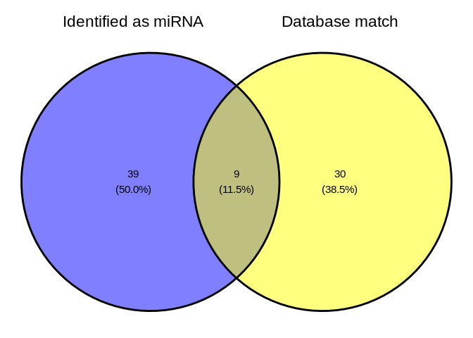

08-Peve-sRNA-discovery-ShortStack
================
Kathleen Durkin
2024-04-30

- <a href="#1-set-r-variables" id="toc-1-set-r-variables">1 Set R
  variables</a>
- <a href="#2-create-a-bash-variables-file"
  id="toc-2-create-a-bash-variables-file">2 Create a Bash variables
  file</a>
- <a href="#3-load-shortstack-conda-environment"
  id="toc-3-load-shortstack-conda-environment">3 Load ShortStack conda
  environment</a>
  - <a href="#31-pevermanni-genome" id="toc-31-pevermanni-genome">3.1
    P.evermanni genome</a>
  - <a href="#32-cnidarianmirbase-database"
    id="toc-32-cnidarianmirbase-database">3.2 Cnidarian+miRBase database</a>
  - <a href="#33-trimmed-srna-seq-reads"
    id="toc-33-trimmed-srna-seq-reads">3.3 Trimmed sRNA-seq reads</a>
- <a href="#4-run-shortstack" id="toc-4-run-shortstack">4 Run
  ShortStack</a>
  - <a href="#41-modify-genome-filename-for-shortstack-compatability"
    id="toc-41-modify-genome-filename-for-shortstack-compatability">4.1
    Modify genome filename for ShortStack compatability</a>
  - <a href="#42-excecute-shortstack-command"
    id="toc-42-excecute-shortstack-command">4.2 Excecute ShortStack
    command</a>
  - <a href="#43-check-runtime" id="toc-43-check-runtime">4.3 Check
    runtime</a>
- <a href="#5-results" id="toc-5-results">5 Results</a>
  - <a href="#51-shortstack-synopsis" id="toc-51-shortstack-synopsis">5.1
    ShortStack synopsis</a>
  - <a href="#52-inspect-resultstxt" id="toc-52-inspect-resultstxt">5.2
    Inspect <code>Results.txt</code></a>
    - <a href="#521-directory-tree-of-all-shortstack-outputs"
      id="toc-521-directory-tree-of-all-shortstack-outputs">5.2.1 Directory
      tree of all ShortStack outputs</a>
  - <a href="#53-visualize" id="toc-53-visualize">5.3 Visualize</a>
- <a href="#6-citations" id="toc-6-citations">6 Citations</a>

Use [ShortStack](https://github.com/MikeAxtell/ShortStack) ([Axtell
2013](#ref-axtell2013a); [Shahid and Axtell 2014](#ref-shahid2014);
[Johnson et al. 2016](#ref-johnson2016a))to perform alignment of sRNAseq
data and annotation of sRNA-producing genes.

sRNA discovery, using *P. evermanni* genome for reference, using
[ShortStack
4.1.0](https://github.com/MikeAxtell/ShortStack?tab=readme-ov-file#shortstack-version-4-major-changes),
which provides much faster analysis times *and* additional functionality
for visualizing miRNA hairpin structures and generating
genome-browser-ready quantitative coverage tracks of aligned small RNAs.

As in `deep-dive` and `deep-dive-expression`, we will also use a
customized miRBase database, utilizing cnidarian miRNAs curated by Jill
Ashley, which includes published cnidarian miRNAs:

- [`cnidarian-mirbase-mature-v22.1.fasta`](../../data/cnidarian-mirbase-mature-v22.1.fasta)

------------------------------------------------------------------------

Inputs:

- Requires trimmed sRNAseq files generated in
  `01.10-E-Peve-sRNAseq-trimming-fastp-FastQC-MultiQC`

  - Filenames formatted: `*fastp-adapters-polyG-31bp-merged.fq.gz`

- *P.evermanni* genome FastA. Not currently publicly available (still
  being annotated by collaborators)

Outputs:

- See [ShortStack outputs
  documentation](https://github.com/MikeAxtell/ShortStack#outputs) for
  full list and detailed descriptions.

Software requirements:

- Utilizes a
  [ShortStack](https://github.com/MikeAxtell/ShortStack#installation)
  Conda/Mamba environment, per the installation instructions.

Replace with name of your ShortStack environment and the path to the
corresponding conda installation (find this *after* you’ve activated the
environment).

E.g.

``` bash
# Activate environment
conda activate ShortStack4_env

# Find conda path
which conda
```

------------------------------------------------------------------------

# 1 Set R variables

``` r
shortstack_conda_env_name <- c("ShortStack-4.1.0_env")
shortstack_cond_path <- c("/home/sam/programs/mambaforge/condabin/conda")
```

# 2 Create a Bash variables file

This allows usage of Bash variables across R Markdown chunks.

``` bash
{
echo "#### Assign Variables ####"
echo ""

echo "# Trimmed FastQ naming pattern"
echo "export trimmed_fastqs_pattern='*fastp-adapters-polyG-31bp-merged.fq.gz'"

echo "# Data directories"
echo 'export timeseries_dir=/home/shared/8TB_HDD_02/shedurkin/timeseries_molecular'
echo 'export timeseries_data_dir="${timeseries_dir}/M-multi-species/data"'
echo 'export output_dir_top=${timeseries_dir}/E-Peve/output/08-Peve-sRNA-discovery-ShortStack'
echo ""

echo "# Input/Output files"
echo 'export genome_fasta_dir=${timeseries_dir}/E-Peve/data'
echo 'export genome_fasta_name="Porites_evermanni_v1.fa"'
echo 'export shortstack_genome_fasta_name="Porites_evermanni_v1.fa"'
echo 'export trimmed_fastqs_dir="${timeseries_dir}/E-Peve/output/01.10-E-Peve-sRNAseq-trimming-fastp-FastQC-MultiQC/trimmed-fastqs-sRNA"'

echo 'export mirbase_mature_fasta_version=cnidarian-mirbase-mature-v22.1.fasta'
echo 'export genome_fasta="${genome_fasta_dir}/${shortstack_genome_fasta_name}"'
echo ""

echo "# Set number of CPUs to use"
echo 'export threads=40'
echo ""

echo "# Initialize arrays"
echo 'export trimmed_fastqs_array=()'


} > .bashvars

cat .bashvars
```

    #### Assign Variables ####

    # Trimmed FastQ naming pattern
    export trimmed_fastqs_pattern='*fastp-adapters-polyG-31bp-merged.fq.gz'
    # Data directories
    export timeseries_dir=/home/shared/8TB_HDD_02/shedurkin/timeseries_molecular
    export timeseries_data_dir="${timeseries_dir}/M-multi-species/data"
    export output_dir_top=${timeseries_dir}/E-Peve/output/08-Peve-sRNA-discovery-ShortStack

    # Input/Output files
    export genome_fasta_dir=${timeseries_dir}/E-Peve/data
    export genome_fasta_name="Porites_evermanni_v1.fa"
    export shortstack_genome_fasta_name="Porites_evermanni_v1.fa"
    export trimmed_fastqs_dir="${timeseries_dir}/E-Peve/output/01.10-E-Peve-sRNAseq-trimming-fastp-FastQC-MultiQC/trimmed-fastqs-sRNA"
    export mirbase_mature_fasta_version=cnidarian-mirbase-mature-v22.1.fasta
    export genome_fasta="${genome_fasta_dir}/${shortstack_genome_fasta_name}"

    # Set number of CPUs to use
    export threads=40

    # Initialize arrays
    export trimmed_fastqs_array=()

# 3 Load [ShortStack](https://github.com/MikeAxtell/ShortStack) conda environment

If this is successful, the first line of output should show that the
Python being used is the one in your
$$ShortStack$$(<https://github.com/MikeAxtell/ShortStack> conda
environment path.

E.g.

`python:         /home/sam/programs/mambaforge/envs/mirmachine_env/bin/python`

``` r
use_condaenv(condaenv = shortstack_conda_env_name, conda = shortstack_cond_path)
py_config()
```

    python:         /home/sam/programs/mambaforge/envs/ShortStack-4.1.0_env/bin/python
    libpython:      /home/sam/programs/mambaforge/envs/ShortStack-4.1.0_env/lib/libpython3.12.so
    pythonhome:     /home/sam/programs/mambaforge/envs/ShortStack-4.1.0_env:/home/sam/programs/mambaforge/envs/ShortStack-4.1.0_env
    version:        3.12.7 | packaged by conda-forge | (main, Oct  4 2024, 16:05:46) [GCC 13.3.0]
    numpy:          /home/sam/programs/mambaforge/envs/ShortStack-4.1.0_env/lib/python3.12/site-packages/numpy
    numpy_version:  2.1.1

    NOTE: Python version was forced by use_python() function

Note: I sometimes get an error “failed to initialize requested version
of Python,” which seems to stem from the `reticulate` package default
loading a python environment. I’ve been able to fix this by manually
uninstalling the `reticulate` package, then restarting R and
reinstalling `reticulate` before rerunning this code document. \#
Download reference files

## 3.1 P.evermanni genome

``` bash
# Load bash variables into memory
source .bashvars

wget -O ${genome_fasta_dir}/${shortstack_genome_fasta_name} "https://gannet.fish.washington.edu/seashell/snaps/Porites_evermanni_v1.fa"
```

## 3.2 Cnidarian+miRBase database

Available in `deep-dive` repo,
[here](https://github.com/urol-e5/deep-dive/blob/main/data/cnidarian-mirbase-mature-v22.1.fasta)

``` bash
# Load bash variables into memory
source .bashvars

wget -O ${timeseries_data_dir}/"${mirbase_mature_fasta_version}" "https://raw.githubusercontent.com/urol-e5/deep-dive/refs/heads/main/data/cnidarian-mirbase-mature-v22.1.fasta"
```

``` bash
# Load bash variables into memory
source .bashvars

head -5 ${timeseries_data_dir}/"${mirbase_mature_fasta_version}"
```

    >cel-let-7-5p MIMAT0000001 Caenorhabditis elegans let-7-5p
    UGAGGUAGUAGGUUGUAUAGUU
    >cel-let-7-3p MIMAT0015091 Caenorhabditis elegans let-7-3p
    CUAUGCAAUUUUCUACCUUACC
    >cel-lin-4-5p MIMAT0000002 Caenorhabditis elegans lin-4-5p

## 3.3 Trimmed sRNA-seq reads

Trimmed in `01.10-E-Peve-sRNAseq-trimming-fastp-FastQC-MultiQC`

# 4 Run ShortStack

## 4.1 Modify genome filename for ShortStack compatability

``` bash
# Load bash variables into memory
source .bashvars

# Check for FastA file first
# Then create rename file if doesn't exist
if [ -f "${genome_fasta_dir}/${shortstack_genome_fasta_name}" ]; then
  echo "${genome_fasta_dir}/${shortstack_genome_fasta_name}"
  echo ""
  echo "Already exists. Nothing to do."
  echo ""
else

  # Copy genome FastA to ShortStack-compatible filename (ending with .fa)
  cp ${genome_fasta_dir}/${genome_fasta_name} ${genome_fasta_dir}/${shortstack_genome_fasta_name}
fi

# Confirm
ls -lh ${genome_fasta_dir}/${shortstack_genome_fasta_name}
```

    /home/shared/8TB_HDD_02/shedurkin/timeseries_molecular/E-Peve/data/Porites_evermanni_v1.fa

    Already exists. Nothing to do.

    -rw-r--r-- 1 shedurkin labmembers 586M Jun 30  2023 /home/shared/8TB_HDD_02/shedurkin/timeseries_molecular/E-Peve/data/Porites_evermanni_v1.fa

## 4.2 Excecute ShortStack command

Uses the `--dn_mirna` option to identify miRNAs in the genome, without
relying on the `--known_miRNAs`.

This part of the code redirects the output of `time` to the end of
`shortstack.log` file.

- `; } \ 2>> ${output_dir_top}/shortstack.log`

``` bash
# Load bash variables into memory
source .bashvars

# Make output directory, if it doesn't exist
mkdir --parents "${output_dir_top}"

# Create array of trimmed FastQs
trimmed_fastqs_array=(${trimmed_fastqs_dir}/${trimmed_fastqs_pattern})


# Pass array contents to new variable as space-delimited list
trimmed_fastqs_list=$(echo "${trimmed_fastqs_array[*]}")


###### Run ShortStack ######
{ time \
ShortStack \
--genomefile "${genome_fasta}" \
--readfile ${trimmed_fastqs_list} \
--known_miRNAs ${timeseries_data_dir}/${mirbase_mature_fasta_version} \
--dn_mirna \
--threads ${threads} \
--outdir ${output_dir_top}/ShortStack_out \
&> ${output_dir_top}/shortstack.log ; } \
2>> ${output_dir_top}/shortstack.log
```

## 4.3 Check runtime

``` bash
# Load bash variables into memory
source .bashvars

tail -n 3 ${output_dir_top}/shortstack.log \
| grep "real" \
| awk '{print "ShortStack runtime:" "\t" $2}'
```

    ShortStack runtime: 88m46.039s

# 5 Results

## 5.1 ShortStack synopsis

``` bash
# Load bash variables into memory
source .bashvars

tail -n 25 ${output_dir_top}/shortstack.log
```

    Writing final files

    Found a total of 48 MIRNA loci


    Non-MIRNA loci by DicerCall:
    N 15578
    23 25
    22 18
    24 18
    21 16

    Creating visualizations of microRNA loci with strucVis
    <<< WARNING >>>
    Do not rely on these results alone to annotate new MIRNA loci!
    The false positive rate for de novo MIRNA identification is low, but NOT ZERO
    Insepct each mirna locus, especially the strucVis output, and see
    https://doi.org/10.1105/tpc.17.00851 , https://doi.org/10.1093/nar/gky1141

    Wed 30 Apr 2025 21:07:51 -0700 PDT
    Run Completed!

    real    88m46.039s
    user    718m8.580s
    sys 217m50.551s

ShortStack identified 48 miRNAs among all of the P.evermanni samples.
This is a slightly larger number than the 45 miRNAs identified in
`deep-dive-expression`, which examined only 5 colonies from a single
time point! I would guess the difference stems from either (a) our
capture of more intraspecific diversity, or (b) different miRNA profiles
associated with different environmental conditions (i.e. some
P.evermanni miRNAs are only expressed under certain conditions). The
counts data should give us more insight.

## 5.2 Inspect `Results.txt`

``` bash
# Load bash variables into memory
source .bashvars

head ${output_dir_top}/ShortStack_out/Results.txt

echo ""
echo "----------------------------------------------------------"
echo ""

echo "Nummber of potential loci:"
awk '(NR>1)' ${output_dir_top}/ShortStack_out/Results.txt | wc -l
```

    Locus   Name    Chrom   Start   End Length  Reads   DistinctSequences   FracTop Strand  MajorRNA    MajorRNAReads   Short   Long    21  22  23  24  DicerCall   MIRNA   known_miRNAs
    Porites_evermani_scaffold_1:406125-406734   Cluster_1   Porites_evermani_scaffold_1 406125  406734  610 3699    871 0.02    -   UGAGUGUAUUCUUGAACUGUUUUCCAACC   556 23  3570    11  24  29  42  N   N   NA
    Porites_evermani_scaffold_1:409836-410269   Cluster_2   Porites_evermani_scaffold_1 409836  410269  434 2558    364 0.005   -   UGGAACUCCGAUUUAGAACUUGCAAACUUU  717 3   2506    12  7   9   21  N   N   NA
    Porites_evermani_scaffold_1:465240-465668   Cluster_3   Porites_evermani_scaffold_1 465240  465668  429 768 139 0.0 -   AAGUUGCUCUGAAGAUUAUGUGCAUCGCAUC 187 52  566 40  14  84  12  N   N   NA
    Porites_evermani_scaffold_1:468473-468950   Cluster_4   Porites_evermani_scaffold_1 468473  468950  478 269818  1968    0.0 -   AGCACUGAUGACUGUUCAGUUUUUCUGAAUU 180473  8927    255533  692 933 1153    2580    N   N   NA
    Porites_evermani_scaffold_1:486441-486868   Cluster_5   Porites_evermani_scaffold_1 486441  486868  428 414 30  0.002   -   AUAUUGACGAAUCCUGGCCUAGUGAACC    200 7   405 0   0   2   0   N   N   NA
    Porites_evermani_scaffold_1:534428-534853   Cluster_6   Porites_evermani_scaffold_1 534428  534853  426 972 186 0.002   -   GAGACGUAAACUUAUAGCUUUGGCU   289 49  746 63  30  37  47  N   N   NA
    Porites_evermani_scaffold_1:624380-624808   Cluster_7   Porites_evermani_scaffold_1 624380  624808  429 321 7   0.0 -   UGGAGCAAUAUCAAUAUGUAGAACGUUUUC  282 0   321 0   0   0   0   N   N   NA
    Porites_evermani_scaffold_1:729098-729587   Cluster_8   Porites_evermani_scaffold_1 729098  729587  490 10502   732 0.0 -   CUUAGUGACAAGCCAGAACUGUCUGACCACA 2507    883 7425    439 609 623 523 N   N   NA
    Porites_evermani_scaffold_1:729922-730414   Cluster_9   Porites_evermani_scaffold_1 729922  730414  493 9747    746 0.002   -   CCUUGGAUGUCUGACUGGU 1432    6238    1413    509 815 455 317 N   N   NA

    ----------------------------------------------------------

    Nummber of potential loci:
    15703

Column 20 of the `Results.txt` file identifies if a cluster is a miRNA
or not (`Y` or `N`).

``` bash
# Load bash variables into memory
source .bashvars

echo "Number of loci characterized as miRNA:"
awk '$20=="Y" {print $0}' ${output_dir_top}/ShortStack_out/Results.txt \
| wc -l
echo ""

echo "----------------------------------------------------------"

echo ""
echo "Number of loci _not_ characterized as miRNA:"
awk '$20=="N" {print $0}' ${output_dir_top}/ShortStack_out/Results.txt \
| wc -l
```

    Number of loci characterized as miRNA:
    48

    ----------------------------------------------------------

    Number of loci _not_ characterized as miRNA:
    15655

Column 21 of the `Results.txt` file identifies if a cluster aligned to a
known miRNA (miRBase) or not (`Y` or `NA`).

``` bash
# Load bash variables into memory
source .bashvars

echo "Number of loci matching miRBase miRNAs:"
awk '$21!="NA" {print $0}' ${output_dir_top}/ShortStack_out/Results.txt \
| wc -l
echo ""

echo "----------------------------------------------------------"

echo ""
echo "Number of loci _not_ matching miRBase miRNAs:"
awk '$21=="NA" {print $0}' ${output_dir_top}/ShortStack_out/Results.txt \
| wc -l
```

    Number of loci matching miRBase miRNAs:
    40

    ----------------------------------------------------------

    Number of loci _not_ matching miRBase miRNAs:
    15664

### 5.2.1 Directory tree of all ShortStack outputs

Many of these are large (by GitHub standards) BAM files, so will not be
added to the repo.

Additionally, it’s unlikely we’ll utilize most of the other files
(bigwig) generated by ShortStack.

``` bash
# Load bash variables into memory
source .bashvars

tree -h ${output_dir_top}/
```

    /home/shared/8TB_HDD_02/shedurkin/timeseries_molecular/E-Peve/output/08-Peve-sRNA-discovery-ShortStack/
    ├── [4.0K]  figures
    │   └── [199K]  Peve_ShortStack_venn.png
    ├── [ 48K]  shortstack.log
    └── [244K]  ShortStack_out
        ├── [ 14M]  1A11-fastp-adapters-polyG-31bp-merged_condensed.bam
        ├── [196K]  1A11-fastp-adapters-polyG-31bp-merged_condensed.bam.csi
        ├── [ 43M]  1A11-fastp-adapters-polyG-31bp-merged_condensed.fa
        ├── [ 24M]  1A7-fastp-adapters-polyG-31bp-merged_condensed.bam
        ├── [254K]  1A7-fastp-adapters-polyG-31bp-merged_condensed.bam.csi
        ├── [ 74M]  1A7-fastp-adapters-polyG-31bp-merged_condensed.fa
        ├── [123K]  1B3-fastp-adapters-polyG-31bp-merged_condensed.bam
        ├── [ 11K]  1B3-fastp-adapters-polyG-31bp-merged_condensed.bam.csi
        ├── [161K]  1B3-fastp-adapters-polyG-31bp-merged_condensed.fa
        ├── [ 59M]  1B4-fastp-adapters-polyG-31bp-merged_condensed.bam
        ├── [276K]  1B4-fastp-adapters-polyG-31bp-merged_condensed.bam.csi
        ├── [239M]  1B4-fastp-adapters-polyG-31bp-merged_condensed.fa
        ├── [9.1M]  1B6-fastp-adapters-polyG-31bp-merged_condensed.bam
        ├── [211K]  1B6-fastp-adapters-polyG-31bp-merged_condensed.bam.csi
        ├── [ 29M]  1B6-fastp-adapters-polyG-31bp-merged_condensed.fa
        ├── [678K]  1B7-fastp-adapters-polyG-31bp-merged_condensed.bam
        ├── [ 60K]  1B7-fastp-adapters-polyG-31bp-merged_condensed.bam.csi
        ├── [1.5M]  1B7-fastp-adapters-polyG-31bp-merged_condensed.fa
        ├── [ 72K]  1C11-fastp-adapters-polyG-31bp-merged_condensed.bam
        ├── [1.4K]  1C11-fastp-adapters-polyG-31bp-merged_condensed.bam.csi
        ├── [ 17K]  1C11-fastp-adapters-polyG-31bp-merged_condensed.fa
        ├── [10.0M]  1C12-fastp-adapters-polyG-31bp-merged_condensed.bam
        ├── [167K]  1C12-fastp-adapters-polyG-31bp-merged_condensed.bam.csi
        ├── [ 35M]  1C12-fastp-adapters-polyG-31bp-merged_condensed.fa
        ├── [ 67M]  1C5-fastp-adapters-polyG-31bp-merged_condensed.bam
        ├── [288K]  1C5-fastp-adapters-polyG-31bp-merged_condensed.bam.csi
        ├── [224M]  1C5-fastp-adapters-polyG-31bp-merged_condensed.fa
        ├── [341K]  1C6-fastp-adapters-polyG-31bp-merged_condensed.bam
        ├── [ 34K]  1C6-fastp-adapters-polyG-31bp-merged_condensed.bam.csi
        ├── [760K]  1C6-fastp-adapters-polyG-31bp-merged_condensed.fa
        ├── [913K]  1D12-fastp-adapters-polyG-31bp-merged_condensed.bam
        ├── [ 69K]  1D12-fastp-adapters-polyG-31bp-merged_condensed.bam.csi
        ├── [2.1M]  1D12-fastp-adapters-polyG-31bp-merged_condensed.fa
        ├── [ 23M]  1D1-fastp-adapters-polyG-31bp-merged_condensed.bam
        ├── [264K]  1D1-fastp-adapters-polyG-31bp-merged_condensed.bam.csi
        ├── [ 92M]  1D1-fastp-adapters-polyG-31bp-merged_condensed.fa
        ├── [ 91M]  1D2-fastp-adapters-polyG-31bp-merged_condensed.bam
        ├── [289K]  1D2-fastp-adapters-polyG-31bp-merged_condensed.bam.csi
        ├── [313M]  1D2-fastp-adapters-polyG-31bp-merged_condensed.fa
        ├── [ 53M]  1D5-fastp-adapters-polyG-31bp-merged_condensed.bam
        ├── [287K]  1D5-fastp-adapters-polyG-31bp-merged_condensed.bam.csi
        ├── [180M]  1D5-fastp-adapters-polyG-31bp-merged_condensed.fa
        ├── [ 29M]  1D7-fastp-adapters-polyG-31bp-merged_condensed.bam
        ├── [263K]  1D7-fastp-adapters-polyG-31bp-merged_condensed.bam.csi
        ├── [ 88M]  1D7-fastp-adapters-polyG-31bp-merged_condensed.fa
        ├── [763K]  1E7-fastp-adapters-polyG-31bp-merged_condensed.bam
        ├── [ 63K]  1E7-fastp-adapters-polyG-31bp-merged_condensed.bam.csi
        ├── [1.7M]  1E7-fastp-adapters-polyG-31bp-merged_condensed.fa
        ├── [ 22M]  1F10-fastp-adapters-polyG-31bp-merged_condensed.bam
        ├── [210K]  1F10-fastp-adapters-polyG-31bp-merged_condensed.bam.csi
        ├── [ 71M]  1F10-fastp-adapters-polyG-31bp-merged_condensed.fa
        ├── [ 91M]  1F12-fastp-adapters-polyG-31bp-merged_condensed.bam
        ├── [295K]  1F12-fastp-adapters-polyG-31bp-merged_condensed.bam.csi
        ├── [321M]  1F12-fastp-adapters-polyG-31bp-merged_condensed.fa
        ├── [1.8M]  1F1-fastp-adapters-polyG-31bp-merged_condensed.bam
        ├── [ 97K]  1F1-fastp-adapters-polyG-31bp-merged_condensed.bam.csi
        ├── [4.8M]  1F1-fastp-adapters-polyG-31bp-merged_condensed.fa
        ├── [ 54M]  1F3-fastp-adapters-polyG-31bp-merged_condensed.bam
        ├── [291K]  1F3-fastp-adapters-polyG-31bp-merged_condensed.bam.csi
        ├── [166M]  1F3-fastp-adapters-polyG-31bp-merged_condensed.fa
        ├── [ 55M]  1F6-fastp-adapters-polyG-31bp-merged_condensed.bam
        ├── [279K]  1F6-fastp-adapters-polyG-31bp-merged_condensed.bam.csi
        ├── [178M]  1F6-fastp-adapters-polyG-31bp-merged_condensed.fa
        ├── [6.9M]  1F7-fastp-adapters-polyG-31bp-merged_condensed.bam
        ├── [192K]  1F7-fastp-adapters-polyG-31bp-merged_condensed.bam.csi
        ├── [ 20M]  1F7-fastp-adapters-polyG-31bp-merged_condensed.fa
        ├── [ 43M]  1G10-fastp-adapters-polyG-31bp-merged_condensed.bam
        ├── [280K]  1G10-fastp-adapters-polyG-31bp-merged_condensed.bam.csi
        ├── [153M]  1G10-fastp-adapters-polyG-31bp-merged_condensed.fa
        ├── [ 93M]  1G1-fastp-adapters-polyG-31bp-merged_condensed.bam
        ├── [294K]  1G1-fastp-adapters-polyG-31bp-merged_condensed.bam.csi
        ├── [320M]  1G1-fastp-adapters-polyG-31bp-merged_condensed.fa
        ├── [4.1M]  1G3-fastp-adapters-polyG-31bp-merged_condensed.bam
        ├── [164K]  1G3-fastp-adapters-polyG-31bp-merged_condensed.bam.csi
        ├── [ 11M]  1G3-fastp-adapters-polyG-31bp-merged_condensed.fa
        ├── [7.1M]  1H1-fastp-adapters-polyG-31bp-merged_condensed.bam
        ├── [205K]  1H1-fastp-adapters-polyG-31bp-merged_condensed.bam.csi
        ├── [ 20M]  1H1-fastp-adapters-polyG-31bp-merged_condensed.fa
        ├── [2.6M]  1H2-fastp-adapters-polyG-31bp-merged_condensed.bam
        ├── [118K]  1H2-fastp-adapters-polyG-31bp-merged_condensed.bam.csi
        ├── [6.7M]  1H2-fastp-adapters-polyG-31bp-merged_condensed.fa
        ├── [2.9M]  1H3-fastp-adapters-polyG-31bp-merged_condensed.bam
        ├── [140K]  1H3-fastp-adapters-polyG-31bp-merged_condensed.bam.csi
        ├── [7.6M]  1H3-fastp-adapters-polyG-31bp-merged_condensed.fa
        ├── [683K]  2A3-fastp-adapters-polyG-31bp-merged_condensed.bam
        ├── [ 51K]  2A3-fastp-adapters-polyG-31bp-merged_condensed.bam.csi
        ├── [2.4M]  2A3-fastp-adapters-polyG-31bp-merged_condensed.fa
        ├── [ 54M]  2B1-fastp-adapters-polyG-31bp-merged_condensed.bam
        ├── [280K]  2B1-fastp-adapters-polyG-31bp-merged_condensed.bam.csi
        ├── [188M]  2B1-fastp-adapters-polyG-31bp-merged_condensed.fa
        ├── [ 26M]  2D1-fastp-adapters-polyG-31bp-merged_condensed.bam
        ├── [272K]  2D1-fastp-adapters-polyG-31bp-merged_condensed.bam.csi
        ├── [ 74M]  2D1-fastp-adapters-polyG-31bp-merged_condensed.fa
        ├── [645K]  2D3-fastp-adapters-polyG-31bp-merged_condensed.bam
        ├── [ 48K]  2D3-fastp-adapters-polyG-31bp-merged_condensed.bam.csi
        ├── [2.3M]  2D3-fastp-adapters-polyG-31bp-merged_condensed.fa
        ├── [ 18M]  2E1-fastp-adapters-polyG-31bp-merged_condensed.bam
        ├── [271K]  2E1-fastp-adapters-polyG-31bp-merged_condensed.bam.csi
        ├── [ 42M]  2E1-fastp-adapters-polyG-31bp-merged_condensed.fa
        ├── [ 68K]  2E3-fastp-adapters-polyG-31bp-merged_condensed.bam
        ├── [ 479]  2E3-fastp-adapters-polyG-31bp-merged_condensed.bam.csi
        ├── [5.8K]  2E3-fastp-adapters-polyG-31bp-merged_condensed.fa
        ├── [708K]  2F2-fastp-adapters-polyG-31bp-merged_condensed.bam
        ├── [ 60K]  2F2-fastp-adapters-polyG-31bp-merged_condensed.bam.csi
        ├── [1.9M]  2F2-fastp-adapters-polyG-31bp-merged_condensed.fa
        ├── [119K]  2H1-fastp-adapters-polyG-31bp-merged_condensed.bam
        ├── [4.6K]  2H1-fastp-adapters-polyG-31bp-merged_condensed.bam.csi
        ├── [209K]  2H1-fastp-adapters-polyG-31bp-merged_condensed.fa
        ├── [ 42M]  2H2-fastp-adapters-polyG-31bp-merged_condensed.bam
        ├── [279K]  2H2-fastp-adapters-polyG-31bp-merged_condensed.bam.csi
        ├── [132M]  2H2-fastp-adapters-polyG-31bp-merged_condensed.fa
        ├── [200K]  alignment_details.tsv
        ├── [2.3M]  Counts.txt
        ├── [212K]  known_miRNAs.gff3
        ├── [1.8M]  known_miRNAs_unaligned.fasta
        ├── [859M]  merged_alignments.bam
        ├── [312K]  merged_alignments.bam.csi
        ├── [ 16K]  mir.fasta
        ├── [1.8M]  Results.gff3
        ├── [2.7M]  Results.txt
        └── [4.0K]  strucVis
            ├── [ 12K]  Cluster_1004.ps.pdf
            ├── [103K]  Cluster_1004.txt
            ├── [8.7K]  Cluster_10059.ps.pdf
            ├── [ 29K]  Cluster_10059.txt
            ├── [ 10K]  Cluster_10229.ps.pdf
            ├── [ 79K]  Cluster_10229.txt
            ├── [9.9K]  Cluster_11004.ps.pdf
            ├── [ 26K]  Cluster_11004.txt
            ├── [8.2K]  Cluster_11615.ps.pdf
            ├── [6.0K]  Cluster_11615.txt
            ├── [8.0K]  Cluster_13926.ps.pdf
            ├── [5.2K]  Cluster_13926.txt
            ├── [ 10K]  Cluster_14602.ps.pdf
            ├── [ 11K]  Cluster_14602.txt
            ├── [ 10K]  Cluster_14747.ps.pdf
            ├── [ 25K]  Cluster_14747.txt
            ├── [ 10K]  Cluster_15329.ps.pdf
            ├── [ 21K]  Cluster_15329.txt
            ├── [9.8K]  Cluster_2392.ps.pdf
            ├── [ 35K]  Cluster_2392.txt
            ├── [10.0K]  Cluster_2454.ps.pdf
            ├── [ 11K]  Cluster_2454.txt
            ├── [ 10K]  Cluster_2478.ps.pdf
            ├── [ 32K]  Cluster_2478.txt
            ├── [8.8K]  Cluster_27.ps.pdf
            ├── [ 58K]  Cluster_27.txt
            ├── [ 10K]  Cluster_3165.ps.pdf
            ├── [ 16K]  Cluster_3165.txt
            ├── [ 10K]  Cluster_3380.ps.pdf
            ├── [ 24K]  Cluster_3380.txt
            ├── [9.7K]  Cluster_3652.ps.pdf
            ├── [111K]  Cluster_3652.txt
            ├── [ 10K]  Cluster_3653.ps.pdf
            ├── [ 90K]  Cluster_3653.txt
            ├── [9.1K]  Cluster_3672.ps.pdf
            ├── [ 36K]  Cluster_3672.txt
            ├── [ 10K]  Cluster_3676.ps.pdf
            ├── [ 71K]  Cluster_3676.txt
            ├── [ 10K]  Cluster_4160.ps.pdf
            ├── [ 30K]  Cluster_4160.txt
            ├── [ 11K]  Cluster_4161.ps.pdf
            ├── [ 14K]  Cluster_4161.txt
            ├── [8.9K]  Cluster_4229.ps.pdf
            ├── [ 24K]  Cluster_4229.txt
            ├── [ 10K]  Cluster_4247.ps.pdf
            ├── [ 26K]  Cluster_4247.txt
            ├── [ 11K]  Cluster_491.ps.pdf
            ├── [ 33K]  Cluster_491.txt
            ├── [8.9K]  Cluster_4968.ps.pdf
            ├── [ 30K]  Cluster_4968.txt
            ├── [8.7K]  Cluster_5058.ps.pdf
            ├── [8.4K]  Cluster_5058.txt
            ├── [ 10K]  Cluster_5257.ps.pdf
            ├── [ 17K]  Cluster_5257.txt
            ├── [ 11K]  Cluster_5613.ps.pdf
            ├── [ 10K]  Cluster_5613.txt
            ├── [8.7K]  Cluster_6099.ps.pdf
            ├── [ 22K]  Cluster_6099.txt
            ├── [ 11K]  Cluster_6234.ps.pdf
            ├── [ 31K]  Cluster_6234.txt
            ├── [9.5K]  Cluster_6235.ps.pdf
            ├── [ 26K]  Cluster_6235.txt
            ├── [10.0K]  Cluster_6236.ps.pdf
            ├── [ 30K]  Cluster_6236.txt
            ├── [ 11K]  Cluster_6242.ps.pdf
            ├── [ 91K]  Cluster_6242.txt
            ├── [ 11K]  Cluster_6356.ps.pdf
            ├── [ 16K]  Cluster_6356.txt
            ├── [ 10K]  Cluster_661.ps.pdf
            ├── [114K]  Cluster_661.txt
            ├── [9.0K]  Cluster_670.ps.pdf
            ├── [6.9K]  Cluster_670.txt
            ├── [ 10K]  Cluster_6918.ps.pdf
            ├── [ 33K]  Cluster_6918.txt
            ├── [8.9K]  Cluster_6919.ps.pdf
            ├── [ 31K]  Cluster_6919.txt
            ├── [9.5K]  Cluster_7882.ps.pdf
            ├── [ 14K]  Cluster_7882.txt
            ├── [ 10K]  Cluster_8071.ps.pdf
            ├── [ 63K]  Cluster_8071.txt
            ├── [7.5K]  Cluster_8074.ps.pdf
            ├── [ 12K]  Cluster_8074.txt
            ├── [ 10K]  Cluster_8075.ps.pdf
            ├── [ 27K]  Cluster_8075.txt
            ├── [8.9K]  Cluster_8147.ps.pdf
            ├── [ 93K]  Cluster_8147.txt
            ├── [9.5K]  Cluster_9149.ps.pdf
            ├── [ 17K]  Cluster_9149.txt
            ├── [ 11K]  Cluster_9196.ps.pdf
            ├── [ 44K]  Cluster_9196.txt
            ├── [9.2K]  Cluster_9197.ps.pdf
            ├── [ 35K]  Cluster_9197.txt
            ├── [8.6K]  Cluster_9535.ps.pdf
            ├── [5.4K]  Cluster_9535.txt
            ├── [ 11K]  Cluster_981.ps.pdf
            └── [ 32K]  Cluster_981.txt

    3 directories, 218 files

## 5.3 Visualize

We noticed that a) not all of the identified miRNAs have database
matches, and b) some reads have a match in the database but are *not*
classified as miRNAs. Let’s look at this in more depth.

``` r
Peve_shortstack_results <- read.csv("../output/08-Peve-sRNA-discovery-ShortStack/ShortStack_out/Results.txt", sep="\t")
```

``` r
# Make list
mirnas <- Peve_shortstack_results %>% filter(MIRNA == "Y") %>% pull(Locus)
matches <- Peve_shortstack_results %>% filter(!is.na(known_miRNAs)) %>% pull(Locus)

Peve_shortstack_vennlist <- list(
  "Identified as miRNA" = mirnas,
  "Database match" = matches
)

# Make venn diagrams
ggvenn(Peve_shortstack_vennlist)
```

<!-- -->

``` r
ggsave("../output/08-Peve-sRNA-discovery-ShortStack/figures/Peve_ShortStack_venn.png", width = 12, height = 7, units = "in")
```

------------------------------------------------------------------------

# 6 Citations

<div id="refs" class="references csl-bib-body hanging-indent">

<div id="ref-axtell2013a" class="csl-entry">

Axtell, Michael J. 2013. “ShortStack: Comprehensive Annotation and
Quantification of Small RNA Genes.” *RNA* 19 (6): 740–51.
<https://doi.org/10.1261/rna.035279.112>.

</div>

<div id="ref-johnson2016a" class="csl-entry">

Johnson, Nathan R, Jonathan M Yeoh, Ceyda Coruh, and Michael J Axtell.
2016. “Improved Placement of Multi-Mapping Small RNAs.” *G3
Genes\|Genomes\|Genetics* 6 (7): 2103–11.
<https://doi.org/10.1534/g3.116.030452>.

</div>

<div id="ref-shahid2014" class="csl-entry">

Shahid, Saima, and Michael J. Axtell. 2014. “Identification and
Annotation of Small RNA Genes Using ShortStack.” *Methods* 67 (1):
20–27. <https://doi.org/10.1016/j.ymeth.2013.10.004>.

</div>

</div>
