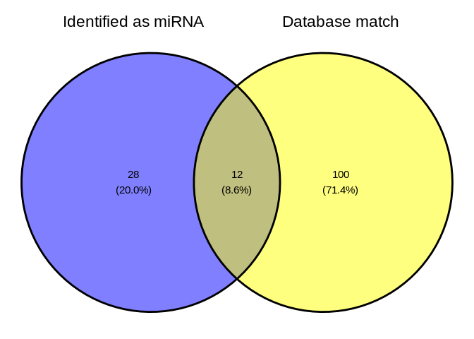

04-Ptua-sRNA-discovery-ShortStack
================
Kathleen Durkin
2024-04-30

- <a href="#1-set-r-variables" id="toc-1-set-r-variables">1 Set R
  variables</a>
- <a href="#2-create-a-bash-variables-file"
  id="toc-2-create-a-bash-variables-file">2 Create a Bash variables
  file</a>
- <a href="#3-load-shortstack-conda-environment"
  id="toc-3-load-shortstack-conda-environment">3 Load ShortStack conda
  environment</a>
- <a href="#4-download-reference-files"
  id="toc-4-download-reference-files">4 Download reference files</a>
  - <a href="#41-pmeandrina-genome" id="toc-41-pmeandrina-genome">4.1
    P.meandrina genome</a>
  - <a href="#42-cnidarianmirbase-database"
    id="toc-42-cnidarianmirbase-database">4.2 Cnidarian+miRBase database</a>
  - <a href="#43-trimmed-srna-seq-reads"
    id="toc-43-trimmed-srna-seq-reads">4.3 Trimmed sRNA-seq reads</a>
- <a href="#5-run-shortstack" id="toc-5-run-shortstack">5 Run
  ShortStack</a>
  - <a href="#51-modify-genome-filename-for-shortstack-compatability"
    id="toc-51-modify-genome-filename-for-shortstack-compatability">5.1
    Modify genome filename for ShortStack compatability</a>
  - <a href="#52-excecute-shortstack-command"
    id="toc-52-excecute-shortstack-command">5.2 Excecute ShortStack
    command</a>
  - <a href="#53-check-runtime" id="toc-53-check-runtime">5.3 Check
    runtime</a>
- <a href="#6-results" id="toc-6-results">6 Results</a>
  - <a href="#61-shortstack-synopsis" id="toc-61-shortstack-synopsis">6.1
    ShortStack synopsis</a>
  - <a href="#62-inspect-resultstxt" id="toc-62-inspect-resultstxt">6.2
    Inspect <code>Results.txt</code></a>
    - <a href="#621-directory-tree-of-all-shortstack-outputs"
      id="toc-621-directory-tree-of-all-shortstack-outputs">6.2.1 Directory
      tree of all ShortStack outputs</a>
  - <a href="#63-visualize" id="toc-63-visualize">6.3 Visualize</a>
- <a href="#7-citations" id="toc-7-citations">7 Citations</a>

Use [ShortStack](https://github.com/MikeAxtell/ShortStack) ([Axtell
2013](#ref-axtell2013a); [Shahid and Axtell 2014](#ref-shahid2014);
[Johnson et al. 2016](#ref-johnson2016a))to perform alignment of sRNAseq
data and annotation of sRNA-producing genes.

sRNA discovery, using *P. meandrina* genome for reference, using
[ShortStack
4.1.0](https://github.com/MikeAxtell/ShortStack?tab=readme-ov-file#shortstack-version-4-major-changes),
which provides much faster analysis times *and* additional functionality
for visualizing miRNA hairpin structures and generating
genome-browser-ready quantitative coverage tracks of aligned small RNAs.

As in `deep-dive` and `deep-dive-expression`, we will also use a
customized miRBase database, utilizing cnidarian miRNAs curated by Jill
Ashley, which includes published cnidarian miRNAs:

- [`cnidarian-mirbase-mature-v22.1.fasta`](../../data/cnidarian-mirbase-mature-v22.1.fasta)

------------------------------------------------------------------------

Inputs:

- Requires trimmed sRNAseq files generated in
  `01.10-F-Ptua-sRNAseq-trimming-fastp-FastQC-MultiQC`

  - Filenames formatted: `*fastp-adapters-polyG-31bp-merged.fq.gz`

- *P.meandrina* genome FastA.
  `Pocillopora_meandrina_HIv1.assembly.fasta` file. The genome FastA was
  taken from the [Cyanophora
  webpage](http://cyanophora.rutgers.edu/Pocillopora_meandrina/). Stored
  at
  <https://owl.fish.washington.edu/halfshell/genomic-databank/Pocillopora_meandrina_HIv1.assembly.fasta>

Outputs:

- See [ShortStack outputs
  documentation](https://github.com/MikeAxtell/ShortStack#outputs) for
  full list and detailed descriptions.

Software requirements:

- Utilizes a
  [ShortStack](https://github.com/MikeAxtell/ShortStack#installation)
  Conda/Mamba environment, per the installation instructions.

Replace with name of your ShortStack environment and the path to the
corresponding conda installation (find this *after* you’ve activated the
environment).

E.g.

``` bash
# Activate environment
conda activate ShortStack4_env

# Find conda path
which conda
```

------------------------------------------------------------------------

# 1 Set R variables

``` r
shortstack_conda_env_name <- c("ShortStack-4.1.0_env")
shortstack_cond_path <- c("/home/sam/programs/mambaforge/condabin/conda")
```

# 2 Create a Bash variables file

This allows usage of Bash variables across R Markdown chunks.

``` bash
{
echo "#### Assign Variables ####"
echo ""

echo "# Trimmed FastQ naming pattern"
echo "export trimmed_fastqs_pattern='*fastp-adapters-polyG-31bp-merged.fq.gz'"

echo "# Data directories"
echo 'export timeseries_dir=/home/shared/8TB_HDD_02/shedurkin/timeseries_molecular'
echo 'export timeseries_data_dir="${timeseries_dir}/M-multi-species/data"'
echo 'export output_dir_top=${timeseries_dir}/F-Ptua/output/04-Ptua-sRNA-discovery-ShortStack'
echo ""

echo "# Input/Output files"
echo 'export genome_fasta_dir=${timeseries_dir}/F-Ptua/data'
echo 'export genome_fasta_name="Pocillopora_meandrina_HIv1.assembly.fasta"'
echo 'export shortstack_genome_fasta_name="Pocillopora_meandrina_HIv1.assembly.fa"'
echo 'export trimmed_fastqs_dir="${timeseries_dir}/F-Ptua/output/01.10-F-Ptua-sRNAseq-trimming-fastp-FastQC-MultiQC/trimmed-fastqs-sRNA"'

echo 'export mirbase_mature_fasta_version=cnidarian-mirbase-mature-v22.1.fasta'
echo 'export genome_fasta="${genome_fasta_dir}/${shortstack_genome_fasta_name}"'
echo ""

echo "# Set number of CPUs to use"
echo 'export threads=40'
echo ""

echo "# Initialize arrays"
echo 'export trimmed_fastqs_array=()'


} > .bashvars

cat .bashvars
```

    #### Assign Variables ####

    # Trimmed FastQ naming pattern
    export trimmed_fastqs_pattern='*fastp-adapters-polyG-31bp-merged.fq.gz'
    # Data directories
    export timeseries_dir=/home/shared/8TB_HDD_02/shedurkin/timeseries_molecular
    export timeseries_data_dir="${timeseries_dir}/M-multi-species/data"
    export output_dir_top=${timeseries_dir}/F-Ptua/output/04-Ptua-sRNA-discovery-ShortStack

    # Input/Output files
    export genome_fasta_dir=${timeseries_dir}/F-Ptua/data
    export genome_fasta_name="Pocillopora_meandrina_HIv1.assembly.fasta"
    export shortstack_genome_fasta_name="Pocillopora_meandrina_HIv1.assembly.fa"
    export trimmed_fastqs_dir="${timeseries_dir}/F-Ptua/output/01.10-F-Ptua-sRNAseq-trimming-fastp-FastQC-MultiQC/trimmed-fastqs-sRNA"
    export mirbase_mature_fasta_version=cnidarian-mirbase-mature-v22.1.fasta
    export genome_fasta="${genome_fasta_dir}/${shortstack_genome_fasta_name}"

    # Set number of CPUs to use
    export threads=40

    # Initialize arrays
    export trimmed_fastqs_array=()

# 3 Load [ShortStack](https://github.com/MikeAxtell/ShortStack) conda environment

If this is successful, the first line of output should show that the
Python being used is the one in your
$$ShortStack$$(<https://github.com/MikeAxtell/ShortStack> conda
environment path.

E.g.

`python:         /home/sam/programs/mambaforge/envs/mirmachine_env/bin/python`

``` r
use_condaenv(condaenv = shortstack_conda_env_name, conda = shortstack_cond_path)
py_config()
```

    python:         /home/sam/programs/mambaforge/envs/ShortStack-4.1.0_env/bin/python
    libpython:      /home/sam/programs/mambaforge/envs/ShortStack-4.1.0_env/lib/libpython3.12.so
    pythonhome:     /home/sam/programs/mambaforge/envs/ShortStack-4.1.0_env:/home/sam/programs/mambaforge/envs/ShortStack-4.1.0_env
    version:        3.12.7 | packaged by conda-forge | (main, Oct  4 2024, 16:05:46) [GCC 13.3.0]
    numpy:          /home/sam/programs/mambaforge/envs/ShortStack-4.1.0_env/lib/python3.12/site-packages/numpy
    numpy_version:  2.1.1

    NOTE: Python version was forced by use_python() function

Note: I sometimes get an error “failed to initialize requested version
of Python,” which seems to stem from the `reticulate` package default
loading a python environment. I’ve been able to fix this by manually
uninstalling the `reticulate` package, then restarting R and
reinstalling `reticulate` before rerunning this code document.

# 4 Download reference files

## 4.1 P.meandrina genome

``` bash
# Load bash variables into memory
source .bashvars

wget -O ${genome_fasta_dir}/${shortstack_genome_fasta_name} "https://owl.fish.washington.edu/halfshell/genomic-databank/Pocillopora_meandrina_HIv1.assembly.fasta"
```

## 4.2 Cnidarian+miRBase database

Available in `deep-dive` repo,
[here](https://github.com/urol-e5/deep-dive/blob/main/data/cnidarian-mirbase-mature-v22.1.fasta)

``` bash
# Load bash variables into memory
source .bashvars

wget -O ${timeseries_data_dir}/"${mirbase_mature_fasta_version}" "https://raw.githubusercontent.com/urol-e5/deep-dive/refs/heads/main/data/cnidarian-mirbase-mature-v22.1.fasta"
```

``` bash
# Load bash variables into memory
source .bashvars

head -5 ${timeseries_data_dir}/"${mirbase_mature_fasta_version}"
```

    >cel-let-7-5p MIMAT0000001 Caenorhabditis elegans let-7-5p
    UGAGGUAGUAGGUUGUAUAGUU
    >cel-let-7-3p MIMAT0015091 Caenorhabditis elegans let-7-3p
    CUAUGCAAUUUUCUACCUUACC
    >cel-lin-4-5p MIMAT0000002 Caenorhabditis elegans lin-4-5p

## 4.3 Trimmed sRNA-seq reads

Trimmed in `01.10-F-Ptua-sRNAseq-trimming-fastp-FastQC-MultiQC`

# 5 Run ShortStack

## 5.1 Modify genome filename for ShortStack compatability

``` bash
# Load bash variables into memory
source .bashvars

# Check for FastA file first
# Then create rename file if doesn't exist
if [ -f "${genome_fasta_dir}/${shortstack_genome_fasta_name}" ]; then
  echo "${genome_fasta_dir}/${shortstack_genome_fasta_name}"
  echo ""
  echo "Already exists. Nothing to do."
  echo ""
else

  # Copy genome FastA to ShortStack-compatible filename (ending with .fa)
  cp ${genome_fasta_dir}/${genome_fasta_name} ${genome_fasta_dir}/${shortstack_genome_fasta_name}
fi

# Confirm
ls -lh ${genome_fasta_dir}/${shortstack_genome_fasta_name}
```

    /home/shared/8TB_HDD_02/shedurkin/timeseries_molecular/F-Ptua/data/Pocillopora_meandrina_HIv1.assembly.fa

    Already exists. Nothing to do.

    -rw-r--r-- 1 shedurkin labmembers 360M May 23  2022 /home/shared/8TB_HDD_02/shedurkin/timeseries_molecular/F-Ptua/data/Pocillopora_meandrina_HIv1.assembly.fa

## 5.2 Excecute ShortStack command

Uses the `--dn_mirna` option to identify miRNAs in the genome, without
relying on the `--known_miRNAs`.

This part of the code redirects the output of `time` to the end of
`shortstack.log` file.

- `; } \ 2>> ${output_dir_top}/shortstack.log`

``` bash
# Load bash variables into memory
source .bashvars

# Make output directory, if it doesn't exist
mkdir --parents "${output_dir_top}"

# Create array of trimmed FastQs
trimmed_fastqs_array=(${trimmed_fastqs_dir}/${trimmed_fastqs_pattern})


# Pass array contents to new variable as space-delimited list
trimmed_fastqs_list=$(echo "${trimmed_fastqs_array[*]}")


###### Run ShortStack ######
{ time \
ShortStack \
--genomefile "${genome_fasta}" \
--readfile ${trimmed_fastqs_list} \
--known_miRNAs ${timeseries_data_dir}/${mirbase_mature_fasta_version} \
--dn_mirna \
--threads ${threads} \
--outdir ${output_dir_top}/ShortStack_out \
&> ${output_dir_top}/shortstack.log ; } \
2>> ${output_dir_top}/shortstack.log
```

## 5.3 Check runtime

``` bash
# Load bash variables into memory
source .bashvars

tail -n 3 ${output_dir_top}/shortstack.log \
| grep "real" \
| awk '{print "ShortStack runtime:" "\t" $2}'
```

    ShortStack runtime: 95m29.261s

# 6 Results

## 6.1 ShortStack synopsis

``` bash
# Load bash variables into memory
source .bashvars

tail -n 25 ${output_dir_top}/shortstack.log
```

    Writing final files

    Found a total of 40 MIRNA loci


    Non-MIRNA loci by DicerCall:
    N 7126
    23 19
    22 16
    21 13
    24 7

    Creating visualizations of microRNA loci with strucVis
    <<< WARNING >>>
    Do not rely on these results alone to annotate new MIRNA loci!
    The false positive rate for de novo MIRNA identification is low, but NOT ZERO
    Insepct each mirna locus, especially the strucVis output, and see
    https://doi.org/10.1105/tpc.17.00851 , https://doi.org/10.1093/nar/gky1141

    Wed 30 Apr 2025 18:39:57 -0700 PDT
    Run Completed!

    real    95m29.261s
    user    579m43.123s
    sys 230m2.435s

ShortStack identified 40 miRNAs among all of the P.tuahiniensis samples.
This is a slightly larger number than the 37 miRNAs identified in
`deep-dive-expression`, which examined only 5 colonies from a single
time point! I would guess the difference stems from either (a) our
capture of more intraspecific diversity, or (b) different miRNA profiles
associated with different environmental conditions (i.e. some
P.tuahiniensis miRNAs are only expressed under certain conditions). The
counts data should give us more insight.

## 6.2 Inspect `Results.txt`

``` bash
# Load bash variables into memory
source .bashvars

head ${output_dir_top}/ShortStack_out/Results.txt

echo ""
echo "----------------------------------------------------------"
echo ""

echo "Nummber of potential loci:"
awk '(NR>1)' ${output_dir_top}/ShortStack_out/Results.txt | wc -l
```

    Locus   Name    Chrom   Start   End Length  Reads   DistinctSequences   FracTop Strand  MajorRNA    MajorRNAReads   Short   Long    21  22  23  24  DicerCall   MIRNA   known_miRNAs
    Pocillopora_meandrina_HIv1___Sc0000000:9091-9522    Cluster_1   Pocillopora_meandrina_HIv1___Sc0000000  9091    9522    432 71727   700 1.0 +   GGGGGUAUAGCUCAGUGGUAGAGCAUU 25632   6945    36834   1655    24010   645 1638    N   N   NA
    Pocillopora_meandrina_HIv1___Sc0000000:150243-150718    Cluster_2   Pocillopora_meandrina_HIv1___Sc0000000  150243  150718  476 24128   858 0.0 -   UGGCUAUGAUGAAAAUGACU    5725    8874    3729    5509    2591    1669    1756    N   N   NA
    Pocillopora_meandrina_HIv1___Sc0000000:163714-164134    Cluster_3   Pocillopora_meandrina_HIv1___Sc0000000  163714  164134  421 937 336 0.006   -   CUUCGUCGCCGUCUAAAG  93  264 404 44  42  78  105 N   N   NA
    Pocillopora_meandrina_HIv1___Sc0000000:173876-173969    Cluster_4   Pocillopora_meandrina_HIv1___Sc0000000  173876  173969  94  2826    105 0.999   +   UUUGAUUGCUGUGAUCUGGUUG  1314    126 4   102 1502    1075    17  22  Y   apa-mir-2050_Exaiptasia_pallida_Baumgarten_et_al._2017_miR-2050;_Nve;_Spis;_Adi
    Pocillopora_meandrina_HIv1___Sc0000000:205537-205964    Cluster_5   Pocillopora_meandrina_HIv1___Sc0000000  205537  205964  428 384 64  0.997   +   ACUUGUGAUGAUUAUCUGUGUUCUGACU    94  3   374 1   1   2   3   N   N   NA
    Pocillopora_meandrina_HIv1___Sc0000000:485727-486254    Cluster_6   Pocillopora_meandrina_HIv1___Sc0000000  485727  486254  528 5592    707 1.0 +   GAUGGGUGUUAUUACUCCUCAGACAGA 972 1182    3771    242 144 81  172 N   N   NA
    Pocillopora_meandrina_HIv1___Sc0000000:525310-527434    Cluster_7   Pocillopora_meandrina_HIv1___Sc0000000  525310  527434  2125    51601   5487    0.238   .   UUUUCGUCACUUUCUUCAGCCUCAGAGU    3155    618 47943   236 321 1169    1314    N   N   NA
    Pocillopora_meandrina_HIv1___Sc0000000:541262-541723    Cluster_8   Pocillopora_meandrina_HIv1___Sc0000000  541262  541723  462 2479    262 0.066   -   UUGGACGAAAUUUCGAGGUUCACACUCGUU  887 9   2328    9   4   17  112 N   N   NA
    Pocillopora_meandrina_HIv1___Sc0000000:555997-556458    Cluster_9   Pocillopora_meandrina_HIv1___Sc0000000  555997  556458  462 2599    330 0.07    -   UUGGACGAAAUUUCGAGGUUCACACUCGUU  890 8   2418    10  14  22  127 N   N   NA

    ----------------------------------------------------------

    Nummber of potential loci:
    7221

Column 20 of the `Results.txt` file identifies if a cluster is a miRNA
or not (`Y` or `N`).

``` bash
# Load bash variables into memory
source .bashvars

echo "Number of loci characterized as miRNA:"
awk '$20=="Y" {print $0}' ${output_dir_top}/ShortStack_out/Results.txt \
| wc -l
echo ""

echo "----------------------------------------------------------"

echo ""
echo "Number of loci _not_ characterized as miRNA:"
awk '$20=="N" {print $0}' ${output_dir_top}/ShortStack_out/Results.txt \
| wc -l
```

    Number of loci characterized as miRNA:
    40

    ----------------------------------------------------------

    Number of loci _not_ characterized as miRNA:
    7181

Column 21 of the `Results.txt` file identifies if a cluster aligned to a
known miRNA (miRBase) or not (`Y` or `NA`).

The `echo` command after the `awk` command is simply there to prove that
the chunk executed.

``` bash
# Load bash variables into memory
source .bashvars

echo "Number of loci matching miRBase miRNAs:"
awk '$21!="NA" {print $0}' ${output_dir_top}/ShortStack_out/Results.txt \
| wc -l
echo ""

echo "----------------------------------------------------------"

echo ""
echo "Number of loci _not_ matching miRBase miRNAs:"
awk '$21=="NA" {print $0}' ${output_dir_top}/ShortStack_out/Results.txt \
| wc -l
```

    Number of loci matching miRBase miRNAs:
    113

    ----------------------------------------------------------

    Number of loci _not_ matching miRBase miRNAs:
    7109

### 6.2.1 Directory tree of all ShortStack outputs

Many of these are large (by GitHub standards) BAM files, so will not be
added to the repo.

Additionally, it’s unlikely we’ll utilize most of the other files
(bigwig) generated by ShortStack.

``` bash
# Load bash variables into memory
source .bashvars

tree -h ${output_dir_top}/
```

    /home/shared/8TB_HDD_02/shedurkin/timeseries_molecular/F-Ptua/output/04-Ptua-sRNA-discovery-ShortStack/
    ├── [4.0K]  figures
    │   ├── [147K]  Ptua_ShortStack_dbmatch_histogram.png
    │   ├── [234K]  Ptua_ShortStack_miRNA_histogram.png
    │   └── [199K]  Ptua_ShortStack_venn.png
    ├── [ 52K]  shortstack.log
    └── [ 24K]  ShortStack_out
        ├── [ 48M]  1A3-fastp-adapters-polyG-31bp-merged_condensed.bam
        ├── [167K]  1A3-fastp-adapters-polyG-31bp-merged_condensed.bam.csi
        ├── [156M]  1A3-fastp-adapters-polyG-31bp-merged_condensed.fa
        ├── [ 17M]  1A4-fastp-adapters-polyG-31bp-merged_condensed.bam
        ├── [146K]  1A4-fastp-adapters-polyG-31bp-merged_condensed.bam.csi
        ├── [ 56M]  1A4-fastp-adapters-polyG-31bp-merged_condensed.fa
        ├── [ 40M]  1A5-fastp-adapters-polyG-31bp-merged_condensed.bam
        ├── [150K]  1A5-fastp-adapters-polyG-31bp-merged_condensed.bam.csi
        ├── [120M]  1A5-fastp-adapters-polyG-31bp-merged_condensed.fa
        ├── [ 32M]  1A6-fastp-adapters-polyG-31bp-merged_condensed.bam
        ├── [156K]  1A6-fastp-adapters-polyG-31bp-merged_condensed.bam.csi
        ├── [101M]  1A6-fastp-adapters-polyG-31bp-merged_condensed.fa
        ├── [ 16M]  1B11-fastp-adapters-polyG-31bp-merged_condensed.bam
        ├── [146K]  1B11-fastp-adapters-polyG-31bp-merged_condensed.bam.csi
        ├── [ 64M]  1B11-fastp-adapters-polyG-31bp-merged_condensed.fa
        ├── [ 22M]  1B12-fastp-adapters-polyG-31bp-merged_condensed.bam
        ├── [161K]  1B12-fastp-adapters-polyG-31bp-merged_condensed.bam.csi
        ├── [ 67M]  1B12-fastp-adapters-polyG-31bp-merged_condensed.fa
        ├── [ 15M]  1B8-fastp-adapters-polyG-31bp-merged_condensed.bam
        ├── [153K]  1B8-fastp-adapters-polyG-31bp-merged_condensed.bam.csi
        ├── [ 48M]  1B8-fastp-adapters-polyG-31bp-merged_condensed.fa
        ├── [ 42M]  1C1-fastp-adapters-polyG-31bp-merged_condensed.bam
        ├── [149K]  1C1-fastp-adapters-polyG-31bp-merged_condensed.bam.csi
        ├── [128M]  1C1-fastp-adapters-polyG-31bp-merged_condensed.fa
        ├── [ 25M]  1C2-fastp-adapters-polyG-31bp-merged_condensed.bam
        ├── [156K]  1C2-fastp-adapters-polyG-31bp-merged_condensed.bam.csi
        ├── [ 86M]  1C2-fastp-adapters-polyG-31bp-merged_condensed.fa
        ├── [ 19M]  1C3-fastp-adapters-polyG-31bp-merged_condensed.bam
        ├── [155K]  1C3-fastp-adapters-polyG-31bp-merged_condensed.bam.csi
        ├── [ 58M]  1C3-fastp-adapters-polyG-31bp-merged_condensed.fa
        ├── [ 18M]  1C7-fastp-adapters-polyG-31bp-merged_condensed.bam
        ├── [159K]  1C7-fastp-adapters-polyG-31bp-merged_condensed.bam.csi
        ├── [ 60M]  1C7-fastp-adapters-polyG-31bp-merged_condensed.fa
        ├── [ 12M]  1C8-fastp-adapters-polyG-31bp-merged_condensed.bam
        ├── [150K]  1C8-fastp-adapters-polyG-31bp-merged_condensed.bam.csi
        ├── [ 35M]  1C8-fastp-adapters-polyG-31bp-merged_condensed.fa
        ├── [ 18M]  1C9-fastp-adapters-polyG-31bp-merged_condensed.bam
        ├── [156K]  1C9-fastp-adapters-polyG-31bp-merged_condensed.bam.csi
        ├── [ 53M]  1C9-fastp-adapters-polyG-31bp-merged_condensed.fa
        ├── [ 31M]  1D11-fastp-adapters-polyG-31bp-merged_condensed.bam
        ├── [152K]  1D11-fastp-adapters-polyG-31bp-merged_condensed.bam.csi
        ├── [ 96M]  1D11-fastp-adapters-polyG-31bp-merged_condensed.fa
        ├── [ 19M]  1E10-fastp-adapters-polyG-31bp-merged_condensed.bam
        ├── [151K]  1E10-fastp-adapters-polyG-31bp-merged_condensed.bam.csi
        ├── [ 59M]  1E10-fastp-adapters-polyG-31bp-merged_condensed.fa
        ├── [ 23M]  1E11-fastp-adapters-polyG-31bp-merged_condensed.bam
        ├── [153K]  1E11-fastp-adapters-polyG-31bp-merged_condensed.bam.csi
        ├── [ 71M]  1E11-fastp-adapters-polyG-31bp-merged_condensed.fa
        ├── [ 18M]  1E12-fastp-adapters-polyG-31bp-merged_condensed.bam
        ├── [154K]  1E12-fastp-adapters-polyG-31bp-merged_condensed.bam.csi
        ├── [ 55M]  1E12-fastp-adapters-polyG-31bp-merged_condensed.fa
        ├── [ 19M]  1E4-fastp-adapters-polyG-31bp-merged_condensed.bam
        ├── [158K]  1E4-fastp-adapters-polyG-31bp-merged_condensed.bam.csi
        ├── [ 55M]  1E4-fastp-adapters-polyG-31bp-merged_condensed.fa
        ├── [ 20M]  1E6-fastp-adapters-polyG-31bp-merged_condensed.bam
        ├── [158K]  1E6-fastp-adapters-polyG-31bp-merged_condensed.bam.csi
        ├── [ 56M]  1E6-fastp-adapters-polyG-31bp-merged_condensed.fa
        ├── [ 18M]  1E8-fastp-adapters-polyG-31bp-merged_condensed.bam
        ├── [157K]  1E8-fastp-adapters-polyG-31bp-merged_condensed.bam.csi
        ├── [ 54M]  1E8-fastp-adapters-polyG-31bp-merged_condensed.fa
        ├── [ 22M]  1F2-fastp-adapters-polyG-31bp-merged_condensed.bam
        ├── [158K]  1F2-fastp-adapters-polyG-31bp-merged_condensed.bam.csi
        ├── [ 74M]  1F2-fastp-adapters-polyG-31bp-merged_condensed.fa
        ├── [ 24M]  1F5-fastp-adapters-polyG-31bp-merged_condensed.bam
        ├── [164K]  1F5-fastp-adapters-polyG-31bp-merged_condensed.bam.csi
        ├── [ 76M]  1F5-fastp-adapters-polyG-31bp-merged_condensed.fa
        ├── [ 21M]  1F9-fastp-adapters-polyG-31bp-merged_condensed.bam
        ├── [157K]  1F9-fastp-adapters-polyG-31bp-merged_condensed.bam.csi
        ├── [ 64M]  1F9-fastp-adapters-polyG-31bp-merged_condensed.fa
        ├── [ 19M]  1G11-fastp-adapters-polyG-31bp-merged_condensed.bam
        ├── [154K]  1G11-fastp-adapters-polyG-31bp-merged_condensed.bam.csi
        ├── [ 57M]  1G11-fastp-adapters-polyG-31bp-merged_condensed.fa
        ├── [ 27M]  1G12-fastp-adapters-polyG-31bp-merged_condensed.bam
        ├── [154K]  1G12-fastp-adapters-polyG-31bp-merged_condensed.bam.csi
        ├── [ 83M]  1G12-fastp-adapters-polyG-31bp-merged_condensed.fa
        ├── [ 65M]  1G2-fastp-adapters-polyG-31bp-merged_condensed.bam
        ├── [145K]  1G2-fastp-adapters-polyG-31bp-merged_condensed.bam.csi
        ├── [203M]  1G2-fastp-adapters-polyG-31bp-merged_condensed.fa
        ├── [ 28M]  1G4-fastp-adapters-polyG-31bp-merged_condensed.bam
        ├── [160K]  1G4-fastp-adapters-polyG-31bp-merged_condensed.bam.csi
        ├── [ 86M]  1G4-fastp-adapters-polyG-31bp-merged_condensed.fa
        ├── [ 33M]  1G6-fastp-adapters-polyG-31bp-merged_condensed.bam
        ├── [158K]  1G6-fastp-adapters-polyG-31bp-merged_condensed.bam.csi
        ├── [ 94M]  1G6-fastp-adapters-polyG-31bp-merged_condensed.fa
        ├── [ 20M]  1G7-fastp-adapters-polyG-31bp-merged_condensed.bam
        ├── [156K]  1G7-fastp-adapters-polyG-31bp-merged_condensed.bam.csi
        ├── [ 63M]  1G7-fastp-adapters-polyG-31bp-merged_condensed.fa
        ├── [ 14M]  1G8-fastp-adapters-polyG-31bp-merged_condensed.bam
        ├── [149K]  1G8-fastp-adapters-polyG-31bp-merged_condensed.bam.csi
        ├── [ 46M]  1G8-fastp-adapters-polyG-31bp-merged_condensed.fa
        ├── [ 21M]  1G9-fastp-adapters-polyG-31bp-merged_condensed.bam
        ├── [160K]  1G9-fastp-adapters-polyG-31bp-merged_condensed.bam.csi
        ├── [ 65M]  1G9-fastp-adapters-polyG-31bp-merged_condensed.fa
        ├── [ 22M]  1H10-fastp-adapters-polyG-31bp-merged_condensed.bam
        ├── [156K]  1H10-fastp-adapters-polyG-31bp-merged_condensed.bam.csi
        ├── [ 66M]  1H10-fastp-adapters-polyG-31bp-merged_condensed.fa
        ├── [ 20M]  1H4-fastp-adapters-polyG-31bp-merged_condensed.bam
        ├── [155K]  1H4-fastp-adapters-polyG-31bp-merged_condensed.bam.csi
        ├── [ 61M]  1H4-fastp-adapters-polyG-31bp-merged_condensed.fa
        ├── [ 33M]  1H5-fastp-adapters-polyG-31bp-merged_condensed.bam
        ├── [152K]  1H5-fastp-adapters-polyG-31bp-merged_condensed.bam.csi
        ├── [104M]  1H5-fastp-adapters-polyG-31bp-merged_condensed.fa
        ├── [ 12M]  1H9-fastp-adapters-polyG-31bp-merged_condensed.bam
        ├── [150K]  1H9-fastp-adapters-polyG-31bp-merged_condensed.bam.csi
        ├── [ 38M]  1H9-fastp-adapters-polyG-31bp-merged_condensed.fa
        ├── [ 27M]  2A1-fastp-adapters-polyG-31bp-merged_condensed.bam
        ├── [153K]  2A1-fastp-adapters-polyG-31bp-merged_condensed.bam.csi
        ├── [ 80M]  2A1-fastp-adapters-polyG-31bp-merged_condensed.fa
        ├── [ 20M]  2A2-fastp-adapters-polyG-31bp-merged_condensed.bam
        ├── [158K]  2A2-fastp-adapters-polyG-31bp-merged_condensed.bam.csi
        ├── [ 58M]  2A2-fastp-adapters-polyG-31bp-merged_condensed.fa
        ├── [ 35M]  2C3-fastp-adapters-polyG-31bp-merged_condensed.bam
        ├── [154K]  2C3-fastp-adapters-polyG-31bp-merged_condensed.bam.csi
        ├── [105M]  2C3-fastp-adapters-polyG-31bp-merged_condensed.fa
        ├── [ 31M]  2G2-fastp-adapters-polyG-31bp-merged_condensed.bam
        ├── [158K]  2G2-fastp-adapters-polyG-31bp-merged_condensed.bam.csi
        ├── [ 93M]  2G2-fastp-adapters-polyG-31bp-merged_condensed.fa
        ├── [213K]  alignment_details.tsv
        ├── [1.2M]  Counts.txt
        ├── [179K]  known_miRNAs.gff3
        ├── [1.8M]  known_miRNAs_unaligned.fasta
        ├── [914M]  merged_alignments.bam
        ├── [117K]  merged_alignments.bam.csi
        ├── [ 15K]  mir.fasta
        ├── [924K]  Results.gff3
        ├── [1.4M]  Results.txt
        └── [4.0K]  strucVis
            ├── [ 12K]  Cluster_1047.ps.pdf
            ├── [ 47K]  Cluster_1047.txt
            ├── [9.9K]  Cluster_1094.ps.pdf
            ├── [7.6K]  Cluster_1094.txt
            ├── [10.0K]  Cluster_1104.ps.pdf
            ├── [ 18K]  Cluster_1104.txt
            ├── [9.0K]  Cluster_1126.ps.pdf
            ├── [ 21K]  Cluster_1126.txt
            ├── [ 11K]  Cluster_1159.ps.pdf
            ├── [ 16K]  Cluster_1159.txt
            ├── [8.8K]  Cluster_1338.ps.pdf
            ├── [ 25K]  Cluster_1338.txt
            ├── [ 11K]  Cluster_1345.ps.pdf
            ├── [ 93K]  Cluster_1345.txt
            ├── [ 11K]  Cluster_1827.ps.pdf
            ├── [ 48K]  Cluster_1827.txt
            ├── [ 11K]  Cluster_1970.ps.pdf
            ├── [ 50K]  Cluster_1970.txt
            ├── [ 11K]  Cluster_1990.ps.pdf
            ├── [ 48K]  Cluster_1990.txt
            ├── [ 10K]  Cluster_1991.ps.pdf
            ├── [ 47K]  Cluster_1991.txt
            ├── [ 10K]  Cluster_20.ps.pdf
            ├── [ 48K]  Cluster_20.txt
            ├── [9.9K]  Cluster_2871.ps.pdf
            ├── [9.9K]  Cluster_2871.txt
            ├── [9.2K]  Cluster_2873.ps.pdf
            ├── [ 12K]  Cluster_2873.txt
            ├── [9.4K]  Cluster_2897.ps.pdf
            ├── [ 21K]  Cluster_2897.txt
            ├── [8.4K]  Cluster_3017.ps.pdf
            ├── [ 10K]  Cluster_3017.txt
            ├── [ 11K]  Cluster_321.ps.pdf
            ├── [ 29K]  Cluster_321.txt
            ├── [8.5K]  Cluster_3415.ps.pdf
            ├── [ 41K]  Cluster_3415.txt
            ├── [9.5K]  Cluster_3713.ps.pdf
            ├── [ 23K]  Cluster_3713.txt
            ├── [ 11K]  Cluster_372.ps.pdf
            ├── [ 59K]  Cluster_372.txt
            ├── [ 10K]  Cluster_4092.ps.pdf
            ├── [ 15K]  Cluster_4092.txt
            ├── [8.7K]  Cluster_4094.ps.pdf
            ├── [6.8K]  Cluster_4094.txt
            ├── [8.8K]  Cluster_425.ps.pdf
            ├── [ 12K]  Cluster_425.txt
            ├── [ 10K]  Cluster_4485.ps.pdf
            ├── [ 54K]  Cluster_4485.txt
            ├── [ 11K]  Cluster_4487.ps.pdf
            ├── [ 71K]  Cluster_4487.txt
            ├── [9.9K]  Cluster_4489.ps.pdf
            ├── [ 41K]  Cluster_4489.txt
            ├── [9.8K]  Cluster_4490.ps.pdf
            ├── [ 52K]  Cluster_4490.txt
            ├── [ 11K]  Cluster_4609.ps.pdf
            ├── [ 62K]  Cluster_4609.txt
            ├── [10.0K]  Cluster_4826.ps.pdf
            ├── [ 54K]  Cluster_4826.txt
            ├── [ 10K]  Cluster_4827.ps.pdf
            ├── [ 33K]  Cluster_4827.txt
            ├── [ 10K]  Cluster_4.ps.pdf
            ├── [ 11K]  Cluster_4.txt
            ├── [9.7K]  Cluster_5123.ps.pdf
            ├── [5.7K]  Cluster_5123.txt
            ├── [8.7K]  Cluster_5226.ps.pdf
            ├── [9.4K]  Cluster_5226.txt
            ├── [9.2K]  Cluster_5267.ps.pdf
            ├── [8.8K]  Cluster_5267.txt
            ├── [ 11K]  Cluster_5627.ps.pdf
            ├── [ 26K]  Cluster_5627.txt
            ├── [ 10K]  Cluster_5749.ps.pdf
            ├── [ 24K]  Cluster_5749.txt
            ├── [ 10K]  Cluster_6456.ps.pdf
            ├── [ 32K]  Cluster_6456.txt
            ├── [8.7K]  Cluster_6807.ps.pdf
            ├── [ 20K]  Cluster_6807.txt
            ├── [9.1K]  Cluster_789.ps.pdf
            ├── [ 37K]  Cluster_789.txt
            ├── [9.1K]  Cluster_958.ps.pdf
            └── [ 39K]  Cluster_958.txt

    3 directories, 210 files

## 6.3 Visualize

We noticed that a) not all of the identified miRNAs have database
matches, and b) some reads have a match in the database but are *not*
classified as miRNAs. Let’s look at this in more depth.

``` r
Ptua_shortstack_results <- read.csv("../output/04-Ptua-sRNA-discovery-ShortStack/ShortStack_out/Results.txt", sep="\t")
```

``` r
# Make list
mirnas <- Ptua_shortstack_results %>% filter(MIRNA == "Y") %>% pull(Locus)
matches <- Ptua_shortstack_results %>% filter(!is.na(known_miRNAs)) %>% pull(Locus)

Ptua_shortstack_vennlist <- list(
  "Identified as miRNA" = mirnas,
  "Database match" = matches
)

# Make venn diagrams
ggvenn(Ptua_shortstack_vennlist)
```

<!-- -->

``` r
ggsave("../output/04-Ptua-sRNA-discovery-ShortStack/figures/Ptua_ShortStack_venn.png", width = 12, height = 7, units = "in")
```

------------------------------------------------------------------------

# 7 Citations

<div id="refs" class="references csl-bib-body hanging-indent">

<div id="ref-axtell2013a" class="csl-entry">

Axtell, Michael J. 2013. “ShortStack: Comprehensive Annotation and
Quantification of Small RNA Genes.” *RNA* 19 (6): 740–51.
<https://doi.org/10.1261/rna.035279.112>.

</div>

<div id="ref-johnson2016a" class="csl-entry">

Johnson, Nathan R, Jonathan M Yeoh, Ceyda Coruh, and Michael J Axtell.
2016. “Improved Placement of Multi-Mapping Small RNAs.” *G3
Genes\|Genomes\|Genetics* 6 (7): 2103–11.
<https://doi.org/10.1534/g3.116.030452>.

</div>

<div id="ref-shahid2014" class="csl-entry">

Shahid, Saima, and Michael J. Axtell. 2014. “Identification and
Annotation of Small RNA Genes Using ShortStack.” *Methods* 67 (1):
20–27. <https://doi.org/10.1016/j.ymeth.2013.10.004>.

</div>

</div>
