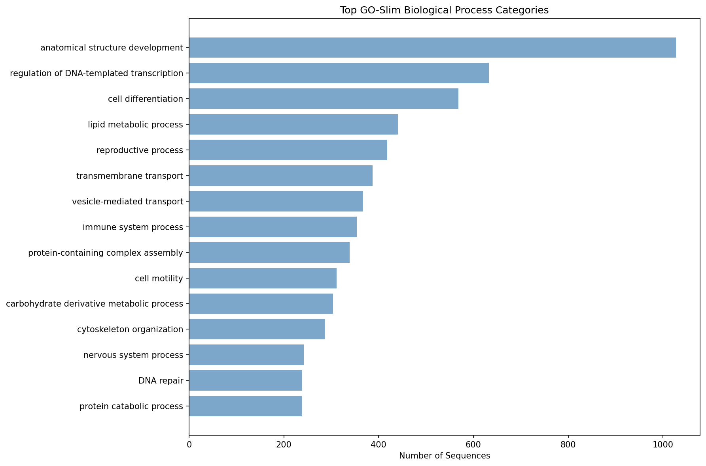

# Annotation Summary Report

## Job Information
- **Input file**: representative_sequences.faa
- **Start time**: 2025-08-31 17:13:09
- **End time**: 2025-08-31 17:15:56
- **Duration**: 0h 2m 47s
- **CPUs used**: 40
- **Tool**: DIAMOND BLASTP (protein)

## Results Overview
- **Total sequences**: 9,625
- **BLAST hits found**: 9,625 (100.0%)
- **GO annotations**: 4,769 (49.5%)
- **GO-Slim mappings**: 4,741 (49.3%)

## Output Files
- **Main results**: annotation_with_goslim.tsv
- **Full GO data**: annotation_full_go.tsv  
- **Raw BLAST**: representative_sequences.blast.tsv
- **Processing script**: postprocess_uniprot_go.py

## Top GO-Slim Categories

| GO-Slim Term | Count |
|--------------|-------|
| anatomical structure development | 1027 |
| regulation of DNA-templated transcription | 633 |
| cell differentiation | 568 |
| lipid metabolic process | 441 |
| reproductive process | 418 |
| transmembrane transport | 387 |
| vesicle-mediated transport | 367 |
| immune system process | 354 |
| protein-containing complex assembly | 339 |
| cell motility | 311 |
| carbohydrate derivative metabolic process | 304 |
| cytoskeleton organization | 287 |
| nervous system process | 242 |
| DNA repair | 239 |
| protein catabolic process | 238 |

*Top 15 GO-Slim categories by sequence count*

## Performance
- **BLAST throughput**: 57.6 sequences/second
- **Annotation rate**: 57.6 hits/second

---
*Generated by blast2slim.sh on 2025-08-31 17:15:56*
