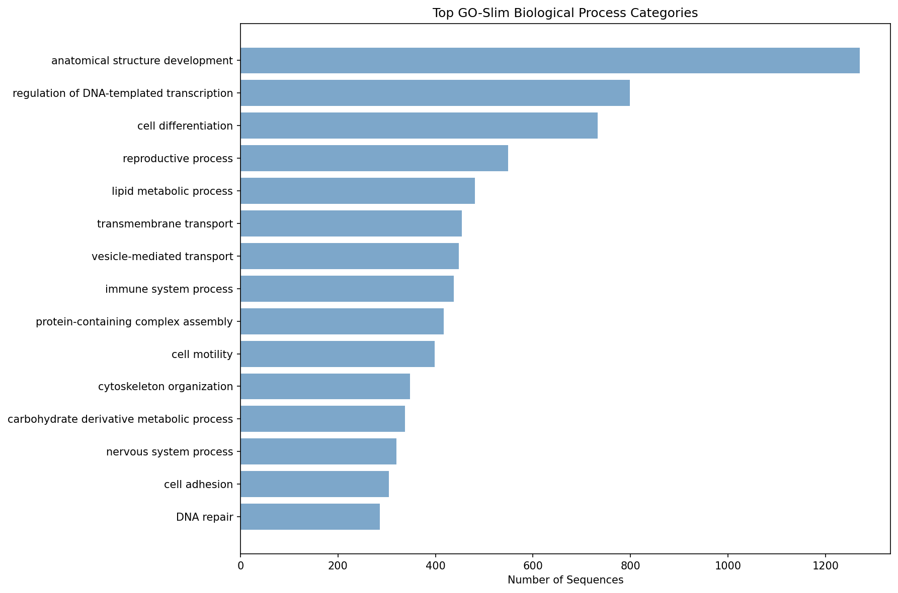

# Annotation Summary Report

## Job Information
- **Input file**: representative_sequences.faa
- **Start time**: 2025-08-31 17:27:44
- **End time**: 2025-08-31 17:30:10
- **Duration**: 0h 2m 26s
- **CPUs used**: 40
- **Tool**: DIAMOND BLASTP (protein)

## Results Overview
- **Total sequences**: 11,653
- **BLAST hits found**: 11,653 (100.0%)
- **GO annotations**: 5,786 (49.7%)
- **GO-Slim mappings**: 5,750 (49.3%)

## Output Files
- **Main results**: annotation_with_goslim.tsv
- **Full GO data**: annotation_full_go.tsv  
- **Raw BLAST**: representative_sequences.blast.tsv
- **Processing script**: postprocess_uniprot_go.py

## Top GO-Slim Categories

| GO-Slim Term | Count |
|--------------|-------|
| anatomical structure development | 1270 |
| regulation of DNA-templated transcription | 799 |
| cell differentiation | 733 |
| reproductive process | 549 |
| lipid metabolic process | 481 |
| transmembrane transport | 454 |
| vesicle-mediated transport | 448 |
| immune system process | 438 |
| protein-containing complex assembly | 417 |
| cell motility | 398 |
| cytoskeleton organization | 348 |
| carbohydrate derivative metabolic process | 338 |
| nervous system process | 320 |
| cell adhesion | 304 |
| DNA repair | 286 |

*Top 15 GO-Slim categories by sequence count*

## Performance
- **BLAST throughput**: 79.8 sequences/second
- **Annotation rate**: 79.8 hits/second

---
*Generated by blast2slim.sh on 2025-08-31 17:30:10*
