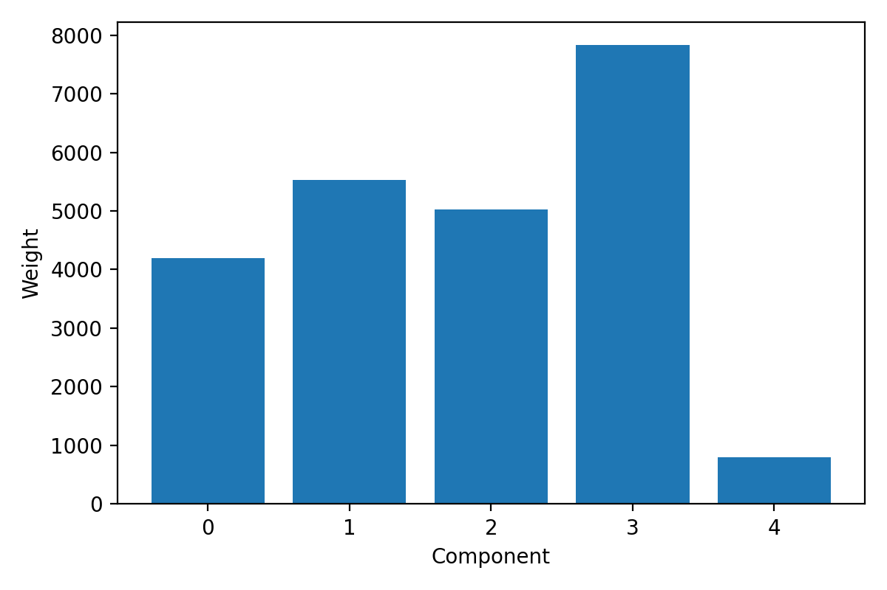
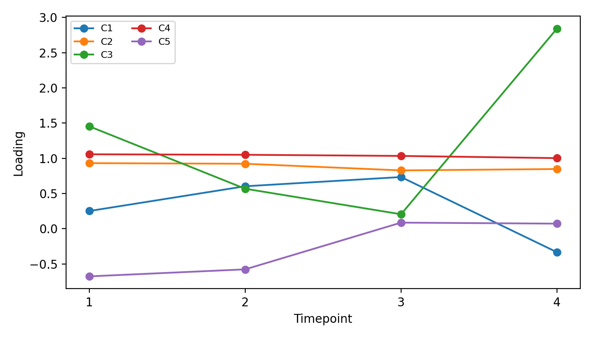

# Barnacle sparse tensor decomposition (14-barnacle)

- Tensor shape: genes × combined_samples × timepoints = `(10223, 30, 4)`
- Components extracted: 5
- Inputs: normalized per‑species CSVs from `../13.00-multiomics-barnacle/`
- Outputs written to this directory and `barnacle_factors/` and `figures/`

## Component weights

## Timepoint loadings

## Factor files

- `barnacle_factors/gene_factors.csv` (10223 × 5)
- `barnacle_factors/sample_factors.csv` (30 × 5)
- `barnacle_factors/time_factors.csv` (4 × 5)
- `barnacle_factors/component_weights.csv`
- `barnacle_factors/sample_mapping.csv`
- `barnacle_factors/metadata.json`

This run used SparseCP with non‑negative gene loadings and NaN→0 imputation.
