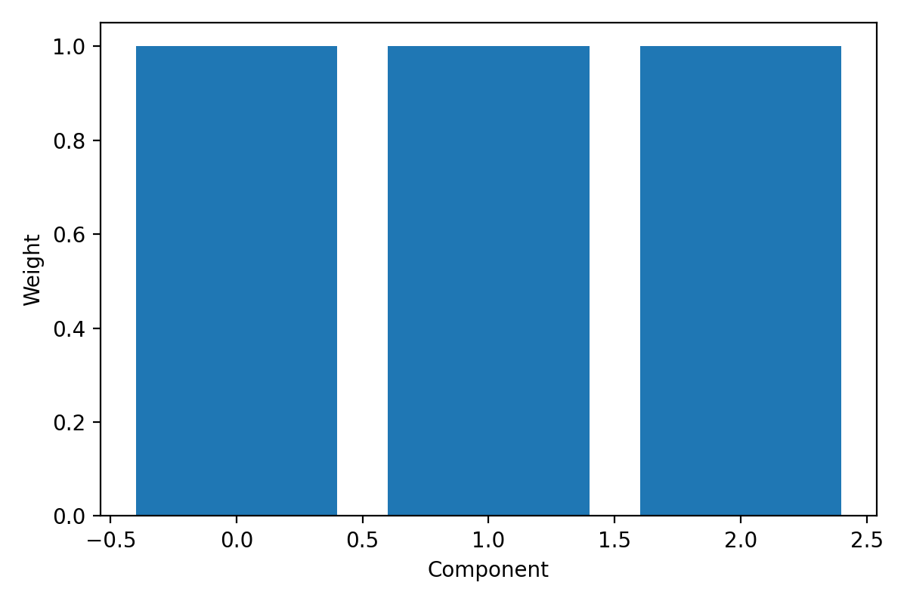
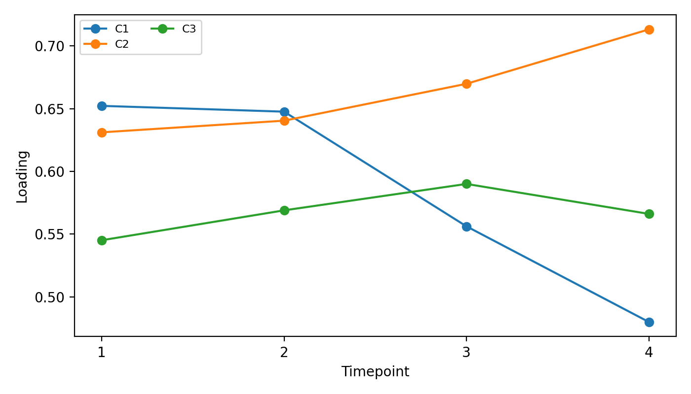
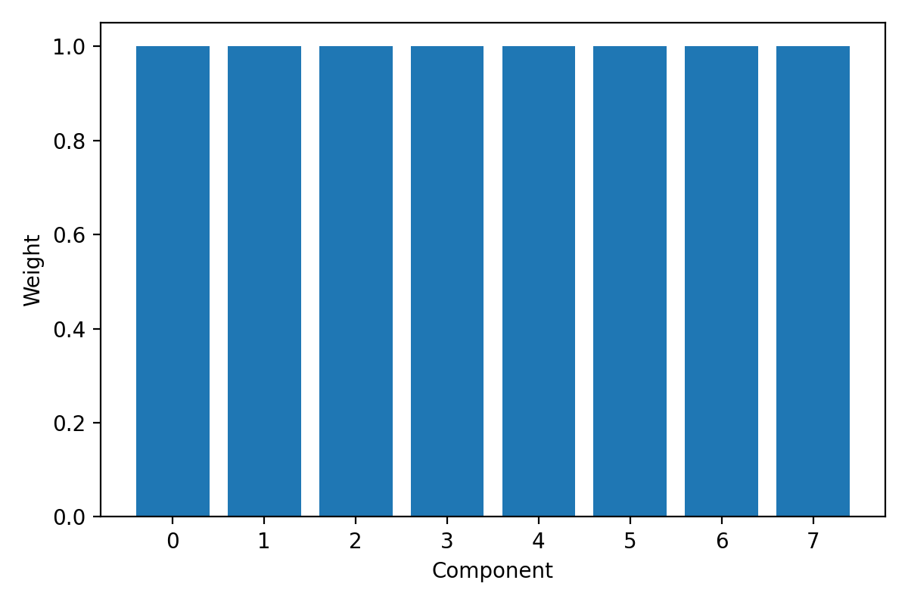
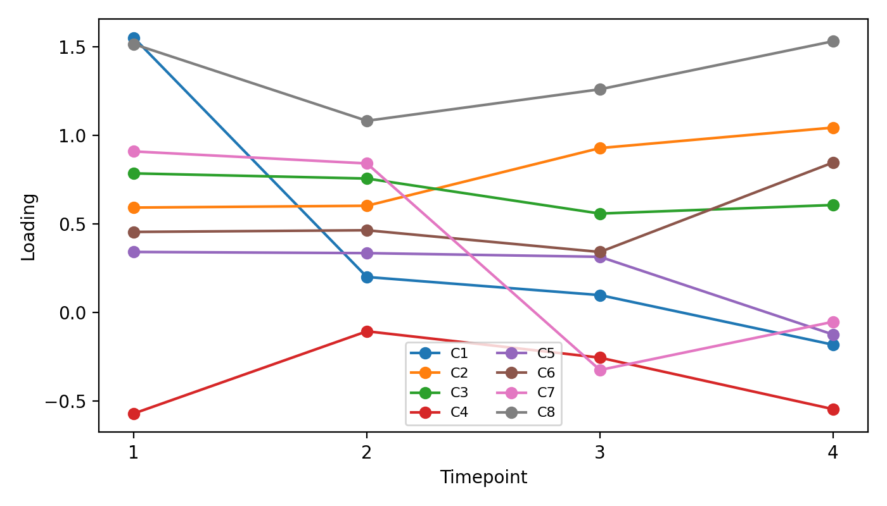
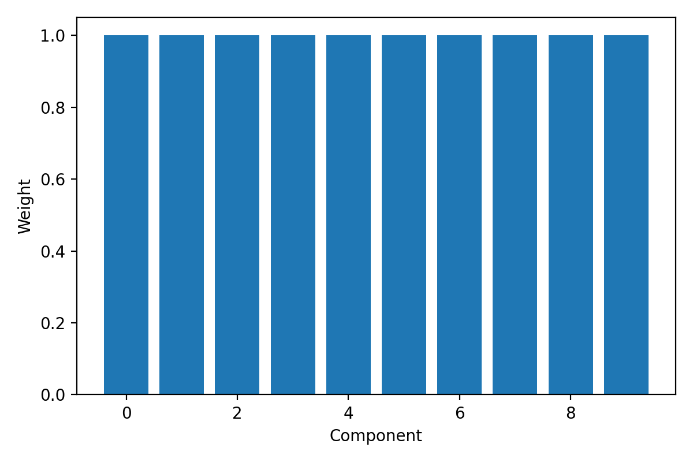
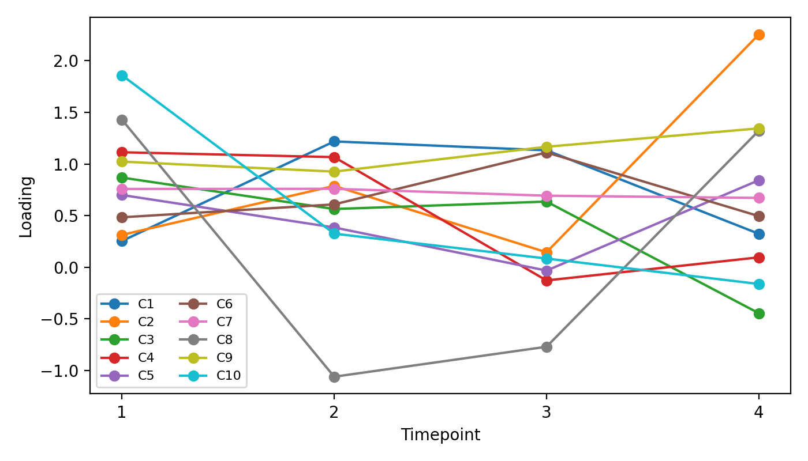
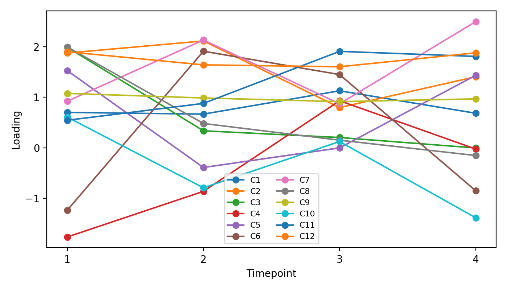

# Barnacle multi-rank comparison (15-barnacle)

- Tensor shape (genes × samples × time): 10223 × 30 × 4
- Ranks evaluated: 3, 8, 10, 12

| Rank | Components | Converged | Final loss | Gene sparsity | Sample sparsity | Time sparsity |
|---:|---:|:---:|---:|---:|---:|---:|
| 3 | 3 | False | 1368622.5402875934 | 0.003 | 0.000 | 0.000 |
| 8 | 8 | False | 689401.0927645369 | 0.022 | 0.000 | 0.000 |
| 10 | 10 | False | 634014.2751745528 | 0.015 | 0.000 | 0.000 |
| 12 | 12 | False | 587541.0157147003 | 0.012 | 0.000 | 0.000 |

## Rank 3

## Rank 8

## Rank 10

## Rank 12

