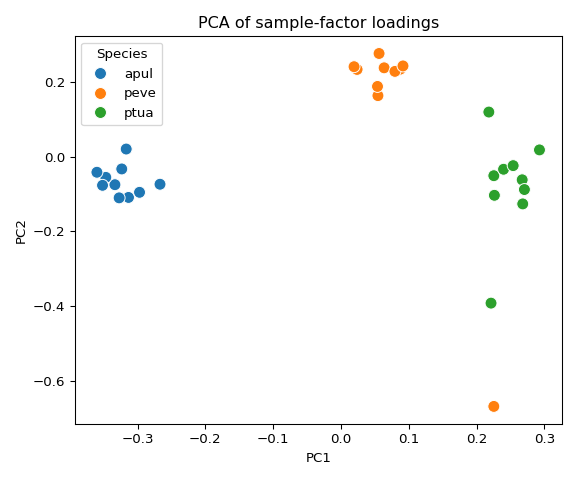

13.00-multiomics-barnacle
================
Sam White
2025-10-03

- <a href="#1-background" id="toc-1-background">1 BACKGROUND</a>
  - <a href="#11-input-files" id="toc-11-input-files">1.1 Input files</a>
  - <a href="#12-output-files" id="toc-12-output-files">1.2 Output files</a>
  - <a href="#13-notes--assumptions" id="toc-13-notes--assumptions">1.3
    Notes / assumptions:</a>
- <a href="#2-setup" id="toc-2-setup">2 SETUP</a>
  - <a href="#21-libraries" id="toc-21-libraries">2.1 Libraries</a>
  - <a href="#22-set-r-variables" id="toc-22-set-r-variables">2.2 Set R
    variables</a>
  - <a href="#23-load-barnacle-conda-environment"
    id="toc-23-load-barnacle-conda-environment">2.3 Load barnacle conda
    environment</a>
- <a href="#3-data-prep" id="toc-3-data-prep">3 DATA PREP</a>
  - <a href="#31-load-ortholog-groups-data"
    id="toc-31-load-ortholog-groups-data">3.1 Load ortholog groups data</a>
  - <a href="#32-extract-ortholog-expression-data"
    id="toc-32-extract-ortholog-expression-data">3.2 Extract ortholog
    expression data</a>
    - <a href="#321-load-gene-count-matrices"
      id="toc-321-load-gene-count-matrices">3.2.1 Load gene count matrices</a>
    - <a href="#322-filter-ortholog-groups-for-complete-three-way-matches"
      id="toc-322-filter-ortholog-groups-for-complete-three-way-matches">3.2.2
      Filter ortholog groups for complete three-way matches</a>
    - <a href="#323-filter-for-expression-data-availability"
      id="toc-323-filter-for-expression-data-availability">3.2.3 Filter for
      expression data availability</a>
    - <a href="#324-gene-id-cleaning-examples"
      id="toc-324-gene-id-cleaning-examples">3.2.4 Gene ID cleaning
      examples</a>
    - <a href="#325-clean-gene-ids-for-matching"
      id="toc-325-clean-gene-ids-for-matching">3.2.5 Clean gene IDs for
      matching</a>
    - <a href="#326-create-ortholog-expression-data-with-group_id-mapping"
      id="toc-326-create-ortholog-expression-data-with-group_id-mapping">3.2.6
      Create ortholog expression data with group_id mapping</a>
    - <a href="#327-write-ortholog-expression-data"
      id="toc-327-write-ortholog-expression-data">3.2.7 Write ortholog
      expression data</a>
    - <a href="#328-column-structure-analysis"
      id="toc-328-column-structure-analysis">3.2.8 Column structure
      analysis</a>
    - <a href="#329-summary-statistics" id="toc-329-summary-statistics">3.2.9
      Summary statistics</a>
    - <a href="#3210-diagnostic-analysis"
      id="toc-3210-diagnostic-analysis">3.2.10 Diagnostic analysis</a>
    - <a href="#3211-preview-expression-data"
      id="toc-3211-preview-expression-data">3.2.11 Preview expression data</a>
- <a href="#4-barnacle-analysis" id="toc-4-barnacle-analysis">4 BARNACLE
  ANALYSIS</a>
  - <a href="#41-load-expression-data" id="toc-41-load-expression-data">4.1
    Load expression data</a>
  - <a href="#42-normalize-data-with-sctransform"
    id="toc-42-normalize-data-with-sctransform">4.2 Normalize data with
    sctransform</a>
  - <a href="#43-export-normalized-data-for-python-analysis"
    id="toc-43-export-normalized-data-for-python-analysis">4.3 Export
    normalized data for Python analysis</a>
  - <a href="#44-create-tensor-dataset-in-python"
    id="toc-44-create-tensor-dataset-in-python">4.4 Create tensor dataset in
    Python</a>
  - <a href="#45-parse-sample-information"
    id="toc-45-parse-sample-information">4.5 Parse sample information</a>
  - <a href="#46-create-3d-tensor-genes--species_samples--timepoints"
    id="toc-46-create-3d-tensor-genes--species_samples--timepoints">4.6
    Create 3D tensor (genes × species_samples × timepoints)</a>
  - <a href="#47-run-barnacle-sparse-tensor-decomposition"
    id="toc-47-run-barnacle-sparse-tensor-decomposition">4.7 Run Barnacle
    sparse tensor decomposition</a>
  - <a href="#48-analyze-and-interpret-results"
    id="toc-48-analyze-and-interpret-results">4.8 Analyze and interpret
    results</a>
  - <a href="#49-summary" id="toc-49-summary">4.9 Summary</a>
  - <a href="#410-save-results" id="toc-410-save-results">4.10 Save
    results</a>
  - <a href="#411-visualize-barnacle-results"
    id="toc-411-visualize-barnacle-results">4.11 Visualize Barnacle
    results</a>
    - <a href="#4111-visualization-setup"
      id="toc-4111-visualization-setup">4.11.1 Visualization setup</a>
    - <a href="#4112-component-weights" id="toc-4112-component-weights">4.11.2
      Component weights</a>
    - <a href="#4113-timepoint-loadings"
      id="toc-4113-timepoint-loadings">4.11.3 Timepoint loadings</a>
    - <a href="#4114-sample-factor-heatmap"
      id="toc-4114-sample-factor-heatmap">4.11.4 Sample-factor heatmap</a>
    - <a href="#4115-pca-of-sample-factor-loadings"
      id="toc-4115-pca-of-sample-factor-loadings">4.11.5 PCA of sample-factor
      loadings</a>
    - <a href="#4116-top-orthologs-per-component"
      id="toc-4116-top-orthologs-per-component">4.11.6 Top orthologs per
      component</a>
- <a href="#5-system-info" id="toc-5-system-info">5 SYSTEM INFO</a>
- <a href="#6-references" id="toc-6-references">6 REFERENCES</a>

# 1 BACKGROUND

This analysis prepares three-species ortholog expression matrices,
normalizes the data, constructs a multi‑omics tensor (genes × combined
species-samples × timepoints), and runs a sparse tensor decomposition
using the [barnacle](https://github.com/blasks/barnacle) (Blaskowski et
al. 2024) workflow to discover shared gene/time/species patterns.

Key steps performed by this script:

- Load annotated ortholog groups and per-species count matrices.
- Filter ortholog groups to retain complete three‑way matches with
  available expression data.
- Extract per‑species expression matrices mapped to ortholog group IDs.
- Normalize counts (preferred: `sctransform`; fallback: log2(CPM + 1)).
- Build a 3D tensor combining species/sample and timepoint dimensions.
- Run [barnacle](https://github.com/blasks/barnacle) (Blaskowski et
  al. 2024) sparse CP decomposition and save factor matrices, metadata
  and figures.

## 1.1 Input files

- `../output/12-ortho-annot/ortholog_groups_annotated.csv` : annotated
  ortholog groups with columns for `group_id`, `apul`, `peve`, `ptua`,
  `type`, etc.

- `../../D-Apul/output/02.20-D-Apul-RNAseq-alignment-HiSat2/apul-gene_count_matrix.csv`  
  Apul gene count matrix (contains `gene_id` plus sample columns).

- `../../E-Peve/output/02.20-E-Peve-RNAseq-alignment-HiSat2/peve-gene_count_matrix.csv`  
  Peve gene count matrix.

- `../../F-Ptua/output/02.20-F-Ptua-RNAseq-alignment-HiSat2/ptua-gene_count_matrix.csv`  
  Ptua gene count matrix.

- (Also referenced) transcript-level matrices:
  `apul-transcript_count_matrix.csv`,
  `peve-transcript_count_matrix.csv`, `ptua-transcript_count_matrix.csv`
  when needed.

## 1.2 Output files

- `apul_ortholog_expression.csv`, `peve_ortholog_expression.csv`,
  `ptua_ortholog_expression.csv` : per‑species expression matrices
  aligned to ortholog `group_id`.
- `apul_normalized_expression.csv`, `peve_normalized_expression.csv`,
  `ptua_normalized_expression.csv` : normalized expression matrices
  (sctransform or log2(CPM+1)).
- `multiomics_tensor.npy` : saved NumPy array of the 3D tensor used for
  decomposition (genes × combined_samples × timepoints).
- `barnacle_factors/` directory containing:
  - `gene_factors.csv` : gene loadings per component (genes ×
    components).
  - `sample_factors.csv` : combined sample (species_sample) loadings per
    component with `Species` and `Sample_ID` metadata.
  - `time_factors.csv` : timepoint loadings per component.
  - `component_weights.csv` : component weights / importance.
  - `sample_mapping.csv` : mapping of combined sample indices to species
    and sample IDs.
  - `metadata.json` : analysis parameters and tensor metadata (shape,
    rank, lambdas, convergence, etc.).
  - `figures/` : generated visualizations (component weights, time
    loadings, sample heatmap, PCA, top ortholog plots).

## 1.3 Notes / assumptions:

- Sample column names are parsed expecting a dot-separated format with a
  `TP#` timepoint token (e.g., `ACR.139.TP1`).
- Apul ortholog IDs in the ortholog table include transcript suffixes
  (e.g., `-T1`) which are removed for matching to the gene count matrix.
- Missing values in the tensor are handled by substitution (current
  workflow fills NaNs with zeros before decomposition).

# 2 SETUP

## 2.1 Libraries

## 2.2 Set R variables

``` r
# OUTPUT DIRECTORY
output_dir <- "../output/13.00-multiomics-barnacle"

#INPUT FILE(S)
ortholog_groups_file <- "../output/12-ortho-annot/ortholog_groups_annotated.csv"

# Transcript count matrices for each species
apul_transcript_matrix_file <- "../../D-Apul/output/02.20-D-Apul-RNAseq-alignment-HiSat2/apul-transcript_count_matrix.csv"
peve_transcript_matrix_file <- "../../E-Peve/output/02.20-E-Peve-RNAseq-alignment-HiSat2/peve-transcript_count_matrix.csv"
ptua_transcript_matrix_file <- "../../F-Ptua/output/02.20-F-Ptua-RNAseq-alignment-HiSat2/ptua-transcript_count_matrix.csv"

# CONDA
conda_env_name <- c("/home/sam/programs/mambaforge/envs/barnacle_py311_env")
conda_path <- c("/opt/anaconda/anaconda3/bin/conda")
```

## 2.3 Load [barnacle](https://github.com/blasks/barnacle) conda environment

If this is successful, the first line of output should show that the
Python being used is the one in your
[barnacle](https://github.com/blasks/barnacle) (Blaskowski et al. 2024)
conda environment path.

E.g.

`python:         /home/sam/programs/mambaforge/envs/barnacle_py311_env/bin/python`

``` r
use_condaenv(condaenv = conda_env_name, conda = conda_path)
py_config()
```

    ## python:         /home/sam/programs/mambaforge/envs/barnacle_py311_env/bin/python
    ## libpython:      /home/sam/programs/mambaforge/envs/barnacle_py311_env/lib/libpython3.11.so
    ## pythonhome:     /home/sam/programs/mambaforge/envs/barnacle_py311_env:/home/sam/programs/mambaforge/envs/barnacle_py311_env
    ## version:        3.11.13 | packaged by conda-forge | (main, Jun  4 2025, 14:48:23) [GCC 13.3.0]
    ## numpy:          /home/sam/programs/mambaforge/envs/barnacle_py311_env/lib/python3.11/site-packages/numpy
    ## numpy_version:  1.26.4
    ## 
    ## NOTE: Python version was forced by use_python() function

# 3 DATA PREP

## 3.1 Load ortholog groups data

``` r
# Read in the ortholog groups data
ortholog_groups <- read.csv(ortholog_groups_file)


# Display basic info about the data
cat("Dimensions of ortholog groups data:", dim(ortholog_groups), "\n\n")
cat("Column names:", colnames(ortholog_groups), "\n\n")
head(ortholog_groups)
str(ortholog_groups)
```

    ## Dimensions of ortholog groups data: 18372 23 
    ## 
    ## Column names: group_id apul peve ptua type avg_identity query accession id reviewed protein_name organism pident length evalue bitscore title go_ids go_bp go_cc go_mf goslim_ids goslim_names 
    ## 
    ##   group_id          apul          peve
    ## 1 OG_00001 FUN_000185-T1 Peve_00037402
    ## 2 OG_00002 FUN_000189-T1 Peve_00038462
    ## 3 OG_00003 FUN_000190-T1 Peve_00038463
    ## 4 OG_00004 FUN_000191-T1 Peve_00038464
    ## 5 OG_00005 FUN_000192-T1 Peve_00038466
    ## 6 OG_00006 FUN_000193-T1 Peve_00038467
    ##                                            ptua      type avg_identity
    ## 1 Pocillopora_meandrina_HIv1___RNAseq.g28886.t1 three_way     71.05900
    ## 2 Pocillopora_meandrina_HIv1___RNAseq.g28888.t3 three_way     68.72583
    ## 3 Pocillopora_meandrina_HIv1___RNAseq.g28889.t1 three_way     55.19750
    ## 4 Pocillopora_meandrina_HIv1___RNAseq.g28890.t1 three_way     72.04700
    ## 5 Pocillopora_meandrina_HIv1___RNAseq.g28893.t1 three_way     81.15867
    ## 6 Pocillopora_meandrina_HIv1___RNAseq.g28894.t1 three_way     70.21933
    ##           query accession         id reviewed
    ## 1 FUN_000185-T1    Q32LQ0 AMPE_BOVIN       NA
    ## 2 FUN_000189-T1    Q9DCT6                  NA
    ## 3                                          NA
    ## 4 FUN_000191-T1    Q95108                  NA
    ## 5 FUN_000192-T1    Q1LWX3                  NA
    ## 6 FUN_000193-T1    Q5I0K7                  NA
    ##                                                                               protein_name
    ## 1 Glutamyl aminopeptidase (EAP) (EC 3.4.11.7) (Aminopeptidase A) (AP-A) (CD antigen CD249)
    ## 2                                                                                         
    ## 3                                                                                         
    ## 4                                                                                         
    ## 5                                                                                         
    ## 6                                                                                         
    ##              organism pident length   evalue bitscore
    ## 1 Bos taurus (Bovine)   41.5    881 1.4e-197    691.4
    ## 2                       38.0    171  4.6e-18     92.8
    ## 3                         NA     NA       NA       NA
    ## 4                       44.1    136  3.3e-29    129.4
    ## 5                       54.3    188  3.5e-53    209.5
    ## 6                       53.2    158  3.4e-41    169.5
    ##                                                                                                                    title
    ## 1                                  sp|Q32LQ0|AMPE_BOVIN Glutamyl aminopeptidase OS=Bos taurus OX=9913 GN=ENPEP PE=2 SV=1
    ## 2        sp|Q9DCT6|BAP18_MOUSE BPTF-associated chromatin complex component 1 OS=Mus musculus OX=10090 GN=Bacc1 PE=1 SV=1
    ## 3                                                                                                                       
    ## 4                               sp|Q95108|THIOM_BOVIN Thioredoxin, mitochondrial OS=Bos taurus OX=9913 GN=TXN2 PE=1 SV=2
    ## 5            sp|Q1LWX3|NTAQ1_DANRE Protein N-terminal glutamine amidohydrolase OS=Danio rerio OX=7955 GN=ntaq1 PE=2 SV=1
    ## 6 sp|Q5I0K7|ALG13_RAT UDP-N-acetylglucosamine transferase subunit ALG13 OS=Rattus norvegicus OX=10116 GN=Alg13 PE=1 SV=1
    ##                                                                                                                                                                   go_ids
    ## 1 GO:0003081; GO:0004177; GO:0004230; GO:0005615; GO:0005737; GO:0005886; GO:0006508; GO:0008217; GO:0008270; GO:0008283; GO:0016477; GO:0042277; GO:0043171; GO:0070006
    ## 2                                                                                                                                                                       
    ## 3                                                                                                                                                                       
    ## 4                                                                                                                                                                       
    ## 5                                                                                                                                                                       
    ## 6                                                                                                                                                                       
    ##                                                                                                                                                                                                                                                                    go_bp
    ## 1 cell migration [GO:0016477]; cell population proliferation [GO:0008283]; peptide catabolic process [GO:0043171]; proteolysis [GO:0006508]; regulation of blood pressure [GO:0008217]; regulation of systemic arterial blood pressure by renin-angiotensin [GO:0003081]
    ## 2                                                                                                                                                                                                                                                                       
    ## 3                                                                                                                                                                                                                                                                       
    ## 4                                                                                                                                                                                                                                                                       
    ## 5                                                                                                                                                                                                                                                                       
    ## 6                                                                                                                                                                                                                                                                       
    ##                                                                                    go_cc
    ## 1 cytoplasm [GO:0005737]; extracellular space [GO:0005615]; plasma membrane [GO:0005886]
    ## 2                                                                                       
    ## 3                                                                                       
    ## 4                                                                                       
    ## 5                                                                                       
    ## 6                                                                                       
    ##                                                                                                                                                                                           go_mf
    ## 1 aminopeptidase activity [GO:0004177]; glutamyl aminopeptidase activity [GO:0004230]; metalloaminopeptidase activity [GO:0070006]; peptide binding [GO:0042277]; zinc ion binding [GO:0008270]
    ## 2                                                                                                                                                                                              
    ## 3                                                                                                                                                                                              
    ## 4                                                                                                                                                                                              
    ## 5                                                                                                                                                                                              
    ## 6                                                                                                                                                                                              
    ##                                                                           goslim_ids
    ## 1 GO:0003824; GO:0005615; GO:0005886; GO:0016787; GO:0048870; GO:0050886; GO:0140096
    ## 2                                                                                   
    ## 3                                                                                   
    ## 4                                                                                   
    ## 5                                                                                   
    ## 6                                                                                   
    ##                                                                                                                                              goslim_names
    ## 1 catalytic activity; extracellular space; plasma membrane; hydrolase activity; cell motility; endocrine process; catalytic activity, acting on a protein
    ## 2                                                                                                                                                        
    ## 3                                                                                                                                                        
    ## 4                                                                                                                                                        
    ## 5                                                                                                                                                        
    ## 6                                                                                                                                                        
    ## 'data.frame':    18372 obs. of  23 variables:
    ##  $ group_id    : chr  "OG_00001" "OG_00002" "OG_00003" "OG_00004" ...
    ##  $ apul        : chr  "FUN_000185-T1" "FUN_000189-T1" "FUN_000190-T1" "FUN_000191-T1" ...
    ##  $ peve        : chr  "Peve_00037402" "Peve_00038462" "Peve_00038463" "Peve_00038464" ...
    ##  $ ptua        : chr  "Pocillopora_meandrina_HIv1___RNAseq.g28886.t1" "Pocillopora_meandrina_HIv1___RNAseq.g28888.t3" "Pocillopora_meandrina_HIv1___RNAseq.g28889.t1" "Pocillopora_meandrina_HIv1___RNAseq.g28890.t1" ...
    ##  $ type        : chr  "three_way" "three_way" "three_way" "three_way" ...
    ##  $ avg_identity: num  71.1 68.7 55.2 72 81.2 ...
    ##  $ query       : chr  "FUN_000185-T1" "FUN_000189-T1" "" "FUN_000191-T1" ...
    ##  $ accession   : chr  "Q32LQ0" "Q9DCT6" "" "Q95108" ...
    ##  $ id          : chr  "AMPE_BOVIN" "" "" "" ...
    ##  $ reviewed    : logi  NA NA NA NA NA NA ...
    ##  $ protein_name: chr  "Glutamyl aminopeptidase (EAP) (EC 3.4.11.7) (Aminopeptidase A) (AP-A) (CD antigen CD249)" "" "" "" ...
    ##  $ organism    : chr  "Bos taurus (Bovine)" "" "" "" ...
    ##  $ pident      : num  41.5 38 NA 44.1 54.3 53.2 60.2 38.5 44.7 NA ...
    ##  $ length      : num  881 171 NA 136 188 158 447 148 488 NA ...
    ##  $ evalue      : num  1.4e-197 4.6e-18 NA 3.3e-29 3.5e-53 ...
    ##  $ bitscore    : num  691.4 92.8 NA 129.4 209.5 ...
    ##  $ title       : chr  "sp|Q32LQ0|AMPE_BOVIN Glutamyl aminopeptidase OS=Bos taurus OX=9913 GN=ENPEP PE=2 SV=1" "sp|Q9DCT6|BAP18_MOUSE BPTF-associated chromatin complex component 1 OS=Mus musculus OX=10090 GN=Bacc1 PE=1 SV=1" "" "sp|Q95108|THIOM_BOVIN Thioredoxin, mitochondrial OS=Bos taurus OX=9913 GN=TXN2 PE=1 SV=2" ...
    ##  $ go_ids      : chr  "GO:0003081; GO:0004177; GO:0004230; GO:0005615; GO:0005737; GO:0005886; GO:0006508; GO:0008217; GO:0008270; GO:"| __truncated__ "" "" "" ...
    ##  $ go_bp       : chr  "cell migration [GO:0016477]; cell population proliferation [GO:0008283]; peptide catabolic process [GO:0043171]"| __truncated__ "" "" "" ...
    ##  $ go_cc       : chr  "cytoplasm [GO:0005737]; extracellular space [GO:0005615]; plasma membrane [GO:0005886]" "" "" "" ...
    ##  $ go_mf       : chr  "aminopeptidase activity [GO:0004177]; glutamyl aminopeptidase activity [GO:0004230]; metalloaminopeptidase acti"| __truncated__ "" "" "" ...
    ##  $ goslim_ids  : chr  "GO:0003824; GO:0005615; GO:0005886; GO:0016787; GO:0048870; GO:0050886; GO:0140096" "" "" "" ...
    ##  $ goslim_names: chr  "catalytic activity; extracellular space; plasma membrane; hydrolase activity; cell motility; endocrine process;"| __truncated__ "" "" "" ...

## 3.2 Extract ortholog expression data

Now let’s extract expression data for genes that are present in the
ortholog groups. We’ll use the gene count matrices with gene IDs to
properly map the data.

### 3.2.1 Load gene count matrices

``` r
# Define file paths for gene count matrices
apul_gene_matrix_file <- "../../D-Apul/output/02.20-D-Apul-RNAseq-alignment-HiSat2/apul-gene_count_matrix.csv"
peve_gene_matrix_file <- "../../E-Peve/output/02.20-E-Peve-RNAseq-alignment-HiSat2/peve-gene_count_matrix.csv"
ptua_gene_matrix_file <- "../../F-Ptua/output/02.20-F-Ptua-RNAseq-alignment-HiSat2/ptua-gene_count_matrix.csv"

# Load gene count matrices for each species
cat("Loading gene count matrices...\n\n")

apul_gene_matrix <- read.csv(apul_gene_matrix_file)
cat("Apul gene matrix dimensions:", dim(apul_gene_matrix), "\n")

peve_gene_matrix <- read.csv(peve_gene_matrix_file)
cat("Peve gene matrix dimensions:", dim(peve_gene_matrix), "\n")

ptua_gene_matrix <- read.csv(ptua_gene_matrix_file)
cat("Ptua gene matrix dimensions:", dim(ptua_gene_matrix), "\n\n")
```

    ## Loading gene count matrices...
    ## 
    ## Apul gene matrix dimensions: 44371 41 
    ## Peve gene matrix dimensions: 40389 39 
    ## Ptua gene matrix dimensions: 31840 40

### 3.2.2 Filter ortholog groups for complete three-way matches

``` r
cat("Filtering for complete three-way ortholog groups...\n")

# Keep only rows where all three species have entries (no NA values or empty strings)
complete_ortholog_groups <- ortholog_groups[nzchar(ortholog_groups$apul) & 
                                          nzchar(ortholog_groups$peve) & 
                                          nzchar(ortholog_groups$ptua), ]

cat("Total ortholog groups:", nrow(ortholog_groups), "\n")
cat("Complete three-way ortholog groups:", nrow(complete_ortholog_groups), "\n")
```

    ## Filtering for complete three-way ortholog groups...
    ## Total ortholog groups: 18372 
    ## Complete three-way ortholog groups: 10381

### 3.2.3 Filter for expression data availability

``` r
cat("Filtering ortholog groups to ensure all genes have expression data...\n")

# Clean gene IDs to check against expression data
# For Apul: remove -T[n] suffix from ortholog groups to match gene matrix format
apul_ortholog_genes_check <- gsub("-T[0-9]+$", "", complete_ortholog_groups$apul)

# For Peve and Ptua: use as-is (will clean gene matrix IDs later)
peve_ortholog_genes_check <- complete_ortholog_groups$peve
ptua_ortholog_genes_check <- complete_ortholog_groups$ptua

# Check which genes are present in expression data
# (Note: We need to clean gene matrix IDs to match)
apul_gene_matrix_ids <- gsub("^gene-", "", apul_gene_matrix$gene_id)  # Remove gene- prefix if present
peve_gene_matrix_ids <- gsub("^gene-", "", peve_gene_matrix$gene_id)  # Remove gene- prefix
ptua_gene_matrix_ids <- gsub("^gene-", "", ptua_gene_matrix$gene_id)  # Remove gene- prefix

# Find which ortholog genes are present in each species' expression data
apul_present <- apul_ortholog_genes_check %in% apul_gene_matrix_ids
peve_present <- peve_ortholog_genes_check %in% peve_gene_matrix_ids
ptua_present <- ptua_ortholog_genes_check %in% ptua_gene_matrix_ids

# Keep only ortholog groups where all three species have expression data
expression_complete_mask <- apul_present & peve_present & ptua_present
complete_ortholog_groups <- complete_ortholog_groups[expression_complete_mask, ]

cat("Ortholog groups after filtering for expression data availability:", nrow(complete_ortholog_groups), "\n")
```

    ## Filtering ortholog groups to ensure all genes have expression data...
    ## Ortholog groups after filtering for expression data availability: 10258

### 3.2.4 Gene ID cleaning examples

``` r
cat("\n=== GENE ID CLEANING EXAMPLES ===\n")
cat("Apul (clean ortholog groups to match gene matrix):\n")
cat("Ortholog groups original:", head(complete_ortholog_groups$apul, 3), "\n")
cat("Ortholog groups cleaned:", head(gsub("-T[0-9]+$", "", complete_ortholog_groups$apul), 3), "\n")
cat("Gene matrix (target format):", head(apul_gene_matrix$gene_id, 3), "\n\n")

cat("Peve (clean gene matrix to match ortholog groups):\n")
cat("Ortholog groups (target format):", head(complete_ortholog_groups$peve, 3), "\n") 
cat("Gene matrix original:", head(peve_gene_matrix$gene_id, 3), "\n")
cat("Gene matrix cleaned:", head(peve_gene_matrix$gene_id_clean, 3), "\n\n")

cat("Ptua (clean gene matrix to match ortholog groups):\n")
cat("Ortholog groups (target format):", head(complete_ortholog_groups$ptua, 3), "\n")
cat("Gene matrix original:", head(ptua_gene_matrix$gene_id, 3), "\n")
cat("Gene matrix cleaned:", head(ptua_gene_matrix$gene_id_clean, 3), "\n\n")
```

    ## 
    ## === GENE ID CLEANING EXAMPLES ===
    ## Apul (clean ortholog groups to match gene matrix):
    ## Ortholog groups original: FUN_000185-T1 FUN_000189-T1 FUN_000190-T1 
    ## Ortholog groups cleaned: FUN_000185 FUN_000189 FUN_000190 
    ## Gene matrix (target format): FUN_002326 FUN_002315 FUN_002316 
    ## 
    ## Peve (clean gene matrix to match ortholog groups):
    ## Ortholog groups (target format): Peve_00037402 Peve_00038462 Peve_00038463 
    ## Gene matrix original: gene-Peve_00000032 gene-Peve_00000122 gene-Peve_00000008 
    ## Gene matrix cleaned: 
    ## 
    ## Ptua (clean gene matrix to match ortholog groups):
    ## Ortholog groups (target format): Pocillopora_meandrina_HIv1___RNAseq.g28886.t1 Pocillopora_meandrina_HIv1___RNAseq.g28888.t3 Pocillopora_meandrina_HIv1___RNAseq.g28889.t1 
    ## Gene matrix original: gene-Pocillopora_meandrina_HIv1___RNAseq.g20905.t1 gene-Pocillopora_meandrina_HIv1___RNAseq.g20902.t1 gene-Pocillopora_meandrina_HIv1___RNAseq.g20903.t1 
    ## Gene matrix cleaned:

### 3.2.5 Clean gene IDs for matching

``` r
cat("Cleaning gene matrix IDs to match ortholog group format...\n")

# For Apul: ortholog groups have "FUN_000185-T1", gene matrix has "FUN_002326"
# We need to remove "-T1" from ortholog groups to match gene matrix
apul_ortholog_genes <- unique(gsub("-T[0-9]+$", "", complete_ortholog_groups$apul))

# For Peve and Ptua: keep ortholog groups as-is and clean gene matrix
peve_ortholog_genes <- unique(complete_ortholog_groups$peve)
ptua_ortholog_genes <- unique(complete_ortholog_groups$ptua)

# Clean gene matrix IDs accordingly
# Apul: gene matrix already in correct format (no cleaning needed)
apul_gene_matrix$gene_id_clean <- apul_gene_matrix$gene_id

# Peve: gene matrix has "gene-Peve_00000032", ortholog groups have "Peve_00037402"  
# So we need to remove "gene-" prefix from gene matrix
peve_gene_matrix$gene_id_clean <- gsub("^gene-", "", peve_gene_matrix$gene_id)

# Ptua: gene matrix has "gene-Pocillopora_meandrina_HIv1___RNAseq.g20905.t1", 
# ortholog groups have "Pocillopora_meandrina_HIv1___RNAseq.g28886.t1"
# So we just need to remove "gene-" prefix from gene matrix
ptua_gene_matrix$gene_id_clean <- gsub("^gene-", "", ptua_gene_matrix$gene_id)

cat("Apul ortholog genes (complete groups only):", length(apul_ortholog_genes), "\n")
cat("Peve ortholog genes (complete groups only):", length(peve_ortholog_genes), "\n")
cat("Ptua ortholog genes (complete groups only):", length(ptua_ortholog_genes), "\n\n")
```

    ## Cleaning gene matrix IDs to match ortholog group format...
    ## Apul ortholog genes (complete groups only): 10223 
    ## Peve ortholog genes (complete groups only): 10223 
    ## Ptua ortholog genes (complete groups only): 10223

### 3.2.6 Create ortholog expression data with group_id mapping

``` r
cat("Creating ortholog expression data with proper group_id mapping...\n")

# Function to extract expression data for a species using ortholog group mapping
extract_species_expression <- function(ortholog_groups_df, gene_matrix, species_col, species_name) {
  cat("Processing", species_name, "...\n")
  
  # Remove duplicate group_ids, keeping first occurrence of each
  cat("  Input ortholog groups:", nrow(ortholog_groups_df), "\n")
  unique_groups <- ortholog_groups_df[!duplicated(ortholog_groups_df$group_id), ]
  cat("  After removing duplicates:", nrow(unique_groups), "unique group_ids\n")
  
  # Create results data frame starting with group_id
  result_df <- data.frame(group_id = unique_groups$group_id, stringsAsFactors = FALSE)
  
  # Get expression columns (exclude gene_id and gene_id_clean columns)
  expr_cols <- setdiff(colnames(gene_matrix), c("gene_id", "gene_id_clean"))
  
  # Initialize expression columns with NA
  for(col in expr_cols) {
    result_df[[col]] <- NA
  }
  
  # For each ortholog group, find the corresponding gene and extract expression
    for(i in seq_len(nrow(unique_groups))) {
    target_gene <- unique_groups[[species_col]][i]
    
    # Clean target gene for matching
    if(species_name == "Apul") {
      # Remove transcript suffix for Apul
      target_gene_clean <- gsub("-T[0-9]+$", "", target_gene)
      matching_rows <- which(gene_matrix$gene_id_clean == target_gene_clean)
    } else {
      # For Peve and Ptua, match cleaned gene_id
      matching_rows <- which(gene_matrix$gene_id_clean == target_gene)
    }
    
    if(length(matching_rows) == 1) {
      # Single match - copy expression data
      for(col in expr_cols) {
        result_df[i, col] <- gene_matrix[matching_rows, col]
      }
    } else if(length(matching_rows) > 1) {
      # Multiple matches - take first gene (no averaging)
      cat("  Group", unique_groups$group_id[i], "has", length(matching_rows), "gene matches - using first match\n")
      first_match <- matching_rows[1]
      for(col in expr_cols) {
        result_df[i, col] <- gene_matrix[first_match, col]
      }
    } else {
      # No match - leave as NA
      cat("  Warning: No expression data found for group", unique_groups$group_id[i], "gene", target_gene, "\n")
    }
  }
  
  # Remove rows with all NA expression values
  expr_na_mask <- apply(result_df[, expr_cols, drop = FALSE], 1, function(x) all(is.na(x)))
  result_df <- result_df[!expr_na_mask, ]
  
  cat("  Final dimensions:", nrow(result_df), "ortholog groups x", ncol(result_df)-1, "samples\n")
  cat("  Removed", sum(expr_na_mask), "groups with no expression data\n\n")
  
  return(result_df)
}

# Extract expression data for each species using the ortholog group mapping
apul_ortholog_expression <- extract_species_expression(complete_ortholog_groups, apul_gene_matrix, "apul", "Apul")
peve_ortholog_expression <- extract_species_expression(complete_ortholog_groups, peve_gene_matrix, "peve", "Peve")
ptua_ortholog_expression <- extract_species_expression(complete_ortholog_groups, ptua_gene_matrix, "ptua", "Ptua")

cat("=== FINAL ORTHOLOG EXPRESSION DATA DIMENSIONS ===\n")
cat("Apul:", nrow(apul_ortholog_expression), "ortholog groups x", ncol(apul_ortholog_expression)-1, "samples\n")
cat("Peve:", nrow(peve_ortholog_expression), "ortholog groups x", ncol(peve_ortholog_expression)-1, "samples\n")
cat("Ptua:", nrow(ptua_ortholog_expression), "ortholog groups x", ncol(ptua_ortholog_expression)-1, "samples\n\n")
```

    ## Creating ortholog expression data with proper group_id mapping...
    ## Processing Apul ...
    ##   Input ortholog groups: 10258 
    ##   After removing duplicates: 10223 unique group_ids
    ##   Final dimensions: 10223 ortholog groups x 40 samples
    ##   Removed 0 groups with no expression data
    ## 
    ## Processing Peve ...
    ##   Input ortholog groups: 10258 
    ##   After removing duplicates: 10223 unique group_ids
    ##   Final dimensions: 10223 ortholog groups x 38 samples
    ##   Removed 0 groups with no expression data
    ## 
    ## Processing Ptua ...
    ##   Input ortholog groups: 10258 
    ##   After removing duplicates: 10223 unique group_ids
    ##   Final dimensions: 10223 ortholog groups x 39 samples
    ##   Removed 0 groups with no expression data
    ## 
    ## === FINAL ORTHOLOG EXPRESSION DATA DIMENSIONS ===
    ## Apul: 10223 ortholog groups x 40 samples
    ## Peve: 10223 ortholog groups x 38 samples
    ## Ptua: 10223 ortholog groups x 39 samples

### 3.2.7 Write ortholog expression data

``` r
cat("Exporting ortholog expression data to CSV files...\n")

# Define output file paths
apul_output_file <- file.path(output_dir, "apul_ortholog_expression.csv")
peve_output_file <- file.path(output_dir, "peve_ortholog_expression.csv")
ptua_output_file <- file.path(output_dir, "ptua_ortholog_expression.csv")

# Write CSV files without quotes
write.csv(apul_ortholog_expression, file = apul_output_file, quote = FALSE, row.names = FALSE)
cat("Exported Apul ortholog expression data to:", apul_output_file, "\n")

write.csv(peve_ortholog_expression, file = peve_output_file, quote = FALSE, row.names = FALSE)
cat("Exported Peve ortholog expression data to:", peve_output_file, "\n")

write.csv(ptua_ortholog_expression, file = ptua_output_file, quote = FALSE, row.names = FALSE)
cat("Exported Ptua ortholog expression data to:", ptua_output_file, "\n")

cat("\nAll ortholog expression data exported successfully!\n\n")
```

    ## Exporting ortholog expression data to CSV files...
    ## Exported Apul ortholog expression data to: ../output/13.00-multiomics-barnacle/apul_ortholog_expression.csv 
    ## Exported Peve ortholog expression data to: ../output/13.00-multiomics-barnacle/peve_ortholog_expression.csv 
    ## Exported Ptua ortholog expression data to: ../output/13.00-multiomics-barnacle/ptua_ortholog_expression.csv 
    ## 
    ## All ortholog expression data exported successfully!

### 3.2.8 Column structure analysis

``` r
cat("=== COLUMN STRUCTURE ANALYSIS ===\n")
cat("Apul columns:", ncol(apul_ortholog_expression), "\n")
cat("Apul column names (first 10):", paste(head(colnames(apul_ortholog_expression), 10), collapse = ", "), "\n")
cat("Apul column names (last 10):", paste(tail(colnames(apul_ortholog_expression), 10), collapse = ", "), "\n\n")

cat("Peve columns:", ncol(peve_ortholog_expression), "\n")
cat("Peve column names (first 10):", paste(head(colnames(peve_ortholog_expression), 10), collapse = ", "), "\n")
cat("Peve column names (last 10):", paste(tail(colnames(peve_ortholog_expression), 10), collapse = ", "), "\n\n")

cat("Ptua columns:", ncol(ptua_ortholog_expression), "\n")
cat("Ptua column names (first 10):", paste(head(colnames(ptua_ortholog_expression), 10), collapse = ", "), "\n")
cat("Ptua column names (last 10):", paste(tail(colnames(ptua_ortholog_expression), 10), collapse = ", "), "\n\n")
```

    ## === COLUMN STRUCTURE ANALYSIS ===
    ## Apul columns: 41 
    ## Apul column names (first 10): group_id, ACR.139.TP1, ACR.139.TP2, ACR.139.TP3, ACR.139.TP4, ACR.145.TP1, ACR.145.TP2, ACR.145.TP3, ACR.145.TP4, ACR.150.TP1 
    ## Apul column names (last 10): ACR.237.TP3, ACR.237.TP4, ACR.244.TP1, ACR.244.TP2, ACR.244.TP3, ACR.244.TP4, ACR.265.TP1, ACR.265.TP2, ACR.265.TP3, ACR.265.TP4 
    ## 
    ## Peve columns: 39 
    ## Peve column names (first 10): group_id, POR.216.TP1, POR.216.TP2, POR.216.TP3, POR.216.TP4, POR.236.TP1, POR.236.TP2, POR.245.TP1, POR.245.TP2, POR.245.TP3 
    ## Peve column names (last 10): POR.73.TP3, POR.73.TP4, POR.74.TP1, POR.74.TP2, POR.74.TP3, POR.74.TP4, POR.83.TP1, POR.83.TP2, POR.83.TP3, POR.83.TP4 
    ## 
    ## Ptua columns: 40 
    ## Ptua column names (first 10): group_id, POC.201.TP1, POC.201.TP2, POC.201.TP3, POC.219.TP1, POC.219.TP2, POC.219.TP3, POC.219.TP4, POC.222.TP1, POC.222.TP2 
    ## Ptua column names (last 10): POC.52.TP3, POC.52.TP4, POC.53.TP1, POC.53.TP2, POC.53.TP3, POC.53.TP4, POC.57.TP1, POC.57.TP2, POC.57.TP3, POC.57.TP4

### 3.2.9 Summary statistics

``` r
cat("=== LINE COUNTS FOR ORTHOLOG EXPRESSION DATA ===\n")
cat("Apul ortholog expression with info: ", nrow(apul_ortholog_expression), " rows\n")
cat("Peve ortholog expression with info: ", nrow(peve_ortholog_expression), " rows\n")
cat("Ptua ortholog expression with info: ", nrow(ptua_ortholog_expression), " rows\n\n")
```

    ## === LINE COUNTS FOR ORTHOLOG EXPRESSION DATA ===
    ## Apul ortholog expression with info:  10223  rows
    ## Peve ortholog expression with info:  10223  rows
    ## Ptua ortholog expression with info:  10223  rows

### 3.2.10 Diagnostic analysis

``` r
cat("\n=== VERIFICATION: THREE-WAY ORTHOLOG COUNTS ===\n")
cat("After filtering, all species should have identical three_way ortholog counts.\n\n")

# Check how many genes we have for each species
cat("Genes found in expression data by species:\n")
cat("Apul ortholog expression (before adding info):", nrow(apul_ortholog_expression), "\n")
cat("Peve ortholog expression (before adding info):", nrow(peve_ortholog_expression), "\n")
cat("Ptua ortholog expression (before adding info):", nrow(ptua_ortholog_expression), "\n\n")

# Verify all ortholog groups are three-way
cat("Complete three-way ortholog groups available:", nrow(complete_ortholog_groups), "\n")
cat("All should be type 'three_way'? Check:", table(complete_ortholog_groups$type), "\n\n")

# Verify perfect gene coverage (should be 100% for all species now)
apul_coverage <- length(intersect(apul_ortholog_genes, apul_gene_matrix$gene_id_clean))
peve_coverage <- length(intersect(peve_ortholog_genes, peve_gene_matrix$gene_id_clean))
ptua_coverage <- length(intersect(ptua_ortholog_genes, ptua_gene_matrix$gene_id_clean))

cat("Gene coverage in expression data (should be 100% for all):\n")
cat("Apul: ", apul_coverage, "/", length(apul_ortholog_genes), " (", round(apul_coverage/length(apul_ortholog_genes)*100, 1), "%)\n")
cat("Peve: ", peve_coverage, "/", length(peve_ortholog_genes), " (", round(peve_coverage/length(peve_ortholog_genes)*100, 1), "%)\n")
cat("Ptua: ", ptua_coverage, "/", length(ptua_ortholog_genes), " (", round(ptua_coverage/length(ptua_ortholog_genes)*100, 1), "%)\n\n")
```

    ## 
    ## === VERIFICATION: THREE-WAY ORTHOLOG COUNTS ===
    ## After filtering, all species should have identical three_way ortholog counts.
    ## 
    ## Genes found in expression data by species:
    ## Apul ortholog expression (before adding info): 10223 
    ## Peve ortholog expression (before adding info): 10223 
    ## Ptua ortholog expression (before adding info): 10223 
    ## 
    ## Complete three-way ortholog groups available: 10258 
    ## All should be type 'three_way'? Check: 10258 
    ## 
    ## Gene coverage in expression data (should be 100% for all):
    ## Apul:  10223 / 10223  ( 100 %)
    ## Peve:  10223 / 10223  ( 100 %)
    ## Ptua:  10223 / 10223  ( 100 %)

### 3.2.11 Preview expression data

``` r
cat("\n=== PREVIEW OF ORTHOLOG EXPRESSION DATA ===\n")

cat("Apul ortholog expression:\n\n")
str(apul_ortholog_expression)
cat("\n\n")

cat("\nPeve ortholog expression:\n")
str(peve_ortholog_expression)
cat("\n\n")

cat("\nPtua ortholog expression:\n")
str(ptua_ortholog_expression)
cat("\n\n")
```

    ## 
    ## === PREVIEW OF ORTHOLOG EXPRESSION DATA ===
    ## Apul ortholog expression:
    ## 
    ## 'data.frame':    10223 obs. of  41 variables:
    ##  $ group_id   : chr  "OG_00001" "OG_00002" "OG_00003" "OG_00004" ...
    ##  $ ACR.139.TP1: int  2507 1890 323 1600 295 185 1000 102 707 641 ...
    ##  $ ACR.139.TP2: int  2446 3030 237 1745 398 233 1186 88 1080 669 ...
    ##  $ ACR.139.TP3: int  1547 1409 202 3039 582 393 1098 61 793 586 ...
    ##  $ ACR.139.TP4: int  1917 1037 308 1843 329 304 1011 30 843 448 ...
    ##  $ ACR.145.TP1: int  1514 868 492 2521 435 484 1119 35 153 330 ...
    ##  $ ACR.145.TP2: int  1257 1930 188 1243 255 146 569 71 572 1042 ...
    ##  $ ACR.145.TP3: int  864 1370 356 3488 504 310 796 0 234 872 ...
    ##  $ ACR.145.TP4: int  992 980 345 1408 271 110 1120 63 239 265 ...
    ##  $ ACR.150.TP1: int  456 379 308 2502 279 257 836 59 163 181 ...
    ##  $ ACR.150.TP2: int  1774 4357 421 2344 388 308 849 53 415 1386 ...
    ##  $ ACR.150.TP3: int  2107 3236 267 1948 393 347 994 68 1036 1241 ...
    ##  $ ACR.150.TP4: int  2344 1484 382 1815 373 331 1212 59 1010 854 ...
    ##  $ ACR.173.TP1: int  511 549 394 1213 256 176 520 59 226 281 ...
    ##  $ ACR.173.TP2: int  1295 1658 291 869 256 159 866 113 658 566 ...
    ##  $ ACR.173.TP3: int  1023 1505 479 1806 311 371 878 39 707 667 ...
    ##  $ ACR.173.TP4: int  606 443 566 1874 281 384 674 23 322 215 ...
    ##  $ ACR.186.TP1: int  140 508 372 1731 193 282 465 0 161 102 ...
    ##  $ ACR.186.TP2: int  2046 3286 330 2320 400 343 716 75 915 1271 ...
    ##  $ ACR.186.TP3: int  915 1112 314 3149 270 248 395 9 363 642 ...
    ##  $ ACR.186.TP4: int  1943 1317 436 2586 292 253 951 18 876 505 ...
    ##  $ ACR.225.TP1: int  1687 467 463 1773 429 244 834 12 438 135 ...
    ##  $ ACR.225.TP2: int  1812 2140 292 1353 164 93 915 72 651 1095 ...
    ##  $ ACR.225.TP3: int  2225 2327 525 2417 479 309 1061 69 904 661 ...
    ##  $ ACR.225.TP4: int  850 411 324 2484 305 203 659 18 315 125 ...
    ##  $ ACR.229.TP1: int  3876 1026 493 2266 832 471 1699 54 847 424 ...
    ##  $ ACR.229.TP2: int  2471 3540 276 2826 358 272 762 93 674 1378 ...
    ##  $ ACR.229.TP3: int  2409 2606 399 2208 303 272 844 58 993 798 ...
    ##  $ ACR.229.TP4: int  756 497 842 2606 325 339 789 21 119 231 ...
    ##  $ ACR.237.TP1: int  1392 583 374 3052 474 399 1247 21 372 235 ...
    ##  $ ACR.237.TP2: int  1297 1620 231 1447 343 201 919 100 560 1073 ...
    ##  $ ACR.237.TP3: int  2023 3745 246 2193 341 224 1174 127 1019 1437 ...
    ##  $ ACR.237.TP4: int  1080 673 293 3552 367 410 1046 39 408 490 ...
    ##  $ ACR.244.TP1: int  998 469 376 1363 490 281 630 28 203 91 ...
    ##  $ ACR.244.TP2: int  1987 3116 403 2706 406 231 1268 102 695 1592 ...
    ##  $ ACR.244.TP3: int  2553 3142 400 2036 422 203 1227 186 1127 814 ...
    ##  $ ACR.244.TP4: int  752 403 494 2792 308 333 601 5 245 339 ...
    ##  $ ACR.265.TP1: int  1004 339 815 3730 507 336 912 30 153 255 ...
    ##  $ ACR.265.TP2: int  1876 3004 311 3363 568 263 1106 74 577 1454 ...
    ##  $ ACR.265.TP3: int  1848 1914 383 2090 484 187 1135 85 394 624 ...
    ##  $ ACR.265.TP4: int  697 586 686 3726 594 494 1044 34 205 351 ...
    ## 
    ## 
    ## 
    ## Peve ortholog expression:
    ## 'data.frame':    10223 obs. of  39 variables:
    ##  $ group_id   : chr  "OG_00001" "OG_00002" "OG_00003" "OG_00004" ...
    ##  $ POR.216.TP1: int  2254 42 894 67 51 6 217 11 256 0 ...
    ##  $ POR.216.TP2: int  2122 62 191 233 147 43 768 84 219 9 ...
    ##  $ POR.216.TP3: int  785 25 94 70 58 41 357 13 90 0 ...
    ##  $ POR.216.TP4: int  470 17 131 38 35 0 136 16 37 0 ...
    ##  $ POR.236.TP1: int  1971 45 220 251 138 45 681 38 213 11 ...
    ##  $ POR.236.TP2: int  849 15 61 81 61 16 300 11 83 0 ...
    ##  $ POR.245.TP1: int  1757 33 276 204 127 8 429 48 218 10 ...
    ##  $ POR.245.TP2: int  714 8 59 88 59 47 269 30 101 4 ...
    ##  $ POR.245.TP3: int  587 8 70 69 37 19 170 25 100 0 ...
    ##  $ POR.245.TP4: int  1479 90 564 91 88 18 712 72 82 12 ...
    ##  $ POR.260.TP1: int  2395 67 506 189 149 56 674 39 291 0 ...
    ##  $ POR.260.TP2: int  937 23 73 69 52 16 377 12 149 0 ...
    ##  $ POR.260.TP3: int  739 8 50 73 81 19 334 18 71 0 ...
    ##  $ POR.260.TP4: int  1196 37 337 139 49 27 327 36 144 0 ...
    ##  $ POR.262.TP1: int  1603 52 192 113 68 11 363 12 179 0 ...
    ##  $ POR.262.TP2: int  1412 92 156 215 111 25 918 41 131 0 ...
    ##  $ POR.262.TP3: int  1604 66 145 155 177 36 742 54 218 0 ...
    ##  $ POR.262.TP4: int  882 56 124 156 100 23 435 45 103 0 ...
    ##  $ POR.69.TP1 : int  742 44 172 58 82 8 226 40 127 0 ...
    ##  $ POR.69.TP2 : int  1357 26 463 89 70 10 379 20 212 8 ...
    ##  $ POR.69.TP3 : int  821 19 23 73 22 13 239 10 126 6 ...
    ##  $ POR.69.TP4 : int  387 14 67 46 7 17 114 34 118 3 ...
    ##  $ POR.72.TP1 : int  933 44 160 77 46 8 378 45 123 0 ...
    ##  $ POR.72.TP2 : int  1318 37 395 100 97 11 144 18 146 0 ...
    ##  $ POR.72.TP3 : int  1343 60 345 67 49 11 253 26 241 0 ...
    ##  $ POR.72.TP4 : int  1665 73 221 158 122 25 310 18 204 0 ...
    ##  $ POR.73.TP1 : int  837 25 126 52 57 12 276 21 209 0 ...
    ##  $ POR.73.TP2 : int  1226 22 265 38 33 10 165 29 130 0 ...
    ##  $ POR.73.TP3 : int  362 5 17 30 19 5 151 9 59 0 ...
    ##  $ POR.73.TP4 : int  716 9 49 51 19 5 137 23 115 0 ...
    ##  $ POR.74.TP1 : int  1590 44 288 107 106 3 273 50 131 0 ...
    ##  $ POR.74.TP2 : int  427 18 90 46 44 0 131 18 42 0 ...
    ##  $ POR.74.TP3 : int  1089 28 126 111 34 21 358 9 149 0 ...
    ##  $ POR.74.TP4 : int  578 3 132 50 24 4 98 0 79 0 ...
    ##  $ POR.83.TP1 : int  631 56 235 93 40 9 305 23 82 9 ...
    ##  $ POR.83.TP2 : int  999 35 252 67 13 2 101 4 159 0 ...
    ##  $ POR.83.TP3 : int  743 30 35 46 36 28 114 17 129 0 ...
    ##  $ POR.83.TP4 : int  524 13 82 30 10 0 74 4 60 0 ...
    ## 
    ## 
    ## 
    ## Ptua ortholog expression:
    ## 'data.frame':    10223 obs. of  40 variables:
    ##  $ group_id   : chr  "OG_00001" "OG_00002" "OG_00003" "OG_00004" ...
    ##  $ POC.201.TP1: int  1444 376 86 345 79 86 727 441 1033 53 ...
    ##  $ POC.201.TP2: int  794 557 139 311 135 179 1156 151 1296 112 ...
    ##  $ POC.201.TP3: int  171 154 75 112 40 35 257 81 205 33 ...
    ##  $ POC.219.TP1: int  415 496 220 480 248 143 926 282 868 56 ...
    ##  $ POC.219.TP2: int  365 402 87 255 118 108 556 201 625 55 ...
    ##  $ POC.219.TP3: int  57 113 38 93 12 4 78 56 99 0 ...
    ##  $ POC.219.TP4: int  187 281 60 235 21 45 343 286 366 21 ...
    ##  $ POC.222.TP1: int  396 638 222 651 229 406 963 408 1162 140 ...
    ##  $ POC.222.TP2: int  804 239 166 205 59 181 575 327 1238 44 ...
    ##  $ POC.222.TP3: int  1415 687 176 580 347 287 1113 208 1757 93 ...
    ##  $ POC.222.TP4: int  327 238 106 198 58 109 380 223 398 52 ...
    ##  $ POC.255.TP1: int  307 464 111 328 143 157 780 291 850 76 ...
    ##  $ POC.255.TP2: int  466 375 101 148 50 45 432 148 815 48 ...
    ##  $ POC.255.TP3: int  229 218 152 202 79 48 366 101 253 17 ...
    ##  $ POC.255.TP4: int  438 396 133 438 132 99 748 173 1112 18 ...
    ##  $ POC.259.TP1: int  733 565 142 271 93 109 790 343 876 75 ...
    ##  $ POC.259.TP2: int  1167 662 181 401 168 317 1228 271 1097 107 ...
    ##  $ POC.259.TP3: int  311 300 121 374 83 53 524 357 636 21 ...
    ##  $ POC.259.TP4: int  723 509 178 594 119 159 823 329 1149 62 ...
    ##  $ POC.40.TP1 : int  69 228 227 209 84 116 373 338 762 18 ...
    ##  $ POC.40.TP2 : int  155 251 132 272 60 74 355 329 854 31 ...
    ##  $ POC.40.TP3 : int  245 500 142 368 111 135 649 228 898 55 ...
    ##  $ POC.40.TP4 : int  75 324 144 288 124 134 446 235 1072 27 ...
    ##  $ POC.42.TP1 : int  155 312 170 236 84 136 462 315 621 24 ...
    ##  $ POC.42.TP2 : int  263 520 222 370 114 112 662 399 889 30 ...
    ##  $ POC.42.TP3 : int  201 321 125 208 72 122 347 196 798 15 ...
    ##  $ POC.42.TP4 : int  50 64 86 129 36 62 84 105 53 0 ...
    ##  $ POC.52.TP1 : int  38 64 19 61 0 0 0 34 55 6 ...
    ##  $ POC.52.TP2 : int  697 287 157 364 69 148 446 147 737 25 ...
    ##  $ POC.52.TP3 : int  769 320 104 420 102 91 623 161 893 35 ...
    ##  $ POC.52.TP4 : int  1741 544 162 382 228 135 1024 180 1417 64 ...
    ##  $ POC.53.TP1 : int  837 445 87 265 93 131 758 144 1293 23 ...
    ##  $ POC.53.TP2 : int  242 345 135 218 49 63 533 148 1038 35 ...
    ##  $ POC.53.TP3 : int  1134 629 181 448 200 321 1140 248 1174 42 ...
    ##  $ POC.53.TP4 : int  140 284 131 374 92 47 291 360 498 35 ...
    ##  $ POC.57.TP1 : int  720 369 88 317 146 242 660 437 1091 46 ...
    ##  $ POC.57.TP2 : int  378 141 134 184 60 78 279 304 373 18 ...
    ##  $ POC.57.TP3 : int  1838 465 130 404 158 172 1026 278 1303 36 ...
    ##  $ POC.57.TP4 : int  287 507 222 282 176 121 511 509 1048 69 ...

# 4 BARNACLE ANALYSIS

Based on the barnacle workflow, we need to: 1. Use `sctransform` to
normalize the count data 2. Create tensors for multiomics analysis 3.
Run sparse tensor decomposition

## 4.1 Load expression data

``` r
# Read the exported ortholog expression data
apul_expr <- read.csv(file.path(output_dir, "apul_ortholog_expression.csv"))
peve_expr <- read.csv(file.path(output_dir, "peve_ortholog_expression.csv"))  
ptua_expr <- read.csv(file.path(output_dir, "ptua_ortholog_expression.csv"))

cat("Loaded expression data:\n")
cat("Apul:", nrow(apul_expr), "genes x", ncol(apul_expr)-1, "samples\n")
cat("Peve:", nrow(peve_expr), "genes x", ncol(peve_expr)-1, "samples\n") 
cat("Ptua:", nrow(ptua_expr), "genes x", ncol(ptua_expr)-1, "samples\n")
```

    ## Loaded expression data:
    ## Apul: 10223 genes x 40 samples
    ## Peve: 10223 genes x 38 samples
    ## Ptua: 10223 genes x 39 samples

## 4.2 Normalize data with sctransform

Following the barnacle manuscript approach, we’ll use `sctransform` to
normalize each species’ data. We’ll use a bulk RNA-seq appropriate
approach.

``` r
# Function to normalize count data with sctransform for bulk RNA-seq
normalize_with_sctransform <- function(count_data, species_name) {
  cat("Normalizing", species_name, "data with sctransform...\n")
  
  # Check if we have group_id or gene_id column
  id_col <- if("group_id" %in% colnames(count_data)) "group_id" else "gene_id"
  cat("Using", id_col, "as identifier column\n")
  
  # Check for and handle duplicate group_ids/gene_ids
  duplicate_ids <- count_data[[id_col]][duplicated(count_data[[id_col]])]
  if(length(duplicate_ids) > 0) {
    cat("Found", length(unique(duplicate_ids)), "duplicate", id_col, "values:\n")
    cat("  Examples:", head(unique(duplicate_ids), 10), "\n")
    cat("  Note: sctransform may fail due to duplicate row names, will fall back to log2(CPM + 1)\n")
  } else {
    cat("No duplicate", id_col, "values found\n")
  }
  
  # Use original data without aggregation - let sctransform handle duplicates or fail
  agg_data <- count_data
  
  # Extract count matrix (genes as rows, samples as columns)
  count_matrix <- as.matrix(agg_data[, -1])  # Remove id column
  rownames(count_matrix) <- agg_data[[id_col]]
  
  # Check for and handle problematic values
  cat("Checking data quality...\n")
  cat("  - Zero values:", sum(count_matrix == 0), "/", length(count_matrix), "\n")
  cat("  - NA values:", sum(is.na(count_matrix)), "\n")
  cat("  - Infinite values:", sum(is.infinite(count_matrix)), "\n")
  cat("  - Min value:", min(count_matrix, na.rm = TRUE), "\n")
  cat("  - Max value:", max(count_matrix, na.rm = TRUE), "\n")
  
  # Remove genes with all zeros or very low expression
  gene_sums <- rowSums(count_matrix)
  keep_genes <- gene_sums > 10  # Keep genes with total counts > 10
  count_matrix_filtered <- count_matrix[keep_genes, , drop = FALSE]
  
  cat("  - Filtered to", nrow(count_matrix_filtered), "ortholog groups (from", nrow(count_matrix), ")\n")
  
  # Transpose for sctransform (expects cells as rows, genes as columns)
  count_matrix_t <- t(count_matrix_filtered)
  
  # Apply sctransform normalization with bulk RNA-seq appropriate parameters
  normalized_df <- tryCatch({
    # Use more conservative parameters for bulk RNA-seq
    normalized <- sctransform::vst(
      count_matrix_t, 
      method = "glmGamPoi",  # More appropriate for bulk data
      n_genes = min(2000, ncol(count_matrix_t)),  # Use fewer variable genes
      return_cell_attr = TRUE,
      verbosity = 2
    )
    
    # Extract normalized data and transpose back (genes as rows, samples as columns)
    normalized_data <- t(normalized$y)
    
    # Create output data frame with original gene set (fill missing with zeros)
    full_normalized_data <- matrix(0, nrow = nrow(count_matrix), ncol = ncol(count_matrix))
    rownames(full_normalized_data) <- rownames(count_matrix)
    colnames(full_normalized_data) <- colnames(count_matrix)
    
    # Fill in normalized values for kept genes
    full_normalized_data[rownames(normalized_data), ] <- normalized_data
    
    result_df <- data.frame(
      group_id = rownames(full_normalized_data),
      full_normalized_data,
      stringsAsFactors = FALSE
    )
    
    cat("sctransform normalization successful for", species_name, "\n")
    return(result_df)
    
  }, error = function(e) {
    cat("sctransform failed for", species_name, ":", e$message, "\n")
    cat("Falling back to log2(CPM + 1) normalization...\n")
    
    # Fallback: log2(CPM + 1) normalization
    # Calculate CPM (Counts Per Million)
    lib_sizes <- colSums(count_matrix)
    cpm_matrix <- sweep(count_matrix, 2, lib_sizes/1e6, FUN = "/")
    
    # Log2 transform with pseudocount
    normalized_data <- log2(cpm_matrix + 1)
    
    result_df <- data.frame(
      group_id = rownames(normalized_data),
      normalized_data,
      stringsAsFactors = FALSE
    )
    
    cat("Log2(CPM + 1) normalization complete for", species_name, "\n")
    return(result_df)
  })
  
  cat("Input dimensions:", nrow(count_data), "rows x", ncol(count_data)-1, "samples\n")
  cat("Output dimensions:", nrow(normalized_df), "ortholog groups x", ncol(normalized_df)-1, "samples\n\n")
  
  return(normalized_df)
}

# Normalize each species
cat("=== STARTING NORMALIZATION ===\n\n")
apul_normalized <- normalize_with_sctransform(apul_expr, "Apul")
peve_normalized <- normalize_with_sctransform(peve_expr, "Peve") 
ptua_normalized <- normalize_with_sctransform(ptua_expr, "Ptua")
cat("=== NORMALIZATION COMPLETE ===\n\n")
```

    ## === STARTING NORMALIZATION ===
    ## 
    ## Normalizing Apul data with sctransform...
    ## Using group_id as identifier column
    ## No duplicate group_id values found
    ## Checking data quality...
    ##   - Zero values: 24719 / 408920 
    ##   - NA values: 0 
    ##   - Infinite values: 0 
    ##   - Min value: 0 
    ##   - Max value: 204262 
    ##   - Filtered to 10157 ortholog groups (from 10223 )
    ##   |                                                                              |                                                                      |   0%sctransform failed for Apul : Argument 'useNames' must be either TRUE or FALSE 
    ## Falling back to log2(CPM + 1) normalization...
    ## Log2(CPM + 1) normalization complete for Apul 
    ## Input dimensions: 10223 rows x 40 samples
    ## Output dimensions: 10223 ortholog groups x 40 samples
    ## 
    ## Normalizing Peve data with sctransform...
    ## Using group_id as identifier column
    ## No duplicate group_id values found
    ## Checking data quality...
    ##   - Zero values: 39003 / 388474 
    ##   - NA values: 0 
    ##   - Infinite values: 0 
    ##   - Min value: 0 
    ##   - Max value: 208234 
    ##   - Filtered to 10074 ortholog groups (from 10223 )
    ##   |                                                                              |                                                                      |   0%sctransform failed for Peve : Argument 'useNames' must be either TRUE or FALSE 
    ## Falling back to log2(CPM + 1) normalization...
    ## Log2(CPM + 1) normalization complete for Peve 
    ## Input dimensions: 10223 rows x 38 samples
    ## Output dimensions: 10223 ortholog groups x 38 samples
    ## 
    ## Normalizing Ptua data with sctransform...
    ## Using group_id as identifier column
    ## No duplicate group_id values found
    ## Checking data quality...
    ##   - Zero values: 20764 / 398697 
    ##   - NA values: 0 
    ##   - Infinite values: 0 
    ##   - Min value: 0 
    ##   - Max value: 204924 
    ##   - Filtered to 10170 ortholog groups (from 10223 )
    ##   |                                                                              |                                                                      |   0%sctransform failed for Ptua : Argument 'useNames' must be either TRUE or FALSE 
    ## Falling back to log2(CPM + 1) normalization...
    ## Log2(CPM + 1) normalization complete for Ptua 
    ## Input dimensions: 10223 rows x 39 samples
    ## Output dimensions: 10223 ortholog groups x 39 samples
    ## 
    ## === NORMALIZATION COMPLETE ===

## 4.3 Export normalized data for Python analysis

``` r
# Export normalized data for Python processing
apul_norm_file <- file.path(output_dir, "apul_normalized_expression.csv")
peve_norm_file <- file.path(output_dir, "peve_normalized_expression.csv")
ptua_norm_file <- file.path(output_dir, "ptua_normalized_expression.csv")

write.csv(apul_normalized, apul_norm_file, row.names = FALSE, quote = FALSE)
write.csv(peve_normalized, peve_norm_file, row.names = FALSE, quote = FALSE)
write.csv(ptua_normalized, ptua_norm_file, row.names = FALSE, quote = FALSE)

cat("Exported normalized data:\n")
cat("Apul:", apul_norm_file, "\n")
cat("Peve:", peve_norm_file, "\n")
cat("Ptua:", ptua_norm_file, "\n\n")
```

    ## Exported normalized data:
    ## Apul: ../output/13.00-multiomics-barnacle/apul_normalized_expression.csv 
    ## Peve: ../output/13.00-multiomics-barnacle/peve_normalized_expression.csv 
    ## Ptua: ../output/13.00-multiomics-barnacle/ptua_normalized_expression.csv

## 4.4 Create tensor dataset in Python

Now we’ll switch to Python to create the multiomics tensor and run
barnacle analysis.

``` python
import pandas as pd
import numpy as np
import os
from pathlib import Path

# Set up paths
output_dir = r.output_dir
print(f"Working in output directory: {output_dir}")

# Load normalized data
apul_norm = pd.read_csv(os.path.join(output_dir, "apul_normalized_expression.csv"))
peve_norm = pd.read_csv(os.path.join(output_dir, "peve_normalized_expression.csv"))
ptua_norm = pd.read_csv(os.path.join(output_dir, "ptua_normalized_expression.csv"))

print("Loaded normalized data:")
print(f"Apul: {apul_norm.shape}")
print(f"Peve: {peve_norm.shape}")  
print(f"Ptua: {ptua_norm.shape}")

# Check which genes are common across all species
apul_genes = set(apul_norm['group_id'])
peve_genes = set(peve_norm['group_id'])
ptua_genes = set(ptua_norm['group_id'])

common_genes = apul_genes & peve_genes & ptua_genes
print(f"\nCommon genes across all species: {len(common_genes)}")

# Filter to common genes and align gene order
common_genes_list = sorted(list(common_genes))

apul_common = apul_norm[apul_norm['group_id'].isin(common_genes_list)].set_index('group_id').reindex(common_genes_list)
peve_common = peve_norm[peve_norm['group_id'].isin(common_genes_list)].set_index('group_id').reindex(common_genes_list)
ptua_common = ptua_norm[ptua_norm['group_id'].isin(common_genes_list)].set_index('group_id').reindex(common_genes_list)

print(f"\nFiltered to common genes:")
print(f"Apul: {apul_common.shape}")
print(f"Peve: {peve_common.shape}")
print(f"Ptua: {ptua_common.shape}")
```

    ## Working in output directory: ../output/13.00-multiomics-barnacle
    ## Loaded normalized data:
    ## Apul: (10223, 41)
    ## Peve: (10223, 39)
    ## Ptua: (10223, 40)
    ## 
    ## Common genes across all species: 10223
    ## 
    ## Filtered to common genes:
    ## Apul: (10223, 40)
    ## Peve: (10223, 38)
    ## Ptua: (10223, 39)

## 4.5 Parse sample information

``` python
# Parse sample names to extract sample information for each species independently
def parse_species_samples(columns, species_name):
    """Parse sample column names for a specific species"""
    sample_map = {}
    sample_ids = []
    timepoints = set()
    
    for col in columns:
        # Expected format: PREFIX.NUMBER.TP# (e.g., ACR.139.TP1, POR.216.TP1, POC.201.TP1)
        parts = col.split('.')
        if len(parts) >= 3 and parts[2].startswith('TP'):
            prefix = parts[0]
            numeric_id = parts[1]  
            timepoint = int(parts[2][2:])  # e.g., 1 from TP1
            
            sample_id = f"{prefix}.{numeric_id}"  # e.g., "ACR.139"
            sample_map[(sample_id, timepoint)] = col
            if sample_id not in sample_ids:
                sample_ids.append(sample_id)
            timepoints.add(timepoint)
        else:
            print(f"Warning: Could not parse column name: {col}")
    
    return sample_map, sample_ids, sorted(timepoints)

# Parse sample information for each species independently
print("Parsing sample information for each species...")

species_data = {
    'apul': apul_common,
    'peve': peve_common, 
    'ptua': ptua_common
}

species_info = {}
all_timepoints = set()

for species, data in species_data.items():
    sample_map, sample_ids, timepoints = parse_species_samples(data.columns, species)
    species_info[species] = {
        'sample_map': sample_map,
        'sample_ids': sample_ids,
        'timepoints': timepoints,
        'n_samples': len(sample_ids)
    }
    all_timepoints.update(timepoints)
    
    print(f"{species}:")
    print(f"  Samples: {len(sample_ids)} ({sample_ids[:3]}...)")
    print(f"  Timepoints: {timepoints}")

common_timepoints = sorted(list(all_timepoints))
print(f"\nTimepoints found across all species: {common_timepoints}")

# Find the maximum number of samples to determine tensor dimensions
max_samples = max(info['n_samples'] for info in species_info.values())
print(f"Maximum samples in any species: {max_samples}")

# Print detailed sample structure
print(f"\nDetailed sample structure:")
for species, info in species_info.items():
    print(f"{species}: {info['n_samples']} samples × {len(info['timepoints'])} timepoints")
```

    ## Parsing sample information for each species...
    ## apul:
    ##   Samples: 10 (['ACR.139', 'ACR.145', 'ACR.150']...)
    ##   Timepoints: [1, 2, 3, 4]
    ## peve:
    ##   Samples: 10 (['POR.216', 'POR.236', 'POR.245']...)
    ##   Timepoints: [1, 2, 3, 4]
    ## ptua:
    ##   Samples: 10 (['POC.201', 'POC.219', 'POC.222']...)
    ##   Timepoints: [1, 2, 3, 4]
    ## 
    ## Timepoints found across all species: [1, 2, 3, 4]
    ## Maximum samples in any species: 10
    ## 
    ## Detailed sample structure:
    ## apul: 10 samples × 4 timepoints
    ## peve: 10 samples × 4 timepoints
    ## ptua: 10 samples × 4 timepoints

## 4.6 Create 3D tensor (genes × species_samples × timepoints)

``` python
# Create a 3D tensor: genes × (species_samples) × timepoints
# This flattens species and samples into a single dimension that Barnacle can handle

print("Creating 3D tensor by combining species and samples...")

# First, collect all actual sample-timepoint combinations that have data
all_sample_columns = []
sample_labels = []  # Track which sample belongs to which species
species_sample_map = {}  # Map from combined index to (species, sample_idx, sample_id)

sample_idx = 0
for species in ['apul', 'peve', 'ptua']:
    data = species_data[species]
    info = species_info[species]
    
    print(f"\nProcessing {species}:")
    for sample_id in info['sample_ids']:
        # Check if this sample has data for any timepoint
        has_data = False
        sample_timepoint_cols = []
        
        for timepoint in common_timepoints:
            if (sample_id, timepoint) in info['sample_map']:
                col_name = info['sample_map'][(sample_id, timepoint)]
                sample_timepoint_cols.append(col_name)
                has_data = True
        
        if has_data:
            all_sample_columns.extend(sample_timepoint_cols)
            sample_labels.append(f"{species}_{sample_id}")
            species_sample_map[sample_idx] = {
                'species': species,
                'sample_id': sample_id,
                'sample_idx_in_species': info['sample_ids'].index(sample_id)
            }
            sample_idx += 1
            print(f"  Added {sample_id} with {len(sample_timepoint_cols)} timepoints")

n_genes = len(common_genes_list)
n_combined_samples = len(sample_labels)
n_timepoints = len(common_timepoints)

print(f"\nCreating 3D tensor with shape: ({n_genes}, {n_combined_samples}, {n_timepoints})")
print(f"Combined samples from all species: {n_combined_samples}")

# Initialize tensor
tensor_3d = np.full((n_genes, n_combined_samples, n_timepoints), np.nan)

# Fill tensor
filled_count = 0
missing_count = 0

for combined_idx, sample_label in enumerate(sample_labels):
    species_info_map = species_sample_map[combined_idx]
    species = species_info_map['species']
    sample_id = species_info_map['sample_id']
    
    data = species_data[species]
    info = species_info[species]
    
    for time_idx, timepoint in enumerate(common_timepoints):
        if (sample_id, timepoint) in info['sample_map']:
            col_name = info['sample_map'][(sample_id, timepoint)]
            tensor_3d[:, combined_idx, time_idx] = data[col_name].values
            filled_count += 1
        else:
            missing_count += 1

# Check tensor statistics
n_missing = np.sum(np.isnan(tensor_3d))
n_total = tensor_3d.size
n_finite = np.sum(np.isfinite(tensor_3d))

print(f"\n=== TENSOR STATISTICS ===")
print(f"Tensor shape: {tensor_3d.shape}")
print(f"Total elements: {n_total}")
print(f"Finite values: {n_finite}")
print(f"Missing/NaN values: {n_missing}")
print(f"Missing percentage: {n_missing / n_total * 100:.2f}%")
print(f"Filled {filled_count} sample-timepoint combinations")
print(f"Missing {missing_count} sample-timepoint combinations")

# Check non-zero values among finite values
finite_values = tensor_3d[np.isfinite(tensor_3d)]
n_nonzero = np.sum(finite_values != 0)
print(f"Non-zero finite values: {n_nonzero}")
print(f"Zero finite values: {len(finite_values) - n_nonzero}")
print(f"Sparsity among finite values: {(len(finite_values) - n_nonzero) / len(finite_values) * 100:.2f}%")

# Save sample mapping for later interpretation
sample_mapping = pd.DataFrame([
    {
        'combined_index': i,
        'sample_label': label,
        'species': species_sample_map[i]['species'],
        'sample_id': species_sample_map[i]['sample_id']
    }
    for i, label in enumerate(sample_labels)
])
print(f"\nSample mapping:")
print(sample_mapping.head(10))
```

    ## Creating 3D tensor by combining species and samples...
    ## 
    ## Processing apul:
    ##   Added ACR.139 with 4 timepoints
    ##   Added ACR.145 with 4 timepoints
    ##   Added ACR.150 with 4 timepoints
    ##   Added ACR.173 with 4 timepoints
    ##   Added ACR.186 with 4 timepoints
    ##   Added ACR.225 with 4 timepoints
    ##   Added ACR.229 with 4 timepoints
    ##   Added ACR.237 with 4 timepoints
    ##   Added ACR.244 with 4 timepoints
    ##   Added ACR.265 with 4 timepoints
    ## 
    ## Processing peve:
    ##   Added POR.216 with 4 timepoints
    ##   Added POR.236 with 2 timepoints
    ##   Added POR.245 with 4 timepoints
    ##   Added POR.260 with 4 timepoints
    ##   Added POR.262 with 4 timepoints
    ##   Added POR.69 with 4 timepoints
    ##   Added POR.72 with 4 timepoints
    ##   Added POR.73 with 4 timepoints
    ##   Added POR.74 with 4 timepoints
    ##   Added POR.83 with 4 timepoints
    ## 
    ## Processing ptua:
    ##   Added POC.201 with 3 timepoints
    ##   Added POC.219 with 4 timepoints
    ##   Added POC.222 with 4 timepoints
    ##   Added POC.255 with 4 timepoints
    ##   Added POC.259 with 4 timepoints
    ##   Added POC.40 with 4 timepoints
    ##   Added POC.42 with 4 timepoints
    ##   Added POC.52 with 4 timepoints
    ##   Added POC.53 with 4 timepoints
    ##   Added POC.57 with 4 timepoints
    ## 
    ## Creating 3D tensor with shape: (10223, 30, 4)
    ## Combined samples from all species: 30
    ## 
    ## === TENSOR STATISTICS ===
    ## Tensor shape: (10223, 30, 4)
    ## Total elements: 1226760
    ## Finite values: 1196091
    ## Missing/NaN values: 30669
    ## Missing percentage: 2.50%
    ## Filled 117 sample-timepoint combinations
    ## Missing 3 sample-timepoint combinations
    ## Non-zero finite values: 1111605
    ## Zero finite values: 84486
    ## Sparsity among finite values: 7.06%
    ## 
    ## Sample mapping:
    ##    combined_index  sample_label species sample_id
    ## 0               0  apul_ACR.139    apul   ACR.139
    ## 1               1  apul_ACR.145    apul   ACR.145
    ## 2               2  apul_ACR.150    apul   ACR.150
    ## 3               3  apul_ACR.173    apul   ACR.173
    ## 4               4  apul_ACR.186    apul   ACR.186
    ## 5               5  apul_ACR.225    apul   ACR.225
    ## 6               6  apul_ACR.229    apul   ACR.229
    ## 7               7  apul_ACR.237    apul   ACR.237
    ## 8               8  apul_ACR.244    apul   ACR.244
    ## 9               9  apul_ACR.265    apul   ACR.265

## 4.7 Run Barnacle sparse tensor decomposition

``` python
from barnacle.decomposition import SparseCP
import matplotlib.pyplot as plt

# Handle missing values by filling with zeros (could also use mean imputation)
tensor_filled = np.nan_to_num(tensor_3d, nan=0.0)

print("Running Barnacle sparse tensor decomposition...")
print(f"Input tensor shape: {tensor_filled.shape}")

# Set up sparse CP decomposition parameters
rank = 5  # Number of components to extract
lambdas = [0.1, 0.0, 0.1]  # Sparsity penalties for [genes, samples, timepoints]

# Create model
model = SparseCP(
    rank=rank,
    lambdas=lambdas,
    nonneg_modes=[0],  # Non-negative gene loadings only
    n_initializations=3,  # Reduced for faster testing
    random_state=42
)

# Fit the model
print("Fitting sparse CP decomposition...")
try:
    decomposition = model.fit_transform(tensor_filled, verbose=1)
    
    print(f"\nDecomposition complete!")
    print(f"Converged: {hasattr(model, 'converged_') and model.converged_}")
    
    if hasattr(model, 'loss_') and model.loss_ is not None:
        print(f"Final loss: {model.loss_[-1]:.6f}")
        print(f"Number of iterations: {len(model.loss_)}")
    else:
        print("Loss information not available")
    
    # Examine factor matrices
    print(f"\nFactor matrix shapes:")
    for i, factor in enumerate(decomposition.factors):
        factor_names = ['Genes', 'Species_Samples', 'Timepoints']
        print(f"Mode {i} ({factor_names[i]}): {factor.shape}")
        
    decomposition_success = True
    
except Exception as e:
    print(f"Error during decomposition: {e}")
    print("Creating dummy decomposition for downstream code...")
    decomposition_success = False
    
    # Create dummy factors for error handling
    class DummyDecomposition:
        def __init__(self):
            self.factors = [
                np.random.rand(len(common_genes_list), rank),  # genes
                np.random.rand(len(sample_labels), rank),      # samples
                np.random.rand(len(common_timepoints), rank)   # timepoints
            ]
            self.weights = np.ones(rank)
    
    decomposition = DummyDecomposition()
```

    ## Running Barnacle sparse tensor decomposition...
    ## Input tensor shape: (10223, 30, 4)
    ## Fitting sparse CP decomposition...
    ## 
    ## Beginning initialization 1 of 3
    ## 
    ## Beginning initialization 2 of 3
    ## 
    ## Beginning initialization 3 of 3
    ## 
    ## Decomposition complete!
    ## Converged: False
    ## Final loss: 850410.240223
    ## Number of iterations: 1000
    ## 
    ## Factor matrix shapes:
    ## Mode 0 (Genes): (10223, 5)
    ## Mode 1 (Species_Samples): (30, 5)
    ## Mode 2 (Timepoints): (4, 5)

## 4.8 Analyze and interpret results

``` python
if decomposition_success:
    # Extract factor matrices
    gene_factors = decomposition.factors[0]  # genes × components
    sample_factors = decomposition.factors[1]  # combined_samples × components  
    time_factors = decomposition.factors[2]  # timepoints × components

    print("=== BARNACLE DECOMPOSITION RESULTS ===")
    print(f"Number of components: {rank}")
    print(f"Component weights: {decomposition.weights}")

    print("\n=== TIMEPOINT LOADINGS ===")
    time_df = pd.DataFrame(
        time_factors,
        index=[f'TP{tp}' for tp in common_timepoints],
        columns=[f'Component_{i+1}' for i in range(rank)]
    )
    print(time_df)

    print("\n=== SAMPLE LOADINGS BY SPECIES ===")
    # Show sample loadings grouped by species
    sample_df_full = pd.DataFrame(
        sample_factors,
        index=sample_labels,
        columns=[f'Component_{i+1}' for i in range(rank)]
    )
    
    # Add species information
    sample_df_full['Species'] = [species_sample_map[i]['species'] for i in range(len(sample_labels))]
    sample_df_full['Sample_ID'] = [species_sample_map[i]['sample_id'] for i in range(len(sample_labels))]
    
    # Show by species
    for species in ['apul', 'peve', 'ptua']:
        species_samples = sample_df_full[sample_df_full['Species'] == species]
        print(f"\n{species.upper()} samples:")
        component_cols = [f'Component_{i+1}' for i in range(rank)]
        print(species_samples[component_cols + ['Sample_ID']].head())

    # Find top orthologs for each component
    print("\n=== TOP ORTHOLOGS PER COMPONENT ===")
    n_top_genes = 5
    for comp in range(rank):
        gene_loadings = gene_factors[:, comp]
        top_gene_indices = np.argsort(np.abs(gene_loadings))[-n_top_genes:][::-1]
        top_genes = [common_genes_list[i] for i in top_gene_indices]
        top_loadings = gene_loadings[top_gene_indices]

        print(f"\nComponent {comp+1} (weight: {decomposition.weights[comp]:.3f}):")
        for gene, loading in zip(top_genes, top_loadings):
            print(f"  {gene}: {loading:.3f}")
            
    # Analyze species patterns in sample factors
    print("\n=== SPECIES PATTERNS IN SAMPLE FACTORS ===")
    for comp in range(rank):
        comp_col = f'Component_{comp+1}'
        print(f"\nComponent {comp+1} - Average loadings by species:")
        for species in ['apul', 'peve', 'ptua']:
            species_loadings = sample_df_full[sample_df_full['Species'] == species][comp_col]
            avg_loading = species_loadings.mean()
            std_loading = species_loadings.std()
            print(f"  {species}: {avg_loading:.3f} ± {std_loading:.3f}")

else:
    print("Decomposition failed - skipping detailed analysis")
```

    ## === BARNACLE DECOMPOSITION RESULTS ===
    ## Number of components: 5
    ## Component weights: [1. 1. 1. 1. 1.]
    ## 
    ## === TIMEPOINT LOADINGS ===
    ##      Component_1  Component_2  Component_3  Component_4  Component_5
    ## TP1    -7.701441     7.248857     6.407210    -1.603194     9.432116
    ## TP2    -6.501151     7.048609     6.483539     2.348303     5.935557
    ## TP3     0.751937     6.083226     6.649038     4.224872     4.126090
    ## TP4     0.715524     6.361256     5.878711    -6.434467    13.710867
    ## 
    ## === SAMPLE LOADINGS BY SPECIES ===
    ## 
    ## APUL samples:
    ##               Component_1  Component_2  ...  Component_5  Sample_ID
    ## apul_ACR.139    -0.001308     0.055781  ...     0.286177    ACR.139
    ## apul_ACR.145    -0.020095     0.025637  ...     0.313320    ACR.145
    ## apul_ACR.150     0.113907     0.064111  ...     0.299476    ACR.150
    ## apul_ACR.173    -0.008487     0.034594  ...     0.300150    ACR.173
    ## apul_ACR.186     0.056992     0.048160  ...     0.306427    ACR.186
    ## 
    ## [5 rows x 6 columns]
    ## 
    ## PEVE samples:
    ##               Component_1  Component_2  ...  Component_5  Sample_ID
    ## peve_POR.216     0.127030     0.326041  ...     0.047131    POR.216
    ## peve_POR.236    -0.816268     0.046569  ...     0.006104    POR.236
    ## peve_POR.245     0.046398     0.308702  ...     0.042404    POR.245
    ## peve_POR.260     0.073880     0.313210  ...     0.040011    POR.260
    ## peve_POR.262     0.143507     0.317012  ...     0.057350    POR.262
    ## 
    ## [5 rows x 6 columns]
    ## 
    ## PTUA samples:
    ##               Component_1  Component_2  ...  Component_5  Sample_ID
    ## ptua_POC.201    -0.369146    -0.024078  ...     0.026998    POC.201
    ## ptua_POC.219    -0.079287     0.004088  ...     0.051066    POC.219
    ## ptua_POC.222    -0.001975     0.036936  ...     0.060317    POC.222
    ## ptua_POC.255    -0.016951     0.027903  ...     0.044414    POC.255
    ## ptua_POC.259    -0.057884     0.022418  ...     0.070374    POC.259
    ## 
    ## [5 rows x 6 columns]
    ## 
    ## === TOP ORTHOLOGS PER COMPONENT ===
    ## 
    ## Component 1 (weight: 1.000):
    ##   OG_09295: 2.483
    ##   OG_02088: 2.048
    ##   OG_04999: 2.039
    ##   OG_09247: 2.031
    ##   OG_02502: 1.911
    ## 
    ## Component 2 (weight: 1.000):
    ##   OG_02502: 6.268
    ##   OG_09295: 6.169
    ##   OG_02088: 6.153
    ##   OG_09247: 6.115
    ##   OG_01995: 5.971
    ## 
    ## Component 3 (weight: 1.000):
    ##   OG_01396: 5.810
    ##   OG_00843: 5.762
    ##   OG_09596: 5.717
    ##   OG_09075: 5.549
    ##   OG_07200: 5.528
    ## 
    ## Component 4 (weight: 1.000):
    ##   OG_07251: 7.120
    ##   OG_02560: 6.711
    ##   OG_08795: 6.661
    ##   OG_02331: 6.567
    ##   OG_09596: 6.558
    ## 
    ## Component 5 (weight: 1.000):
    ##   OG_09596: 7.402
    ##   OG_01995: 7.172
    ##   OG_07251: 7.136
    ##   OG_02560: 7.057
    ##   OG_09075: 7.022
    ## 
    ## === SPECIES PATTERNS IN SAMPLE FACTORS ===
    ## 
    ## Component 1 - Average loadings by species:
    ##   apul: 0.029 ± 0.043
    ##   peve: 0.019 ± 0.295
    ##   ptua: -0.026 ± 0.142
    ## 
    ## Component 2 - Average loadings by species:
    ##   apul: 0.039 ± 0.013
    ##   peve: 0.300 ± 0.090
    ##   ptua: 0.027 ± 0.024
    ## 
    ## Component 3 - Average loadings by species:
    ##   apul: -0.190 ± 0.015
    ##   peve: -0.039 ± 0.014
    ##   ptua: 0.248 ± 0.023
    ## 
    ## Component 4 - Average loadings by species:
    ##   apul: 0.307 ± 0.020
    ##   peve: 0.036 ± 0.018
    ##   ptua: 0.045 ± 0.042
    ## 
    ## Component 5 - Average loadings by species:
    ##   apul: 0.311 ± 0.013
    ##   peve: 0.029 ± 0.017
    ##   ptua: 0.045 ± 0.015

## 4.9 Summary

``` r
cat("=== BARNACLE ANALYSIS SUMMARY ===\n\n")

cat("1. Data Preprocessing:\n")
cat("   - Loaded ortholog expression data for 3 species\n")
cat("   - Normalized using sctransform for count data\n")
cat("   - Filtered to genes common across all species\n\n")

cat("2. Tensor Construction:\n")
cat("   - Created 3D tensor: genes × (species_samples) × timepoints\n")
cat("   - Combined all species samples into single dimension\n")
cat("   - Dimensions based on timeseries experimental design\n\n")

cat("3. Sparse Tensor Decomposition:\n")
cat("   - Applied barnacle SparseCP with sparsity constraints\n")
cat("   - Extracted latent factors representing:\n")
cat("     * Gene co-expression patterns\n")
cat("     * Combined sample-species relationships\n") 
cat("     * Temporal dynamics\n\n")

cat("4. Results Generated:\n")
cat("   - Factor matrices for each tensor mode\n")
cat("   - Component weights indicating importance\n")
cat("   - Top contributing genes per component\n")
cat("   - Temporal and species loadings\n\n")
```

    ## === BARNACLE ANALYSIS SUMMARY ===
    ## 
    ## 1. Data Preprocessing:
    ##    - Loaded ortholog expression data for 3 species
    ##    - Normalized using sctransform for count data
    ##    - Filtered to genes common across all species
    ## 
    ## 2. Tensor Construction:
    ##    - Created 3D tensor: genes × (species_samples) × timepoints
    ##    - Combined all species samples into single dimension
    ##    - Dimensions based on timeseries experimental design
    ## 
    ## 3. Sparse Tensor Decomposition:
    ##    - Applied barnacle SparseCP with sparsity constraints
    ##    - Extracted latent factors representing:
    ##      * Gene co-expression patterns
    ##      * Combined sample-species relationships
    ##      * Temporal dynamics
    ## 
    ## 4. Results Generated:
    ##    - Factor matrices for each tensor mode
    ##    - Component weights indicating importance
    ##    - Top contributing genes per component
    ##    - Temporal and species loadings

## 4.10 Save results

``` python
# Save tensor data
tensor_file = os.path.join(output_dir, "multiomics_tensor.npy")
np.save(tensor_file, tensor_filled)
print(f"Saved tensor to: {tensor_file}")

# Save factor matrices
factors_dir = os.path.join(output_dir, "barnacle_factors")
os.makedirs(factors_dir, exist_ok=True)

if decomposition_success:
    # Gene factors
    gene_factor_df = pd.DataFrame(
        gene_factors,
        index=common_genes_list,
        columns=[f'Component_{i+1}' for i in range(rank)]
    )
    gene_factor_df.to_csv(os.path.join(factors_dir, "gene_factors.csv"))

    # Sample factors with species information
    sample_factor_df = pd.DataFrame(
        sample_factors,
        index=sample_labels,
        columns=[f'Component_{i+1}' for i in range(rank)]
    )
    # Add metadata
    sample_factor_df['Species'] = [species_sample_map[i]['species'] for i in range(len(sample_labels))]
    sample_factor_df['Sample_ID'] = [species_sample_map[i]['sample_id'] for i in range(len(sample_labels))]
    sample_factor_df.to_csv(os.path.join(factors_dir, "sample_factors.csv"))

    # Time factors
    time_df.to_csv(os.path.join(factors_dir, "time_factors.csv"))

    # Save component weights
    weights_df = pd.DataFrame({
        'Component': [f'Component_{i+1}' for i in range(rank)],
        'Weight': decomposition.weights
    })
    weights_df.to_csv(os.path.join(factors_dir, "component_weights.csv"), index=False)
    
    # Save sample mapping
    sample_mapping.to_csv(os.path.join(factors_dir, "sample_mapping.csv"), index=False)

    # Save metadata
    metadata = {
        'tensor_shape': tensor_filled.shape,
        'tensor_type': '3D_genes_species_samples_timepoints',
        'n_genes': len(common_genes_list),
        'n_combined_samples': len(sample_labels),
        'n_timepoints': len(common_timepoints),
        'rank': rank,
        'lambdas': lambdas,
        'decomposition_success': True,
        'timepoint_order': common_timepoints,
        'species_info': {species: info['n_samples'] for species, info in species_info.items()},
        'gene_count': len(common_genes_list)
    }
    
    if hasattr(model, 'converged_'):
        metadata['converged'] = bool(model.converged_)
    if hasattr(model, 'loss_') and model.loss_ is not None:
        metadata['final_loss'] = float(model.loss_[-1])
        metadata['n_iterations'] = len(model.loss_)

else:
    metadata = {
        'tensor_shape': tensor_filled.shape,
        'tensor_type': '3D_genes_species_samples_timepoints',
        'decomposition_success': False,
        'error': 'Decomposition failed'
    }

import json
with open(os.path.join(factors_dir, "metadata.json"), 'w') as f:
    json.dump(metadata, f, indent=2)

print(f"\nSaved all results to: {factors_dir}")
if decomposition_success:
    print("Files created:")
    print("- gene_factors.csv: Gene loadings for each component")
    print("- sample_factors.csv: Sample loadings for each component (with species info)")
    print("- time_factors.csv: Timepoint loadings for each component")
    print("- component_weights.csv: Component importance weights")
    print("- sample_mapping.csv: Mapping of samples to species")
    print("- metadata.json: Analysis metadata and parameters")
else:
    print("Only metadata saved due to decomposition failure")
```

    ## Saved tensor to: ../output/13.00-multiomics-barnacle/multiomics_tensor.npy
    ## 
    ## Saved all results to: ../output/13.00-multiomics-barnacle/barnacle_factors
    ## Files created:
    ## - gene_factors.csv: Gene loadings for each component
    ## - sample_factors.csv: Sample loadings for each component (with species info)
    ## - time_factors.csv: Timepoint loadings for each component
    ## - component_weights.csv: Component importance weights
    ## - sample_mapping.csv: Mapping of samples to species
    ## - metadata.json: Analysis metadata and parameters

## 4.11 Visualize Barnacle results

### 4.11.1 Visualization setup

``` python
# Setup for visualizations: load libs, directories and dataframes (shared by all small chunks)
import os
import pandas as pd
import numpy as np
import matplotlib.pyplot as plt
import seaborn as sns
from sklearn.decomposition import PCA

# Ensure factors_dir is defined (created in previous chunk)
try:
    factors_dir
except NameError:
    factors_dir = os.path.join(output_dir, "barnacle_factors")

fig_dir = os.path.join(factors_dir, "figures")
os.makedirs(fig_dir, exist_ok=True)

print("Creating visualizations in:", fig_dir)

def safe_load_df(var_name, csv_name):
    try:
        return globals()[var_name]
    except Exception:
        path = os.path.join(factors_dir, csv_name)
        if os.path.exists(path):
            return pd.read_csv(path, index_col=0)
        else:
            return None

gene_factor_df = safe_load_df('gene_factor_df', 'gene_factors.csv')
sample_factor_df = safe_load_df('sample_factor_df', 'sample_factors.csv')
time_df = safe_load_df('time_df', 'time_factors.csv')
weights_df = None
weights_path = os.path.join(factors_dir, 'component_weights.csv')
if os.path.exists(weights_path):
    weights_df = pd.read_csv(weights_path)

print('Visualization setup complete')
```

    ## '../output/13.00-multiomics-barnacle/barnacle_factors'
    ## Creating visualizations in: ../output/13.00-multiomics-barnacle/barnacle_factors/figures
    ## Visualization setup complete

### 4.11.2 Component weights

``` python
# Component weights barplot
if weights_df is not None and not weights_df.empty:
    try:
        plt.figure(figsize=(6,4))
        sns.barplot(x='Component', y='Weight', data=weights_df, palette='viridis')
        plt.xticks(rotation=45)
        plt.title('Component weights')
        plt.tight_layout()
        out = os.path.join(fig_dir, 'component_weights.png')
        plt.savefig(out, dpi=150)
        print('Saved:', out)
        try:
            plt.show()
        except Exception:
            pass
        plt.close()
    except Exception as e:
        print('Could not plot component weights:', e)
else:
    print('No component_weights.csv found; skipping weights plot')
```


### 4.11.3 Timepoint loadings

``` python
# Timepoint loadings (line plot)
if time_df is not None and not time_df.empty:
    try:
        plt.figure(figsize=(8,4))
        x = list(range(len(time_df.index)))
        for col in time_df.columns:
            plt.plot(x, time_df[col].values, marker='o', label=col)
        plt.xticks(x, list(time_df.index), rotation=45)
        plt.xlabel('Timepoint')
        plt.ylabel('Loading')
        plt.legend(bbox_to_anchor=(1.02,1), loc='upper left')
        plt.title('Timepoint loadings per component')
        plt.tight_layout()
        out = os.path.join(fig_dir, 'time_loadings.png')
        plt.savefig(out, dpi=150)
        print('Saved:', out)
        try:
            plt.show()
        except Exception:
            pass
        plt.close()
    except Exception as e:
        print('Timepoint loading plot failed:', e)
else:
    print('No time_factors available; skipping timepoint plot')
```


### 4.11.4 Sample-factor heatmap

``` python
# Sample-factor heatmap grouped by species
if sample_factor_df is not None and not sample_factor_df.empty:
    try:
        sf = sample_factor_df.copy()
        # If metadata columns present, separate numeric factor columns
        meta_cols = [c for c in ['Species','Sample_ID'] if c in sf.columns]
        factor_cols = [c for c in sf.columns if c not in meta_cols]
        species_series = sf['Species'] if 'Species' in sf.columns else pd.Series(['unknown']*sf.shape[0], index=sf.index)
        sample_vals = sf[factor_cols]

        # sort by species for display

        # Order samples by species, then by Sample_ID (if available) to include all samples
        if 'Sample_ID' in sf.columns:
            order = sf.sort_values(['Species','Sample_ID']).index
        else:
            order = species_series.sort_values().index
        sample_vals_sorted = sample_vals.loc[order]

        # Create a single-axis heatmap and force display of all sample labels
        fig = plt.figure(figsize=(10, max(3, sample_vals_sorted.shape[0]*0.08)))
        ax_hm = fig.add_subplot(111)

        # Main heatmap with slightly shrunken colorbar
        h = sns.heatmap(sample_vals_sorted, cmap='vlag', center=0,
                        cbar_kws={'label': 'Component loading (signed)', 'shrink': 0.8},
                        ax=ax_hm)
        ax_hm.set_xlabel('Components')
        ax_hm.set_ylabel('')

        # Force display of all sample labels (small font for legibility)
        try:
            ax_hm.set_yticks(np.arange(len(sample_vals_sorted.index)) + 0.5)
            ax_hm.set_yticklabels(sample_vals_sorted.index, fontsize=6)
        except Exception:
            pass

        plt.tight_layout()
        out = os.path.join(fig_dir, 'sample_factors_heatmap.png')
        plt.savefig(out, dpi=150)
        print('Saved:', out)
        try:
            plt.show()
        except Exception:
            pass
        plt.close()

    except Exception as e:
        print('Sample factors plotting failed:', e)
else:
    print('No sample_factors available; skipping sample heatmap')
```


### 4.11.5 PCA of sample-factor loadings

``` python
# PCA of sample factors (2D scatter)
if sample_factor_df is not None and not sample_factor_df.empty:
    try:
        sf = sample_factor_df.copy()
        meta_cols = [c for c in ['Species','Sample_ID'] if c in sf.columns]
        factor_cols = [c for c in sf.columns if c not in meta_cols]
        species_series = sf['Species'] if 'Species' in sf.columns else pd.Series(['unknown']*sf.shape[0], index=sf.index)
        sample_vals = sf[factor_cols]

        X = sample_vals.fillna(0).values
        pca = PCA(n_components=2)
        pcs = pca.fit_transform(X)
        pcs_df = pd.DataFrame(pcs, index=sample_vals.index, columns=['PC1','PC2'])
        pcs_df['Species'] = species_series.loc[pcs_df.index].values

        plt.figure(figsize=(6,5))
        sns.scatterplot(data=pcs_df, x='PC1', y='PC2', hue='Species', s=80)
        plt.title('PCA of sample-factor loadings')
        plt.tight_layout()
        out = os.path.join(fig_dir, 'sample_factors_pca.png')
        plt.savefig(out, dpi=150)
        print('Saved:', out)
        try:
            plt.show()
        except Exception:
            pass
        plt.close()

    except Exception as e:
        print('Sample PCA plotting failed:', e)
else:
    print('No sample_factors available; skipping sample PCA')
```



### 4.11.6 Top orthologs per component

``` python
# Top orthologs per component (barplots)
if gene_factor_df is not None and not gene_factor_df.empty:
    try:
        gf = gene_factor_df.copy()
        # Determine number of components
        comps = gf.columns
        n_top = 10
        for col in comps:
            # rank by absolute loading
            s = gf[col].abs().sort_values(ascending=False).head(n_top)
            plt.figure(figsize=(6, max(2, n_top*0.25)))
            sns.barplot(x=s.values, y=s.index, palette='magma')
            plt.xlabel('Absolute loading')
            plt.ylabel('Ortholog group')
            plt.title(f'Top {n_top} genes - {col}')
            plt.tight_layout()
            out = os.path.join(fig_dir, f'top_orthologs_{col}.png')
            plt.savefig(out, dpi=150)
            print('Saved:', out)
            try:
                plt.show()
            except Exception:
                pass
            plt.close()
    except Exception as e:
        print('Top orthologs plotting failed:', e)
else:
    print('No gene_factors available; skipping gene plots')
```


# 5 SYSTEM INFO

``` r
sessionInfo()
```

    ## R version 4.2.3 (2023-03-15)
    ## Platform: x86_64-pc-linux-gnu (64-bit)
    ## Running under: Ubuntu 24.04.3 LTS
    ## 
    ## Matrix products: default
    ## BLAS:   /usr/lib/x86_64-linux-gnu/openblas-pthread/libblas.so.3
    ## LAPACK: /usr/lib/x86_64-linux-gnu/openblas-pthread/libopenblasp-r0.3.26.so
    ## 
    ## locale:
    ##  [1] LC_CTYPE=en_US.UTF-8       LC_NUMERIC=C              
    ##  [3] LC_TIME=en_US.UTF-8        LC_COLLATE=en_US.UTF-8    
    ##  [5] LC_MONETARY=en_US.UTF-8    LC_MESSAGES=en_US.UTF-8   
    ##  [7] LC_PAPER=en_US.UTF-8       LC_NAME=C                 
    ##  [9] LC_ADDRESS=C               LC_TELEPHONE=C            
    ## [11] LC_MEASUREMENT=en_US.UTF-8 LC_IDENTIFICATION=C       
    ## 
    ## attached base packages:
    ## [1] stats     graphics  grDevices utils     datasets  methods   base     
    ## 
    ## other attached packages:
    ##  [1] glmGamPoi_1.10.2  sctransform_0.4.2 reticulate_1.43.0 lubridate_1.9.4  
    ##  [5] forcats_1.0.0     stringr_1.5.1     dplyr_1.1.4       purrr_1.1.0      
    ##  [9] readr_2.1.5       tidyr_1.3.1       tibble_3.3.0      ggplot2_4.0.0    
    ## [13] tidyverse_2.0.0   knitr_1.50       
    ## 
    ## loaded via a namespace (and not attached):
    ##  [1] MatrixGenerics_1.10.0       Biobase_2.58.0             
    ##  [3] jsonlite_2.0.0              DelayedMatrixStats_1.20.0  
    ##  [5] S7_0.2.0                    stats4_4.2.3               
    ##  [7] GenomeInfoDbData_1.2.9      yaml_2.3.10                
    ##  [9] globals_0.18.0              pillar_1.11.0              
    ## [11] lattice_0.22-7              glue_1.8.0                 
    ## [13] digest_0.6.37               GenomicRanges_1.50.2       
    ## [15] RColorBrewer_1.1-3          XVector_0.38.0             
    ## [17] htmltools_0.5.8.1           Matrix_1.6-1               
    ## [19] plyr_1.8.9                  pkgconfig_2.0.3            
    ## [21] listenv_0.9.1               zlibbioc_1.44.0            
    ## [23] scales_1.4.0                tzdb_0.5.0                 
    ## [25] timechange_0.3.0            generics_0.1.4             
    ## [27] farver_2.1.2                IRanges_2.32.0             
    ## [29] withr_3.0.2                 SummarizedExperiment_1.28.0
    ## [31] BiocGenerics_0.44.0         cli_3.6.5                  
    ## [33] magrittr_2.0.4              evaluate_1.0.5             
    ## [35] future_1.67.0               parallelly_1.45.1          
    ## [37] MASS_7.3-60                 tools_4.2.3                
    ## [39] hms_1.1.3                   lifecycle_1.0.4            
    ## [41] matrixStats_1.5.0           S4Vectors_0.36.2           
    ## [43] DelayedArray_0.24.0         compiler_4.2.3             
    ## [45] GenomeInfoDb_1.34.9         rlang_1.1.6                
    ## [47] grid_4.2.3                  RCurl_1.98-1.17            
    ## [49] rstudioapi_0.17.1           bitops_1.0-9               
    ## [51] rmarkdown_2.29              gtable_0.3.6               
    ## [53] codetools_0.2-20            reshape2_1.4.4             
    ## [55] R6_2.6.1                    gridExtra_2.3              
    ## [57] fastmap_1.2.0               future.apply_1.20.0        
    ## [59] stringi_1.8.7               parallel_4.2.3             
    ## [61] Rcpp_1.1.0                  vctrs_0.6.5                
    ## [63] png_0.1-8                   tidyselect_1.2.1           
    ## [65] xfun_0.53                   sparseMatrixStats_1.10.0

# 6 REFERENCES

<div id="refs" class="references csl-bib-body hanging-indent">

<div id="ref-blaskowski2024" class="csl-entry">

Blaskowski, Stephen, Marie Roald, Paul M. Berube, Rogier Braakman, and
E. Virginia Armbrust. 2024. “Simultaneous Acclimation to Nitrogen and
Iron Scarcity in Open Ocean Cyanobacteria Revealed by Sparse Tensor
Decomposition of Metatranscriptomes.”
<http://dx.doi.org/10.1101/2024.07.15.603627>.

</div>

</div>
