13.00-multiomics-stdm
================
Sam White
2025-10-14

- <a href="#1-background" id="toc-1-background">1 BACKGROUND</a>
  - <a href="#11-analysis-overview" id="toc-11-analysis-overview">1.1
    Analysis Overview</a>
  - <a href="#12-input-files" id="toc-12-input-files">1.2 Input Files</a>
  - <a href="#13-expected-output-structure"
    id="toc-13-expected-output-structure">1.3 Expected Output Structure</a>
- <a href="#2-setup" id="toc-2-setup">2 SETUP</a>
  - <a href="#21-libraries" id="toc-21-libraries">2.1 Libraries</a>
  - <a href="#22-set-r-variables" id="toc-22-set-r-variables">2.2 Set R
    variables</a>
  - <a href="#23-load-project-python-environment"
    id="toc-23-load-project-python-environment">2.3 Load project Python
    environment</a>
  - <a href="#24-test-python-environment"
    id="toc-24-test-python-environment">2.4 Test Python Environment</a>
- <a href="#3-stdm-analysis" id="toc-3-stdm-analysis">3 STDM ANALYSIS</a>
  - <a href="#31-transform-data-to-stdm-format"
    id="toc-31-transform-data-to-stdm-format">3.1 Transform data to stdm
    format</a>
  - <a href="#32-rank-comparison-analysis"
    id="toc-32-rank-comparison-analysis">3.2 Rank comparison analysis</a>
  - <a href="#33-analyze-rank-comparison-results"
    id="toc-33-analyze-rank-comparison-results">3.3 Analyze rank comparison
    results</a>
  - <a href="#34-analyze-optimal-decomposition-results"
    id="toc-34-analyze-optimal-decomposition-results">3.4 Analyze optimal
    decomposition results</a>
- <a href="#4-visualizations" id="toc-4-visualizations">4
  VISUALIZATIONS</a>
  - <a href="#41-generate-visualizations-for-all-tested-ranks"
    id="toc-41-generate-visualizations-for-all-tested-ranks">4.1 Generate
    visualizations for all tested ranks</a>
  - <a href="#42-visualize-optimal-decomposition-results"
    id="toc-42-visualize-optimal-decomposition-results">4.2 Visualize
    optimal decomposition results</a>
  - <a href="#43-individual-plot-1-component-strengths"
    id="toc-43-individual-plot-1-component-strengths">4.3 Individual Plot 1:
    Component Strengths</a>
  - <a href="#44-individual-plot-2-temporal-patterns-heatmap"
    id="toc-44-individual-plot-2-temporal-patterns-heatmap">4.4 Individual
    Plot 2: Temporal Patterns Heatmap</a>
  - <a href="#45-individual-plot-3-species-patterns-heatmap"
    id="toc-45-individual-plot-3-species-patterns-heatmap">4.5 Individual
    Plot 3: Species Patterns Heatmap</a>
  - <a href="#46-individual-plot-4-temporal-trajectories"
    id="toc-46-individual-plot-4-temporal-trajectories">4.6 Individual Plot
    4: Temporal Trajectories</a>
  - <a href="#47-individual-plot-5-species-clustering-pca"
    id="toc-47-individual-plot-5-species-clustering-pca">4.7 Individual Plot
    5: Species Clustering PCA</a>
  - <a href="#48-individual-plot-6-gene-factor-distribution"
    id="toc-48-individual-plot-6-gene-factor-distribution">4.8 Individual
    Plot 6: Gene Factor Distribution</a>
  - <a href="#49-individual-plot-7-component-correlations"
    id="toc-49-individual-plot-7-component-correlations">4.9 Individual Plot
    7: Component Correlations</a>
  - <a href="#410-individual-plot-8-species-type-comparison"
    id="toc-410-individual-plot-8-species-type-comparison">4.10 Individual
    Plot 8: Species Type Comparison</a>
  - <a href="#411-individual-plot-9-temporal-variance-per-component"
    id="toc-411-individual-plot-9-temporal-variance-per-component">4.11
    Individual Plot 9: Temporal Variance per Component</a>
  - <a href="#412-individual-plot-10-species-variance-per-component"
    id="toc-412-individual-plot-10-species-variance-per-component">4.12
    Individual Plot 10: Species Variance per Component</a>
  - <a href="#413-individual-plot-11-top-genes-heatmap"
    id="toc-413-individual-plot-11-top-genes-heatmap">4.13 Individual Plot
    11: Top Genes Heatmap</a>
  - <a href="#414-individual-plot-12-reconstruction-quality"
    id="toc-414-individual-plot-12-reconstruction-quality">4.14 Individual
    Plot 12: Reconstruction Quality</a>
  - <a href="#415-interpret-species-clustering-patterns"
    id="toc-415-interpret-species-clustering-patterns">4.15 Interpret
    species clustering patterns</a>

# 1 BACKGROUND

This notebook performs tensor decomposition analysis on multi-species
gene expression timeseries data using Steven’s
[`workflow-stdm`](https://github.com/sr320/workflow-stdm) (GitHub repo)
tensor decomposition project.

The analysis identifies optimal tensor rank through reconstruction error
analysis and provides biological interpretations of gene expression
patterns across species and time.

## 1.1 Analysis Overview

The notebook conducts the following analyses:

1.  **Data Transformation**: Converts wide-format gene expression data
    to long format required by the stdm package
2.  **Rank Comparison**: Tests tensor decomposition across multiple
    ranks (2-15) to identify optimal number of components
3.  **Tensor Decomposition**: Performs PARAFAC decomposition to identify
    gene, species, and temporal patterns
4.  **Visualization**: Creates comprehensive plots to interpret
    biological patterns in the decomposition results

## 1.2 Input Files

- **Primary Input**:
  `/home/shared/16TB_HDD_01/sam/gitrepos/sr320/workflow-stdm/input-data/vst_counts_matrix.csv`
  - Wide-format VST-normalized gene expression data
  - Columns: gene IDs and sample names (format: ACR-139-TP1,
    POR-216-TP2, etc.)
  - Sample names encode: Species (ACR/POR/POC) - Individual ID -
    Timepoint (TP1-TP4)

## 1.3 Expected Output Structure

    ../output/13.00-multiomics-stdm/
    ├── vst_counts_matrix_long_format.csv                    # Transformed input data
    ├── YYYYMMDD_HHMMSS/                                     # Main timestamped results directory
    │   ├── rank_analysis.png                               # Rank selection visualization
    │   ├── rank_selection_summary.json                     # Optimal rank determination
    │   ├── optimal_tensor_decomposition_visualization_rank_X.png  # Comprehensive plots
    │   ├── plot_01_component_strengths_optimal_rank_X.png   # Individual visualizations
    │   ├── plot_02_temporal_heatmap_optimal_rank_X.png
    │   ├── plot_03_species_heatmap_optimal_rank_X.png
    │   ├── plot_04_temporal_trajectories_optimal_rank_X.png
    │   ├── plot_05_species_clustering_optimal_rank_X.png
    │   └── rank_comparison/                                 # Rank comparison results
    │       ├── rank_comparison_results.json                # Summary of all ranks tested
    │       ├── rank_02/                                    # Results for each rank
    │       │   └── YYYYMMDD_HHMMSS/                        # Timestamped stdm output
    │       │       ├── summary.json                        # Decomposition metrics
    │       │       ├── gene_factors.npy                    # Gene factor matrix
    │       │       ├── species_factors.npy                 # Species factor matrix
    │       │       ├── time_factors.npy                    # Time factor matrix
    │       │       ├── reconstructed_tensor.npy            # Reconstructed data
    │       │       └── rank_02_comprehensive_visualization.png
    │       ├── rank_03/
    │       │   └── YYYYMMDD_HHMMSS/
    │       │       └── [same structure as rank_02]
    │       └── ...                                         # Additional ranks (up to rank_15)

# 2 SETUP

## 2.1 Libraries

## 2.2 Set R variables

``` r
# OUTPUT DIRECTORY
output_dir <- "../output/13.00-multiomics-stdm"

#INPUT FILE(S)

# PYTHON ENVIRONMENT - Use the project's .venv environment
python_path <- "/home/shared/16TB_HDD_01/sam/gitrepos/urol-e5/timeseries_molecular/.venv/bin/python"
```

## 2.3 Load project Python environment

The project uses a virtual environment (`.venv`) with all required
packages including `stdm`. If this is successful, the Python path should
show the `.venv` environment.

``` r
# Use the project's .venv Python environment directly
library(reticulate)

# Set Python path to the project's .venv
use_python(python_path, required = TRUE)

# Show final configuration
py_config()
```

    ## python:         /home/shared/16TB_HDD_01/sam/gitrepos/urol-e5/timeseries_molecular/.venv/bin/python
    ## libpython:      /usr/lib/python3.12/config-3.12-x86_64-linux-gnu/libpython3.12.so
    ## pythonhome:     /home/shared/16TB_HDD_01/sam/gitrepos/urol-e5/timeseries_molecular/.venv:/home/shared/16TB_HDD_01/sam/gitrepos/urol-e5/timeseries_molecular/.venv
    ## version:        3.12.3 (main, Aug 14 2025, 17:47:21) [GCC 13.3.0]
    ## numpy:          /home/shared/16TB_HDD_01/sam/gitrepos/urol-e5/timeseries_molecular/.venv/lib/python3.12/site-packages/numpy
    ## numpy_version:  2.3.3
    ## 
    ## NOTE: Python version was forced by use_python() function

## 2.4 Test Python Environment

Let’s verify the Python environment has all required libraries:

``` python
import sys
print(f"Python executable: {sys.executable}")

# Test problematic imports
try:
    import PIL
    print("✓ PIL imported successfully")
except ImportError as e:
    print(f"✗ PIL import failed: {e}")

try:
    import matplotlib.pyplot as plt
    print("✓ matplotlib.pyplot imported successfully")
except ImportError as e:
    print(f"✗ matplotlib.pyplot import failed: {e}")

try:
    import pandas as pd
    import numpy as np
    print("✓ pandas and numpy imported successfully")
except ImportError as e:
    print(f"✗ pandas/numpy import failed: {e}")

print("Environment test completed.")
```

    ## Python executable: /home/shared/16TB_HDD_01/sam/gitrepos/urol-e5/timeseries_molecular/.venv/bin/python
    ## ✓ PIL imported successfully
    ## ✓ matplotlib.pyplot imported successfully
    ## ✓ pandas and numpy imported successfully
    ## Environment test completed.

# 3 STDM ANALYSIS

## 3.1 Transform data to stdm format

The stdm package expects data in long format with columns: `gene`,
`species`, `timepoint`, `expression`. Our current data is in wide
format, so we need to transform it first.

``` python
import pandas as pd
import numpy as np
import os
import re

# Get output directory from R environment
output_dir = r.output_dir

# Create output directory if it doesn't exist
os.makedirs(output_dir, exist_ok=True)

# Read the wide-format data
print("Reading wide-format data...")
input_file = "/home/shared/16TB_HDD_01/sam/gitrepos/sr320/workflow-stdm/input-data/vst_counts_matrix.csv"
df_wide = pd.read_csv(input_file)

print(f"Original data shape: {df_wide.shape}")
print(f"Columns: {list(df_wide.columns[:5])}... (showing first 5)")

# Create long-format data
print("Transforming to long format...")
data_long = []

# Get gene column (first column)
gene_col = df_wide.columns[0]  # Should be 'group_id'
sample_cols = df_wide.columns[1:]  # All sample columns

for _, row in df_wide.iterrows():
    gene = row[gene_col]
    
    for sample_col in sample_cols:
        expression_value = row[sample_col]
        
        # Parse sample name to extract species and timepoint
        # Expected format: ACR-139-TP1, POR-216-TP2, POC-201-TP3, etc.
        match = re.match(r'([A-Z]+)-(\d+)-(TP\d+)', sample_col)
        if match:
            species_prefix = match.group(1)  # ACR, POR, POC (species designation)
            individual_id = match.group(2)   # 139, 216, 201 (individual/sample ID)
            timepoint = match.group(3)       # TP1, TP2, TP3, TP4
            
            # Create individual identifier (species-individual combination)
            species = f"{species_prefix}-{individual_id}"
            
            data_long.append({
                'gene': gene,
                'species': species,
                'timepoint': timepoint,
                'expression': expression_value
            })
        else:
            print(f"Warning: Could not parse sample name: {sample_col}")

# Create DataFrame
df_long = pd.DataFrame(data_long)

print(f"Transformed data shape: {df_long.shape}")
print(f"Number of unique genes: {df_long['gene'].nunique()}")
print(f"Number of unique species: {df_long['species'].nunique()}")
print(f"Number of unique timepoints: {df_long['timepoint'].nunique()}")

# Show sample of transformed data
print("\nSample of transformed data:")
print(df_long.head(10))

# Save transformed data
output_file = os.path.join(output_dir, "vst_counts_matrix_long_format.csv")
df_long.to_csv(output_file, index=False)
print(f"\nTransformed data saved to: {output_file}")
```

    ## Reading wide-format data...
    ## Original data shape: (9800, 118)
    ## Columns: ['group_id', 'ACR-139-TP1', 'ACR-139-TP2', 'ACR-139-TP3', 'ACR-139-TP4']... (showing first 5)
    ## Transforming to long format...
    ## Transformed data shape: (1146600, 4)
    ## Number of unique genes: 9800
    ## Number of unique species: 30
    ## Number of unique timepoints: 4
    ## 
    ## Sample of transformed data:
    ##        gene  species timepoint  expression
    ## 0  OG_00686  ACR-139       TP1    5.971679
    ## 1  OG_00686  ACR-139       TP2    6.206077
    ## 2  OG_00686  ACR-139       TP3    6.379771
    ## 3  OG_00686  ACR-139       TP4    5.882078
    ## 4  OG_00686  ACR-145       TP1    5.414779
    ## 5  OG_00686  ACR-145       TP2    7.260837
    ## 6  OG_00686  ACR-145       TP3    6.630233
    ## 7  OG_00686  ACR-145       TP4    5.533403
    ## 8  OG_00686  ACR-150       TP1    5.922190
    ## 9  OG_00686  ACR-150       TP2    6.834550
    ## 
    ## Transformed data saved to: ../output/13.00-multiomics-stdm/vst_counts_matrix_long_format.csv

## 3.2 Rank comparison analysis

First, let’s run tensor decomposition across multiple ranks to find the
optimal number of components.

``` python
import subprocess
import os
import json
import numpy as np
import pandas as pd
import matplotlib.pyplot as plt
import glob
from datetime import datetime

# Get output directory from R environment
output_dir = r.output_dir

# Define ranks to test (2-15 should cover the useful range)
ranks_to_test = list(range(2, 16))

# Use the transformed data file
input_file = os.path.join(output_dir, "vst_counts_matrix_long_format.csv")

print(f"Running stdm decomposition across {len(ranks_to_test)} different ranks...")
print(f"Ranks to test: {ranks_to_test}")
print(f"Input file: {input_file}")

# Create main timestamped directory for all results
main_timestamp = datetime.now().strftime("%Y%m%d_%H%M%S")
main_results_dir = os.path.join(output_dir, main_timestamp)
os.makedirs(main_results_dir, exist_ok=True)

# Create a subdirectory for rank comparison within main results
comparison_dir = os.path.join(main_results_dir, "rank_comparison")
os.makedirs(comparison_dir, exist_ok=True)

# Dictionary to store results
rank_results = {}

# Run decomposition for each rank
for rank in ranks_to_test:
    print(f"\n{'='*50}")
    print(f"Processing rank {rank}...")
    print(f"{'='*50}")
    
    # Create rank-specific subdirectory
    rank_subdir = os.path.join(comparison_dir, f"rank_{rank:02d}")
    os.makedirs(rank_subdir, exist_ok=True)
    
    # Run stdm decomposition
    try:
        result = subprocess.run([
            "stdm", "run",
            "--input", input_file,
            "--output", rank_subdir,
            "--rank", str(rank),
            "--method", "parafac",
            "--sparsity-threshold", "0.01",
            "--no-log-transform",
            "--standardize",
            "--verbose"
        ], capture_output=True, text=True, check=True)
        
        # Find the results directory (should be timestamped)
        result_dirs = glob.glob(os.path.join(rank_subdir, "20*"))
        if result_dirs:
            latest_result_dir = max(result_dirs)
            
            # Load summary statistics
            summary_file = os.path.join(latest_result_dir, "summary.json")
            if os.path.exists(summary_file):
                with open(summary_file, 'r') as f:
                    summary = json.load(f)
                
                rank_results[rank] = {
                    'reconstruction_error': summary['reconstruction_error'],
                    'rank': summary['rank'],
                    'method': summary['method'],
                    'result_dir': latest_result_dir
                }
                
                print(f"  Rank {rank}: Reconstruction error = {summary['reconstruction_error']:.6f}")
            else:
                print(f"  Warning: No summary file found for rank {rank}")
                rank_results[rank] = {'reconstruction_error': np.nan, 'rank': rank, 'result_dir': None}
        else:
            print(f"  Warning: No results directory found for rank {rank}")
            rank_results[rank] = {'reconstruction_error': np.nan, 'rank': rank, 'result_dir': None}
            
    except subprocess.CalledProcessError as e:
        print(f"  Error running decomposition for rank {rank}: {e}")
        rank_results[rank] = {'reconstruction_error': np.nan, 'rank': rank, 'result_dir': None}

# Save rank comparison results
comparison_results_file = os.path.join(comparison_dir, "rank_comparison_results.json")
with open(comparison_results_file, 'w') as f:
    json.dump(rank_results, f, indent=2)

print(f"\n{'='*60}")
print("RANK COMPARISON COMPLETED")
print(f"{'='*60}")
print(f"Main results directory: {main_results_dir}")
print(f"Rank comparison data: {comparison_dir}")
print(f"Comparison results file: {comparison_results_file}")

# Display summary table
print(f"\nSUMMARY TABLE:")
print(f"{'Rank':<6} {'Reconstruction Error':<20} {'Status'}")
print(f"{'-'*40}")

valid_results = {}
for rank in ranks_to_test:
    if rank in rank_results and not np.isnan(rank_results[rank]['reconstruction_error']):
        error = rank_results[rank]['reconstruction_error']
        valid_results[rank] = error
        print(f"{rank:<6} {error:<20.6f} {'Success'}")
    else:
        print(f"{rank:<6} {'N/A':<20} {'Failed'}")

if valid_results:
    best_rank = min(valid_results.keys(), key=lambda k: valid_results[k])
    print(f"\nBest rank by reconstruction error: {best_rank} (error: {valid_results[best_rank]:.6f})")
else:
    print(f"\nNo successful decompositions found!")
```

    ## Running stdm decomposition across 14 different ranks...
    ## Ranks to test: [2, 3, 4, 5, 6, 7, 8, 9, 10, 11, 12, 13, 14, 15]
    ## Input file: ../output/13.00-multiomics-stdm/vst_counts_matrix_long_format.csv
    ## 
    ## ==================================================
    ## Processing rank 2...
    ## ==================================================
    ##   Rank 2: Reconstruction error = 0.643202
    ## 
    ## ==================================================
    ## Processing rank 3...
    ## ==================================================
    ##   Rank 3: Reconstruction error = 0.544191
    ## 
    ## ==================================================
    ## Processing rank 4...
    ## ==================================================
    ##   Rank 4: Reconstruction error = 0.470061
    ## 
    ## ==================================================
    ## Processing rank 5...
    ## ==================================================
    ##   Rank 5: Reconstruction error = 0.451016
    ## 
    ## ==================================================
    ## Processing rank 6...
    ## ==================================================
    ##   Rank 6: Reconstruction error = 0.434595
    ## 
    ## ==================================================
    ## Processing rank 7...
    ## ==================================================
    ##   Rank 7: Reconstruction error = 0.423404
    ## 
    ## ==================================================
    ## Processing rank 8...
    ## ==================================================
    ##   Rank 8: Reconstruction error = 0.410814
    ## 
    ## ==================================================
    ## Processing rank 9...
    ## ==================================================
    ##   Rank 9: Reconstruction error = 0.408422
    ## 
    ## ==================================================
    ## Processing rank 10...
    ## ==================================================
    ##   Rank 10: Reconstruction error = 0.395594
    ## 
    ## ==================================================
    ## Processing rank 11...
    ## ==================================================
    ##   Rank 11: Reconstruction error = 0.385213
    ## 
    ## ==================================================
    ## Processing rank 12...
    ## ==================================================
    ##   Rank 12: Reconstruction error = 0.384416
    ## 
    ## ==================================================
    ## Processing rank 13...
    ## ==================================================
    ##   Rank 13: Reconstruction error = 0.372751
    ## 
    ## ==================================================
    ## Processing rank 14...
    ## ==================================================
    ##   Rank 14: Reconstruction error = 0.364498
    ## 
    ## ==================================================
    ## Processing rank 15...
    ## ==================================================
    ##   Rank 15: Reconstruction error = 0.360396
    ## 
    ## ============================================================
    ## RANK COMPARISON COMPLETED
    ## ============================================================
    ## Main results directory: ../output/13.00-multiomics-stdm/20251015_190157
    ## Rank comparison data: ../output/13.00-multiomics-stdm/20251015_190157/rank_comparison
    ## Comparison results file: ../output/13.00-multiomics-stdm/20251015_190157/rank_comparison/rank_comparison_results.json
    ## 
    ## SUMMARY TABLE:
    ## Rank   Reconstruction Error Status
    ## ----------------------------------------
    ## 2      0.643202             Success
    ## 3      0.544191             Success
    ## 4      0.470061             Success
    ## 5      0.451016             Success
    ## 6      0.434595             Success
    ## 7      0.423404             Success
    ## 8      0.410814             Success
    ## 9      0.408422             Success
    ## 10     0.395594             Success
    ## 11     0.385213             Success
    ## 12     0.384416             Success
    ## 13     0.372751             Success
    ## 14     0.364498             Success
    ## 15     0.360396             Success
    ## 
    ## Best rank by reconstruction error: 15 (error: 0.360396)

## 3.3 Analyze rank comparison results

``` python
import numpy as np
import pandas as pd
import matplotlib
import matplotlib.pyplot as plt
import seaborn as sns
import json
import os
import glob

# Set up plotting
matplotlib.use('Agg')  # Use non-interactive backend
plt.ioff()  # Turn off interactive mode

# Get output directory and find the main results directory
output_dir = r.output_dir

# Find the most recent main results directory (timestamped)
main_result_dirs = glob.glob(os.path.join(output_dir, "20*"))
if main_result_dirs:
    main_results_dir = max(main_result_dirs)
    comparison_dir = os.path.join(main_results_dir, "rank_comparison")
else:
    # Fallback to old structure if new structure doesn't exist yet
    comparison_dir = os.path.join(output_dir, "rank_comparison")
    main_results_dir = output_dir

# Load rank comparison results
comparison_results_file = os.path.join(comparison_dir, "rank_comparison_results.json")

if os.path.exists(comparison_results_file):
    with open(comparison_results_file, 'r') as f:
        rank_results = json.load(f)
    
    # Convert to DataFrame for easier analysis
    results_data = []
    for rank_str, data in rank_results.items():
        rank = int(rank_str)
        if not np.isnan(data['reconstruction_error']):
            results_data.append({
                'rank': rank,
                'reconstruction_error': data['reconstruction_error'],
                'result_dir': data['result_dir']
            })
    
    if results_data:
        df_results = pd.DataFrame(results_data)
        df_results = df_results.sort_values('rank')
        
        print("="*60)
        print("RANK SELECTION ANALYSIS")
        print("="*60)
        
        # Calculate additional metrics
        df_results['error_change'] = df_results['reconstruction_error'].diff()
        df_results['error_change_pct'] = df_results['reconstruction_error'].pct_change() * 100
        
        # Find elbow point using second derivative
        if len(df_results) >= 3:
            # Calculate second derivative (acceleration of error decrease)
            df_results['second_derivative'] = df_results['error_change'].diff()
            
            # Find elbow (where second derivative is maximum - greatest change in slope)
            elbow_idx = df_results['second_derivative'].idxmax()
            elbow_rank = df_results.loc[elbow_idx, 'rank'] if not pd.isna(elbow_idx) else None
        else:
            elbow_rank = None
        
        # Create comprehensive visualization
        fig, axes = plt.subplots(2, 2, figsize=(15, 12))
        
        # 1. Scree plot - Reconstruction error vs rank
        axes[0, 0].plot(df_results['rank'], df_results['reconstruction_error'], 
                        'bo-', linewidth=2, markersize=8)
        axes[0, 0].set_xlabel('Rank (Number of Components)')
        axes[0, 0].set_ylabel('Reconstruction Error')
        axes[0, 0].set_title('Scree Plot: Reconstruction Error vs Rank')
        axes[0, 0].grid(True, alpha=0.3)
        
        # Highlight elbow point
        if elbow_rank:
            elbow_error = df_results[df_results['rank'] == elbow_rank]['reconstruction_error'].iloc[0]
            axes[0, 0].plot(elbow_rank, elbow_error, 'ro', markersize=12, 
                           label=f'Elbow Point (Rank {elbow_rank})')
            axes[0, 0].legend()
        
        # 2. Error reduction rate
        axes[0, 1].plot(df_results['rank'][1:], df_results['error_change'][1:], 
                        'go-', linewidth=2, markersize=6)
        axes[0, 1].set_xlabel('Rank')
        axes[0, 1].set_ylabel('Error Change from Previous Rank')
        axes[0, 1].set_title('Error Reduction Rate')
        axes[0, 1].grid(True, alpha=0.3)
        axes[0, 1].axhline(y=0, color='r', linestyle='--', alpha=0.5)
        
        # 3. Percentage change in error
        axes[1, 0].plot(df_results['rank'][1:], df_results['error_change_pct'][1:], 
                        'mo-', linewidth=2, markersize=6)
        axes[1, 0].set_xlabel('Rank')
        axes[1, 0].set_ylabel('Error Change (%)')
        axes[1, 0].set_title('Percentage Error Reduction')
        axes[1, 0].grid(True, alpha=0.3)
        axes[1, 0].axhline(y=0, color='r', linestyle='--', alpha=0.5)
        
        # 4. Second derivative (elbow detection)
        if len(df_results) >= 3:
            axes[1, 1].plot(df_results['rank'][2:], df_results['second_derivative'][2:], 
                            'co-', linewidth=2, markersize=6)
            axes[1, 1].set_xlabel('Rank')
            axes[1, 1].set_ylabel('Second Derivative')
            axes[1, 1].set_title('Elbow Detection (Second Derivative)')
            axes[1, 1].grid(True, alpha=0.3)
            axes[1, 1].axhline(y=0, color='r', linestyle='--', alpha=0.5)
            
            if elbow_rank and elbow_rank >= 3:
                elbow_second_deriv = df_results[df_results['rank'] == elbow_rank]['second_derivative'].iloc[0]
                axes[1, 1].plot(elbow_rank, elbow_second_deriv, 'ro', markersize=12,
                               label=f'Elbow Point (Rank {elbow_rank})')
                axes[1, 1].legend()
        else:
            axes[1, 1].text(0.5, 0.5, 'Not enough data points\nfor elbow detection', 
                           transform=axes[1, 1].transAxes, ha='center', va='center')
            axes[1, 1].set_title('Elbow Detection (Insufficient Data)')
        
        plt.tight_layout()
        
        # Save rank analysis plot
        rank_analysis_plot = os.path.join(main_results_dir, "rank_analysis.png")
        plt.savefig(rank_analysis_plot, dpi=300, bbox_inches='tight')
        print(f"Rank analysis plot saved to: {rank_analysis_plot}")
        
        plt.show()
        
        # Print detailed analysis
        print(f"\nDETAILED RANK ANALYSIS:")
        print(f"{'Rank':<6} {'Error':<12} {'Change':<12} {'Change %':<12} {'2nd Deriv':<12}")
        print(f"{'-'*60}")
        
        for _, row in df_results.iterrows():
            rank = int(row['rank'])
            error = row['reconstruction_error']
            change = row['error_change'] if not pd.isna(row['error_change']) else 0
            change_pct = row['error_change_pct'] if not pd.isna(row['error_change_pct']) else 0
            second_deriv = row['second_derivative'] if not pd.isna(row['second_derivative']) else 0
            
            print(f"{rank:<6} {error:<12.6f} {change:<12.6f} {change_pct:<12.2f} {second_deriv:<12.6f}")
        
        # Recommendations
        print(f"\nRECOMMENDATIONS:")
        
        # Best by reconstruction error
        best_error_rank = df_results.loc[df_results['reconstruction_error'].idxmin(), 'rank']
        best_error = df_results['reconstruction_error'].min()
        print(f"  Best reconstruction error: Rank {int(best_error_rank)} (error: {best_error:.6f})")
        
        # Elbow point recommendation
        if elbow_rank:
            elbow_error = df_results[df_results['rank'] == elbow_rank]['reconstruction_error'].iloc[0]
            print(f"  Elbow point (best trade-off): Rank {int(elbow_rank)} (error: {elbow_error:.6f})")
        
        # Conservative recommendation (where improvement becomes marginal)
        # Find where error reduction becomes < 5% of previous rank
        marginal_ranks = df_results[df_results['error_change_pct'] > -5]['rank']
        if len(marginal_ranks) > 0:
            conservative_rank = marginal_ranks.iloc[0]
            conservative_error = df_results[df_results['rank'] == conservative_rank]['reconstruction_error'].iloc[0]
            print(f"  Conservative choice (< 5% improvement): Rank {int(conservative_rank)} (error: {conservative_error:.6f})")
        
        print(f"\n  SUGGESTED RANK: {int(elbow_rank) if elbow_rank else int(best_error_rank)}")
        print(f"  RATIONALE: {'Elbow point provides best complexity/accuracy trade-off' if elbow_rank else 'Best reconstruction error'}")
        
        # Save summary
        summary_data = {
            'best_rank_by_error': int(best_error_rank),
            'best_error': float(best_error),
            'elbow_rank': int(elbow_rank) if elbow_rank else None,
            'suggested_rank': int(elbow_rank) if elbow_rank else int(best_error_rank),
            'total_ranks_tested': len(df_results),
            'analysis_date': datetime.now().isoformat()
        }
        
        summary_file = os.path.join(main_results_dir, "rank_selection_summary.json")
        with open(summary_file, 'w') as f:
            json.dump(summary_data, f, indent=2)
        
        print(f"\nRank selection summary saved to: {summary_file}")
        
        # Store main results directory for subsequent analyses
        globals()['main_results_dir'] = main_results_dir
        
    else:
        print("No valid results found in rank comparison!")
        
else:
    print(f"Rank comparison results file not found: {comparison_results_file}")
```

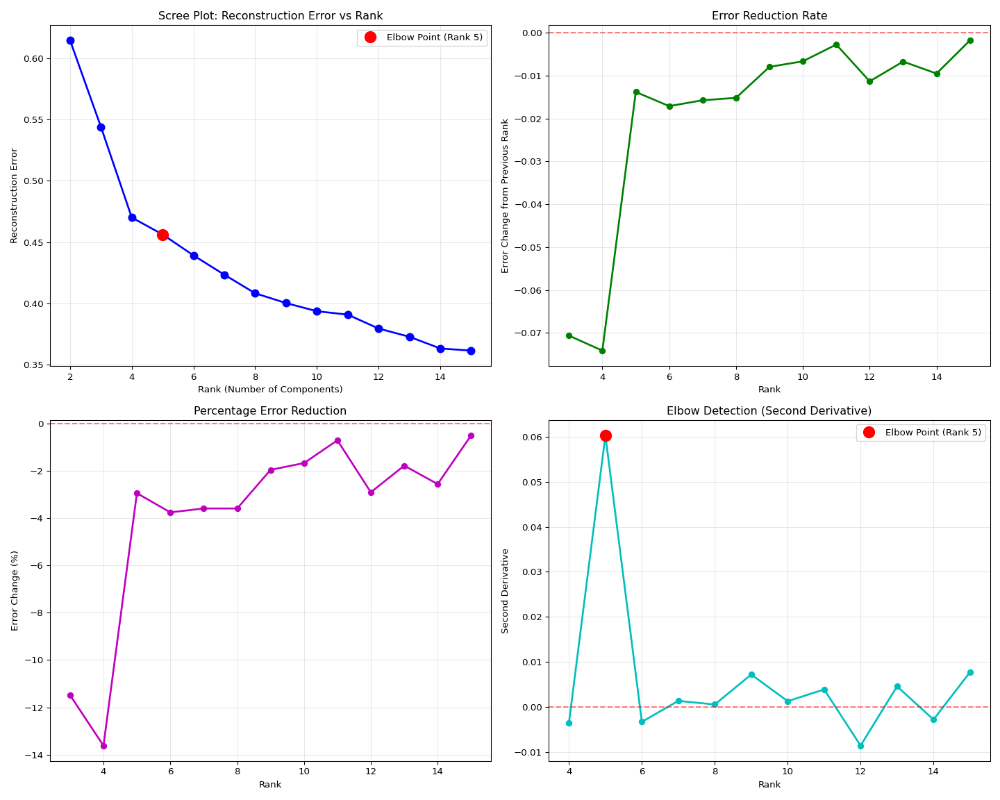

``` python

# Suppress output
None
```

## 3.4 Analyze optimal decomposition results

``` python
import numpy as np
import pandas as pd
import json
import matplotlib.pyplot as plt
import glob
import os

# Get output directory from R environment
output_dir = r.output_dir

# Find the main results directory
if 'main_results_dir' in globals():
    main_results_dir = globals()['main_results_dir']
else:
    # Fallback to find the most recent main results directory
    main_result_dirs = glob.glob(os.path.join(output_dir, "20*"))
    if main_result_dirs:
        main_results_dir = max(main_result_dirs)
    else:
        main_results_dir = output_dir

# Load rank selection summary to get optimal rank
summary_file = os.path.join(main_results_dir, "rank_selection_summary.json")
if os.path.exists(summary_file):
    with open(summary_file, 'r') as f:
        rank_summary = json.load(f)
    
    optimal_rank = rank_summary['suggested_rank']
    print(f"Analyzing optimal rank {optimal_rank} results from rank comparison data")
    
    # Find the optimal rank data in rank_comparison directory
    comparison_dir = os.path.join(main_results_dir, "rank_comparison")
    optimal_rank_dir = os.path.join(comparison_dir, f"rank_{optimal_rank:02d}")
    
    if os.path.exists(optimal_rank_dir):
        # Find the timestamped results within the rank directory
        result_dirs = glob.glob(os.path.join(optimal_rank_dir, "20*"))
        if result_dirs:
            latest_dir = max(result_dirs)
            print(f"Analyzing optimal results from: {latest_dir}")
            
            # Load summary
            with open(os.path.join(latest_dir, "summary.json")) as f:
                summary = json.load(f)
            
            print("\n" + "="*60)
            print("OPTIMAL DECOMPOSITION QUALITY ASSESSMENT")
            print("="*60)
            
            # Print key metrics
            print(f"Method: {summary['method'].upper()}")
            print(f"Rank: {summary['rank']} (data-driven selection)")
            print(f"Reconstruction Error: {summary['reconstruction_error']:.6f}")
            
            # Quality interpretation
            error = summary['reconstruction_error']
            if error < 0.1:
                quality = "Excellent (may be overfitting)"
            elif error < 0.3:
                quality = "Good"
            elif error < 0.5:
                quality = "Acceptable"
            else:
                quality = "Poor - consider increasing rank"
            
            print(f"Quality Assessment: {quality}")
            
            # Load factor matrices
            gene_factors = np.load(os.path.join(latest_dir, "gene_factors.npy"))
            species_factors = np.load(os.path.join(latest_dir, "species_factors.npy"))
            time_factors = np.load(os.path.join(latest_dir, "time_factors.npy"))
            
            print(f"\nFactor Matrix Shapes:")
            print(f"  Gene factors: {gene_factors.shape}")
            print(f"  Species factors: {species_factors.shape}")
            print(f"  Time factors: {time_factors.shape}")
            
            print(f"\nConvergence Check:")
            print(f"  All factors finite: {np.all(np.isfinite(gene_factors)) and np.all(np.isfinite(species_factors)) and np.all(np.isfinite(time_factors))}")
            print(f"  No NaN values: {not (np.any(np.isnan(gene_factors)) or np.any(np.isnan(species_factors)) or np.any(np.isnan(time_factors)))}")
            
            # Show component strengths
            print(f"\nComponent Analysis:")
            component_strengths = []
            for i in range(summary['rank']):
                gene_norm = np.linalg.norm(gene_factors[:, i])
                species_norm = np.linalg.norm(species_factors[:, i])
                time_norm = np.linalg.norm(time_factors[:, i])
                total_strength = gene_norm * species_norm * time_norm
                component_strengths.append(total_strength)
            
            # Sort components by strength
            sorted_components = np.argsort(component_strengths)[::-1]
            n_top = min(5, len(sorted_components))
            print(f"  Top {n_top} strongest components: {sorted_components[:n_top] + 1}")  # +1 for 1-based indexing
            
            # Find most variable timepoints
            print(f"\nTemporal Patterns:")
            time_variance = np.var(time_factors, axis=0)
            most_temporal = np.argsort(time_variance)[::-1][:n_top]
            print(f"  Components with strongest temporal patterns: {most_temporal + 1}")
            
            # Species diversity
            print(f"\nSpecies Patterns:")
            species_variance = np.var(species_factors, axis=0)
            most_species_specific = np.argsort(species_variance)[::-1][:n_top]
            print(f"  Components with strongest species differences: {most_species_specific + 1}")
            
            print(f"\n" + "="*60)
            print("CONCLUSION: The optimal decomposition successfully converged!")
            print(f"Results saved in: {latest_dir}")
            print("="*60)
            
            # Store latest_dir for subsequent analyses (this is now the rank_comparison data)
            globals()['optimal_results_dir'] = latest_dir
            
        else:
            print(f"No timestamped results found in rank_{optimal_rank:02d} directory!")
    else:
        print(f"Optimal rank {optimal_rank} directory not found in rank comparison!")
else:
    print("No rank selection summary found!")
```

    ## Analyzing optimal rank 5 results from rank comparison data
    ## Analyzing optimal results from: ../output/13.00-multiomics-stdm/20251015_190157/rank_comparison/rank_05/20251015_190351
    ## 
    ## ============================================================
    ## OPTIMAL DECOMPOSITION QUALITY ASSESSMENT
    ## ============================================================
    ## Method: PARAFAC
    ## Rank: 5 (data-driven selection)
    ## Reconstruction Error: 0.451016
    ## Quality Assessment: Acceptable
    ## 
    ## Factor Matrix Shapes:
    ##   Gene factors: (9800, 5)
    ##   Species factors: (30, 5)
    ##   Time factors: (4, 5)
    ## 
    ## Convergence Check:
    ##   All factors finite: True
    ##   No NaN values: True
    ## 
    ## Component Analysis:
    ##   Top 5 strongest components: [3 5 2 1 4]
    ## 
    ## Temporal Patterns:
    ##   Components with strongest temporal patterns: [5 4 3 2 1]
    ## 
    ## Species Patterns:
    ##   Components with strongest species differences: [1 2 3 4 5]
    ## 
    ## ============================================================
    ## CONCLUSION: The optimal decomposition successfully converged!
    ## Results saved in: ../output/13.00-multiomics-stdm/20251015_190157/rank_comparison/rank_05/20251015_190351
    ## ============================================================

# 4 VISUALIZATIONS

## 4.1 Generate visualizations for all tested ranks

This section creates comprehensive visualizations for each rank tested,
allowing comparison across different numbers of components.

``` python
import numpy as np
import pandas as pd
import matplotlib
matplotlib.use('Agg')  # Must be before importing pyplot
import matplotlib.pyplot as plt
import seaborn as sns
from sklearn.decomposition import PCA
import glob
import os
import json

# Set up plotting style  
plt.style.use('default')
sns.set_palette("husl")
plt.ioff()  # Turn off interactive mode

# Get output directory and find the main results directory
output_dir = r.output_dir

# Find the most recent main results directory (timestamped)
if 'main_results_dir' in globals():
    main_results_dir = globals()['main_results_dir']
else:
    main_result_dirs = glob.glob(os.path.join(output_dir, "20*"))
    if main_result_dirs:
        main_results_dir = max(main_result_dirs)
    else:
        main_results_dir = output_dir

comparison_dir = os.path.join(main_results_dir, "rank_comparison")

# Load rank comparison results
comparison_results_file = os.path.join(comparison_dir, "rank_comparison_results.json")

if os.path.exists(comparison_results_file):
    with open(comparison_results_file, 'r') as f:
        rank_results = json.load(f)
    
    # Load the transformed data
    data_file = os.path.join(output_dir, "vst_counts_matrix_long_format.csv")
    df_long = pd.read_csv(data_file)
    species_names = sorted(df_long['species'].unique())
    timepoint_names = sorted(df_long['timepoint'].unique())
    species_types = [name.split('-')[0] for name in species_names]
    unique_types = list(set(species_types))
    
    print("="*60)
    print("GENERATING VISUALIZATIONS FOR ALL TESTED RANKS")
    print("="*60)
    
    successful_ranks = []
    
    # Process each rank that completed successfully
    for rank_str, data in rank_results.items():
        rank = int(rank_str)
        result_dir = data.get('result_dir')
        
        if result_dir and not np.isnan(data['reconstruction_error']):
            successful_ranks.append(rank)
            
            print(f"\nProcessing visualizations for rank {rank}...")
            
            try:
                # Load factor matrices
                gene_factors = np.load(os.path.join(result_dir, "gene_factors.npy"))
                species_factors = np.load(os.path.join(result_dir, "species_factors.npy"))
                time_factors = np.load(os.path.join(result_dir, "time_factors.npy"))
                
                # Calculate component strengths
                component_strengths = []
                for i in range(gene_factors.shape[1]):
                    gene_norm = np.linalg.norm(gene_factors[:, i])
                    species_norm = np.linalg.norm(species_factors[:, i])
                    time_norm = np.linalg.norm(time_factors[:, i])
                    total_strength = gene_norm * species_norm * time_norm
                    component_strengths.append(total_strength)
                
                # Sort components by strength
                sorted_components = np.argsort(component_strengths)[::-1]
                n_top_display = min(5, rank)
                top_components = sorted_components[:n_top_display]
                
                # Create comprehensive visualization for this rank
                fig = plt.figure(figsize=(16, 12))
                
                # 1. Component strengths
                plt.subplot(3, 3, 1)
                plt.bar(range(1, len(component_strengths) + 1), 
                        [component_strengths[i] for i in sorted_components])
                plt.xlabel('Component (ranked by strength)')
                plt.ylabel('Component Strength')
                plt.title(f'Component Strengths (Rank {rank})')
                if rank <= 10:
                    plt.xticks(range(1, rank + 1))
                
                # 2. Temporal patterns heatmap
                plt.subplot(3, 3, 2)
                time_data = time_factors[:, top_components]
                sns.heatmap(time_data.T, 
                            xticklabels=timepoint_names,
                            yticklabels=[f'C{i+1}' for i in top_components],
                            cmap='RdBu_r', center=0, annot=True, fmt='.2f')
                plt.title(f'Top {n_top_display} Components: Temporal')
                plt.xlabel('Timepoint')
                
                # 3. Species clustering PCA
                plt.subplot(3, 3, 3)
                if rank >= 2:
                    n_pca_components = min(rank, 10)
                    species_subset = species_factors[:, sorted_components[:n_pca_components]]
                    
                    pca = PCA(n_components=2)
                    species_pca = pca.fit_transform(species_subset)
                    
                    colors = ['red', 'blue', 'green', 'orange', 'purple'][:len(unique_types)]
                    species_type_map = {stype: i for i, stype in enumerate(unique_types)}
                    
                    for i, (x, y) in enumerate(species_pca):
                        stype = species_types[i]
                        plt.scatter(x, y, c=colors[species_type_map[stype]], 
                                   alpha=0.7, s=40, 
                                   label=stype if i == species_types.index(stype) else "")
                    
                    plt.xlabel(f'PC1 ({pca.explained_variance_ratio_[0]:.1%})')
                    plt.ylabel(f'PC2 ({pca.explained_variance_ratio_[1]:.1%})')
                    plt.title(f'Species PCA (Rank {rank})')
                    plt.legend()
                    plt.grid(True, alpha=0.3)
                
                # 4. Temporal trajectories
                plt.subplot(3, 3, 4)
                for i, comp_idx in enumerate(top_components):
                    plt.plot(range(1, len(timepoint_names) + 1), 
                            time_factors[:, comp_idx], 
                            marker='o', linewidth=2, label=f'C{comp_idx + 1}')
                plt.xlabel('Timepoint')
                plt.ylabel('Factor Value')
                plt.title(f'Temporal Trajectories (Rank {rank})')
                plt.xticks(range(1, len(timepoint_names) + 1), timepoint_names)
                plt.legend()
                plt.grid(True, alpha=0.3)
                
                # 5. Component correlations
                plt.subplot(3, 3, 5)
                gene_corr = np.corrcoef(gene_factors.T)
                sns.heatmap(gene_corr, cmap='RdBu_r', center=0, 
                            xticklabels=range(1, rank + 1),
                            yticklabels=range(1, rank + 1),
                            square=True)
                plt.title(f'Component Correlations (Rank {rank})')
                
                # 6. Species type comparison
                plt.subplot(3, 3, 6)
                species_by_type = {}
                for i, name in enumerate(species_names):
                    stype = name.split('-')[0]
                    if stype not in species_by_type:
                        species_by_type[stype] = []
                    species_by_type[stype].append(i)
                
                type_means = {}
                for stype, indices in species_by_type.items():
                    type_means[stype] = np.mean(species_factors[indices, :], axis=0)
                
                x_pos = np.arange(len(top_components))
                width = 0.8 / len(type_means)
                
                for i, (stype, means) in enumerate(type_means.items()):
                    plt.bar(x_pos + i * width, means[top_components], 
                           width, label=stype, alpha=0.8)
                
                plt.xlabel('Component')
                plt.ylabel('Mean Factor Value')
                plt.title(f'Species Comparison (Rank {rank})')
                plt.xticks(x_pos + width * (len(type_means) - 1) / 2, 
                           [f'C{i+1}' for i in top_components])
                plt.legend()
                
                # 7. Temporal variance
                plt.subplot(3, 3, 7)
                time_variances = np.var(time_factors, axis=0)
                sorted_time_vars = np.argsort(time_variances)[::-1]
                
                plt.bar(range(1, len(time_variances) + 1), 
                       [time_variances[i] for i in sorted_time_vars])
                plt.xlabel('Component (by temporal variance)')
                plt.ylabel('Temporal Variance')
                plt.title(f'Temporal Variability (Rank {rank})')
                if rank <= 10:
                    plt.xticks(range(1, rank + 1))
                
                # 8. Species variance
                plt.subplot(3, 3, 8)
                species_variances = np.var(species_factors, axis=0)
                sorted_species_vars = np.argsort(species_variances)[::-1]
                
                plt.bar(range(1, len(species_variances) + 1), 
                       [species_variances[i] for i in sorted_species_vars])
                plt.xlabel('Component (by species variance)')
                plt.ylabel('Species Variance')
                plt.title(f'Species Variability (Rank {rank})')
                if rank <= 10:
                    plt.xticks(range(1, rank + 1))
                
                # 9. Gene factor distribution
                plt.subplot(3, 3, 9)
                gene_variances = np.var(gene_factors, axis=1)
                plt.hist(gene_variances, bins=30, alpha=0.7, edgecolor='black')
                plt.xlabel('Gene Factor Variance')
                plt.ylabel('Number of Genes')
                plt.title(f'Gene Variability (Rank {rank})')
                plt.grid(True, alpha=0.3)
                
                plt.tight_layout()
                
                # Save rank-specific visualization in the main results directory for easy access
                rank_plot_file = os.path.join(main_results_dir, f"rank_{rank:02d}_comprehensive_visualization.png")
                plt.savefig(rank_plot_file, dpi=300, bbox_inches='tight')
                print(f"  Saved: {rank_plot_file}")
                
                # Also save in the rank-specific subdirectory
                rank_subdir_plot = os.path.join(result_dir, f"rank_{rank:02d}_comprehensive_visualization.png")
                plt.savefig(rank_subdir_plot, dpi=300, bbox_inches='tight')
                
                plt.close()  # Close the figure to free memory instead of showing all plots
                
            except Exception as e:
                print(f"  Error processing rank {rank}: {e}")
    
    print(f"\nSuccessfully generated visualizations for ranks: {successful_ranks}")
    
else:
    print("Rank comparison results file not found!")

# Suppress output
None
```

## 4.2 Visualize optimal decomposition results

``` python
import numpy as np
import pandas as pd
import matplotlib
import matplotlib.pyplot as plt
import seaborn as sns
from sklearn.cluster import KMeans
from sklearn.decomposition import PCA
import glob
import os
import json

# Set up plotting style
matplotlib.use('Agg')  # Use non-interactive backend
plt.style.use('default')
sns.set_palette("husl")
plt.ioff()  # Turn off interactive mode

# Get output directory from R environment
output_dir = r.output_dir

# Find the main results directory
if 'main_results_dir' in globals():
    main_results_dir = globals()['main_results_dir']
else:
    main_result_dirs = glob.glob(os.path.join(output_dir, "20*"))
    if main_result_dirs:
        main_results_dir = max(main_result_dirs)
    else:
        main_results_dir = output_dir

# Load rank selection summary to get optimal rank
summary_file = os.path.join(main_results_dir, "rank_selection_summary.json")
if os.path.exists(summary_file):
    with open(summary_file, 'r') as f:
        rank_summary = json.load(f)
    
    optimal_rank = rank_summary['suggested_rank']
    print(f"Visualizing optimal rank {optimal_rank} results from rank comparison data")
    
    # Find the optimal rank data in rank_comparison directory
    comparison_dir = os.path.join(main_results_dir, "rank_comparison")
    optimal_rank_dir = os.path.join(comparison_dir, f"rank_{optimal_rank:02d}")
    
    if os.path.exists(optimal_rank_dir):
        # Find the timestamped results within the rank directory
        result_dirs = glob.glob(os.path.join(optimal_rank_dir, "20*"))
        if result_dirs:
            latest_dir = max(result_dirs)
            print(f"Using optimal analysis data from: {latest_dir}")
        else:
            print(f"No timestamped results found in rank_{optimal_rank:02d} directory!")
            latest_dir = None
    else:
        print(f"Optimal rank {optimal_rank} directory not found in rank comparison!")
        latest_dir = None
else:
    print("No rank selection summary found!")
    latest_dir = None

if latest_dir:
    print(f"Visualizing results from: {latest_dir}")
    
    # Load all data
    gene_factors = np.load(os.path.join(latest_dir, "gene_factors.npy"))
    species_factors = np.load(os.path.join(latest_dir, "species_factors.npy"))
    time_factors = np.load(os.path.join(latest_dir, "time_factors.npy"))
    
    # Load the transformed data to get species names
    data_file = os.path.join(output_dir, "vst_counts_matrix_long_format.csv")
    df_long = pd.read_csv(data_file)
    
    # Get unique species and timepoint names
    species_names = sorted(df_long['species'].unique())
    timepoint_names = sorted(df_long['timepoint'].unique())
    
    # Calculate component strengths
    component_strengths = []
    for i in range(gene_factors.shape[1]):
        gene_norm = np.linalg.norm(gene_factors[:, i])
        species_norm = np.linalg.norm(species_factors[:, i])
        time_norm = np.linalg.norm(time_factors[:, i])
        total_strength = gene_norm * species_norm * time_norm
        component_strengths.append(total_strength)
    
    # Sort components by strength
    sorted_components = np.argsort(component_strengths)[::-1]
    
    # Determine how many top components to show (max 5, or all if fewer)
    n_components = gene_factors.shape[1]
    n_top_display = min(5, n_components)
    
    # Create figure with multiple subplots
    fig = plt.figure(figsize=(20, 24))
    
    # 1. Component strengths bar plot
    plt.subplot(4, 3, 1)
    plt.bar(range(1, len(component_strengths) + 1), 
            [component_strengths[i] for i in sorted_components])
    plt.xlabel('Component (ranked by strength)')
    plt.ylabel('Component Strength')
    plt.title('Component Strengths (Gene × Species × Time norms)')
    if n_components <= 10:
        plt.xticks(range(1, n_components + 1))
    else:
        plt.xticks(range(1, n_components + 1, max(1, n_components // 10)))
    
    # 2. Time factors heatmap for top components
    plt.subplot(4, 3, 2)
    top_components = sorted_components[:n_top_display]
    time_data = time_factors[:, top_components]
    sns.heatmap(time_data.T, 
                xticklabels=timepoint_names,
                yticklabels=[f'Comp {i+1}' for i in top_components],
                cmap='RdBu_r', center=0, annot=True, fmt='.3f')
    plt.title(f'Top {n_top_display} Components: Temporal Patterns')
    plt.xlabel('Timepoint')
    plt.ylabel('Component')
    
    # 3. Species factors heatmap for top components
    plt.subplot(4, 3, 3)
    species_data = species_factors[:, top_components]
    
    # Create species type labels for better visualization
    species_types = [name.split('-')[0] for name in species_names]
    unique_types = list(set(species_types))
    type_colors = plt.cm.Set3(np.linspace(0, 1, len(unique_types)))
    
    sns.heatmap(species_data.T,
                xticklabels=[f"{name[:8]}..." if len(name) > 8 else name for name in species_names],
                yticklabels=[f'Comp {i+1}' for i in top_components],
                cmap='RdBu_r', center=0)
    plt.title(f'Top {n_top_display} Components: Species Patterns')
    plt.xlabel('Individual')
    plt.ylabel('Component')
    plt.xticks(rotation=90)
    
    # 4. Temporal patterns for strongest components
    plt.subplot(4, 3, 4)
    for i, comp_idx in enumerate(top_components):
        plt.plot(range(1, len(timepoint_names) + 1), 
                time_factors[:, comp_idx], 
                marker='o', linewidth=2, label=f'Component {comp_idx + 1}')
    plt.xlabel('Timepoint')
    plt.ylabel('Factor Value')
    plt.title(f'Temporal Trajectories (Top {n_top_display} Components)')
    plt.xticks(range(1, len(timepoint_names) + 1), timepoint_names)
    plt.legend()
    plt.grid(True, alpha=0.3)
    
    # 5. Species clustering based on factor loadings
    plt.subplot(4, 3, 5)
    # Use all components for clustering if <= 10, otherwise top 10
    n_cluster_components = min(10, n_components)
    species_subset = species_factors[:, sorted_components[:n_cluster_components]]
    
    # PCA for visualization
    if species_subset.shape[1] >= 2:
        pca = PCA(n_components=2)
        species_pca = pca.fit_transform(species_subset)
        
        # Color by species type
        colors = ['red', 'blue', 'green', 'orange', 'purple', 'brown'][:len(unique_types)]
        species_type_map = {stype: i for i, stype in enumerate(unique_types)}
        
        for i, (x, y) in enumerate(species_pca):
            stype = species_types[i]
            plt.scatter(x, y, c=colors[species_type_map[stype]], 
                       alpha=0.7, s=60, label=stype if i == species_types.index(stype) else "")
        
        plt.xlabel(f'PC1 ({pca.explained_variance_ratio_[0]:.1%} variance)')
        plt.ylabel(f'PC2 ({pca.explained_variance_ratio_[1]:.1%} variance)')
        plt.title('Species Clustering (PCA of Factor Loadings)')
        plt.legend()
        plt.grid(True, alpha=0.3)
    else:
        plt.text(0.5, 0.5, 'Not enough components\nfor PCA visualization', 
                transform=plt.gca().transAxes, ha='center', va='center')
        plt.title('Species Clustering (Insufficient Components)')
    
    # 6. Gene factor distribution
    plt.subplot(4, 3, 6)
    gene_variances = np.var(gene_factors, axis=1)
    plt.hist(gene_variances, bins=50, alpha=0.7, edgecolor='black')
    plt.xlabel('Gene Factor Variance')
    plt.ylabel('Number of Genes')
    plt.title('Distribution of Gene Factor Variability')
    plt.grid(True, alpha=0.3)
    
    # 7. Component correlation matrix
    plt.subplot(4, 3, 7)
    # Calculate correlations between components across genes
    gene_corr = np.corrcoef(gene_factors.T)
    sns.heatmap(gene_corr, cmap='RdBu_r', center=0, 
                xticklabels=range(1, gene_factors.shape[1] + 1),
                yticklabels=range(1, gene_factors.shape[1] + 1))
    plt.title('Component Correlations (Gene Space)')
    plt.xlabel('Component')
    plt.ylabel('Component')
    
    # 8. Species type comparison
    plt.subplot(4, 3, 8)
    species_by_type = {}
    for i, name in enumerate(species_names):
        stype = name.split('-')[0]
        if stype not in species_by_type:
            species_by_type[stype] = []
        species_by_type[stype].append(i)
    
    # Calculate mean factor values per species type for top components
    type_means = {}
    for stype, indices in species_by_type.items():
        type_means[stype] = np.mean(species_factors[indices, :], axis=0)
    
    # Plot for top components
    x_pos = np.arange(len(top_components))
    width = 0.8 / len(type_means)  # Adjust width based on number of species types
    
    for i, (stype, means) in enumerate(type_means.items()):
        plt.bar(x_pos + i * width, means[top_components], 
               width, label=stype, alpha=0.8)
    
    plt.xlabel('Component')
    plt.ylabel('Mean Factor Value')
    plt.title(f'Species Type Comparison (Top {n_top_display} Components)')
    plt.xticks(x_pos + width * (len(type_means) - 1) / 2, 
               [f'Comp {i+1}' for i in top_components])
    plt.legend()
    plt.grid(True, alpha=0.3)
    
    # 9. Temporal variance per component
    plt.subplot(4, 3, 9)
    time_variances = np.var(time_factors, axis=0)
    sorted_time_vars = np.argsort(time_variances)[::-1]
    
    plt.bar(range(1, len(time_variances) + 1), 
           [time_variances[i] for i in sorted_time_vars])
    plt.xlabel('Component (ranked by temporal variance)')
    plt.ylabel('Temporal Variance')
    plt.title('Components by Temporal Variability')
    if n_components <= 10:
        plt.xticks(range(1, n_components + 1))
    else:
        plt.xticks(range(1, n_components + 1, max(1, n_components // 10)))
    
    # 10. Species variance per component
    plt.subplot(4, 3, 10)
    species_variances = np.var(species_factors, axis=0)
    sorted_species_vars = np.argsort(species_variances)[::-1]
    
    plt.bar(range(1, len(species_variances) + 1), 
           [species_variances[i] for i in sorted_species_vars])
    plt.xlabel('Component (ranked by species variance)')
    plt.ylabel('Species Variance')
    plt.title('Components by Species Variability')
    if n_components <= 10:
        plt.xticks(range(1, n_components + 1))
    else:
        plt.xticks(range(1, n_components + 1, max(1, n_components // 10)))
    
    # 11. Top genes per component heatmap
    plt.subplot(4, 3, 11)
    n_top_genes = 10
    top_gene_indices = []
    
    # Get top genes for each of the top components
    for comp_idx in top_components:
        top_genes = np.argsort(np.abs(gene_factors[:, comp_idx]))[-n_top_genes:]
        top_gene_indices.extend(top_genes)
    
    top_gene_indices = list(set(top_gene_indices))  # Remove duplicates
    top_gene_data = gene_factors[top_gene_indices, :][:, top_components]
    
    sns.heatmap(top_gene_data, 
                cmap='RdBu_r', center=0,
                yticklabels=[f'Gene {i}' for i in top_gene_indices],
                xticklabels=[f'Comp {i+1}' for i in top_components])
    plt.title(f'Top {len(top_gene_indices)} Genes × Top {n_top_display} Components')
    plt.xlabel('Component')
    plt.ylabel('Gene')
    
    # 12. Reconstruction quality assessment
    plt.subplot(4, 3, 12)
    # Load reconstructed tensor
    reconstructed = np.load(os.path.join(latest_dir, "reconstructed_tensor.npy"))
    
    # Create original tensor from the long format data
    # Pivot to get the original tensor structure
    original_pivot = df_long.pivot_table(values='expression', 
                                       index='gene', 
                                       columns=['species', 'timepoint'], 
                                       fill_value=0)
    
    print(f"Debug: Original pivot shape: {original_pivot.shape}")
    print(f"Debug: Reconstructed tensor shape: {reconstructed.shape}")
    print(f"Debug: Expected shape: ({gene_factors.shape[0]}, {species_factors.shape[0]}, {time_factors.shape[0]})")
    
    # Check if we can safely reshape
    expected_size = gene_factors.shape[0] * species_factors.shape[0] * time_factors.shape[0]
    actual_size = original_pivot.size
    
    if actual_size == expected_size:
        # Reshape the pivot table to match tensor format
        n_genes, n_species, n_timepoints = gene_factors.shape[0], species_factors.shape[0], time_factors.shape[0]
        original_reshaped = original_pivot.values.reshape(n_genes, n_species, n_timepoints)
        
        # Calculate per-gene reconstruction error
        gene_errors = np.mean(np.abs(original_reshaped - reconstructed), axis=(1, 2))
        
        plt.hist(gene_errors, bins=50, alpha=0.7, edgecolor='black')
        plt.xlabel('Mean Absolute Error per Gene')
        plt.ylabel('Number of Genes')
        plt.title('Reconstruction Error Distribution')
        plt.axvline(np.mean(gene_errors), color='red', linestyle='--', 
                   label=f'Mean: {np.mean(gene_errors):.3f}')
        plt.legend()
        plt.grid(True, alpha=0.3)
    else:
        # If reshape fails, show a simpler quality metric
        # Calculate overall reconstruction quality using Frobenius norm
        original_flat = original_pivot.values.flatten()
        reconstructed_flat = reconstructed.flatten()
        
        # Ensure both arrays are the same size by taking the minimum
        min_size = min(len(original_flat), len(reconstructed_flat))
        original_flat = original_flat[:min_size]
        reconstructed_flat = reconstructed_flat[:min_size]
        
        residuals = original_flat - reconstructed_flat
        
        plt.hist(residuals, bins=50, alpha=0.7, edgecolor='black')
        plt.xlabel('Reconstruction Residuals')
        plt.ylabel('Frequency')
        plt.title('Reconstruction Residuals Distribution')
        plt.axvline(np.mean(residuals), color='red', linestyle='--', 
                   label=f'Mean: {np.mean(residuals):.3f}')
        plt.axvline(0, color='black', linestyle=':', alpha=0.5, label='Perfect fit')
        plt.legend()
        plt.grid(True, alpha=0.3)
    
    plt.tight_layout()
    
    # Save the plot in main results directory
    plot_file = os.path.join(main_results_dir, f"optimal_tensor_decomposition_visualization_rank_{optimal_rank}.png")
    plt.savefig(plot_file, dpi=300, bbox_inches='tight')
    print(f"\nOptimal visualization saved to: {plot_file}")
    
    plt.show()
    
    # Print interpretation guide
    print("\n" + "="*60)
    print("OPTIMAL VISUALIZATION INTERPRETATION GUIDE")
    print("="*60)
    print("1. Component Strengths: Shows which components capture most variation")
    print("2. Temporal Patterns: How each component changes over time")
    print("3. Species Patterns: How each individual loads on components")
    print("4. Temporal Trajectories: Line plots of time patterns")
    print("5. Species Clustering: PCA showing individual similarities")
    print("6. Gene Variability: Distribution of gene response diversity")
    print("7. Component Correlations: Independence of components")
    print("8. Species Type Comparison: Average patterns by species type")
    print("9. Temporal Variance: Which components show most time variation")
    print("10. Species Variance: Which components show most individual variation")
    print("11. Top Genes Heatmap: Key genes driving each component")
    print("12. Reconstruction Quality: How well the optimal model fits the data")
    
else:
    print("No optimal rank results found!")
```

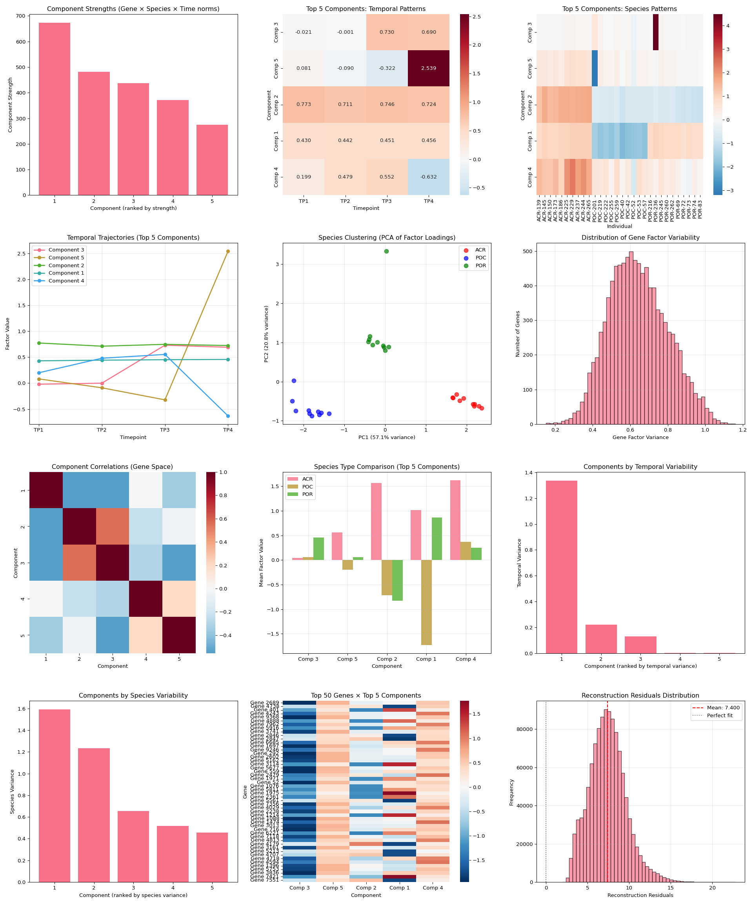

``` python

# Suppress output
None
```

## 4.3 Individual Plot 1: Component Strengths

``` python
import numpy as np
import pandas as pd
import matplotlib
import matplotlib.pyplot as plt
import glob
import os
import json

# Set up plotting
matplotlib.use('Agg')  # Use non-interactive backend
plt.ioff()  # Turn off interactive mode

# Get output directory from R environment
output_dir = r.output_dir

# Look for main results directory
if 'main_results_dir' in globals():
    main_results_dir = globals()['main_results_dir']
else:
    main_result_dirs = glob.glob(os.path.join(output_dir, "20*"))
    if main_result_dirs:
        main_results_dir = max(main_result_dirs)
    else:
        main_results_dir = None

# Get the optimal rank from the rank selection summary
if main_results_dir:
    summary_file = os.path.join(main_results_dir, "rank_selection_summary.json")
    if os.path.exists(summary_file):
        with open(summary_file, 'r') as f:
            rank_summary = json.load(f)
        optimal_rank = rank_summary['suggested_rank']
        print(f"Using optimal rank {optimal_rank} (from rank selection analysis)")
    else:
        print("No rank selection summary found! Cannot determine optimal rank.")
        optimal_rank = None
        main_results_dir = None
else:
    print("No main results directory found!")
    optimal_rank = None

# Look for the optimal rank data in rank_comparison directory
latest_dir = None
if main_results_dir and optimal_rank:
    comparison_dir = os.path.join(main_results_dir, "rank_comparison")
    optimal_rank_dir = os.path.join(comparison_dir, f"rank_{optimal_rank:02d}")
    
    if os.path.exists(optimal_rank_dir):
        # Find the timestamped results within the rank directory
        result_dirs = glob.glob(os.path.join(optimal_rank_dir, "20*"))
        if result_dirs:
            latest_dir = max(result_dirs)
            print(f"Using optimal rank {optimal_rank} data from: {latest_dir}")
        else:
            print(f"No timestamped results found in rank_{optimal_rank:02d} directory!")
    else:
        print(f"Optimal rank {optimal_rank} directory not found!")

if latest_dir:
    
    # Load data
    gene_factors = np.load(os.path.join(latest_dir, "gene_factors.npy"))
    species_factors = np.load(os.path.join(latest_dir, "species_factors.npy"))
    time_factors = np.load(os.path.join(latest_dir, "time_factors.npy"))
    
    # Calculate component strengths
    component_strengths = []
    for i in range(gene_factors.shape[1]):
        gene_norm = np.linalg.norm(gene_factors[:, i])
        species_norm = np.linalg.norm(species_factors[:, i])
        time_norm = np.linalg.norm(time_factors[:, i])
        total_strength = gene_norm * species_norm * time_norm
        component_strengths.append(total_strength)
    
    # Sort components by strength
    sorted_components = np.argsort(component_strengths)[::-1]
    
    # Create plot
    plt.figure(figsize=(12, 6))
    plt.bar(range(1, len(component_strengths) + 1), 
            [component_strengths[i] for i in sorted_components])
    plt.xlabel('Component (ranked by strength)')
    plt.ylabel('Component Strength')
    plt.title(f'Component Strengths (Optimal Rank {optimal_rank})')
    
    # Set x-ticks to show all components if <= 10, otherwise show every 2nd or 5th
    n_components = len(component_strengths)
    if n_components <= 10:
        plt.xticks(range(1, n_components + 1))
    elif n_components <= 20:
        plt.xticks(range(1, n_components + 1, 2))
    else:
        plt.xticks(range(1, n_components + 1, 5))
    
    plt.grid(True, alpha=0.3)
    
    # Save individual plot in main results directory
    if main_results_dir:
        plot_file = os.path.join(main_results_dir, f"plot_01_component_strengths_optimal_rank_{optimal_rank}.png")
        plt.savefig(plot_file, dpi=300, bbox_inches='tight')
        print(f"Component strengths plot saved to: {plot_file}")
    
    plt.show()
else:
    print(f"Could not load data for optimal rank {optimal_rank if optimal_rank else 'unknown'}")
```

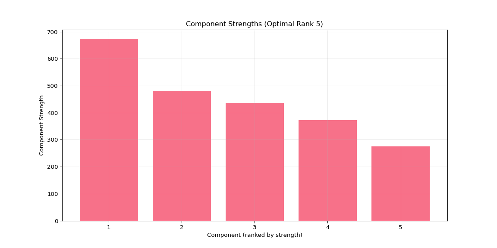

``` python

# Suppress output
None
```

## 4.4 Individual Plot 2: Temporal Patterns Heatmap

``` python
import numpy as np
import pandas as pd
import matplotlib
import matplotlib.pyplot as plt
import seaborn as sns
import glob
import os
import json

# Set up plotting
matplotlib.use('Agg')  # Use non-interactive backend
plt.ioff()  # Turn off interactive mode

# Get output directory from R environment
output_dir = r.output_dir

# Look for main results directory
if 'main_results_dir' in globals():
    main_results_dir = globals()['main_results_dir']
else:
    main_result_dirs = glob.glob(os.path.join(output_dir, "20*"))
    if main_result_dirs:
        main_results_dir = max(main_result_dirs)
    else:
        main_results_dir = None

# Get the optimal rank from the rank selection summary
if main_results_dir:
    summary_file = os.path.join(main_results_dir, "rank_selection_summary.json")
    if os.path.exists(summary_file):
        with open(summary_file, 'r') as f:
            rank_summary = json.load(f)
        optimal_rank = rank_summary['suggested_rank']
        print(f"Using optimal rank {optimal_rank} (from rank selection analysis)")
    else:
        print("No rank selection summary found! Cannot determine optimal rank.")
        optimal_rank = None
        main_results_dir = None
else:
    print("No main results directory found!")
    optimal_rank = None

# Look for the optimal rank data in rank_comparison directory
latest_dir = None
if main_results_dir and optimal_rank:
    comparison_dir = os.path.join(main_results_dir, "rank_comparison")
    optimal_rank_dir = os.path.join(comparison_dir, f"rank_{optimal_rank:02d}")
    
    if os.path.exists(optimal_rank_dir):
        # Find the timestamped results within the rank directory
        result_dirs = glob.glob(os.path.join(optimal_rank_dir, "20*"))
        if result_dirs:
            latest_dir = max(result_dirs)
            print(f"Using optimal rank {optimal_rank} data from: {latest_dir}")
        else:
            print(f"No timestamped results found in rank_{optimal_rank:02d} directory!")
    else:
        print(f"Optimal rank {optimal_rank} directory not found!")

if latest_dir:
    
    # Load data
    gene_factors = np.load(os.path.join(latest_dir, "gene_factors.npy"))
    species_factors = np.load(os.path.join(latest_dir, "species_factors.npy"))
    time_factors = np.load(os.path.join(latest_dir, "time_factors.npy"))
    
    # Load the transformed data to get timepoint names
    data_file = os.path.join(output_dir, "vst_counts_matrix_long_format.csv")
    df_long = pd.read_csv(data_file)
    timepoint_names = sorted(df_long['timepoint'].unique())
    
    # Calculate component strengths and get top 5
    component_strengths = []
    for i in range(gene_factors.shape[1]):
        gene_norm = np.linalg.norm(gene_factors[:, i])
        species_norm = np.linalg.norm(species_factors[:, i])
        time_norm = np.linalg.norm(time_factors[:, i])
        total_strength = gene_norm * species_norm * time_norm
        component_strengths.append(total_strength)
    
    sorted_components = np.argsort(component_strengths)[::-1]
    top_5_components = sorted_components[:min(5, optimal_rank)]  # Use min to handle ranks < 5
    
    # Create heatmap
    plt.figure(figsize=(10, 6))
    time_data = time_factors[:, top_5_components]
    # Add a labeled colorbar so readers know what the colors represent
    sns.heatmap(time_data.T, 
                xticklabels=timepoint_names,
                yticklabels=[f'Component {i+1}' for i in top_5_components],
                cmap='RdBu_r', center=0, annot=True, fmt='.3f',
                cbar=True, cbar_kws={'label': 'Time factor value (loading)'} ,
                linewidths=0.5)
    plt.title(f'Top {len(top_5_components)} Components: Temporal Patterns (Optimal Rank {optimal_rank})')
    plt.xlabel('Timepoint')
    plt.ylabel('Component')
    
    # Save individual plot in main results directory
    if main_results_dir:
        plot_file = os.path.join(main_results_dir, f"plot_02_temporal_heatmap_optimal_rank_{optimal_rank}.png")
        plt.savefig(plot_file, dpi=300, bbox_inches='tight')
        print(f"Temporal patterns heatmap saved to: {plot_file}")
    
    plt.show()
else:
    print(f"Could not load data for optimal rank {optimal_rank if optimal_rank else 'unknown'}")
```

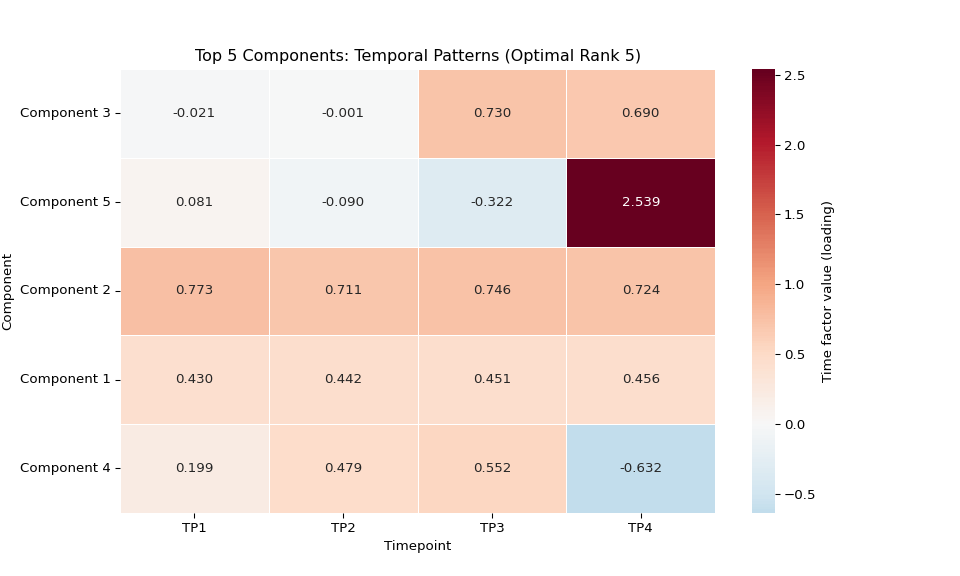

``` python

# Suppress output
None
```

## 4.5 Individual Plot 3: Species Patterns Heatmap

``` python
import numpy as np
import pandas as pd
import matplotlib
import matplotlib.pyplot as plt
import seaborn as sns
import glob
import os
import json

# Set up plotting
matplotlib.use('Agg')  # Use non-interactive backend
plt.ioff()  # Turn off interactive mode

# Get output directory from R environment
output_dir = r.output_dir

# Look for main results directory
if 'main_results_dir' in globals():
    main_results_dir = globals()['main_results_dir']
else:
    main_result_dirs = glob.glob(os.path.join(output_dir, "20*"))
    if main_result_dirs:
        main_results_dir = max(main_result_dirs)
    else:
        main_results_dir = None

# Get the optimal rank from the rank selection summary
if main_results_dir:
    summary_file = os.path.join(main_results_dir, "rank_selection_summary.json")
    if os.path.exists(summary_file):
        with open(summary_file, 'r') as f:
            rank_summary = json.load(f)
        optimal_rank = rank_summary['suggested_rank']
        print(f"Using optimal rank {optimal_rank} (from rank selection analysis)")
    else:
        print("No rank selection summary found! Cannot determine optimal rank.")
        optimal_rank = None
        main_results_dir = None
else:
    print("No main results directory found!")
    optimal_rank = None

# Look for the optimal rank data in rank_comparison directory
latest_dir = None
if main_results_dir and optimal_rank:
    comparison_dir = os.path.join(main_results_dir, "rank_comparison")
    optimal_rank_dir = os.path.join(comparison_dir, f"rank_{optimal_rank:02d}")
    
    if os.path.exists(optimal_rank_dir):
        # Find the timestamped results within the rank directory
        result_dirs = glob.glob(os.path.join(optimal_rank_dir, "20*"))
        if result_dirs:
            latest_dir = max(result_dirs)
            print(f"Using optimal rank {optimal_rank} data from: {latest_dir}")
        else:
            print(f"No timestamped results found in rank_{optimal_rank:02d} directory!")
    else:
        print(f"Optimal rank {optimal_rank} directory not found!")

if latest_dir:
    
    # Load data
    gene_factors = np.load(os.path.join(latest_dir, "gene_factors.npy"))
    species_factors = np.load(os.path.join(latest_dir, "species_factors.npy"))
    time_factors = np.load(os.path.join(latest_dir, "time_factors.npy"))
    
    # Load the transformed data to get species names
    data_file = os.path.join(output_dir, "vst_counts_matrix_long_format.csv")
    df_long = pd.read_csv(data_file)
    species_names = sorted(df_long['species'].unique())
    
    # Calculate component strengths and get top 5
    component_strengths = []
    for i in range(gene_factors.shape[1]):
        gene_norm = np.linalg.norm(gene_factors[:, i])
        species_norm = np.linalg.norm(species_factors[:, i])
        time_norm = np.linalg.norm(time_factors[:, i])
        total_strength = gene_norm * species_norm * time_norm
        component_strengths.append(total_strength)
    
    sorted_components = np.argsort(component_strengths)[::-1]
    top_5_components = sorted_components[:min(5, optimal_rank)]  # Use min to handle ranks < 5
    
    # Create heatmap
    plt.figure(figsize=(16, 6))
    species_data = species_factors[:, top_5_components]
    
    # Add a labeled colorbar so readers know what the colors represent
    sns.heatmap(species_data.T,
                xticklabels=[f"{name[:8]}..." if len(name) > 8 else name for name in species_names],
                yticklabels=[f'Component {i+1}' for i in top_5_components],
                cmap='RdBu_r', center=0,
                cbar=True, cbar_kws={'label': 'Species factor value (loading)'},
                linewidths=0.5)
    plt.title(f'Top {len(top_5_components)} Components: Species Patterns (Optimal Rank {optimal_rank})')
    plt.xlabel('Individual')
    plt.ylabel('Component')
    plt.xticks(rotation=90)
    
    # Save individual plot in main results directory
    if main_results_dir:
        plot_file = os.path.join(main_results_dir, f"plot_03_species_heatmap_optimal_rank_{optimal_rank}.png")
        plt.savefig(plot_file, dpi=300, bbox_inches='tight')
        print(f"Species patterns heatmap saved to: {plot_file}")
    
    plt.show()
else:
    print(f"Could not load data for optimal rank {optimal_rank if optimal_rank else 'unknown'}")
```

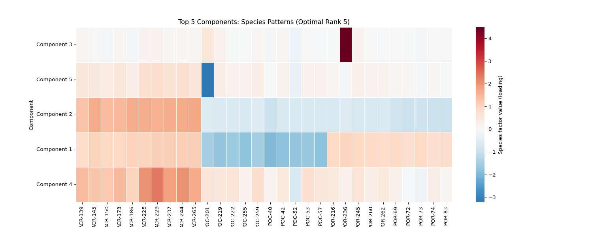

``` python

# Suppress output
None
```

## 4.6 Individual Plot 4: Temporal Trajectories

``` python
import numpy as np
import pandas as pd
import matplotlib
import matplotlib.pyplot as plt
import glob
import os
import json

# Set up plotting
matplotlib.use('Agg')  # Use non-interactive backend
plt.ioff()  # Turn off interactive mode

# Get output directory from R environment
output_dir = r.output_dir

# Look for main results directory
if 'main_results_dir' in globals():
    main_results_dir = globals()['main_results_dir']
else:
    main_result_dirs = glob.glob(os.path.join(output_dir, "20*"))
    if main_result_dirs:
        main_results_dir = max(main_result_dirs)
    else:
        main_results_dir = None

# Get the optimal rank from the rank selection summary
if main_results_dir:
    summary_file = os.path.join(main_results_dir, "rank_selection_summary.json")
    if os.path.exists(summary_file):
        with open(summary_file, 'r') as f:
            rank_summary = json.load(f)
        optimal_rank = rank_summary['suggested_rank']
        print(f"Using optimal rank {optimal_rank} (from rank selection analysis)")
    else:
        print("No rank selection summary found! Cannot determine optimal rank.")
        optimal_rank = None
        main_results_dir = None
else:
    print("No main results directory found!")
    optimal_rank = None

# Look for the optimal rank data in rank_comparison directory
latest_dir = None
if main_results_dir and optimal_rank:
    comparison_dir = os.path.join(main_results_dir, "rank_comparison")
    optimal_rank_dir = os.path.join(comparison_dir, f"rank_{optimal_rank:02d}")
    
    if os.path.exists(optimal_rank_dir):
        # Find the timestamped results within the rank directory
        result_dirs = glob.glob(os.path.join(optimal_rank_dir, "20*"))
        if result_dirs:
            latest_dir = max(result_dirs)
            print(f"Using optimal rank {optimal_rank} data from: {latest_dir}")
        else:
            print(f"No timestamped results found in rank_{optimal_rank:02d} directory!")
    else:
        print(f"Optimal rank {optimal_rank} directory not found!")

if latest_dir:
    # Load data
    gene_factors = np.load(os.path.join(latest_dir, "gene_factors.npy"))
    species_factors = np.load(os.path.join(latest_dir, "species_factors.npy"))
    time_factors = np.load(os.path.join(latest_dir, "time_factors.npy"))

    # Load the transformed data to get timepoint names
    data_file = os.path.join(output_dir, "vst_counts_matrix_long_format.csv")
    df_long = pd.read_csv(data_file)
    timepoint_names = sorted(df_long['timepoint'].unique())

    # Calculate component strengths and get top 5
    component_strengths = []
    for i in range(gene_factors.shape[1]):
        gene_norm = np.linalg.norm(gene_factors[:, i])
        species_norm = np.linalg.norm(species_factors[:, i])
        time_norm = np.linalg.norm(time_factors[:, i])
        total_strength = gene_norm * species_norm * time_norm
        component_strengths.append(total_strength)

    sorted_components = np.argsort(component_strengths)[::-1]
    top_5_components = sorted_components[:min(5, optimal_rank)]  # Use min to handle ranks < 5

    # Create line plot
    plt.figure(figsize=(12, 6))
    for i, comp_idx in enumerate(top_5_components):
        plt.plot(range(1, len(timepoint_names) + 1), 
                time_factors[:, comp_idx], 
                marker='o', linewidth=2, label=f'Component {comp_idx + 1}')

    plt.xlabel('Timepoint')
    plt.ylabel('Factor Value')
    plt.title(f'Temporal Trajectories (Top {len(top_5_components)} Components, Optimal Rank {optimal_rank})')
    plt.xticks(range(1, len(timepoint_names) + 1), timepoint_names)
    plt.legend()
    plt.grid(True, alpha=0.3)
    
    # Save individual plot in main results directory
    if main_results_dir:
        plot_file = os.path.join(main_results_dir, f"plot_04_temporal_trajectories_optimal_rank_{optimal_rank}.png")
        plt.savefig(plot_file, dpi=300, bbox_inches='tight')
        print(f"Temporal trajectories plot saved to: {plot_file}")
    
    plt.show()
else:
    print(f"Could not load data for optimal rank {optimal_rank if optimal_rank else 'unknown'}")
```

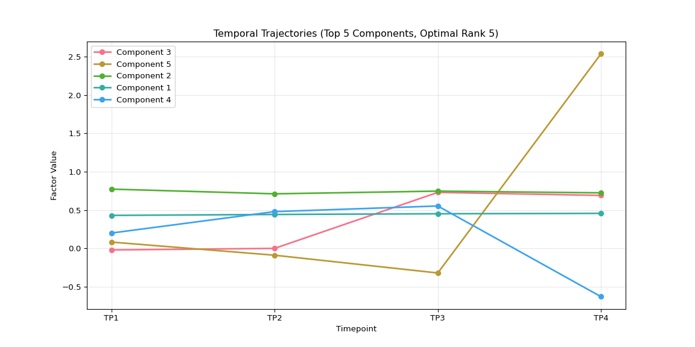

``` python

# Suppress output
None
```

## 4.7 Individual Plot 5: Species Clustering PCA

``` python
import numpy as np
import pandas as pd
import matplotlib
import matplotlib.pyplot as plt
from sklearn.cluster import KMeans
from sklearn.decomposition import PCA
import glob
import os
import json

# Set up plotting
matplotlib.use('Agg')  # Use non-interactive backend
plt.ioff()  # Turn off interactive mode

# Get output directory from R environment
output_dir = r.output_dir

# Look for main results directory
if 'main_results_dir' in globals():
    main_results_dir = globals()['main_results_dir']
else:
    main_result_dirs = glob.glob(os.path.join(output_dir, "20*"))
    if main_result_dirs:
        main_results_dir = max(main_result_dirs)
    else:
        main_results_dir = None

# Get the optimal rank from the rank selection summary
if main_results_dir:
    summary_file = os.path.join(main_results_dir, "rank_selection_summary.json")
    if os.path.exists(summary_file):
        with open(summary_file, 'r') as f:
            rank_summary = json.load(f)
        optimal_rank = rank_summary['suggested_rank']
        print(f"Using optimal rank {optimal_rank} (from rank selection analysis)")
    else:
        print("No rank selection summary found! Cannot determine optimal rank.")
        optimal_rank = None
        main_results_dir = None
else:
    print("No main results directory found!")
    optimal_rank = None

# Look for the optimal rank data in rank_comparison directory
latest_dir = None
if main_results_dir and optimal_rank:
    comparison_dir = os.path.join(main_results_dir, "rank_comparison")
    optimal_rank_dir = os.path.join(comparison_dir, f"rank_{optimal_rank:02d}")
    
    if os.path.exists(optimal_rank_dir):
        # Find the timestamped results within the rank directory
        result_dirs = glob.glob(os.path.join(optimal_rank_dir, "20*"))
        if result_dirs:
            latest_dir = max(result_dirs)
            print(f"Using optimal rank {optimal_rank} data from: {latest_dir}")
        else:
            print(f"No timestamped results found in rank_{optimal_rank:02d} directory!")
    else:
        print(f"Optimal rank {optimal_rank} directory not found!")

if latest_dir:
    
    # Load data
    gene_factors = np.load(os.path.join(latest_dir, "gene_factors.npy"))
    species_factors = np.load(os.path.join(latest_dir, "species_factors.npy"))
    time_factors = np.load(os.path.join(latest_dir, "time_factors.npy"))
    
    # Load the transformed data to get species names
    data_file = os.path.join(output_dir, "vst_counts_matrix_long_format.csv")
    df_long = pd.read_csv(data_file)
    species_names = sorted(df_long['species'].unique())
    
    # Create species type labels (same as comprehensive visualization)
    species_types = [name.split('-')[0] for name in species_names]
    unique_types = list(set(species_types))
    
    # Calculate component strengths (same as comprehensive visualization)
    component_strengths = []
    for i in range(gene_factors.shape[1]):
        gene_norm = np.linalg.norm(gene_factors[:, i])
        species_norm = np.linalg.norm(species_factors[:, i])
        time_norm = np.linalg.norm(time_factors[:, i])
        total_strength = gene_norm * species_norm * time_norm
        component_strengths.append(total_strength)
    
    sorted_components = np.argsort(component_strengths)[::-1]
    
    # Use the same logic as comprehensive visualization
    rank = gene_factors.shape[1]  # This is the actual rank (number of components)
    
    if rank >= 2:
        n_pca_components = min(rank, 10)
        species_subset = species_factors[:, sorted_components[:n_pca_components]]
        
        pca = PCA(n_components=2)
        species_pca = pca.fit_transform(species_subset)
        
        # Create plot (same styling as comprehensive visualization)
        plt.figure(figsize=(10, 8))
        
        colors = ['red', 'blue', 'green', 'orange', 'purple'][:len(unique_types)]
        species_type_map = {stype: i for i, stype in enumerate(unique_types)}
        
        for i, (x, y) in enumerate(species_pca):
            stype = species_types[i]
            plt.scatter(x, y, c=colors[species_type_map[stype]], 
                       alpha=0.7, s=40, 
                       label=stype if i == species_types.index(stype) else "")
        
        plt.xlabel(f'PC1 ({pca.explained_variance_ratio_[0]:.1%})')
        plt.ylabel(f'PC2 ({pca.explained_variance_ratio_[1]:.1%})')
        plt.title(f'Species PCA (Optimal Rank {optimal_rank})')
        plt.legend()
        plt.grid(True, alpha=0.3)
        
        # Save to main results directory for consistency
        if main_results_dir:
            plot_file = os.path.join(main_results_dir, f"plot_05_species_clustering_optimal_rank_{optimal_rank}.png")
            plt.savefig(plot_file, dpi=300, bbox_inches='tight')
            print(f"Species clustering PCA plot saved to: {plot_file}")
        
        plt.show()
    else:
        print(f"Optimal rank {optimal_rank} has insufficient components for PCA visualization")
else:
    print(f"Could not load data for optimal rank {optimal_rank if optimal_rank else 'unknown'}")
```

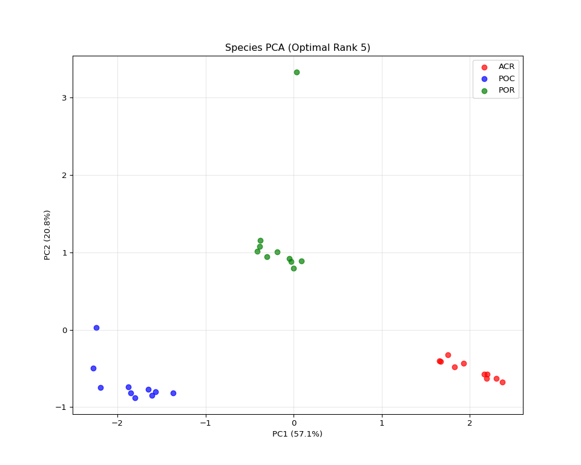

``` python

# Suppress output
None
```

## 4.8 Individual Plot 6: Gene Factor Distribution

``` python
import numpy as np
import matplotlib
import matplotlib.pyplot as plt
import glob
import os
import json

# Set up plotting
matplotlib.use('Agg')  # Use non-interactive backend
plt.ioff()  # Turn off interactive mode

# Get output directory from R environment
output_dir = r.output_dir

# Look for main results directory
if 'main_results_dir' in globals():
    main_results_dir = globals()['main_results_dir']
else:
    main_result_dirs = glob.glob(os.path.join(output_dir, "20*"))
    if main_result_dirs:
        main_results_dir = max(main_result_dirs)
    else:
        main_results_dir = None

# Get the optimal rank from the rank selection summary
if main_results_dir:
    summary_file = os.path.join(main_results_dir, "rank_selection_summary.json")
    if os.path.exists(summary_file):
        with open(summary_file, 'r') as f:
            rank_summary = json.load(f)
        optimal_rank = rank_summary['suggested_rank']
        print(f"Using optimal rank {optimal_rank} (from rank selection analysis)")
    else:
        print("No rank selection summary found! Cannot determine optimal rank.")
        optimal_rank = None
        main_results_dir = None
else:
    print("No main results directory found!")
    optimal_rank = None

# Look for the optimal rank data in rank_comparison directory
latest_dir = None
if main_results_dir and optimal_rank:
    comparison_dir = os.path.join(main_results_dir, "rank_comparison")
    optimal_rank_dir = os.path.join(comparison_dir, f"rank_{optimal_rank:02d}")
    
    if os.path.exists(optimal_rank_dir):
        # Find the timestamped results within the rank directory
        result_dirs = glob.glob(os.path.join(optimal_rank_dir, "20*"))
        if result_dirs:
            latest_dir = max(result_dirs)
            print(f"Using optimal rank {optimal_rank} data from: {latest_dir}")
        else:
            print(f"No timestamped results found in rank_{optimal_rank:02d} directory!")
    else:
        print(f"Optimal rank {optimal_rank} directory not found!")

if latest_dir:
    
    # Load data
    gene_factors = np.load(os.path.join(latest_dir, "gene_factors.npy"))
    
    # Calculate gene variances
    gene_variances = np.var(gene_factors, axis=1)
    
    # Create histogram
    plt.figure(figsize=(10, 6))
    plt.hist(gene_variances, bins=50, alpha=0.7, edgecolor='black')
    plt.xlabel('Gene Factor Variance')
    plt.ylabel('Number of Genes')
    plt.title(f'Distribution of Gene Factor Variability (Optimal Rank {optimal_rank})')
    plt.grid(True, alpha=0.3)
    
    # Add statistics
    plt.axvline(np.mean(gene_variances), color='red', linestyle='--', 
               label=f'Mean: {np.mean(gene_variances):.3f}')
    plt.axvline(np.median(gene_variances), color='orange', linestyle='--', 
               label=f'Median: {np.median(gene_variances):.3f}')
    plt.legend()
    
    # Save individual plot in main results directory
    if main_results_dir:
        plot_file = os.path.join(main_results_dir, f"plot_06_gene_distribution_optimal_rank_{optimal_rank}.png")
        plt.savefig(plot_file, dpi=300, bbox_inches='tight')
        print(f"Gene factor distribution plot saved to: {plot_file}")
    
    plt.show()
else:
    print(f"Could not load data for optimal rank {optimal_rank if optimal_rank else 'unknown'}")
```

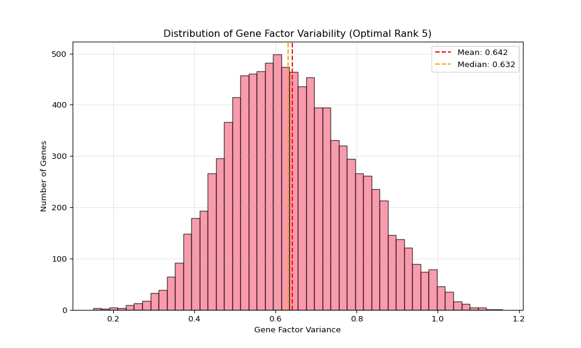

``` python

# Suppress output
None
```

## 4.9 Individual Plot 7: Component Correlations

``` python
import numpy as np
import matplotlib
import matplotlib.pyplot as plt
import seaborn as sns
import glob
import os
import json

# Set up plotting
matplotlib.use('Agg')  # Use non-interactive backend
plt.ioff()  # Turn off interactive mode

# Get output directory from R environment
output_dir = r.output_dir

# Look for main results directory
if 'main_results_dir' in globals():
    main_results_dir = globals()['main_results_dir']
else:
    main_result_dirs = glob.glob(os.path.join(output_dir, "20*"))
    if main_result_dirs:
        main_results_dir = max(main_result_dirs)
    else:
        main_results_dir = None

# Get the optimal rank from the rank selection summary
if main_results_dir:
    summary_file = os.path.join(main_results_dir, "rank_selection_summary.json")
    if os.path.exists(summary_file):
        with open(summary_file, 'r') as f:
            rank_summary = json.load(f)
        optimal_rank = rank_summary['suggested_rank']
        print(f"Using optimal rank {optimal_rank} (from rank selection analysis)")
    else:
        print("No rank selection summary found! Cannot determine optimal rank.")
        optimal_rank = None
        main_results_dir = None
else:
    print("No main results directory found!")
    optimal_rank = None

# Look for the optimal rank data in rank_comparison directory
latest_dir = None
if main_results_dir and optimal_rank:
    comparison_dir = os.path.join(main_results_dir, "rank_comparison")
    optimal_rank_dir = os.path.join(comparison_dir, f"rank_{optimal_rank:02d}")
    
    if os.path.exists(optimal_rank_dir):
        # Find the timestamped results within the rank directory
        result_dirs = glob.glob(os.path.join(optimal_rank_dir, "20*"))
        if result_dirs:
            latest_dir = max(result_dirs)
            print(f"Using optimal rank {optimal_rank} data from: {latest_dir}")
        else:
            print(f"No timestamped results found in rank_{optimal_rank:02d} directory!")
    else:
        print(f"Optimal rank {optimal_rank} directory not found!")

if latest_dir:
    
    # Load data
    gene_factors = np.load(os.path.join(latest_dir, "gene_factors.npy"))
    
    # Calculate correlations between components across genes
    gene_corr = np.corrcoef(gene_factors.T)
    
    # Create heatmap
    plt.figure(figsize=(12, 10))
    sns.heatmap(gene_corr, cmap='RdBu_r', center=0, 
                xticklabels=range(1, gene_factors.shape[1] + 1),
                yticklabels=range(1, gene_factors.shape[1] + 1),
                square=True,
                cbar_kws={'label': 'Correlation coefficient'})
    plt.title(f'Component Correlations (Gene Space) - Optimal Rank {optimal_rank}')
    plt.xlabel('Component')
    plt.ylabel('Component')
    
    # Save individual plot in main results directory
    if main_results_dir:
        plot_file = os.path.join(main_results_dir, f"plot_07_component_correlations_optimal_rank_{optimal_rank}.png")
        plt.savefig(plot_file, dpi=300, bbox_inches='tight')
        print(f"Component correlations plot saved to: {plot_file}")
    
    plt.show()
else:
    print(f"Could not load data for optimal rank {optimal_rank if optimal_rank else 'unknown'}")
```

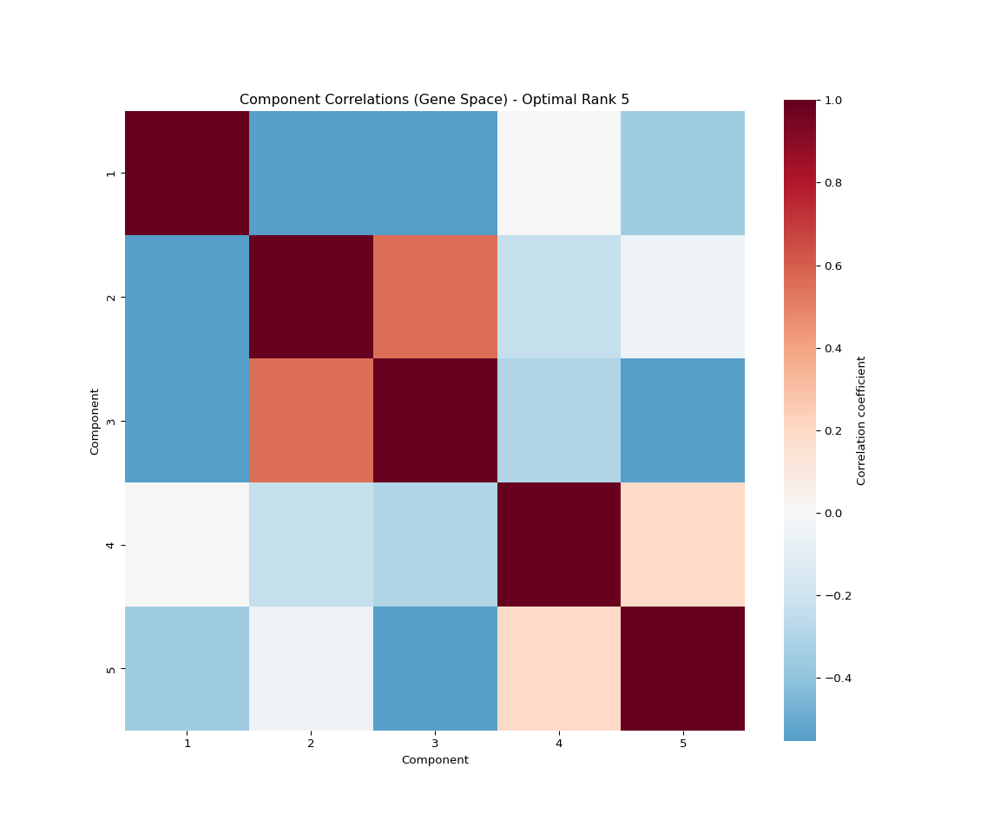

``` python

# Suppress output
None
```

## 4.10 Individual Plot 8: Species Type Comparison

``` python
import numpy as np
import pandas as pd
import matplotlib
import matplotlib.pyplot as plt
import glob
import os
import json

# Set up plotting
matplotlib.use('Agg')  # Use non-interactive backend
plt.ioff()  # Turn off interactive mode

# Get output directory from R environment
output_dir = r.output_dir

# Look for main results directory
if 'main_results_dir' in globals():
    main_results_dir = globals()['main_results_dir']
else:
    main_result_dirs = glob.glob(os.path.join(output_dir, "20*"))
    if main_result_dirs:
        main_results_dir = max(main_result_dirs)
    else:
        main_results_dir = None

# Get the optimal rank from the rank selection summary
if main_results_dir:
    summary_file = os.path.join(main_results_dir, "rank_selection_summary.json")
    if os.path.exists(summary_file):
        with open(summary_file, 'r') as f:
            rank_summary = json.load(f)
        optimal_rank = rank_summary['suggested_rank']
        print(f"Using optimal rank {optimal_rank} (from rank selection analysis)")
    else:
        print("No rank selection summary found! Cannot determine optimal rank.")
        optimal_rank = None
        main_results_dir = None
else:
    print("No main results directory found!")
    optimal_rank = None

# Look for the optimal rank data in rank_comparison directory
latest_dir = None
if main_results_dir and optimal_rank:
    comparison_dir = os.path.join(main_results_dir, "rank_comparison")
    optimal_rank_dir = os.path.join(comparison_dir, f"rank_{optimal_rank:02d}")
    
    if os.path.exists(optimal_rank_dir):
        # Find the timestamped results within the rank directory
        result_dirs = glob.glob(os.path.join(optimal_rank_dir, "20*"))
        if result_dirs:
            latest_dir = max(result_dirs)
            print(f"Using optimal rank {optimal_rank} data from: {latest_dir}")
        else:
            print(f"No timestamped results found in rank_{optimal_rank:02d} directory!")
    else:
        print(f"Optimal rank {optimal_rank} directory not found!")

if latest_dir:
    
    # Load data
    gene_factors = np.load(os.path.join(latest_dir, "gene_factors.npy"))
    species_factors = np.load(os.path.join(latest_dir, "species_factors.npy"))
    time_factors = np.load(os.path.join(latest_dir, "time_factors.npy"))
    
    # Load the transformed data to get species names
    data_file = os.path.join(output_dir, "vst_counts_matrix_long_format.csv")
    df_long = pd.read_csv(data_file)
    species_names = sorted(df_long['species'].unique())
    
    # Calculate component strengths and get top 5
    component_strengths = []
    for i in range(gene_factors.shape[1]):
        gene_norm = np.linalg.norm(gene_factors[:, i])
        species_norm = np.linalg.norm(species_factors[:, i])
        time_norm = np.linalg.norm(time_factors[:, i])
        total_strength = gene_norm * species_norm * time_norm
        component_strengths.append(total_strength)
    
    sorted_components = np.argsort(component_strengths)[::-1]
    top_5_components = sorted_components[:min(5, optimal_rank)]  # Use min to handle ranks < 5
    
    # Group species by type
    species_by_type = {}
    for i, name in enumerate(species_names):
        stype = name.split('-')[0]
        if stype not in species_by_type:
            species_by_type[stype] = []
        species_by_type[stype].append(i)
    
    # Calculate mean factor values per species type for top components
    type_means = {}
    for stype, indices in species_by_type.items():
        type_means[stype] = np.mean(species_factors[indices, :], axis=0)
    
    # Create bar plot
    plt.figure(figsize=(12, 6))
    x_pos = np.arange(len(top_5_components))
    width = 0.8 / len(type_means)  # Adjust width based on number of species types
    
    for i, (stype, means) in enumerate(type_means.items()):
        plt.bar(x_pos + i * width, means[top_5_components], 
               width, label=stype, alpha=0.8)
    
    plt.xlabel('Component')
    plt.ylabel('Mean Factor Value')
    plt.title(f'Species Type Comparison (Top {len(top_5_components)} Components) - Optimal Rank {optimal_rank}')
    plt.xticks(x_pos + width * (len(type_means) - 1) / 2, 
               [f'Comp {i+1}' for i in top_5_components])
    plt.legend()
    plt.grid(True, alpha=0.3)
    
    # Save individual plot in main results directory
    if main_results_dir:
        plot_file = os.path.join(main_results_dir, f"plot_08_species_comparison_optimal_rank_{optimal_rank}.png")
        plt.savefig(plot_file, dpi=300, bbox_inches='tight')
        print(f"Species type comparison plot saved to: {plot_file}")
    
    plt.show()
else:
    print(f"Could not load data for optimal rank {optimal_rank if optimal_rank else 'unknown'}")
```

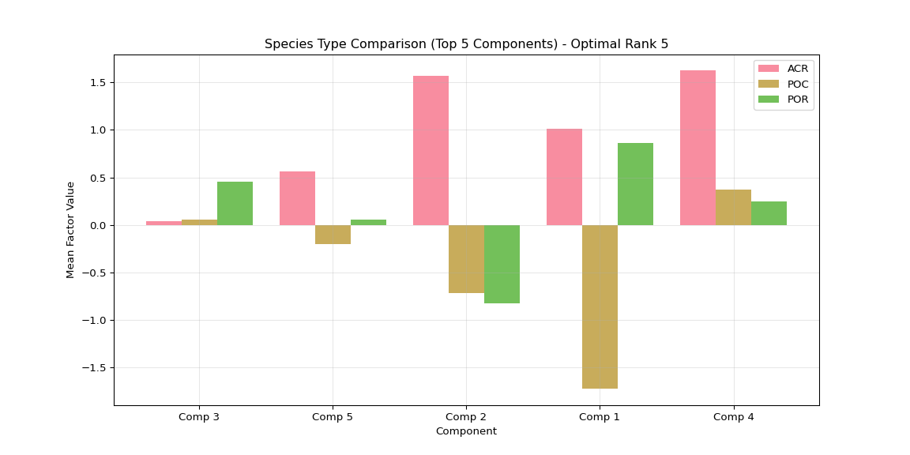

``` python

# Suppress output
None
```

## 4.11 Individual Plot 9: Temporal Variance per Component

``` python
import numpy as np
import matplotlib
import matplotlib.pyplot as plt
import glob
import os
import json

# Set up plotting
matplotlib.use('Agg')  # Use non-interactive backend
plt.ioff()  # Turn off interactive mode

# Get output directory from R environment
output_dir = r.output_dir

# Look for main results directory
if 'main_results_dir' in globals():
    main_results_dir = globals()['main_results_dir']
else:
    main_result_dirs = glob.glob(os.path.join(output_dir, "20*"))
    if main_result_dirs:
        main_results_dir = max(main_result_dirs)
    else:
        main_results_dir = None

# Get the optimal rank from the rank selection summary
if main_results_dir:
    summary_file = os.path.join(main_results_dir, "rank_selection_summary.json")
    if os.path.exists(summary_file):
        with open(summary_file, 'r') as f:
            rank_summary = json.load(f)
        optimal_rank = rank_summary['suggested_rank']
        print(f"Using optimal rank {optimal_rank} (from rank selection analysis)")
    else:
        print("No rank selection summary found! Cannot determine optimal rank.")
        optimal_rank = None
        main_results_dir = None
else:
    print("No main results directory found!")
    optimal_rank = None

# Look for the optimal rank data in rank_comparison directory
latest_dir = None
if main_results_dir and optimal_rank:
    comparison_dir = os.path.join(main_results_dir, "rank_comparison")
    optimal_rank_dir = os.path.join(comparison_dir, f"rank_{optimal_rank:02d}")
    
    if os.path.exists(optimal_rank_dir):
        # Find the timestamped results within the rank directory
        result_dirs = glob.glob(os.path.join(optimal_rank_dir, "20*"))
        if result_dirs:
            latest_dir = max(result_dirs)
            print(f"Using optimal rank {optimal_rank} data from: {latest_dir}")
        else:
            print(f"No timestamped results found in rank_{optimal_rank:02d} directory!")
    else:
        print(f"Optimal rank {optimal_rank} directory not found!")

if latest_dir:
    
    # Load data
    time_factors = np.load(os.path.join(latest_dir, "time_factors.npy"))
    
    # Calculate temporal variances
    time_variances = np.var(time_factors, axis=0)
    sorted_time_vars = np.argsort(time_variances)[::-1]
    
    # Create bar plot
    plt.figure(figsize=(12, 6))
    plt.bar(range(1, len(time_variances) + 1), 
           [time_variances[i] for i in sorted_time_vars])
    plt.xlabel('Component (ranked by temporal variance)')
    plt.ylabel('Temporal Variance')
    plt.title(f'Components by Temporal Variability - Optimal Rank {optimal_rank}')
    
    # Set x-ticks to show all components if <= 10, otherwise show every 2nd or 5th
    n_components = len(time_variances)
    if n_components <= 10:
        plt.xticks(range(1, n_components + 1))
    elif n_components <= 20:
        plt.xticks(range(1, n_components + 1, 2))
    else:
        plt.xticks(range(1, n_components + 1, 5))
    
    plt.grid(True, alpha=0.3)
    
    # Save individual plot in main results directory
    if main_results_dir:
        plot_file = os.path.join(main_results_dir, f"plot_09_temporal_variance_optimal_rank_{optimal_rank}.png")
        plt.savefig(plot_file, dpi=300, bbox_inches='tight')
        print(f"Temporal variance plot saved to: {plot_file}")
    
    plt.show()
else:
    print(f"Could not load data for optimal rank {optimal_rank if optimal_rank else 'unknown'}")
```

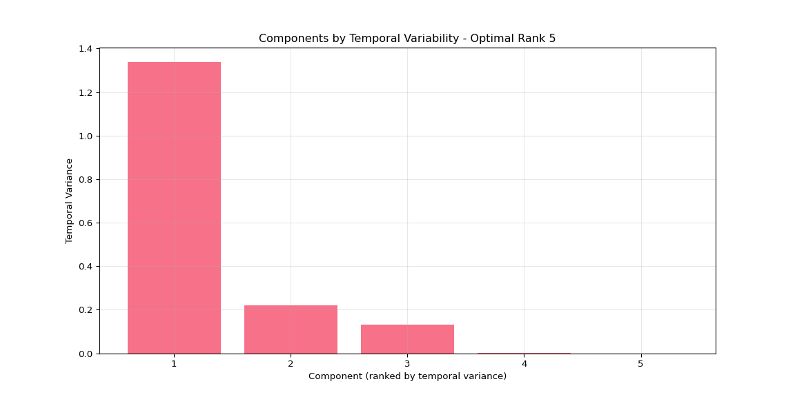

``` python

# Suppress output
None
```

## 4.12 Individual Plot 10: Species Variance per Component

``` python
import numpy as np
import matplotlib
import matplotlib.pyplot as plt
import glob
import os
import json

# Set up plotting
matplotlib.use('Agg')  # Use non-interactive backend
plt.ioff()  # Turn off interactive mode

# Get output directory from R environment
output_dir = r.output_dir

# Look for main results directory
if 'main_results_dir' in globals():
    main_results_dir = globals()['main_results_dir']
else:
    main_result_dirs = glob.glob(os.path.join(output_dir, "20*"))
    if main_result_dirs:
        main_results_dir = max(main_result_dirs)
    else:
        main_results_dir = None

# Get the optimal rank from the rank selection summary
if main_results_dir:
    summary_file = os.path.join(main_results_dir, "rank_selection_summary.json")
    if os.path.exists(summary_file):
        with open(summary_file, 'r') as f:
            rank_summary = json.load(f)
        optimal_rank = rank_summary['suggested_rank']
        print(f"Using optimal rank {optimal_rank} (from rank selection analysis)")
    else:
        print("No rank selection summary found! Cannot determine optimal rank.")
        optimal_rank = None
        main_results_dir = None
else:
    print("No main results directory found!")
    optimal_rank = None

# Look for the optimal rank data in rank_comparison directory
latest_dir = None
if main_results_dir and optimal_rank:
    comparison_dir = os.path.join(main_results_dir, "rank_comparison")
    optimal_rank_dir = os.path.join(comparison_dir, f"rank_{optimal_rank:02d}")
    
    if os.path.exists(optimal_rank_dir):
        # Find the timestamped results within the rank directory
        result_dirs = glob.glob(os.path.join(optimal_rank_dir, "20*"))
        if result_dirs:
            latest_dir = max(result_dirs)
            print(f"Using optimal rank {optimal_rank} data from: {latest_dir}")
        else:
            print(f"No timestamped results found in rank_{optimal_rank:02d} directory!")
    else:
        print(f"Optimal rank {optimal_rank} directory not found!")

if latest_dir:
    
    # Load data
    species_factors = np.load(os.path.join(latest_dir, "species_factors.npy"))
    
    # Calculate species variances
    species_variances = np.var(species_factors, axis=0)
    sorted_species_vars = np.argsort(species_variances)[::-1]
    
    # Create bar plot
    plt.figure(figsize=(12, 6))
    plt.bar(range(1, len(species_variances) + 1), 
           [species_variances[i] for i in sorted_species_vars])
    plt.xlabel('Component (ranked by species variance)')
    plt.ylabel('Species Variance')
    plt.title(f'Components by Species Variability - Optimal Rank {optimal_rank}')
    
    # Set x-ticks to show all components if <= 10, otherwise show every 2nd or 5th
    n_components = len(species_variances)
    if n_components <= 10:
        plt.xticks(range(1, n_components + 1))
    elif n_components <= 20:
        plt.xticks(range(1, n_components + 1, 2))
    else:
        plt.xticks(range(1, n_components + 1, 5))
    
    plt.grid(True, alpha=0.3)
    
    # Save individual plot in main results directory
    if main_results_dir:
        plot_file = os.path.join(main_results_dir, f"plot_10_species_variance_optimal_rank_{optimal_rank}.png")
        plt.savefig(plot_file, dpi=300, bbox_inches='tight')
        print(f"Species variance plot saved to: {plot_file}")
    
    plt.show()
else:
    print(f"Could not load data for optimal rank {optimal_rank if optimal_rank else 'unknown'}")
```

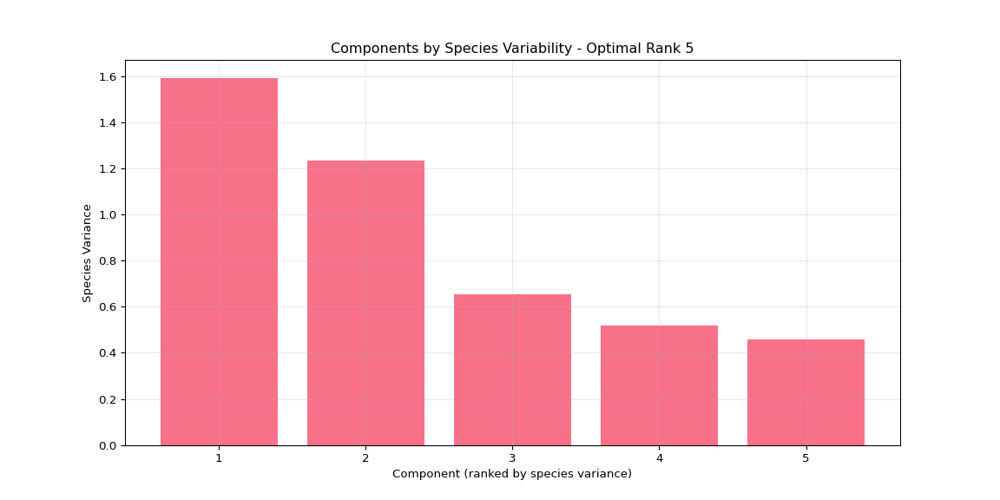

``` python

# Suppress output
None
```

## 4.13 Individual Plot 11: Top Genes Heatmap

``` python
import numpy as np
import pandas as pd
import matplotlib
import matplotlib.pyplot as plt
import seaborn as sns
import glob
import os
import json

# Set up plotting
matplotlib.use('Agg')  # Use non-interactive backend
plt.ioff()  # Turn off interactive mode

# Get output directory from R environment
output_dir = r.output_dir

# Look for main results directory
if 'main_results_dir' in globals():
    main_results_dir = globals()['main_results_dir']
else:
    main_result_dirs = glob.glob(os.path.join(output_dir, "20*"))
    if main_result_dirs:
        main_results_dir = max(main_result_dirs)
    else:
        main_results_dir = None

# Get the optimal rank from the rank selection summary
if main_results_dir:
    summary_file = os.path.join(main_results_dir, "rank_selection_summary.json")
    if os.path.exists(summary_file):
        with open(summary_file, 'r') as f:
            rank_summary = json.load(f)
        optimal_rank = rank_summary['suggested_rank']
        print(f"Using optimal rank {optimal_rank} (from rank selection analysis)")
    else:
        print("No rank selection summary found! Cannot determine optimal rank.")
        optimal_rank = None
        main_results_dir = None
else:
    print("No main results directory found!")
    optimal_rank = None

# Look for the optimal rank data in rank_comparison directory
latest_dir = None
if main_results_dir and optimal_rank:
    comparison_dir = os.path.join(main_results_dir, "rank_comparison")
    optimal_rank_dir = os.path.join(comparison_dir, f"rank_{optimal_rank:02d}")
    
    if os.path.exists(optimal_rank_dir):
        # Find the timestamped results within the rank directory
        result_dirs = glob.glob(os.path.join(optimal_rank_dir, "20*"))
        if result_dirs:
            latest_dir = max(result_dirs)
            print(f"Using optimal rank {optimal_rank} data from: {latest_dir}")
        else:
            print(f"No timestamped results found in rank_{optimal_rank:02d} directory!")
    else:
        print(f"Optimal rank {optimal_rank} directory not found!")

if latest_dir:
    
    # Load data
    gene_factors = np.load(os.path.join(latest_dir, "gene_factors.npy"))
    species_factors = np.load(os.path.join(latest_dir, "species_factors.npy"))
    time_factors = np.load(os.path.join(latest_dir, "time_factors.npy"))
    
    # Load the transformed data to get actual gene names
    data_file = os.path.join(output_dir, "vst_counts_matrix_long_format.csv")
    df_long = pd.read_csv(data_file)
    gene_names = sorted(df_long['gene'].unique())
    
    # Calculate component strengths and get top components
    component_strengths = []
    for i in range(gene_factors.shape[1]):
        gene_norm = np.linalg.norm(gene_factors[:, i])
        species_norm = np.linalg.norm(species_factors[:, i])
        time_norm = np.linalg.norm(time_factors[:, i])
        total_strength = gene_norm * species_norm * time_norm
        component_strengths.append(total_strength)
    
    sorted_components = np.argsort(component_strengths)[::-1]
    top_components = sorted_components[:min(5, optimal_rank)]  # Use min to handle ranks < 5
    
    # Get top genes for each of the top components
    n_top_genes = 10
    top_gene_indices = []
    
    for comp_idx in top_components:
        top_genes = np.argsort(np.abs(gene_factors[:, comp_idx]))[-n_top_genes:]
        top_gene_indices.extend(top_genes)
    
    top_gene_indices = list(set(top_gene_indices))  # Remove duplicates
    top_gene_data = gene_factors[top_gene_indices, :][:, top_components]
    
    # Get actual gene names for the selected indices
    top_gene_names = [gene_names[i] for i in top_gene_indices]
    
    # Create heatmap
    plt.figure(figsize=(10, 12))
    sns.heatmap(top_gene_data, 
                cmap='RdBu_r', center=0,
                yticklabels=top_gene_names,
                xticklabels=[f'Comp {i+1}' for i in top_components],
                cbar_kws={'label': 'Gene factor loading'})
    plt.title(f'Top {len(top_gene_indices)} Genes × Top {len(top_components)} Components - Optimal Rank {optimal_rank}')
    plt.xlabel('Component')
    plt.ylabel('Gene')
    
    # Save individual plot in main results directory
    if main_results_dir:
        plot_file = os.path.join(main_results_dir, f"plot_11_top_genes_optimal_rank_{optimal_rank}.png")
        plt.savefig(plot_file, dpi=300, bbox_inches='tight')
        print(f"Top genes heatmap saved to: {plot_file}")
    
    plt.show()
else:
    print(f"Could not load data for optimal rank {optimal_rank if optimal_rank else 'unknown'}")
```

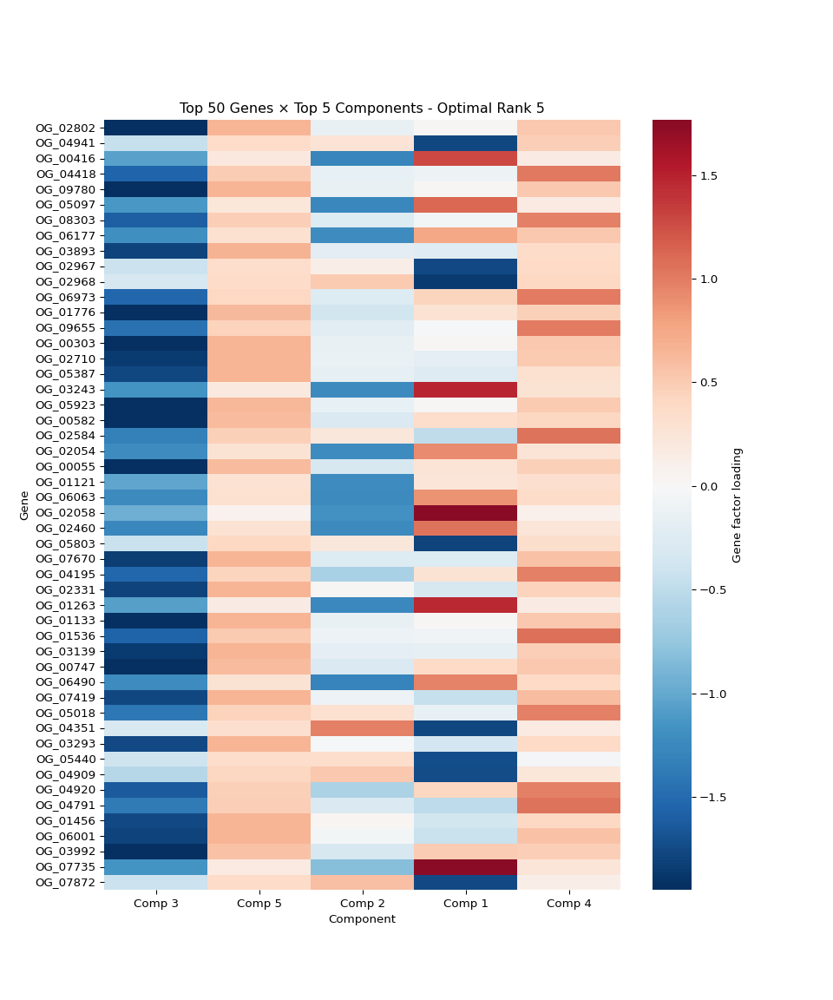

``` python

# Suppress output
None
```

## 4.14 Individual Plot 12: Reconstruction Quality

``` python
import numpy as np
import pandas as pd
import matplotlib
import matplotlib.pyplot as plt
import glob
import os
import json

# Set up plotting
matplotlib.use('Agg')  # Use non-interactive backend
plt.ioff()  # Turn off interactive mode

# Get output directory from R environment
output_dir = r.output_dir

# Look for main results directory
if 'main_results_dir' in globals():
    main_results_dir = globals()['main_results_dir']
else:
    main_result_dirs = glob.glob(os.path.join(output_dir, "20*"))
    if main_result_dirs:
        main_results_dir = max(main_result_dirs)
    else:
        main_results_dir = None

# Get the optimal rank from the rank selection summary
if main_results_dir:
    summary_file = os.path.join(main_results_dir, "rank_selection_summary.json")
    if os.path.exists(summary_file):
        with open(summary_file, 'r') as f:
            rank_summary = json.load(f)
        optimal_rank = rank_summary['suggested_rank']
        print(f"Using optimal rank {optimal_rank} (from rank selection analysis)")
    else:
        print("No rank selection summary found! Cannot determine optimal rank.")
        optimal_rank = None
        main_results_dir = None
else:
    print("No main results directory found!")
    optimal_rank = None

# Look for the optimal rank data in rank_comparison directory
latest_dir = None
if main_results_dir and optimal_rank:
    comparison_dir = os.path.join(main_results_dir, "rank_comparison")
    optimal_rank_dir = os.path.join(comparison_dir, f"rank_{optimal_rank:02d}")
    
    if os.path.exists(optimal_rank_dir):
        # Find the timestamped results within the rank directory
        result_dirs = glob.glob(os.path.join(optimal_rank_dir, "20*"))
        if result_dirs:
            latest_dir = max(result_dirs)
            print(f"Using optimal rank {optimal_rank} data from: {latest_dir}")
        else:
            print(f"No timestamped results found in rank_{optimal_rank:02d} directory!")
    else:
        print(f"Optimal rank {optimal_rank} directory not found!")

if latest_dir:
    
    # Load data
    gene_factors = np.load(os.path.join(latest_dir, "gene_factors.npy"))
    species_factors = np.load(os.path.join(latest_dir, "species_factors.npy"))
    time_factors = np.load(os.path.join(latest_dir, "time_factors.npy"))
    reconstructed = np.load(os.path.join(latest_dir, "reconstructed_tensor.npy"))
    
    # Load the transformed data
    data_file = os.path.join(output_dir, "vst_counts_matrix_long_format.csv")
    df_long = pd.read_csv(data_file)
    
    # Create original tensor from the long format data
    original_pivot = df_long.pivot_table(values='expression', 
                                       index='gene', 
                                       columns=['species', 'timepoint'], 
                                       fill_value=0)
    
    # Check if we can safely reshape
    expected_size = gene_factors.shape[0] * species_factors.shape[0] * time_factors.shape[0]
    actual_size = original_pivot.size
    
    plt.figure(figsize=(10, 6))
    
    if actual_size == expected_size:
        # Reshape the pivot table to match tensor format
        n_genes, n_species, n_timepoints = gene_factors.shape[0], species_factors.shape[0], time_factors.shape[0]
        original_reshaped = original_pivot.values.reshape(n_genes, n_species, n_timepoints)
        
        # Calculate per-gene reconstruction error
        gene_errors = np.mean(np.abs(original_reshaped - reconstructed), axis=(1, 2))
        
        plt.hist(gene_errors, bins=50, alpha=0.7, edgecolor='black')
        plt.xlabel('Mean Absolute Error per Gene')
        plt.ylabel('Number of Genes')
        plt.title(f'Reconstruction Error Distribution - Optimal Rank {optimal_rank}')
        plt.axvline(np.mean(gene_errors), color='red', linestyle='--', 
                   label=f'Mean: {np.mean(gene_errors):.3f}')
        plt.legend()
        plt.grid(True, alpha=0.3)
    else:
        # If reshape fails, show a simpler quality metric
        original_flat = original_pivot.values.flatten()
        reconstructed_flat = reconstructed.flatten()
        
        # Ensure both arrays are the same size by taking the minimum
        min_size = min(len(original_flat), len(reconstructed_flat))
        original_flat = original_flat[:min_size]
        reconstructed_flat = reconstructed_flat[:min_size]
        
        residuals = original_flat - reconstructed_flat
        
        plt.hist(residuals, bins=50, alpha=0.7, edgecolor='black')
        plt.xlabel('Reconstruction Residuals')
        plt.ylabel('Frequency')
        plt.title(f'Reconstruction Residuals Distribution - Optimal Rank {optimal_rank}')
        plt.axvline(np.mean(residuals), color='red', linestyle='--', 
                   label=f'Mean: {np.mean(residuals):.3f}')
        plt.axvline(0, color='black', linestyle=':', alpha=0.5, label='Perfect fit')
        plt.legend()
        plt.grid(True, alpha=0.3)
    
    # Save individual plot in main results directory
    if main_results_dir:
        plot_file = os.path.join(main_results_dir, f"plot_12_reconstruction_quality_optimal_rank_{optimal_rank}.png")
        plt.savefig(plot_file, dpi=300, bbox_inches='tight')
        print(f"Reconstruction quality plot saved to: {plot_file}")
    
    plt.show()
else:
    print(f"Could not load data for optimal rank {optimal_rank if optimal_rank else 'unknown'}")
```


``` python

# Suppress output
None
```

## 4.15 Interpret species clustering patterns

``` python
import numpy as np
import pandas as pd
import matplotlib.pyplot as plt
import seaborn as sns
from scipy import stats
import glob
import os

# Get output directory from R environment
output_dir = r.output_dir

# Look for main results directory and optimal rank data (consistent with other plots)
latest_dir = None

# Look for main results directory
if 'main_results_dir' in globals():
    main_results_dir = globals()['main_results_dir']
else:
    main_result_dirs = glob.glob(os.path.join(output_dir, "20*"))
    if main_result_dirs:
        main_results_dir = max(main_result_dirs)
    else:
        main_results_dir = None

# Get the optimal rank from the rank selection summary (same as other plots)
if main_results_dir:
    summary_file = os.path.join(main_results_dir, "rank_selection_summary.json")
    if os.path.exists(summary_file):
        with open(summary_file, 'r') as f:
            rank_summary = json.load(f)
        optimal_rank = rank_summary['suggested_rank']
        print(f"Using optimal rank {optimal_rank} (from rank selection analysis)")
        
        # Look for the optimal rank data in rank_comparison directory
        comparison_dir = os.path.join(main_results_dir, "rank_comparison")
        optimal_rank_dir = os.path.join(comparison_dir, f"rank_{optimal_rank:02d}")
        
        if os.path.exists(optimal_rank_dir):
            # Find the timestamped results within the rank directory
            result_dirs = glob.glob(os.path.join(optimal_rank_dir, "20*"))
            if result_dirs:
                latest_dir = max(result_dirs)
                print(f"Using optimal rank {optimal_rank} data from: {latest_dir}")
            else:
                print(f"No timestamped results found in rank_{optimal_rank:02d} directory!")
        else:
            print(f"Optimal rank {optimal_rank} directory not found!")
    else:
        print("No rank selection summary found! Cannot determine optimal rank.")
        main_results_dir = None
else:
    print("No main results directory found!")

if latest_dir:
    
    # Load data
    gene_factors = np.load(os.path.join(latest_dir, "gene_factors.npy"))
    species_factors = np.load(os.path.join(latest_dir, "species_factors.npy"))
    time_factors = np.load(os.path.join(latest_dir, "time_factors.npy"))
    
    # Load the transformed data
    data_file = os.path.join(output_dir, "vst_counts_matrix_long_format.csv")
    df_long = pd.read_csv(data_file)
    
    species_names = sorted(df_long['species'].unique())
    species_types = [name.split('-')[0] for name in species_names]
    unique_types = sorted(list(set(species_types)))
    
    print("="*60)
    print("SPECIES CLUSTERING INTERPRETATION")
    print("="*60)
    
    # 1. Quantify species separation
    print("\n1. SPECIES SEPARATION ANALYSIS:")
    
    # Group individuals by species type
    species_groups = {}
    for i, name in enumerate(species_names):
        stype = name.split('-')[0]
        if stype not in species_groups:
            species_groups[stype] = []
        species_groups[stype].append(i)
    
    # Calculate within-species vs between-species distances
    from scipy.spatial.distance import pdist, squareform
    
    # Use all components for distance calculation
    distances = squareform(pdist(species_factors, metric='euclidean'))
    
    within_species_distances = []
    between_species_distances = []
    
    for i, species_i in enumerate(species_names):
        for j, species_j in enumerate(species_names):
            if i < j:  # Avoid duplicates
                type_i = species_i.split('-')[0]
                type_j = species_j.split('-')[0]
                
                if type_i == type_j:
                    within_species_distances.append(distances[i, j])
                else:
                    between_species_distances.append(distances[i, j])
    
    print(f"  Within-species distances: {np.mean(within_species_distances):.3f} ± {np.std(within_species_distances):.3f}")
    print(f"  Between-species distances: {np.mean(between_species_distances):.3f} ± {np.std(between_species_distances):.3f}")
    
    # Statistical test
    t_stat, p_value = stats.ttest_ind(between_species_distances, within_species_distances)
    print(f"  T-test p-value: {p_value:.3e}")
    
    if p_value < 0.05:
        print("  → Species ARE significantly separated (but effect might be small)")
    else:
        print("  → Species are NOT significantly separated")
    
    # 2. Variance decomposition
    print("\n2. VARIANCE DECOMPOSITION:")
    
    # Calculate total variance and partition it
    total_var = np.var(species_factors, axis=0)
    
    # Calculate within-species variance
    within_var = np.zeros(species_factors.shape[1])
    for stype, indices in species_groups.items():
        if len(indices) > 1:  # Need at least 2 individuals
            group_var = np.var(species_factors[indices, :], axis=0)
            within_var += group_var * len(indices) / len(species_names)
    
    # Between-species variance
    between_var = total_var - within_var
    
    # Calculate percentages
    within_percent = (np.mean(within_var) / np.mean(total_var)) * 100
    between_percent = (np.mean(between_var) / np.mean(total_var)) * 100
    
    print(f"  Within-species variance: {within_percent:.1f}%")
    print(f"  Between-species variance: {between_percent:.1f}%")
    
    # 3. Components that best separate species
    print("\n3. COMPONENTS WITH STRONGEST SPECIES EFFECTS:")
    
    # Calculate F-statistics for each component
    f_stats = []
    for comp in range(species_factors.shape[1]):
        groups = [species_factors[indices, comp] for indices in species_groups.values()]
        f_stat, p_val = stats.f_oneway(*groups)
        f_stats.append((comp, f_stat, p_val))
    
    # Sort by F-statistic
    f_stats.sort(key=lambda x: x[1], reverse=True)
    
    print("  Top 5 components by species separation:")
    for i, (comp, f_stat, p_val) in enumerate(f_stats[:5]):
        significance = "***" if p_val < 0.001 else "**" if p_val < 0.01 else "*" if p_val < 0.05 else ""
        print(f"    Component {comp+1}: F={f_stat:.2f}, p={p_val:.3e} {significance}")
    
    # 4. Create detailed visualization
    fig, axes = plt.subplots(2, 2, figsize=(15, 12))
    
    # Distance distributions
    axes[0, 0].hist(within_species_distances, alpha=0.7, label='Within-species', bins=20)
    axes[0, 0].hist(between_species_distances, alpha=0.7, label='Between-species', bins=20)
    axes[0, 0].set_xlabel('Euclidean Distance')
    axes[0, 0].set_ylabel('Frequency')
    axes[0, 0].set_title('Distance Distributions')
    axes[0, 0].legend()
    axes[0, 0].grid(True, alpha=0.3)
    
    # Variance decomposition pie chart
    axes[0, 1].pie([within_percent, between_percent], 
                   labels=[f'Within-species\n({within_percent:.1f}%)', 
                          f'Between-species\n({between_percent:.1f}%)'],
                   autopct='%1.1f%%', startangle=90)
    axes[0, 1].set_title('Variance Decomposition')
    
    # Box plots for top separating component
    if f_stats:
        top_comp = f_stats[0][0]
        species_data = []
        species_labels = []
        
        for stype, indices in species_groups.items():
            species_data.extend(species_factors[indices, top_comp])
            species_labels.extend([stype] * len(indices))
        
        df_comp = pd.DataFrame({'Species': species_labels, 'Factor_Value': species_data})
        sns.boxplot(data=df_comp, x='Species', y='Factor_Value', ax=axes[1, 0])
        axes[1, 0].set_title(f'Component {top_comp+1} by Species\n(Best Separating Component)')
        axes[1, 0].grid(True, alpha=0.3)
    
    # Individual count per species
    species_counts = [len(indices) for indices in species_groups.values()]
    axes[1, 1].bar(species_groups.keys(), species_counts)
    axes[1, 1].set_xlabel('Species')
    axes[1, 1].set_ylabel('Number of Individuals')
    axes[1, 1].set_title('Sample Size per Species')
    axes[1, 1].grid(True, alpha=0.3)
    
    plt.tight_layout()
    
    # Save the interpretation plot in the main results directory (consistent with other plots)
    if main_results_dir:
        interp_plot_file = os.path.join(main_results_dir, f"species_clustering_interpretation_optimal_rank_{optimal_rank}.png")
    else:
        interp_plot_file = os.path.join(latest_dir, "species_clustering_interpretation.png")
    plt.savefig(interp_plot_file, dpi=300, bbox_inches='tight')
    print(f"\nInterpretation plot saved to: {interp_plot_file}")
    
    plt.show()
    
    # 5. Biological interpretation
    print("\n4. BIOLOGICAL INTERPRETATION:")
    
    if between_percent < 20:
        print("  → STRONG INDIVIDUAL VARIATION: Gene expression varies more between")
        print("    individuals than between species. This suggests:")
        print("    • Individual phenotypic plasticity is high")
        print("    • Species have similar fundamental gene regulatory networks")
        print("    • Environmental or developmental factors affect individuals")
        print("      more than species identity")
    elif between_percent < 40:
        print("  → MODERATE SPECIES EFFECTS: Some species differences exist but")
        print("    individual variation is still dominant. This suggests:")
        print("    • Species have some distinct expression patterns")
        print("    • Individual variation remains important")
        print("    • Mixed evolutionary/ecological pressures")
    else:
        print("  → STRONG SPECIES EFFECTS: Clear species-specific expression")
        print("    patterns exist. This suggests:")
        print("    • Species have distinct gene regulatory strategies")
        print("    • Strong evolutionary divergence")
        print("    • Species-specific adaptations")
    
    print(f"\n  Sample sizes: {dict(zip(species_groups.keys(), [len(indices) for indices in species_groups.values()]))}")
    
    if any(len(indices) < 5 for indices in species_groups.values()):
        print("  ⚠️  WARNING: Some species have small sample sizes, which can")
        print("     affect the ability to detect species-specific patterns.")
    
else:
    print("No results directories found!")
```

    ## Using optimal rank 5 (from rank selection analysis)
    ## Using optimal rank 5 data from: ../output/13.00-multiomics-stdm/20251015_190157/rank_comparison/rank_05/20251015_190351
    ## ============================================================
    ## SPECIES CLUSTERING INTERPRETATION
    ## ============================================================
    ## 
    ## 1. SPECIES SEPARATION ANALYSIS:
    ##   Within-species distances: 1.007 ± 1.225
    ##   Between-species distances: 3.390 ± 0.860
    ##   T-test p-value: 4.930e-78
    ##   → Species ARE significantly separated (but effect might be small)
    ## 
    ## 2. VARIANCE DECOMPOSITION:
    ##   Within-species variance: 25.4%
    ##   Between-species variance: 74.6%
    ## 
    ## 3. COMPONENTS WITH STRONGEST SPECIES EFFECTS:
    ##   Top 5 components by species separation:
    ##     Component 1: F=2220.60, p=1.113e-30 ***
    ##     Component 2: F=1124.54, p=1.003e-26 ***
    ##     Component 4: F=39.46, p=9.691e-09 ***
    ##     Component 5: F=3.78, p=3.575e-02 *
    ##     Component 3: F=0.80, p=4.590e-01 
    ## (array([39., 32., 22., 11.,  5.,  4.,  3.,  1.,  0.,  0.,  0.,  0.,  0.,
    ##         0.,  7.,  2.,  0.,  0.,  0.,  9.]), array([0.10695279, 0.33056048, 0.55416817, 0.77777586, 1.00138356,
    ##        1.22499125, 1.44859894, 1.67220664, 1.89581433, 2.11942202,
    ##        2.34302971, 2.56663741, 2.7902451 , 3.01385279, 3.23746049,
    ##        3.46106818, 3.68467587, 3.90828356, 4.13189126, 4.35549895,
    ##        4.57910664]), <BarContainer object of 20 artists>)
    ## (array([10., 32., 45., 41., 19., 11., 16., 15., 17., 17., 19., 15.,  6.,
    ##         3.,  3.,  3.,  4., 12.,  7.,  5.]), array([2.21788468, 2.38773948, 2.55759428, 2.72744908, 2.89730388,
    ##        3.06715869, 3.23701349, 3.40686829, 3.57672309, 3.74657789,
    ##        3.91643269, 4.08628749, 4.25614229, 4.4259971 , 4.5958519 ,
    ##        4.7657067 , 4.9355615 , 5.1054163 , 5.2752711 , 5.4451259 ,
    ##        5.6149807 ]), <BarContainer object of 20 artists>)
    ## Text(0.5, 0, 'Euclidean Distance')
    ## Text(0, 0.5, 'Frequency')
    ## Text(0.5, 1.0, 'Distance Distributions')
    ## <matplotlib.legend.Legend object at 0x7c874132a690>
    ## ([<matplotlib.patches.Wedge object at 0x7c874136ab70>, <matplotlib.patches.Wedge object at 0x7c874208a300>], [Text(-0.7877726729698648, 0.7677331670065548, 'Within-species\n(25.4%)'), Text(0.7877729231290416, -0.7677329103175957, 'Between-species\n(74.6%)')], [Text(-0.42969418525628983, 0.41876354563993895, '25.4%'), Text(0.42969432170674987, -0.4187634056277794, '74.6%')])
    ## Text(0.5, 1.0, 'Variance Decomposition')
    ## <Axes: xlabel='Species', ylabel='Factor_Value'>
    ## Text(0.5, 1.0, 'Component 1 by Species\n(Best Separating Component)')
    ## <BarContainer object of 3 artists>
    ## Text(0.5, 0, 'Species')
    ## Text(0, 0.5, 'Number of Individuals')
    ## Text(0.5, 1.0, 'Sample Size per Species')
    ## 
    ## Interpretation plot saved to: ../output/13.00-multiomics-stdm/20251015_190157/species_clustering_interpretation_optimal_rank_5.png
    ## 
    ## 4. BIOLOGICAL INTERPRETATION:
    ##   → STRONG SPECIES EFFECTS: Clear species-specific expression
    ##     patterns exist. This suggests:
    ##     • Species have distinct gene regulatory strategies
    ##     • Strong evolutionary divergence
    ##     • Species-specific adaptations
    ## 
    ##   Sample sizes: {'ACR': 10, 'POC': 10, 'POR': 10}

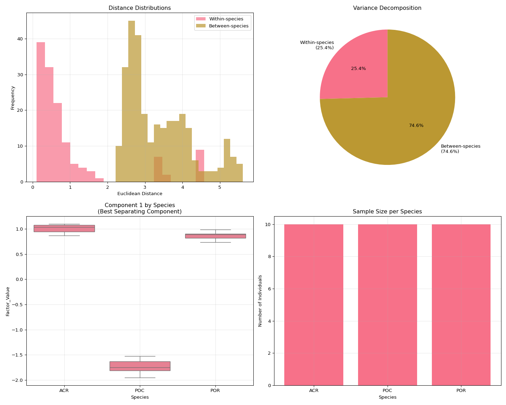
