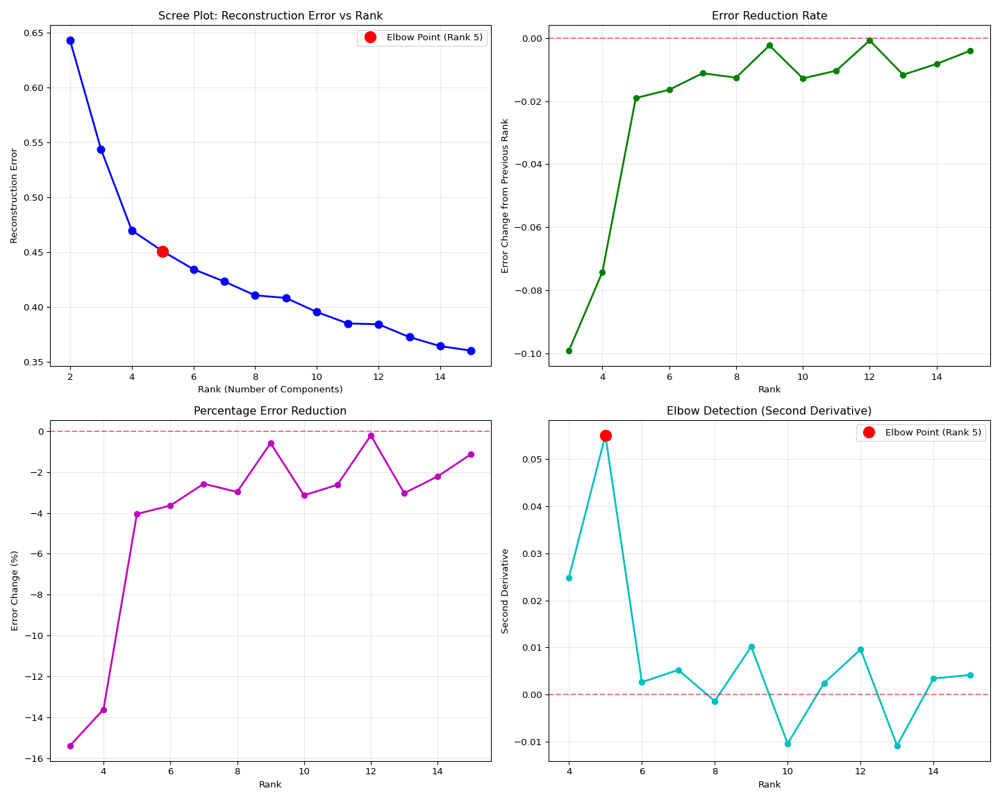
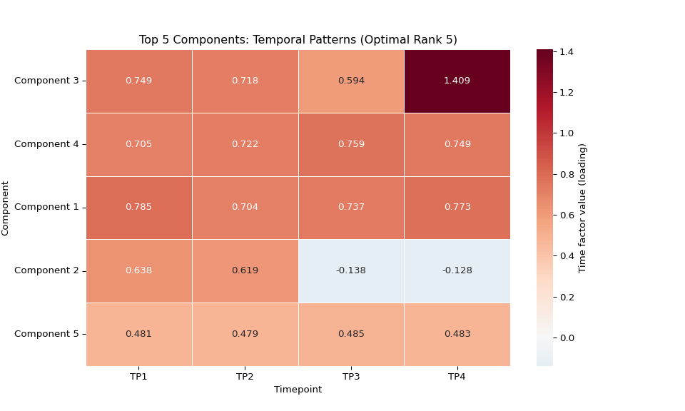

13.00-multiomics-stdm
================
Sam White
2025-10-14

- <a href="#1-background" id="toc-1-background">1 BACKGROUND</a>
  - <a href="#11-analysis-overview" id="toc-11-analysis-overview">1.1
    Analysis Overview</a>
  - <a href="#12-input-files" id="toc-12-input-files">1.2 Input Files</a>
  - <a href="#13-expected-output-structure"
    id="toc-13-expected-output-structure">1.3 Expected Output Structure</a>
- <a href="#2-setup" id="toc-2-setup">2 SETUP</a>
  - <a href="#21-libraries" id="toc-21-libraries">2.1 Libraries</a>
  - <a href="#22-set-r-variables" id="toc-22-set-r-variables">2.2 Set R
    variables</a>
  - <a href="#23-load-project-python-environment"
    id="toc-23-load-project-python-environment">2.3 Load project Python
    environment</a>
  - <a href="#24-test-python-environment"
    id="toc-24-test-python-environment">2.4 Test Python Environment</a>
- <a href="#3-stdm-analysis" id="toc-3-stdm-analysis">3 STDM ANALYSIS</a>
  - <a href="#31-transform-data-to-stdm-format"
    id="toc-31-transform-data-to-stdm-format">3.1 Transform data to stdm
    format</a>
  - <a href="#32-rank-comparison-analysis"
    id="toc-32-rank-comparison-analysis">3.2 Rank comparison analysis</a>
  - <a href="#33-analyze-rank-comparison-results"
    id="toc-33-analyze-rank-comparison-results">3.3 Analyze rank comparison
    results</a>
  - <a href="#34-analyze-optimal-decomposition-results"
    id="toc-34-analyze-optimal-decomposition-results">3.4 Analyze optimal
    decomposition results</a>
- <a href="#4-visualizations" id="toc-4-visualizations">4
  VISUALIZATIONS</a>
  - <a href="#41-generate-visualizations-for-all-tested-ranks"
    id="toc-41-generate-visualizations-for-all-tested-ranks">4.1 Generate
    visualizations for all tested ranks</a>
  - <a href="#42-visualize-optimal-decomposition-results"
    id="toc-42-visualize-optimal-decomposition-results">4.2 Visualize
    optimal decomposition results</a>
  - <a href="#43-individual-plot-1-component-strengths"
    id="toc-43-individual-plot-1-component-strengths">4.3 Individual Plot 1:
    Component Strengths</a>
  - <a href="#44-individual-plot-2-temporal-patterns-heatmap"
    id="toc-44-individual-plot-2-temporal-patterns-heatmap">4.4 Individual
    Plot 2: Temporal Patterns Heatmap</a>
  - <a href="#45-individual-plot-3-species-patterns-heatmap"
    id="toc-45-individual-plot-3-species-patterns-heatmap">4.5 Individual
    Plot 3: Species Patterns Heatmap</a>
  - <a href="#46-individual-plot-4-temporal-trajectories"
    id="toc-46-individual-plot-4-temporal-trajectories">4.6 Individual Plot
    4: Temporal Trajectories</a>
  - <a href="#47-individual-plot-5-species-clustering-pca"
    id="toc-47-individual-plot-5-species-clustering-pca">4.7 Individual Plot
    5: Species Clustering PCA</a>
  - <a href="#48-individual-plot-6-gene-factor-distribution"
    id="toc-48-individual-plot-6-gene-factor-distribution">4.8 Individual
    Plot 6: Gene Factor Distribution</a>
  - <a href="#49-individual-plot-7-component-correlations"
    id="toc-49-individual-plot-7-component-correlations">4.9 Individual Plot
    7: Component Correlations</a>
  - <a href="#410-individual-plot-8-species-type-comparison"
    id="toc-410-individual-plot-8-species-type-comparison">4.10 Individual
    Plot 8: Species Type Comparison</a>
  - <a href="#411-individual-plot-9-temporal-variance-per-component"
    id="toc-411-individual-plot-9-temporal-variance-per-component">4.11
    Individual Plot 9: Temporal Variance per Component</a>
  - <a href="#412-individual-plot-10-species-variance-per-component"
    id="toc-412-individual-plot-10-species-variance-per-component">4.12
    Individual Plot 10: Species Variance per Component</a>
  - <a href="#413-individual-plot-11-top-genes-heatmap"
    id="toc-413-individual-plot-11-top-genes-heatmap">4.13 Individual Plot
    11: Top Genes Heatmap</a>
  - <a href="#414-individual-plot-12-reconstruction-quality"
    id="toc-414-individual-plot-12-reconstruction-quality">4.14 Individual
    Plot 12: Reconstruction Quality</a>
  - <a href="#415-interpret-species-clustering-patterns"
    id="toc-415-interpret-species-clustering-patterns">4.15 Interpret
    species clustering patterns</a>

# 1 BACKGROUND

This notebook performs tensor decomposition analysis on multi-species
gene expression timeseries data using Steven’s
[`workflow-stdm`](https://github.com/sr320/workflow-stdm) (GitHub repo)
tensor decomposition project.

The analysis identifies optimal tensor rank through reconstruction error
analysis and provides biological interpretations of gene expression
patterns across species and time.

## 1.1 Analysis Overview

The notebook conducts the following analyses:

1.  **Data Transformation**: Converts wide-format gene expression data
    to long format required by the stdm package
2.  **Rank Comparison**: Tests tensor decomposition across multiple
    ranks (2-15) to identify optimal number of components
3.  **Tensor Decomposition**: Performs PARAFAC decomposition to identify
    gene, species, and temporal patterns
4.  **Visualization**: Creates comprehensive plots to interpret
    biological patterns in the decomposition results

## 1.2 Input Files

- **Primary Input**:
  `/home/shared/16TB_HDD_01/sam/gitrepos/sr320/workflow-stdm/input-data/vst_counts_matrix.csv`
  - Wide-format VST-normalized gene expression data
  - Columns: gene IDs and sample names (format: ACR-139-TP1,
    POR-216-TP2, etc.)
  - Sample names encode: Species (ACR/POR/POC) - Individual ID -
    Timepoint (TP1-TP4)

## 1.3 Expected Output Structure

    ../output/13.00-multiomics-stdm/
    ├── vst_counts_matrix_long_format.csv                    # Transformed input data
    ├── YYYYMMDD_HHMMSS/                                     # Main timestamped results directory
    │   ├── rank_analysis.png                               # Rank selection visualization
    │   ├── rank_selection_summary.json                     # Optimal rank determination
    │   ├── optimal_tensor_decomposition_visualization_rank_X.png  # Comprehensive plots
    │   ├── plot_01_component_strengths_optimal_rank_X.png   # Individual visualizations
    │   ├── plot_02_temporal_heatmap_optimal_rank_X.png
    │   ├── plot_03_species_heatmap_optimal_rank_X.png
    │   ├── plot_04_temporal_trajectories_optimal_rank_X.png
    │   ├── plot_05_species_clustering_optimal_rank_X.png
    │   └── rank_comparison/                                 # Rank comparison results
    │       ├── rank_comparison_results.json                # Summary of all ranks tested
    │       ├── rank_02/                                    # Results for each rank
    │       │   └── YYYYMMDD_HHMMSS/                        # Timestamped stdm output
    │       │       ├── summary.json                        # Decomposition metrics
    │       │       ├── gene_factors.npy                    # Gene factor matrix
    │       │       ├── species_factors.npy                 # Species factor matrix
    │       │       ├── time_factors.npy                    # Time factor matrix
    │       │       ├── reconstructed_tensor.npy            # Reconstructed data
    │       │       └── rank_02_comprehensive_visualization.png
    │       ├── rank_03/
    │       │   └── YYYYMMDD_HHMMSS/
    │       │       └── [same structure as rank_02]
    │       └── ...                                         # Additional ranks (up to rank_15)

# 2 SETUP

## 2.1 Libraries

## 2.2 Set R variables

``` r
# OUTPUT DIRECTORY
output_dir <- "../output/13.00-multiomics-stdm"

#INPUT FILE(S)

# PYTHON ENVIRONMENT - Use the project's .venv environment
python_path <- "/home/shared/16TB_HDD_01/sam/gitrepos/urol-e5/timeseries_molecular/.venv/bin/python"
```

## 2.3 Load project Python environment

The project uses a virtual environment (`.venv`) with all required
packages including `stdm`. If this is successful, the Python path should
show the `.venv` environment.

``` r
# Use the project's .venv Python environment directly
library(reticulate)

# Set Python path to the project's .venv
use_python(python_path, required = TRUE)

# Show final configuration
py_config()
```

    ## python:         /home/shared/16TB_HDD_01/sam/gitrepos/urol-e5/timeseries_molecular/.venv/bin/python
    ## libpython:      /usr/lib/python3.12/config-3.12-x86_64-linux-gnu/libpython3.12.so
    ## pythonhome:     /home/shared/16TB_HDD_01/sam/gitrepos/urol-e5/timeseries_molecular/.venv:/home/shared/16TB_HDD_01/sam/gitrepos/urol-e5/timeseries_molecular/.venv
    ## version:        3.12.3 (main, Aug 14 2025, 17:47:21) [GCC 13.3.0]
    ## numpy:          /home/shared/16TB_HDD_01/sam/gitrepos/urol-e5/timeseries_molecular/.venv/lib/python3.12/site-packages/numpy
    ## numpy_version:  2.3.3
    ## 
    ## NOTE: Python version was forced by use_python() function

## 2.4 Test Python Environment

Let’s verify the Python environment has all required libraries:

``` python
import sys
print(f"Python executable: {sys.executable}")

# Test problematic imports
try:
    import PIL
    print("✓ PIL imported successfully")
except ImportError as e:
    print(f"✗ PIL import failed: {e}")

try:
    import matplotlib.pyplot as plt
    print("✓ matplotlib.pyplot imported successfully")
except ImportError as e:
    print(f"✗ matplotlib.pyplot import failed: {e}")

try:
    import pandas as pd
    import numpy as np
    print("✓ pandas and numpy imported successfully")
except ImportError as e:
    print(f"✗ pandas/numpy import failed: {e}")

print("Environment test completed.")
```

    ## Python executable: /home/shared/16TB_HDD_01/sam/gitrepos/urol-e5/timeseries_molecular/.venv/bin/python
    ## ✓ PIL imported successfully
    ## ✓ matplotlib.pyplot imported successfully
    ## ✓ pandas and numpy imported successfully
    ## Environment test completed.

# 3 STDM ANALYSIS

## 3.1 Transform data to stdm format

The stdm package expects data in long format with columns: `gene`,
`species`, `timepoint`, `expression`. Our current data is in wide
format, so we need to transform it first.

``` python
import pandas as pd
import numpy as np
import os
import re

# Get output directory from R environment
output_dir = r.output_dir

# Create output directory if it doesn't exist
os.makedirs(output_dir, exist_ok=True)

# Read the wide-format data
print("Reading wide-format data...")
input_file = "/home/shared/16TB_HDD_01/sam/gitrepos/sr320/workflow-stdm/input-data/vst_counts_matrix.csv"
df_wide = pd.read_csv(input_file)

print(f"Original data shape: {df_wide.shape}")
print(f"Columns: {list(df_wide.columns[:5])}... (showing first 5)")

# Create long-format data
print("Transforming to long format...")
data_long = []

# Get gene column (first column)
gene_col = df_wide.columns[0]  # Should be 'group_id'
sample_cols = df_wide.columns[1:]  # All sample columns

for _, row in df_wide.iterrows():
    gene = row[gene_col]
    
    for sample_col in sample_cols:
        expression_value = row[sample_col]
        
        # Parse sample name to extract species and timepoint
        # Expected format: ACR-139-TP1, POR-216-TP2, POC-201-TP3, etc.
        match = re.match(r'([A-Z]+)-(\d+)-(TP\d+)', sample_col)
        if match:
            species_prefix = match.group(1)  # ACR, POR, POC (species designation)
            individual_id = match.group(2)   # 139, 216, 201 (individual/sample ID)
            timepoint = match.group(3)       # TP1, TP2, TP3, TP4
            
            # Create individual identifier (species-individual combination)
            species = f"{species_prefix}-{individual_id}"
            
            data_long.append({
                'gene': gene,
                'species': species,
                'timepoint': timepoint,
                'expression': expression_value
            })
        else:
            print(f"Warning: Could not parse sample name: {sample_col}")

# Create DataFrame
df_long = pd.DataFrame(data_long)

print(f"Transformed data shape: {df_long.shape}")
print(f"Number of unique genes: {df_long['gene'].nunique()}")
print(f"Number of unique species: {df_long['species'].nunique()}")
print(f"Number of unique timepoints: {df_long['timepoint'].nunique()}")

# Show sample of transformed data
print("\nSample of transformed data:")
print(df_long.head(10))

# Save transformed data
output_file = os.path.join(output_dir, "vst_counts_matrix_long_format.csv")
df_long.to_csv(output_file, index=False)
print(f"\nTransformed data saved to: {output_file}")
```

    ## Reading wide-format data...
    ## Original data shape: (9800, 118)
    ## Columns: ['group_id', 'ACR-139-TP1', 'ACR-139-TP2', 'ACR-139-TP3', 'ACR-139-TP4']... (showing first 5)
    ## Transforming to long format...
    ## Transformed data shape: (1146600, 4)
    ## Number of unique genes: 9800
    ## Number of unique species: 30
    ## Number of unique timepoints: 4
    ## 
    ## Sample of transformed data:
    ##        gene  species timepoint  expression
    ## 0  OG_00686  ACR-139       TP1    5.971679
    ## 1  OG_00686  ACR-139       TP2    6.206077
    ## 2  OG_00686  ACR-139       TP3    6.379771
    ## 3  OG_00686  ACR-139       TP4    5.882078
    ## 4  OG_00686  ACR-145       TP1    5.414779
    ## 5  OG_00686  ACR-145       TP2    7.260837
    ## 6  OG_00686  ACR-145       TP3    6.630233
    ## 7  OG_00686  ACR-145       TP4    5.533403
    ## 8  OG_00686  ACR-150       TP1    5.922190
    ## 9  OG_00686  ACR-150       TP2    6.834550
    ## 
    ## Transformed data saved to: ../output/13.00-multiomics-stdm/vst_counts_matrix_long_format.csv

## 3.2 Rank comparison analysis

First, let’s run tensor decomposition across multiple ranks to find the
optimal number of components.

``` python
import subprocess
import os
import json
import numpy as np
import pandas as pd
import matplotlib.pyplot as plt
import glob
from datetime import datetime

# Get output directory from R environment
output_dir = r.output_dir

# Define ranks to test (2-15 should cover the useful range)
ranks_to_test = list(range(2, 16))

# Use the transformed data file
input_file = os.path.join(output_dir, "vst_counts_matrix_long_format.csv")

print(f"Running stdm decomposition across {len(ranks_to_test)} different ranks...")
print(f"Ranks to test: {ranks_to_test}")
print(f"Input file: {input_file}")

# Create main timestamped directory for all results
main_timestamp = datetime.now().strftime("%Y%m%d_%H%M%S")
main_results_dir = os.path.join(output_dir, main_timestamp)
os.makedirs(main_results_dir, exist_ok=True)

# Create a subdirectory for rank comparison within main results
comparison_dir = os.path.join(main_results_dir, "rank_comparison")
os.makedirs(comparison_dir, exist_ok=True)

# Dictionary to store results
rank_results = {}

# Run decomposition for each rank
for rank in ranks_to_test:
    print(f"\n{'='*50}")
    print(f"Processing rank {rank}...")
    print(f"{'='*50}")
    
    # Create rank-specific subdirectory
    rank_subdir = os.path.join(comparison_dir, f"rank_{rank:02d}")
    os.makedirs(rank_subdir, exist_ok=True)
    
    # Run stdm decomposition
    try:
        result = subprocess.run([
            "stdm", "run",
            "--input", input_file,
            "--output", rank_subdir,
            "--rank", str(rank),
            "--method", "parafac",
            "--sparsity-threshold", "0.01",
            "--no-log-transform",
            "--standardize",
            "--verbose"
        ], capture_output=True, text=True, check=True)
        
        # Find the results directory (should be timestamped)
        result_dirs = glob.glob(os.path.join(rank_subdir, "20*"))
        if result_dirs:
            latest_result_dir = max(result_dirs)
            
            # Load summary statistics
            summary_file = os.path.join(latest_result_dir, "summary.json")
            if os.path.exists(summary_file):
                with open(summary_file, 'r') as f:
                    summary = json.load(f)
                
                rank_results[rank] = {
                    'reconstruction_error': summary['reconstruction_error'],
                    'rank': summary['rank'],
                    'method': summary['method'],
                    'result_dir': latest_result_dir
                }
                
                print(f"  Rank {rank}: Reconstruction error = {summary['reconstruction_error']:.6f}")
            else:
                print(f"  Warning: No summary file found for rank {rank}")
                rank_results[rank] = {'reconstruction_error': np.nan, 'rank': rank, 'result_dir': None}
        else:
            print(f"  Warning: No results directory found for rank {rank}")
            rank_results[rank] = {'reconstruction_error': np.nan, 'rank': rank, 'result_dir': None}
            
    except subprocess.CalledProcessError as e:
        print(f"  Error running decomposition for rank {rank}: {e}")
        rank_results[rank] = {'reconstruction_error': np.nan, 'rank': rank, 'result_dir': None}

# Save rank comparison results
comparison_results_file = os.path.join(comparison_dir, "rank_comparison_results.json")
with open(comparison_results_file, 'w') as f:
    json.dump(rank_results, f, indent=2)

print(f"\n{'='*60}")
print("RANK COMPARISON COMPLETED")
print(f"{'='*60}")
print(f"Main results directory: {main_results_dir}")
print(f"Rank comparison data: {comparison_dir}")
print(f"Comparison results file: {comparison_results_file}")

# Display summary table
print(f"\nSUMMARY TABLE:")
print(f"{'Rank':<6} {'Reconstruction Error':<20} {'Status'}")
print(f"{'-'*40}")

valid_results = {}
for rank in ranks_to_test:
    if rank in rank_results and not np.isnan(rank_results[rank]['reconstruction_error']):
        error = rank_results[rank]['reconstruction_error']
        valid_results[rank] = error
        print(f"{rank:<6} {error:<20.6f} {'Success'}")
    else:
        print(f"{rank:<6} {'N/A':<20} {'Failed'}")

if valid_results:
    best_rank = min(valid_results.keys(), key=lambda k: valid_results[k])
    print(f"\nBest rank by reconstruction error: {best_rank} (error: {valid_results[best_rank]:.6f})")
else:
    print(f"\nNo successful decompositions found!")
```

    ## Running stdm decomposition across 14 different ranks...
    ## Ranks to test: [2, 3, 4, 5, 6, 7, 8, 9, 10, 11, 12, 13, 14, 15]
    ## Input file: ../output/13.00-multiomics-stdm/vst_counts_matrix_long_format.csv
    ## 
    ## ==================================================
    ## Processing rank 2...
    ## ==================================================
    ##   Rank 2: Reconstruction error = 0.614794
    ## 
    ## ==================================================
    ## Processing rank 3...
    ## ==================================================
    ##   Rank 3: Reconstruction error = 0.544181
    ## 
    ## ==================================================
    ## Processing rank 4...
    ## ==================================================
    ##   Rank 4: Reconstruction error = 0.470066
    ## 
    ## ==================================================
    ## Processing rank 5...
    ## ==================================================
    ##   Rank 5: Reconstruction error = 0.456230
    ## 
    ## ==================================================
    ## Processing rank 6...
    ## ==================================================
    ##   Rank 6: Reconstruction error = 0.439105
    ## 
    ## ==================================================
    ## Processing rank 7...
    ## ==================================================
    ##   Rank 7: Reconstruction error = 0.423345
    ## 
    ## ==================================================
    ## Processing rank 8...
    ## ==================================================
    ##   Rank 8: Reconstruction error = 0.408147
    ## 
    ## ==================================================
    ## Processing rank 9...
    ## ==================================================
    ##   Rank 9: Reconstruction error = 0.400167
    ## 
    ## ==================================================
    ## Processing rank 10...
    ## ==================================================
    ##   Rank 10: Reconstruction error = 0.393485
    ## 
    ## ==================================================
    ## Processing rank 11...
    ## ==================================================
    ##   Rank 11: Reconstruction error = 0.390707
    ## 
    ## ==================================================
    ## Processing rank 12...
    ## ==================================================
    ##   Rank 12: Reconstruction error = 0.379361
    ## 
    ## ==================================================
    ## Processing rank 13...
    ## ==================================================
    ##   Rank 13: Reconstruction error = 0.372614
    ## 
    ## ==================================================
    ## Processing rank 14...
    ## ==================================================
    ##   Rank 14: Reconstruction error = 0.363083
    ## 
    ## ==================================================
    ## Processing rank 15...
    ## ==================================================
    ##   Rank 15: Reconstruction error = 0.361271
    ## 
    ## ============================================================
    ## RANK COMPARISON COMPLETED
    ## ============================================================
    ## Main results directory: ../output/13.00-multiomics-stdm/20251015_124007
    ## Rank comparison data: ../output/13.00-multiomics-stdm/20251015_124007/rank_comparison
    ## Comparison results file: ../output/13.00-multiomics-stdm/20251015_124007/rank_comparison/rank_comparison_results.json
    ## 
    ## SUMMARY TABLE:
    ## Rank   Reconstruction Error Status
    ## ----------------------------------------
    ## 2      0.614794             Success
    ## 3      0.544181             Success
    ## 4      0.470066             Success
    ## 5      0.456230             Success
    ## 6      0.439105             Success
    ## 7      0.423345             Success
    ## 8      0.408147             Success
    ## 9      0.400167             Success
    ## 10     0.393485             Success
    ## 11     0.390707             Success
    ## 12     0.379361             Success
    ## 13     0.372614             Success
    ## 14     0.363083             Success
    ## 15     0.361271             Success
    ## 
    ## Best rank by reconstruction error: 15 (error: 0.361271)

## 3.3 Analyze rank comparison results

``` python
import numpy as np
import pandas as pd
import matplotlib.pyplot as plt
import seaborn as sns
import json
import os
import glob

# Get output directory and find the main results directory
output_dir = r.output_dir

# Find the most recent main results directory (timestamped)
main_result_dirs = glob.glob(os.path.join(output_dir, "20*"))
if main_result_dirs:
    main_results_dir = max(main_result_dirs)
    comparison_dir = os.path.join(main_results_dir, "rank_comparison")
else:
    # Fallback to old structure if new structure doesn't exist yet
    comparison_dir = os.path.join(output_dir, "rank_comparison")
    main_results_dir = output_dir

# Load rank comparison results
comparison_results_file = os.path.join(comparison_dir, "rank_comparison_results.json")

if os.path.exists(comparison_results_file):
    with open(comparison_results_file, 'r') as f:
        rank_results = json.load(f)
    
    # Convert to DataFrame for easier analysis
    results_data = []
    for rank_str, data in rank_results.items():
        rank = int(rank_str)
        if not np.isnan(data['reconstruction_error']):
            results_data.append({
                'rank': rank,
                'reconstruction_error': data['reconstruction_error'],
                'result_dir': data['result_dir']
            })
    
    if results_data:
        df_results = pd.DataFrame(results_data)
        df_results = df_results.sort_values('rank')
        
        print("="*60)
        print("RANK SELECTION ANALYSIS")
        print("="*60)
        
        # Calculate additional metrics
        df_results['error_change'] = df_results['reconstruction_error'].diff()
        df_results['error_change_pct'] = df_results['reconstruction_error'].pct_change() * 100
        
        # Find elbow point using second derivative
        if len(df_results) >= 3:
            # Calculate second derivative (acceleration of error decrease)
            df_results['second_derivative'] = df_results['error_change'].diff()
            
            # Find elbow (where second derivative is maximum - greatest change in slope)
            elbow_idx = df_results['second_derivative'].idxmax()
            elbow_rank = df_results.loc[elbow_idx, 'rank'] if not pd.isna(elbow_idx) else None
        else:
            elbow_rank = None
        
        # Create comprehensive visualization
        fig, axes = plt.subplots(2, 2, figsize=(15, 12))
        
        # 1. Scree plot - Reconstruction error vs rank
        axes[0, 0].plot(df_results['rank'], df_results['reconstruction_error'], 
                        'bo-', linewidth=2, markersize=8)
        axes[0, 0].set_xlabel('Rank (Number of Components)')
        axes[0, 0].set_ylabel('Reconstruction Error')
        axes[0, 0].set_title('Scree Plot: Reconstruction Error vs Rank')
        axes[0, 0].grid(True, alpha=0.3)
        
        # Highlight elbow point
        if elbow_rank:
            elbow_error = df_results[df_results['rank'] == elbow_rank]['reconstruction_error'].iloc[0]
            axes[0, 0].plot(elbow_rank, elbow_error, 'ro', markersize=12, 
                           label=f'Elbow Point (Rank {elbow_rank})')
            axes[0, 0].legend()
        
        # 2. Error reduction rate
        axes[0, 1].plot(df_results['rank'][1:], df_results['error_change'][1:], 
                        'go-', linewidth=2, markersize=6)
        axes[0, 1].set_xlabel('Rank')
        axes[0, 1].set_ylabel('Error Change from Previous Rank')
        axes[0, 1].set_title('Error Reduction Rate')
        axes[0, 1].grid(True, alpha=0.3)
        axes[0, 1].axhline(y=0, color='r', linestyle='--', alpha=0.5)
        
        # 3. Percentage change in error
        axes[1, 0].plot(df_results['rank'][1:], df_results['error_change_pct'][1:], 
                        'mo-', linewidth=2, markersize=6)
        axes[1, 0].set_xlabel('Rank')
        axes[1, 0].set_ylabel('Error Change (%)')
        axes[1, 0].set_title('Percentage Error Reduction')
        axes[1, 0].grid(True, alpha=0.3)
        axes[1, 0].axhline(y=0, color='r', linestyle='--', alpha=0.5)
        
        # 4. Second derivative (elbow detection)
        if len(df_results) >= 3:
            axes[1, 1].plot(df_results['rank'][2:], df_results['second_derivative'][2:], 
                            'co-', linewidth=2, markersize=6)
            axes[1, 1].set_xlabel('Rank')
            axes[1, 1].set_ylabel('Second Derivative')
            axes[1, 1].set_title('Elbow Detection (Second Derivative)')
            axes[1, 1].grid(True, alpha=0.3)
            axes[1, 1].axhline(y=0, color='r', linestyle='--', alpha=0.5)
            
            if elbow_rank and elbow_rank >= 3:
                elbow_second_deriv = df_results[df_results['rank'] == elbow_rank]['second_derivative'].iloc[0]
                axes[1, 1].plot(elbow_rank, elbow_second_deriv, 'ro', markersize=12,
                               label=f'Elbow Point (Rank {elbow_rank})')
                axes[1, 1].legend()
        else:
            axes[1, 1].text(0.5, 0.5, 'Not enough data points\nfor elbow detection', 
                           transform=axes[1, 1].transAxes, ha='center', va='center')
            axes[1, 1].set_title('Elbow Detection (Insufficient Data)')
        
        plt.tight_layout()
        
        # Save rank analysis plot
        rank_analysis_plot = os.path.join(main_results_dir, "rank_analysis.png")
        plt.savefig(rank_analysis_plot, dpi=300, bbox_inches='tight')
        print(f"Rank analysis plot saved to: {rank_analysis_plot}")
        
        plt.show()
        
        # Print detailed analysis
        print(f"\nDETAILED RANK ANALYSIS:")
        print(f"{'Rank':<6} {'Error':<12} {'Change':<12} {'Change %':<12} {'2nd Deriv':<12}")
        print(f"{'-'*60}")
        
        for _, row in df_results.iterrows():
            rank = int(row['rank'])
            error = row['reconstruction_error']
            change = row['error_change'] if not pd.isna(row['error_change']) else 0
            change_pct = row['error_change_pct'] if not pd.isna(row['error_change_pct']) else 0
            second_deriv = row['second_derivative'] if not pd.isna(row['second_derivative']) else 0
            
            print(f"{rank:<6} {error:<12.6f} {change:<12.6f} {change_pct:<12.2f} {second_deriv:<12.6f}")
        
        # Recommendations
        print(f"\nRECOMMENDATIONS:")
        
        # Best by reconstruction error
        best_error_rank = df_results.loc[df_results['reconstruction_error'].idxmin(), 'rank']
        best_error = df_results['reconstruction_error'].min()
        print(f"  Best reconstruction error: Rank {int(best_error_rank)} (error: {best_error:.6f})")
        
        # Elbow point recommendation
        if elbow_rank:
            elbow_error = df_results[df_results['rank'] == elbow_rank]['reconstruction_error'].iloc[0]
            print(f"  Elbow point (best trade-off): Rank {int(elbow_rank)} (error: {elbow_error:.6f})")
        
        # Conservative recommendation (where improvement becomes marginal)
        # Find where error reduction becomes < 5% of previous rank
        marginal_ranks = df_results[df_results['error_change_pct'] > -5]['rank']
        if len(marginal_ranks) > 0:
            conservative_rank = marginal_ranks.iloc[0]
            conservative_error = df_results[df_results['rank'] == conservative_rank]['reconstruction_error'].iloc[0]
            print(f"  Conservative choice (< 5% improvement): Rank {int(conservative_rank)} (error: {conservative_error:.6f})")
        
        print(f"\n  SUGGESTED RANK: {int(elbow_rank) if elbow_rank else int(best_error_rank)}")
        print(f"  RATIONALE: {'Elbow point provides best complexity/accuracy trade-off' if elbow_rank else 'Best reconstruction error'}")
        
        # Save summary
        summary_data = {
            'best_rank_by_error': int(best_error_rank),
            'best_error': float(best_error),
            'elbow_rank': int(elbow_rank) if elbow_rank else None,
            'suggested_rank': int(elbow_rank) if elbow_rank else int(best_error_rank),
            'total_ranks_tested': len(df_results),
            'analysis_date': datetime.now().isoformat()
        }
        
        summary_file = os.path.join(main_results_dir, "rank_selection_summary.json")
        with open(summary_file, 'w') as f:
            json.dump(summary_data, f, indent=2)
        
        print(f"\nRank selection summary saved to: {summary_file}")
        
        # Store main results directory for subsequent analyses
        globals()['main_results_dir'] = main_results_dir
        
    else:
        print("No valid results found in rank comparison!")
        
else:
    print(f"Rank comparison results file not found: {comparison_results_file}")
```

    ## ============================================================
    ## RANK SELECTION ANALYSIS
    ## ============================================================
    ## [<matplotlib.lines.Line2D object at 0x7c307d317680>]
    ## Text(0.5, 0, 'Rank (Number of Components)')
    ## Text(0, 0.5, 'Reconstruction Error')
    ## Text(0.5, 1.0, 'Scree Plot: Reconstruction Error vs Rank')
    ## [<matplotlib.lines.Line2D object at 0x7c307d4dddc0>]
    ## <matplotlib.legend.Legend object at 0x7c307d35fb90>
    ## [<matplotlib.lines.Line2D object at 0x7c307d38f230>]
    ## Text(0.5, 0, 'Rank')
    ## Text(0, 0.5, 'Error Change from Previous Rank')
    ## Text(0.5, 1.0, 'Error Reduction Rate')
    ## <matplotlib.lines.Line2D object at 0x7c307ddc7770>
    ## [<matplotlib.lines.Line2D object at 0x7c307d38f9e0>]
    ## Text(0.5, 0, 'Rank')
    ## Text(0, 0.5, 'Error Change (%)')
    ## Text(0.5, 1.0, 'Percentage Error Reduction')
    ## <matplotlib.lines.Line2D object at 0x7c307d317b30>
    ## [<matplotlib.lines.Line2D object at 0x7c307d3c4350>]
    ## Text(0.5, 0, 'Rank')
    ## Text(0, 0.5, 'Second Derivative')
    ## Text(0.5, 1.0, 'Elbow Detection (Second Derivative)')
    ## <matplotlib.lines.Line2D object at 0x7c307d38fe60>
    ## [<matplotlib.lines.Line2D object at 0x7c307d3c4bc0>]
    ## <matplotlib.legend.Legend object at 0x7c307d38f740>
    ## Rank analysis plot saved to: ../output/13.00-multiomics-stdm/20251015_124007/rank_analysis.png
    ## 
    ## DETAILED RANK ANALYSIS:
    ## Rank   Error        Change       Change %     2nd Deriv   
    ## ------------------------------------------------------------
    ## 2      0.614794     0.000000     0.00         0.000000    
    ## 3      0.544181     -0.070614    -11.49       0.000000    
    ## 4      0.470066     -0.074115    -13.62       -0.003502   
    ## 5      0.456230     -0.013835    -2.94        0.060280    
    ## 6      0.439105     -0.017126    -3.75        -0.003291   
    ## 7      0.423345     -0.015760    -3.59        0.001366    
    ## 8      0.408147     -0.015198    -3.59        0.000562    
    ## 9      0.400167     -0.007980    -1.96        0.007218    
    ## 10     0.393485     -0.006682    -1.67        0.001298    
    ## 11     0.390707     -0.002778    -0.71        0.003904    
    ## 12     0.379361     -0.011346    -2.90        -0.008568   
    ## 13     0.372614     -0.006747    -1.78        0.004599    
    ## 14     0.363083     -0.009532    -2.56        -0.002785   
    ## 15     0.361271     -0.001811    -0.50        0.007720    
    ## 
    ## RECOMMENDATIONS:
    ##   Best reconstruction error: Rank 15 (error: 0.361271)
    ##   Elbow point (best trade-off): Rank 5 (error: 0.456230)
    ##   Conservative choice (< 5% improvement): Rank 5 (error: 0.456230)
    ## 
    ##   SUGGESTED RANK: 5
    ##   RATIONALE: Elbow point provides best complexity/accuracy trade-off
    ## 
    ## Rank selection summary saved to: ../output/13.00-multiomics-stdm/20251015_124007/rank_selection_summary.json



## 3.4 Analyze optimal decomposition results

``` python
import numpy as np
import pandas as pd
import json
import matplotlib.pyplot as plt
import glob
import os

# Get output directory from R environment
output_dir = r.output_dir

# Find the main results directory
if 'main_results_dir' in globals():
    main_results_dir = globals()['main_results_dir']
else:
    # Fallback to find the most recent main results directory
    main_result_dirs = glob.glob(os.path.join(output_dir, "20*"))
    if main_result_dirs:
        main_results_dir = max(main_result_dirs)
    else:
        main_results_dir = output_dir

# Load rank selection summary to get optimal rank
summary_file = os.path.join(main_results_dir, "rank_selection_summary.json")
if os.path.exists(summary_file):
    with open(summary_file, 'r') as f:
        rank_summary = json.load(f)
    
    optimal_rank = rank_summary['suggested_rank']
    print(f"Analyzing optimal rank {optimal_rank} results from rank comparison data")
    
    # Find the optimal rank data in rank_comparison directory
    comparison_dir = os.path.join(main_results_dir, "rank_comparison")
    optimal_rank_dir = os.path.join(comparison_dir, f"rank_{optimal_rank:02d}")
    
    if os.path.exists(optimal_rank_dir):
        # Find the timestamped results within the rank directory
        result_dirs = glob.glob(os.path.join(optimal_rank_dir, "20*"))
        if result_dirs:
            latest_dir = max(result_dirs)
            print(f"Analyzing optimal results from: {latest_dir}")
            
            # Load summary
            with open(os.path.join(latest_dir, "summary.json")) as f:
                summary = json.load(f)
            
            print("\n" + "="*60)
            print("OPTIMAL DECOMPOSITION QUALITY ASSESSMENT")
            print("="*60)
            
            # Print key metrics
            print(f"Method: {summary['method'].upper()}")
            print(f"Rank: {summary['rank']} (data-driven selection)")
            print(f"Reconstruction Error: {summary['reconstruction_error']:.6f}")
            
            # Quality interpretation
            error = summary['reconstruction_error']
            if error < 0.1:
                quality = "Excellent (may be overfitting)"
            elif error < 0.3:
                quality = "Good"
            elif error < 0.5:
                quality = "Acceptable"
            else:
                quality = "Poor - consider increasing rank"
            
            print(f"Quality Assessment: {quality}")
            
            # Load factor matrices
            gene_factors = np.load(os.path.join(latest_dir, "gene_factors.npy"))
            species_factors = np.load(os.path.join(latest_dir, "species_factors.npy"))
            time_factors = np.load(os.path.join(latest_dir, "time_factors.npy"))
            
            print(f"\nFactor Matrix Shapes:")
            print(f"  Gene factors: {gene_factors.shape}")
            print(f"  Species factors: {species_factors.shape}")
            print(f"  Time factors: {time_factors.shape}")
            
            print(f"\nConvergence Check:")
            print(f"  All factors finite: {np.all(np.isfinite(gene_factors)) and np.all(np.isfinite(species_factors)) and np.all(np.isfinite(time_factors))}")
            print(f"  No NaN values: {not (np.any(np.isnan(gene_factors)) or np.any(np.isnan(species_factors)) or np.any(np.isnan(time_factors)))}")
            
            # Show component strengths
            print(f"\nComponent Analysis:")
            component_strengths = []
            for i in range(summary['rank']):
                gene_norm = np.linalg.norm(gene_factors[:, i])
                species_norm = np.linalg.norm(species_factors[:, i])
                time_norm = np.linalg.norm(time_factors[:, i])
                total_strength = gene_norm * species_norm * time_norm
                component_strengths.append(total_strength)
            
            # Sort components by strength
            sorted_components = np.argsort(component_strengths)[::-1]
            n_top = min(5, len(sorted_components))
            print(f"  Top {n_top} strongest components: {sorted_components[:n_top] + 1}")  # +1 for 1-based indexing
            
            # Find most variable timepoints
            print(f"\nTemporal Patterns:")
            time_variance = np.var(time_factors, axis=0)
            most_temporal = np.argsort(time_variance)[::-1][:n_top]
            print(f"  Components with strongest temporal patterns: {most_temporal + 1}")
            
            # Species diversity
            print(f"\nSpecies Patterns:")
            species_variance = np.var(species_factors, axis=0)
            most_species_specific = np.argsort(species_variance)[::-1][:n_top]
            print(f"  Components with strongest species differences: {most_species_specific + 1}")
            
            print(f"\n" + "="*60)
            print("CONCLUSION: The optimal decomposition successfully converged!")
            print(f"Results saved in: {latest_dir}")
            print("="*60)
            
            # Store latest_dir for subsequent analyses (this is now the rank_comparison data)
            globals()['optimal_results_dir'] = latest_dir
            
        else:
            print(f"No timestamped results found in rank_{optimal_rank:02d} directory!")
    else:
        print(f"Optimal rank {optimal_rank} directory not found in rank comparison!")
else:
    print("No rank selection summary found!")
```

    ## Analyzing optimal rank 5 results from rank comparison data
    ## Analyzing optimal results from: ../output/13.00-multiomics-stdm/20251015_124007/rank_comparison/rank_05/20251015_124200
    ## 
    ## ============================================================
    ## OPTIMAL DECOMPOSITION QUALITY ASSESSMENT
    ## ============================================================
    ## Method: PARAFAC
    ## Rank: 5 (data-driven selection)
    ## Reconstruction Error: 0.456230
    ## Quality Assessment: Acceptable
    ## 
    ## Factor Matrix Shapes:
    ##   Gene factors: (9800, 5)
    ##   Species factors: (30, 5)
    ##   Time factors: (4, 5)
    ## 
    ## Convergence Check:
    ##   All factors finite: True
    ##   No NaN values: True
    ## 
    ## Component Analysis:
    ##   Top 5 strongest components: [3 4 1 2 5]
    ## 
    ## Temporal Patterns:
    ##   Components with strongest temporal patterns: [2 3 1 4 5]
    ## 
    ## Species Patterns:
    ##   Components with strongest species differences: [5 4 1 2 3]
    ## 
    ## ============================================================
    ## CONCLUSION: The optimal decomposition successfully converged!
    ## Results saved in: ../output/13.00-multiomics-stdm/20251015_124007/rank_comparison/rank_05/20251015_124200
    ## ============================================================

# 4 VISUALIZATIONS

## 4.1 Generate visualizations for all tested ranks

This section creates comprehensive visualizations for each rank tested,
allowing comparison across different numbers of components.

``` python
import numpy as np
import pandas as pd
import matplotlib.pyplot as plt
import seaborn as sns
from sklearn.decomposition import PCA
import glob
import os
import json

# Set up plotting style
plt.style.use('default')
sns.set_palette("husl")

# Get output directory and find the main results directory
output_dir = r.output_dir

# Find the most recent main results directory (timestamped)
if 'main_results_dir' in globals():
    main_results_dir = globals()['main_results_dir']
else:
    main_result_dirs = glob.glob(os.path.join(output_dir, "20*"))
    if main_result_dirs:
        main_results_dir = max(main_result_dirs)
    else:
        main_results_dir = output_dir

comparison_dir = os.path.join(main_results_dir, "rank_comparison")

# Load rank comparison results
comparison_results_file = os.path.join(comparison_dir, "rank_comparison_results.json")

if os.path.exists(comparison_results_file):
    with open(comparison_results_file, 'r') as f:
        rank_results = json.load(f)
    
    # Load the transformed data
    data_file = os.path.join(output_dir, "vst_counts_matrix_long_format.csv")
    df_long = pd.read_csv(data_file)
    species_names = sorted(df_long['species'].unique())
    timepoint_names = sorted(df_long['timepoint'].unique())
    species_types = [name.split('-')[0] for name in species_names]
    unique_types = list(set(species_types))
    
    print("="*60)
    print("GENERATING VISUALIZATIONS FOR ALL TESTED RANKS")
    print("="*60)
    
    successful_ranks = []
    
    # Process each rank that completed successfully
    for rank_str, data in rank_results.items():
        rank = int(rank_str)
        result_dir = data.get('result_dir')
        
        if result_dir and not np.isnan(data['reconstruction_error']):
            successful_ranks.append(rank)
            
            print(f"\nProcessing visualizations for rank {rank}...")
            
            try:
                # Load factor matrices
                gene_factors = np.load(os.path.join(result_dir, "gene_factors.npy"))
                species_factors = np.load(os.path.join(result_dir, "species_factors.npy"))
                time_factors = np.load(os.path.join(result_dir, "time_factors.npy"))
                
                # Calculate component strengths
                component_strengths = []
                for i in range(gene_factors.shape[1]):
                    gene_norm = np.linalg.norm(gene_factors[:, i])
                    species_norm = np.linalg.norm(species_factors[:, i])
                    time_norm = np.linalg.norm(time_factors[:, i])
                    total_strength = gene_norm * species_norm * time_norm
                    component_strengths.append(total_strength)
                
                # Sort components by strength
                sorted_components = np.argsort(component_strengths)[::-1]
                n_top_display = min(5, rank)
                top_components = sorted_components[:n_top_display]
                
                # Create comprehensive visualization for this rank
                fig = plt.figure(figsize=(16, 12))
                
                # 1. Component strengths
                plt.subplot(3, 3, 1)
                plt.bar(range(1, len(component_strengths) + 1), 
                        [component_strengths[i] for i in sorted_components])
                plt.xlabel('Component (ranked by strength)')
                plt.ylabel('Component Strength')
                plt.title(f'Component Strengths (Rank {rank})')
                if rank <= 10:
                    plt.xticks(range(1, rank + 1))
                
                # 2. Temporal patterns heatmap
                plt.subplot(3, 3, 2)
                time_data = time_factors[:, top_components]
                sns.heatmap(time_data.T, 
                            xticklabels=timepoint_names,
                            yticklabels=[f'C{i+1}' for i in top_components],
                            cmap='RdBu_r', center=0, annot=True, fmt='.2f')
                plt.title(f'Top {n_top_display} Components: Temporal')
                plt.xlabel('Timepoint')
                
                # 3. Species clustering PCA
                plt.subplot(3, 3, 3)
                if rank >= 2:
                    n_pca_components = min(rank, 10)
                    species_subset = species_factors[:, sorted_components[:n_pca_components]]
                    
                    pca = PCA(n_components=2)
                    species_pca = pca.fit_transform(species_subset)
                    
                    colors = ['red', 'blue', 'green', 'orange', 'purple'][:len(unique_types)]
                    species_type_map = {stype: i for i, stype in enumerate(unique_types)}
                    
                    for i, (x, y) in enumerate(species_pca):
                        stype = species_types[i]
                        plt.scatter(x, y, c=colors[species_type_map[stype]], 
                                   alpha=0.7, s=40, 
                                   label=stype if i == species_types.index(stype) else "")
                    
                    plt.xlabel(f'PC1 ({pca.explained_variance_ratio_[0]:.1%})')
                    plt.ylabel(f'PC2 ({pca.explained_variance_ratio_[1]:.1%})')
                    plt.title(f'Species PCA (Rank {rank})')
                    plt.legend()
                    plt.grid(True, alpha=0.3)
                
                # 4. Temporal trajectories
                plt.subplot(3, 3, 4)
                for i, comp_idx in enumerate(top_components):
                    plt.plot(range(1, len(timepoint_names) + 1), 
                            time_factors[:, comp_idx], 
                            marker='o', linewidth=2, label=f'C{comp_idx + 1}')
                plt.xlabel('Timepoint')
                plt.ylabel('Factor Value')
                plt.title(f'Temporal Trajectories (Rank {rank})')
                plt.xticks(range(1, len(timepoint_names) + 1), timepoint_names)
                plt.legend()
                plt.grid(True, alpha=0.3)
                
                # 5. Component correlations
                plt.subplot(3, 3, 5)
                gene_corr = np.corrcoef(gene_factors.T)
                sns.heatmap(gene_corr, cmap='RdBu_r', center=0, 
                            xticklabels=range(1, rank + 1),
                            yticklabels=range(1, rank + 1),
                            square=True)
                plt.title(f'Component Correlations (Rank {rank})')
                
                # 6. Species type comparison
                plt.subplot(3, 3, 6)
                species_by_type = {}
                for i, name in enumerate(species_names):
                    stype = name.split('-')[0]
                    if stype not in species_by_type:
                        species_by_type[stype] = []
                    species_by_type[stype].append(i)
                
                type_means = {}
                for stype, indices in species_by_type.items():
                    type_means[stype] = np.mean(species_factors[indices, :], axis=0)
                
                x_pos = np.arange(len(top_components))
                width = 0.8 / len(type_means)
                
                for i, (stype, means) in enumerate(type_means.items()):
                    plt.bar(x_pos + i * width, means[top_components], 
                           width, label=stype, alpha=0.8)
                
                plt.xlabel('Component')
                plt.ylabel('Mean Factor Value')
                plt.title(f'Species Comparison (Rank {rank})')
                plt.xticks(x_pos + width * (len(type_means) - 1) / 2, 
                           [f'C{i+1}' for i in top_components])
                plt.legend()
                
                # 7. Temporal variance
                plt.subplot(3, 3, 7)
                time_variances = np.var(time_factors, axis=0)
                sorted_time_vars = np.argsort(time_variances)[::-1]
                
                plt.bar(range(1, len(time_variances) + 1), 
                       [time_variances[i] for i in sorted_time_vars])
                plt.xlabel('Component (by temporal variance)')
                plt.ylabel('Temporal Variance')
                plt.title(f'Temporal Variability (Rank {rank})')
                if rank <= 10:
                    plt.xticks(range(1, rank + 1))
                
                # 8. Species variance
                plt.subplot(3, 3, 8)
                species_variances = np.var(species_factors, axis=0)
                sorted_species_vars = np.argsort(species_variances)[::-1]
                
                plt.bar(range(1, len(species_variances) + 1), 
                       [species_variances[i] for i in sorted_species_vars])
                plt.xlabel('Component (by species variance)')
                plt.ylabel('Species Variance')
                plt.title(f'Species Variability (Rank {rank})')
                if rank <= 10:
                    plt.xticks(range(1, rank + 1))
                
                # 9. Gene factor distribution
                plt.subplot(3, 3, 9)
                gene_variances = np.var(gene_factors, axis=1)
                plt.hist(gene_variances, bins=30, alpha=0.7, edgecolor='black')
                plt.xlabel('Gene Factor Variance')
                plt.ylabel('Number of Genes')
                plt.title(f'Gene Variability (Rank {rank})')
                plt.grid(True, alpha=0.3)
                
                plt.tight_layout()
                
                # Save rank-specific visualization
                rank_plot_file = os.path.join(result_dir, f"rank_{rank:02d}_comprehensive_visualization.png")
                plt.savefig(rank_plot_file, dpi=300, bbox_inches='tight')
                print(f"  Saved: {rank_plot_file}")
                
                plt.show()
                
            except Exception as e:
                print(f"  Error processing rank {rank}: {e}")
    
    print(f"\nSuccessfully generated visualizations for ranks: {successful_ranks}")
    
else:
    print("Rank comparison results file not found!")
```

    ## ============================================================
    ## GENERATING VISUALIZATIONS FOR ALL TESTED RANKS
    ## ============================================================
    ## 
    ## Processing visualizations for rank 2...
    ## <Axes: >
    ## <BarContainer object of 2 artists>
    ## Text(0.5, 0, 'Component (ranked by strength)')
    ## Text(0, 0.5, 'Component Strength')
    ## Text(0.5, 1.0, 'Component Strengths (Rank 2)')
    ## ([<matplotlib.axis.XTick object at 0x7c30736b24e0>, <matplotlib.axis.XTick object at 0x7c310fec2b70>], [Text(1, 0, '1'), Text(2, 0, '2')])
    ## <Axes: >
    ## <Axes: >
    ## Text(0.5, 1.0, 'Top 2 Components: Temporal')
    ## Text(0.5, 754.9575163398694, 'Timepoint')
    ## <Axes: >
    ## <matplotlib.collections.PathCollection object at 0x7c307b1a61e0>
    ## <matplotlib.collections.PathCollection object at 0x7c307adfd2b0>
    ## <matplotlib.collections.PathCollection object at 0x7c30f8a344a0>
    ## <matplotlib.collections.PathCollection object at 0x7c30736b3860>
    ## <matplotlib.collections.PathCollection object at 0x7c30f8a1b140>
    ## <matplotlib.collections.PathCollection object at 0x7c30f8a1bb00>
    ## <matplotlib.collections.PathCollection object at 0x7c307adfe7e0>
    ## <matplotlib.collections.PathCollection object at 0x7c30f8a76ba0>
    ## <matplotlib.collections.PathCollection object at 0x7c307b1a75c0>
    ## <matplotlib.collections.PathCollection object at 0x7c30f8a77d70>
    ## <matplotlib.collections.PathCollection object at 0x7c307b19c560>
    ## <matplotlib.collections.PathCollection object at 0x7c30f8a74bf0>
    ## <matplotlib.collections.PathCollection object at 0x7c307adfd040>
    ## <matplotlib.collections.PathCollection object at 0x7c30f8a95760>
    ## <matplotlib.collections.PathCollection object at 0x7c307d23e6c0>
    ## <matplotlib.collections.PathCollection object at 0x7c30f8a773b0>
    ## <matplotlib.collections.PathCollection object at 0x7c307adfef90>
    ## <matplotlib.collections.PathCollection object at 0x7c307b192db0>
    ## <matplotlib.collections.PathCollection object at 0x7c30f8a77bf0>
    ## <matplotlib.collections.PathCollection object at 0x7c307b1d05f0>
    ## <matplotlib.collections.PathCollection object at 0x7c307b19de20>
    ## <matplotlib.collections.PathCollection object at 0x7c30f8a96cf0>
    ## <matplotlib.collections.PathCollection object at 0x7c307b1d1400>
    ## <matplotlib.collections.PathCollection object at 0x7c310f909c10>
    ## <matplotlib.collections.PathCollection object at 0x7c307ade7890>
    ## <matplotlib.collections.PathCollection object at 0x7c30f8a752b0>
    ## <matplotlib.collections.PathCollection object at 0x7c307b1d2fc0>
    ## <matplotlib.collections.PathCollection object at 0x7c30f8abb860>
    ## <matplotlib.collections.PathCollection object at 0x7c30f8ab8140>
    ## <matplotlib.collections.PathCollection object at 0x7c307adfc0e0>
    ## Text(0.5, 0, 'PC1 (66.2%)')
    ## Text(0, 0.5, 'PC2 (33.8%)')
    ## Text(0.5, 1.0, 'Species PCA (Rank 2)')
    ## <matplotlib.legend.Legend object at 0x7c307b1a7ef0>
    ## <Axes: >
    ## [<matplotlib.lines.Line2D object at 0x7c30f8abb980>]
    ## [<matplotlib.lines.Line2D object at 0x7c30f8920290>]
    ## Text(0.5, 0, 'Timepoint')
    ## Text(0, 0.5, 'Factor Value')
    ## Text(0.5, 1.0, 'Temporal Trajectories (Rank 2)')
    ## ([<matplotlib.axis.XTick object at 0x7c30f8a96e10>, <matplotlib.axis.XTick object at 0x7c307b19fa10>, <matplotlib.axis.XTick object at 0x7c30f8920c50>, <matplotlib.axis.XTick object at 0x7c30f89216a0>], [Text(1, 0, 'TP1'), Text(2, 0, 'TP2'), Text(3, 0, 'TP3'), Text(4, 0, 'TP4')])
    ## <matplotlib.legend.Legend object at 0x7c30f8a94320>
    ## <Axes: >
    ## <Axes: >
    ## Text(0.5, 1.0, 'Component Correlations (Rank 2)')
    ## <Axes: >
    ## <BarContainer object of 2 artists>
    ## <BarContainer object of 2 artists>
    ## <BarContainer object of 2 artists>
    ## Text(0.5, 0, 'Component')
    ## Text(0, 0.5, 'Mean Factor Value')
    ## Text(0.5, 1.0, 'Species Comparison (Rank 2)')
    ## ([<matplotlib.axis.XTick object at 0x7c30f8a0a2a0>, <matplotlib.axis.XTick object at 0x7c30f899d460>], [Text(0.26666666666666666, 0, 'C1'), Text(1.2666666666666666, 0, 'C2')])
    ## <matplotlib.legend.Legend object at 0x7c30f8aba0f0>
    ## <Axes: >
    ## <BarContainer object of 2 artists>
    ## Text(0.5, 0, 'Component (by temporal variance)')
    ## Text(0, 0.5, 'Temporal Variance')
    ## Text(0.5, 1.0, 'Temporal Variability (Rank 2)')
    ## ([<matplotlib.axis.XTick object at 0x7c30f8858110>, <matplotlib.axis.XTick object at 0x7c30f8833740>], [Text(1, 0, '1'), Text(2, 0, '2')])
    ## <Axes: >
    ## <BarContainer object of 2 artists>
    ## Text(0.5, 0, 'Component (by species variance)')
    ## Text(0, 0.5, 'Species Variance')
    ## Text(0.5, 1.0, 'Species Variability (Rank 2)')
    ## ([<matplotlib.axis.XTick object at 0x7c30f8884590>, <matplotlib.axis.XTick object at 0x7c30f8859a90>], [Text(1, 0, '1'), Text(2, 0, '2')])
    ## <Axes: >
    ## (array([1064.,  504.,  474.,  417.,  412.,  405.,  413.,  394.,  388.,
    ##         371.,  366.,  372.,  393.,  330.,  335.,  320.,  295.,  290.,
    ##         307.,  276.,  290.,  268.,  253.,  214.,  208.,  155.,  136.,
    ##          92.,   45.,   13.]), array([1.28173790e-11, 7.88178816e-03, 1.57635763e-02, 2.36453645e-02,
    ##        3.15271526e-02, 3.94089408e-02, 4.72907289e-02, 5.51725171e-02,
    ##        6.30543052e-02, 7.09360934e-02, 7.88178815e-02, 8.66996697e-02,
    ##        9.45814578e-02, 1.02463246e-01, 1.10345034e-01, 1.18226822e-01,
    ##        1.26108610e-01, 1.33990399e-01, 1.41872187e-01, 1.49753975e-01,
    ##        1.57635763e-01, 1.65517551e-01, 1.73399339e-01, 1.81281127e-01,
    ##        1.89162916e-01, 1.97044704e-01, 2.04926492e-01, 2.12808280e-01,
    ##        2.20690068e-01, 2.28571856e-01, 2.36453645e-01]), <BarContainer object of 30 artists>)
    ## Text(0.5, 0, 'Gene Factor Variance')
    ## Text(0, 0.5, 'Number of Genes')
    ## Text(0.5, 1.0, 'Gene Variability (Rank 2)')
    ##   Saved: ../output/13.00-multiomics-stdm/20251015_124007/rank_comparison/rank_02/20251015_124008/rank_02_comprehensive_visualization.png
    ## 
    ## Processing visualizations for rank 3...
    ## <Axes: >
    ## <BarContainer object of 3 artists>
    ## Text(0.5, 0, 'Component (ranked by strength)')
    ## Text(0, 0.5, 'Component Strength')
    ## Text(0.5, 1.0, 'Component Strengths (Rank 3)')
    ## ([<matplotlib.axis.XTick object at 0x7c30f8a0a090>, <matplotlib.axis.XTick object at 0x7c30f8971f70>, <matplotlib.axis.XTick object at 0x7c307ad91df0>], [Text(1, 0, '1'), Text(2, 0, '2'), Text(3, 0, '3')])
    ## <Axes: >
    ## <Axes: >
    ## Text(0.5, 1.0, 'Top 3 Components: Temporal')
    ## Text(0.5, 754.9575163398694, 'Timepoint')
    ## <Axes: >
    ## <matplotlib.collections.PathCollection object at 0x7c30f87b6cc0>
    ## <matplotlib.collections.PathCollection object at 0x7c307adfd7f0>
    ## <matplotlib.collections.PathCollection object at 0x7c30f87e9130>
    ## <matplotlib.collections.PathCollection object at 0x7c30f86a6cc0>
    ## <matplotlib.collections.PathCollection object at 0x7c30f88866f0>
    ## <matplotlib.collections.PathCollection object at 0x7c30f86bf530>
    ## <matplotlib.collections.PathCollection object at 0x7c310fd6d7f0>
    ## <matplotlib.collections.PathCollection object at 0x7c30f8ae0740>
    ## <matplotlib.collections.PathCollection object at 0x7c30f8518e00>
    ## <matplotlib.collections.PathCollection object at 0x7c30f85197f0>
    ## <matplotlib.collections.PathCollection object at 0x7c30f86e27b0>
    ## <matplotlib.collections.PathCollection object at 0x7c30f851a480>
    ## <matplotlib.collections.PathCollection object at 0x7c30f87a2cc0>
    ## <matplotlib.collections.PathCollection object at 0x7c30f86e30e0>
    ## <matplotlib.collections.PathCollection object at 0x7c30f86e3890>
    ## <matplotlib.collections.PathCollection object at 0x7c30f87b5f40>
    ## <matplotlib.collections.PathCollection object at 0x7c30f86a4620>
    ## <matplotlib.collections.PathCollection object at 0x7c30f853cda0>
    ## <matplotlib.collections.PathCollection object at 0x7c30f853c620>
    ## <matplotlib.collections.PathCollection object at 0x7c30f873e3c0>
    ## <matplotlib.collections.PathCollection object at 0x7c30f851bec0>
    ## <matplotlib.collections.PathCollection object at 0x7c30f868b9e0>
    ## <matplotlib.collections.PathCollection object at 0x7c307ade7bc0>
    ## <matplotlib.collections.PathCollection object at 0x7c30f853f590>
    ## <matplotlib.collections.PathCollection object at 0x7c30f87b7f20>
    ## <matplotlib.collections.PathCollection object at 0x7c30f86bc590>
    ## <matplotlib.collections.PathCollection object at 0x7c30f86a4da0>
    ## <matplotlib.collections.PathCollection object at 0x7c30f853d370>
    ## <matplotlib.collections.PathCollection object at 0x7c30f851bf20>
    ## <matplotlib.collections.PathCollection object at 0x7c30f8663920>
    ## Text(0.5, 0, 'PC1 (58.0%)')
    ## Text(0, 0.5, 'PC2 (35.6%)')
    ## Text(0.5, 1.0, 'Species PCA (Rank 3)')
    ## <matplotlib.legend.Legend object at 0x7c30f86e3e00>
    ## <Axes: >
    ## [<matplotlib.lines.Line2D object at 0x7c30f8591e20>]
    ## [<matplotlib.lines.Line2D object at 0x7c30f85920f0>]
    ## [<matplotlib.lines.Line2D object at 0x7c30f85923c0>]
    ## Text(0.5, 0, 'Timepoint')
    ## Text(0, 0.5, 'Factor Value')
    ## Text(0.5, 1.0, 'Temporal Trajectories (Rank 3)')
    ## ([<matplotlib.axis.XTick object at 0x7c30f855f5c0>, <matplotlib.axis.XTick object at 0x7c30f87a27b0>, <matplotlib.axis.XTick object at 0x7c30f8591ca0>, <matplotlib.axis.XTick object at 0x7c30f85935c0>], [Text(1, 0, 'TP1'), Text(2, 0, 'TP2'), Text(3, 0, 'TP3'), Text(4, 0, 'TP4')])
    ## <matplotlib.legend.Legend object at 0x7c30f87a27e0>
    ## <Axes: >
    ## <Axes: >
    ## Text(0.5, 1.0, 'Component Correlations (Rank 3)')
    ## <Axes: >
    ## <BarContainer object of 3 artists>
    ## <BarContainer object of 3 artists>
    ## <BarContainer object of 3 artists>
    ## Text(0.5, 0, 'Component')
    ## Text(0, 0.5, 'Mean Factor Value')
    ## Text(0.5, 1.0, 'Species Comparison (Rank 3)')
    ## ([<matplotlib.axis.XTick object at 0x7c30f8488bf0>, <matplotlib.axis.XTick object at 0x7c30f85196a0>, <matplotlib.axis.XTick object at 0x7c30f849ac00>], [Text(0.26666666666666666, 0, 'C2'), Text(1.2666666666666666, 0, 'C1'), Text(2.2666666666666666, 0, 'C3')])
    ## <matplotlib.legend.Legend object at 0x7c30f851ab10>
    ## <Axes: >
    ## <BarContainer object of 3 artists>
    ## Text(0.5, 0, 'Component (by temporal variance)')
    ## Text(0, 0.5, 'Temporal Variance')
    ## Text(0.5, 1.0, 'Temporal Variability (Rank 3)')
    ## ([<matplotlib.axis.XTick object at 0x7c30f84f4590>, <matplotlib.axis.XTick object at 0x7c30f844a240>, <matplotlib.axis.XTick object at 0x7c30f8320230>], [Text(1, 0, '1'), Text(2, 0, '2'), Text(3, 0, '3')])
    ## <Axes: >
    ## <BarContainer object of 3 artists>
    ## Text(0.5, 0, 'Component (by species variance)')
    ## Text(0, 0.5, 'Species Variance')
    ## Text(0.5, 1.0, 'Species Variability (Rank 3)')
    ## ([<matplotlib.axis.XTick object at 0x7c30f8321d30>, <matplotlib.axis.XTick object at 0x7c30f84f79b0>, <matplotlib.axis.XTick object at 0x7c30f8322c00>], [Text(1, 0, '1'), Text(2, 0, '2'), Text(3, 0, '3')])
    ## <Axes: >
    ## (array([  4.,   9.,  28.,  64.,  73., 123., 221., 287., 378., 458., 624.,
    ##        686., 734., 833., 814., 780., 713., 699., 634., 534., 404., 302.,
    ##        215., 112.,  54.,  10.,   4.,   1.,   1.,   1.]), array([0.0365836 , 0.06152517, 0.08646675, 0.11140832, 0.1363499 ,
    ##        0.16129148, 0.18623305, 0.21117463, 0.2361162 , 0.26105778,
    ##        0.28599935, 0.31094093, 0.33588251, 0.36082408, 0.38576566,
    ##        0.41070723, 0.43564881, 0.46059038, 0.48553196, 0.51047353,
    ##        0.53541511, 0.56035669, 0.58529826, 0.61023984, 0.63518141,
    ##        0.66012299, 0.68506456, 0.71000614, 0.73494772, 0.75988929,
    ##        0.78483087]), <BarContainer object of 30 artists>)
    ## Text(0.5, 0, 'Gene Factor Variance')
    ## Text(0, 0.5, 'Number of Genes')
    ## Text(0.5, 1.0, 'Gene Variability (Rank 3)')
    ##   Saved: ../output/13.00-multiomics-stdm/20251015_124007/rank_comparison/rank_03/20251015_124045/rank_03_comprehensive_visualization.png
    ## 
    ## Processing visualizations for rank 4...
    ## <Axes: >
    ## <BarContainer object of 4 artists>
    ## Text(0.5, 0, 'Component (ranked by strength)')
    ## Text(0, 0.5, 'Component Strength')
    ## Text(0.5, 1.0, 'Component Strengths (Rank 4)')
    ## ([<matplotlib.axis.XTick object at 0x7c30f83422a0>, <matplotlib.axis.XTick object at 0x7c30f83a69f0>, <matplotlib.axis.XTick object at 0x7c30f8519df0>, <matplotlib.axis.XTick object at 0x7c30f8ae1bb0>], [Text(1, 0, '1'), Text(2, 0, '2'), Text(3, 0, '3'), Text(4, 0, '4')])
    ## <Axes: >
    ## <Axes: >
    ## Text(0.5, 1.0, 'Top 4 Components: Temporal')
    ## Text(0.5, 754.9575163398694, 'Timepoint')
    ## <Axes: >
    ## <matplotlib.collections.PathCollection object at 0x7c30f8591130>
    ## <matplotlib.collections.PathCollection object at 0x7c30f89c1430>
    ## <matplotlib.collections.PathCollection object at 0x7c30f88d9bb0>
    ## <matplotlib.collections.PathCollection object at 0x7c30f8945e80>
    ## <matplotlib.collections.PathCollection object at 0x7c30f8a372c0>
    ## <matplotlib.collections.PathCollection object at 0x7c30f8281940>
    ## <matplotlib.collections.PathCollection object at 0x7c30f824a240>
    ## <matplotlib.collections.PathCollection object at 0x7c30f83a6fc0>
    ## <matplotlib.collections.PathCollection object at 0x7c30f8a36cf0>
    ## <matplotlib.collections.PathCollection object at 0x7c30f89d4680>
    ## <matplotlib.collections.PathCollection object at 0x7c30f88ad910>
    ## <matplotlib.collections.PathCollection object at 0x7c30f88ad9d0>
    ## <matplotlib.collections.PathCollection object at 0x7c30f83a78c0>
    ## <matplotlib.collections.PathCollection object at 0x7c30f88af800>
    ## <matplotlib.collections.PathCollection object at 0x7c30f8a365a0>
    ## <matplotlib.collections.PathCollection object at 0x7c30f88aefc0>
    ## <matplotlib.collections.PathCollection object at 0x7c30f88aecc0>
    ## <matplotlib.collections.PathCollection object at 0x7c30f88ac830>
    ## <matplotlib.collections.PathCollection object at 0x7c30f84bac30>
    ## <matplotlib.collections.PathCollection object at 0x7c30f89d42c0>
    ## <matplotlib.collections.PathCollection object at 0x7c30f8a37cb0>
    ## <matplotlib.collections.PathCollection object at 0x7c30f87fa3f0>
    ## <matplotlib.collections.PathCollection object at 0x7c30f89d40e0>
    ## <matplotlib.collections.PathCollection object at 0x7c30f88adee0>
    ## <matplotlib.collections.PathCollection object at 0x7c30f88af8f0>
    ## <matplotlib.collections.PathCollection object at 0x7c30f8a37380>
    ## <matplotlib.collections.PathCollection object at 0x7c30f8945490>
    ## <matplotlib.collections.PathCollection object at 0x7c30f8947dd0>
    ## <matplotlib.collections.PathCollection object at 0x7c30f8430740>
    ## <matplotlib.collections.PathCollection object at 0x7c30f89d6720>
    ## Text(0.5, 0, 'PC1 (50.1%)')
    ## Text(0, 0.5, 'PC2 (32.9%)')
    ## Text(0.5, 1.0, 'Species PCA (Rank 4)')
    ## <matplotlib.legend.Legend object at 0x7c30f83ce6f0>
    ## <Axes: >
    ## [<matplotlib.lines.Line2D object at 0x7c30f8752030>]
    ## [<matplotlib.lines.Line2D object at 0x7c30f8751160>]
    ## [<matplotlib.lines.Line2D object at 0x7c30f8753b60>]
    ## [<matplotlib.lines.Line2D object at 0x7c30f8753c20>]
    ## Text(0.5, 0, 'Timepoint')
    ## Text(0, 0.5, 'Factor Value')
    ## Text(0.5, 1.0, 'Temporal Trajectories (Rank 4)')
    ## ([<matplotlib.axis.XTick object at 0x7c30f88af410>, <matplotlib.axis.XTick object at 0x7c30f876fa10>, <matplotlib.axis.XTick object at 0x7c30f8752090>, <matplotlib.axis.XTick object at 0x7c30f8752c90>], [Text(1, 0, 'TP1'), Text(2, 0, 'TP2'), Text(3, 0, 'TP3'), Text(4, 0, 'TP4')])
    ## <matplotlib.legend.Legend object at 0x7c30f8432660>
    ## <Axes: >
    ## <Axes: >
    ## Text(0.5, 1.0, 'Component Correlations (Rank 4)')
    ## <Axes: >
    ## <BarContainer object of 4 artists>
    ## <BarContainer object of 4 artists>
    ## <BarContainer object of 4 artists>
    ## Text(0.5, 0, 'Component')
    ## Text(0, 0.5, 'Mean Factor Value')
    ## Text(0.5, 1.0, 'Species Comparison (Rank 4)')
    ## ([<matplotlib.axis.XTick object at 0x7c30f844a930>, <matplotlib.axis.XTick object at 0x7c30f899cc20>, <matplotlib.axis.XTick object at 0x7c30f87a0740>, <matplotlib.axis.XTick object at 0x7c30f87a3ef0>], [Text(0.26666666666666666, 0, 'C2'), Text(1.2666666666666666, 0, 'C1'), Text(2.2666666666666666, 0, 'C3'), Text(3.2666666666666666, 0, 'C4')])
    ## <matplotlib.legend.Legend object at 0x7c30f899fa40>
    ## <Axes: >
    ## <BarContainer object of 4 artists>
    ## Text(0.5, 0, 'Component (by temporal variance)')
    ## Text(0, 0.5, 'Temporal Variance')
    ## Text(0.5, 1.0, 'Temporal Variability (Rank 4)')
    ## ([<matplotlib.axis.XTick object at 0x7c307ade46b0>, <matplotlib.axis.XTick object at 0x7c30f8a0b050>, <matplotlib.axis.XTick object at 0x7c30f8ab8530>, <matplotlib.axis.XTick object at 0x7c30f8aba8d0>], [Text(1, 0, '1'), Text(2, 0, '2'), Text(3, 0, '3'), Text(4, 0, '4')])
    ## <Axes: >
    ## <BarContainer object of 4 artists>
    ## Text(0.5, 0, 'Component (by species variance)')
    ## Text(0, 0.5, 'Species Variance')
    ## Text(0.5, 1.0, 'Species Variability (Rank 4)')
    ## ([<matplotlib.axis.XTick object at 0x7c30f8abaff0>, <matplotlib.axis.XTick object at 0x7c30f876ccb0>, <matplotlib.axis.XTick object at 0x7c307b1d2660>, <matplotlib.axis.XTick object at 0x7c307b1d0710>], [Text(1, 0, '1'), Text(2, 0, '2'), Text(3, 0, '3'), Text(4, 0, '4')])
    ## <Axes: >
    ## (array([1.530e+02, 2.070e+03, 2.329e+03, 1.209e+03, 8.800e+02, 6.210e+02,
    ##        4.990e+02, 3.950e+02, 3.010e+02, 2.680e+02, 2.290e+02, 1.750e+02,
    ##        1.350e+02, 1.150e+02, 8.800e+01, 7.200e+01, 5.500e+01, 5.100e+01,
    ##        4.000e+01, 3.000e+01, 2.100e+01, 1.200e+01, 1.500e+01, 1.500e+01,
    ##        8.000e+00, 2.000e+00, 7.000e+00, 2.000e+00, 1.000e+00, 2.000e+00]), array([0.02732548, 0.0680345 , 0.10874352, 0.14945253, 0.19016155,
    ##        0.23087056, 0.27157958, 0.3122886 , 0.35299761, 0.39370663,
    ##        0.43441565, 0.47512466, 0.51583368, 0.5565427 , 0.59725171,
    ##        0.63796073, 0.67866975, 0.71937876, 0.76008778, 0.8007968 ,
    ##        0.84150581, 0.88221483, 0.92292385, 0.96363286, 1.00434188,
    ##        1.0450509 , 1.08575991, 1.12646893, 1.16717794, 1.20788696,
    ##        1.24859598]), <BarContainer object of 30 artists>)
    ## Text(0.5, 0, 'Gene Factor Variance')
    ## Text(0, 0.5, 'Number of Genes')
    ## Text(0.5, 1.0, 'Gene Variability (Rank 4)')
    ##   Saved: ../output/13.00-multiomics-stdm/20251015_124007/rank_comparison/rank_04/20251015_124122/rank_04_comprehensive_visualization.png
    ## 
    ## Processing visualizations for rank 5...
    ## <Axes: >
    ## <BarContainer object of 5 artists>
    ## Text(0.5, 0, 'Component (ranked by strength)')
    ## Text(0, 0.5, 'Component Strength')
    ## Text(0.5, 1.0, 'Component Strengths (Rank 5)')
    ## ([<matplotlib.axis.XTick object at 0x7c30f817a2a0>, <matplotlib.axis.XTick object at 0x7c30f81237d0>, <matplotlib.axis.XTick object at 0x7c30f8178b90>, <matplotlib.axis.XTick object at 0x7c30f819bdd0>, <matplotlib.axis.XTick object at 0x7c30f81d0710>], [Text(1, 0, '1'), Text(2, 0, '2'), Text(3, 0, '3'), Text(4, 0, '4'), Text(5, 0, '5')])
    ## <Axes: >
    ## <Axes: >
    ## Text(0.5, 1.0, 'Top 5 Components: Temporal')
    ## Text(0.5, 754.9575163398694, 'Timepoint')
    ## <Axes: >
    ## <matplotlib.collections.PathCollection object at 0x7c30f8249eb0>
    ## <matplotlib.collections.PathCollection object at 0x7c30f8120440>
    ## <matplotlib.collections.PathCollection object at 0x7c30f8081130>
    ## <matplotlib.collections.PathCollection object at 0x7c30f80bba70>
    ## <matplotlib.collections.PathCollection object at 0x7c30f80dc740>
    ## <matplotlib.collections.PathCollection object at 0x7c30f8135280>
    ## <matplotlib.collections.PathCollection object at 0x7c30f80b9130>
    ## <matplotlib.collections.PathCollection object at 0x7c30f8028170>
    ## <matplotlib.collections.PathCollection object at 0x7c30f817a630>
    ## <matplotlib.collections.PathCollection object at 0x7c30f8179f40>
    ## <matplotlib.collections.PathCollection object at 0x7c30f899f1d0>
    ## <matplotlib.collections.PathCollection object at 0x7c30f83e4800>
    ## <matplotlib.collections.PathCollection object at 0x7c30f80fc590>
    ## <matplotlib.collections.PathCollection object at 0x7c30f80fcd70>
    ## <matplotlib.collections.PathCollection object at 0x7c30f8179130>
    ## <matplotlib.collections.PathCollection object at 0x7c30f8053980>
    ## <matplotlib.collections.PathCollection object at 0x7c30f899e6c0>
    ## <matplotlib.collections.PathCollection object at 0x7c30f8053950>
    ## <matplotlib.collections.PathCollection object at 0x7c30f853dac0>
    ## <matplotlib.collections.PathCollection object at 0x7c30f88872c0>
    ## <matplotlib.collections.PathCollection object at 0x7c30f819a6c0>
    ## <matplotlib.collections.PathCollection object at 0x7c30f80dffb0>
    ## <matplotlib.collections.PathCollection object at 0x7c30f7f2c6b0>
    ## <matplotlib.collections.PathCollection object at 0x7c30f80fcc20>
    ## <matplotlib.collections.PathCollection object at 0x7c30f80dff50>
    ## <matplotlib.collections.PathCollection object at 0x7c30f7f2d4c0>
    ## <matplotlib.collections.PathCollection object at 0x7c30f7f2df40>
    ## <matplotlib.collections.PathCollection object at 0x7c30f8282e70>
    ## <matplotlib.collections.PathCollection object at 0x7c30f7f2ea80>
    ## <matplotlib.collections.PathCollection object at 0x7c30f7f2f1d0>
    ## Text(0.5, 0, 'PC1 (52.4%)')
    ## Text(0, 0.5, 'PC2 (22.2%)')
    ## Text(0.5, 1.0, 'Species PCA (Rank 5)')
    ## <matplotlib.legend.Legend object at 0x7c30f8a35b80>
    ## <Axes: >
    ## [<matplotlib.lines.Line2D object at 0x7c30f7f5e930>]
    ## [<matplotlib.lines.Line2D object at 0x7c30f7f5ec00>]
    ## [<matplotlib.lines.Line2D object at 0x7c30f7f5eea0>]
    ## [<matplotlib.lines.Line2D object at 0x7c30f7f5f0b0>]
    ## [<matplotlib.lines.Line2D object at 0x7c30f7f5f230>]
    ## Text(0.5, 0, 'Timepoint')
    ## Text(0, 0.5, 'Factor Value')
    ## Text(0.5, 1.0, 'Temporal Trajectories (Rank 5)')
    ## ([<matplotlib.axis.XTick object at 0x7c30f8053410>, <matplotlib.axis.XTick object at 0x7c30f80ffa10>, <matplotlib.axis.XTick object at 0x7c30f80b8950>, <matplotlib.axis.XTick object at 0x7c30f7f88650>], [Text(1, 0, 'TP1'), Text(2, 0, 'TP2'), Text(3, 0, 'TP3'), Text(4, 0, 'TP4')])
    ## <matplotlib.legend.Legend object at 0x7c30f814db80>
    ## <Axes: >
    ## <Axes: >
    ## Text(0.5, 1.0, 'Component Correlations (Rank 5)')
    ## <Axes: >
    ## <BarContainer object of 5 artists>
    ## <BarContainer object of 5 artists>
    ## <BarContainer object of 5 artists>
    ## Text(0.5, 0, 'Component')
    ## Text(0, 0.5, 'Mean Factor Value')
    ## Text(0.5, 1.0, 'Species Comparison (Rank 5)')
    ## ([<matplotlib.axis.XTick object at 0x7c30f7e722a0>, <matplotlib.axis.XTick object at 0x7c30f7e20e90>, <matplotlib.axis.XTick object at 0x7c30f7ee5640>, <matplotlib.axis.XTick object at 0x7c30f7ee61b0>, <matplotlib.axis.XTick object at 0x7c30f7ee6b40>], [Text(0.26666666666666666, 0, 'C3'), Text(1.2666666666666666, 0, 'C4'), Text(2.2666666666666666, 0, 'C1'), Text(3.2666666666666666, 0, 'C2'), Text(4.266666666666667, 0, 'C5')])
    ## <matplotlib.legend.Legend object at 0x7c30f7e200b0>
    ## <Axes: >
    ## <BarContainer object of 5 artists>
    ## Text(0.5, 0, 'Component (by temporal variance)')
    ## Text(0, 0.5, 'Temporal Variance')
    ## Text(0.5, 1.0, 'Temporal Variability (Rank 5)')
    ## ([<matplotlib.axis.XTick object at 0x7c30f7f08b00>, <matplotlib.axis.XTick object at 0x7c30f7eaa4b0>, <matplotlib.axis.XTick object at 0x7c30f7d38380>, <matplotlib.axis.XTick object at 0x7c30f7d38c50>, <matplotlib.axis.XTick object at 0x7c30f7d39670>], [Text(1, 0, '1'), Text(2, 0, '2'), Text(3, 0, '3'), Text(4, 0, '4'), Text(5, 0, '5')])
    ## <Axes: >
    ## <BarContainer object of 5 artists>
    ## Text(0.5, 0, 'Component (by species variance)')
    ## Text(0, 0.5, 'Species Variance')
    ## Text(0.5, 1.0, 'Species Variability (Rank 5)')
    ## ([<matplotlib.axis.XTick object at 0x7c30f7d3aa50>, <matplotlib.axis.XTick object at 0x7c30f7fd3680>, <matplotlib.axis.XTick object at 0x7c30f7d5a900>, <matplotlib.axis.XTick object at 0x7c30f7d5b260>, <matplotlib.axis.XTick object at 0x7c30f7d5ac90>], [Text(1, 0, '1'), Text(2, 0, '2'), Text(3, 0, '3'), Text(4, 0, '4'), Text(5, 0, '5')])
    ## <Axes: >
    ## (array([  2.,   2.,   6.,   8.,  15.,  24.,  61., 115., 172., 249., 358.,
    ##        442., 546., 632., 700., 749., 780., 876., 853., 778., 776., 657.,
    ##        462., 284., 146.,  54.,  28.,  16.,   4.,   5.]), array([0.09764593, 0.11670964, 0.13577335, 0.15483706, 0.17390078,
    ##        0.19296449, 0.2120282 , 0.23109191, 0.25015562, 0.26921933,
    ##        0.28828304, 0.30734675, 0.32641046, 0.34547417, 0.36453789,
    ##        0.3836016 , 0.40266531, 0.42172902, 0.44079273, 0.45985644,
    ##        0.47892015, 0.49798386, 0.51704757, 0.53611128, 0.555175  ,
    ##        0.57423871, 0.59330242, 0.61236613, 0.63142984, 0.65049355,
    ##        0.66955726]), <BarContainer object of 30 artists>)
    ## Text(0.5, 0, 'Gene Factor Variance')
    ## Text(0, 0.5, 'Number of Genes')
    ## Text(0.5, 1.0, 'Gene Variability (Rank 5)')
    ##   Saved: ../output/13.00-multiomics-stdm/20251015_124007/rank_comparison/rank_05/20251015_124200/rank_05_comprehensive_visualization.png
    ## 
    ## Processing visualizations for rank 6...
    ## <Axes: >
    ## <BarContainer object of 6 artists>
    ## Text(0.5, 0, 'Component (ranked by strength)')
    ## Text(0, 0.5, 'Component Strength')
    ## Text(0.5, 1.0, 'Component Strengths (Rank 6)')
    ## ([<matplotlib.axis.XTick object at 0x7c307b1922a0>, <matplotlib.axis.XTick object at 0x7c30f7e71d90>, <matplotlib.axis.XTick object at 0x7c30f8488b90>, <matplotlib.axis.XTick object at 0x7c30f83e5220>, <matplotlib.axis.XTick object at 0x7c30f83e6e10>, <matplotlib.axis.XTick object at 0x7c30f86bd430>], [Text(1, 0, '1'), Text(2, 0, '2'), Text(3, 0, '3'), Text(4, 0, '4'), Text(5, 0, '5'), Text(6, 0, '6')])
    ## <Axes: >
    ## <Axes: >
    ## Text(0.5, 1.0, 'Top 5 Components: Temporal')
    ## Text(0.5, 754.9575163398694, 'Timepoint')
    ## <Axes: >
    ## <matplotlib.collections.PathCollection object at 0x7c30f8751130>
    ## <matplotlib.collections.PathCollection object at 0x7c30f853cbf0>
    ## <matplotlib.collections.PathCollection object at 0x7c30f853d0d0>
    ## <matplotlib.collections.PathCollection object at 0x7c30f85decc0>
    ## <matplotlib.collections.PathCollection object at 0x7c30f853e780>
    ## <matplotlib.collections.PathCollection object at 0x7c30f849a2d0>
    ## <matplotlib.collections.PathCollection object at 0x7c30f8752e40>
    ## <matplotlib.collections.PathCollection object at 0x7c30f8499e80>
    ## <matplotlib.collections.PathCollection object at 0x7c30f80b9c70>
    ## <matplotlib.collections.PathCollection object at 0x7c30f814f380>
    ## <matplotlib.collections.PathCollection object at 0x7c30f853de50>
    ## <matplotlib.collections.PathCollection object at 0x7c30f86e0a40>
    ## <matplotlib.collections.PathCollection object at 0x7c30f8320320>
    ## <matplotlib.collections.PathCollection object at 0x7c30f8323260>
    ## <matplotlib.collections.PathCollection object at 0x7c30f855fc80>
    ## <matplotlib.collections.PathCollection object at 0x7c30f853f7a0>
    ## <matplotlib.collections.PathCollection object at 0x7c30f853e630>
    ## <matplotlib.collections.PathCollection object at 0x7c30f8295f40>
    ## <matplotlib.collections.PathCollection object at 0x7c30f84f59a0>
    ## <matplotlib.collections.PathCollection object at 0x7c30f8498800>
    ## <matplotlib.collections.PathCollection object at 0x7c30f8488500>
    ## <matplotlib.collections.PathCollection object at 0x7c30f85deb70>
    ## <matplotlib.collections.PathCollection object at 0x7c30f84f55e0>
    ## <matplotlib.collections.PathCollection object at 0x7c30f821c680>
    ## <matplotlib.collections.PathCollection object at 0x7c307b104f80>
    ## <matplotlib.collections.PathCollection object at 0x7c30f8322db0>
    ## <matplotlib.collections.PathCollection object at 0x7c30f848bbf0>
    ## <matplotlib.collections.PathCollection object at 0x7c30f7db7980>
    ## <matplotlib.collections.PathCollection object at 0x7c30f821fe00>
    ## <matplotlib.collections.PathCollection object at 0x7c30f814c8c0>
    ## Text(0.5, 0, 'PC1 (67.3%)')
    ## Text(0, 0.5, 'PC2 (17.2%)')
    ## Text(0.5, 1.0, 'Species PCA (Rank 6)')
    ## <matplotlib.legend.Legend object at 0x7c30f8885be0>
    ## <Axes: >
    ## [<matplotlib.lines.Line2D object at 0x7c30f8660380>]
    ## [<matplotlib.lines.Line2D object at 0x7c30f8661430>]
    ## [<matplotlib.lines.Line2D object at 0x7c30f8662810>]
    ## [<matplotlib.lines.Line2D object at 0x7c30f8660ad0>]
    ## [<matplotlib.lines.Line2D object at 0x7c30f8663470>]
    ## Text(0.5, 0, 'Timepoint')
    ## Text(0, 0.5, 'Factor Value')
    ## Text(0.5, 1.0, 'Temporal Trajectories (Rank 6)')
    ## ([<matplotlib.axis.XTick object at 0x7c30f821ee10>, <matplotlib.axis.XTick object at 0x7c30f821d550>, <matplotlib.axis.XTick object at 0x7c30f86e0710>, <matplotlib.axis.XTick object at 0x7c30f8663fb0>], [Text(1, 0, 'TP1'), Text(2, 0, 'TP2'), Text(3, 0, 'TP3'), Text(4, 0, 'TP4')])
    ## <matplotlib.legend.Legend object at 0x7c30f849b770>
    ## <Axes: >
    ## <Axes: >
    ## Text(0.5, 1.0, 'Component Correlations (Rank 6)')
    ## <Axes: >
    ## <BarContainer object of 5 artists>
    ## <BarContainer object of 5 artists>
    ## <BarContainer object of 5 artists>
    ## Text(0.5, 0, 'Component')
    ## Text(0, 0.5, 'Mean Factor Value')
    ## Text(0.5, 1.0, 'Species Comparison (Rank 6)')
    ## ([<matplotlib.axis.XTick object at 0x7c30f89722a0>, <matplotlib.axis.XTick object at 0x7c30f86a6c60>, <matplotlib.axis.XTick object at 0x7c30f84301a0>, <matplotlib.axis.XTick object at 0x7c30f84336b0>, <matplotlib.axis.XTick object at 0x7c30f8433e00>], [Text(0.26666666666666666, 0, 'C3'), Text(1.2666666666666666, 0, 'C4'), Text(2.2666666666666666, 0, 'C6'), Text(3.2666666666666666, 0, 'C5'), Text(4.266666666666667, 0, 'C2')])
    ## <matplotlib.legend.Legend object at 0x7c30f86880b0>
    ## <Axes: >
    ## <BarContainer object of 6 artists>
    ## Text(0.5, 0, 'Component (by temporal variance)')
    ## Text(0, 0.5, 'Temporal Variance')
    ## Text(0.5, 1.0, 'Temporal Variability (Rank 6)')
    ## ([<matplotlib.axis.XTick object at 0x7c30f8231c70>, <matplotlib.axis.XTick object at 0x7c30f8230920>, <matplotlib.axis.XTick object at 0x7c30f8aba300>, <matplotlib.axis.XTick object at 0x7c30f8abb5f0>, <matplotlib.axis.XTick object at 0x7c30f8ab8440>, <matplotlib.axis.XTick object at 0x7c30f8366450>], [Text(1, 0, '1'), Text(2, 0, '2'), Text(3, 0, '3'), Text(4, 0, '4'), Text(5, 0, '5'), Text(6, 0, '6')])
    ## <Axes: >
    ## <BarContainer object of 6 artists>
    ## Text(0.5, 0, 'Component (by species variance)')
    ## Text(0, 0.5, 'Species Variance')
    ## Text(0.5, 1.0, 'Species Variability (Rank 6)')
    ## ([<matplotlib.axis.XTick object at 0x7c30f8367770>, <matplotlib.axis.XTick object at 0x7c30f86bf500>, <matplotlib.axis.XTick object at 0x7c30f82677d0>, <matplotlib.axis.XTick object at 0x7c30f82653a0>, <matplotlib.axis.XTick object at 0x7c30f8265820>, <matplotlib.axis.XTick object at 0x7c30f8264c20>], [Text(1, 0, '1'), Text(2, 0, '2'), Text(3, 0, '3'), Text(4, 0, '4'), Text(5, 0, '5'), Text(6, 0, '6')])
    ## <Axes: >
    ## (array([  19.,  349., 1274., 1645., 1038.,  759.,  700.,  633.,  504.,
    ##         447.,  397.,  355.,  303.,  264.,  215.,  193.,  165.,  138.,
    ##         116.,   91.,   65.,   42.,   26.,   31.,   13.,    3.,    3.,
    ##           5.,    4.,    3.]), array([0.0741273 , 0.15140583, 0.22868435, 0.30596287, 0.3832414 ,
    ##        0.46051992, 0.53779844, 0.61507697, 0.69235549, 0.76963401,
    ##        0.84691254, 0.92419106, 1.00146958, 1.07874811, 1.15602663,
    ##        1.23330515, 1.31058368, 1.3878622 , 1.46514072, 1.54241925,
    ##        1.61969777, 1.69697629, 1.77425482, 1.85153334, 1.92881186,
    ##        2.00609039, 2.08336891, 2.16064743, 2.23792596, 2.31520448,
    ##        2.392483  ]), <BarContainer object of 30 artists>)
    ## Text(0.5, 0, 'Gene Factor Variance')
    ## Text(0, 0.5, 'Number of Genes')
    ## Text(0.5, 1.0, 'Gene Variability (Rank 6)')
    ##   Saved: ../output/13.00-multiomics-stdm/20251015_124007/rank_comparison/rank_06/20251015_124238/rank_06_comprehensive_visualization.png
    ## 
    ## Processing visualizations for rank 7...
    ## <Axes: >
    ## <BarContainer object of 7 artists>
    ## Text(0.5, 0, 'Component (ranked by strength)')
    ## Text(0, 0.5, 'Component Strength')
    ## Text(0.5, 1.0, 'Component Strengths (Rank 7)')
    ## ([<matplotlib.axis.XTick object at 0x7c30f7e20bf0>, <matplotlib.axis.XTick object at 0x7c307b1d3620>, <matplotlib.axis.XTick object at 0x7c30f89f1df0>, <matplotlib.axis.XTick object at 0x7c30f8ae3ad0>, <matplotlib.axis.XTick object at 0x7c30f8ae2ab0>, <matplotlib.axis.XTick object at 0x7c30f89f2300>, <matplotlib.axis.XTick object at 0x7c30f8ae2300>], [Text(1, 0, '1'), Text(2, 0, '2'), Text(3, 0, '3'), Text(4, 0, '4'), Text(5, 0, '5'), Text(6, 0, '6'), Text(7, 0, '7')])
    ## <Axes: >
    ## <Axes: >
    ## Text(0.5, 1.0, 'Top 5 Components: Temporal')
    ## Text(0.5, 754.9575163398694, 'Timepoint')
    ## <Axes: >
    ## <matplotlib.collections.PathCollection object at 0x7c30f87f8440>
    ## <matplotlib.collections.PathCollection object at 0x7c30f89c1340>
    ## <matplotlib.collections.PathCollection object at 0x7c307b1d3470>
    ## <matplotlib.collections.PathCollection object at 0x7c30f89c0ef0>
    ## <matplotlib.collections.PathCollection object at 0x7c30f873df40>
    ## <matplotlib.collections.PathCollection object at 0x7c30f876ccb0>
    ## <matplotlib.collections.PathCollection object at 0x7c30f8341310>
    ## <matplotlib.collections.PathCollection object at 0x7c30f8662db0>
    ## <matplotlib.collections.PathCollection object at 0x7c30f89d7800>
    ## <matplotlib.collections.PathCollection object at 0x7c307b1d1640>
    ## <matplotlib.collections.PathCollection object at 0x7c30f873c680>
    ## <matplotlib.collections.PathCollection object at 0x7c30f8341940>
    ## <matplotlib.collections.PathCollection object at 0x7c30f86a48c0>
    ## <matplotlib.collections.PathCollection object at 0x7c30f873e780>
    ## <matplotlib.collections.PathCollection object at 0x7c30f8a1a300>
    ## <matplotlib.collections.PathCollection object at 0x7c30f8342480>
    ## <matplotlib.collections.PathCollection object at 0x7c30f8721a30>
    ## <matplotlib.collections.PathCollection object at 0x7c30f87e8b00>
    ## <matplotlib.collections.PathCollection object at 0x7c30f87cb2c0>
    ## <matplotlib.collections.PathCollection object at 0x7c30f87eb920>
    ## <matplotlib.collections.PathCollection object at 0x7c30f876f8c0>
    ## <matplotlib.collections.PathCollection object at 0x7c30f8519100>
    ## <matplotlib.collections.PathCollection object at 0x7c30f8a0bda0>
    ## <matplotlib.collections.PathCollection object at 0x7c30f7f5f4d0>
    ## <matplotlib.collections.PathCollection object at 0x7c30f8144da0>
    ## <matplotlib.collections.PathCollection object at 0x7c307369c2c0>
    ## <matplotlib.collections.PathCollection object at 0x7c30f8946720>
    ## <matplotlib.collections.PathCollection object at 0x7c30f8944740>
    ## <matplotlib.collections.PathCollection object at 0x7c30f87b4bc0>
    ## <matplotlib.collections.PathCollection object at 0x7c30f89f2f00>
    ## Text(0.5, 0, 'PC1 (72.1%)')
    ## Text(0, 0.5, 'PC2 (13.9%)')
    ## Text(0.5, 1.0, 'Species PCA (Rank 7)')
    ## <matplotlib.legend.Legend object at 0x7c30f87216d0>
    ## <Axes: >
    ## [<matplotlib.lines.Line2D object at 0x7c30f876f500>]
    ## [<matplotlib.lines.Line2D object at 0x7c30f88af200>]
    ## [<matplotlib.lines.Line2D object at 0x7c30f88ac770>]
    ## [<matplotlib.lines.Line2D object at 0x7c30f88aef00>]
    ## [<matplotlib.lines.Line2D object at 0x7c30f88afe30>]
    ## Text(0.5, 0, 'Timepoint')
    ## Text(0, 0.5, 'Factor Value')
    ## Text(0.5, 1.0, 'Temporal Trajectories (Rank 7)')
    ## ([<matplotlib.axis.XTick object at 0x7c307b1a6660>, <matplotlib.axis.XTick object at 0x7c30f8a092b0>, <matplotlib.axis.XTick object at 0x7c30f8a19ca0>, <matplotlib.axis.XTick object at 0x7c30f88acdd0>], [Text(1, 0, 'TP1'), Text(2, 0, 'TP2'), Text(3, 0, 'TP3'), Text(4, 0, 'TP4')])
    ## <matplotlib.legend.Legend object at 0x7c30f89c28a0>
    ## <Axes: >
    ## <Axes: >
    ## Text(0.5, 1.0, 'Component Correlations (Rank 7)')
    ## <Axes: >
    ## <BarContainer object of 5 artists>
    ## <BarContainer object of 5 artists>
    ## <BarContainer object of 5 artists>
    ## Text(0.5, 0, 'Component')
    ## Text(0, 0.5, 'Mean Factor Value')
    ## Text(0.5, 1.0, 'Species Comparison (Rank 7)')
    ## ([<matplotlib.axis.XTick object at 0x7c30f8343350>, <matplotlib.axis.XTick object at 0x7c30f85bd460>, <matplotlib.axis.XTick object at 0x7c30f8636150>, <matplotlib.axis.XTick object at 0x7c30f8636c00>, <matplotlib.axis.XTick object at 0x7c30f8636990>], [Text(0.26666666666666666, 0, 'C5'), Text(1.2666666666666666, 0, 'C1'), Text(2.2666666666666666, 0, 'C7'), Text(3.2666666666666666, 0, 'C4'), Text(4.266666666666667, 0, 'C2')])
    ## <matplotlib.legend.Legend object at 0x7c30f854dbe0>
    ## <Axes: >
    ## <BarContainer object of 7 artists>
    ## Text(0.5, 0, 'Component (by temporal variance)')
    ## Text(0, 0.5, 'Temporal Variance')
    ## Text(0.5, 1.0, 'Temporal Variability (Rank 7)')
    ## ([<matplotlib.axis.XTick object at 0x7c30f86a6330>, <matplotlib.axis.XTick object at 0x7c30f86a7c50>, <matplotlib.axis.XTick object at 0x7c30f84b9ca0>, <matplotlib.axis.XTick object at 0x7c30f84ba750>, <matplotlib.axis.XTick object at 0x7c30f84b9e50>, <matplotlib.axis.XTick object at 0x7c30f84988c0>, <matplotlib.axis.XTick object at 0x7c30f8498080>], [Text(1, 0, '1'), Text(2, 0, '2'), Text(3, 0, '3'), Text(4, 0, '4'), Text(5, 0, '5'), Text(6, 0, '6'), Text(7, 0, '7')])
    ## <Axes: >
    ## <BarContainer object of 7 artists>
    ## Text(0.5, 0, 'Component (by species variance)')
    ## Text(0, 0.5, 'Species Variance')
    ## Text(0.5, 1.0, 'Species Variability (Rank 7)')
    ## ([<matplotlib.axis.XTick object at 0x7c30f849aff0>, <matplotlib.axis.XTick object at 0x7c30f84b96a0>, <matplotlib.axis.XTick object at 0x7c30f7da9f10>, <matplotlib.axis.XTick object at 0x7c30f7da8590>, <matplotlib.axis.XTick object at 0x7c310ff2b500>, <matplotlib.axis.XTick object at 0x7c30f86bde20>, <matplotlib.axis.XTick object at 0x7c30f86a5250>], [Text(1, 0, '1'), Text(2, 0, '2'), Text(3, 0, '3'), Text(4, 0, '4'), Text(5, 0, '5'), Text(6, 0, '6'), Text(7, 0, '7')])
    ## <Axes: >
    ## (array([   5.,   15.,   42.,  130.,  275.,  512.,  767.,  972., 1007.,
    ##         925.,  789.,  641.,  578.,  500.,  430.,  364.,  316.,  258.,
    ##         255.,  208.,  190.,  171.,  133.,  104.,   79.,   55.,   30.,
    ##          26.,   16.,    7.]), array([0.0855939 , 0.13710146, 0.18860901, 0.24011656, 0.29162411,
    ##        0.34313166, 0.39463921, 0.44614676, 0.49765431, 0.54916187,
    ##        0.60066942, 0.65217697, 0.70368452, 0.75519207, 0.80669962,
    ##        0.85820717, 0.90971473, 0.96122228, 1.01272983, 1.06423738,
    ##        1.11574493, 1.16725248, 1.21876003, 1.27026759, 1.32177514,
    ##        1.37328269, 1.42479024, 1.47629779, 1.52780534, 1.57931289,
    ##        1.63082044]), <BarContainer object of 30 artists>)
    ## Text(0.5, 0, 'Gene Factor Variance')
    ## Text(0, 0.5, 'Number of Genes')
    ## Text(0.5, 1.0, 'Gene Variability (Rank 7)')
    ##   Saved: ../output/13.00-multiomics-stdm/20251015_124007/rank_comparison/rank_07/20251015_124317/rank_07_comprehensive_visualization.png
    ## 
    ## Processing visualizations for rank 8...
    ## <Axes: >
    ## <BarContainer object of 8 artists>
    ## Text(0.5, 0, 'Component (ranked by strength)')
    ## Text(0, 0.5, 'Component Strength')
    ## Text(0.5, 1.0, 'Component Strengths (Rank 8)')
    ## ([<matplotlib.axis.XTick object at 0x7c30f7d5a2a0>, <matplotlib.axis.XTick object at 0x7c30f7d59d90>, <matplotlib.axis.XTick object at 0x7c30f85184d0>, <matplotlib.axis.XTick object at 0x7c307ade5be0>, <matplotlib.axis.XTick object at 0x7c307ade6ab0>, <matplotlib.axis.XTick object at 0x7c307ade6de0>, <matplotlib.axis.XTick object at 0x7c307ade6ba0>, <matplotlib.axis.XTick object at 0x7c30f8831070>], [Text(1, 0, '1'), Text(2, 0, '2'), Text(3, 0, '3'), Text(4, 0, '4'), Text(5, 0, '5'), Text(6, 0, '6'), Text(7, 0, '7'), Text(8, 0, '8')])
    ## <Axes: >
    ## <Axes: >
    ## Text(0.5, 1.0, 'Top 5 Components: Temporal')
    ## Text(0.5, 754.9575163398694, 'Timepoint')
    ## <Axes: >
    ## <matplotlib.collections.PathCollection object at 0x7c30f7fd29f0>
    ## <matplotlib.collections.PathCollection object at 0x7c307b17f920>
    ## <matplotlib.collections.PathCollection object at 0x7c30f80b93a0>
    ## <matplotlib.collections.PathCollection object at 0x7c30f7e8f680>
    ## <matplotlib.collections.PathCollection object at 0x7c30f7db7770>
    ## <matplotlib.collections.PathCollection object at 0x7c30f876eb70>
    ## <matplotlib.collections.PathCollection object at 0x7c30f80fff20>
    ## <matplotlib.collections.PathCollection object at 0x7c30f7e36930>
    ## <matplotlib.collections.PathCollection object at 0x7c30f8065be0>
    ## <matplotlib.collections.PathCollection object at 0x7c307b17eae0>
    ## <matplotlib.collections.PathCollection object at 0x7c307b17f8f0>
    ## <matplotlib.collections.PathCollection object at 0x7c30f8366780>
    ## <matplotlib.collections.PathCollection object at 0x7c30f8366cc0>
    ## <matplotlib.collections.PathCollection object at 0x7c30f8366240>
    ## <matplotlib.collections.PathCollection object at 0x7c30f8065c40>
    ## <matplotlib.collections.PathCollection object at 0x7c30f80bb2f0>
    ## <matplotlib.collections.PathCollection object at 0x7c30f8365c40>
    ## <matplotlib.collections.PathCollection object at 0x7c30f86bf380>
    ## <matplotlib.collections.PathCollection object at 0x7c307b17e6f0>
    ## <matplotlib.collections.PathCollection object at 0x7c30f7d867e0>
    ## <matplotlib.collections.PathCollection object at 0x7c307b17d4f0>
    ## <matplotlib.collections.PathCollection object at 0x7c30f7d86cc0>
    ## <matplotlib.collections.PathCollection object at 0x7c30f7d86240>
    ## <matplotlib.collections.PathCollection object at 0x7c30f8364d10>
    ## <matplotlib.collections.PathCollection object at 0x7c30f80bb8c0>
    ## <matplotlib.collections.PathCollection object at 0x7c30f851bf80>
    ## <matplotlib.collections.PathCollection object at 0x7c30f7fa8440>
    ## <matplotlib.collections.PathCollection object at 0x7c30f851af90>
    ## <matplotlib.collections.PathCollection object at 0x7c30f8858170>
    ## <matplotlib.collections.PathCollection object at 0x7c30f7d594f0>
    ## Text(0.5, 0, 'PC1 (61.9%)')
    ## Text(0, 0.5, 'PC2 (17.3%)')
    ## Text(0.5, 1.0, 'Species PCA (Rank 8)')
    ## <matplotlib.legend.Legend object at 0x7c30f7f5dbe0>
    ## <Axes: >
    ## [<matplotlib.lines.Line2D object at 0x7c30f87c9700>]
    ## [<matplotlib.lines.Line2D object at 0x7c30f87cbc20>]
    ## [<matplotlib.lines.Line2D object at 0x7c30f87cae70>]
    ## [<matplotlib.lines.Line2D object at 0x7c30f87cb860>]
    ## [<matplotlib.lines.Line2D object at 0x7c30f87c8140>]
    ## Text(0.5, 0, 'Timepoint')
    ## Text(0, 0.5, 'Factor Value')
    ## Text(0.5, 1.0, 'Temporal Trajectories (Rank 8)')
    ## ([<matplotlib.axis.XTick object at 0x7c307ad92240>, <matplotlib.axis.XTick object at 0x7c30f8364cb0>, <matplotlib.axis.XTick object at 0x7c30f81f6ed0>, <matplotlib.axis.XTick object at 0x7c30f81f7710>], [Text(1, 0, 'TP1'), Text(2, 0, 'TP2'), Text(3, 0, 'TP3'), Text(4, 0, 'TP4')])
    ## <matplotlib.legend.Legend object at 0x7c30f8364fb0>
    ## <Axes: >
    ## <Axes: >
    ## Text(0.5, 1.0, 'Component Correlations (Rank 8)')
    ## <Axes: >
    ## <BarContainer object of 5 artists>
    ## <BarContainer object of 5 artists>
    ## <BarContainer object of 5 artists>
    ## Text(0.5, 0, 'Component')
    ## Text(0, 0.5, 'Mean Factor Value')
    ## Text(0.5, 1.0, 'Species Comparison (Rank 8)')
    ## ([<matplotlib.axis.XTick object at 0x7c30f7e70ce0>, <matplotlib.axis.XTick object at 0x7c30f8365460>, <matplotlib.axis.XTick object at 0x7c30f8280950>, <matplotlib.axis.XTick object at 0x7c30f7d3b4d0>, <matplotlib.axis.XTick object at 0x7c30f8082b70>], [Text(0.26666666666666666, 0, 'C7'), Text(1.2666666666666666, 0, 'C8'), Text(2.2666666666666666, 0, 'C5'), Text(3.2666666666666666, 0, 'C1'), Text(4.266666666666667, 0, 'C6')])
    ## <matplotlib.legend.Legend object at 0x7c30f7fabe00>
    ## <Axes: >
    ## <BarContainer object of 8 artists>
    ## Text(0.5, 0, 'Component (by temporal variance)')
    ## Text(0, 0.5, 'Temporal Variance')
    ## Text(0.5, 1.0, 'Temporal Variability (Rank 8)')
    ## ([<matplotlib.axis.XTick object at 0x7c307b193860>, <matplotlib.axis.XTick object at 0x7c307b190050>, <matplotlib.axis.XTick object at 0x7c30f7e5aff0>, <matplotlib.axis.XTick object at 0x7c30f7e5b050>, <matplotlib.axis.XTick object at 0x7c30f7e59ee0>, <matplotlib.axis.XTick object at 0x7c30f7e58e30>, <matplotlib.axis.XTick object at 0x7c30f7e5a9c0>, <matplotlib.axis.XTick object at 0x7c30f80531d0>], [Text(1, 0, '1'), Text(2, 0, '2'), Text(3, 0, '3'), Text(4, 0, '4'), Text(5, 0, '5'), Text(6, 0, '6'), Text(7, 0, '7'), Text(8, 0, '8')])
    ## <Axes: >
    ## <BarContainer object of 8 artists>
    ## Text(0.5, 0, 'Component (by species variance)')
    ## Text(0, 0.5, 'Species Variance')
    ## Text(0.5, 1.0, 'Species Variability (Rank 8)')
    ## ([<matplotlib.axis.XTick object at 0x7c30f8052ab0>, <matplotlib.axis.XTick object at 0x7c30f7e592b0>, <matplotlib.axis.XTick object at 0x7c30f81d2ea0>, <matplotlib.axis.XTick object at 0x7c30f81d1220>, <matplotlib.axis.XTick object at 0x7c30f81d2120>, <matplotlib.axis.XTick object at 0x7c30f81d0380>, <matplotlib.axis.XTick object at 0x7c30f89f0d40>, <matplotlib.axis.XTick object at 0x7c30f89f3f80>], [Text(1, 0, '1'), Text(2, 0, '2'), Text(3, 0, '3'), Text(4, 0, '4'), Text(5, 0, '5'), Text(6, 0, '6'), Text(7, 0, '7'), Text(8, 0, '8')])
    ## <Axes: >
    ## (array([3.000e+00, 4.000e+00, 1.700e+01, 1.600e+01, 4.300e+01, 7.200e+01,
    ##        1.470e+02, 2.380e+02, 3.500e+02, 5.000e+02, 6.970e+02, 7.910e+02,
    ##        8.490e+02, 9.890e+02, 1.030e+03, 1.002e+03, 8.960e+02, 7.760e+02,
    ##        5.770e+02, 3.710e+02, 2.100e+02, 1.080e+02, 5.700e+01, 2.600e+01,
    ##        1.600e+01, 7.000e+00, 4.000e+00, 1.000e+00, 1.000e+00, 2.000e+00]), array([0.13642577, 0.18310651, 0.22978726, 0.276468  , 0.32314874,
    ##        0.36982948, 0.41651023, 0.46319097, 0.50987171, 0.55655245,
    ##        0.60323319, 0.64991394, 0.69659468, 0.74327542, 0.78995616,
    ##        0.8366369 , 0.88331765, 0.92999839, 0.97667913, 1.02335987,
    ##        1.07004061, 1.11672136, 1.1634021 , 1.21008284, 1.25676358,
    ##        1.30344433, 1.35012507, 1.39680581, 1.44348655, 1.49016729,
    ##        1.53684804]), <BarContainer object of 30 artists>)
    ## Text(0.5, 0, 'Gene Factor Variance')
    ## Text(0, 0.5, 'Number of Genes')
    ## Text(0.5, 1.0, 'Gene Variability (Rank 8)')
    ##   Saved: ../output/13.00-multiomics-stdm/20251015_124007/rank_comparison/rank_08/20251015_124356/rank_08_comprehensive_visualization.png
    ## 
    ## Processing visualizations for rank 9...
    ## <Axes: >
    ## <BarContainer object of 9 artists>
    ## Text(0.5, 0, 'Component (ranked by strength)')
    ## Text(0, 0.5, 'Component Strength')
    ## Text(0.5, 1.0, 'Component Strengths (Rank 9)')
    ## ([<matplotlib.axis.XTick object at 0x7c30f848a2a0>, <matplotlib.axis.XTick object at 0x7c30f8489d90>, <matplotlib.axis.XTick object at 0x7c30f8231df0>, <matplotlib.axis.XTick object at 0x7c30f8297590>, <matplotlib.axis.XTick object at 0x7c30f8295400>, <matplotlib.axis.XTick object at 0x7c30f82951f0>, <matplotlib.axis.XTick object at 0x7c30f8433410>, <matplotlib.axis.XTick object at 0x7c30f8431a00>, <matplotlib.axis.XTick object at 0x7c30f8294c20>], [Text(1, 0, '1'), Text(2, 0, '2'), Text(3, 0, '3'), Text(4, 0, '4'), Text(5, 0, '5'), Text(6, 0, '6'), Text(7, 0, '7'), Text(8, 0, '8'), Text(9, 0, '9')])
    ## <Axes: >
    ## <Axes: >
    ## Text(0.5, 1.0, 'Top 5 Components: Temporal')
    ## Text(0.5, 754.9575163398694, 'Timepoint')
    ## <Axes: >
    ## <matplotlib.collections.PathCollection object at 0x7c30f8aba9f0>
    ## <matplotlib.collections.PathCollection object at 0x7c30f8751130>
    ## <matplotlib.collections.PathCollection object at 0x7c30f7d87710>
    ## <matplotlib.collections.PathCollection object at 0x7c30f83e62d0>
    ## <matplotlib.collections.PathCollection object at 0x7c30f899e0c0>
    ## <matplotlib.collections.PathCollection object at 0x7c30f802b080>
    ## <matplotlib.collections.PathCollection object at 0x7c30f83e47a0>
    ## <matplotlib.collections.PathCollection object at 0x7c30f8972db0>
    ## <matplotlib.collections.PathCollection object at 0x7c30f7fa8f80>
    ## <matplotlib.collections.PathCollection object at 0x7c30f8448140>
    ## <matplotlib.collections.PathCollection object at 0x7c30f8753ad0>
    ## <matplotlib.collections.PathCollection object at 0x7c30f8006c90>
    ## <matplotlib.collections.PathCollection object at 0x7c30f8280440>
    ## <matplotlib.collections.PathCollection object at 0x7c30f8ab8aa0>
    ## <matplotlib.collections.PathCollection object at 0x7c30f7db6fc0>
    ## <matplotlib.collections.PathCollection object at 0x7c30f8750050>
    ## <matplotlib.collections.PathCollection object at 0x7c30f821fa40>
    ## <matplotlib.collections.PathCollection object at 0x7c30f83fc470>
    ## <matplotlib.collections.PathCollection object at 0x7c30f86e0da0>
    ## <matplotlib.collections.PathCollection object at 0x7c30f8137830>
    ## <matplotlib.collections.PathCollection object at 0x7c30f83e4d70>
    ## <matplotlib.collections.PathCollection object at 0x7c30f8230c80>
    ## <matplotlib.collections.PathCollection object at 0x7c30f8466a80>
    ## <matplotlib.collections.PathCollection object at 0x7c30f83e6330>
    ## <matplotlib.collections.PathCollection object at 0x7c30f8751970>
    ## <matplotlib.collections.PathCollection object at 0x7c30f8464740>
    ## <matplotlib.collections.PathCollection object at 0x7c30f8294cb0>
    ## <matplotlib.collections.PathCollection object at 0x7c30f8a351f0>
    ## <matplotlib.collections.PathCollection object at 0x7c30f8004770>
    ## <matplotlib.collections.PathCollection object at 0x7c30f8123260>
    ## Text(0.5, 0, 'PC1 (48.7%)')
    ## Text(0, 0.5, 'PC2 (25.9%)')
    ## Text(0.5, 1.0, 'Species PCA (Rank 9)')
    ## <matplotlib.legend.Legend object at 0x7c30f81478f0>
    ## <Axes: >
    ## [<matplotlib.lines.Line2D object at 0x7c30f81212e0>]
    ## [<matplotlib.lines.Line2D object at 0x7c30f814f140>]
    ## [<matplotlib.lines.Line2D object at 0x7c30f814db80>]
    ## [<matplotlib.lines.Line2D object at 0x7c30f814c170>]
    ## [<matplotlib.lines.Line2D object at 0x7c30f814dfa0>]
    ## Text(0.5, 0, 'Timepoint')
    ## Text(0, 0.5, 'Factor Value')
    ## Text(0.5, 1.0, 'Temporal Trajectories (Rank 9)')
    ## ([<matplotlib.axis.XTick object at 0x7c30f83e6e10>, <matplotlib.axis.XTick object at 0x7c30f8449760>, <matplotlib.axis.XTick object at 0x7c30f8921010>, <matplotlib.axis.XTick object at 0x7c30f8195a60>], [Text(1, 0, 'TP1'), Text(2, 0, 'TP2'), Text(3, 0, 'TP3'), Text(4, 0, 'TP4')])
    ## <matplotlib.legend.Legend object at 0x7c30f81f57c0>
    ## <Axes: >
    ## <Axes: >
    ## Text(0.5, 1.0, 'Component Correlations (Rank 9)')
    ## <Axes: >
    ## <BarContainer object of 5 artists>
    ## <BarContainer object of 5 artists>
    ## <BarContainer object of 5 artists>
    ## Text(0.5, 0, 'Component')
    ## Text(0, 0.5, 'Mean Factor Value')
    ## Text(0.5, 1.0, 'Species Comparison (Rank 9)')
    ## ([<matplotlib.axis.XTick object at 0x7c30f7d3a2a0>, <matplotlib.axis.XTick object at 0x7c30f8082780>, <matplotlib.axis.XTick object at 0x7c30f87eba70>, <matplotlib.axis.XTick object at 0x7c30f8947680>, <matplotlib.axis.XTick object at 0x7c30f8945a90>], [Text(0.26666666666666666, 0, 'C7'), Text(1.2666666666666666, 0, 'C2'), Text(2.2666666666666666, 0, 'C5'), Text(3.2666666666666666, 0, 'C1'), Text(4.266666666666667, 0, 'C3')])
    ## <matplotlib.legend.Legend object at 0x7c30f87e88f0>
    ## <Axes: >
    ## <BarContainer object of 9 artists>
    ## Text(0.5, 0, 'Component (by temporal variance)')
    ## Text(0, 0.5, 'Temporal Variance')
    ## Text(0.5, 1.0, 'Temporal Variability (Rank 9)')
    ## ([<matplotlib.axis.XTick object at 0x7c30f8945700>, <matplotlib.axis.XTick object at 0x7c30f802a8a0>, <matplotlib.axis.XTick object at 0x7c30f8921d60>, <matplotlib.axis.XTick object at 0x7c30f8921a90>, <matplotlib.axis.XTick object at 0x7c30f8921c10>, <matplotlib.axis.XTick object at 0x7c30f8921bb0>, <matplotlib.axis.XTick object at 0x7c30f8921f10>, <matplotlib.axis.XTick object at 0x7c30f8920800>, <matplotlib.axis.XTick object at 0x7c30f8789b80>], [Text(1, 0, '1'), Text(2, 0, '2'), Text(3, 0, '3'), Text(4, 0, '4'), Text(5, 0, '5'), Text(6, 0, '6'), Text(7, 0, '7'), Text(8, 0, '8'), Text(9, 0, '9')])
    ## <Axes: >
    ## <BarContainer object of 9 artists>
    ## Text(0.5, 0, 'Component (by species variance)')
    ## Text(0, 0.5, 'Species Variance')
    ## Text(0.5, 1.0, 'Species Variability (Rank 9)')
    ## ([<matplotlib.axis.XTick object at 0x7c30f878be90>, <matplotlib.axis.XTick object at 0x7c30f8945760>, <matplotlib.axis.XTick object at 0x7c30f8788950>, <matplotlib.axis.XTick object at 0x7c30f8a96b40>, <matplotlib.axis.XTick object at 0x7c30f8a96b70>, <matplotlib.axis.XTick object at 0x7c307adfe300>, <matplotlib.axis.XTick object at 0x7c307adfc590>, <matplotlib.axis.XTick object at 0x7c307adfec90>, <matplotlib.axis.XTick object at 0x7c307adff2f0>], [Text(1, 0, '1'), Text(2, 0, '2'), Text(3, 0, '3'), Text(4, 0, '4'), Text(5, 0, '5'), Text(6, 0, '6'), Text(7, 0, '7'), Text(8, 0, '8'), Text(9, 0, '9')])
    ## <Axes: >
    ## (array([1.093e+03, 3.086e+03, 1.871e+03, 1.126e+03, 7.560e+02, 4.930e+02,
    ##        3.600e+02, 2.600e+02, 1.810e+02, 1.360e+02, 1.180e+02, 8.500e+01,
    ##        5.700e+01, 5.000e+01, 3.400e+01, 2.500e+01, 1.800e+01, 1.400e+01,
    ##        7.000e+00, 6.000e+00, 5.000e+00, 2.000e+00, 5.000e+00, 6.000e+00,
    ##        1.000e+00, 2.000e+00, 0.000e+00, 1.000e+00, 1.000e+00, 1.000e+00]), array([ 0.20571526,  0.72698685,  1.24825844,  1.76953002,  2.29080161,
    ##         2.8120732 ,  3.33334478,  3.85461637,  4.37588795,  4.89715954,
    ##         5.41843113,  5.93970271,  6.4609743 ,  6.98224589,  7.50351747,
    ##         8.02478906,  8.54606065,  9.06733223,  9.58860382, 10.1098754 ,
    ##        10.63114699, 11.15241858, 11.67369016, 12.19496175, 12.71623334,
    ##        13.23750492, 13.75877651, 14.28004809, 14.80131968, 15.32259127,
    ##        15.84386285]), <BarContainer object of 30 artists>)
    ## Text(0.5, 0, 'Gene Factor Variance')
    ## Text(0, 0.5, 'Number of Genes')
    ## Text(0.5, 1.0, 'Gene Variability (Rank 9)')
    ##   Saved: ../output/13.00-multiomics-stdm/20251015_124007/rank_comparison/rank_09/20251015_124435/rank_09_comprehensive_visualization.png
    ## 
    ## Processing visualizations for rank 10...
    ## <Axes: >
    ## <BarContainer object of 10 artists>
    ## Text(0.5, 0, 'Component (ranked by strength)')
    ## Text(0, 0.5, 'Component Strength')
    ## Text(0.5, 1.0, 'Component Strengths (Rank 10)')
    ## ([<matplotlib.axis.XTick object at 0x7c30f83e7080>, <matplotlib.axis.XTick object at 0x7c30f7da9d90>, <matplotlib.axis.XTick object at 0x7c30f8720710>, <matplotlib.axis.XTick object at 0x7c30f8145100>, <matplotlib.axis.XTick object at 0x7c30f8147800>, <matplotlib.axis.XTick object at 0x7c30f8146f30>, <matplotlib.axis.XTick object at 0x7c30f8146a50>, <matplotlib.axis.XTick object at 0x7c30f81441a0>, <matplotlib.axis.XTick object at 0x7c30f86089e0>, <matplotlib.axis.XTick object at 0x7c30f860a120>], [Text(1, 0, '1'), Text(2, 0, '2'), Text(3, 0, '3'), Text(4, 0, '4'), Text(5, 0, '5'), Text(6, 0, '6'), Text(7, 0, '7'), Text(8, 0, '8'), Text(9, 0, '9'), Text(10, 0, '10')])
    ## <Axes: >
    ## <Axes: >
    ## Text(0.5, 1.0, 'Top 5 Components: Temporal')
    ## Text(0.5, 754.9575163398694, 'Timepoint')
    ## <Axes: >
    ## <matplotlib.collections.PathCollection object at 0x7c30f7d39130>
    ## <matplotlib.collections.PathCollection object at 0x7c307b1902f0>
    ## <matplotlib.collections.PathCollection object at 0x7c30f8029970>
    ## <matplotlib.collections.PathCollection object at 0x7c30f7e370e0>
    ## <matplotlib.collections.PathCollection object at 0x7c30f80dd400>
    ## <matplotlib.collections.PathCollection object at 0x7c30f8a35dc0>
    ## <matplotlib.collections.PathCollection object at 0x7c30f80dc950>
    ## <matplotlib.collections.PathCollection object at 0x7c30f8752e70>
    ## <matplotlib.collections.PathCollection object at 0x7c30f7e37500>
    ## <matplotlib.collections.PathCollection object at 0x7c30f80ddca0>
    ## <matplotlib.collections.PathCollection object at 0x7c30f8634cb0>
    ## <matplotlib.collections.PathCollection object at 0x7c30f80dd370>
    ## <matplotlib.collections.PathCollection object at 0x7c30f8636000>
    ## <matplotlib.collections.PathCollection object at 0x7c30f84b9130>
    ## <matplotlib.collections.PathCollection object at 0x7c30f8721970>
    ## <matplotlib.collections.PathCollection object at 0x7c30f8751940>
    ## <matplotlib.collections.PathCollection object at 0x7c30f88ace60>
    ## <matplotlib.collections.PathCollection object at 0x7c30f8637bc0>
    ## <matplotlib.collections.PathCollection object at 0x7c30f85f2780>
    ## <matplotlib.collections.PathCollection object at 0x7c30f7c2a840>
    ## <matplotlib.collections.PathCollection object at 0x7c30f7e8ea80>
    ## <matplotlib.collections.PathCollection object at 0x7c307d2d8170>
    ## <matplotlib.collections.PathCollection object at 0x7c30f80df170>
    ## <matplotlib.collections.PathCollection object at 0x7c30f87b43b0>
    ## <matplotlib.collections.PathCollection object at 0x7c30f80dd640>
    ## <matplotlib.collections.PathCollection object at 0x7c30f8720a70>
    ## <matplotlib.collections.PathCollection object at 0x7c307b190d40>
    ## <matplotlib.collections.PathCollection object at 0x7c30f7ee6870>
    ## <matplotlib.collections.PathCollection object at 0x7c30f8a1a810>
    ## <matplotlib.collections.PathCollection object at 0x7c30f8028080>
    ## Text(0.5, 0, 'PC1 (56.5%)')
    ## Text(0, 0.5, 'PC2 (21.3%)')
    ## Text(0.5, 1.0, 'Species PCA (Rank 10)')
    ## <matplotlib.legend.Legend object at 0x7c307b190290>
    ## <Axes: >
    ## [<matplotlib.lines.Line2D object at 0x7c30f80df500>]
    ## [<matplotlib.lines.Line2D object at 0x7c30f8661130>]
    ## [<matplotlib.lines.Line2D object at 0x7c30f86617c0>]
    ## [<matplotlib.lines.Line2D object at 0x7c30f8663e00>]
    ## [<matplotlib.lines.Line2D object at 0x7c30f8662540>]
    ## Text(0.5, 0, 'Timepoint')
    ## Text(0, 0.5, 'Factor Value')
    ## Text(0.5, 1.0, 'Temporal Trajectories (Rank 10)')
    ## ([<matplotlib.axis.XTick object at 0x7c30f7db7f80>, <matplotlib.axis.XTick object at 0x7c30f844a810>, <matplotlib.axis.XTick object at 0x7c30f7c284d0>, <matplotlib.axis.XTick object at 0x7c30f8660800>], [Text(1, 0, 'TP1'), Text(2, 0, 'TP2'), Text(3, 0, 'TP3'), Text(4, 0, 'TP4')])
    ## <matplotlib.legend.Legend object at 0x7c30f86362d0>
    ## <Axes: >
    ## <Axes: >
    ## Text(0.5, 1.0, 'Component Correlations (Rank 10)')
    ## <Axes: >
    ## <BarContainer object of 5 artists>
    ## <BarContainer object of 5 artists>
    ## <BarContainer object of 5 artists>
    ## Text(0.5, 0, 'Component')
    ## Text(0, 0.5, 'Mean Factor Value')
    ## Text(0.5, 1.0, 'Species Comparison (Rank 10)')
    ## ([<matplotlib.axis.XTick object at 0x7c30f7c28bf0>, <matplotlib.axis.XTick object at 0x7c30f83cef30>, <matplotlib.axis.XTick object at 0x7c30f80b8710>, <matplotlib.axis.XTick object at 0x7c30f899f530>, <matplotlib.axis.XTick object at 0x7c30f7fd0170>], [Text(0.26666666666666666, 0, 'C9'), Text(1.2666666666666666, 0, 'C3'), Text(2.2666666666666666, 0, 'C2'), Text(3.2666666666666666, 0, 'C10'), Text(4.266666666666667, 0, 'C6')])
    ## <matplotlib.legend.Legend object at 0x7c30f8723e00>
    ## <Axes: >
    ## <BarContainer object of 10 artists>
    ## Text(0.5, 0, 'Component (by temporal variance)')
    ## Text(0, 0.5, 'Temporal Variance')
    ## Text(0.5, 1.0, 'Temporal Variability (Rank 10)')
    ## ([<matplotlib.axis.XTick object at 0x7c30f899d3d0>, <matplotlib.axis.XTick object at 0x7c30f899c920>, <matplotlib.axis.XTick object at 0x7c30f8340680>, <matplotlib.axis.XTick object at 0x7c30f83434d0>, <matplotlib.axis.XTick object at 0x7c30f8340c80>, <matplotlib.axis.XTick object at 0x7c30f8341970>, <matplotlib.axis.XTick object at 0x7c30f8264fe0>, <matplotlib.axis.XTick object at 0x7c30f8343ec0>, <matplotlib.axis.XTick object at 0x7c30f8267500>, <matplotlib.axis.XTick object at 0x7c30f8264b60>], [Text(1, 0, '1'), Text(2, 0, '2'), Text(3, 0, '3'), Text(4, 0, '4'), Text(5, 0, '5'), Text(6, 0, '6'), Text(7, 0, '7'), Text(8, 0, '8'), Text(9, 0, '9'), Text(10, 0, '10')])
    ## <Axes: >
    ## <BarContainer object of 10 artists>
    ## Text(0.5, 0, 'Component (by species variance)')
    ## Text(0, 0.5, 'Species Variance')
    ## Text(0.5, 1.0, 'Species Variability (Rank 10)')
    ## ([<matplotlib.axis.XTick object at 0x7c30f8858b30>, <matplotlib.axis.XTick object at 0x7c30f8123da0>, <matplotlib.axis.XTick object at 0x7c30f85dc320>, <matplotlib.axis.XTick object at 0x7c30f873f530>, <matplotlib.axis.XTick object at 0x7c30f873d7f0>, <matplotlib.axis.XTick object at 0x7c30f873d910>, <matplotlib.axis.XTick object at 0x7c30f873c4a0>, <matplotlib.axis.XTick object at 0x7c30f873c620>, <matplotlib.axis.XTick object at 0x7c30f855fec0>, <matplotlib.axis.XTick object at 0x7c30f873c560>], [Text(1, 0, '1'), Text(2, 0, '2'), Text(3, 0, '3'), Text(4, 0, '4'), Text(5, 0, '5'), Text(6, 0, '6'), Text(7, 0, '7'), Text(8, 0, '8'), Text(9, 0, '9'), Text(10, 0, '10')])
    ## <Axes: >
    ## (array([1.900e+01, 2.790e+02, 8.570e+02, 1.272e+03, 1.462e+03, 1.362e+03,
    ##        1.118e+03, 9.320e+02, 7.420e+02, 5.010e+02, 3.840e+02, 3.060e+02,
    ##        1.810e+02, 1.170e+02, 9.100e+01, 4.600e+01, 4.500e+01, 2.200e+01,
    ##        2.000e+01, 9.000e+00, 1.300e+01, 6.000e+00, 5.000e+00, 4.000e+00,
    ##        0.000e+00, 2.000e+00, 3.000e+00, 0.000e+00, 1.000e+00, 1.000e+00]), array([0.10448947, 0.19008365, 0.27567784, 0.36127203, 0.44686622,
    ##        0.5324604 , 0.61805459, 0.70364878, 0.78924296, 0.87483715,
    ##        0.96043134, 1.04602553, 1.13161971, 1.2172139 , 1.30280809,
    ##        1.38840228, 1.47399646, 1.55959065, 1.64518484, 1.73077902,
    ##        1.81637321, 1.9019674 , 1.98756159, 2.07315577, 2.15874996,
    ##        2.24434415, 2.32993834, 2.41553252, 2.50112671, 2.5867209 ,
    ##        2.67231508]), <BarContainer object of 30 artists>)
    ## Text(0.5, 0, 'Gene Factor Variance')
    ## Text(0, 0.5, 'Number of Genes')
    ## Text(0.5, 1.0, 'Gene Variability (Rank 10)')
    ##   Saved: ../output/13.00-multiomics-stdm/20251015_124007/rank_comparison/rank_10/20251015_124515/rank_10_comprehensive_visualization.png
    ## 
    ## Processing visualizations for rank 11...
    ## <Axes: >
    ## <BarContainer object of 11 artists>
    ## Text(0.5, 0, 'Component (ranked by strength)')
    ## Text(0, 0.5, 'Component Strength')
    ## Text(0.5, 1.0, 'Component Strengths (Rank 11)')
    ## <Axes: >
    ## <Axes: >
    ## Text(0.5, 1.0, 'Top 5 Components: Temporal')
    ## Text(0.5, 754.9575163398694, 'Timepoint')
    ## <Axes: >
    ## <matplotlib.collections.PathCollection object at 0x7c30f7c2a870>
    ## <matplotlib.collections.PathCollection object at 0x7c30f8ae1130>
    ## <matplotlib.collections.PathCollection object at 0x7c307b190740>
    ## <matplotlib.collections.PathCollection object at 0x7c30f8340080>
    ## <matplotlib.collections.PathCollection object at 0x7c310f9a23c0>
    ## <matplotlib.collections.PathCollection object at 0x7c30f89467e0>
    ## <matplotlib.collections.PathCollection object at 0x7c30f8946510>
    ## <matplotlib.collections.PathCollection object at 0x7c307ade4320>
    ## <matplotlib.collections.PathCollection object at 0x7c30f8637980>
    ## <matplotlib.collections.PathCollection object at 0x7c30f8944200>
    ## <matplotlib.collections.PathCollection object at 0x7c30f8663410>
    ## <matplotlib.collections.PathCollection object at 0x7c310fcbe330>
    ## <matplotlib.collections.PathCollection object at 0x7c30f8634380>
    ## <matplotlib.collections.PathCollection object at 0x7c307ade4770>
    ## <matplotlib.collections.PathCollection object at 0x7c307ade71d0>
    ## <matplotlib.collections.PathCollection object at 0x7c30f8944c20>
    ## <matplotlib.collections.PathCollection object at 0x7c307ade7560>
    ## <matplotlib.collections.PathCollection object at 0x7c310fcbc5f0>
    ## <matplotlib.collections.PathCollection object at 0x7c307ade5640>
    ## <matplotlib.collections.PathCollection object at 0x7c30f8634fe0>
    ## <matplotlib.collections.PathCollection object at 0x7c30f86a5280>
    ## <matplotlib.collections.PathCollection object at 0x7c30f8ae2240>
    ## <matplotlib.collections.PathCollection object at 0x7c307b190ef0>
    ## <matplotlib.collections.PathCollection object at 0x7c307ade5850>
    ## <matplotlib.collections.PathCollection object at 0x7c30f8947860>
    ## <matplotlib.collections.PathCollection object at 0x7c30f849bb60>
    ## <matplotlib.collections.PathCollection object at 0x7c30f8498080>
    ## <matplotlib.collections.PathCollection object at 0x7c30f86a54c0>
    ## <matplotlib.collections.PathCollection object at 0x7c307ade5460>
    ## <matplotlib.collections.PathCollection object at 0x7c30f86a65a0>
    ## Text(0.5, 0, 'PC1 (28.3%)')
    ## Text(0, 0.5, 'PC2 (26.1%)')
    ## Text(0.5, 1.0, 'Species PCA (Rank 11)')
    ## <matplotlib.legend.Legend object at 0x7c30f8ae1430>
    ## <Axes: >
    ## [<matplotlib.lines.Line2D object at 0x7c30f89f2a20>]
    ## [<matplotlib.lines.Line2D object at 0x7c30f89f1c70>]
    ## [<matplotlib.lines.Line2D object at 0x7c30f899d1f0>]
    ## [<matplotlib.lines.Line2D object at 0x7c30f899ec00>]
    ## [<matplotlib.lines.Line2D object at 0x7c30f899d0a0>]
    ## Text(0.5, 0, 'Timepoint')
    ## Text(0, 0.5, 'Factor Value')
    ## Text(0.5, 1.0, 'Temporal Trajectories (Rank 11)')
    ## ([<matplotlib.axis.XTick object at 0x7c30f84f7860>, <matplotlib.axis.XTick object at 0x7c30f8499a60>, <matplotlib.axis.XTick object at 0x7c30f7c29ca0>, <matplotlib.axis.XTick object at 0x7c30f899f350>], [Text(1, 0, 'TP1'), Text(2, 0, 'TP2'), Text(3, 0, 'TP3'), Text(4, 0, 'TP4')])
    ## <matplotlib.legend.Legend object at 0x7c30f8944fb0>
    ## <Axes: >
    ## <Axes: >
    ## Text(0.5, 1.0, 'Component Correlations (Rank 11)')
    ## <Axes: >
    ## <BarContainer object of 5 artists>
    ## <BarContainer object of 5 artists>
    ## <BarContainer object of 5 artists>
    ## Text(0.5, 0, 'Component')
    ## Text(0, 0.5, 'Mean Factor Value')
    ## Text(0.5, 1.0, 'Species Comparison (Rank 11)')
    ## ([<matplotlib.axis.XTick object at 0x7c30f87fb860>, <matplotlib.axis.XTick object at 0x7c30f89455e0>, <matplotlib.axis.XTick object at 0x7c30f8a34710>, <matplotlib.axis.XTick object at 0x7c30f8a35a60>, <matplotlib.axis.XTick object at 0x7c30f8a37b30>], [Text(0.26666666666666666, 0, 'C6'), Text(1.2666666666666666, 0, 'C2'), Text(2.2666666666666666, 0, 'C1'), Text(3.2666666666666666, 0, 'C9'), Text(4.266666666666667, 0, 'C3')])
    ## <matplotlib.legend.Legend object at 0x7c30f8635be0>
    ## <Axes: >
    ## <BarContainer object of 11 artists>
    ## Text(0.5, 0, 'Component (by temporal variance)')
    ## Text(0, 0.5, 'Temporal Variance')
    ## Text(0.5, 1.0, 'Temporal Variability (Rank 11)')
    ## <Axes: >
    ## <BarContainer object of 11 artists>
    ## Text(0.5, 0, 'Component (by species variance)')
    ## Text(0, 0.5, 'Species Variance')
    ## Text(0.5, 1.0, 'Species Variability (Rank 11)')
    ## <Axes: >
    ## (array([1.000e+01, 1.440e+02, 6.810e+02, 1.429e+03, 1.613e+03, 1.435e+03,
    ##        1.059e+03, 8.270e+02, 5.950e+02, 4.520e+02, 3.470e+02, 2.720e+02,
    ##        2.190e+02, 1.520e+02, 1.410e+02, 1.190e+02, 6.700e+01, 6.800e+01,
    ##        4.200e+01, 4.600e+01, 2.300e+01, 1.500e+01, 1.300e+01, 1.000e+01,
    ##        8.000e+00, 8.000e+00, 1.000e+00, 2.000e+00, 1.000e+00, 1.000e+00]), array([0.13782741, 0.23794286, 0.33805832, 0.43817378, 0.53828923,
    ##        0.63840469, 0.73852014, 0.8386356 , 0.93875105, 1.03886651,
    ##        1.13898196, 1.23909742, 1.33921288, 1.43932833, 1.53944379,
    ##        1.63955924, 1.7396747 , 1.83979015, 1.93990561, 2.04002107,
    ##        2.14013652, 2.24025198, 2.34036743, 2.44048289, 2.54059834,
    ##        2.6407138 , 2.74082926, 2.84094471, 2.94106017, 3.04117562,
    ##        3.14129108]), <BarContainer object of 30 artists>)
    ## Text(0.5, 0, 'Gene Factor Variance')
    ## Text(0, 0.5, 'Number of Genes')
    ## Text(0.5, 1.0, 'Gene Variability (Rank 11)')
    ##   Saved: ../output/13.00-multiomics-stdm/20251015_124007/rank_comparison/rank_11/20251015_124554/rank_11_comprehensive_visualization.png
    ## 
    ## Processing visualizations for rank 12...
    ## <Axes: >
    ## <BarContainer object of 12 artists>
    ## Text(0.5, 0, 'Component (ranked by strength)')
    ## Text(0, 0.5, 'Component Strength')
    ## Text(0.5, 1.0, 'Component Strengths (Rank 12)')
    ## <Axes: >
    ## <Axes: >
    ## Text(0.5, 1.0, 'Top 5 Components: Temporal')
    ## Text(0.5, 754.9575163398694, 'Timepoint')
    ## <Axes: >
    ## <matplotlib.collections.PathCollection object at 0x7c30f8433c20>
    ## <matplotlib.collections.PathCollection object at 0x7c30f8431130>
    ## <matplotlib.collections.PathCollection object at 0x7c30f8922630>
    ## <matplotlib.collections.PathCollection object at 0x7c30f8750e00>
    ## <matplotlib.collections.PathCollection object at 0x7c30f8a1b4a0>
    ## <matplotlib.collections.PathCollection object at 0x7c30f8433b00>
    ## <matplotlib.collections.PathCollection object at 0x7c30f8297e00>
    ## <matplotlib.collections.PathCollection object at 0x7c30f7d86180>
    ## <matplotlib.collections.PathCollection object at 0x7c30f7eaaab0>
    ## <matplotlib.collections.PathCollection object at 0x7c30f83e65a0>
    ## <matplotlib.collections.PathCollection object at 0x7c30f83e4d70>
    ## <matplotlib.collections.PathCollection object at 0x7c30f7fd3920>
    ## <matplotlib.collections.PathCollection object at 0x7c30f89213a0>
    ## <matplotlib.collections.PathCollection object at 0x7c30f876ddf0>
    ## <matplotlib.collections.PathCollection object at 0x7c30f83e6e70>
    ## <matplotlib.collections.PathCollection object at 0x7c30f88ad190>
    ## <matplotlib.collections.PathCollection object at 0x7c30f86a45c0>
    ## <matplotlib.collections.PathCollection object at 0x7c30f854f410>
    ## <matplotlib.collections.PathCollection object at 0x7c30f8920da0>
    ## <matplotlib.collections.PathCollection object at 0x7c30f7ea9bb0>
    ## <matplotlib.collections.PathCollection object at 0x7c30f86353a0>
    ## <matplotlib.collections.PathCollection object at 0x7c30f87eaa80>
    ## <matplotlib.collections.PathCollection object at 0x7c30f876f830>
    ## <matplotlib.collections.PathCollection object at 0x7c30f83e5250>
    ## <matplotlib.collections.PathCollection object at 0x7c30f83e7770>
    ## <matplotlib.collections.PathCollection object at 0x7c30f7e8f830>
    ## <matplotlib.collections.PathCollection object at 0x7c30f854da00>
    ## <matplotlib.collections.PathCollection object at 0x7c307b19d370>
    ## <matplotlib.collections.PathCollection object at 0x7c30f80fd610>
    ## <matplotlib.collections.PathCollection object at 0x7c30f80ff020>
    ## Text(0.5, 0, 'PC1 (57.1%)')
    ## Text(0, 0.5, 'PC2 (21.9%)')
    ## Text(0.5, 1.0, 'Species PCA (Rank 12)')
    ## <matplotlib.legend.Legend object at 0x7c30f7fd32c0>
    ## <Axes: >
    ## [<matplotlib.lines.Line2D object at 0x7c30f7d3a540>]
    ## [<matplotlib.lines.Line2D object at 0x7c30f7d3a810>]
    ## [<matplotlib.lines.Line2D object at 0x7c30f7d3b050>]
    ## [<matplotlib.lines.Line2D object at 0x7c30f7d38590>]
    ## [<matplotlib.lines.Line2D object at 0x7c30f7d38d70>]
    ## Text(0.5, 0, 'Timepoint')
    ## Text(0, 0.5, 'Factor Value')
    ## Text(0.5, 1.0, 'Temporal Trajectories (Rank 12)')
    ## ([<matplotlib.axis.XTick object at 0x7c30f7d39f70>, <matplotlib.axis.XTick object at 0x7c30f7d38110>, <matplotlib.axis.XTick object at 0x7c30f83fe870>, <matplotlib.axis.XTick object at 0x7c30f83ff140>], [Text(1, 0, 'TP1'), Text(2, 0, 'TP2'), Text(3, 0, 'TP3'), Text(4, 0, 'TP4')])
    ## <matplotlib.legend.Legend object at 0x7c30f80fef00>
    ## <Axes: >
    ## <Axes: >
    ## Text(0.5, 1.0, 'Component Correlations (Rank 12)')
    ## <Axes: >
    ## <BarContainer object of 5 artists>
    ## <BarContainer object of 5 artists>
    ## <BarContainer object of 5 artists>
    ## Text(0.5, 0, 'Component')
    ## Text(0, 0.5, 'Mean Factor Value')
    ## Text(0.5, 1.0, 'Species Comparison (Rank 12)')
    ## ([<matplotlib.axis.XTick object at 0x7c30f848ba10>, <matplotlib.axis.XTick object at 0x7c30f83e43b0>, <matplotlib.axis.XTick object at 0x7c30f8081d30>, <matplotlib.axis.XTick object at 0x7c30f8028320>, <matplotlib.axis.XTick object at 0x7c30f8082c00>], [Text(0.26666666666666666, 0, 'C6'), Text(1.2666666666666666, 0, 'C5'), Text(2.2666666666666666, 0, 'C2'), Text(3.2666666666666666, 0, 'C1'), Text(4.266666666666667, 0, 'C9')])
    ## <matplotlib.legend.Legend object at 0x7c30f802a570>
    ## <Axes: >
    ## <BarContainer object of 12 artists>
    ## Text(0.5, 0, 'Component (by temporal variance)')
    ## Text(0, 0.5, 'Temporal Variance')
    ## Text(0.5, 1.0, 'Temporal Variability (Rank 12)')
    ## <Axes: >
    ## <BarContainer object of 12 artists>
    ## Text(0.5, 0, 'Component (by species variance)')
    ## Text(0, 0.5, 'Species Variance')
    ## Text(0.5, 1.0, 'Species Variability (Rank 12)')
    ## <Axes: >
    ## (array([3.500e+01, 5.580e+02, 1.722e+03, 2.134e+03, 1.804e+03, 1.204e+03,
    ##        7.780e+02, 4.520e+02, 3.150e+02, 2.390e+02, 1.420e+02, 1.040e+02,
    ##        8.000e+01, 5.300e+01, 3.900e+01, 3.300e+01, 2.400e+01, 1.800e+01,
    ##        1.900e+01, 1.700e+01, 3.000e+00, 8.000e+00, 2.000e+00, 3.000e+00,
    ##        2.000e+00, 3.000e+00, 2.000e+00, 3.000e+00, 2.000e+00, 2.000e+00]), array([0.28449955, 0.50242474, 0.72034993, 0.93827512, 1.15620031,
    ##        1.37412549, 1.59205068, 1.80997587, 2.02790106, 2.24582625,
    ##        2.46375143, 2.68167662, 2.89960181, 3.117527  , 3.33545219,
    ##        3.55337738, 3.77130256, 3.98922775, 4.20715294, 4.42507813,
    ##        4.64300332, 4.8609285 , 5.07885369, 5.29677888, 5.51470407,
    ##        5.73262926, 5.95055445, 6.16847963, 6.38640482, 6.60433001,
    ##        6.8222552 ]), <BarContainer object of 30 artists>)
    ## Text(0.5, 0, 'Gene Factor Variance')
    ## Text(0, 0.5, 'Number of Genes')
    ## Text(0.5, 1.0, 'Gene Variability (Rank 12)')
    ##   Saved: ../output/13.00-multiomics-stdm/20251015_124007/rank_comparison/rank_12/20251015_124634/rank_12_comprehensive_visualization.png
    ## 
    ## Processing visualizations for rank 13...
    ## <Axes: >
    ## <BarContainer object of 13 artists>
    ## Text(0.5, 0, 'Component (ranked by strength)')
    ## Text(0, 0.5, 'Component Strength')
    ## Text(0.5, 1.0, 'Component Strengths (Rank 13)')
    ## <Axes: >
    ## <Axes: >
    ## Text(0.5, 1.0, 'Top 5 Components: Temporal')
    ## Text(0.5, 754.9575163398694, 'Timepoint')
    ## <Axes: >
    ## <matplotlib.collections.PathCollection object at 0x7c30f7f08440>
    ## <matplotlib.collections.PathCollection object at 0x7c30f8751130>
    ## <matplotlib.collections.PathCollection object at 0x7c30f876fec0>
    ## <matplotlib.collections.PathCollection object at 0x7c30f80ff230>
    ## <matplotlib.collections.PathCollection object at 0x7c30f86a4e00>
    ## <matplotlib.collections.PathCollection object at 0x7c30f86a6240>
    ## <matplotlib.collections.PathCollection object at 0x7c30f7e71400>
    ## <matplotlib.collections.PathCollection object at 0x7c30f7e21d30>
    ## <matplotlib.collections.PathCollection object at 0x7c30f8a0b800>
    ## <matplotlib.collections.PathCollection object at 0x7c30f8832240>
    ## <matplotlib.collections.PathCollection object at 0x7c30f86bc7d0>
    ## <matplotlib.collections.PathCollection object at 0x7c30f8832cc0>
    ## <matplotlib.collections.PathCollection object at 0x7c30f8831f70>
    ## <matplotlib.collections.PathCollection object at 0x7c30f8945370>
    ## <matplotlib.collections.PathCollection object at 0x7c30f8832480>
    ## <matplotlib.collections.PathCollection object at 0x7c30f8498b30>
    ## <matplotlib.collections.PathCollection object at 0x7c30f8448320>
    ## <matplotlib.collections.PathCollection object at 0x7c30f844b050>
    ## <matplotlib.collections.PathCollection object at 0x7c30f8498ce0>
    ## <matplotlib.collections.PathCollection object at 0x7c30f7e23380>
    ## <matplotlib.collections.PathCollection object at 0x7c30f88322d0>
    ## <matplotlib.collections.PathCollection object at 0x7c30f8499e80>
    ## <matplotlib.collections.PathCollection object at 0x7c30f849a480>
    ## <matplotlib.collections.PathCollection object at 0x7c30f85dcbc0>
    ## <matplotlib.collections.PathCollection object at 0x7c30f8147350>
    ## <matplotlib.collections.PathCollection object at 0x7c30f8831130>
    ## <matplotlib.collections.PathCollection object at 0x7c30f86bfd10>
    ## <matplotlib.collections.PathCollection object at 0x7c30f7e20b30>
    ## <matplotlib.collections.PathCollection object at 0x7c307b1a4170>
    ## <matplotlib.collections.PathCollection object at 0x7c30f8a0b080>
    ## Text(0.5, 0, 'PC1 (38.0%)')
    ## Text(0, 0.5, 'PC2 (27.4%)')
    ## Text(0.5, 1.0, 'Species PCA (Rank 13)')
    ## <matplotlib.legend.Legend object at 0x7c307d3e7a40>
    ## <Axes: >
    ## [<matplotlib.lines.Line2D object at 0x7c30f89f39e0>]
    ## [<matplotlib.lines.Line2D object at 0x7c30f89f1fd0>]
    ## [<matplotlib.lines.Line2D object at 0x7c30f89f2570>]
    ## [<matplotlib.lines.Line2D object at 0x7c30f8970da0>]
    ## [<matplotlib.lines.Line2D object at 0x7c30f8971520>]
    ## Text(0.5, 0, 'Timepoint')
    ## Text(0, 0.5, 'Factor Value')
    ## Text(0.5, 1.0, 'Temporal Trajectories (Rank 13)')
    ## ([<matplotlib.axis.XTick object at 0x7c30f89f03b0>, <matplotlib.axis.XTick object at 0x7c30f876ec60>, <matplotlib.axis.XTick object at 0x7c30f8832c00>, <matplotlib.axis.XTick object at 0x7c30f8971ca0>], [Text(1, 0, 'TP1'), Text(2, 0, 'TP2'), Text(3, 0, 'TP3'), Text(4, 0, 'TP4')])
    ## <matplotlib.legend.Legend object at 0x7c30f85dc9b0>
    ## <Axes: >
    ## <Axes: >
    ## Text(0.5, 1.0, 'Component Correlations (Rank 13)')
    ## <Axes: >
    ## <BarContainer object of 5 artists>
    ## <BarContainer object of 5 artists>
    ## <BarContainer object of 5 artists>
    ## Text(0.5, 0, 'Component')
    ## Text(0, 0.5, 'Mean Factor Value')
    ## Text(0.5, 1.0, 'Species Comparison (Rank 13)')
    ## ([<matplotlib.axis.XTick object at 0x7c30f8ae3b90>, <matplotlib.axis.XTick object at 0x7c30f81472f0>, <matplotlib.axis.XTick object at 0x7c307ade5820>, <matplotlib.axis.XTick object at 0x7c307ade5ee0>, <matplotlib.axis.XTick object at 0x7c307ade7050>], [Text(0.26666666666666666, 0, 'C6'), Text(1.2666666666666666, 0, 'C2'), Text(2.2666666666666666, 0, 'C3'), Text(3.2666666666666666, 0, 'C10'), Text(4.266666666666667, 0, 'C9')])
    ## <matplotlib.legend.Legend object at 0x7c30f80049b0>
    ## <Axes: >
    ## <BarContainer object of 13 artists>
    ## Text(0.5, 0, 'Component (by temporal variance)')
    ## Text(0, 0.5, 'Temporal Variance')
    ## Text(0.5, 1.0, 'Temporal Variability (Rank 13)')
    ## <Axes: >
    ## <BarContainer object of 13 artists>
    ## Text(0.5, 0, 'Component (by species variance)')
    ## Text(0, 0.5, 'Species Variance')
    ## Text(0.5, 1.0, 'Species Variability (Rank 13)')
    ## <Axes: >
    ## (array([2.100e+01, 5.690e+02, 2.587e+03, 2.757e+03, 1.759e+03, 8.040e+02,
    ##        4.080e+02, 2.570e+02, 1.640e+02, 1.280e+02, 8.300e+01, 5.800e+01,
    ##        4.000e+01, 4.200e+01, 3.400e+01, 2.000e+01, 1.200e+01, 1.300e+01,
    ##        9.000e+00, 7.000e+00, 6.000e+00, 5.000e+00, 3.000e+00, 7.000e+00,
    ##        2.000e+00, 1.000e+00, 0.000e+00, 0.000e+00, 2.000e+00, 2.000e+00]), array([0.11262993, 0.25972929, 0.40682865, 0.553928  , 0.70102736,
    ##        0.84812672, 0.99522608, 1.14232544, 1.2894248 , 1.43652415,
    ##        1.58362351, 1.73072287, 1.87782223, 2.02492159, 2.17202094,
    ##        2.3191203 , 2.46621966, 2.61331902, 2.76041838, 2.90751774,
    ##        3.05461709, 3.20171645, 3.34881581, 3.49591517, 3.64301453,
    ##        3.79011389, 3.93721324, 4.0843126 , 4.23141196, 4.37851132,
    ##        4.52561068]), <BarContainer object of 30 artists>)
    ## Text(0.5, 0, 'Gene Factor Variance')
    ## Text(0, 0.5, 'Number of Genes')
    ## Text(0.5, 1.0, 'Gene Variability (Rank 13)')
    ##   Saved: ../output/13.00-multiomics-stdm/20251015_124007/rank_comparison/rank_13/20251015_124715/rank_13_comprehensive_visualization.png
    ## 
    ## Processing visualizations for rank 14...
    ## <Axes: >
    ## <BarContainer object of 14 artists>
    ## Text(0.5, 0, 'Component (ranked by strength)')
    ## Text(0, 0.5, 'Component Strength')
    ## Text(0.5, 1.0, 'Component Strengths (Rank 14)')
    ## <Axes: >
    ## <Axes: >
    ## Text(0.5, 1.0, 'Top 5 Components: Temporal')
    ## Text(0.5, 754.9575163398694, 'Timepoint')
    ## <Axes: >
    ## <matplotlib.collections.PathCollection object at 0x7c30f80c5ac0>
    ## <matplotlib.collections.PathCollection object at 0x7c30f83a4bc0>
    ## <matplotlib.collections.PathCollection object at 0x7c30f7f6d1c0>
    ## <matplotlib.collections.PathCollection object at 0x7c30f7f6dac0>
    ## <matplotlib.collections.PathCollection object at 0x7c30f7d58e00>
    ## <matplotlib.collections.PathCollection object at 0x7c30f7f6e240>
    ## <matplotlib.collections.PathCollection object at 0x7c30f84669f0>
    ## <matplotlib.collections.PathCollection object at 0x7c30f8467440>
    ## <matplotlib.collections.PathCollection object at 0x7c30f8a945c0>
    ## <matplotlib.collections.PathCollection object at 0x7c30f7ff05f0>
    ## <matplotlib.collections.PathCollection object at 0x7c30f7ff0c80>
    ## <matplotlib.collections.PathCollection object at 0x7c30f89f1400>
    ## <matplotlib.collections.PathCollection object at 0x7c30f7e59ac0>
    ## <matplotlib.collections.PathCollection object at 0x7c30f8a0a240>
    ## <matplotlib.collections.PathCollection object at 0x7c30f80a27b0>
    ## <matplotlib.collections.PathCollection object at 0x7c30f7f6ecc0>
    ## <matplotlib.collections.PathCollection object at 0x7c30f7d58da0>
    ## <matplotlib.collections.PathCollection object at 0x7c30f8946180>
    ## <matplotlib.collections.PathCollection object at 0x7c307b1d0cb0>
    ## <matplotlib.collections.PathCollection object at 0x7c30f80c4bc0>
    ## <matplotlib.collections.PathCollection object at 0x7c30f7ff3ce0>
    ## <matplotlib.collections.PathCollection object at 0x7c30f8365a60>
    ## <matplotlib.collections.PathCollection object at 0x7c30f83660c0>
    ## <matplotlib.collections.PathCollection object at 0x7c30f7ff3ef0>
    ## <matplotlib.collections.PathCollection object at 0x7c30f7f66a50>
    ## <matplotlib.collections.PathCollection object at 0x7c30f899eed0>
    ## <matplotlib.collections.PathCollection object at 0x7c30f7e34fb0>
    ## <matplotlib.collections.PathCollection object at 0x7c30f7fd0680>
    ## <matplotlib.collections.PathCollection object at 0x7c307ad93bf0>
    ## <matplotlib.collections.PathCollection object at 0x7c30f7f6fa70>
    ## Text(0.5, 0, 'PC1 (54.9%)')
    ## Text(0, 0.5, 'PC2 (17.3%)')
    ## Text(0.5, 1.0, 'Species PCA (Rank 14)')
    ## <matplotlib.legend.Legend object at 0x7c30f84670b0>
    ## <Axes: >
    ## [<matplotlib.lines.Line2D object at 0x7c30f7f6f500>]
    ## [<matplotlib.lines.Line2D object at 0x7c30f7c701d0>]
    ## [<matplotlib.lines.Line2D object at 0x7c30f7c70470>]
    ## [<matplotlib.lines.Line2D object at 0x7c30f7c70740>]
    ## [<matplotlib.lines.Line2D object at 0x7c30f7c70a40>]
    ## Text(0.5, 0, 'Timepoint')
    ## Text(0, 0.5, 'Factor Value')
    ## Text(0.5, 1.0, 'Temporal Trajectories (Rank 14)')
    ## ([<matplotlib.axis.XTick object at 0x7c30f7f6f410>, <matplotlib.axis.XTick object at 0x7c30f7f6fa10>, <matplotlib.axis.XTick object at 0x7c30f80f9ca0>, <matplotlib.axis.XTick object at 0x7c30f7c71c70>], [Text(1, 0, 'TP1'), Text(2, 0, 'TP2'), Text(3, 0, 'TP3'), Text(4, 0, 'TP4')])
    ## <matplotlib.legend.Legend object at 0x7c30f7f6e2d0>
    ## <Axes: >
    ## <Axes: >
    ## Text(0.5, 1.0, 'Component Correlations (Rank 14)')
    ## <Axes: >
    ## <BarContainer object of 5 artists>
    ## <BarContainer object of 5 artists>
    ## <BarContainer object of 5 artists>
    ## Text(0.5, 0, 'Component')
    ## Text(0, 0.5, 'Mean Factor Value')
    ## Text(0.5, 1.0, 'Species Comparison (Rank 14)')
    ## ([<matplotlib.axis.XTick object at 0x7c30f84f7bf0>, <matplotlib.axis.XTick object at 0x7c30f7cfe870>, <matplotlib.axis.XTick object at 0x7c30f8832060>, <matplotlib.axis.XTick object at 0x7c30f8832a50>, <matplotlib.axis.XTick object at 0x7c30f88322a0>], [Text(0.26666666666666666, 0, 'C2'), Text(1.2666666666666666, 0, 'C11'), Text(2.2666666666666666, 0, 'C14'), Text(3.2666666666666666, 0, 'C9'), Text(4.266666666666667, 0, 'C6')])
    ## <matplotlib.legend.Legend object at 0x7c30f7b4f0e0>
    ## <Axes: >
    ## <BarContainer object of 14 artists>
    ## Text(0.5, 0, 'Component (by temporal variance)')
    ## Text(0, 0.5, 'Temporal Variance')
    ## Text(0.5, 1.0, 'Temporal Variability (Rank 14)')
    ## <Axes: >
    ## <BarContainer object of 14 artists>
    ## Text(0.5, 0, 'Component (by species variance)')
    ## Text(0, 0.5, 'Species Variance')
    ## Text(0.5, 1.0, 'Species Variability (Rank 14)')
    ## <Axes: >
    ## (array([4.500e+02, 2.385e+03, 2.061e+03, 1.471e+03, 1.055e+03, 7.090e+02,
    ##        5.130e+02, 3.420e+02, 2.210e+02, 1.700e+02, 1.190e+02, 7.600e+01,
    ##        6.400e+01, 4.500e+01, 2.900e+01, 2.000e+01, 1.900e+01, 2.200e+01,
    ##        6.000e+00, 2.000e+00, 9.000e+00, 4.000e+00, 4.000e+00, 0.000e+00,
    ##        1.000e+00, 1.000e+00, 1.000e+00, 0.000e+00, 0.000e+00, 1.000e+00]), array([0.22732854, 0.52262202, 0.81791549, 1.11320897, 1.40850245,
    ##        1.70379593, 1.99908941, 2.29438288, 2.58967636, 2.88496984,
    ##        3.18026332, 3.4755568 , 3.77085027, 4.06614375, 4.36143723,
    ##        4.65673071, 4.95202418, 5.24731766, 5.54261114, 5.83790462,
    ##        6.1331981 , 6.42849157, 6.72378505, 7.01907853, 7.31437201,
    ##        7.60966548, 7.90495896, 8.20025244, 8.49554592, 8.7908394 ,
    ##        9.08613287]), <BarContainer object of 30 artists>)
    ## Text(0.5, 0, 'Gene Factor Variance')
    ## Text(0, 0.5, 'Number of Genes')
    ## Text(0.5, 1.0, 'Gene Variability (Rank 14)')
    ##   Saved: ../output/13.00-multiomics-stdm/20251015_124007/rank_comparison/rank_14/20251015_124757/rank_14_comprehensive_visualization.png
    ## 
    ## Processing visualizations for rank 15...
    ## <Axes: >
    ## <BarContainer object of 15 artists>
    ## Text(0.5, 0, 'Component (ranked by strength)')
    ## Text(0, 0.5, 'Component Strength')
    ## Text(0.5, 1.0, 'Component Strengths (Rank 15)')
    ## <Axes: >
    ## <Axes: >
    ## Text(0.5, 1.0, 'Top 5 Components: Temporal')
    ## Text(0.5, 754.9575163398694, 'Timepoint')
    ## <Axes: >
    ## <matplotlib.collections.PathCollection object at 0x7c30f8230440>
    ## <matplotlib.collections.PathCollection object at 0x7c30f844be30>
    ## <matplotlib.collections.PathCollection object at 0x7c307ade6f90>
    ## <matplotlib.collections.PathCollection object at 0x7c30f7b82d80>
    ## <matplotlib.collections.PathCollection object at 0x7c30f873e3c0>
    ## <matplotlib.collections.PathCollection object at 0x7c30f8135850>
    ## <matplotlib.collections.PathCollection object at 0x7c30f7b4d700>
    ## <matplotlib.collections.PathCollection object at 0x7c30f8294ec0>
    ## <matplotlib.collections.PathCollection object at 0x7c30f88302c0>
    ## <matplotlib.collections.PathCollection object at 0x7c30f84b9e80>
    ## <matplotlib.collections.PathCollection object at 0x7c30f80b80e0>
    ## <matplotlib.collections.PathCollection object at 0x7c30f8082c00>
    ## <matplotlib.collections.PathCollection object at 0x7c30f81d23f0>
    ## <matplotlib.collections.PathCollection object at 0x7c307ad93a70>
    ## <matplotlib.collections.PathCollection object at 0x7c30f80bb2f0>
    ## <matplotlib.collections.PathCollection object at 0x7c30f83e6240>
    ## <matplotlib.collections.PathCollection object at 0x7c30f7e70170>
    ## <matplotlib.collections.PathCollection object at 0x7c30f83e6720>
    ## <matplotlib.collections.PathCollection object at 0x7c30f8488380>
    ## <matplotlib.collections.PathCollection object at 0x7c30f81d1cd0>
    ## <matplotlib.collections.PathCollection object at 0x7c30f8231a30>
    ## <matplotlib.collections.PathCollection object at 0x7c30f7e70080>
    ## <matplotlib.collections.PathCollection object at 0x7c30f84bb8c0>
    ## <matplotlib.collections.PathCollection object at 0x7c30f873c680>
    ## <matplotlib.collections.PathCollection object at 0x7c30f84bbc80>
    ## <matplotlib.collections.PathCollection object at 0x7c30f83e6960>
    ## <matplotlib.collections.PathCollection object at 0x7c30f848bbf0>
    ## <matplotlib.collections.PathCollection object at 0x7c30f802bbc0>
    ## <matplotlib.collections.PathCollection object at 0x7c30f802a240>
    ## <matplotlib.collections.PathCollection object at 0x7c30f89c3980>
    ## Text(0.5, 0, 'PC1 (50.2%)')
    ## Text(0, 0.5, 'PC2 (26.1%)')
    ## Text(0.5, 1.0, 'Species PCA (Rank 15)')
    ## <matplotlib.legend.Legend object at 0x7c30f7b97a40>
    ## <Axes: >
    ## [<matplotlib.lines.Line2D object at 0x7c30f80ffe30>]
    ## [<matplotlib.lines.Line2D object at 0x7c30f82951f0>]
    ## [<matplotlib.lines.Line2D object at 0x7c30f80fd2b0>]
    ## [<matplotlib.lines.Line2D object at 0x7c30f80fe570>]
    ## [<matplotlib.lines.Line2D object at 0x7c30f80ff6e0>]
    ## Text(0.5, 0, 'Timepoint')
    ## Text(0, 0.5, 'Factor Value')
    ## Text(0.5, 1.0, 'Temporal Trajectories (Rank 15)')
    ## ([<matplotlib.axis.XTick object at 0x7c30f802bec0>, <matplotlib.axis.XTick object at 0x7c30f7e72810>, <matplotlib.axis.XTick object at 0x7c30f8489ca0>, <matplotlib.axis.XTick object at 0x7c30f89c2540>], [Text(1, 0, 'TP1'), Text(2, 0, 'TP2'), Text(3, 0, 'TP3'), Text(4, 0, 'TP4')])
    ## <matplotlib.legend.Legend object at 0x7c30f89c2660>
    ## <Axes: >
    ## <Axes: >
    ## Text(0.5, 1.0, 'Component Correlations (Rank 15)')
    ## <Axes: >
    ## <BarContainer object of 5 artists>
    ## <BarContainer object of 5 artists>
    ## <BarContainer object of 5 artists>
    ## Text(0.5, 0, 'Component')
    ## Text(0, 0.5, 'Mean Factor Value')
    ## Text(0.5, 1.0, 'Species Comparison (Rank 15)')
    ## ([<matplotlib.axis.XTick object at 0x7c30f8973bf0>, <matplotlib.axis.XTick object at 0x7c30f7f2dc70>, <matplotlib.axis.XTick object at 0x7c30f8120950>, <matplotlib.axis.XTick object at 0x7c30f85be180>, <matplotlib.axis.XTick object at 0x7c30f85bf710>], [Text(0.26666666666666666, 0, 'C10'), Text(1.2666666666666666, 0, 'C1'), Text(2.2666666666666666, 0, 'C9'), Text(3.2666666666666666, 0, 'C12'), Text(4.266666666666667, 0, 'C13')])
    ## <matplotlib.legend.Legend object at 0x7c30f86a78f0>
    ## <Axes: >
    ## <BarContainer object of 15 artists>
    ## Text(0.5, 0, 'Component (by temporal variance)')
    ## Text(0, 0.5, 'Temporal Variance')
    ## Text(0.5, 1.0, 'Temporal Variability (Rank 15)')
    ## <Axes: >
    ## <BarContainer object of 15 artists>
    ## Text(0.5, 0, 'Component (by species variance)')
    ## Text(0, 0.5, 'Species Variance')
    ## Text(0.5, 1.0, 'Species Variability (Rank 15)')
    ## <Axes: >
    ## (array([1.800e+01, 5.260e+02, 1.301e+03, 1.353e+03, 1.293e+03, 1.042e+03,
    ##        9.750e+02, 7.920e+02, 6.450e+02, 4.910e+02, 3.910e+02, 2.550e+02,
    ##        2.110e+02, 1.580e+02, 9.900e+01, 8.000e+01, 5.800e+01, 3.200e+01,
    ##        3.100e+01, 1.300e+01, 9.000e+00, 7.000e+00, 5.000e+00, 9.000e+00,
    ##        2.000e+00, 1.000e+00, 0.000e+00, 1.000e+00, 0.000e+00, 2.000e+00]), array([0.14288987, 0.28416323, 0.42543659, 0.56670995, 0.70798331,
    ##        0.84925667, 0.99053003, 1.13180339, 1.27307675, 1.41435011,
    ##        1.55562347, 1.69689683, 1.83817019, 1.97944355, 2.12071691,
    ##        2.26199027, 2.40326363, 2.54453699, 2.68581035, 2.82708372,
    ##        2.96835708, 3.10963044, 3.2509038 , 3.39217716, 3.53345052,
    ##        3.67472388, 3.81599724, 3.9572706 , 4.09854396, 4.23981732,
    ##        4.38109068]), <BarContainer object of 30 artists>)
    ## Text(0.5, 0, 'Gene Factor Variance')
    ## Text(0, 0.5, 'Number of Genes')
    ## Text(0.5, 1.0, 'Gene Variability (Rank 15)')
    ##   Saved: ../output/13.00-multiomics-stdm/20251015_124007/rank_comparison/rank_15/20251015_124839/rank_15_comprehensive_visualization.png
    ## 
    ## Successfully generated visualizations for ranks: [2, 3, 4, 5, 6, 7, 8, 9, 10, 11, 12, 13, 14, 15]


## 4.2 Visualize optimal decomposition results

``` python
import numpy as np
import pandas as pd
import matplotlib.pyplot as plt
import seaborn as sns
from sklearn.cluster import KMeans
from sklearn.decomposition import PCA
import glob
import os
import json

# Set up plotting style
plt.style.use('default')
sns.set_palette("husl")

# Get output directory from R environment
output_dir = r.output_dir

# Find the main results directory
if 'main_results_dir' in globals():
    main_results_dir = globals()['main_results_dir']
else:
    main_result_dirs = glob.glob(os.path.join(output_dir, "20*"))
    if main_result_dirs:
        main_results_dir = max(main_result_dirs)
    else:
        main_results_dir = output_dir

# Load rank selection summary to get optimal rank
summary_file = os.path.join(main_results_dir, "rank_selection_summary.json")
if os.path.exists(summary_file):
    with open(summary_file, 'r') as f:
        rank_summary = json.load(f)
    
    optimal_rank = rank_summary['suggested_rank']
    print(f"Visualizing optimal rank {optimal_rank} results from rank comparison data")
    
    # Find the optimal rank data in rank_comparison directory
    comparison_dir = os.path.join(main_results_dir, "rank_comparison")
    optimal_rank_dir = os.path.join(comparison_dir, f"rank_{optimal_rank:02d}")
    
    if os.path.exists(optimal_rank_dir):
        # Find the timestamped results within the rank directory
        result_dirs = glob.glob(os.path.join(optimal_rank_dir, "20*"))
        if result_dirs:
            latest_dir = max(result_dirs)
            print(f"Using optimal analysis data from: {latest_dir}")
        else:
            print(f"No timestamped results found in rank_{optimal_rank:02d} directory!")
            latest_dir = None
    else:
        print(f"Optimal rank {optimal_rank} directory not found in rank comparison!")
        latest_dir = None
else:
    print("No rank selection summary found!")
    latest_dir = None

if latest_dir:
    print(f"Visualizing results from: {latest_dir}")
    
    # Load all data
    gene_factors = np.load(os.path.join(latest_dir, "gene_factors.npy"))
    species_factors = np.load(os.path.join(latest_dir, "species_factors.npy"))
    time_factors = np.load(os.path.join(latest_dir, "time_factors.npy"))
    
    # Load the transformed data to get species names
    data_file = os.path.join(output_dir, "vst_counts_matrix_long_format.csv")
    df_long = pd.read_csv(data_file)
    
    # Get unique species and timepoint names
    species_names = sorted(df_long['species'].unique())
    timepoint_names = sorted(df_long['timepoint'].unique())
    
    # Calculate component strengths
    component_strengths = []
    for i in range(gene_factors.shape[1]):
        gene_norm = np.linalg.norm(gene_factors[:, i])
        species_norm = np.linalg.norm(species_factors[:, i])
        time_norm = np.linalg.norm(time_factors[:, i])
        total_strength = gene_norm * species_norm * time_norm
        component_strengths.append(total_strength)
    
    # Sort components by strength
    sorted_components = np.argsort(component_strengths)[::-1]
    
    # Determine how many top components to show (max 5, or all if fewer)
    n_components = gene_factors.shape[1]
    n_top_display = min(5, n_components)
    
    # Create figure with multiple subplots
    fig = plt.figure(figsize=(20, 24))
    
    # 1. Component strengths bar plot
    plt.subplot(4, 3, 1)
    plt.bar(range(1, len(component_strengths) + 1), 
            [component_strengths[i] for i in sorted_components])
    plt.xlabel('Component (ranked by strength)')
    plt.ylabel('Component Strength')
    plt.title('Component Strengths (Gene × Species × Time norms)')
    if n_components <= 10:
        plt.xticks(range(1, n_components + 1))
    else:
        plt.xticks(range(1, n_components + 1, max(1, n_components // 10)))
    
    # 2. Time factors heatmap for top components
    plt.subplot(4, 3, 2)
    top_components = sorted_components[:n_top_display]
    time_data = time_factors[:, top_components]
    sns.heatmap(time_data.T, 
                xticklabels=timepoint_names,
                yticklabels=[f'Comp {i+1}' for i in top_components],
                cmap='RdBu_r', center=0, annot=True, fmt='.3f')
    plt.title(f'Top {n_top_display} Components: Temporal Patterns')
    plt.xlabel('Timepoint')
    plt.ylabel('Component')
    
    # 3. Species factors heatmap for top components
    plt.subplot(4, 3, 3)
    species_data = species_factors[:, top_components]
    
    # Create species type labels for better visualization
    species_types = [name.split('-')[0] for name in species_names]
    unique_types = list(set(species_types))
    type_colors = plt.cm.Set3(np.linspace(0, 1, len(unique_types)))
    
    sns.heatmap(species_data.T,
                xticklabels=[f"{name[:8]}..." if len(name) > 8 else name for name in species_names],
                yticklabels=[f'Comp {i+1}' for i in top_components],
                cmap='RdBu_r', center=0)
    plt.title(f'Top {n_top_display} Components: Species Patterns')
    plt.xlabel('Individual')
    plt.ylabel('Component')
    plt.xticks(rotation=90)
    
    # 4. Temporal patterns for strongest components
    plt.subplot(4, 3, 4)
    for i, comp_idx in enumerate(top_components):
        plt.plot(range(1, len(timepoint_names) + 1), 
                time_factors[:, comp_idx], 
                marker='o', linewidth=2, label=f'Component {comp_idx + 1}')
    plt.xlabel('Timepoint')
    plt.ylabel('Factor Value')
    plt.title(f'Temporal Trajectories (Top {n_top_display} Components)')
    plt.xticks(range(1, len(timepoint_names) + 1), timepoint_names)
    plt.legend()
    plt.grid(True, alpha=0.3)
    
    # 5. Species clustering based on factor loadings
    plt.subplot(4, 3, 5)
    # Use all components for clustering if <= 10, otherwise top 10
    n_cluster_components = min(10, n_components)
    species_subset = species_factors[:, sorted_components[:n_cluster_components]]
    
    # PCA for visualization
    if species_subset.shape[1] >= 2:
        pca = PCA(n_components=2)
        species_pca = pca.fit_transform(species_subset)
        
        # Color by species type
        colors = ['red', 'blue', 'green', 'orange', 'purple', 'brown'][:len(unique_types)]
        species_type_map = {stype: i for i, stype in enumerate(unique_types)}
        
        for i, (x, y) in enumerate(species_pca):
            stype = species_types[i]
            plt.scatter(x, y, c=colors[species_type_map[stype]], 
                       alpha=0.7, s=60, label=stype if i == species_types.index(stype) else "")
        
        plt.xlabel(f'PC1 ({pca.explained_variance_ratio_[0]:.1%} variance)')
        plt.ylabel(f'PC2 ({pca.explained_variance_ratio_[1]:.1%} variance)')
        plt.title('Species Clustering (PCA of Factor Loadings)')
        plt.legend()
        plt.grid(True, alpha=0.3)
    else:
        plt.text(0.5, 0.5, 'Not enough components\nfor PCA visualization', 
                transform=plt.gca().transAxes, ha='center', va='center')
        plt.title('Species Clustering (Insufficient Components)')
    
    # 6. Gene factor distribution
    plt.subplot(4, 3, 6)
    gene_variances = np.var(gene_factors, axis=1)
    plt.hist(gene_variances, bins=50, alpha=0.7, edgecolor='black')
    plt.xlabel('Gene Factor Variance')
    plt.ylabel('Number of Genes')
    plt.title('Distribution of Gene Factor Variability')
    plt.grid(True, alpha=0.3)
    
    # 7. Component correlation matrix
    plt.subplot(4, 3, 7)
    # Calculate correlations between components across genes
    gene_corr = np.corrcoef(gene_factors.T)
    sns.heatmap(gene_corr, cmap='RdBu_r', center=0, 
                xticklabels=range(1, gene_factors.shape[1] + 1),
                yticklabels=range(1, gene_factors.shape[1] + 1))
    plt.title('Component Correlations (Gene Space)')
    plt.xlabel('Component')
    plt.ylabel('Component')
    
    # 8. Species type comparison
    plt.subplot(4, 3, 8)
    species_by_type = {}
    for i, name in enumerate(species_names):
        stype = name.split('-')[0]
        if stype not in species_by_type:
            species_by_type[stype] = []
        species_by_type[stype].append(i)
    
    # Calculate mean factor values per species type for top components
    type_means = {}
    for stype, indices in species_by_type.items():
        type_means[stype] = np.mean(species_factors[indices, :], axis=0)
    
    # Plot for top components
    x_pos = np.arange(len(top_components))
    width = 0.8 / len(type_means)  # Adjust width based on number of species types
    
    for i, (stype, means) in enumerate(type_means.items()):
        plt.bar(x_pos + i * width, means[top_components], 
               width, label=stype, alpha=0.8)
    
    plt.xlabel('Component')
    plt.ylabel('Mean Factor Value')
    plt.title(f'Species Type Comparison (Top {n_top_display} Components)')
    plt.xticks(x_pos + width * (len(type_means) - 1) / 2, 
               [f'Comp {i+1}' for i in top_components])
    plt.legend()
    plt.grid(True, alpha=0.3)
    
    # 9. Temporal variance per component
    plt.subplot(4, 3, 9)
    time_variances = np.var(time_factors, axis=0)
    sorted_time_vars = np.argsort(time_variances)[::-1]
    
    plt.bar(range(1, len(time_variances) + 1), 
           [time_variances[i] for i in sorted_time_vars])
    plt.xlabel('Component (ranked by temporal variance)')
    plt.ylabel('Temporal Variance')
    plt.title('Components by Temporal Variability')
    if n_components <= 10:
        plt.xticks(range(1, n_components + 1))
    else:
        plt.xticks(range(1, n_components + 1, max(1, n_components // 10)))
    
    # 10. Species variance per component
    plt.subplot(4, 3, 10)
    species_variances = np.var(species_factors, axis=0)
    sorted_species_vars = np.argsort(species_variances)[::-1]
    
    plt.bar(range(1, len(species_variances) + 1), 
           [species_variances[i] for i in sorted_species_vars])
    plt.xlabel('Component (ranked by species variance)')
    plt.ylabel('Species Variance')
    plt.title('Components by Species Variability')
    if n_components <= 10:
        plt.xticks(range(1, n_components + 1))
    else:
        plt.xticks(range(1, n_components + 1, max(1, n_components // 10)))
    
    # 11. Top genes per component heatmap
    plt.subplot(4, 3, 11)
    n_top_genes = 10
    top_gene_indices = []
    
    # Get top genes for each of the top components
    for comp_idx in top_components:
        top_genes = np.argsort(np.abs(gene_factors[:, comp_idx]))[-n_top_genes:]
        top_gene_indices.extend(top_genes)
    
    top_gene_indices = list(set(top_gene_indices))  # Remove duplicates
    top_gene_data = gene_factors[top_gene_indices, :][:, top_components]
    
    sns.heatmap(top_gene_data, 
                cmap='RdBu_r', center=0,
                yticklabels=[f'Gene {i}' for i in top_gene_indices],
                xticklabels=[f'Comp {i+1}' for i in top_components])
    plt.title(f'Top {len(top_gene_indices)} Genes × Top {n_top_display} Components')
    plt.xlabel('Component')
    plt.ylabel('Gene')
    
    # 12. Reconstruction quality assessment
    plt.subplot(4, 3, 12)
    # Load reconstructed tensor
    reconstructed = np.load(os.path.join(latest_dir, "reconstructed_tensor.npy"))
    
    # Create original tensor from the long format data
    # Pivot to get the original tensor structure
    original_pivot = df_long.pivot_table(values='expression', 
                                       index='gene', 
                                       columns=['species', 'timepoint'], 
                                       fill_value=0)
    
    print(f"Debug: Original pivot shape: {original_pivot.shape}")
    print(f"Debug: Reconstructed tensor shape: {reconstructed.shape}")
    print(f"Debug: Expected shape: ({gene_factors.shape[0]}, {species_factors.shape[0]}, {time_factors.shape[0]})")
    
    # Check if we can safely reshape
    expected_size = gene_factors.shape[0] * species_factors.shape[0] * time_factors.shape[0]
    actual_size = original_pivot.size
    
    if actual_size == expected_size:
        # Reshape the pivot table to match tensor format
        n_genes, n_species, n_timepoints = gene_factors.shape[0], species_factors.shape[0], time_factors.shape[0]
        original_reshaped = original_pivot.values.reshape(n_genes, n_species, n_timepoints)
        
        # Calculate per-gene reconstruction error
        gene_errors = np.mean(np.abs(original_reshaped - reconstructed), axis=(1, 2))
        
        plt.hist(gene_errors, bins=50, alpha=0.7, edgecolor='black')
        plt.xlabel('Mean Absolute Error per Gene')
        plt.ylabel('Number of Genes')
        plt.title('Reconstruction Error Distribution')
        plt.axvline(np.mean(gene_errors), color='red', linestyle='--', 
                   label=f'Mean: {np.mean(gene_errors):.3f}')
        plt.legend()
        plt.grid(True, alpha=0.3)
    else:
        # If reshape fails, show a simpler quality metric
        # Calculate overall reconstruction quality using Frobenius norm
        original_flat = original_pivot.values.flatten()
        reconstructed_flat = reconstructed.flatten()
        
        # Ensure both arrays are the same size by taking the minimum
        min_size = min(len(original_flat), len(reconstructed_flat))
        original_flat = original_flat[:min_size]
        reconstructed_flat = reconstructed_flat[:min_size]
        
        residuals = original_flat - reconstructed_flat
        
        plt.hist(residuals, bins=50, alpha=0.7, edgecolor='black')
        plt.xlabel('Reconstruction Residuals')
        plt.ylabel('Frequency')
        plt.title('Reconstruction Residuals Distribution')
        plt.axvline(np.mean(residuals), color='red', linestyle='--', 
                   label=f'Mean: {np.mean(residuals):.3f}')
        plt.axvline(0, color='black', linestyle=':', alpha=0.5, label='Perfect fit')
        plt.legend()
        plt.grid(True, alpha=0.3)
    
    plt.tight_layout()
    
    # Save the plot in main results directory
    plot_file = os.path.join(main_results_dir, f"optimal_tensor_decomposition_visualization_rank_{optimal_rank}.png")
    plt.savefig(plot_file, dpi=300, bbox_inches='tight')
    print(f"\nOptimal visualization saved to: {plot_file}")
    
    plt.show()
    
    # Print interpretation guide
    print("\n" + "="*60)
    print("OPTIMAL VISUALIZATION INTERPRETATION GUIDE")
    print("="*60)
    print("1. Component Strengths: Shows which components capture most variation")
    print("2. Temporal Patterns: How each component changes over time")
    print("3. Species Patterns: How each individual loads on components")
    print("4. Temporal Trajectories: Line plots of time patterns")
    print("5. Species Clustering: PCA showing individual similarities")
    print("6. Gene Variability: Distribution of gene response diversity")
    print("7. Component Correlations: Independence of components")
    print("8. Species Type Comparison: Average patterns by species type")
    print("9. Temporal Variance: Which components show most time variation")
    print("10. Species Variance: Which components show most individual variation")
    print("11. Top Genes Heatmap: Key genes driving each component")
    print("12. Reconstruction Quality: How well the optimal model fits the data")
    
else:
    print("No optimal rank results found!")
```

    ## Visualizing optimal rank 5 results from rank comparison data
    ## Using optimal analysis data from: ../output/13.00-multiomics-stdm/20251015_124007/rank_comparison/rank_05/20251015_124200
    ## Visualizing results from: ../output/13.00-multiomics-stdm/20251015_124007/rank_comparison/rank_05/20251015_124200
    ## <Axes: >
    ## <BarContainer object of 5 artists>
    ## Text(0.5, 0, 'Component (ranked by strength)')
    ## Text(0, 0.5, 'Component Strength')
    ## Text(0.5, 1.0, 'Component Strengths (Gene × Species × Time norms)')
    ## ([<matplotlib.axis.XTick object at 0x7c30f85f2420>, <matplotlib.axis.XTick object at 0x7c30f8121d90>, <matplotlib.axis.XTick object at 0x7c307b19f350>, <matplotlib.axis.XTick object at 0x7c30f899c9e0>, <matplotlib.axis.XTick object at 0x7c30f7e8ebd0>], [Text(1, 0, '1'), Text(2, 0, '2'), Text(3, 0, '3'), Text(4, 0, '4'), Text(5, 0, '5')])
    ## <Axes: >
    ## <Axes: >
    ## Text(0.5, 1.0, 'Top 5 Components: Temporal Patterns')
    ## Text(0.5, 1680.9830917874394, 'Timepoint')
    ## Text(767.7810457516341, 0.5, 'Component')
    ## <Axes: >
    ## <Axes: >
    ## Text(0.5, 1.0, 'Top 5 Components: Species Patterns')
    ## Text(0.5, 1680.9830917874394, 'Individual')
    ## Text(1314.8398692810458, 0.5, 'Component')
    ## (array([ 0.5,  1.5,  2.5,  3.5,  4.5,  5.5,  6.5,  7.5,  8.5,  9.5, 10.5,
    ##        11.5, 12.5, 13.5, 14.5, 15.5, 16.5, 17.5, 18.5, 19.5, 20.5, 21.5,
    ##        22.5, 23.5, 24.5, 25.5, 26.5, 27.5, 28.5, 29.5]), [Text(0.5, 0, 'ACR-139'), Text(1.5, 0, 'ACR-145'), Text(2.5, 0, 'ACR-150'), Text(3.5, 0, 'ACR-173'), Text(4.5, 0, 'ACR-186'), Text(5.5, 0, 'ACR-225'), Text(6.5, 0, 'ACR-229'), Text(7.5, 0, 'ACR-237'), Text(8.5, 0, 'ACR-244'), Text(9.5, 0, 'ACR-265'), Text(10.5, 0, 'POC-201'), Text(11.5, 0, 'POC-219'), Text(12.5, 0, 'POC-222'), Text(13.5, 0, 'POC-255'), Text(14.5, 0, 'POC-259'), Text(15.5, 0, 'POC-40'), Text(16.5, 0, 'POC-42'), Text(17.5, 0, 'POC-52'), Text(18.5, 0, 'POC-53'), Text(19.5, 0, 'POC-57'), Text(20.5, 0, 'POR-216'), Text(21.5, 0, 'POR-236'), Text(22.5, 0, 'POR-245'), Text(23.5, 0, 'POR-260'), Text(24.5, 0, 'POR-262'), Text(25.5, 0, 'POR-69'), Text(26.5, 0, 'POR-72'), Text(27.5, 0, 'POR-73'), Text(28.5, 0, 'POR-74'), Text(29.5, 0, 'POR-83')])
    ## <Axes: >
    ## [<matplotlib.lines.Line2D object at 0x7c30f7b319a0>]
    ## [<matplotlib.lines.Line2D object at 0x7c30f83e4080>]
    ## [<matplotlib.lines.Line2D object at 0x7c30f83e74d0>]
    ## [<matplotlib.lines.Line2D object at 0x7c30f83e68a0>]
    ## [<matplotlib.lines.Line2D object at 0x7c30f83e4500>]
    ## Text(0.5, 0, 'Timepoint')
    ## Text(0, 0.5, 'Factor Value')
    ## Text(0.5, 1.0, 'Temporal Trajectories (Top 5 Components)')
    ## ([<matplotlib.axis.XTick object at 0x7c30f7b322a0>, <matplotlib.axis.XTick object at 0x7c30f7e8da60>, <matplotlib.axis.XTick object at 0x7c30f7b30950>, <matplotlib.axis.XTick object at 0x7c30f83e6480>], [Text(1, 0, 'TP1'), Text(2, 0, 'TP2'), Text(3, 0, 'TP3'), Text(4, 0, 'TP4')])
    ## <matplotlib.legend.Legend object at 0x7c319a503200>
    ## <Axes: >
    ## <matplotlib.collections.PathCollection object at 0x7c30f81d29f0>
    ## <matplotlib.collections.PathCollection object at 0x7c30f83e7ec0>
    ## <matplotlib.collections.PathCollection object at 0x7c30f8282480>
    ## <matplotlib.collections.PathCollection object at 0x7c30f7b30f50>
    ## <matplotlib.collections.PathCollection object at 0x7c30f89452b0>
    ## <matplotlib.collections.PathCollection object at 0x7c30f8945730>
    ## <matplotlib.collections.PathCollection object at 0x7c30f8922240>
    ## <matplotlib.collections.PathCollection object at 0x7c30f7e8c9b0>
    ## <matplotlib.collections.PathCollection object at 0x7c30f8947bf0>
    ## <matplotlib.collections.PathCollection object at 0x7c30f89464e0>
    ## <matplotlib.collections.PathCollection object at 0x7c30f7cfc200>
    ## <matplotlib.collections.PathCollection object at 0x7c30f7cfc950>
    ## <matplotlib.collections.PathCollection object at 0x7c30f7cfcb00>
    ## <matplotlib.collections.PathCollection object at 0x7c30f8946150>
    ## <matplotlib.collections.PathCollection object at 0x7c30f7d3af00>
    ## <matplotlib.collections.PathCollection object at 0x7c30f7b337d0>
    ## <matplotlib.collections.PathCollection object at 0x7c30f7cffbf0>
    ## <matplotlib.collections.PathCollection object at 0x7c30f8945a00>
    ## <matplotlib.collections.PathCollection object at 0x7c30f7cfd370>
    ## <matplotlib.collections.PathCollection object at 0x7c30f87219d0>
    ## <matplotlib.collections.PathCollection object at 0x7c30f7e8fc80>
    ## <matplotlib.collections.PathCollection object at 0x7c30f82800e0>
    ## <matplotlib.collections.PathCollection object at 0x7c30f8282720>
    ## <matplotlib.collections.PathCollection object at 0x7c30f7b323f0>
    ## <matplotlib.collections.PathCollection object at 0x7c30f8297230>
    ## <matplotlib.collections.PathCollection object at 0x7c30f7c73170>
    ## <matplotlib.collections.PathCollection object at 0x7c30f8489a60>
    ## <matplotlib.collections.PathCollection object at 0x7c30f7f0a060>
    ## <matplotlib.collections.PathCollection object at 0x7c30f848b440>
    ## <matplotlib.collections.PathCollection object at 0x7c30f7f0afc0>
    ## Text(0.5, 0, 'PC1 (52.4% variance)')
    ## Text(0, 0.5, 'PC2 (22.2% variance)')
    ## Text(0.5, 1.0, 'Species Clustering (PCA of Factor Loadings)')
    ## <matplotlib.legend.Legend object at 0x7c30f8947a40>
    ## <Axes: >
    ## (array([  2.,   1.,   1.,   4.,   2.,   3.,   7.,   8.,  12.,  17.,  32.,
    ##         43.,  75.,  89., 109., 141., 174., 217., 250., 267., 338., 329.,
    ##        384., 394., 433., 446., 457., 466., 522., 514., 505., 507., 458.,
    ##        488., 449., 426., 343., 277., 207., 150.,  95.,  65.,  34.,  19.,
    ##         15.,  11.,   6.,   3.,   2.,   3.]), array([0.09764593, 0.10908416, 0.12052238, 0.13196061, 0.14339884,
    ##        0.15483706, 0.16627529, 0.17771352, 0.18915174, 0.20058997,
    ##        0.2120282 , 0.22346642, 0.23490465, 0.24634288, 0.2577811 ,
    ##        0.26921933, 0.28065756, 0.29209578, 0.30353401, 0.31497224,
    ##        0.32641046, 0.33784869, 0.34928692, 0.36072514, 0.37216337,
    ##        0.3836016 , 0.39503982, 0.40647805, 0.41791628, 0.4293545 ,
    ##        0.44079273, 0.45223096, 0.46366918, 0.47510741, 0.48654564,
    ##        0.49798386, 0.50942209, 0.52086032, 0.53229854, 0.54373677,
    ##        0.555175  , 0.56661322, 0.57805145, 0.58948968, 0.6009279 ,
    ##        0.61236613, 0.62380435, 0.63524258, 0.64668081, 0.65811903,
    ##        0.66955726]), <BarContainer object of 50 artists>)
    ## Text(0.5, 0, 'Gene Factor Variance')
    ## Text(0, 0.5, 'Number of Genes')
    ## Text(0.5, 1.0, 'Distribution of Gene Factor Variability')
    ## <Axes: >
    ## <Axes: >
    ## Text(0.5, 1.0, 'Component Correlations (Gene Space)')
    ## Text(0.5, 716.8091787439614, 'Component')
    ## Text(220.72222222222223, 0.5, 'Component')
    ## <Axes: >
    ## <BarContainer object of 5 artists>
    ## <BarContainer object of 5 artists>
    ## <BarContainer object of 5 artists>
    ## Text(0.5, 0, 'Component')
    ## Text(0, 0.5, 'Mean Factor Value')
    ## Text(0.5, 1.0, 'Species Type Comparison (Top 5 Components)')
    ## ([<matplotlib.axis.XTick object at 0x7c30f7faa2a0>, <matplotlib.axis.XTick object at 0x7c30f814cb60>, <matplotlib.axis.XTick object at 0x7c30f7ee5820>, <matplotlib.axis.XTick object at 0x7c30f7ee42f0>, <matplotlib.axis.XTick object at 0x7c30f7e58a10>], [Text(0.26666666666666666, 0, 'Comp 3'), Text(1.2666666666666666, 0, 'Comp 4'), Text(2.2666666666666666, 0, 'Comp 1'), Text(3.2666666666666666, 0, 'Comp 2'), Text(4.266666666666667, 0, 'Comp 5')])
    ## <matplotlib.legend.Legend object at 0x7c30f80fc9b0>
    ## <Axes: >
    ## <BarContainer object of 5 artists>
    ## Text(0.5, 0, 'Component (ranked by temporal variance)')
    ## Text(0, 0.5, 'Temporal Variance')
    ## Text(0.5, 1.0, 'Components by Temporal Variability')
    ## ([<matplotlib.axis.XTick object at 0x7c30f7e58d10>, <matplotlib.axis.XTick object at 0x7c30f7f677a0>, <matplotlib.axis.XTick object at 0x7c30f7b821e0>, <matplotlib.axis.XTick object at 0x7c30f7b83440>, <matplotlib.axis.XTick object at 0x7c30f7b838c0>], [Text(1, 0, '1'), Text(2, 0, '2'), Text(3, 0, '3'), Text(4, 0, '4'), Text(5, 0, '5')])
    ## <Axes: >
    ## <BarContainer object of 5 artists>
    ## Text(0.5, 0, 'Component (ranked by species variance)')
    ## Text(0, 0.5, 'Species Variance')
    ## Text(0.5, 1.0, 'Components by Species Variability')
    ## ([<matplotlib.axis.XTick object at 0x7c307ade4110>, <matplotlib.axis.XTick object at 0x7c307ade5700>, <matplotlib.axis.XTick object at 0x7c30f7ff14f0>, <matplotlib.axis.XTick object at 0x7c30f7ff01a0>, <matplotlib.axis.XTick object at 0x7c30f7ff1ee0>], [Text(1, 0, '1'), Text(2, 0, '2'), Text(3, 0, '3'), Text(4, 0, '4'), Text(5, 0, '5')])
    ## <Axes: >
    ## <Axes: >
    ## Text(0.5, 1.0, 'Top 50 Genes × Top 5 Components')
    ## Text(0.5, 234.72222222222217, 'Component')
    ## Text(767.7810457516341, 0.5, 'Gene')
    ## <Axes: >
    ## Debug: Original pivot shape: (9800, 117)
    ## Debug: Reconstructed tensor shape: (9800, 30, 4)
    ## Debug: Expected shape: (9800, 30, 4)
    ## (array([2.0000e+00, 2.0000e+00, 2.0200e+02, 5.8390e+03, 1.8823e+04,
    ##        3.1255e+04, 3.4630e+04, 3.5845e+04, 4.5912e+04, 5.9468e+04,
    ##        7.0979e+04, 8.0388e+04, 8.8200e+04, 9.2500e+04, 9.2973e+04,
    ##        8.9168e+04, 8.2224e+04, 7.2461e+04, 5.9963e+04, 4.6443e+04,
    ##        3.4828e+04, 2.5919e+04, 1.8854e+04, 1.4153e+04, 1.0487e+04,
    ##        8.1870e+03, 6.7530e+03, 5.3930e+03, 4.3020e+03, 3.1200e+03,
    ##        2.3920e+03, 1.6600e+03, 1.0960e+03, 7.3200e+02, 4.4600e+02,
    ##        3.1600e+02, 2.1800e+02, 1.5200e+02, 1.0200e+02, 8.5000e+01,
    ##        4.4000e+01, 2.9000e+01, 2.2000e+01, 1.5000e+01, 1.1000e+01,
    ##        4.0000e+00, 2.0000e+00, 0.0000e+00, 0.0000e+00, 1.0000e+00]), array([ 1.25729412,  1.6865406 ,  2.11578707,  2.54503354,  2.97428002,
    ##         3.40352649,  3.83277296,  4.26201944,  4.69126591,  5.12051238,
    ##         5.54975886,  5.97900533,  6.4082518 ,  6.83749828,  7.26674475,
    ##         7.69599122,  8.1252377 ,  8.55448417,  8.98373064,  9.41297712,
    ##         9.84222359, 10.27147006, 10.70071654, 11.12996301, 11.55920948,
    ##        11.98845596, 12.41770243, 12.8469489 , 13.27619538, 13.70544185,
    ##        14.13468832, 14.5639348 , 14.99318127, 15.42242775, 15.85167422,
    ##        16.28092069, 16.71016717, 17.13941364, 17.56866011, 17.99790659,
    ##        18.42715306, 18.85639953, 19.28564601, 19.71489248, 20.14413895,
    ##        20.57338543, 21.0026319 , 21.43187837, 21.86112485, 22.29037132,
    ##        22.71961779]), <BarContainer object of 50 artists>)
    ## Text(0.5, 0, 'Reconstruction Residuals')
    ## Text(0, 0.5, 'Frequency')
    ## Text(0.5, 1.0, 'Reconstruction Residuals Distribution')
    ## <matplotlib.lines.Line2D object at 0x7c30f8430b30>
    ## <matplotlib.lines.Line2D object at 0x7c30f7f5f950>
    ## <matplotlib.legend.Legend object at 0x7c30f80500b0>
    ## 
    ## Optimal visualization saved to: ../output/13.00-multiomics-stdm/20251015_124007/optimal_tensor_decomposition_visualization_rank_5.png
    ## 
    ## ============================================================
    ## OPTIMAL VISUALIZATION INTERPRETATION GUIDE
    ## ============================================================
    ## 1. Component Strengths: Shows which components capture most variation
    ## 2. Temporal Patterns: How each component changes over time
    ## 3. Species Patterns: How each individual loads on components
    ## 4. Temporal Trajectories: Line plots of time patterns
    ## 5. Species Clustering: PCA showing individual similarities
    ## 6. Gene Variability: Distribution of gene response diversity
    ## 7. Component Correlations: Independence of components
    ## 8. Species Type Comparison: Average patterns by species type
    ## 9. Temporal Variance: Which components show most time variation
    ## 10. Species Variance: Which components show most individual variation
    ## 11. Top Genes Heatmap: Key genes driving each component
    ## 12. Reconstruction Quality: How well the optimal model fits the data


## 4.3 Individual Plot 1: Component Strengths

``` python
import numpy as np
import pandas as pd
import matplotlib.pyplot as plt
import glob
import os
import json

# Get output directory from R environment
output_dir = r.output_dir

# Look for main results directory
if 'main_results_dir' in globals():
    main_results_dir = globals()['main_results_dir']
else:
    main_result_dirs = glob.glob(os.path.join(output_dir, "20*"))
    if main_result_dirs:
        main_results_dir = max(main_result_dirs)
    else:
        main_results_dir = None

# Get the optimal rank from the rank selection summary
if main_results_dir:
    summary_file = os.path.join(main_results_dir, "rank_selection_summary.json")
    if os.path.exists(summary_file):
        with open(summary_file, 'r') as f:
            rank_summary = json.load(f)
        optimal_rank = rank_summary['suggested_rank']
        print(f"Using optimal rank {optimal_rank} (from rank selection analysis)")
    else:
        print("No rank selection summary found! Cannot determine optimal rank.")
        optimal_rank = None
        main_results_dir = None
else:
    print("No main results directory found!")
    optimal_rank = None

# Look for the optimal rank data in rank_comparison directory
latest_dir = None
if main_results_dir and optimal_rank:
    comparison_dir = os.path.join(main_results_dir, "rank_comparison")
    optimal_rank_dir = os.path.join(comparison_dir, f"rank_{optimal_rank:02d}")
    
    if os.path.exists(optimal_rank_dir):
        # Find the timestamped results within the rank directory
        result_dirs = glob.glob(os.path.join(optimal_rank_dir, "20*"))
        if result_dirs:
            latest_dir = max(result_dirs)
            print(f"Using optimal rank {optimal_rank} data from: {latest_dir}")
        else:
            print(f"No timestamped results found in rank_{optimal_rank:02d} directory!")
    else:
        print(f"Optimal rank {optimal_rank} directory not found!")

if latest_dir:
    
    # Load data
    gene_factors = np.load(os.path.join(latest_dir, "gene_factors.npy"))
    species_factors = np.load(os.path.join(latest_dir, "species_factors.npy"))
    time_factors = np.load(os.path.join(latest_dir, "time_factors.npy"))
    
    # Calculate component strengths
    component_strengths = []
    for i in range(gene_factors.shape[1]):
        gene_norm = np.linalg.norm(gene_factors[:, i])
        species_norm = np.linalg.norm(species_factors[:, i])
        time_norm = np.linalg.norm(time_factors[:, i])
        total_strength = gene_norm * species_norm * time_norm
        component_strengths.append(total_strength)
    
    # Sort components by strength
    sorted_components = np.argsort(component_strengths)[::-1]
    
    # Create plot
    plt.figure(figsize=(12, 6))
    plt.bar(range(1, len(component_strengths) + 1), 
            [component_strengths[i] for i in sorted_components])
    plt.xlabel('Component (ranked by strength)')
    plt.ylabel('Component Strength')
    plt.title(f'Component Strengths (Optimal Rank {optimal_rank})')
    
    # Set x-ticks to show all components if <= 10, otherwise show every 2nd or 5th
    n_components = len(component_strengths)
    if n_components <= 10:
        plt.xticks(range(1, n_components + 1))
    elif n_components <= 20:
        plt.xticks(range(1, n_components + 1, 2))
    else:
        plt.xticks(range(1, n_components + 1, 5))
    
    plt.grid(True, alpha=0.3)
    
    # Save individual plot in main results directory
    if main_results_dir:
        plot_file = os.path.join(main_results_dir, f"plot_01_component_strengths_optimal_rank_{optimal_rank}.png")
        plt.savefig(plot_file, dpi=300, bbox_inches='tight')
        print(f"Component strengths plot saved to: {plot_file}")
    
    plt.show()
else:
    print(f"Could not load data for optimal rank {optimal_rank if optimal_rank else 'unknown'}")
```

    ## Using optimal rank 5 (from rank selection analysis)
    ## Using optimal rank 5 data from: ../output/13.00-multiomics-stdm/20251015_124007/rank_comparison/rank_05/20251015_124200
    ## <Figure size 1200x600 with 0 Axes>
    ## <BarContainer object of 5 artists>
    ## Text(0.5, 0, 'Component (ranked by strength)')
    ## Text(0, 0.5, 'Component Strength')
    ## Text(0.5, 1.0, 'Component Strengths (Optimal Rank 5)')
    ## ([<matplotlib.axis.XTick object at 0x7c30f7e8cfe0>, <matplotlib.axis.XTick object at 0x7c30f87e92b0>, <matplotlib.axis.XTick object at 0x7c30f89f1df0>, <matplotlib.axis.XTick object at 0x7c30f85f0320>, <matplotlib.axis.XTick object at 0x7c30f86373e0>], [Text(1, 0, '1'), Text(2, 0, '2'), Text(3, 0, '3'), Text(4, 0, '4'), Text(5, 0, '5')])
    ## Component strengths plot saved to: ../output/13.00-multiomics-stdm/20251015_124007/plot_01_component_strengths_optimal_rank_5.png


## 4.4 Individual Plot 2: Temporal Patterns Heatmap

``` python
import numpy as np
import pandas as pd
import matplotlib.pyplot as plt
import seaborn as sns
import glob
import os
import json

# Get output directory from R environment
output_dir = r.output_dir

# Look for main results directory
if 'main_results_dir' in globals():
    main_results_dir = globals()['main_results_dir']
else:
    main_result_dirs = glob.glob(os.path.join(output_dir, "20*"))
    if main_result_dirs:
        main_results_dir = max(main_result_dirs)
    else:
        main_results_dir = None

# Get the optimal rank from the rank selection summary
if main_results_dir:
    summary_file = os.path.join(main_results_dir, "rank_selection_summary.json")
    if os.path.exists(summary_file):
        with open(summary_file, 'r') as f:
            rank_summary = json.load(f)
        optimal_rank = rank_summary['suggested_rank']
        print(f"Using optimal rank {optimal_rank} (from rank selection analysis)")
    else:
        print("No rank selection summary found! Cannot determine optimal rank.")
        optimal_rank = None
        main_results_dir = None
else:
    print("No main results directory found!")
    optimal_rank = None

# Look for the optimal rank data in rank_comparison directory
latest_dir = None
if main_results_dir and optimal_rank:
    comparison_dir = os.path.join(main_results_dir, "rank_comparison")
    optimal_rank_dir = os.path.join(comparison_dir, f"rank_{optimal_rank:02d}")
    
    if os.path.exists(optimal_rank_dir):
        # Find the timestamped results within the rank directory
        result_dirs = glob.glob(os.path.join(optimal_rank_dir, "20*"))
        if result_dirs:
            latest_dir = max(result_dirs)
            print(f"Using optimal rank {optimal_rank} data from: {latest_dir}")
        else:
            print(f"No timestamped results found in rank_{optimal_rank:02d} directory!")
    else:
        print(f"Optimal rank {optimal_rank} directory not found!")

if latest_dir:
    
    # Load data
    gene_factors = np.load(os.path.join(latest_dir, "gene_factors.npy"))
    species_factors = np.load(os.path.join(latest_dir, "species_factors.npy"))
    time_factors = np.load(os.path.join(latest_dir, "time_factors.npy"))
    
    # Load the transformed data to get timepoint names
    data_file = os.path.join(output_dir, "vst_counts_matrix_long_format.csv")
    df_long = pd.read_csv(data_file)
    timepoint_names = sorted(df_long['timepoint'].unique())
    
    # Calculate component strengths and get top 5
    component_strengths = []
    for i in range(gene_factors.shape[1]):
        gene_norm = np.linalg.norm(gene_factors[:, i])
        species_norm = np.linalg.norm(species_factors[:, i])
        time_norm = np.linalg.norm(time_factors[:, i])
        total_strength = gene_norm * species_norm * time_norm
        component_strengths.append(total_strength)
    
    sorted_components = np.argsort(component_strengths)[::-1]
    top_5_components = sorted_components[:min(5, optimal_rank)]  # Use min to handle ranks < 5
    
    # Create heatmap
    plt.figure(figsize=(10, 6))
    time_data = time_factors[:, top_5_components]
    # Add a labeled colorbar so readers know what the colors represent
    sns.heatmap(time_data.T, 
                xticklabels=timepoint_names,
                yticklabels=[f'Component {i+1}' for i in top_5_components],
                cmap='RdBu_r', center=0, annot=True, fmt='.3f',
                cbar=True, cbar_kws={'label': 'Time factor value (loading)'} ,
                linewidths=0.5)
    plt.title(f'Top {len(top_5_components)} Components: Temporal Patterns (Optimal Rank {optimal_rank})')
    plt.xlabel('Timepoint')
    plt.ylabel('Component')
    
    # Save individual plot in main results directory
    if main_results_dir:
        plot_file = os.path.join(main_results_dir, f"plot_02_temporal_heatmap_optimal_rank_{optimal_rank}.png")
        plt.savefig(plot_file, dpi=300, bbox_inches='tight')
        print(f"Temporal patterns heatmap saved to: {plot_file}")
    
    plt.show()
else:
    print(f"Could not load data for optimal rank {optimal_rank if optimal_rank else 'unknown'}")
```

    ## Using optimal rank 5 (from rank selection analysis)
    ## Using optimal rank 5 data from: ../output/13.00-multiomics-stdm/20251015_124007/rank_comparison/rank_05/20251015_124200
    ## <Figure size 1000x600 with 0 Axes>
    ## <Axes: >
    ## Text(0.5, 1.0, 'Top 5 Components: Temporal Patterns (Optimal Rank 5)')
    ## Text(0.5, 36.72222222222221, 'Timepoint')
    ## Text(95.72222222222221, 0.5, 'Component')
    ## Temporal patterns heatmap saved to: ../output/13.00-multiomics-stdm/20251015_124007/plot_02_temporal_heatmap_optimal_rank_5.png



## 4.5 Individual Plot 3: Species Patterns Heatmap

``` python
import numpy as np
import pandas as pd
import matplotlib.pyplot as plt
import seaborn as sns
import glob
import os
import json

# Get output directory from R environment
output_dir = r.output_dir

# Look for main results directory
if 'main_results_dir' in globals():
    main_results_dir = globals()['main_results_dir']
else:
    main_result_dirs = glob.glob(os.path.join(output_dir, "20*"))
    if main_result_dirs:
        main_results_dir = max(main_result_dirs)
    else:
        main_results_dir = None

# Get the optimal rank from the rank selection summary
if main_results_dir:
    summary_file = os.path.join(main_results_dir, "rank_selection_summary.json")
    if os.path.exists(summary_file):
        with open(summary_file, 'r') as f:
            rank_summary = json.load(f)
        optimal_rank = rank_summary['suggested_rank']
        print(f"Using optimal rank {optimal_rank} (from rank selection analysis)")
    else:
        print("No rank selection summary found! Cannot determine optimal rank.")
        optimal_rank = None
        main_results_dir = None
else:
    print("No main results directory found!")
    optimal_rank = None

# Look for the optimal rank data in rank_comparison directory
latest_dir = None
if main_results_dir and optimal_rank:
    comparison_dir = os.path.join(main_results_dir, "rank_comparison")
    optimal_rank_dir = os.path.join(comparison_dir, f"rank_{optimal_rank:02d}")
    
    if os.path.exists(optimal_rank_dir):
        # Find the timestamped results within the rank directory
        result_dirs = glob.glob(os.path.join(optimal_rank_dir, "20*"))
        if result_dirs:
            latest_dir = max(result_dirs)
            print(f"Using optimal rank {optimal_rank} data from: {latest_dir}")
        else:
            print(f"No timestamped results found in rank_{optimal_rank:02d} directory!")
    else:
        print(f"Optimal rank {optimal_rank} directory not found!")

if latest_dir:
    
    # Load data
    gene_factors = np.load(os.path.join(latest_dir, "gene_factors.npy"))
    species_factors = np.load(os.path.join(latest_dir, "species_factors.npy"))
    time_factors = np.load(os.path.join(latest_dir, "time_factors.npy"))
    
    # Load the transformed data to get species names
    data_file = os.path.join(output_dir, "vst_counts_matrix_long_format.csv")
    df_long = pd.read_csv(data_file)
    species_names = sorted(df_long['species'].unique())
    
    # Calculate component strengths and get top 5
    component_strengths = []
    for i in range(gene_factors.shape[1]):
        gene_norm = np.linalg.norm(gene_factors[:, i])
        species_norm = np.linalg.norm(species_factors[:, i])
        time_norm = np.linalg.norm(time_factors[:, i])
        total_strength = gene_norm * species_norm * time_norm
        component_strengths.append(total_strength)
    
    sorted_components = np.argsort(component_strengths)[::-1]
    top_5_components = sorted_components[:min(5, optimal_rank)]  # Use min to handle ranks < 5
    
    # Create heatmap
    plt.figure(figsize=(16, 6))
    species_data = species_factors[:, top_5_components]
    
    # Add a labeled colorbar so readers know what the colors represent
    sns.heatmap(species_data.T,
                xticklabels=[f"{name[:8]}..." if len(name) > 8 else name for name in species_names],
                yticklabels=[f'Component {i+1}' for i in top_5_components],
                cmap='RdBu_r', center=0,
                cbar=True, cbar_kws={'label': 'Species factor value (loading)'},
                linewidths=0.5)
    plt.title(f'Top {len(top_5_components)} Components: Species Patterns (Optimal Rank {optimal_rank})')
    plt.xlabel('Individual')
    plt.ylabel('Component')
    plt.xticks(rotation=90)
    
    # Save individual plot in main results directory
    if main_results_dir:
        plot_file = os.path.join(main_results_dir, f"plot_03_species_heatmap_optimal_rank_{optimal_rank}.png")
        plt.savefig(plot_file, dpi=300, bbox_inches='tight')
        print(f"Species patterns heatmap saved to: {plot_file}")
    
    plt.show()
else:
    print(f"Could not load data for optimal rank {optimal_rank if optimal_rank else 'unknown'}")
```

    ## Using optimal rank 5 (from rank selection analysis)
    ## Using optimal rank 5 data from: ../output/13.00-multiomics-stdm/20251015_124007/rank_comparison/rank_05/20251015_124200
    ## <Figure size 1600x600 with 0 Axes>
    ## <Axes: >
    ## Text(0.5, 1.0, 'Top 5 Components: Species Patterns (Optimal Rank 5)')
    ## Text(0.5, 36.72222222222221, 'Individual')
    ## Text(170.72222222222223, 0.5, 'Component')
    ## (array([ 0.5,  1.5,  2.5,  3.5,  4.5,  5.5,  6.5,  7.5,  8.5,  9.5, 10.5,
    ##        11.5, 12.5, 13.5, 14.5, 15.5, 16.5, 17.5, 18.5, 19.5, 20.5, 21.5,
    ##        22.5, 23.5, 24.5, 25.5, 26.5, 27.5, 28.5, 29.5]), [Text(0.5, 0, 'ACR-139'), Text(1.5, 0, 'ACR-145'), Text(2.5, 0, 'ACR-150'), Text(3.5, 0, 'ACR-173'), Text(4.5, 0, 'ACR-186'), Text(5.5, 0, 'ACR-225'), Text(6.5, 0, 'ACR-229'), Text(7.5, 0, 'ACR-237'), Text(8.5, 0, 'ACR-244'), Text(9.5, 0, 'ACR-265'), Text(10.5, 0, 'POC-201'), Text(11.5, 0, 'POC-219'), Text(12.5, 0, 'POC-222'), Text(13.5, 0, 'POC-255'), Text(14.5, 0, 'POC-259'), Text(15.5, 0, 'POC-40'), Text(16.5, 0, 'POC-42'), Text(17.5, 0, 'POC-52'), Text(18.5, 0, 'POC-53'), Text(19.5, 0, 'POC-57'), Text(20.5, 0, 'POR-216'), Text(21.5, 0, 'POR-236'), Text(22.5, 0, 'POR-245'), Text(23.5, 0, 'POR-260'), Text(24.5, 0, 'POR-262'), Text(25.5, 0, 'POR-69'), Text(26.5, 0, 'POR-72'), Text(27.5, 0, 'POR-73'), Text(28.5, 0, 'POR-74'), Text(29.5, 0, 'POR-83')])
    ## Species patterns heatmap saved to: ../output/13.00-multiomics-stdm/20251015_124007/plot_03_species_heatmap_optimal_rank_5.png


## 4.6 Individual Plot 4: Temporal Trajectories

``` python
import numpy as np
import pandas as pd
import matplotlib.pyplot as plt
import glob
import os
import json

# Get output directory from R environment
output_dir = r.output_dir

# Look for main results directory
if 'main_results_dir' in globals():
    main_results_dir = globals()['main_results_dir']
else:
    main_result_dirs = glob.glob(os.path.join(output_dir, "20*"))
    if main_result_dirs:
        main_results_dir = max(main_result_dirs)
    else:
        main_results_dir = None

# Get the optimal rank from the rank selection summary
if main_results_dir:
    summary_file = os.path.join(main_results_dir, "rank_selection_summary.json")
    if os.path.exists(summary_file):
        with open(summary_file, 'r') as f:
            rank_summary = json.load(f)
        optimal_rank = rank_summary['suggested_rank']
        print(f"Using optimal rank {optimal_rank} (from rank selection analysis)")
    else:
        print("No rank selection summary found! Cannot determine optimal rank.")
        optimal_rank = None
        main_results_dir = None
else:
    print("No main results directory found!")
    optimal_rank = None

# Look for the optimal rank data in rank_comparison directory
latest_dir = None
if main_results_dir and optimal_rank:
    comparison_dir = os.path.join(main_results_dir, "rank_comparison")
    optimal_rank_dir = os.path.join(comparison_dir, f"rank_{optimal_rank:02d}")
    
    if os.path.exists(optimal_rank_dir):
        # Find the timestamped results within the rank directory
        result_dirs = glob.glob(os.path.join(optimal_rank_dir, "20*"))
        if result_dirs:
            latest_dir = max(result_dirs)
            print(f"Using optimal rank {optimal_rank} data from: {latest_dir}")
        else:
            print(f"No timestamped results found in rank_{optimal_rank:02d} directory!")
    else:
        print(f"Optimal rank {optimal_rank} directory not found!")

if latest_dir:
    # Load data
    gene_factors = np.load(os.path.join(latest_dir, "gene_factors.npy"))
    species_factors = np.load(os.path.join(latest_dir, "species_factors.npy"))
    time_factors = np.load(os.path.join(latest_dir, "time_factors.npy"))

    # Load the transformed data to get timepoint names
    data_file = os.path.join(output_dir, "vst_counts_matrix_long_format.csv")
    df_long = pd.read_csv(data_file)
    timepoint_names = sorted(df_long['timepoint'].unique())

    # Calculate component strengths and get top 5
    component_strengths = []
    for i in range(gene_factors.shape[1]):
        gene_norm = np.linalg.norm(gene_factors[:, i])
        species_norm = np.linalg.norm(species_factors[:, i])
        time_norm = np.linalg.norm(time_factors[:, i])
        total_strength = gene_norm * species_norm * time_norm
        component_strengths.append(total_strength)

    sorted_components = np.argsort(component_strengths)[::-1]
    top_5_components = sorted_components[:min(5, optimal_rank)]  # Use min to handle ranks < 5

    # Create line plot
    plt.figure(figsize=(12, 6))
    for i, comp_idx in enumerate(top_5_components):
        plt.plot(range(1, len(timepoint_names) + 1), 
                time_factors[:, comp_idx], 
                marker='o', linewidth=2, label=f'Component {comp_idx + 1}')

    plt.xlabel('Timepoint')
    plt.ylabel('Factor Value')
    plt.title(f'Temporal Trajectories (Top {len(top_5_components)} Components, Optimal Rank {optimal_rank})')
    plt.xticks(range(1, len(timepoint_names) + 1), timepoint_names)
    plt.legend()
    plt.grid(True, alpha=0.3)
    
    # Save individual plot in main results directory
    if main_results_dir:
        plot_file = os.path.join(main_results_dir, f"plot_04_temporal_trajectories_optimal_rank_{optimal_rank}.png")
        plt.savefig(plot_file, dpi=300, bbox_inches='tight')
        print(f"Temporal trajectories plot saved to: {plot_file}")
    
    plt.show()
else:
    print(f"Could not load data for optimal rank {optimal_rank if optimal_rank else 'unknown'}")
```

    ## Using optimal rank 5 (from rank selection analysis)
    ## Using optimal rank 5 data from: ../output/13.00-multiomics-stdm/20251015_124007/rank_comparison/rank_05/20251015_124200
    ## <Figure size 1200x600 with 0 Axes>
    ## [<matplotlib.lines.Line2D object at 0x7c30f873c950>]
    ## [<matplotlib.lines.Line2D object at 0x7c307b192a20>]
    ## [<matplotlib.lines.Line2D object at 0x7c30f8065760>]
    ## [<matplotlib.lines.Line2D object at 0x7c30f81213d0>]
    ## [<matplotlib.lines.Line2D object at 0x7c307b193320>]
    ## Text(0.5, 0, 'Timepoint')
    ## Text(0, 0.5, 'Factor Value')
    ## Text(0.5, 1.0, 'Temporal Trajectories (Top 5 Components, Optimal Rank 5)')
    ## ([<matplotlib.axis.XTick object at 0x7c30f80979b0>, <matplotlib.axis.XTick object at 0x7c307d263b90>, <matplotlib.axis.XTick object at 0x7c30f885b3b0>, <matplotlib.axis.XTick object at 0x7c30f8833d70>], [Text(1, 0, 'TP1'), Text(2, 0, 'TP2'), Text(3, 0, 'TP3'), Text(4, 0, 'TP4')])
    ## <matplotlib.legend.Legend object at 0x7c30f7ee66f0>
    ## Temporal trajectories plot saved to: ../output/13.00-multiomics-stdm/20251015_124007/plot_04_temporal_trajectories_optimal_rank_5.png


## 4.7 Individual Plot 5: Species Clustering PCA

``` python
import numpy as np
import pandas as pd
import matplotlib.pyplot as plt
from sklearn.cluster import KMeans
from sklearn.decomposition import PCA
import glob
import os
import json

# Get output directory from R environment
output_dir = r.output_dir

# Look for main results directory
if 'main_results_dir' in globals():
    main_results_dir = globals()['main_results_dir']
else:
    main_result_dirs = glob.glob(os.path.join(output_dir, "20*"))
    if main_result_dirs:
        main_results_dir = max(main_result_dirs)
    else:
        main_results_dir = None

# Get the optimal rank from the rank selection summary
if main_results_dir:
    summary_file = os.path.join(main_results_dir, "rank_selection_summary.json")
    if os.path.exists(summary_file):
        with open(summary_file, 'r') as f:
            rank_summary = json.load(f)
        optimal_rank = rank_summary['suggested_rank']
        print(f"Using optimal rank {optimal_rank} (from rank selection analysis)")
    else:
        print("No rank selection summary found! Cannot determine optimal rank.")
        optimal_rank = None
        main_results_dir = None
else:
    print("No main results directory found!")
    optimal_rank = None

# Look for the optimal rank data in rank_comparison directory
latest_dir = None
if main_results_dir and optimal_rank:
    comparison_dir = os.path.join(main_results_dir, "rank_comparison")
    optimal_rank_dir = os.path.join(comparison_dir, f"rank_{optimal_rank:02d}")
    
    if os.path.exists(optimal_rank_dir):
        # Find the timestamped results within the rank directory
        result_dirs = glob.glob(os.path.join(optimal_rank_dir, "20*"))
        if result_dirs:
            latest_dir = max(result_dirs)
            print(f"Using optimal rank {optimal_rank} data from: {latest_dir}")
        else:
            print(f"No timestamped results found in rank_{optimal_rank:02d} directory!")
    else:
        print(f"Optimal rank {optimal_rank} directory not found!")

if latest_dir:
    
    # Load data
    gene_factors = np.load(os.path.join(latest_dir, "gene_factors.npy"))
    species_factors = np.load(os.path.join(latest_dir, "species_factors.npy"))
    time_factors = np.load(os.path.join(latest_dir, "time_factors.npy"))
    
    # Load the transformed data to get species names
    data_file = os.path.join(output_dir, "vst_counts_matrix_long_format.csv")
    df_long = pd.read_csv(data_file)
    species_names = sorted(df_long['species'].unique())
    
    # Create species type labels (same as comprehensive visualization)
    species_types = [name.split('-')[0] for name in species_names]
    unique_types = list(set(species_types))
    
    # Calculate component strengths (same as comprehensive visualization)
    component_strengths = []
    for i in range(gene_factors.shape[1]):
        gene_norm = np.linalg.norm(gene_factors[:, i])
        species_norm = np.linalg.norm(species_factors[:, i])
        time_norm = np.linalg.norm(time_factors[:, i])
        total_strength = gene_norm * species_norm * time_norm
        component_strengths.append(total_strength)
    
    sorted_components = np.argsort(component_strengths)[::-1]
    
    # Use the same logic as comprehensive visualization
    rank = gene_factors.shape[1]  # This is the actual rank (number of components)
    
    if rank >= 2:
        n_pca_components = min(rank, 10)
        species_subset = species_factors[:, sorted_components[:n_pca_components]]
        
        pca = PCA(n_components=2)
        species_pca = pca.fit_transform(species_subset)
        
        # Create plot (same styling as comprehensive visualization)
        plt.figure(figsize=(10, 8))
        
        colors = ['red', 'blue', 'green', 'orange', 'purple'][:len(unique_types)]
        species_type_map = {stype: i for i, stype in enumerate(unique_types)}
        
        for i, (x, y) in enumerate(species_pca):
            stype = species_types[i]
            plt.scatter(x, y, c=colors[species_type_map[stype]], 
                       alpha=0.7, s=40, 
                       label=stype if i == species_types.index(stype) else "")
        
        plt.xlabel(f'PC1 ({pca.explained_variance_ratio_[0]:.1%})')
        plt.ylabel(f'PC2 ({pca.explained_variance_ratio_[1]:.1%})')
        plt.title(f'Species PCA (Optimal Rank {optimal_rank})')
        plt.legend()
        plt.grid(True, alpha=0.3)
        
        # Save to main results directory for consistency
        if main_results_dir:
            plot_file = os.path.join(main_results_dir, f"plot_05_species_clustering_optimal_rank_{optimal_rank}.png")
            plt.savefig(plot_file, dpi=300, bbox_inches='tight')
            print(f"Species clustering PCA plot saved to: {plot_file}")
        
        plt.show()
    else:
        print(f"Optimal rank {optimal_rank} has insufficient components for PCA visualization")
else:
    print(f"Could not load data for optimal rank {optimal_rank if optimal_rank else 'unknown'}")
```

    ## Using optimal rank 5 (from rank selection analysis)
    ## Using optimal rank 5 data from: ../output/13.00-multiomics-stdm/20251015_124007/rank_comparison/rank_05/20251015_124200
    ## <Figure size 1000x800 with 0 Axes>
    ## <matplotlib.collections.PathCollection object at 0x7c30f88db6b0>
    ## <matplotlib.collections.PathCollection object at 0x7c30f86348f0>
    ## <matplotlib.collections.PathCollection object at 0x7c30f82485c0>
    ## <matplotlib.collections.PathCollection object at 0x7c30f84675f0>
    ## <matplotlib.collections.PathCollection object at 0x7c30f80b9910>
    ## <matplotlib.collections.PathCollection object at 0x7c30f8465280>
    ## <matplotlib.collections.PathCollection object at 0x7c30f8464620>
    ## <matplotlib.collections.PathCollection object at 0x7c30f868a2d0>
    ## <matplotlib.collections.PathCollection object at 0x7c30f7f5e7e0>
    ## <matplotlib.collections.PathCollection object at 0x7c30f7cc4f80>
    ## <matplotlib.collections.PathCollection object at 0x7c30f8065460>
    ## <matplotlib.collections.PathCollection object at 0x7c30f8465400>
    ## <matplotlib.collections.PathCollection object at 0x7c30f873f7d0>
    ## <matplotlib.collections.PathCollection object at 0x7c30f853c980>
    ## <matplotlib.collections.PathCollection object at 0x7c30f7f5fa70>
    ## <matplotlib.collections.PathCollection object at 0x7c30f8466f90>
    ## <matplotlib.collections.PathCollection object at 0x7c30f85dc3b0>
    ## <matplotlib.collections.PathCollection object at 0x7c30f7db5fa0>
    ## <matplotlib.collections.PathCollection object at 0x7c30f8467b30>
    ## <matplotlib.collections.PathCollection object at 0x7c30f80649b0>
    ## <matplotlib.collections.PathCollection object at 0x7c30f821c620>
    ## <matplotlib.collections.PathCollection object at 0x7c30f821c920>
    ## <matplotlib.collections.PathCollection object at 0x7c30f85dcda0>
    ## <matplotlib.collections.PathCollection object at 0x7c30f8465700>
    ## <matplotlib.collections.PathCollection object at 0x7c30f821e7e0>
    ## <matplotlib.collections.PathCollection object at 0x7c30f80666c0>
    ## <matplotlib.collections.PathCollection object at 0x7c30f8689eb0>
    ## <matplotlib.collections.PathCollection object at 0x7c307d27dd60>
    ## <matplotlib.collections.PathCollection object at 0x7c30f821cda0>
    ## <matplotlib.collections.PathCollection object at 0x7c307ad91a00>
    ## Text(0.5, 0, 'PC1 (52.4%)')
    ## Text(0, 0.5, 'PC2 (22.2%)')
    ## Text(0.5, 1.0, 'Species PCA (Optimal Rank 5)')
    ## <matplotlib.legend.Legend object at 0x7c30f7cc7e30>
    ## Species clustering PCA plot saved to: ../output/13.00-multiomics-stdm/20251015_124007/plot_05_species_clustering_optimal_rank_5.png


## 4.8 Individual Plot 6: Gene Factor Distribution

``` python
import numpy as np
import matplotlib.pyplot as plt
import glob
import os
import json

# Get output directory from R environment
output_dir = r.output_dir

# Look for main results directory
if 'main_results_dir' in globals():
    main_results_dir = globals()['main_results_dir']
else:
    main_result_dirs = glob.glob(os.path.join(output_dir, "20*"))
    if main_result_dirs:
        main_results_dir = max(main_result_dirs)
    else:
        main_results_dir = None

# Get the optimal rank from the rank selection summary
if main_results_dir:
    summary_file = os.path.join(main_results_dir, "rank_selection_summary.json")
    if os.path.exists(summary_file):
        with open(summary_file, 'r') as f:
            rank_summary = json.load(f)
        optimal_rank = rank_summary['suggested_rank']
        print(f"Using optimal rank {optimal_rank} (from rank selection analysis)")
    else:
        print("No rank selection summary found! Cannot determine optimal rank.")
        optimal_rank = None
        main_results_dir = None
else:
    print("No main results directory found!")
    optimal_rank = None

# Look for the optimal rank data in rank_comparison directory
latest_dir = None
if main_results_dir and optimal_rank:
    comparison_dir = os.path.join(main_results_dir, "rank_comparison")
    optimal_rank_dir = os.path.join(comparison_dir, f"rank_{optimal_rank:02d}")
    
    if os.path.exists(optimal_rank_dir):
        # Find the timestamped results within the rank directory
        result_dirs = glob.glob(os.path.join(optimal_rank_dir, "20*"))
        if result_dirs:
            latest_dir = max(result_dirs)
            print(f"Using optimal rank {optimal_rank} data from: {latest_dir}")
        else:
            print(f"No timestamped results found in rank_{optimal_rank:02d} directory!")
    else:
        print(f"Optimal rank {optimal_rank} directory not found!")

if latest_dir:
    
    # Load data
    gene_factors = np.load(os.path.join(latest_dir, "gene_factors.npy"))
    
    # Calculate gene variances
    gene_variances = np.var(gene_factors, axis=1)
    
    # Create histogram
    plt.figure(figsize=(10, 6))
    plt.hist(gene_variances, bins=50, alpha=0.7, edgecolor='black')
    plt.xlabel('Gene Factor Variance')
    plt.ylabel('Number of Genes')
    plt.title(f'Distribution of Gene Factor Variability (Optimal Rank {optimal_rank})')
    plt.grid(True, alpha=0.3)
    
    # Add statistics
    plt.axvline(np.mean(gene_variances), color='red', linestyle='--', 
               label=f'Mean: {np.mean(gene_variances):.3f}')
    plt.axvline(np.median(gene_variances), color='orange', linestyle='--', 
               label=f'Median: {np.median(gene_variances):.3f}')
    plt.legend()
    
    # Save individual plot in main results directory
    if main_results_dir:
        plot_file = os.path.join(main_results_dir, f"plot_06_gene_distribution_optimal_rank_{optimal_rank}.png")
        plt.savefig(plot_file, dpi=300, bbox_inches='tight')
        print(f"Gene factor distribution plot saved to: {plot_file}")
    
    plt.show()
else:
    print(f"Could not load data for optimal rank {optimal_rank if optimal_rank else 'unknown'}")
```

    ## Using optimal rank 5 (from rank selection analysis)
    ## Using optimal rank 5 data from: ../output/13.00-multiomics-stdm/20251015_124007/rank_comparison/rank_05/20251015_124200
    ## <Figure size 1000x600 with 0 Axes>
    ## (array([  2.,   1.,   1.,   4.,   2.,   3.,   7.,   8.,  12.,  17.,  32.,
    ##         43.,  75.,  89., 109., 141., 174., 217., 250., 267., 338., 329.,
    ##        384., 394., 433., 446., 457., 466., 522., 514., 505., 507., 458.,
    ##        488., 449., 426., 343., 277., 207., 150.,  95.,  65.,  34.,  19.,
    ##         15.,  11.,   6.,   3.,   2.,   3.]), array([0.09764593, 0.10908416, 0.12052238, 0.13196061, 0.14339884,
    ##        0.15483706, 0.16627529, 0.17771352, 0.18915174, 0.20058997,
    ##        0.2120282 , 0.22346642, 0.23490465, 0.24634288, 0.2577811 ,
    ##        0.26921933, 0.28065756, 0.29209578, 0.30353401, 0.31497224,
    ##        0.32641046, 0.33784869, 0.34928692, 0.36072514, 0.37216337,
    ##        0.3836016 , 0.39503982, 0.40647805, 0.41791628, 0.4293545 ,
    ##        0.44079273, 0.45223096, 0.46366918, 0.47510741, 0.48654564,
    ##        0.49798386, 0.50942209, 0.52086032, 0.53229854, 0.54373677,
    ##        0.555175  , 0.56661322, 0.57805145, 0.58948968, 0.6009279 ,
    ##        0.61236613, 0.62380435, 0.63524258, 0.64668081, 0.65811903,
    ##        0.66955726]), <BarContainer object of 50 artists>)
    ## Text(0.5, 0, 'Gene Factor Variance')
    ## Text(0, 0.5, 'Number of Genes')
    ## Text(0.5, 1.0, 'Distribution of Gene Factor Variability (Optimal Rank 5)')
    ## <matplotlib.lines.Line2D object at 0x7c30f878adb0>
    ## <matplotlib.lines.Line2D object at 0x7c30f8946a20>
    ## <matplotlib.legend.Legend object at 0x7c30f86895b0>
    ## Gene factor distribution plot saved to: ../output/13.00-multiomics-stdm/20251015_124007/plot_06_gene_distribution_optimal_rank_5.png


## 4.9 Individual Plot 7: Component Correlations

``` python
import numpy as np
import matplotlib.pyplot as plt
import seaborn as sns
import glob
import os
import json

# Get output directory from R environment
output_dir = r.output_dir

# Look for main results directory
if 'main_results_dir' in globals():
    main_results_dir = globals()['main_results_dir']
else:
    main_result_dirs = glob.glob(os.path.join(output_dir, "20*"))
    if main_result_dirs:
        main_results_dir = max(main_result_dirs)
    else:
        main_results_dir = None

# Get the optimal rank from the rank selection summary
if main_results_dir:
    summary_file = os.path.join(main_results_dir, "rank_selection_summary.json")
    if os.path.exists(summary_file):
        with open(summary_file, 'r') as f:
            rank_summary = json.load(f)
        optimal_rank = rank_summary['suggested_rank']
        print(f"Using optimal rank {optimal_rank} (from rank selection analysis)")
    else:
        print("No rank selection summary found! Cannot determine optimal rank.")
        optimal_rank = None
        main_results_dir = None
else:
    print("No main results directory found!")
    optimal_rank = None

# Look for the optimal rank data in rank_comparison directory
latest_dir = None
if main_results_dir and optimal_rank:
    comparison_dir = os.path.join(main_results_dir, "rank_comparison")
    optimal_rank_dir = os.path.join(comparison_dir, f"rank_{optimal_rank:02d}")
    
    if os.path.exists(optimal_rank_dir):
        # Find the timestamped results within the rank directory
        result_dirs = glob.glob(os.path.join(optimal_rank_dir, "20*"))
        if result_dirs:
            latest_dir = max(result_dirs)
            print(f"Using optimal rank {optimal_rank} data from: {latest_dir}")
        else:
            print(f"No timestamped results found in rank_{optimal_rank:02d} directory!")
    else:
        print(f"Optimal rank {optimal_rank} directory not found!")

if latest_dir:
    
    # Load data
    gene_factors = np.load(os.path.join(latest_dir, "gene_factors.npy"))
    
    # Calculate correlations between components across genes
    gene_corr = np.corrcoef(gene_factors.T)
    
    # Create heatmap
    plt.figure(figsize=(12, 10))
    sns.heatmap(gene_corr, cmap='RdBu_r', center=0, 
                xticklabels=range(1, gene_factors.shape[1] + 1),
                yticklabels=range(1, gene_factors.shape[1] + 1),
                square=True,
                cbar_kws={'label': 'Correlation coefficient'})
    plt.title(f'Component Correlations (Gene Space) - Optimal Rank {optimal_rank}')
    plt.xlabel('Component')
    plt.ylabel('Component')
    
    # Save individual plot in main results directory
    if main_results_dir:
        plot_file = os.path.join(main_results_dir, f"plot_07_component_correlations_optimal_rank_{optimal_rank}.png")
        plt.savefig(plot_file, dpi=300, bbox_inches='tight')
        print(f"Component correlations plot saved to: {plot_file}")
    
    plt.show()
else:
    print(f"Could not load data for optimal rank {optimal_rank if optimal_rank else 'unknown'}")
```

    ## Using optimal rank 5 (from rank selection analysis)
    ## Using optimal rank 5 data from: ../output/13.00-multiomics-stdm/20251015_124007/rank_comparison/rank_05/20251015_124200
    ## <Figure size 1200x1000 with 0 Axes>
    ## <Axes: >
    ## Text(0.5, 1.0, 'Component Correlations (Gene Space) - Optimal Rank 5')
    ## Text(0.5, 93.72222222222216, 'Component')
    ## Text(120.72222222222221, 0.5, 'Component')
    ## Component correlations plot saved to: ../output/13.00-multiomics-stdm/20251015_124007/plot_07_component_correlations_optimal_rank_5.png


## 4.10 Individual Plot 8: Species Type Comparison

``` python
import numpy as np
import pandas as pd
import matplotlib.pyplot as plt
import glob
import os
import json

# Get output directory from R environment
output_dir = r.output_dir

# Look for main results directory
if 'main_results_dir' in globals():
    main_results_dir = globals()['main_results_dir']
else:
    main_result_dirs = glob.glob(os.path.join(output_dir, "20*"))
    if main_result_dirs:
        main_results_dir = max(main_result_dirs)
    else:
        main_results_dir = None

# Get the optimal rank from the rank selection summary
if main_results_dir:
    summary_file = os.path.join(main_results_dir, "rank_selection_summary.json")
    if os.path.exists(summary_file):
        with open(summary_file, 'r') as f:
            rank_summary = json.load(f)
        optimal_rank = rank_summary['suggested_rank']
        print(f"Using optimal rank {optimal_rank} (from rank selection analysis)")
    else:
        print("No rank selection summary found! Cannot determine optimal rank.")
        optimal_rank = None
        main_results_dir = None
else:
    print("No main results directory found!")
    optimal_rank = None

# Look for the optimal rank data in rank_comparison directory
latest_dir = None
if main_results_dir and optimal_rank:
    comparison_dir = os.path.join(main_results_dir, "rank_comparison")
    optimal_rank_dir = os.path.join(comparison_dir, f"rank_{optimal_rank:02d}")
    
    if os.path.exists(optimal_rank_dir):
        # Find the timestamped results within the rank directory
        result_dirs = glob.glob(os.path.join(optimal_rank_dir, "20*"))
        if result_dirs:
            latest_dir = max(result_dirs)
            print(f"Using optimal rank {optimal_rank} data from: {latest_dir}")
        else:
            print(f"No timestamped results found in rank_{optimal_rank:02d} directory!")
    else:
        print(f"Optimal rank {optimal_rank} directory not found!")

if latest_dir:
    
    # Load data
    gene_factors = np.load(os.path.join(latest_dir, "gene_factors.npy"))
    species_factors = np.load(os.path.join(latest_dir, "species_factors.npy"))
    time_factors = np.load(os.path.join(latest_dir, "time_factors.npy"))
    
    # Load the transformed data to get species names
    data_file = os.path.join(output_dir, "vst_counts_matrix_long_format.csv")
    df_long = pd.read_csv(data_file)
    species_names = sorted(df_long['species'].unique())
    
    # Calculate component strengths and get top 5
    component_strengths = []
    for i in range(gene_factors.shape[1]):
        gene_norm = np.linalg.norm(gene_factors[:, i])
        species_norm = np.linalg.norm(species_factors[:, i])
        time_norm = np.linalg.norm(time_factors[:, i])
        total_strength = gene_norm * species_norm * time_norm
        component_strengths.append(total_strength)
    
    sorted_components = np.argsort(component_strengths)[::-1]
    top_5_components = sorted_components[:min(5, optimal_rank)]  # Use min to handle ranks < 5
    
    # Group species by type
    species_by_type = {}
    for i, name in enumerate(species_names):
        stype = name.split('-')[0]
        if stype not in species_by_type:
            species_by_type[stype] = []
        species_by_type[stype].append(i)
    
    # Calculate mean factor values per species type for top components
    type_means = {}
    for stype, indices in species_by_type.items():
        type_means[stype] = np.mean(species_factors[indices, :], axis=0)
    
    # Create bar plot
    plt.figure(figsize=(12, 6))
    x_pos = np.arange(len(top_5_components))
    width = 0.8 / len(type_means)  # Adjust width based on number of species types
    
    for i, (stype, means) in enumerate(type_means.items()):
        plt.bar(x_pos + i * width, means[top_5_components], 
               width, label=stype, alpha=0.8)
    
    plt.xlabel('Component')
    plt.ylabel('Mean Factor Value')
    plt.title(f'Species Type Comparison (Top {len(top_5_components)} Components) - Optimal Rank {optimal_rank}')
    plt.xticks(x_pos + width * (len(type_means) - 1) / 2, 
               [f'Comp {i+1}' for i in top_5_components])
    plt.legend()
    plt.grid(True, alpha=0.3)
    
    # Save individual plot in main results directory
    if main_results_dir:
        plot_file = os.path.join(main_results_dir, f"plot_08_species_comparison_optimal_rank_{optimal_rank}.png")
        plt.savefig(plot_file, dpi=300, bbox_inches='tight')
        print(f"Species type comparison plot saved to: {plot_file}")
    
    plt.show()
else:
    print(f"Could not load data for optimal rank {optimal_rank if optimal_rank else 'unknown'}")
```

    ## Using optimal rank 5 (from rank selection analysis)
    ## Using optimal rank 5 data from: ../output/13.00-multiomics-stdm/20251015_124007/rank_comparison/rank_05/20251015_124200
    ## <Figure size 1200x600 with 0 Axes>
    ## <BarContainer object of 5 artists>
    ## <BarContainer object of 5 artists>
    ## <BarContainer object of 5 artists>
    ## Text(0.5, 0, 'Component')
    ## Text(0, 0.5, 'Mean Factor Value')
    ## Text(0.5, 1.0, 'Species Type Comparison (Top 5 Components) - Optimal Rank 5')
    ## ([<matplotlib.axis.XTick object at 0x7c30f8689220>, <matplotlib.axis.XTick object at 0x7c30f7f2ed20>, <matplotlib.axis.XTick object at 0x7c30f87a1670>, <matplotlib.axis.XTick object at 0x7c307b1a6d50>, <matplotlib.axis.XTick object at 0x7c307b1a5100>], [Text(0.26666666666666666, 0, 'Comp 3'), Text(1.2666666666666666, 0, 'Comp 4'), Text(2.2666666666666666, 0, 'Comp 1'), Text(3.2666666666666666, 0, 'Comp 2'), Text(4.266666666666667, 0, 'Comp 5')])
    ## <matplotlib.legend.Legend object at 0x7c30f83400b0>
    ## Species type comparison plot saved to: ../output/13.00-multiomics-stdm/20251015_124007/plot_08_species_comparison_optimal_rank_5.png


## 4.11 Individual Plot 9: Temporal Variance per Component

``` python
import numpy as np
import matplotlib.pyplot as plt
import glob
import os
import json

# Get output directory from R environment
output_dir = r.output_dir

# Look for main results directory
if 'main_results_dir' in globals():
    main_results_dir = globals()['main_results_dir']
else:
    main_result_dirs = glob.glob(os.path.join(output_dir, "20*"))
    if main_result_dirs:
        main_results_dir = max(main_result_dirs)
    else:
        main_results_dir = None

# Get the optimal rank from the rank selection summary
if main_results_dir:
    summary_file = os.path.join(main_results_dir, "rank_selection_summary.json")
    if os.path.exists(summary_file):
        with open(summary_file, 'r') as f:
            rank_summary = json.load(f)
        optimal_rank = rank_summary['suggested_rank']
        print(f"Using optimal rank {optimal_rank} (from rank selection analysis)")
    else:
        print("No rank selection summary found! Cannot determine optimal rank.")
        optimal_rank = None
        main_results_dir = None
else:
    print("No main results directory found!")
    optimal_rank = None

# Look for the optimal rank data in rank_comparison directory
latest_dir = None
if main_results_dir and optimal_rank:
    comparison_dir = os.path.join(main_results_dir, "rank_comparison")
    optimal_rank_dir = os.path.join(comparison_dir, f"rank_{optimal_rank:02d}")
    
    if os.path.exists(optimal_rank_dir):
        # Find the timestamped results within the rank directory
        result_dirs = glob.glob(os.path.join(optimal_rank_dir, "20*"))
        if result_dirs:
            latest_dir = max(result_dirs)
            print(f"Using optimal rank {optimal_rank} data from: {latest_dir}")
        else:
            print(f"No timestamped results found in rank_{optimal_rank:02d} directory!")
    else:
        print(f"Optimal rank {optimal_rank} directory not found!")

if latest_dir:
    
    # Load data
    time_factors = np.load(os.path.join(latest_dir, "time_factors.npy"))
    
    # Calculate temporal variances
    time_variances = np.var(time_factors, axis=0)
    sorted_time_vars = np.argsort(time_variances)[::-1]
    
    # Create bar plot
    plt.figure(figsize=(12, 6))
    plt.bar(range(1, len(time_variances) + 1), 
           [time_variances[i] for i in sorted_time_vars])
    plt.xlabel('Component (ranked by temporal variance)')
    plt.ylabel('Temporal Variance')
    plt.title(f'Components by Temporal Variability - Optimal Rank {optimal_rank}')
    
    # Set x-ticks to show all components if <= 10, otherwise show every 2nd or 5th
    n_components = len(time_variances)
    if n_components <= 10:
        plt.xticks(range(1, n_components + 1))
    elif n_components <= 20:
        plt.xticks(range(1, n_components + 1, 2))
    else:
        plt.xticks(range(1, n_components + 1, 5))
    
    plt.grid(True, alpha=0.3)
    
    # Save individual plot in main results directory
    if main_results_dir:
        plot_file = os.path.join(main_results_dir, f"plot_09_temporal_variance_optimal_rank_{optimal_rank}.png")
        plt.savefig(plot_file, dpi=300, bbox_inches='tight')
        print(f"Temporal variance plot saved to: {plot_file}")
    
    plt.show()
else:
    print(f"Could not load data for optimal rank {optimal_rank if optimal_rank else 'unknown'}")
```

    ## Using optimal rank 5 (from rank selection analysis)
    ## Using optimal rank 5 data from: ../output/13.00-multiomics-stdm/20251015_124007/rank_comparison/rank_05/20251015_124200
    ## <Figure size 1200x600 with 0 Axes>
    ## <BarContainer object of 5 artists>
    ## Text(0.5, 0, 'Component (ranked by temporal variance)')
    ## Text(0, 0.5, 'Temporal Variance')
    ## Text(0.5, 1.0, 'Components by Temporal Variability - Optimal Rank 5')
    ## ([<matplotlib.axis.XTick object at 0x7c307ad588c0>, <matplotlib.axis.XTick object at 0x7c30f7fd0140>, <matplotlib.axis.XTick object at 0x7c307ad58b90>, <matplotlib.axis.XTick object at 0x7c307ad76b10>, <matplotlib.axis.XTick object at 0x7c307ad77440>], [Text(1, 0, '1'), Text(2, 0, '2'), Text(3, 0, '3'), Text(4, 0, '4'), Text(5, 0, '5')])
    ## Temporal variance plot saved to: ../output/13.00-multiomics-stdm/20251015_124007/plot_09_temporal_variance_optimal_rank_5.png


## 4.12 Individual Plot 10: Species Variance per Component

``` python
import numpy as np
import matplotlib.pyplot as plt
import glob
import os
import json

# Get output directory from R environment
output_dir = r.output_dir

# Look for main results directory
if 'main_results_dir' in globals():
    main_results_dir = globals()['main_results_dir']
else:
    main_result_dirs = glob.glob(os.path.join(output_dir, "20*"))
    if main_result_dirs:
        main_results_dir = max(main_result_dirs)
    else:
        main_results_dir = None

# Get the optimal rank from the rank selection summary
if main_results_dir:
    summary_file = os.path.join(main_results_dir, "rank_selection_summary.json")
    if os.path.exists(summary_file):
        with open(summary_file, 'r') as f:
            rank_summary = json.load(f)
        optimal_rank = rank_summary['suggested_rank']
        print(f"Using optimal rank {optimal_rank} (from rank selection analysis)")
    else:
        print("No rank selection summary found! Cannot determine optimal rank.")
        optimal_rank = None
        main_results_dir = None
else:
    print("No main results directory found!")
    optimal_rank = None

# Look for the optimal rank data in rank_comparison directory
latest_dir = None
if main_results_dir and optimal_rank:
    comparison_dir = os.path.join(main_results_dir, "rank_comparison")
    optimal_rank_dir = os.path.join(comparison_dir, f"rank_{optimal_rank:02d}")
    
    if os.path.exists(optimal_rank_dir):
        # Find the timestamped results within the rank directory
        result_dirs = glob.glob(os.path.join(optimal_rank_dir, "20*"))
        if result_dirs:
            latest_dir = max(result_dirs)
            print(f"Using optimal rank {optimal_rank} data from: {latest_dir}")
        else:
            print(f"No timestamped results found in rank_{optimal_rank:02d} directory!")
    else:
        print(f"Optimal rank {optimal_rank} directory not found!")

if latest_dir:
    
    # Load data
    species_factors = np.load(os.path.join(latest_dir, "species_factors.npy"))
    
    # Calculate species variances
    species_variances = np.var(species_factors, axis=0)
    sorted_species_vars = np.argsort(species_variances)[::-1]
    
    # Create bar plot
    plt.figure(figsize=(12, 6))
    plt.bar(range(1, len(species_variances) + 1), 
           [species_variances[i] for i in sorted_species_vars])
    plt.xlabel('Component (ranked by species variance)')
    plt.ylabel('Species Variance')
    plt.title(f'Components by Species Variability - Optimal Rank {optimal_rank}')
    
    # Set x-ticks to show all components if <= 10, otherwise show every 2nd or 5th
    n_components = len(species_variances)
    if n_components <= 10:
        plt.xticks(range(1, n_components + 1))
    elif n_components <= 20:
        plt.xticks(range(1, n_components + 1, 2))
    else:
        plt.xticks(range(1, n_components + 1, 5))
    
    plt.grid(True, alpha=0.3)
    
    # Save individual plot in main results directory
    if main_results_dir:
        plot_file = os.path.join(main_results_dir, f"plot_10_species_variance_optimal_rank_{optimal_rank}.png")
        plt.savefig(plot_file, dpi=300, bbox_inches='tight')
        print(f"Species variance plot saved to: {plot_file}")
    
    plt.show()
else:
    print(f"Could not load data for optimal rank {optimal_rank if optimal_rank else 'unknown'}")
```

    ## Using optimal rank 5 (from rank selection analysis)
    ## Using optimal rank 5 data from: ../output/13.00-multiomics-stdm/20251015_124007/rank_comparison/rank_05/20251015_124200
    ## <Figure size 1200x600 with 0 Axes>
    ## <BarContainer object of 5 artists>
    ## Text(0.5, 0, 'Component (ranked by species variance)')
    ## Text(0, 0.5, 'Species Variance')
    ## Text(0.5, 1.0, 'Components by Species Variability - Optimal Rank 5')
    ## ([<matplotlib.axis.XTick object at 0x7c30f7849bb0>, <matplotlib.axis.XTick object at 0x7c30f7849e80>, <matplotlib.axis.XTick object at 0x7c30f7871d60>, <matplotlib.axis.XTick object at 0x7c30f7871b80>, <matplotlib.axis.XTick object at 0x7c30f7bb3290>], [Text(1, 0, '1'), Text(2, 0, '2'), Text(3, 0, '3'), Text(4, 0, '4'), Text(5, 0, '5')])
    ## Species variance plot saved to: ../output/13.00-multiomics-stdm/20251015_124007/plot_10_species_variance_optimal_rank_5.png


## 4.13 Individual Plot 11: Top Genes Heatmap

``` python
import numpy as np
import pandas as pd
import matplotlib.pyplot as plt
import seaborn as sns
import glob
import os
import json

# Get output directory from R environment
output_dir = r.output_dir

# Look for main results directory
if 'main_results_dir' in globals():
    main_results_dir = globals()['main_results_dir']
else:
    main_result_dirs = glob.glob(os.path.join(output_dir, "20*"))
    if main_result_dirs:
        main_results_dir = max(main_result_dirs)
    else:
        main_results_dir = None

# Get the optimal rank from the rank selection summary
if main_results_dir:
    summary_file = os.path.join(main_results_dir, "rank_selection_summary.json")
    if os.path.exists(summary_file):
        with open(summary_file, 'r') as f:
            rank_summary = json.load(f)
        optimal_rank = rank_summary['suggested_rank']
        print(f"Using optimal rank {optimal_rank} (from rank selection analysis)")
    else:
        print("No rank selection summary found! Cannot determine optimal rank.")
        optimal_rank = None
        main_results_dir = None
else:
    print("No main results directory found!")
    optimal_rank = None

# Look for the optimal rank data in rank_comparison directory
latest_dir = None
if main_results_dir and optimal_rank:
    comparison_dir = os.path.join(main_results_dir, "rank_comparison")
    optimal_rank_dir = os.path.join(comparison_dir, f"rank_{optimal_rank:02d}")
    
    if os.path.exists(optimal_rank_dir):
        # Find the timestamped results within the rank directory
        result_dirs = glob.glob(os.path.join(optimal_rank_dir, "20*"))
        if result_dirs:
            latest_dir = max(result_dirs)
            print(f"Using optimal rank {optimal_rank} data from: {latest_dir}")
        else:
            print(f"No timestamped results found in rank_{optimal_rank:02d} directory!")
    else:
        print(f"Optimal rank {optimal_rank} directory not found!")

if latest_dir:
    
    # Load data
    gene_factors = np.load(os.path.join(latest_dir, "gene_factors.npy"))
    species_factors = np.load(os.path.join(latest_dir, "species_factors.npy"))
    time_factors = np.load(os.path.join(latest_dir, "time_factors.npy"))
    
    # Load the transformed data to get actual gene names
    data_file = os.path.join(output_dir, "vst_counts_matrix_long_format.csv")
    df_long = pd.read_csv(data_file)
    gene_names = sorted(df_long['gene'].unique())
    
    # Calculate component strengths and get top components
    component_strengths = []
    for i in range(gene_factors.shape[1]):
        gene_norm = np.linalg.norm(gene_factors[:, i])
        species_norm = np.linalg.norm(species_factors[:, i])
        time_norm = np.linalg.norm(time_factors[:, i])
        total_strength = gene_norm * species_norm * time_norm
        component_strengths.append(total_strength)
    
    sorted_components = np.argsort(component_strengths)[::-1]
    top_components = sorted_components[:min(5, optimal_rank)]  # Use min to handle ranks < 5
    
    # Get top genes for each of the top components
    n_top_genes = 10
    top_gene_indices = []
    
    for comp_idx in top_components:
        top_genes = np.argsort(np.abs(gene_factors[:, comp_idx]))[-n_top_genes:]
        top_gene_indices.extend(top_genes)
    
    top_gene_indices = list(set(top_gene_indices))  # Remove duplicates
    top_gene_data = gene_factors[top_gene_indices, :][:, top_components]
    
    # Get actual gene names for the selected indices
    top_gene_names = [gene_names[i] for i in top_gene_indices]
    
    # Create heatmap
    plt.figure(figsize=(10, 12))
    sns.heatmap(top_gene_data, 
                cmap='RdBu_r', center=0,
                yticklabels=top_gene_names,
                xticklabels=[f'Comp {i+1}' for i in top_components],
                cbar_kws={'label': 'Gene factor loading'})
    plt.title(f'Top {len(top_gene_indices)} Genes × Top {len(top_components)} Components - Optimal Rank {optimal_rank}')
    plt.xlabel('Component')
    plt.ylabel('Gene')
    
    # Save individual plot in main results directory
    if main_results_dir:
        plot_file = os.path.join(main_results_dir, f"plot_11_top_genes_optimal_rank_{optimal_rank}.png")
        plt.savefig(plot_file, dpi=300, bbox_inches='tight')
        print(f"Top genes heatmap saved to: {plot_file}")
    
    plt.show()
else:
    print(f"Could not load data for optimal rank {optimal_rank if optimal_rank else 'unknown'}")
```

    ## Using optimal rank 5 (from rank selection analysis)
    ## Using optimal rank 5 data from: ../output/13.00-multiomics-stdm/20251015_124007/rank_comparison/rank_05/20251015_124200
    ## <Figure size 1000x1200 with 0 Axes>
    ## <Axes: >
    ## Text(0.5, 1.0, 'Top 50 Genes × Top 5 Components - Optimal Rank 5')
    ## Text(0.5, 102.72222222222219, 'Component')
    ## Text(95.72222222222221, 0.5, 'Gene')
    ## Top genes heatmap saved to: ../output/13.00-multiomics-stdm/20251015_124007/plot_11_top_genes_optimal_rank_5.png


## 4.14 Individual Plot 12: Reconstruction Quality

``` python
import numpy as np
import pandas as pd
import matplotlib.pyplot as plt
import glob
import os
import json

# Get output directory from R environment
output_dir = r.output_dir

# Look for main results directory
if 'main_results_dir' in globals():
    main_results_dir = globals()['main_results_dir']
else:
    main_result_dirs = glob.glob(os.path.join(output_dir, "20*"))
    if main_result_dirs:
        main_results_dir = max(main_result_dirs)
    else:
        main_results_dir = None

# Get the optimal rank from the rank selection summary
if main_results_dir:
    summary_file = os.path.join(main_results_dir, "rank_selection_summary.json")
    if os.path.exists(summary_file):
        with open(summary_file, 'r') as f:
            rank_summary = json.load(f)
        optimal_rank = rank_summary['suggested_rank']
        print(f"Using optimal rank {optimal_rank} (from rank selection analysis)")
    else:
        print("No rank selection summary found! Cannot determine optimal rank.")
        optimal_rank = None
        main_results_dir = None
else:
    print("No main results directory found!")
    optimal_rank = None

# Look for the optimal rank data in rank_comparison directory
latest_dir = None
if main_results_dir and optimal_rank:
    comparison_dir = os.path.join(main_results_dir, "rank_comparison")
    optimal_rank_dir = os.path.join(comparison_dir, f"rank_{optimal_rank:02d}")
    
    if os.path.exists(optimal_rank_dir):
        # Find the timestamped results within the rank directory
        result_dirs = glob.glob(os.path.join(optimal_rank_dir, "20*"))
        if result_dirs:
            latest_dir = max(result_dirs)
            print(f"Using optimal rank {optimal_rank} data from: {latest_dir}")
        else:
            print(f"No timestamped results found in rank_{optimal_rank:02d} directory!")
    else:
        print(f"Optimal rank {optimal_rank} directory not found!")

if latest_dir:
    
    # Load data
    gene_factors = np.load(os.path.join(latest_dir, "gene_factors.npy"))
    species_factors = np.load(os.path.join(latest_dir, "species_factors.npy"))
    time_factors = np.load(os.path.join(latest_dir, "time_factors.npy"))
    reconstructed = np.load(os.path.join(latest_dir, "reconstructed_tensor.npy"))
    
    # Load the transformed data
    data_file = os.path.join(output_dir, "vst_counts_matrix_long_format.csv")
    df_long = pd.read_csv(data_file)
    
    # Create original tensor from the long format data
    original_pivot = df_long.pivot_table(values='expression', 
                                       index='gene', 
                                       columns=['species', 'timepoint'], 
                                       fill_value=0)
    
    # Check if we can safely reshape
    expected_size = gene_factors.shape[0] * species_factors.shape[0] * time_factors.shape[0]
    actual_size = original_pivot.size
    
    plt.figure(figsize=(10, 6))
    
    if actual_size == expected_size:
        # Reshape the pivot table to match tensor format
        n_genes, n_species, n_timepoints = gene_factors.shape[0], species_factors.shape[0], time_factors.shape[0]
        original_reshaped = original_pivot.values.reshape(n_genes, n_species, n_timepoints)
        
        # Calculate per-gene reconstruction error
        gene_errors = np.mean(np.abs(original_reshaped - reconstructed), axis=(1, 2))
        
        plt.hist(gene_errors, bins=50, alpha=0.7, edgecolor='black')
        plt.xlabel('Mean Absolute Error per Gene')
        plt.ylabel('Number of Genes')
        plt.title(f'Reconstruction Error Distribution - Optimal Rank {optimal_rank}')
        plt.axvline(np.mean(gene_errors), color='red', linestyle='--', 
                   label=f'Mean: {np.mean(gene_errors):.3f}')
        plt.legend()
        plt.grid(True, alpha=0.3)
    else:
        # If reshape fails, show a simpler quality metric
        original_flat = original_pivot.values.flatten()
        reconstructed_flat = reconstructed.flatten()
        
        # Ensure both arrays are the same size by taking the minimum
        min_size = min(len(original_flat), len(reconstructed_flat))
        original_flat = original_flat[:min_size]
        reconstructed_flat = reconstructed_flat[:min_size]
        
        residuals = original_flat - reconstructed_flat
        
        plt.hist(residuals, bins=50, alpha=0.7, edgecolor='black')
        plt.xlabel('Reconstruction Residuals')
        plt.ylabel('Frequency')
        plt.title(f'Reconstruction Residuals Distribution - Optimal Rank {optimal_rank}')
        plt.axvline(np.mean(residuals), color='red', linestyle='--', 
                   label=f'Mean: {np.mean(residuals):.3f}')
        plt.axvline(0, color='black', linestyle=':', alpha=0.5, label='Perfect fit')
        plt.legend()
        plt.grid(True, alpha=0.3)
    
    # Save individual plot in main results directory
    if main_results_dir:
        plot_file = os.path.join(main_results_dir, f"plot_12_reconstruction_quality_optimal_rank_{optimal_rank}.png")
        plt.savefig(plot_file, dpi=300, bbox_inches='tight')
        print(f"Reconstruction quality plot saved to: {plot_file}")
    
    plt.show()
else:
    print(f"Could not load data for optimal rank {optimal_rank if optimal_rank else 'unknown'}")
```

    ## Using optimal rank 5 (from rank selection analysis)
    ## Using optimal rank 5 data from: ../output/13.00-multiomics-stdm/20251015_124007/rank_comparison/rank_05/20251015_124200
    ## <Figure size 1000x600 with 0 Axes>
    ## (array([2.0000e+00, 2.0000e+00, 2.0200e+02, 5.8390e+03, 1.8823e+04,
    ##        3.1255e+04, 3.4630e+04, 3.5845e+04, 4.5912e+04, 5.9468e+04,
    ##        7.0979e+04, 8.0388e+04, 8.8200e+04, 9.2500e+04, 9.2973e+04,
    ##        8.9168e+04, 8.2224e+04, 7.2461e+04, 5.9963e+04, 4.6443e+04,
    ##        3.4828e+04, 2.5919e+04, 1.8854e+04, 1.4153e+04, 1.0487e+04,
    ##        8.1870e+03, 6.7530e+03, 5.3930e+03, 4.3020e+03, 3.1200e+03,
    ##        2.3920e+03, 1.6600e+03, 1.0960e+03, 7.3200e+02, 4.4600e+02,
    ##        3.1600e+02, 2.1800e+02, 1.5200e+02, 1.0200e+02, 8.5000e+01,
    ##        4.4000e+01, 2.9000e+01, 2.2000e+01, 1.5000e+01, 1.1000e+01,
    ##        4.0000e+00, 2.0000e+00, 0.0000e+00, 0.0000e+00, 1.0000e+00]), array([ 1.25729412,  1.6865406 ,  2.11578707,  2.54503354,  2.97428002,
    ##         3.40352649,  3.83277296,  4.26201944,  4.69126591,  5.12051238,
    ##         5.54975886,  5.97900533,  6.4082518 ,  6.83749828,  7.26674475,
    ##         7.69599122,  8.1252377 ,  8.55448417,  8.98373064,  9.41297712,
    ##         9.84222359, 10.27147006, 10.70071654, 11.12996301, 11.55920948,
    ##        11.98845596, 12.41770243, 12.8469489 , 13.27619538, 13.70544185,
    ##        14.13468832, 14.5639348 , 14.99318127, 15.42242775, 15.85167422,
    ##        16.28092069, 16.71016717, 17.13941364, 17.56866011, 17.99790659,
    ##        18.42715306, 18.85639953, 19.28564601, 19.71489248, 20.14413895,
    ##        20.57338543, 21.0026319 , 21.43187837, 21.86112485, 22.29037132,
    ##        22.71961779]), <BarContainer object of 50 artists>)
    ## Text(0.5, 0, 'Reconstruction Residuals')
    ## Text(0, 0.5, 'Frequency')
    ## Text(0.5, 1.0, 'Reconstruction Residuals Distribution - Optimal Rank 5')
    ## <matplotlib.lines.Line2D object at 0x7c307ad75e20>
    ## <matplotlib.lines.Line2D object at 0x7c30f80a2a20>
    ## <matplotlib.legend.Legend object at 0x7c30f78480b0>
    ## Reconstruction quality plot saved to: ../output/13.00-multiomics-stdm/20251015_124007/plot_12_reconstruction_quality_optimal_rank_5.png


## 4.15 Interpret species clustering patterns

``` python
import numpy as np
import pandas as pd
import matplotlib.pyplot as plt
import seaborn as sns
from scipy import stats
import glob
import os

# Get output directory from R environment
output_dir = r.output_dir

# Look for main results directory and optimal rank data (consistent with other plots)
latest_dir = None

# Look for main results directory
if 'main_results_dir' in globals():
    main_results_dir = globals()['main_results_dir']
else:
    main_result_dirs = glob.glob(os.path.join(output_dir, "20*"))
    if main_result_dirs:
        main_results_dir = max(main_result_dirs)
    else:
        main_results_dir = None

# Get the optimal rank from the rank selection summary (same as other plots)
if main_results_dir:
    summary_file = os.path.join(main_results_dir, "rank_selection_summary.json")
    if os.path.exists(summary_file):
        with open(summary_file, 'r') as f:
            rank_summary = json.load(f)
        optimal_rank = rank_summary['suggested_rank']
        print(f"Using optimal rank {optimal_rank} (from rank selection analysis)")
        
        # Look for the optimal rank data in rank_comparison directory
        comparison_dir = os.path.join(main_results_dir, "rank_comparison")
        optimal_rank_dir = os.path.join(comparison_dir, f"rank_{optimal_rank:02d}")
        
        if os.path.exists(optimal_rank_dir):
            # Find the timestamped results within the rank directory
            result_dirs = glob.glob(os.path.join(optimal_rank_dir, "20*"))
            if result_dirs:
                latest_dir = max(result_dirs)
                print(f"Using optimal rank {optimal_rank} data from: {latest_dir}")
            else:
                print(f"No timestamped results found in rank_{optimal_rank:02d} directory!")
        else:
            print(f"Optimal rank {optimal_rank} directory not found!")
    else:
        print("No rank selection summary found! Cannot determine optimal rank.")
        main_results_dir = None
else:
    print("No main results directory found!")

if latest_dir:
    
    # Load data
    gene_factors = np.load(os.path.join(latest_dir, "gene_factors.npy"))
    species_factors = np.load(os.path.join(latest_dir, "species_factors.npy"))
    time_factors = np.load(os.path.join(latest_dir, "time_factors.npy"))
    
    # Load the transformed data
    data_file = os.path.join(output_dir, "vst_counts_matrix_long_format.csv")
    df_long = pd.read_csv(data_file)
    
    species_names = sorted(df_long['species'].unique())
    species_types = [name.split('-')[0] for name in species_names]
    unique_types = sorted(list(set(species_types)))
    
    print("="*60)
    print("SPECIES CLUSTERING INTERPRETATION")
    print("="*60)
    
    # 1. Quantify species separation
    print("\n1. SPECIES SEPARATION ANALYSIS:")
    
    # Group individuals by species type
    species_groups = {}
    for i, name in enumerate(species_names):
        stype = name.split('-')[0]
        if stype not in species_groups:
            species_groups[stype] = []
        species_groups[stype].append(i)
    
    # Calculate within-species vs between-species distances
    from scipy.spatial.distance import pdist, squareform
    
    # Use all components for distance calculation
    distances = squareform(pdist(species_factors, metric='euclidean'))
    
    within_species_distances = []
    between_species_distances = []
    
    for i, species_i in enumerate(species_names):
        for j, species_j in enumerate(species_names):
            if i < j:  # Avoid duplicates
                type_i = species_i.split('-')[0]
                type_j = species_j.split('-')[0]
                
                if type_i == type_j:
                    within_species_distances.append(distances[i, j])
                else:
                    between_species_distances.append(distances[i, j])
    
    print(f"  Within-species distances: {np.mean(within_species_distances):.3f} ± {np.std(within_species_distances):.3f}")
    print(f"  Between-species distances: {np.mean(between_species_distances):.3f} ± {np.std(between_species_distances):.3f}")
    
    # Statistical test
    t_stat, p_value = stats.ttest_ind(between_species_distances, within_species_distances)
    print(f"  T-test p-value: {p_value:.3e}")
    
    if p_value < 0.05:
        print("  → Species ARE significantly separated (but effect might be small)")
    else:
        print("  → Species are NOT significantly separated")
    
    # 2. Variance decomposition
    print("\n2. VARIANCE DECOMPOSITION:")
    
    # Calculate total variance and partition it
    total_var = np.var(species_factors, axis=0)
    
    # Calculate within-species variance
    within_var = np.zeros(species_factors.shape[1])
    for stype, indices in species_groups.items():
        if len(indices) > 1:  # Need at least 2 individuals
            group_var = np.var(species_factors[indices, :], axis=0)
            within_var += group_var * len(indices) / len(species_names)
    
    # Between-species variance
    between_var = total_var - within_var
    
    # Calculate percentages
    within_percent = (np.mean(within_var) / np.mean(total_var)) * 100
    between_percent = (np.mean(between_var) / np.mean(total_var)) * 100
    
    print(f"  Within-species variance: {within_percent:.1f}%")
    print(f"  Between-species variance: {between_percent:.1f}%")
    
    # 3. Components that best separate species
    print("\n3. COMPONENTS WITH STRONGEST SPECIES EFFECTS:")
    
    # Calculate F-statistics for each component
    f_stats = []
    for comp in range(species_factors.shape[1]):
        groups = [species_factors[indices, comp] for indices in species_groups.values()]
        f_stat, p_val = stats.f_oneway(*groups)
        f_stats.append((comp, f_stat, p_val))
    
    # Sort by F-statistic
    f_stats.sort(key=lambda x: x[1], reverse=True)
    
    print("  Top 5 components by species separation:")
    for i, (comp, f_stat, p_val) in enumerate(f_stats[:5]):
        significance = "***" if p_val < 0.001 else "**" if p_val < 0.01 else "*" if p_val < 0.05 else ""
        print(f"    Component {comp+1}: F={f_stat:.2f}, p={p_val:.3e} {significance}")
    
    # 4. Create detailed visualization
    fig, axes = plt.subplots(2, 2, figsize=(15, 12))
    
    # Distance distributions
    axes[0, 0].hist(within_species_distances, alpha=0.7, label='Within-species', bins=20)
    axes[0, 0].hist(between_species_distances, alpha=0.7, label='Between-species', bins=20)
    axes[0, 0].set_xlabel('Euclidean Distance')
    axes[0, 0].set_ylabel('Frequency')
    axes[0, 0].set_title('Distance Distributions')
    axes[0, 0].legend()
    axes[0, 0].grid(True, alpha=0.3)
    
    # Variance decomposition pie chart
    axes[0, 1].pie([within_percent, between_percent], 
                   labels=[f'Within-species\n({within_percent:.1f}%)', 
                          f'Between-species\n({between_percent:.1f}%)'],
                   autopct='%1.1f%%', startangle=90)
    axes[0, 1].set_title('Variance Decomposition')
    
    # Box plots for top separating component
    if f_stats:
        top_comp = f_stats[0][0]
        species_data = []
        species_labels = []
        
        for stype, indices in species_groups.items():
            species_data.extend(species_factors[indices, top_comp])
            species_labels.extend([stype] * len(indices))
        
        df_comp = pd.DataFrame({'Species': species_labels, 'Factor_Value': species_data})
        sns.boxplot(data=df_comp, x='Species', y='Factor_Value', ax=axes[1, 0])
        axes[1, 0].set_title(f'Component {top_comp+1} by Species\n(Best Separating Component)')
        axes[1, 0].grid(True, alpha=0.3)
    
    # Individual count per species
    species_counts = [len(indices) for indices in species_groups.values()]
    axes[1, 1].bar(species_groups.keys(), species_counts)
    axes[1, 1].set_xlabel('Species')
    axes[1, 1].set_ylabel('Number of Individuals')
    axes[1, 1].set_title('Sample Size per Species')
    axes[1, 1].grid(True, alpha=0.3)
    
    plt.tight_layout()
    
    # Save the interpretation plot in the main results directory (consistent with other plots)
    if main_results_dir:
        interp_plot_file = os.path.join(main_results_dir, f"species_clustering_interpretation_optimal_rank_{optimal_rank}.png")
    else:
        interp_plot_file = os.path.join(latest_dir, "species_clustering_interpretation.png")
    plt.savefig(interp_plot_file, dpi=300, bbox_inches='tight')
    print(f"\nInterpretation plot saved to: {interp_plot_file}")
    
    plt.show()
    
    # 5. Biological interpretation
    print("\n4. BIOLOGICAL INTERPRETATION:")
    
    if between_percent < 20:
        print("  → STRONG INDIVIDUAL VARIATION: Gene expression varies more between")
        print("    individuals than between species. This suggests:")
        print("    • Individual phenotypic plasticity is high")
        print("    • Species have similar fundamental gene regulatory networks")
        print("    • Environmental or developmental factors affect individuals")
        print("      more than species identity")
    elif between_percent < 40:
        print("  → MODERATE SPECIES EFFECTS: Some species differences exist but")
        print("    individual variation is still dominant. This suggests:")
        print("    • Species have some distinct expression patterns")
        print("    • Individual variation remains important")
        print("    • Mixed evolutionary/ecological pressures")
    else:
        print("  → STRONG SPECIES EFFECTS: Clear species-specific expression")
        print("    patterns exist. This suggests:")
        print("    • Species have distinct gene regulatory strategies")
        print("    • Strong evolutionary divergence")
        print("    • Species-specific adaptations")
    
    print(f"\n  Sample sizes: {dict(zip(species_groups.keys(), [len(indices) for indices in species_groups.values()]))}")
    
    if any(len(indices) < 5 for indices in species_groups.values()):
        print("  ⚠️  WARNING: Some species have small sample sizes, which can")
        print("     affect the ability to detect species-specific patterns.")
    
else:
    print("No results directories found!")
```

    ## Using optimal rank 5 (from rank selection analysis)
    ## Using optimal rank 5 data from: ../output/13.00-multiomics-stdm/20251015_124007/rank_comparison/rank_05/20251015_124200
    ## ============================================================
    ## SPECIES CLUSTERING INTERPRETATION
    ## ============================================================
    ## 
    ## 1. SPECIES SEPARATION ANALYSIS:
    ##   Within-species distances: 1.849 ± 3.640
    ##   Between-species distances: 4.366 ± 2.985
    ##   T-test p-value: 2.319e-13
    ##   → Species ARE significantly separated (but effect might be small)
    ## 
    ## 2. VARIANCE DECOMPOSITION:
    ##   Within-species variance: 63.4%
    ##   Between-species variance: 36.6%
    ## 
    ## 3. COMPONENTS WITH STRONGEST SPECIES EFFECTS:
    ##   Top 5 components by species separation:
    ##     Component 5: F=41.34, p=6.053e-09 ***
    ##     Component 1: F=10.77, p=3.634e-04 ***
    ##     Component 4: F=7.48, p=2.604e-03 **
    ##     Component 3: F=0.77, p=4.751e-01 
    ##     Component 2: F=0.70, p=5.067e-01 
    ## (array([106.,  10.,   1.,   0.,   0.,   0.,   0.,   0.,   0.,   0.,   0.,
    ##          0.,   0.,   0.,   0.,   0.,   0.,   0.,  13.,   5.]), array([ 0.07651661,  0.66372531,  1.25093401,  1.83814271,  2.42535141,
    ##         3.01256011,  3.59976882,  4.18697752,  4.77418622,  5.36139492,
    ##         5.94860362,  6.53581232,  7.12302102,  7.71022973,  8.29743843,
    ##         8.88464713,  9.47185583, 10.05906453, 10.64627323, 11.23348194,
    ##        11.82069064]), <BarContainer object of 20 artists>)
    ## (array([ 88., 107.,  66.,   0.,   0.,   0.,   0.,   0.,   0.,   0.,   4.,
    ##         25.,   9.,   0.,   0.,   0.,   0.,   0.,   0.,   1.]), array([ 2.0491157 ,  2.88739907,  3.72568245,  4.56396582,  5.4022492 ,
    ##         6.24053257,  7.07881595,  7.91709932,  8.7553827 ,  9.59366607,
    ##        10.43194944, 11.27023282, 12.10851619, 12.94679957, 13.78508294,
    ##        14.62336632, 15.46164969, 16.29993307, 17.13821644, 17.97649982,
    ##        18.81478319]), <BarContainer object of 20 artists>)
    ## Text(0.5, 0, 'Euclidean Distance')
    ## Text(0, 0.5, 'Frequency')
    ## Text(0.5, 1.0, 'Distance Distributions')
    ## <matplotlib.legend.Legend object at 0x7c30f76d12e0>
    ## ([<matplotlib.patches.Wedge object at 0x7c30f7998980>, <matplotlib.patches.Wedge object at 0x7c30f7999160>], [Text(-1.0035409556298496, -0.4504503861398374, 'Within-species\n(63.4%)'), Text(1.003541023645954, 0.4504502346093638, 'Between-species\n(36.6%)')], [Text(-0.5473859757980997, -0.24570021062172948, '63.4%'), Text(0.5473860128977931, 0.24570012796874385, '36.6%')])
    ## Text(0.5, 1.0, 'Variance Decomposition')
    ## <Axes: xlabel='Species', ylabel='Factor_Value'>
    ## Text(0.5, 1.0, 'Component 5 by Species\n(Best Separating Component)')
    ## <BarContainer object of 3 artists>
    ## Text(0.5, 0, 'Species')
    ## Text(0, 0.5, 'Number of Individuals')
    ## Text(0.5, 1.0, 'Sample Size per Species')
    ## 
    ## Interpretation plot saved to: ../output/13.00-multiomics-stdm/20251015_124007/species_clustering_interpretation_optimal_rank_5.png
    ## 
    ## 4. BIOLOGICAL INTERPRETATION:
    ##   → MODERATE SPECIES EFFECTS: Some species differences exist but
    ##     individual variation is still dominant. This suggests:
    ##     • Species have some distinct expression patterns
    ##     • Individual variation remains important
    ##     • Mixed evolutionary/ecological pressures
    ## 
    ##   Sample sizes: {'ACR': 10, 'POC': 10, 'POR': 10}


