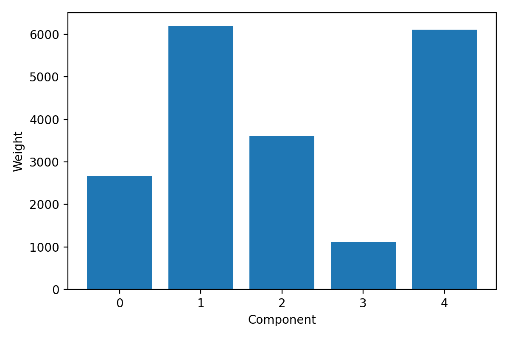
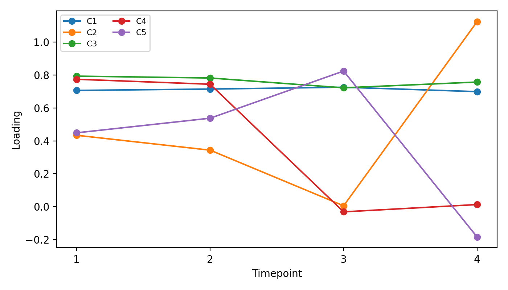

14.1-barnacle
================
GitHub Copilot
2025-01-10

- [1 BACKGROUND](#1-background)
  - [1.1 Analysis Parameters](#11-analysis-parameters)
  - [1.2 Input files](#12-input-files)
  - [1.3 Output files](#13-output-files)
    - [1.3.1 Core outputs](#131-core-outputs)
    - [1.3.2 Factor matrices
      (`barnacle_factors/`)](#132-factor-matrices-barnacle_factors)
    - [1.3.3 Figures (`figures/`)](#133-figures-figures)
- [2 RESULTS](#2-results)
  - [2.1 Analysis Metadata](#21-analysis-metadata)
  - [2.2 Tensor Composition](#22-tensor-composition)
  - [2.3 Component weights](#23-component-weights)
  - [2.4 Sample composition by
    species](#24-sample-composition-by-species)
  - [2.5 Temporal patterns (time
    loadings)](#25-temporal-patterns-time-loadings)
  - [2.6 Top gene loadings](#26-top-gene-loadings)
    - [2.6.1 Component 1 (index 0)](#261-component-1-index-0)
    - [2.6.2 Component 4 (index 3 - highest
      weight)](#262-component-4-index-3---highest-weight)
- [3 VISUALIZATIONS](#3-visualizations)
  - [3.1 Component weights](#31-component-weights)
  - [3.2 Temporal loadings](#32-temporal-loadings)
- [4 SUMMARY](#4-summary)
  - [4.1 Key Findings](#41-key-findings)
  - [4.2 Next Steps](#42-next-steps)

# 1 BACKGROUND

This analysis builds a 3D tensor from normalized per-species expression
matrices and runs Barnacle sparse CP decomposition to identify shared
temporal and species-specific gene expression patterns.

The analysis was performed using the Python CLI tool in
`M-multi-species/scripts/14.1-barnacle/` which:

- Loads normalized expression data for three coral species (*A.
  pulchra*, *P. evermanni*, *P. tuahiniensis*)
- Constructs a 3D tensor: **genes × samples × timepoints**
- Runs sparse CP decomposition using the
  [Barnacle](https://github.com/blasks/barnacle) package
- Extracts factor matrices representing gene loadings, sample loadings,
  and temporal patterns

## 1.1 Analysis Parameters

The decomposition was run with the following parameters:

- **Rank**: 5 components
- **Sparsity penalties**:
  - Gene mode (λ): 0.1
  - Sample mode (λ): 0.1
  - Time mode (λ): 0.05
- **Max iterations**: 1000
- **Convergence tolerance**: 1e-5
- **Random seed**: 42

## 1.2 Input files

Normalized expression matrices from
`M-multi-species/output/13.00-multiomics-barnacle/`:

- `apul_normalized_expression.csv`: *Acropora pulchra* normalized gene
  expression
- `peve_normalized_expression.csv`: *Porites evermanni* normalized gene
  expression
- `ptua_normalized_expression.csv`: *Porites tuahiniensis* normalized
  gene expression

Each CSV contains:

- `group_id` column with ortholog group identifiers
- Sample columns named as `<SAMPLE>.<TP#>` (e.g., `POC.201.TP3`)

## 1.3 Output files

Written to `M-multi-species/output/14.1-barnacle/`:

### 1.3.1 Core outputs

- `multiomics_tensor.npy`: The 3D tensor used for decomposition (NumPy
  array format)

### 1.3.2 Factor matrices (`barnacle_factors/`)

- `gene_factors.csv`: Gene loadings for each component (10,223 genes ×
  5 components)
- `sample_factors.csv`: Sample loadings for each component (30 samples
  × 5 components)
- `time_factors.csv`: Temporal loadings for each component (4
  timepoints × 5 components)
- `component_weights.csv`: Importance weights for each component
- `sample_mapping.csv`: Mapping of sample indices to species and sample
  IDs
- `metadata.json`: Analysis metadata including tensor shape,
  convergence status, and final loss

### 1.3.3 Figures (`figures/`)

- `component_weights.png`: Bar plot of component weights
- `time_loadings.png`: Line plots showing temporal patterns for each
  component

# 2 RESULTS

## 2.1 Analysis Metadata

``` 
Analysis Timestamp: 2025-10-09T05:18:31.520687Z

Tensor Shape (genes × samples × timepoints): 10223 × 30 × 4

Number of Components: 5

Model Converged: FALSE

Final Loss: 850,174.85
```

## 2.2 Tensor Composition

The analysis integrated expression data from:

- **10,223** ortholog groups (genes)
- **30** samples across 3 species
- **4** timepoints (TP1, TP2, TP3, TP4)

## 2.3 Component weights

| Component | Weight    |
|:----------|:----------|
| C1        | 4,198.27  |
| C2        | 5,530.76  |
| C3        | 5,019.11  |
| C4        | 7,829.03  |
| C5        | 793.36    |

Component weights from sparse CP decomposition

The component weights indicate the relative importance of each latent
factor. **Component 4** has the highest weight (7,829.03), suggesting it
captures the most variance in the data, followed by **Component 2**
(5,530.76) and **Component 3** (5,019.11).

## 2.4 Sample composition by species

| Species | n_samples |
|:--------|----------:|
| apul    |        10 |
| peve    |        10 |
| ptua    |        10 |

Number of samples per species in the analysis

## 2.5 Temporal patterns (time loadings)

| Timepoint | C1     | C2    | C3    | C4    | C5     |
|:----------|:-------|:------|:------|:------|:-------|
| TP1       | 0.252  | 0.931 | 1.454 | 1.057 | -0.675 |
| TP2       | 0.603  | 0.923 | 0.568 | 1.050 | -0.576 |
| TP3       | 0.734  | 0.829 | 0.206 | 1.034 | 0.087  |
| TP4       | -0.332 | 0.848 | 2.840 | 1.003 | 0.073  |

Temporal loadings for each component across timepoints

The time factors reveal distinct temporal dynamics:

- **Component 1**: Gradual increase from TP1-TP3, then negative at TP4
- **Component 2**: Stable across all timepoints (~0.9)
- **Component 3**: Sharp increase at TP4 (2.84), dropping from TP1
  (1.45)
- **Component 4**: Relatively stable across all timepoints (~1.0)
- **Component 5**: Shift from negative (TP1-TP2) to positive (TP3-TP4)

## 2.6 Top gene loadings

### 2.6.1 Component 1 (index 0)

| Gene ID   | Loading |
|:----------|--------:|
| OG_00045  |   6.159 |
| OG_00016  |   5.701 |
| OG_00002  |   5.924 |
| OG_00012  |   5.374 |
| OG_00013  |   5.763 |
| OG_00009  |   5.722 |
| OG_00007  |   5.331 |
| OG_00001  |   5.147 |
| OG_00004  |   5.402 |
| OG_00024  |   5.764 |

Top gene loadings for Component 1

### 2.6.2 Component 4 (index 3 - highest weight)

| Gene ID   | Loading |
|:----------|--------:|
| OG_06434  |   7.646 |
| OG_03634  |   6.934 |
| OG_06809  |   7.152 |
| OG_08959  |   6.700 |
| OG_05616  |   7.075 |
| OG_06793  |   6.857 |
| OG_06820  |   6.817 |
| OG_03738  |   6.750 |
| OG_03590  |   6.749 |
| OG_07239  |   6.789 |

Top gene loadings for Component 4 (highest weighted)

# 3 VISUALIZATIONS

## 3.1 Component weights



Figure 1: Component weights bar plot showing Component 4 has the
highest importance (7,829), followed by Components 2 and 3. Component 5
has the lowest weight (793), suggesting it captures less variance in the
dataset.

## 3.2 Temporal loadings



Figure 2: Temporal loading patterns across the four timepoints. Notable
patterns include:

- **C3** (purple): Sharp spike at TP4, suggesting genes specifically
  upregulated at the final timepoint
- **C2** (orange): Stable expression across all timepoints
- **C4** (red): Consistently high stable expression
- **C1** (blue): Gradual increase with reversal at TP4
- **C5** (green): Transition from negative to positive values

# 4 SUMMARY

This Barnacle sparse CP decomposition analysis identified **5 latent
components** that capture temporal and species-specific patterns in
multi-omics gene expression data across three coral species.

## 4.1 Key Findings

1.  **Tensor Composition**: The analysis integrated expression data
    from:
    - 10,223 ortholog groups (genes)
    - 30 samples across 3 species (*A. pulchra*: 10, *P. evermanni*:
      10, *P. tuahiniensis*: 10)
    - 4 timepoints

2.  **Component Importance**: Component 4 has the highest weight
    (7,829), explaining the most variance in the dataset, followed by
    Components 2 (5,531) and 3 (5,019). Component 5 has minimal weight
    (793).

3.  **Temporal Dynamics**: The time loadings reveal distinct patterns:
    - Gradual temporal trends (Component 1)
    - Stable expression (Components 2, 4)
    - Sharp temporal shifts (Component 3 at TP4)
    - Polarity reversal (Component 5 from negative to positive)

4.  **Convergence**: The model did **not fully converge** (final loss:
    850,175), suggesting that:
    - Additional iterations may improve the decomposition
    - The rank (5 components) may need adjustment
    - The sparsity penalties could be tuned

## 4.2 Next Steps

- Investigate biological interpretation of top genes in each component
- Test additional ranks to find optimal decomposition (see
  `15-barnacle` analysis)
- Annotate top genes with functional categories (GO terms, KEGG
  pathways)
- Examine species-specific patterns in the sample loadings
- Consider re-running with adjusted convergence parameters or increased
  iterations
