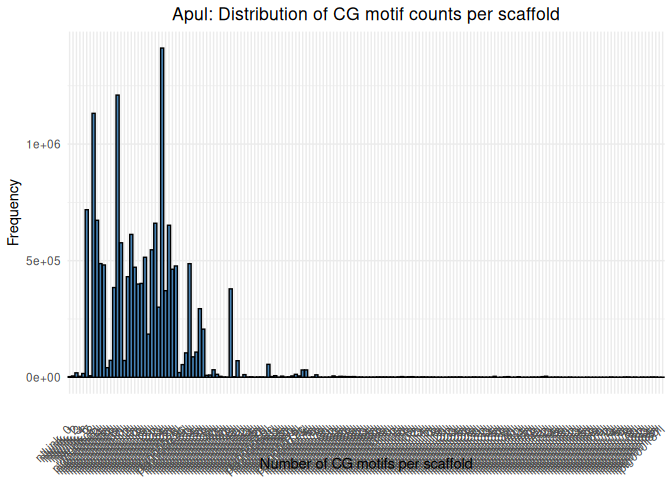
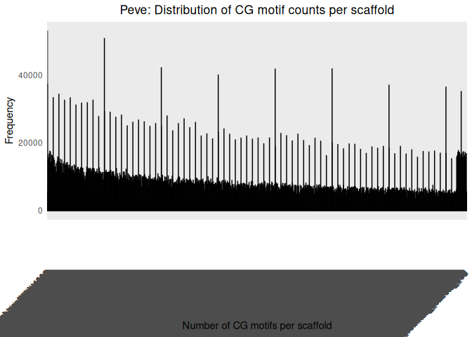
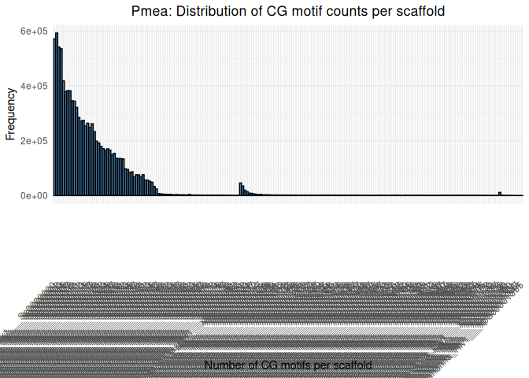

19-CG-motifs
================
Kathleen Durkin
2025-10-24

``` bash
fuzznuc -sequence ../../D-Apul/data/Apulchra-genome.fa -pattern CG -rformat gff -outfile ../output/19-CG-motifs/Apulchra-genome-CGmotifs.gff
```

Summarize \# of motifs in each scaffold

``` bash
awk '!/^#/ {count[$1]++} END {for (scaffold in count) print scaffold, count[scaffold]}' ../output/19-CG-motifs/Apulchra-genome-CGmotifs.gff | sort -k1,1 > ../output/19-CG-motifs/Apul_scaffold_motif_counts.txt
```

``` r
# Read counts file
motif_counts <- read.table("../output/19-CG-motifs/Apul_scaffold_motif_counts.txt", header = FALSE, col.names = c("scaffold", "count"))

ggplot(motif_counts, aes(x = scaffold, y = count)) +
  geom_col(binwidth = 100, fill = "steelblue", color = "black") +
  labs(
    title = "Apul: Distribution of CG motif counts per scaffold",
    x = "Number of CG motifs per scaffold",
    y = "Frequency"
  ) +
  theme_minimal() +
  theme(
    axis.text.x = element_text(angle = 45, vjust = 0.5, hjust = 1),
    plot.title = element_text(hjust = 0.5)
  )
```

<!-- -->

Note that the above counts are not normalized for scaffold length, so
the longer scaffolds will naturally contain more CG motifs

``` bash
fuzznuc -sequence ../../E-Peve/data/Porites_evermanni_v1.fa -pattern CG -rformat gff -outfile ../output/19-CG-motifs/Porites_evermanni_v1_CGmotifs.gff
```

Summarize \# of motifs in each scaffold

``` bash
awk '!/^#/ {count[$1]++} END {for (scaffold in count) print scaffold, count[scaffold]}' ../output/19-CG-motifs/Porites_evermanni_v1_CGmotifs.gff | sort -k1,1 > ../output/19-CG-motifs/Peve_scaffold_motif_counts.txt
```

``` r
# Read counts file
motif_counts <- read.table("../output/19-CG-motifs/Peve_scaffold_motif_counts.txt", header = FALSE, col.names = c("scaffold", "count"))

ggplot(motif_counts, aes(x = scaffold, y = count)) +
  geom_col(binwidth = 100, fill = "steelblue", color = "black") +
  labs(
    title = "Peve: Distribution of CG motif counts per scaffold",
    x = "Number of CG motifs per scaffold",
    y = "Frequency"
  ) +
  theme_minimal() +
  theme(
    axis.text.x = element_text(angle = 45, vjust = 0.5, hjust = 1),
    plot.title = element_text(hjust = 0.5)
  )
```

<!-- -->

``` bash
fuzznuc -sequence ../../F-Ptua/data/Pocillopora_meandrina_HIv1.assembly.fa -pattern CG -rformat gff -outfile ../output/19-CG-motifs/Pocillopora_meandrina_HIv1.assembly_CGmotifs.gff
```

Summarize \# of motifs in each scaffold

``` bash
awk '!/^#/ {count[$1]++} END {for (scaffold in count) print scaffold, count[scaffold]}' ../output/19-CG-motifs/Pocillopora_meandrina_HIv1.assembly_CGmotifs.gff | sort -k1,1 > ../output/19-CG-motifs/Pmea_scaffold_motif_counts.txt
```

``` r
# Read counts file
motif_counts <- read.table("../output/19-CG-motifs/Pmea_scaffold_motif_counts.txt", header = FALSE, col.names = c("scaffold", "count"))

ggplot(motif_counts, aes(x = scaffold, y = count)) +
  geom_col(binwidth = 100, fill = "steelblue", color = "black") +
  labs(
    title = "Pmea: Distribution of CG motif counts per scaffold",
    x = "Number of CG motifs per scaffold",
    y = "Frequency"
  ) +
  theme_minimal() +
  theme(
    axis.text.x = element_text(angle = 45, vjust = 0.5, hjust = 1),
    plot.title = element_text(hjust = 0.5)
  )
```

<!-- -->
